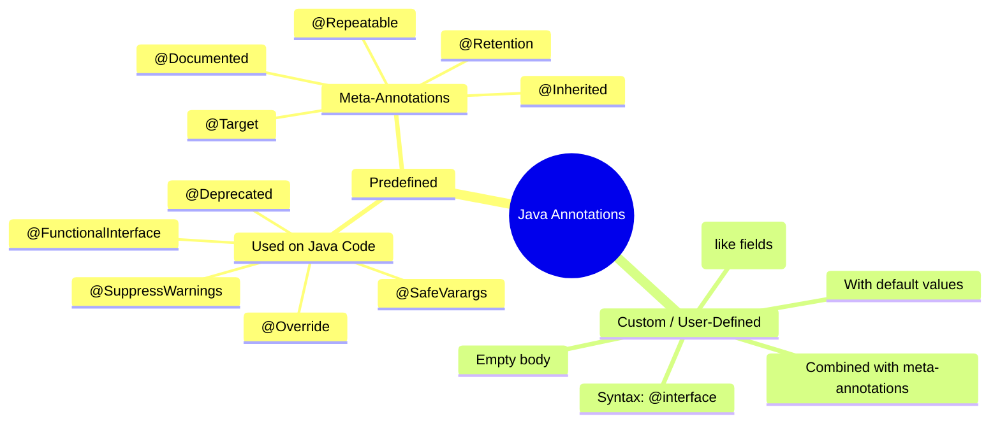
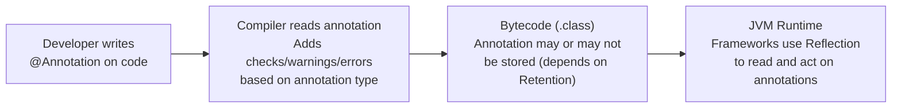
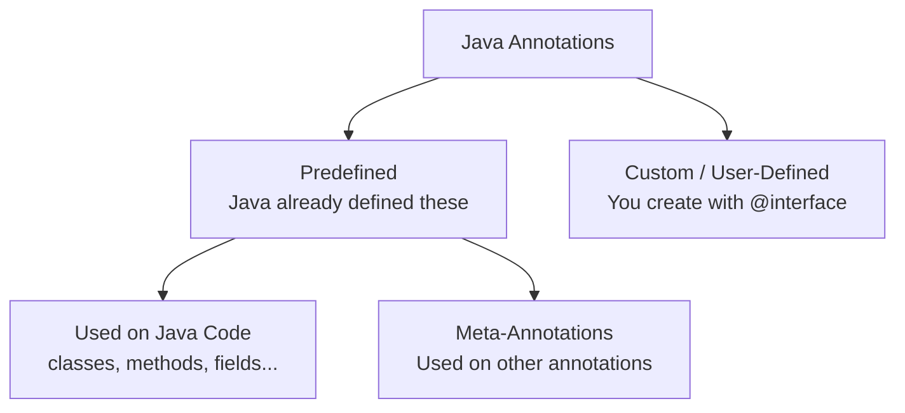
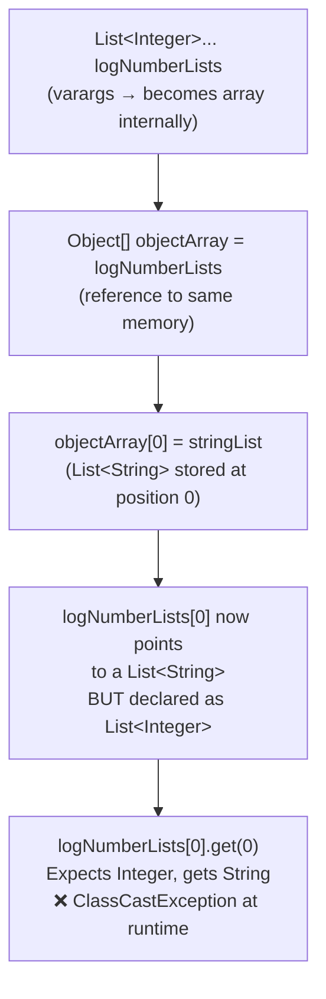
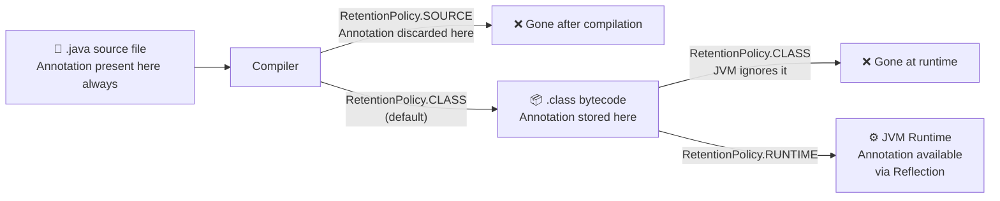
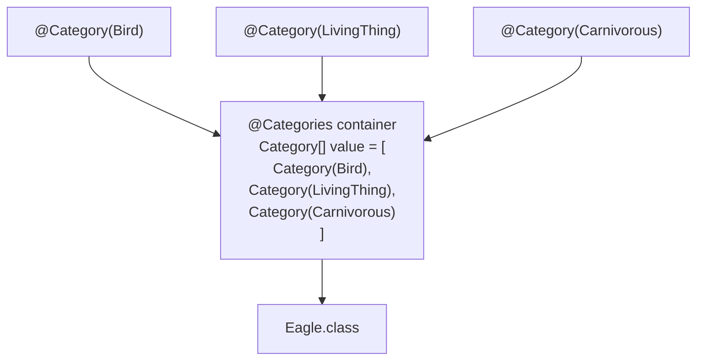

# 📚 Java Annotations — Complete Study Guide

> **Series:** Java Core Concepts | **Chapter:** Annotations  
> **Audience:** Intermediate Java Developers  
> **Prerequisites:** Java Reflection (required — annotations are accessed via reflection at runtime)  
> **Coverage:** What Annotations Are, Predefined Annotations, Meta-Annotations, Custom Annotations, Heap Pollution, Repeatable Annotations

---

## 🗂️ Table of Contents

1. [What is an Annotation?](#1-what-is-an-annotation)
2. [Categories of Annotations](#2-categories-of-annotations)
3. [Predefined Annotations — Used on Java Code](#3-predefined-annotations--used-on-java-code)
   - [`@Deprecated`](#deprecated)
   - [`@Override`](#override)
   - [`@SuppressWarnings`](#suppresswarnings)
   - [`@FunctionalInterface`](#functionalinterface)
   - [`@SafeVarargs`](#safevarargs)
4. [Heap Pollution — Deep Dive](#4-heap-pollution--deep-dive)
5. [Meta-Annotations — Annotations on Annotations](#5-meta-annotations--annotations-on-annotations)
   - [`@Target`](#target)
   - [`@Retention`](#retention)
   - [`@Documented`](#documented)
   - [`@Inherited`](#inherited)
   - [`@Repeatable`](#repeatable)
6. [Custom (User-Defined) Annotations](#6-custom-user-defined-annotations)
7. [Accessing Annotations via Reflection](#7-accessing-annotations-via-reflection)
8. [Interview Question Bank](#8-interview-question-bank)
9. [Master Summary](#9-master-summary)

---

## Annotation Taxonomy — Mind Map



---

# 1. What is an Annotation?

## Definition

> An **annotation** is a form of **metadata** added to Java code — classes, methods, fields, parameters, etc. — that provides information to the **compiler**, **JVM**, or **frameworks** at compile time or runtime.

---

## Key Properties

| Property | Detail |
|----------|--------|
| **Syntax** | Always preceded by `@` (at the rate) symbol |
| **Usage** | Optional — code works without annotations; they add information, not logic |
| **Applies to** | Classes, interfaces, methods, fields, parameters, constructors, local variables, packages, other annotations |
| **Accessed via** | Reflection at runtime (when `RetentionPolicy.RUNTIME` is used) |
| **Relationship to metadata** | Annotations ARE metadata — data about the code |

---

## Real-World Analogy

> Think of annotations like **sticky notes** on a physical document. The document (Java code) works without them — but the sticky notes provide extra instructions to whoever processes the document (compiler, JVM, or frameworks).

---

## A Familiar Example — `@Override`

```java
interface Bird {
    void canFly();
}

class Eagle implements Bird {

    @Override               // This is an annotation
    public void canFly() {
        System.out.println("Eagle flies");
    }
}
```

- `@Override` is metadata telling the **compiler**: "Verify that this method actually overrides something from a parent class or interface."
- If no matching method exists in the parent, the compiler throws an error.
- If you remove `@Override`, the code still compiles — but you lose the safety check.

---

## How Annotations Work Internally



---

# 2. Categories of Annotations



| Category | Sub-category | Examples |
|----------|-------------|---------|
| **Predefined** | Used on Java code | `@Deprecated`, `@Override`, `@SuppressWarnings`, `@FunctionalInterface`, `@SafeVarargs` |
| **Predefined** | Meta-annotations | `@Target`, `@Retention`, `@Documented`, `@Inherited`, `@Repeatable` |
| **Custom** | User-defined | Any `@interface` you create yourself |

---

# 3. Predefined Annotations — Used on Java Code

---

## `@Deprecated`

### What It Does
Marks a class, method, constructor, field, or package as **deprecated** — meaning it is no longer recommended for use, no further development will happen on it, and an alternative may exist.

### Effect
Anyone who uses a deprecated element gets a **compiler warning**.

### Where It Can Be Applied
Constructor, field, local variable, method, package, parameter, type (class/interface/enum).

### Code Example

```java
class Mobile {

    @Deprecated
    void oldSendMessage() {
        System.out.println("Old SMS method");
    }

    void newSendMessage() {
        System.out.println("New method — use this instead");
    }
}

public class Main {
    public static void main(String[] args) {
        Mobile m = new Mobile();
        m.oldSendMessage(); // ⚠️ Compiler warning: 'oldSendMessage()' is deprecated
        m.newSendMessage(); // ✅ No warning
    }
}
```

**Compiler Warning:**
```
warning: [deprecation] oldSendMessage() in Mobile has been deprecated
```

### Best Practice
When deprecating, add a Javadoc comment explaining the alternative:

```java
/**
 * @deprecated Use {@link #newSendMessage()} instead.
 */
@Deprecated
void oldSendMessage() { ... }
```

---

## `@Override`

### What It Does
Tells the compiler: *"Verify that this method is actually overriding a method from a parent class or interface."* If no such method exists in the parent, the compiler throws an **error**.

### Effect
Compile-time safety check — prevents silent bugs where you think you're overriding but are actually creating a new method (e.g., due to a typo in the method name).

### Where It Can Be Applied
Methods only.

### Code Example

```java
interface Bird {
    void canFly();
}

class Eagle implements Bird {
    @Override
    public void canFly() {   // ✅ Correct override
        System.out.println("Eagle flies");
    }
}

class Sparrow implements Bird {
    @Override
    public void canFly1() { // ❌ Compile error: method does not override or implement a method
        System.out.println("Sparrow flies");
    }
}
```

> [!TIP]
> Always use `@Override` when you intend to override a method. It catches refactoring mistakes where a parent method signature changes and the child method silently stops being an override.

---

## `@SuppressWarnings`

### What It Does
Instructs the compiler to **ignore specific warnings** for the annotated element.

### Where It Can Be Applied
Field, method, parameter, constructor, local variable, type.

### Common Warning Keys

| Warning Key | Suppresses |
|-------------|-----------|
| `"deprecation"` | Warnings about using deprecated code |
| `"unused"` | Warnings about unused variables, methods |
| `"unchecked"` | Warnings about unchecked type operations |
| `"all"` | All compiler warnings |
| `"rawtypes"` | Warnings about using raw generic types |

### Code Example

```java
class Mobile {
    @Deprecated
    void oldMethod() { }
}

public class Main {

    // Suppress warning for this specific method
    @SuppressWarnings("deprecation")
    void useOldMethod() {
        Mobile m = new Mobile();
        m.oldMethod(); // No warning shown
    }

    // Suppress ALL warnings for this class
    @SuppressWarnings("all")
    void anotherMethod() {
        Mobile m = new Mobile();
        m.oldMethod(); // No warning shown
        int unused = 5; // No "unused" warning either
    }
}
```

> [!WARNING]
> Use `@SuppressWarnings` carefully. Warnings exist for good reasons — suppressing them blindly (especially `"all"`) can hide real bugs. For example, suppressing a warning about dividing by zero could cause a runtime `ArithmeticException` that you'd have been warned about.

### Applied at Class Level vs Method Level

```java
// Method level — suppresses only for this method
@SuppressWarnings("deprecation")
void specificMethod() { ... }

// Class level — suppresses for ALL methods in the class
@SuppressWarnings("deprecation")
public class MyClass { ... }
```

---

## `@FunctionalInterface`

### What It Does
Marks an interface as a **functional interface** — one that has exactly one abstract method. The compiler enforces this constraint: if you add a second abstract method, it is a compile error.

### Where It Can Be Applied
Type (interface, class, enum) — practically only meaningful on interfaces.

### Code Example

```java
@FunctionalInterface
interface MyFunction {
    void execute(); // One abstract method — OK

    // void anotherMethod(); // ❌ Compile error: Multiple non-overriding abstract methods
}
```

```java
// Without @FunctionalInterface — no compile-time enforcement
interface MyFunction {
    void execute();
    void another(); // ✅ Compiles — but is no longer a functional interface
}

// With @FunctionalInterface — compiler enforces the single-abstract-method rule
@FunctionalInterface
interface MyFunction {
    void execute();
    void another(); // ❌ Compile error — @FunctionalInterface constraint violated
}
```

> [!NOTE]
> Default and static methods do NOT count toward the "one abstract method" limit. A `@FunctionalInterface` can have multiple default/static methods as long as it has exactly one abstract method.

---

## `@SafeVarargs`

### What It Does
Suppresses the **heap pollution warning** that appears when a method or constructor accepts **variable arguments** (`varargs`) of a generic type.

### Where It Can Be Applied
Methods and constructors that accept varargs. The method must be either:
- `static`
- `final`
- `private` (Java 9+)

### Why These Restrictions?
Because these modifiers prevent the method from being overridden. If a parent method has `@SafeVarargs` and a child overrides it, the child might miss the annotation — losing the safety guarantee. Methods that can't be overridden don't have this problem.

### Code Example

```java
class Example {

    // Without @SafeVarargs — compiler shows heap pollution warning
    @SafeVarargs
    public static void printValues(List<Integer>... lists) {
        for (List<Integer> list : lists) {
            System.out.println(list);
        }
    }
}
```

Without `@SafeVarargs`:
```
warning: Possible heap pollution from parameterized vararg type List<Integer>
```

With `@SafeVarargs`: The warning is suppressed. Use only when you are certain the method does not actually cause heap pollution.

> [!IMPORTANT]
> Understanding `@SafeVarargs` requires understanding **heap pollution**, which is covered in depth in [Section 4](#4-heap-pollution--deep-dive).

---

# 4. Heap Pollution — Deep Dive

## What is Heap Pollution?

> **Heap pollution** occurs when a variable of a **parameterized type** (like `List<Integer>`) holds a reference to an object that is **not of that type** (like a `List<String>`).

### Normal (Non-Polluted) Heap

```
Stack                        Heap
────                         ────
List<Integer> myList  ──►   [1, 2, 3, 4, 5]   ← correct: Integer values
```

### Polluted Heap

```
Stack                        Heap
────                         ────
List<Integer> myList  ──►   ["hello", "world"]  ← polluted: String values in Integer list!
```

---

## Why Does Varargs Cause Heap Pollution Risk?

Variable arguments (`T... args`) are **internally converted to an array** by Java. Arrays and generics don't mix perfectly — and through the `Object[]` loophole, you can accidentally store wrong types.

### Step-by-Step Example

```java
import java.util.*;

class Example {

    // Accepts variable number of List<Integer> arguments
    static void printLogValues(List<Integer>... logNumberLists) {

        // Step 1: Store varargs in Object array (this is the dangerous step)
        Object[] objectArray = logNumberLists;  // ⚠️ Possible heap pollution here

        // Step 2: Create a List<String>
        List<String> stringList = new ArrayList<>();
        stringList.add("hello");
        stringList.add("world");

        // Step 3: HEAP POLLUTION — putting a List<String> where List<Integer> is expected
        objectArray[0] = stringList; // No compile error here!

        // Step 4: This will cause ClassCastException at runtime
        Integer firstValue = logNumberLists[0].get(0); // ❌ ClassCastException!
    }

    public static void main(String[] args) {
        List<Integer> listA = Arrays.asList(1, 2, 3);
        printLogValues(listA); // ❌ ClassCastException at runtime
    }
}
```

### What Happened?



---

## The Warning and How to Suppress It

Whenever you pass a generic type as varargs, the compiler warns:
```
Possible heap pollution from parameterized vararg type List<Integer>
```

If you have verified your code **does not actually cause heap pollution**, suppress with:

```java
@SafeVarargs
public static void printLogValues(List<Integer>... logNumberLists) {
    // Safe usage — no Object[] tricks
    for (List<Integer> list : logNumberLists) {
        System.out.println(list);
    }
}
```

> [!CAUTION]
> `@SafeVarargs` only suppresses the **warning** — it does not prevent heap pollution from actually occurring. Only use it when you are genuinely certain your varargs usage is safe.

---

# 5. Meta-Annotations — Annotations on Annotations

Meta-annotations are annotations applied **on top of other annotations** to define their behavior: where they can be used, how long they live, whether they appear in docs, etc.

---

## `@Target`

### What It Does
Specifies **where** an annotation can be applied — methods only, fields only, classes only, etc.

### Element Types

| `ElementType` | Where the annotation can be applied |
|---------------|-------------------------------------|
| `TYPE` | Class, interface, enum |
| `FIELD` | Instance variable / field |
| `METHOD` | Method |
| `PARAMETER` | Method parameter |
| `CONSTRUCTOR` | Constructor |
| `LOCAL_VARIABLE` | Local variable inside a method |
| `ANNOTATION_TYPE` | Another annotation (makes it a meta-annotation) |
| `PACKAGE` | Package |
| `TYPE_PARAMETER` | Generic type parameter (e.g., `T` in `class Foo<T>`) |
| `TYPE_USE` | Any use of a type (Java 8+) — e.g., before `String` in `List<String>` |

### How `@Override` Uses `@Target`

```java
// How @Override is defined inside Java (simplified):
@Target(ElementType.METHOD)       // Can only be used on methods
@Retention(RetentionPolicy.SOURCE) // Not stored in .class file
public @interface Override {
}
```

### How `@SafeVarargs` Uses `@Target`

```java
// How @SafeVarargs is defined (simplified):
@Target({ElementType.CONSTRUCTOR, ElementType.METHOD}) // Constructor or Method only
@Retention(RetentionPolicy.RUNTIME)
public @interface SafeVarargs {
}
```

### `ANNOTATION_TYPE` — Making a Meta-Annotation

If you add `ElementType.ANNOTATION_TYPE` to your annotation's `@Target`, your annotation can be applied on other annotations:

```java
@Target(ElementType.ANNOTATION_TYPE) // Can be used ON annotations
public @interface MyMetaAnnotation {
}

@MyMetaAnnotation  // Applying it on another annotation
public @interface SomeAnnotation {
}
```

---

## `@Retention`

### What It Does
Specifies **how long** (at what stage of the Java lifecycle) an annotation is retained/available.

### Retention Policies

| `RetentionPolicy` | Where annotation lives | Accessible via Reflection? |
|-------------------|----------------------|---------------------------|
| `SOURCE` | Only in `.java` source — discarded by compiler | ❌ No |
| `CLASS` | In `.java` and `.class` files — ignored by JVM at runtime | ❌ No |
| `RUNTIME` | In `.java`, `.class`, and available to JVM at runtime | ✅ Yes |

### Lifecycle Diagram



### `@Override` Uses `SOURCE` — Why?

```java
@Retention(RetentionPolicy.SOURCE) // Discarded after compilation
public @interface Override { }
```

`@Override` is only needed during compilation to verify the method signature. Once compiled, the bytecode is just a regular method — the annotation serves no runtime purpose, so discarding it saves space.

### Code Example — Runtime Retention

```java
import java.lang.annotation.*;

// Custom annotation with RUNTIME retention
@Retention(RetentionPolicy.RUNTIME)
@Target(ElementType.TYPE)
public @interface MyAnnotation { }

@MyAnnotation
class TestClass { }

public class Main {
    public static void main(String[] args) {

        // With RUNTIME retention — annotation is accessible
        MyAnnotation annotation = TestClass.class.getAnnotation(MyAnnotation.class);
        System.out.println(annotation); // @MyAnnotation()

        // Without RUNTIME retention — annotation is NOT accessible
        // Returns null
    }
}
```

**Output (with `RUNTIME`):**
```
@MyAnnotation()
```

**Output (without `RUNTIME` — e.g., `CLASS` or `SOURCE`):**
```
null
```

---

## `@Documented`

### What It Does
By default, annotations are **not included** in the generated Javadoc. `@Documented` changes this — any annotation marked with `@Documented` will appear in the Javadoc of the elements it annotates.

### Comparison

```java
// @Override does NOT have @Documented
// → @Override does not appear in Javadoc of overriding methods

// @SafeVarargs HAS @Documented
// → @SafeVarargs appears in Javadoc of annotated methods
```

### When to Use
Use `@Documented` on annotations that are part of your public API and should be visible to users of your library/framework through the generated documentation.

---

## `@Inherited`

### What It Does
By default, annotations applied to a parent class are **not available to child classes**. `@Inherited` changes this — the annotation propagates to subclasses automatically.

### Default Behavior (Without `@Inherited`)

```java
@Retention(RetentionPolicy.RUNTIME)
@Target(ElementType.TYPE)
public @interface MyAnnotation { } // No @Inherited

@MyAnnotation
class Parent { }

class Child extends Parent { } // Does NOT have @MyAnnotation

public class Main {
    public static void main(String[] args) {
        MyAnnotation a = Child.class.getAnnotation(MyAnnotation.class);
        System.out.println(a); // null — not inherited
    }
}
```

### With `@Inherited`

```java
@Inherited                          // Added here
@Retention(RetentionPolicy.RUNTIME)
@Target(ElementType.TYPE)
public @interface MyAnnotation { }

@MyAnnotation
class Parent { }

class Child extends Parent { } // NOW has @MyAnnotation through inheritance

public class Main {
    public static void main(String[] args) {
        MyAnnotation a = Child.class.getAnnotation(MyAnnotation.class);
        System.out.println(a); // @MyAnnotation() — inherited!
    }
}
```

### `@Inherited` Behavior Summary

| Scenario | Annotation on Child? |
|----------|---------------------|
| No `@Inherited` on annotation | ❌ Child does not get it |
| `@Inherited` on annotation, annotation on Parent | ✅ Child gets it automatically |
| `@Inherited` but annotation directly on Child too | ✅ Child's own annotation takes precedence |

> [!NOTE]
> `@Inherited` only works with **class inheritance** (`extends`). It does NOT propagate through interface implementation.

---

## `@Repeatable`

### What It Does
By default, you **cannot apply the same annotation twice** to the same element. `@Repeatable` (introduced in Java 8) removes this restriction, allowing an annotation to be used multiple times on the same target.

### The Problem Without `@Repeatable`

```java
@Category(name = "Bird")
@Category(name = "LivingThing") // ❌ Compile error — duplicate annotation
class Eagle { }
```

### Two-Step Solution

**Step 1:** Mark the annotation as repeatable and specify a container:

```java
@Repeatable(Categories.class)  // Step 1 — mark as repeatable; name the container
@Retention(RetentionPolicy.RUNTIME)
@Target(ElementType.TYPE)
public @interface Category {
    String name();  // Annotation member
}
```

**Step 2:** Create the container annotation (holds an array of the repeatable annotation):

```java
@Retention(RetentionPolicy.RUNTIME)
@Target(ElementType.TYPE)
public @interface Categories {
    Category[] value(); // Must be named "value" and be an array of the repeatable annotation
}
```

**Usage:**

```java
@Category(name = "Bird")
@Category(name = "LivingThing")
@Category(name = "Carnivorous")
class Eagle { }  // ✅ Now valid — @Repeatable allows this
```

**Accessing Repeated Annotations via Reflection:**

```java
public class Main {
    public static void main(String[] args) {
        Category[] categories = Eagle.class.getAnnotationsByType(Category.class);

        for (Category cat : categories) {
            System.out.println(cat.name());
        }
    }
}
```

**Output:**
```
Bird
LivingThing
Carnivorous
```

### How It Works Internally

When you apply `@Category` three times, the compiler wraps them all into the container:

```java
// What you write:
@Category(name = "Bird")
@Category(name = "LivingThing")
@Category(name = "Carnivorous")
class Eagle { }

// What the compiler actually stores:
@Categories({
    @Category(name = "Bird"),
    @Category(name = "LivingThing"),
    @Category(name = "Carnivorous")
})
class Eagle { }
```

### Diagram — Container Wrapping



---

## Meta-Annotations — Summary Table

| Meta-Annotation | Purpose | Target |
|----------------|---------|--------|
| `@Target` | Defines WHERE the annotation can be applied | Annotations |
| `@Retention` | Defines HOW LONG the annotation is retained | Annotations |
| `@Documented` | Makes the annotation appear in Javadoc | Annotations |
| `@Inherited` | Allows annotation to propagate to subclasses | Annotations on classes |
| `@Repeatable` | Allows same annotation to be used multiple times | Annotations |

---

# 6. Custom (User-Defined) Annotations

## Creating an Annotation

Annotations are created using the `@interface` keyword (not to be confused with a regular `interface`):

```java
public @interface MyAnnotation {
    // annotation members go here
}
```

---

## Form 1 — Empty Annotation (Marker Annotation)

No members — just used as a flag/marker:

```java
@Retention(RetentionPolicy.RUNTIME)
@Target(ElementType.TYPE)
public @interface MyAnnotation {
    // No members — just a marker
}

@MyAnnotation
class TestClass { }
```

---

## Form 2 — Annotation with Members

Members look like methods but have no parameters and no body. They define the data the annotation can carry:

```java
@Retention(RetentionPolicy.RUNTIME)
@Target(ElementType.TYPE)
public @interface MyCustomAnnotation {
    String name();    // String member
    int version();    // int member
}

// Usage — must provide values for all members without defaults
@MyCustomAnnotation(name = "TestClass", version = 1)
class TestClass { }
```

### Annotation Member Rules

| Rule | Detail |
|------|--------|
| Parameters | ❌ Members cannot have parameters |
| Body | ❌ Members cannot have a body |
| Return type | Only: primitive types, `String`, `Class`, `enum`, another annotation, or **arrays** of these |
| Custom objects | ❌ Cannot use custom class objects as return type |
| Naming | Conventionally used as `value()` for the single most important member |

### Valid Member Types

```java
public @interface Example {
    int count();               // ✅ primitive
    String label();            // ✅ String
    Class<?> type();           // ✅ Class
    MyEnum status();           // ✅ enum
    OtherAnnotation meta();    // ✅ another annotation
    int[] numbers();           // ✅ array of primitive
    String[] tags();           // ✅ array of String
    Class<?>[] types();        // ✅ array of Class

    // Object custom(); ❌ Cannot use custom class
}
```

---

## Form 3 — Annotation with Default Values

Members can have default values using the `default` keyword:

```java
@Retention(RetentionPolicy.RUNTIME)
@Target(ElementType.TYPE)
public @interface MyAnnotation {
    String name() default "Hello"; // default value
    int version() default 1;
}

// Usage — can omit members that have defaults
@MyAnnotation                                    // ✅ name="Hello", version=1
class ClassA { }

@MyAnnotation(name = "SJ")                      // ✅ name="SJ", version=1
class ClassB { }

@MyAnnotation(name = "SJ", version = 2)         // ✅ name="SJ", version=2
class ClassC { }
```

---

## Complete Custom Annotation Example

```java
import java.lang.annotation.*;

// Step 1 — Create the annotation
@Retention(RetentionPolicy.RUNTIME)
@Target({ElementType.TYPE, ElementType.METHOD})
@Documented
public @interface ApiInfo {
    String author() default "Unknown";
    String version() default "1.0";
    String description();           // No default — must always be provided
    boolean deprecated() default false;
}

// Step 2 — Use it
@ApiInfo(
    author = "Shreyansh",
    version = "2.0",
    description = "Main service class for user management"
)
public class UserService {

    @ApiInfo(
        description = "Fetches user by ID",
        deprecated = true
    )
    public void getUserById(int id) { }
}
```

---

# 7. Accessing Annotations via Reflection

## Overview

Annotations with `RetentionPolicy.RUNTIME` can be read at runtime using Java's Reflection API.

> [!NOTE]
> **Reflection prerequisite:** If you haven't studied Java Reflection, review that topic first. Annotations accessed at runtime depend entirely on the reflection API.

---

## Key Reflection Methods for Annotations

| Method | What it does |
|--------|-------------|
| `clazz.getAnnotation(AnnotationType.class)` | Returns the annotation of the given type if present; `null` otherwise |
| `clazz.getAnnotations()` | Returns all annotations on the element |
| `clazz.getDeclaredAnnotations()` | Returns all annotations directly on the element (excluding inherited) |
| `clazz.getAnnotationsByType(AnnotationType.class)` | Returns array — useful for `@Repeatable` annotations |
| `clazz.isAnnotationPresent(AnnotationType.class)` | Returns `true` if the annotation is present |

---

## Code Example — Reading a Custom Annotation

```java
import java.lang.annotation.*;

@Retention(RetentionPolicy.RUNTIME)
@Target(ElementType.TYPE)
@interface MyAnnotation {
    String name() default "default";
}

@MyAnnotation(name = "TestClass")
class TestClass { }

public class Main {
    public static void main(String[] args) {
        // Get the Class object
        Class<?> clazz = new TestClass().getClass();

        // Check if annotation is present
        if (clazz.isAnnotationPresent(MyAnnotation.class)) {
            // Get the annotation
            MyAnnotation annotation = clazz.getAnnotation(MyAnnotation.class);
            System.out.println("Annotation found: " + annotation);
            System.out.println("name = " + annotation.name());
        } else {
            System.out.println("Annotation not found");
        }
    }
}
```

**Output:**
```
Annotation found: @MyAnnotation(name="TestClass")
name = TestClass
```

---

## What Happens Without `RUNTIME` Retention

```java
@Retention(RetentionPolicy.CLASS) // or SOURCE — NOT RUNTIME
@Target(ElementType.TYPE)
@interface MyAnnotation { }

@MyAnnotation
class TestClass { }

public class Main {
    public static void main(String[] args) {
        MyAnnotation a = TestClass.class.getAnnotation(MyAnnotation.class);
        System.out.println(a); // null — annotation not available at runtime
    }
}
```

**Output:**
```
null
```

---

## Reflection + Repeatable Annotations

```java
Category[] categories = Eagle.class.getAnnotationsByType(Category.class);
// Returns all @Category annotations applied to Eagle
```

Use `getAnnotationsByType()` (not `getAnnotation()`) for repeatable annotations, since there may be multiple instances.

---

# 8. Interview Question Bank

## Annotation Basics

| Question | Key Answer |
|----------|-----------|
| What is an annotation in Java? | Metadata added to Java code using `@`; optional; used by compiler/JVM/frameworks for processing |
| How do you denote an annotation? | Always starts with `@` — e.g., `@Override`, `@Deprecated` |
| How are annotations accessed at runtime? | Via Java Reflection API when `RetentionPolicy.RUNTIME` is set |
| Are annotations mandatory? | No — they're optional metadata; removing them doesn't break code |
| Where can annotations be applied? | Classes, methods, fields, parameters, constructors, local variables, packages, and other annotations |

## Predefined Annotations

| Question | Key Answer |
|----------|-----------|
| What does `@Deprecated` do? | Marks element as outdated; compiler shows warning when used |
| What does `@Override` do? | Tells compiler to verify the method actually overrides a parent method; compile error if not |
| What does `@SuppressWarnings` do? | Suppresses specific compiler warnings; use carefully as warnings may prevent bugs |
| What does `@FunctionalInterface` do? | Enforces that interface has exactly one abstract method; compile error if more are added |
| What does `@SafeVarargs` do? | Suppresses heap pollution warning for varargs methods; only on `static`/`final`/`private` methods |

## Heap Pollution

| Question | Key Answer |
|----------|-----------|
| What is heap pollution? | When a variable of parameterized type (e.g., `List<Integer>`) holds reference to wrong type object (e.g., `List<String>`) |
| What causes heap pollution with varargs? | Varargs become `Object[]` internally; allows storing wrong types; leads to `ClassCastException` at runtime |
| How to suppress heap pollution warning? | `@SafeVarargs` on a `static`, `final`, or `private` method that accepts varargs |

## Meta-Annotations

| Question | Key Answer |
|----------|-----------|
| What is a meta-annotation? | An annotation applied on another annotation |
| What does `@Target` do? | Specifies where an annotation can be applied (method, field, type, etc.) |
| What does `@Retention` do? | Specifies how long the annotation is retained: `SOURCE`, `CLASS`, or `RUNTIME` |
| What is the difference between `RetentionPolicy.CLASS` and `RUNTIME`? | `CLASS` is in bytecode but ignored by JVM; `RUNTIME` is in bytecode AND available via reflection |
| Why does `@Override` use `RetentionPolicy.SOURCE`? | It's only needed at compile time; no need to store in bytecode |
| What does `@Documented` do? | Makes annotation appear in Javadoc; by default annotations are excluded |
| What does `@Inherited` do? | Makes annotation on parent class propagate to subclasses; off by default |
| What does `@Repeatable` do? | Allows the same annotation to be applied multiple times to one element (Java 8+) |
| How do you implement `@Repeatable`? | Two steps: (1) add `@Repeatable(ContainerClass.class)` to annotation, (2) create container annotation with `AnnotationType[] value()` |

## Custom Annotations

| Question | Key Answer |
|----------|-----------|
| How do you create a custom annotation? | `public @interface AnnotationName { }` — use `@interface` keyword |
| What types can annotation members have? | Primitives, String, Class, enum, another annotation, or arrays of these |
| Can annotation members have parameters? | No — they have no parameters and no body |
| How do you add a default value to an annotation member? | `String name() default "hello";` |
| What is a marker annotation? | An annotation with no members — used just as a flag |

---

# 9. Master Summary

## Quick Revision Bullets

**What Annotations Are:**
- ✅ **Annotation** = metadata added to Java code using `@` symbol
- ✅ Optional — does not change program logic directly; provides information to compiler/JVM/frameworks
- ✅ Can be applied to: classes, methods, fields, parameters, constructors, local variables, packages, and other annotations
- ✅ Accessed at runtime via **Reflection** — only if `RetentionPolicy.RUNTIME` is used

**Predefined Annotations (on Java code):**
- ✅ `@Deprecated` — marks element as outdated; compiler warning when used
- ✅ `@Override` — compile-time check that method actually overrides a parent method; only on methods
- ✅ `@SuppressWarnings("key")` — suppresses specific compiler warnings; use carefully
- ✅ `@FunctionalInterface` — enforces exactly one abstract method; compile error if violated
- ✅ `@SafeVarargs` — suppresses heap pollution warning on varargs methods; only on `static`/`final`/`private` methods (Java 9+: also `private`)

**Heap Pollution:**
- ✅ **Heap pollution** = variable of parameterized type holds reference to wrong type (e.g., `List<Integer>` holds `List<String>`)
- ✅ Caused by the `Object[]` loophole when varargs of generic type are used
- ✅ Results in `ClassCastException` at runtime
- ✅ `@SafeVarargs` suppresses the warning — use only when you've verified no actual pollution occurs

**Meta-Annotations:**
- ✅ `@Target(ElementType.X)` — restricts WHERE annotation can be applied
- ✅ `@Retention(RetentionPolicy.X)` — controls HOW LONG annotation lives: `SOURCE` → `CLASS` → `RUNTIME`
- ✅ Only `RUNTIME` retention allows reflection-based access
- ✅ `@Documented` — includes annotation in Javadoc (excluded by default)
- ✅ `@Inherited` — propagates annotation from parent class to subclasses (not via interface implementation)
- ✅ `@Repeatable` (Java 8+) — allows same annotation multiple times; requires a container annotation with `AnnotationType[] value()`

**Custom Annotations:**
- ✅ Created with `public @interface AnnotationName { }`
- ✅ Members: look like methods, no parameters, no body; return type restricted to primitives/String/Class/enum/annotation/arrays of these
- ✅ Default values: `String name() default "hello";`
- ✅ Combine with meta-annotations (`@Target`, `@Retention`) to control usage and lifetime
- ✅ Access at runtime via `clazz.getAnnotation(Type.class)` or `getAnnotationsByType()` for repeatable ones

---

> [!TIP]
> **Coming up next:**
> - **Functional Interfaces & Lambda Expressions** — builds directly on `@FunctionalInterface`; covered in a dedicated video due to its importance in modern Java

---

*End of Chapter — Java Annotations*
