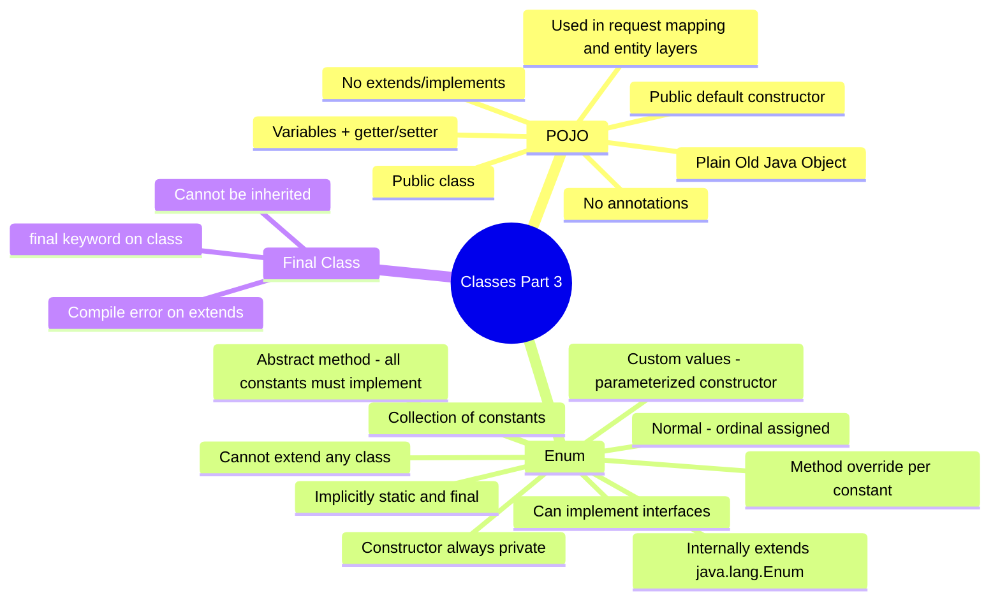
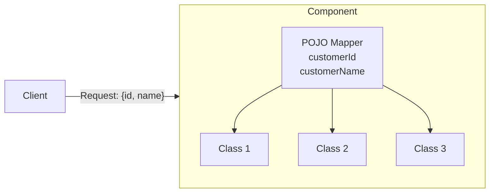
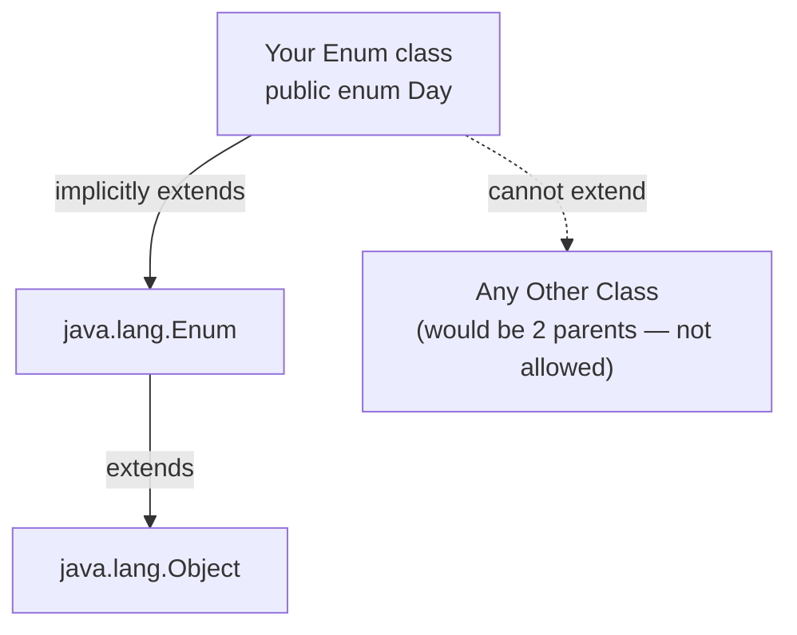
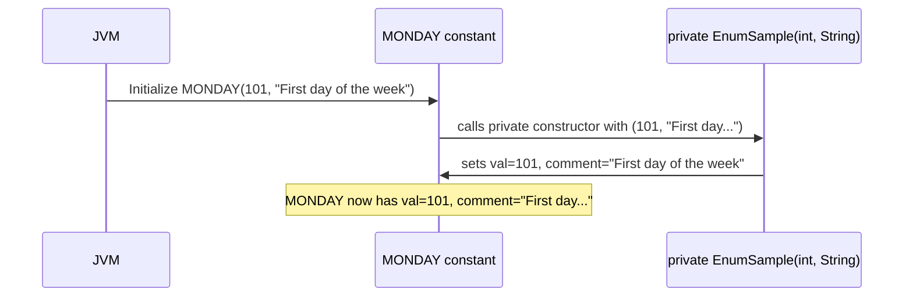
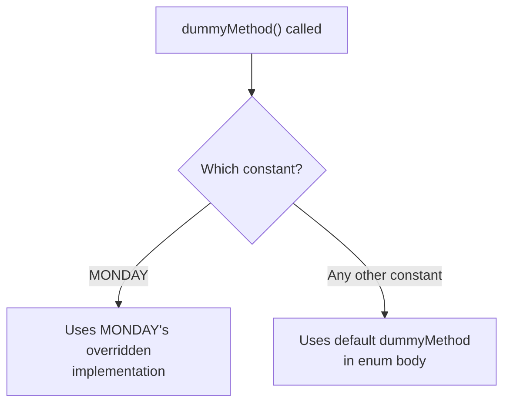
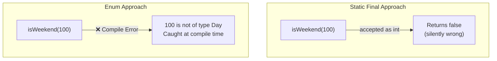
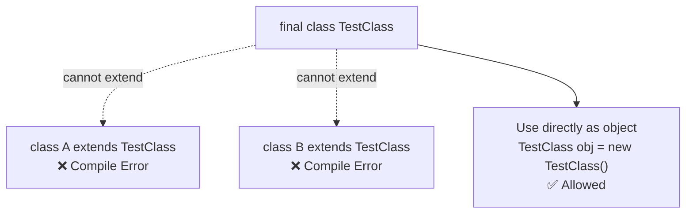

# 📚 Java Classes — Part 3: POJO, Enum & Final Class

> **Series:** Java Core Concepts | **Chapter:** Types of Classes — Part 3  
> **Audience:** Beginner to Intermediate Java Developers  
> **Coverage:** POJO Classes, Enum (normal, custom values, method override, abstract method, interface), Enum vs Static Final, Final Class

---

## 🗂️ Table of Contents

1. [POJO Classes](#1-pojo-classes)
2. [Enum — Introduction](#2-enum--introduction)
3. [Enum — Properties & Rules](#3-enum--properties--rules)
4. [Enum — Normal (Basic) Usage](#4-enum--normal-basic-usage)
5. [Enum — Built-in Methods](#5-enum--built-in-methods)
6. [Enum — Custom Values](#6-enum--custom-values)
7. [Enum — Method Override by Constant](#7-enum--method-override-by-constant)
8. [Enum — Abstract Methods](#8-enum--abstract-methods)
9. [Enum — Implementing an Interface](#9-enum--implementing-an-interface)
10. [Enum vs Static Final Constants](#10-enum-vs-static-final-constants)
11. [Final Class](#11-final-class)
12. [Interview Question Bank](#12-interview-question-bank)
13. [Master Summary](#13-master-summary)

---

## Mind Map — Chapter Overview



---

# 1. POJO Classes

## What is a POJO?

**POJO** stands for **Plain Old Java Object**. The name itself tells the story — it is the simplest, most basic form of a Java class, with no fancy framework-specific features attached.

---

## Definition

> A **POJO** is a simple Java class that contains only **fields (variables)** and their **getter and setter methods**, with no special framework dependencies, annotations, inheritance, or interface implementations.

---

## Rules — What Makes a Class a POJO?

| Rule | Requirement |
|------|-------------|
| Class access modifier | Must be `public` |
| Constructor | Must have a `public` default (no-arg) constructor |
| Fields | Can be any access modifier (`private`, `public`, `protected`, `default`) |
| Getter/Setter methods | Must be present for each field |
| Annotations | ❌ No annotations (no `@Entity`, `@Table`, etc.) |
| Inheritance | ❌ Must NOT extend any class |
| Interface | ❌ Must NOT implement any interface |

---

## Code Example — A Valid POJO

```java
public class Student {
    // Fields — any access modifier allowed
    int defaultField;
    private String name;
    protected int age;
    public String city;

    // Getter and Setter for each field
    public String getName() {
        return name;
    }

    public void setName(String name) {
        this.name = name;
    }

    public int getAge() {
        return age;
    }

    public void setAge(int age) {
        this.age = age;
    }

    public String getCity() {
        return city;
    }

    public void setCity(String city) {
        this.city = city;
    }

    // Public default constructor (auto-provided by Java since no other constructor defined)
}
```

### POJO Checklist for This Class

| Check | Status |
|-------|--------|
| Class is `public` | ✅ |
| Has public default constructor | ✅ (Java auto-generates) |
| Has variables | ✅ |
| Has getter/setter methods | ✅ |
| No annotations (`@Entity`, `@Table`, etc.) | ✅ |
| Does not `extend` any class | ✅ |
| Does not `implement` any interface | ✅ |

---

## What is NOT a POJO?

```java
// ❌ NOT a POJO — extends another class
public class Student extends Person { ... }

// ❌ NOT a POJO — implements an interface
public class Student implements Serializable { ... }

// ❌ NOT a POJO — has annotations (JPA/Spring annotations)
@Entity
@Table(name = "students")
public class Student {
    @Column
    private String name;
}
```

---

## Where Are POJOs Used in Real Projects?

### Use Case 1 — Request Object Mapping

When a client sends a request to your system, the incoming data should not be used directly across all your internal classes. A POJO acts as a **mapper/transformer**:



**Why this pattern?**
- If the request structure changes (e.g., `id` → `customer_id`), you only update the mapper — not every class
- Internal classes work with your own well-named POJO, not raw external data
- Decouples your internal code from external API contracts

```java
// Request object from client
class RequestDto {
    int id;
    String name;
}

// Your internal POJO — insulated from external changes
public class CustomerPojo {
    int customerId;
    String customerName;

    public int getCustomerId() { return customerId; }
    public void setCustomerId(int id) { this.customerId = id; }
    public String getCustomerName() { return customerName; }
    public void setCustomerName(String name) { this.customerName = name; }
}

// Mapping layer — only ONE place to update if external structure changes
CustomerPojo map(RequestDto req) {
    CustomerPojo pojo = new CustomerPojo();
    pojo.setCustomerId(req.id);
    pojo.setCustomerName(req.name);
    return pojo;
}
```

### Use Case 2 — Database Entity Layer

In a typical layered architecture (Controller → Service → Repository → DB), the repository layer uses entity classes that mirror the database table — these are effectively POJOs (before annotations are added):

```
Client Request
    ↓
Controller (REST API)
    ↓
Service (Business Logic)
    ↓
Repository (DB access)
    ↓ ↑
  Database — StudentEntity POJO maps to student table
```

---

## POJO vs Related Concepts

| Concept | Relation to POJO |
|---------|-----------------|
| **JavaBean** | A stricter POJO — must be `Serializable`, fields must be `private`, getters/setters must follow naming convention exactly |
| **DTO (Data Transfer Object)** | A POJO used specifically to transfer data between layers |
| **Entity** | A POJO annotated with JPA annotations (`@Entity`, `@Table`) — technically no longer a pure POJO |

---

# 2. Enum — Introduction

## The Problem Before Enum

Before understanding `enum`, recall how we define constants in Java:

```java
public class WeekConstants {
    public static final int MONDAY    = 0;
    public static final int TUESDAY   = 1;
    public static final int WEDNESDAY = 2;
    public static final int THURSDAY  = 3;
    public static final int FRIDAY    = 4;
    public static final int SATURDAY  = 5;
    public static final int SUNDAY    = 6;
}
```

This works, but has problems (discussed in depth in [Section 10](#10-enum-vs-static-final-constants)).

## What is Enum?

> An **enum** (enumeration) is a special Java class that represents a **collection of constants**. All constants in an enum are implicitly `public static final`.

```java
public enum Day {
    MONDAY, TUESDAY, WEDNESDAY, THURSDAY, FRIDAY, SATURDAY, SUNDAY
}
```

---

# 3. Enum — Properties & Rules

## Key Properties

| Property | Detail |
|----------|--------|
| Keyword | `enum` (replaces `class`) |
| Constants | All constants are `public static final` implicitly |
| Ordinal | Each constant gets an auto-assigned integer value starting from `0` |
| Extends | Implicitly extends `java.lang.Enum` (cannot extend any other class) |
| Implements | Can implement any number of interfaces |
| Constructor | Always `private` — even if you write `default`, bytecode makes it `private` |
| Instantiation | ❌ Cannot be instantiated with `new` (constructor is private) |
| Other classes extending enum | ❌ Not allowed |
| Variables | ✅ Can have variables |
| Methods | ✅ Can have methods (including static and abstract) |
| Abstract methods | ✅ Allowed — but ALL constants must implement them |

---

## Why Can't Enum Extend Another Class?



Java does not allow a class to extend more than one class. Since every enum already implicitly extends `java.lang.Enum`, it cannot extend anything else. It can, however, `implement` multiple interfaces.

---

## Why Is the Constructor Always Private?

```java
public enum EnumSample {
    MONDAY, TUESDAY
    // No constructor written...
}
```

Even without writing a constructor, the compiler generates a **private** default constructor in the bytecode. This is why you cannot do:

```java
// EnumSample e = new EnumSample(); // ❌ Compile error — constructor is private
```

The constants themselves (`MONDAY`, `TUESDAY`) are created internally by the enum class calling its own private constructor — this is the only valid way.

---

# 4. Enum — Normal (Basic) Usage

## Syntax

```java
public enum EnumSample {
    MONDAY, TUESDAY, WEDNESDAY, THURSDAY, FRIDAY, SATURDAY, SUNDAY;
}
```

> [!IMPORTANT]
> The semicolon `;` at the end of the constants list is **required** when you add variables, constructors, or methods below. It is optional for simple enums but is good practice to always include it.

## Ordinal Values

Internally, Java assigns ordinal (index) values starting from `0`:

| Constant | Ordinal |
|----------|---------|
| MONDAY | 0 |
| TUESDAY | 1 |
| WEDNESDAY | 2 |
| THURSDAY | 3 |
| FRIDAY | 4 |
| SATURDAY | 5 |
| SUNDAY | 6 |

---

# 5. Enum — Built-in Methods

All enums inherit these static and instance methods from `java.lang.Enum`. You don't need to define them — they're automatically available.

## The Four Most Important Methods

| Method | Type | What it does |
|--------|------|-------------|
| `values()` | Static | Returns an array of all constants in declaration order |
| `ordinal()` | Instance | Returns the zero-based position of the constant |
| `valueOf(String name)` | Static | Returns the enum constant whose name matches the given string |
| `name()` | Instance | Returns the exact name of the constant as declared |

---

## Code Example — All Four Methods

```java
public enum EnumSample {
    MONDAY, TUESDAY, WEDNESDAY, THURSDAY, FRIDAY, SATURDAY, SUNDAY;
}

public class Main {
    public static void main(String[] args) {

        // 1. values() — iterate over all constants
        System.out.println("=== values() + ordinal() ===");
        for (EnumSample sample : EnumSample.values()) {
            System.out.println(sample + " → ordinal: " + sample.ordinal());
        }

        // 2. valueOf() — get enum object by name string
        System.out.println("\n=== valueOf() ===");
        EnumSample friday = EnumSample.valueOf("FRIDAY");
        System.out.println("Got: " + friday); // FRIDAY

        // 3. name() — get the declared name of the constant
        System.out.println("\n=== name() ===");
        System.out.println(friday.name()); // FRIDAY
    }
}
```

**Output:**
```
=== values() + ordinal() ===
MONDAY → ordinal: 0
TUESDAY → ordinal: 1
WEDNESDAY → ordinal: 2
THURSDAY → ordinal: 3
FRIDAY → ordinal: 4
SATURDAY → ordinal: 5
SUNDAY → ordinal: 6

=== valueOf() ===
Got: FRIDAY

=== name() ===
FRIDAY
```

---

## Method Explanations

### `values()`
Returns an array of all constants in their declaration order. Comes from `java.lang.Enum`. Use it when you need to iterate over all constants.

```java
EnumSample[] all = EnumSample.values();
// all = [MONDAY, TUESDAY, WEDNESDAY, THURSDAY, FRIDAY, SATURDAY, SUNDAY]
```

### `ordinal()`
Returns the zero-based index of the constant in the declaration order. Think of it as the default "position number" Java assigns automatically.

```java
EnumSample.MONDAY.ordinal()    // 0
EnumSample.FRIDAY.ordinal()    // 4
EnumSample.SUNDAY.ordinal()    // 6
```

### `valueOf(String name)`
Looks up a constant by its exact name (case-sensitive). Returns the matching enum constant.

```java
EnumSample day = EnumSample.valueOf("FRIDAY"); // EnumSample.FRIDAY
// EnumSample.valueOf("friday"); // ❌ IllegalArgumentException — case-sensitive
```

### `name()`
Returns the exact string name of the constant as it was declared in the enum.

```java
EnumSample.FRIDAY.name() // "FRIDAY"
```

> [!NOTE]
> `name()` and `toString()` return the same value by default, but `toString()` can be overridden while `name()` cannot. Use `name()` when you need the guaranteed, original declared name.

---

# 6. Enum — Custom Values

## Overview

By default, each constant gets an ordinal (0, 1, 2...). But you can also attach **custom values** to each constant — like a descriptive number, a label, or any data you need.

## How It Works

Each constant can call the enum's **private constructor** to pass custom values. You define:
1. Member variables (fields) for the custom data
2. A private parameterized constructor that sets those fields
3. Getter methods to retrieve the values

```java
public enum EnumSample {
    MONDAY(101, "First day of the week"),
    TUESDAY(102, "Second day"),
    WEDNESDAY(103, "Third day"),
    THURSDAY(104, "Fourth day"),
    FRIDAY(105, "Fifth day"),
    SATURDAY(106, "Second week of"),
    SUNDAY(107, "Last day");

    // Member variables — one per constant
    private int val;
    private String comment;

    // Private parameterized constructor
    private EnumSample(int val, String comment) {
        this.val = val;
        this.comment = comment;
    }

    // Getters
    public int getVal() { return val; }
    public String getComment() { return comment; }

    // Static method — finds constant by custom int value
    public static EnumSample getEnumFromValue(int value) {
        for (EnumSample sample : EnumSample.values()) {
            if (sample.val == value) {
                return sample;
            }
        }
        return null;
    }
}
```

## Using Custom Values

```java
public class Main {
    public static void main(String[] args) {
        // Access custom value directly
        System.out.println(EnumSample.MONDAY.getVal());     // 101
        System.out.println(EnumSample.MONDAY.getComment()); // First day of the week

        // Find enum constant by its custom integer value
        EnumSample found = EnumSample.getEnumFromValue(107);
        System.out.println(found);             // SUNDAY
        System.out.println(found.getComment()); // Last day
    }
}
```

**Output:**
```
101
First day of the week
SUNDAY
Last day
```

## Step-by-Step — How Constants Call the Constructor



> [!IMPORTANT]
> The constants (`MONDAY`, `TUESDAY`, etc.) are the only ones allowed to call the private constructor — they do so right in their declaration `MONDAY(101, "First day of the week")`. No external code can call `new EnumSample(...)`.

---

## Key Rules for Custom Values

| Rule | Detail |
|------|--------|
| Member variables | Define as many as needed (one per custom value type) |
| Constructor | Must be `private`; must match the values passed in the constant declarations |
| Getters | Define for each variable you want to expose |
| Class-level static methods | Methods that aren't per-constant must be `static` |
| After the semicolon | Variables, constructors, and methods go AFTER the constants list and semicolon |

---

# 7. Enum — Method Override by Constant

## Overview

Every method defined in the enum body is available to **all constants**. But individual constants can **override** that method to provide their own behavior.

---

## Code Example

```java
public enum EnumSample {
    MONDAY {
        // MONDAY overrides the shared dummyMethod
        @Override
        public void dummyMethod() {
            System.out.println("Monday dummy method");
        }
    },
    TUESDAY,
    WEDNESDAY,
    THURSDAY,
    FRIDAY,
    SATURDAY,
    SUNDAY;

    // Default implementation — used by all constants that don't override
    public void dummyMethod() {
        System.out.println("Default dummy method");
    }
}

public class Main {
    public static void main(String[] args) {
        EnumSample.FRIDAY.dummyMethod();  // Default dummy method
        EnumSample.MONDAY.dummyMethod();  // Monday dummy method
        EnumSample.TUESDAY.dummyMethod(); // Default dummy method
    }
}
```

**Output:**
```
Default dummy method
Monday dummy method
Default dummy method
```

## How It Works



The method defined in the enum body is the **default** for all constants. When a constant opens a block `{ ... }` before its comma, it can override any of these shared methods.

---

# 8. Enum — Abstract Methods

## Overview

An enum can declare an **abstract method**, which forces **every single constant** to provide its own implementation. This guarantees that no constant can be left without behavior.

---

## Code Example

```java
public enum EnumSample {
    MONDAY {
        @Override
        public void dummyMethod() {
            System.out.println("In Monday");
        }
    },
    TUESDAY {
        @Override
        public void dummyMethod() {
            System.out.println("In Tuesday");
        }
    },
    SUNDAY {
        @Override
        public void dummyMethod() {
            System.out.println("In Sunday");
        }
    };

    // Abstract — all constants MUST implement this
    public abstract void dummyMethod();
}

public class Main {
    public static void main(String[] args) {
        EnumSample.MONDAY.dummyMethod(); // In Monday
        EnumSample.TUESDAY.dummyMethod(); // In Tuesday
        EnumSample.SUNDAY.dummyMethod(); // In Sunday
    }
}
```

**Output:**
```
In Monday
In Tuesday
In Sunday
```

> [!WARNING]
> If any constant does NOT provide an implementation for the abstract method, you will get a **compile error**. Every constant must implement every abstract method — no exceptions.

---

## Abstract Method vs Default Method Override — Comparison

| Aspect | Default Method + Override | Abstract Method |
|--------|--------------------------|-----------------|
| Constants must implement? | ❌ Optional (only override if needed) | ✅ Mandatory for ALL |
| Has shared default behavior? | ✅ Yes | ❌ No default |
| Use when | Most constants share behavior, some differ | Each constant MUST have its own logic |

---

# 9. Enum — Implementing an Interface

## Overview

An enum can implement one or more interfaces. The implementation applies to **all constants** — making it ideal for shared, common behavior.

---

## Code Example

```java
interface MyInterface {
    String toLowerCase();
}

public enum EnumSample implements MyInterface {
    MONDAY, TUESDAY, WEDNESDAY, THURSDAY, FRIDAY, SATURDAY, SUNDAY;

    // Single implementation — shared by all constants
    @Override
    public String toLowerCase() {
        return this.name().toLowerCase();
    }
}

public class Main {
    public static void main(String[] args) {
        System.out.println(EnumSample.MONDAY.toLowerCase());    // monday
        System.out.println(EnumSample.FRIDAY.toLowerCase());    // friday
        System.out.println(EnumSample.SUNDAY.toLowerCase());    // sunday
    }
}
```

**Output:**
```
monday
friday
sunday
```

## How `this.name()` Works Here

Inside the interface implementation method, `this` refers to the current constant calling the method. So `EnumSample.MONDAY.toLowerCase()` → `this` = `MONDAY` → `this.name()` = `"MONDAY"` → `.toLowerCase()` = `"monday"`.

---

## Interface vs Abstract Method — When to Use Which

| Approach | Use When |
|----------|----------|
| **Interface** | Behavior is common/shared across all constants; cleaner single implementation |
| **Abstract method in enum** | Each constant **must** have uniquely different behavior |
| **Default method + selective override** | Most constants share behavior, but a few need custom logic |

---

# 10. Enum vs Static Final Constants

## The Core Question

> *If we can already create constants using `public static final`, why do we need enum?*

---

## Side-by-Side Comparison

```java
// Approach 1 — Static Final Constants
public class WeekConstants {
    public static final int MONDAY    = 0;
    public static final int TUESDAY   = 1;
    public static final int WEDNESDAY = 2;
    public static final int THURSDAY  = 3;
    public static final int FRIDAY    = 4;
    public static final int SATURDAY  = 5;
    public static final int SUNDAY    = 6;
}

// Approach 2 — Enum
public enum Day {
    MONDAY, TUESDAY, WEDNESDAY, THURSDAY, FRIDAY, SATURDAY, SUNDAY;
}
```

---

## The Weekend Check Method — Revealing the Differences

```java
// Using Static Final — int parameter
boolean isWeekend(int day) {
    if (WeekConstants.SATURDAY == day || WeekConstants.SUNDAY == day) {
        return true;
    }
    return false;
}

// Using Enum — Day parameter
boolean isWeekend(Day day) {
    if (Day.SATURDAY == day || Day.SUNDAY == day) {
        return true;
    }
    return false;
}
```

### Calling the Methods

```java
// Static Final version
isWeekend(2);    // Returns false — what is 2? Programmer must know (Wednesday)
isWeekend(6);    // Returns true (Sunday)
isWeekend(100);  // Returns false — but 100 is not a valid day! No error, wrong behavior

// Enum version
isWeekend(Day.WEDNESDAY); // Returns false — readable, self-documenting
isWeekend(Day.SUNDAY);    // Returns true
// isWeekend(100);         // ❌ Compile error — 100 is not a Day enum value
```

---

## Advantages of Enum Over Static Final

| Advantage | Static Final | Enum |
|-----------|-------------|------|
| **Type safety** | ❌ Any integer accepted, even 100 or -1 | ✅ Only valid enum constants accepted |
| **Readability** | ❌ Code shows `6` — reader must know 6 = SUNDAY | ✅ Code shows `Day.SUNDAY` — self-documenting |
| **Invalid value prevention** | ❌ No compile-time check | ✅ Compile error if you pass an invalid value |
| **Can carry extra data** | ❌ Just a number | ✅ Can have multiple fields (val, comment, etc.) |
| **Can have methods** | ❌ No (it's just a field) | ✅ Yes — instance and static methods |
| **Can implement interfaces** | ❌ No | ✅ Yes |
| **Iteration** | ❌ Must maintain a separate array/list | ✅ `values()` built-in |
| **Grouped in one place** | ❌ Scattered in a utility class | ✅ Encapsulated in the enum itself |

---

## Diagram — Type Safety Advantage



---

# 11. Final Class

## What is a Final Class?

A **final class** is a class declared with the `final` keyword that **cannot be extended (subclassed) by any other class**.

---

## Definition

> A **final class** prevents inheritance. No class can use `extends` to inherit from a `final` class.

---

## Syntax

```java
public final class TestClass {
    // class body
}
```

---

## Code Example

```java
public final class TestClass {
    void display() {
        System.out.println("I am a final class");
    }
}

// Attempting to extend TestClass
public class MyAnotherClass extends TestClass { // ❌ Compile error
    // Cannot inherit from final 'TestClass'
}
```

**Compile Error:**
```
Cannot inherit from final 'TestClass'
```

---

## Why Use a Final Class?

| Reason | Explanation |
|--------|-------------|
| **Immutability** | Prevents subclasses from overriding methods and breaking expected behavior |
| **Security** | Ensures the class behavior cannot be altered by subclassing |
| **Design intent** | Communicates clearly: "This class is complete — not meant to be extended" |

---

## Real-World Examples of Final Classes in Java

Java's standard library uses `final` classes extensively:

| Class | Why Final? |
|-------|-----------|
| `java.lang.String` | Immutability depends on no subclass overriding internal methods |
| `java.lang.Integer` | Wrapper class must be reliable and unmodifiable |
| `java.lang.Math` | Utility class — no point subclassing it |

---

## `final` Keyword — Three Contexts (Summary)

| Applied To | Meaning |
|-----------|---------|
| `final` **variable** | Value cannot be changed once assigned |
| `final` **method** | Method cannot be overridden by subclass |
| `final` **class** | Class cannot be extended/subclassed |

---

## Diagram — Final Class Restriction



---

# 12. Interview Question Bank

## POJO

| Question | Key Answer |
|----------|-----------|
| What is a POJO? | Plain Old Java Object — public class with fields, getters/setters, no annotations, no extends/implements, public default constructor |
| What is the difference between a POJO and a JavaBean? | JavaBean is stricter — must be Serializable, fields must be private, must follow exact getter/setter naming |
| Where are POJOs used in real projects? | Request object mapping layer and database entity layer |
| Can a POJO have a private field? | Yes — fields can have any access modifier |

## Enum

| Question | Key Answer |
|----------|-----------|
| What is an enum? | A class representing a collection of constants; all constants are implicitly `public static final` |
| Why can't an enum extend another class? | It implicitly extends `java.lang.Enum` — Java doesn't allow extending more than one class |
| Can an enum implement an interface? | Yes — any number of interfaces |
| Why is the enum constructor always private? | Prevents external instantiation; the compiler forces `private` even if you write `default` |
| What is `ordinal()` in enum? | Returns the zero-based position of a constant in the declaration order |
| What does `values()` return? | An array of all enum constants in declaration order |
| What does `valueOf(String)` do? | Returns the enum constant whose name exactly matches the given string (case-sensitive) |
| Can an enum have abstract methods? | Yes — but ALL constants must implement the abstract method |
| Can individual constants override methods? | Yes — open a block `{ }` before the constant's comma and override inside it |
| Can an enum have variables and custom constructors? | Yes — define fields and a private parameterized constructor; constants call it in their declarations |

## Enum vs Static Final

| Question | Key Answer |
|----------|-----------|
| What are the advantages of enum over `static final` constants? | Type safety (invalid values caught at compile time), readability (self-documenting), can carry data, can have methods |
| When would you still use `static final` over enum? | Very simple cases where a value can range freely (not restricted to a fixed set), e.g., a timeout duration |

## Final Class

| Question | Key Answer |
|----------|-----------|
| What is a final class? | A class that cannot be extended/subclassed |
| Can you instantiate a final class? | Yes — `final` only prevents inheritance, not instantiation |
| Give examples of final classes in Java | `String`, `Integer`, `Math` |
| What's the difference between `final` variable, method, and class? | Variable: value fixed; Method: can't override; Class: can't extend |

---

# 13. Master Summary

## Quick Revision Bullets

**POJO:**
- ✅ **POJO** = Plain Old Java Object — public class, variables + getters/setters, no annotations, no extends/implements
- ✅ Must have public default constructor (auto-generated if no constructor defined)
- ✅ Used at request mapping layer and entity/DB layer in real projects
- ✅ Decouples internal code from external API changes — only one mapping point needs updating

**Enum:**
- ✅ `enum` keyword instead of `class` — represents a fixed set of constants
- ✅ Constants are implicitly `public static final` — you don't need to write it
- ✅ Implicitly extends `java.lang.Enum` → cannot extend any other class; can implement interfaces
- ✅ Constructor is always `private` — even `default` becomes `private` in bytecode
- ✅ Cannot instantiate enum with `new` outside the enum itself
- ✅ Ordinals assigned automatically starting from `0`
- ✅ **`values()`** = array of all constants | **`ordinal()`** = position | **`valueOf()`** = find by name | **`name()`** = constant's declared name
- ✅ Custom values: define fields + private parameterized constructor; constants call it in their declaration `MONDAY(101, "First day")`
- ✅ Methods after the semicolon belong to each constant individually; mark `static` for class-level behavior
- ✅ Individual constants can override shared methods by opening a `{ }` block
- ✅ Abstract methods in enum → ALL constants must provide implementation
- ✅ Enum can implement interfaces → single implementation shared across all constants

**Enum vs Static Final:**
- ✅ `static final int` → no type safety (any int accepted), poor readability (magic numbers)
- ✅ Enum → type-safe (only valid constants accepted, compile error otherwise), self-documenting (`Day.SUNDAY` vs `6`)
- ✅ Enum can carry extra data, have methods, iterate via `values()` — `static final` cannot

**Final Class:**
- ✅ `final class` = cannot be extended/subclassed
- ✅ You CAN instantiate a final class — `final` only blocks `extends`, not `new`
- ✅ Examples: `String`, `Integer`, `Math` in Java's standard library
- ✅ `final` variable = value fixed; `final` method = can't override; `final` class = can't extend

---

> [!TIP]
> **Coming up in Part 4:**
> - **Singleton Class** — controlling object creation (using private constructor + static factory method)
> - **Immutable Class** — objects whose state cannot change after creation
> - **Wrapper Classes** — deep dive into boxing, caching, and utility methods

---

*End of Chapter — Java Classes Part 3: POJO, Enum & Final Class*
