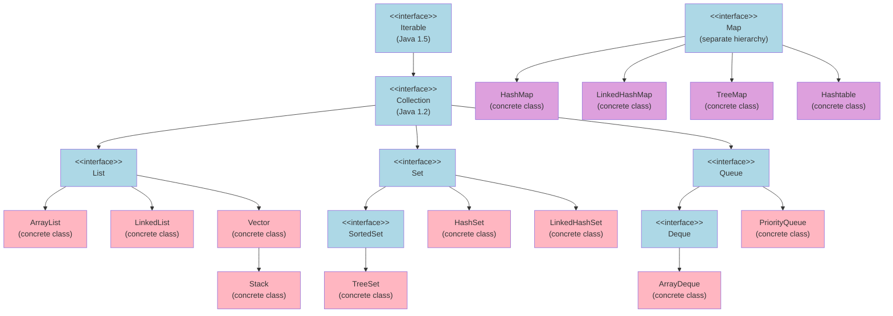
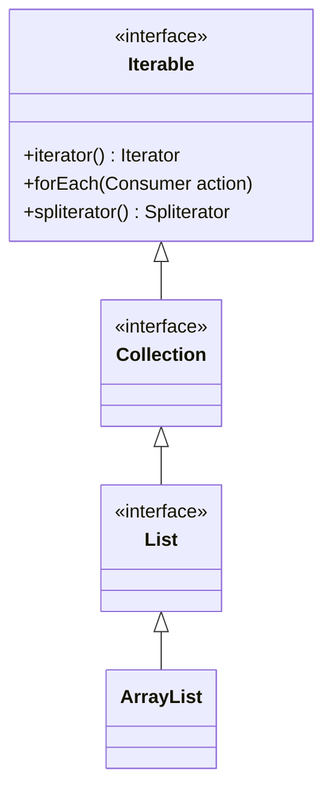
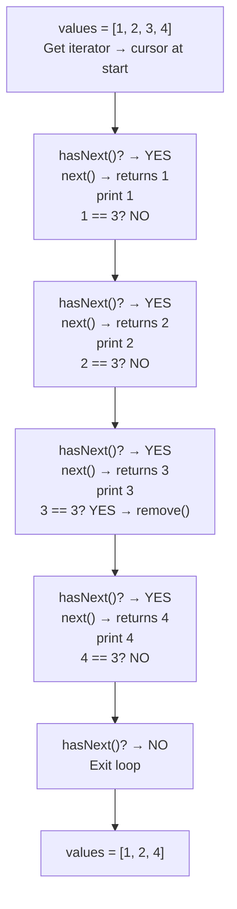
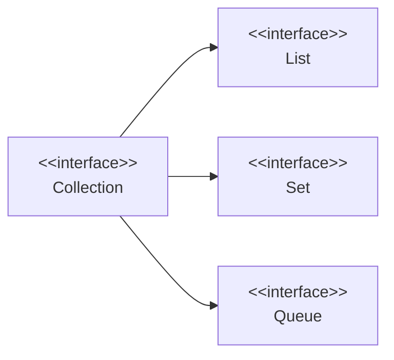
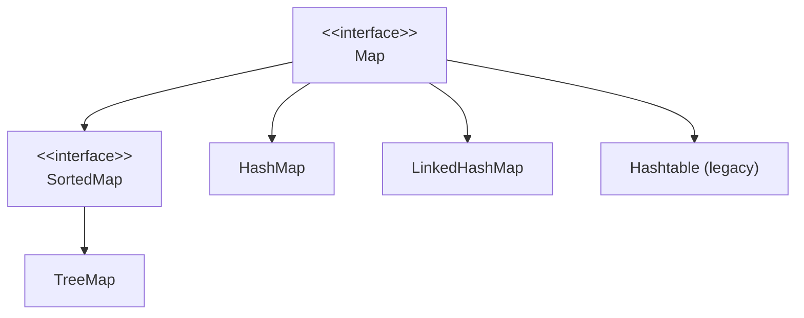

# 📚 Java Collection Framework — Complete Study Guide

> [!IMPORTANT]
> These notes are designed to be self-contained. You should be able to learn the entire topic without watching the original lecture.

---

## Table of Contents

1. [What is a Collection?](#1-what-is-a-collection)
2. [What is a Framework?](#2-what-is-a-framework)
3. [What is the Java Collection Framework (JCF)?](#3-what-is-the-java-collection-framework-jcf)
4. [Why Was JCF Needed? — The Problem It Solved](#4-why-was-jcf-needed--the-problem-it-solved)
5. [JCF Hierarchy — Complete Overview](#5-jcf-hierarchy--complete-overview)
6. [The `Iterable` Interface](#6-the-iterable-interface)
7. [Three Ways to Iterate a Collection](#7-three-ways-to-iterate-a-collection)
8. [The `Collection` Interface](#8-the-collection-interface)
9. [Common Methods of `Collection`](#9-common-methods-of-collection)
10. [Collection vs Collections — Key Difference](#10-collection-vs-collections--key-difference)
11. [The `Map` Interface — Why It's Separate](#11-the-map-interface--why-its-separate)
12. [Interview Notes](#12-interview-notes)
13. [Summary & Quick Revision](#13-summary--quick-revision)
14. [Practice Questions](#14-practice-questions)

---

# 📌 1. What is a Collection?

## Overview

Before diving into the framework, you need to understand what a **collection** is at its core.

## Definition

A **collection** is a **group of objects** (also called a group of elements) stored together under a single unit.

## Real-world Analogy

Think of a **bag of fruits**. The bag is the collection; the individual fruits are the elements. You can add a fruit, remove a fruit, search for a fruit, and count how many fruits are in the bag.

## Examples of Collections

Even before the Java Collection Framework existed, Java had types that acted as collections:

| Type | Description |
|---|---|
| `Array` | A fixed-size sequential collection of elements of the same type |
| `Vector` | A resizable array (thread-safe, available before JCF) |
| `Hashtable` | A key-value store (available before JCF) |

### Example — Array as a Collection

```java
// Creating an integer array (a collection of integers)
int[] a = {1, 2, 3, 4};

// Writing (inserting) to an array
a[0] = 1;

// Reading from an array
int value = a[0];  // value = 1
```

### Example — Vector as a Collection

```java
import java.util.Vector;

// Creating a Vector of integers
Vector<Integer> v = new Vector<>();

// Writing (inserting) into a Vector
v.add(10);

// Reading from a Vector
int value = v.get(0);  // value = 10
```

## Package

All Java collection classes and interfaces are located in the `java.util` package.

```java
import java.util.*;  // imports all collection classes
```

## Version History

| Feature | Added In |
|---|---|
| `Array`, `Vector`, `Hashtable` | Java 1.0 / 1.1 |
| Java Collection Framework (JCF) | Java 1.2 |
| `Iterable` interface | Java 1.5 |
| `forEach()` method, Streams | Java 1.8 |

---

# 📌 2. What is a Framework?

## Definition

A **framework** is a pre-built architecture that provides:

- Ready-made classes and interfaces
- Common methods and functionality
- A standardized structure you can build upon

## What JCF's Framework Provides

- Classes like `ArrayList`, `LinkedList`, `Stack`, `HashSet`, `TreeSet`, etc.
- Interfaces like `Iterable`, `Collection`, `List`, `Set`, `Queue`, `Map`
- Pre-built methods: `add()`, `remove()`, `contains()`, `size()`, `clear()`, `sort()`, etc.

> [!NOTE]
> You don't have to write your own data structures from scratch. The framework gives you everything. You can also extend the framework to build custom behavior if needed.

---

# 📌 3. What is the Java Collection Framework (JCF)?

## Definition

The **Java Collection Framework (JCF)** is a unified architecture of classes and interfaces that represent and manipulate groups of objects (collections). It was introduced in **Java 1.2**.

## What It Contains

- **Interfaces**: Define the contract (what operations are available)
- **Concrete Classes**: Implement those interfaces with specific behavior
- **Utility Classes**: Provide helper methods (e.g., `Collections`)
- **Algorithms**: Sorting, searching, shuffling, etc.

## Core Capabilities

With JCF, you can perform these operations on any collection:

- **Add** elements
- **Remove** elements
- **Update** elements
- **Search** for elements
- **Iterate** over elements
- **Sort** elements

---

# 📌 4. Why Was JCF Needed? — The Problem It Solved

## The Problem: No Common Interface

Before JCF (before Java 1.2), Java had `Array`, `Vector`, and `Hashtable` — but each used **completely different methods** for reading and writing. There was **no common interface**.

### Comparison of Pre-JCF Collections

| Operation | Array | Vector | Hashtable |
|---|---|---|---|
| Insert | `a[0] = value` | `v.addElement(value)` | `ht.put(key, value)` |
| Read | `a[0]` | `v.get(0)` | `ht.get(key)` |
| Size | `a.length` | `v.size()` | `ht.size()` |

### Code Example Demonstrating the Problem

```java
// Array — index-based read/write
int[] array = new int[4];
array[0] = 1;           // Write
int val = array[0];     // Read

// Vector — method-based read/write (different syntax!)
Vector<Integer> vector = new Vector<>();
vector.add(10);         // Write
int val2 = vector.get(0); // Read

// Hashtable — key-value based (completely different!)
Hashtable<String, Integer> ht = new Hashtable<>();
ht.put("key", 10);     // Write
int val3 = ht.get("key"); // Read
```

> [!WARNING]
> Notice the problem: to add an element, you use `array[0]=`, then `vector.add()`, then `ht.put()`. **Three different ways to do the same thing.** Developers had to memorize different syntax for every collection type.

## The Solution: A Common Interface

JCF introduced a **common parent interface** called `Collection`. Now, all collection classes implement `Collection`, which means they all share the **same method names**:

| Operation | Any JCF Collection |
|---|---|
| Insert | `.add(element)` |
| Remove | `.remove(element)` |
| Search | `.contains(element)` |
| Size | `.size()` |
| Iterate | `.iterator()` / enhanced `for` loop |

### Code Example Demonstrating the Solution

```java
import java.util.*;

// ArrayList — uses .add() to insert
List<Integer> list = new ArrayList<>();
list.add(1);

// Stack — also uses .add() to insert
Stack<Integer> stack = new Stack<>();
stack.add(2);

// LinkedList — also uses .add() to insert
LinkedList<Integer> linkedList = new LinkedList<>();
linkedList.add(3);

// PriorityQueue — also uses .add() to insert
PriorityQueue<Integer> pq = new PriorityQueue<>();
pq.add(4);
```

Now you only need to remember **one method name** regardless of which collection you use. This is the power of a common interface.

> [!TIP]
> **Interview Answer:** "Before JCF, there was no common interface between different collection types. Each had its own syntax for read/write operations, making it hard to remember and use. JCF introduced a common interface hierarchy so all collections share the same method names, allowing developers to focus on *which* collection to use rather than *how* to use each one."

---

# 📌 5. JCF Hierarchy — Complete Overview

## The Two Trees

JCF is organized into **two separate hierarchies**:

1. **The `Iterable` / `Collection` tree** — for single-element collections (lists, sets, queues)
2. **The `Map` tree** — for key-value pair collections (maps)

> [!IMPORTANT]
> `Map` is **NOT** a child of `Collection` or `Iterable`. It is a completely separate hierarchy. This is a common interview question.

## Visual Hierarchy Diagram



**Legend:**
- 🔵 Light blue = Interface
- 🩷 Pink = Concrete class (under `Collection` hierarchy)
- 🟣 Purple = Concrete class (under `Map` hierarchy)

## Concrete Classes Reference Table

| Concrete Class | Parent Interface | Key Characteristic |
|---|---|---|
| `ArrayList` | `List` | Resizable array, index-based access |
| `LinkedList` | `List`, `Deque` | Doubly linked list, fast insertions |
| `Vector` | `List` | Thread-safe resizable array (legacy) |
| `Stack` | `Vector` | LIFO (Last In, First Out) |
| `PriorityQueue` | `Queue` | Elements ordered by priority |
| `ArrayDeque` | `Deque` | Double-ended queue |
| `HashSet` | `Set` | No duplicates, unordered |
| `LinkedHashSet` | `Set` | No duplicates, insertion-ordered |
| `TreeSet` | `SortedSet` | No duplicates, sorted order |
| `HashMap` | `Map` | Key-value pairs, unordered |
| `LinkedHashMap` | `Map` | Key-value pairs, insertion-ordered |
| `TreeMap` | `Map` | Key-value pairs, sorted by key |
| `Hashtable` | `Map` | Thread-safe key-value pairs (legacy) |

---

# 📌 6. The `Iterable` Interface

## Overview

`Iterable` is the **root interface** of the entire `Collection` hierarchy. It is defined in `java.lang` (not `java.util`) and was added in **Java 1.5**.

## Purpose

`Iterable` exists to give all collections the ability to be **traversed (iterated)**. By implementing `Iterable`, a class can be used in an **enhanced `for` loop** (`for-each` loop).

> [!NOTE]
> **Why was it added in Java 1.5 if JCF existed since 1.2?**
> The `iterator()` method was already available directly on the `Collection` interface since Java 1.2. In Java 1.5, the `Iterable` interface was introduced as a separate parent of `Collection` to expose iteration at a higher level — enabling the enhanced `for-each` loop syntax and allowing non-collection objects (like custom classes) to also be iterable.

## Key Methods of `Iterable`

| Method | Added In | Description |
|---|---|---|
| `iterator()` | Java 1.5 | Returns an `Iterator` object for traversal |
| `forEach(Consumer action)` | Java 1.8 | Iterates using a lambda expression |
| `spliterator()` | Java 1.8 | Returns a `Spliterator` (for parallel processing) |

## Class Diagram



---

# 📌 7. Three Ways to Iterate a Collection

All three methods are available on any class that implements `Iterable` (which includes all JCF collections like `ArrayList`, `LinkedList`, `Stack`, `HashSet`, etc.)

---

## Method 1: Using `iterator()` — The `Iterator` Object

### What is an `Iterator`?

`iterator()` is a method defined on the `Iterable` interface. When called, it returns an **`Iterator` object** — a cursor that steps through the collection one element at a time.

### Methods of the `Iterator` Object

| Method | Return Type | Description |
|---|---|---|
| `hasNext()` | `boolean` | Returns `true` if there are more elements to iterate |
| `next()` | `E` (element type) | Returns the next element and advances the cursor |
| `remove()` | `void` | Removes the **last element returned** by `next()` from the collection |

> [!IMPORTANT]
> `remove()` on an `Iterator` is the **safe way** to remove elements while iterating. Removing from a collection directly inside a loop causes a `ConcurrentModificationException`.

### Code Example

```java
import java.util.ArrayList;
import java.util.Iterator;
import java.util.List;

public class IteratorExample {
    public static void main(String[] args) {

        // Step 1: Create and populate a collection
        List<Integer> values = new ArrayList<>();
        values.add(1);
        values.add(2);
        values.add(3);
        values.add(4);
        // values = [1, 2, 3, 4]

        // Step 2: Get an Iterator object
        Iterator<Integer> valueIterator = values.iterator();

        // Step 3: Iterate using hasNext() and next()
        while (valueIterator.hasNext()) {
            Integer value = valueIterator.next();
            System.out.println(value);

            // Step 4: Remove element with value 3 while iterating
            if (value == 3) {
                valueIterator.remove(); // Safe removal during iteration
            }
        }

        // Step 5: Print remaining elements
        System.out.println("After removal: " + values);
        // values = [1, 2, 4]  (3 was removed)
    }
}
```

### Output

```
1
2
3
4
After removal: [1, 2, 4]
```

### Step-by-Step Execution



### Line-by-Line Explanation

| Line | Explanation |
|---|---|
| `values.iterator()` | Returns an `Iterator<Integer>` object. The cursor is positioned *before* the first element. |
| `valueIterator.hasNext()` | Checks if the cursor has a next element. Returns `true` initially because element `1` exists. |
| `valueIterator.next()` | Moves the cursor to element `1` and returns it. |
| `if (value == 3)` | Checks whether the current element is `3`. |
| `valueIterator.remove()` | Removes `3` from the underlying `values` list. This is safe because the iterator tracks the state. |

---

## Method 2: Enhanced `for` Loop (for-each)

### Overview

Any class that implements `Iterable` can be used in an enhanced `for` loop. This is the simplest and most common way to iterate when you don't need to remove elements.

> [!NOTE]
> The Java specification states: *"Implementing this interface allows an object to be the target of the enhanced for statement (sometimes called the 'for-each loop' statement)."*

### Syntax

```java
for (ElementType variable : collection) {
    // use variable
}
```

### Code Example

```java
import java.util.ArrayList;
import java.util.List;

public class ForEachLoopExample {
    public static void main(String[] args) {
        List<Integer> values = new ArrayList<>();
        values.add(1);
        values.add(2);
        values.add(4); // Remember: 3 was removed in the previous example

        // Enhanced for loop — iterates over each element
        for (Integer value : values) {
            System.out.println(value);
        }
    }
}
```

### Output

```
1
2
4
```

### How It Works Internally

The enhanced `for` loop is **syntactic sugar** — the Java compiler converts it into an `Iterator`-based loop behind the scenes:

```java
// What you write:
for (Integer value : values) {
    System.out.println(value);
}

// What the compiler generates:
Iterator<Integer> it = values.iterator();
while (it.hasNext()) {
    Integer value = it.next();
    System.out.println(value);
}
```

> [!WARNING]
> **Do NOT call `values.remove()` inside an enhanced for loop.** Since the compiler generates an iterator internally, modifying the collection directly while iterating will throw `ConcurrentModificationException`. Use `Iterator.remove()` (Method 1) or use `removeIf()` instead.

---

## Method 3: `forEach()` Method with Lambda Expression

### Overview

Added in **Java 1.8**, the `forEach()` method is defined on the `Iterable` interface. It accepts a `Consumer` functional interface and uses a **lambda expression** to process each element.

### What is `Consumer`?

`Consumer<T>` is a **built-in functional interface** in `java.util.function`. It has one abstract method:

```java
void accept(T t);
```

It takes **one input** and **returns nothing** (void). It is used to represent an action to be performed on each element.

### Syntax

```java
collection.forEach(element -> {
    // action on element
});

// Or with a single statement:
collection.forEach(element -> System.out.println(element));

// Or with a method reference:
collection.forEach(System.out::println);
```

### Code Example

```java
import java.util.ArrayList;
import java.util.List;

public class ForEachMethodExample {
    public static void main(String[] args) {
        List<Integer> values = new ArrayList<>();
        values.add(1);
        values.add(2);
        values.add(4);

        // forEach() with a lambda expression
        values.forEach(value -> System.out.println(value));
    }
}
```

### Output

```
1
2
4
```

### Internal Mechanism

```java
// values.forEach(value -> System.out.println(value));
// is equivalent to:

for (Integer value : values) {
    // The Consumer's accept() method is called with each element
    System.out.println(value); // the lambda body
}
```

The `forEach()` method internally loops over every element and invokes the provided `Consumer`'s `accept()` method, passing each element as the argument `T`.

### Comparison of All Three Iteration Methods

| Feature | `iterator()` | Enhanced `for` | `forEach()` |
|---|---|---|---|
| Java Version | 1.2 (iterator object) / 1.5 (interface) | 1.5 | 1.8 |
| Safe removal during iteration | ✅ Yes (`iterator.remove()`) | ❌ No | ❌ No (use `removeIf()`) |
| Syntax simplicity | Medium | High | High |
| Uses lambda | ❌ No | ❌ No | ✅ Yes |
| Use when... | Need to remove during iteration | Simple read-only traversal | Functional-style processing |

---

# 📌 8. The `Collection` Interface

## Overview

`Collection` is the **second level** in the JCF hierarchy, directly below `Iterable`. It is an interface that represents a **group of objects (elements)** and defines the core operations available on all single-element collections.

## Definition

> `Collection<E>` is the root interface of the JCF collection hierarchy (under `Iterable`). It defines the basic contract that all collections must fulfill.

## What Extends/Implements Collection



- **`List`** (interface) — extends `Collection`; ordered, allows duplicates
- **`Set`** (interface) — extends `Collection`; unordered, no duplicates
- **`Queue`** (interface) — extends `Collection`; ordered for processing (FIFO by default)

---

# 📌 9. Common Methods of `Collection`

All the methods listed below are defined in the `Collection` interface and are therefore available on **every concrete collection class** (`ArrayList`, `Stack`, `LinkedList`, `PriorityQueue`, `HashSet`, `TreeSet`, etc.)

## Method Reference Table

| Method | Return Type | Added In | Description |
|---|---|---|---|
| `size()` | `int` | 1.2 | Returns total number of elements |
| `isEmpty()` | `boolean` | 1.2 | Returns `true` if collection has no elements |
| `contains(Object o)` | `boolean` | 1.2 | Returns `true` if element is present |
| `add(E e)` | `boolean` | 1.2 | Inserts an element |
| `remove(Object o)` | `boolean` | 1.2 | Removes first occurrence of element |
| `addAll(Collection c)` | `boolean` | 1.2 | Inserts all elements from another collection |
| `removeAll(Collection c)` | `boolean` | 1.2 | Removes all elements that exist in given collection |
| `containsAll(Collection c)` | `boolean` | 1.2 | Returns `true` if all elements of given collection are present |
| `clear()` | `void` | 1.2 | Removes ALL elements from the collection |
| `equals(Object o)` | `boolean` | 1.2 | Checks if two collections are equal |
| `toArray()` | `Object[]` | 1.2 | Converts collection to an array |
| `iterator()` | `Iterator<E>` | 1.2 | Returns an iterator |
| `stream()` | `Stream<E>` | 1.8 | Returns a sequential stream |
| `parallelStream()` | `Stream<E>` | 1.8 | Returns a parallel stream |

## Complete Code Example — All Methods Demonstrated

```java
import java.util.ArrayList;
import java.util.List;
import java.util.Stack;

public class CollectionMethodsExample {
    public static void main(String[] args) {

        // ── Create collection and add elements ──
        List<Integer> values = new ArrayList<>();
        values.add(2);
        values.add(3);
        values.add(4);
        // values = [2, 3, 4]

        // ── size() ──
        System.out.println(values.size());         // 3

        // ── isEmpty() ──
        System.out.println(values.isEmpty());      // false

        // ── contains() ──
        System.out.println(values.contains(5));    // false

        // ── add() ──
        values.add(5);
        System.out.println(values.contains(5));    // true
        // values = [2, 3, 4, 5]

        // ── remove() by INDEX (primitive int) ──
        values.remove(3);  // removes element at index 3 (value = 5)
        System.out.println(values.contains(5));    // false
        // values = [2, 3, 4]

        // ── remove() by OBJECT (Integer wrapper) ──
        values.remove(Integer.valueOf(3));  // removes the element with value 3
        System.out.println(values.contains(3));    // false
        // values = [2, 4]

        // ── addAll() — merge another collection into this one ──
        Stack<Integer> stackValues = new Stack<>();
        stackValues.add(6);
        stackValues.add(7);
        stackValues.add(8);

        values.addAll(stackValues);
        // values = [2, 4, 6, 7, 8]

        // ── containsAll() — check if all elements of stackValues are in values ──
        System.out.println(values.containsAll(stackValues));  // true

        // ── remove element 7 manually ──
        values.remove(Integer.valueOf(7));
        // values = [2, 4, 6, 8]

        // ── containsAll() again — now 7 is missing ──
        System.out.println(values.containsAll(stackValues));  // false (7 is missing)

        // ── removeAll() — remove all elements that are in stackValues (6, 7, 8) ──
        values.removeAll(stackValues);
        // 6 and 8 get removed (7 was already removed)
        // values = [2, 4]

        System.out.println(values.contains(8));   // false

        // ── clear() ──
        values.clear();
        System.out.println(values.isEmpty());     // true
    }
}
```

### Output

```
3
false
false
true
false
false
true
false
false
true
```

## Important: `remove()` by Index vs. by Object

This is a **very common source of bugs** in Java.

```java
List<Integer> list = new ArrayList<>();
list.add(10);
list.add(20);
list.add(30);
// list = [10, 20, 30]  (indices 0, 1, 2)

// Removes by INDEX — removes element at index 1 (which is value 20)
list.remove(1);
// list = [10, 30]

// Removes by OBJECT VALUE — removes element with value 10
list.remove(Integer.valueOf(10));
// list = [30]
```

> [!WARNING]
> When calling `list.remove(int)` with a **primitive `int`**, Java treats it as an **index**.
> When calling `list.remove(Integer)` with an **Integer object** (wrapper), Java treats it as the **value** to search for and remove.
> Always use `Integer.valueOf(n)` or `(Integer) n` to remove by value from a `List<Integer>`.

## The Power of Common Methods

Because all concrete classes inherit these methods from `Collection`, you only need to learn the method names once:

```java
// The same .add() works on ALL of these:
ArrayList<Integer> arrayList = new ArrayList<>();
LinkedList<Integer> linkedList = new LinkedList<>();
Stack<Integer> stack = new Stack<>();
PriorityQueue<Integer> pq = new PriorityQueue<>();
HashSet<Integer> hashSet = new HashSet<>();

arrayList.add(1);    // ✅ works
linkedList.add(1);   // ✅ works
stack.add(1);        // ✅ works
pq.add(1);           // ✅ works
hashSet.add(1);      // ✅ works
```

---

# 📌 10. `Collection` vs `Collections` — Key Difference

This is one of the **most commonly confused pairs** in Java and a **frequent interview question**.

## Side-by-Side Comparison

| Feature | `Collection` | `Collections` |
|---|---|---|
| Type | **Interface** | **Utility Class** |
| Package | `java.util` | `java.util` |
| Purpose | Blueprint for all collection types | Provides helper/utility methods to work on collections |
| Methods | Instance methods (overridden by concrete classes) | **All static methods** |
| Part of JCF? | Yes — it's the core interface | Yes — it's a utility layer on top |
| Example use | `List<Integer> list = new ArrayList<>()` | `Collections.sort(list)` |

## What is a Utility Class?

A **utility class** is a class where **all methods are `static`**. You call the methods using the **class name directly** — no object creation needed.

## Common `Collections` (Utility Class) Methods

| Method | Description |
|---|---|
| `Collections.sort(list)` | Sorts list in natural (ascending) order |
| `Collections.sort(list, comparator)` | Sorts using custom comparator |
| `Collections.reverse(list)` | Reverses the order of elements |
| `Collections.shuffle(list)` | Randomly shuffles elements |
| `Collections.min(collection)` | Returns the minimum element |
| `Collections.max(collection)` | Returns the maximum element |
| `Collections.swap(list, i, j)` | Swaps elements at indices `i` and `j` |
| `Collections.copy(dest, src)` | Copies all elements from `src` to `dest` |
| `Collections.binarySearch(list, key)` | Binary search (list must be sorted) |
| `Collections.rotate(list, distance)` | Rotates elements by given distance |
| `Collections.frequency(collection, obj)` | Returns count of given element |
| `Collections.unmodifiableList(list)` | Returns a read-only view of list |

## Code Example

```java
import java.util.ArrayList;
import java.util.Collections;
import java.util.List;

public class CollectionsUtilityExample {
    public static void main(String[] args) {

        List<Integer> list = new ArrayList<>();
        list.add(3);
        list.add(1);
        list.add(2);
        list.add(4);
        // list = [3, 1, 2, 4]

        // max — static method, called on class name
        System.out.println(Collections.max(list));    // 4

        // min
        System.out.println(Collections.min(list));    // 1

        // sort
        Collections.sort(list);

        // iterate using forEach
        list.forEach(value -> System.out.print(value + " "));
        // Output: 1 2 3 4

        // reverse
        Collections.reverse(list);
        list.forEach(value -> System.out.print(value + " "));
        // Output: 4 3 2 1
    }
}
```

### Output

```
4
1
1 2 3 4
4 3 2 1
```

> [!TIP]
> Think of `Collection` (no S) as the **house blueprint** — it defines the structure.
> Think of `Collections` (with S) as the **toolbox** — it provides tools to work on houses already built.

---

# 📌 11. The `Map` Interface — Why It's Separate

## Why Is `Map` Not Under `Collection` or `Iterable`?

This is a common interview question. The reason is **structural**:

- `Collection` stores **single elements**: `[1, 2, 3, 4]`
- `Map` stores **key-value pairs**: `{"name": "Alice", "age": 30}`

Because a `Map` works on pairs of objects (key + value) rather than individual objects, it would not make semantic sense to force it under the `Collection` interface. The iteration model is different too — you iterate over **entries** (pairs), **keys**, or **values**, not a single sequence of elements.

## Map Hierarchy



| Implementation | Description |
|---|---|
| `HashMap` | Unordered key-value store; one `null` key allowed |
| `LinkedHashMap` | Maintains insertion order |
| `TreeMap` | Sorted by key (natural or comparator order) |
| `Hashtable` | Legacy thread-safe map; no `null` keys or values |

> [!NOTE]
> Streams, `forEach`, and other iteration utilities are available on `Map` via `.entrySet()`, `.keySet()`, and `.values()` — which all return `Collection` types. So you still get the power of the `Collection` framework when working with maps.

---

# 📌 12. Interview Notes

## Commonly Asked Questions

### Q1: What is the Java Collection Framework?

**A:** JCF is a unified architecture introduced in Java 1.2 that provides interfaces, concrete classes, and utility methods to store, retrieve, and manipulate groups of objects. It solved the problem of inconsistent APIs across pre-JCF data structures like `Array`, `Vector`, and `Hashtable`.

---

### Q2: Why was JCF introduced?

**A:** Before JCF (Java 1.2), there was no common interface for different collection types. Each had its own read/write API:
- Arrays used index-based access (`a[0]`)
- Vector used `.addElement()` / `.get()`
- Hashtable used `.put()` / `.get()`

JCF introduced a common parent interface (`Collection`) so all collections share the same method signatures, making code easier to write and maintain.

---

### Q3: What is the difference between `Collection` and `Collections`?

**A:**
- `Collection` — an **interface** that is the root of the JCF hierarchy (below `Iterable`). Defines operations like `add()`, `remove()`, `size()`, etc.
- `Collections` — a **utility class** with all-static methods (`sort()`, `min()`, `max()`, `reverse()`, etc.) that operate on collection objects.

---

### Q4: Why is `Iterable` a separate interface from `Collection`?

**A:** `Iterable` was introduced in Java 1.5 to:
1. Enable the enhanced `for-each` loop (`for (T t : collection)`) on any object — not just collections.
2. Allow custom, non-collection classes to be iterable by implementing `Iterable`.
3. Cleanly separate the concern of "can be iterated" from "is a collection."

---

### Q5: Why is `Map` not part of the `Collection` hierarchy?

**A:** `Map` stores key-value pairs, not single elements. Its structure is fundamentally different from single-element collections (`List`, `Set`, `Queue`). Forcing `Map` under `Collection` would break the semantic contract of the `Collection` interface (e.g., `add(E e)` doesn't make sense for a map that requires `put(K key, V value)`).

---

### Q6: What are the three ways to iterate over a collection?

**A:**
1. `iterator()` method — returns an `Iterator` object; use `hasNext()` + `next()`; supports safe `remove()` during iteration.
2. Enhanced `for` loop — syntactic sugar over `iterator()`; clean and simple; cannot safely remove during iteration.
3. `forEach()` method (Java 1.8) — takes a `Consumer` lambda; functional style.

---

### Q7: How do you safely remove elements while iterating?

**A:** Use `Iterator.remove()`:

```java
Iterator<Integer> it = list.iterator();
while (it.hasNext()) {
    Integer val = it.next();
    if (val == 3) {
        it.remove(); // Safe — no ConcurrentModificationException
    }
}
```

> [!CAUTION]
> Never call `list.remove()` inside an enhanced for loop. It will throw `ConcurrentModificationException` because the collection is being modified while the underlying iterator is active.

---

### Q8: What is `ConcurrentModificationException`?

**A:** This exception is thrown when a collection is structurally modified (elements added or removed) while it is being iterated using an iterator, other than through the iterator's own `remove()` method. The collection tracks a **modification count**, and the iterator checks it on each step.

---

### Q9: What is the difference between `remove(int index)` and `remove(Object o)` in a List?

**A:**
- `list.remove(2)` — removes element at **index 2** (primitive `int` → treated as index).
- `list.remove(Integer.valueOf(2))` — removes the **first element with value `2`** (Integer object → treated as value).

This distinction is critical when working with `List<Integer>`.

---

# 📌 13. Summary & Quick Revision

```mermaid
mindmap
  root((JCF))
    Collection Tree
      Iterable
        Collection
          List
            ArrayList
            LinkedList
            Vector
              Stack
          Set
            HashSet
            LinkedHashSet
            TreeSet
          Queue
            PriorityQueue
            ArrayDeque
    Map Tree
      Map
        HashMap
        LinkedHashMap
        TreeMap
        Hashtable
    Iteration
      iterator()
      for-each loop
      forEach() - Java 1.8
    Utility
      Collections class
        sort
        min max
        reverse shuffle
```

## Revision Bullets

- **JCF** introduced in **Java 1.2** to unify collection types under a common API.
- **Problem solved**: No common interface before JCF — each type had different read/write syntax.
- **Iterable** → root interface (Java 1.5); enables `for-each` loop and `forEach()` method.
- **Collection** → extends `Iterable`; root of single-element collection hierarchy (Java 1.2).
- **Three child interfaces of Collection**: `List`, `Set`, `Queue`.
- **Map** is a **separate hierarchy** — not under `Collection` or `Iterable`.
- **Three iteration methods**: `iterator()`, enhanced `for`, `forEach()` (Java 1.8).
- `Iterator.remove()` = **safe removal** during iteration.
- **`Collection`** = interface | **`Collections`** = utility class with all-static methods.
- `collections.remove(int)` = remove by **index** | `collections.remove(Integer)` = remove by **value**.
- **Streams** (`stream()`, `parallelStream()`) added in Java 1.8 — covered separately.

---

# 📌 14. Practice Questions

## Easy

1. What package contains the Java Collection Framework?
2. Which interface is the root of the JCF collection hierarchy?
3. What does `size()` return on a collection?
4. What does `isEmpty()` return if a collection has elements?
5. What Java version introduced the `forEach()` method?
6. Write code to create an `ArrayList` of Strings and add three names to it.
7. What is the difference between `collection.remove(2)` and `collection.remove(Integer.valueOf(2))`?

## Medium

8. Explain the three ways to iterate a collection with code examples for each.
9. Why does using `list.remove()` inside an enhanced for loop throw `ConcurrentModificationException`?
10. What is the difference between `Collection` (interface) and `Collections` (class)?
11. Write code that uses `Iterator` to remove all even numbers from a `List<Integer>`.
12. Explain why `Map` is not part of the `Collection` hierarchy.
13. What are `containsAll()` and `removeAll()`? Provide a code example.
14. What is a utility class? Why is `Collections` considered one?

## Hard

15. If both `Collection` and `Iterable` existed since their respective versions, why would a class implement `Iterable` directly instead of `Collection`? Give a real-world use case.
16. Write a generic method that accepts any `Collection<Integer>` and returns the sum of all elements.
17. Explain the internal modification count mechanism that causes `ConcurrentModificationException`. How does `Iterator.remove()` avoid triggering it?
18. Why does the enhanced `for` loop work on arrays even though arrays don't implement `Iterable`? (Hint: research how the Java compiler handles arrays in for-each.)
19. Design a custom class `NumberRange` that implements `Iterable<Integer>` so that `for (int n : new NumberRange(1, 5))` prints 1 through 5. Write the full implementation.
20. Discuss the trade-offs between using `iterator()` with manual `hasNext()`/`next()` vs. `forEach()` with a lambda in terms of readability, performance, and capability.

---

> [!NOTE]
> **Coming Up Next:** The remaining concrete collection classes — `ArrayList`, `LinkedList`, `Stack`, `PriorityQueue`, `ArrayDeque`, `HashSet`, `LinkedHashSet`, `TreeSet` — will each be covered in dedicated sections explaining their internal workings, time complexities, and when to choose each one. After that, the `Map` hierarchy and the **Streams API** (Java 1.8) will be covered in detail.
