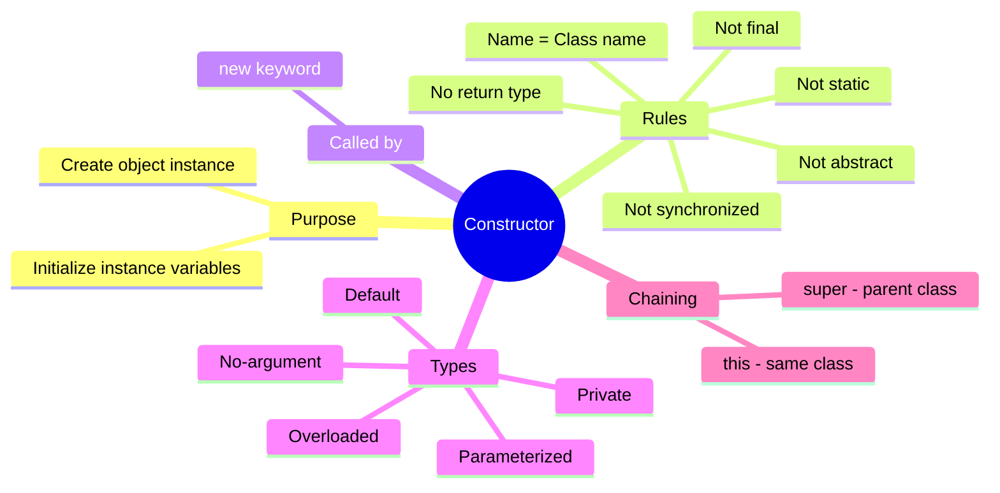
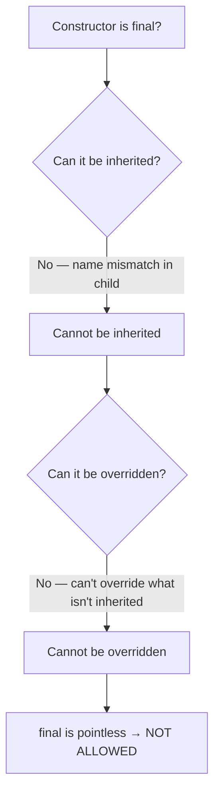
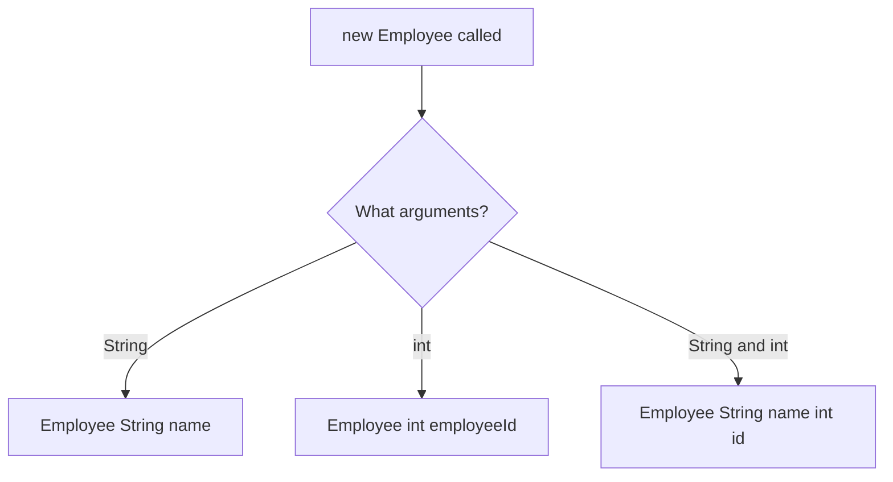
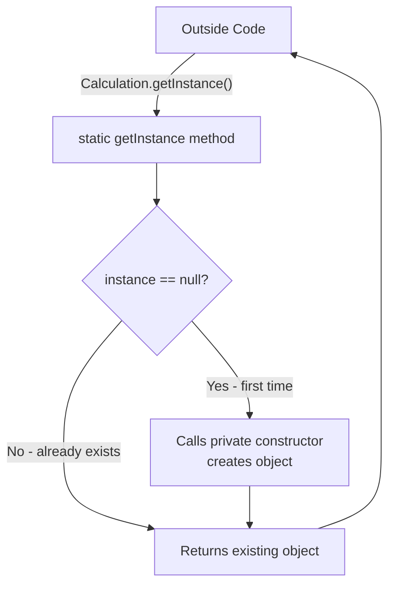
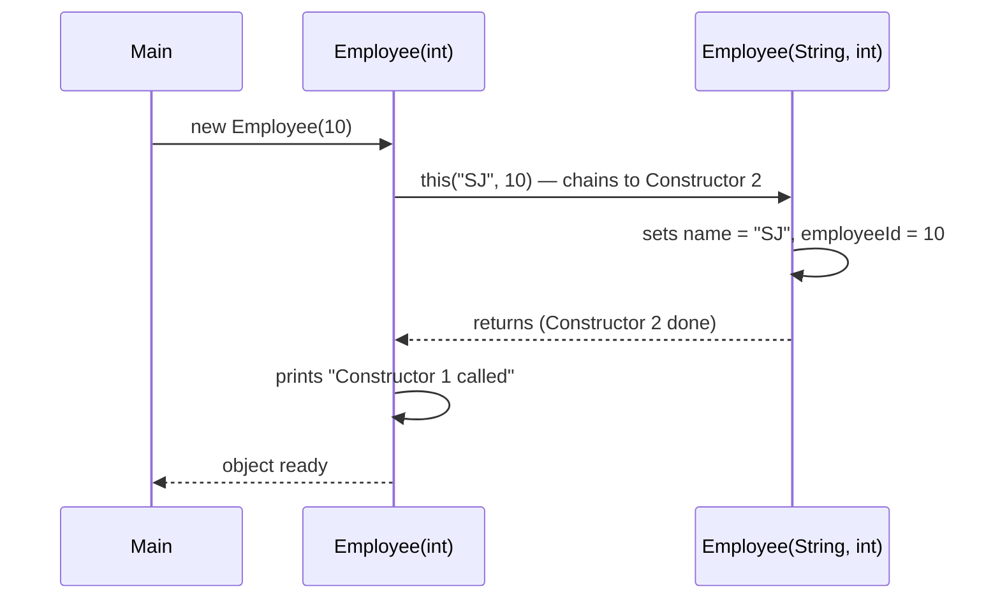
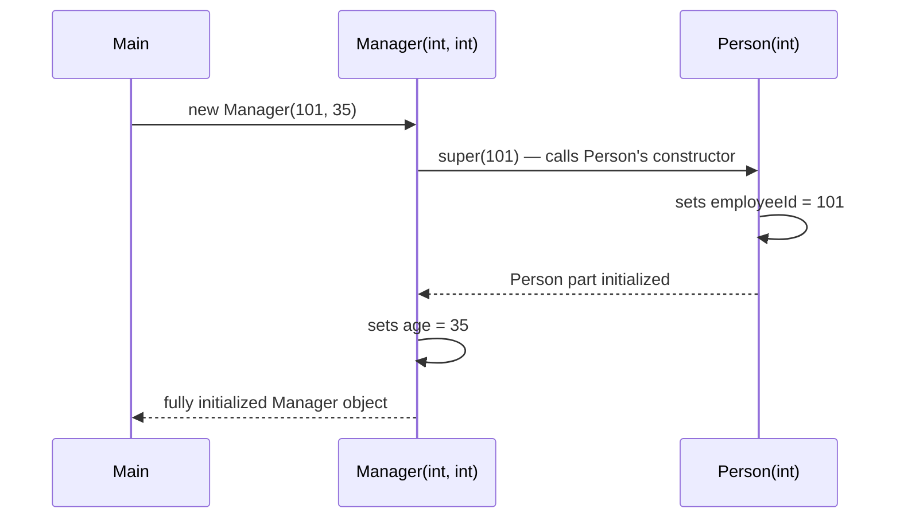
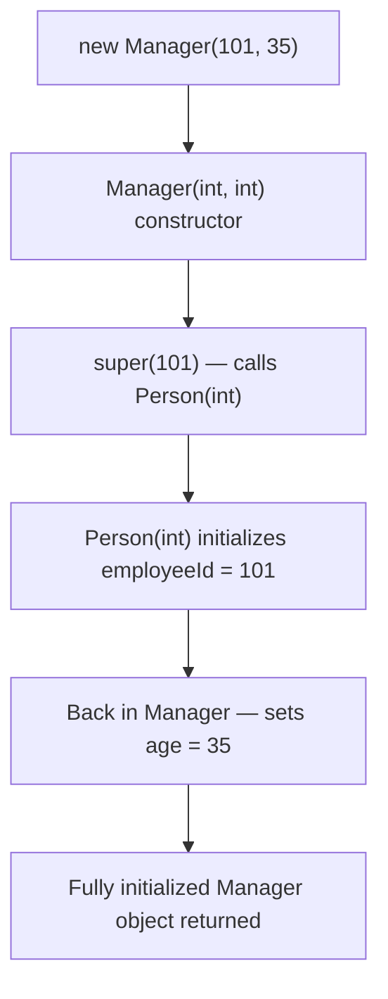
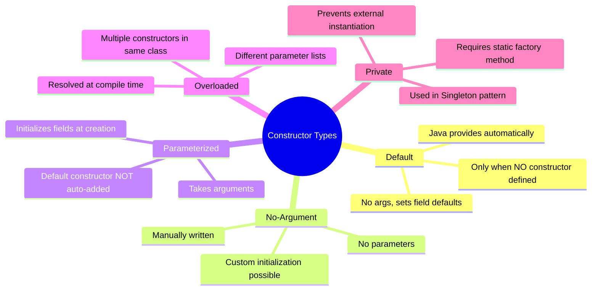
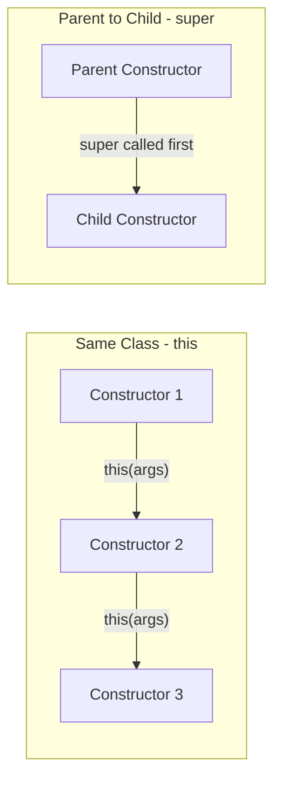

# 📚 Java Constructors — Complete Study Guide

> **Series:** Java Core Concepts | **Chapter:** Constructors  
> **Audience:** Beginner to Intermediate Java Developers  
> **Coverage:** Constructor Fundamentals, Types of Constructors, Constructor Overloading, Private Constructor, Constructor Chaining (`this` & `super`)

---

## 🗂️ Table of Contents

1. [What is a Constructor?](#1-what-is-a-constructor)
2. [Constructor vs Method — Key Distinctions](#2-constructor-vs-method--key-distinctions)
3. [Why Can't Constructors Be static, final, or abstract?](#3-why-cant-constructors-be-static-final-or-abstract)
4. [Can an Interface Have a Constructor?](#4-can-an-interface-have-a-constructor)
5. [Types of Constructors](#5-types-of-constructors)
   - [Default Constructor](#type-1--default-constructor)
   - [No-Argument Constructor](#type-2--no-argument-constructor)
   - [Parameterized Constructor](#type-3--parameterized-constructor)
   - [Constructor Overloading](#type-4--constructor-overloading)
   - [Private Constructor](#type-5--private-constructor)
6. [Constructor Chaining](#6-constructor-chaining)
   - [Using `this()`](#chaining-type-1--using-this)
   - [Using `super()`](#chaining-type-2--using-super)
7. [Interview Question Bank](#7-interview-question-bank)
8. [Master Summary](#8-master-summary)

---

# 1. What is a Constructor?

## Overview

A **constructor** is a special block of code inside a class that serves two purposes:

1. **Creates an instance** (object) of the class
2. **Initializes the instance variables** of that object

Every time you write `new ClassName()`, a constructor is being called behind the scenes.

---

## Definition

> A **constructor** is a special member of a class that has the **same name as the class**, has **no return type**, and is **automatically called** when an object is created using the `new` keyword.

---

## The Role of `new` — A Common Misconception

Many beginners think `new` *creates* the object. More precisely:

- **`new`** signals to the Java runtime: *"Call the constructor — not a method — for this class"*
- The **constructor** is what actually allocates memory and initializes the object
- `new` is necessary because a method can also have the same name as the class, and Java needs a way to distinguish "call the constructor" from "call that same-named method"

```java
class Employee {
    int employeeId;

    // This is a CONSTRUCTOR (no return type)
    Employee() {
        employeeId = 0;
    }

    // This is a METHOD (has return type — even if it's the same name)
    int Employee(int id) {
        return id * 2;
    }
}
```

> [!IMPORTANT]
> `new Employee()` → Java calls the **constructor**.  
> `obj.Employee(5)` → Java calls the **method**.  
> The `new` keyword is what tells the runtime to invoke the constructor specifically.

---

## Constructor vs Method — Quick Overview

| Feature | Constructor | Method |
|---------|-------------|--------|
| Name | Same as class name | Any valid identifier |
| Return type | None (not even `void`) | Must have a return type or `void` |
| Called by | `new` keyword (implicitly) | Explicitly by name |
| Purpose | Create + initialize object | Define behavior |
| Inherited? | ❌ No | ✅ Yes |
| Can be overridden? | ❌ No | ✅ Yes (if not `final`) |
| Can be `static`? | ❌ No | ✅ Yes |
| Can be `final`? | ❌ No | ✅ Yes |
| Can be `abstract`? | ❌ No | ✅ Yes |

---

## Mind Map — Constructor Fundamentals



---

# 2. Constructor vs Method — Key Distinctions

## Why Is the Constructor Name the Same as the Class Name?

Simple reason: **easy identification**.

A class can have hundreds of methods. By enforcing that only the constructor shares the class name, you can immediately spot it just by reading the code — without needing any other hint.

> [!NOTE]
> While Java technically allows a method to share the class name (it's not a syntax error), this is considered bad practice and is strongly discouraged. By convention: only the constructor uses the class name.

## Why Does the Constructor Have No Return Type?

A constructor implicitly returns the object of its own class. You don't need to (and cannot) declare a return type because:

- The JVM knows a constructor must return an instance of its enclosing class
- Declaring a return type would make Java treat it as a regular method instead

```java
class Employee {
    int employeeId;

    // CONSTRUCTOR — no return type, implicitly returns Employee object
    Employee() {
        this.employeeId = 0;
    }

    // METHOD — same name, but has a return type (int)
    // Java sees this as a regular method, NOT a constructor
    int Employee(int value) {
        return value;
    }
}
```

The two rules together — *same name as class* and *no return type* — form an unambiguous contract that lets Java (and developers) distinguish constructors from methods at a glance.

---

# 3. Why Can't Constructors Be `static`, `final`, or `abstract`?

These are **very frequently asked interview questions**. Each has a clear, logical reason.

---

## Why Can't a Constructor Be `final`?

### Reasoning

`final` on a method means: *this method cannot be overridden by any subclass.*

For `final` to make sense, the method must first be **inheritable**. But constructors are **never inherited**.

Here's why inheritance breaks for constructors:

```
Parent class: Employee
    Constructor: Employee() { ... }  ← name matches class = Employee

Child class: Manager extends Employee
    If the constructor were inherited...
    Constructor: Employee() { ... }  ← still named Employee!
                                       But we're inside Manager class now.
                                       This violates Rule 1: name must match class name.
                                       Java would treat it as a method (needs return type).
```

Because a constructor inherited into a subclass would no longer match the subclass's name, it can't function as a constructor there. Java would interpret it as a regular method — meaning it would need a return type, which breaks everything.

**Conclusion:** Since constructors cannot be inherited, they also cannot be overridden. Since they cannot be overridden, declaring them `final` (which prevents overriding) is meaningless and not allowed.



---

## Why Can't a Constructor Be `abstract`?

### Reasoning

An `abstract` method means: *I declare the method signature here, but the implementation must be provided by a subclass.*

For a subclass to provide the implementation, it must **inherit** the abstract method. But again — **constructors are not inherited**.

```java
abstract class Employee {
    abstract Employee(); // ❌ Hypothetical — what would this mean?
}

class Manager extends Employee {
    // How would Manager "implement" an Employee constructor?
    // It can't inherit it, so it can't implement it.
    // Manager's constructor must be named Manager(), not Employee()
}
```

Since the child class can never inherit the constructor, it can never provide its implementation. The entire purpose of `abstract` is defeated.

**Conclusion:** Constructors cannot be `abstract`.

---

## Why Can't a Constructor Be `static`?

### Reasoning — Two Problems

**Problem 1: Static methods cannot access instance variables**

A constructor's primary job is to **initialize instance variables**. Static methods/blocks belong to the class, not to any object — they have no concept of "which object's variables to set."

```java
class Employee {
    int employeeId; // instance variable

    // If constructor were static:
    static Employee() {
        this.employeeId = 10; // ❌ ERROR — static context can't use 'this'
                               // static has no reference to any specific object
    }
}
```

A `static` constructor would be unable to set `employeeId`, which defeats the entire purpose of constructors.

**Problem 2: Breaks constructor chaining with `super`**

Static methods cannot use `super` to call a parent's instance method or constructor. Constructor chaining (covered in depth in [Section 6](#6-constructor-chaining)) depends on `super()` — making the constructor `static` would destroy this mechanism entirely.

**Conclusion:** Constructors cannot be `static`.

---

## Summary Table — Why These Modifiers Are Forbidden

| Modifier | Why NOT Allowed on Constructor |
|----------|-------------------------------|
| `final` | Constructors can't be inherited → can't be overridden → `final` is meaningless |
| `abstract` | Constructors can't be inherited → child can't implement → `abstract` is meaningless |
| `static` | Static can't access instance variables (breaks initialization) + breaks `super()` chaining |
| `synchronized` | Not applicable — object doesn't exist yet when constructor runs |

---

# 4. Can an Interface Have a Constructor?

**No.** And the reason is simple:

You **cannot create an object of an interface**. Constructors exist specifically to create and initialize objects. Since you can never call `new InterfaceName()`, a constructor inside an interface would serve no purpose.

```java
interface Employee {
    void print();
    // Employee() { } // ❌ Not allowed — interfaces can't have constructors
}

class Manager implements Employee {
    Manager() { } // ✅ Manager has its own constructor

    @Override
    public void print() {
        System.out.println("Manager");
    }
}

// Employee emp = new Employee(); // ❌ Cannot instantiate an interface
Manager mgr = new Manager();     // ✅ Can instantiate the implementing class
```

Constructors belong to **concrete classes** — things that can be instantiated. Interfaces define contracts; their implementing classes provide both constructors and implementations.

---

# 5. Types of Constructors

---

## Type 1 — Default Constructor

### Definition

A **default constructor** is the constructor that **Java automatically adds** to a class when you do not define any constructor yourself.

It:
- Takes no arguments
- Has an empty body
- Sets all instance variables to their **default values** (`0` for numbers, `null` for objects, `false` for booleans)

### Example

```java
class Calculation {
    String name;   // default: null
    int value;     // default: 0
    boolean flag;  // default: false
    // No constructor defined by programmer
}
```

Java internally adds this (you don't write it, but it's there):

```java
// Auto-generated by Java — you never see this in your source file
Calculation() {
    // instance variables set to defaults by JVM
}
```

When you write:

```java
Calculation calc = new Calculation(); // Calls the default constructor
System.out.println(calc.name);        // null
System.out.println(calc.value);       // 0
```

**Output:**
```
null
0
```

> [!IMPORTANT]
> **The default constructor is only provided when you define NO constructor at all.** The moment you write even one constructor (parameterized or no-arg), Java stops providing the default constructor.

---

## Type 2 — No-Argument Constructor

### Definition

A **no-argument constructor** is a constructor with no parameters that you **manually define yourself**. It looks similar to the default constructor but is explicitly written by the programmer, allowing you to add custom initialization logic.

### Example

```java
class Calculation {
    String name;

    // No-argument constructor — manually defined
    Calculation() {
        name = ""; // custom initialization — not just the JVM default
        System.out.println("Calculation object created.");
    }
}

public class Main {
    public static void main(String[] args) {
        Calculation c = new Calculation();
        System.out.println(c.name); // ""
    }
}
```

**Output:**
```
Calculation object created.

```

### Default vs No-Argument — Key Difference

| Aspect | Default Constructor | No-Argument Constructor |
|--------|--------------------|-----------------------|
| Who writes it? | Java (auto-generated) | You (manually written) |
| Parameters | None | None |
| Custom logic | ❌ Not possible | ✅ Yes |
| When present | When NO constructor is defined | When you explicitly write it |

---

## Type 3 — Parameterized Constructor

### Definition

A **parameterized constructor** accepts one or more parameters, allowing you to pass values at the time of object creation to initialize instance variables with specific data.

### Example

```java
class Employee {
    String name;
    int employeeId;

    // Parameterized constructor
    Employee(String employeeName) {
        this.name = employeeName;
        this.employeeId = 0; // default for this constructor
    }
}

public class Main {
    public static void main(String[] args) {
        Employee e = new Employee("Shreyansh");
        System.out.println(e.name);       // Shreyansh
        System.out.println(e.employeeId); // 0
    }
}
```

**Output:**
```
Shreyansh
0
```

### The `this` Keyword in Constructors

When the parameter name and the instance variable name are the same, you use `this.variableName` to refer to the instance variable and distinguish it from the parameter:

```java
Employee(String name) {
    this.name = name; // this.name = instance variable; name = parameter
}
```

`this` refers to the **current object** — the one being constructed.

> [!WARNING]
> **If you only define a parameterized constructor, Java will NOT add a default constructor.** This means `new Employee()` with no arguments will cause a compile error.

```java
class Employee {
    String name;
    Employee(String name) { this.name = name; }
}

// Employee e1 = new Employee();           // ❌ Compile error — no no-arg constructor
Employee e2 = new Employee("Shreyansh");   // ✅ Works
```

---

## Type 4 — Constructor Overloading

### Definition

**Constructor overloading** is having multiple constructors in the same class with **different parameter lists** (different number or types of parameters). Java uses the arguments you pass with `new` to decide which constructor to call.

This follows the same rules as method overloading — same name, different parameters.

### Example

```java
class Employee {
    String name;
    int employeeId;

    // Constructor 1 — only name
    Employee(String name) {
        this.name = name;
        this.employeeId = 0;
    }

    // Constructor 2 — only id
    Employee(int employeeId) {
        this.name = "Unknown";
        this.employeeId = employeeId;
    }

    // Constructor 3 — both name and id
    Employee(String name, int employeeId) {
        this.name = name;
        this.employeeId = employeeId;
    }
}

public class Main {
    public static void main(String[] args) {
        Employee e1 = new Employee("Shreyansh");       // calls Constructor 1
        Employee e2 = new Employee(101);               // calls Constructor 2
        Employee e3 = new Employee("Shreyansh", 101);  // calls Constructor 3

        System.out.println(e1.name + " | " + e1.employeeId); // Shreyansh | 0
        System.out.println(e2.name + " | " + e2.employeeId); // Unknown | 101
        System.out.println(e3.name + " | " + e3.employeeId); // Shreyansh | 101
    }
}
```

**Output:**
```
Shreyansh | 0
Unknown | 101
Shreyansh | 101
```

### Resolution at Compile Time



Java resolves constructor overloading at **compile time** based on argument types and count — same as method overloading.

> [!IMPORTANT]
> There is **no such thing as constructor overriding**. Overriding requires inheritance, and constructors are not inherited. You can overload constructors (within the same class) but never override them.

---

## Type 5 — Private Constructor

### Definition

A **private constructor** is a constructor declared with the `private` access modifier. This **prevents any code outside the class** from creating an instance of the class directly.

### When Is It Used?

The classic use case is the **Singleton Design Pattern** — a pattern where you want to guarantee that **only one object** of a class ever exists.

### Example — Singleton Pattern with Private Constructor

```java
class Calculation {
    private static Calculation instance = null; // the single shared object

    // Private constructor — only THIS class can call it
    private Calculation() {
        System.out.println("Calculation object created.");
    }

    // Public static method — the only way to get an object
    public static Calculation getInstance() {
        if (instance == null) {
            instance = new Calculation(); // calls private constructor internally
        }
        return instance; // always returns the same object
    }
}

public class Main {
    public static void main(String[] args) {
        // Calculation c = new Calculation(); // ❌ Compile error — constructor is private

        Calculation c1 = Calculation.getInstance(); // ✅
        Calculation c2 = Calculation.getInstance(); // ✅ — same object returned

        System.out.println(c1 == c2); // true — both point to the same instance
    }
}
```

**Output:**
```
Calculation object created.
true
```

### Why `getInstance()` Must Be `static`

Since the constructor is private, you cannot create an object to call `getInstance()` on. That's a chicken-and-egg problem. Making `getInstance()` **static** means it can be called directly on the class name — no object needed:

```java
Calculation.getInstance(); // ✅ static method, called on class name
```



---

# 6. Constructor Chaining

## Overview

**Constructor chaining** is the mechanism of calling one constructor from another constructor. It eliminates code duplication and ensures consistent initialization.

There are two types:
1. **`this()`** — chains constructors within the **same class**
2. **`super()`** — chains to the **parent class constructor**

> [!IMPORTANT]
> Both `this()` and `super()` calls **must be the very first statement** in a constructor body. You cannot have any code before them.

---

## Chaining Type 1 — Using `this()`

`this()` is used to call another constructor **in the same class**. It allows one constructor to delegate work to another, avoiding duplicate initialization code.

### Example

```java
class Employee {
    String name;
    int employeeId;

    // Constructor 1 — just employeeId
    Employee(int employeeId) {
        this("SJ", employeeId); // calls Constructor 2
        System.out.println("Constructor 1 called");
    }

    // Constructor 2 — name + employeeId (does all the actual work)
    Employee(String name, int employeeId) {
        this.name = name;
        this.employeeId = employeeId;
        System.out.println("Constructor 2 called");
    }
}

public class Main {
    public static void main(String[] args) {
        Employee e = new Employee(10);
        System.out.println(e.name + " | " + e.employeeId);
    }
}
```

**Output:**
```
Constructor 2 called
Constructor 1 called
SJ | 10
```

### Step-by-Step Execution



> [!NOTE]
> Notice the order: Constructor 2 finishes **before** Constructor 1 resumes. The chained constructor always runs first.

---

## Chaining Type 2 — Using `super()`

`super()` calls the **parent class constructor** from a child class constructor. This ensures the parent part of the object is properly initialized before the child part.

### Key Rule — Implicit `super()`

Whenever you create an object of a child class, Java **always initializes the parent first**. If you don't explicitly write `super()`, Java automatically inserts `super()` (no-argument version) as the **first line** of the child constructor.

### Example 1 — Implicit `super()` (No-Argument Parent)

```java
class Person {
    Person() {
        System.out.println("Person constructor — no arg");
    }
}

class Manager extends Person {
    Manager() {
        // Java silently adds: super(); here
        System.out.println("Manager constructor — no arg");
    }
}

public class Main {
    public static void main(String[] args) {
        Manager obj = new Manager();
    }
}
```

**Output:**
```
Person constructor — no arg
Manager constructor — no arg
```

Parent is always initialized first — the output confirms this order.

---

### Example 2 — Explicit `super()` (Parameterized Parent)

When the parent class **only has a parameterized constructor** (no no-arg constructor), the child **must explicitly call** `super(args)` — Java cannot add it automatically because it doesn't know what arguments to pass.

```java
class Person {
    int employeeId;

    // Only a parameterized constructor — no default/no-arg
    Person(int employeeId) {
        this.employeeId = employeeId;
        System.out.println("Person constructor — id: " + employeeId);
    }
}

class Manager extends Person {
    int age;

    Manager(int employeeId, int age) {
        super(employeeId); // explicitly call parent's parameterized constructor
        this.age = age;
        System.out.println("Manager constructor — age: " + age);
    }
}

public class Main {
    public static void main(String[] args) {
        Manager m = new Manager(101, 35);
        System.out.println("ID: " + m.employeeId + ", Age: " + m.age);
    }
}
```

**Output:**
```
Person constructor — id: 101
Manager constructor — age: 35
ID: 101, Age: 35
```

### Step-by-Step Execution



---

### `super()` Rules

| Scenario | What happens |
|----------|-------------|
| Parent has a no-arg constructor, child doesn't write `super()` | Java auto-inserts `super()` — works fine |
| Parent has ONLY parameterized constructors, child doesn't write `super(args)` | ❌ **Compile error** — Java can't figure out what to pass |
| Child explicitly writes `super(args)` | ✅ Calls matching parent constructor |
| `super()` is not on the first line | ❌ **Compile error** — must be first statement |

---

### `this()` vs `super()` — Comparison

| Feature | `this()` | `super()` |
|---------|----------|-----------|
| Purpose | Call another constructor in same class | Call parent class constructor |
| Scope | Within the same class | Between parent and child class |
| Position | Must be first line of constructor | Must be first line of constructor |
| Can they coexist? | ❌ Not in the same constructor (only one can be first) | Same |
| Auto-added by Java? | ❌ No | ✅ Yes (no-arg version, if no explicit `super()` or `this()`) |

---

### Full Chaining Diagram



---

# 7. Interview Question Bank

## Core Constructor Questions

| Question | Key Answer |
|----------|-----------|
| What is a constructor? | Special method-like block; same name as class; no return type; creates + initializes objects |
| What does `new` do? | Signals JVM to call the constructor (not a same-named method); then the constructor creates the object |
| Why is the constructor name same as the class name? | Easy identification; convention to distinguish from methods |
| Why does a constructor have no return type? | Implicitly returns instance of its own class; JVM handles this; declaring return type would make it a method |
| Can a method have the same name as the class? | Yes (not recommended), but it must have a return type or `void` — Java distinguishes via return type presence |

## Modifier Questions (Most Frequently Asked)

| Question | Key Answer |
|----------|-----------|
| Why can't a constructor be `final`? | Constructors aren't inherited → can't be overridden → `final` is meaningless |
| Why can't a constructor be `abstract`? | Constructors aren't inherited → child can't implement → `abstract` is meaningless |
| Why can't a constructor be `static`? | Static can't access instance variables (breaks initialization) + breaks `super()` chaining |
| Are constructors inherited? | No — naming convention would break (child class name ≠ parent constructor name) |
| Can you have a constructor in an interface? | No — you can't instantiate an interface, so a constructor serves no purpose |

## Types & Patterns

| Question | Key Answer |
|----------|-----------|
| What is a default constructor? | Auto-added by Java when no constructor is defined; no-arg, sets fields to defaults |
| When is the default constructor NOT added? | When you define any constructor yourself |
| What is a parameterized constructor? | Takes arguments to initialize fields at creation time |
| What is constructor overloading? | Multiple constructors with different parameter lists in the same class |
| Is there constructor overriding? | No — constructors can't be inherited, so they can't be overridden |
| What is a private constructor? | Prevents external instantiation; used in Singleton pattern |
| What is the Singleton pattern? | Ensures only one object exists; private constructor + static `getInstance()` |

## Constructor Chaining

| Question | Key Answer |
|----------|-----------|
| What is constructor chaining? | Calling one constructor from another to reuse initialization logic |
| What is `this()` used for? | Call another constructor in the same class |
| What is `super()` used for? | Call the parent class constructor from a child constructor |
| Where must `this()` / `super()` appear? | Must be the **first statement** in the constructor body |
| What happens if parent has only a parameterized constructor? | Child must explicitly call `super(args)` — Java can't auto-insert it |
| What does Java automatically add to every child constructor? | `super()` (no-arg) as the first line, unless you write `this()` or `super()` explicitly |

---

# 8. Master Summary

## All Constructor Types — Quick Reference



---

## Constructor Chaining Summary



---

## Quick Revision Bullets

- ✅ **Constructor** = same name as class + no return type + called via `new`
- ✅ **`new`** tells the JVM: "call the constructor, not the same-named method"
- ✅ **No return type** because constructor implicitly returns the class instance
- ✅ **Constructor ≠ inherited** → cannot be `final` (no overriding), cannot be `abstract` (no implementation by child)
- ✅ **Constructor ≠ static** → static can't access instance variables; also breaks `super()` chaining
- ✅ **Interface** cannot have a constructor — you can't create an interface object
- ✅ **Default constructor** — added by Java only when you define zero constructors; sets fields to defaults
- ✅ **No-arg constructor** — manually written version; allows custom logic
- ✅ **Parameterized constructor** — accepts arguments; once defined, no default constructor is auto-added
- ✅ **Constructor overloading** — same class, different parameter lists; resolved at compile time
- ✅ **No constructor overriding** — constructors aren't inherited, so they can't be overridden
- ✅ **Private constructor** — blocks external instantiation; used in Singleton pattern with a `static` factory method
- ✅ **`this()`** = chains constructors within the same class; must be first line
- ✅ **`super()`** = calls parent constructor from child; must be first line; auto-inserted (no-arg) if not written
- ✅ **Parent always initializes first** — even if implicit, the parent constructor runs before the child constructor body

---

> [!TIP]
> **Coming up next in the series:**
> - **Methods** — parameters, return types, method types
> - **Memory Management & Garbage Collector** — how the JVM manages stack, heap, and reclaims unused objects (this will make constructors and `new` click at a deeper level)

---

*End of Chapter — Java Constructors*
