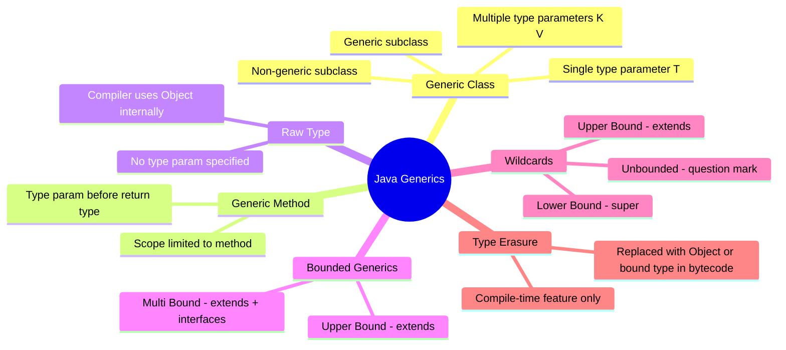
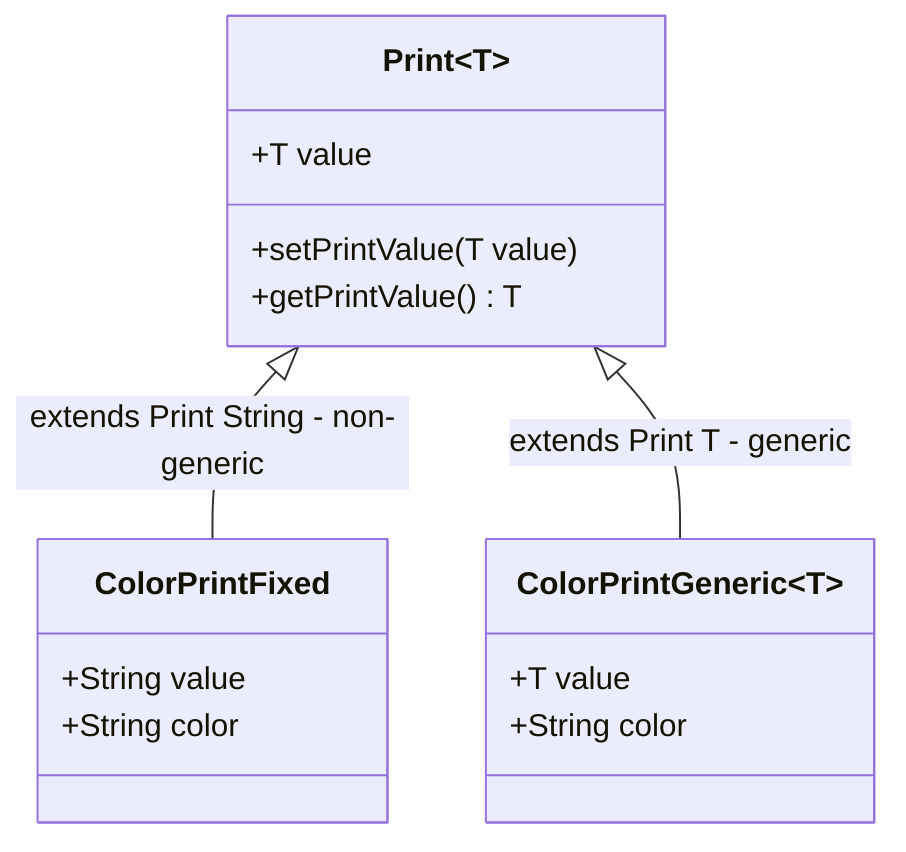
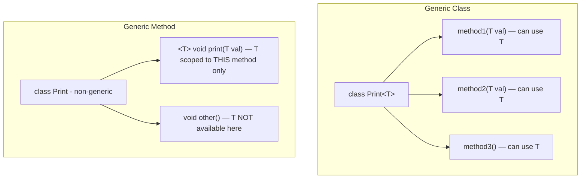
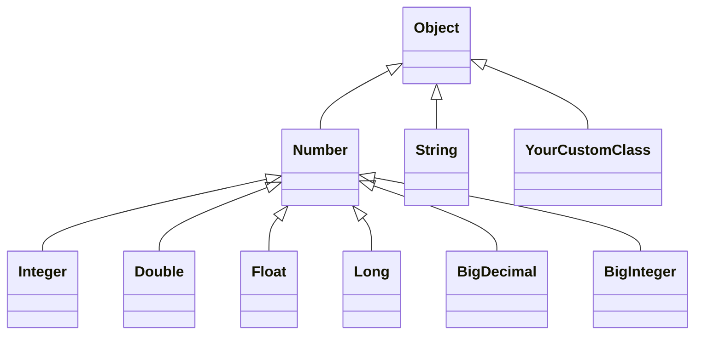
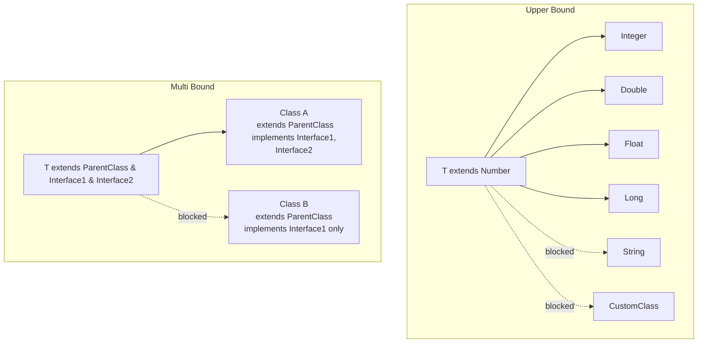
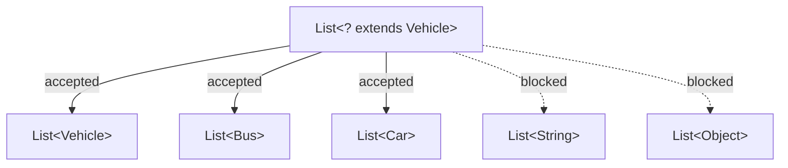
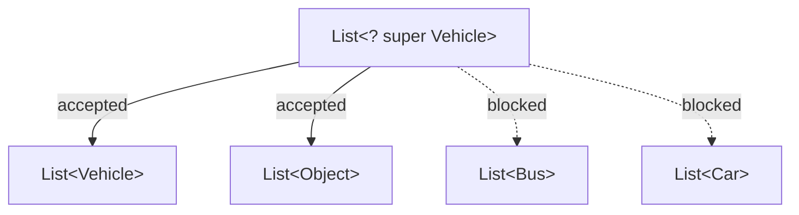
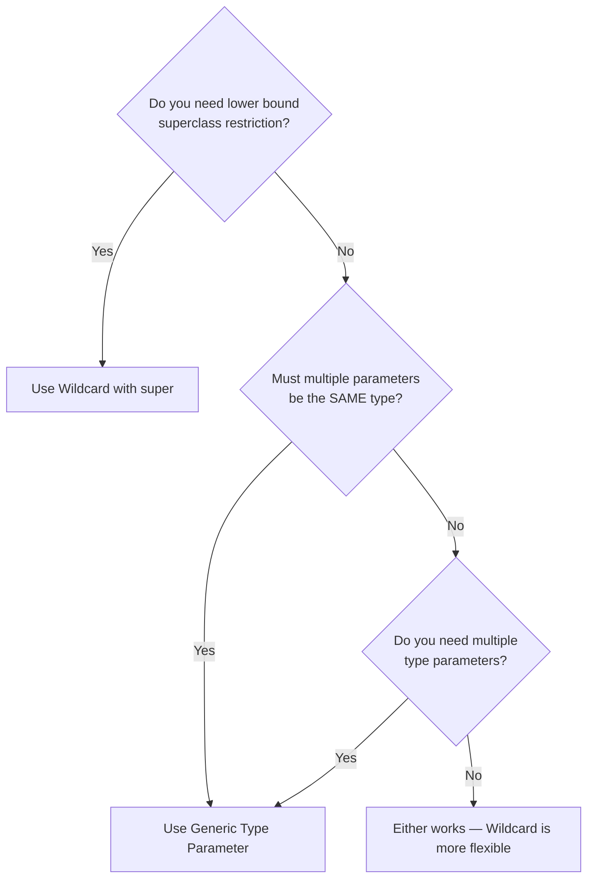
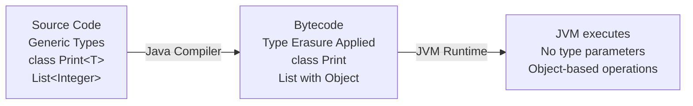

# 📚 Java Generics — Complete Study Guide

> **Series:** Java Core Concepts | **Chapter:** Generic Classes & Methods  
> **Audience:** Intermediate Java Developers  
> **Coverage:** Generic Classes, Generic Methods, Bounded Generics, Wildcards, Raw Types, Type Erasure

---

## 🗂️ Table of Contents

1. [The Problem Generics Solve](#1-the-problem-generics-solve)
2. [What are Generics?](#2-what-are-generics)
3. [Generic Classes](#3-generic-classes)
4. [Inheritance with Generic Classes](#4-inheritance-with-generic-classes)
5. [Multiple Type Parameters](#5-multiple-type-parameters)
6. [Generic Methods](#6-generic-methods)
7. [Raw Types](#7-raw-types)
8. [Bounded Generics](#8-bounded-generics)
9. [Wildcards](#9-wildcards)
10. [Generic Type Parameter vs Wildcard — When to Use Which](#10-generic-type-parameter-vs-wildcard--when-to-use-which)
11. [Type Erasure](#11-type-erasure)
12. [Interview Question Bank](#12-interview-question-bank)
13. [Master Summary](#13-master-summary)

---

## Mind Map — Generics Overview



---

# 1. The Problem Generics Solve

## The Starting Problem — Using `Object` as a Universal Type

Before understanding generics, let's understand *why they were needed*.

Since `Object` is the **parent of all classes** in Java, a variable of type `Object` can hold a reference to any object. This seems powerful — but it creates a painful problem: **you always have to typecast, and you can make mistakes at runtime**.

### Example — The Pre-Generics Approach

```java
class Print {
    Object value;

    void setPrintValue(Object value) {
        this.value = value;
    }

    Object getPrintValue() {
        return value;
    }
}

public class Main {
    public static void main(String[] args) {
        Print obj = new Print();

        // Storing an Integer
        obj.setPrintValue(1);
        int intVal = (int) obj.getPrintValue(); // Must typecast — tedious

        // Storing a String — also accepted (no restriction)
        obj.setPrintValue("Hello");

        // Now what type does this hold? Integer? String? Something else?
        // You have no idea without tracking it manually.
        Object val = obj.getPrintValue();

        if (val instanceof Integer) {
            int v = (int) val;
        } else if (val instanceof String) {
            String v = (String) val;
        }
        // ... and so on for every possible type
    }
}
```

### Problems with This Approach

| Problem | Explanation |
|---------|-------------|
| **Mandatory typecasting** | Every `get` call requires a cast — verbose and error-prone |
| **No type safety** | You can store any type accidentally — no compile-time check |
| **Runtime ClassCastException** | If you cast to the wrong type, the program crashes at *runtime*, not at compile time |
| **No expressive API** | Code readers can't tell what type a `Print` object is supposed to hold |

> [!IMPORTANT]
> **Generics shift type errors from runtime to compile time.** This is their single greatest advantage.

---

# 2. What are Generics?

## Definition

**Generics** allow you to write classes, interfaces, and methods where the **type of data being operated on is specified as a parameter**. Instead of hardcoding `Object`, you define a placeholder (like `T`) that is replaced with a concrete type when the code is used.

> A **generic class** is a class that is parameterized over types.

## Syntax — The Diamond Operator

The **diamond operator** `<>` is used to declare and use type parameters:

```
ClassName<TypeParameter>
```

Common type parameter naming conventions (just conventions — you can use any letter):

| Letter | Common Usage |
|--------|-------------|
| `T` | Type (general purpose) |
| `E` | Element (used in collections) |
| `K` | Key (used in maps) |
| `V` | Value (used in maps) |
| `N` | Number |
| `R` | Return type |

---

# 3. Generic Classes

## Syntax

```java
class ClassName<T> {
    T value; // T used as field type

    void setValue(T value) {
        this.value = value;
    }

    T getValue() {
        return value;
    }
}
```

## Converting the `Print` Class to Generic

```java
// BEFORE — using Object (problem-prone)
class Print {
    Object value;
    void setPrintValue(Object value) { this.value = value; }
    Object getPrintValue() { return value; }
}

// AFTER — using Generic (type-safe)
class Print<T> {
    T value;
    void setPrintValue(T value) { this.value = value; }
    T getPrintValue() { return value; }
}
```

## Using the Generic Class

```java
public class Main {
    public static void main(String[] args) {
        // Create a Print for Integer
        Print<Integer> intObj = new Print<>();
        intObj.setPrintValue(42);
        int val = intObj.getPrintValue(); // No cast needed!
        System.out.println(val); // 42

        // Create a Print for String
        Print<String> strObj = new Print<>();
        strObj.setPrintValue("Hello Generics");
        String str = strObj.getPrintValue(); // No cast needed!
        System.out.println(str); // Hello Generics

        // Type safety at compile time:
        // intObj.setPrintValue("Hello"); // ❌ Compile error — can only accept Integer
    }
}
```

**Output:**
```
42
Hello Generics
```

## Line-by-Line Explanation

| Code | Explanation |
|------|-------------|
| `Print<Integer>` | Tell Java: replace `T` with `Integer` for this object |
| `Print<String>` | Tell Java: replace `T` with `String` for this object |
| `intObj.getPrintValue()` | Returns `Integer` — no cast needed because compiler knows the type |
| `intObj.setPrintValue("Hello")` | ❌ Compile error — type constraint enforced at compile time |

---

## What Can Replace `T`?

> [!IMPORTANT]
> **Generics only work with non-primitive (reference) types.**

```java
Print<Integer> p1 = new Print<>();  // ✅ Integer (wrapper class)
Print<String>  p2 = new Print<>();  // ✅ String
Print<MyClass> p3 = new Print<>();  // ✅ Any custom class
Print<int>     p4 = new Print<>();  // ❌ Compile error — int is primitive
Print<double>  p5 = new Print<>();  // ❌ Compile error — double is primitive
```

Use wrapper classes for primitives: `int` → `Integer`, `double` → `Double`, etc.

---

## Before vs After — Generics Comparison

| Aspect | Without Generics (`Object`) | With Generics (`T`) |
|--------|-----------------------------|---------------------|
| Type safety | ❌ None | ✅ Compile-time |
| Typecasting | ❌ Required everywhere | ✅ Not needed |
| Error detection | ❌ Runtime (ClassCastException) | ✅ Compile time |
| Code clarity | ❌ Unclear what type is stored | ✅ Explicitly declared |
| Multiple types accidentally | ❌ Can mix types | ✅ Constrained to one |

---

# 4. Inheritance with Generic Classes

A generic class can be extended just like a regular class. The behavior depends on whether the subclass is **generic** or **non-generic**.

---

## Case 1 — Non-Generic Subclass

When the subclass is **not generic**, it must **specify the type parameter at the point of `extends`** — locking in the type for good.

```java
class Print<T> {
    T value;
    T getPrintValue() { return value; }
    void setPrintValue(T value) { this.value = value; }
}

// Non-generic subclass — must specify T at extends
class ColorPrint extends Print<String> {
    String color;
}
```

```java
public class Main {
    public static void main(String[] args) {
        ColorPrint cp = new ColorPrint(); // No diamond needed — not generic
        cp.setPrintValue("Vivid Blue");   // Only String accepted
        System.out.println(cp.getPrintValue()); // Vivid Blue
    }
}
```

**Output:**
```
Vivid Blue
```

> The type is fixed at `String` for all `ColorPrint` objects. You cannot create a `ColorPrint` of Integer.

---

## Case 2 — Generic Subclass

When the subclass is **also generic**, it passes the type parameter through. The concrete type is specified only at **object creation time**.

```java
class ColorPrint<T> extends Print<T> {
    // T flows through from Print<T>
    String color;
}
```

```java
public class Main {
    public static void main(String[] args) {
        ColorPrint<String> cs = new ColorPrint<>();
        cs.setPrintValue("Ocean Blue");
        System.out.println(cs.getPrintValue()); // Ocean Blue

        ColorPrint<Integer> ci = new ColorPrint<>();
        ci.setPrintValue(100);
        System.out.println(ci.getPrintValue()); // 100
    }
}
```

**Output:**
```
Ocean Blue
100
```

---

## Inheritance Diagram



---

## Summary — Generic vs Non-Generic Subclass

| Aspect | Non-Generic Subclass | Generic Subclass |
|--------|---------------------|-----------------|
| Type fixed at | `extends` declaration | Object creation time |
| Flexibility | Low — one type forever | High — any type per object |
| Syntax | `class Child extends Parent<String>` | `class Child<T> extends Parent<T>` |

---

# 5. Multiple Type Parameters

A generic class can have **more than one type parameter**, separated by commas inside the diamond.

## Example — Key-Value Pair

```java
class Pair<K, V> {
    K key;
    V value;

    void put(K key, V value) {
        this.key = key;
        this.value = value;
    }

    K getKey() { return key; }
    V getValue() { return value; }
}
```

## Using the Pair Class

```java
public class Main {
    public static void main(String[] args) {
        // K = String, V = Integer
        Pair<String, Integer> pair = new Pair<>();
        pair.put("Age", 25);
        System.out.println(pair.getKey() + ": " + pair.getValue()); // Age: 25

        // K = Integer, V = String
        Pair<Integer, String> pair2 = new Pair<>();
        pair2.put(101, "Shreyansh");
        System.out.println(pair2.getKey() + ": " + pair2.getValue()); // 101: Shreyansh
    }
}
```

**Output:**
```
Age: 25
101: Shreyansh
```

## Two Valid Object Creation Syntaxes

```java
// Syntax 1 — type specified on both sides
Pair<String, Integer> p1 = new Pair<String, Integer>();

// Syntax 2 — type inferred from left side (diamond inference)
Pair<String, Integer> p2 = new Pair<>();  // preferred — less verbose
```

Both are correct. Syntax 2 is preferred in modern Java (Java 7+) because the compiler can infer the type from the left side.

---

# 6. Generic Methods

## Overview

You don't always need to make an entire class generic. Sometimes only **one or two methods** need to work with a type parameter. Java allows you to make **individual methods generic** while keeping the class itself non-generic.

---

## Syntax

```java
// Return type is void, type parameter T declared BEFORE the return type
public <T> void methodName(T parameter) {
    // use T here
}

// Return type uses T
public <T> T methodName(T parameter) {
    return parameter;
}
```

> [!IMPORTANT]
> **The type parameter must be declared *before* the return type** in the method signature. This is what makes the method generic.

---

## Example — Generic Method in a Non-Generic Class

```java
class GenericMethodClass {
    // Non-generic class — but contains a generic method

    public <T> void printValue(T value) {
        System.out.println("Value: " + value);
        System.out.println("Type: " + value.getClass().getSimpleName());
    }
}

public class Main {
    public static void main(String[] args) {
        GenericMethodClass gm = new GenericMethodClass();

        gm.printValue(42);          // T = Integer
        gm.printValue("Hello");     // T = String
        gm.printValue(3.14);        // T = Double

        // Custom class
        // gm.printValue(new Bus()); // T = Bus — works too
    }
}
```

**Output:**
```
Value: 42
Type: Integer
Value: Hello
Type: String
Value: 3.14
Type: Double
```

---

## Generic Method vs Generic Class — Scope Difference



| Aspect | Generic Class `<T>` | Generic Method `<T>` |
|--------|--------------------|--------------------|
| Where `T` is available | Entire class (all methods, fields) | Only within that one method |
| Declared at | Class name | Before return type of method |
| Object creation | `new Print<Integer>()` | No change at call site |

---

# 7. Raw Types

## Definition

A **raw type** is when you use a generic class **without specifying any type parameter**. When you don't supply a type, the compiler internally treats the type parameter as `Object`.

## Example

```java
class Print<T> {
    T value;
    void setPrintValue(T value) { this.value = value; }
    T getPrintValue() { return value; }
}

public class Main {
    public static void main(String[] args) {
        // Parameterized type — type-safe
        Print<String> parameterized = new Print<>();
        parameterized.setPrintValue("Hello");
        // parameterized.setPrintValue(42); // ❌ Compile error

        // Raw type — no type specified
        Print raw = new Print(); // internally: Print<Object>
        raw.setPrintValue("Hello");   // ✅ accepted
        raw.setPrintValue(42);        // ✅ also accepted — no restriction
        raw.setPrintValue(new Object()); // ✅ also accepted
    }
}
```

## What Happens Internally

```java
// What you write:
Print raw = new Print();

// What the compiler sees internally:
Print<Object> raw = new Print<Object>(); // Object is substituted for T
```

Since `Object` is the parent of all, the raw type accepts anything — which defeats the purpose of generics.

> [!WARNING]
> **Avoid using raw types in production code.** They bypass type safety, can cause `ClassCastException` at runtime, and generate compiler warnings. Raw types exist primarily for backward compatibility with pre-Java 5 code.

---

# 8. Bounded Generics

## Overview

By default, a type parameter `T` can be replaced with **any** reference type. **Bounded generics** let you **restrict** what types can be used as the type argument — only a specific class/interface hierarchy is allowed.

---

## Upper Bound — `extends`

### Definition

An **upper bound** restricts `T` to be either the **specified class/interface OR any of its subclasses**.

### Syntax

```java
class ClassName<T extends UpperBoundClass> {
    // T can be UpperBoundClass or any class that extends it
}
```

### The Class Hierarchy for This Example



### Example

```java
class Print<T extends Number> {  // T can only be Number or its subclasses
    T value;

    void setPrintValue(T value) { this.value = value; }
    T getPrintValue() { return value; }
}

public class Main {
    public static void main(String[] args) {
        Print<Integer> intPrint = new Print<>();    // ✅ Integer extends Number
        Print<Double>  dblPrint = new Print<>();    // ✅ Double extends Number
        Print<Float>   fltPrint = new Print<>();    // ✅ Float extends Number

        // Print<String> strPrint = new Print<>();  // ❌ Compile error — String doesn't extend Number
    }
}
```

> [!NOTE]
> The `extends` keyword here is **not the same as class inheritance `extends`**. In the bounded type parameter context:
> - For a **class** → `T extends SomeClass` means T must be SomeClass or its subclass
> - For an **interface** → `T extends SomeInterface` (NOT `implements`) — same syntax even for interfaces

### Advantage — Methods of the Bound Are Available

When you bound `T extends Number`, inside the generic class you can call `Number`'s methods on `T`:

```java
class NumericPrint<T extends Number> {
    T value;

    void printDoubleValue() {
        // Since T is guaranteed to be a Number, we can call Number's methods
        System.out.println(value.doubleValue()); // ✅ available because T extends Number
    }
}
```

Without the bound, you couldn't call `.doubleValue()` because `T` could be anything.

---

## Multi-Bound — `extends` with Multiple Interfaces

### Definition

A **multi-bound** type parameter requires that the type argument **extend one class AND implement one or more interfaces** simultaneously.

### Background — Java Inheritance Rules (Recap)

| Rule | Explanation |
|------|-------------|
| A class can `extend` only ONE class | No multiple class inheritance in Java (Diamond Problem) |
| A class can `implement` multiple interfaces | No conflict — interfaces have no implementation |

Multi-bound generics mirror this: the first bound must be a **concrete/abstract class**, and subsequent bounds must be **interfaces**.

### Syntax

```java
class ClassName<T extends ParentClass & Interface1 & Interface2> {
    // T must extend ParentClass AND implement Interface1 AND Interface2
}
```

> [!IMPORTANT]
> The **class must come first** in multi-bound syntax. Interfaces follow after `&`. If you list an interface before a class, you get a compile error.

### Example

```java
class ParentClass { }
interface Interface1 { void method1(); }
interface Interface2 { void method2(); }

// Multi-bound: T must extend ParentClass AND implement Interface1 AND Interface2
class Print<T extends ParentClass & Interface1 & Interface2> {
    T value;
    void setValue(T val) { this.value = val; }
}

// Class A — satisfies all constraints
class A extends ParentClass implements Interface1, Interface2 {
    public void method1() { }
    public void method2() { }
}

// Class B — only implements one interface
class B extends ParentClass implements Interface1 {
    public void method1() { }
    // Missing Interface2!
}

public class Main {
    public static void main(String[] args) {
        Print<A> validPrint = new Print<>();   // ✅ A satisfies all bounds
        // Print<B> invalidPrint = new Print<>(); // ❌ B doesn't implement Interface2
    }
}
```

---

## Bounded Generics Diagram



---

# 9. Wildcards

## The Problem Wildcards Solve

Consider this class hierarchy:

```
Vehicle
├── Bus
└── Car
```

You know that `Bus` is a subtype of `Vehicle`. But is `List<Bus>` a subtype of `List<Vehicle>`?

**No. And this is crucial to understand.**

```java
Vehicle vehicleObj = new Bus(); // ✅ Valid — parent ref holds child object

List<Vehicle> vehicleList = new ArrayList<>();
List<Bus>     busList     = new ArrayList<>();

vehicleList = busList; // ❌ Compile error — List<Bus> is NOT a subtype of List<Vehicle>
busList = vehicleList; // ❌ Compile error — same reason
```

### Why Isn't `List<Bus>` a Subtype of `List<Vehicle>`?

Because `List<Vehicle>` allows adding `Car` objects (also a Vehicle). If `List<Bus>` were assignable to `List<Vehicle>`, someone could add a `Car` to what is really a `List<Bus>` — which would be wrong.

```java
// HYPOTHETICAL (Java correctly prevents this)
List<Vehicle> ref = busList; // If this were allowed...
ref.add(new Car());          // ...this would corrupt the busList with a Car!
```

Java prevents this to protect type safety. This is called **invariance** — generic types are invariant by default.

### The Consequence

```java
class Print {
    // This method only accepts List<Vehicle> — not List<Bus> or List<Car>
    void setPrintValues(List<Vehicle> vehicles) { ... }
}

List<Vehicle> vList = new ArrayList<>();
List<Bus>     bList = new ArrayList<>();

print.setPrintValues(vList); // ✅
print.setPrintValues(bList); // ❌ Compile error — List<Bus> ≠ List<Vehicle>
```

**This is where wildcards come in.**

---

## Wildcard Syntax — The `?` Operator

The **wildcard** `?` is a special type argument that means "unknown type". It makes generic types flexible in ways that regular type parameters don't.

There are three forms:

| Wildcard | Syntax | Meaning |
|----------|--------|---------|
| Upper Bound | `? extends Type` | Type or any subclass |
| Lower Bound | `? super Type` | Type or any superclass |
| Unbounded | `?` | Any type |

---

## Wildcard Type 1 — Upper Bound (`? extends`)

**Accepts: the specified type AND all its subclasses.**

```java
class Print {
    // Accepts List<Vehicle>, List<Bus>, List<Car>
    void setPrintValues(List<? extends Vehicle> vehicles) {
        for (Vehicle v : vehicles) {
            System.out.println(v);
        }
    }
}

public class Main {
    public static void main(String[] args) {
        Print p = new Print();

        List<Vehicle> vList = new ArrayList<>();
        List<Bus>     bList = new ArrayList<>();
        List<Car>     cList = new ArrayList<>();

        p.setPrintValues(vList); // ✅ Vehicle itself
        p.setPrintValues(bList); // ✅ Bus extends Vehicle
        p.setPrintValues(cList); // ✅ Car extends Vehicle
    }
}
```



---

## Wildcard Type 2 — Lower Bound (`? super`)

**Accepts: the specified type AND all its superclasses.**

```java
class Print {
    // Accepts List<Vehicle>, List<Object> (superclasses of Vehicle)
    // Does NOT accept List<Bus>, List<Car> (subclasses of Vehicle)
    void addVehicles(List<? super Vehicle> vehicles) {
        vehicles.add(new Vehicle());
    }
}

public class Main {
    public static void main(String[] args) {
        Print p = new Print();

        List<Vehicle> vList = new ArrayList<>();
        List<Object>  oList = new ArrayList<>();
        List<Bus>     bList = new ArrayList<>();

        p.addVehicles(vList); // ✅ Vehicle itself
        p.addVehicles(oList); // ✅ Object is superclass of Vehicle
        // p.addVehicles(bList); // ❌ Bus is a subclass, not superclass
    }
}
```



---

## Wildcard Type 3 — Unbounded (`?`)

**Accepts: any type whatsoever.**

Use this when your method only needs to work with methods from `Object` (the parent of all), because that's the only thing you can safely call — you don't know what the actual type is.

```java
class Print {
    void printList(List<?> list) {
        for (Object item : list) {
            // Can only call Object methods — .toString(), .hashCode(), etc.
            System.out.println(item);
        }
    }
}

public class Main {
    public static void main(String[] args) {
        Print p = new Print();

        List<Integer> ints    = List.of(1, 2, 3);
        List<String>  strings = List.of("a", "b", "c");
        List<Vehicle> vehicles = new ArrayList<>();

        p.printList(ints);     // ✅
        p.printList(strings);  // ✅
        p.printList(vehicles); // ✅
    }
}
```

> [!NOTE]
> With `List<?>`, you **cannot add elements** to the list (except `null`) because the compiler doesn't know what type the list holds. You can only read from it (as `Object`).

---

# 10. Generic Type Parameter vs Wildcard — When to Use Which

This is a subtle but important distinction. Here's a clear breakdown:

## Key Differences

| Feature | Generic Type `<T extends Number>` | Wildcard `<? extends Number>` |
|---------|----------------------------------|------------------------------|
| **Multiple parameters same type** | ✅ Enforces same type across params | ❌ Each `?` can be different type |
| **Lower bound** (`super`) | ❌ Not supported | ✅ Supported |
| **Multiple type params** | ✅ `<T, K, V>` | ❌ One `?` only per use |
| **Flexibility** | More structured/restrictive | More flexible |
| **When to use** | When parameters must share the same type | When you just need to accept a range of types |

## Example — The Critical Difference

```java
// WILDCARD — source and destination can be DIFFERENT types (both just extend Number)
void computeList(List<? extends Number> source, List<? extends Number> destination) {
    // source could be List<Integer>, destination could be List<Double>
    // No enforcement that they're the same type
}

// GENERIC TYPE — source and destination MUST be the SAME type
<T extends Number> void computeList(List<T> source, List<T> destination) {
    // If source is List<Integer>, destination MUST also be List<Integer>
}
```

```java
List<Integer> intList   = new ArrayList<>();
List<Double>  doubleList = new ArrayList<>();

// With wildcard:
computeListWildcard(intList, doubleList);  // ✅ Different types OK

// With generic type:
// computeListGeneric(intList, doubleList); // ❌ Compile error — T can't be both Integer and Double
computeListGeneric(intList, intList);      // ✅ Same type OK
```

## Decision Guide



---

# 11. Type Erasure

## What is Type Erasure?

**Type erasure** is the process by which the Java compiler **removes all generic type information** when generating bytecode. Generics are a **compile-time feature only** — at runtime, the JVM knows nothing about type parameters.

All type parameters are replaced with either:
- **`Object`** (for unbounded types)
- **The upper bound class** (for bounded types like `T extends Number` → replaced with `Number`)

---

## Examples of Type Erasure

### Unbounded Generic Class

```java
// What you write:
class Print<T> {
    T value;
    T getPrintValue() { return value; }
    void setPrintValue(T value) { this.value = value; }
}

// What the bytecode looks like after erasure:
class Print {
    Object value;
    Object getPrintValue() { return value; }
    void setPrintValue(Object value) { this.value = value; }
}
```

### Bounded Generic Class

```java
// What you write:
class Print<T extends Number> {
    T value;
    T getPrintValue() { return value; }
}

// What the bytecode looks like after erasure:
class Print {
    Number value;            // T replaced with upper bound: Number
    Number getPrintValue() { return value; }
}
```

### Generic Method

```java
// What you write:
public <T> void printValue(T value) {
    System.out.println(value);
}

// What the bytecode looks like after erasure:
public void printValue(Object value) {  // T replaced with Object
    System.out.println(value);
}

// Bounded generic method:
public <T extends Bus> void setValue(T val) { ... }

// After erasure:
public void setValue(Bus val) { ... }   // T replaced with Bus
```

---

## Why Does Type Erasure Exist?

Type erasure was introduced to maintain **backward compatibility** with pre-Java 5 code (before generics were added). Existing bytecode and libraries that used raw types (`List`, `Map`) could continue to work unchanged.

---

## Consequences of Type Erasure

| Consequence | Explanation |
|-------------|-------------|
| Cannot use `instanceof` with type params | `if (obj instanceof T)` → ❌ T is erased at runtime |
| Cannot create instances of T | `new T()` → ❌ Compiler doesn't know what T is at runtime |
| Cannot create arrays of parameterized types | `new T[10]` → ❌ |
| `List<Integer>` and `List<String>` are same class at runtime | Both become `List` after erasure |

```java
class Example<T> {
    void test(Object obj) {
        // if (obj instanceof T) { }  // ❌ Compile error — T is erased

        // T t = new T();             // ❌ Compile error — can't instantiate T

        // T[] arr = new T[10];       // ❌ Compile error — can't create T array
    }
}
```

---

## Type Erasure Diagram



---

# 12. Interview Question Bank

## Core Generics

| Question | Key Answer |
|----------|-----------|
| What are generics in Java? | Write type-parameterized classes/methods; type specified at use time; shifts errors to compile time |
| Why were generics introduced? | Avoid typecasting, provide type safety, prevent ClassCastException at runtime |
| Can generics use primitive types? | No — only reference types; use wrapper classes (Integer, Double, etc.) |
| What is a type parameter? | Placeholder letter (T, K, V) replaced with actual type at compile time |
| What is the diamond operator? | `<>` — used to declare and use type parameters |

## Generic Classes & Methods

| Question | Key Answer |
|----------|-----------|
| How do you make a class generic? | Add `<T>` after class name; use T as field/method types |
| How do you make a method generic? | Declare type param before return type: `public <T> void method(T param)` |
| What is the scope of a generic method's type param? | Limited to that method only |
| What is a raw type? | Using a generic class without specifying type param; compiler uses Object internally; avoid in production |
| Can a non-generic class have generic methods? | Yes — the class itself is not generic, but specific methods can be |

## Bounded Generics

| Question | Key Answer |
|----------|-----------|
| What is an upper bound in generics? | `T extends SomeClass` — restricts T to SomeClass or its subclasses |
| What keyword is used for interface bounds? | Still `extends` (not `implements`) — e.g., `T extends Comparable` |
| What is a multi-bound type parameter? | `T extends Class & Interface1 & Interface2` — class first, then interfaces |
| Can you have multiple class bounds? | No — only one class; multiple interfaces after `&` |

## Wildcards

| Question | Key Answer |
|----------|-----------|
| What is a wildcard? | `?` — unknown type in generics; three forms: unbounded, upper bound, lower bound |
| Is `List<Dog>` a subtype of `List<Animal>`? | No — generic types are invariant; use wildcards for flexibility |
| What is `List<? extends Animal>`? | Upper bound wildcard — accepts List of Animal or any subclass |
| What is `List<? super Dog>`? | Lower bound wildcard — accepts List of Dog or any superclass |
| When to use wildcard over generic type? | Lower bound needed, or when flexibility across different types is needed |
| When to use generic type over wildcard? | When multiple parameters must be the SAME type, or multiple type params needed |
| Can you add to `List<?>`? | No (except null) — type is unknown, adding anything would be unsafe |

## Type Erasure

| Question | Key Answer |
|----------|-----------|
| What is type erasure? | Compiler removes generic type info at compile time; bytecode has no generics |
| What replaces unbounded T at runtime? | `Object` |
| What replaces bounded `T extends Number` at runtime? | `Number` |
| Why does type erasure exist? | Backward compatibility with pre-Java 5 code |
| Can you use `instanceof` with generic type T? | No — T is erased at runtime |

---

# 13. Master Summary

## Quick Revision Bullets

- ✅ **Problem with `Object`**: requires typecasting, no type safety, runtime `ClassCastException`
- ✅ **Generics** = type parameters replace `Object`; specified at compile time; type-safe; no casting needed
- ✅ **Only reference types** — primitives not allowed; use wrapper classes (`int` → `Integer`)
- ✅ **Generic class**: `class Name<T>` — T usable across entire class (fields, methods)
- ✅ **Generic method**: `public <T> void method(T param)` — T scoped to that method only
- ✅ **Non-generic subclass**: must specify type at `extends`: `class Child extends Parent<String>`
- ✅ **Generic subclass**: passes T through: `class Child<T> extends Parent<T>`
- ✅ **Multiple type params**: `class Pair<K, V>` — any number allowed
- ✅ **Raw type**: `new GenericClass()` without `<>` — compiler substitutes `Object`; avoid in production
- ✅ **Upper bound**: `<T extends Number>` — T must be Number or subclass; unlocks Number's methods inside class
- ✅ **Multi-bound**: `<T extends ClassA & Interface1 & Interface2>` — class first, interfaces after `&`
- ✅ **`List<Bus>` is NOT a subtype of `List<Vehicle>`** — generic types are invariant
- ✅ **Upper bound wildcard**: `List<? extends Vehicle>` — accepts Vehicle and subclasses
- ✅ **Lower bound wildcard**: `List<? super Vehicle>` — accepts Vehicle and superclasses
- ✅ **Unbounded wildcard**: `List<?>` — accepts anything; can only use Object methods
- ✅ **Wildcard vs Generic type**: wildcard = flexible, supports lower bound; generic type = strict same-type enforcement across params, supports multiple type params
- ✅ **Type erasure**: all generics erased at compile → bytecode; unbounded T → Object; bounded T → upper bound class; exists for backward compatibility
- ✅ **Cannot do at runtime** (due to erasure): `instanceof T`, `new T()`, `new T[]`

---

> [!TIP]
> **Practice suggestions:**
> 1. Create your own generic `Stack<T>` class with `push(T)` and `pop()` methods
> 2. Write a generic method that finds the max element in a `List<T extends Comparable<T>>`
> 3. Experiment with upper and lower bound wildcards on lists of your own class hierarchy
> 4. Compare bytecode (using `javap -c`) of a generic class vs its equivalent non-generic version to see type erasure in action

---

*End of Chapter — Java Generics*
