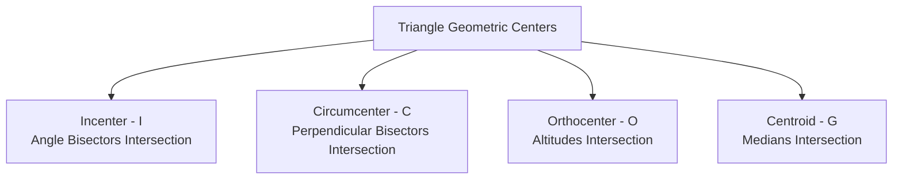

# 2. Geometry & Triangle Architecture

---

## 1. Lines & Angles Fundamentals

An **angle** ($	heta$) is formed by the inclination between two rays sharing a common vertex.
- **Acute Angle**: $0^\circ < \theta < 90^\circ$
- **Right Angle**: $\theta = 90^\circ$ (Rays are perpendicular, $\perp$)
- **Obtuse Angle**: $90^\circ < \theta < 180^\circ$
- **Complementary Angles**: Sum equals $90^\circ$.
- **Supplementary Angles**: Sum equals $180^\circ$.

### Parallel Lines Intersected by a Transversal
When two parallel lines ($l_1 \parallel l_2$) are intersected by a transversal:
1. **Corresponding Angles** are equal.
2. **Alternate Interior Angles** are equal.
3. **Consecutive Interior Angles** are supplementary (sum $= 180^\circ$).

---

## 2. Triangles & The Four Centers

Every triangle contains four geometric centers determined by specific concurrent lines:



### 1. Incenter ($I$)
- Intersection of interior angle bisectors.
- **Angle Formula**: $\angle BIC = 90^\circ + \frac{\angle A}{2}$
- **Inradius Formula**: $r = \frac{\Delta}{s}$ (where $\Delta = \text{Area}$, $s = \text{Semi-perimeter}$). In right triangles: $r = \frac{P + B - H}{2}$.

### 2. Circumcenter ($C$)
- Intersection of perpendicular bisectors of sides.
- **Angle Formula**: $\angle BCC' = 2 \times \angle A$.
- **Circumradius Formula**: $R = \frac{abc}{4\Delta}$. In right triangles, $R = \frac{\text{Hypotenuse}}{2}$.

### 3. Centroid ($G$) and Euler's Line
- The centroid divides every median in the ratio of **2 : 1** (vertex to base).
- **Euler's Line**: Orthocenter ($O$), Centroid ($G$), and Circumcenter ($C$) are collinear. Centroid divides $OG : GC = 2 : 1$.

---

## 3. Circles, Tangents & Cyclic Quadrilaterals

- **Angle at Center Theorem**: Angle subtended at circle center is double the angle subtended at remaining circumference.
- **Secant-Tangent Power Theorem**: $PT^2 = PA \times PB$.
- **Cyclic Quadrilateral**: Opposite angles sum to **$180^\circ$**.

---

## Interactive Practice Quiz Deck

```quiz
[
  {
    "id": 201,
    "question": "In a triangle ABC, the interior angle bisectors of angle B and angle C intersect at point I. If angle A = 64°, what is the degree measure of angle BIC?",
    "options": [
      "122°",
      "118°",
      "128°",
      "112°"
    ],
    "correctIndex": 0,
    "explanation": "The relation between angle A and angle BIC at Incenter I is: angle BIC = 90° + (angle A / 2) = 90° + 32° = 122°."
  },
  {
    "id": 202,
    "question": "What is the circumradius (R) of a right-angled triangle whose perpendicular legs measure 9 cm and 12 cm?",
    "options": [
      "6 cm",
      "7.5 cm",
      "15 cm",
      "10.5 cm"
    ],
    "correctIndex": 1,
    "explanation": "Hypotenuse = √(9² + 12²) = √225 = 15 cm. Circumradius of right triangle R = Hypotenuse / 2 = 15 / 2 = 7.5 cm."
  }
]
```