# 📘 Software & Hardware Foundations

---

## 1. Introduction

A **computer** is an electronic machine which can perform arithmetic and logical operations according to the instructions given by the user.

> **History Note:** The modern computer is based on the **analytical engine** developed by **Charles Babbage**, who is considered the father of the modern computer. The basic architecture of the electronic computer was given by **John Von Neumann**.

According to the **Von Neumann architecture**, a computer consists of the following components:

1. **Memory System** — stores input data and results before output on screen
2. **Input and Output System** — like Monitor and Keyboard
3. **CPU (Central Processing Unit)** — with ALU (Arithmetic Logic Unit) and CU (Control Unit)

Thus, a computer is a collection of different sub-systems. All processing is done in the CPU with the help of the ALU and CU. Data in a computer is represented by 0 and 1, known as **binary form**. A single 0 or 1 is a **bit**, and a collection of eight bits is a **byte** — the basic unit used to represent data in a computer.

A computer cannot work on its own; it works according to instructions given by the user. A collection of instructions in proper sequence to perform a task is known as **Software**. Therefore, a computer is made of two basic components:

| Component | Description |
|---|---|
| 🔧 **Hardware** | Physical parts of the computer |
| 💾 **Software** | Instructions that make the hardware work |

### Types of Computers (by speed, cost & application)

| Type | Speed | Cost | Typical Use |
|---|---|---|---|
| **Micro Computer** | Slowest | Cheapest | Simple applications — PC, Home Computer, Laptop |
| **Mini Computer** | Moderate | Moderate | Mid-range business use |
| **Mainframe Computer** | Fast | High | Large-scale data processing |
| **Super Computer** | Fastest | Costliest | Special applications — weather forecasting, scientific research |

Computers can also be classified based on their **function**:

- **Analog Computer** — generally used for measurement
- **Digital Computer** — used for calculation *(most modern computers are digital)*

---

## 2. Hardware Overview

**Hardware** consists of all the electronic components and electromechanical devices that comprise the physical parts of a computer. Hardware is divided into **four major parts**:

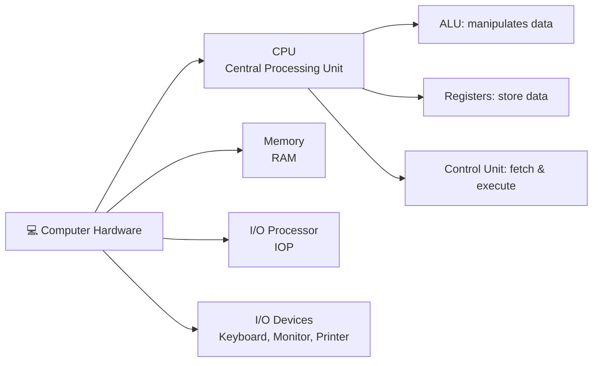

| Part | Function |
|---|---|
| **1. CPU** | Contains an ALU for manipulating data, registers for storing data, and a control unit for fetching and executing instructions |
| **2. Memory** | Contains data and instructions before and after execution. Called *random access* memory because the CPU can access any location randomly without affecting other locations |
| **3. Input Output Processor (IOP)** | Contains electronic circuits for communication and controlling the transfer of information with outside devices like input/output devices |
| **4. Input Output Devices** | Used to give information to the computer and display output — e.g., keyboard, printer, VDU (Visual Display Unit) |

### 🖼️ Von Neumann Computer Architecture

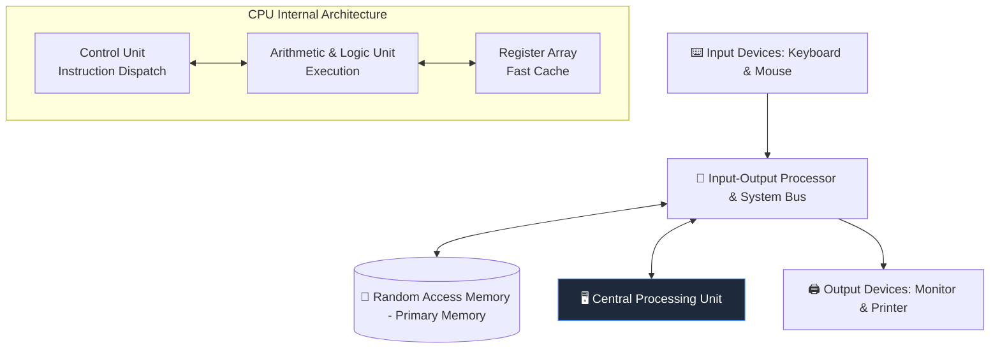

**Figure:** Block Diagram of a Digital Computer — Random Access Memory ↔ Central Processing Unit ↔ Input-Output Processor ↔ Input/Output Devices

### 🔲 Logic Gates

All data in a computer is present in binary form (0 and 1). All computer components — RAM, ALU, CU, registers — are made of **gates**. Different gate types perform different functions, e.g., **AND gate**, **OR gate**, **NOT gate**, etc. Logic gates are therefore the main building blocks of a digital computer.

---

## 3. Memory System

All devices used to store information in a computer are called the **memory system**. Data and instructions are stored in memory before processing — i.e., before going to the CPU. Different types of memory are used because some are fast but volatile, and some are slow but nonvolatile. To maintain efficiency, computers use a **memory hierarchy**.

### 🧠 Memory Hierarchy & Access Speed Pyramid

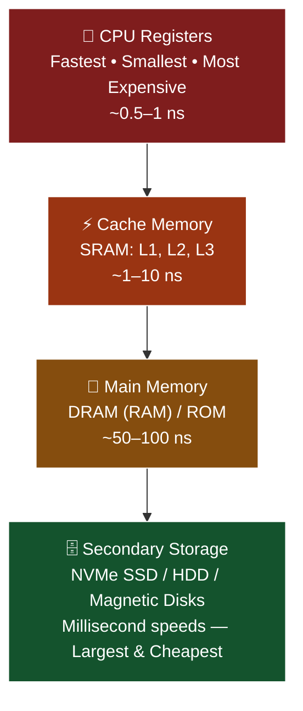

> **💡 Key Exam Distinction:** As you move down the memory pyramid from registers to secondary disks, storage **capacity increases** significantly while **access latency (delay) increases** (gets orders of magnitude slower)!

### Memory Types

| Memory Type | Description |
|---|---|
| **CPU Register** | Small memory locations residing in the CPU; fast and small; used to store data/instructions temporarily |
| **Cache Memory** | Fast electronic memory between main memory and CPU; smaller in size than main memory |
| **Main Memory** | Electronic memory; all programs are loaded here before execution. Divided into: |
| — **RAM** (Random Access Memory) | Read/write, volatile memory made of flip-flops. Types: **SRAM**, **DRAM** |
| — **ROM** (Read Only Memory) | Nonvolatile memory storing essential boot programs. Made of combinational circuits. Types: **PROM, EPROM, EEPROM, Flash Memory** |
| **Secondary Memory** | Permanent, nonvolatile storage device that retains data without power |

### ⚖️ Hardware vs Software

| Hardware | Software |
|---|---|
| The physical component of a computer system | The programming that makes hardware functional |
| Has a permanent shape and structure, cannot be modified | Can be modified and reused — has no permanent shape |
| Affected by external agents like dust, heat (tangible) | Not affected by external agents (intangible) |
| Works with binary code (1's and 0's) | Functions using high-level languages like COBOL, BASIC, JAVA |
| Takes only machine language (lower-level language) | Takes higher-level language, readable by humans |
| Not affected by computer bugs or viruses | Affected by computer bugs or viruses |
| Cannot be transferred electronically | Can be transferred electronically |
| Duplicate copies cannot be created | Copies can be created as many as desired |

### ⚙️ Basics of the CPU

The **CPU (Central Processing Unit)** performs all arithmetic and logical calculations in a computer — it is the "brain" of the computer system. It reads and executes program instructions, performs calculations, makes decisions, and is responsible for storing/retrieving information on disks and other media.

The CPU consists of three parts:

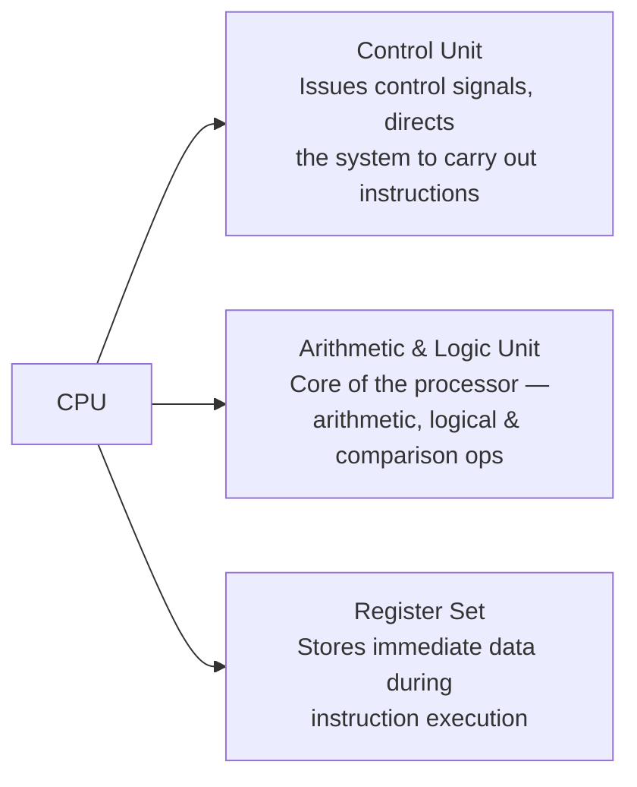

- **Control Unit** — Issues control signals to perform specific operations and directs the entire computer system to carry out stored program instructions
- **Arithmetic and Logic Unit (ALU)** — The "core" of any processor. Executes arithmetic operations (addition, subtraction, multiplication, division), logical operations (compare numbers, letters, special characters, etc.), and comparison operators (equal to, less than, greater than, etc.)
- **Register Set** — Used to store immediate data during instruction execution; consists of various registers

---

## 4. Software

Hardware devices need user instructions to function. A set of instructions that achieves a single outcome is called a **program**. Many programs functioning together to perform a task make up a **software**.

*Example:* A word-processing software enables the user to create, edit and save documents. A web browser enables the user to view and share web pages and multimedia files.

There are two categories of software:

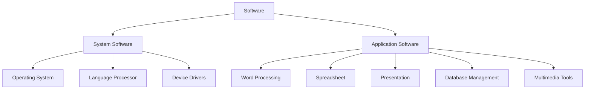

### 4.1 System Software

Software required to run the hardware parts of the computer and other application software is called **system software**. It acts as an interface between hardware and user applications. System software includes:

- **Operating System**
- **Language Processor**
- **Device Drivers**

**Operating System (OS)** is the software program that manages the software and hardware resources of a computer. It manages a computer's basic functions like storing data in memory, retrieving files from storage devices, and scheduling tasks based on priority, etc.

#### 🌐 Language Processor

An important function of system software is to convert user instructions into machine-understandable language. In human-machine interaction, there are three types of languages:

| Language | Description |
|---|---|
| **Machine Language** | A collection of 0s and 1s (binary digits) that machines understand directly. Completely machine dependent |
| **Assembly Language** | Introduces a layer of abstraction using **mnemonics** — English-like words/symbols representing collections of 0s and 1s. Machine dependent |
| **High Level Language** | Uses English-like statements; completely machine independent; uses a translator. Also called **source code**. e.g., Java, C++, Fortran, Pascal |

**Language Translator** — helps convert a programming language into machine language. There are three types:

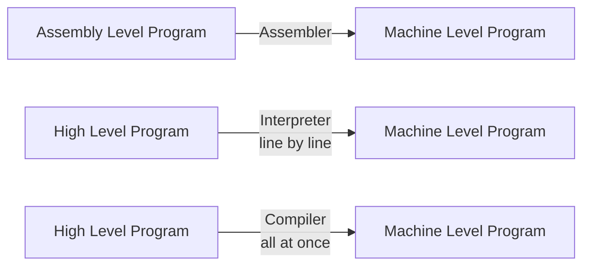

- **Assembler** — Converts assembly level program into machine level program
- **Interpreter** — Converts high-level programs into machine level programs **line by line**
- **Compiler** — Converts high-level programs into machine level programs **all at once**, rather than line by line

#### 🔌 Device Drivers

System software that controls and monitors the functioning of a specific device on the computer is called a **device driver**. Each externally attached device (printer, scanner, microphone, speaker, etc.) has a specific driver associated with it. When a new device is attached, its driver must be installed so the OS knows how to manage it.

### 4.2 Application Software

Software that performs a single task and nothing else is called **application software**. These are highly specialized in function and approach to solving a problem — also called **end-user programs**. Commonly used application software:

- **Word Processing**
- **Spreadsheet**
- **Presentation**
- **Database Management**
- **Multimedia Tools**

### 4.3 Utility Software

**Utility software** is system software designed to help analyze, configure, optimize, or maintain a computer. Examples include:

- **Antivirus Software**
- **Disk Management Tools**
- **File Management Tools**
- **Compression Tools**
- **Backup Tools**

### 4.4 Categorization of Software

| Category | Description |
|---|---|
| **Freeware** | Distributed without a fee, either fully functional or for an unlimited period. Ownership stays with the developer, who may later convert it to paid; typically distributed without source code to prevent modification |
| **Crippleware** | Offered as freeware but with very limited features or major features missing; fully functional versions are usually commercial or shareware |
| **Donationware** | Freeware distributed with a request/reminder to donate to the author or a third party (e.g., charity) |
| **Free Software** | Gives users freedom to run, copy, distribute, study, change and improve the software — a matter of *liberty, not price*. Redistributed versions must retain original terms (**copyleft**); may be distributed for a fee |
| **Open Source** | Close to free software but not identical — source code is available under copyright and free redistribution is allowed. Lets users review source code to eliminate bugs, unlike commercially packaged programs |
| **Shareware** | Demonstration software distributed free for a specific evaluation period (e.g., 15–30 days / Trialware); expires after the trial, requiring purchase for continued use |

### 4.5 Other Software-Related Terms

| Term | Description |
|---|---|
| **Adware** | Advertising software that automatically renders advertisements, often as pop-ups. Can be disabled via a registration key; may change home page/default search or install toolbars. Free like freeware |
| **Bundleware** | Bundles multiple programs into a single installation — installs the wanted program along with unwanted ones |
| **Spyware** | Surreptitiously installs additional software; may send information about the user's computer to the developer/other locations when connected to the Internet, used to display ads |
| **Malware** | "Malicious Software" — exploits computer data without consent; can hijack browsers, track websites visited, hide within the OS, and reinstall itself after removal. Viruses, Trojans, etc. are malware |
| **Scareware** | Tricks users into downloading/buying non-functional or dangerous software (also called Rogue Software) by falsely alarming them about virus infections, prompting purchase of a "full version" to remove fictional infections |

---

## 5. Hardware & Peripherals

**Hardware** refers to the physical elements of a computer — e.g., keyboard, monitor, mouse, and CPU. The **motherboard** is arguably the most important part, made up of components that power and control the computer. Hardware and software are interconnected — without software, hardware would have no function.

### 5.1 Introduction to Peripherals

A **peripheral** is a device attached to the computer processor.

- **External peripherals:** mouse, keyboard, printer, monitor, scanner
- **Internal peripherals:** CD-ROM drive, DVD-R drive, modem

Devices are usually classified as **input** and **output** devices.

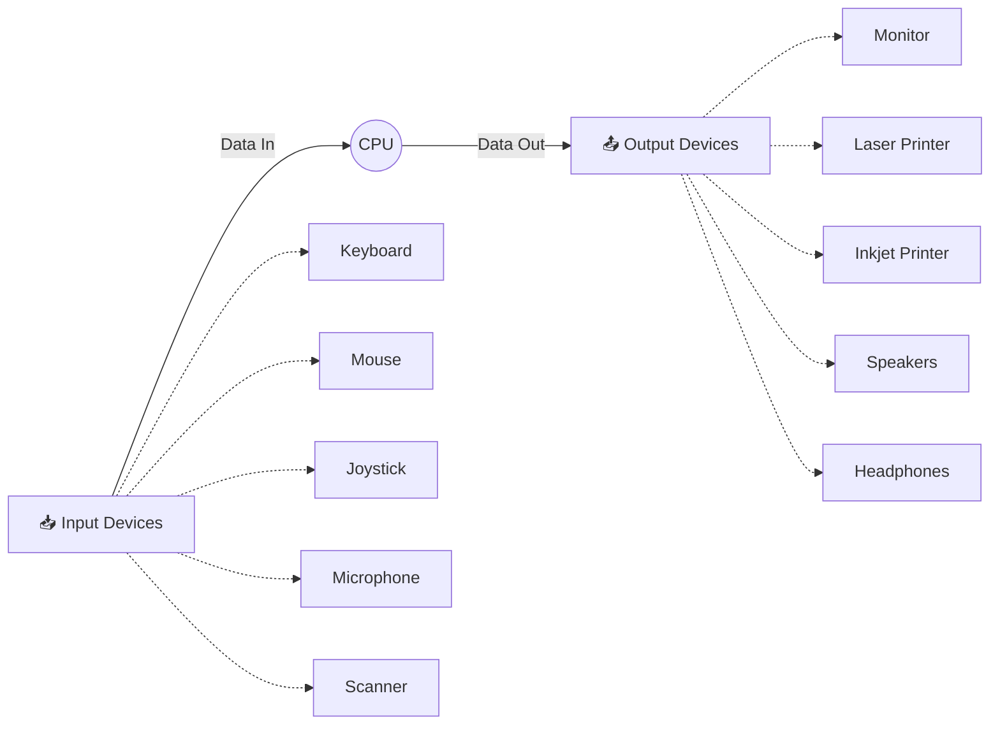

#### Input Devices

| Device | Function |
|---|---|
| **Keyboard** | Set of keys representing alphabet/numbers, laid out in QWERTY style. Pressing a key generates an 8-bit binary word (usually ASCII code) representing the character, sent via serial data transmission |
| **Scanner** | A digitizer that converts graphics and text into digital form. Modern scanners support high-resolution scanning with high bit depths, resulting in large image files |
| **Mouse** | Hand-operated pointing device used to manipulate on-screen objects. Movement (laser/ball, wired/wireless) sends instructions to move the cursor and interact with files, windows, and elements |

#### Output Devices

An **output device** is any peripheral that receives data from a computer for display, projection, or physical reproduction (e.g., an inkjet printer producing a hard copy, or a monitor displaying information).

- **Monitors**
- **Graphic Plotter**
- **Printer**

### 5.2 Monitors

Monitors — commonly called **Visual Display Units (VDU)** — are the main output device of a computer. They form images from tiny dots called **pixels**, arranged in a rectangular grid. Image sharpness depends on the number of pixels.

A **pixel** is the smallest unit of a digital image/graphic displayed on a screen — the basic logical unit in digital graphics. Pixels combine to form a complete image, video, text, or any visible content.

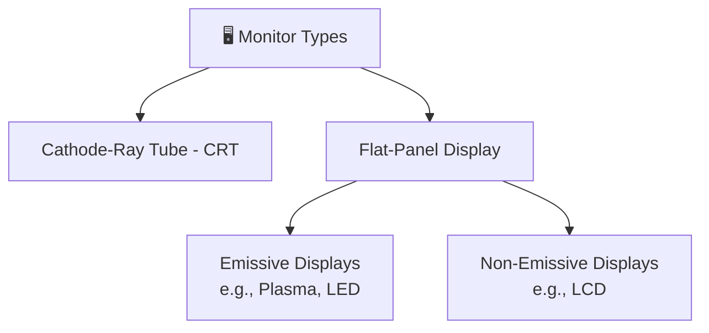

| Type | Description |
|---|---|
| **Cathode-Ray Tube (CRT)** | Made of small picture elements (pixels). Smaller pixels = better clarity/resolution. Multiple illuminated pixels form one character |
| **Flat-Panel Display** | Reduced volume, weight, and power vs. CRT — can be hung on walls or worn. Used in calculators, video games, monitors, laptops, graphics displays |
| — **Emissive Displays** | Convert electrical energy into light. E.g., Plasma panel, LED (Light-Emitting Diode) |
| — **Non-Emissive Displays** | Use optical effects to convert light from another source into graphic patterns. E.g., LCD (Liquid-Crystal Device) |

### 5.3 Printers

A **Printer** is an output device used to print information on paper.

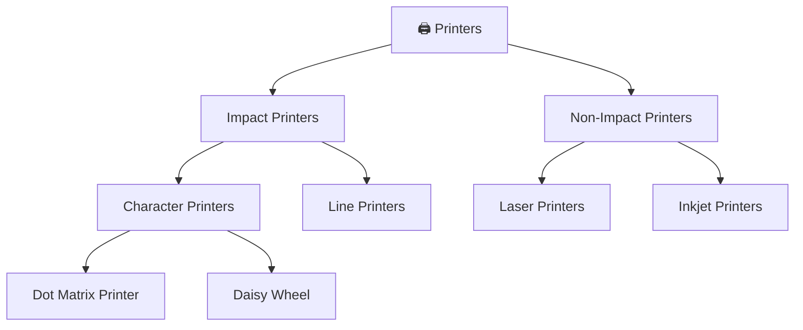

#### Impact Printers

Print characters by striking them on a ribbon, which presses onto the paper.

**Characteristics:**
- Very low consumable costs
- Very noisy
- Useful for bulk printing due to low cost
- Physical contact with paper to produce an image

**Types:**

| Type | Description |
|---|---|
| **Character Printers** | Print one character at a time |
| — **Dot Matrix Printer (DMP)** | Popular for ease of printing and economical price; prints characters/images as a pattern of dots. **Advantages:** Inexpensive, Widely Used, other language characters can be printed |
| — **Daisy Wheel** | Print head lies on a wheel with pins like petals of a daisy flower. **Advantages:** More reliable than DMP, better quality, fonts easily changed |
| **Line Printers** | Print one line at a time instead of one character at a time |

#### Non-Impact Printers

Print characters without using a ribbon, using electrostatic chemicals and inkjet technologies; can produce high-quality graphics.

**Characteristics:**
- Faster than impact printers
- Not noisy
- High quality
- Supports many fonts and different character sizes

**Types:**

| Type | Description | Advantages |
|---|---|---|
| **Laser Printers** | Non-impact page printers using a laser beam on a photo-sensitive surface | Very high speed, very high-quality output, good graphics quality, supports many fonts and sizes |
| **Inkjet Printers** | Non-impact character printers that spray small drops of ink onto paper | Produce high-quality output with presentable features |

---

## 6. Basics of Memory (Detailed)

A memory is just like a human brain — used to store data and instructions. Computer memory is the storage space where data to be processed and instructions required for processing are stored. Memory is primarily of three types:

- **Cache Memory**
- **Primary Memory / Main Memory**
- **Secondary Memory**

### 6.1 Cache Memory

**Cache memory** is a very high-speed semiconductor memory that speeds up the CPU. It acts as a buffer between the CPU and main memory, holding data/programs most frequently used by the CPU. Data is transferred from disk to cache memory by the OS, from where the CPU accesses it.

| ✅ Advantages | ❌ Disadvantages |
|---|---|
| Faster than main memory | Limited capacity |
| Consumes less access time than main memory | Very expensive |
| Stores programs executable within a short period | |
| Stores data for temporary use | |

### 6.2 Primary Memory (Main Memory)

Primary memory holds only the data and instructions the computer is currently working on. It has limited capacity, and data is lost when power is switched off. It is generally made of semiconductor devices — not as fast as registers. It is divided into **RAM** and **ROM**.

**Characteristics of Main Memory:**
- Semiconductor memories
- Known as the main memory
- Usually volatile memory
- Data lost when power is switched off
- The working memory of the computer
- Faster than secondary memories
- A computer cannot run without primary memory

### 6.3 Secondary Memory

Also known as **external memory** or **non-volatile memory**. Slower than main memory, used for storing data/information **permanently**. The CPU does not access it directly — access is via input-output routines. Contents are first transferred to main memory, then accessed by the CPU. Examples: disk, CD-ROM, DVD, etc.

**Characteristics of Secondary Memory:**
- Magnetic and optical memories
- Known as the backup memory
- Non-volatile memory
- Data permanently stored even when power is off
- Used for data storage in a computer
- Computer *may* run without secondary memory
- Slower than primary memories

---

## 7. Ports

A **port** is a connection point that acts as an interface between the computer and external devices like a mouse, printer, modem, etc.

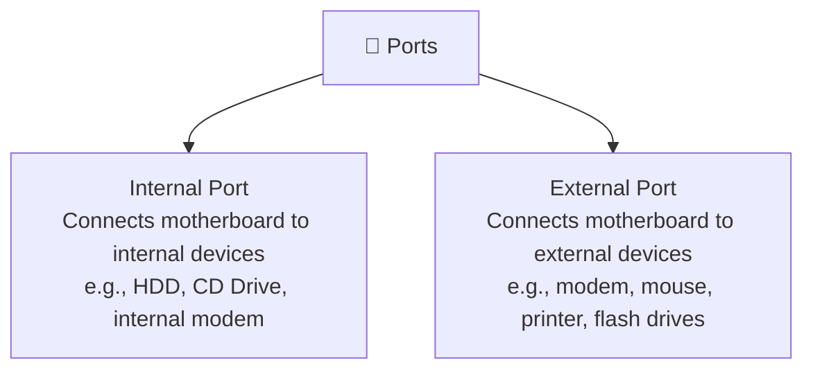

| Port Type | Description |
|---|---|
| **Serial Port** | Transmits data sequentially, one bit at a time — needs only one wire to send 8 bits, but is slower. Usually 9-pin or 25-pin male connectors. Also known as **COM (Communication) ports** or **RS232C ports** |
| **Parallel Port** | Sends/receives 8 bits (1 byte) at a time. 25-pin female pins; used to connect printers, scanners, external hard disk drives, etc. |
| **USB Port** | Universal Serial Bus — the industry standard for short-distance digital data connection. Standardized to connect printers, cameras, keyboards, speakers, etc. |
| **PS/2 Port** | Personal System/2 — a female 6-pin port connecting to a male mini-DIN cable. Introduced by IBM for mouse/keyboard connection. Now mostly obsolete |
| **Infrared Port** | Enables wireless data exchange within a ~10m radius; two devices face each other so infrared light beams can share data |
| **Bluetooth Port** | Telecommunication specification for wireless connection between phones, computers, and other digital devices over short range. Enables synchronization between Bluetooth-enabled devices. Two types: **Incoming** (receives connections) and **Outgoing** (requests connections to other devices) |

---

## 8. Types of Computers (By Signal Processed)

Computers are generally classified into **3 types** based on the electronic signal they process:

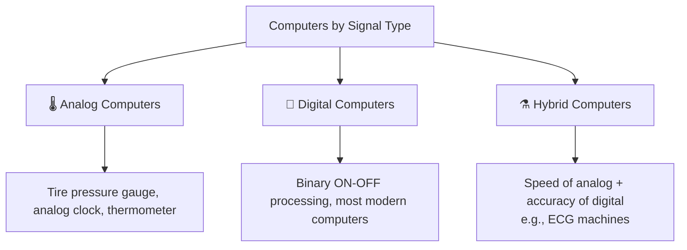

### Analog Computers

"An analog computer is a form of computer that uses continuously changeable aspects of physical facts, such as electrical, mechanical, or hydraulic quantities, to model the problem being solved." They operate on inputs of varying voltage.

Analog computers were widely used in scientific and industrial applications, constructed to perform specific tasks.

**Examples:** Tire pressure gauge, analog clock, thermometer

### Digital Computers

A **Digital Computer**, as the name implies, works with digits to represent numerals, letters, or other special symbols. It operates on inputs that are ON-OFF type, and its output is also an ON-OFF signal — normally ON = 1 and OFF = 0, i.e., data is processed in binary form.

| Digital Computers | Analog Computers |
|---|---|
| More accurate results | Faster than digital |
| Store information (have memory) | Lack memory |

### Hybrid Computers

Hybrid computers exhibit features of **both** analog and digital computers — the speed of analog and the memory/accuracy of digital. The analog components handle complex mathematical computations, while the digital components handle logical and numerical operations plus system control.

**Example:** ECG (Electrocardiogram) machines used in hospitals to measure a patient's heartbeat

---

## 9. Classification by Configuration and Size

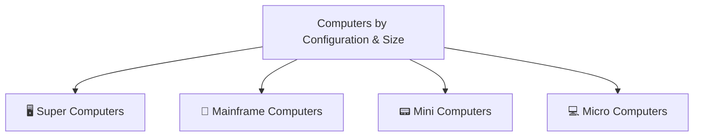

| Type | Description |
|---|---|
| **Super Computers** | Great speed and memory — can do jobs faster than any other computer of its generation; huge and faster than other computers |
| **Mainframe Computers** | Also called "Big Iron." Very large computers capable of handling and processing very large amounts of data quickly. Used by large institutions like government agencies and corporations. Not good at number-crunching or scientific calculations, and not a "Super-computer." Lack the friendly UI of a PC. Compared to a typical PC, they commonly have hundreds to thousands of times as much data storage online, accessible reasonably fast. **Examples:** IBM 360, IBM zSeries, Unisys Dorado, Unisys Libra |
| **Mini Computers** | Term developed in the 1960s to describe smaller computers made possible by transistors and core memory technologies, minimal instruction sets, and cheaper peripherals. Also known as **midrange computers**; grew to have relatively high processing power/capacity. Declined due to the lower cost of microprocessor-based hardware — replaced by networked workstations, file servers, and PCs in many installations |
| **Micro Computers** | Standard desktop computers used at home and in business, with a microprocessor as the CPU. Cheap, compact, and can be easily accommodated on a study table. **Examples:** Laptops, Desktop Computers, Notebooks, Tablet Computers, Smartphones, Palmtops |

### 9.1 Classification by Function

| Type | Description |
|---|---|
| **Server** | A computer dedicated to providing services to its clients — e.g., a file server for sharing file resources, or a database server |
| **Workstation** | Usually serves only one user |
| **Information Appliances** | Computers specially designed to perform a specific "user-friendly" function, such as playing music or photography. Typical examples: smartphones, personal digital assistants (PDAs) |
| **Embedded Computers** | A computer system with a dedicated function within a larger system. Since it's dedicated to specific tasks, design engineers can optimize it to reduce size and cost while increasing reliability and performance. **Examples:** digital watches, MP3 players, traffic lights, video game consoles |

### 9.2 Classification by Area of Application

| Type | Description |
|---|---|
| **Special Purpose Computers** | Designed to perform a specific task — usually solving one particular problem. Also known as **dedicated computers**, since they are dedicated to performing a single task repeatedly |
| **General Purpose Computers** | Can work on different types of programs and be used in countless applications; designed to perform a wide variety of functions and operations |

---

### 📌 Quick Recap: Full Concept Map

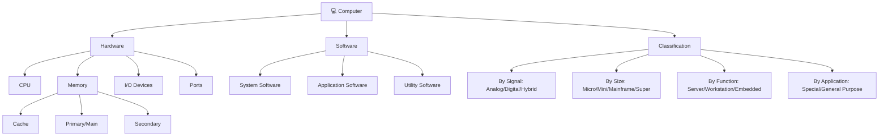

---

## Interactive Practice Quiz Deck

Test your mastery with our complete interactive multiple-choice assessment deck. Select an answer to evaluate your reasoning and reveal detailed explanatory feedback!

```quiz
[
  {
    "question": "Q1. Which of the following is not a computer bus?",
    "options": [
      "data bus",
      "timer bus",
      "control bus",
      "address bus",
      "None of these"
    ],
    "correctIndex": 1,
    "explanation": "2.  (d) 3.  (b) 4.  (c) 5. (a) 6.  (b) 7.  (b)"
  },
  {
    "question": "Q2. The technique of assigning a memory address to each I/O device in the SAM system is called:",
    "options": [
      "wired I/O",
      "I/O mapping",
      "dedicated I/O",
      "memory-mapped I/O",
      "None of these"
    ],
    "correctIndex": 0,
    "explanation": "Correct answer based on professional knowledge concepts."
  },
  {
    "question": "Q3. How many bits are used in the data bus?",
    "options": [
      "7",
      "8",
      "9",
      "16",
      "None of these"
    ],
    "correctIndex": 0,
    "explanation": "Correct answer based on professional knowledge concepts."
  },
  {
    "question": "Q4. A port can be:",
    "options": [
      "strictly for input",
      "strictly for output",
      "bidirectional",
      "all the above",
      "None of these"
    ],
    "correctIndex": 0,
    "explanation": "Correct answer based on professional knowledge concepts."
  },
  {
    "question": "Q5. Which of the following is not a basic element within the microprocessor?",
    "options": [
      "microcontroller",
      "arithmetic -logic unit (ALU)",
      "temporary register",
      "accumulator",
      "None of these"
    ],
    "correctIndex": 0,
    "explanation": "Correct answer based on professional knowledge concepts."
  },
  {
    "question": "Q6. When referring to instruction words, a mnemonic is:",
    "options": [
      "a short abbreviation for the operand address",
      "a short abbreviation for the operation to  be performed",
      "a short abbreviation for the data word stored at the operand address",
      "short hand for machine language",
      "None of these"
    ],
    "correctIndex": 0,
    "explanation": "Correct answer based on professional knowledge concepts."
  },
  {
    "question": "Q7. What is the difference between mnemonic codes and machine codes?",
    "options": [
      "There is no difference.",
      "Machine codes are in binary, mnemonic codes are in shorthand English.",
      "Machine codes are in shorthand English, mnemonic codes are in binary.",
      "Machine codes are in shorthand English, mnemonic codes are a high-level language.",
      "None of these"
    ],
    "correctIndex": 0,
    "explanation": "Correct answer based on professional knowledge concepts."
  },
  {
    "question": "Q8. Which bus is bidirectional?",
    "options": [
      "data bus",
      "control bus",
      "address bus",
      "multiplexed bus",
      "None of these"
    ],
    "correctIndex": 0,
    "explanation": "9.  (c) 10.  (d) 11.  (b) 12.  (b) 13.  (a) 14. (d)"
  },
  {
    "question": "Q9. Parity is:",
    "options": [
      "a byte stored in the FAT to indicated remaining slots",
      "the optimal transmission speed of data over a CAT 5 cable",
      "an extra bit sto red with data in RAM that is used to check for er rors when the data is read back",
      "the optimal transmission speed of data over a CAT 5 cable",
      "None of these"
    ],
    "correctIndex": 0,
    "explanation": "Correct answer based on professional knowledge concepts."
  },
  {
    "question": "Q10. What does FDISK do?",
    "options": [
      "performs low-level formatting of the hard drive",
      "fixes bad sectors on the hard drive",
      "recovers lost clusters on the hard drive",
      "creates partitions on the hard drive",
      "None of these"
    ],
    "correctIndex": 0,
    "explanation": "Correct answer based on professional knowledge concepts."
  },
  {
    "question": "Q11. A string of eight 0s and 1s is called a:",
    "options": [
      "megabyte.",
      "byte.",
      "kilobyte.",
      "gigabyte.",
      "None of these"
    ],
    "correctIndex": 0,
    "explanation": "Correct answer based on professional knowledge concepts."
  },
  {
    "question": "Q12. The CPU and memory are located on the:",
    "options": [
      "expansion board.",
      "motherboard.",
      "storage device.",
      "output device.",
      "None of these"
    ],
    "correctIndex": 0,
    "explanation": "Correct answer based on professional knowledge concepts."
  },
  {
    "question": "Q13. Word processing, spreadsheet, and photo -editing are examples of:",
    "options": [
      "application software.(b ) system software.",
      "operating system software.",
      "platform software.",
      "None of these"
    ],
    "correctIndex": 0,
    "explanation": "Correct answer based on professional knowledge concepts."
  },
  {
    "question": "Q14. System software is the set of programs that enables your computers hardware devices and ____________ software to work together.",
    "options": [
      "management",
      "processing",
      "utility",
      "application",
      "None of these"
    ],
    "correctIndex": 0,
    "explanation": "Correct answer based on professional knowledge concepts."
  },
  {
    "question": "Q15. The PC (personal computer) a nd the Apple Macintosh are examples of two different:",
    "options": [
      "platforms.",
      "applications.",
      "programs.",
      "storage devices.",
      "None of these"
    ],
    "correctIndex": 0,
    "explanation": "16.  (b) 17. (c) 18.  (d) 19.  (c) 20.  (b) 21. (a)"
  },
  {
    "question": "Q16. ____________ are specially designed computers that perform complex calculations extremely rapidly.",
    "options": [
      "Servers",
      "Supercomputers",
      "Laptops",
      "Mainframes",
      "None of these"
    ],
    "correctIndex": 0,
    "explanation": "Correct answer based on professional knowledge concepts."
  },
  {
    "question": "Q17. The operating system is the most common type of ____________ software.",
    "options": [
      "communication",
      "application",
      "system",
      "word-processing software",
      "None of these"
    ],
    "correctIndex": 0,
    "explanation": "Correct answer based on professional knowledge concepts."
  },
  {
    "question": "Q18. The chip, used in computers, is made of",
    "options": [
      "chromium",
      "iron oxide",
      "silica",
      "silicon",
      "None of these"
    ],
    "correctIndex": 0,
    "explanation": "Correct answer based on professional knowledge concepts."
  },
  {
    "question": "Q19. The following device allows the user to add external components to a computer system",
    "options": [
      "Storage devices",
      "Keyboards",
      "Portal system boards",
      "Diskettes",
      "None of these"
    ],
    "correctIndex": 0,
    "explanation": "Correct answer based on professional knowledge concepts."
  },
  {
    "question": "Q20. All of the following are examples of storage devices except",
    "options": [
      "hard disk drives",
      "printers",
      "floppy disk drives",
      "CD drives",
      "None of these"
    ],
    "correctIndex": 0,
    "explanation": "Correct answer based on professional knowledge concepts."
  },
  {
    "question": "Q21. From what location are the 1st computer instructions available on boot up?",
    "options": [
      "ROM BIOS",
      "CPU",
      "boot.ini",
      "CONFIG.SYS",
      "None of the above"
    ],
    "correctIndex": 0,
    "explanation": "Correct answer based on professional knowledge concepts."
  },
  {
    "question": "Q22. Which one is the secondary memory device?",
    "options": [
      "CPU",
      "ALU",
      "floppy disk",
      "Mouse",
      "None of these"
    ],
    "correctIndex": 2,
    "explanation": "23.  (b) 24.  (c) 25.  (a) 26.  (d) 27.  (a) 28.  (b)"
  },
  {
    "question": "Q23. If a memory chip is volatile, it will ________________.",
    "options": [
      "Explode if exposed to high temperatures",
      "Lose it contents if current is turned off",
      "Be used for data storage only",
      "Be used to both read and write data",
      "None of these"
    ],
    "correctIndex": 0,
    "explanation": "Correct answer based on professional knowledge concepts."
  },
  {
    "question": "Q24. What tool is used to test serial and parallel ports?",
    "options": [
      "high volt probe",
      "cable scanner",
      "loop backs (wrap plugs)",
      "sniffer",
      "None of the above"
    ],
    "correctIndex": 0,
    "explanation": "Correct answer based on professional knowledge concepts."
  },
  {
    "question": "Q25. From what location are the 1st computer instructions available on boot up?",
    "options": [
      "ROM BIOS",
      "CPU",
      "boot.ini",
      "CONFIG.SYS",
      "None of the above"
    ],
    "correctIndex": 0,
    "explanation": "Correct answer based on professional knowledge concepts."
  },
  {
    "question": "Q26. What could cause a fixed disk error?",
    "options": [
      "No-CD installed",
      "bad ram",
      "slow processor",
      "Incorrect CMOS settings",
      "None of the above"
    ],
    "correctIndex": 0,
    "explanation": "Correct answer based on professional knowledge concepts."
  },
  {
    "question": "Q27. Missing slot covers on a computer can cause?",
    "options": [
      "over heat",
      "power surges",
      "EMI.",
      "incomplete path for ESD",
      "None of the above"
    ],
    "correctIndex": 0,
    "explanation": "Correct answer based on professional knowledge concepts."
  },
  {
    "question": "Q28. A hard disk is divided into tracks which are further subdivided into:",
    "options": [
      "clusters",
      "sectors",
      "vectors",
      "heads",
      "None of the above"
    ],
    "correctIndex": 0,
    "explanation": "Correct answer based on professional knowledge concepts."
  },
  {
    "question": "Q29. Which pa rt of the laser printer should NOT be exposed to sunlight?",
    "options": [
      "Transfer corona assembly",
      "PC drum",
      "Primary corona wire",
      "Toner cartridge",
      "None of the above"
    ],
    "correctIndex": 1,
    "explanation": "30. (d) 31. (b) 32.  (d) 33.  (a) 34.  (b) 35.  (c)"
  },
  {
    "question": "Q30. Resistance is measured in?",
    "options": [
      "Volts",
      "Amps",
      "Watts",
      "Ohms",
      "None of the above"
    ],
    "correctIndex": 0,
    "explanation": "Correct answer based on professional knowledge concepts."
  },
  {
    "question": "Q31. Program which is used to control system performance is classified as?",
    "options": [
      "experimental program",
      "system program",
      "specialized program",
      "organized program",
      "none of these"
    ],
    "correctIndex": 0,
    "explanation": "Correct answer based on professional knowledge concepts."
  },
  {
    "question": "Q32. Examples of system programs includes",
    "options": [
      "operating system of computer",
      "trace program",
      "compiler",
      "all of above",
      "none of these"
    ],
    "correctIndex": 0,
    "explanation": "Correct answer based on professional knowledge concepts."
  },
  {
    "question": "Q33. System programs which performs one simple task are classified as",
    "options": [
      "utility programs",
      "function program",
      "compiling program",
      "inquiry program",
      "None of these"
    ],
    "correctIndex": 0,
    "explanation": "Correct answer based on professional knowledge concepts."
  },
  {
    "question": "Q34. In microcomputers, operating system is usually stored on",
    "options": [
      "random access memory",
      "read only memory",
      "permanent memory",
      "temporary memory",
      "none of these"
    ],
    "correctIndex": 0,
    "explanation": "Correct answer based on professional knowledge concepts."
  },
  {
    "question": "Q35. Software which controls general operations of computer system is classified as",
    "options": [
      "dump programs",
      "function system",
      "operating system",
      "inquiry system",
      "none of these"
    ],
    "correctIndex": 0,
    "explanation": "Correct answer based on professional knowledge concepts."
  },
  {
    "question": "Q36. Which provides the fastest access to large video files?",
    "options": [
      "Optical drives",
      "IDE hard drives",
      "SCSI hard drives",
      "EIDE hard drives",
      "None of the above"
    ],
    "correctIndex": 2,
    "explanation": "37.  (d) 38.  (c) 39.  (b) 40.  (b) 41. (a) 42.  (d)"
  },
  {
    "question": "Q37. You install a second IDE hard drive, then boot to windows. But windows will not recognize it. What should you do next?",
    "options": [
      "Reinstall windows",
      "Run CHKDISK",
      "Run defrag",
      "Change the jumper setting to slave",
      "None of these"
    ],
    "correctIndex": 0,
    "explanation": "Correct answer based on professional knowledge concepts."
  },
  {
    "question": "Q38. Which of the following is true?",
    "options": [
      "DRAM is faster than SRAM",
      "DRAM and SRAM both are same w ith respect to speed",
      "SRAM is faster than DRAM",
      "All are true",
      "None of these"
    ],
    "correctIndex": 0,
    "explanation": "Correct answer based on professional knowledge concepts."
  },
  {
    "question": "Q39. Serial port enables data flow in:",
    "options": [
      "One direction",
      "Both directions",
      "Doesn’t flow the data",
      "All of the above",
      "None of these"
    ],
    "correctIndex": 0,
    "explanation": "Correct answer based on professional knowledge concepts."
  },
  {
    "question": "Q40. Following cable prov ide immunity from electrical interference:",
    "options": [
      "UTP",
      "Fiber Optic",
      "STP",
      "Coaxial",
      "None of these"
    ],
    "correctIndex": 0,
    "explanation": "Correct answer based on professional knowledge concepts."
  },
  {
    "question": "Q41. A 168 -pin DIMM package has ________ pins on each side of the package",
    "options": [
      "84 pins",
      "64 pins",
      "32 pins",
      "16 pins",
      "None of these"
    ],
    "correctIndex": 0,
    "explanation": "Correct answer based on professional knowledge concepts."
  },
  {
    "question": "Q42. What is true regarding parallel port?",
    "options": [
      "A parallel port for connecting an external device.",
      "On PCs parallel port uses a 25-pin connector",
      "Parallel port uses parallel transmission of data",
      "All are true",
      "None of these"
    ],
    "correctIndex": 0,
    "explanation": "Correct answer based on professional knowledge concepts."
  },
  {
    "question": "Q43. What Is LGA?",
    "options": [
      "A n LGA socket is the connection point for a central processing unit (CPU) to fit into a motherboard.",
      "The LGA stands for Land Grid Array.",
      "The LGA stands for Land Graphic Array.",
      "Both",
      "and",
      "",
      "None of these"
    ],
    "correctIndex": 3,
    "explanation": "44.  (d) 45.  (a) 46.  (b) 47.  (c) 48.  (d) 49.  (d)"
  },
  {
    "question": "Q44. What is Pentium IV?",
    "options": [
      "It is a processor.",
      "In Pentium IV, the bus speed is 400 MHz",
      "Pentium IV processor start at 512KB",
      "All of the above",
      "None of these"
    ],
    "correctIndex": 0,
    "explanation": "Correct answer based on professional knowledge concepts."
  },
  {
    "question": "Q45. What Are The Latest Processor Of Intel And Amd?",
    "options": [
      "For intel it is Intel Core i7 and AMD Opteron 6200 Series processor.",
      "For intel it is Intel Opteron 6200 Series and AMD Core i7 processor.",
      "For intel it is Intel Core i5 and AMD Opteron 6200 Series processor.",
      "For intel it is Intel Core i7 and AMD Opteron 5200 Series processor",
      "None of these"
    ],
    "correctIndex": 0,
    "explanation": "Correct answer based on professional knowledge concepts."
  },
  {
    "question": "Q46. Which T ype Of Socket Is Needed To Connect A Dual Core Processor Of Intel?",
    "options": [
      "Socket LPA 775",
      "Socket LGA 775",
      "Socket LGA 774",
      "All of the above",
      "None of these"
    ],
    "correctIndex": 0,
    "explanation": "Correct answer based on professional knowledge concepts."
  },
  {
    "question": "Q47. What Is Cache Memory? What Is The Advantage If A Processor With More Cache Memory You Are Using?",
    "options": [
      "Cache memory is the memory area between RAM and SRAM. If cache memory decreases the speed of the system will also improved",
      "Cache memory is the memory area between RAM and Processor. If cache memory decreases the speed of the system will also improved",
      "Cache memory is the memory area between RAM and Processor. If cache memory increases the speed of the system will also improved.",
      "None of these",
      "All are true."
    ],
    "correctIndex": 0,
    "explanation": "Correct answer based on professional knowledge concepts."
  },
  {
    "question": "Q48. What is true about DRAM?",
    "options": [
      "Dynamic RAM stores data using a pa ired transistor and capacitor for each bit of data.",
      "In DRAM Capacitors constantly leak electricity, which requires the memo ry controller to refresh the DRAM several times a second to maintain the data.",
      "DDR-SDRAM is a type of DRAM",
      "All are true",
      "None of these"
    ],
    "correctIndex": 0,
    "explanation": "Correct answer based on professional knowledge concepts."
  },
  {
    "question": "Q49. What is true about DDR2?",
    "options": [
      "DDR2 is the successor to DDR RAM.",
      "DDR2 incorporates several techno logical upgrades to computer system memory, as well as an enhanced data rate.",
      "DDR 2 is capable of achieving twice the data transfer rate of DDR -I memory because of its higher clock speed. It operates at a lower voltage than DDR-I as well: 1.8 volts instead of 2.5.",
      "All of the above",
      "None of these"
    ],
    "correctIndex": 0,
    "explanation": "Correct answer based on professional knowledge concepts."
  },
  {
    "question": "Q50. What Is Full Name Of AMD?",
    "options": [
      "Advanced Micro Devices.",
      "Advanced Memory Devices",
      "Advanced Multipurpose Devices",
      "Advanced Multitasking Devices",
      "None of these"
    ],
    "correctIndex": 0,
    "explanation": "51.  (a) 52.  (d) 53.  (c) 54.  (d) 55.  (c) 56.  (a)"
  },
  {
    "question": "Q51. Winchester drive is also called:",
    "options": [
      "Hard Disk Drive",
      "Floppy Disk Drive",
      "CD",
      "DVD",
      "None of these"
    ],
    "correctIndex": 0,
    "explanation": "Correct answer based on professional knowledge concepts."
  },
  {
    "question": "Q52. Which of the following is NOT a type of motherboard expansion slot?",
    "options": [
      "ISA",
      "PCI",
      "AGP",
      "ATX",
      "None of these"
    ],
    "correctIndex": 0,
    "explanation": "Correct answer based on professional knowledge concepts."
  },
  {
    "question": "Q53. How much data will a high density (HD) floppy disk hold?",
    "options": [
      "124 KB",
      "640 KB",
      "1.44 MB",
      "2.88MB",
      "None of these"
    ],
    "correctIndex": 0,
    "explanation": "Correct answer based on professional knowledge concepts."
  },
  {
    "question": "Q54. What does FDISK do?",
    "options": [
      "performs low-level formatting of the hard drive",
      "fixes bad sectors on the hard drive",
      "recovers lost clusters on the hard drive",
      "creates partitions on the hard drive",
      "None of these"
    ],
    "correctIndex": 0,
    "explanation": "Correct answer based on professional knowledge concepts."
  },
  {
    "question": "Q55. What is different between AT and ATX power supplies?",
    "options": [
      "They are identical except for their shape.",
      "AT supplies use a single P1 power connector while ATX uses P8 and P9.",
      "AT supplies use P8 and P9 power connectors while ATX uses a single P1 connector.",
      "AT power supplies run on 120V AC current while ATX uses 220V AC",
      "None of these"
    ],
    "correctIndex": 0,
    "explanation": "Correct answer based on professional knowledge concepts."
  },
  {
    "question": "Q56. A semiconductor memory which allows the eraser of the information stored  in it so that new information can be stored in it is referred as",
    "options": [
      "EPROM",
      "ROM",
      "RAM",
      "None of these",
      "SDRAM"
    ],
    "correctIndex": 0,
    "explanation": "Correct answer based on professional knowledge concepts."
  },
  {
    "question": "Q57. Index hole is related to?",
    "options": [
      "Scanner",
      "Floppy disk",
      "Printer",
      "CPU",
      "None of these"
    ],
    "correctIndex": 1,
    "explanation": "58.  (c) 59.  (b) 60.  (d)"
  },
  {
    "question": "Q58. In MSDOS, the primary hard disk drives has the drive letter?",
    "options": [
      "a",
      "b",
      "c",
      "f",
      "None of these"
    ],
    "correctIndex": 0,
    "explanation": "Correct answer based on professional knowledge concepts."
  },
  {
    "question": "Q59. A special type of Batch file that run automatically at startup is?",
    "options": [
      "Command.Com",
      "Autoexec. Bat",
      "Config.Sys",
      "Ansi.Sys",
      "None of these"
    ],
    "correctIndex": 0,
    "explanation": "Correct answer based on professional knowledge concepts."
  },
  {
    "question": "Q60. Which command displays directories as well as subdirectories also in MSDOS?",
    "options": [
      "DIR/All",
      "DIR/AN",
      "DIR/DS",
      "DIR/S",
      "None of these"
    ],
    "correctIndex": 0,
    "explanation": "Correct answer based on professional knowledge concepts."
  }
]
```

---

