# 📘 Database Management System (DBMS)

---

## 1. Introduction

DBMS is one of the most important modules for the Specialist Officer (IT) Exam. The objective paper of Professional Knowledge (especially for Scale-I Officer) in IBPS Exam has many questions from the Database and Networking modules — aspirants should prepare DBMS thoroughly.

> **DBMS** = **D**ata **B**ase **M**anagement **S**ystem — a collection of interrelated data and a set of programs to access this data in a convenient and efficient way. It controls the **organization, storage, retrieval, security, and integrity** of data in a database.

A database management system (DBMS) is computer software that manages databases; it may use any of a variety of database models, such as the **Hierarchical DBMS**, **Network DBMS**, and **Relational DBMS**.

The first type of DBMS emerged between the 1960s–70s: the **Hierarchical DBMS**. IBM had the first model, developed on IBM 360, called **IMS** (originally written for the Apollo program). This type of DBMS was based on binary trees, where the shape was like a tree and relations were limited to parent-child records.

### 1.1 Database Models

A database model shows the logical structure of a database, including the relationships and constraints that determine how data can be stored and accessed.

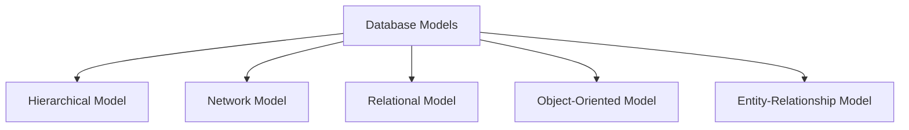

#### 🌳 Hierarchical Database Model

One of the oldest database models. Records are linked with superior records on which they are dependent, and also with the records that are dependent on them. A **tree structure** establishes a **one-to-many** relationship. Parents can have many children (one-to-many). Grandparents and children are the nodes/dependents of the root; in general, a root may have any number of dependents.

A **tree-structure diagram** is the schema for a hierarchical database, consisting of two basic components:
1. **Boxes** — correspond to record types
2. **Lines** — correspond to links

| ✅ Pros | ❌ Cons |
|---|---|
| Allows easy addition and deletion of new information | Cannot cater to more sophisticated real-time relationship requirements |
| Data at the top of the hierarchy is very fast to access | Can be very slow when searching for information on lower entities |
| Relates well to anything that works through one-to-many relationships | Many-to-many relationships are **not supported** |

#### 🔗 Network Database Model

Can be viewed as an upside-down tree, where each member's information is a branch linked to the owner at the bottom of the tree. It was a progression from the hierarchical model, designed to solve the lack of flexibility — specifically the need to model complex relationships like **many-to-many**, which the hierarchical model couldn't handle.

The Network model replaces the hierarchical tree with a **graph**, allowing more general connections among nodes. Its key difference from the hierarchical model is its ability to handle many-to-many (N:N) relations — a record can have more than one parent.

| ✅ Pros | ❌ Cons |
|---|---|
| A relationship is a **set**, comprising an **owner record** and a **member record** | Insert, delete, and update operations require large numbers of pointer adjustments |
| An application can access an owner record and all member records within a set | A change in structure demands a change in the application too (lack of structural independence) |
| Supports data independence to some level — draws a clear line between programs and complex physical storage details | |

#### 🗂️ Relational Database Model

The primary data model used widely worldwide for data storage and processing — a huge leap forward from the network model. Instead of parent-child or owner-member relationships, the relational model allows any file to be related to any other via a **common field**. Relational databases go hand-in-hand with **SQL** (Structured Query Language) — a standardized language for defining and manipulating data in a relational database.

**Tables in the Relational Model:**

Relations are saved as **Tables** — rows represent records, columns represent attributes.

| Term | Description |
|---|---|
| **Tuple** | A single row of a table, containing a single record for that relation |
| **Relation instance** | A finite set of tuples in the relational database system; no duplicate tuples |
| **Relation schema** | Describes the relation name (table name), attributes, and their names |
| **Relation key** | One or more attributes that uniquely identify a row in the relation |
| **Attribute domain** | The predefined value scope of an attribute |

#### 🧩 Object-Oriented Database Model

Also called **OODBMS** — a DBMS that supports modeling and creation of data as objects, including support for classes of objects and inheritance of class properties/methods by subclasses. ODBMS was originally thought to replace RDBMS due to better fit with object-oriented programming languages. However, high switching costs, inclusion of object-oriented features in RDBMS (making them **ORDBMS**), and the emergence of **object-relational mappers (ORMs)** have let RDBMS successfully defend its dominance for server-side persistence.

Relational databases store data in two-dimensional tables (rows and columns), and are **normalized** so data isn't repeated more than necessary. With traditional databases, data manipulated by the application is transient and data in the database is persisted (stored on permanent storage). In object databases, the application can manipulate **both transient and persisted data**.

#### 🔷 Entity-Relationship (ER) Database Model

Ensures a precise understanding of the nature of data and how it's used by the enterprise — via a universal, non-technical, unambiguous, and easily readable model, implemented using **ER Diagrams**.

The ER model is based on two concepts:
- **Entities** — tables that hold specific information (data)
- **Relationships** — associations or interactions between entities

**ER-Diagram** — a pictorial representation of data describing how data is communicated and related. Entities, attributes, relationship sets, and other attributes can all be characterized via the ER diagram.

### 1.2 Advantages of Today's DBMS over Earlier File Management Systems

| Advantage | Description |
|---|---|
| **Reduced Data Redundancy & Inconsistency** | Eliminates multiple file formats and duplication of information across files, keeping data more consistent |
| **Data Integrity** | Refers to accuracy and consistency of stored data. DBMS ensures this via transactions managed through the **ACID** test (Atomicity, Consistency, Isolation, Durability) — absent in file management systems |
| **Sharing of Data** | Data can be shared by authorized users; the DBA manages data and grants access rights |
| **Control Over Concurrency** | In file-based systems, simultaneous access by two users can cause interference (e.g., overwritten updates). DBMS has sub-systems to control concurrency and ensure accurate transaction recording |
| **Backup & Recovery Procedures** | File-based systems require time-consuming manual backups. DBMS provides automatic backup and recovery sub-systems |
| **Data Independence** | Separation of the database's data structure from the application program using the data — the database structure can be changed without modifying the application program |

---

## 2. Database Architecture

### 2.1 Data Abstraction – View Levels

The generalized architecture of DBMS is called the **ANSI/SPARC model**, divided into **three levels**:

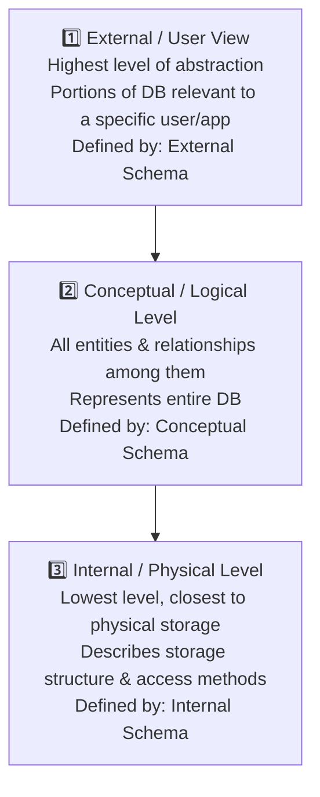

1. **External View / User View / View Level** — The highest level of data abstraction. Includes only those portions of the database of concern to a user or application program. Each user has a different external view, described by an **external schema**.
2. **Conceptual View / Logical Level** — Includes all database entities and the relationships among them. One conceptual view represents the entire database, called the **conceptual schema**.
3. **Internal View / Physical Level** — The lowest level of abstraction, closest to physical storage. Describes how data is stored, the structure of data storage, and access methods. Represented by the **internal schema**.

### 2.2 Instances and Schemas

**Schema** — the design of a database; the overall description of the database. Comparable to types and variables in programming languages — schema is essentially the **logical structure** of the database. Like the View Levels, schema is of **3 types**:

| Schema Type | Description |
|---|---|
| **Physical Schema** | Design of a database at the physical level — describes how data is stored in blocks of storage |
| **Logical Schema** | Design at the logical level, where programmers and the DBA work. Data is described as certain types of data records stored as data structures; internal implementation details remain hidden |
| **View Schema** | Design at the view level — describes end-user interaction with the database system |

- **Physical Data Independence** — the ability to modify the physical schema without changing the logical schema.
- Applications depend on the logical schema.
- Interfaces between levels/components should be well-defined so changes in one part don't seriously influence others.

**What is an Instance?** Databases change over time as information is inserted and deleted. The collection of information stored in the database at a particular moment is called an **instance**.

### 2.3 Database Languages

A database system provides a **data-definition language** to specify the schema and a **data-manipulation language** to express queries/updates.

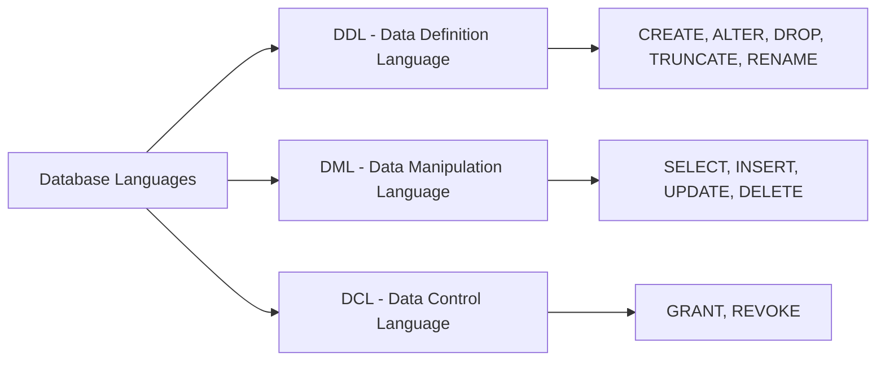

1. **Data Definition Language (DDL)** — used for specifying the database schema; contains commands to create, alter, delete, or rename tables.
   - `CREATE` — create the database instance
   - `ALTER` — alter the structure of the database
   - `DROP` — drop database instances
   - `TRUNCATE` — delete tables in a database instance
   - `RENAME` — rename database instances

2. **Data Manipulation Language (DML)** — used for accessing and manipulating data in a database.
   - `SELECT` — read records from table(s)
   - `INSERT` — insert records into tables
   - `UPDATE` — update the data in tables
   - `DELETE` — delete records from a table

3. **Data Control Language (DCL)** — used for granting and revoking user access on a database.
   - `GRANT` — grant access to a user
   - `REVOKE` — revoke access from a user

---

## 3. Entity-Relationship Model

**What is an Entity?** In a database, related data is grouped together and stored under one group name called an **Entity/Table**. This helps identify where data is stored and reduces search time.

### Types of Entities

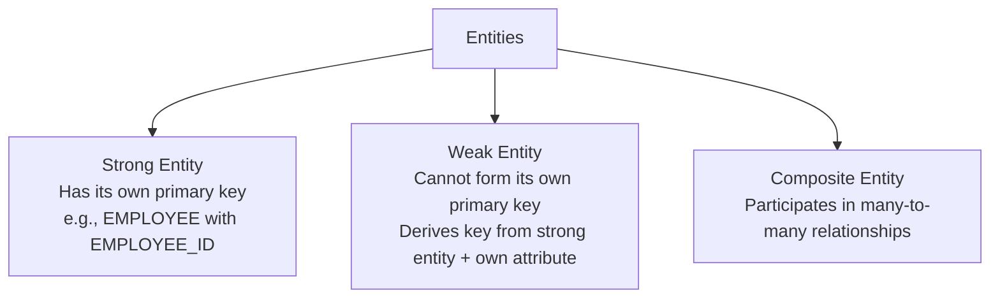

1. **Strong Entity** — Entities having their own attribute as primary key. e.g., EMPLOYEE has EMPLOYEE_ID as primary key.
2. **Weak Entity** — Entities that cannot form their own primary key; they derive it from the combination of their attribute and the primary key from their mapping entity. The relationship between a weak entity and a strong entity is called an **Identifying Relationship**.
3. **Composite Entity** — Entities participating in many-to-many relationships.

The line connecting a strong entity set with the relationship is single, whereas the line connecting a weak entity set with the identifying relationship is **double**. A member of a strong entity set is called the **dominant entity**, and a member of a weak entity set is called the **subordinate entity**. A weak entity set does not have a primary key, so we need a **discriminator** — a set of attributes that distinguishes among entries dependent on a particular strong entity. A weak entity set is represented by a doubly outlined box, and the identifying relation by a doubly outlined diamond. Also called the **Partial key** of the entity set.

### Weak Entity Sets

- Entities are not of independent existence.
- Each weak entity is associated with some entity of the owner entity set through a special relationship.
- A weak entity set may not have a key attribute.

**Example:** We depict a weak entity set by double rectangles. We underline the discriminator of a weak entity set with a dashed line.

- `payment_number` — discriminator of the payment entity set
- Primary key for payment — `(loan_number, payment_number)`

> **Note:** The primary key of the strong entity set is not explicitly stored with the weak entity set, since it is implicit in the identifying relationship. If `loan_number` were explicitly stored, `payment` could be made a strong entity — but then the relationship between `payment` and `loan` would be duplicated by an implicit relationship defined by the attribute `loan_number` common to both.

### 3.1 Attributes

Each entity is described by a set of attributes/properties.

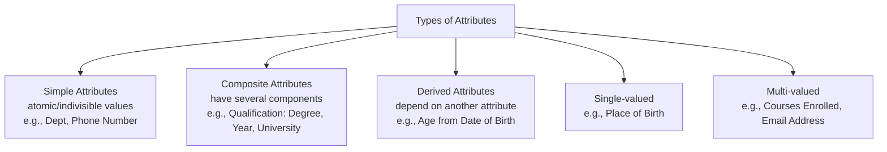

- **Simple Attributes** — atomic/indivisible values. e.g., Dept (a string), Phone Number (an eight-digit number)
- **Composite Attributes** — have several components in the value. e.g., Qualification with components (Degree Name, Year, University Name)
- **Derived Attributes** — value depends on some other attribute. e.g., Age depends on Date of Birth, so Age is derived
- **Single-valued** — has only one value. e.g., Place Of Birth
- **Multi-valued** — has a set of values. e.g., Courses Enrolled, Email Address, Previous Degree for a student

Attributes can be: simple single-valued, simple multi-valued, composite single-valued, or composite multi-valued.

### 3.2 E-R Diagram

An ER diagram is a means of visualizing how the information a system produces is related. There are **five main components**:

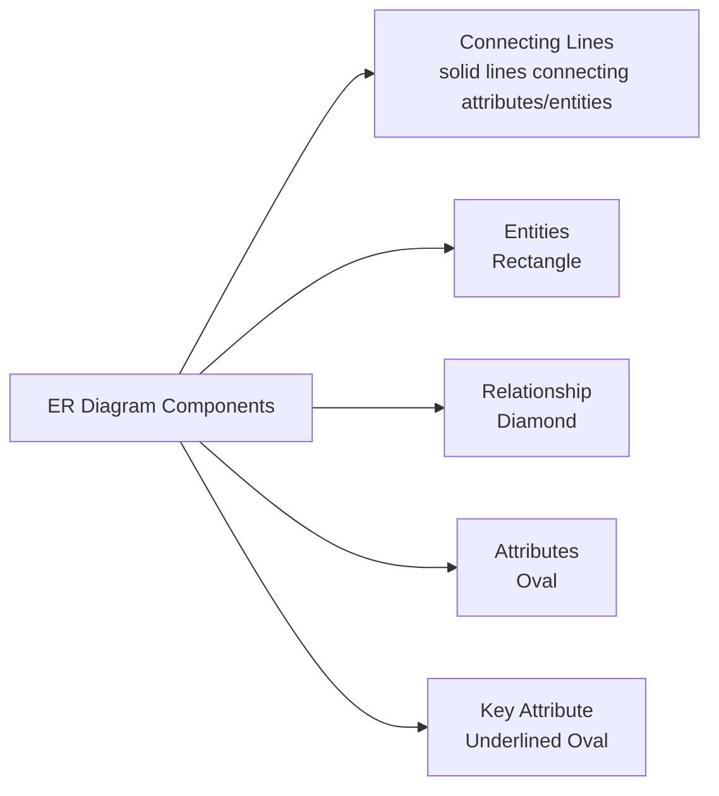

1. **Connecting Lines** — solid lines that connect attributes to show relationships of entities in the diagram.
2. **Entities: Represented by Rectangle**
   - **Strong Entity** — independent from other entities; often called parent entities, since weak entities often depend on them.
   - **Weak Entity** — must be defined by a foreign key relationship with another entity, as it cannot be uniquely identified by its own attributes alone.
3. **Relationship** — connects two or more entities into an association — represented by a **Diamond**.

*Example: Employee **Works in** Department. EMPLOYEE and Dept are Entity Types, and WorksIn is the relationship represented with a diamond figure.*

**Recursive Relationship** — one in which the same entity participates more than once in the relationship. e.g., Every manager is also an employee, so "manager" is not a new entity but a subset of instances of the entity EMPLOYEE.

| EMPLOYEE | MANAGER |
|---|---|
| Nikhil | Sumita |
| Anuj | Rahul |
| Anuj | Nikhil |

*(Manages of — this is also a representation of many-to-many cardinality.)*

### 3.3 Attributes — Represented by Ovals

An attribute describes a property/characteristic of an entity — e.g., Name, ID, Age, Address for an EMPLOYEE.

- **Key Attribute** — represents the main characteristic of an entity; used to represent the primary key. An **ellipse with underlying lines** represents a key attribute. e.g., `EmpId` is the key attribute that uniquely identifies EMPLOYEE records.
- **Double Ellipses** — represent multivalued attributes.
- **Composite Attribute** — an attribute that has its own attributes.
- **Derived Attribute** — calculated or derived from another attribute, such as age from Date of Birth (DOB).

---

## 4. Cardinality

The **cardinality** of a relationship is the number of instances of entity B that can be associated with entity A. There is a minimum and maximum cardinality for each relationship. **Cardinality** refers to the maximum number of times an instance in one entity can relate to instances of another entity. **Ordinality**, on the other hand, is the minimum number of times an instance in one entity can be associated with an instance in the related entity.

**Cardinality notations:** Many · Zero or one · One · One (and only one) · Zero or many · One or many

### Binary Relationships and Cardinality Ratio

- The number of entities from E2 that an entity from E1 can possibly be associated with through R (and vice versa) determines the **cardinality ratio** of R.
- Four possibilities are usually specified:

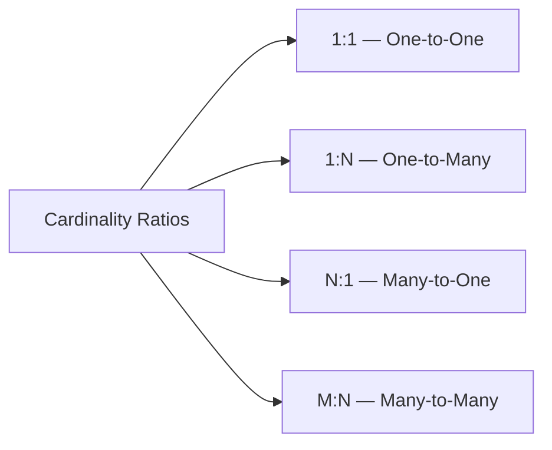

| Ratio | Description |
|---|---|
| **One-to-one (1:1)** | An E1 entity may be associated with at most one E2 entity, and similarly an E2 entity may be associated with at most one E1 entity |
| **One-to-many (1:N)** | An E1 entity may be associated with many E2 entities, whereas an E2 entity may be associated with at most one E1 entity |
| **Many-to-one (N:1)** | Similar to above, in reverse |
| **Many-to-many (M:N)** | Many E1 entities may be associated with a single E2 entity, and a single E1 entity may be associated with many E2 entities |

**Mapping Cardinalities** — Some elements in A and B may not be mapped to any elements in the other set.

**Examples:**
- Many-to-Many relationship between **User** and **Course** — any number of users can enroll in any number of courses.
- One-to-Many relationship between a **Teacher** (also a User) and **Course** — only one instructor can teach a course, but they may teach any number of courses.
- One department has many employees → **one-to-many** relationship.
- Any number of employees may work in any number of departments → **many-to-many** relationship.

---

## 5. Keys

A **super key** of an entity set is a set of one or more attributes whose values uniquely determine each entity. A **candidate key** of an entity set is a **minimal** super key.

*Example: `Customer-id` is a candidate key of Customer; `account-number` is a candidate key of Account.* Although several candidate keys may exist, one is selected to be the **primary key**.

### Keys for Relationship Sets

The combination of primary keys of the participating entity sets forms a super key of a relationship set. `(customer-id, account-number)` is the super key of depositor.

- **NOTE:** A pair of entity sets can have at most one relationship in a particular relationship set. e.g., if we wish to track all access-dates to each account by each customer, we cannot assume a relationship for each access — a multivalued attribute is used instead.
- Must consider the mapping cardinality of the relationship set when deciding candidate keys.
- Must consider the semantics of the relationship set when selecting the primary key among multiple candidate keys.

### ER Diagram — Summary of Notation

| Symbol | Represents |
|---|---|
| **Rectangles** | Entity set |
| **Ellipses** | Attributes |
| **Diamonds** | Relationship sets |
| **Lines** | Link attribute set to entity set, and entity set to relationship set |
| **Double ellipses** | Multi-valued attributes |
| **Dashed ellipses** | Derived attributes |
| **Double lines** | Total participation of an entity in a relationship set |
| **Double rectangles** | Weak entity sets |

### 5.1 Specialization, Generalization and Aggregation

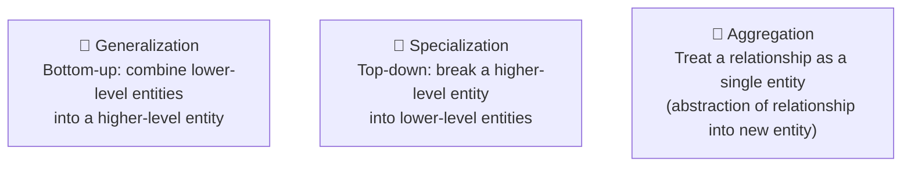

**Generalization** — a bottom-up approach in which two lower-level entities combine to form a higher-level entity. The higher-level entity can also combine with other lower-level entities to form further higher-level entities.

- A bottom-up design process — combine entity sets that share the same features into a higher-level entity set.
- Specialization and generalization are simple inversions of each other; represented the same way in an E-R diagram.
- The terms are used interchangeably.

**Specialization** — opposite of generalization; a top-down approach in which one higher-level entity is broken down into two lower-level entities.

- Designate subgroupings within an entity set that are distinctive from other entities.
- These subgroupings become lower-level entity sets with attributes/relationships that don't apply to the higher-level entity set.
- Depicted by a triangle labeled **ISA** (e.g., customer "is a" person).
- **Attribute inheritance** — a lower-level entity set inherits all attributes and relationship participation of the higher-level entity set.

**Specialization and Generalization notes:**
- Can have multiple specializations of an entity set based on different features.
- E.g., permanent-employee vs. temporary-employee, in addition to officer vs. secretary vs. teller.
- Each employee would be a member of one of permanent-employee or temporary-employee, and also a member of one of officer, secretary, or teller.
- The **ISA relationship** is also referred to as a **superclass-subclass relationship**.

**Aggregation** — treats the relationship between two entities as a single entity; an abstraction that treats relationships as entities.

- Eliminates redundancy via aggregation.
- Treats relationship as an abstract entity — allows relationships between relationships.
- Abstraction of relationship into a new entity.

---

## 6. Relational Database Management System

The relational model for database management is based on **predicate logic** and **set theory** — invented by **Edgar Codd**. The fundamental assumption: all data is represented as mathematical n-ary relations, an n-ary relation being a subset of the Cartesian product of n sets.

**n-ary Relationship** — when n entity sets participate in a relation, it's called an n-ary relationship.

| Term | Description |
|---|---|
| **Relation** | The fundamental organizational structure — a two-dimensional table of rows and columns, storing data about entities |
| **Tuples** | The rows in a relation — represent specific occurrences (records) of an entity; each row must be unique |
| **Attributes** | The columns in a relation — represent characteristics of an entity |
| **Domain** | The set of permitted values for each attribute; must be **atomic** (indivisible units) |
| **Database Schema** | Logical design of the database |
| **Database Instance** | A snapshot of the data in a database at a given instant of time |
| **Relation Schema** | Corresponds to a type definition — the collection of relation schemas defines the database schema |
| **Relation Instance** | Corresponds to a value of a variable — the "relation" itself |

### 6.1 Database Keys

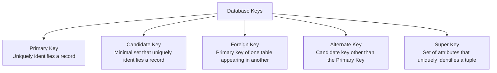

1. **Primary Key** — uniquely identifies a record in a table. `Student_ID` is the primary key in the STUDENT table.
2. **Candidate Key** — a single field or minimal combination of fields that uniquely identifies each record. Every table must have at least one, but can have several.

| Roll_No. | Student_ID |
|---|---|
| 001 | 11093100 |
| 002 | 11093101 |
| 003 | 11093126 |
| 004 | 11093127 |

*In the STUDENT table, `Student_ID` and `Roll_No.` are Candidate keys.*

3. **Foreign Key** — generally a primary key from one table that appears as a field in another.

**STUDENT**

| Roll_No. | Student_ID | Student_Name | Student_Class |
|---|---|---|---|
| 001 | 11093100 | Ravi Kumar | 3 |
| 002 | 11093101 | Nihal Sharma | 4 |
| 003 | 11093126 | Astha Mathur | 3 |
| 004 | 11093127 | Nishi Arora | 5 |

**LIBRARY_RECORD**

| Lib_CardNo | Student_ID | Student_Name | Address |
|---|---|---|---|
| AX120 | 11093101 | Nihal Sharma | 12th Avenue Street, Delhi |
| AX121 | 11093126 | Astha Mathur | XYZ Lane, Delhi |
| BL101 | 11093127 | Nishi Arora | 5-D, Z Block, Delhi |

*In LIBRARY_RECORD, `Lib_CardNo.` is the Primary key and `Student_ID` is the Foreign key (as it's the primary key of STUDENT).*

4. **Alternate Key** — the candidate key(s) other than the primary key.
5. **Super Key** — the set of attributes that can uniquely identify a tuple. e.g., `Student_Enroll_No`, `(Student_ID, Student_Name)`.

**Non-key attributes** are attributes other than candidate key attributes. **Non-prime Attributes** are attributes other than Primary attributes.

### 6.2 Relational Query Languages

Relational query languages use **relational algebra** to break down user requests and instruct the DBMS to execute them — the language by which the user communicates with the database. Can be **procedural** or **non-procedural**.

- **Procedural language** — the user instructs the system to perform a sequence of operations to compute the desired result.
- **Non-procedural language** — the user describes the desired information without specifying the procedure to obtain it.

### 6.3 Relational Algebra

Relational algebra is a **procedural query language**. It takes one or more relations/tables, performs an operation, and produces a result — itself a relation, so relational operations can be applied to query results as well as to base relations.

An operator can be **unary** or **binary**. Operations include:

| # | Operation | Symbol | Syntax | Example |
|---|---|---|---|---|
| 1 | **Selection** | σ | `σ(Cond)(Relation Name)` | `σ(AGE>30)(EMPLOYEES)` — extract employees older than 30 |
| 2 | **Project** | ∏ | `∏(Col1,Col2...Coln)(Relation Name)` | `∏(EMP_ID,NAME)(EMPLOYEE)` — extract EMP_ID and NAME |
| 3 | **Union** | ∪ | `r ∪ s = {t | t ∈ r or t ∈ s}` | `∏Managers(IT_Dept) ∪ ∏Managers(FUNCT_Dept)` |
| 4 | **Minus** | − | `Relation1 - Relation2` | `∏Name(STUDENTS) − ∏Name(EMPLOYEE)` — students who aren't employees |
| 5 | **Rename** | ρ | `ρ(Relation2, Relation1)` | `ρ(STUDENT1, STUDENT)` |
| 6 | **Cartesian Product** | Χ | `r Χ s = {qt | q ∈ r and t ∈ s}` | Combines every row of one table with every row of another |

**Notes:**
- **Union** on R1, R2 requires them to be **union compatible** (same number of attributes, same domains). Duplicate tuples are automatically eliminated.
- **Minus** requires R1, R2 to be union compatible; `R1 - R2` gives tuples in R1 but not in R2.
- **Cartesian Product** combines tuples from two relations — unlike a join, it contains **all pairs** of tuples regardless of matching attribute values.

### Tuple Relational Calculus

A **non-procedural** query language, using mathematical predicate calculus instead of algebra. Describes *what* to get, not *how*.

A query is expressed as: `{t | P(t)}` — the set of tuples for which the predicate is true.

*Example:* `{t | EMPLOYEE(t) and t.SALARY>20000}` — selects tuples from EMPLOYEE where salary > 20000.

### Domain Relational Calculus

Uses variables that take values from **domains of attributes** rather than tuples of relations.

General format: `{d1, d2, . . . , dn | F(d1, d2, . . . , dm)}` where `m ≥ n`, and `d1...dm` are domain variables, `F` is a formula composed of atoms.

*Example:* Select EMP_ID and EMP_NAME of employees who work for department ID 415:
`{<EMP_ID, EMP_NAME> | <EMP_ID, EMP_NAME> ∈ EMPLOYEE ∧ DEPT_ID = 415}`

---

## 7. Normalization

### 🏗️ Normalization Forms & Dependency Resolution Hierarchy

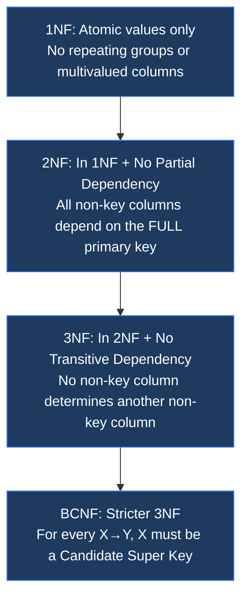

> **📌 Note:** **Boyce-Codd Normal Form (BCNF)** is stricter than 3NF. Every table in BCNF is guaranteed to be in 3NF, but a 3NF table might not be in BCNF if there are overlapping candidate keys.

**Normalization** is a process of organizing data in a database to avoid **data redundancy, insertion anomaly, update anomaly, and deletion anomaly** — a database schema design technique by which an existing schema is modified to minimize redundancy and dependency of data.

### Anomalies in Database Management

There are **three types**:

1. **Update Anomalies** — Incorrect data may need to be changed across many records, risking incorrect changes.
2. **Delete Anomalies** — Legitimately deleting a record can result in the loss of other required data (e.g., deleting a book loan removes all details about the book — author, title, etc.).
3. **Insert Anomalies** — It may not be possible to add a required piece of data unless another unavailable piece of data is also added (e.g., can't store a new library member's details until they've taken out a book).

### 7.1 Functional Dependency

We use functional dependencies to test relations to see if they are legal under a given set of FDs.

- If relation r is legal under a set F of functional dependencies, we say r **satisfies** F.
- F **holds on** R if all legal relations on R satisfy F.
- A specific instance may satisfy an FD even if it doesn't hold on all legal instances.
- A functional dependency is **trivial** if satisfied by all instances of a relation.
  - *Example:* `customer_name, loan_number → customer_name` and `customer_name → customer_name` are trivial.

#### Inference Rules — Armstrong's Axioms

Sound and complete — enable computation of any functional dependency.

1. **Reflexivity** — if the B's are a subset of the A's, then A → B
2. **Augmentation** — If A → B, then A, C → B, C
3. **Transitivity** — If A → B and B → C, then A → C

**Additional inference rules:**

4. **Decomposition** — If A → B, C, then A → B
5. **Union** — If A → B and A → C, then A → B, C
6. **Pseudo-transitive** — If A → B and C, B → D, then C, A → D

**Equivalence of sets of FDs:** Two FDs S & T are equivalent iff S → T and T → S.

The dependency `{A_1,...,A_n} → {B_1,...,B_m}` is:
- **Trivial** if the B's are a subset of the A's
- **Nontrivial** if at least one B is not among the A's
- **Completely nontrivial** if none of the B's is among the A's

**Closure (F+)** — All dependencies that include F and can be inferred from F using the above rules are called the closure of F, denoted F+.

To decide whether an attribute (or set of attributes) is a key for a table, we identify the attribute's **closure** (denoted A+).

**Algorithm to compute closure:** We must find whether F ⊨ X → Y — i.e., whether X → Y ∈ F+. The better method: generate X+ (closure of X under F), and test using augmentation and reflexive rules.

**Worked Example:**

`EMPLOYEE(empid, empname, dept, age, salary, experience)`

Functional dependencies:
```
empid -> empname
{age, experience} -> salary
empid -> {age, dept}
dept -> experience
```

Find closure of `{empid}`:

- **Step 1:** For each FD, check whether the left side is a subset of the closure set. If yes, add the right side to the closure set. If not, check the next FD.
- **Step 2:** Keep checking until no more FDs have a left side that is a subset of the closure set.

*(A set M is a subset of N only if all elements of M are present in N.)*

Walking through:
- C+ = {empid} initially
- `empid → empname`: left side ⊆ C+ → add empname → C+ = {empid, empname}
- `{age, experience} → salary`: left side ⊄ C+ → skip
- `empid → {age, dept}`: left side ⊆ C+ → add age, dept → C+ = {empid, empname, age, dept}
- `dept → experience`: left side ⊆ C+ → add experience → C+ = {empid, empname, age, dept, experience}
- Re-check all FDs again: `{age, experience} → salary`: now left side ⊆ C+ → add salary → C+ = {empid, empname, age, dept, experience, salary}
- No more new attributes can be added → **stop**

**Final closure:** `C+ = {empid, empname, age, dept, experience, salary}`

### Minimal Cover of FD

A set of FDs **F covers** another set **G** if every FD in G can be inferred from F — formally, F covers G if G+ ⊆ F+. **F is a minimal cover of G** if F is the smallest set of FDs that covers G.

We find the minimal cover by iteratively simplifying using three methods:

**1. Simplifying an FD by the Union Rule:** If X → Y and X → Z, then X → YZ.

**2. Simplifying the left-hand side:** Let F be `XB → Y` and H be `X → Y`. If F ⇒ X → Y (i.e., Y ⊆ X+F), we can replace F by H.

*Example:* Given F: `AB → C`, `A → B`. Want to know if we can simplify to H: `A → C`, `A → B`. Then A+F = ABC. Since Y ⊆ X+F, we can replace F by H.

**3. Simplifying the right-hand side:** Let F be `X → YC` and H be `X → Y`. If H ⇒ X → YC (i.e., YC ⊆ X+H), we can replace F by H.

*Example:* Given F: `A → BC`, `B → C`. Want H: `A → B`, `B → C`. Then A+H = ABC. Since BC ⊆ X+H, we can replace F by H.

**Algorithm to Find the Minimal Cover:**
1. Start with F
2. Remove all trivial FDs
3. Repeatedly apply (in any order) until no changes are possible:
   - Union Simplification (do this as soon as possible)
   - RHS Simplification
   - LHS Simplification
4. Result is the minimal cover

*Example:* Applying to EGS with `E → G`, `G → S`, `E → S`. Using the union rule, combine 1 & 3: `E → GS`, `G → S`. Simplifying RHS of 1: `E → G`, `G → S`.

**General Algorithm for finding minimal cover for F:**
1. Let G be FDs from F with right sides decomposed to single attributes.
2. Remove all redundant attributes from left-hand sides in G.
3. Remove all redundant FDs from the resulting set.
4. Output the result.

*Example:* Consider R = ABCDEFGH with FDs:
```
ABH → C
A → D
C → E
BGH → F
F → AD
E → F
BH → E
```
Converting RHS to single attributes:
```
ABH → C, A → D, C → E, BGH → F, F → A, F → D, E → F, BH → E
```
*(then perform steps 2 & 3 to complete simplification)*

### Understanding Normalization

Normalization restructures the logical data model to eliminate redundancy, organize data efficiently, reduce repeating data, and reduce the potential for anomalies. It also improves data consistency and simplifies future extension of the logical model. Formal classifications describing normalization levels are called **normal forms (NF)**.

- A non-normalized database may store the same data in multiple locations — an update to some but not all causes an **update anomaly**.
- A non-normalized database may have inappropriate dependencies — adding data may require first adding an unrelated dependency, causing **insertion anomalies**.
- Deleting data from such databases may require deleting data from an inappropriate dependency, causing **deletion anomalies**.
- A normalized database prevents these by storing data in only one location and ensuring relations mirror functional dependencies.

**Edgar F. Codd** originally defined the first three normal forms:
- 1NF requires tables be made up of a primary key and atomic fields.
- 2NF and 3NF deal with the relationship of non-key fields to the primary key — summarized as: all non-key fields must depend on "the key, the whole key, and nothing but the key."
- Most applications in 3NF are fully normalized, but research identified potential update anomalies in 3NF databases — **BCNF** refines 3NF to eliminate these.
- **4NF and 5NF** deal specifically with many-many and one-many relationship representation.
- **6NF** applies only to temporal databases.

### 7.2 First Normal Form (1NF)

Lays the groundwork for organized database design:
- Ensure each table has a **primary key** — a minimal set of attributes that uniquely identifies a record.
- The domain of an attribute must include only **atomic values**; the value of any attribute in a tuple must be a single value from its domain.
- Doesn't allow nested relations.
- Redundantly duplicated data across multiple rows is moved to a separate table.

| Term | Description |
|---|---|
| **Atomicity** | Each attribute must contain a single value, not a set of values |
| **Unnormalized form (UNF)** | A table containing one or more repeating groups |
| **First Normal Form (1NF)** | A relation where the intersection of each row and column contains one and only one value |

**UNF → 1NF: remove repeating groups by:**
- Entering appropriate data in empty columns of rows.
- Placing repeating data along with a copy of the original key attribute in a separate relation.
- Identifying a primary key for each new relation.

**Example — STUDENT table (not in 1NF):**

| Roll_No | Name | Course |
|---|---|---|
| 1 | Snehal | Polity, History, Economics |
| 2 | Kajal | DBMS, CD |
| 3 | Amit | Physics, Chemistry |

**After converting to 1NF:**

| Roll_No | Name | Course |
|---|---|---|
| 1 | Snehal | Polity |
| 1 | Snehal | History |
| 1 | Snehal | Economics |
| 2 | Kajal | DBMS |
| 2 | Kajal | CD |
| 3 | Amit | Physics |
| 3 | Amit | Chemistry |

### 7.3 Second Normal Form (2NF)

**Definition:** A relation schema R is in 2NF if every non-prime attribute A in R is **not partially dependent** on any key of R.

**Partial Dependency** — if a proper subset of a candidate key determines a non-prime attribute, it's called partial dependency.

- Create separate tables for sets of values that apply to multiple records.
- Relate the tables with a foreign key.
- Records should depend only on a table's primary key (a compound key if necessary). *Example: a customer's address, needed by Customers, Orders, Shipping, Invoices, etc. tables — store it once in a Customers or Addresses table instead of repeating it.*

A table is in 2NF if **both**:
- The table is in **1NF**.
- No non-prime attribute is dependent on a **proper subset** of any candidate key.

**1NF → 2NF:** remove partial dependencies by moving the functionally dependent attributes into a new relation along with a copy of their determinant.

**Worked Example:** Relation R with fields A, B, C, D, where `AB → D` and `B → C`.

- A and B are essential attributes — Candidate Key for R is `AB`.
- `(AB)+ = ABCD` → AB is the Candidate Key.
- **Prime Attributes:** AB (part of candidate key)
- **Non-Prime Attributes:** CD
- **Partial Dependency:** C depends only on B, not the complete candidate key set AB → **partial dependency exists**.

**Eliminate the partial dependency** by decomposing into:
- `R1(A, B, D)` where `AB → D`
- `R2(B, C)` where `B → C`

Now B is the only candidate key in R2, and C is dependent on it — partial dependency eliminated.

### 7.4 Third Normal Form (3NF)

For 3NF, the table must first be in 2NF, **plus** non-key fields must be dependent **only** on the PK, not on any other non-key field.

**3NF Rule:**
1. The database must meet all requirements of 2NF.
2. Any field dependent not only on the primary key but also on another field is moved to a separate table (**No Transitive Dependencies**).

**Example:**

`STUDENT(Stu_ID, Stu_Name, City, Zip)`

`Stu_ID` is the key. `City` can be identified by `Stu_ID` as well as `Zip` itself. Neither `Zip` is a superkey nor `City` a prime attribute. Additionally: `Stu_ID → Zip → City` — a **transitive dependency** exists.

**Decompose into two relations:**
- `Student_Detail(Stu_ID, Stu_Name, Zip)`
- `ZipCode(Zip, City)`

**General Definition:** A relation schema R is in 3NF if, whenever a nontrivial FD X → A holds in R, either (a) X is a superkey, or (b) A is a prime attribute of R. Equivalently, every non-prime attribute of R must be:
1. Fully functionally dependent on every key of R.
2. Non-transitively dependent on every key of R.

### 7.5 Boyce-Codd Normal Form (BCNF)

A row is in BCNF **if and only if every determinant is a candidate key**. 2NF and 3NF assume attributes not part of candidate keys depend on candidate keys but don't deal with dependencies **within** the keys — BCNF addresses this.

**Definition:** A relation R is in BCNF if whenever X → A holds in R, and A is not in X, then X is a candidate key for R.

Most relations in 3NF are also in BCNF. A 3NF relation is **not** in BCNF only if:
(a) the candidate keys are composite (not single attributes),
(b) there is more than one candidate key, and
(c) the keys are not disjoint (some attributes are common between keys).

**Worked Example:**

`enrol(sno, sname, cno, cname, date-enrolled)`

Assume candidate keys: `(sno, cno)`, `(sno, cname)`, `(sname, cno)`, `(sname, cname)` — assuming sname and cname are unique identifiers.

The relation is in 3NF but **not BCNF** because of dependencies: `sno → sname` and `cno → cname`, where attributes that are part of a candidate key are dependent on part of another candidate key. This causes repetition of information and anomalies.

**Decompose into three relations:**
- `(sno, sname)`
- `(cno, cname)`
- `(sno, cno, date-of-enrolment)`

Now each relation contains information about only one thing — students, subjects, or enrolments — removing anomalies and redundancy.

### 7.6 Multivalued Dependency and Fourth Normal Form (4NF)

If all information about an entity is represented in one relation, repeating all information other than the multivalued attribute becomes necessary — resulting in many tuples for the same entity instance and a composite key. Representing this multivalued info in a **separate relation** is the alternative. The problem is worse with multiple multivalued attributes.

**Example:** `emp(e#, dept, salary, proj)` — `proj` is multivalued.

Functional dependencies apply only to single-valued information (e.g., `e# → dept`). Not all information is single-valued — `e# → proj` is **not** a functional dependency, since an employee can have a list of projects.

**Example:** `programmer(emp_name, qualifications, languages)` — both `qualifications` and `languages` are multivalued, independent of each other. Treating them as separate entities gives two many-to-many relationships (employee↔qualification, employee↔language).

Functional dependency A → B relates one value of A to one value of B, while **multivalued dependency A →→ B** defines a relationship where a set of values of B are determined by a single value of A.

**Formal definition:** X →→ Y holds for R(X, Y, Z) if for tuples t1, t2 in R with `t1[x] = t2[x]`, R also contains tuples t3, t4 such that:
```
t1[x] = t2[x] = t3[x] = t4[x]
t3[Y] = t1[Y] and t3[Z] = t2[Z]
t4[Y] = t2[Y] and t4[Z] = t1[Z]
```
i.e., if `t1 = [X, Y1, Z1]` and `t2 = [X, Y2, Z2]`, then there must be tuples `t3 = [X, Y1, Z2]` and `t4 = [X, Y2, Z1]`.

This insists that every value of Y appears with every value of Z, keeping relation instances consistent — X alone determines Y and Z, and there's no relationship between Y and Z.

**Fourth Normal Form (4NF):** Requires no non-trivial multivalued dependencies of attribute sets on anything other than a superset of a candidate key. A table is in 4NF iff it is in **BCNF** and all multivalued dependencies are actually functional dependencies. 4NF removes unwanted multivalued dependencies.

**Definition:** A relation schema R is in 4NF w.r.t. a set of dependencies F if, for every non-trivial multivalued dependency X →→ Y in F+, X is a superkey for R.

### 7.7 Properties of Relational Decompositions

If R doesn't satisfy a particular normal form, we decompose R into smaller schemas.

**What's a decomposition?**
```
R = (A1, A2, …, An)
D = (R1, R2, …, Rk) such that Ri ⊆ R and R = R1 ∪ R2 ∪ … ∪ Rk
```
(Ri's need not be disjoint.) Replacing R by R1, R2, …, Rk is the process of decomposing R.

*Example:* `gradeInfo(rollNo, studName, course, grade)` decomposed into `R1: gradeInfo(rollNo, course, grade)` and `R2: studInfo(rollNo, studName)`.

**Decomposition must satisfy two properties:**

**i. Lossless (Lossless-join dependency):** Ensures no spurious rows are generated when relations are united via natural join. The information in instance r of R must be preserved in instances r1, r2, ..., rk where `ri = ΠRi(r)`.

Decomposition is lossless w.r.t. F if for every instance r on R satisfying F:
```
r = πR1(r) ⋈ πR2(r) ⋈ ... ⋈ πRk(r)
```

**ii. Dependency Preserving Property:** If a set of FDs holds on R, it should be possible to enforce F by enforcing appropriate dependencies on each ri.

```
D = (R1, R2, …, Rk) preserves F if:
(πR1(F) ∪ πR2(F) ∪ … ∪ πRk(F))+ = F+
```
where `πRi(F) = {(X → Y) ∈ F+ | X ⊆ Ri, Y ⊆ Ri}` (projection of F onto Ri). Any FD that logically follows from F must also follow from the union of projections of F onto Ri's — then D is dependency preserving.

**Join Dependency:** Indicates a property of a relation schema that cannot be decomposed losslessly into two relation schemas, but **can** be decomposed losslessly into three or more simpler relation schemas — meaning the decomposed tables must be capable of being rejoined on common keys to reform the original table.

**Algorithm for BCNF Decomposition:**
```
R – given schema, F – given set of FDs
D = {R}   // initial decomposition
while there is a relation schema Ri in D that is not in BCNF do
{ let X → A be the FD in Ri violating BCNF;
  Replace Ri by Ri1 = Ri – {A} and Ri2 = X ∪ {A} in D; }
```
Decomposition of Ri is lossless as: `Ri1 ∩ Ri2 = X`, `Ri2 – Ri1 = A`, and `X → A`. Result: a lossless decomposition of R into BCNF relations.

### 7.8 Fifth Normal Form (5NF)

Also called **PJ/NF** (Projection-Join Normal Form) — requires that there are no non-trivial join dependencies that do not follow from the key constraints. A table is in 5NF iff it's in 4NF and the candidate keys imply every join dependency in it.

**Goals of Normalization:**
- Let R be a relation scheme with a set F of FDs.
- Decide whether R is in "good" form.
- If not, decompose it into `{R1, R2, ..., Rn}` such that each is in good form, the decomposition is lossless-join, and preferably dependency preserving.

*"A relation R is in 5NF if and only if every join dependency in R is a consequence of the candidate keys of R."*

**For R to be in 5NF:**
1. It should be in 4NF, **and**
2. Either no join dependency exists, **or**
   - If a join dependency exists, it should be trivial in nature, **or**
   - If all the Ri are superkeys, then `R → (R1, R2, R3, ...Ri)`.

- Join dependencies generalize multivalued dependencies, leading to **Project-Join Normal Form (PJNF)** (also called 5NF).
- A more general class of constraints leads to a normal form called **domain key normal form** — but these are hard to reason with (no sound/complete inference rules exist), so rarely used.

### 📝 Normalization — Quick Summary

- **1NF:** Each column type is unique — no repeating groups.
- **2NF:** Entity already in 1NF; all attributes depend solely on the entity's unique identifier.
- **3NF:** Entity already in 2NF; no column depends on any entry other than the key. If such an entity exists, move it to a new table.
- Once 3NF is achieved, the database is considered **normalized**. Three more "extended" NFs exist:
  - **BCNF:** Database in 3NF, all tables have only one primary key.
  - **4NF:** Tables cannot have multi-valued dependencies on a primary key.
  - **5NF:** No cyclic dependencies in a composite key.

---

## 8. Structured Query Language (SQL)

### What's SQL?

In 1971, IBM researchers created a simple non-procedural language called **Structured English Query Language (SEQUEL)**, based on Dr. Edgar F. (Ted) Codd's relational model design.

In the late 1980s, ANSI and ISO released a standardized version called **Structured Query Language (SQL)**, pronounced "Sequel." Several versions exist — the latest is SQL-99, though SQL-92 is the current universally adopted standard.

SQL is the language used to query all databases. Understanding it efficiently is imperative to designing an efficient database application.

### The Four Basic SQL Commands

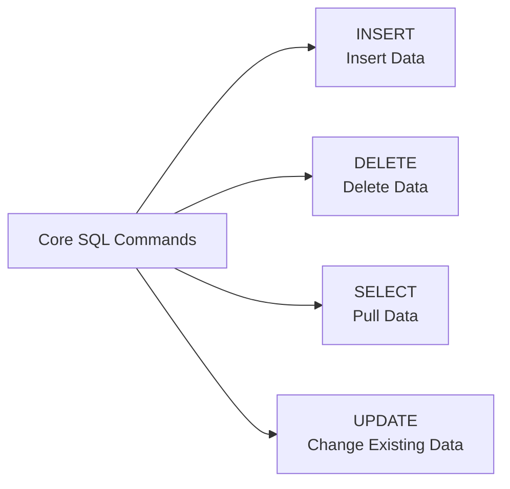

### 8.1 Building a Real-World Contacts Database (MySQL Walkthrough)

We'll build a **Contacts** database with the following fields, split across multiple tables to demonstrate relational SQL operations:

`First Name, Last Name, Birth Date, Street Address, City, State, Zip, Country, Telephone Home, Telephone Work, Email, Company Name, Designation`

Data will be split as:
- **names** — FirstName, LastName, BirthDate
- **address** — address-related data
- **company_details** — company details
- **email** — emails
- **telephones** — phone numbers

#### MySQL Data Types

| Type | Size (bytes) | Description |
|---|---|---|
| `TINYINT(length)` | 1 | Unsigned 0–255, signed -128–127 |
| `SMALLINT(length)` | 2 | Unsigned 0–65535, signed -32768–32767 |
| `MEDIUMINT(length)` | 3 | Unsigned 0–16777215, signed -8388608–8388607 |
| `INT(length)` | 4 | Unsigned 0–4294967295, signed -2147483648–2147483647 |
| `BIGINT(length)` | 8 | Unsigned 0–18446744073709551615, signed ±9223372036854775807 |
| `FLOAT(length, decimal)` | 4 | Floating point, max ±3.402823466E38 |
| `DOUBLEPRECISION(length, decimal)` | 8 | Floating point, max ±1.7976931348623157E308 |
| `DECIMAL(length, decimal)` | length | Floating point stored as CHAR field type |
| `TIMESTAMP(length)` | 4 | YYYYMMDDHHMMSS etc.; auto-updates on row change |
| `DATE` | 3 | YYYY-MM-DD |
| `TIME` | 3 | HH:MM:DD |
| `DATETIME` | 8 | YYYY-MM-DD HH:MM:SS |
| `YEAR` | 1 | YYYY or YY |
| `CHAR(length)` | length | Fixed-length text, padded with trailing spaces |
| `VARCHAR(length)` | length | Fixed-length text (255 char max), trailing spaces removed |
| `TINYTEXT` | length+1 | Max 255 characters of text |
| `TINYBLOB` | length+1 | Max 255 characters of binary data |
| `TEXT` | length+1 | 64Kb of text |
| `BLOB` | length+1 | 64Kb of data |
| `MEDIUMTEXT` | length+3 | 16Mb of text |
| `MEDIUMBLOB` | length+3 | 16Mb of data |
| `LONGTEXT` | length+4 | 4GB of text |
| `LONGBLOB` | length+4 | 4GB of data |
| `ENUM` | 1–2 | One value from up to 65535 options, e.g. `ENUM('abc','def','ghi')` |
| `SET` | 1–8 | Any number of a set of predefined possible values |

#### Creating the Database

```sql
-- From the shell prompt:
mysqladmin create contacts;

-- From the mysql prompt:
mysql> use contacts;
-- Database changed
```

**Creating tables:**

```sql
CREATE TABLE names (
  contact_id SMALLINT NOT NULL AUTO_INCREMENT PRIMARY KEY,
  FirstName CHAR(20),
  LastName CHAR(20),
  BirthDate DATE
);

CREATE TABLE address (
  contact_id SMALLINT NOT NULL PRIMARY KEY,
  StreetAddress CHAR(50),
  City CHAR(20),
  State CHAR(20),
  Zip CHAR(15),
  Country CHAR(20)
);

CREATE TABLE telephones (
  contact_id SMALLINT NOT NULL PRIMARY KEY,
  TelephoneHome CHAR(20),
  TelephoneWork CHAR(20)
);

CREATE TABLE email (
  contact_id SMALLINT NOT NULL PRIMARY KEY,
  Email CHAR(20)
);

CREATE TABLE company_details (
  contact_id SMALLINT NOT NULL PRIMARY KEY,
  CompanyName CHAR(25),
  Designation CHAR(15)
);
```

> **Note:** This design assumes one person has only one email address, one home/work telephone, and works at only one company. Handling multiple values per person would require an extra field or a separate relating table.

**Keys:** The PRIMARY KEY in each table serves as a mechanism to refer to fields within the same row and to identify the relationship between a row and the person in the `names` table. `AUTO_INCREMENT` is used only for `names`, since we need to reuse the generated `contact_id` in the other tables. This design (one table relating to several others) is a **'one to many'** relationship. In a **'many to many'** relationship, we could have several auto-incremented primary keys across tables with several inter-relationships.

**Foreign Key:** A field in a table that is also the Primary Key in another table — known as **'referential integrity'**.

#### Viewing Table Structure

```sql
mysql> SHOW TABLES;
```
```
+-----------------------+
| Tables in contacts    |
+-----------------------+
| address               |
| company_details       |
| email                 |
| names                 |
| telephones            |
+-----------------------+
5 rows in set (0.00 sec)
```

```sql
mysql> SHOW COLUMNS FROM address;
```
```
+---------------+-------------+------+-----+---------+-------+
| Field         | Type        | Null | Key | Default | Extra |
+---------------+-------------+------+-----+---------+-------+
| contact_id    | smallint(6) |      | PRI | 0       |       |
| StreetAddress | char(50)    | YES  |     | NULL    |       |
| City          | char(20)    | YES  |     | NULL    |       |
| State         | char(20)    | YES  |     | NULL    |       |
| Zip           | char(10)    | YES  |     | NULL    |       |
| Country       | char(20)    | YES  |     | NULL    |       |
+---------------+-------------+------+-----+---------+-------+
6 rows in set (0.00 sec)
```

#### Inserting Data

```sql
-- One row at a time
mysql> INSERT INTO names (FirstName, LastName, BirthDate) VALUES ('Yamila','Diaz','1974-10-13');
-- Query OK, 1 row affected (0.00 sec)

-- Multiple rows at a time
mysql> INSERT INTO names (FirstName, LastName, BirthDate) VALUES
       ('Nikki','Taylor','1972-03-04'),('Tia','Carrera','1975-09-18');
-- Query OK, 2 rows affected (0.00 sec)
-- Records: 2  Duplicates: 0  Warnings: 0
```

```sql
mysql> SELECT * FROM NAMES;
```
```
+------------+-----------+----------+------------+
| contact_id | FirstName | LastName | BirthDate  |
+------------+-----------+----------+------------+
| 3          | Tia       | Carrera  | 1975-09-18 |
| 2          | Nikki     | Taylor   | 1972-03-04 |
| 1          | Yamila    | Diaz     | 1974-10-13 |
+------------+-----------+----------+------------+
3 rows in set (0.06 sec)
```

```sql
mysql> DESCRIBE names;
```
```
+------------+-------------+------+-----+---------+----------------+
| Field      | Type        | Null | Key | Default | Extra          |
+------------+-------------+------+-----+---------+----------------+
| contact_id | smallint(6) |      | PRI | NULL    | auto_increment |
| FirstName  | char(20)    | YES  |     | NULL    |                |
| LastName   | char(20)    | YES  |     | NULL    |                |
| BirthDate  | date        | YES  |     | NULL    |                |
+------------+-------------+------+-----+---------+----------------+
4 rows in set (0.00 sec)
```

**Populating the other tables:**

```sql
mysql> INSERT INTO address(contact_id, StreetAddress, City, State, Zip, Country) VALUES
  ('1','300 Yamila Ave.','Los Angeles','CA','300012','USA'),
  ('2','4000 Nikki St.','Boca Raton','FL','500034','USA'),
  ('3','404 Tia Blvd.','New York','NY','10011','USA');
-- Query OK, 3 rows affected (0.05 sec)

mysql> INSERT INTO company_details (contact_id, CompanyName, Designation) VALUES
  ('1','Xerox','New Business Manager'),
  ('2','Cabletron','Customer Support Eng'),
  ('3','Apple','Sales Manager');

mysql> INSERT INTO email (contact_id, Email) VALUES
  ('1','yamila@yamila.com'),('2','nikki@nikki.com'),('3','tia@tia.com');

mysql> INSERT INTO telephones (contact_id, TelephoneHome, TelephoneWork) VALUES
  ('1','333-50000','333-60000'),('2','444-70000','444-80000'),('3','555-30000','555-40000');
```

#### Backing Up the Database

```bash
mysqldump contacts > contacts.sql
# Reverse operation:
mysql contacts < contacts.sql
```

The dump file is a text file containing all data and SQL instructions needed to recreate the database — a good way to back up your data. Sample dump excerpt:

```sql
CREATE TABLE address (
  contact_id smallint(6) DEFAULT '0' NOT NULL,
  StreetAddress char(50),
  City char(20),
  State char(20),
  Zip char(10),
  Country char(20),
  PRIMARY KEY (contact_id)
);
INSERT INTO address VALUES (1,'300 Yamila Ave.','Los Angeles','CA','300012','USA');
INSERT INTO address VALUES (2,'4000 Nikki St.','Boca Raton','FL','500034','USA');
INSERT INTO address VALUES (3,'404 Tia Blvd.','New York','NY','10011','USA');
```

### 8.2 SELECT Statement Variations

```sql
-- WHERE with comparison
mysql> SELECT * FROM names WHERE contact_id > 1;
```
```
+------------+-----------+----------+------------+
| contact_id | FirstName | LastName | BirthDate  |
+------------+-----------+----------+------------+
| 3          | Tia       | Carrera  | 1975-09-18 |
| 2          | Nikki     | Taylor   | 1972-03-04 |
+------------+-----------+----------+------------+
2 rows in set (0.00 sec)
```

```sql
-- IS NOT NULL
mysql> SELECT * FROM names WHERE contact_id IS NOT NULL;

-- ORDER BY
mysql> SELECT * FROM names WHERE contact_id IS NOT NULL ORDER BY LastName;

-- ORDER BY DESC
mysql> SELECT * FROM names WHERE contact_id IS NOT NULL ORDER BY LastName desc;

-- Date comparison
mysql> SELECT * FROM names WHERE BirthDate > '1973-03-06';

-- LIKE with wildcard %
mysql> SELECT FirstName, LastName FROM names WHERE LastName LIKE 'C%';

-- LIKE with wildcard _ (single character)
mysql> SELECT FirstName, LastName FROM names WHERE LastName LIKE '_iaz';
```

#### SQL Logical Operators (Left to Right)

| Operator | Meaning |
|---|---|
| `NOT` or `!` | Negation |
| `AND` or `&&` | Logical AND |
| `OR` or `\|\|` | Logical OR |
| `=` | Equal |
| `<>` or `!=` | Not Equal |
| `<=` | Less than or equal |
| `>=` | Greater than or equal |
| `<`, `>` | Less than, Greater than |

```sql
-- Combined logical operators
mysql> SELECT FirstName FROM names WHERE contact_id < 3 AND LastName LIKE 'D%';

-- IN
mysql> SELECT contact_id FROM names WHERE LastName IN ('Diaz','Carrera');

-- COUNT
mysql> SELECT count(*) FROM names;
mysql> SELECT count(FirstName) FROM names;

-- Aggregate functions
mysql> SELECT SUM(contact_id) FROM names;
mysql> SELECT MAX(contact_id) FROM names;   -- MIN() also works
```

#### WHERE vs HAVING

```sql
mysql> SELECT * FROM names WHERE contact_id >=1;
mysql> SELECT * FROM names HAVING contact_id >=1;
```
*(Both return similar results here — HAVING is typically used with GROUP BY / aggregates.)*

### 8.3 Querying Multiple Tables

```sql
mysql> SELECT names.contact_id, FirstName, LastName, Email
       FROM names, email
       WHERE names.contact_id = email.contact_id;
```
```
+------------+-----------+----------+--------------------+
| contact_id | FirstName | LastName | Email              |
+------------+-----------+----------+--------------------+
| 1          | Yamila    | Diaz     | yamila@yamila.com  |
| 2          | Nikki     | Taylor   | nikki@nikki.com    |
| 3          | Tia       | Carrera  | tia@tia.com         |
+------------+-----------+----------+--------------------+
3 rows in set (0.11 sec)
```

### 8.4 JOINs

**JOIN** is the action performed on multiple tables that returns a result as a table — it's what makes a database "relational." Types covered: **LEFT JOIN (OUTER JOIN)** and **RIGHT JOIN**.

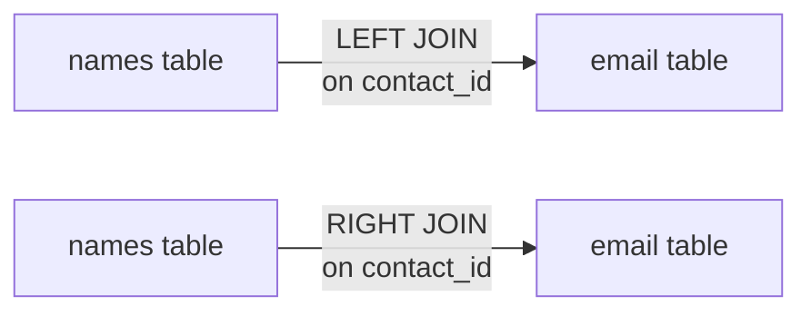

```sql
-- LEFT JOIN
mysql> SELECT * FROM names LEFT JOIN email USING (contact_id);
```
```
+------------+-----------+----------+------------+------------+--------------------+
| contact_id | FirstName | LastName | BirthDate  | contact_id | Email              |
+------------+-----------+----------+------------+------------+--------------------+
| 3          | Tia       | Carrera  | 1975-09-18 | 3          | tia@tia.com        |
| 2          | Nikki     | Taylor   | 1972-03-04 | 2          | nikki@nikki.com    |
| 1          | Yamila    | Diaz     | 1974-10-13 | 1          | yamila@yamila.com  |
+------------+-----------+----------+------------+------------+--------------------+
3 rows in set (0.16 sec)
```

```sql
-- Find people who have a home phone number
mysql> SELECT names.FirstName FROM names
       LEFT JOIN telephones ON names.contact_id = telephones.contact_id
       WHERE TelephoneHome IS NOT NULL;
```

```sql
-- RIGHT JOIN
mysql> SELECT * FROM names RIGHT JOIN email USING(contact_id);
```

### 8.5 BETWEEN

```sql
mysql> SELECT FirstName, LastName FROM names WHERE contact_id BETWEEN 2 AND 3;
```
```
+-----------+----------+
| FirstName | LastName |
+-----------+----------+
| Tia       | Carrera  |
| Nikki     | Taylor   |
+-----------+----------+
2 rows in set (0.00 sec)
```

### 8.6 ALTER, MODIFY, RENAME

```sql
-- Add a new column
mysql> ALTER TABLE names ADD Age SMALLINT;

-- Change column type/name
mysql> ALTER TABLE names CHANGE COLUMN Age Age TINYINT;

-- Modify column type only
mysql> ALTER TABLE names MODIFY COLUMN Age SMALLINT;

-- Rename a table
mysql> ALTER TABLE names RENAME AS mynames;
mysql> ALTER TABLE mynames RENAME AS names;   -- rename back
```

### 8.7 UPDATE and DELETE

```sql
-- UPDATE
mysql> UPDATE names SET Age ='23' WHERE FirstName='Tia';
-- Query OK, 1 row affected (0.06 sec)
```

```sql
-- DELETE specific rows
mysql> DELETE FROM names WHERE Age=23;
```

> ⚠️ **A DEADLY MISTAKE:**
> ```sql
> mysql> DELETE FROM names;   -- deletes ALL rows, no WHERE clause!
> ```

```sql
-- DROP a table entirely
mysql> DROP TABLE names;
mysql> DROP TABLE address, company_details, telephones;   -- drop multiple tables
```

> ⚠️ **Warning:** MySQL does not warn before executing `DROP TABLE` — be careful!

### 8.8 Full Text Indexing and Searching

Since MySQL version 3.23.23, **Full Text Indexing** allows `FULLTEXT` indexes on `VARCHAR` and `TEXT` columns. Searches are performed with the `MATCH` function, which matches a natural language query against a text collection and returns relevance-ranked rows.

Full-text search is powerful but not ideal for small tables — works best with large collections of textual data.

### 8.9 Optimizing Your Database

| Technique | Description |
|---|---|
| **Clustering** | Arrange table contents to match frequent query patterns using a clustering index; some databases auto-sort |
| **Ordered Indices** | "Lookup" tables per column of interest — speeds up queries but adds load when re-indexing |
| **B-Trees / Hashing** | Additional optimization techniques (not discussed in detail here) |
| **Replication** | Databases synchronize with each other — useful for backup/safety or to provide a closer database location for certain users |

---

## 9. Transactions

### What are Transactions?

In an RDBMS, when several users access the same data, or a server dies mid-update, a mechanism must protect data integrity — called a **Transaction**. A transaction groups a set of database actions into a single instantaneous event that either **succeeds** or **fails**.

### 🔑 ACID Properties

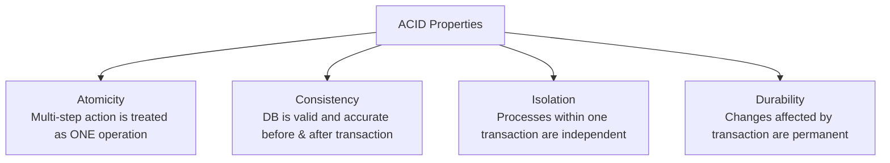

- **(A) Atomicity** — If an action consists of multiple steps, it's still considered one operation.
- **(C) Consistency** — The database exists in a valid and accurate operating state before and after a transaction.
- **(I) Isolation** — Processes within one transaction are independent and cannot interfere with those in others.
- **(D) Durability** — Changes affected by a transaction are permanent.

**Example** — deducting 100 Rupees from Amit's account:
```
Open_Acc(Amit)
OldBal = Amit.bal
NewBal = OldBal - 5000
Ram.bal = NewBal
CloseAccount(Amit)
```

To enable transactions, a mechanism called **Logging** is used — the DBMS writes details on tables, columns, and transaction results (before and after) to a log file, used during recovery. To protect a database resource from simultaneous use/writing, techniques like **Locking** or **timestamping** are used. In Locking, the DBMS acquires locks on all resources needed to complete an action; locks are released only once the transaction is complete.

**Two-Phase Locking (2PL)** — locks are acquired only when needed but released only when the transaction completes, ensuring altered data can be safely restored if the transaction fails. This can lead to **deadlocks**, where processes requiring the same resources block each other — resolved by aborting one transaction or letting the programmer handle it.

### 9.1 States of a Transaction

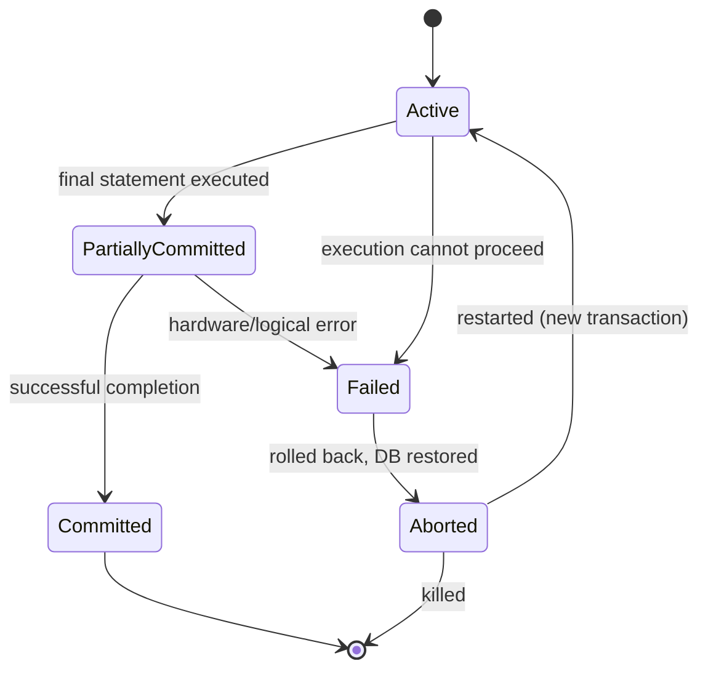

| State | Description |
|---|---|
| **Active** | Initial state, during execution |
| **Partially committed** | After the final statement has been executed |
| **Committed** | After successful completion |
| **Failed** | After discovering normal execution can no longer proceed |
| **Aborted** | After the transaction has been rolled back and the DB restored to its state prior to the start of the transaction |

A failed transaction must be rolled back, entering the aborted state. At this point:
- **Restart** — if the failure was due to a hardware/software error unrelated to the transaction's internal logic. A restarted transaction is a new transaction.
- **Kill** — usually due to an internal logical error correctable only by rewriting the application, bad input, or missing data.

### 9.2 Concurrency Control — Problems

| Problem | Description |
|---|---|
| **Lost Update** | Two concurrent transactions update the same data element — one update is lost |
| **Uncommitted Data** | Two transactions execute concurrently; the first is rolled back after the second has accessed its uncommitted data |
| **Inconsistent Retrievals** | A transaction accesses data before and after one or more other transactions finish working with that data |

### 9.3 Schedules

A **schedule** is a sequence of instructions specifying the chronological order in which instructions of concurrent transactions are executed. Must consist of all instructions of those transactions and preserve the order of instructions within each individual transaction.

- A transaction that **successfully completes** has a `commit` instruction as its last statement.
- A transaction that **fails** has an `abort` instruction as its last statement.

### 9.4 Serializability

If a schedule S can be transformed into S′ via a series of swaps of **non-conflicting** instructions, S and S′ are **conflict equivalent**. A schedule S is **serializable** if it is conflict equivalent to a serial schedule.

**Schedule S1 (interleaved, but serializable):**

| T1 | T2 |
|---|---|
| read(A) | |
| write(A) | |
| | read(A) |
| | write(A) |
| read(B) | |
| write(B) | |
| | read(B) |
| | write(B) |

This can be transformed into **Schedule S2** (serial, T1 then T2) by swapping non-conflicting instructions:

| T1 | T2 |
|---|---|
| read(A) | |
| write(A) | |
| read(B) | |
| write(B) | |
| | read(A) |
| | write(A) |
| | read(B) |
| | write(B) |

→ **Schedule S1 is serializable.**

**Schedule S3 (NOT serializable):**

| T3 | T4 |
|---|---|
| read(P) | |
| write(P) | |
| | write(P) |

We are unable to swap instructions to obtain either `<T3,T4>` or `<T4,T3>` as a serial schedule → **not serializable**.

### 9.5 Recoverability

**Recoverable schedule** — for each pair of transactions Ti and Tj, where Tj reads data items written by Ti, **Ti must commit before Tj commits**.

**Non-recoverable example** (if T6 commits immediately after the read):

| T5 | T6 |
|---|---|
| read(A) | |
| write(A) | |
| | read(A) |
| | read(B) |

If T5 aborts after T6 has committed, T6 would have read (and possibly shown to the user) an inconsistent database state — hence schedules **must** be recoverable.

### 9.6 Cascadeless Schedules

**Example (cascading rollback scenario):**

| T7 | T8 | T9 |
|---|---|---|
| read(A) | | |
| read(B) | | |
| write(A) | | |
| | read(A) | |
| | write(A) | |
| | | read(A) |

T7 writes A, read by T8. T8 writes A, read by T9. If T7 fails: T7 rolled back → T8 (dependent on T7) rolled back → T9 (dependent on T8) rolled back.

> This phenomenon — a single transaction failure causing a chain of rollbacks — is called **Cascading Rollback**.

- Cascading rollback is undesirable — undoes significant work.
- **Cascadeless Schedules** avoid this: for each pair (Ti, Tj) where Tj reads a data item previously written by Ti, the **commit** of Ti must appear before the **read** of Tj.
- Every cascadeless schedule is also a recoverable schedule.

**Cascadeless Schedule example:**

| T10 | T11 |
|---|---|
| read(A) | |
| write(A) | |
| commit | |
| | read(A) |
| | read(B) |

### 9.7 Implementation of Isolation Levels

The goal of concurrency-control policies: provide a high degree of concurrency while ensuring all generated schedules are conflict/view serializable, recoverable, and cascadeless.

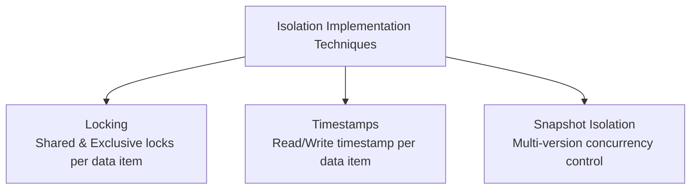

**Locking** — Lock only the data items accessed, held long enough to ensure serializability but short enough to not harm performance. **Shared locks** (for reads) and **exclusive locks** (for writes): many transactions can hold shared locks simultaneously, but an exclusive lock requires no other transaction holds any lock on the item. Combined with **two-phase locking**, this allows concurrent reading while ensuring serializability.

**Timestamps** — Each transaction gets a timestamp (typically at start). For each data item, the system keeps:
- **Read timestamp** — the largest (most recent) timestamp among transactions that read the item.
- **Write timestamp** — the timestamp of the transaction that wrote the current value.

**Snapshot Isolation** — Maintains multiple versions of a data item, letting a transaction read an old version rather than a newer uncommitted one. Reads never need to wait (unlike locking); read-only transactions cannot be aborted, only those that modify data risk aborting. Since most transactions are read-heavy, this is often a major performance improvement over locking.

### 9.8 Lock-Based Protocols

A **lock** controls concurrent access to a data item. Two modes:

| Mode | Instruction | Description |
|---|---|---|
| **Exclusive (X)** | `lock-X` | Data item can be both read and written |
| **Shared (S)** | `lock-S` | Data item can only be read |

Lock requests go to the concurrency-control manager; a transaction proceeds only after the request is granted. A transaction may be granted a lock if it's compatible with locks already held by other transactions. Any number of transactions can hold shared locks, but if any transaction holds an exclusive lock, no other transaction may hold any lock on that item. If a lock can't be granted, the requesting transaction waits until incompatible locks are released.

**Drawbacks:**
- Potential for **deadlock** exists in most locking protocols (a "necessary evil").
- **Starvation** possible if the concurrency control manager is badly designed — e.g., a transaction waiting for an X-lock while a sequence of others repeatedly get S-locks on the same item, or a transaction repeatedly rolled back due to deadlocks. Can be designed to prevent starvation.

#### The Two-Phase Locking Protocol

Ensures serializability by requiring each transaction to issue lock/unlock requests in two phases:

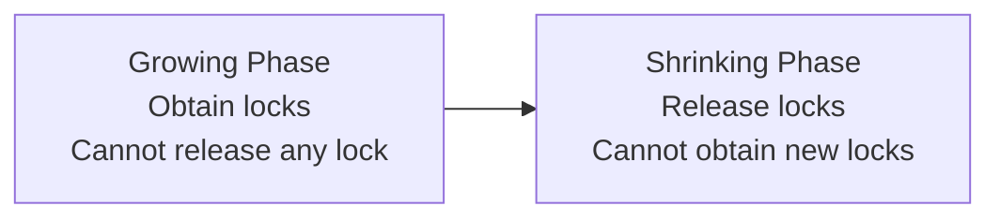

1. **Growing phase** — may obtain locks, may not release any.
2. **Shrinking phase** — may release locks, may not obtain any new locks.

A transaction starts in the growing phase, acquiring locks as needed. Once it releases a lock, it enters the shrinking phase and can't request more locks.

- Two-phase locking does **not** ensure freedom from deadlocks.
- **Cascading rollback** is still possible under 2PL — to avoid it, use **strict two-phase locking**: a transaction holds all exclusive locks until commit/abort.
- **Rigorous two-phase locking** is even stricter: **all** locks (shared and exclusive) are held until commit/abort. Here, transactions can be serialized in the order they commit.

---

## 10. Deadlock Handling

A **deadlock** occurs when two or more transactions wait indefinitely for one another to release locks. *Example:* Transaction A holds a lock on rows in Accounts and needs to update rows in Orders; Transaction B holds locks on those Orders rows but needs to update the Accounts rows held by A. Neither can proceed — activity halts forever unless the DBMS detects the deadlock and aborts one transaction.

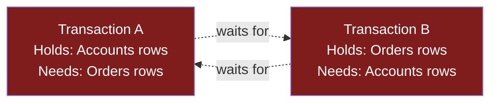

### 10.1 Deadlock Prevention

To prevent deadlocks, the DBMS aggressively inspects all operations transactions are about to execute, analyzing whether they could cause a deadlock. If so, the transaction is never allowed to execute.

Deadlock prevention schemes use **timestamp ordering** to predict deadlock situations:

#### WAIT-DIE Scheme

If Ti requests a lock held (conflicting) by Tj:

- If **TS(Ti) < TS(Tj)** (Ti is older) → Ti is allowed to **wait** until the data item is available.
- If **TS(Ti) > TS(Tj)** (Ti is younger) → **Ti dies** — restarted later with random delay but the same timestamp.

> This scheme allows the **older** transaction to wait but kills the **younger** one.

#### WOUND-WAIT Scheme

If Ti requests a lock held (conflicting) by Tj:

- If **TS(Ti) < TS(Tj)** (Ti is older) → Ti **wounds** Tj, forcing Tj to roll back and restart later with random delay but the same timestamp.
- If **TS(Ti) > TS(Tj)** (Ti is younger) → Ti is forced to **wait** until the resource is available.

> This scheme allows the **younger** transaction to wait, but when an older transaction requests an item held by a younger one, the older forces the younger to abort and release the item.

> In both schemes, the transaction that enters the system **later** is the one aborted.

### 10.2 Deadlock Detection

Deadlocks can be precisely described using a directed graph called a **wait-for graph**: `G = (V, E)`, where V is the set of transactions (vertices) and E is the set of edges. An edge `Ti → Tj` means Ti is waiting for Tj to release a data item it needs.

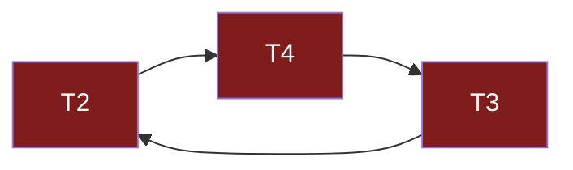
*Cycle: T2 → T4 → T3 → T2, implying T2, T3, and T4 are all deadlocked.*

When Ti requests a data item held by Tj, the edge `Ti → Tj` is inserted into the wait-for graph. It's removed only when Tj no longer holds a data item needed by Ti.

> **A deadlock exists if and only if the wait-for graph contains a cycle.** Each transaction in the cycle is deadlocked. To detect deadlocks, the system maintains the wait-for graph and periodically runs a cycle-detection algorithm.

If the graph has **no cycle**, the system is **not** in a deadlock state. Suppose T4 requests an item held by T3 — the edge `T4 → T3` is added; if this creates a cycle `T2 → T4 → T3 → T2`, then T2, T3, and T4 are all deadlocked.

### 10.3 Deadlock Recovery

Once a detection algorithm confirms a deadlock, the system must recover — most commonly by **rolling back** one or more transactions to break the deadlock. Choosing which transaction to abort is called **Victim Selection**.

We should roll back transactions that incur the **minimum cost**, using criteria such as:
- The transaction with the **fewest locks**.
- The transaction that has done the **least work**.
- The transaction that is **farthest from completion**.

#### Rollback

Once a transaction is selected for rollback, we must determine how far back to roll it:

- **Total rollback** — simplest: abort and restart the entire transaction.
- **Partial rollback** — more effective: roll back only as far as necessary to break the deadlock. Requires the system to maintain additional state information (sequence of lock requests/grants and updates). The deadlock detection mechanism decides which locks the selected transaction needs to release, and the transaction is rolled back to the point it obtained the first of these locks, undoing all subsequent actions. The recovery mechanism must support partial rollbacks, and transactions must be able to resume execution afterward.

#### Problem of Starvation

If victim selection is based primarily on cost factors, the **same transaction** may always be picked as the victim, causing **starvation**. The most common solution: include the **number of rollbacks already suffered** in the cost factor, so a transaction can only be picked a (small) finite number of times.

---

## 11. Beyond MySQL & RDBMS

### Views

A **View** assigns the result of a query to a new private table, given the name used in the VIEW query. *(Note: MySQL did not support views at the time this content was written.)*

```sql
CREATE VIEW TESTVIEW AS SELECT * FROM names;
```

### Triggers

A **trigger** is a pre-programmed notification that performs a set of actions, executed before or after an event occurs. Triggers increase efficiency and accuracy for common operations and boost productivity by reducing application development time — but carry a processing overhead cost.

### Procedures (Stored Procedures)

Like triggers, **Stored Procedures** are productivity enhancers. If an action performed via a programming interface (e.g., PERL, ASP) can instead be stored at the database level, it need only be written once and can be called by any language interacting with the database. Procedures are executed using triggers.

### Distributed Databases (DDB)

A collection of several, logically interrelated databases located at multiple locations of a computer network. A **distributed DBMS** manages such a database and makes operations transparent to the user. Examples: banks, multinational firms with multiple office locations, each working with data relevant to its own operations. DDBs have full DBMS functionality and are considered to be **one database**, not discrete files — data within them is logically interrelated.

### Object Database Management Systems (ODBMS)

Integrates database capabilities with object programming language capabilities — database objects appear as programming objects. Advantages:

1. **Efficiency** — data is used the way it's stored; less code needed since there's no intermediary like SQL/ODBC, enabling highly complex data structures directly through the programming language.
2. **Speed** — storing data natively provides a massive performance increase, as no to-and-fro translation is required.

---

## 12. A Quick Tutorial on Database Normalization (Worked Example)

Let's normalize the following table:

**Table Name: College Table**

| StudentName | CourseID1 | CourseTitle1 | CourseProfessor1 | CourseID2 | CourseTitle2 | CourseProfessor2 | StudentAdvisor | StudentID |
|---|---|---|---|---|---|---|---|---|
| Tia Carrera | CS123 | Perl Regular Expressions | Don Corleone | CS003 | Object Oriented Programming 1 | Daffy Duck | Fred Flintstone | 400 |
| John Wayne | CS456 | Socket Programming | DJ Tiesto | CS004 | Algorithms | Homer Simpson | Barney Rubble | 401 |
| Lara Croft | CS789 | OpenGL | Bill Clinton | CS001 | Data Structures | Papa Smurf | Seven of Nine | 402 |

### Step 1 — First Normal Form (1NF)

*Each column type is unique, and there are no repeating groups of data.*

Identify data that can exist as a separate table, reducing repetition and the width of the original table. We can see that Course Information repeats for every course a student takes — if a student has three courses, we'd need another set of columns. So **Student Information** and **Course Information** become two broad groups:

**Table: Student Information**
- `StudentID` (Primary Key)
- `StudentName`
- `AdvisorName`

**Table: Course Information**
- `CourseID` (Primary Key)
- `CourseTitle`
- `CourseDescription`
- `CourseProfessor`

This is a **many-to-many relationship** between Students and Courses.

> **Note:** In a many-to-many relationship, we need a **relating table** — containing information exclusively on which relationships exist between two tables. (In a one-to-many relationship, we'd instead use a foreign key.)

**Table: Students and Courses**
- `SnCStudentID`
- `SnCCourseID`

### Step 2 — Second Normal Form (2NF)

*All attributes within the entity should depend solely on the entity's unique identifier.*

`AdvisorName` under Student Information doesn't depend on `StudentID` — move it to its own table.

**Table: Student Information**
- `StudentID` (Primary Key)
- `StudentName`

**Table: Advisor Information**
- `AdvisorID`
- `AdvisorName`

**Table: Course Information**
- `CourseID` (Primary Key)
- `CourseTitle`
- `CourseDescription`
- `CourseProfessor`

**Table: Students and Courses**
- `SnCStudentID`
- `SnCCourseID`

*(Relating tables can be created as required.)*

### Step 3 — Third Normal Form (3NF)

*No column entry should be dependent on any other entry (value) other than the key for the table.* In simple terms — a table should contain information about only **one thing**.

In Course Information, `CourseProfessor` can be pulled out into its own table.

**Table: Student Information**
- `StudentID` (Primary Key)
- `StudentName`

**Table: Advisor Information**
- `AdvisorID`
- `AdvisorName`

**Table: Course Information**
- `CourseID` (Primary Key)
- `CourseTitle`
- `CourseDescription`

**Table: Professor Information**
- `ProfessorID`
- `CourseProfessor`

**Table: Students and Courses**
- `SnCStudentID`
- `SnCCourseID`

*(Relating tables can be created as required.)*

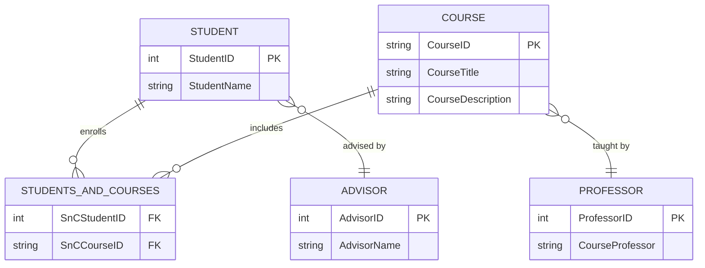

Once you've reached 3NF, the database is considered **Normalized**.

> **A Practical Exception:** Suppose we need to store a student's home address along with State and Zip Code. Would you create a separate table for every zip code, one for cities, and one for states? It's up to your judgment — often it's more practical to just use a non-normalized address table and keep everything together. Exceptions crop up often, and it's up to your better judgement when to stop strict normalization for practical purposes.

---

### 📌 Full DBMS Concept Map

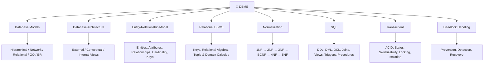
---

## Interactive Practice Quiz Deck

Test your mastery with our complete interactive multiple-choice assessment deck. Select an answer to evaluate your reasoning and reveal detailed explanatory feedback!

```quiz
[
  {
    "question": "Q1. Mechanism developed to enforce users to enter data in required format is?",
    "options": [
      "Data validation",
      "Input mask",
      "Criteria",
      "Data verification",
      "None of these"
    ],
    "correctIndex": 1,
    "explanation": "‘Input mask’"
  },
  {
    "question": "Q2. What is the size of Data & Time field type?",
    "options": [
      "1",
      "8",
      "255",
      "50",
      "None of these"
    ],
    "correctIndex": 1,
    "explanation": "‘8’"
  },
  {
    "question": "Q3. The options like Save, Open Database, Print ar e available in",
    "options": [
      "Home tab",
      "Backstage View tab",
      "None of these",
      "Database Tools tab",
      "File menu"
    ],
    "correctIndex": 4,
    "explanation": "‘File menu’"
  },
  {
    "question": "Q4. Which of the following method can be used to add more tables in a database?",
    "options": [
      "Design View",
      "Table Wizard",
      "By Entering Data",
      "All of above",
      "None of these"
    ],
    "correctIndex": 3,
    "explanation": "‘All of above’"
  },
  {
    "question": "Q5. The feature that database allows to access on ly certain records in database is?",
    "options": [
      "Forms",
      "Reports",
      "Queries",
      "Tables",
      "None of these"
    ],
    "correctIndex": 2,
    "explanation": "‘Queries’"
  },
  {
    "question": "Q6. You can find Sort & Filter group of commands in?",
    "options": [
      "Create ribbon",
      "Home ribbon",
      "Database tools ribbon",
      "Fields ribbon",
      "None of these"
    ],
    "correctIndex": 1,
    "explanation": "‘Home ribbon’"
  },
  {
    "question": "Q7. Arrange according to the size",
    "options": [
      "Record, field, byte, bit",
      "Bit, field, byte, record",
      "Field, byte, record, bit",
      "Byte, bit, record, field",
      "None of these"
    ],
    "correctIndex": 0,
    "explanation": "‘Record, field, byte, bit’"
  },
  {
    "question": "Q8. What is the maximum allowed field size for Boolean (Yes/No) fields?",
    "options": [
      "1",
      "8",
      "50",
      "255",
      "None of these"
    ],
    "correctIndex": 0,
    "explanation": "‘1’"
  },
  {
    "question": "Q9. What is relational database?",
    "options": [
      "A database structured to recognize relations between stored items of information.  It is based on the relational model of data",
      "A database that is not related to other databases",
      "A database to store human relations",
      "Both",
      "and",
      "",
      "None of these"
    ],
    "correctIndex": 4,
    "explanation": "10.  (d); ‘Text’"
  },
  {
    "question": "Q10. What is the  best data  type for a field that stores mobile numbers?",
    "options": [
      "Memo",
      "Number",
      "Date/Time",
      "Text",
      "None of these"
    ],
    "correctIndex": 0,
    "explanation": "Correct answer based on professional knowledge concepts."
  },
  {
    "question": "Q11. Which filter method lets you filter records based on criterion you specify?",
    "options": [
      "Filter by form",
      "Filter by selection",
      "Auto filter",
      "Advanced filter",
      "None of these"
    ],
    "correctIndex": 0,
    "explanation": "‘Filter by form’"
  },
  {
    "question": "Q12. Which of the following field type is  used to store photograph of employees?",
    "options": [
      "Memo",
      "None of these",
      "OLE",
      "Photo",
      "Picture"
    ],
    "correctIndex": 2,
    "explanation": "‘OLE’"
  },
  {
    "question": "Q13. Which of the following in not a function of DBA?",
    "options": [
      "Network Maintenance",
      "Routine Maintenance",
      "Schema Definition",
      "Authorization for data access",
      "None of these"
    ],
    "correctIndex": 0,
    "explanation": "‘Network Maintenance’"
  },
  {
    "question": "Q14. Which of the following is a Data Model?",
    "options": [
      "Entity-Relationship model",
      "Relational data model",
      "Object-Based data model",
      "Network model",
      "All of the above"
    ],
    "correctIndex": 4,
    "explanation": "‘All of the above’"
  },
  {
    "question": "Q15. Which of the following is not Modification of the Database?",
    "options": [
      "Deletion",
      "Insertion",
      "Sorting",
      "Updating",
      "None of these"
    ],
    "correctIndex": 2,
    "explanation": "‘Sorting’"
  },
  {
    "question": "Q16. Which of the following represents a relationship among a set of values?",
    "options": [
      "A row",
      "A table",
      "A field",
      "A column",
      "None of these"
    ],
    "correctIndex": 0,
    "explanation": "‘A row’"
  },
  {
    "question": "Q17. Column header is referring as?",
    "options": [
      "Table",
      "Relation",
      "Attributes",
      "Domain",
      "None of these"
    ],
    "correctIndex": 2,
    "explanation": "‘Attributes’"
  },
  {
    "question": "Q18. In mathematical term table is referred as?",
    "options": [
      "Relation",
      "Attribute",
      "Tuple",
      "Domain",
      "None of these"
    ],
    "correctIndex": 0,
    "explanation": "‘Relation’"
  },
  {
    "question": "Q19. Minimal Super keys are called?",
    "options": [
      "Schema keys",
      "Candidate keys",
      "Domain keys",
      "Attribute keys",
      "None of these"
    ],
    "correctIndex": 1,
    "explanation": "‘Candidate key’"
  },
  {
    "question": "Q20. The Primary key must be?",
    "options": [
      "Non Null",
      "Unique",
      "Either",
      "or",
      "",
      "Both",
      "and",
      "",
      "Null"
    ],
    "correctIndex": 5,
    "explanation": "‘Both (a) and (b)’"
  },
  {
    "question": "Q21. By Grouped Report you understand-",
    "options": [
      "Type of report generated by the Report Wizard",
      "Type of report that present records sorted in ascending or descending order as you specify",
      "Type of report that displays data grouped by fields you specified",
      "Both",
      "and",
      "",
      "None of these"
    ],
    "correctIndex": 5,
    "explanation": "22.  (b)"
  },
  {
    "question": "Q22. Which of the following is not a level of d ata abstraction?",
    "options": [
      "Physical Level",
      "Critical Level",
      "Logical Level",
      "View Level",
      "None of these"
    ],
    "correctIndex": 0,
    "explanation": "Correct answer based on professional knowledge concepts."
  },
  {
    "question": "Q23. Data Manipulation Language enables users to",
    "options": [
      "Retrieval of information stored in database",
      "Only",
      "and",
      "",
      "Insertion of new information into the database",
      "Deletion of information from the database",
      "All of the above"
    ],
    "correctIndex": 6,
    "explanation": "24.  (b)"
  },
  {
    "question": "Q24. Which of the following is not a Storage Manager Component?",
    "options": [
      "Transaction Manager",
      "Logical Manager",
      "Buffer Manager",
      "None of these",
      "File Manager"
    ],
    "correctIndex": 0,
    "explanation": "Correct answer based on professional knowledge concepts."
  },
  {
    "question": "Q25. To display  associated record from related table in datasheet view, you can?",
    "options": [
      "Double click the record",
      "Apply filter by form command",
      "Single click  on expand indicator (+) next to the record",
      "Double click on  expand indicator (+) next to the record",
      "None of these"
    ],
    "correctIndex": 2,
    "explanation": "26.  (b)"
  },
  {
    "question": "Q26. A Relation is a",
    "options": [
      "Subset of a Cartesian product of a list of attributes",
      "Subset of a Cartesian product of a list of domains",
      "Subset of a Cartesian product of a list of tuple",
      "Subset of a Cartesian product of a list of relations",
      "None of these"
    ],
    "correctIndex": 0,
    "explanation": "Correct answer based on professional knowledge concepts."
  },
  {
    "question": "Q27. Who proposed the relational model?",
    "options": [
      "Bill Gates",
      "E.F. Codd",
      "Herman Hollerith",
      "Charles Babbage",
      "None of these"
    ],
    "correctIndex": 1,
    "explanation": "28.  (a)"
  },
  {
    "question": "Q28. In an Entity -Relationship Diagram “Ellipses” represents",
    "options": [
      "Attributes",
      "Weak entity set",
      "Relationship sets",
      "Multi-valued attributes",
      "None of these"
    ],
    "correctIndex": 0,
    "explanation": "Correct answer based on professional knowledge concepts."
  },
  {
    "question": "Q29. What type of relationship exists between a Teacher table and Class table?",
    "options": [
      "One to many",
      "Many to many",
      "One to one",
      "Two to two",
      "None of these"
    ],
    "correctIndex": 1,
    "explanation": "30.  (a)"
  },
  {
    "question": "Q30. Data Manipulation Language (DML) is not to",
    "options": [
      "Create information table in the Database",
      "Insertion of new information into the Database",
      "Deletion of information in the Database",
      "Modification of information in the Database",
      "None of these"
    ],
    "correctIndex": 0,
    "explanation": "Correct answer based on professional knowledge concepts."
  },
  {
    "question": "Q31. Which of the following in true regarding Referential Integrity?",
    "options": [
      "Every primary -key value must match a primary-key value in an associated table",
      "Every primary -key value must match a foreign-key value in an associated table",
      "Every foreign -key value must match a primary-key value in an associated table",
      "Every foreign -key value must match a foreign-key value in an associated table",
      "None of these"
    ],
    "correctIndex": 2,
    "explanation": "32.  (c)"
  },
  {
    "question": "Q32. Group names in ribbon can be helpful to",
    "options": [
      "Group the commands so that when you move one, you can move all of them together",
      "Give a name for buttons on ribbon",
      "Find the required option by inspecting through them",
      "All of above",
      "None of these"
    ],
    "correctIndex": 0,
    "explanation": "Correct answer based on professional knowledge concepts."
  },
  {
    "question": "Q33. Which of the following is an unary operation?",
    "options": [
      "Selection operation",
      "Generalized selection",
      "Primitive operation",
      "Projection operation",
      "None of these"
    ],
    "correctIndex": 1,
    "explanation": "34.  (d)"
  },
  {
    "question": "Q34. Which of the following NF is based on Multi Valued Dependency?",
    "options": [
      "First",
      "Second",
      "Third",
      "Fourth",
      "None of these"
    ],
    "correctIndex": 0,
    "explanation": "Correct answer based on professional knowledge concepts."
  },
  {
    "question": "Q35. Which of the following in not Outer join?",
    "options": [
      "Left outer join",
      "Right outer join",
      "Full outer join",
      "All of the above",
      "None of these"
    ],
    "correctIndex": 3,
    "explanation": "36.  (b)"
  },
  {
    "question": "Q36. A relation that has no partial dependencies is in which normal form?",
    "options": [
      "First",
      "Second",
      "Third",
      "BCNF",
      "None of these"
    ],
    "correctIndex": 0,
    "explanation": "Correct answer based on professional knowledge concepts."
  },
  {
    "question": "Q37. A transaction completes its execution is said to be",
    "options": [
      "Saved",
      "Loaded",
      "Rolled",
      "Committed",
      "None of these"
    ],
    "correctIndex": 3,
    "explanation": "38.  (b)"
  },
  {
    "question": "Q38. An entity type whose existence depends on another entity type is called a _____ entity.",
    "options": [
      "Strong",
      "Weak",
      "Codependent",
      "Variant",
      "Independent."
    ],
    "correctIndex": 0,
    "explanation": "Correct answer based on professional knowledge concepts."
  },
  {
    "question": "Q39. The advantage of computerized database over manual database is?",
    "options": [
      "We can get the information quickly",
      "We can put in information quick",
      "Solve the repeated information and consistency problem",
      "All of above",
      "None of these"
    ],
    "correctIndex": 3,
    "explanation": "40.  (a)"
  },
  {
    "question": "Q40. The property of tr ansaction which ensures that either all operations of the transaction are reflected properly in the database or none, is called",
    "options": [
      "Atomicity",
      "Durability",
      "Isolation",
      "Consistency",
      "Deadlock."
    ],
    "correctIndex": 0,
    "explanation": "Correct answer based on professional knowledge concepts."
  },
  {
    "question": "Q41. In a super type /subtype hierarchy, each subtyp e has?",
    "options": [
      "Only one super type",
      "Many super types",
      "At most two super types",
      "At least one subtype",
      "Not at all."
    ],
    "correctIndex": 0,
    "explanation": "Reason: In a super type/sub -type hierarchy, each sub-type has only one super type"
  },
  {
    "question": "Q42. A property or characteristic of an entity type that is of interest to the organization is called an",
    "options": [
      "Attribute",
      "Coexisting entity",
      "Relationship",
      "Cross-function",
      "Weak entity."
    ],
    "correctIndex": 0,
    "explanation": "Reason: A property or c haracteristic of an entity type that is of interest to the organization is called attribute"
  },
  {
    "question": "Q43. In the context of a database table, the statement “A determines B” indicates that",
    "options": [
      "Knowing the value of attribute A you cannot look up the value of attribute B",
      "You do not need to know the value of attribute A in order to look up the value of attribute B",
      "Knowing the value of attribute B you can look up the value of attribute A",
      "Knowing the value of attribute A you can look up the value of attribute B",
      "None of the above."
    ],
    "correctIndex": 3,
    "explanation": "Reason: Knowing the value of attribute A you can look up the value of attribute B."
  },
  {
    "question": "Q44. A method that speeds query processing by running a query at the same time against several partitions of a table using multi processors is called",
    "options": [
      "Multiple partition query",
      "Perpendicular query processing",
      "Parallel query processing",
      "Query optimization",
      "Query Execution."
    ],
    "correctIndex": 2,
    "explanation": "Reason: A method that speeds query processing by running a qu ery at the same time against several partitions of a table using multi processors is called parallel query processing."
  },
  {
    "question": "Q45. A database management software (DBMS) includes",
    "options": [
      "Automated tools (CASE) used to design databases and application programs",
      "A software application that is used to define, create, maintain and provide controll ed access to user databases",
      "Application programs that are not used to provide information to users",
      "Database that contains only occurrences of logically organised data or information",
      "Repository of meta data, which is a central storehouse for all data definitions, data relationships, screen and report formats and other system components."
    ],
    "correctIndex": 1,
    "explanation": "Reason: A software application that is used t o define, create, maintain and provide controlled access to user databases."
  },
  {
    "question": "Q46. Which of the following statements concerning the primary key is true?",
    "options": [
      "All primary key entries are unique",
      "The primary key may be null",
      "The primary key is not required for all tables",
      "The primary key data does not have to be unique",
      "None of these"
    ],
    "correctIndex": 0,
    "explanation": "47.  (b); Reason: Dense Index record appears for every search key valued in the file."
  },
  {
    "question": "Q47. An index record appears for every search key value in the file is",
    "options": [
      "Secondary index",
      "Dense index",
      "Sparse index",
      "Multi level index",
      "B+ tree."
    ],
    "correctIndex": 0,
    "explanation": "Correct answer based on professional knowledge concepts."
  },
  {
    "question": "Q48. What does the following SQL statement do? Select * From Customer Where Cust_Type = “Best”;",
    "options": [
      "Selects all the fields from the Customer table for each row with a customer labeled “best”",
      "Selects the “*” field from the Custo mer table for each row with a customer labeled “best”",
      "Selects fields with a “*” in them from the Customer table",
      "Selects all the fields from the Customer table for each row with a customer labeled “*”",
      "Counts all records and displays the value."
    ],
    "correctIndex": 0,
    "explanation": "49.  (c); Reason : If k is a foreign key in a relation R1, then K is a key for some other relation."
  },
  {
    "question": "Q49. If K is a foreign key in a relation R1, then",
    "options": [
      "Every tuple of R1 has a distinct value for K",
      "K cannot have a null value for tuples in R1",
      "K is a key for some other relation",
      "K is a Primary key for R1",
      "K is a Composite key for R1."
    ],
    "correctIndex": 0,
    "explanation": "Correct answer based on professional knowledge concepts."
  },
  {
    "question": "Q50. Select the correct statement from the following on proper naming of schema constructs:",
    "options": [
      "Entity type name applies to all the entities belonging to that entity type and therefore a plural name is selected for entity type",
      "In the narrative descrip tion of the database requirements, verbs tend to indicate the names of relationship types",
      "The nouns arising from a database requirement description can be considered as names of attributes",
      "Additional n ouns which are appearing in the narrative des cription of the database requirements represent the weak entity type names",
      "Adjectives written in the database requirement description help to identify the partial relationships among entities."
    ],
    "correctIndex": 1,
    "explanation": "Reason: In the narrative description of the database requirements, verbs tend to indicate the names of relationship types."
  },
  {
    "question": "Q51. Embedded SQL means",
    "options": [
      "Using the EMBED key word in a SQL statement",
      "Writing a SQL statement to retrieve data from more than one relation",
      "Writing SQL statements within codes written in a general programming language",
      "Specifying a condition and action to  be taken in case the given condition is satisfied in a trigger",
      "Using SQL language constructs like revoke and grant respectively for revoking and granting privileges to users."
    ],
    "correctIndex": 2,
    "explanation": "Embedded SQL refers to writing SQL statements within codes written in a general program ming language."
  },
  {
    "question": "Q52. State the unit of storage that can store one or more records in a hash file organization",
    "options": [
      "Buckets",
      "Disk pages",
      "Blocks",
      "Nodes",
      "Baskets."
    ],
    "correctIndex": 0,
    "explanation": "Buckets are used to store one or more records in a hash file organization."
  },
  {
    "question": "Q53. Which of the following questions is answered by the SQL statement? Select Count (Product_Description) from Product_T;",
    "options": [
      "How many products are in the Product Table?",
      "How many different product descriptions are in the Product Table?",
      "How many characters are in the field name “Product_Description”?",
      "How many different columns named “Product Description” is there in table Product_T?",
      "How many total records in a table?"
    ],
    "correctIndex": 1,
    "explanation": "Reason: How many different product descriptions are in the Product Table?"
  },
  {
    "question": "Q54. Consider the following table obtained using Student and Instructor relations. Fname:    Lname: Ajith      Gamage Sujith     Hewage Kasun     Peiris Which relational algebra operation could have been applied on the pair of relations St udent and Instructor to obtain the above data?",
    "options": [
      "Student n Instructor",
      "Instructor ÷ Student",
      "Student – Instructor",
      "Student ? Instructor",
      "Instructor – Student."
    ],
    "correctIndex": 4,
    "explanation": "Instructor – Student is the relational algebra operation that could be applied on the pair of relations Student and Instructor to obtain the abo ve data."
  },
  {
    "question": "Q55. Which of the following type of index is automatically created when we do not specify?",
    "options": [
      "Bitmap",
      "Balanced Tree Index",
      "Binary Tree Index",
      "Hashed",
      "Sparse Index."
    ],
    "correctIndex": 1,
    "explanation": "Balanced Tree Index is automatically created when we do not specify."
  },
  {
    "question": "Q56. Which of the following is a procedure for acquiring the necessary locks for a transaction where all necessary locks are acquired before any are released?",
    "options": [
      "Record controller",
      "Exclusive lock",
      "Authorization rule",
      "Two phase lock",
      "Three Phase lock."
    ],
    "correctIndex": 3,
    "explanation": "Two-phase lock is a procedure for acquiring the necessary locks for a transaction where all necessary locks are acquired before any are released"
  },
  {
    "question": "Q57. In the relational modes, cardinality is termed as",
    "options": [
      "Number of tuples",
      "Number of attributes",
      "Number of tables",
      "Number of constraints",
      "None of these"
    ],
    "correctIndex": 0,
    "explanation": "58.  (e); Recovery is the one that normally is performed by DBMS, without the interference of the DBA"
  },
  {
    "question": "Q58. Out of the following activities, wh ich is the one that normally performed by DBMS, without the interference of the DBA?",
    "options": [
      "Integrity",
      "Retention",
      "Security",
      "Granting the Privileges",
      "Recovery."
    ],
    "correctIndex": 0,
    "explanation": "Correct answer based on professional knowledge concepts."
  },
  {
    "question": "Q59. Which of th e following Relational Algebra operations require that both tables (or virtual tables) involved have the exact same attributes/data types?",
    "options": [
      "Join, Projection, Restriction",
      "Multiplication and Division",
      "Union, Intersection, Minus",
      "Minus, Multiplication, Intersection",
      "Projection, Selection, Rename."
    ],
    "correctIndex": 2,
    "explanation": "n relational algebra Union, Intersection, Minus operations require that both tables (or virtual tables) involved have the exact same attributes/data types."
  },
  {
    "question": "Q60. Which of t he following is a component of the relational data model included to specify business rules to maintain the integrity of data when they are manipulated?",
    "options": [
      "Business rule constraint",
      "Data integrity",
      "Business integrity",
      "Data structure",
      "Entity Integrity."
    ],
    "correctIndex": 1,
    "explanation": "Data integrity is a component of the relational data model included to specify business rules to maintain the integrity of data when they are manipulated"
  }
]
```

---

