# 📘 Data Warehousing & Data Mining

---

## 1. Data Warehousing

### 1.1 Introduction

**Data warehousing** is combining data from multiple sources into one comprehensive and easily manipulated database. The primary aim of data warehousing is to provide businesses with analytic results from **data mining, OLAP, scorecarding, and reporting**.

> **Definition:** A **data warehouse** is a **subject-oriented, integrated, time-variant, and non-volatile** collection of data in support of management's decision-making process.

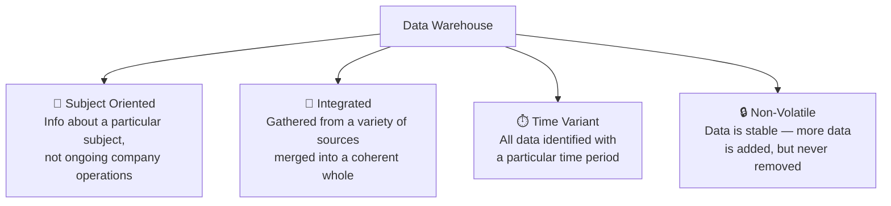

| Property | Description |
|---|---|
| **Subject Oriented** | Data that gives information about a particular subject instead of about a company's ongoing operations |
| **Integrated** | Data gathered into the data warehouse from a variety of sources and merged into a coherent whole |
| **Time Variant** | All data in the data warehouse is identified with a particular time period |
| **Non-Volatile** | Data is stable in a data warehouse — more data is added, but data is never removed |

### 1.2 Benefits of Data Warehousing

- ⚡ Enhance Business Intelligence
- 🚀 Increased Query and System Performance
- 🌐 Business Intelligence from Multiple Sources
- ⏰ Timely Access to Data
- ✅ Enhanced Data Quality and Consistency
- 📜 Historical Intelligence
- 💰 High Return on Investment

### 1.3 Operational vs Informational Data

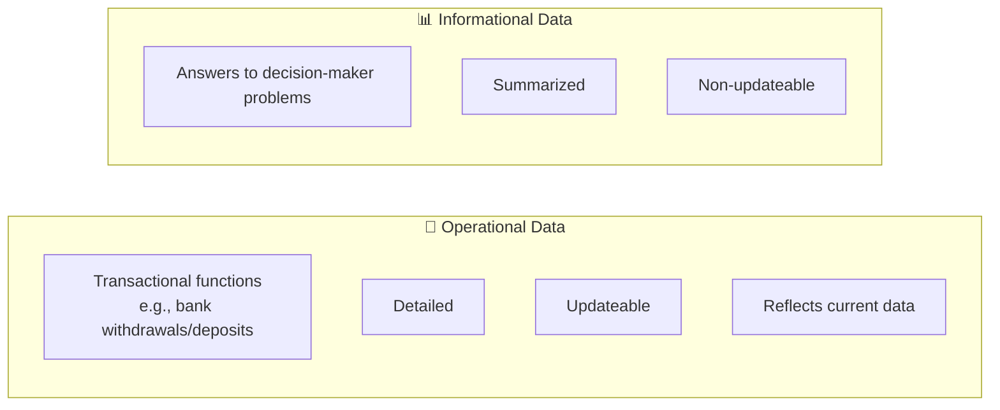

| Operational Data | Informational Data |
|---|---|
| Focuses on transactional functions such as bank card withdrawals and deposits | Focuses on providing answers to problems posed by decision makers |
| Detailed | Summarized |
| Updateable | Non-updateable |
| Reflects current data | — |

### 1.4 Important Terminology

| Term | Description |
|---|---|
| **Enterprise Data Warehouse** | Collects all information about subjects (customers, products, sale assets, personnel) that span the entire organization |
| **Data Mart** | Departmental subsets that focus on selected subjects — a segment of a data warehouse providing data for reporting/analysis on a section, unit, department, or operation (e.g., sales, payroll, production). Sometimes complete individual data warehouses, usually smaller than the corporate data warehouse |
| **Decision Support System (DSS)** | Information technology that helps the knowledge worker (executive, manager, analyst) make faster and better decisions |
| **Drill-down** | Traversing summarization levels from highly summarized data to the underlying current or old detail |
| **Meta Data** | Data about data — containing the location and description of warehouse system components: names, definitions, structure, etc. |

### 1.5 Data Warehouse Architecture

Data warehouse architecture is based on a **relational database management system (RDBMS) server** that functions as the central repository for informational data. Operational data and processing are **completely separate** from data warehouse processing.

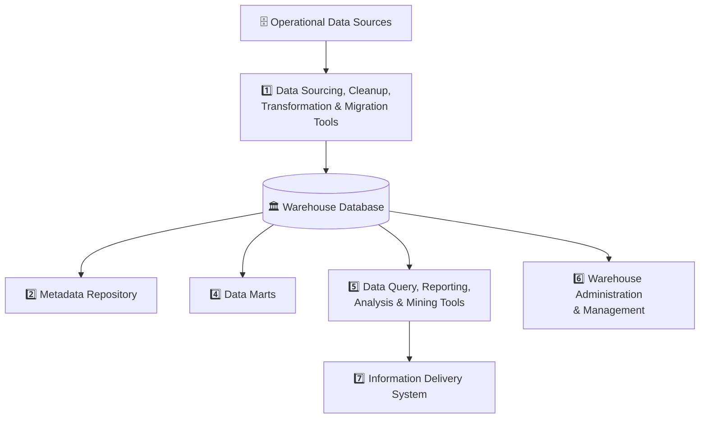

**Components of Data Warehouse Architecture:**

1. Data sourcing, cleanup, transformation, and migration tools
2. Metadata repository
3. Warehouse database technology
4. Data marts
5. Data query, reporting, analysis, and mining tools
6. Data warehouse administration and management
7. Information delivery system

#### 📌 Note on Operational Data Store (ODS)

**Operational Data Store (ODS)** is an architecture concept to support day-to-day operational decision support, containing current value data propagated from operational applications.

| ODS shares with Data Warehouse | ODS differs from Data Warehouse |
|---|---|
| Subject-oriented, similar to a classic data warehouse | **Volatile**, while a data warehouse is non-volatile |
| Integrated, in the same sense as a data warehouse | Contains **very current data only**, while a data warehouse contains both current and historical data |
| — | Contains **detailed data only** (no precalculated summaries/aggregates), unlike a typical data warehouse |

### 1.6 Data Warehouse Design Approaches

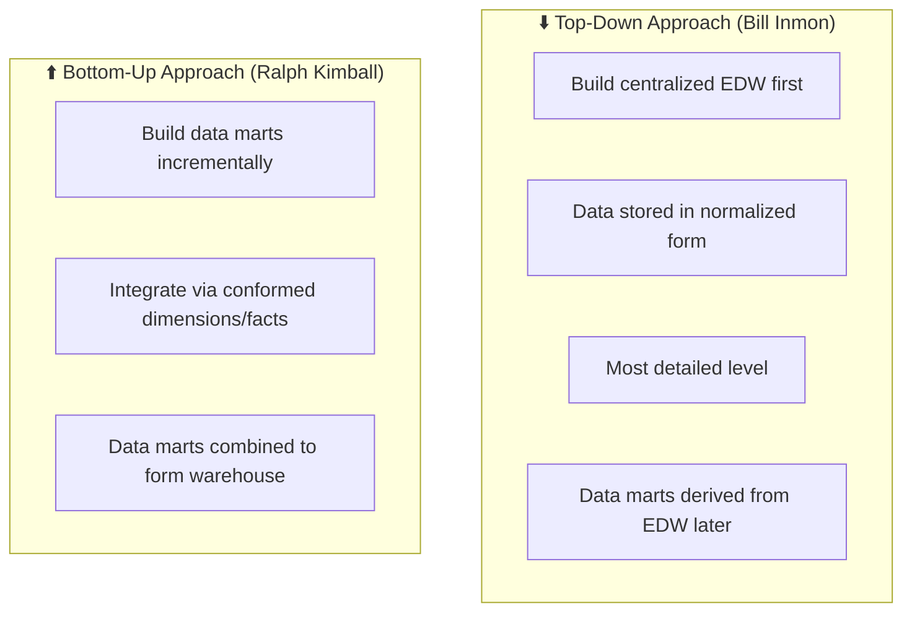

| Approach | Description |
|---|---|
| **Top-Down Approach** *(Bill Inmon)* | Build a centralized repository to house corporate-wide business data — the **Enterprise Data Warehouse (EDW)**. Data is stored in **normalized form** to avoid redundancy, maintaining one version of truth. Stored at the **most detailed level** to leverage flexibility for use by multiple departments and to cater to future requirements |
| **Bottom-Up Approach** *(Ralph Kimball)* | An incremental approach — build data marts separately at different points in time as specific subject-area requirements become clear. Data marts are integrated/combined using **conformed dimensions** and **conformed facts** to form the data warehouse. No need to wait for full requirements before starting |

**Conformed Dimension** — has consistent dimension keys, consistent attribute names, and consistent values across separate data marts; means the exact same thing when joined with every fact table.

**Conformed Fact** — has the same definition of measures, the same dimensions joined to it, and the same granularity across data marts.

> The bottom-up approach helps incrementally build the warehouse by developing and integrating data marts as requirements become clear — without waiting to know the overall warehouse requirements upfront.

### 1.7 Meta Data

**Meta data** is data about data — used for maintaining, managing, and using the data warehouse. Classified into **two types**:

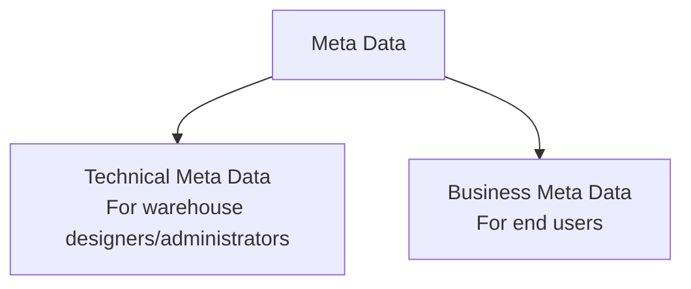

#### Technical Meta Data

Contains information about data warehouse data, used by warehouse designers/administrators for development and management tasks. Includes:

- Info about data stores — transformation descriptions (mapping methods from operational DB to warehouse DB)
- Warehouse object and data structure definitions for target data
- The rules used to perform cleanup and data enhancement
- Data mapping operations
- Access authorization, backup history, archive history, info delivery history, data acquisition history, data access, etc.

#### Business Meta Data

Contains info that gives users insight into what's stored in the data warehouse. Includes:

- Subject areas and info object types, including queries, reports, images, video, audio clips, etc.
- Internet home pages — info related to the info delivery system
- Data warehouse operational info such as ownerships, audit trails, etc.

> Meta data helps users understand content and find data. It is stored in a separate data store known as the **informational directory** or **metadata repository**, which helps integrate, maintain, and view the contents of the data warehouse.

**Metadata Repository** — a database of data about data (metadata). Its purpose is to provide a consistent and reliable means of access to data. It may be stored in a physical location or may be a virtual database, drawing metadata from separate sources.

### 1.8 Access Tools in Data Warehouse

Their purpose is to provide info to business users for decision making. **Five categories:**

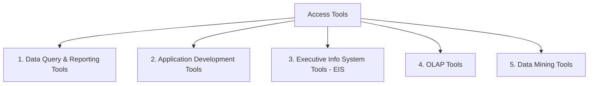

| # | Tool | Description |
|---|---|---|
| 1 | **Data Query and Reporting Tools** | Used to generate queries and reports |
| 2 | **Application Development Tools** | Used to generate SQL queries via a Meta layer between users and databases, offering point-and-click SQL statement creation |
| 3 | **Executive Info System Tools (EIS)** | A management information system emphasizing graphical display and easy-to-use, appealing interfaces — designed to support senior executives' information and decision-making needs |
| 4 | **OLAP Tools** | Based on multidimensional database concepts; allow sophisticated analysis via elaborate, multidimensional, complex views. Applications: product performance/profitability, sales/marketing campaign effectiveness, sales forecasting, capacity planning. Assumes data is organized in a multidimensional model, supported by a special multidimensional database or a relational database enabling multidimensional properties |
| 5 | **Data Mining Tools** | Used to discover knowledge from data warehouse data; also usable for data visualization and data correction |

### 1.9 Data Marts

A **Data Mart** is a subset of a data warehouse that supports the requirements of a particular department or business function.

> The key characteristic differentiating data marts from data warehouses: a data mart focuses **only** on the requirements of users associated with **one department or business function**.

### 1.10 OLAP (Online Analytical Processing)

**OLAP** is an approach to answering multidimensional analytical queries — part of the broader category of business intelligence, which also encompasses relational databases, report writing, and data mining. OLAP tools enable users to analyze multidimensional data interactively from multiple perspectives.

> OLAP databases are **highly de-normalized**, which makes files redundant and helps improve analytic performance. Processing speed can be slow — taking up to many hours depending on the data involved.

**Types of OLAP:**

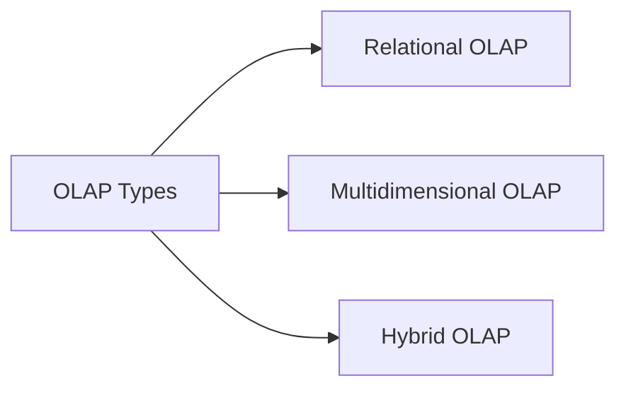

- Relational OLAP (ROLAP)
- Multidimensional OLAP (MOLAP)
- Hybrid OLAP (HOLAP)

### 1.11 OLTP (Online Transaction Processing)

**OLTP** is a class of systems that facilitate and manage transaction-oriented applications, typically for data entry and retrieval transaction processing. It manages current data and stores all given data — characterized by a **large number of short online transactions** with **quick real-time response**.

> The main purpose of an OLTP system is to control or run the fundamental business tasks.

### 1.12 OLAP vs OLTP

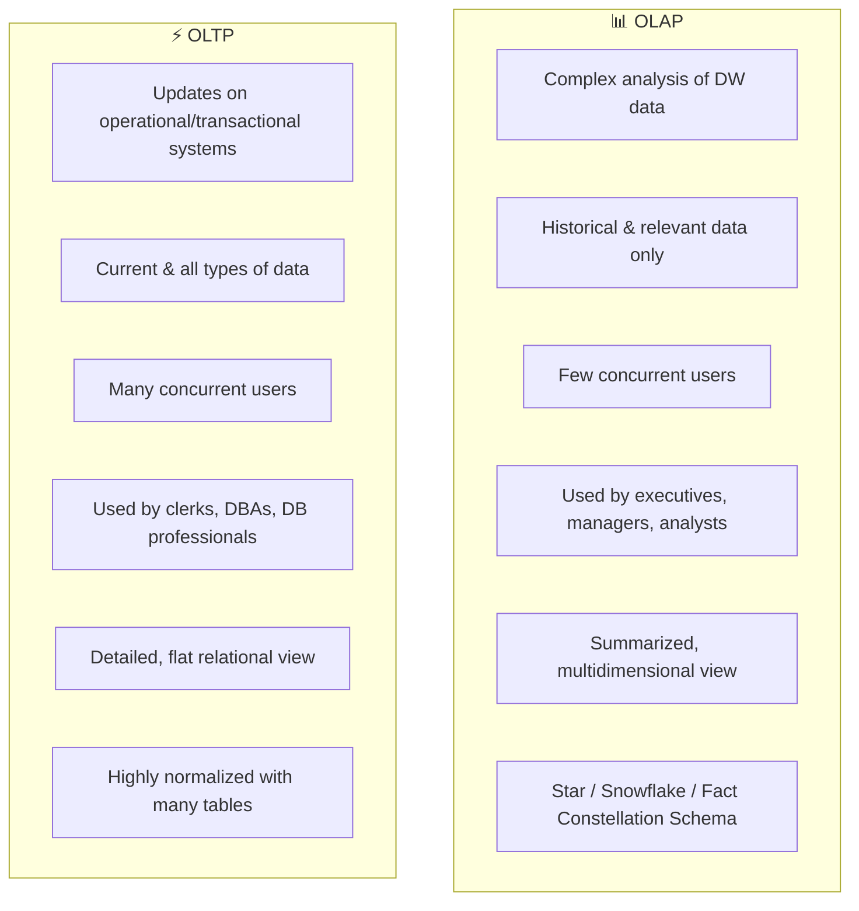

| OLAP | OLTP |
|---|---|
| Used to perform complex analysis of the data in a data warehouse | Used to perform updates on operational or transactional systems (e.g., Point of Sale system) |
| Holds historical and only relevant data | Holds current and all types of data |
| Has few concurrent users | Has many concurrent users |
| Used by knowledge workers such as executives, managers, and analysts | Used by clerks, DBAs, or database professionals |
| Provides summarized and multidimensional view of data | Provides detailed and flat relational view of data |
| Based on Star Schema, Snowflake Schema, and Fact Constellation Schema | Highly normalized with many tables |

---

## 2. Data Mining

**Data mining** is a process of extracting previously unknown, valid, and actionable information from a large set of data, then using that information to make crucial business decisions.

> Data mining is concerned with the analysis of data and the use of software techniques for finding **hidden and unexpected patterns and relationships** in sets of data. The focus of data mining is to find information that is hidden and unexpected.

### 2.1 Data Mining Techniques

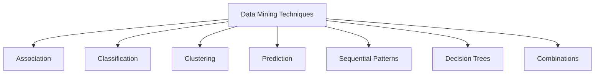

- Association
- Classification
- Clustering
- Prediction
- Sequential Patterns
- Decision Trees
- Combinations

### 2.2 Data Mining Applications

Various fields use data mining technologies because of fast access to data and valuable information from vast amounts of data. Data mining technologies have been applied successfully in many areas:

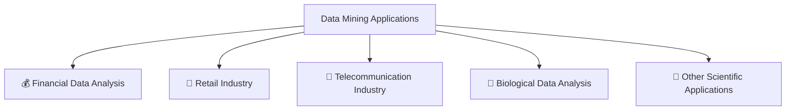

#### 💰 Financial Data Analysis

The financial data in banking and financial industries is generally reliable and of high quality, facilitating systematic data analysis and data mining. Typical cases:

- Design and construction of data warehouses for multidimensional data analysis and data mining
- Loan payment prediction and customer credit policy analysis
- Classification and clustering of customers for targeted marketing
- Detection of money laundering and other financial crimes

#### 🛒 Retail Industry

Data Mining has great application in the retail industry because it collects large amounts of data on sales, customer purchasing history, goods transportation, consumption, and services. The quantity of data collected continues to expand rapidly due to increasing ease, availability, and popularity of the web.

> Data Mining in Retail Industry helps identify customer buying patterns and trends — leading to improved quality of customer service, and better customer retention and satisfaction.

#### 📡 Telecommunication Industry

Today the telecommunication industry is one of the most emerging industries, providing various services such as fax, pager, cellular phone, Internet messenger, images, email, web data transmission, etc. Due to the development of new computer and communication technologies, the industry is rapidly expanding.

> Data Mining in Telecommunication industry helps identify telecommunication patterns, catch fraudulent activities, make better use of resources, and improve quality of service.

#### 🧬 Biological Data Analysis

Nowadays there is vast growth in the field of biology such as genomics, proteomics, functional genomics, and biomedical research. Biological data mining is a very important part of **Bioinformatics**. Aspects in which data mining contributes to biological data analysis:

- Semantic integration of heterogeneous, distributed genomic and proteomic databases
- Alignment, indexing, similarity search, and comparative analysis of multiple nucleotide sequences
- Discovery of structural patterns and analysis of genetic networks and protein pathways

#### 🔭 Other Scientific Applications

The applications discussed above tend to handle relatively small and homogeneous data sets for which statistical techniques are appropriate. Huge amounts of data have been collected from scientific domains such as **geosciences, astronomy**, etc. Large amounts of data sets are being generated because of fast numerical simulations in fields such as climate and ecosystem modeling, chemical engineering, fluid dynamics, etc.

### 2.3 Difference Between Data Warehousing and Data Mining

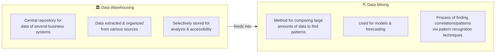

| Data Mining | Data Warehousing |
|---|---|
| A method for comparing large amounts of data for the purpose of finding patterns | The central repository for the data of several business systems in an enterprise |
| Normally used for models and forecasting | Data from various sources is extracted and organized selectively for analysis and accessibility |
| The process of finding correlations/patterns by sifting through large data repositories using pattern recognition techniques | Serves as the foundational data source that mining techniques are applied to |

---

### 📌 Full Concept Map: Data Warehousing & Data Mining

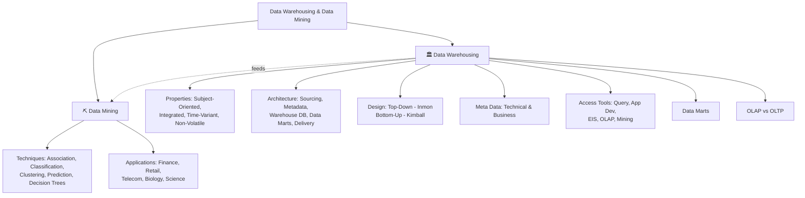


---

## Interactive Practice Quiz Deck

Test your mastery with our complete interactive multiple-choice assessment deck. Select an answer to evaluate your reasoning and reveal detailed explanatory feedback!

```quiz
[
  {
    "question": "Q1. The data is stored, retrieved and updated in……..?",
    "options": [
      "OLAP",
      "OLTP",
      "SMTP",
      "FTP",
      "None of these"
    ],
    "correctIndex": 1,
    "explanation": "OLTP"
  },
  {
    "question": "Q2. …………………… is a good alternative to the star schema.",
    "options": [
      "Star schema",
      "Snowflake schema",
      "Fact constellation",
      "Star-snowflake schema",
      "None of these"
    ],
    "correctIndex": 2,
    "explanation": "Fact constellation"
  },
  {
    "question": "Q3. ……. is an essential process where intelligent methods are applied to extract data patterns.",
    "options": [
      "Data warehousing",
      "Data mining",
      "Text mining",
      "Data selection",
      "None of these"
    ],
    "correctIndex": 1,
    "explanation": "Data mining"
  },
  {
    "question": "Q4. Strategic value of data mining is ………………….?",
    "options": [
      "cost-sensitive",
      "work-sensitive",
      "time-sensitive",
      "technical-sensitive",
      "None of these"
    ],
    "correctIndex": 2,
    "explanation": "time-sensitive"
  },
  {
    "question": "Q5. The type of relationship in star schema is ………?",
    "options": [
      "many to many",
      "one to one",
      "one to many",
      "many to one",
      "None of these"
    ],
    "correctIndex": 2,
    "explanation": "one to many"
  },
  {
    "question": "Q6. The ……………… allows the selection of the relevant information necessary for the data warehouse.",
    "options": [
      "top-down view",
      "data warehouse view",
      "data source view",
      "business query view",
      "None of these"
    ],
    "correctIndex": 0,
    "explanation": "top-down view"
  },
  {
    "question": "Q7. Which of the following is not a component of a data warehouse?",
    "options": [
      "Meta data",
      "Current detail data",
      "Lightly summarized data",
      "Component Key",
      "None of these"
    ],
    "correctIndex": 3,
    "explanation": "Component Key"
  },
  {
    "question": "Q8. Which of the following is not an ETL tool?",
    "options": [
      "Informatica",
      "Oracle warehouse builder",
      "Datastage",
      "Visual studio",
      "DT/studio."
    ],
    "correctIndex": 3,
    "explanation": "Visual Studio is not an ETL tool."
  },
  {
    "question": "Q9. Which of the following is/are the Data mining tasks?",
    "options": [
      "Regression",
      "Classification",
      "Clustering",
      "Inference of associative rules",
      "All",
      ",",
      ",",
      ", and",
      "above."
    ],
    "correctIndex": 4,
    "explanation": "Regression, Classification and Clustering are the data mining tasks."
  },
  {
    "question": "Q10. Which of the  following is not a kind of data warehouse application?",
    "options": [
      "Information processing",
      "Analytical processing",
      "Data mining",
      "Transaction processing",
      "None of these"
    ],
    "correctIndex": 3,
    "explanation": "Transaction processing"
  },
  {
    "question": "Q11. The output of KDD is ………….?",
    "options": [
      "Data",
      "Information",
      "Query",
      "Useful information",
      "None of these"
    ],
    "correctIndex": 3,
    "explanation": "Useful information"
  },
  {
    "question": "Q12. The full form of OLAP is?",
    "options": [
      "Online Analytical Processing",
      "Online Advanced Processing",
      "Online Advanced Preparation",
      "Online Analytical Performance",
      "None of these"
    ],
    "correctIndex": 0,
    "explanation": "Online Analytical Processing"
  },
  {
    "question": "Q13. ……….. is a summarization of the general characteristics or features of a target class of data.",
    "options": [
      "Data Characterization",
      "Data Classification",
      "Data discrimination",
      "Data selection",
      "None of these"
    ],
    "correctIndex": 0,
    "explanation": "Data Characterization"
  },
  {
    "question": "Q14. Which of the following should not be considered for each dimension attribute?",
    "options": [
      "Attribute name",
      "Rapid changing dimension policy",
      "Attribute definition",
      "Sample data",
      "Cardinality."
    ],
    "correctIndex": 1,
    "explanation": "Rapid changing dimension policy should not be considered for each dimension attribute."
  },
  {
    "question": "Q15. The full form of KDD is ………………",
    "options": [
      "Knowledge Database",
      "Knowledge Discovery Database",
      "Knowledge Data House",
      "Knowledge Data Definition",
      "None of these"
    ],
    "correctIndex": 1,
    "explanation": "Knowledge Discovery Database"
  },
  {
    "question": "Q16. Which of the following is not a data mining functionality?",
    "options": [
      "Characterization and Discrimination",
      "Classification and regression",
      "Selection and interpretation",
      "Clustering and Analysis",
      "None of these"
    ],
    "correctIndex": 2,
    "explanation": "Selection and interpretation"
  },
  {
    "question": "Q17. ……….. is the process of finding a model that describes and distinguishes data classes or concepts.",
    "options": [
      "Data Characterization",
      "Data Classification",
      "Data discrimination",
      "Data selection",
      "None of these"
    ],
    "correctIndex": 1,
    "explanation": "Data Classification"
  },
  {
    "question": "Q18. The process of removing the deficiencies and loopholes in the data is called as?",
    "options": [
      "Aggregation of data",
      "Extracting of data",
      "Cleaning up of data.",
      "Loading of data",
      "Compression of data."
    ],
    "correctIndex": 2,
    "explanation": "The process of removing the deficiencies and loopholes in the data is called as cleaning up of data."
  },
  {
    "question": "Q19. Concept description is the basic form of the?",
    "options": [
      "Predictive data mining",
      "Descriptive data mining",
      "Data warehouse",
      "Relational data base",
      "Proactive data mining."
    ],
    "correctIndex": 1,
    "explanation": "Concept description is the basic form of the descriptive data mining."
  },
  {
    "question": "Q20. An OLAP tool provides for",
    "options": [
      "Only transaction control",
      "Only Roll-up and drill-down",
      "Slicing and dicing",
      "Only Rotation",
      "Setting up only relations."
    ],
    "correctIndex": 2,
    "explanation": "21.  (b); Online Analytical Processing (OLAP) manages both current and historic transactions."
  },
  {
    "question": "Q21. Which one manages both current and historic transactions?",
    "options": [
      "OLTP",
      "OLAP",
      "Spread sheet",
      "XML",
      "All",
      ",",
      ",",
      "and",
      "above."
    ],
    "correctIndex": 5,
    "explanation": "Correct answer based on professional knowledge concepts."
  },
  {
    "question": "Q22. Which of the following is the collection of data objects that are similar to one another within the same group?",
    "options": [
      "Partitioning",
      "Grid",
      "Cluster",
      "Table",
      "Data source."
    ],
    "correctIndex": 2,
    "explanation": "Cluster is the collection of data objects that are similar to one another within the same group."
  },
  {
    "question": "Q23. Which of the following employees data mining techniques to analyze the intent of a user query, provided additional generalized  or associ ated information relevant to the query?",
    "options": [
      "Iceberg query method",
      "Data analyzer",
      "Intelligent query answering",
      "DBA",
      "Query parser."
    ],
    "correctIndex": 2,
    "explanation": "Intelligent Query Answering  employee’s data mining techniques to analyze the intent of a user query provided additio nal generalized or associated information relevant to the query."
  },
  {
    "question": "Q24. Which of the following process includes data cleaning, data integration, data selection, data transformation, data mining, pattern evolution and knowledge presentation?",
    "options": [
      "KDD process",
      "ETL process",
      "KTL process",
      "MDX process",
      "None of the above."
    ],
    "correctIndex": 0,
    "explanation": "KDD Process includes data cleaning, data integration, data selectio n, data transformation, data mining, pattern evolution, and knowledge presentation."
  },
  {
    "question": "Q25. At which level we can create dimensional models?",
    "options": [
      "Business requirements level",
      "Architecture models level",
      "Detailed models level",
      "Implementation level",
      "Testing level."
    ],
    "correctIndex": 1,
    "explanation": "Dimensional models can be created at Architecture models level."
  },
  {
    "question": "Q26. Which of the following is not related to dimension table attributes?",
    "options": [
      "Verbose",
      "Descriptive",
      "Equally unavailable",
      "Complete",
      "Indexed."
    ],
    "correctIndex": 2,
    "explanation": "Equally unavailable is not related to dimension table attributes."
  },
  {
    "question": "Q27. Data warehouse bus matrix is a combination of",
    "options": [
      "Dimensions and data marts",
      "Dimensions and facts",
      "Facts and data marts",
      "Dimensions and detailed facts",
      "All",
      ",",
      ",",
      "and",
      "above."
    ],
    "correctIndex": 5,
    "explanation": "Data warehouse bus matrix is a combination of Dimensions and data marts."
  },
  {
    "question": "Q28. Which of the following is not the managing issue in the modeling process?",
    "options": [
      "Content of primary units column",
      "Document each candidate data source",
      "Do regions report to zones",
      "Walk through business scenarios",
      "Ensure that the transaction edit flat is used for analysis."
    ],
    "correctIndex": 4,
    "explanation": "Ensure that the transac tion edit flat is used for analysis is not the managing issue in the modeling process."
  },
  {
    "question": "Q29. Data modeling technique used for data marts is",
    "options": [
      "Dimensional modeling",
      "ER – model",
      "Extended ER – model",
      "Physical model",
      "Logical model."
    ],
    "correctIndex": 0,
    "explanation": "Data modeling technique used for data marts is Dimensional modeling."
  },
  {
    "question": "Q30. A warehouse architect is trying to determine what data must be included in the warehouse. A meeting has been arranged with a busi ness analyst to understand the data requirements, which of the following should be included in the agenda?",
    "options": [
      "Number of users",
      "Corporate objectives",
      "Database design",
      "Routine reporting",
      "Budget."
    ],
    "correctIndex": 3,
    "explanation": "Routine reporting should be included in the agenda."
  },
  {
    "question": "Q31. A Business Intelligence system requires data from:",
    "options": [
      "Data warehouse",
      "Operational systems",
      "All possible sources within the organization and possibly from external sources",
      "Web servers",
      "Database servers."
    ],
    "correctIndex": 0,
    "explanation": "A business Intelligence system requires data from Data warehouse"
  },
  {
    "question": "Q32. Data mining application domains are",
    "options": [
      "Biomedical",
      "DNA data analysis",
      "Financial data analysis",
      "Retail industry and telecommunication industry",
      "All",
      ",",
      ",",
      ", and",
      "above."
    ],
    "correctIndex": 4,
    "explanation": "Data mining application domains are Biomedical, DNA data analysis, financial data analysis and Retail ind ustry and telecommunication industry"
  },
  {
    "question": "Q33. Which of the following project is a building a data mart for a business process/department that is very critical for your organization?",
    "options": [
      "High risk high reward",
      "High risk low reward",
      "Low risk low reward",
      "Low risk high reward",
      "Involves high risks."
    ],
    "correctIndex": 0,
    "explanation": "High risk high reward project is a build ing a data mart for a business process/department that is very critical for your organization"
  },
  {
    "question": "Q34. Which of the following tools a business intelligence system will have?",
    "options": [
      "OLAP tool",
      "Data mining tool",
      "Reporting tool",
      "Both",
      "and",
      "above",
      "All",
      ",",
      "and",
      "above."
    ],
    "correctIndex": 7,
    "explanation": "Business intelligence system will have OLAP, Data mining and reporting tolls."
  },
  {
    "question": "Q35. The Synonym for data mining is",
    "options": [
      "Data warehouse",
      "Knowledge discovery in database",
      "ETL",
      "Business intelligence",
      "OLAP."
    ],
    "correctIndex": 1,
    "explanation": "The synonym for data mining is Knowledge discovery in Database."
  },
  {
    "question": "Q36. The … … exposes the information being captured, stored, and managed by operational systems.",
    "options": [
      "top-down view",
      "data warehouse view",
      "data source view",
      "business query view",
      "None of these"
    ],
    "correctIndex": 2,
    "explanation": "data source view"
  },
  {
    "question": "Q37. An ……… system is market-oriented and is used for data analysis by knowledge workers, including managers, executives, and analysts.",
    "options": [
      "OLAP",
      "OLTP",
      "Both of the above",
      "Text Mining",
      "None of these  38.……….. is a comparison of the general features of the target class data objects against the general features of objects from one or multiple contrasting classes.",
      "Data Characterization",
      "Data Classification",
      "Data discrimination",
      "Data selection",
      "None of these 39.……. is a subject -oriented, integrated, time -variant, nonvolatile collection or data in support of management decisions.",
      "Data Mining",
      "Data Warehousing",
      "Document Mining",
      "Text Mining",
      "None of these"
    ],
    "correctIndex": 10,
    "explanation": "OLAP"
  },
  {
    "question": "Q40. Most common kind of queries in a data warehouse",
    "options": [
      "Inside-out queries",
      "Outside-in queries",
      "Browse queries",
      "Range queries",
      "All",
      ",",
      ",",
      "and",
      "above."
    ],
    "correctIndex": 5,
    "explanation": "The Most common kind of queries in a data warehouse is Inside-out queries."
  },
  {
    "question": "Q41. In a data warehouse, if D1 and D2 are two conformed dimensions, then",
    "options": [
      "D1 may be an exact replica of D2",
      "D1 may be at a rolle d up level of granularity compared to D2",
      "Columns of D1 may be a subset of D2 and vice versa",
      "Rows of D1 may be a subset of D2 and vice versa",
      "All",
      ",",
      ",",
      "and",
      "above."
    ],
    "correctIndex": 6,
    "explanation": "42.  (a)"
  },
  {
    "question": "Q42. The generalization o f multidimensional attributes of a complex obje ct class can be performed by examining each attribute, generalizing each attribute to simple -value data and constructing a multidimensional data cube is called as",
    "options": [
      "Object cube",
      "Relational cube",
      "Transactional cube",
      "Tuple",
      "Attribute."
    ],
    "correctIndex": 0,
    "explanation": "Correct answer based on professional knowledge concepts."
  },
  {
    "question": "Q43. Which of the following statements is true?",
    "options": [
      "A fact table describes the transactions stored in a DWH",
      "A fact table describes the granularity of data held in a DWH",
      "The fact table of a data warehouse is the main store of descriptions of the transact ions stored in a DWH",
      "The fact table of a data warehouse is the main store of all of the recorded transactions over time",
      "A fact table maintains the old records of the database."
    ],
    "correctIndex": 0,
    "explanation": "44.  (c)"
  },
  {
    "question": "Q44. What is/are the different types of Meta data? I. Administrative.   II. Business. III. Operational.",
    "options": [
      "Only (I) above",
      "Both (II) and (III) above",
      "Both (I) and (II) above",
      "Both (I) and (III) above",
      "All (I), (II) and (III) above."
    ],
    "correctIndex": 0,
    "explanation": "Correct answer based on professional knowledge concepts."
  },
  {
    "question": "Q45. Multiple Regression means",
    "options": [
      "Data are modeled using a straight line",
      "Data are modeled using a curve line",
      "Extension of linear regression involving only one predicator value",
      "Extension of linear regression involving more than one predicator value",
      "All",
      ",",
      ",",
      "and",
      "above."
    ],
    "correctIndex": 5,
    "explanation": "46.  (d)"
  },
  {
    "question": "Q46. Biotope are-",
    "options": [
      "This takes only t wo values. In general, these values will be 0 and 1 and they can be coded as one bit.",
      "The natural environment of a certain species",
      "Systems that can be used without knowledge of internal operations",
      "None of these",
      "Both",
      "and",
      ""
    ],
    "correctIndex": 5,
    "explanation": "Correct answer based on professional knowledge concepts."
  },
  {
    "question": "Q47. Naive prediction is-",
    "options": [
      "A class of learning algorithms that try to derive a Prolog program from examples",
      "A table with n independent attributes can be seen as an n-dimensional space.",
      "A prediction made using an extremely simple method, such as always predicting the same output.",
      "None of these",
      "Both",
      "and",
      ""
    ],
    "correctIndex": 5,
    "explanation": "48.  (b)"
  },
  {
    "question": "Q48. The apriori property means",
    "options": [
      "If a set cannot pass a test, all of its supersets will fail the same test as well",
      "To improve the efficiency the level -wise generation of frequent item sets",
      "If a set can pass a test, all of its supersets will fail the same test as well",
      "To decrease the efficiency the level -wise generation of frequent item sets",
      "All",
      ",",
      ",",
      "and",
      "above."
    ],
    "correctIndex": 5,
    "explanation": "Correct answer based on professional knowledge concepts."
  },
  {
    "question": "Q49. Which of following form the set of data created to support a specific short lived business situation?",
    "options": [
      "Personal data marts",
      "Application models",
      "Downstream systems",
      "Disposable data marts",
      "Data mining models."
    ],
    "correctIndex": 3,
    "explanation": "50.  (c)"
  },
  {
    "question": "Q50. Which of the following is the most important when deciding on the data structure of a data mart?",
    "options": [
      "XML data exchange standards",
      "Data access tools to be used",
      "Metadata naming conventions",
      "Extract, Transform, and Load (ETL) tool to be used",
      "All",
      ",",
      ",",
      "and",
      "above."
    ],
    "correctIndex": 5,
    "explanation": "Correct answer based on professional knowledge concepts."
  },
  {
    "question": "Q51. The various aspects of data mining methodologie s is/are ……………….? i) Mining various and new kinds of knowledge ii) Mining knowledge in multidimensional space iii) Pattern evaluation and pattern or constraint-guided mining. iv) Handling uncertainty, noise, or incompleteness of data",
    "options": [
      "i, ii and iv only",
      "ii, iii and iv only",
      "i, ii and iii only",
      "All i, ii, iii and iv",
      "None of these"
    ],
    "correctIndex": 1,
    "explanation": "52.  (c)"
  },
  {
    "question": "Q52. Data mining can also applied to other forms such as …………….? i) Data streams  ii) Sequence data  iii) Networked data iv) Text data v) Spatial data",
    "options": [
      "i, ii, iii and v only",
      "ii, iii, iv and v only",
      "i, iii, iv and v only",
      "All i, ii, iii, iv and v",
      "None of these"
    ],
    "correctIndex": 0,
    "explanation": "Correct answer based on professional knowledge concepts."
  },
  {
    "question": "Q53. Classification accuracy is?",
    "options": [
      "A subdivision of a set of examples into a number of classes",
      "Measure of the accuracy, of the classifica tion of a concept that is given by a certain theory",
      "The task of assigning a classification to a set of examples",
      "None of these",
      "Both",
      "and",
      ""
    ],
    "correctIndex": 5,
    "explanation": "54.  (b)"
  },
  {
    "question": "Q54. Learning algorithm referrers to?",
    "options": [
      "An algorithm that can learn",
      "A sub -discipline of com puter science that deals with the design and implementation of learning algorithms",
      "A machine-learning approach that abstracts from the actua l strategy of an individual algorithm and can therefore be applied to any other form of machine learning.",
      "None of these",
      "All",
      ",",
      "and",
      ""
    ],
    "correctIndex": 5,
    "explanation": "Correct answer based on professional knowledge concepts."
  },
  {
    "question": "Q55. Knowledge is referred to?",
    "options": [
      "Non -trivial extraction of implicit previously unknown and potentially useful information from data",
      "Set of columns in a database table that can be used to identify each record w ithin this table uniquely",
      "collection of interesting and useful patterns in a database",
      "None of these",
      "Sets of rows in a database table"
    ],
    "correctIndex": 2,
    "explanation": "56.  (d)"
  },
  {
    "question": "Q56. Machine learning is?",
    "options": [
      "An algorithm that can learn",
      "A sub -discipline of computer science that dea ls with the design and implementation of learning algorithms",
      "An approach that abstracts from the actual strategy of an individual algorithm and can therefore be applied to any other form of machine learning.",
      "None of these",
      "Programming language"
    ],
    "correctIndex": 0,
    "explanation": "Correct answer based on professional knowledge concepts."
  },
  {
    "question": "Q57. Query tools are?",
    "options": [
      "A reference to the speed of an algorithm, which is quadratically dependent on the size of the data",
      "Attributes of a database table that can take only numerical values.",
      "Tools designed to query a database.",
      "None of these",
      "Both",
      "and",
      ""
    ],
    "correctIndex": 3,
    "explanation": "58.  (d)"
  },
  {
    "question": "Q58. Operational database is?",
    "options": [
      "A measure of the desired maximal complexity of data mining algorithms",
      "A database containing volatile data used for the daily operation of an organization",
      "Relational database management system.",
      "None of these",
      "Both",
      "and",
      ""
    ],
    "correctIndex": 5,
    "explanation": "Correct answer based on professional knowledge concepts."
  },
  {
    "question": "Q59. Projection pursuit is?",
    "options": [
      "The result of the application of a theo ry or a rule in a specific case",
      "One of several possible enters within a database table that is chosen by the designer as the primary means of accessing the data in the table.",
      "Discipline in statistics that studies ways to find the most interesting projections of multi-dimensional spaces",
      "None of these",
      "The result of the algorithm."
    ],
    "correctIndex": 0,
    "explanation": "60.  (c)"
  },
  {
    "question": "Q60. Case-based learning is?",
    "options": [
      "A class o f learning algorithm that tries to find an optimum classification of a set of examples using the probabilistic theory.",
      "Any mechanism employed by a learning system to constrain the search space of a hypothesis",
      "An approach to the design of learning  algorithms that is inspired by the fact that when people encounter new situations, they often explain them by reference to familiar experiences, adapting the explanations to fit the new situation.",
      "Both",
      "and",
      "",
      "None of these"
    ],
    "correctIndex": 4,
    "explanation": "Correct answer based on professional knowledge concepts."
  }
]
```

---

