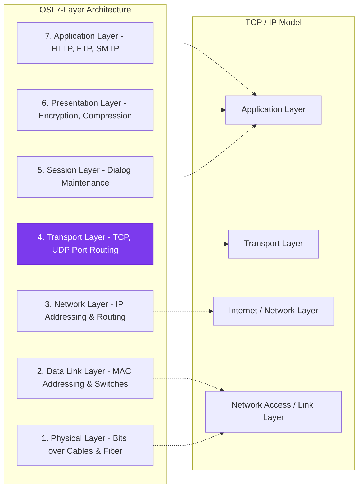

# 5. Computer Networking & Internet Protocols

---

5 Networking

## 1. Networking

Networking is a collection of interconnected computers and devices that communicate with each other and share
resources and information.

Advantages of Networking

- **Sharing of resources ** — Both hardware (printer, hard disk etc.) and software resources can be shared on a network.

- **Reliability** — Since we have more than one copies of a file on the network, reliability increases in case of system
failure.

- **Cost Reduction** — Sharing of resources enables considerable cost reduction of resources.

- **Efficient Communication medium - E** — mail, Video Conferencing etc are technologies that have provide d better
communication and increased productivity.

- **File sharing ** — Files can be transferred on a network faster than any other me

A network is a set of devices(often referred to as nodes) connected by communication links.
A node cab be a computer, printer or any other device capable of sending and/or receiving data generated by
other nodes on the network.
A network must be able to meet a certain number of criteria. The most important of these are:
➢ Performance
➢ Reliability
➢ Security

1.1.Network Topology:
Topology refers to the way in which the network of computers is connected.
The Topology of a network is a geometric representation of the relationship of a ll the links and linking
devices(usually called nodes) to one another.

1.1.1.Mesh Topology:
In mesh topology every device has a dedicated point-to-point link to every other  device.

Two nodes are connected by dedicated point -point links between them. So  the total number of links to connect n
nodes = n(n-1)/2; which is proportional to n2 . Media used for the connection (links) can be twisted pair, co-axial cable
or optical fiber

Mesh topology is not flexible and has a poor expandability as to add a new n ode n links have to be laid because that
new node has to be connected to each of the existing nodes via dedicated link.
So the cost of cabling will be very high for a large area, due to these reasons this topology is rarely used in practice.

Advantages of a mesh topology

- Can handle high amounts of traffic, because multiple devices can transmit data simultaneously.

- A failure of one device does not cause a break in the network or transmission of data.

- Adding additional devices does not disrupt data transmission between other devices.

Disadvantages of a mesh topology

- The cost to implement is higher than other network topologies, making it a less desirable option.

- Building and maintaining the topology is difficult and time consuming.

- The chance of redundant connections is high, which adds to the high costs and potential for reduced efficiency.

1.1.2.Bus Topology:
Bus topology uses one main cable to which all nodes are directly connected. The main cable acts as a backbone for the
network. One of the computers i n the network typically acts as the computer server. A bus topology is multipoint
topology. One long cable act as a back bone to link all the devices in the network.
Nodes connected to the bus cable by drop lines and taps. Drop line is a connection line wh ich is used to connect each
computer with the main cable. Tap is a connector where drop line is connected with main cable.

Advantages of bus topology

- It works well when you have a small network.

- Easiest network topology for connecting computers or peripherals in a linear fashion.

- Requires less cable length than a star topology.

Disadvantages of bus topology

- Difficult to identify the problems if the whole network goes down.

- It can be hard to troubleshoot individual device issues.

- Terminators are required for both ends of the main cable.

- Additional devices slow the network down.

- If a main cable is damaged, the network fails or splits into two.

1.1.3.Ring Topology:
In Ring Topology , each device has a dedicated point-to-point connection with only the two devices on either  side of
it. A signal is passed along the ring in one  direction, from device to device, until it reaches its destination.Each device
in the ring incorporates a repeater. When a device receives a signal intended for another device, its repea ter
regenerates the bits and passes them along.

A ring topology is r elatively easy to install and reconfigure. Each device is linked to only its immediate neighbours
(either physically or logically). To add or delete a device requires changing only two connections.

Advantages of ring topology

- All data flows in one direction, reducing the chance of packet collisions.

- Data can transfer between workstations at high speeds.

- Additional workstations can be added without impacting performance of the network.

Disadvantages of ring topology

- All data being transferred over the ne twork must pass through each workstation on the network, which can
make it slower.

- The entire network will be impacted if one workstation shuts down.

- The hardware needed to connect each workstation to the network is more expensive.

1.1.4.Star Topology:
In star topology , each device has a dedicated point-to-point link only to a central controller, usually called a hub. The
device are not directly linked to one another. The controller act as an exchange: If one device wants to send data to
another, it sends the data to the controller, which then relays the data to the other connected device.

Advantages of star topology

- Centralized management of the network, through the use of the central computer, hub, or switch.

- Easy to add another computer to the network.

- If one computer on the network fails, the rest of the network continues to function normally.

Disadvantages of star topology

- Can have a higher cost to implement, especially when using a switch or router as the central network device.

- The central network device determines the performance and number of nodes the network can handle.

- If the central computer, hub, or switch fails, the entire network goes down and all computers are disconnected
from the network.

1.1.5.Tree Topology:
Tree Topology integrates the characteristics of Star and Bus Topology.
In Tree Topology, the number of Star networks are connected using Bus. This main cable seems like a main stem of a
tree, and other star networks as the branches. It is also called Expanded Star Topology.

Advantages of Tree Topology

- It is an extension of Star and bus Topologies, so in networks where these topologies can't be implemented
individually for reasons related to scalability, tree topology is the best alternative.

- Expansion of Network is possible and easy.

- Here, we divide the whole network into segments (star networks), which can be easily managed and
maintained.

- Error detection and correction is easy.

- Each segment is provided with dedicated point-to-point wiring to the central hub.

- If one segment is damaged, other segments are not affected.

Disadvantages of Tree Topology

- Because of its basic structure, tree topology, relies heavily on the main bus cable, if it breaks whole network is
crippled.

- As more and more nodes and segments are added, the maintenance becomes difficult.

- Scalability of the network depends on the type of cable used.

1.1.6.Hybrid Topology:
Hybrid topology is an integration of two or more different topologies to forma  resultant topology which has many
advantages of all the constituent basic topologies rather than having characteristics of one specific topology.

Advantages of Hybrid Topology:

- Unlike other networks, fault detection and troubleshooting is easy in this topology.

- It is easy to increase the size of network by adding new components, without disturbing existing architecture.

- Hybrid network is flexible, it can be designed according to the requirements of the organization and by
optimizing the available resources.

- This type of topology is very effective because it is the  combination of two or more topologies,so we can
design it in such a way that strengths of constituent topologies are maximized while there weaknesses are
neutralized. Forexample we saw Ring Topology has good data reliability and Star topology has high tolerance
capability so these two can be used effectively in hybrid star-ring topology.

Disadvantages of Hybrid Topology:

- One of the biggest drawbacks of hybrid topology is its complex design. Configuration and installation process
is very difficult.

- The hubs used to connect two distinct networks are very expensive.

- As hybrid architectures are usually larger in scale, they require a lot of cables; cooling systems and
sophisticate network devices.

Categories of network:
➢ LAN(Local Area Network): A LAN connects network devices over a relatively short distance. A networked
office building, school, or home usually contains a single LAN, though sometimes one building will contain a
few small LANs (perha ps one per room), and occasionally a LAN will sp an a group of nearby buildings.A
LAN is very useful for sharing resources, such as data storage and printers. LANs can be built with relatively
inexpensive hardware, such as hubs, network adapters and Ethernet cables.
➢ MAN(Metropolitan Area Network):  MAN co nsists of a computer network across an entire city, college
campus or small region. A MAN is larger than a LAN, which is typically limited to a single building or site.
Depending on the configuration, this type of network can cover an area from several miles to tens of miles. A
MAN is often used to connect several LANs together to form a bigger network.
➢ WAN(Wide Area Network): A WAN provides long distance transmission of data, image, audio,and video
information over large geographic areas that may comprise a country, a continent,or even the whole world.
➢ SAN(Storage Area Network):  SAN is a high -speed network of storage devices that also connects those
storage devices with servers.
➢ CAN(Campus Area Network): A campus area networks (CANs) is a computer network in terconnecting a
few local area networks (LANs) within a university campus or corporate campus Network.Campus area
network may link a variety of campus buildings.
➢ PAN(Personal Area Network): A personal area net work is a computer network organized around an
individual person. Personal area networks typically involve a mobile computer,Personal area networks can
be constructed with cables or wireless.

## 2. Data Communication:

Data communication are the exchange of data between two devices via some form of transmis sion medium such as a
wire cable.
The communicating devices must be part of a communication system made up of a combination of hardware and
software. The effectiveness of data communication depends on the fou r basic characteristics: delivery, accuracy,
timeliness, and jitter.

Components of Data Communication:

- Message:Message is the information(data) to be communicated. e.g. text, picture, audio, video etc.

- Sender:The sender is the device that sends the data m essage. It can be computer, workstation, telephone
handset and so on.

- Receiver:The receiver is the device that receive the message. It can be computer, workstation, telephone
handset and so on.

- Transmission Medium:Transmission medium is the physical path by which a message travels from sender to
receiver.
Data flow: Communication between two device can be:
Simplex: Simplex mode communication is unidirectional or a one-way street. Only one of the two devices on a
link can transmit; the other can only receive. Keyboards and traditional monitors are example of simplex devices.
Half-Duplex: In half duplex, each station can both transmit and receive, but not at the same time. When one
device is sending, the other can only receive and vice versa. Walkie-talkies is the example of half duplex.
Full-Duplex: In full duplex, both stations can transmit and receive simultaneously. The full duplex mode is like a
two-way street with traffic flowing in both directions at the same time. one common example of full duplex
communication is the telephone network. When two people are communicating by a telephone line, both can talk
and listen at the same time.

Protocol:
A protocol is a set of rules that govern data communication.A protocol defines what is communicated,how it is
communicated and when it is communicated.
The key element of protocol is:
Syntax- syntax refers to the structure or format of the data,meaning the order in which they are presented.
Semantics-Semantics refer to the meaning of each section of bits. How is a particular pattern to be interpreted, and
what action is to be taken based on that interpretation?
Timing- Timing refers two characteristics: When data should be sent and how fast they can be sent.

2.1. Transmission medium:
Transmission media can be de fined as physical path between transmitter and receiver in a data transmission system.
And it may be classified into two types as:

- Guided: Transmission capacity depends critically on the medium, the length, and whether the mediu m is
point-to-point or multipoint (e.g. LAN). Examples are coaxial cable, twisted pair, and optical fiber.

- Unguided: provides a means for transmitting electro -magnetic signals but do not guide them. Example
wireless transmission.

Characteristics and quality of data transmission a re determined by medium and signal characteristics. For guided
media, the medium is more important in determining the limitations of transmission. While in case of unguided
media, the bandwidth of the signa l produced by the transmitting antenna and the siz e of the antenna is more
important than the medium. Signals at lower frequencies are omni-directional (propagate in all directions). For higher
frequencies, focusing the signals into a directional beam is p ossible. These properties determine what kind of m edia
one should use in a particular application.

Guided media:
Guided media, which are those that provide a conduit from one device to another, include Twisted -Pair Cable,
Coaxial Cable, and Fibre-Optic Cable.
A signal travelling along any of these media is directed and contained by the physical limits of the medium.

Twisted Pair Cable
This cable is the most commonly used and is cheaper than others. It is lightweight, cheap, can be installed easily, an d
they support many different types of network. Its frequency range is 0 to 3.5 kHz.
A twisted pair consists of two conductors (normally copper), each with its own plastic insulation, twisted together.
Twisted Pair are two types:

- Unshielded Twisted Pair Cable
It is the most common type of telecommunicat ion when compared with Shielded Twisted Pair Cable which
consists of two conductors usually copper, each with its own colour plastic insulator. Identification is the reason
behind coloured plastic insulation.

- Shielded Twisted Pair Cable
This cable has a me tal foil or braided -mesh covering which encases each pair of insulated conductors.
Electromagnetic noise penetration is prevented by metal casing.

Coaxial Cable:
Coaxial is called by this name because it contains two conductors that are parallel to each other. Copper is used in this
as centre conductor which can be a solid wire or a standard one. It is surrounded by PVC installation, a sheath which
is encased in an outer conductor of metal foil, braid or both.

Outer metallic wrapping is used as a shield  against noise and as the second conductor which completes the circuit.
The outer conductor is also encased in an insulating sheath. The outermost part is the plastic cover which protects the
whole cable.

Co-axial cable has superior frequency characterist ics compared to twisted -pair and can be used for both analog and
digital signaling.

One of the most popular use of co -axial cable is in cable TV (CATV) for the distribution of TV signal s. Another
importance use of co-axial cable is in LAN.

Fiber Optics:
It transmits signals in the form of light and is made up of an inner core of glass or plastic. The core is surrounded by a
cladding that reflects light back into the core. Each fiber is surrounded by a plastic casing. It is very efficient medium
because it provides maximum bandwidth, lower attenuation and is immune to Electromagnetic Interference.

Fiber optics cable have Very high data rate, low error rate. 1000 Mbps (1 Gbps) over dis tances of kilometers common.
Error rates are so low they are almost ne gligible.  Because of greater bandwidth (2Gbps), smaller diameter, lighter
weight, low attenuation, immunity to electromagnetic interference and longer repeater spacing, optical fiber ca bles
are finding widespread use in long -distance telecommunications. Especially, the single mode fiber is suitable for this
purpose. Fiber optic cables are also used in high -speed LAN applications. Multi -mode fiber is commonly used in
LAN.

Unguided Transmission:
Unguided transmission is used when running a physical cable (either fiber or copper) between two end points is not
possible. For example, running wires between buildings is probably not legal if the building is separated by a public
street. Infrared signals typically used for short distances (across the street or w ithin same room), Microwave signals
commonly used for longer distances (10's of km). Sender and receiver use some sort of dish antenna.

Radiowaves: These are the electromagnetic waves h aving a frequency range of 3KHz -1GHz. These are
omnidirectional i.e. the senders and receivers do not have to be in line of sight with each other. These can penetrate
walls and are prone to interference.
Applications- AM radio

Microwaves
These are the electromagnetic waves having frequencies ranging from 1 to 300GHz. They are unidirectional and
incorporates two antennas(sending & receiving) which should be aligned or in line of sight with each other. They
provide higher data rate but Very high frequency microwaves are unable to penetrate the walls. Applications- cellular
phones, satellite networks, wireless L

Infrared
Infrared waves use infrared light for signal transmission. These have frequency range from 300 GHz to 400 THz and
are used for short -range communication. They also incorporate line of sight propagation. It al so provides high
bandwidth and high data rate.
Applications- for communication between PCs, mobile phones etc.

### 2.2 Multiplexing:
Multiplexing is the set of techniques that allows the simultaneous transmission of multiple signals across a single data
link. There are three basic multiplexing techniques:
Frequency-division multiplexing:

Frequency Division Multiplexing is a technique which uses various frequencies to combine ma ny streams of data for
sending signals over a medium for communication purpose. It  carries frequency to each data stream and later
combines various modulated frequencies to transmission. Television Transmitters are the best example for FDM,
which uses FDM to broad cast many channels at a time.
Time-division Multiplexing:
It is also ca lled synchronous TDM, which is commonly used for multiplexing digitized voice stream. The users take
turns using the entire channel for short burst of time.
Wavelength-division Multiplexing:
Wavelength Division Multiplexing (WDM) is analog multiplexing te chnique and it modulates many data streams on
light spectrum.  This multiplexing is used in optical fiber. Various signals in WDM are optical signal that will be light
and were transmitted through optical fiber.WDM similar to FDM as it mixes many signals o f different frequencies
into single signal and transfer on one link. Wavelength of wave is reciprocal to its frequency, if wavelength increase
then frequency decreases. Sever al light waves from many sources are united to get light signal which will be
transmitted across channel to receiver.

## 3. Networking Devices:

These are used to connect different devices in the network or two connect two or more different networks.
Following devices are used for interconnection:

- **Modem** — Hub

- **Switch** — Repeater

- **Router** — Bridge

- Gateway

Modem: Modem stands for Modulator -Demodulator. It is used to connect computers for communication via
telephone lines.

Hub: It works at the Physical layer. It just acts like a connector of several computers i.e it simply connects all the
devices on its ports together .It broadcasts all the data packets arriving at it with no filtering capacity.

Switch: Switch is data link layer device. A network switc h also connects computers to each other, like a hub. Where
the switch differs from a hub is in the wa y it handles packets of data. When a switch receives a packet of data, it
determines what computer or device the packet is intended for and sends it to tha t computer only. It does not
broadcast the packet to all computers as a hub does which means bandwidt h is not shared and makes the network
much more efficient.

Repeater: It operates at the physical layer. It is used to amplify a signal that has lost its o riginal strength so as to
enable them to travel long distances. It can only join the networks that tr ansmit similar data packets. It does not have
filtering capacity i.e. all data including noise is amplified and passed on in the network so don’t help in r educing
network traffic.

Router: It works at the network layer and is used to connect different netw orks that have different architectures and
protocols. It sends the data packets to desired destination by choosing the best path available thus reducing ne twork
traffic. It routes the data packets using the routing table that contains all the Information regarding all known network
addresses, possible paths and cost of transmission over them. Availability of path and cost of transmission decide
sending of data over that path. It is of 2 types: static (manual configuration of routing table is needed) and dyn amic
(automatically discovers paths).
Gateway: It operates in all the layers of the network architecture. It can be used to connect two different networks
having different architectures, environment and even models. It converts the data packets in form tha t is suitable to
the destination application. The two different networks may differ in types of communication protocols they use,
language, data formats etc.

Bridge: They are used two connect two LANs with the same standard but using different types of ca bles. It provides
an intelligent connection by allowing only desired messages to cross the bridge thus improving performance. It uses

physical addresses of  the packets for this decision. It works on data link layer of the OSI model. A bridge uses
Spanning tree Algorithm for data transmission so as to avoid loops in the network.

Brouter: A brouter is a device that functions as both a bridge and a router. It can forward data between networks
(serving as a bridge), but can also route data to individual systems within a network (serving as a router).
The brouters functions at the network and data link layer of the OSI model.

## 4. Networking Switching:

A network switch is a computer networking device that connects devices together on a computer network by using
packet switching to receive, process, and forward data to the destination device.
There are basically three types of switching methods are made av ailable. Out of three methods, circuit switching and
packet switching are commonly used but the message switching has been opposed out in the general communication
procedure but is still used in the networking application.

- Circuit Switching: Circuit switched network consists of a set of switches connected by physical links. In circuit
switched network, two nodes com municate with each other over a dedicated communication path. There is a
need of pre -specified route from which data will travel and no other da ta is permitted. Before starting
communication, the nodes must make a reservation for the resources to be used d uring the communication. In
this type of switching, once a connection is established, a dedicated path exists between both ends until the
connection is terminated.

- Packet Switching: In packet switching, messages are divided into packets of fixed or variabl e size. The size of
packet is decided by the network and the governing protocol. Resource allocation for a packet is not done in
packet switching. Resources are allocated on demand. The resource allocation is done on first -come, first-served
basis. Each switching node has a small amount of buffer space to hold packets temporarily. If the outgoing line is
busy, the packet stays in queue until the line becomes available.
Packet switching method uses two routing methods:
## 1. Datagram Packet Switching
## 2. Virtual Circuit Packet Switching

- Message Switching:In message switching, it is not necessary to establish a dedicated path between transmitter
and receiver.In this, each message is routed independently through the  network. Each message carries a header
that contains the full information about the destination. Each intermediate device receives the whole message and
buffers it until there are reso urces available to transfer it to the next hop. If the next hop does not have enough
resources to accommodate large size  message, the message is stored and switch waits. For this reason a message
switching is sometimes called as Store and Forward Switching . Message switching is very slow because of
store-and-forward technique. Message switching is not recommended for real t ime applications like voice and
video.

## 5. Network Models:

5.1. OSI Model

### Visual Concept: OSI 7-Layer Model vs TCP/IP Protocol Stack

> [!NOTE]
> **Protocol Data Units (PDU)**: at Application layer it is **Data**, Transport layer is **Segment/Datagram**, Network layer is **Packet**, Data Link is **Frame**, Physical is **Bits**.:
OSI (Open System Interconnection) Model was developed by International Standards Organisation (ISO) to
standardize the network architecture internationally.
The purpose of the OSI Mod el is to show how facilitate communication between different system without requiring
changes to the logic of the underlying hardw are and software. OSI model is not a protocol; it is a model for
understanding and designing a network architecture that is flexible, robust and interoperable.

It is a layered framework having seven layers. The layers communicate with each other in a hier archical manner
where control is passed from one layer to another in the hierarchy beginning from the application layer at one
computer, then to the bottom layer of that computer. From here the control passes to the bottom layer of the next
computer and then back up in the hierarchy.

Layers in the OSI Model:
Layer 1-Physical layer:
Physical layer coordinates the function required to carry a bit stream over a physical medium.
It defines the mechanical, electrical & physical specifications of the interface & the transmission medium used for
communication. It determines how a cable is attached with LAN card & is responsible for tra nsmitting bit stream
from one computer to another. Fast Ethernet, ATM etc are some of the protocols that exist here.
The Physical Layer is responsible for movements of individual bits from one hop(node) to the next.

Functions of Physical Layer:

- Physical Characteristics of interface and medium: It defines the characteristics of the interface between the device
and the transmission medium.

- Representation of bits: Data in this layer consists of stream of bits. The bits must be encoded into signals for
transmission. It defines the type of encoding i.e. how 0's and 1's are changed to signal.

- Data Rate:This layer defines the rate of transmission which is the number of bits per second.

- Synchronization of bits:  It deals with the synchronization of the transmitter  and receiver. The sender and
receiver are synchronized at bit level.

- Line Configuration:The Physical lay er is concerned with the connection of devices to the media. It connect the
device in Point-to-Point and Multipoint configuration.

- Physical Topology:The Physical topology defines how devices are connected to make a network.

- Transmission Mode: The physical layer also defines the direction of transmission between two device: simplex,
half duplex or full duplex.

Layer 2-Data Link Layer:
Data link layer is most reliable node to node delivery of data. It forms frames from the packets that are received from
network layer and gives it to physical layer. It also synchronizes the information which is to be transmitted over the
data. Error controlling is easily done. The encoded data are then passed to physical.
Error detection bits are used by the data link layer. It also corrects the errors. Outgoing messages are assembled into
frames. Then the system waits for the acknowledgement to be received after the transm ission. It is reliable to send
message.

Data link layer has two sub-layers:
Logical Link Control: It deals with protocols, flow-control, and error control
Media Access Control: It deals with actual control of media

Responsibility of the data link layer:

- Framing: The datalink layer divides the stream of bits receive from the network layer into manageable data
units called frames.

- Physical addressing:The Data Link layer adds a header to the frame in order to define physical address of the
sender or receiver of the frame, if the frames are to be distributed to different systems on the network.

- Flow control: If the rate at which the data are absorbed by the receiver is less than the rate at which data are
produced in the sender, the data link layer imposes a f low control mechanism to avoid overwhelming the
receiver.

- Error control: The data link layer adds reliability to the physical layer by adding mechanisms to detect and
retransmit damaged or lost frames.It also uses a mechanism to recognize duplicate frames.

- Access control:When two or more devices are connected to the same link, data link layer protocols are
necessary to determine which device has control over the link at any given time.

Layer 3-Network Layer:
The network layer is responsible for the source-to-destination delivery of a packet, possibly across multiple
networks(links). The function of network layer called routing.

Responsibility of network layer:

- Logical addressing : It translates logical network address into physical address. Concerned  with c ircuit,
message or packet switching.

- Routing: When independent networks or links are connected to create internetworks (networks of networks)
or a large networks, the connecting device(called routers or switches) routes or switch the packets to thei r
final destinations.

Layer 4-Transport Layer:

The transport layer is responsible for process -to-process delivery of the entire message. A process is an application
program running on a host. whereas the network layer oversees source -to-destination delivery of individual packets,
it does not recognize any relationship between those packets.
The transport layer on the other hand, ensure that the whole message arrives intact and in order, overseeing both
error control and flow control at the source-to-destination level.

Responsibility of the transport layer:

- **service** — point addressing:Transport Layer header includes service point address which is port address. This
layer gets the message to the correct process on the computer unlike Network Layer, which gets each packet
to the correct computer.

- Segmentation and reassembly:A message is divided into segments; each segment contains sequence number,
which enables this layer in reassembling the message. Message is reassembled correctly upon arrival at the
destination and replaces packets which were lost in transmission.

- Connection Control:  The transport layer can be either connectionless or connection -oriented. A
connectionless transport layer treats each segments as an independent packet and delivers it to the tran sport
layer at the destination mechine. A connection-oriented transport layer makes a connection with the transport
layer at the destination machnine first before delivering the packets. After all the data are transfer, the
connection is terminated.

- Flow control:In this layer, flow control is performed end to end.

- Error control:Error Control is performed end to end in this layer to ensure that the complete message arrives
at the receiving transport layer without any error. Error Correction is done through retransmission.

Layer 5-Session Layer:
The session layer is the network dialog controller. It establishes, maintains and synchronizes the interaction among
communicating system.
Responsibilities of the session layer:

- Dialog Control: The session layer allows two s ystems to enter into dialog. It allows the communication
between two process to take place in either half-dulex or full duplex mode.

- Synchronization: The session layer allows a process to add checkpoints, or synchronization points, to a
stream of data.

Layer 6-Presentation Layer:
The presentation layer is concerned with the syntax and semantics of the information exchange between two systems.
Responsibilities of Presentation layer:

- Translation: Before being transmitted, information in the form of characters and numbers should be changed
to bit streams. The presentation layer is responsible for interoperability between encoding methods as

different computers use different encoding methods. It translates data between the formats the network
requires and the format the computer.

- Encryption: To carry sensitive information, a system must be able to ensure privacy. Encryption means that
the sender transforms the original information to another form and sends the resulting message out over the
network. Decryption reverse the original process to transform the message back to its original form.

- Compression: Data compression reduce the number of bits contained in the information. Data compression
becomes particularly important in the transmission of multimedia such as text, audio and video.

Layer 7-Application Layer:
The application layer enables the user, whether human or software, to access the network. It provides user interface
and support for services such as electronic mail, remote file access and tra nsfer, a shared database management,and
other type of distributed information services.
Services provided by application layer:

- Network Virtual terminal: It allows a user to log on to a remote host. The application creates software
emulation of a terminal at the remote host. User's computer talks to the software terminal which in turn talks
to the host and vice versa. Then the remote host believes it is communicating with one of its own terminals
and allows user to log on.

- File transfer, access, and manageme nt:It is a s tandard mechanism to access files and manages it. Users can
access files in a remote computer and manage it. They can also retrieve files from a remote computer.

- Mail Services: This layer provides the basis for E-mail forwarding and storage.
Directory Services : This layer provides access for global information about various services.

5.2.TCP/IP Model:
TCP/IP means Transmission Control Protocol and Internet Protocol. The TCP/IP protocol suite was developed prior
to the OSI model.
The layers of the TCP/IP p rotocol suite contain relatively independent protocol that can be mixed and matched
depending on the needs of the system.
TCP/IP is a layered framework having four layers:-

Layer 1- Network Interface Layer:
It is responsible for breaking down the data packets from Internet layer into frames which are then converted into bits
for transmission across the physical media. Here, Ethernet, FDDI, Token ring etc. Some of the standards that are
defined for data transmission. The Network Interface layer encompasses the Data Link and Physical layers of the OSI
model.
Institute of Electrical and Electronics Engineers (IEEE)
The Institute of Electrical and Electronics Engineers is an organization which was formed in 1963 in USA. The
Institute of Electrical and Electronics Engineers (IEEE) is the world's largest association for Electrical and
Electronics Engineers. Institute of Electrical and Electronics Engineers (IEEE) was formed by the merger of two
other technical organizations, American Institute of Electrical Engineers and Institute of Radio Engineers in 1st
January, 1963. Today, IEEE has about 500,000 members, from different countries in the world.
The IEEE is best known for developing standards for the computer and electronics industry. In particular, the IEEE
802 standards for local-area networks are widely followed.

LIST OF SOME IMPORTANT IEEE 802 standards:
IEEE 802 Standard
### 802.1 Bridging & Management

### 802.2 Logical Link Control
### 802.3 Ethernet – CSMA/CD Access Method
### 802.4 Token Passing Bus Access Method
### 802.5 Token Ring Access Method
### 802.6 Distribute Queue Dual Bus Access Method
### 802.7 Broadband LAN
### 802.8 Fiber Optic
### 802.9 Integrated Services LAN
### 802.10 Security
### 802.11 Wireless LAN
### 802.12 Demand Priority Access
### 802.14 Medium Access Control
### 802.15 Wireless Personal Area Network
### 802.16 Broadband Wireless Metro Area Network
### 802.17 Resilient Packet Ring

Ethernet
Ethernet is the most popular physical layer LAN technology in use today. Other LAN types include Token Ring, Fast
Ethernet, Fiber Distributed Data Interface (FDDI), Asynchronous Transfer Mode (ATM) and LocalTalk. Ethernet is
popular because it strikes a good balance between speed, cos t and ease of installation. These benefits, combined with
wide acceptance in the computer marketplace and the ability to support virtually all popular network protocols, make
Ethernet an ideal networking technology for most computer users today. The Instit ute for Electrical and Electronic
Engineers (IEEE) defines the Ethernet standard as IEEE Standard 802.3. This standard defines rules for configuring an
Ethernet network as well as specifying how elements in an Ethernet network interact with one another. By  adhering
to the IEEE standard, network equipment and network protocols can communicate efficiently.

Fast Ethernet
For Ethernet networks that need higher transmission speeds, the Fast Ethernet standard (IEEE 802.3u) has been
established. This standard raises the Ethernet speed limit from 10 Megabits per second (Mbps) to 100 Mbps with only
minimal changes to the existing cable structure. There are three types of Fast Ethernet: 100BASE-TX for use with level
5 UTP cable, 100BASE -FX for use with fiber -optic cable, and 100BASE -T4 which utilizes an extra two wires for use
with level 3 UTP cable. The 100BASE-TX standard has become the most popular due to its close compatibility with the
10BASE-T Ethernet standard. For the network manager, the incorporation of Fas t Ethernet into an existing
configuration presents a host of decisions. Managers must determine the number of users in each site on the network
that need the higher throughput, decide which segments of the backbone need to be reconfigured specifically for
100BASE-T and then choose the necessary hardware to connect the 100BASE -T segments with e xisting 10BASE -T
segments. Gigabit Ethernet is a future technology that promises a migration path beyond Fast Ethernet so the next
generation of networks will support even higher data transfer speeds.

Speed
(Mbit/s)
Distance
(m)
Name Standard/
Year
Description
10 100
(nominally)
10BASE-T 802.3i 1990 Runs over four wires (two twisted pairs) on a
Category 3 or Category 5 cable. Star topology with
an active hub or switch sits in the middle and has a
port for each node. This is also the configuration
used f or 100BASE -T and gigabit Ethernet.
Manchester coded signaling.
100 100 100BASE-TX 802.3u 1995 4B5B MLT -3 coded signaling, Category 5 cable
copper cabling with two twisted pairs.

1000 100 1000BASE-T 802.3ab 1999 PAM-5 coded signaling. At least Category  5 cable
with four twisted pairs copper cabling. Category 5
cable has since been deprecated and new
installations use Category 5e. Each pair is used in
both directions simultaneously.
100 10GBASE-T 802.3an 2006 THP PAM-16 coding. Uses category 6a cable.
≥30  40GBASE-T 802.3bq Under development, uses encoding from
10GBASE-T on proposed Cat 8.1.2 shielded cable.

Token Ring
Token Ring is another form of network configuration which differs from Ethernet in that all messages are transferred
in a unidirectional manner along the ring at all times. Data is transmitted in tokens, which are passed along the ring
and viewed by each device. When a device sees a message addressed to it, that device copies the message  and then
marks that message as being read. As the message makes its way along the ring, it eventually gets back to the sender
who now notes that the message was received by the intended device. The sender can then remove the message and
free that token for use by others.

FDDI
FDDI (Fiber-Distributed Data Interface) is a standard for data transmission on fiber optic lines in a local area network
that can extend in range up to 200 km (124 miles). The FDDI protocol is based on the token ring protocol. In add ition
to being large geographically, an FDDI local area network can support thousands of users.

Layer 2-Internet Layer:
The Internet layer is responsible for addressing, packaging, and routing functions. The core protocols of the  Internet
layer are IP, ARP, ICMP, and IGMP. The Internet Protocol (IP) is a routable protocol responsible for  IP addressing,
routing, and the fragmentation and reassembly of packets.

- The Internet Protocol (IP) is a routable protocol responsible for IP addressing, routing, and the fragmentation
and reassembly of packets.

- The Address Resolution Protocol (ARP) is responsible for the resolution of the Internet layer address to the
Network Interface layer address such as a hardware address.

- The Internet Control Message Protocol (ICMP) is responsible for providing diagnostic functions and reporting
errors due to the unsuccessful delivery of IP packets.

- The Internet Group Management Protocol (IGMP) is responsible for the management of IP multicast groups.

Addressing
To send a packet from a source node to a destination node correctly through a network,the packet must contain
enough information about the destination address. It is also common to include the source address, so that
retransmission can be done, if necessary.The addressing scheme used for this purpose has considerable effec t on
routing.
IP Addressing
Every host and router on the internet is provided with a unique standard form of network address, which encodes its
network number and host number. The combination is unique; no two nodes have the same IP addresses.

IPv4 Addressing:
The IPv4 addresses are 32 -bit long. The main address formats are assigned with network addresses (net id) and host
address (host id) fields of different sizes. The class  A format allows up to 126 networks with 16 million hosts each.
Class B allows up to 16,382 networks with up to 64 K hosts each. Class C allows 2 million networks with up to 254
hosts each. The Class D is used for multicasting in which a datagram is directed to multiple hosts.

there are two prevalent notations to show an IPv4 address: binary notation and dotted decimal notation.
IPv4 addressing, at its inception, used the concept of classes. This architecture is called classful addressing. In
classful addressing, the address space is divided into five classes: A,B,C,D,E.

The netid determines the network address while the hostid determines the host connected to that network.

Range of Host Addresses:

Class A      1.0.0.0     to   126.255.255.255
Class B      128.0.0.0   to   191.255.255.255
Class C      192.0.0.0   to   223.2 55.255.255
Class D      224.0.0.0   to   239.255.255.255
Class E      240.0.0.0   to   254.255.255.255

Class D address reserved for multicast groups and Class E address reserved for future use, or Research and
Development process.

Subnetting:
Subnetting is the strategy used to partition a single physical network into more than one smaller logical sub-networks
(subnets). An IP address includes a network segment and a host segment. Subnets are designed by accepting bits from
the IP address's host part and using these bits to assign a number of smaller sub-networks inside the original network.

Subnet mask: A Subnet mask is a 32 -bit number that masks an IP address, and divides the IP address into network
address and host address.

Supernetting: It is the p rocess of combining several IP networks with a common network prefix. Supernetting was
introduced as a solution to the problem of increasing size in routing tables. Supernetting also simplifies the routing
process. For example, the su bnetworks 192.60.2.0/2 4 and 192.60.3.0/24 can be combined in to the supernetwork
denoted by 192.60.2.0/23.
In the supernet, the first 23 bits are the network part of the address and the other 9 bits are used as the host identifier.
So, one address will re present several small networks and this would reduce the number of entries that should be
included in the routing table. Typically, supernetting is used for class C IP addresses (addresses beginning with 192 to
223 in decimal), and most of the routing protocols support supernetting.

Difference between Subnetting and Supernetting:
Subnetting is the process of dividing an IP network in to sub divisions called subnets whereas, Supernetting is the
process of combining several IP networks with a common network prefix.
Supernetting will reduce the number of entries in a routing table and also will simplify the routing process. In
subnetting, host ID bits (for IP addresses from a single network ID) are borrowed to be used as a subnet ID, while in
supernetting, bits from the network ID are borrowed to be used as the host ID.

Classless Inter-Domain Routing:
Short for Classless Inter-Domain Routing, an IP addressing scheme that replaces the older system based on classes A,
B, and C. With CIDR, a single IP address can be used to designate many unique IP addresses.
A CIDR IP address looks like a normal IP address except that it ends with a slash followed by a number, called the IP
network prefix.

For example: 172.200.0.0/16
CIDR addresses reduce the size of routing tables and make more IP addresses available within organizations. CIDR is
also called supernetting

IPv4 header:

The fields in the IP header and their descriptions are

Version—A 4-bit field that identifies the IP version being used. The current version is 4, and this version is referred to
as IPv4.

Length—A 4-bit field containing the length of the IP header in 32-bit increments. The minimum length of an IP header
is 20 bytes, or five 32 -bit increments. The maximum length of an IP header is 24 b ytes, or six 32 -bit increments.
Therefore, the header length field should contain either 5 or 6.

Type of Service (ToS)—The 8-bit ToS uses 3 bits for IP Precedence, 4 bits for ToS with the last bit not being used. The
4-bit ToS field, although defined, has never been used.

IP Precedence— A 3-bit field used to identify the level of service a packet receives in the network.

Differentiated Services Code Point (DSCP)—A 6-bit field used to identify the level of service a packet receives in the
network. DSCP is a 3-bit expansion of IP precedence with the elimination of the ToS bits.

Total Length—Specifies the length of the IP packet that includes the IP header and the user data. The length field is 2
bytes, so the maximum size of an IP packet is 216 – 1 or 65,535 bytes.

Identifier, Flags, and Fragment Offset—As an IP packet moves through the Internet, it might need to cross a route
that cannot handle the size of the packet. The packet will be divided, or fragmented, into smaller packets and
reassembled later. These fields are used to fragment and reassemble packets.

Time to Live (TTL)—It is possible for an IP packet to roam aimlessly around the Internet. If there is a routing problem
or a routing loop, then you don't want packets to be forwarded forever. A routing loop is when a packet is continually
routed through the same routers over and over. The TTL field is initially set to a number and decremented by every
router that is passed through. When TTL reaches 0 the packet is discarded.

Protocol—In the layered protocol model, the layer that d etermines which application the data is from or which
application the data is for is indicated using the Protocol field. This field does not identify the application, but
identifies a protocol that sits above the IP layer that is used for application identification.
Header Checksum—A value calculated based on the contents of the IP header. Used to determine if any errors have
been introduced during transmission.

Source IP Address—32-bit IP address of the sender.

Destination IP Address—32-bit IP address of the intended recipient.

Options and Padding —A field that varies in length from 0 to a multiple of 32 -bits. If the option values are not a
multiple of 32-bits, 0s are added or padded to ensure this field contains a multiple of 32 bits.

IPv6:
IPv6 is of 128 bits represented in 8 combinations of 4 hexa decimal numbers each, separated by a colon.
An example of an IPv6 address is: 2001:0db8:85a3:0000:0000:8a2e:0370:7334.

Categories of IPv6 address:

- Unicast: Unicast represents a single interface. A packet sen t to a unicast address is delivered to the interface
identified by that address.

- Multicast: Multicast represents a group of interfaces. A packet sent to a multicast address is delivered to all
interfaces identified by that address.

- Anycast: Anycast identifies one or more interface. A packet sent to an anycast address is delivered to the
closest member of a group, according to the routing protocols' measure of distance.

Routing:
Routing is the act of moving information across an inter-network from a source to a
destination. Along the way, at least one intermediate node typically is encountered. It’s also referred to as the process
of choosing a path over which to send the packets. Routing is often contraste d with bridging, which might seem to
accomplish precisely the same thing to the casual observer. The primary difference between the two is that bridging
occurs at Layer 2 (the data link layer) of the OSI reference model, whereas routing occurs at Layer 3 ( the network
layer).
Routing protocols use metrics to  evaluate what path will be the best for a packet  to travel. A metric is a standard of
measurement; such as path bandwidth, reliability, delay , current load on that path etc .; that is used by routing
algorithms to determine the optimal path to a destination.

Routing algorithms can be classified based on the following criteria:

- **Static versus Adaptive** — Single-path versus multi-path

- **Intra-domain versus inter-domain** — Flat versus hierarchical

- **Link-state versus distance vector** — Host-intelligent versus router-intelligent

IPsec:
IPsec short for IP security, a set of protocol developed by the Internet Engineering Task Force(IETF) to support secure
exchange of packets at the IP layer. IPsec has been deployed widely to implement Virtual Private Networks(VPNs).
IPsec support two encryption modes: Transport and Tunnel. Transport mode encrypts only the data portion(payload)
of each packets, but leaves the header untouched. The more secure Tunnel mode enc rypts both the header and the
payload.

Layer 3 – Transport Layer
It en capsulates raw data received from application layer into data segments and performs error control and flow
control. It is represented by the two protocols i.e. TCP & UDP.
TCP(Transmission Control Protocol)- It is a connection oriented protocol. First a connection is established between the
sender and the receiver and then data is sent across the network. It gives the data segments proper sequence numbers
for reordering at the destination side and also the acknowledgment nos. Are given for the data packets received. So it
is a reliable protocol.
UDP(User Datagram Protocol)It is an unreliable, connectionless protocol i.e . no reliable connection is established
between sender & receiver before data transmission. It is used for client - server type requests where prompt delivery
of requests-replies is more important than accurate delivery.

Application Layer
It enables network access to the user. Following are some of the protocols defined here:-

File Transfer Protocol (FTP)
File Transfer Protocol (FTP) is a TCP/I P client -server application for transfer filesbetween two remote machines
through internet. A TCP connection is set up before file transfer and it persists throughout the session. It is possible to

send more than one file before disconnecting the link. A c ontrol connection is established first with a remote host
before any file can be transferred.

HTTP (Hyper Text Transfer Protocol)
It permits the user to upload and upload webpages through browser. It is a connection less protocol.

Telnet
Telnet is a simple remote terminal protocol that provides a remote log-on capability,which enables a user to log on to
a remote computer and behaves as if it is directlyconnected to  it. The following three basic services are offered by
TELNET:o It defines a network virtua l terminal that provides a standard interface toremote systemso It includes a
mechanism that allows the client and server to negotiate optionsfrom a standard seto It  treats both ends
symmetrically

Simple Network Management Protocol (SNMP)
Network manager s use network management software that help them to locate, diagnose and rectify problems.
Simple Network Management Protocol (SMTP) provides a systematic way for ma naging network resources. It uses
transport layer protocol for communication. It allows the m to monitor switches, routers and hosts. There are four
components of the protocol:

- **Management of systems** — Management of nodes; hosts, routers, switches

- Management of Information Base; specifies data items a host or a router must keep and the operations allowed on
each (eight categories)

- Management of Protocol; specifies communication between network managementclient program a manager
invokes and a network management server running on ahost or router

## 6. Internet
The Internet is generally defined as a global network connecting millions of computers. Many countries are link ed
into exchanges of data, news, opinions etc.
The Internet contains billions of web pages created b y people and companies from around the world, making it a
limitless place to locate information and entertainment. The Internet also has thousands of services that help make life
more convenient. For example, many financial institutions offer online bankin g that enables a user to manage and
view their account online.

History of internet:
The internet was developed in the United States by the "United States Department of Defense Advanced Research
Projects Agency" (DARPA). It was first connected in October, 1969, and was called ARPANET. The World Wide Web
was created at CERN in Switzerland in 1990 by a British (UK) man named Tim Berners-Lee.

IMPORTANT ORGANIZATION:
Internet service provider:
An Internet service provider (ISP) is a company that provides customers with Internet access. Data may be
transmitted using several technologies, including di al-up, DSL, cable modem, wireless or dedicated high -speed
interconnects.

W3C:
Short for World Wide Web Consortium, W3C is an organization founded by Tim Berners-Lee in 1994 to help with the
development of common protocols for the unified evolution of the Web.

Internet Architecture Board (IAB):
Internet Architecture Board defines the architecture for the Internet. The Internet Architecture Board (IAB) purpose is
to provide oversight of the architecture for the protocols and other procedures used by the Internet.

Internet Society (ISOC):
The Internet Society (ISOC) is mainly involved in policy, governance, technology, education & training and
development of internet.

Internet Corporation for Assigned Names and Numbers (ICANN) & Internet A ssigned Numbers Au thority
(IANA):

The Internet Corporation for Assigned Names and Numbers is an international non -profit corporation which is in
charge of Int ernet Protocol (IP) address allocation (IPv4 and IPv6), Domain Names allocation (examples,
omnisecu.com, msn.com, go ogle.com) Global public Domain Name System management, DNS Root Server
maintenance, Port Number allocation etc.

Institute of Electrical and Electronics Engineers (IEEE):
The Institute of Electrical and Electronics Engineers (IEEE) develop and maintain sta ndards in every technology field
related with electricity. The Institute of Electrical and Electronics Engineers (IEEE) develop and maintain  Local Area
Network (LAN) networking standards including Ethernet (IEEE 802.3 family standards) and Wireless LAN (IE EE
802.11 family standards).

Internet Research Task Force (IRTF) & Internet Engineering Task Force (IETF):
The Internet Research Task Force  is a technology research organization which is working on focused long -term
research on technical topics related to standard Internet protocols, applications, architecture and technology.
Internet Engineering Task Force is working to develop the short -term issues of network engineering protocols and
standards.
Internet Engineering Task Force (IETF) develop the maintain  high quality relevant technical standards, mainly
network protocols. The network protocol standards are developed under a platform, called as Request for Comments
(RFCs).
A Request for Comments (RFC) is a technical publication of the Internet Engineering Task Force (IETF) and the
Internet Society. Request for Comments (RFCs) are mainly used to develop a network protocol, a function of a
network protocol or any feature which is related with network communication. All the standard network protocols
(like, HTTP, FTP, SMTP, TCP, UDP, IP etc) are defined as RFSs.

VPN (Virtual Private Network):

There are different technologies available for Wide Area Network (WAN) connectivity. But the main drawback of
many Wide Area Network (WAN) connectivity solutions is "Cost". Think about an organization which has 100 offices
all over the world. Providing Wide Area Network (WAN) connectivity using Leased Lines, for all these offices will be
too costly.

If broadband internet access is available at all these 100 offices, linking all these offices using broadband internet is the
most budget friendly Wide Area Network (WAN) connectivity solution. But we have a very serious problem related
with security if we use public internet to connect all our 100 offices using broadband internet. Security!
Internet is a public network consisting of thousands of service providers and your organization's private Data is not
much secure in a public network. We need protection for our private data against eavesdropping, tampering and we
must make sure we are sending the data to exact recipient (mutual authentication).

A Virtual Private Network (VPN) is a Network Security Techn ology, which is used to secure private network traffic
over a public network such as the Internet. A VPN ensures Data Conf identiality (privacy) and Data Integrity for
network data in its journey from the source device to destination device using network se curity protocols like IPSec
(Internet Protocol Security). IPSec (Internet Protocol Security) VPN provide Data Confidential ity by encrypting the
data at the sending device and decrypting the data at receiving end. IPSec (Internet Protocol Security) VPN also
provides Data Integrity (making sure that the Data is not changed while its journey) by using Hashing Algorithms
like MD5 (Message Digest) and SHA (Secure Hashing Algorithm).

## 7. Some Important Networking Protocol
User Datagram protocol (UDP)
UDP is responsible for differentiating among multiple source and destination processes within one host. Multiplexing
and demultiplexing operations are performed using the port mechanism.
UDP Datagram:
A brief description of different fields of the datagram are given below:

- Source port (16 bits): It defines the port number of the application program in the host of the sender

- Destination port (16 bits): It defines the port number of the application program in the host of the receiver

- Length: It provides a count of octets in the UDP datagram, minimum length = 8

- Checksum: It is optional, 0 in case it is not in use Characteristics of the UDP Key characteristics of UDP are given
below:

- UDP provides an unreliable connectionless delivery service using IP to transport messages between two processes

- UDP messages can be lost, duplicated, delayed and can be delivered out of order

- UDP is a thin protocol, which does not add significantly to the functionality of IP

- It cannot provide reliable stream transport service

Transmission Control Protocol (TCP)
TCP provides a connection -oriented, full-duplex, reliable, streamed delivery service  using IP to transport  messages
between two processes. Reliability is ensured by:

- **Connection-oriented service** — Flow control using sliding window protocol

- **Error detection using checksum** — Error control using go-back-N ARQ technique

- Congestion avoidance algorithms; multiplicative decrease and slow-start

TCP Datagram
A brief explanation of the functions of different fields are given below:

- Source port (16 bits): It defines the port number of the application program in the host of the sender

- Destination port (16 bits): It defines the port number of the application program in the host of the receiver

- Sequence number (32 bits): It conveys the rece iving host which octet in this sequence comprises the first byte in
the segment

- Acknowledgement number (32 bits): This specifies the sequence number of the next octet that receiver expects to
receive

- HLEN (4 bits): This field specifies the number of 32-bit words present in the TCP header

- Control flag bits (6 bits): URG: Urgent pointer

- ACK: Indicates whether acknowledge field is valid

- PSH: Push the data without buffering

- RST: Resent the connection

- SYN: Synchronize sequence numbers during connection establishment

- FIN: Terminate the connection

- Window (16 bits): Specifies the size of window

- Checksum (16 bits): Checksum used for error detection.

- User pointer (16 bits): Used only when URG flag is valid

- Options: Optional 40 bytes of information

Domain Name System
Although IP addresses are convenient and compact way for identifying machines and are fundamental in TCP/IP, it
is unsuitable for human user.  Meaningful high -level symbolic names are more convenient for hum Application
software permits users to use symbolic names, but the underlying network protocols require addresses. This requires
the use of names with proper syntax with efficient translation mechanism. A concept known as Domain Name System
(DNS) was invented for this purpose. DNS is a naming scheme that uses a hierarchical, domain-based naming scheme
on a distributed database system. The basic approach is to divide the internet into several hundred top-level domains,
which come in two flavors - generic and countries.

HTTP protocol:
The Hypert ext Transfer Protocol (HTTP) is an application -level protocol for distributed, collaborative, hypermedia
information systems. This is the foundation for data communication for the World Wide Web (i.e. internet) since
Standards port number of http connection is port 80.

HTTPS
Short for Hypertext Transfer Protocol Secure, HTTPS is a protocol which uses HTTP on a connection encrypted by
transport-layer security. HTTPS is used to protect transmitted data from eavesdropping. It is the default protocol for
conducting financial transactions on the web, and can protect a website's users from censorship by a government or
an ISP. HTTPS port use port 443.

Voice over IP (VoIP)
VoIP technology allows telephone calls to be made over digital computer networks includin g the Internet. VoIP
converts analog voice signals into digital data packets and supports real-time, two-way transmission of conversations
using Internet Protocol (IP).

Open Shortest Path First (OSPF)
It is Interior Gateway Protocol. It is a routing protoc ol developed for Internet Protocol (IP) networks by the Interior
Gateway Protocol (IGP) working group of the Internet Engineering Task Force (IETF). The working group was
formed in 1988 to design an IGP based on the Shortest Path First (SPF) algorithm for use in the Internet.

Routing Information Protocol (RIP)
It is one of the most commonly used Interior Gateway Protocol on internal networks which helps a  router
dynamically adapt to changes of network connections by communicating information about which networks each
router can reach and how far away those networks are. Although RIP is still actively used, it is generally considered to
have been obsolete by Link-state routing protocol such as OSPF.

Border Gateway Protocol (BGP)
BGP is used to exchange routing information for the Internet and is the protocol u sed between Internet service
providers (ISP). One of the most important characteristics of BGP i s its flexibility. The protocol can connect together
any internetwork of autonomous systems using an arbitrary topology

ARP:
Address Resolution Protocol (ARP) is one of the major protocol in the TCP/IP suit and the purpose of Address
Resolution Protocol (ARP) is to resolve an IPv4 address (32 bit Logical Address) to the physical address (48 bit MAC
Address). Network Applications at the Application Layer use IPv4 Address to communicate with another device. But
at the Datalink layer, the addressing is MAC ad dress (48 bit Physical Address), and this address is burned into the
network card permanently. You can view your network card’s hardware address by typing the c ommand "ipconfig
/all" at the command prompt (Without double quotes using Windows Operating Systems).

The purpose of Address Resolution Protocol (ARP) is to find out the MAC address of a device in your Local Area
Network (LAN), for the corresponding IPv4 address, which network application is trying to communicate.

RARP:
The Reverse Address Resoluti on Protocol (RARP) is the earliest and simplest protocol designed to allow a device to
obtain an IP address for use on a TCP/IP network. It is based directly on  ARP and works in basically the same way,
but in reverse: a device sends a request containing it s hardware address and a device set up as an RARP server
responds back with the device’s assigned IP address.

SIP:
Session Initiation Protocol (SIP) is one of the most common protocols used in VoIP technology. It is an application
layer protocol that works in conjunction with other application layer protocols to control multimedia communication
sessions over the Internet.

DHCP:
Dynamic Host Configuration Protoc ol (DHCP) is used to dynamically (automatically) assign TCP/IP configuration
parameters to netwo rk devices (IP address, Subnet Mask, Default Gateway, DNS server etc). Dynamic Host
Configuration Protocol (DHCP) is described in RFC 1531. Other RFCs related w ith Dynamic Host Configuration
Protocol (DHCP) are RFC 1534, RFC 1541, RFC 2131, and RFC 2132. D HCP is an IETF standard based on the BOOTP
protocol. A computer that gets its configuration information by using Dynamic Host Configuration Protocol (DHCP)
is known as a Dynamic Host Configuration Protocol (DHCP) client. DHCP clients communicate with a DHC P server
to obtain IP addresses and related TCP/IP configuration information. DHCP server should be configured properly by
the DHCP administrator.

Using Dynamic Host Configuration Protocol (DHCP), DHCP Clients can be configured with TCP/IP configuration
values like IP Address, Subnet Mask, Default Gateway, DNS Server, DNS suffix etc.

Stop and Wait protocol:
This is the simplest form of flow control where a sender transmits a data frame. After receiving the frame, the receiver
indicates its willingness to accept another frame by sending back an ACK frame acknowledging the frame just
received. The sender must wait until it receives the ACK frame before sending the next data frame. This is sometimes

referred to as ping -pong behavior, request/reply is simple t o understand and easy to implement, but not very
efficient. In LAN environment with fast links, this isn't much of a concern, but WAN links will spend most of t heir
time idle, especially if several hops are required.  Major drawback of Stop -and-Wait Flow C ontrol is that only one
frame can be in transmission at a time, this leads to inefficiency if propagation delay is much longer than the
transmission delay.  Som e protocols pretty much require stop -and-wait behavior. For example, Internet's Remote
Procedure Call (RPC) Protocol is used to implement subroutine calls from a program on one machine to library
routines on another machine. Since most programs are single threaded, the sender has little choice but to wait for a
reply before continuing the program and  possibly sending another request.  Error correction in Stop -and-Wait ARQ
is done by keeping a copy of the sent frame and retransmitting of the frame when the timer expires.

Sliding Window Protocol:
In sliding window method, multiple frames are sent by sender at a time before needing an acknowledgment. Multiple
frames sent by source are acknowledged by receiver using a single ACK frame. In sliding window protocols, the
sender's data link layer maintai ns a 'sending window' which consists of a set of sequenc e numbers corresponding to
the frames it is permitted to send. Similarly, the receiver maintains a 'receiving window' corresponding to the set of
frames it is permitted to accept. The window size is d ependent on the retransmission policy and it may differ in
values for the receiver's and the sender's window. The sequence numbers within the sender's window represent the
frames sent but as yet not acknowledged. Whenever a new packet arrives from the netw ork layer, the upper edge of
the window is advanced by one. When an acknowledgement arrives from the receiver the lower edge is advanced by
one. The receiver's window corresponds to the frames that the receiver's data link layer may accept. When a frame
with sequence number equal to the lower edge of the window  is received, it is passed to the network layer, an
acknowledgement is generated and the window is rotated by one. If however, a frame falling outside the window is
received, the receiver's data link layer has two options. It may either discard this frame and all subsequent frames
until the desired frame is received or it may accept these frames or buffer them until the appropriate frame is received
and then pass the frames to the network layer in sequence.

GO-back-N ARQ:
The most popular ARQ protocol is the go-back-N ARQ, where the sender sends the frames continuously without
waiting for acknowledgement. That is why it is also called as continuous ARQ. As the receiver receives the frames, it
keeps on sending ACKs or a NACK, in case a frame is incorrectly received. When the sender receives a NACK, it
retransmits the frame in error plus all the succeeding frames. Hence, the name of the protocol is go -back-N ARQ. If a
frame is lost, the receiver sends NAK after receiving the next frame. In case there is long delay before sending the
NAK, the sender will resend the lost frame after its timer times out. If the ACK frame sent by the receiver is lost, the
sender resends the frames after its timer times out.

Piggybacking:
In practice, the link between receiver and transmitter is full duplex and usually both transmitter and receiver
stations send data to each over. So, instead of sending separate acknowledgement packets, a portion (few bits) of the
data frames can be used for acknowledgement. This phenomenon is known as piggybacking. The piggybacking
helps in better channel utilization. Further, multi-frame acknowledgement can be done.


---

## Interactive Practice Quiz Deck

Test your mastery with our complete interactive multiple-choice assessment deck. Select an answer to evaluate your reasoning and reveal detailed explanatory feedback!

```quiz
[
  {
    "question": "Q1. UDP stands for?",
    "options": [
      "Universal data Protocol",
      "User Datagram Protocol",
      "Universal Datagram Process",
      "None of the above",
      "User Division Protocol"
    ],
    "correctIndex": 1,
    "explanation": "2.  (a) 3.  (b) 4.  (a) 5.  (a) 6.  (b) 7.  (b)"
  },
  {
    "question": "Q2. Radio Broadcasting is an example of which type of data communication ?",
    "options": [
      "Simplex",
      "Half Duplex",
      "Full Duplex",
      "Both",
      "and",
      "",
      "None of the above"
    ],
    "correctIndex": 0,
    "explanation": "Correct answer based on professional knowledge concepts."
  },
  {
    "question": "Q3. IEEE subdivided the datalink layer to  provide for environments that need connectionless or connection-oriented services. One of the two layers is called?",
    "options": [
      "Physical",
      "MAC",
      "Session",
      "IP",
      "None of these"
    ],
    "correctIndex": 0,
    "explanation": "Correct answer based on professional knowledge concepts."
  },
  {
    "question": "Q4. ______________ is used as transmission  media in cable networks?",
    "options": [
      "Coaxial Cable",
      "Optical fibre",
      "STP",
      "UTP",
      "None of these"
    ],
    "correctIndex": 0,
    "explanation": "Correct answer based on professional knowledge concepts."
  },
  {
    "question": "Q5. Which layer of the OSI model specifies the path that the data should take?",
    "options": [
      "Network layer",
      "Transport layer",
      "Physical layer",
      "Data link layer",
      "None of these"
    ],
    "correctIndex": 0,
    "explanation": "Correct answer based on professional knowledge concepts."
  },
  {
    "question": "Q6. In TDM, slots are further divided into?",
    "options": [
      "Seconds",
      "Frames",
      "Packets",
      "None of the mentioned",
      "Routers"
    ],
    "correctIndex": 0,
    "explanation": "Correct answer based on professional knowledge concepts."
  },
  {
    "question": "Q7. Coaxial cable is a type of?",
    "options": [
      "Unguided media",
      "guided media",
      "connection less",
      "Window media",
      "None of the above"
    ],
    "correctIndex": 0,
    "explanation": "Correct answer based on professional knowledge concepts."
  },
  {
    "question": "Q8. Which of the following gives Sequence and Acknowledgment nos. to the data packets?",
    "options": [
      "TCP",
      "UDP",
      "IP",
      "HTTP",
      "None of these"
    ],
    "correctIndex": 0,
    "explanation": "9.  (b) 10.  (a) 11.  (d) 12.  (b) 13.  (d) 14.  (a)"
  },
  {
    "question": "Q9. A layer of glass surrounding the central fiber of glass inside a fiber optic cable is called as?",
    "options": [
      "Core",
      "Cladding",
      "Refractive layer",
      "None of the above",
      "Surrounded layer"
    ],
    "correctIndex": 0,
    "explanation": "Correct answer based on professional knowledge concepts."
  },
  {
    "question": "Q10. Which of the following are transport layer protocols?",
    "options": [
      "TCP and UDP",
      "ATM",
      "CISC",
      "HTTP and FTP",
      "None of these"
    ],
    "correctIndex": 0,
    "explanation": "Correct answer based on professional knowledge concepts."
  },
  {
    "question": "Q11. Which of the following protocols uses both TCP and UDP?",
    "options": [
      "FTP",
      "SMTP",
      "Telnet",
      "DNS",
      "None of these"
    ],
    "correctIndex": 0,
    "explanation": "Correct answer based on professional knowledge concepts."
  },
  {
    "question": "Q12. HDLC is an acronym for _______.",
    "options": [
      "High-duplex line communication",
      "High-level data link control",
      "Half-duplex digital link combination",
      "Host double-level circuit",
      "None of these"
    ],
    "correctIndex": 0,
    "explanation": "Correct answer based on professional knowledge concepts."
  },
  {
    "question": "Q13. Which of the following is a data link layer function?",
    "options": [
      "Line discipline",
      "Flow control",
      "Error control",
      "All of the above",
      "None of these"
    ],
    "correctIndex": 0,
    "explanation": "Correct answer based on professional knowledge concepts."
  },
  {
    "question": "Q14. In _________ protocols, we use ________.",
    "options": [
      "character-oriented; byte stuffing",
      "character-oriented; bit stuffing",
      "bit-oriented; character stuffing",
      "None of these",
      "Both",
      "and",
      ""
    ],
    "correctIndex": 0,
    "explanation": "Correct answer based on professional knowledge concepts."
  },
  {
    "question": "Q15. In OSPF database descriptor packet, if more database descriptor packet flows, ‘M’ field is set to",
    "options": [
      "1",
      "0",
      "more",
      "none",
      "2"
    ],
    "correctIndex": 0,
    "explanation": "16.  (a) 17.  (b) 18.  (a) 19. (d) 20.  (c) 21.  (a)"
  },
  {
    "question": "Q16. When a secondary device is ready to send data it must wait for ________ frame.",
    "options": [
      "An ACK",
      "A Poll",
      "A SEL",
      "An ENQ",
      "None of these"
    ],
    "correctIndex": 0,
    "explanation": "Correct answer based on professional knowledge concepts."
  },
  {
    "question": "Q17. Which of the following is false about a hub?",
    "options": [
      "It simply acts as a connector between machines in a network.",
      "It works at the data link layer",
      "It broadcasts all the data packets coming to it",
      "Hubs are devices commonly used to connect segments of a LAN",
      "None of the above"
    ],
    "correctIndex": 0,
    "explanation": "Correct answer based on professional knowledge concepts."
  },
  {
    "question": "Q18. UDP is a ___________ protocol.",
    "options": [
      "Connectionless",
      "Connection oriented",
      "layer 2",
      "Wireless",
      "None of the above"
    ],
    "correctIndex": 0,
    "explanation": "Correct answer based on professional knowledge concepts."
  },
  {
    "question": "Q19. There are different ways in which a network can be connected. What is the term which best describes the physical means of connection on a network?",
    "options": [
      "Network Services",
      "Protocols",
      "Rules",
      "Transmission Media",
      "None of these"
    ],
    "correctIndex": 0,
    "explanation": "Correct answer based on professional knowledge concepts."
  },
  {
    "question": "Q20. Which of the following is not a type of OSPF packet?",
    "options": [
      "Hello",
      "Link-state request",
      "Link-state response",
      "Link-state ACK",
      "None of these"
    ],
    "correctIndex": 0,
    "explanation": "Correct answer based on professional knowledge concepts."
  },
  {
    "question": "Q21. Which layer translates between physical (MAC) and logical addresses?",
    "options": [
      "network",
      "data link",
      "transport",
      "presentation",
      "None of these"
    ],
    "correctIndex": 0,
    "explanation": "Correct answer based on professional knowledge concepts."
  },
  {
    "question": "Q22. The purpose of the OSI model is:",
    "options": [
      "Standardize communication and facilitate vendor interoperability",
      "Allow the Department of Defence to create the DARPANET",
      "Allow IBM compatible computers to interoperate with Macintosh PCs",
      "Allow rapid development of Windows 3.11",
      "None of these"
    ],
    "correctIndex": 0,
    "explanation": "23.  (a) 24.  (c) 25.  (a) 26.  (c) 27.  (d) 28.  (b)"
  },
  {
    "question": "Q23. Which NetWare protocol works on layer 3 –network layer—of the OSI model?",
    "options": [
      "IPX",
      "NCP",
      "SPX",
      "NetBIOS",
      "None of these"
    ],
    "correctIndex": 0,
    "explanation": "Correct answer based on professional knowledge concepts."
  },
  {
    "question": "Q24. Which type of Ethernet framing is used for  TCP/IP and DEC net?",
    "options": [
      "Ethernet 802.3",
      "Ethernet 802.2",
      "Ethernet II",
      "Ethernet SNAP",
      "None of these"
    ],
    "correctIndex": 0,
    "explanation": "Correct answer based on professional knowledge concepts."
  },
  {
    "question": "Q25. Novell’s implementation of RIP updates routing tables every _________ seconds.",
    "options": [
      "60",
      "90",
      "10",
      "30",
      "None of these"
    ],
    "correctIndex": 0,
    "explanation": "Correct answer based on professional knowledge concepts."
  },
  {
    "question": "Q26. The state when dedicated signals are idle are called",
    "options": [
      "Death period",
      "Poison period",
      "Silent period",
      "None of these",
      "Both",
      "and",
      ""
    ],
    "correctIndex": 5,
    "explanation": "Correct answer based on professional knowledge concepts."
  },
  {
    "question": "Q27. Multiplexing can provide",
    "options": [
      "Efficiency",
      "Privacy",
      "Anti jamming",
      "Both",
      "and",
      "",
      "None of these"
    ],
    "correctIndex": 4,
    "explanation": "Correct answer based on professional knowledge concepts."
  },
  {
    "question": "Q3. Establishing adjacencies and synchronisation database",
    "options": [
      "1-2-3",
      "1-3-2",
      "3-2-1",
      "2-1-3",
      "None of these"
    ],
    "correctIndex": 0,
    "explanation": "Correct answer based on professional knowledge concepts."
  },
  {
    "question": "Q29. Wireless networks -",
    "options": [
      "Can only have one type of operating system on them",
      "Have a limited range that can be furthered reduced by physical obstacles",
      "Only work with laptops",
      "Are quite difficult to secure",
      "None of these"
    ],
    "correctIndex": 1,
    "explanation": "30.  (a) 31.  (d) 32.  (d) 33.  (a) 34.  (a) 35.  (c)"
  },
  {
    "question": "Q30. Match the following. P. SMTP    1. Application layer. Q. IP    2. Transport layer. R. TCP    3. Data Link Layer. S. Token ring   4. Network Layer. 5.Physical layer.",
    "options": [
      "P-1,Q-4,R-2,S-5",
      "P-1,Q-4,R-2,S-3",
      "P-3,Q-5,R-2,S-3",
      "P-5,Q-4,R-2,S-5",
      "None of these"
    ],
    "correctIndex": 0,
    "explanation": "Correct answer based on professional knowledge concepts."
  },
  {
    "question": "Q31. The Reverse Address Resolution Protocol ( RARP) is used for",
    "options": [
      "Finding the MAC address from the vendor",
      "Finding the IP address from the gateway",
      "Finding the MAC address that corresponds to an IP address",
      "Finding the IP address that corresponds to a MAC address",
      "None of these"
    ],
    "correctIndex": 0,
    "explanation": "Correct answer based on professional knowledge concepts."
  },
  {
    "question": "Q32. Ping can",
    "options": [
      "Measure round-trip time",
      "Report packet loss",
      "Report latency",
      "All of the mentioned",
      "None of these"
    ],
    "correctIndex": 0,
    "explanation": "Correct answer based on professional knowledge concepts."
  },
  {
    "question": "Q33. This allows to check if a domain  is a vailable for registration.",
    "options": [
      "Domain Check",
      "Domain Dossier",
      "Domain Lookup",
      "None of these",
      "All of above"
    ],
    "correctIndex": 0,
    "explanation": "Correct answer based on professional knowledge concepts."
  },
  {
    "question": "Q34. In the layer hierarchy as the data packet moves from the upper to the lower layers, headers are",
    "options": [
      "Added",
      "Removed",
      "Rearranged",
      "Modified",
      "None of these"
    ],
    "correctIndex": 0,
    "explanation": "Correct answer based on professional knowledge concepts."
  },
  {
    "question": "Q35. Which organization has authority over interstate and international commer ce in the communications field?",
    "options": [
      "ITU-T",
      "IEEE",
      "FCC",
      "ISOC",
      "None of these"
    ],
    "correctIndex": 0,
    "explanation": "Correct answer based on professional knowledge concepts."
  },
  {
    "question": "Q36. A set of rules that governs data communication",
    "options": [
      "Protocols",
      "Standards",
      "RFCs",
      "Both",
      "and",
      "",
      "None of these"
    ],
    "correctIndex": 0,
    "explanation": "37.  (a) 38.  (b) 39.  (c) 40.  (b) 41.  (a) 42.  (d)"
  },
  {
    "question": "Q37. Which protocol does ping use?",
    "options": [
      "ICMP",
      "IP",
      "HTTP",
      "IGMP",
      "None of these"
    ],
    "correctIndex": 0,
    "explanation": "Correct answer based on professional knowledge concepts."
  },
  {
    "question": "Q38. Which of the following best characterizes TCP versus UDP in most cases?",
    "options": [
      "TCP is less reliable and quicker",
      "TCP is slower, more reliable and requires more overhead",
      "TCP is faster, more reliable and more streamlined",
      "TCP is less reliable and connection-oriented",
      "None of these"
    ],
    "correctIndex": 0,
    "explanation": "Correct answer based on professional knowledge concepts."
  },
  {
    "question": "Q39. The speed of a fibre optic cable is?",
    "options": [
      "300BPS-10MBPS",
      "56KBPS-200MBPS",
      "56KBPS-10GBPS",
      "None of these.",
      "All of above"
    ],
    "correctIndex": 0,
    "explanation": "Correct answer based on professional knowledge concepts."
  },
  {
    "question": "Q40. Three or more devices shar e a link in ________ connection",
    "options": [
      "Unipoint",
      "Multipoint",
      "Point to point",
      "All of above",
      "None of these"
    ],
    "correctIndex": 0,
    "explanation": "Correct answer based on professional knowledge concepts."
  },
  {
    "question": "Q41. State the error control scheme used in Bluetooth.",
    "options": [
      "Idle ARQ.",
      "Go-back-N.",
      "Selective repeat.",
      "None of these",
      "Both",
      "and",
      ""
    ],
    "correctIndex": 0,
    "explanation": "Correct answer based on professional knowledge concepts."
  },
  {
    "question": "Q42. Which of the following is a form of DoSattack ?",
    "options": [
      "Vulnerability attack",
      "Bandwidth flooding",
      "Connection flooding",
      "All of the mentioned",
      "None of these"
    ],
    "correctIndex": 0,
    "explanation": "Correct answer based on professional knowledge concepts."
  },
  {
    "question": "Q43. In a network, If P is the only packet being transmitted and there was no earlier transmission, which of the following delays could be zero",
    "options": [
      "Propogation delay",
      "Queuing delay",
      "Transmission delay",
      "Processing delay",
      "None of these"
    ],
    "correctIndex": 1,
    "explanation": "44.  (b) 45.  (b) 46.  (a) 47.  (c) 48.  (d) 49.  (c)"
  },
  {
    "question": "Q44. The most common protocol for point-to-point access is the Point -to-Point Protocol (PPP), which is a ____ protocol.",
    "options": [
      "bit-oriented",
      "byte-oriented",
      "character-oriented",
      "None of the above",
      "Megabyte-oriented"
    ],
    "correctIndex": 0,
    "explanation": "Correct answer based on professional knowledge concepts."
  },
  {
    "question": "Q45. Stop-and-Wait ARQ is a special case of Go -Back-N ARQ in which the size of the send window is ____.",
    "options": [
      "2",
      "1",
      "8",
      "4",
      "None of the above"
    ],
    "correctIndex": 0,
    "explanation": "Correct answer based on professional knowledge concepts."
  },
  {
    "question": "Q46. Firewalls are often configured to block",
    "options": [
      "UDP traffic",
      "TCP traffic",
      "Both of the mentioned",
      "None of the mentioned",
      "TGIP traffic"
    ],
    "correctIndex": 0,
    "explanation": "Correct answer based on professional knowledge concepts."
  },
  {
    "question": "Q47. Which of the following is not a transition strategies?",
    "options": [
      "Dual stack",
      "Tunnelling",
      "Conversion",
      "Header translation",
      "None of these"
    ],
    "correctIndex": 0,
    "explanation": "Correct answer based on professional knowledge concepts."
  },
  {
    "question": "Q48. The strategy used when two computers using IPv6 want to communicate with each other and the packet must pass through a region that uses IPv4 is?",
    "options": [
      "Dual stack",
      "Header translation",
      "Conversion",
      "Tunnelling",
      "None of these"
    ],
    "correctIndex": 0,
    "explanation": "Correct answer based on professional knowledge concepts."
  },
  {
    "question": "Q49. Poll /Select line discipline requ ires _ _________ to identify the packet recipient.",
    "options": [
      "A timer",
      "A buffer",
      "An address",
      "A dedicated line",
      "None of these"
    ],
    "correctIndex": 0,
    "explanation": "Correct answer based on professional knowledge concepts."
  },
  {
    "question": "Q50. HTTP client requests by establishing a __________ connection to aparticular port on the server.",
    "options": [
      "User datagram protocol",
      "Transmission control protocol",
      "Broader gateway protocol",
      "None of the mentioned",
      "Transfer protocol"
    ],
    "correctIndex": 1,
    "explanation": "51.  (b) 52.  (b) 53.  (a) 54.  (d) 55.  (d) 56.  (c)"
  },
  {
    "question": "Q51. In sliding window flow control, the frames to the left of the receiver window are frames_______.",
    "options": [
      "Received but not acknowledged",
      "Received and acknowledged",
      "Not received",
      "Not sent",
      "None of these"
    ],
    "correctIndex": 0,
    "explanation": "Correct answer based on professional knowledge concepts."
  },
  {
    "question": "Q52. Which of the following is NOT true with respect to a transparent bridge and a router?",
    "options": [
      "Both bridge and router selectively forward data packets.",
      "A bridge uses IP add resses while a router uses MAC addresses",
      "A bridge builds up its routing table by inspecting incoming packets",
      "A router can connect between a LAN and a WAN",
      "None of these"
    ],
    "correctIndex": 0,
    "explanation": "Correct answer based on professional knowledge concepts."
  },
  {
    "question": "Q53. The function of DSLAM is",
    "options": [
      "Convert analog signals into digital signals",
      "Convert digital signals into analog signals",
      "Amplify digital signals",
      "Both",
      "and",
      "",
      "None of the mentioned"
    ],
    "correctIndex": 0,
    "explanation": "Correct answer based on professional knowledge concepts."
  },
  {
    "question": "Q54. The data link layer",
    "options": [
      "Provides a well defined service interface to the network layer",
      "Deals with the transmission errors",
      "Regulates the flow of data so that receivers are not swamped by fast senders",
      "All of the above",
      "None of these"
    ],
    "correctIndex": 0,
    "explanation": "Correct answer based on professional knowledge concepts."
  },
  {
    "question": "Q55. Choose the statement which is not appli cable for cable internet access",
    "options": [
      "It is a shared broadcast medium",
      "It includes HFCs",
      "Cable modem connects home PC to Ethernet port",
      "Analog signal is converted to digital signal in it",
      "None of these"
    ],
    "correctIndex": 0,
    "explanation": "Correct answer based on professional knowledge concepts."
  },
  {
    "question": "Q56. If you have to send multimedia data over SMTP it has to be encoded into?",
    "options": [
      "Binary",
      "Signal",
      "ASCII",
      "None of the mentioned",
      "Machine"
    ],
    "correctIndex": 0,
    "explanation": "Correct answer based on professional knowledge concepts."
  },
  {
    "question": "Q57. What does a router do?",
    "options": [
      "It determines the entire route for an IP packet from source to destination.",
      "It uses ARP to route all packets.",
      "It attempts to get an IP packet one hop closer to the destination.",
      "It uses DNS to route all packets",
      "None of these"
    ],
    "correctIndex": 2,
    "explanation": "58.  (c) 59.  (b) 60.  (a)  6. Information Security 1. Introduction  Internet: This is a word, now everyone i s familiar with. Movies, books, newspapers, magazines, television programs, and practically every other sort of media imaginable has dealt with the Internet recently.  WHAT IS THE INTERNET? The Internet is the world's largest network  of NETWORKS. When you want to access the resources offered by the Internet, you don't really connect to the Internet; you connect to a network that is eventually connected to the Internet BACKBONE, a network of extremely fast (and incredibly overloaded!) network compo nents. This is an important point: The Internet is a network of NETWORKS -- not a network of hosts. A simple network can be constructed using the same protocols and such that the Internet uses without CONNECTING it to anything else. Such a basic network is shown in Figure.  Figure : A Simple Local Area Network  I might be allowed to put one of my hosts on one of my employer's networks. We have a number of networks, which are all connected together on a  backbone , that is a network of our network s. Our backbone is t hen connected to other networks, one of which is to an  Internet Service Provider (ISP) whose backbone is connected to other networks, one of which is the Internet backbone. If you have a connection ``to the Internet'' through a local IS P, you are actually connecting your computer to one of their networks, which is connected to another, and so on. To use a service from my host, such as a web server, you would tell your web browser to connect to my host. Underlying services and protocols w ould send packets (small datagrams) with your query to your ISP's network, and then a network they're connected to, and so on, until it found a path to my employer's backbone, and to the exact network my host is on. My host would then respond appropriately, and the same would happen in reverse: packets would traverse all of the connections until they found their way back to your computer, and you were looking at my web page. The following figure shows how the hosts on that network are provided connectivity to other hosts on the same LAN, within the same company, outside of the company, but in the same ISP cloud , and then from another ISP somewhere on the Internet.  Figure : A Wider View of Internet-connected Networks  The Internet is made up of a wide variety of hosts, from supercomputers to personal computers, including every imaginable type of hardware and software. How do these computers understand each other and work together?  TCP/IP: THE LANGUAGE OF THE INTERNET TCP/IP (Transport Control Protocol/Internet Protocol) is the ``language'' of the Internet. Anything that can learn to ``speak TCP/IP'' can play on the Internet. This is functionality that occurs at the Network (IP) and Transport (TCP) layers in the ISO/OSI Reference Model. Consequently, a host that has TCP/IP fu nctionality (such as Unix, OS/2, MacOS, or Windows NT) can easily support applications (such as Netscape's Navigator) that uses the network.  OPEN DESIGN One of t he most important features of TCP/IP isn't a technological one: The protocol is an ``open'' pr otocol, and anyone who wishes to implement it may do so freely. Engineers and scientists from all over the world participate in the IETF (Internet Engineering Tas k Force) working groups that design the protocols that make the Internet work. Their time is typically donated by their companies, and the result is work that benefits everyone.  IP As noted, IP is a ``network layer'' protocol. This is the layer that allow s the hosts to ``talk'' to each other. Such things as carrying datagrams, mapping the Internet  address (such as 10.2.3.4) to a physical network address (such as 08:00:69:0a:ca:8f), and routing, which takes care of making sure that all the devices that have Internet connectivity can find the way to each other.  UNDERSTANDING IP IP has many very important features which make it an extremely robust and flexible protocol. For our purposes, though, we're going to focus on the security of IP, or more specifically, the lack thereof.  ATTACKS AGAINST IP Many attacks against IP are possible. Typica lly, these exploit the fact that IP does not perform a robust mechanism for authentication, which is proving that a packet came from where it claims it did. A packet simply claims to originate from a given address, and there isn't a way to be sure that the host that  sent the packet is telling the truth. Th is isn't necessarily a weakness, but it is an important point, because it means that the facility of host authentication has to be provided at a higher layer on the ISO/OSI Reference Model. Today, applications that require strong host authentication (such as cryptographic applications) do this at the application layer.  IP SPOOFING This is where one host claims to have the IP address of another. Since many systems (such as router access control lists) define which packets may and which packets may not pass based on the sender's IP address, this is a useful technique to an attacker: he can send packets to a host, perhaps causing it to take some sort of action.  IP SESSION HIJACKING This is a relatively sophisticated at tack, first described by Steve Bellovin. This is very dangerous, however, because there are now toolkits available in the underground community that allow otherwise unskilled bad -guy-wannabes to perpetrate this attack. IP Session Hijacking is an attack whe reby a user's session is taken over, being in the control of the attacker. If the  user was in the middle of email, the attacker is looking at the email, and then can execute any commands he wishes as the attacked user. The attacked user simply sees his ses sion dropped, and may simply login again, perhaps not even notice that the attacker is still logged in and doing things.  In this attack, a user on host  A is carrying on a session with host  G. Perhaps this is a  telnet session, where the user is reading his  email, or using a Unix shell account from home. Somewhere in the network between A and G sits host H which is run by a naughty person. The naughty person on host  H watches the traffic between  A and G, and runs a tool which starts to impersonate  A to G, and at the same time tells  A to shut up, perhaps trying to convince it that G is no longer on the net (which might happen in the event of a crash, or major network outage). After a few seconds of this, if the attack is successful, naughty person has ``hijack ed'' the session of our user. Anything that the user can do legitimately can now be done by the attacker, illegitimately. As far as G knows, nothing has happened.  This can be solved by replacing standard  telnet-type applications with encrypted versions of  the same thing. In this case, the attacker can still take over the sessio n, but he'll see only ``gibberish'' because the session is encrypted. The attacker will not have the needed cryptographic key(s) to decrypt the data stream from  G, and will, therefor e, be unable to do anything with the session.  TCP TCP is a transport-layer protocol. It needs to sit on top of a network -layer protocol, and was designed to ride atop IP. (Just as IP was designed to carry, among other things, TCP packets.) Because TCP and  IP were designed together and  wherever you have on e, you typically have the other, the entire suite of Internet protocols are known collectively as ``TCP/IP.'' TCP itself has several important features.  GUARANTEED PACKET DELIVERY Probably the most import ant is guaranteed packet delivery. Host  A sending p ackets to host  B expects to get acknowledgments back for each packet. If  B does not send an acknowledgment within a specified amount of time, A will resend the packet.  Applications on host B will expect a data stream from a TCP session to be complete, and in order. As noted, if a packet is missing, it will be resent by A, and if packets arrive out of order, B will arrange them in proper order before passing the data to the requesting application. This is s uited well toward a number of applications, such as a telnet session. A user wants to be sure every keystroke is received by the remote host, and that it gets every packet sent back, even if this means occasional slight delays in responsiveness while a los t packet is resent, or while out -of-order packets are rearranged.  It is not suited well toward other applications, such as streaming audio or video, however. In these, it doesn't really matter if a packet is lost (a lost packet in a stream of 100 won't be distinguishable) but it does matter if they arrive late (i.e., because of a host resending a packet presumed lost), since the data stream will be paused while the lost packet is being resent. Once the lost packet is received, it will be put in the proper slot in the data stream, and then passed up to the application.  UDP UDP (User Datagram Protocol) is a simple transport-layer protocol. It does not provide the same features as TCP, and is thus considered ``unreliable.'' Again, although this is unsuitable for some applications, it does have much more applicability in other applications than the more reliable and robust TCP.  LOWER OVERHEAD THAN TCP One of the things that makes UDP nice is its simplicity. Because it doesn't need to keep track of the sequence  of packets, whether they ever made it to their destination, etc., it has lower overhead than TCP. This is another reason why it's more suited to streaming -data applications: there's less screwing around that needs to be done with making sure all the packets are there, in the right order, and that sort of thing.  2. Security Threats and Malwares  What Is Network Security? Network security is any activity designed to protect the usability and integrity of your network and data. It includes both hardware and sof tware technologies. Effective network security manages access to the network. It targets a variety of threats and stops them from entering or spreading on your network.  The primary goal of network security are Confidentiality, Integrity, and Availability. These three pillars of Network Security are often represented as CIA triangle.  1. Confidentiality. The function of confidentiality is to protect precious business data from unauthorized persons. Confidentiality part of network security makes sure that the d ata is available only to the intended and authorized persons. 2. Integrity. This goal means maintaining and assuring the accuracy and consistency of data. The function of integrity is to make sure that the data is reliable and is not changed by unauthorized persons. 3. Availability. The function of availability in Network Security is to make sure that the data, network resources/services are continuously available to the legitimate users, whenever they require it.  Security Attacks: A useful means of classifying security attacks, used both in X.800 and RFC 2828, is in terms of passive attacks and active attacks. A passive attack attempts to learn or make use of information from the system but does not affect system resources. An active attack attempts to alter system resources or affect their operation.  Passive Attacks: Passive attacks are in the nature of eavesdropping on, or monitoring of, transmissions. The goal of the opponent is to obtain information that is being transmitted. Two types of passive attacks are  release of message contents and traffic analysis. Passive attacks are very difficult to detect because they do not involve any alteration of the data. Typically, the message traffic is sent and received in an apparently normal fashion and neither the send er  nor receiver is aware that a third party has read the messages or observed the traffic pattern. However, it is feasible to prevent the success of these attacks, usually by means of encryption. Thus, the emphasis in dealing with passive attacks is on prevention rather than detection.  Active attacks:  They involve some modification of the data stream or the creation of a false stream and can be subdivided into four categories: masquerade, replay, modification of messages, and denial of service.  Modification of messages simply means that some portion of a legitimate message is altered, or that messages are delayed or reordered, to produce an unauthorized effect  What is a Malware? Malware is a general term for a piece of software inserted into an information system to cause harm to that system or other systems, or to subvert them for use other than that intended by their owners. Malware can gain remote access to an information system, record and send data from that system to a third party without t he use's p ermission or knowledge, conceal that the information system has been compromised, disable security measures, damage the information system, or otherwise affect the data and system integrity. Different types of malware are commonly described as viruses, worms, trojan horses, backdoors, keystroke loggers, rootkits or spyware. These terms correspond to the functionality and behaviour of the malware (e.g. a virus is self-propagating, a worm is self-replicating).  How does malware work? Malware can compromise information systems due to a combination of factors that include insecure operating system design and related software vulnerabilities. Malware works by running or installing itself on an information system manually or automatically. Software may c ontain vul nerabilities, or \"holes\" in its fabric caused by faulty coding. Software may also be improperly configured, have functionality turned off, be used in a manner not compatible with suggested uses or improperly configured with other software. These are potent ial vulnerabilities and vectors for attack.  Once these vulnerabilities are discovered, malware can be developed to exploit them for malicious purposes before the security community has developed a “fix”, known as a patch. Malware can also compro mise information systems due to non-technological factors such as poor user practices and inadequate security policies and procedures.  Malware is a program that must be triggered or somehow executed before it can infect your computer system and spread to others. Here are some examples on how malware is distributed: a) Social network b) Pirated software c) Removable media d) Emails e) Websites  1. Viruses: A program or piece of code that is loaded onto your computer without your knowledge and runs against your wishes. V iruses can also replicate themselves. Viruses copy themselves to other disks to spread to other computers. They can be merely annoying or they can be vastly destructive to your files.  • File infector viruses File infector viruses infect program files. These viruses normally infect executable code, such as .com and .exe files. The can infect other files when an infected program is run from floppy, hard drive, or from the network. • Boot sector viruses Boot sector viruses infect the system area of a disk--that is, the boot record on floppy disks and hard disks. All floppy disks and hard disks (including disks containing only data) contain a small program in the boot record that is run when the computer starts up. Boot sector viruses attach themselves to this part of the disk and activate when the user attempts to start up from the infected disk. These viruses are always memory resident in nature. Most were written for DOS, but, all PCs, regardless of the operating system, are potential targets of this type of virus. • Master boot record viruses Master boot record viruses are memory resident viruses that infect disks in the same manner as boot sector viruses. The difference between these two virus types is where the viral code is located. Master boot record infectors normally save a legitimate copy of the master boot record in an different location. Windows NT  computers that become infected by either boot sector viruses or master boot sector viruses will not boot. This is due to the difference in ho w the operating sys tem accesses its boot information, as compared to Windows 95/98  • Multipartite viruses Multipartite (also known as polypartite) viruses infect both boot records and program files. These are particularly difficult to repair. If the boot ar ea is cleaned, but the files are not, the boot area will be reinfected. The same holds true for cleaning infected files. If the virus is not removed from the boot area, any files that you have cleaned will be reinfected. Examples of multipartite viruses in clude One_Half, Emperor and Anthrax.  • Macro viruses These types of viruses infect data files. They are the most common and have cost corporations the most money and time trying to repair. With the advent of Visual Basic in Microsoft's Office 97, a macro virus can be written that not only infects data files, but also can infect other files as well. Macro viruses infect Microsoft Office Word, Excel, PowerPoint and Access files.  2. Trojan Horses: A Trojan Horse program has the appearance of having a useful and desired function. A  Trojan Horse neither replicates nor copies itself, but causes damage or compromises the security of the computer. A Trojan Horse must be sent by someone or carried by another program and may arrive in the form of a joke program or software of some sort. These are often used to capture your logins and passwords. Example of Trojan Horses • Remote access Trojans (RATs) • Backdoor Trojans (backdoors) • IRC Trojans (IRCbots) • Keylogging Troj  3. Worms: A computer worm is a self -replicating computer program. It uses a net work to send copies of itself to other nodes (computers on the network) and it may do so without any user intervention. It does not need to attach itself to an existing program. 4. Spyware: Spyware is a type of malware installed on computers that collects information about users without their knowledge. The presence of spyware is typically hidden from the user and can be difficult to detect. Spyware programs lurk on your computer to steal important information, like your password s and logins and other personal identification information and then send it off to someone else. 5. Phishing: Phishing (pronounced like the word 'fishing') is a message that tries to trick you into providing information like your social security number or ban k account information or logIn  and password for a web site. The message may claim that if you do not click on the link in the message and log onto a financial web site that your account will be blocked, or some other disaster. 6. Spam: Spam is email that you did not request and do not want. Spam is a common way to spread viruses, trojans, and the like. 7. Adware: Adware (short for advertising -supported software) is a type of malware that automatically delivers advertisements. Common examples of adware include pop -up ads on websites and advert isements that are displayed by software. Often times software and applications offer “free” versions that come bundled with adware. 8. Ransomware: Ransomware is a form of malware that essentially holds a computer system captive while demanding a ransom. The malware restricts user access to the computer either by encrypting files on the hard drive or locking down the system and displaying messages that are intended to force the user to pay the malware creator to remove the restrictions and regain access to their computer.  3. Botnets  A now prevalent form of malware, botnets are key tools attackers use to conduct a variety of malicious activity and cybercrime. A botnet is a group of malware infected computers also called “zombies” or bots that can be used remotely to carry out attacks against other computer systems.  Bots are generally created by finding vulnerabilities in computer systems, exploiting these vulnerabilities with malware, and inserting malware into those systems, inter a lia. Botnets are maintained by malicious actors commonly referred to as “bot herders” or “bot masters” that can control the botnet remotely. The bots are then programmed and  instructed by the bot herder to perform a variety of cyber -attacks, including attacks involving the further distribution and installation of malware on other information systems. Malware, when used in conjunction with botnets, allows attackers to create a self -sustaining renewable supply of Internet -connected computing resources to faci litate their crimes.  Spam and botnets There is a correlation between botnets and spam due to changes in spamming techniques over the last few years. Spam commonly refers to bulk, unsolicited, unwanted and potentially harmful electronic messages. Attackers have found convenience in co-operating with spammers by using their e–mail lists to send mass quantities of spam – which often contain other malware as an e –mail attachment through botnets. It is important to note that not all spam contains malware and it is often difficult to determine how much spam directly contains malware.  4. Authentication and Authorization  Authorization is a process by which a server determines if the client has permission to use a resource or access a file and Authentication is used by a client when the client needs to know that the server is system it claims to be. In authentication, the user or computer must prove its identity to the server or client. So, if we provide you with the credentials of a secured network we will be giving you authorization to access ou r network and while accessing the network each time you'll have authenticate your credentials to prove that you are the authorized user. Simply Authentication is the process of verifying the identity of a user by obtaining some sort of credentials and usin g those credentials to verify the user's identity. If the credentials are valid, the authorization process starts. Authentication process always proceeds to Authorization process. Whereas Authorization is the process of allowing authenticated users to access the resources by checking whether the user has access rights to the system. Authorization helps you to control access rights by granting or den ying specific permissions to an authenticated user.  5. Cryptography  Cryptography is the science of providing s ecurity for information. It has been used historically as a means of providing secure communication between individuals, government agencies, and m ilitary forces. Today, cryptography is a cornerstone of the modern security technologies used to protect info rmation and resources on both open and closed networks. In Cryptography, encryption is the process of obscuring information to make it unreadable w ithout special knowledge. This is usually done for secrecy, and typically for confidential communications. Encryption can also be used for authentication, digital signatures, digital cash e.t.c.  Cryptography is most often associated with the confidentiali ty of information that it provides. However, cryptography can offer the following four basic functions:  Confidentiality: Assurance that only authorized users can read or use confidential information. Without confidentiality, anyone with network access can  use readily available tools to eavesdrop on network traffic and intercept valuable proprietary information. Intruders who gain illicit network rights and permissions can steal proprietary information that is transmitted or stored as plaintext. For example , unauthorized users might be able to intercept information, but the information is transmitted and stored as  ciphertext and is useless without a decoding key that is known only to authorized users.  Authentication: Verification of the identity of the enti ties that communicate over the network. Without authentication, anyone with network access can use readily av ailable tools to forge originating Internet Protocol (IP) addresses and impersonate others. Therefore, cryptosystems use various techniques and mec hanisms to authenticate both the originators and recipients of information. For example, online entities can choose to trust communications with other online entities based on the other entities ownership of valid digital authentication credentials.  Integrity: Verification that the original contents of information have not been altered or corrupted. Without inte grity, someone might alter information or information might become corrupted, and the alteration could be undetected. Therefore, many cryptosystems use techniques and mechanisms to verify the integrity of information.  Nonrepudiation: Assurance that a part y in a communication cannot falsely deny that a part of the actual communication occurred. Without nonrepudiation, someone can communicate and then  later either falsely deny the communications entirely or claim that it occurred at a different time. For exa mple, without nonrepudiation, an  originator of information might falsely deny being the originator of that information. Likewise, without nonrepudiation, the recipient of a communication might falsely deny having received the communication.  5.1 What is Encryption? Encryption is the process of making information unreadable by unauthorized persons. The process may be manual, mechanical, or electronic. It consists of a sender and a receiver, a message (called the “plain text”), the encrypted message (called the “cipher text”), and an item called a “key.” The encryption process, which transforms the plain text into the cipher text, may be thou ght of as a “black box.” It takes inputs (the plain text and key) and produces output (the cipher text). Encryption methods can be divided into symmetric key algorithm and asymmetric key algorithm.  • Cryptography: process of making and using codes to secure transmission of information • Encryption: converting original message into a form unreadable by unauthorized individuals • Cryptanalysis: process of obtaining original message from encrypted message without knowing algorithms • Cryptology: science of encryption; combines cryptography and cryptanalysis  Ciphers A cipher is an algorithm for performing encryption (and the reverse, decryption) — a series of well-defined steps that can be followed as a procedure. An alternative term is encipherment. The original i nformation is known as plaintext, and the encrypted form as ciphertext. The ciphertext message contains all the informat ion of the plaintext message, but is not in a format readable by a human or computer without the proper mechanism to decrypt it; it shou ld resemble random gibberish to those not intended to read it.  A symmetric-key algorithm is an algorithm for cryptograp hy that uses the same cryptographic key to encrypt and decrypt the message. Actually, it is sufficient for it to be easy to compute the decryption key from the encryption key and vice versa. In cryptography, an asymmetric key algorithm uses a pair of diffe rent, though related, cryptographic keys to encrypt and decrypt. The two keys are related mathematically; a message encrypted by the alg orithm using one key can be decrypted by the same algorithm (e.g., RSA), there are two separate keys: a public key is pu blished and enables any sender to perform encryption, while a private key is kept secret by the receiver and enables him to perform decryption. Common asymmetric encryption algorithms available today are all based on the Diffie -Hellman key agreement algorithm. Symmetric key ciphers can be distinguished into two types, depending on whether they work on blocks of symbols usually of a fixed size (block ciphers), or on a continuous stream of symbols (stream ciphers).  All information in a computer is reduced to  a representation as 1s and 0s (or the “on” and “off” state of an electronic switch). All of the operations within the computer can be reduced to logical OR, EXCLUSIVE OR, and AND. Arithmetic in the computer (called binary arithmetic) obeys the following r ules (represented by “addition” and “multiplication” tables):  The symbol ⊕ is called modulo 2 addition and ⊗ is called modulo 2 multi plication. If ‘1’ represents a truth value of TRUE and ‘0’ represents FALSE, then ⊕ is equivalent to exclusive OR in logic (XOR) and ⊗ is equivalent to AND. For example, A XOR B is true only if A or B is TRUE but not both. Likewise, A AND B is true only when both A and B are TRUE.  All messages, both plain text and cipher text, may be represented by strings of 1s and 0s. Because the actual method used to digitize the message is not relevant to an u nderstanding of cryptography, the details will not be discus sed here.  There are two main classes of algorithms: • Stream Ciphers — operate on essentially continuous streams of plain text represented as 1s and 0s. • Block Ciphers — operate on blocks of plain text fixed size  These two divisions overlap because a block cipher may be operated as a stream cipher. Generally speaking, stream ciphers tend to be implemented more in hardware devices while block ciphers are more suited to implementation in software to execute on a general purpose computer. Again, these guidelines are not absolute and there are a variety of reasons for choosing one method over another.  Data Encryption Standard (DES) One example of the block cipher is the Data Encryption Standard (DES). Basic features of the DES algorithm are given below: • A monoalphabetic substitution cipher using a 64-bit character • It has 19 distinct stages • Although the input key for DES is 64 bits long, the actual key used by DES is only 56 bits in length. • The decryption can be done with the same password; the stages must then be carried out in reverse order. • DES has 16 rounds, meaning the main algorithm is repeated 16 times to produce the ciphertext. • As the number of rounds increases, the security of the algorithm increases exponentially. • Once the key scheduling and plaintext preparation have been completed, the actual encryption or decryption is performed with the help of the main DES algorithm  5.2 Public and Private Key Cryptography  The concept of two-key cryptosystems was introduced by Diffie and Hellman in 1976. They proposed a new method of encryption called public -key encryption, wherein each user has both a public and private key, and two users can communicate knowing only each other's public keys.  In a public-key system, each user A has a public enciphe ring transformation E A, which may be registered with a public directory, and a private deciphering transformation D A, which is known only to that user. The private transformation D A is described by a priva te key, and the public transformation E A by a publi c key derived from the private key by a one -way transformation. It must be computationally infeasible to determine DA from EA (or even to find a transformation equivalent to DA).  Public Key System In a public-key system, secrecy and authenticity are provided by the separate transformations. Suppose user A wishes to send a message M to another user B. If A knows B's public transformation E B, A can transmit M to B in secrecy by sending the ciphertext C = EB(M). On receipt, B deciphers C using B's private transformation DB, getting DB(C) = DB(EB(M)) = M  The preceding scheme does not provide authenticity because any user with access to B's public transformation could substitute another message M' for M by replacing C with C' = Es(M' ). For authenticity, M must be transformed by A's own private transformation D A. Ignoring secrecy for the moment, A sends C = DA(M ) to B. On receipt, B uses A's public transformation EA to compute EA(C) = EA(DA(M)) = M.  Authenticity is provided because only A can ap ply the transformation D A. Secrecy is not provided because any user with access to A's public transformation can recover M. Now, we had previously defined a transformation D A as a function from the ciphertext space Ç to the message space ɱ. To apply DA to plaintext messages, DA must instead map ɱ to Ç. Furthermore, to restore the original message, E a must be the inverse of DA; that is, EA must be a function from Ç to ɱ such that EA(DA(M )) = M.  To use a public -key system for both secrecy and authenticity,  the ciphertext space Ç must be equivalent to the plaintext space ɱ so that any pair of transformations E A and D A can operate on both plaintext and ciphertext messages. Furthermore, both EA and DA must be mutual inverses so that EA(DA(M)) = DA(EA(M)) = M  Secrecy Authenticity Both EA: ɱ -> Ç DA : ɱ ->Ç EA : ɱ ->ɱ DA : Ç-> ɱ EA : Ç-> ɱ DA : ɱ ->ɱ DA(EA(M)) = M EA(DA(M)) = M DA(EA(M)) = M EA(DA(M)) = M  To achieve both secrecy and authenticity, the sender and rec eiver must each apply two sets of transformations. Suppose A wishes to send a message M to B. First A's private transformation D A is applied. Then A enciphers the result using B's public enciphering transformation E B, and transmits the doubly transformed m essage C = E B(DA(M)) to B. B recov ers M by first applying B's own private deciphering transformation D B, and then applying A's public transformation EA to validate its authenticity, getting EA(DB(C)) = EA(DB(EB(DA(M))) = EA(DA(M)) =M.  Advantages: The pair of keys can be used with any other entity The number of keys required is small  Disadvantages: It is not efficient for long messages Association between an entity and its public key must be verified  RSA The most popular public -key algorithm is the  RSA (named after their invento rs Rivest, Shamir and Adleman) Key features of the RSA algorithm are given below: •  Public key algorithm that performs encryption as well as decryption based on number theory  •  Variable key length; long for enhanced security and short for efficiency (typical 512 bytes) •  Variable block size, smaller than the key length •  The private key is a pair of numbers (d, n) and the public key is also a pair of numbers (e, n) •  Choose two large primes p and q (typically around 256 bits) •  Compute n=p×q and z= (p-1) × (q-1) •  Choose a number d relatively prime to z • Find e such that e × d mod (p-1) × (q-1) = 1 • For encryption: C = Pe (mod n) For decryption: P = Cd (mod n)  Private-Key (aka Symmetric) Encryption • The setting for private-key encryption is the following: two parties share a secret key and want to exchange messages privately over “insecure channel”. For now, we will not worry about how they came to share the secret key. • Kerchkhoff's Principle: Assume encryption/decryption algorithms are known to adversary. Only thing secret is the key. • For now, “insecure channel” means  that adversary can listen to all messages sent, but cannot inject/alter messages, i.e. passive rather than active. • Definition A (private-key) encryption scheme consists of three algorithms (G, E, D), as follows: —  The key generation algorithm G is a randomized algorithm that returns a key k ∈ 𝒦; we write k 𝑅 ← G. —  The encryption algorithm E is a randomized algorithm that takes a key k ∈ 𝒦 and a plaintext (aka message) m ∈  𝒫 and outputs a ciphertext c 𝜖 C; we write c 𝑅 ← Ek(m). —  The decryption algorithm D is a deterministic algorithm that takes a key k ∈ 𝒦 and a cyphertext c ∈ C and returns a plaintext m ∈ P. The message space 𝒫is often the set of strings of a given length. The ciphertext space C does not have to equal the plaintext space. We require Dk(Ek(m)) = m for all m∈ 𝒫.  The definition describes the functionalities of the encryption scheme but does not take security into account yet.  5.3 Decryption  The decryption process involves converting the encrypted data back to its original form for the receiver’s understanding. The same process is performed at the beginning of the encryption and decryption process (connection established) as described in the encryption part at the sender side to generate the same private position at the receiver side to eliminate the key from the cipher text.  6. Firewall A firewall forms a barrier through which the traffic going in each dire ction must pass. A firewall security policy dictates which traffic is a uthorized to pass in each direction. A firewall may be designed to operate as a filter at the level of IP packets, or may operate at a higher protocol layer.  There is no need for a f irewall if each and every host of a private network is properly secured . Unfortunately, in practice the situation is different. A private network may consist of different platforms with diverse OS and applications running on them. Many of the applications were designed and developed for an ideal environment, without considering the possibility of the existence of bad guys. Moreover, most of the corporate networks are not designed for security. Therefore, it is essential to deploy a firewall to protect the v ulnerable infrastructure of an enterprise.  6.1 Access Control Policies Access control policies play an important role in the operation of a firewall. The policies can be broadly categorized in to the following four types: Service Control: • Determines the types of internet services to be accessed • Filters traffic based on IP addresses and TCP port numbers • Provides Proxy servers that receives and interprets service requests before it is passed on Direction Control: Determines the direction in which a par ticular service request may be initiated and allowed to flow th rough the firewall  User Control: • Controls access to a service according to which user is attempting to access it • Typically applied to the users inside the firewall perimeter • Can be applied to the external users too by using secure authentication technique Behavioural Control: • Controls how a particular service is used • For example, a firewall may filter email to eliminate spam • Firewall may allow only a portion of the information on a local web server to an external user  6.2 Types of Firewalls 1. Packet Filters:  Packet filtering router applies a set of rules to each incoming IP packet and then forwards or discards it. Packet filter is typically set up as a list of rules based on matches of fields in the IP or TCP header. Following is Packet Filtering Algorithm:  2. Application-level Gateway: Application level gateway, also called a Proxy Server acts as a relay of application level traffic. Users contact gateways using an application and t he request is successful after authentication. The application gateway is service specific such as FTP, TELNET, SMTP or HTTP.  3. Circuit Level Gateway:  Circuit-level gateway can be a standalone or a specialized system. It does not allow end-to-end TCP connection; the gateway sets up two TCP connections. Once the TCP connections are established,"
  },
  {
    "question": "Q58. Which of the following is FALSE about Microwaves",
    "options": [
      "They have a frequency range of 1 to 300GHz",
      "They are unidirectional.",
      "The sender and receiver need not be in line of sight with each other.",
      "They are unable to penetrate the walls.",
      "None of these"
    ],
    "correctIndex": 0,
    "explanation": "Correct answer based on professional knowledge concepts."
  },
  {
    "question": "Q59. Mostly ________ is used in wireless LAN.",
    "options": [
      "time division multiplexing",
      "orthogonal frequency division multiplexing",
      "space division multiplexing",
      "Frequently division multiplexing",
      "None of the mentioned"
    ],
    "correctIndex": 0,
    "explanation": "Correct answer based on professional knowledge concepts."
  },
  {
    "question": "Q60. What is WPA?",
    "options": [
      "wi-fi protected access",
      "wired protected access",
      "wired process access",
      "wi-fi process access",
      "None of these"
    ],
    "correctIndex": 0,
    "explanation": "Correct answer based on professional knowledge concepts."
  }
]
```

---

