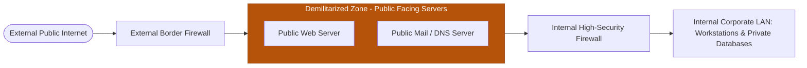

# 6. Information Security & Cyber Threats

---

the gateway relays TCP segments from one connection to the o ther without examining the contents. The security
function determines which connections will be allowed and which are to be disallowed.

Limitations of a Firewall

### Visual Concept: Demilitarized Zone (DMZ) & Dual-Firewall Architecture

Main limitations of a firewall system are given below:

- A firewall cannot protect against an y attacks that bypass the firewall. Many organizations buy
expensive firewalls but neglect numerous other back-doors into their network

- A firewall does not protect against the internal threats from traitors. An attacker may be able to break
into network by completely bypassing the firewall, if he can find a "helpful" insider who can be fooled
into giving access to a modem pool

- Firewalls can't protect against tunneling over most application protocols. For example, firewall cannot
protect against the transfer of virus-infected programs or files

## 7. Proxies

A proxy is a program that receives traffic destined for an other computer. Proxies sometimes require user
authentication; they can verify that the user is allowed to connect to the destination, and then connec t to the
destination service on behalf of the user. When a proxy is used, the connection to the remote mac hine comes from the
machine running the proxy instead of the original machine making the request. Because the proxy generates the
connection to the remote machine, it has no problems determining which connections are real and which are spoofed;
this is in contrast to stateless packet filtering firewalls.

Proxy server is an intermediary server between client and the internet. Proxy servers offers the following
basic functionalities:

- Firewall and network data filtering.

- **Network connection sharing** — Data caching

Proxies appear in firewalls primarily at the T ransport and Application ISO network levels. In the Internet, the
transport level consists of only two protocols, TCP and UDP. This small number of protocols makes writing a proxy
easy—one proxy suffices for all protocols that use TCP. Contrast this with t he application-level proxies (covered
below), where a separate proxy is required for each service, e.g., Telnet, FTP, HTTP, SMTP, etc

Transport-level proxies have the advantage that a machine outside of the firewall cannot send packets through the
firewall which claim to be a part of an established connection. Because the state of the TCP connection is known by
the firewall, only packets that are a legitimate part of a communication are allowed inside the firewall.

Proxies at the application level provide  the benefits of transport -level proxies, and additionally they can enforce the
proper application -level protocol and prevent the abuses of the protocol by either client or server. The result is
excellent security and auditing. Unfortunately, application proxies are not without their drawbacks:

- The proxy must be designed for a specific protocol. New protocols are developed frequently, requiring new
proxies; if there is no proxy, there is no access.

- To use an application proxy, the client program must be ch anged to accommodate the proxy. The client needs to
understand the proxy’s authentication method and it must communicate the actual packet destination to the
proxy. Because source code is not publicly available for some applications, in these cases the required changes can
be made only by the application’s vendor, a significant bottleneck.

- Each packet requires two trips through the complete network protocol stack which adversely affects performance.
This is in contrast to packet filtering, which handles packets at the network layer.

## 8. Antivirus Software

Anti-virus software is a program or set of programs that are designed to prevent, search for, detect, and remove
software viruses, and other malicious softw are like worms, trojans, adware, and more. If a virus infects a computer
without an antivirus program, it may delete files, prevent access to files, send spam, spy on you, or perform other

malicious actions. In some situations, a computer may not meet the requirements of a virus and the computer is only
used to help spread the virus to other computers that may meet the requirements. Thus an antivirus software can be
an effective tool for information and data security.

Regardless of the scope of coverage of various antivirus software, the underlying mechanisms of an antivirus package
remain mostly the same. It actively scans files that are introduced to a system, relying on a method to identify
potentially hazardous files. This is called signature detection.

Basically, antivirus applications maintain a database of known viruses and compare the scanned files to that database
in order to find out whether the characteristics match. If they do, the file is quarantined, which is to say that it is
moved to a new, safe location and renamed, so that it does not affect other files on the system.

In addition to signature detection, antivirus programs also attempt to identify suspicious behaviour on a system. This
ranges from making suspicious registry entries, or addi ng items to a list that executes automatically u pon system
startup. This approach is what helps protect against encrypted viruses, or viruses that are yet to be identified.

## 9. Intrusion Detection System (IDS)

An Intrusion Detection System is used to detect all types of malicious network traffic and computer usage that can't be
detected by a conventional firewall. This includes network attacks against vulnerable services, data driven attacks on
applications, host based attacks such as privilege escalation, un authorized logins and access to sensitive files,  and
malware (viruses, trojan horses, and worms).

An IDS is composed of the following three components:

- Sensors: - which sense the network traffic or system activity and generate events.

- Console: - to monitor events and alerts and control the sensors,

- Detection Engine: - that records events logged by the sensors in a database and uses a system of rules to
generate alerts from the received security events.

There are several ways to categorize an IDS depending  on the type and location of the sensors and the  methodology
used by the engine to generate alerts. In many simple IDS implementations, all three components are combined in a
single device or appliance.

Types of Intrusion-Detection systems

1. Network Intru sion Detection System: - identifies intrusions by examining network traffic and monitors
multiple hosts. Network Intrusion Detection Systems gain access to network traffic by connecting to a hub,
network switch configured for port mirroring, or network tap. An example of a NIDS is Snort.

2. Host-based Intrusion Detection System: - consists of an agent on a host which identifies intrusions by
analysing system calls, application logs, file -system modifications (binaries, password files, databases) and
other host activities and state.

3. Hybrid Intrusion Detection System: - combines one or more approaches. Host agent data is combined with
network information to form a comprehensive view of the network. An example of a Hybrid IDS is Prelude.

## 10. Vulnerability Scanners

A vulnerability scanner differs from an intrusion detection system, as vulnerability looks for static configurations and
the IDS looks for transient misuse or abnormalities. A vulnerability scanner may look for a known NFS vulnerability
by examining the a vailable services and configuration on a remote system. An IDS, handling the same vulnerability,
would only report the existence of the vulnerability when an attacker attempted to exploit it. Vulnerability scanners,
whether network or host scanners, give the organization the opportunity to fix problems before they arise, rather than
reacting to an intrusion or misuse that is already in progress. An intrusion detection system detects intrusions in
progress, while a vulnerability scanner allows the organization to prevent the intrusion in the first place. Vulnerability
scanners may be helpful in organizations without a good incident response capability.

Network Vulnerability Scanner:  A network vulnerability scanner operates remotely by examining the network
interface on a remote sys tem. It will look for vulnerable services running on that remote machine, and report on a
possible vulnerability. Since a network vulnerability scanner can be run from a single machine on the network, it can
be installed without impacting the configuration management of other machines. Frequently, these scanners are used
by auditors and security groups because they can provide an “outsider’s view” of security holes in a computer or
network.

Host Vulnerability Scanner:  A host vulnera bility scanner differs f rom a network vulnerability scanner in that it is
confined entirely to the local operating system. A network vulnerability scanner requires the target machine be
accessible from the network in order for it to operate; a host vulnera bility scanner does not.  Host vulnerability
scanners are software packages that are installed on particular operating systems. Once the software is installed it can
be configured to run at any time of the day or night.


---

## Interactive Practice Quiz Deck

Test your mastery with our complete interactive multiple-choice assessment deck. Select an answer to evaluate your reasoning and reveal detailed explanatory feedback!

```quiz
[
  {
    "question": "Q1. Which of the fol lowing is true about Data encryption?",
    "options": [
      "Data encryption ensures data safety and very important for confidential or critical data.",
      "It protects data from being read, altered or forged while transmission.",
      "It is used to secure the data while transmission of data over network.",
      "None of these",
      "All",
      ",",
      ", and",
      ""
    ],
    "correctIndex": 4,
    "explanation": "2.  (d)"
  },
  {
    "question": "Q2. Which of the following is an antivirus program?",
    "options": [
      "Norton",
      "K7",
      "Quick Heal",
      "All of the above",
      "None of these"
    ],
    "correctIndex": 0,
    "explanation": "Correct answer based on professional knowledge concepts."
  },
  {
    "question": "Q3. Which of the following is a default port number for Apache and most web servers?",
    "options": [
      "20",
      "27",
      "80",
      "87",
      "None of these"
    ],
    "correctIndex": 2,
    "explanation": "4.  (c)"
  },
  {
    "question": "Q4. A hash function guarantees integrity of a message. It guarantees that message has not be?",
    "options": [
      "Replaced",
      "Over view",
      "Changed",
      "Violated",
      "None of these"
    ],
    "correctIndex": 0,
    "explanation": "Correct answer based on professional knowledge concepts."
  },
  {
    "question": "Q5. MAC stands for",
    "options": [
      "Message authentication code",
      "Message arbitrary connection",
      "Message authentication control",
      "Message authentication cipher",
      "Media authentication connection"
    ],
    "correctIndex": 0,
    "explanation": "6.  (a)"
  },
  {
    "question": "Q6. What is the use of Digital Signatures?",
    "options": [
      "It is an attachment to an  electronic message used for security purpose. It is used to verify the authenticity of the sender.",
      "It is not used to verify the authenticity of the sender.",
      "None of these",
      "Both",
      "and",
      "",
      "It is not used for security purpose"
    ],
    "correctIndex": 4,
    "explanation": "Correct answer based on professional knowledge concepts."
  },
  {
    "question": "Q7. A hacke r contacts you my  phone or email and attempts to acquire your password.",
    "options": [
      "Spoofing",
      "Phishing",
      "Spamming",
      "Bugging",
      "None of these"
    ],
    "correctIndex": 1,
    "explanation": "8.  (a)"
  },
  {
    "question": "Q8. Authentication is.",
    "options": [
      "Verification of user identification",
      "Verification of the data",
      "Both",
      "and",
      "",
      "None of the above",
      "Verified the computer information"
    ],
    "correctIndex": 3,
    "explanation": "Correct answer based on professional knowledge concepts."
  },
  {
    "question": "Q9. IPsec is designed to provide the security at the?",
    "options": [
      "Transport layer",
      "Network layer",
      "Application layer",
      "Session layer",
      "None of these"
    ],
    "correctIndex": 1,
    "explanation": "10.  (c)"
  },
  {
    "question": "Q10. WPA2 is used for security in?",
    "options": [
      "Ethernet",
      "Bluetooth",
      "Wi-Fi",
      "None of these",
      "Both",
      "and",
      ""
    ],
    "correctIndex": 5,
    "explanation": "Correct answer based on professional knowledge concepts."
  },
  {
    "question": "Q11. Message must be encrypted at sender site and decrypted at the?",
    "options": [
      "Sender Site",
      "Site",
      "Receiver site",
      "Conferencing",
      "None of these"
    ],
    "correctIndex": 2,
    "explanation": "12.  (a)"
  },
  {
    "question": "Q12. In tunnel mode IPsec protects the",
    "options": [
      "Entire IP packet",
      "IP header",
      "IP payload",
      "None of these",
      "Both",
      "and",
      ""
    ],
    "correctIndex": 5,
    "explanation": "Correct answer based on professional knowledge concepts."
  },
  {
    "question": "Q13. Which of the following are possible sizes of MACs? (i) 12 Bytes   (ii) 16 Bytes (iii) 20 Bytes   (iv) 24 Bytes",
    "options": [
      "i and iii",
      "ii only",
      "ii and iii",
      "ii iii and iv",
      "i only"
    ],
    "correctIndex": 2,
    "explanation": "MACs can be 0, 16 or 20 Bytes."
  },
  {
    "question": "Q14. Frequency band definition and Wireless signal encoding are functions of which layer?",
    "options": [
      "Physical Layer",
      "Logic Link Control Layer",
      "Medium Access Layer",
      "None of these",
      "Both",
      "and",
      ""
    ],
    "correctIndex": 5,
    "explanation": "15.  (d)"
  },
  {
    "question": "Q15. ___________ services are used to control IEEE 302.11 LAN access and confidentiality.",
    "options": [
      "4",
      "5",
      "2",
      "3",
      "8"
    ],
    "correctIndex": 0,
    "explanation": "Correct answer based on professional knowledge concepts."
  },
  {
    "question": "Q16. …………… is to protect data and passwords.",
    "options": [
      "Encryption",
      "Authentication",
      "Authorization",
      "Non-repudiation",
      "None of these"
    ],
    "correctIndex": 0,
    "explanation": "17.  (c)"
  },
  {
    "question": "Q17. What do you understand by spyware?",
    "options": [
      "It is software that is installed without your permission.",
      "It affect a computer’s  performance by installing additional software, changing computer settings, changing the homepage or even completely disrupting network connection ability.",
      "Both",
      "and",
      "",
      "None of these",
      "Spyware is antivirus"
    ],
    "correctIndex": 3,
    "explanation": "Correct answer based on professional knowledge concepts."
  },
  {
    "question": "Q18. Which of the following is true about SID?",
    "options": [
      "SID stands for security identifier.",
      "It is used to uniquely identify a user or a group",
      "SID stands for symmetric identifier",
      "Both",
      "and",
      "",
      "None of these"
    ],
    "correctIndex": 3,
    "explanation": "19.  (d)"
  },
  {
    "question": "Q19. What is Trojan horse?",
    "options": [
      "It is an Antivirus",
      "It is any  malicious computer program which misleads users of its true intent.",
      "Trojans may allow an attacker to access users' personal information such as banking information, passwords, or personal identity (IP address).",
      "Both",
      "and",
      "",
      "None of these"
    ],
    "correctIndex": 0,
    "explanation": "Correct answer based on professional knowledge concepts."
  },
  {
    "question": "Q20. Define confidentiality and authentication Confidentiality:",
    "options": [
      "It means how to maintain the secrecy of message. It ensures that the information in a computer system and transmitted information are accessible only for reading by authorized person.",
      "It doesn’t maintain the secrecy of the message.",
      "It doesn’t ensure that the information in a computer system and transmitted information are accessible only for reading by authorized person.",
      "Both",
      "and",
      "",
      "None of these"
    ],
    "correctIndex": 4,
    "explanation": "21.  (b)"
  },
  {
    "question": "Q21. A proxy firewall filters at the…",
    "options": [
      "Physical layer",
      "Application layer",
      "Data link layer",
      "Network layer",
      "None of these"
    ],
    "correctIndex": 0,
    "explanation": "Correct answer based on professional knowledge concepts."
  },
  {
    "question": "Q22. A sender must not be able to deny sending a message that was sent, is known as",
    "options": [
      "Message Non-repudiation",
      "Message Integrity",
      "Message Confidentiality",
      "Message Sending",
      "None of these"
    ],
    "correctIndex": 0,
    "explanation": "23.  (a)"
  },
  {
    "question": "Q23. In tunnel mode IPsec protects the",
    "options": [
      "Entire IP packet",
      "IP header",
      "IP payload",
      "None of these",
      "Both",
      "and",
      ""
    ],
    "correctIndex": 5,
    "explanation": "Correct answer based on professional knowledge concepts."
  },
  {
    "question": "Q24. Network layer firewall works as a",
    "options": [
      "Frame filter",
      "Packet filter",
      "Both",
      "and",
      "",
      "None of these",
      "Bit filter"
    ],
    "correctIndex": 4,
    "explanation": "25.  (a)"
  },
  {
    "question": "Q25. Network layer firewall has two sub-categories as",
    "options": [
      "Stateful firewall and stateless firewall",
      "Bit oriented firewall and byte oriented firewall",
      "Frame firewall and packet firewall",
      "None of these",
      "Both",
      "and",
      ""
    ],
    "correctIndex": 5,
    "explanation": "Correct answer based on professional knowledge concepts."
  },
  {
    "question": "Q26. Frame relay has error detection at the",
    "options": [
      "Physical layer",
      "Data link layer",
      "Network layer",
      "Transport layer",
      "None of these"
    ],
    "correctIndex": 1,
    "explanation": "27.  (a)"
  },
  {
    "question": "Q27. PGP encrypts data by using a block cipher called",
    "options": [
      "International data encryption algorithm",
      "Private data encryption algorithm",
      "Internet data encryption algorithm",
      "None of these",
      "Intranet data encryption algorithm"
    ],
    "correctIndex": 0,
    "explanation": "Correct answer based on professional knowledge concepts."
  },
  {
    "question": "Q28. When a DNS server accepts and uses incorrect information from a host that has no authority giving that information, then it is called",
    "options": [
      "DNS lookup",
      "DNS hijacking",
      "DNS spoofing",
      "None of these",
      "Both",
      "and",
      ""
    ],
    "correctIndex": 6,
    "explanation": "29.  (d)"
  },
  {
    "question": "Q29. Which protocol consists of only 1 bit?",
    "options": [
      "Alert Protocol",
      "Handshake Protocol",
      "Upper-Layer Protocol",
      "Change Cipher Spec Protocol",
      "None of these"
    ],
    "correctIndex": 0,
    "explanation": "Correct answer based on professional knowledge concepts."
  },
  {
    "question": "Q30. The correct order of the of the MAC header is-",
    "options": [
      "MAC Control, Destination MAC Address, Source MAC Address",
      "Destination MAC Address, Source MAC Address, MAC Control",
      "Source MAC Address, Destination MAC Address, MAC Control",
      "None of these",
      "Source MAC Address, MAC Control, Destination MAC Address."
    ],
    "correctIndex": 0,
    "explanation": "The correct order of ar rangement is MAC Control, Destination MAC Address, Source MAC Address."
  },
  {
    "question": "Q31. A hash function guarantees integrity of a message. It guarantees that message has not be",
    "options": [
      "Replaced",
      "Over view",
      "Changed",
      "Violated",
      "None of these"
    ],
    "correctIndex": 2,
    "explanation": "32.  (a)"
  },
  {
    "question": "Q32. In ………………. Mode, the authentication header is inserted immediately after the IP header.",
    "options": [
      "Tunnel",
      "Transport",
      "Authentication",
      "Both A and B",
      "None of these"
    ],
    "correctIndex": 0,
    "explanation": "Correct answer based on professional knowledge concepts."
  },
  {
    "question": "Q33. Which of the following is true regarding boot sector virus?",
    "options": [
      "A boot sector virus usually infects the computer by altering the boot sector program.",
      "A boot sector virus is able to infect a computer only if the virus is used to boot up the computer.",
      "A boot sector virus is malware that infects the computer sto rage sector where startup files are found.",
      "None of these",
      "All",
      ",",
      ",and",
      ""
    ],
    "correctIndex": 4,
    "explanation": "34.  (a)"
  },
  {
    "question": "Q34. One of protocols to provide security at application layer is",
    "options": [
      "Pretty Good Privacy",
      "Handshake Protocol",
      "Alert Protocol",
      "Record Protocol",
      "None of these"
    ],
    "correctIndex": 0,
    "explanation": "Correct answer based on professional knowledge concepts."
  },
  {
    "question": "Q35. MAC address also known as.",
    "options": [
      "Hardware address",
      "Physical address",
      "Both",
      "and",
      "",
      "IP address",
      "None of these"
    ],
    "correctIndex": 2,
    "explanation": "36.  (a)"
  },
  {
    "question": "Q36. What do you understand by VPN?",
    "options": [
      "V PN means Virtual Private Network, a technology that allows a secure tunnel to be crea ted across a network such as the Internet.",
      "VPN means Virtual Public Network.",
      "It is a technology that allows a non- secure tunnel to be created across a network such as the Internet.",
      "None of these",
      "Both",
      "and",
      ""
    ],
    "correctIndex": 5,
    "explanation": "Correct answer based on professional knowledge concepts."
  },
  {
    "question": "Q37. What do you underst and by proxy servers and how do they protect computer networks?",
    "options": [
      "Proxy servers primarily prevent external users who identifying the IP addresses of an internal network. Without knowledge of the correct IP address, even the physical location of the netw ork cannot be identified.",
      "Proxy servers can make a network virtually invisible to external users.",
      "Either",
      "and",
      "",
      "Both",
      "and",
      "",
      "None of these"
    ],
    "correctIndex": 5,
    "explanation": "38.  (e)"
  },
  {
    "question": "Q38. Which of the following is a function of a network administrator?",
    "options": [
      "Installation of a network,",
      "Configuration of network settings,",
      "Maintenance/troubleshooting of networks.",
      "None of these",
      "All",
      ",",
      ", and",
      "are functions of network administrator"
    ],
    "correctIndex": 5,
    "explanation": "Correct answer based on professional knowledge concepts."
  },
  {
    "question": "Q39. Which of the following in not true about DHCP?",
    "options": [
      "DHCP is sho rt for Dynamic Host Configuration Protocol.",
      "DHCP doesn’t as sign automatically an IP address to devices across the network.",
      "DHCP first checks for the next available address not yet taken by any device, then assigns this to a network device.",
      "Both",
      "and",
      "",
      "None of these"
    ],
    "correctIndex": 5,
    "explanation": "40.  (a)"
  },
  {
    "question": "Q40. What do you understand by Malware?",
    "options": [
      "It is, short for malicious software, is an umbrella term used to refer to a variety of forms of hostile or intrusive software, including computer viruses, worms, etc.",
      "It is, short for malicious software, is an umbrella term used to ref er to a variety of forms of hostile or intrusive software, but doesn’t include computer viruses, worms, etc.",
      "It is not malicious software, is an umbrella term used to refer to a variety of forms of hostile or intrusive software, but doesn’t include computer viruses, worms, etc.",
      "None of these",
      "Both",
      "and",
      ""
    ],
    "correctIndex": 5,
    "explanation": "Correct answer based on professional knowledge concepts."
  },
  {
    "question": "Q41. Which one of the following is not a higher –layer SSL protocol?",
    "options": [
      "Alert Protocol",
      "Handshake Protocol",
      "Alarm Protocol",
      "Change Cipher Spec Protocol",
      "None of these"
    ],
    "correctIndex": 2,
    "explanation": "Three higher –layer protocols are defined as part of SSL: The Handshake Protocol, The Change Cipher Spec Protocol and The Alert Protocol."
  },
  {
    "question": "Q42. Which one of the following is not a session state parameter?",
    "options": [
      "Master Secret",
      "Cipher Spec",
      "Peer Certificate",
      "Server Write Key",
      "None of these"
    ],
    "correctIndex": 3,
    "explanation": "Session state is defined by the following parameters – Session identifier, Peer certificate, Compression method, Cipher spec, Master secret, Is resumable. Server Write Key falls under Connectio n State."
  },
  {
    "question": "Q43. Which protocol is used to c onvey SSL related alerts to the peer entity?",
    "options": [
      "Alert Protocol",
      "Handshake Protocol",
      "Upper-Layer Protocol",
      "Change Cipher Spec Protocol",
      "None of these"
    ],
    "correctIndex": 0,
    "explanation": "44.  (a)"
  },
  {
    "question": "Q44. What is the error (if any) in the following representation – 111.56.045.78?",
    "options": [
      "There should be no leading zeros",
      "We cannot have more than 4 bytes in an IPv4 address",
      "Each byte should be less than or equal to 255",
      "No error",
      "None of these"
    ],
    "correctIndex": 0,
    "explanation": "Correct answer based on professional knowledge concepts."
  },
  {
    "question": "Q45. What is the error (if any) in the following representation – 221.34.7.8.20?",
    "options": [
      "There should be no leading zeros",
      "Each byte should be less than or equal to 255",
      "We cannot have more than 4 bytes in an IPv4 address",
      "No error",
      "None of these"
    ],
    "correctIndex": 2,
    "explanation": "We cannot have more than 4 bytes in an IPv4 address."
  },
  {
    "question": "Q46. The components of IP security includes  ………………….",
    "options": [
      "Authentication Header (AH)",
      "Encapsulating Security Payload (ESP)",
      "Internet key Exchange (IKE)",
      "All of the above",
      "None of these"
    ],
    "correctIndex": 3,
    "explanation": "47.  (c)"
  },
  {
    "question": "Q47. State true or false. (i) Socks are a standard for circuit level gateways. (ii) The NAT is used for small number of the hosts in a private network.",
    "options": [
      "True, False",
      "False, True",
      "True, True",
      "False, False",
      "None of these"
    ],
    "correctIndex": 0,
    "explanation": "Correct answer based on professional knowledge concepts."
  },
  {
    "question": "Q48. A ………………. is an extension of an enterprise’s private intranet across a public Network such as the Internet across a public Network such as the Internet, creating a secure private connection.",
    "options": [
      "VNP",
      "VPN",
      "VSN",
      "VSPN",
      "None of these"
    ],
    "correctIndex": 1,
    "explanation": "49.  (e)"
  },
  {
    "question": "Q49. Which of the following is true with respect to CryptoAPI?",
    "options": [
      "It is a set of encryption APIs.",
      "It allows developer to develop applications that work securely over non secure networks.",
      "None of these",
      "The Cryptography API has not a number of significant uses within the Enterprise Computing Model.",
      "Both",
      "and",
      ""
    ],
    "correctIndex": 5,
    "explanation": "Correct answer based on professional knowledge concepts."
  },
  {
    "question": "Q50. Which Feature on a network switch can be used to prevent rogue DHCP Servers?",
    "options": [
      "DHCP Snooping",
      "DHCP Spoofing",
      "DHCP fishing",
      "None of these",
      "Both",
      "and",
      ""
    ],
    "correctIndex": 5,
    "explanation": "51.  (b)"
  },
  {
    "question": "Q51. Which of the following is true when describing a multicast address?",
    "options": [
      "Packets addressed to a unicast address are delivered to a single interface.",
      "Packets are delivered to  all interfaces identified by the addres s. This is also called a one -to-many address.",
      "Identifies multiple interfaces and is only delivered to one address. This address can also be called one-to-one-of-many.",
      "These addresses are meant for non -routing purposes, but they are almost globally unique so it is unlikely they will have an address overlap.",
      "None of these"
    ],
    "correctIndex": 0,
    "explanation": "Correct answer based on professional knowledge concepts."
  },
  {
    "question": "Q52. Which statement(s) about IPv6 addresses are true? (1) Leading zeros are required. (2) Two colons are used to represent successive hexadecimal fields of zeros. (3) Two colons are used to separate fields. (4) A single interface will have multiple IPv6 addresses of different types.",
    "options": [
      "1 and 3",
      "2 and 4",
      "1, 3 and 4",
      "All of the above",
      "None of these"
    ],
    "correctIndex": 1,
    "explanation": "53.  (a)"
  },
  {
    "question": "Q53. How Can You Prevent A B rute Force Attack On A Windows Login Page?",
    "options": [
      "Setup an account lockout for specific number of attempts, so that the user account would be locked up automatically after the specified number.",
      "There is no need to prevent a Brute Force Attack on a window login page.",
      "Both",
      "and",
      "",
      "None of these",
      "By using only firewall"
    ],
    "correctIndex": 3,
    "explanation": "Correct answer based on professional knowledge concepts."
  },
  {
    "question": "Q54. What is true regarding SRM?",
    "options": [
      "The SRM is abbreviation Security Reference Monitor",
      "It is the kernel mode component that does the actual access validation, as well as audit generation.",
      "Either",
      "or",
      "",
      "None of these",
      "Both",
      "and",
      ""
    ],
    "correctIndex": 6,
    "explanation": "55.  (a); NIPS stands for network intrusion protection system."
  },
  {
    "question": "Q55. ……………. Work To Protect The Entire Network And All Devices That Are Connected To It?",
    "options": [
      "NIPS",
      "NAPS",
      "NICS",
      "NIC",
      "None of these"
    ],
    "correctIndex": 0,
    "explanation": "Correct answer based on professional knowledge concepts."
  },
  {
    "question": "Q56. An Attacker could alter the Mac Address in the ARP Cache so that the corresponding IP address would point to a different computer, which is known as ____?",
    "options": [
      "ARP poisoning.",
      "ARP addressing",
      "DHCP spoofing",
      "None of these",
      "Both",
      "and",
      ""
    ],
    "correctIndex": 5,
    "explanation": "57.  (b)"
  },
  {
    "question": "Q57. In order to a void detection some Viruses ca n alter how they appear. These are known as ____ Viruses?",
    "options": [
      "Trojan",
      "Metamorphic",
      "Antivirus",
      "None of these",
      "Both",
      "and",
      ""
    ],
    "correctIndex": 5,
    "explanation": "Correct answer based on professional knowledge concepts."
  },
  {
    "question": "Q58. How do you remove Network Security keys?",
    "options": [
      "Go to your router options on your  computer and it should say remove.",
      "Go to control panel and uninstall it.",
      "Either",
      "or",
      "",
      "None of these",
      "Go to computer properties and remove it."
    ],
    "correctIndex": 3,
    "explanation": "59.  (b)"
  },
  {
    "question": "Q59. What do you understand by IP Grabber?",
    "options": [
      "An IP grabber is a program that is used t o assign IP address of computer.",
      "An IP grabber is a program that will find the IP address of another computer. Often used by hackers.",
      "Both",
      "and",
      "",
      "None of these",
      "It is used to assign MAC address"
    ],
    "correctIndex": 3,
    "explanation": "Correct answer based on professional knowledge concepts."
  },
  {
    "question": "Q60. A ____ Virus can interrupt almos t any function executed by the  computer Operating System and alter it for its own malicious purposes?",
    "options": [
      "Worm",
      "Boot sector",
      "Resident",
      "None of these",
      "Trojan horse"
    ],
    "correctIndex": 2,
    "explanation": "7 Web Technology  1. Introduction  The Internet started as early as in the 1950s where the US defense organization ARPA, it stands for Advanced Research Projects Agency. This started to network a number of computers that are funded by the in a very small way. So, a few computers which are l ocated in different paths of the country where provided with some sort of connectivity. So that they can communicate among themselves, now subsequently while it continued for some time like this in 1970s and beyond this ARPA. ARPA became to know as ARPA network advanced research project agency network. So, ARPANET started to create a standard which is basically the predecessor to the TCP standard that we have today. So, it was a preliminary protocol which through subsequent refinements and modification became finally the TCP as we see today. In 1971 the universities were added to the network, the main purpose was that many of the defense funded research used to take place in the universities and ARPA NET felt universities should be part of the network. And some basic internet services like telnet and FTP were made available. Now these you will be studying later in more detail. Now using telnet you can start remote session on a different computer sittin g on your own computer. And using FTP File Transfer Protoco l. You can transfer a file or a group of files between two machines. These were the basic facilities which were provided at that time for communicating between machines. In 1972 the first version o f electronic mail came into you can say being coming to be first email message was sent during that time.  What is Internet?  Internet can be defined as the network which is formed by the co -operative interconnection of a large number of computer networks.  Now since internet is formed by the interconnection of a number of computer networks, sometimes it is also known as a network of networks. Now here there are a few interesting things that work with internet. The first and foremost is that there is no single owner of the internet. Now just unlike a network that you can see in your organization, may be your organization owns the n etwork. In contrast internet, you cannot identify a single owner who owns or who administrates or manages the whole network. Suppo se you are a member of the internet group which means you are computer is also connected to the internet it is as simple as dial up telephone line from your residence. Now in that case you are also a part of the internet.  2. Scripting and Markup Languages  A markup language is a formal way of annotating a document or collection of digital data using embedded encoding tags to indicate the structure of the document or data file, and the contents of its data elements. This markup provides a computer with informa tion about how to process and display marked -up documents. Example: SGML, XML, HTML.  Scripting is the action of writing scrip ts using a scripting language, distinguishing neatly between programs, which are written in conventional programming language such  as C, C++, java, and scripts, which are written using a different kind of language. Scripting is used as a new style of progr amming which allows applications to be developed much faster than traditional methods allow, and makes it possible for application s to evolve rapidly to meet changing user requirements. This style of programming frequently uses a scripting language to interconnect ‘off the shelf ‘components that are themselves written in conventional language. Applications built in this way are calle d ‘glue applications’, and the language is called a ‘glue language’.  3. HTML  What is HTML? Web Pages are written in HTML. HTML is short for Hypertext Markup Language. • Hypertext is simply a piece of text that works as a link. • Markup Language is a way of writing layout information within documents.  Basically, an HTML document is a plain text file that contains text and nothing else. When a browser opens an HTML file, the browser will look for HTML codes in the text and use them to change the layout, insert images, or create links to other pages. Since HTML documents are just text files they can be written in even the simplest text editor. A more popular choice is to use a special HTML editor - maybe even one that puts focus on the visual result rather than the codes - a so-called WYSIWYG editor (\"What You See Is What You Get\"). Some of the most popular HTML editors, such as FrontPage or Dream weaver will let you create pages more or less as you write documents in Word or whatever text editor you're using.  3.1 Understanding TAGS  Basically, a computer sees an \"A\" as simply an \"A\" - whether it is bold, italic, big or small. To tell the browser that an \"A\" should be bold we need to put a markup in front of the A. Such a markup is called a Tag. All HTML tags are enclosed in < and >. Example: a piece of text as it appears on the screen. This is an example of bold text. HTML: the HTML for the above example: This is an example of <b>bold</b> text. As you can see, the start tag <b> indicates that whatever follows should be written in bold. The corresponding end tag </b> indicates that the browser should stop writing text in bold.  3.2 PAGE STRUCTURE  All normal webpages consist of a head and a body. * Head (The head is used for text and tags that do not show directly on the page.) * Body (The body is used for text and tags that are shown directly on the page.) Finally, all webpages have an <html> tag at the beginning and the end, telling the browser where the document starts and where it stops.  The most basic code - the code you will use for any page you make, is shown below: <html> <head> <!-- This section is for the title and technical info of the page. --> </head> <body> <!-- This section is for all that you want to show on the page. --> </body> </html>  HEAD SECTION The head section of the webpage includes all the stuff that does not show directly on the resulting page. The <title> and </title> tags encapsulate the title of your page. The title is what shows in the top of your browser window when the page is loaded.  Right now it should say somethin g like \"Basics - Html Tutorial\" on top of the window containing this text. Another thing you will often see in the head section is metatags. Metatags are used for, among other things, to improve the rankings in search engin es. Quite often the head section contains javascript which is a programming language for more complex HTML pages. Finally, more and more pages contain codes for cascading style sheets (CSS). CSS is a rather new technique for optimizing the layout of major websites. Since these aspects are way out of reach at this stage we will proceed with explaining the body section.  BODY SECTION The body of the document contains all that can be seen when the user loads the page. * Text • Formatting • Resizing • Layout  • Listing * Links • To local pages • To pages at other sites • To bookmarks * Images • Inserting images (GIF and jpg) • Adding a link to an image * Backgrounds • Colors • Images • Fixed Image * Tables * Frames * Forms * Metatags * Hexadecimal Colors  3.3 HTML Links  How to create links in an HTML document. Example: <html> <body> <p><a href=\"newpage.html\">This text</a> is a link to a page on this Web site.</p> </body> </html>  Open a link in a new browser window (how to link to another page by opening a new window.) Example: <html> <body> <p><a href=\"newpage.html\" target=\"_blank\">Last Page</a> This text is a link to a page on this Web site.</p> </body> </html>  An image as a link ( how to use an image as a link. ) Example: <html> <body> <p><a href=\"page.htm\"> </a> This text is a link to a page on this Web site.</p> </body> </html> Link to a location on the same page (how to use a link to jump to another part of a document.) Example: <html> <body> <p><a href=\"#C4\">See also Chapter 4.</a></p> <h2>Chapter 1</h2> <p>This chapter explains ba bla bla</p> <h2>Chapter 2</h2> <p>This chapter explains ba bla bla</p> <h2>Chapter 3</h2> <p>This chapter explains ba bla bla</p> <h2><a name=\"C4\">Chapter 4</a></h2> <p>This chapter explains ba bla bla</p> <h2>Chapter 5</h2>  <p>This chapter explains ba bla bla</p> <h2>Chapter 6</h2> <p>This chapter explains ba bla bla</p> <h2>Chapter 7</h2> <p>This chapter explains ba bla bla</p> <h2>Chapter 8</h2> <p>This chapter explains ba bla bla</p> <h2>Chapter 9</h2> <p>This chapter explains ba bla bla</p> <h2>Chapter 10</h2> <p>This chapter explains ba bla bla</p> <h2>Chapter 11</h2> <p>This chapter explains ba bla bla</p> <h2>Chapter 12</h2> <p>This chapter explains ba bla bla</p> <h2>Chapter 13</h2> <p>This chapter explains ba bla bla</p> <h2>Chapter 14</h2> <p>This chapter explains ba bla bla</p> <h2>Chapter 15</h2> <p>This chapter explains ba bla bla</p> <h2>Chapter 16</h2> <p>This chapter explains ba bla bla</p> <h2>Chapter 17</h2> <p>This chapter explains ba bla bla</p> </body> </html>  Create a mailto link (how to link to a mail) Example: <html> <body> <p>This is a mail link: <a href=\"mailto:someone@microsoft.com?subject=Hello%20again\"> Send Mail</a></p> </body> </html>  3.4 Tables  Tables are defined with the <table> tag. A table is divided into rows (with the <tr> tag), and each row is divided into data cells (with the <td> tag). The letters td stands for \"table data,\" which is the content of a data cell. A data cell can contain text, images, lists, paragraphs, forms, horizontal rules, tables, etc. <table border=\"1\"> <tr> <td>row 1, cell 1</td> <td>row 1, cell 2</td> </tr> <tr> <td>row 2, cell 1</td> <td>row 2, cell 2</td> </tr> </table>  Image Tag (and the Src Attribute) In HTML, images are defined wi th the  tag.  The  tag is empty, which means that it contains attributes only and it has no closing tag. To display an image on a page, you need to use the src attribute. Src stands for \"source\". The value of the src attribute is the URL of the image you want to display on your page.  The syntax of defining an image:   3.5 HTML Lists 1) Unordered list 2) Ordered list Unordered Lists An unordered list is a list of items. The list items are marked with bullets (typically small black circles). An unordered list starts with the <ul> tag. Each list item starts with the <li> tag. <ul> <li>Coffee</li> <li>Milk</li> </ul> Here is how it looks in a browser: * Coffee * Milk Inside a list item you can put paragraphs, line breaks, images, links, other lists, etc.  Ordered Lists An ordered list is also a list of items. The list items are marked with numbers. An ordered list starts with the <ol> tag. Each list item starts with the <li> tag. <ol> <li>Coffee</li> <li>Milk</li> </ol> Here is how it looks in a browser: 1. Coffee 2. Milk Inside a list item you can put paragraphs, line breaks, images, links, other lists, etc.  3.6 Frames With frames, you can display more than one HTML document in the same browser window. Each HTML document is called a frame, and each frame is independent of the others. The disadvantages of using frames are: • The web developer must keep track of more HTML documents • It is difficult to print the entire page  The Frameset Tag The <frameset> tag defines how to divide the window  into frames. Each frameset defines a set of rows or columns. The values of the rows/columns indicate the amount of screen area each row/column will occupy Vertical frameset (This example demonstrates how to make a vertical frameset with three different documents.) <html> <frameset cols=\"25%,50%,25%\"> <frame src=\"frame_a.htm\"> <frame src=\"frame_b.htm\"> <frame src=\"frame_c.htm\"> </frameset> </html> Horizontal frameset (This example demonstrates how to make a horizontal frameset with three different documents.) <html> <frameset rows=\"25%,50%,25%\"> <frame src=\"frame_a.htm\"> <frame src=\"frame_b.html\"> <frame src=\"frame_c.html\"> </frameset> </html>  3.7 Other HTML Tags <!DOCTYPE> Defines the document type  <html> Defines an html document <body> Defines the body element <h1> to <h6> Defines header 1 to header 6 <p> Defines a paragraph <br> Inserts a single line break <hr> Defines a horizontal rule <!--...--> Defines a comment  Text Formatting Tags <b> Defines bold text <b> Defines bold text <font> Deprecated. Defines text font, size, and color <i> Defines italic text <em> Defines emphasized text <big> Defines big text <strong> Defines strong text <small> Defines small text <sup> Defines superscripted text <sub> Defines subscripted text <bdo> Defines the direction of text display <u> Deprecated. Defines underlined text  Output <pre> Defines preformatted text <code> Defines computer code text <tt> Defines teletype text <kbd> Defines keyboard text <var> Defines a variable <dfn> Defines a definition term <samp> Defines sample computer code <xmp> Deprecated. Defines preformatted  Blocks <acronym> Defines an acronym <abbr> Defines an abbreviation <address> Defines an address element <blockquote> Defines a long quotation <center> Deprecated. Defines centered text <q> Defines a short quotation <cite> Defines a citation <ins> Defines inserted text <del> Defines deleted text <s> Deprecated. Defines strikethrough text <strike> Deprecated. Defines strikethrough text  Links <a> Defines an anchor <link> Defines a resource reference  Frames <frame> Defines a sub window (a frame) <frameset> Defines a set of frames <noframes> Defines a noframe section <iframe> Defines an inline sub window (frame) Input <form> Defines a form <input> Defines an input field <textarea> Defines a text area  <button> Defines a push button <select> Defines a selectable list <optgroup> Defines an option group <option> Defines an item in a list box <label> Defines a label for a form control <fieldset> Defines a fieldset <legend> Defines a title in a fieldset <isindex> Deprecated. Defines a single-line input field  Lists <ul> Defines an unordered list <ol> Defines an ordered list <li> Defines a list item <dir> Deprecated. Defines a directory list <dl> Defines a definition list <dt> Defines a definition term <dd> Defines a definition description <menu> Deprecated. Defines a menu list  Images  Defines an image <map> Defines an image map <area> Defines an area inside an image map  Tables <table> Defines a table <caption> Defines a table caption <th> Defines a table header <tr> Defines a table row <td> Defines a table cell <thead> Defines a table header <tbody> Defines a table body <tfoot> Defines a table footer <col> Defines attributes for table columns <colgroup> Defines groups of table columns  Styles <style> Defines a style definition <div> Defines a section in a document <span> Defines a section in a document  Meta Info <head> Defines information about the document <title> Defines the document title <meta> Defines meta information <base> Defines a base URL for all the links in a page <basefont> Deprecated. Defines a base font  Programming <script> Defines a script <noscript> Defines a noscript section <applet> Deprecated. Defines an applet <object> Defines an embedded object <param> Defines a parameter for an object  3.8 Forms Usually the information supplied by the QUERY_STRING variable should come from the user pressing buttons and entering text in th e HTML document. It is this information we would like to package up and send to the CGI script. Each group of buttons and text boxes is called a form, and forms are enclosed between the HTML tags <form> ...  </form>. You also have to tell it the URL to send  the information to, and how the information is sent. The result is something like this: <form action=\"http://www.comp.leeds.ac.uk/sam-cgi/answerme\" method=\"GET\"> Some text in here. It can anything except another form. </form>  The action tag is the URL of  the CGI script. The method GET tells it to use the QUERY_STRING method of sending information. As indicated, almos t anything can go between the form tags, including text and various types of input devices. In particular we can have...  Submit buttons A submit button is the input device that actually calls the URL. It has a value which is the message that appears on the button. Here is the code for a form with just a submit button in it. When you click on the submit button the URL specified in the form's action is called. <form action=\"http://www.comp.leeds.ac.uk/cgi-bin/Perl/environment-example\" method=\"GET\"> <input type=\"submit\" value=\"Click me\"> </form> The result is a form which looks like this. Click me If you click the submit button then th e URL will be called. However the QUERY_STRING variable will be null because no information was specified. The answer is to use...  Checkboxes A checkbox is a simple on/off button. A checkbox has a name (its key) and a value that this key has when the box is checked. As an example, here is the HTML code for a form with a checkbox and a submit button in it. <form action=\"http://www.comp.leeds.ac.uk/cgi-bin/Perl/environment-example\" method=\"GET\"> <input type=\"checkbox\" name=\"lights\" value=\"on\"> <input type=\"submit\" value=\"Do it\"> </form> The result of this code is the following form Do it Now if the submit button is clicked when the  box is checked then the information lights=on is packaged into QUERY_STRING. However if the box is not checked then no informatio n is packaged into QUERY_STRING and it remains empty. Notice also that the checkbox does not appear with a message. This is so mething you have to add yourself as ordinary HTML text. Here is example HTML code for a form with two checkboxes and a message for each. <form action=\"http://www.comp.leeds.ac.uk/cgi-bin/Perl/environment-example\" method=\"GET\"> <input type=\"checkbox\" name=\"lights\" value=\"on\"> Lights <input type=\"checkbox\" name=\"camera\" value=\"on\"> Camera <input type=\"submit\" value=\"Do it\"> </form> The result of this code is the following form Lights Camera Do it Click the submit button with various combinations of checked bo xes and watch how the QUERY_STRING environment variable changes. If both boxes are checked then the names are separated by an & sign, as we saw earlier.  Radio buttons Radio buttons are just like checkboxes except they are grouped together and only one but ton in the group may be selected at a time. All the buttons in a group must have the same name and each one should have  a different value. You can also specify which buttons (if any) are checked initially. When the submit button is clicked the name and the value of the selected button are packaged up for QUERY_STRING.  Here is some example code for five such buttons. They a re all of type radio, and are in the group named cert. The 15 button is checked initially. <form action=\"http://www.comp.leeds.ac.uk/cgi-bin/Perl/environment-example\" method=\"GET\"> <input type=\"radio\" name=\"cert\" value=\"u\"> U <input type=\"radio\" name=\"cert\" value=\"pg\"> PG <input type=\"radio\" name=\"cert\" value=\"12\"> 12 <input type=\"radio\" name=\"cert\" value=\"15\" checked> 15 <input type=\"radio\" name=\"cert\" value=\"18\"> 18 <input type=\"submit\" value=\"Certify\"> </form> The result of this HTML code is the following form. U PG 12 15 18 Certify Again, try this out for yourself and watch QUERY_STRING change. Notice that the value of cert for the U an d PG buttons are in lowercase because this is what we specified with the value tag.  Text boxes Finally we deal with text input devices. These are simply boxes into which the user can enter some text which is then packaged up under a particular name. Here is some example code for two text boxes and a submit button. The <br> tag causes a line break. <form action=\"http://www.comp.leeds.ac.uk/cgi-bin/Perl/environment-example\" method=\"GET\"> Director: <input type=\"text\" name=\"dir\"> <br> Producer: <input type=\"text\" name=\"prod\"> <input type=\"submit\" value=\"Fire\"> </form> The result is the following form Director: Producer: Fire Recall that spaces are encoded as + signs and some other characters are encoded in their hexadecimal form. Try entering signs like &, + and % in particular.  Text areas and the POST method As well as allowing single-line text boxes, forms also allow multiline text areas. A text area does not use the input tag; it is a pair <textarea> ... </textarea> in its own right, with the default contents going between the two tags. A text area must still have a name, but we can also specify how many rows and columns it has. Here is the HTML code for a 40 by 4 text box with some initial default text. <form action=\"http://www.comp.leeds.ac.uk/cgi-bin/Perl/environment-example\" method=\"GET\"> <textarea name=\"review\" cols=40 rows=4>I urge you to see it. </textarea> <input type=\"submit\" value=\"Publish\"> </form> This looks like I urge you to see it. Publish When the submit button is clicked the contents of the e ntire text box is packaged up and sent as the query string. It is at this point that things can s tart to go wrong. The information to the query string is sent as part of the URL, but the URL can often only be so many characters long (about two hundred) bef ore the HTTP server chokes on information overload. This isn't very likely with the examples we'v e seen before now, but text areas can contain potentially unlimited amounts of text and so it starts to be a danger. The solution is to use another method to send the data.  The POST method Until now we've been using the GET method to send information to the HTTP server. The GET method is the method of packaging the information into the URL and then passing it to the CGI script as the QUERY_STRING environment variable. A generally more reliable method is the POST method. This packages the information in exa ctly the same  way, but instead of sending it as a text string after a ? in the URL it sends it as a separate message. This message comes into the CGI script in the form of the standard input. Once again these details needn't bother us, though, because the & read input subroutine is designed to cope with this. All we need to worry about is setting the form's method to POST, and then everything else stays the same . The resultant HTML code should look like this <form action=\"http://www.comp.leeds.ac.uk/cgi-bin/Perl/environment-example\" method=\"POST\"> <textarea name=\"review\" cols=40 rows=4>I urge you to see it. </textarea> <input type=\"submit\" value=\"Publish\"> </form>  Notice that only the method has changed from GET to POST. Everything else remains the same. Now when the URL is accessed the query string should be empty because the information is no longer sent that way. Try it: I urge you to see it. Publish The way to access the information is to write a CGI script which uses the &read_input subroutine. The script in webm/WWW/Perl/Source/ta-example is one such. Here is the HTML code for the form which accesses it, followed by the form itself. <form action=\"http://www.comp.leeds.ac.uk/cgi-bin/Perl/ta-example\" method=\"POST\"> <textarea name=\"review\" cols=40 rows=4>I urge you to see it. </textarea> <input type=\"submit\" value=\"Publish\"> </form> I urge you to see it. Publish It's interesting to note that s ince this text is f ed straight into the HTML document being generated it's actually interpreted as HTML. For a graphic illustration of this try pasting the above HTML code into the text area and submitting that.  What is DHTML? Dynamic HTML, called DHTML for short, is the name given to a set of Web development techniques that are mostly used in Web pages that have non -trivial user -input features. DHTML means manipulating the Document Object Model of an HTML document, fiddling with CSS directives in style information, and us ing client -side JavaScript scripting to tie everything together. DHTML is the combination of several built -in browser features in fourth-generation browsers that enable a Web page to be more dynamic.  Dynamic HTML has also been described  as a set of commands mixed with text that describe how a Web page should appear.  Advantages of DHTML (1) DHTML makes documents dynamic. Dynamic documents: • Allow the designer to control how the HTML displays Web pages’ content. • React and change with the actions of the visitor. • Can exactly position any element in the window, and change that position after the document has loaded. • Can hide and show content as needed.  (2) DHTML allows any HTML element (any object on the screen that can be controlled independently using JavaScript) in Internet Explorer to be manipulated at any time, turning plain HTML into dynamic HTML. (3) With DHTML, changes occur entirely on the client-side ( on the user’s browser). (4) Using DHTML gives the author more control over how the page is formatted and how content is positioned on the page.  The use of \"dynamic\" HTML pages is only possible on the latest web browsers and sometimes the interp retation of HTML code can be different from one browser to another.  CSS and DHTML  Cascading Style Sheets (CSS) is a technique that allows you to describe the presentation of your HTML. In essence, it allows you to state how you want each element on your  page to look. An element is a piece of HTML that represents one thing: one paragraph, one heading, one imag e, one list. Elements usually correspond to a particular tag and its content. When CSS styles are used, DHTML  pages can work on the appearance and t he content of the page independently.  4. XML  XML is a markup language. The mighty ones who created this acr onym cheated a little, as XML stands for extensible Markup Language. XML was released in the late 90's and has since received a great amount of hype. The XML standard was created by W3C to provide an easy to use and standardized way to store self -describing data (self-describing data is data that describes both its content and its structure).  XML is nothing by itself. XML is more of a \"common ground\" standard. The main benefit of XML is that you can use it to take data from a program like MSSQL (Microsoft SQL), convert it into XML, and then share that XML with a slough of other programs and platforms. Each of these receiving platforms can then con vert the XML into a structure the platform uses normally, and presto! You have just communicated between two pla tforms which are potentially very different! What makes XML truly powerful is the international acceptance it has received. Many individuals and corporations have put forth their hard work to make XML interfaces for databases, programming, office applicati on, mobile phones and more. It is because of this hard work that the tools exist to do this conversion from whatever platform into standardized XML data or convert XML into a format used by that platform. In the past, attempts at creating a standardized fo rmat for data that could be interpreted by many different platforms (or applications) failed miserably. XML has largely succeeded in doing this.  The main difference between XML and HTML XML is not a replacement for HTML. XML and HTML were designed with different goals: XML was designed to describe data and to focus on what data is. HTML was designed to display data and to focus on how data looks. HTML is about displaying information, XML is about describing information.  XML is extensible The tags used to markup HTML documents and the structure of HTML documents are predefined. The author of HTML documents can only use tags that are defined in the HTML standard. XML allows the author to define his own tags and his own document structure.  XML is a complement to HTML It is important to understand that XML is not a replacement for HTML. In the future development of the Web it is most likely that XML will be used to structure and describe the Web data, while HTML will be used to format and display the same data.  XML in future Web development We have been participating in XML development since its creation. It has been amazing to see how quickly the XML standard has been developed, and how quickly a large number of software vendors have adopted the standard.  We strongly believe that XML will be as important to the future of the Web as HTML has been to the foundation of the Web. XML is the future for all data transmission and data manipulation over the Web  4.1 XML Syntax Rules  All XML Elements Must Have a Closing Tag Example: <p>This is a paragraph</p> XML Tags are Case Sensitive Example: Opening and closing tags must be written with the same case: <message>This is correct</message>  XML Elements Must be Properly Nested Example: In XML, all elements must be properly nested within each other: <b><i>This text is bold and italic</i></b> XML Documents Must Have a Root Element XML documents must contain one element that is the parent of all other elements. This element is called the root element. Example:- <root> <child> <subchild>.....</subchild> </child> </root>  XML Attribute Values Must be Quoted XML elements can have attributes in name/value pairs just like in HTML. In XML the attribute value must always be quoted. Study the two XML documents below. The first on e is incorrect, the second is correct: <note date=12/11/2007> <to>Tove</to> <from>Jani</from> </note> <note date=\"12/11/2007\"> <to>Tove</to> <from>Jani</from> </note> The error in the first document is that the date attribute in the note element is not quoted.  Entity References Some characters have a special meaning in XML. If you place a character like \"<\" inside an XML element, it will generate an error because the parser interprets it as the start of a new element. This will generate an XML error: <message>if salary < 1000 then</message> To avoid this error, replace the \"<\" character with an entity reference: <message>if salary &lt; 1000 then</message> There are 5 predefined entity references in XML: &lt; < less than &gt; > greater than &amp; & ampersand &apos; ' apostrophe &quot; \" quotation mark Note: Only the characters \"<\" and \"&\" are strictly illegal in X ML. The greater than character is legal, but it is a good habit to replace it.  Comments in XML The syntax for writing comments in XML is similar to that of HTML. <!-- This is a comment -->  White-space is Preserved in XML HTML truncates multiple white-space characters to one single white-space: HTML: Hello my name is Tove Output: Hello my name is Tove. With XML, the white-space in a document is not truncated.  XML Stores New Line as LF In Windows applications, a new line is normally stored as a pair of characters: carriage return (CR) and line feed (LF). The character pair bears some resemblance to the typewriter actions of setting a new line. In Unix  applications, a new line is normally stored as a LF character. Macintosh applications use only a CR character to store a new line."
  }
]
```

---

