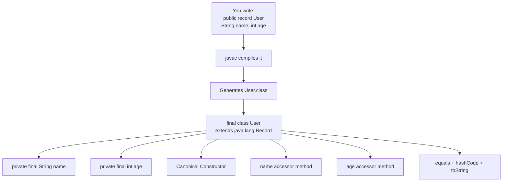
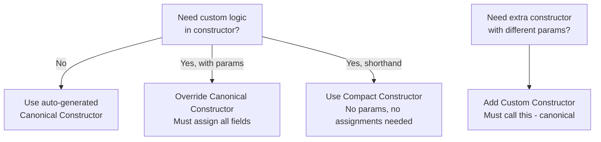
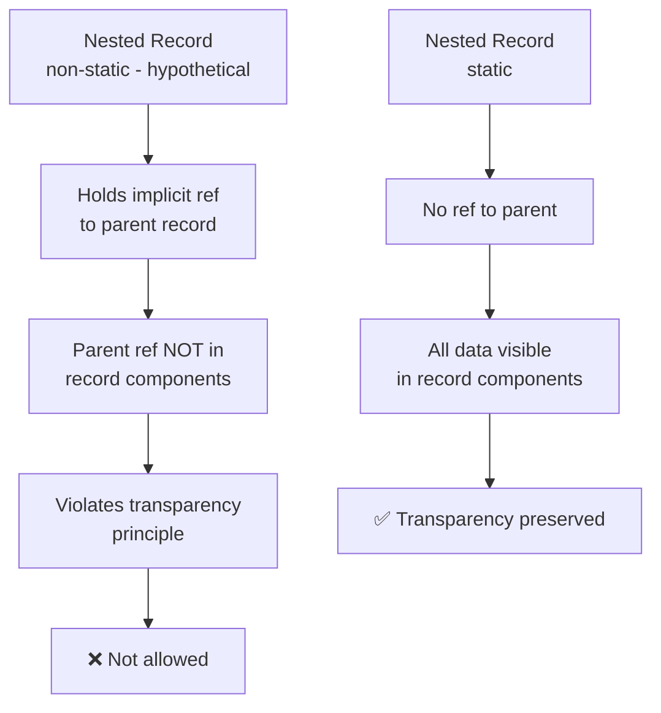
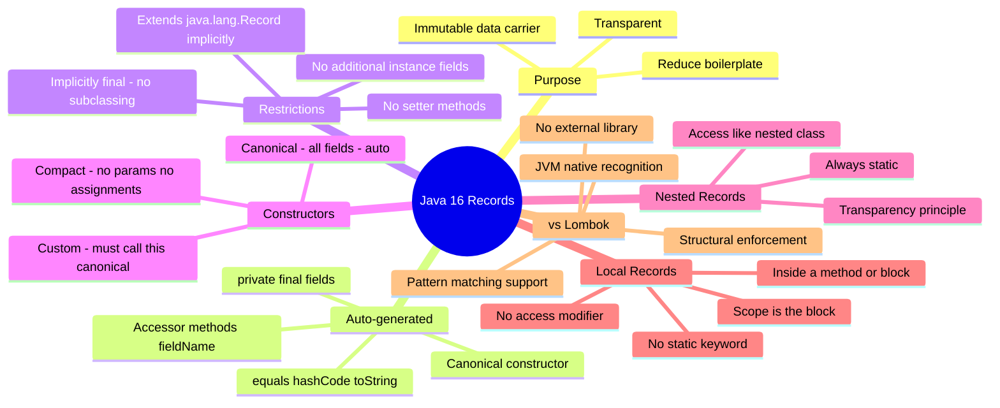

# 📘 Java 16: Records
### Complete Study Guide — Chapter: Immutable Data Classes & the Record Type

---

> [!NOTE]
> This guide assumes basic familiarity with Java classes, constructors, access modifiers, nested classes, and local classes. Where those are referenced, enough context is provided to keep this guide self-contained.

---

## 🗂️ Table of Contents

1. [The Problem: Boilerplate in Immutable Classes](#1-the-problem-boilerplate-in-immutable-classes)
2. [What Is a Record?](#2-what-is-a-record)
3. [Internal Working: What the Compiler Generates](#3-internal-working-what-the-compiler-generates)
4. [Record Components (Fields)](#4-record-components-fields)
5. [Constructors in Records](#5-constructors-in-records)
6. [Accessor Methods (Getters)](#6-accessor-methods-getters)
7. [equals(), hashCode(), and toString()](#7-equals-hashcode-and-tostring)
8. [Adding Custom Methods](#8-adding-custom-methods)
9. [Implementing Interfaces](#9-implementing-interfaces)
10. [Nested Records](#10-nested-records)
11. [Local Records](#11-local-records)
12. [Records vs Lombok](#12-records-vs-lombok)
13. [Interview Notes](#13-interview-notes)
14. [Common Mistakes](#14-common-mistakes)
15. [Best Practices](#15-best-practices)
16. [Practice Questions](#16-practice-questions)
17. [Summary](#17-summary)

---

# 1. The Problem: Boilerplate in Immutable Classes

## What Is an Immutable Class?

An immutable class is a class whose instances **cannot be modified after creation**. All fields are set at construction time and cannot be changed afterward.

Immutable classes are widely used as:
- Data transfer objects (DTOs)
- Value objects
- Configuration holders
- Map keys (because their hash code never changes)

## The Pre-Java 16 Way

To write a proper immutable POJO (Plain Old Java Object) in Java before Java 16, you had to manually write all of the following:

```java
// Pre-Java 16 Immutable User Class
public final class User {                        // 1. Class must be final

    private final String name;                   // 2. All fields private final
    private final int age;

    public User(String name, int age) {          // 3. Constructor to initialize all fields
        this.name = name;
        this.age = age;
    }

    public String getName() { return name; }     // 4. Getter for each field
    public int getAge()     { return age; }      // 5. No setters allowed

    @Override
    public boolean equals(Object o) {            // 6. equals() — needed for comparisons,
        if (this == o) return true;              //    Map keys, Set membership, etc.
        if (!(o instanceof User)) return false;
        User u = (User) o;
        return age == u.age && Objects.equals(name, u.name);
    }

    @Override
    public int hashCode() {                      // 7. hashCode() — consistent with equals()
        return Objects.hash(name, age);
    }

    @Override
    public String toString() {                   // 8. toString() — for debugging and logging
        return "User[name=" + name + ", age=" + age + "]";
    }
}
```

### Creating and Using the Object

```java
User user = new User("Alice", 30);
System.out.println(user.getName()); // Alice
System.out.println(user.getAge());  // 30
System.out.println(user);           // User[name=Alice, age=30]
```

> [!CAUTION]
> This is a **massive amount of boilerplate** for what is conceptually a simple container of two fields. Worse, every time you add a new field, you have to manually update the constructor, add a getter, and update `equals()`, `hashCode()`, and `toString()`.

---

# 2. What Is a Record?

## Definition

A **record** (introduced in Java 16 as a standard feature, previewed in Java 14/15) is a **special kind of class** designed to be a transparent, immutable data carrier.

It automatically generates:
- A **canonical constructor**
- **Private final fields** for all components
- **Accessor methods** (getters, named after the fields)
- `equals()`, `hashCode()`, and `toString()` implementations

## Syntax

```java
public record RecordName(Type field1, Type field2, ...) { }
```

That's it. The entire `User` class from Section 1 becomes:

```java
public record User(String name, int age) { }
```

## Comparison: Old vs New

| Aspect | Pre-Java 16 Immutable Class | Java 16 Record |
|---|---|---|
| Lines of code | ~30+ | 1 |
| `final` class | Manual | Automatic |
| `private final` fields | Manual | Automatic |
| Constructor | Manual | Automatic (canonical) |
| Getters | Manual | Automatic |
| Setters | Not written (manual discipline) | Structurally impossible |
| `equals()` | Manual | Automatic |
| `hashCode()` | Manual | Automatic |
| `toString()` | Manual | Automatic |
| External library needed | Sometimes (Lombok) | No |

## Creating and Using a Record

```java
public record User(String name, int age) { }

public class Main {
    public static void main(String[] args) {
        User user = new User("Alice", 30);

        System.out.println(user.name());    // Alice  (accessor method)
        System.out.println(user.age());     // 30
        System.out.println(user);           // User[name=Alice, age=30]
    }
}
```

### Output

```
Alice
30
User[name=Alice, age=30]
```

---

# 3. Internal Working: What the Compiler Generates

When you write:

```java
public record User(String name, int age) { }
```

The Java compiler (`javac`) generates a `.class` file equivalent to:

```java
public final class User extends java.lang.Record {

    private final String name;
    private final int age;

    // Canonical constructor
    public User(String name, int age) {
        this.name = name;
        this.age = age;
    }

    // Accessor methods (NOT getters in the traditional getName() style)
    public String name() { return this.name; }
    public int age()     { return this.age; }

    // Auto-generated equals, hashCode, toString
    @Override
    public boolean equals(Object o) { /* ... */ }

    @Override
    public int hashCode() { /* ... */ }

    @Override
    public String toString() {
        return "User[name=" + name + ", age=" + age + "]";
    }
}
```

## Key Internal Details

### 1. Record is `final`

The `record` keyword implicitly makes the class `final`. You cannot subclass a record.

```java
public class AdminUser extends User { } // ❌ Compile error — User is final
```

### 2. All Records Implicitly Extend `java.lang.Record`

Every record you create silently extends `java.lang.Record`. This is how the JVM knows to apply record semantics.

You can verify this at runtime:

```java
System.out.println(User.class.getSuperclass()); // class java.lang.Record
```

### 3. Why You Cannot `extends` Another Class

Because every record already implicitly extends `java.lang.Record`, and Java does not support multiple class inheritance, you cannot extend any other class.

```java
public record User(String name, int age) extends MyService { } // ❌ Not allowed
```

> [!IMPORTANT]
> A record can **implement** interfaces — only `extends` (for classes) is disallowed.

---

## Execution Flow Diagram



---

# 4. Record Components (Fields)

## What Are Record Components?

The parameters listed in the record header (beside the record name) are called **record components**. They define the data the record carries.

```java
public record User(String name, int age) { }
//                  ─────────────────────
//                  Record Components
```

The compiler converts each component into:
- A `private final` field of the same name and type
- A public accessor method of the same name

## Transparency Principle

> [!IMPORTANT]
> A record is a **transparent data carrier**. Just by reading the record declaration, you can know exactly what data it carries — no hidden fields, no surprises.

This is why records are called transparent: `User(String name, int age)` tells you everything.

## Cannot Add More Instance Fields Internally

You **cannot** declare additional instance fields inside the record body:

```java
public record User(String name, int age) {
    private String email; // ❌ Compile error — instance fields not allowed
}
```

If you need more fields, add them to the record components:

```java
public record User(String name, int age, String email) { } // ✅
```

> [!NOTE]
> This restriction enforces the transparency principle. If hidden instance fields were allowed, you could no longer know the full data a record carries just by looking at its header.

## Static Fields Are Allowed

While instance fields are forbidden, **static fields are permitted** inside a record:

```java
public record User(String name, int age) {
    static final String SPECIES = "Human"; // ✅ Allowed
}
```

**Why?** Static fields belong to the **class**, not to any instance. Adding static fields does not affect the immutability of any `User` object. Each individual `User` instance still carries only `name` and `age`, preserving the transparency guarantee.

```java
User u1 = new User("Alice", 30);
User u2 = new User("Bob", 25);
// u1 and u2 are fully immutable — SPECIES is shared, not per-object
System.out.println(User.SPECIES); // Human
```

---

## Defensive Copying for Mutable Fields

> [!CAUTION]
> `private final` on a field makes the **reference** immutable, not the **object** the reference points to. If a record component is a mutable type (like `List`, `Date`, `StringBuilder`), the record is not truly immutable.

```java
public record User(String name, List<String> hobbies) { }

List<String> h = new ArrayList<>(List.of("Reading"));
User user = new User("Alice", h);

h.add("Gaming"); // This MODIFIES the list inside the record!
System.out.println(user.hobbies()); // [Reading, Gaming] — compromised!
```

**Solution: Defensive copying in the canonical constructor**

```java
public record User(String name, List<String> hobbies) {
    public User(String name, List<String> hobbies) {
        this.name = name;
        this.hobbies = List.copyOf(hobbies); // ✅ Creates an unmodifiable copy
    }
}
```

`List.copyOf()` creates an unmodifiable list. Any attempt to mutate it throws `UnsupportedOperationException`.

---

# 5. Constructors in Records

Records support three types of constructors.

## Type 1: Canonical Constructor (Auto-generated)

The **canonical constructor** takes all record components as parameters in the exact order they are declared, and initializes all fields.

```java
public record User(String name, int age) { }
// Implicitly generates:
// public User(String name, int age) {
//     this.name = name;
//     this.age = age;
// }
```

You do not need to write this — it is generated automatically.

---

## Type 2: Overriding the Canonical Constructor

You can override the canonical constructor to add validation or custom logic:

```java
public record User(String name, int age) {

    // Override canonical constructor
    public User(String name, int age) {
        if (age < 0) {
            throw new IllegalArgumentException("Age cannot be negative: " + age);
        }
        this.name = name;
        this.age = age;
    }
}
```

> [!WARNING]
> If you override the canonical constructor, you **must** assign all fields (`this.name`, `this.age`, etc.). Failing to do so is a compile error.

---

## Type 3: Compact Constructor

The **compact constructor** is a shorthand form unique to records. You omit the parameter list — the compiler adds it automatically. You also omit the field assignments (`this.name = name`) — the compiler adds those too, **after** your body runs.

```java
public record User(String name, int age) {

    // Compact constructor — no parameters, no field assignments needed
    public User {
        if (age < 0) {
            throw new IllegalArgumentException("Age cannot be negative: " + age);
        }
        // this.name = name; and this.age = age; are added automatically by compiler
    }
}
```

This is the cleanest way to add validation to a record.

### Canonical vs Compact Constructor Comparison

| Feature | Canonical Constructor | Compact Constructor |
|---|---|---|
| Parameter list | Must list all components | Omit — compiler adds it |
| Field assignments | Must write `this.x = x` | Omit — compiler adds after body |
| Custom logic | ✅ | ✅ |
| Syntax length | Longer | Shorter |

---

## Type 4: Custom Constructor with Different Parameters

You can add additional constructors with different parameter lists:

```java
public record User(String name, int age) {

    // Custom constructor — age defaults to 0
    public User(String name) {
        this(name, 0); // ✅ Must delegate to canonical constructor
    }
}
```

> [!IMPORTANT]
> Any custom constructor with a different parameter list **must** call the canonical constructor using `this(...)` as its first statement. This ensures all fields are always initialized — no field can be left unset.

---

## Constructor Access Level Rules

The access level of the canonical constructor **cannot be more restrictive** than the record itself:

```java
public record User(String name, int age) {
    private User(String name, int age) { ... } // ❌ Error — record is public, constructor can't be private
}
```

You **can** make the canonical constructor equally or more accessible:

```java
// record is package-private (default) — canonical constructor can be package-private or public
record User(String name, int age) {
    public User(String name, int age) { // ✅ Increasing access is fine
        this.name = name;
        this.age = age;
    }
}
```

> [!NOTE]
> Rule: Constructor access ≥ Record access. You can widen but never narrow.

---

## Constructor Flow Diagram



---

# 6. Accessor Methods (Getters)

## Auto-generated Accessors

For every record component, the compiler generates a **public accessor method** named exactly the same as the field — **not** in the traditional `getXxx()` style.

```java
public record User(String name, int age) { }

User user = new User("Alice", 30);
System.out.println(user.name()); // "Alice"  — NOT user.getName()
System.out.println(user.age());  // 30       — NOT user.getAge()
```

> [!IMPORTANT]
> Record accessors are named `fieldName()`, **not** `getFieldName()`. This is a deliberate design choice that distinguishes records from traditional JavaBeans.

## Overriding Accessors

You can override an accessor to add custom logic:

```java
public record User(String name, int age) {

    @Override
    public String name() {
        return name.trim(); // Custom: trim whitespace before returning
    }
}
```

## No Setter Methods

Records **never generate setter methods**, and you cannot add one:

```java
public record User(String name, int age) {
    public void setName(String name) {
        this.name = name; // ❌ Compile error — name is final
    }
}
```

The `private final` fields cannot be reassigned after construction. This is structurally enforced — not just a convention.

---

# 7. equals(), hashCode(), and toString()

## Auto-generated Implementations

Records automatically generate all three based on **all record components**:

### `equals()`
Two records are equal if and only if they are of the same type **and** all their record components are equal.

```java
User u1 = new User("Alice", 30);
User u2 = new User("Alice", 30);
System.out.println(u1.equals(u2)); // true
```

### `hashCode()`
The hash code is computed from all record components — consistent with `equals()`.

```java
System.out.println(u1.hashCode() == u2.hashCode()); // true
```

### `toString()`
The format is: `RecordName[field1=value1, field2=value2, ...]`

```java
System.out.println(u1); // User[name=Alice, age=30]
```

## Overriding Any of These

You can override any of the three if you need custom behavior:

```java
public record User(String name, int age) {

    @Override
    public String toString() {
        return "User: " + name + " (age " + age + ")";
    }
}

// Output: User: Alice (age 30)
```

---

# 8. Adding Custom Methods

Records are not limited to their auto-generated methods. You can add any instance or static methods:

```java
public record User(String name, int age) {

    // Instance method
    public boolean isAdult() {
        return age >= 18;
    }

    // Static method
    public static User anonymous() {
        return new User("Anonymous", 0);
    }
}

User u = new User("Alice", 30);
System.out.println(u.isAdult());          // true

User anon = User.anonymous();
System.out.println(anon.name());          // Anonymous
```

---

# 9. Implementing Interfaces

Records **cannot extend** other classes (because they already extend `java.lang.Record`), but they **can implement** interfaces:

```java
public interface Printable {
    void print();
}

public record User(String name, int age) implements Printable {

    @Override
    public void print() {
        System.out.println("User: " + name + ", Age: " + age);
    }
}

User u = new User("Alice", 30);
u.print(); // User: Alice, Age: 30
```

You can implement multiple interfaces:

```java
public record User(String name, int age)
        implements Printable, Serializable { ... }
```

---

# 10. Nested Records

## Overview

Just as you can have nested classes, you can have **nested records** — records declared inside another class or record.

## Nested Record Is Always Static

> [!IMPORTANT]
> Nested records are **implicitly static**. You do not need to write the `static` keyword, and you **cannot** make a nested record non-static.

```java
public record User(String name, int age) {

    record Address(String city, String zip) { } // implicitly static
}
```

Accessing a nested record:

```java
User.Address addr = new User.Address("Mumbai", "400001");
System.out.println(addr.city()); // Mumbai
```

## Why Only Static Nested Records?

This connects to the **transparency principle**. Consider what would happen if a nested record could be non-static:

- A non-static nested class/record holds an **implicit reference to its enclosing instance**.
- This means the nested record would secretly carry a reference to the parent record object.
- But that reference would **not appear in the nested record's component list**.
- This violates transparency: you can no longer tell what data the nested record carries just by reading its declaration.

To prevent this violation, Java mandates that all nested records be static — they have no reference to any enclosing instance, and everything they carry is visible in their component list.



## Comparison: Nested Record vs Nested Class vs Non-Static Nested Class

```java
public record User(String name, int age) {

    record NestedAddressRecord(String city) { }    // implicitly static nested record

    static class StaticAddressClass { }            // static nested class

    class NonStaticAddressClass { }                // non-static nested class (NOT allowed in record)
}
```

### Accessing Each Type

```java
// Static nested record
User.NestedAddressRecord addr1 = new User.NestedAddressRecord("Delhi");
addr1.display();

// Static nested class
User.StaticAddressClass addr2 = new User.StaticAddressClass();
addr2.display();

// Non-static nested class — requires an enclosing instance
User userObj = new User("Alice", 30);
User.NonStaticAddressClass addr3 = userObj.new NonStaticAddressClass();
addr3.display();
```

> [!NOTE]
> Non-static nested **classes** inside a record are still allowed — the restriction on being static applies only to nested **records**.

---

# 11. Local Records

## What Is a Local Record?

A **local record** is a record declared inside a method, constructor, or any block (like an `if` block or `while` block). It is analogous to a local class.

```java
public class Main {
    public static void printAddress() {

        // Local record — defined inside a method
        record Address(String city, String zip) {
            void display() {
                System.out.println(city + " - " + zip);
            }
        }

        Address addr = new Address("Bangalore", "560001");
        addr.display(); // Bangalore - 560001
    }

    public static void main(String[] args) {
        printAddress();
    }
}
```

## Rules for Local Records

| Rule | Explanation |
|---|---|
| **No access modifiers** | Cannot be `public`, `private`, or `protected` — its scope is the enclosing block |
| **Scope is the block** | Cannot be used outside the block where it is defined |
| **Object creation inside block** | Can only instantiate the local record within the same block |
| **No static modifier** | A local record cannot be `static` — `static` means "belongs to a class," but a local record's scope ends with the block |
| **Is implicitly static** | Despite no `static` keyword, local records are actually implicitly static (like local classes in Java 16+) — they do not capture the enclosing instance |

### Why No `static` Keyword on Local Records?

`static` means something belongs to and persists at the class level. A local record lives only within a block. Once the block finishes executing, the local record is gone. Making it `static` would be a contradiction — there is no class for it to belong to.

## Full Example with Outer Class

```java
public record User(String name, int age) {

    public void printAddress() {
        record Address(String city, String zip) {  // local record
            void display() {
                System.out.println(city + " - " + zip);
            }
        }

        Address address = new Address("Pune", "411001");
        address.display();
    }
}

// Calling from main:
User user = new User("Alice", 30);
user.printAddress(); // Pune - 411001
```

---

# 12. Records vs Lombok

A common question: **if Lombok already reduces boilerplate, why do we need records?**

## What Lombok Does

Lombok is a third-party annotation processor that generates boilerplate at compile time using annotations:

```java
@Getter
@EqualsAndHashCode
@ToString
@AllArgsConstructor
@Value  // makes the class immutable (equivalent of all the above combined)
public class User {
    String name;
    int age;
}
```

## Head-to-Head Comparison

| Feature | Lombok | Java Records |
|---|---|---|
| External library required | ✅ Yes — add to `pom.xml` / `build.gradle` | ❌ No — built into Java |
| IDE plugin needed | Often yes | No |
| Part of the Java spec | No — third-party tool | Yes — JEP 395, Java 16 |
| Prevents setter methods | No — you can write them | Yes — structurally impossible |
| Pattern matching support | No | Yes (`instanceof` patterns, `switch`) |
| Sealed class integration | No | Yes |
| Getter naming style | `getFieldName()` | `fieldName()` |
| Subclassing restriction | No | Yes — records are implicitly `final` |
| JVM/reflective recognition | No special JVM treatment | JVM natively identifies records |
| Future enhancements | Depends on Lombok team | Guaranteed via Java evolution |

## The Key Differences

### 1. No External Dependency
Records are a first-class Java language feature. No library in your `pom.xml`, no IDE plugin, no annotation processor configuration.

### 2. Structural Enforcement vs Convention
With Lombok's `@Value`, you **could** still write a setter method — Lombok wouldn't stop you. With records, you **cannot** write a setter — the field is `final`, and the compiler enforces immutability structurally.

```java
// Lombok @Value — someone could still add:
public void setName(String name) { this.name = name; } // No compile error with Lombok (if @Value allows)

// Record — this is a compile error, always:
public record User(String name, int age) {
    void setName(String name) { this.name = name; } // ❌ Compile error
}
```

### 3. Integration with the Java Ecosystem
Because records are true Java language constructs (not source-level annotation processing tricks), they integrate natively with:
- **Pattern matching** (`instanceof` and `switch` with deconstruction patterns)
- **Sealed classes and interfaces**
- **Future Java enhancements**

> [!TIP]
> Use **records** as your default for immutable data carriers in Java 16+. Use **Lombok** only when you need features records don't provide (e.g., mutable DTOs, builder patterns).

---

# 13. Interview Notes

> [!IMPORTANT]
> These are frequently asked in Java 16+/modern Java feature interviews.

### Q1: What is a record in Java?

A record is a special-purpose class introduced in Java 16 that acts as a transparent, immutable data carrier. It auto-generates a canonical constructor, `private final` fields, accessor methods, and `equals()`, `hashCode()`, `toString()` from a concise declaration.

---

### Q2: What does "transparent data carrier" mean?

It means the record's full data payload is visible just from its declaration. All data a record carries is declared in the record header (record components) — there are no hidden instance fields. You don't need to open the class body to know what the record holds.

---

### Q3: Why can't a record extend another class?

Every record implicitly extends `java.lang.Record`. Since Java does not support multiple class inheritance, a record cannot extend any additional class. It can, however, implement multiple interfaces.

---

### Q4: What is the difference between the canonical constructor and the compact constructor?

The canonical constructor lists all record components as parameters and explicitly assigns each field. The compact constructor omits both the parameter list and the field assignments — the compiler adds them automatically. The compact constructor is preferred when you just need to add validation.

---

### Q5: What is the naming style of record accessor methods?

Record accessor methods are named exactly as the field: `name()`, `age()` — **not** `getName()`, `getAge()`. This distinguishes records from traditional JavaBeans.

---

### Q6: Can you add instance fields inside a record body?

No. Only static fields are permitted inside a record body. Instance fields must be declared as record components in the header. This preserves the transparency principle.

---

### Q7: Why are nested records always static?

If a nested record were non-static, it would implicitly hold a reference to its enclosing record instance. That reference would not appear in the nested record's component list, violating the transparency principle. To prevent this, all nested records are implicitly static.

---

### Q8: Is a record truly immutable if it has a `List` field?

Not by default. `private final List<T>` makes the reference immutable, but the list contents can still be mutated. For true immutability, you must use defensive copying in the canonical constructor: `this.items = List.copyOf(items)`.

---

### Q9: What is the access level rule for canonical constructors?

The canonical constructor's access level cannot be more restrictive than the record's own access level. You can make the constructor equally or more accessible, but never less.

---

### Q10: How does a record differ from Lombok's `@Value`?

Records are a native Java language feature — no external dependency, structurally enforced immutability, and full integration with pattern matching and sealed classes. Lombok is a third-party annotation processor — it reduces boilerplate but doesn't structurally prevent misuse (e.g., adding setters), and it doesn't participate in JVM-level record recognition or future Java features.

---

# 14. Common Mistakes

### ❌ Mistake 1: Expecting getter methods named `getFieldName()`

```java
User user = new User("Alice", 30);
user.getName(); // ❌ Compile error — method doesn't exist
user.name();    // ✅ Correct
```

---

### ❌ Mistake 2: Trying to add instance fields inside the record body

```java
public record User(String name, int age) {
    private String email; // ❌ Compile error
}
```

✅ Add to the record components: `public record User(String name, int age, String email) { }`

---

### ❌ Mistake 3: Assuming a record with a `List` field is deeply immutable

```java
public record Config(List<String> flags) { }

List<String> f = new ArrayList<>(List.of("debug"));
Config c = new Config(f);
f.add("verbose"); // Modifies the list inside the record!
```

✅ Use `List.copyOf()` in the canonical or compact constructor.

---

### ❌ Mistake 4: Using `this(...)` call in a custom constructor but not as the first statement

```java
public record User(String name, int age) {
    public User(String name) {
        System.out.println("Creating user"); // ❌ this() must be first
        this(name, 0);
    }
}
```

✅ `this(name, 0)` must be the first statement.

---

### ❌ Mistake 5: Trying to make a nested record non-static

```java
public record User(String name, int age) {
    non-static record Address(String city) { } // ❌ Not possible — no such syntax
}
```

All nested records are static. There is no way to make them non-static.

---

### ❌ Mistake 6: Giving an access modifier to a local record

```java
public void myMethod() {
    public record Temp(int value) { } // ❌ Compile error
}
```

✅ Local records cannot have access modifiers — their scope is the enclosing block.

---

# 15. Best Practices

1. **Use records for pure data carriers** — DTOs, value objects, API response models, configuration holders.

2. **Use compact constructors for validation** — they are the cleanest way to add precondition checks without verbosity.

```java
public record Range(int min, int max) {
    public Range {
        if (min > max) throw new IllegalArgumentException("min > max");
    }
}
```

3. **Apply defensive copying for mutable fields** — always wrap `List`, `Map`, `Date`, and other mutable types with unmodifiable wrappers in the canonical constructor.

4. **Do not use records for entities that need mutability** — if your object needs setters (e.g., JPA entities), use a regular class or Lombok.

5. **Prefer `record` over Lombok `@Value`** in Java 16+ projects — native language support, no dependency, structurally enforced immutability.

6. **Override accessor methods when needed** — if you need to return a defensive copy from an accessor, override it:
```java
public List<String> hobbies() {
    return List.copyOf(hobbies); // Return unmodifiable view
}
```

7. **Use records with pattern matching** (Java 16+) — records integrate natively with `instanceof` pattern matching and `switch` expressions for clean deconstruction.

---

# 16. Practice Questions

### 🟢 Easy

1. What keyword is used to declare a record in Java? Which version introduced it?
2. What methods does a record automatically generate?
3. What is the naming style of accessor methods in records?
4. Can a record extend another class? Can it implement an interface?
5. What is a "canonical constructor"?

### 🟡 Medium

6. Explain the difference between the canonical constructor and the compact constructor in a record.
7. Write a record `Point(double x, double y)` with a compact constructor that rejects negative coordinates, and a method `distanceTo(Point other)` that computes the Euclidean distance.
8. Why are instance fields not allowed inside a record body, but static fields are?
9. A colleague uses `public record Config(List<String> options) { }`. They claim this is immutable. Are they right? How would you fix it?
10. What happens if you define a custom constructor in a record that doesn't call `this(...)`?

### 🔴 Hard

11. Explain why nested records are always implicitly static. What would go wrong if non-static nested records were allowed?
12. Compare and contrast Java records with Lombok's `@Value`. In what scenarios would you choose one over the other?
13. Write a record `Money(BigDecimal amount, String currency)` with: (a) a compact constructor that validates amount is non-negative and currency is exactly 3 characters, (b) a custom constructor `Money(double amount, String currency)` that delegates to the canonical, and (c) a method `add(Money other)` that returns a new `Money` (throws if currencies differ).
14. Explain the rule about canonical constructor access levels. What happens if you try to make the canonical constructor `private` in a `public` record?
15. Local records cannot be declared `static`. Nested records are always `static`. Explain the reasoning behind each of these seemingly opposite rules.

---

# 17. Summary



### Revision Bullets

- Records were introduced as a standard feature in **Java 16** (JEP 395).
- Syntax: `public record Name(Type field1, Type field2) { }` — replaces ~30 lines of boilerplate.
- Auto-generates: `private final` fields, canonical constructor, `field()` accessor methods, `equals()`, `hashCode()`, `toString()`.
- A record is implicitly `final` — cannot be subclassed.
- All records implicitly extend `java.lang.Record` — this is why `extends AnotherClass` is forbidden.
- Records **can implement** interfaces.
- Record components are declared in the header. **No additional instance fields** are allowed in the body. Static fields are allowed.
- `private final` on a `List` field makes the reference immutable, not the list contents — use `List.copyOf()` for deep immutability.
- **Canonical constructor**: takes all components in order; auto-generated; can be overridden.
- **Compact constructor**: no parameters, no field assignments; compiler adds both; best for validation.
- **Custom constructors**: allowed with different parameters; must delegate to canonical via `this(...)` as the first statement.
- Canonical constructor access level cannot be narrower than the record's access level.
- Accessor methods are named `fieldName()`, not `getFieldName()`.
- Nested records are **always static** — enforces the transparency principle (no hidden enclosing reference).
- Local records have no access modifier, no `static` keyword, and are scoped to their enclosing block.
- Records vs Lombok: records are native Java (no library), structurally enforce immutability, integrate with pattern matching and sealed classes.

---

*End of Chapter — Java 16 Records*
