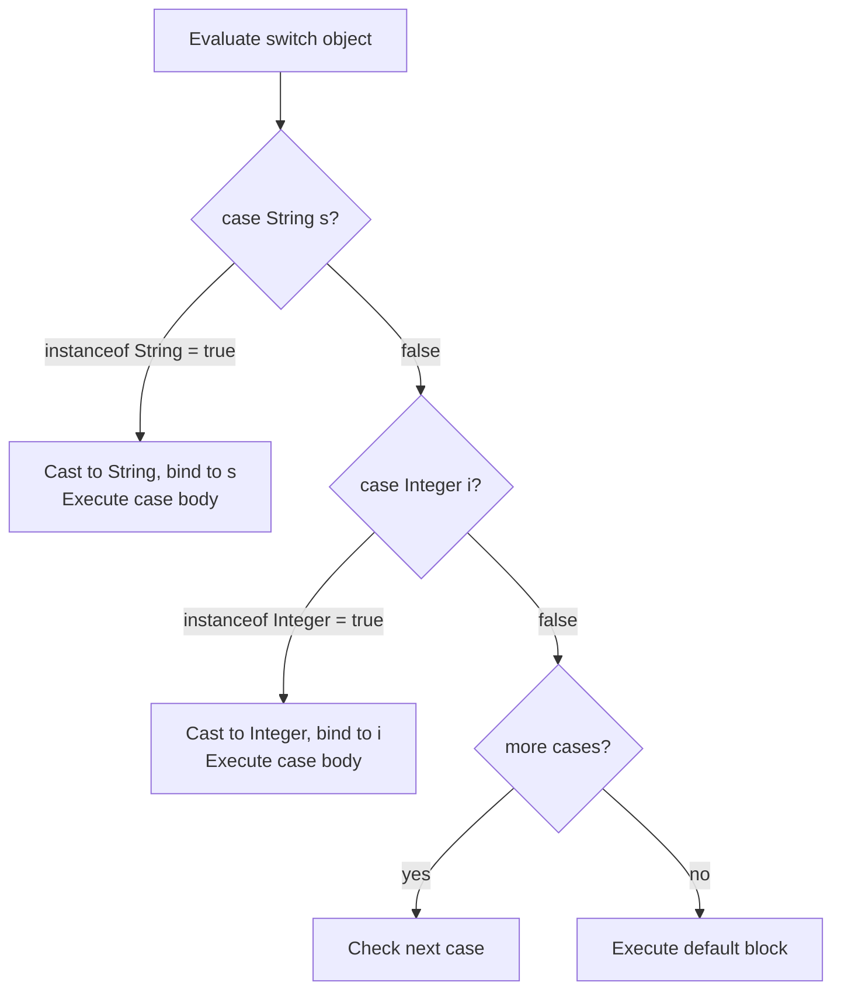
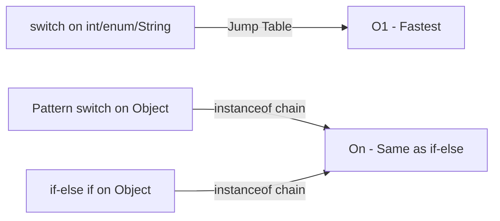
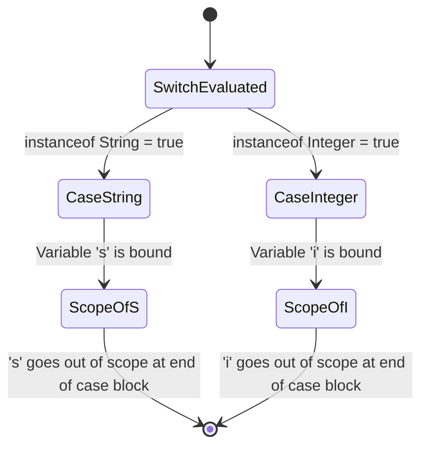
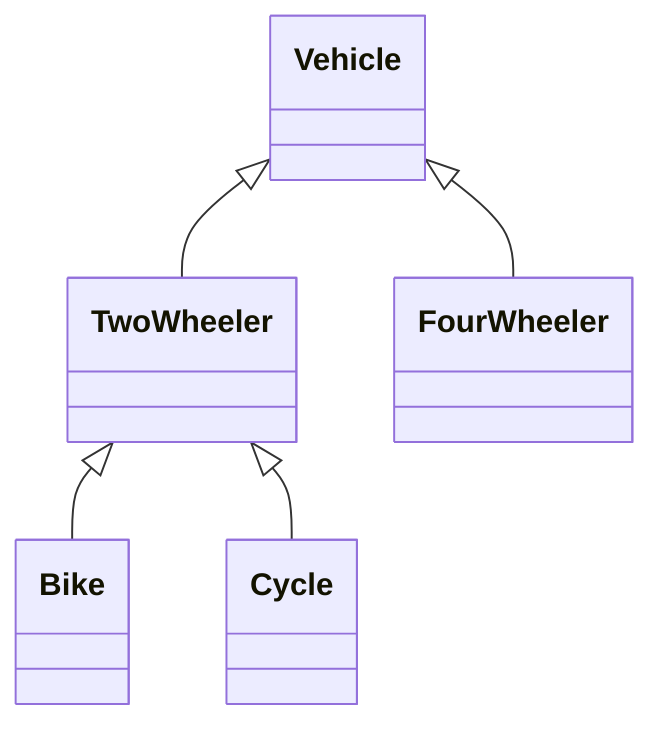
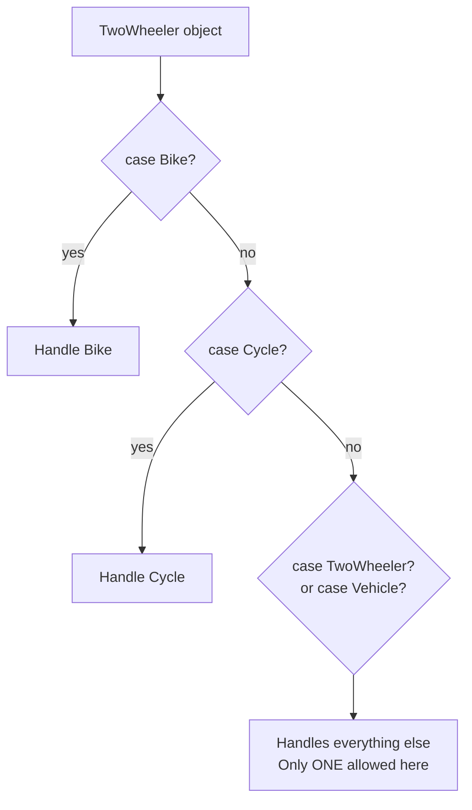
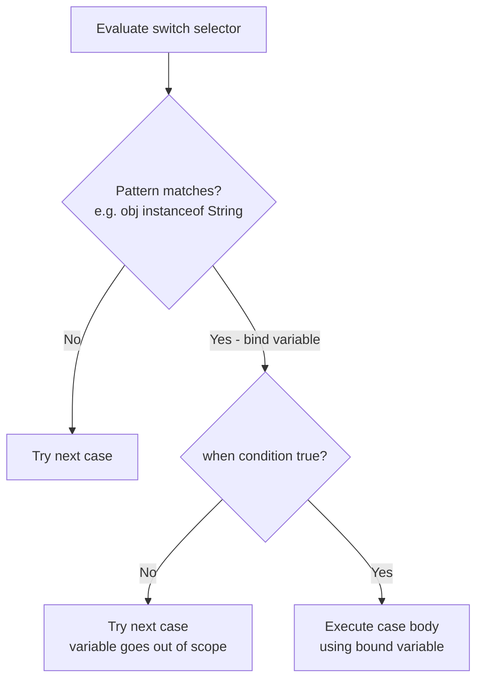
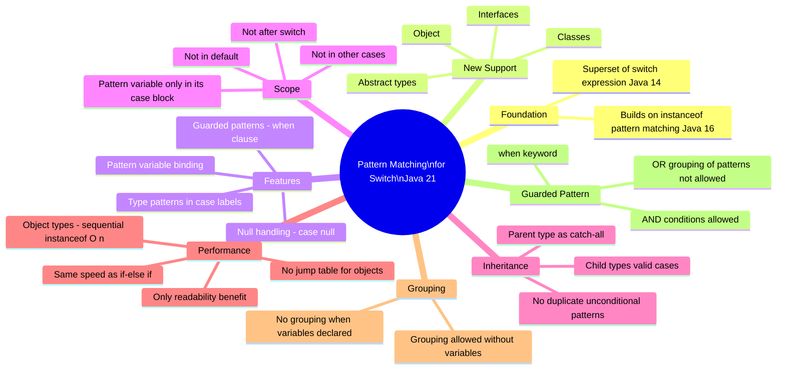

# 📘 Java 21 — Pattern Matching for Switch: Complete Study Guide

> A professional-quality reference covering Pattern Matching for Switch introduced in Java 21, with deep explanations, code examples, diagrams, performance analysis, and interview notes.

---

## Table of Contents

1. [Prerequisites & Background](#1-prerequisites--background)
2. [What is Pattern Matching for Switch?](#2-what-is-pattern-matching-for-switch)
3. [Traditional Switch — A Recap](#3-traditional-switch--a-recap)
4. [Pattern Matching for Switch — Core Syntax](#4-pattern-matching-for-switch--core-syntax)
5. [Internal Working — How It Really Works](#5-internal-working--how-it-really-works)
6. [Performance: Pattern Switch vs Classic Switch vs if-else](#6-performance-pattern-switch-vs-classic-switch-vs-if-else)
7. [Scope of Pattern Variables](#7-scope-of-pattern-variables)
8. [Pattern Matching with Inheritance](#8-pattern-matching-with-inheritance)
9. [Pattern Matching with Enums](#9-pattern-matching-with-enums)
10. [Null Handling in Pattern Switch](#10-null-handling-in-pattern-switch)
11. [Grouping of Patterns — What Is NOT Allowed](#11-grouping-of-patterns--what-is-not-allowed)
12. [Guarded Patterns — The `when` Clause](#12-guarded-patterns--the-when-clause)
13. [Quick Reference Table](#13-quick-reference-table)
14. [Interview Notes](#14-interview-notes)
15. [Common Mistakes](#15-common-mistakes)
16. [Best Practices](#16-best-practices)
17. [Practice Questions](#17-practice-questions)
18. [Summary](#18-summary)

---

# 1. Prerequisites & Background

Before diving into Pattern Matching for Switch, you should be comfortable with two earlier Java features. This section makes the guide self-contained.

## 1.1 — Pattern Matching for `instanceof` (Java 16)

Before Java 16, checking a type and then casting it required two steps:

```java
// Traditional — Java 15 and before
Object obj = "Hello";

if (obj instanceof String) {
    String s = (String) obj;  // explicit cast required
    System.out.println(s.toUpperCase());
}
```

**Java 16 introduced pattern matching for `instanceof`:**

```java
// Java 16+ — type check and cast in one step
Object obj = "Hello";

if (obj instanceof String s) {
    // 's' is automatically declared and type-cast here
    System.out.println(s.toUpperCase()); // HELLO
}
```

**Key rules of `instanceof` pattern matching:**
- The variable (`s`) is only in scope inside the `if` block
- Cannot use `||` (OR) when declaring a pattern variable
- Can use `&&` (AND) to add extra conditions: `if (obj instanceof String s && s.length() > 3)`
- The runtime checks `instanceof` first; if `false`, the variable is never bound (no `NullPointerException`)

> [!IMPORTANT]
> Pattern Matching for Switch (Java 21) is built on the same mechanism as `instanceof` pattern matching. Understanding `instanceof` pattern matching first makes Switch patterns straightforward.

## 1.2 — Switch Statement vs Switch Expression (Java 14)

Java 14 introduced the **switch expression** (in addition to the classic switch statement), with two key improvements:

```java
// Classic switch statement (pre-Java 14)
int day = 2;
String result;
switch (day) {
    case 1:
        result = "Monday";
        break;
    case 2:
        result = "Tuesday";
        break;
    default:
        result = "Other";
}

// Switch expression (Java 14+) — arrow syntax
int day = 2;
String result = switch (day) {
    case 1 -> "Monday";
    case 2 -> "Tuesday";
    default -> "Other";
};
System.out.println(result); // Tuesday
```

**`yield` keyword (Java 14+):** Used inside a switch expression block to return a value:

```java
String result = switch (day) {
    case 1 -> "Monday";
    case 2 -> {
        System.out.println("Processing Tuesday...");
        yield "Tuesday"; // 'yield' returns the value from the block
    }
    default -> "Other";
};
```

> [!NOTE]
> Java 21 Pattern Matching for Switch **fully supports** everything from classic switch (statement form) AND Java 14 switch expressions (arrow syntax, `yield`). It is a superset, not a replacement.

---

# 2. What is Pattern Matching for Switch?

## Overview

Pattern Matching for Switch is a Java 21 feature (finalized; it appeared as a preview in earlier versions) that extends the `switch` statement and expression to support **object types** as case labels — not just primitives, enums, and strings.

It allows you to match an object against multiple type patterns in a single `switch` block, eliminating chains of `if (obj instanceof X) ... else if (obj instanceof Y)` code.

## Why This Feature Exists

### The Problem — Verbose Type-Checking

Consider a method that handles different subtypes of a sealed class or interface:

```java
// Java 20 and before — tedious and error-prone
static String describe(Object obj) {
    if (obj instanceof Integer i) {
        return "Integer: " + i;
    } else if (obj instanceof String s) {
        return "String: " + s;
    } else if (obj instanceof Double d) {
        return "Double: " + d;
    } else {
        return "Unknown";
    }
}
```

This works but:
- Is verbose
- Doesn't guarantee exhaustiveness (you might miss a case)
- Doesn't read as cleanly as a `switch`

### The Solution — Pattern Switch

```java
// Java 21 — clean, readable, exhaustive
static String describe(Object obj) {
    return switch (obj) {
        case Integer i -> "Integer: " + i;
        case String s  -> "String: " + s;
        case Double d  -> "Double: " + d;
        default        -> "Unknown";
    };
}
```

## Definition

> **Pattern Matching for Switch** (Java 21) extends the `switch` construct to allow **type patterns** as case labels. Each case can declare a pattern variable that is automatically type-cast when the pattern matches, eliminating explicit casting. It supports all object types: classes, interfaces, abstract types, and wrapper types.

## Java Version Timeline

| Java Version | Feature status |
|---|---|
| Java 14 | Switch expressions finalized |
| Java 16 | Pattern matching for `instanceof` finalized |
| Java 17–20 | Pattern matching for switch (preview) |
| **Java 21** | **Pattern matching for switch — finalized** |

## Supported Types — Before and After Java 21

| Type | Classic Switch (pre-21) | Pattern Switch (Java 21) |
|---|---|---|
| `int`, `short`, `byte`, `char` (primitives) | ✅ | ✅ |
| `Integer`, `Short`, `Byte`, `Character` (wrappers) | ✅ | ✅ |
| `String` | ✅ | ✅ |
| `enum` | ✅ | ✅ |
| Classes | ❌ | ✅ |
| Interfaces | ❌ | ✅ |
| Abstract classes | ❌ | ✅ |
| `Object` | ❌ | ✅ |

---

# 3. Traditional Switch — A Recap

Understanding the traditional forms helps appreciate what Java 21 adds.

## Statement Form (with `break`)

```java
int a = 2;
switch (a) {
    case 1:
        System.out.println("Monday");
        break;
    case 2:
        System.out.println("Tuesday");
        break;
    default:
        System.out.println("Other");
}
```

## Expression Form — Arrow Syntax (Java 14+)

```java
int a = 2;
String day = switch (a) {
    case 1 -> "Monday";
    case 2 -> "Tuesday";
    default -> "Other";
};
System.out.println(day); // Tuesday
```

Both of these work exactly the same in Java 21. Pattern matching **adds** object support on top of this foundation.

---

# 4. Pattern Matching for Switch — Core Syntax

## Syntax

```java
switch (objectVariable) {
    case TypeName patternVariable -> {
        // use patternVariable here
    }
    case AnotherType anotherVar -> {
        // use anotherVar here
    }
    default -> {
        // handle anything else
    }
}
```

Or as an expression:

```java
String result = switch (objectVariable) {
    case TypeName patternVariable -> "matched TypeName";
    case AnotherType anotherVar  -> "matched AnotherType";
    default                      -> "no match";
};
```

## Syntax Breakdown

| Part | Meaning |
|---|---|
| `switch (objectVariable)` | The variable being tested — can now be any `Object` |
| `case TypeName patternVariable` | Match if `objectVariable instanceof TypeName`; bind to `patternVariable` |
| `->` | Arrow form (Java 14+); no `break` needed |
| `default` | Handles all non-matched cases |

## Beginner Code Example

```java
public class PatternSwitchBasic {
    public static void main(String[] args) {
        Object obj = "Hello World";
        describe(obj);

        obj = 42;
        describe(obj);

        obj = 3.14;
        describe(obj);
    }

    static void describe(Object obj) {
        switch (obj) {
            case String s  -> System.out.println("String of length " + s.length());
            case Integer i -> System.out.println("Integer, doubled: " + (i * 2));
            case Double d  -> System.out.println("Double, rounded: " + Math.round(d));
            default        -> System.out.println("Unknown type: " + obj);
        }
    }
}
```

**Output:**
```
String of length 11
Integer, doubled: 84
Double, rounded: 3
```

### Line-by-Line Explanation

| Line | Explanation |
|---|---|
| `switch (obj)` | `obj` is of type `Object` — now legal in Java 21 |
| `case String s ->` | Check: is `obj instanceof String`? If yes, bind to variable `s` |
| `s.length()` | `s` is already a `String` — no casting needed |
| `case Integer i ->` | Check: is `obj instanceof Integer`? If yes, bind to `i` |
| `case Double d ->` | Check: is `obj instanceof Double`? If yes, bind to `d` |
| `default ->` | Runs if no case matched |

## Intermediate Example — As an Expression

```java
static String format(Object obj) {
    return switch (obj) {
        case Integer i -> "int: " + i;
        case Long l    -> "long: " + l;
        case String s  -> "str: " + s.toUpperCase();
        case null      -> "null value";
        default        -> "other: " + obj.getClass().getSimpleName();
    };
}

public static void main(String[] args) {
    System.out.println(format(100));        // int: 100
    System.out.println(format(100L));       // long: 100
    System.out.println(format("hello"));    // str: HELLO
    System.out.println(format(null));       // null value
    System.out.println(format(3.14));       // other: Double
}
```

---

# 5. Internal Working — How It Really Works

## What the Compiler Actually Generates

When you write:

```java
switch (obj) {
    case String s  -> System.out.println("String: " + s);
    case Integer i -> System.out.println("Integer: " + i);
    default        -> System.out.println("Other");
}
```

The Java compiler **translates this into the equivalent of:**

```java
if (obj instanceof String s) {
    System.out.println("String: " + s);
} else if (obj instanceof Integer i) {
    System.out.println("Integer: " + i);
} else {
    System.out.println("Other");
}
```

The pattern switch is **syntactic sugar** over `instanceof` chains. The JVM executes them identically.

## Execution Flow



## Step-by-Step Execution

1. The switch selector expression (`obj`) is evaluated **once**
2. Java checks each case **in order from top to bottom**
3. For each `case TypeName varName`:
   - Java internally runs `obj instanceof TypeName`
   - If `true`: the object is cast to `TypeName`, bound to `varName`, and the case body executes
   - If `false`: move to the next case
4. If no case matches: `default` executes
5. The pattern variable (`varName`) is only in scope within its case block

---

# 6. Performance: Pattern Switch vs Classic Switch vs if-else

This is a critical distinction that frequently appears in interviews.

## Classic Switch with Primitives — Jump Table / Lookup Table

When you use a classic `switch` with **integer-like primitives** (`int`, `byte`, `short`, `char`), the JVM compiles it to one of two bytecode instructions:

| Bytecode instruction | Used when | Behavior |
|---|---|---|
| `tableswitch` | Cases are dense/contiguous (e.g., 1, 2, 3, 4) | O(1) — direct jump via index |
| `lookupswitch` | Cases are sparse (e.g., 1, 100, 1000) | O(log n) — binary search |

Both are **faster than if-else chains** because they do not evaluate conditions one by one.

## Pattern Switch with Objects — Sequential `instanceof` Checks

When you use pattern switch with object types:
- The compiler generates sequential `instanceof` checks (essentially `if-else if` chains)
- Performance is **O(n)** — proportional to the number of cases
- **There is no jump table or lookup table for object types**

## Performance Comparison Table

| Scenario | Implementation | Performance |
|---|---|---|
| `switch` on `int` / `String` / `enum` | Jump table or lookup table | O(1) or O(log n) — fastest |
| Pattern `switch` on objects | Sequential `instanceof` checks | O(n) — same as if-else |
| Plain `if-else if` on objects | Sequential `instanceof` checks | O(n) |

> [!IMPORTANT]
> **If you use Pattern Matching for Switch with object types, there is no performance advantage over a plain `if-else if` chain.** The benefit is purely **readability and expressiveness**. Only the classic switch on primitives/enums/strings benefits from jump/lookup table optimization.



---

# 7. Scope of Pattern Variables

## Rule

A pattern variable declared in a `case` block is **only accessible within that specific case block**. It is not visible in:
- Other case blocks
- The `default` block
- Code after the `switch` statement

## Code Example

```java
Object obj = "Hello";

switch (obj) {
    case String s -> {
        System.out.println(s.toUpperCase()); // ✅ s is visible here
    }
    case Integer i -> {
        // System.out.println(s); // ❌ Compile error: s not visible here
        System.out.println(i * 2);
    }
    default -> {
        // System.out.println(s); // ❌ Compile error: s not visible here
        System.out.println("Unknown");
    }
}
// System.out.println(s); // ❌ Compile error: s not visible outside switch
```

## Diagram



---

# 8. Pattern Matching with Inheritance

## Overview

Pattern switch can handle class hierarchies intelligently. You can use **parent types, child types, sibling types, and abstract types** as case labels — as long as the object being switched on **could possibly be an instance** of that type.

## Example Hierarchy

```java
abstract class Vehicle {
    abstract void drive();
}

class TwoWheeler extends Vehicle {
    @Override public void drive() { System.out.println("Two wheels!"); }
}

class Bike extends TwoWheeler {
    @Override public void drive() { System.out.println("Riding bike!"); }
}

class Cycle extends TwoWheeler {
    @Override public void drive() { System.out.println("Cycling!"); }
}

class FourWheeler extends Vehicle {
    @Override public void drive() { System.out.println("Four wheels!"); }
}
```



## Valid Cases When Switching on a `TwoWheeler` Object

```java
static void validate(TwoWheeler twoObj) {
    switch (twoObj) {
        case Bike b     -> System.out.println("It's a Bike");
        case Cycle c    -> System.out.println("It's a Cycle");
        case TwoWheeler t -> System.out.println("It's a TwoWheeler (not Bike or Cycle)");
        // case Vehicle v -> // ❌ Error: duplicate unconditional pattern
        // case FourWheeler f -> // ❌ Error: FourWheeler can never be a TwoWheeler
    }
}
```

## The "Unconditional Pattern" Conflict

Both `Vehicle v` and `TwoWheeler t` are **unconditional patterns** when the switch selector is a `TwoWheeler` — meaning both can match *every possible* `TwoWheeler` (itself, `Bike`, and `Cycle`).

Having two unconditional patterns is a **compile error**: `Duplicate unconditional pattern`.

**Rule:** You can include at most **one** type that can catch all remaining cases (either the type itself or a parent type). Mixing two such types is ambiguous and disallowed.



## Case Validity Rules

| Case type | Valid when switching on `TwoWheeler`? | Why |
|---|---|---|
| `Bike` | ✅ Yes | `Bike extends TwoWheeler` |
| `Cycle` | ✅ Yes | `Cycle extends TwoWheeler` |
| `TwoWheeler` | ✅ Yes (one unconditional allowed) | The type itself |
| `Vehicle` | ✅ Yes (but conflicts with `TwoWheeler`) | Parent — catches all |
| `FourWheeler` | ❌ No | Can never be an instance of `TwoWheeler` |
| `TwoWheeler` + `Vehicle` together | ❌ No | Duplicate unconditional patterns |

> [!WARNING]
> **Never use two unconditional patterns in the same switch.** An unconditional pattern is any type that can match every possible value of the selector type. Using two such types causes a compile error: `Duplicate unconditional pattern`.

---

# 9. Pattern Matching with Enums

## Overview

Pattern matching with enums allows you to match an object against an enum type using the `instanceof` mechanism, and then access the matched enum value through the pattern variable.

## Without Pattern Matching (Traditional Enum Switch)

```java
enum Color { RED, GREEN, BLUE, YELLOW }

Color color = Color.RED;

switch (color) {
    case RED    -> System.out.println("Red");
    case GREEN  -> System.out.println("Green");
    case BLUE   -> System.out.println("Blue");
    default     -> System.out.println("Other");
}
```

This is clean for simple cases. But if `color` is declared as `Object`:

```java
Object obj = Color.RED;
// You cannot use: switch (obj) { case RED -> ... }
// Because obj is Object, not Color
```

## With Pattern Matching — Enum Switch on `Object`

```java
Object obj = Color.GREEN;

switch (obj) {
    case Color c -> System.out.println("Color name: " + c.name());
    default      -> System.out.println("Not a Color");
}
```

**Output:** `Color name: GREEN`

### How It Works

1. `obj instanceof Color` → `true`
2. `obj` is cast to `Color` and bound to `c`
3. `c.name()` returns `"GREEN"` (the enum constant name)

You don't need to check for each individual `RED`, `GREEN`, `BLUE` — the pattern match confirms it's a `Color`, and then you can work with `c` directly as a full `Color` enum value.

## Combined — Pattern Match + Enum-specific case

```java
Object obj = Color.RED;

switch (obj) {
    case Color c when c == Color.RED   -> System.out.println("It's RED");
    case Color c when c == Color.GREEN -> System.out.println("It's GREEN");
    case Color c                       -> System.out.println("Other color: " + c.name());
    default                            -> System.out.println("Not a Color");
}
```

(The `when` clause is explained in detail in section 12.)

---

# 10. Null Handling in Pattern Switch

## The Problem with `null` in Classic Switch

In a traditional switch, passing `null` as the selector throws a `NullPointerException` immediately, before any case is evaluated:

```java
String s = null;
switch (s) { // ❌ Throws NullPointerException at runtime
    case "hello" -> System.out.println("hi");
    default      -> System.out.println("other");
}
```

## Pattern Switch is Null-Safe (for Pattern Cases)

In a pattern switch, when the selector is `null`:

- Pattern cases like `case String s` will **not match** (because `null instanceof String` is `false`)
- **No `NullPointerException` is thrown** during the `instanceof` check
- Execution falls through to the `default` block

```java
Object obj = null;

switch (obj) {
    case String s  -> System.out.println("String: " + s);  // instanceof = false, skipped
    case Integer i -> System.out.println("Integer: " + i); // instanceof = false, skipped
    default        -> System.out.println("Reached default: obj is null or unknown");
}
```

**Output:** `Reached default: obj is null or unknown`

## Explicit `null` Case

You can also handle `null` explicitly with its own case:

```java
Object obj = null;

switch (obj) {
    case null      -> System.out.println("Value is null");
    case String s  -> System.out.println("String: " + s);
    default        -> System.out.println("Other");
}
```

**Output:** `Value is null`

## Null Safety Rule Summary

| Scenario | Result |
|---|---|
| `null` in classic switch | `NullPointerException` |
| `null` in pattern switch, no `case null` | Falls to `default` — no NPE |
| `null` in pattern switch, with `case null` | Matches `case null` |
| `null instanceof AnyType` | Always `false` — never matches a type pattern |

> [!TIP]
> Always add `case null` or handle `default` carefully when you expect the switch selector might be `null`. Pattern switch will not throw NPE from a type pattern failing, but it also won't tell you it was `null` unless you explicitly handle it.

---

# 11. Grouping of Patterns — What Is NOT Allowed

## Background — Grouping in Classic Switch

In traditional switch, you can group multiple constants under one action:

```java
switch (day) {
    case 1, 7 -> System.out.println("Weekend");  // grouping allowed
    default   -> System.out.println("Weekday");
}
```

## Pattern Variables CANNOT Be Grouped

You **cannot** group multiple type patterns that each declare a pattern variable:

```java
// ❌ Compile error
switch (obj) {
    case Circle c, Square s -> System.out.println("Shape"); // NOT allowed
}
```

**Error:** `Multiple switch labels are permitted for a switch label statement group only if none of them declare any pattern variable.`

### Why Grouping Is Impossible

If both `Circle c` and `Square s` were grouped:
- Which variable would be bound? `c` or `s`?
- If the object is a `Circle`, `s` is not initialized
- If the object is a `Square`, `c` is not initialized
- The compiler cannot guarantee either variable is safe to use in the body

**Each pattern case must stand alone**, guaranteeing exactly one variable is bound and safe.

## What IS Allowed — Grouping Without Pattern Variables

```java
// ✅ Allowed — no pattern variables declared
switch (obj) {
    case Circle, Square -> System.out.println("It's a shape (no variable)");
    default             -> System.out.println("Other");
}
```

This works because no variable binding is involved — just the type check.

## Summary

| Case style | Allowed? | Reason |
|---|---|---|
| `case 1, 2 ->` (primitive grouping) | ✅ | No variables involved |
| `case Circle, Square ->` (type grouping, no variables) | ✅ | No variable binding conflict |
| `case Circle c, Square s ->` (grouped patterns with variables) | ❌ | Ambiguous variable binding |

---

# 12. Guarded Patterns — The `when` Clause

## Overview

A **guarded pattern** allows you to add an **extra boolean condition** to a pattern case. After the type pattern matches (and the variable is bound), the `when` condition is evaluated. Both must be true for the case body to execute.

## Why This Exists

Sometimes a type match alone isn't sufficient. You need to match the type AND check a condition on the matched value:

```java
// Without guarded pattern — messy nested if
switch (obj) {
    case String s -> {
        if (s.contains("H") || s.contains("h")) {
            System.out.println("Contains H: " + s);
        }
        // else: nothing — falls to next case? No — already in this case body
    }
}
```

This is awkward. A guarded pattern makes it clean.

## Syntax

```java
switch (selectorExpression) {
    case TypeName varName when booleanCondition -> {
        // Executes only if:
        // 1. obj instanceof TypeName (pattern matches)
        // 2. booleanCondition is true
    }
    default -> {
        // Executes if pattern didn't match OR when condition was false
    }
}
```

## Code Example

```java
Object obj = "Hello World";

switch (obj) {
    case String s when s.contains("H") || s.contains("h") ->
        System.out.println("String containing H: " + s);

    case String s ->
        System.out.println("String without H: " + s);

    default ->
        System.out.println("Not a string");
}
```

**Output:** `String containing H: Hello World`

### Execution Flow

1. `obj instanceof String` → `true` → `s` is bound to `"Hello World"`
2. Evaluate `when` condition: `s.contains("H") || s.contains("h")` → `true`
3. Both conditions satisfied → execute case body
4. Prints: `String containing H: Hello World`

If the `when` condition were `false`, Java would move to the next `case String s` (without `when`) and match there.

## `when` vs `&&` in `instanceof`

| Feature | `instanceof` pattern matching | Switch `when` |
|---|---|---|
| Extra condition using AND | `if (obj instanceof String s && s.length() > 3)` | `case String s when s.length() > 3` |
| Extra condition using OR | ❌ Not allowed | ❌ Not allowed (OR breaks variable guarantee) |
| Scope of variable | Inside `if` block | Inside `case` block |

> [!NOTE]
> `when` in switch guarded patterns corresponds to `&&` in `instanceof` patterns. Both allow AND conditions. Neither allows OR conditions, because OR would mean the variable might not be bound (if the first type doesn't match but the second does, which variable is initialized?).

## Advanced Guarded Pattern Example

```java
static String classify(Object obj) {
    return switch (obj) {
        case Integer i when i < 0        -> "Negative integer: " + i;
        case Integer i when i == 0       -> "Zero";
        case Integer i when i > 0        -> "Positive integer: " + i;
        case String s when s.isEmpty()   -> "Empty string";
        case String s when s.length() > 10 -> "Long string: " + s;
        case String s                    -> "Short string: " + s;
        case null                        -> "null";
        default                          -> "Other type: " + obj.getClass().getSimpleName();
    };
}

public static void main(String[] args) {
    System.out.println(classify(-5));        // Negative integer: -5
    System.out.println(classify(0));         // Zero
    System.out.println(classify(42));        // Positive integer: 42
    System.out.println(classify(""));        // Empty string
    System.out.println(classify("Hi"));      // Short string: Hi
    System.out.println(classify("Hello World!")); // Long string: Hello World!
    System.out.println(classify(null));      // null
    System.out.println(classify(3.14));      // Other type: Double
}
```

**Output:**
```
Negative integer: -5
Zero
Positive integer: 42
Empty string
Short string: Hi
Long string: Hello World!
null
Other type: Double
```

## Execution Flowchart for Guarded Pattern



---

# 13. Quick Reference Table

| Feature | Syntax | Notes |
|---|---|---|
| Basic type pattern | `case String s ->` | Matches if `obj instanceof String`; binds to `s` |
| Null case | `case null ->` | Explicit null handling |
| Default case | `default ->` | Catches everything else |
| Guarded pattern | `case String s when s.length() > 5 ->` | Pattern + extra condition |
| Inheritance — child type | `case Bike b ->` | Valid: child of selector's type |
| Inheritance — parent type | `case Vehicle v ->` | Valid: acts as catch-all |
| Grouped type patterns (no var) | `case Circle, Square ->` | Valid: no binding needed |
| Grouped type patterns (with var) | `case Circle c, Square s ->` | ❌ Compile error |
| Two unconditional patterns | `case TwoWheeler t` + `case Vehicle v` | ❌ Compile error |
| OR in when clause | `when a \|\| b` (as grouping) | ❌ Not for variable patterns |
| AND in when clause | `when a && b` | ✅ Allowed |

---

# 14. Interview Notes

> [!IMPORTANT]
> Frequently asked interview topics on Pattern Matching for Switch.

### Q1: What is Pattern Matching for Switch and when was it finalized?

**Answer:** It is a Java feature that extends `switch` to support object types (classes, interfaces, abstract types) as case labels. Each case can declare a pattern variable that is automatically type-cast when matched. It was introduced as a preview in Java 17 and finalized in **Java 21**.

---

### Q2: What types does a classic switch support that pattern switch also supports?

**Answer:** Classic switch supports `int`, `byte`, `short`, `char`, their wrapper types, `String`, and `enum`. Pattern switch supports all of these plus any class, interface, abstract class, or `Object`.

---

### Q3: Is Pattern Matching for Switch faster than `if-else if`?

**Answer:** No — not when working with object types. Internally, the compiler generates sequential `instanceof` checks, which is functionally identical to an `if-else if` chain. Performance is O(n). The benefit is purely readability and structure. Classic switch on primitives and strings remains faster because it uses jump tables or lookup tables.

---

### Q4: What is the scope of a pattern variable in a switch case?

**Answer:** The pattern variable is only visible inside the case block it is declared in. It cannot be accessed in other case blocks, the `default` block, or outside the switch statement.

---

### Q5: What is a "duplicate unconditional pattern" error?

**Answer:** This occurs when two cases in a pattern switch can both match every possible value of the selector type. For example, switching on a `TwoWheeler` and having both `case TwoWheeler t` and `case Vehicle v` — since `Vehicle` is the parent, both can catch any `TwoWheeler`. The compiler rejects this ambiguity.

---

### Q6: Why can't you group pattern cases that declare variables?

**Answer:** Because it would create ambiguity about which variable is bound. For `case Circle c, Square s`, if the object is a `Circle`, then `s` is uninitialized and unsafe to use. The compiler cannot guarantee both are bound, so grouping pattern variables is forbidden.

---

### Q7: What is a guarded pattern and what keyword does it use?

**Answer:** A guarded pattern adds an extra boolean condition to a type pattern using the `when` keyword. Both the type pattern (the `instanceof` check) and the `when` condition must be true for the case to execute. `when` is equivalent to `&&` in `instanceof` pattern matching — OR conditions are not allowed.

---

### Q8: How does pattern switch handle `null`?

**Answer:** Type patterns are null-safe — `null instanceof AnyType` is always `false`, so a `null` selector will not match any type pattern and will not throw a `NullPointerException`. It falls through to `default` (or a `case null` if you add one explicitly). Classic switch throws `NullPointerException` immediately for `null` selectors.

---

### Q9: What is the relationship between Pattern Matching for Switch and `instanceof` pattern matching?

**Answer:** They use the same underlying mechanism. Each `case TypeName varName` in a pattern switch is equivalent to `obj instanceof TypeName varName`. The switch form is more readable for multiple type checks and adds exhaustiveness checking, but internally the compiler generates `instanceof` chains.

---

### Q10: Can you use `yield` in a pattern switch expression?

**Answer:** Yes. Pattern switch supports all Java 14+ switch expression features including `yield`. Inside a block-style case (`case Type t -> { ... }`), use `yield value;` to return a value from the switch expression.

```java
String result = switch (obj) {
    case String s -> {
        String upper = s.toUpperCase();
        yield "String: " + upper;  // yield returns from block
    }
    default -> "other";
};
```

---

# 15. Common Mistakes

> [!WARNING]
> **Mistake 1: Expecting a performance boost when switching on objects**

```java
// Assumption: switch is always faster than if-else
// ❌ Wrong for object types
switch (obj) {
    case String s  -> process(s);
    case Integer i -> process(i);
}

// ✅ Reality: for object types, this is equivalent in performance to:
if (obj instanceof String s) {
    process(s);
} else if (obj instanceof Integer i) {
    process(i);
}
// Use pattern switch for readability, not speed
```

---

> [!WARNING]
> **Mistake 2: Using a pattern variable outside its case block**

```java
switch (obj) {
    case String s -> System.out.println(s);
    default -> System.out.println(s); // ❌ Compile error: 's' not in scope
}
```

---

> [!WARNING]
> **Mistake 3: Adding two unconditional patterns**

```java
// Switching on TwoWheeler
switch (twoWheeler) {
    case Bike b      -> System.out.println("Bike");
    case TwoWheeler t -> System.out.println("TwoWheeler"); // unconditional
    case Vehicle v   -> System.out.println("Vehicle");    // ❌ also unconditional: Duplicate!
}
```

---

> [!WARNING]
> **Mistake 4: Trying to group pattern cases with variables**

```java
// ❌ Compile error
switch (obj) {
    case Circle c, Square s -> System.out.println("Shape");
}

// ✅ Correct — separate cases
switch (obj) {
    case Circle c  -> System.out.println("Circle: r=" + c.radius());
    case Square s  -> System.out.println("Square: side=" + s.side());
}
```

---

> [!WARNING]
> **Mistake 5: Expecting null to match a type pattern**

```java
Object obj = null;
switch (obj) {
    case String s  -> System.out.println(s); // ❌ Won't execute — null is not instanceof String
    default        -> System.out.println("default"); // ✅ This runs
}
// Always add case null -> if you need to handle null explicitly
```

---

> [!WARNING]
> **Mistake 6: Confusing `when` with OR logic**

```java
// Trying to write OR with when — NOT possible for pattern variables
// ❌ Wrong assumption:
case String s when s.contains("a") || s.contains("b")
// This 'when' line itself is valid! OR inside 'when' is allowed.
// What is NOT allowed is grouping TWO pattern cases with OR:
// case String s || Integer i  ← this does not exist
```

> [!NOTE]
> Clarification: OR inside a single `when` clause (`when x || y`) is actually valid Java — you're writing a regular boolean expression. What is NOT allowed is using OR to combine two different pattern variables as case labels. The lecture's key point is that you cannot do `case Circle c, Square s` (two patterns with variables joined), not that you cannot use `||` inside `when`.

---

# 16. Best Practices

1. **Always include a `default` case** — even with sealed classes, a `default` guards against future subtypes added to non-sealed branches.

2. **Order cases from most specific to most general** — put child types before parent types. If a parent type comes first, child-specific cases become unreachable.

3. **Use `case null` explicitly** when the selector might be null — don't silently let nulls fall to `default` if null deserves special handling.

4. **Use guarded patterns (`when`) to avoid nested `if` inside case bodies** — it's cleaner and signals intent clearly.

5. **Don't use pattern switch expecting a performance win** — the gain over `if-else if` is zero for object types. Use it for readability only.

6. **Use pattern switch with sealed classes** — sealed class hierarchies give the compiler exhaustiveness information, making your switch provably complete without a `default`.

7. **Keep case bodies short** — if a case body grows large, extract it into a method and call it from the case.

8. **Don't use two unconditional patterns** — if you need a catch-all for a type hierarchy, use exactly one (either the type itself or a parent, not both).

---

# 17. Practice Questions

### Easy

1. What Java version finalized Pattern Matching for Switch?
2. What types does classic switch support that pattern switch also adds to?
3. Is a pattern variable accessible in the `default` block? Why or why not?
4. What keyword is used to add an extra condition to a pattern case?
5. What happens when a `null` value is passed to a pattern switch that has no `case null`?

### Medium

6. Write a `describe(Object obj)` method using pattern switch that handles `Integer`, `Double`, `String`, `Boolean`, and a default case.
7. Given a hierarchy `Shape → Circle, Square, Triangle`, write a pattern switch on a `Shape` object. What types can be valid cases? What would cause a "duplicate unconditional pattern" error?
8. Rewrite this `if-else if` chain using pattern switch:
   ```java
   if (obj instanceof Integer i && i > 100) { ... }
   else if (obj instanceof Integer i) { ... }
   else if (obj instanceof String s && !s.isEmpty()) { ... }
   else { ... }
   ```
9. Why can't you group `case Circle c, Square s` but can group `case Circle, Square`?
10. Explain why switching on an object type is O(n) while switching on an int is O(1).

### Hard

11. You have a sealed interface `Result` with permitted implementations `Success(String message)`, `Failure(String error)`, `Pending`. Write a complete pattern switch that handles all three, including a `Success` with a message longer than 50 characters handled differently from shorter ones.
12. Compare the bytecode behavior of `switch(intVal)` vs `switch(objectVal)`. What bytecode instructions are used and why?
13. Explain why OR grouping of pattern cases with variables is a compile error, but AND conditions inside `when` are allowed. What is the fundamental reason?
14. Design a type-safe event dispatcher using pattern switch. The event hierarchy has `UserEvent` (subclasses: `LoginEvent`, `LogoutEvent`) and `SystemEvent` (subclasses: `StartupEvent`, `ShutdownEvent`). Show how to route each event type.
15. What would happen in a pattern switch if you put a parent type case before a child type case? Demonstrate with an example.

---

# 18. Summary



### Quick Revision Bullets

- **Pattern Matching for Switch** finalised in **Java 21**; allows classes, interfaces, and abstract types as case labels
- Internally translates to `instanceof` chains — same mechanism as Java 16 `instanceof` pattern matching
- **Pattern variable scope** is limited to its own case block only; not accessible in other cases, `default`, or after the switch
- **Performance** for object types is O(n) — same as `if-else if`; no jump/lookup table; classic switch on primitives remains faster
- **Null**: type patterns are null-safe (won't NPE); `null` falls to `default` unless `case null` is added explicitly
- **Inheritance**: use child types, the exact type, or ONE parent type — never two unconditional patterns simultaneously
- **Grouping**: pattern cases with variables CANNOT be grouped (`case Circle c, Square s` is illegal); cases without variables can be grouped
- **Guarded patterns**: use `when booleanExpr` to add extra AND conditions after a type pattern matches
- Supports all Java 14+ switch features: arrow syntax, `yield`, expression form
- Use pattern switch for **readability**, not performance — for object types it offers no speed advantage over `if-else if`

---

*This guide covers Pattern Matching for Switch as finalised in Java 21. For the complete JEP specification, see [JEP 441](https://openjdk.org/jeps/441).*
