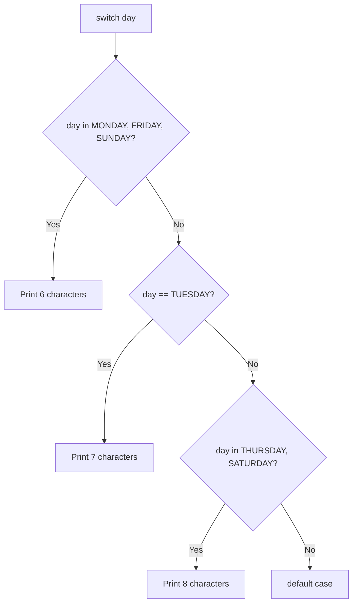
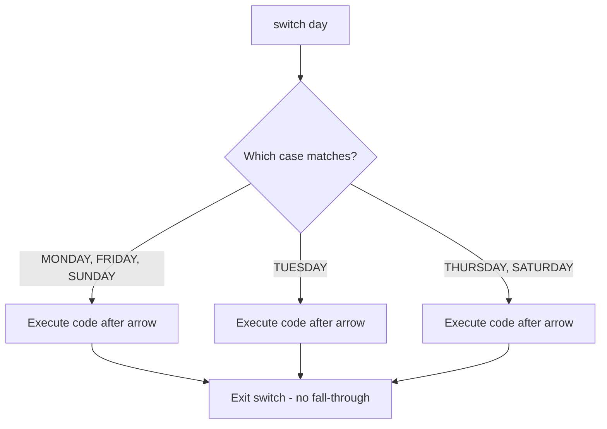
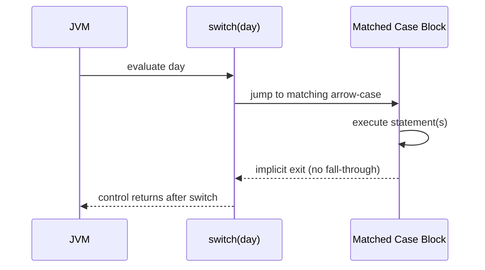
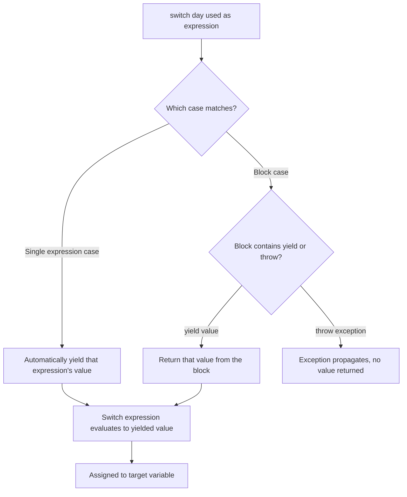
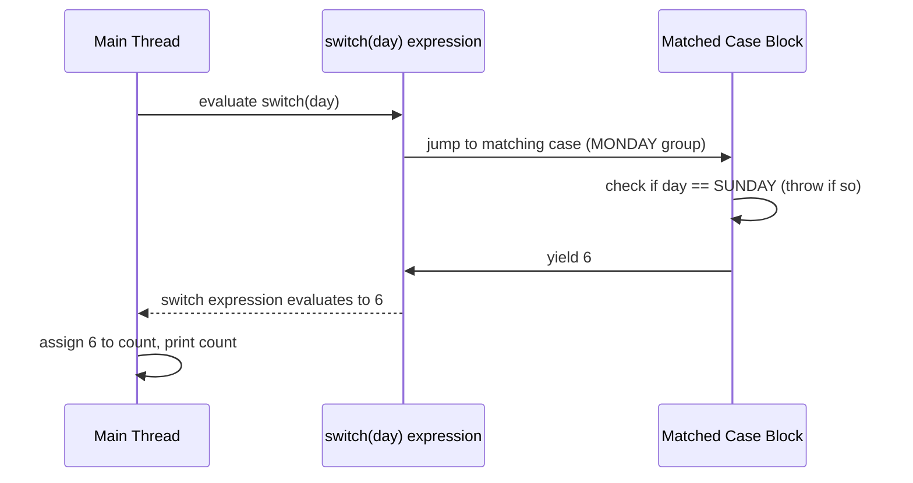
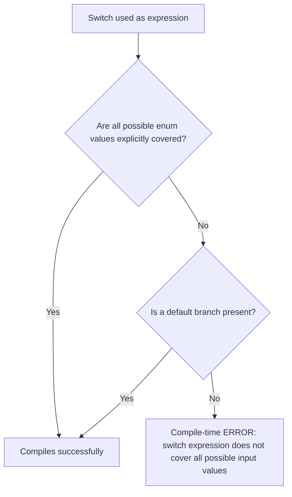
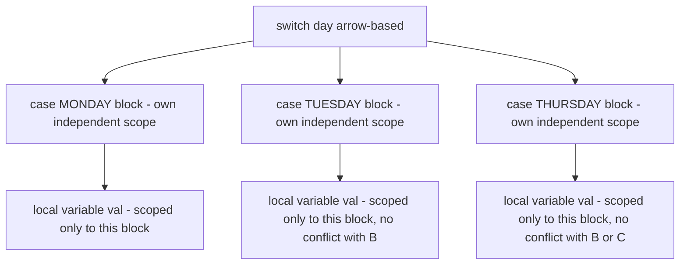
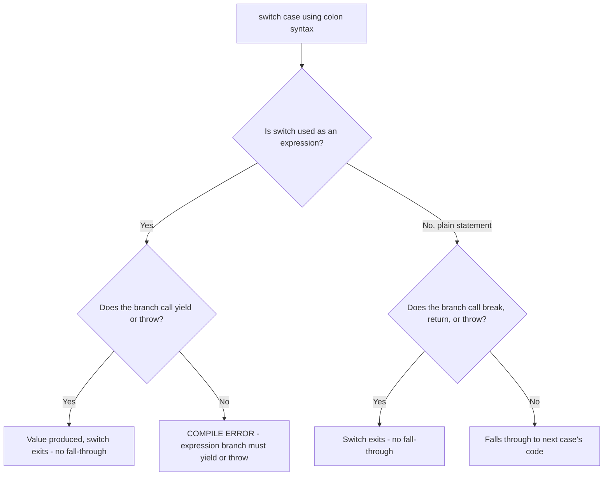

# Java 14 Switch Expressions: The Complete Guide

> This chapter covers all the major announcements/enhancements made to the `switch` construct in **Java 14** (the switch expressions feature, standardized as a permanent feature in JDK 14 via JEP 361, building on preview versions from JDK 12/13). It assumes you already understand the **classic (traditional) switch statement** and builds on that foundation to explain what changed, why it changed, and how to use the new syntax correctly.

---

# 📌 Prerequisite Recap: The Classic Switch Statement

## Overview

Before diving into Java 14's changes, it's essential to firmly understand the **traditional switch statement** that has existed in Java since its early versions, because every new feature is explained as a **fix or improvement** over this classic form.

## Definition

The classic switch statement lets you branch execution based on the value of a variable, comparing it against multiple `case` labels, using the `case label:` syntax followed by statements and (traditionally) a `break` statement.

## Syntax

```java
enum Day {
    MONDAY, TUESDAY, WEDNESDAY, THURSDAY, FRIDAY, SATURDAY, SUNDAY
}

public class ClassicSwitchDemo {
    public static void main(String[] args) {
        Day day = Day.MONDAY;

        switch (day) {
            case MONDAY:
            case FRIDAY:
            case SUNDAY:
                System.out.println("6 characters");
                break;
            case TUESDAY:
                System.out.println("7 characters");
                break;
            case THURSDAY:
            case SATURDAY:
                System.out.println("8 characters");
                break;
            default:
                System.out.println("Unknown day");
        }
    }
}
```

## Syntax Breakdown

| Element | Explanation |
|---|---|
| `switch (day)` | The variable being evaluated/matched against each case. |
| `case MONDAY:` | A label — if `day` equals `MONDAY`, execution jumps here. |
| Stacked cases (`case MONDAY:` `case FRIDAY:` `case SUNDAY:` with no code between them) | "Case stacking" — grouping multiple labels together so they share the same block of code below them. |
| `break;` | Explicitly exits the switch block, preventing "fall-through" into the next case. |
| `default:` | Executed if no case label matches. |

## Output (for `day = MONDAY`)

```
6 characters
```

## Line-by-Line Explanation

1. `Day day = Day.MONDAY;` declares an enum value.
2. `switch (day)` begins evaluating `day` against each `case`.
3. Since `day` is `MONDAY`, and `MONDAY` is stacked together with `FRIDAY` and `SUNDAY` (meaning there's no code — and crucially no `break` — directly under `case MONDAY:` or `case FRIDAY:`, only under the last one in the group, `case SUNDAY:`), execution "falls through" each empty case label until it reaches actual code.
4. It prints `"6 characters"`.
5. The `break;` statement then exits the switch block entirely, preventing further fall-through into `case TUESDAY:`.

## Key Observations

- **Case stacking** in the old switch requires listing multiple `case` labels on **separate lines**, each on its own, with no code in between, until you reach the case that actually holds the shared logic.
- Without an explicit `break`, execution **falls through** to the next case automatically — this is the default behavior of the classic switch statement.
- The classic switch statement is a pure **statement** — it does not produce or return a value directly; if you want a value, you must assign to a variable declared outside the switch, inside each case.

## Related Concepts

- `enum` types (commonly used with switch)
- Fall-through semantics
- `break` statement

---

# Overview of Problems With the Classic Switch Statement

The lecture identifies **five core problems** with the traditional switch statement that the Java 14 switch enhancements were designed to solve:

1. **Multiple lines needed for case stacking** (verbose grouping of related cases).
2. **Fall-through by default** (a common source of bugs when `break` is forgotten).
3. **No value return** from a switch (you must manually assign to an external variable in every case).
4. **No exhaustiveness check** (the compiler does not force you to cover all possible values).
5. **All case blocks share the same scope** (variable name collisions across different case blocks).

Each of these is addressed below as its own topic, matching how the new Java 14 switch syntax solves it.

---

# 📌 Topic 1: Comma-Separated Case Labels (Solving Multi-Line Case Stacking)

## Overview

Java 14 introduces the ability to **group multiple case labels together on a single line**, separated by commas, instead of stacking them across multiple lines.

## Why This Concept Exists

In the classic switch statement, grouping several case values that share the same logic required writing **one `case` line per value**, with no code in between, until reaching the case that actually contains the shared logic. This is verbose and clutters the code, especially when many values share identical behavior (e.g., "Monday, Friday, and Sunday all have 6 characters"). Java 14 solves this by allowing a **comma-separated list of labels** in a single `case` line.

## Definition

> [!IMPORTANT]
> Instead of writing:
> ```java
> case MONDAY:
> case FRIDAY:
> case SUNDAY:
>     // shared logic
>     break;
> ```
> Java 14 allows:
> ```java
> case MONDAY, FRIDAY, SUNDAY:
>     // shared logic
>     break;
> ```
> or, combined with the new arrow syntax (see Topic 2):
> ```java
> case MONDAY, FRIDAY, SUNDAY -> // shared logic
> ```

## Real-world Analogy

Think of the old way as writing separate name tags for each person in a group photo one at a time before finally describing what they're all doing together. The new comma-separated syntax is like writing one name tag that lists "Monday, Friday, Sunday" together, followed by a single description of what they all have in common — much less repetitive.

## Internal Working

- At the bytecode/compiler level, comma-separated case labels are still compiled into the same kind of lookup/jump table mechanism the JVM has always used for switch statements (`tableswitch` or `lookupswitch` bytecode instructions) — the comma-separated syntax is purely a **source-code convenience** that the compiler expands internally to associate multiple label values with the same code block.
- This means there is no runtime performance difference between the old multi-line stacking and the new comma-separated form — it is purely a **readability/maintainability improvement**.

## Syntax

```java
case MONDAY, FRIDAY, SUNDAY:
    System.out.println("6 characters");
    break;
```

## Syntax Breakdown

| Element | Explanation |
|---|---|
| `case MONDAY, FRIDAY, SUNDAY:` | A single case label line matching any of the three listed enum values. |
| Comma (`,`) | Separates multiple values that should share the same case logic. |

## Code Examples

### Beginner Example

```java
enum Day {
    MONDAY, TUESDAY, WEDNESDAY, THURSDAY, FRIDAY, SATURDAY, SUNDAY
}

public class CommaCaseDemo {
    public static void main(String[] args) {
        Day day = Day.FRIDAY;

        switch (day) {
            case MONDAY, FRIDAY, SUNDAY:
                System.out.println("6 characters");
                break;
            case TUESDAY:
                System.out.println("7 characters");
                break;
            case THURSDAY, SATURDAY:
                System.out.println("8 characters");
                break;
            default:
                System.out.println("Unknown");
        }
    }
}
```

### Output

```
6 characters
```

### Line-by-Line Explanation

1. `day` is `FRIDAY`.
2. The switch checks `case MONDAY, FRIDAY, SUNDAY:` — since `FRIDAY` is one of the three comma-separated values, this case matches.
3. `"6 characters"` is printed.
4. `break;` exits the switch.

### Step-by-Step Execution

| Step | Action |
|---|---|
| 1 | `switch(day)` evaluates `day` |
| 2 | Compares `day` against the combined label set `{MONDAY, FRIDAY, SUNDAY}` |
| 3 | Match found (`FRIDAY`) → executes the associated block |
| 4 | Prints `"6 characters"`, then breaks out of switch |

## Flowchart



## Key Observations

- This is purely a **syntactic improvement** — it reduces verbosity without changing runtime behavior compared to old-style case stacking.
- Can be used with **either** the old colon syntax (`case A, B, C:`) **or** the new arrow syntax (`case A, B, C ->`).
- Available starting in Java 14 (technically, comma-separated labels arrived alongside the broader switch expression feature).

## Common Mistakes

> [!WARNING]
> **Mistake:** Assuming comma-separated labels are only available with the new arrow syntax.
> **Why it happens:** Since both features arrived around the same Java version, people conflate them.
> **Correct approach:** Comma-separated labels can be used with the traditional colon syntax too — they are independent features that happen to complement each other.

## Best Practices

- Use comma-separated labels whenever multiple case values share identical logic — it significantly improves readability over multi-line stacking.

## Interview Notes

- **Q: Can you combine comma-separated labels with old-style colon syntax?** Yes — comma-separated labels work with both `:` and `->`.

## Related Concepts

- Arrow syntax (`->`) — Topic 2
- Case stacking (classic form)

## Practice Questions

**Easy:** Rewrite `case MONDAY: case TUESDAY: doSomething(); break;` using comma-separated syntax.

**Medium:** Can comma-separated case labels be mixed with `default` on the same line? (Research and verify.)

## Summary

- Java 14 allows `case A, B, C:` instead of stacking each label on its own line.
- Purely a readability improvement; same underlying bytecode behavior.
- Works with both old colon syntax and new arrow syntax.

---

# 📌 Topic 2: Arrow Syntax (`->`) — No More Fall-Through

## Overview

Java 14 introduces a **new case label form using an arrow (`->`)** instead of a colon (`:`). This fundamentally changes the fall-through behavior of switch: code using arrows **never falls through** to the next case, eliminating the need for `break` statements entirely.

## Why This Concept Exists

In the classic switch, forgetting a `break` statement causes execution to unintentionally **fall through** into the next case — one of the most notorious sources of subtle bugs in Java (and C-family languages generally) since the language's inception. Java 14 solves this by introducing an alternative label syntax where **only the code immediately associated with the matched label executes** — there is no concept of falling through to subsequent cases.

## Definition

> [!IMPORTANT]
> With the arrow (`->`) form:
> - **Only the code to the right-hand side of the arrow is executed** when that label matches.
> - There is **no fall-through** — execution never continues into the next case, regardless of whether a `break` is present.
> - Therefore, **no `break` statement is needed** (and none is required) when using arrow syntax.
> - The old colon-based (`case X:`) syntax is **still fully supported** in Java 14 — it is not removed or deprecated. Developers can still choose the classic fall-through style if desired. However, using the arrow explicitly opts into the new no-fall-through behavior.

## Real-world Analogy

Think of the colon-based switch as a hallway with open doorways between rooms — if you don't explicitly shut a door (`break`), you keep walking into the next room automatically. The arrow-based switch is like a set of **separate, self-contained rooms with no connecting doors at all** — once you enter the room that matches your label, you do whatever is in that room and then you're done; there's no way to accidentally wander into the next room.

## Internal Working

- At compile time, the arrow form is compiled such that each case's action is treated as an **independent, self-contained block** — the compiler does not generate the "fall to next case" control flow that colon-based `case` labels imply.
- Internally, the JVM still uses similar underlying switch bytecode dispatch mechanisms (`tableswitch`/`lookupswitch`) to jump to the matching case, but the compiler ensures there is an implicit "break" (or more precisely, no linkage to subsequent code) after each arrow-case's block finishes executing.
- This removes an entire class of bugs caused by **accidentally omitted `break` statements**.

## Syntax

```java
switch (day) {
    case MONDAY, FRIDAY, SUNDAY -> System.out.println("6 characters");
    case TUESDAY -> System.out.println("7 characters");
    case THURSDAY, SATURDAY -> System.out.println("8 characters");
    default -> System.out.println("Unknown day");
}
```

## Syntax Breakdown

| Element | Explanation |
|---|---|
| `case MONDAY, FRIDAY, SUNDAY ->` | The label(s); combines comma-separated grouping (Topic 1) with the new arrow. |
| `->` | Indicates: "only execute what follows this arrow if this label matches; do not fall through afterward." |
| No `break` | Not needed — and in fact, not permitted in certain contexts (a `break` inside an arrow-case block that's just a single expression doesn't make sense the same way). |

## Code Examples

### Beginner Example

```java
enum Day {
    MONDAY, TUESDAY, WEDNESDAY, THURSDAY, FRIDAY, SATURDAY, SUNDAY
}

public class ArrowSwitchDemo {
    public static void main(String[] args) {
        Day day = Day.MONDAY;

        switch (day) {
            case MONDAY, FRIDAY, SUNDAY -> System.out.println("6 characters");
            case TUESDAY -> System.out.println("7 characters");
            case THURSDAY, SATURDAY -> System.out.println("8 characters");
            default -> System.out.println("Unknown day");
        }
    }
}
```

### Output

```
6 characters
```

### Line-by-Line Explanation

1. `day` is `MONDAY`.
2. The switch checks the first arrow-case: `case MONDAY, FRIDAY, SUNDAY ->` — matches, since `MONDAY` is in that group.
3. `System.out.println("6 characters");` executes.
4. Execution **immediately exits the switch** — there is no possibility of falling through to `case TUESDAY ->` or any subsequent case, even though no `break` was written.

### Contrast Example — Demonstrating the Old Fall-Through Bug vs. New Safety

```java
enum Day {
    MONDAY, TUESDAY, WEDNESDAY, THURSDAY, FRIDAY, SATURDAY, SUNDAY
}

public class FallThroughComparisonDemo {
    public static void main(String[] args) {
        Day day = Day.FRIDAY;

        // OLD STYLE: missing break causes fall-through
        switch (day) {
            case MONDAY, FRIDAY, SUNDAY:
                System.out.println("6 characters"); // no break here on purpose
            case TUESDAY:
                System.out.println("7 characters");
                break;
            case THURSDAY, SATURDAY:
                System.out.println("8 characters");
                break;
        }

        System.out.println("---");

        // NEW STYLE: arrow, no fall-through possible
        switch (day) {
            case MONDAY, FRIDAY, SUNDAY -> System.out.println("6 characters");
            case TUESDAY -> System.out.println("7 characters");
            case THURSDAY, SATURDAY -> System.out.println("8 characters");
        }
    }
}
```

### Output

```
6 characters
7 characters
---
6 characters
```

### Line-by-Line Explanation

- In the **old-style** switch: `day` is `FRIDAY`, matching `case MONDAY, FRIDAY, SUNDAY:`. Since the `break` was intentionally omitted here, execution prints `"6 characters"` and then **falls through** into `case TUESDAY:`, printing `"7 characters"` as well, before finally hitting the `break` there and exiting.
- In the **new arrow-style** switch: the same `day` value (`FRIDAY`) matches `case MONDAY, FRIDAY, SUNDAY ->`, prints `"6 characters"`, and then **immediately exits the switch** — there is no fall-through into `case TUESDAY ->`, regardless of the absence of a `break`.

## Memory Representation

- Both switch forms operate on the same underlying primitive/enum-based dispatch mechanism at the JVM level (an ordinal-based jump table for enums, similar to string hashing for `String` switches).
- The key memory/execution-flow difference is **not** in data structures but in **control-flow linkage**: colon-based cases are compiled with implicit fall-through unless a `break`/`return`/`yield`/`throw` explicitly interrupts that flow, whereas arrow-based cases are compiled so that **each case's block is inherently isolated**, with an implicit exit after the block finishes.

## Flowchart



## Diagrams



## Key Observations

- The arrow form **eliminates the entire class of fall-through bugs** caused by a forgotten `break`.
- The old colon-based form is **still supported** in Java 14 — it is not deprecated or removed. You can still choose fall-through behavior if you explicitly want it (using colon syntax).
- Using the arrow form is optional but recommended for cleaner, safer code, unless you specifically need fall-through semantics.
- Only the code directly associated with the matched label's arrow executes — nothing more, nothing less.

## Common Mistakes

> [!WARNING]
> **Mistake:** Adding a `break;` statement inside an arrow-case block out of old habit.
> **Why it happens:** Developers coming from years of classic switch usage instinctively add `break`.
> **Correct approach:** Simply omit `break` entirely in arrow-case blocks — it is not needed, and depending on the context (e.g., a single-expression arrow case), it isn't even syntactically valid the same way.

> [!WARNING]
> **Mistake:** Assuming arrow syntax makes the old colon syntax obsolete or removed.
> **Why it happens:** Since arrow syntax fixes so many problems, developers assume the old form is gone.
> **Correct approach:** Both forms coexist in Java 14+ — you can even mix arrow-style cases and colon-style cases in different switch statements throughout your codebase (though not typically within the very same switch block for the primary cases — see Topic 6 for how colon/yield combos work).

## Best Practices

- Prefer arrow syntax (`->`) for new code to eliminate fall-through bugs and reduce boilerplate `break` statements.
- Reserve the old colon syntax for cases where you specifically need fall-through behavior (which should be rare and clearly intentional).

## Interview Notes

- **Q: Does the arrow syntax require a `break` statement?** No — and it's not needed because there is no fall-through concept with arrow syntax.
- **Q: Is the classic colon-based switch removed in Java 14?** No — it still works exactly as before; the arrow syntax is an additional, alternative form.
- **Q: What is the main benefit of arrow syntax?** It eliminates accidental fall-through bugs from missing `break` statements, since only the code to the right of the matched arrow executes.

## Related Concepts

- Comma-separated case labels (Topic 1)
- `yield` keyword (Topic 3)
- Block statements as case bodies (Topic 6)

## Practice Questions

**Easy:** Convert this colon-based switch case to arrow syntax: `case TUESDAY: System.out.println("Tues"); break;`

**Medium:** Explain why the arrow syntax reduces the likelihood of introducing bugs compared to colon syntax.

**Hard:** Write a switch statement using colon syntax that intentionally uses fall-through for two related cases, and explain why arrow syntax could not achieve the same fall-through effect directly.

## Summary

- New `case label ->` syntax: only the code after the arrow executes for a matching label.
- No fall-through — no `break` needed.
- Old colon syntax remains fully supported for those who want fall-through behavior.
- Significantly reduces switch-related bugs caused by missing `break` statements.

---

# 📌 Topic 3: Switch as an Expression — Returning Values (`yield` and Arrow Expressions)

## Overview

Java 14 introduces the ability to use `switch` as an **expression** — meaning a switch statement can now directly **produce/return a value** that can be assigned to a variable, rather than requiring you to manually assign to an external variable inside each case.

## Why This Concept Exists

In the classic switch statement, if you wanted to compute a value based on different cases, you had to:
1. Declare a variable **before** the switch.
2. Assign to that variable **inside each case**.
3. Remember to `break` after each assignment.

This is verbose, error-prone (forgetting to assign in some branch, or forgetting a `break`), and doesn't read naturally as "compute this value based on these conditions." Java 14 solves this by allowing switch to be used **directly as an expression** — similar to how a ternary (`? :`) expression works, but far more powerful, supporting multiple cases and complex logic.

## Definition

> [!IMPORTANT]
> A **switch expression** is a switch that is used in a context expecting a **value** — for example, on the right-hand side of an assignment (`int count = switch(day) { ... };`). Key points:
> - Every matching case must **produce a value**, either via:
>   - A **single expression** after the arrow (its value is automatically used as the switch's result), or
>   - A **block** of statements that explicitly uses the **`yield`** keyword to specify the value to return.
> - The entire switch expression must end with a **semicolon** (`;`), just like any other assignment/expression statement.
> - `yield` is the new keyword used to return a value from within a **block** in a switch expression (analogous to how `return` works for methods, but specific to switch expression blocks).

## Real-world Analogy

Think of the old way as sending someone into a room with instructions: "figure out the answer, then walk back out here and manually write it on this whiteboard yourself" (i.e., assigning to an external variable). The new switch-as-expression way is like handing someone a form: "just tell me the answer directly when you're done" — the switch itself directly **hands back** the computed value, no manual whiteboard-writing required.

## Internal Working

- When a switch is used as an expression, the compiler requires that **every possible branch produce a value of a compatible, uniform type** (or throw an exception instead).
- For a **single-expression arrow case** (e.g., `case TUESDAY -> 7;`), the compiler automatically treats that expression's value as the switch expression's result for that branch — this is syntactic sugar; internally it is conceptually similar to an implicit `yield`.
- For a **block-based arrow case** (e.g., `case MONDAY, FRIDAY, SUNDAY -> { ... yield 6; }`), the `yield` statement explicitly marks which value should be returned from that block, and control immediately exits the switch expression with that value (analogous to how `return` exits a method with a value).
- The compiler verifies **type consistency** across all branches — every branch must yield/return a value assignable to the target type expected by the switch expression's context (e.g., the type of the variable being assigned).

## Syntax — Single Expression Form

```java
int count = switch (day) {
    case MONDAY, FRIDAY, SUNDAY -> 6;
    case TUESDAY -> 7;
    case THURSDAY, SATURDAY -> 8;
    case WEDNESDAY -> 9;
    default -> 0;
};
```

## Syntax Breakdown

| Element | Explanation |
|---|---|
| `int count = switch (day) { ... };` | The switch expression's result is assigned directly to `count`. Note the trailing semicolon after the closing brace — required because this is an assignment expression. |
| `case MONDAY, FRIDAY, SUNDAY -> 6;` | A single expression (`6`) is automatically used as this branch's result value. |
| `default -> 0;` | Fallback branch. |

## Code Examples

### Beginner Example — Single Expression Per Case

```java
enum Day {
    MONDAY, TUESDAY, WEDNESDAY, THURSDAY, FRIDAY, SATURDAY, SUNDAY
}

public class SwitchExpressionDemo {
    public static void main(String[] args) {
        Day day = Day.WEDNESDAY;

        int count = switch (day) {
            case MONDAY, FRIDAY, SUNDAY -> 6;
            case TUESDAY -> 7;
            case THURSDAY, SATURDAY -> 8;
            case WEDNESDAY -> 9;
        };

        System.out.println(count);
    }
}
```

### Output

```
9
```

### Line-by-Line Explanation

1. `day` is `WEDNESDAY`.
2. The switch expression checks each case; `case WEDNESDAY -> 9;` matches.
3. Since this is a **single expression** (`9`), it is automatically used as the value produced by the switch expression for this branch.
4. The entire switch expression evaluates to `9`, which is then assigned to `count`.
5. The semicolon after the closing `}` of the switch expression is **required**, because the whole `switch(...) { ... }` construct is being treated as the right-hand side of an assignment statement.
6. `count` is printed: `9`.

### Intermediate Example — Block With `yield`

```java
enum Day {
    MONDAY, TUESDAY, WEDNESDAY, THURSDAY, FRIDAY, SATURDAY, SUNDAY
}

public class YieldBlockDemo {
    public static void main(String[] args) {
        Day day = Day.MONDAY;

        int count = switch (day) {
            case MONDAY, FRIDAY, SUNDAY -> {
                // Multiple statements require a block
                if (day == Day.SUNDAY) {
                    throw new IllegalStateException("Sunday is a holiday");
                }
                yield 6; // returns 6 from this block
            }
            case TUESDAY -> 7; // single statement - no yield needed
            case THURSDAY, SATURDAY -> 8;
            case WEDNESDAY -> 9;
        };

        System.out.println(count);
    }
}
```

### Output

```
6
```

### Line-by-Line Explanation

1. `day` is `MONDAY`, so `case MONDAY, FRIDAY, SUNDAY ->` matches.
2. Since this branch requires **more than one statement** (an `if` check plus a value to return), it must use a **block** (`{ ... }`) instead of a single expression.
3. Inside the block: `if (day == Day.SUNDAY) { throw new IllegalStateException(...); }` — this conditional throws an exception **only** if `day` is `SUNDAY` (demonstrating that a branch can either yield a value OR throw an exception, as long as the branch always does one or the other).
4. Since `day` is `MONDAY` (not `SUNDAY`), the exception is not thrown, and execution proceeds to `yield 6;`.
5. `yield 6;` explicitly specifies that this block's result value is `6` — this is analogous to a `return` statement, but specific to switch expression blocks (you cannot use plain `return` here because we're not inside a method boundary in the same way — `yield` is scoped to the switch expression).
6. The other cases (`TUESDAY`, `THURSDAY`/`SATURDAY`, `WEDNESDAY`) use **single-expression** arrows, so no `yield` is needed there — their values are used directly.
7. The overall switch expression evaluates to `6`, assigned to `count`, then printed.

## Memory Representation

- The value produced by a switch expression is computed and then placed into the target variable's memory location (stack slot for a local primitive like `int`, or a heap reference if the type is a reference type) — exactly as any other assignment would behave.
- Each `case` block, when using `{ }`, introduces its own **local scope** on the stack for any local variables declared within it (see Topic 5), which is popped once the block finishes (either via `yield` or an exception).

## Flowchart



## Diagrams



## Key Observations

- A switch expression must **always complete** for every possible matching branch — either by producing (yielding) a value, or by throwing an exception. It cannot simply "fall off the end" of a branch without doing one of these.
- Single-statement (single-expression) arrow cases **implicitly yield** their expression's value — no explicit `yield` keyword needed.
- Multi-statement arrow cases **require a block (`{ }`)**, and within that block, you must explicitly use `yield` to specify the return value (unless the block instead always throws an exception for that path).
- The entire `switch (...) { ... }` expression, when used in an assignment, must be terminated with a semicolon, just like any other expression statement.

## Common Mistakes

> [!WARNING]
> **Mistake:** Forgetting the semicolon after the closing brace of a switch expression used in an assignment.
> **Why it happens:** Traditional switch *statements* don't need a semicolon after their closing brace, but switch *expressions* used in assignments do, because the whole construct is the right-hand side of an assignment statement.
> **Correct approach:** Always end a switch-expression assignment with `;` after the final `}`.

> [!WARNING]
> **Mistake:** Trying to use `return` instead of `yield` inside a switch expression's block.
> **Why it happens:** Developers are used to `return` for exiting method logic with a value.
> **Correct approach:** Use `yield` specifically to produce a value from within a switch expression's block — `return` would attempt to exit the enclosing method entirely, which is not the intended behavior here.

## Best Practices

- Prefer switch expressions over the old "declare a variable above, assign inside each case" pattern whenever you need to compute a value based on multiple discrete cases — it's more concise and less error-prone.
- Use single-expression arrow cases whenever the logic for a case is just one value — reserve blocks with `yield` for cases requiring multiple statements or conditional logic before producing a value.
- Consider throwing exceptions for cases that logically shouldn't happen (like the `Sunday is a holiday` example) rather than returning a sentinel/default value that could be silently misused.

## Interview Notes

- **Q: What keyword is used to return a value from a block in a switch expression?** `yield`.
- **Q: Do you need `yield` for single-expression arrow cases?** No — the expression's value is automatically used.
- **Q: Can a switch expression branch simply do nothing and not return a value?** No — every branch must either yield a value or throw an exception; it cannot fall through without producing a value.
- **Q: Why can't you use `return` inside a switch expression block the way you use `yield`?** Because `return` would attempt to exit the enclosing method, not just the switch expression's block — `yield` is specifically scoped to producing the switch expression's result.

## Related Concepts

- `yield` keyword details (Topic 6, for the colon-based form)
- Exhaustiveness checking (Topic 4) — closely tied to switch expressions
- Ternary operator (`? :`) as a simpler, related concept for value-producing conditional logic

## Practice Questions

**Easy:** Write a switch expression that assigns a `String` message based on a `Day` enum value, using single-expression arrows.

**Medium:** Write a switch expression where one case uses a block with an `if` check that throws an exception under a certain condition, and otherwise yields a value.

**Hard:** Explain why the compiler requires a semicolon after a switch expression assignment, but not after a switch *statement* (non-assignment usage).

## Summary

- Switch can now be used as an **expression**, directly producing/returning a value.
- Single-expression arrow cases: value is automatically used (implicit yield).
- Multi-statement arrow cases: must use a block `{ }` and explicit `yield` to specify the value (or throw an exception instead).
- Requires a trailing semicolon when used in an assignment.
- Every branch must either yield a value or throw — no silent "fall off the end" allowed.

---

# 📌 Topic 4: Exhaustiveness Checking

## Overview

When a switch is used **as an expression** (i.e., expected to produce a value), the Java compiler enforces an **exhaustiveness check** — it requires that all possible input values be covered by some case, either explicitly or via a `default` branch. This is a compiler-enforced safety net that did not exist for the classic switch **statement**.

## Why This Concept Exists

In the classic switch statement, the compiler does **not** force you to handle every possible value of, say, an enum. If you miss a case, the switch simply does nothing for that value (falling through to nothing, or to a `default` if present, or nothing at all if there's no default) — this can silently hide bugs, especially when new enum constants are added later and developers forget to update all their switches. Java 14's exhaustiveness check for switch **expressions** solves this: since an expression must **always produce a value**, the compiler forces the developer to prove — at compile time — that every possible input is accounted for.

## Definition

> [!IMPORTANT]
> - In a classic switch **statement**, the compiler does **not** check whether all enum values (or other possible inputs) are covered — an uncovered value simply results in no matching case executing (or the `default` executing, if present).
> - In a switch **expression** (used to produce a value, e.g., assigned to a variable), the compiler **requires exhaustiveness**:
>   - Either **all possible values** must be explicitly covered by cases, **or**
>   - A `default` branch must be present to catch any remaining/unknown values.
> - If exhaustiveness is not satisfied, the compiler produces an error: **"switch expression does not cover all possible input values"**.

## Real-world Analogy

Imagine a checklist for packing a suitcase. In the old switch (statement) world, nobody checks your checklist — if you forget to pack socks, nobody stops you; you just end up without socks and no one notices until it's a problem. In the new switch (expression) world, it's like having someone at the door reviewing your checklist and saying: "You haven't marked every item — either check off everything explicitly, or write 'miscellaneous — catch-all' (`default`) to account for anything you didn't specifically list. I won't let you leave until the list is provably complete."

## Internal Working

- The compiler performs **static analysis** on the switch expression's case labels versus the declared type being switched on.
- For an `enum` type, the compiler knows the **complete, closed set** of possible enum constants (since enums cannot be extended with new constants at runtime) — so it can precisely verify whether every constant is covered by some case, or whether a `default` exists to catch the rest.
- If neither condition is satisfied, compilation **fails** with an explicit error message, preventing the program from being built until the switch expression is made exhaustive.
- This is a **compile-time-only** check — it adds no runtime overhead; it simply prevents non-exhaustive switch expressions from compiling in the first place.

## Syntax — Non-Exhaustive (Fails to Compile)

```java
// This will NOT compile if Day has 7 enum constants and only 3 are handled with no default
int count = switch (day) {
    case MONDAY -> 6;
    case THURSDAY -> 8;
    case WEDNESDAY -> 9;
};
```

## Syntax — Exhaustive (Compiles Successfully)

```java
// Option 1: cover every possible enum constant explicitly
int count = switch (day) {
    case MONDAY -> 6;
    case TUESDAY -> 7;
    case WEDNESDAY -> 9;
    case THURSDAY -> 8;
    case FRIDAY -> 6;
    case SATURDAY -> 8;
    case SUNDAY -> 6;
};

// Option 2: use a default branch to catch anything not explicitly listed
int count2 = switch (day) {
    case MONDAY -> 6;
    case TUESDAY -> 7;
    case WEDNESDAY -> 9;
    default -> 0; // catches THURSDAY, FRIDAY, SATURDAY, SUNDAY
};

// Option 3: use default to throw instead of returning a default value
int count3 = switch (day) {
    case MONDAY -> 6;
    case TUESDAY -> 7;
    case WEDNESDAY -> 9;
    default -> throw new IllegalStateException("Not handled: " + day);
};
```

## Code Examples

### Beginner Example — Statement (No Exhaustiveness Enforced) vs. Expression (Enforced)

```java
enum Day {
    MONDAY, TUESDAY, WEDNESDAY, THURSDAY, FRIDAY, SATURDAY, SUNDAY
}

public class ExhaustivenessDemo {
    public static void main(String[] args) {
        Day day = Day.FRIDAY;

        // (1) Classic switch STATEMENT - compiler does NOT force exhaustiveness
        int count = 0;
        switch (day) {
            case MONDAY:
                count = 6;
                break;
            case TUESDAY:
                count = 7;
                break;
            // Note: WEDNESDAY, THURSDAY, FRIDAY, SATURDAY, SUNDAY are NOT covered
            // This compiles just fine as a statement!
        }
        System.out.println(count); // prints 0 (default value), since FRIDAY isn't handled

        // (2) Switch EXPRESSION - compiler forces exhaustiveness (this code, as-is, would NOT compile without a default)
        /*
        int count2 = switch (day) {
            case MONDAY -> 6;
            case TUESDAY -> 7;
        }; // COMPILE ERROR: switch expression does not cover all possible input values
        */
    }
}
```

### Output (for the statement version only, since the expression version is commented out to avoid a compile error)

```
0
```

### Line-by-Line Explanation

1. `day` is `FRIDAY`.
2. In the **classic switch statement**, only `MONDAY` and `TUESDAY` are handled — `FRIDAY` matches neither case, and there's no `default`, so **nothing executes** inside the switch.
3. `count` retains its initial value of `0` (declared before the switch), and this is printed.
4. The compiler **did not complain** about missing cases — this compiles and runs, silently producing a possibly-unintended result (`0`) for `FRIDAY`, `WEDNESDAY`, `THURSDAY`, `SATURDAY`, and `SUNDAY`.
5. The commented-out **switch expression** version demonstrates that, had we tried to write `int count2 = switch(day) { case MONDAY -> 6; case TUESDAY -> 7; };`, the compiler would immediately reject this code with an error, because `day` could be `WEDNESDAY`, `THURSDAY`, `FRIDAY`, `SATURDAY`, or `SUNDAY`, none of which are covered, and there's no `default`.

## Memory Representation

- Exhaustiveness checking is a **purely compile-time, static analysis** concept — it has **no runtime memory footprint** whatsoever. No additional objects, stack frames, or heap allocations are involved; it's the compiler refusing to produce bytecode until the source code satisfies the exhaustiveness rule.

## Flowchart



## Key Observations

- Exhaustiveness checking applies **only** when switch is used as an **expression** (i.e., expected to produce a value) — it does **not** apply to switch used as a plain **statement**.
- For enum types, the compiler has full visibility into the complete list of possible constants, enabling precise exhaustiveness verification.
- Using `default` is the simplest way to satisfy exhaustiveness when you don't want to (or can't) enumerate every single possible value explicitly.
- `default` in a switch expression can either **return a value** (e.g., `default -> 0;`) or **throw an exception** (e.g., `default -> throw new IllegalStateException(...);`) — both approaches satisfy the exhaustiveness requirement, since throwing counts as "completing" that branch.

## Common Mistakes

> [!WARNING]
> **Mistake:** Assuming exhaustiveness checking applies to switch statements too.
> **Why it happens:** Developers hear "Java 14 added exhaustiveness checking to switch" without realizing it's specific to switch **expressions**.
> **Correct approach:** Remember this distinction is tied specifically to whether the switch is being used to **produce a value** (expression) — plain statement-style switches (even with the new arrow syntax, if not assigned to anything) do not require exhaustiveness.

> [!WARNING]
> **Mistake:** Adding a `default` branch just to silence the compiler error, without carefully considering whether a silent default value (like `0`) is actually the correct/safe behavior for unhandled cases.
> **Why it happens:** It's the quickest way to make the compile error go away.
> **Correct approach:** Consider whether throwing an exception in the `default` branch is more appropriate than silently returning a potentially misleading default value, especially for cases that should never legitimately occur.

## Best Practices

- Prefer explicitly listing all known cases when using switch expressions over enums, especially if the enum values are unlikely to change frequently — this way, if a new enum constant is added later, the compiler will immediately flag any switch expression that isn't updated to account for it (assuming no permissive `default` exists).
- Use `default -> throw new IllegalStateException(...)` when an unmatched case genuinely should never happen, to fail fast and loudly rather than silently returning an incorrect value.

## Interview Notes

- **Q: Does the classic switch statement enforce exhaustiveness?** No.
- **Q: When is exhaustiveness enforced?** Only when switch is used as an **expression** (producing a value).
- **Q: What are the two ways to satisfy exhaustiveness?** (1) Explicitly cover every possible input value, or (2) provide a `default` branch.
- **Q: What compiler error appears if exhaustiveness isn't satisfied?** Something to the effect of "switch expression does not cover all possible input values."

## Related Concepts

- Switch as an expression (Topic 3)
- `sealed` classes/interfaces (a related, more advanced Java feature — introduced later, in Java 17 — that also interacts with exhaustive switch pattern matching; mentioned here only as a related concept, not covered in this transcript)
- `default` label

## Practice Questions

**Easy:** Does a classic switch statement (not used as an expression) require a `default` branch to compile? Why or why not?

**Medium:** Write a switch expression over a 4-value enum that satisfies exhaustiveness by explicitly listing all 4 cases (no `default`).

**Hard:** Explain what would happen (compile-time and run-time) if you added a 5th value to an enum after having written an exhaustive switch expression (with all cases explicitly listed, no `default`) that only covers the original 4 values.

## Summary

- Switch **expressions** require exhaustiveness: all possible values must be covered, or a `default` must exist.
- Switch **statements** do NOT require exhaustiveness — missing cases simply do nothing at runtime.
- `default` can either return a fallback value or throw an exception — both satisfy the compiler's requirement.
- This check is purely at compile time and helps catch bugs early, especially as enums evolve over time.

---

# 📌 Topic 5: Scoping Rules — Independent Scope Per Case (Arrow Syntax)

## Overview

Java 14's arrow-based switch cases introduce **independent, isolated scopes** for each case block — solving a common problem in the classic switch statement where **all case blocks shared a single, combined scope**, leading to variable name collision errors.

## Why This Concept Exists

In the classic switch statement, all the code across all `case` labels within a single switch block technically lives in **one shared block scope** (unless you manually introduce nested `{ }` blocks per case). This means if you declare a local variable with the same name in two different `case` sections without using nested blocks, you get a **compile-time "variable already defined" error** — even though logically, those two cases would never execute at the same time. Java 14 solves this by treating each **arrow-case** as its own **independent scope automatically**.

## Definition

> [!IMPORTANT]
> - In the **classic colon-based switch**, all case labels within the switch share the **same block scope** by default. Declaring a local variable with the same name in two different cases (without wrapping each case in its own `{ }` block) causes a **compile-time error**: `variable <name> is already defined in the scope`.
> - In the **new arrow-based switch**, **each case is treated as its own independent scope automatically** — you do not need to add an explicit block just to isolate variable names, **as long as** each case body is either a single expression, or you use `{ }` for a multi-statement body (which is itself naturally its own scope).
> - This means you can safely declare a local variable with the **same name** in multiple different arrow-cases without any conflict.

## Real-world Analogy

Think of the classic colon-based switch cases as several roommates sharing **one big open studio apartment** — if two roommates both try to put a nameplate labeled "Desk" in the same shared space, you get a naming conflict, unless each roommate builds their own separate room (nested block) within the studio. The arrow-based switch, by contrast, gives **each case its own private apartment** by default — so two different "tenants" (cases) can each have their own "Desk" nameplate without any conflict, because they're in completely separate spaces.

## Internal Working

- When using the colon-based (`case X:`) form, the compiler parses the entire switch body (from the first case through the last, including all statements across all cases) as **one single block** for scoping purposes, unless the developer explicitly introduces nested braces `{ }` for a specific case's statements.
- When using the arrow-based (`case X ->`) form, **each case's associated code is inherently parsed as its own separate block/scope** by the compiler — whether that's a single expression or an explicit `{ }` block — meaning local variable declarations in one arrow-case's block are **not visible to, and do not conflict with**, local variable declarations in another arrow-case's block.
- This is enforced entirely by the Java compiler's scoping rules; there's no special runtime mechanism involved — it simply changes how variable resolution and duplicate-declaration checking is performed during compilation.

## Syntax — Old Style (Causes Error Without Explicit Blocks)

```java
switch (day) {
    case MONDAY:
        String val = "Monday";
        System.out.println(val);
        break;
    case TUESDAY:
        String val = "Tuesday"; // COMPILE ERROR: variable val is already defined in the scope
        System.out.println(val);
        break;
}
```

## Syntax — New Arrow Style (No Conflict, Independent Scopes)

```java
switch (day) {
    case MONDAY -> {
        String val = "Monday";
        System.out.println(val);
    }
    case TUESDAY -> {
        String val = "Tuesday"; // NO ERROR - independent scope from the MONDAY case
        System.out.println(val);
    }
}
```

## Syntax Breakdown

| Element | Explanation |
|---|---|
| `case MONDAY:` ... `case TUESDAY:` (no nested braces) | Both share the exact same enclosing block scope in the classic form — leads to variable collisions if identical names are used. |
| `case MONDAY -> { ... }` | The `{ }` after the arrow creates its own scope, isolated from other arrow-cases. |

## Code Examples

### Beginner Example — Demonstrating the Old Scope Collision Problem

```java
enum Day {
    MONDAY, TUESDAY, WEDNESDAY, THURSDAY, FRIDAY, SATURDAY, SUNDAY
}

public class ScopeCollisionDemo {
    public static void main(String[] args) {
        Day day = Day.MONDAY;

        switch (day) {
            case MONDAY:
                String val = "Monday";
                System.out.println(val);
                break;
            case TUESDAY:
                // The following line would cause: "variable val is already defined in the scope"
                // String val = "Tuesday";
                // System.out.println(val);
                break;
        }
    }
}
```

### Output

```
Monday
```

### Line-by-Line Explanation

1. `day` is `MONDAY`.
2. `case MONDAY:` declares a local variable `val` set to `"Monday"` and prints it.
3. `break;` exits the switch.
4. The commented-out lines under `case TUESDAY:` demonstrate that, had they been left active, declaring another local variable also named `val` in that case would trigger a **compile-time error**, because both `case MONDAY:` and `case TUESDAY:` share the exact same block scope in the classic colon-based form (since neither has an explicit nested `{ }` block specifically wrapping just their own statements).

### Intermediate Example — Using Explicit Blocks to Fix the Old-Style Collision (Classic Workaround)

```java
enum Day {
    MONDAY, TUESDAY, WEDNESDAY, THURSDAY, FRIDAY, SATURDAY, SUNDAY
}

public class ScopeFixWithBlocksDemo {
    public static void main(String[] args) {
        Day day = Day.TUESDAY;

        switch (day) {
            case MONDAY: {
                String val = "Monday";
                System.out.println(val);
                break;
            }
            case TUESDAY: {
                String val = "Tuesday"; // OK now - isolated inside its own explicit block
                System.out.println(val);
                break;
            }
        }
    }
}
```

### Output

```
Tuesday
```

### Line-by-Line Explanation

- By manually wrapping each case's statements in its own explicit `{ }` block, the classic switch statement can also avoid the variable collision — but this requires the developer to **remember** to do this manually for every case that declares locally-scoped variables.
- This was one of the "traditional workaround" techniques mentioned in the lecture for handling scope issues in old-style switches.

### Advanced Example — New Arrow Style, No Manual Workaround Needed for Single Expressions, Explicit Block for Multiple Statements

```java
enum Day {
    MONDAY, TUESDAY, WEDNESDAY, THURSDAY, FRIDAY, SATURDAY, SUNDAY
}

public class ArrowScopeDemo {
    public static void main(String[] args) {
        Day day = Day.TUESDAY;

        String result = switch (day) {
            case MONDAY, FRIDAY, SUNDAY -> {
                String val = "Monday";
                yield val;
            }
            case TUESDAY -> {
                String val = "Tuesday"; // No conflict with the 'val' declared in the MONDAY case above
                yield val;
            }
            case THURSDAY, SATURDAY -> {
                String val = "Weekend-adjacent";
                yield val;
            }
            case WEDNESDAY -> "Midweek";
        };

        System.out.println(result);
    }
}
```

### Output

```
Tuesday
```

### Line-by-Line Explanation

1. `day` is `TUESDAY`.
2. Each arrow-case that uses a **block** (`{ }`) — like `case MONDAY, FRIDAY, SUNDAY -> { ... }` and `case TUESDAY -> { ... }` — has its **own independent scope**. Declaring `String val` in both blocks does **not** cause a conflict, because arrow-case blocks are automatically isolated from each other.
3. Since `day` matches `case TUESDAY ->`, its block executes: `val` is set to `"Tuesday"`, and `yield val;` returns that value from the switch expression.
4. `case WEDNESDAY -> "Midweek";` is a single-expression arrow-case — no block needed, since there's only one statement (a string literal expression), and this value would be automatically used if matched.
5. `result` is assigned `"Tuesday"` and printed.

> [!NOTE]
> The lecture explicitly points out that for a **single-expression** arrow case (like `case WEDNESDAY -> "Midweek";`), you **cannot** simply write multiple statements directly after the arrow without wrapping them in `{ }`. If you have more than one statement for a given case, you **must** use a block.

## Memory Representation

- Each arrow-case block, when it declares local variables, creates its own **separate stack frame section** for those locals, scoped only to that block's execution — once the block finishes (via `yield`, an exception, or simply completing), those local variables go out of scope and their stack space is reclaimed, just like any other block-scoped local variable in Java.
- Because each arrow-case has an independent scope, there is no possibility of one case's local variable declaration being visible to (or clashing with) another case's declaration — they occupy conceptually and physically separate portions of the stack during their respective (mutually exclusive) executions.

## Flowchart



## Key Observations

- Classic colon-based switch cases **share one combined scope** unless the developer manually adds nested `{ }` blocks per case.
- Arrow-based switch cases are **automatically isolated** from each other — no manual nested-block workaround needed to avoid variable name collisions, **as long as** you use a block `{ }` when you have more than one statement.
- A single-expression arrow-case (no block) technically doesn't need this consideration much, since there's no room for a local variable declaration conflict with just one bare expression — but as soon as you need more than one statement, you must use `{ }`, and that block is automatically its own scope.
- This scoping improvement, combined with the exhaustiveness check and no-fall-through behavior, makes the arrow-based switch expression a much safer and cleaner tool overall.

## Common Mistakes

> [!WARNING]
> **Mistake:** Believing you can write multiple statements directly after an arrow without wrapping them in `{ }`.
> **Why it happens:** Developers assume the arrow syntax works like a lambda body might in some contexts, allowing multiple bare statements.
> **Correct approach:** If a case needs more than one statement, you **must** wrap it in `{ }`, and use `yield` inside that block if you need to produce a value.

> [!WARNING]
> **Mistake:** Assuming the old colon-based scope collision problem is somehow magically fixed for colon-based cases too, just because Java 14 was released.
> **Why it happens:** Conflating all Java 14 switch improvements together without realizing scoping isolation is specifically an **arrow-syntax** behavior.
> **Correct approach:** The improved automatic scoping only applies to **arrow-based** cases. If you use the old colon-based syntax, you still need manual nested `{ }` blocks per case to avoid variable name collisions, exactly as before.

## Best Practices

- Prefer arrow syntax not just for avoiding fall-through bugs, but also for the added benefit of **automatic scope isolation** per case — this reduces the need for manual nested blocks and the associated boilerplate.
- When a case's logic grows beyond a single expression, always wrap it in `{ }` and use `yield` (if producing a value) to keep the code both correct and readable.

## Interview Notes

- **Q: Do all case blocks in a classic switch statement share the same scope?** Yes, by default, unless you manually add nested `{ }` blocks for each case.
- **Q: Do arrow-based case blocks share the same scope with each other?** No — each arrow-case is treated as an independent scope automatically.
- **Q: Can you declare a local variable with the same name in two different arrow-cases?** Yes, without any conflict, since each arrow-case has its own separate scope.

## Related Concepts

- Block scoping rules in Java generally (applies to `if`, `for`, `while`, and other block constructs too)
- `yield` keyword (Topic 3, Topic 6)
- Arrow syntax fall-through elimination (Topic 2)

## Practice Questions

**Easy:** Does a single-expression arrow-case (e.g., `case X -> 5;`) need explicit `{ }` braces?

**Medium:** Rewrite a classic colon-based switch (with manual nested blocks to avoid a naming conflict) into the equivalent arrow-based switch, and explain how the arrow version simplifies the code.

**Hard:** Explain, at a conceptual compiler level, why arrow-case blocks don't need manual nested braces to avoid scope collisions, whereas colon-case blocks do.

## Summary

- Classic colon-based switch cases share one combined scope by default — causes variable name collisions unless manually nested in `{ }` per case.
- Arrow-based switch cases automatically get their **own independent scope** — no manual workaround needed.
- Multi-statement arrow-cases must use `{ }`, which is naturally its own isolated scope; single-expression arrow-cases don't have this concern in the same way.

---

# 📌 Topic 6: Mixing Old and New Syntax — Colon Labels With `yield` (No Arrow)

## Overview

Java 14 allows a **hybrid style**: you can use the traditional **colon (`:`)** label syntax together with the new comma-separated case grouping **and** the new `yield` keyword — without using the arrow (`->`) at all. This section clarifies exactly how fall-through, `break`, and `yield` interact depending on whether you use colon or arrow syntax.

## Why This Concept Exists

Java 14's designers wanted to preserve **full backward compatibility** with the classic switch syntax while still allowing developers to opt into individual new features (like comma-separated labels or `yield`) without being forced to adopt the entirely new arrow style. This flexibility lets teams **migrate gradually** or use whichever combination of features suits their specific needs.

## Definition

> [!IMPORTANT]
> Key rules to remember:
> - **Colon (`:`) always implies potential fall-through.** If you use `case X, Y:` (even with the new comma-separated grouping), the classic fall-through behavior still applies — you must explicitly use `break`, `return`, `yield`, or `throw` to prevent falling through to the next case.
> - **`yield` can be used with colon syntax too** — it is not exclusive to arrow syntax. Using colon syntax as an expression (producing a value) means you use `yield` instead of `break` to both (a) produce the value and (b) prevent fall-through, since `yield` inherently exits the switch expression.
> - **Arrow (`->`) never falls through**, regardless of whether `yield` is used or not.
> - If you have a `case X, Y:` (colon syntax) with a block of **multiple statements that do not produce any value** (i.e., it's being used as a plain statement, not an expression), you must still explicitly use `break` to prevent fall-through into the next case — `yield` is only relevant when switch is being used as an expression.

## Real-world Analogy

Think of it like a car with both a manual transmission (colon syntax, full manual control including the "fall through" risk if you don't shift/brake properly) and an automatic transmission (arrow syntax, handles stopping — i.e., not falling through — for you automatically). Java 14 lets you **choose per switch** (or even mix within reason) which "transmission style" to drive with, but the manual transmission still requires you to press the brake (`break`) or shift into "produce value and stop" mode (`yield`) yourself.

## Internal Working

- The Java compiler treats `:` and `->` as **fundamentally different control-flow markers**:
  - `:` retains the historical fall-through semantics inherited from C-style switch statements.
  - `->` is compiled such that **no implicit linkage** to the next case exists at all — it's structurally isolated.
- `yield`, when used within a colon-based case that's part of a switch **expression**, functions similarly to how it works in arrow-case blocks: it specifies the value to be produced by the switch expression **and** immediately transfers control out of the switch (thus also preventing fall-through) — but this "no fall-through" side effect specifically comes from `yield` exiting the expression, not from the colon syntax itself changing its fundamental fall-through nature.
- If a colon-based case block contains multiple statements and is **not** used as an expression (i.e., it's a plain statement switch, not producing a value) and does **not** call `yield`, `return`, or `throw`, you still need an explicit `break;` to prevent execution from continuing into the next case's code.

## Syntax — Colon Syntax With Comma Grouping and `yield` (As an Expression)

```java
int count = switch (day) {
    case MONDAY, TUESDAY, WEDNESDAY, THURSDAY, FRIDAY:
        yield 5; // weekday
    case SATURDAY, SUNDAY:
        yield 2; // weekend
    default:
        yield 0;
};
```

## Syntax Breakdown

| Element | Explanation |
|---|---|
| `case MONDAY, TUESDAY, ... FRIDAY:` | Comma-separated labels (Topic 1) combined with the old colon syntax. |
| `yield 5;` | Produces the value `5` for this branch **and** exits the switch expression (no fall-through, since `yield` is a value-producing exit, similar in spirit to `return`). |
| No `break` needed here | Because `yield` itself transfers control out of the switch expression. |

## Code Examples

### Beginner Example — Colon + Comma + `yield` (Expression Form)

```java
enum Day {
    MONDAY, TUESDAY, WEDNESDAY, THURSDAY, FRIDAY, SATURDAY, SUNDAY
}

public class ColonYieldDemo {
    public static void main(String[] args) {
        Day day = Day.SATURDAY;

        int count = switch (day) {
            case MONDAY, TUESDAY, WEDNESDAY, THURSDAY, FRIDAY:
                yield 5;
            case SATURDAY, SUNDAY:
                yield 2;
        };

        System.out.println(count);
    }
}
```

### Output

```
2
```

### Line-by-Line Explanation

1. `day` is `SATURDAY`.
2. The switch expression checks `case MONDAY, TUESDAY, WEDNESDAY, THURSDAY, FRIDAY:` — no match.
3. It checks `case SATURDAY, SUNDAY:` — matches.
4. `yield 2;` produces the value `2` for the switch expression **and** exits — there is no need for an explicit `break`, because `yield` (like `return` in a method) inherently transfers control away from the switch, preventing any fall-through to subsequent cases.
5. `count` is assigned `2` and printed.

> [!NOTE]
> Notice that even though this example uses the **old colon syntax** (`:`), we did **not** need a `break`, because `yield` was used instead — `yield` itself prevents fall-through in this context, since it immediately produces the switch expression's result and exits.

### Intermediate Example — Colon Syntax as a Plain Statement (Not an Expression) Still Requires `break`

```java
enum Day {
    MONDAY, TUESDAY, WEDNESDAY, THURSDAY, FRIDAY, SATURDAY, SUNDAY
}

public class ColonStatementStillNeedsBreakDemo {
    public static void main(String[] args) {
        Day day = Day.MONDAY;

        // This is a STATEMENT, not an expression - no value is being produced/returned
        switch (day) {
            case MONDAY, TUESDAY:
                System.out.println("Statement one");
                System.out.println("Statement two");
                System.out.println("Statement three");
                break; // REQUIRED here, since we are not yielding/returning any value
            case WEDNESDAY:
                System.out.println("Midweek");
                break;
        }
    }
}
```

### Output

```
Statement one
Statement two
Statement three
```

### Line-by-Line Explanation

1. `day` is `MONDAY`, matching `case MONDAY, TUESDAY:`.
2. Since this switch is used as a **plain statement** (its result is not being assigned to any variable — it's not an expression), and it does **not** call `yield` anywhere, the `break;` at the end of this case's block is **required** to prevent execution from falling through into `case WEDNESDAY:`.
3. All three print statements execute, then `break;` exits the switch.
4. If the `break;` had been omitted here, execution would have fallen through into `case WEDNESDAY:` and printed `"Midweek"` as well — demonstrating that **colon syntax retains full fall-through semantics regardless of comma-grouping**, unless you use `break`, `yield`, `return`, or `throw` to stop it.

## Memory Representation

- There is no difference in memory representation between colon-based and arrow-based switch cases at the level of local variable storage — both use standard JVM stack frames for local variables within their respective (potentially block-scoped) regions.
- The key difference remains purely in **control-flow bytecode generation**: colon-based cases generate bytecode that can fall through to the next case's instructions unless an explicit jump (from `break`, `return`, `yield`, or an exception) is present; arrow-based cases generate bytecode with an inherent "no linkage to next case" structure.

## Flowchart



## Key Observations

- **Colon syntax (`:`) always carries the *potential* for fall-through** — this is true whether or not you use comma-separated labels.
- **`yield` is not exclusive to arrow syntax** — it works with colon syntax too, whenever the switch is being used as an expression.
- When colon syntax is used as an **expression**, you use `yield` (not `break`) to both produce the value and exit — using `break` in that context wouldn't make sense, since `break` doesn't carry a value.
- When colon syntax is used as a plain **statement** (no value being produced), you still need `break` (or another control-transferring statement) to avoid fall-through, exactly as in the classic switch statement.
- **Arrow syntax (`->`) never falls through**, regardless of whether `yield` is present or the case is a plain statement — this is its defining characteristic (Topic 2).

## Common Mistakes

> [!WARNING]
> **Mistake:** Assuming that just because comma-separated labels or `yield` are being used, the switch automatically behaves like arrow syntax (no fall-through).
> **Why it happens:** These features were all introduced together in Java 14, leading to the misconception that they're bundled as a single all-or-nothing package.
> **Correct approach:** Remember that fall-through behavior is governed specifically by whether you use `:` (potential fall-through) or `->` (never falls through) — comma-separated labels and `yield` are independent, complementary features that can be combined with either label style.

> [!WARNING]
> **Mistake:** Forgetting `break` in a colon-based switch **statement** (not expression) that has multiple statements per case and doesn't call `yield`.
> **Why it happens:** Developers may mentally associate "Java 14 switch" with "no break needed," forgetting that this only strictly applies to arrow syntax or to expression-producing `yield` calls.
> **Correct approach:** If you're using colon syntax and NOT yielding a value (i.e., it's a plain statement), you still need `break` to prevent fall-through, exactly as in pre-Java-14 code.

## Best Practices

- For new code, prefer arrow syntax (`->`) to avoid needing to reason about fall-through at all.
- If you must use colon syntax (e.g., for legacy compatibility or specific fall-through requirements), be crystal clear about whether the switch is being used as a statement (needs `break`) or an expression (needs `yield`), and apply the correct exit mechanism consistently across all cases.

## Interview Notes

- **Q: Does using `yield` eliminate the need to worry about fall-through in colon-based switch cases?** Only within the specific case where `yield` is called — `yield` immediately exits, so fall-through cannot happen from that point. But other cases in the same switch that don't call `yield`/`break`/`return`/`throw` can still fall through.
- **Q: Can `yield` be used with the old colon syntax?** Yes — `yield` is a general keyword for producing a value from a switch expression, independent of whether you use colon or arrow labels.
- **Q: Does arrow syntax ever need `break`?** No, never — arrow syntax fundamentally never falls through, regardless of `yield`.

## Related Concepts

- Switch as an expression / `yield` (Topic 3)
- Arrow syntax no-fall-through behavior (Topic 2)
- Comma-separated case labels (Topic 1)

## Practice Questions

**Easy:** In a colon-based switch expression, what keyword replaces `break` to both produce a value and exit?

**Medium:** Write a colon-based switch **statement** (not expression) with comma-separated labels and multiple print statements per case, correctly using `break` to prevent fall-through.

**Hard:** Explain why a colon-based switch case that calls `yield` doesn't also need an explicit `break`, while a colon-based switch case that doesn't produce any value still does need `break`.

## Summary

- Colon syntax (`:`) always has the *potential* for fall-through, regardless of comma-grouping.
- `yield` works with both colon and arrow syntax, and its role is to produce a value for a switch **expression** while also exiting (thus avoiding fall-through in that specific branch).
- Plain colon-based **statements** without `yield` still need `break` to prevent fall-through, exactly as in the classic switch.
- Arrow syntax (`->`) never needs `break` and never falls through, under any circumstance.

---

# 📊 Master Comparison Table: All Java 14 Switch Enhancements

| Feature | Classic Switch (Pre-Java 14) | Java 14 Enhancement |
|---|---|---|
| Grouping multiple case values | Requires stacking labels on separate lines | Comma-separated labels on one line: `case A, B, C:` |
| Fall-through behavior | Default; must use `break` to prevent it | New arrow (`->`) syntax eliminates fall-through entirely; colon (`:`) syntax still falls through by default |
| Returning a value from switch | Not possible directly; must assign to an external variable inside each case | Switch can be used as an **expression**, directly producing a value via single-expression arrows or `yield` |
| Exhaustiveness checking | Not enforced — compiler allows missing cases silently | Enforced when switch is used as an **expression** — must cover all values or provide `default` |
| Scope of case blocks | All cases share one combined scope by default (manual nested blocks needed to isolate) | Arrow-case blocks automatically get independent, isolated scopes |
| `yield` keyword | N/A (did not exist) | New keyword to produce a value from a block in a switch expression; works with both colon and arrow syntax |

---

# 🧾 Master Summary (All Topics)

| Concept | One-Line Takeaway |
|---|---|
| Comma-separated labels | `case A, B, C:` or `case A, B, C ->` groups multiple values on one line, replacing multi-line stacking. |
| Arrow syntax (`->`) | Only the code after the arrow executes; no fall-through, no `break` needed. |
| Switch as an expression | Switch can directly produce/return a value; single expressions are auto-used, blocks need `yield`. |
| Exhaustiveness checking | Switch expressions must cover all possible values (explicitly or via `default`) or fail to compile. |
| Independent case scope | Each arrow-case gets its own automatic scope, avoiding variable name collisions across cases. |
| Colon + `yield` hybrid | `yield` works with old colon syntax too; colon still falls through unless `yield`/`break`/`return`/`throw` is used. |

> [!TIP]
> A simple mental model to remember all of this:
> - **Colon (`:`) = "fall-through possible"** — you must explicitly stop it with `break`, `yield`, `return`, or `throw`.
> - **Arrow (`->`) = "isolated, no fall-through, ever"** — nothing extra needed to stop it.
> - **`yield` = "return a value from this switch expression block"** — think of it like `return`, but scoped specifically to switch expressions.
> - **Exhaustiveness only matters when switch is used as an expression** (i.e., you're expecting a value back) — not for plain statement-style switches.

> [!NOTE]
> The lecturer recommends practicing each of these six behaviors by hand — writing out comma-grouped cases, arrow-based cases, `yield`-based expressions, exhaustiveness scenarios (both compiling and intentionally triggering the compile error), and scope-isolation examples — since these patterns are increasingly common in modern, real-world Java codebases and are frequently tested in technical interviews.
