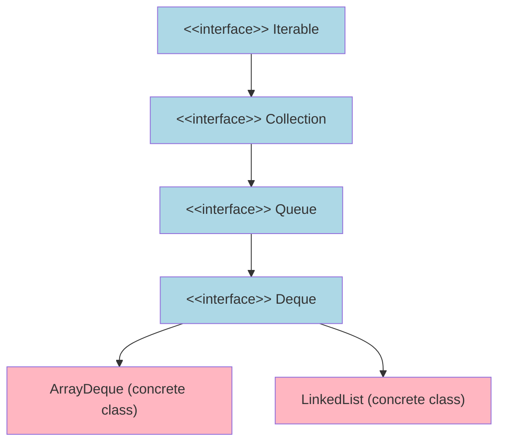
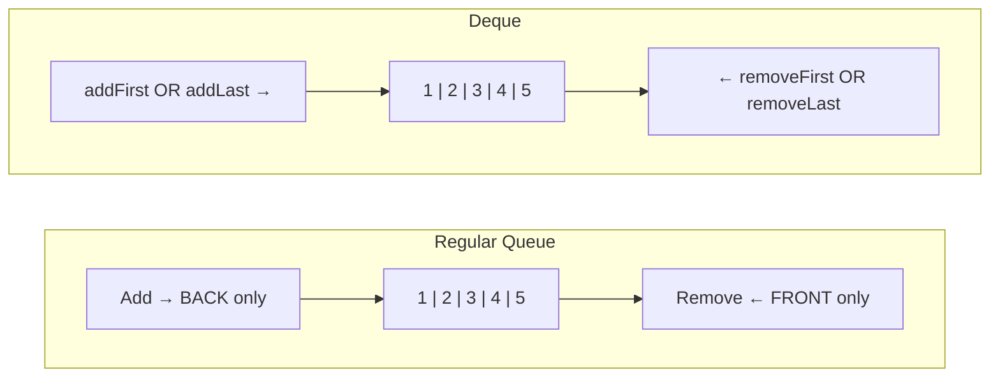
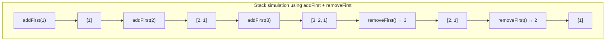
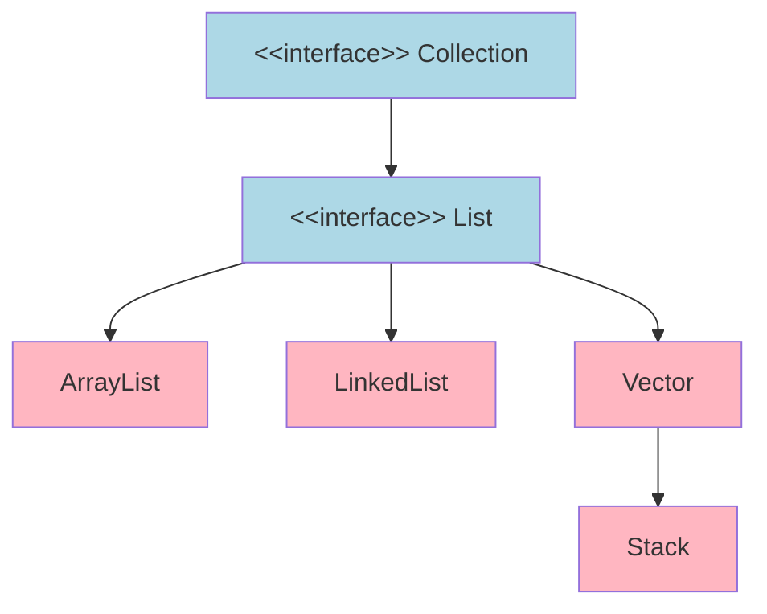
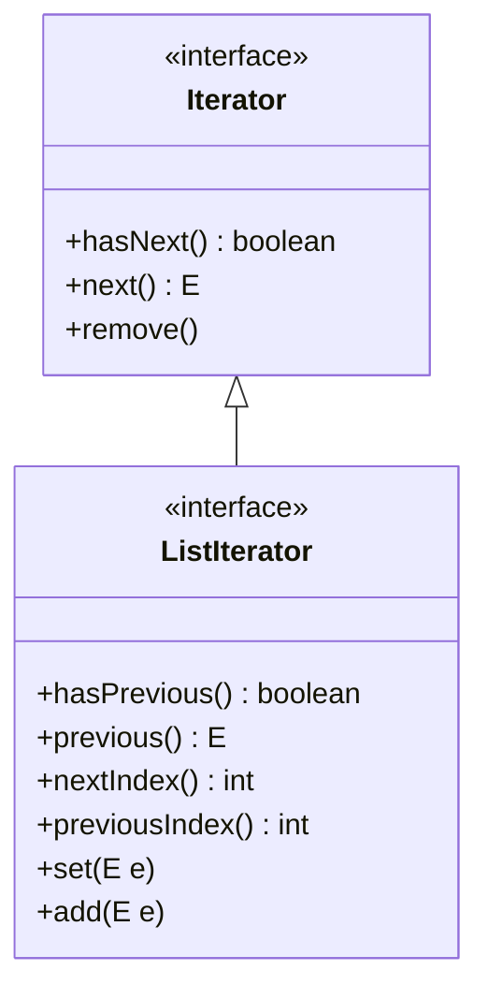
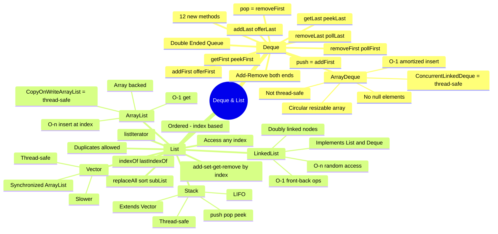

# 📚 Java Deque, List & Implementations — Complete Study Guide

> [!IMPORTANT]
> These notes build on the Java Collection Framework foundation. Topics covered: `Deque`, `ArrayDeque`, `List`, `ArrayList`, `LinkedList`, `Vector`, and `Stack` — including time complexities, thread safety, and the `ListIterator`.

---

## Table of Contents

1. [The `Deque` Interface — Double Ended Queue](#1-the-deque-interface--double-ended-queue)
2. [Deque Method Reference — Complete Table](#2-deque-method-reference--complete-table)
3. [Using Deque as a Stack](#3-using-deque-as-a-stack)
4. [ArrayDeque — Concrete Implementation](#4-arraydeque--concrete-implementation)
5. [ArrayDeque Time Complexity & Thread Safety](#5-arraydeque-time-complexity--thread-safety)
6. [The `List` Interface](#6-the-list-interface)
7. [List Methods — Complete Reference](#7-list-methods--complete-reference)
8. [The `ListIterator`](#8-the-listiterator)
9. [ArrayList — Concrete Implementation](#9-arraylist--concrete-implementation)
10. [ArrayList Time Complexity & Thread Safety](#10-arraylist-time-complexity--thread-safety)
11. [LinkedList — Concrete Implementation](#11-linkedlist--concrete-implementation)
12. [LinkedList Time Complexity & Thread Safety](#12-linkedlist-time-complexity--thread-safety)
13. [Vector — Thread-Safe List](#13-vector--thread-safe-list)
14. [Stack — Thread-Safe LIFO](#14-stack--thread-safe-lifo)
15. [Comparison Table — All Implementations](#15-comparison-table--all-implementations)
16. [Interview Notes](#16-interview-notes)
17. [Summary & Quick Revision](#17-summary--quick-revision)
18. [Practice Questions](#18-practice-questions)

---

# 📌 1. The `Deque` Interface — Double Ended Queue

## Overview

`Deque` (pronounced "deck") stands for **Double Ended Queue**. It is an interface in the JCF that extends the `Queue` interface, adding the ability to insert and remove elements from **both ends** of the queue.

## Position in the Hierarchy



## Regular Queue vs. Deque



| Operation | Regular Queue | Deque |
|---|---|---|
| Add element | Back only | Front **or** Back |
| Remove element | Front only | Front **or** Back |
| Examine element | Front only | Front **or** Back |

## Definition

> A **Deque** is a linear collection that supports element insertion and removal at **both ends**. It inherits all methods from `Queue` and adds symmetric equivalents for the other end.

## Real-world Analogy

Think of a **double-ended train** — passengers can board and exit from either the front or the rear of the train, unlike a regular queue at a ticket counter where everyone enters at the back and exits at the front.

---

# 📌 2. Deque Method Reference — Complete Table

`Deque` inherits all `Queue` methods and adds 12 new ones (4 for insert, 4 for remove, 4 for examine).

## Inherited Queue Methods (Still Available in Deque)

| Method | Behavior on Failure | Description |
|---|---|---|
| `add(e)` | Throws exception | Internally calls `addLast(e)` |
| `offer(e)` | Returns `false` | Internally calls `offerLast(e)` |
| `remove()` | Throws exception | Internally calls `removeFirst()` |
| `poll()` | Returns `null` | Internally calls `pollFirst()` |
| `element()` | Throws exception | Internally calls `getFirst()` |
| `peek()` | Returns `null` | Internally calls `peekFirst()` |

> [!IMPORTANT]
> When you use the standard `Queue` methods on a `Deque`, they automatically delegate to the corresponding **First/Last** variants shown above. This means a `Deque` used with only the inherited `Queue` methods behaves exactly like a **normal FIFO queue**.

## New Deque Methods — Insert

| Method | End | Behavior on Failure | Description |
|---|---|---|---|
| `addFirst(e)` | Front | Throws exception | Inserts at the start of the deque |
| `offerFirst(e)` | Front | Returns `false` | Inserts at the start; returns true/false |
| `addLast(e)` | Back | Throws exception | Inserts at the end of the deque |
| `offerLast(e)` | Back | Returns `false` | Inserts at the end; returns true/false |

## New Deque Methods — Remove

| Method | End | Behavior on Failure | Description |
|---|---|---|---|
| `removeFirst()` | Front | Throws exception | Removes and returns the first element |
| `pollFirst()` | Front | Returns `null` | Removes and returns the first element |
| `removeLast()` | Back | Throws exception | Removes and returns the last element |
| `pollLast()` | Back | Returns `null` | Removes and returns the last element |

## New Deque Methods — Examine (No Removal)

| Method | End | Behavior on Failure | Description |
|---|---|---|---|
| `getFirst()` | Front | Throws exception | Returns but does NOT remove the first element |
| `peekFirst()` | Front | Returns `null` | Returns but does NOT remove the first element |
| `getLast()` | Back | Throws exception | Returns but does NOT remove the last element |
| `peekLast()` | Back | Returns `null` | Returns but does NOT remove the last element |

> [!TIP]
> **Memory rule for all Deque methods:**
> - Methods with **`add`/`remove`/`get`** prefix → **throw an exception** on failure
> - Methods with **`offer`/`poll`/`peek`** prefix → **return `false` or `null`** on failure

---

# 📌 3. Using Deque as a Stack

## Why Deque Can Model a Stack

A **stack** follows **LIFO (Last In, First Out)**: elements are added and removed from the same end (the "top").

Since `Deque` lets you add and remove from both ends independently, you can simulate a stack by always using the **same end** (front) for both insertions and removals.

## Stack Behavior via Deque Methods



## Dedicated Stack Methods on Deque

`Deque` provides two convenience methods that internally call the front-end operations:

| Deque Method | Internally Calls | Stack Equivalent |
|---|---|---|
| `push(e)` | `addFirst(e)` | Push onto stack |
| `pop()` | `removeFirst()` | Pop from stack |

### Code Example — Deque as a Stack

```java
import java.util.ArrayDeque;
import java.util.Deque;

public class DequeAsStack {
    public static void main(String[] args) {
        Deque<Integer> stack = new ArrayDeque<>();

        // Push elements (addFirst internally)
        stack.push(1);   // [1]
        stack.push(2);   // [2, 1]
        stack.push(3);   // [3, 2, 1]
        stack.push(4);   // [4, 3, 2, 1]
        stack.push(5);   // [5, 4, 3, 2, 1]

        // Pop elements (removeFirst internally) — LIFO order
        System.out.println(stack.pop());  // 5
        System.out.println(stack.pop());  // 4
        System.out.println(stack.pop());  // 3
        System.out.println(stack.pop());  // 2
        System.out.println(stack.pop());  // 1
    }
}
```

### Output

```
5
4
3
2
1
```

> [!NOTE]
> Java's official documentation actually **recommends using `ArrayDeque` instead of `Stack`** for stack operations, because `Stack` extends the legacy `Vector` class (which uses synchronization even in single-threaded contexts), making it slower.

---

# 📌 4. ArrayDeque — Concrete Implementation

## Overview

`ArrayDeque` is a **concrete class** that implements the `Deque` interface. It uses a **resizable array** internally. It is the most commonly used implementation of `Deque`.

## Key Characteristics

- Implements `Deque` (and therefore `Queue` and `Collection`)
- Backed by a **circular resizable array**
- **Initial capacity**: 8 elements (default)
- Capacity **doubles** when full
- **Not thread-safe**
- **Does NOT allow `null` elements**
- Maintains **insertion order**
- Allows **duplicate elements**

## Internal Structure — Circular Array

`ArrayDeque` uses a **circular array** (also called a ring buffer). It maintains a `head` pointer and a `tail` pointer. Elements are added at the tail and removed from the head (for queue mode), or both operations happen at either end.

```
Initial (empty):
[ _, _, _, _, _, _, _, _ ]   capacity = 8
  ↑head=0, tail=0

After addLast(1), addLast(2), addLast(3):
[ 1, 2, 3, _, _, _, _, _ ]
  ↑head=0       ↑tail=3

After addFirst(0):
[ 1, 2, 3, _, _, _, _, 0 ]    0 wraps to the end
  ↑head=7  (wraps)     ↑tail=3
```

## Code Example — ArrayDeque as a Queue

```java
import java.util.ArrayDeque;
import java.util.Deque;

public class ArrayDequeAsQueue {
    public static void main(String[] args) {
        Deque<Integer> queue = new ArrayDeque<>();

        // FIFO insertion — add at the back
        queue.addLast(1);    // [1]
        queue.addLast(5);    // [1, 5]
        queue.addLast(10);   // [1, 5, 10]

        // FIFO removal — remove from the front
        System.out.println(queue.removeFirst());  // 1
        System.out.println(queue.removeFirst());  // 5
        System.out.println(queue.removeFirst());  // 10
    }
}
```

### Output

```
1
5
10
```

## Code Example — ArrayDeque as a Stack

```java
import java.util.ArrayDeque;
import java.util.Deque;

public class ArrayDequeAsStack {
    public static void main(String[] args) {
        Deque<Integer> stack = new ArrayDeque<>();

        // LIFO insertion — add at the front
        stack.addFirst(1);    // [1]
        stack.addFirst(5);    // [5, 1]
        stack.addFirst(10);   // [10, 5, 1]

        // LIFO removal — remove from the front
        System.out.println(stack.removeFirst());  // 10
        System.out.println(stack.removeFirst());  // 5
        System.out.println(stack.removeFirst());  // 1
    }
}
```

### Output

```
10
5
1
```

---

# 📌 5. ArrayDeque Time Complexity & Thread Safety

## Time Complexity

| Operation | Complexity | Notes |
|---|---|---|
| Insert at front (`addFirst`) | **O(1) amortized** | O(n) on resize |
| Insert at back (`addLast`) | **O(1) amortized** | O(n) on resize |
| Remove from front (`removeFirst`) | **O(1)** | Always |
| Remove from back (`removeLast`) | **O(1)** | Always |
| Examine front/back (`peekFirst`/`peekLast`) | **O(1)** | Always |
| Search (contains) | **O(n)** | Must traverse |
| Space | **O(n)** | n = number of elements |

## What Does "Amortized O(1)" Mean?

**Amortized O(1)** means the average time complexity per operation over many operations is O(1), even though occasional operations are slower.

The expensive case happens when the internal array is **full**:

```
Step 1: Array is full [1, 2, 3, 4, 5, 6, 7, 8] — capacity 8
Step 2: Resize — create new array of size 16
Step 3: Copy all 8 elements → O(n) for this one operation
Step 4: Insert new element → O(1)
```

This O(n) resize happens rarely — only when the array doubles. On average across all insertions, the cost per insert is still O(1).

## Thread Safety & Concurrent Versions

| Class | Thread Safe? | Notes |
|---|---|---|
| `ArrayDeque` | ❌ No | Use in single-threaded code |
| `ConcurrentLinkedDeque` | ✅ Yes | Thread-safe deque; non-blocking |

### ConcurrentLinkedDeque Example

```java
import java.util.concurrent.ConcurrentLinkedDeque;

public class ConcurrentDequeExample {
    public static void main(String[] args) {
        ConcurrentLinkedDeque<Integer> deque = new ConcurrentLinkedDeque<>();

        // Same methods as ArrayDeque — but thread-safe
        deque.addFirst(10);
        deque.addLast(20);
        System.out.println(deque.pollFirst());  // 10
        System.out.println(deque.pollLast());   // 20
    }
}
```

> [!WARNING]
> Do NOT use `ArrayDeque` (or `PriorityQueue`) in a **multi-threaded environment** where multiple threads can access the same queue concurrently. Use `ConcurrentLinkedDeque` (for deque) or `PriorityBlockingQueue` (for priority queue) instead.

---

# 📌 6. The `List` Interface

## Overview

`List` is an interface that extends `Collection`. It represents an **ordered collection** where:
- Elements are accessed by **integer index** (starting from `0`)
- **Duplicate elements** are allowed
- **`null` elements** are allowed (in most implementations)
- Data can be inserted, removed, or accessed **from any position**

## How List Differs from Queue

This is a key conceptual distinction:

| Feature | Queue / Deque | List |
|---|---|---|
| Access | Front or back only | **Any index** |
| Internal structure | Circular array / linked nodes | Array or linked list with index |
| Removal | Front or back | Any index |
| Insertion | Front or back | Any index |
| Index-based access | ❌ No | ✅ Yes |

## Real-world Analogy

A `List` is like a **numbered shelf in a library**. You can place a book at shelf #3, remove the book from shelf #7, or look at the book on shelf #0 — accessing any position directly by its number.

## Position in the Hierarchy



---

# 📌 7. List Methods — Complete Reference

The `List` interface includes **all methods inherited from `Collection`** plus the following new index-aware methods:

## New Methods Added by `List`

| Method | Description |
|---|---|
| `add(int index, E element)` | Inserts element at the given index; shifts all subsequent elements right |
| `addAll(int index, Collection c)` | Inserts all elements of collection `c` starting at given index; shifts subsequent elements right |
| `get(int index)` | Returns element at the given index |
| `set(int index, E element)` | **Replaces** (does NOT shift) the element at the given index; returns the old element |
| `remove(int index)` | Removes and returns element at given index; shifts subsequent elements left |
| `indexOf(Object o)` | Returns index of **first occurrence** of `o`; returns `-1` if not found |
| `lastIndexOf(Object o)` | Returns index of **last occurrence** of `o`; returns `-1` if not found |
| `replaceAll(UnaryOperator<E> op)` | Applies the given function to every element in place (Java 1.8) |
| `sort(Comparator<E> c)` | Sorts the list using the given comparator |
| `listIterator()` | Returns a `ListIterator` starting at index 0 |
| `listIterator(int index)` | Returns a `ListIterator` starting at the given index |
| `subList(int from, int to)` | Returns a view of the list from `from` (inclusive) to `to` (exclusive) |

## Critical Difference: `add(index, e)` vs. `set(index, e)`

```
List before: [100, 200, 300, 400]
Indices:       0    1    2    3

After add(2, 999):    // Shifts elements right — list GROWS
[100, 200, 999, 300, 400]
  0    1    2    3    4

After set(2, 999):    // Replaces element — list size unchanged
[100, 200, 999, 400]
  0    1    2    3
```

> [!IMPORTANT]
> - **`add(index, element)`** → inserts; existing element at that index **shifts to the right**; list **grows by 1**
> - **`set(index, element)`** → replaces; existing element is **overwritten**; list size **stays the same**

## Critical Difference: `remove(int index)` vs. `remove(Object o)`

```java
List<Integer> list = new ArrayList<>(Arrays.asList(10, 20, 30, 40));

list.remove(2);                    // Removes by INDEX → removes 30 (index 2)
list.remove(Integer.valueOf(10));  // Removes by OBJECT VALUE → removes 10
```

> [!WARNING]
> `list.remove(3)` with a **primitive `int`** removes by **index**.
> `list.remove(Integer.valueOf(3))` with an **Integer object** removes by **value**.
> This is a very common source of bugs.

## `subList()` — Important Behavior

`subList(fromIndex, toIndex)` returns a **live view** (not a copy) of the original list.

```java
List<Integer> main = new ArrayList<>(Arrays.asList(0, 1, 2, 3, 4, 5));
List<Integer> sub = main.subList(1, 4);  // [1, 2, 3]  (indices 1 inclusive to 4 exclusive)

sub.remove(Integer.valueOf(2));  // Removes from sub AND from main!
System.out.println(main);        // [0, 1, 3, 4, 5]
```

> [!CAUTION]
> Any modification to a `subList` is immediately reflected in the original list, and vice versa. They share the same underlying data.

## Complete Code Example — All List Methods

```java
import java.util.ArrayList;
import java.util.Arrays;
import java.util.List;

public class ListMethodsExample {
    public static void main(String[] args) {

        // ── add(index, element) ──
        List<Integer> list1 = new ArrayList<>();
        list1.add(0, 100);   // [100]
        list1.add(1, 200);   // [100, 200]
        list1.add(3, 300);   // IndexOutOfBoundsException! index 3 doesn't exist yet
    }
}
```

> [!WARNING]
> You can only `add` at an index that already exists OR at the index equal to `size()` (appending). Adding at index 3 when size is 2 throws `IndexOutOfBoundsException`.

```java
import java.util.ArrayList;
import java.util.List;

public class ListMethodsExample {
    public static void main(String[] args) {

        // Build the list step by step
        List<Integer> list1 = new ArrayList<>();
        list1.add(0, 100);  // [100]
        list1.add(1, 200);  // [100, 200]
        list1.add(2, 300);  // [100, 200, 300]
        list1.add(2, 300);  // [100, 200, 300, 300] — duplicate, valid

        // ── addAll(index, collection) ──
        List<Integer> list2 = new ArrayList<>();
        list2.add(400);
        list2.add(500);
        list2.add(600);
        // list2 = [400, 500, 600]

        list1.addAll(2, list2);
        // Inserts list2 starting at index 2 and shifts remaining elements right
        // list1 = [100, 200, 400, 500, 600, 300, 300]

        System.out.println("After addAll: " + list1);

        // ── replaceAll(UnaryOperator) ──
        // Multiply every element by -1
        list1.replaceAll(value -> value * -1);
        System.out.println("After replaceAll (*-1): " + list1);
        // [-100, -200, -400, -500, -600, -300, -300]

        // ── sort(Comparator) ──
        list1.sort((v1, v2) -> v1 - v2);  // ascending order
        System.out.println("After sort (ascending): " + list1);
        // [-600, -500, -400, -300, -300, -200, -100]

        // ── get(index) ──
        System.out.println("Element at index 2: " + list1.get(2));  // -400

        // ── set(index, element) — REPLACES, does not shift ──
        list1.set(2, -4000);
        System.out.println("After set(2, -4000): " + list1);
        // [-600, -500, -4000, -300, -300, -200, -100]

        // ── remove(index) — removes and shifts remaining left ──
        list1.remove(2);  // removes -4000
        System.out.println("After remove(2): " + list1);
        // [-600, -500, -300, -300, -200, -100]

        // ── indexOf(Object) ──
        System.out.println("First index of -300: " + list1.indexOf(Integer.valueOf(-300)));   // 2
        System.out.println("Last index of -300: " + list1.lastIndexOf(Integer.valueOf(-300))); // 3
    }
}
```

### Output

```
After addAll: [100, 200, 400, 500, 600, 300, 300]
After replaceAll (*-1): [-100, -200, -400, -500, -600, -300, -300]
After sort (ascending): [-600, -500, -400, -300, -300, -200, -100]
Element at index 2: -400
After set(2, -4000): [-600, -500, -4000, -300, -300, -200, -100]
After remove(2): [-600, -500, -300, -300, -200, -100]
First index of -300: 2
Last index of -300: 3
```

---

# 📌 8. The `ListIterator`

## Overview

`ListIterator<E>` is a specialized iterator returned by `List.listIterator()`. It extends the standard `Iterator` and adds the ability to:

1. Traverse the list **in both directions** (forward and backward)
2. **Modify** elements during iteration (`set()`)
3. **Insert** elements during iteration (`add()`)
4. Query the **index** of the next and previous elements

## Hierarchy



## Complete Method Reference

| Method | Direction | Description |
|---|---|---|
| `hasNext()` | Forward | Returns `true` if there are more elements in the forward direction |
| `next()` | Forward | Returns next element and advances cursor forward |
| `hasPrevious()` | Backward | Returns `true` if there are more elements in the backward direction |
| `previous()` | Backward | Returns previous element and moves cursor backward |
| `nextIndex()` | — | Returns the index of the element that would be returned by `next()` |
| `previousIndex()` | — | Returns the index of the element that would be returned by `previous()` |
| `remove()` | — | Removes the last element returned by `next()` or `previous()` |
| `set(E e)` | — | Replaces the last element returned by `next()` or `previous()` |
| `add(E e)` | — | Inserts element immediately **before** the element that would be returned by `next()` |

## Understanding the Cursor

The `ListIterator` cursor sits **between** elements, not on them:

```
List: [-600, -500, -300, -200, -100]
         0     1     2     3     4

Cursor positions (marked with |):
|  -600  |  -500  |  -300  |  -200  |  -100  |
^pos0        pos1     pos2     pos3     pos4    ^pos5

At position 2 (cursor between index 1 and 2):
  previous() → returns -500 (index 1), cursor moves to pos1
  next()     → returns -300 (index 2), cursor moves to pos3
  previousIndex() → 1
  nextIndex()     → 2
```

## Code Example — Forward Traversal with ListIterator

```java
import java.util.ArrayList;
import java.util.List;
import java.util.ListIterator;

public class ListIteratorForward {
    public static void main(String[] args) {
        List<Integer> list = new ArrayList<>();
        list.add(-600);
        list.add(-500);
        list.add(-300);
        list.add(-200);
        list.add(-100);
        // list = [-600, -500, -300, -200, -100]

        // listIterator() with no argument — cursor starts at position 0 (before index 0)
        ListIterator<Integer> it = list.listIterator();

        while (it.hasNext()) {
            Integer value = it.next();
            System.out.println("Value: " + value
                    + " | nextIndex: " + it.nextIndex()
                    + " | prevIndex: " + it.previousIndex());

            // When we reach -200, insert -100 before the next element
            if (value.equals(-200)) {
                it.add(-150);
                // Inserts -150 before -100 (what next() would return)
                // list becomes [-600, -500, -300, -200, -150, -100]
                // Subsequent calls to next() are NOT affected — next() still returns -100
            }
        }

        System.out.println("Final list: " + list);
    }
}
```

### Output

```
Value: -600 | nextIndex: 1 | prevIndex: 0
Value: -500 | nextIndex: 2 | prevIndex: 1
Value: -300 | nextIndex: 3 | prevIndex: 2
Value: -200 | nextIndex: 4 | prevIndex: 3
Value: -100 | nextIndex: 6 | prevIndex: 5
Final list: [-600, -500, -300, -200, -150, -100]
```

### How `add()` During ListIterator Works

```
Before add(-150):
Cursor is between -200 and -100
[ -600, -500, -300, -200, | , -100 ]
                           ↑ cursor here

After it.add(-150):
[ -600, -500, -300, -200, -150, -100 ]
                                ↑ next() will return -100 (unaffected)
                           ↑ previous() would return -150
```

> [!NOTE]
> After calling `it.add(e)`, the newly inserted element becomes what `previous()` would return. The `next()` call is **not affected** — it still returns what it would have before the insert.

## Code Example — Backward Traversal with ListIterator

```java
import java.util.ArrayList;
import java.util.List;
import java.util.ListIterator;

public class ListIteratorBackward {
    public static void main(String[] args) {
        List<Integer> list = new ArrayList<>();
        list.add(-600);
        list.add(-500);
        list.add(-300);
        list.add(-200);
        list.add(-100);
        // list = [-600, -500, -300, -200, -100]

        // listIterator(size) — cursor starts at the END (after last element)
        ListIterator<Integer> it = list.listIterator(list.size());

        while (it.hasPrevious()) {
            Integer value = it.previous();
            System.out.println("Value: " + value
                    + " | nextIndex: " + it.nextIndex()
                    + " | prevIndex: " + it.previousIndex());

            // Replace -100 with -50
            if (value.equals(-100)) {
                it.set(-50);
                // Replaces last element returned by previous() (which was -100) with -50
            }
        }

        System.out.println("Final list: " + list);
    }
}
```

### Output

```
Value: -100 | nextIndex: 4 | prevIndex: 3
Value: -200 | nextIndex: 3 | prevIndex: 2
Value: -300 | nextIndex: 2 | prevIndex: 1
Value: -500 | nextIndex: 1 | prevIndex: 0
Value: -600 | nextIndex: 0 | prevIndex: -1
Final list: [-600, -500, -300, -200, -50]
```

> [!NOTE]
> `listIterator(list.size())` places the cursor at the very end, so `hasPrevious()` will return `true` and `previous()` will return the last element.

---

# 📌 9. ArrayList — Concrete Implementation

## Overview

`ArrayList` is the most commonly used `List` implementation. It is backed by a **dynamic array** that grows automatically as elements are added.

## Key Characteristics

| Feature | Value |
|---|---|
| Backed by | Resizable array |
| Initial capacity | **10** elements (default) |
| Growth factor | Approximately **1.5×** when full |
| Thread-safe | ❌ No |
| Null elements | ✅ Allowed |
| Duplicate elements | ✅ Allowed |
| Maintains insertion order | ✅ Yes |

## Internal Resizing

```
Initial:  [_, _, _, _, _, _, _, _, _, _]   capacity = 10
After 10 adds: [1, 2, 3, 4, 5, 6, 7, 8, 9, 10]   full

Add 11th element triggers resize:
New capacity ≈ 10 * 1.5 = 15
New array:  [1, 2, 3, 4, 5, 6, 7, 8, 9, 10, 11, _, _, _, _]
```

> [!NOTE]
> `ArrayDeque` starts at capacity 8 and **doubles**. `ArrayList` starts at capacity 10 and grows by approximately **1.5×**. Both use amortized O(1) insertion at the end.

## Complete Code Example

```java
import java.util.ArrayList;
import java.util.Collections;
import java.util.List;

public class ArrayListExample {
    public static void main(String[] args) {
        List<Integer> list = new ArrayList<>();

        // ── Basic add ──
        list.add(30);
        list.add(10);
        list.add(20);
        list.add(10);   // duplicate allowed
        list.add(null); // null allowed
        // list = [30, 10, 20, 10, null]

        System.out.println("Size: " + list.size());       // 5
        System.out.println("Get index 2: " + list.get(2)); // 20

        // ── Sort (ignoring null for simplicity) ──
        list.remove(null);
        list.sort((a, b) -> a - b);
        System.out.println("Sorted: " + list);  // [10, 10, 20, 30]

        // ── Thread-safe version ──
        // Use CopyOnWriteArrayList for multi-threaded access
        // java.util.concurrent.CopyOnWriteArrayList<Integer> safeList =
        //     new java.util.concurrent.CopyOnWriteArrayList<>(list);
    }
}
```

---

# 📌 10. ArrayList Time Complexity & Thread Safety

## Time Complexity

| Operation | Complexity | Reason |
|---|---|---|
| `add(e)` — append at end | **O(1) amortized** | Array has space; O(n) on resize |
| `add(index, e)` — insert at index | **O(n)** | Must shift all subsequent elements right |
| `get(index)` | **O(1)** | Direct array index access |
| `set(index, e)` | **O(1)** | Direct array index access |
| `remove(index)` | **O(n)** | Must shift all subsequent elements left |
| `contains(o)` / `indexOf(o)` | **O(n)** | Must scan the array linearly |
| `size()`, `isEmpty()` | **O(1)** | Cached field |
| Space | **O(n)** | One slot per element |

## Why Insertion/Deletion at Index is O(n)

```
List: [10, 20, 30, 40, 50]   Insert 99 at index 2

Step 1: Shift elements right from index 2 onward
[10, 20, 30, 30, 40, 50]  (copy 50→index5, 40→index4, 30→index3)
Step 2: Place 99 at index 2
[10, 20, 99, 30, 40, 50]

Worst case (insert at index 0): shift ALL n elements → O(n)
```

## Thread Safety

| Variant | Thread Safe? | Notes |
|---|---|---|
| `ArrayList` | ❌ No | Fast; use in single-threaded contexts |
| `Collections.synchronizedList(new ArrayList<>())` | ✅ Yes (with manual sync on iteration) | Wraps each method with `synchronized` |
| `CopyOnWriteArrayList` | ✅ Yes | Each mutation creates a fresh copy of the array; great for read-heavy, write-rare scenarios |

---

# 📌 11. LinkedList — Concrete Implementation

## Overview

`LinkedList` is unique because it implements **both** `List` **and** `Deque`. This means it can function as:
- An **index-based list** (like `ArrayList`)
- A **double-ended queue** (like `ArrayDeque`)
- A **stack**
- A **queue**

## Internal Data Structure

`LinkedList` is backed by a **doubly linked list**. Each element is stored in a **Node** object:

```java
// Internal Node structure (simplified)
private static class Node<E> {
    E item;
    Node<E> next;   // pointer to next node
    Node<E> prev;   // pointer to previous node
}
```

```
head                                    tail
 ↓                                       ↓
[null ← 100 ⇄ 200 ⇄ 300 ⇄ 400 → null]
          0     1     2     3
```

## Key Characteristics

| Feature | Value |
|---|---|
| Backed by | Doubly linked list nodes |
| Thread-safe | ❌ No |
| Null elements | ✅ Allowed |
| Duplicate elements | ✅ Allowed |
| Maintains insertion order | ✅ Yes |
| Index-based access | ✅ Yes (but O(n) to traverse) |

## Code Example — LinkedList as Deque

```java
import java.util.LinkedList;

public class LinkedListAsDeque {
    public static void main(String[] args) {
        LinkedList<Integer> deque = new LinkedList<>();

        // Add using Deque methods
        deque.addLast(200);    // [200]
        deque.addLast(300);    // [200, 300]
        deque.addLast(400);    // [200, 300, 400]
        deque.addFirst(100);   // [100, 200, 300, 400]

        System.out.println("First: " + deque.getFirst());  // 100
        System.out.println("Last: " + deque.getLast());    // 400
    }
}
```

## Code Example — LinkedList as List (Index-based)

```java
import java.util.LinkedList;
import java.util.List;

public class LinkedListAsList {
    public static void main(String[] args) {
        List<Integer> list = new LinkedList<>();

        // Add using index
        list.add(0, 100);  // [100]
        list.add(1, 300);  // [100, 300]
        list.add(2, 400);  // [100, 300, 400]
        list.add(1, 200);  // [100, 200, 300, 400]  (inserts at index 1, shifts right)

        // Get by index
        System.out.println("Index 1: " + list.get(1));  // 200
        System.out.println("Index 2: " + list.get(2));  // 300
    }
}
```

### How Insertion at Index Works in LinkedList

```
Insert 200 at index 1 in [100 → 300 → 400]:

Step 1: Traverse from head to index 1 → O(n) for lookup
Step 2: Create new node for 200
Step 3: Update pointers (O(1)):
        100.next = 200
        200.next = 300
        300.prev = 200
        200.prev = 100

Result: [100 ⇄ 200 ⇄ 300 ⇄ 400]
```

---

# 📌 12. LinkedList Time Complexity & Thread Safety

## Time Complexity

| Operation | Complexity | Reason |
|---|---|---|
| Insert at head (`addFirst`) | **O(1)** | Update head pointer only |
| Insert at tail (`addLast`) | **O(1)** | Update tail pointer only |
| Insert at index | **O(n)** | O(n) to traverse to index + O(1) to link nodes |
| Remove from head | **O(1)** | Update head pointer only |
| Remove from tail | **O(1)** | Update tail pointer only |
| Remove at index | **O(n)** | O(n) to traverse to index + O(1) to unlink node |
| `get(index)` | **O(n)** | Must traverse from head to index |
| `contains(o)` | **O(n)** | Must traverse the entire list |
| Space | **O(n)** | Each element has a Node with two pointers |

## ArrayList vs. LinkedList Comparison

| Operation | ArrayList | LinkedList | Winner |
|---|---|---|---|
| Add at end | O(1) amortized | O(1) | Tie |
| Add at beginning | O(n) | O(1) | LinkedList ✅ |
| Add at index | O(n) | O(n) | Tie |
| Get by index | **O(1)** | O(n) | **ArrayList** ✅ |
| Remove at end | O(1) | O(1) | Tie |
| Remove at beginning | O(n) | O(1) | LinkedList ✅ |
| Memory overhead | Low (array) | High (Node objects + 2 pointers each) | ArrayList ✅ |

> [!TIP]
> **Use `ArrayList`** when you frequently read by index or append to the end.
> **Use `LinkedList`** when you frequently insert or remove from the beginning or middle, and do not need random index access.

## Thread Safety

| Variant | Thread Safe? |
|---|---|
| `LinkedList` | ❌ No |
| `Collections.synchronizedList(new LinkedList<>())` | ✅ Yes |

---

# 📌 13. Vector — Thread-Safe List

## Overview

`Vector` is a **legacy class** (Java 1.0) that works exactly like `ArrayList` but with one key difference: **every method is `synchronized`**, making it thread-safe out of the box.

## Key Characteristics

| Feature | Value |
|---|---|
| Backed by | Resizable array (same as ArrayList) |
| Thread-safe | ✅ **Yes** — all methods synchronized |
| Null elements | ✅ Allowed |
| Duplicate elements | ✅ Allowed |
| Maintains insertion order | ✅ Yes |
| Performance vs ArrayList | ❌ **Slower** — synchronization adds overhead even in single-threaded code |

## Why Vector is Slower

Every method in `Vector` acquires a **lock** before executing and releases it after. Even in single-threaded code where no locking is needed, the lock/unlock overhead is paid on every operation.

```java
// From the Vector source code — every method is synchronized:
public synchronized boolean add(E e) { ... }
public synchronized E get(int index) { ... }
public synchronized E remove(int index) { ... }
public synchronized int indexOf(Object o) { ... }
// ... and so on for every method
```

## Code Example

```java
import java.util.Vector;

public class VectorExample {
    public static void main(String[] args) {
        Vector<Integer> vector = new Vector<>();

        // Exact same API as ArrayList
        vector.add(10);
        vector.add(20);
        vector.add(30);

        System.out.println(vector.get(1));       // 20
        System.out.println(vector.size());        // 3
        System.out.println(vector.contains(20));  // true

        vector.remove(Integer.valueOf(20));
        System.out.println(vector);               // [10, 30]
    }
}
```

> [!NOTE]
> `Vector` has no separate thread-safe version — it **is** the thread-safe version. Its child class `Stack` inherits this thread safety.

---

# 📌 14. Stack — Thread-Safe LIFO

## Overview

`Stack` extends `Vector` and represents a **Last In, First Out (LIFO)** data structure. Because it extends `Vector`, all its methods are also **synchronized** (thread-safe).

## Position in Hierarchy

```
Vector (thread-safe ArrayList)
  └── Stack (LIFO, inherits thread-safety)
```

## How LIFO Works

```
Push sequence: 1, 2, 3, 4
Stack state (top at right): [1, 2, 3, 4]
                                       ↑ top

Pop sequence: 4, 3, 2, 1  (last pushed = first popped)
```

## Stack-Specific Methods

| Method | Description |
|---|---|
| `push(e)` | Pushes element onto the top of the stack |
| `pop()` | Removes and returns the top element; throws `EmptyStackException` if empty |
| `peek()` | Returns (but does NOT remove) the top element |
| `empty()` | Returns `true` if the stack is empty |
| `search(o)` | Returns 1-based position from the top; -1 if not found |

## Code Example

```java
import java.util.Stack;

public class StackExample {
    public static void main(String[] args) {
        Stack<Integer> stack = new Stack<>();

        // Push elements
        stack.push(1);  // [1]
        stack.push(2);  // [1, 2]
        stack.push(3);  // [1, 2, 3]
        stack.push(4);  // [1, 2, 3, 4]

        System.out.println("Peek: " + stack.peek());  // 4 (top, not removed)
        System.out.println("Pop: " + stack.pop());    // 4 (removed)
        System.out.println("Pop: " + stack.pop());    // 3
        System.out.println("Empty: " + stack.empty()); // false
        System.out.println("Pop: " + stack.pop());    // 2
        System.out.println("Pop: " + stack.pop());    // 1
        System.out.println("Empty: " + stack.empty()); // true
    }
}
```

### Output

```
Peek: 4
Pop: 4
Pop: 3
Empty: false
Pop: 2
Pop: 1
Empty: true
```

## Time Complexity

| Operation | Complexity | Reason |
|---|---|---|
| `push(e)` | **O(1)** | Add to top (end of underlying array) |
| `pop()` | **O(1)** | Remove from top |
| `peek()` | **O(1)** | Read top without removal |
| `search(o)` | **O(n)** | Linear scan from top |
| Space | **O(n)** | n elements |

## Stack Properties Table

| Feature | Value |
|---|---|
| Thread-safe | ✅ **Yes** (inherits from Vector) |
| Null elements | ✅ Allowed |
| Duplicate elements | ✅ Allowed |
| Maintains insertion order | Technically yes, but the **access order is reversed** (LIFO) |
| Preferred modern alternative | `ArrayDeque` used as a stack (not thread-safe but faster) |

> [!NOTE]
> **Maintains insertion order** for `Stack` means the internal array stores elements in push order. However, when you `pop()`, you get them in **reverse** order. This is the definition of LIFO — it's intentional, not a loss of order.

---

# 📌 15. Comparison Table — All Implementations

| Class | Implements | Backed By | Thread-Safe | Null OK | Duplicates | Random Access | Insert/Remove Front | Insert/Remove End |
|---|---|---|---|---|---|---|---|---|
| `ArrayDeque` | `Deque` | Circular array | ❌ | ❌ | ✅ | ❌ | O(1) | O(1) amortized |
| `ConcurrentLinkedDeque` | `Deque` | Linked nodes | ✅ | ❌ | ✅ | ❌ | O(1) | O(1) |
| `ArrayList` | `List` | Array | ❌ | ✅ | ✅ | **O(1)** | O(n) | O(1) amortized |
| `CopyOnWriteArrayList` | `List` | Array (copy-on-write) | ✅ | ✅ | ✅ | **O(1)** | O(n) | O(n) |
| `LinkedList` | `List`, `Deque` | Doubly linked nodes | ❌ | ✅ | ✅ | O(n) | O(1) | O(1) |
| `Vector` | `List` | Array | ✅ | ✅ | ✅ | **O(1)** | O(n) | O(1) amortized |
| `Stack` | (extends Vector) | Array | ✅ | ✅ | ✅ | O(1) | O(n) push/pop=O(1) | O(1) |

---

# 📌 16. Interview Notes

## Q1: What is a Deque? How is it different from a Queue?

**A:** A `Queue` only allows insertion at the back and removal from the front (FIFO). A `Deque` (Double Ended Queue) allows insertion and removal at **both** the front and back. `Deque` extends `Queue` and adds `addFirst`, `addLast`, `removeFirst`, `removeLast`, and their peek/poll equivalents.

---

## Q2: How can you implement a Stack using Deque?

**A:** Use `push(e)` (which calls `addFirst`) to add elements, and `pop()` (which calls `removeFirst`) to remove them. Since both add and remove happen at the **same end** (front), the behavior is LIFO.

```java
Deque<Integer> stack = new ArrayDeque<>();
stack.push(1); stack.push(2); stack.push(3);
stack.pop();  // returns 3 — LIFO
```

---

## Q3: Why is `ArrayDeque` preferred over `Stack` for stack operations?

**A:** `Stack` extends the legacy `Vector` class whose every method is `synchronized`. This synchronization overhead makes it slower, even in single-threaded programs where no thread safety is needed. `ArrayDeque` has no synchronization and is significantly faster. Java's own documentation recommends `ArrayDeque` for stack use cases.

---

## Q4: What is the difference between `List` and `Queue`?

**A:** A `Queue` supports insertion/removal only at the front or back. A `List` supports insertion, removal, and access **at any index**. `List` provides `get(index)`, `set(index, e)`, `add(index, e)`, `remove(index)` — none of which exist in `Queue`.

---

## Q5: What is the difference between `add(index, e)` and `set(index, e)` in List?

**A:**
- `add(index, e)`: **inserts** at the index, shifting all subsequent elements right. List **grows** by 1.
- `set(index, e)`: **replaces** the element at the index. List **size unchanged**. Returns the old element.

---

## Q6: What is `ListIterator` and how is it different from `Iterator`?

**A:** `ListIterator` extends `Iterator` and adds:
- Backward traversal (`hasPrevious()`, `previous()`)
- Index querying (`nextIndex()`, `previousIndex()`)
- In-place modification (`set(e)`)
- Insertion during iteration (`add(e)`)

`Iterator` only supports forward traversal and removal.

---

## Q7: What is the difference between `ArrayList` and `LinkedList`?

**A:**

| | `ArrayList` | `LinkedList` |
|---|---|---|
| Backed by | Array | Doubly linked nodes |
| `get(index)` | O(1) | O(n) |
| Insert at front | O(n) | O(1) |
| Insert at end | O(1) amortized | O(1) |
| Memory | Less (plain array) | More (Node objects + 2 pointers each) |
| Implements Deque? | ❌ | ✅ |

Use `ArrayList` when you need fast random access. Use `LinkedList` when you frequently insert/remove from the front or middle.

---

## Q8: What is the difference between `Vector` and `ArrayList`?

**A:** Both are backed by a resizable array with the same API. The only difference:
- `Vector`: every method is `synchronized` → thread-safe but **slower**
- `ArrayList`: not synchronized → **faster** in single-threaded code

`Vector` is a legacy class (Java 1.0). For new code, prefer `ArrayList` + `CopyOnWriteArrayList` (for thread safety).

---

## Q9: What are the thread-safe versions of each collection?

| Collection | Thread-Safe Version |
|---|---|
| `ArrayList` | `CopyOnWriteArrayList` |
| `ArrayDeque` | `ConcurrentLinkedDeque` |
| `PriorityQueue` | `PriorityBlockingQueue` |
| `LinkedList` | `Collections.synchronizedList(new LinkedList<>())` |
| `Vector` | Already thread-safe (itself) |
| `Stack` | Already thread-safe (extends Vector) |

---

## Q10: Can `ArrayDeque` contain null elements? Can `ArrayList`?

**A:**
- `ArrayDeque`: **No** — null elements are not permitted. Methods like `peek()` return `null` to indicate an empty deque, so null elements would create ambiguity.
- `ArrayList`: **Yes** — null elements are allowed.

---

## Q11: What does `subList()` return and what is its important behavior?

**A:** `subList(fromIndex, toIndex)` returns a **live view** (not a copy) of the specified portion of the list. Any structural change to the sublist is immediately reflected in the original list and vice versa. Modifying the original list while holding a sublist reference may cause unexpected behavior.

---

# 📌 17. Summary & Quick Revision



## Key Revision Bullets

- **Deque** = Double Ended Queue; extends `Queue`; insertion + removal at **both** ends.
- **`add`/`remove`/`get` prefix** → throw exception; **`offer`/`poll`/`peek` prefix** → return false/null.
- **`push(e)`** calls `addFirst`; **`pop()`** calls `removeFirst` — enabling stack behavior.
- **`ArrayDeque`**: circular array; O(1) amortized insert at either end; not thread-safe; **no null elements**.
- **`ConcurrentLinkedDeque`** = thread-safe `ArrayDeque` equivalent.
- **`List`**: ordered, index-based, allows duplicates and nulls (most implementations).
- **`add(index, e)`** → shifts right (list grows). **`set(index, e)`** → replaces (size unchanged).
- **`remove(int)`** = by index. **`remove(Integer.valueOf(n))`** = by value.
- **`subList()`** returns a **live view** — mutations affect the original.
- **`ListIterator`** = bidirectional iterator with `set()` and `add()` during iteration.
- **`ArrayList`**: O(1) `get`, O(n) insert/remove at index; `CopyOnWriteArrayList` = thread-safe version.
- **`LinkedList`**: O(1) front/back ops, O(n) random access; implements both `List` and `Deque`.
- **`Vector`**: synchronized `ArrayList`; thread-safe but slower; legacy class.
- **`Stack`**: extends `Vector`; LIFO; thread-safe; prefer `ArrayDeque` for single-threaded stack use.

---

# 📌 18. Practice Questions

## Easy

1. What does "Deque" stand for and what makes it different from a regular queue?
2. Which method in `Deque` inserts an element at the front and throws an exception on failure?
3. What is the difference between `pollFirst()` and `removeFirst()`?
4. In a `List`, what index does the first element have?
5. What does `list.get(2)` return for a list `[10, 20, 30, 40]`?
6. True or False: `ArrayList` maintains insertion order.
7. True or False: `ArrayDeque` allows `null` elements.
8. Which collection is the thread-safe version of `ArrayList`?

## Medium

9. Write code to use `ArrayDeque` as a queue AND as a stack (two separate demonstrations).
10. Explain with a code example the difference between `add(index, e)` and `set(index, e)`.
11. Write code to iterate a `List<String>` in **reverse** using `ListIterator`.
12. What is `subList()` and what happens when you modify the returned list?
13. Why is `LinkedList` faster than `ArrayList` for insertions at the front?
14. Explain what "amortized O(1)" means using `ArrayDeque`'s resize behavior as an example.
15. Write code to remove all negative numbers from a `List<Integer>` using `ListIterator`.

## Hard

16. `LinkedList` implements both `List` and `Deque`. Write code that uses the same `LinkedList` object for both index-based `List` operations and `addFirst`/`removeLast` `Deque` operations simultaneously.
17. Explain why `remove(int)` and `remove(Integer)` behave differently on `List<Integer>` at the bytecode level. What does Java's method resolution do?
18. Compare the memory layout of `ArrayList` vs `LinkedList` for storing 1,000 integers. Which uses more memory and why?
19. Implement a palindrome checker using `ArrayDeque` — push each character, then pop from both ends to verify.
20. When would you choose `CopyOnWriteArrayList` over `Collections.synchronizedList(new ArrayList<>())`? Discuss trade-offs in read-heavy vs. write-heavy scenarios.

---

> [!NOTE]
> **Coming Up Next:** `Set` implementations (`HashSet`, `LinkedHashSet`, `TreeSet`), the `Map` hierarchy (`HashMap`, `LinkedHashMap`, `TreeMap`), and finally the **Streams API** (Java 1.8) — which will be covered in a dedicated section due to its depth and importance.
