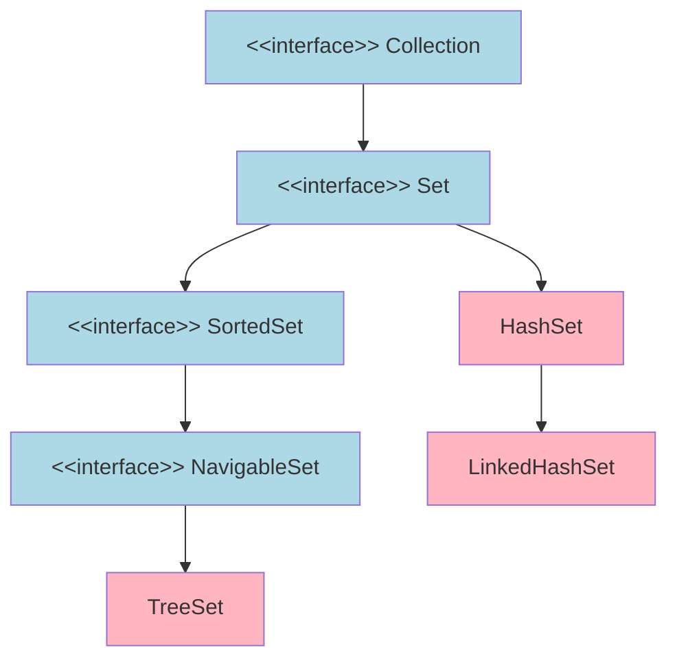
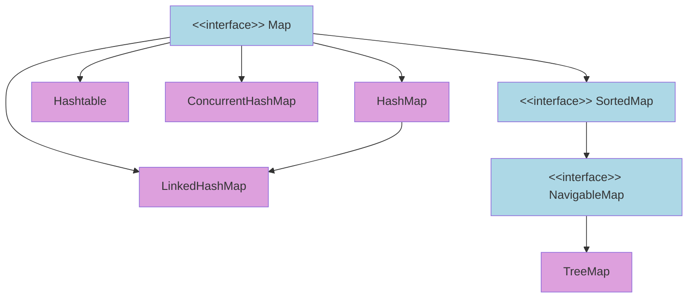
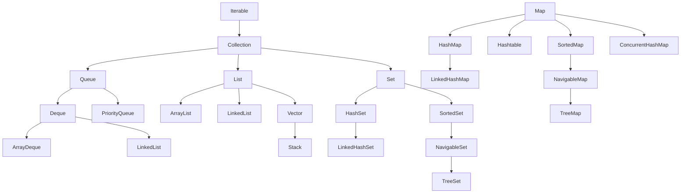
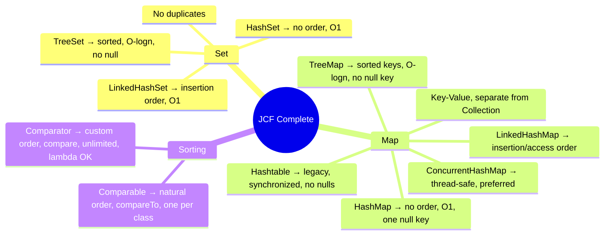

# 📚 Java Set, Map & Sorting — Complete Study Guide

> [!IMPORTANT]
> Part 3 of the JCF series. Covers: `Set` implementations, `Map` hierarchy, and `Comparable` vs `Comparator`.

---

## Table of Contents
1. [The Set Interface](#1-the-set-interface)
2. [HashSet](#2-hashset)
3. [LinkedHashSet](#3-linkedhashset)
4. [TreeSet](#4-treeset)
5. [Set Comparison Table](#5-set-comparison-table)
6. [The Map Interface](#6-the-map-interface)
7. [Map Methods Reference](#7-map-methods-reference)
8. [HashMap](#8-hashmap)
9. [LinkedHashMap](#9-linkedhashmap)
10. [TreeMap](#10-treemap)
11. [Hashtable](#11-hashtable)
12. [Map Comparison Table](#12-map-comparison-table)
13. [Comparable vs Comparator](#13-comparable-vs-comparator)
14. [Full JCF Hierarchy](#14-full-jcf-hierarchy)
15. [Interview Notes](#15-interview-notes)
16. [Summary & Quick Revision](#16-summary--quick-revision)
17. [Practice Questions](#17-practice-questions)

---

# 📌 1. The `Set` Interface

## Definition
A `Set` is a `Collection` that contains **no duplicate elements**. It models the mathematical set abstraction.

## Real-world Analogy
A bag of unique raffle tickets — adding a duplicate ticket has no effect.

## How Duplicates Are Prevented
When `set.add(element)` is called, Java internally checks `hashCode()` + `equals()`. If an equal element exists, `add()` is silently ignored and returns `false`.

```java
Set<String> set = new HashSet<>();
System.out.println(set.add("Java"));  // true
System.out.println(set.add("Java"));  // false — duplicate
System.out.println(set.size());       // 1
```

## Hierarchy



## Set vs List

| Feature | `Set` | `List` |
|---|---|---|
| Duplicates | ❌ | ✅ |
| Index-based access | ❌ | ✅ |
| Order guarantee | Depends on impl | ✅ Always insertion order |

---

# 📌 2. HashSet

## Key Characteristics

| Feature | Value |
|---|---|
| Backed by | `HashMap` internally |
| Order | ❌ No guaranteed order |
| Thread-safe | ❌ No |
| Null elements | ✅ One null allowed |
| Time complexity | O(1) average |

## Internal Working
`HashSet` stores each element as a **key** in an internal `HashMap` with a dummy value. If `put()` returns a non-null (old dummy), a duplicate was attempted → `add()` returns `false`.

## Code Example

```java
import java.util.*;

public class HashSetExample {
    public static void main(String[] args) {
        Set<String> fruits = new HashSet<>();

        System.out.println(fruits.add("Mango"));   // true
        System.out.println(fruits.add("Apple"));   // true
        System.out.println(fruits.add("Apple"));   // false — duplicate
        System.out.println(fruits.add(null));       // true
        System.out.println(fruits.add(null));       // false — second null rejected
        System.out.println("Size: " + fruits.size()); // 3

        // Order NOT guaranteed
        fruits.forEach(System.out::println);

        System.out.println(fruits.contains("Apple")); // true
        fruits.remove("Mango");
        System.out.println(fruits); // [null, Apple] (order may vary)
    }
}
```

## Time Complexity

| Operation | Average | Worst Case |
|---|---|---|
| `add` / `remove` / `contains` | **O(1)** | O(log n) (Java 8+ tree bucket) |
| Iteration | O(n + capacity) | — |

> [!NOTE]
> Java 8+ converts long hash collision chains (≥8 entries) from linked lists to **Red-Black Trees**, capping worst-case at O(log n).

## Thread-Safe Version
Use `ConcurrentHashMap.newKeySet()` or `Collections.synchronizedSet(new HashSet<>())`.

---

# 📌 3. LinkedHashSet

## Key Characteristics

| Feature | Value |
|---|---|
| Backed by | `LinkedHashMap` (hash table + doubly linked list) |
| Order | ✅ **Insertion order** preserved |
| Thread-safe | ❌ No |
| Null elements | ✅ One null allowed |

## Code Example

```java
import java.util.*;

public class LinkedHashSetExample {
    public static void main(String[] args) {
        Set<String> colors = new LinkedHashSet<>();
        colors.add("Red");
        colors.add("Green");
        colors.add("Blue");
        colors.add("Red");    // duplicate — ignored
        colors.add("Yellow");

        System.out.println(colors); // [Red, Green, Blue, Yellow] — always insertion order
    }
}
```

---

# 📌 4. TreeSet

## Key Characteristics

| Feature | Value |
|---|---|
| Backed by | `TreeMap` (Red-Black Tree) |
| Order | ✅ **Sorted** (natural or custom comparator) |
| Thread-safe | ❌ No |
| Null elements | ❌ **NOT allowed** — `NullPointerException` |
| Time complexity | **O(log n)** for all operations |

> [!WARNING]
> `TreeSet` does NOT allow `null` because it must compare elements, and comparing `null` is undefined.

## Internal Working — Red-Black Tree
A self-balancing BST. In-order traversal gives elements in sorted order. Height stays O(log n), guaranteeing O(log n) operations.

```
Insert 5, 3, 7, 1, 4:
        5
       / \
      3   7
     / \
    1   4
In-order: 1 3 4 5 7  ← sorted output
```

## Code Example

```java
import java.util.*;

public class TreeSetExample {
    public static void main(String[] args) {
        TreeSet<Integer> nums = new TreeSet<>();
        nums.add(5); nums.add(3); nums.add(7);
        nums.add(1); nums.add(4); nums.add(3); // duplicate ignored

        System.out.println(nums);          // [1, 3, 4, 5, 7]
        System.out.println(nums.first());  // 1
        System.out.println(nums.last());   // 7
        System.out.println(nums.floor(4)); // 4 (greatest ≤ 4)
        System.out.println(nums.ceiling(4)); // 4 (smallest ≥ 4)
        System.out.println(nums.lower(4)); // 3 (strictly < 4)
        System.out.println(nums.higher(4));// 5 (strictly > 4)
        System.out.println(nums.headSet(4)); // [1, 3]   (< 4)
        System.out.println(nums.tailSet(4)); // [4, 5, 7] (≥ 4)
        System.out.println(nums.subSet(2, 6)); // [3, 4, 5] (2 incl → 6 excl)

        // Custom (descending) order
        TreeSet<Integer> desc = new TreeSet<>(Comparator.reverseOrder());
        desc.addAll(nums);
        System.out.println(desc); // [7, 5, 4, 3, 1]
    }
}
```

### Output
```
[1, 3, 4, 5, 7]
1
7
4
4
3
5
[1, 3]
[4, 5, 7]
[3, 4, 5]
[7, 5, 4, 3, 1]
```

## Extra SortedSet / NavigableSet Methods

| Method | Description |
|---|---|
| `first()` / `last()` | Smallest / largest |
| `floor(e)` / `ceiling(e)` | Greatest ≤ e / Smallest ≥ e |
| `lower(e)` / `higher(e)` | Strictly < e / Strictly > e |
| `headSet(e)` | View of elements < e |
| `tailSet(e)` | View of elements ≥ e |
| `subSet(from, to)` | from inclusive, to exclusive |
| `pollFirst()` / `pollLast()` | Remove and return smallest/largest |
| `descendingSet()` | Reverse-order view |

---

# 📌 5. Set Comparison Table

| Feature | `HashSet` | `LinkedHashSet` | `TreeSet` |
|---|---|---|---|
| Internal structure | HashMap | LinkedHashMap | Red-Black Tree |
| Order | ❌ None | ✅ Insertion | ✅ Sorted |
| Null allowed | ✅ One | ✅ One | ❌ No |
| `add`/`remove`/`contains` | O(1) avg | O(1) avg | O(log n) |
| When to use | Fast lookup, no order | Fast lookup + order | Sorted access, range queries |

---

# 📌 6. The `Map` Interface

## Overview
`Map<K, V>` stores **key-value pairs**. It is a **completely separate hierarchy** from `Collection` — Map does NOT extend `Collection` or `Iterable`.

## Why Map Is NOT Under Collection

| `Collection` | `Map` |
|---|---|
| Single elements | Key-value pairs |
| `add(E e)` — one param | `put(K, V)` — two params |
| Iterate over elements | Iterate over entries/keys/values |

Forcing `Map` under `Collection` would break the `Collection` contract.

## Hierarchy



---

# 📌 7. Map Methods Reference

## Core Methods

| Method | Return | Description |
|---|---|---|
| `put(K, V)` | `V` | Insert/update; returns **previous value** or null |
| `get(key)` | `V` | Returns value; null if not found |
| `getOrDefault(key, def)` | `V` | Returns value or `def` if not found |
| `remove(key)` | `V` | Removes and returns value |
| `containsKey(key)` | `boolean` | Key exists? |
| `containsValue(val)` | `boolean` | Any key maps to this value? |
| `putIfAbsent(K, V)` | `V` | Puts only if key NOT present |
| `replace(K, V)` | `V` | Replaces only if key IS present |
| `size()` / `isEmpty()` / `clear()` | — | Standard collection ops |

## Iteration Methods

| Method | Returns | Description |
|---|---|---|
| `keySet()` | `Set<K>` | All keys |
| `values()` | `Collection<V>` | All values |
| `entrySet()` | `Set<Map.Entry<K,V>>` | All key-value pairs (**preferred for iteration**) |
| `forEach(BiConsumer)` | void | Lambda iteration (Java 1.8) |

## Three Ways to Iterate a Map

```java
Map<String, Integer> scores = new HashMap<>();
scores.put("Alice", 95); scores.put("Bob", 87); scores.put("Charlie", 92);

// Method 1: keySet() — two lookups per entry (less efficient)
for (String key : scores.keySet()) {
    System.out.println(key + " → " + scores.get(key));
}

// Method 2: entrySet() — one lookup per entry (PREFERRED)
for (Map.Entry<String, Integer> entry : scores.entrySet()) {
    System.out.println(entry.getKey() + " → " + entry.getValue());
}

// Method 3: forEach lambda (Java 1.8)
scores.forEach((k, v) -> System.out.println(k + " → " + v));
```

> [!TIP]
> **Always prefer `entrySet()`** when you need both key and value. `keySet()` + `get()` performs two hash lookups per entry.

---

# 📌 8. HashMap

## Key Characteristics

| Feature | Value |
|---|---|
| Backed by | Hash table (array of buckets) |
| Key order | ❌ No guaranteed order |
| Thread-safe | ❌ No |
| Null key | ✅ **One** null key |
| Null values | ✅ Multiple null values |
| Duplicate keys | ❌ — new value overwrites old |

## Internal Working (Java 8+)

```
put("Alice", 95):
1. hashCode("Alice") → integer hash
2. hash % capacity → bucket index
3. Bucket empty? → store directly
4. Bucket occupied?
   - Same key? → overwrite value
   - Different key (collision)?
       chain ≤ 8 entries → linked list
       chain > 8 entries → Red-Black Tree (O(log n) worst case)
```

## Code Example

```java
import java.util.*;

public class HashMapExample {
    public static void main(String[] args) {
        Map<String, Integer> map = new HashMap<>();

        map.put("Alice", 95);
        map.put("Bob", 87);
        map.put("Charlie", 92);

        // put() returns previous value
        Integer old = map.put("Alice", 99);
        System.out.println("Old: " + old);               // 95
        System.out.println("New: " + map.get("Alice"));  // 99

        System.out.println(map.get("Diana"));             // null (not found)
        System.out.println(map.getOrDefault("Diana", 0)); // 0

        System.out.println(map.containsKey("Bob"));       // true
        System.out.println(map.containsValue(100));       // false

        map.putIfAbsent("Bob", 100);    // Bob exists → no change
        map.putIfAbsent("Diana", 78);   // Diana absent → inserted
        System.out.println(map.get("Bob"));    // 87
        System.out.println(map.get("Diana"));  // 78

        map.remove("Charlie");
        System.out.println(map.containsKey("Charlie")); // false

        // Null key and null value allowed
        map.put(null, 50);
        map.put("Zero", null);
        System.out.println(map.get(null));    // 50
        System.out.println(map.get("Zero"));  // null

        map.clear();
        System.out.println(map.isEmpty()); // true
    }
}
```

## Time Complexity

| Operation | Average | Worst |
|---|---|---|
| `put` / `get` / `remove` / `containsKey` | **O(1)** | O(log n) |
| `containsValue` | O(n) | O(n) |
| Iteration | O(n + capacity) | — |

## Thread-Safe Versions

| Variant | Notes |
|---|---|
| `HashMap` | Not thread-safe |
| `Collections.synchronizedMap(new HashMap<>())` | Coarse lock; every method synchronized |
| `ConcurrentHashMap` | **Preferred** — fine-grained bucket-level locking; high concurrency |
| `Hashtable` | Legacy; avoid |

---

# 📌 9. LinkedHashMap

## Key Characteristics

| Feature | Value |
|---|---|
| Backed by | HashMap + doubly linked list |
| Key order | ✅ **Insertion order** (default) OR **access order** (optional) |
| Thread-safe | ❌ No |
| Null key | ✅ One |

## Code Example — Insertion Order

```java
import java.util.*;

public class LinkedHashMapExample {
    public static void main(String[] args) {
        Map<String, Integer> map = new LinkedHashMap<>();
        map.put("Charlie", 92);
        map.put("Alice", 95);
        map.put("Bob", 87);

        // Always prints in insertion order
        map.forEach((k, v) -> System.out.println(k + " → " + v));
        // Charlie → 92
        // Alice → 95
        // Bob → 87
    }
}
```

## Access-Order Mode (LRU Cache)

Constructor `LinkedHashMap(capacity, loadFactor, true)` enables **access order** — most recently accessed entry moves to the end. Override `removeEldestEntry()` to auto-evict.

```java
// accessOrder = true
Map<String, Integer> lru = new LinkedHashMap<>(16, 0.75f, true);
lru.put("A", 1); lru.put("B", 2); lru.put("C", 3);
// Order: A → B → C

lru.get("A"); // Access A → A moves to end
// Order: B → C → A
System.out.println(lru.keySet()); // [B, C, A]
```

---

# 📌 10. TreeMap

## Key Characteristics

| Feature | Value |
|---|---|
| Backed by | Red-Black Tree |
| Key order | ✅ **Sorted by key** (natural or comparator) |
| Thread-safe | ❌ No |
| Null keys | ❌ **NOT allowed** |
| Null values | ✅ Allowed |
| Time complexity | **O(log n)** all key operations |

## Code Example

```java
import java.util.*;

public class TreeMapExample {
    public static void main(String[] args) {
        TreeMap<String, Integer> map = new TreeMap<>();
        map.put("Charlie", 92);
        map.put("Alice", 95);
        map.put("Bob", 87);
        map.put("Diana", 78);

        // Always sorted by key (alphabetical for String)
        map.forEach((k, v) -> System.out.println(k + " → " + v));
        // Alice → 95, Bob → 87, Charlie → 92, Diana → 78

        System.out.println(map.firstKey());         // Alice
        System.out.println(map.lastKey());          // Diana
        System.out.println(map.lowerKey("Bob"));    // Alice (strictly < "Bob")
        System.out.println(map.higherKey("Bob"));   // Charlie (strictly > "Bob")
        System.out.println(map.headMap("C"));       // {Alice=95, Bob=87}
        System.out.println(map.tailMap("C"));       // {Charlie=92, Diana=78}
        System.out.println(map.subMap("B", "D"));   // {Bob=87, Charlie=92}
    }
}
```

### Output
```
Alice → 95
Bob → 87
Charlie → 92
Diana → 78
Alice
Diana
Alice
Charlie
{Alice=95, Bob=87}
{Charlie=92, Diana=78}
{Bob=87, Charlie=92}
```

## NavigableMap Extra Methods

| Method | Description |
|---|---|
| `firstKey()` / `lastKey()` | Smallest / largest key |
| `floorKey(k)` / `ceilingKey(k)` | Greatest ≤ k / Smallest ≥ k |
| `lowerKey(k)` / `higherKey(k)` | Strictly < k / Strictly > k |
| `headMap(toKey)` | Keys < toKey |
| `tailMap(fromKey)` | Keys ≥ fromKey |
| `subMap(from, to)` | from inclusive, to exclusive |
| `descendingMap()` | Reverse-order view |
| `pollFirstEntry()` / `pollLastEntry()` | Remove and return smallest/largest entry |

---

# 📌 11. Hashtable

## Overview
Legacy class (Java 1.0). Works like `HashMap` but:
- **Every method is `synchronized`** — thread-safe
- **No `null` keys or values** — throws `NullPointerException`

## HashMap vs Hashtable

| Feature | `HashMap` | `Hashtable` |
|---|---|---|
| Thread-safe | ❌ | ✅ |
| Null key | ✅ One | ❌ |
| Null values | ✅ | ❌ |
| Performance | Faster | Slower |
| Recommended | ✅ | ❌ (use `ConcurrentHashMap`) |

> [!NOTE]
> `Hashtable` is a legacy class. For thread-safe maps in new code, **always use `ConcurrentHashMap`**.

---

# 📌 12. Map Comparison Table

| Feature | `HashMap` | `LinkedHashMap` | `TreeMap` | `Hashtable` |
|---|---|---|---|---|
| Order | ❌ None | ✅ Insertion | ✅ Sorted by key | ❌ None |
| Thread-safe | ❌ | ❌ | ❌ | ✅ |
| Null key | ✅ One | ✅ One | ❌ | ❌ |
| Null values | ✅ | ✅ | ✅ | ❌ |
| `put`/`get` | O(1) avg | O(1) avg | O(log n) | O(1) avg |
| Thread-safe alt | `ConcurrentHashMap` | — | `synchronizedSortedMap` | `ConcurrentHashMap` |
| When to use | Fast lookup | Fast lookup + order | Sorted keys, range queries | Avoid; use ConcurrentHashMap |

---

# 📌 13. Comparable vs Comparator

## Overview
When objects are stored in `TreeSet`/`TreeMap` or sorted with `Collections.sort()`, Java needs to know **how to compare them**. Two mechanisms exist:

1. **`Comparable<T>`** — the class defines its **own natural ordering**
2. **`Comparator<T>`** — an **external class/lambda** defines custom ordering

## Comparable — Natural Ordering

### Interface
```java
// java.lang.Comparable
public interface Comparable<T> {
    int compareTo(T other);
}
```

### Return Value Contract
| Return | Meaning |
|---|---|
| Negative | `this` comes **before** `other` |
| Zero | Equal |
| Positive | `this` comes **after** `other` |

### Code Example

```java
import java.util.*;

public class Student implements Comparable<Student> {
    String name;
    int age;

    Student(String name, int age) {
        this.name = name;
        this.age = age;
    }

    @Override
    public int compareTo(Student other) {
        return this.age - other.age; // natural order: ascending by age
    }

    @Override
    public String toString() { return name + "(" + age + ")"; }

    public static void main(String[] args) {
        List<Student> list = new ArrayList<>();
        list.add(new Student("Charlie", 22));
        list.add(new Student("Alice", 20));
        list.add(new Student("Bob", 21));

        Collections.sort(list); // uses compareTo()
        System.out.println(list); // [Alice(20), Bob(21), Charlie(22)]

        TreeSet<Student> set = new TreeSet<>(list); // also uses compareTo()
        System.out.println(set); // [Alice(20), Bob(21), Charlie(22)]
    }
}
```

## Comparator — External Custom Ordering

### Interface
```java
// java.util.Comparator (functional interface — can use lambda)
public interface Comparator<T> {
    int compare(T o1, T o2);
}
```

### Code Example — Multiple Orderings

```java
import java.util.*;

public class ComparatorExample {
    record Student(String name, int age, double gpa) {}

    public static void main(String[] args) {
        List<Student> list = new ArrayList<>();
        list.add(new Student("Charlie", 22, 3.5));
        list.add(new Student("Alice", 20, 3.9));
        list.add(new Student("Bob", 21, 3.5));
        list.add(new Student("Diana", 20, 3.7));

        // Sort by name
        list.sort((s1, s2) -> s1.name().compareTo(s2.name()));
        System.out.println("By name: " + list);

        // Sort by age ascending
        list.sort((s1, s2) -> s1.age() - s2.age());
        System.out.println("By age: " + list);

        // Sort by GPA descending
        list.sort((s1, s2) -> Double.compare(s2.gpa(), s1.gpa()));
        System.out.println("By GPA desc: " + list);

        // Chained: by age, then by name
        list.sort(Comparator.comparingInt(Student::age)
                             .thenComparing(Student::name));
        System.out.println("By age then name: " + list);

        // Use with TreeSet
        TreeSet<Student> sortedByName = new TreeSet<>(
            Comparator.comparing(Student::name));
        sortedByName.addAll(list);
        System.out.println("TreeSet by name: " + sortedByName);
    }
}
```

## Comparable vs Comparator — Side-by-Side

| Feature | `Comparable` | `Comparator` |
|---|---|---|
| Package | `java.lang` | `java.util` |
| Method | `compareTo(T other)` | `compare(T o1, T o2)` |
| Defined in | The class itself | External class / lambda |
| Modifies original class? | ✅ Yes | ❌ No |
| Multiple orderings? | ❌ Only one | ✅ Unlimited |
| Functional interface? | ❌ | ✅ (Java 1.8) |
| Used by | `Collections.sort(list)` `TreeSet` `TreeMap` | `Collections.sort(list, cmp)` `TreeSet(cmp)` `TreeMap(cmp)` |
| When to use | One obvious natural order | Multiple criteria, or can't modify class |

## Useful Comparator Factory Methods (Java 1.8+)

```java
Comparator.comparing(Student::name)           // by field
Comparator.comparingInt(Student::age)         // by int field
Comparator.comparingDouble(Student::gpa)      // by double field
comparator.reversed()                         // reverse any comparator
Comparator.naturalOrder()                     // natural ascending
Comparator.reverseOrder()                     // natural descending
comparator1.thenComparing(comparator2)        // chain comparators
```

> [!TIP]
> Quick interview summary: **`Comparable`** = "I sort myself" (one natural order, modifies the class). **`Comparator`** = "Someone else sorts me" (multiple orders, no class modification needed).

---

# 📌 14. Full JCF Hierarchy — Complete Picture



### Complete Class Reference

| Class | Parent Interface(s) | Order | Thread-Safe | Null Key/Elem |
|---|---|---|---|---|
| `ArrayList` | `List` | Insertion | ❌ | ✅ |
| `LinkedList` | `List`, `Deque` | Insertion | ❌ | ✅ |
| `Vector` | `List` | Insertion | ✅ | ✅ |
| `Stack` | `Vector` | LIFO | ✅ | ✅ |
| `ArrayDeque` | `Deque` | Insertion | ❌ | ❌ |
| `PriorityQueue` | `Queue` | Priority (heap) | ❌ | ❌ |
| `HashSet` | `Set` | None | ❌ | ✅ (one) |
| `LinkedHashSet` | `Set` | Insertion | ❌ | ✅ (one) |
| `TreeSet` | `SortedSet` | Sorted | ❌ | ❌ |
| `HashMap` | `Map` | None | ❌ | ✅ (one key) |
| `LinkedHashMap` | `Map` | Insertion/Access | ❌ | ✅ (one key) |
| `TreeMap` | `SortedMap` | Sorted by key | ❌ | ❌ |
| `Hashtable` | `Map` | None | ✅ | ❌ |
| `ConcurrentHashMap` | `Map` | None | ✅ | ❌ |

---

# 📌 15. Interview Notes

**Q: Difference between HashSet, LinkedHashSet, TreeSet?**
- `HashSet`: no order; O(1); one null.
- `LinkedHashSet`: insertion order; O(1); one null.
- `TreeSet`: sorted; O(log n); no null.

**Q: How does HashSet prevent duplicates?**
Backed by `HashMap`. On `add(e)`, calls `hashCode()` to find bucket, then `equals()` to check for existing equal element. Duplicate → `add()` returns `false`.

**Q: Why doesn't TreeSet allow null?**
Must compare elements to sort. Comparing `null` via `compareTo()` throws `NullPointerException`.

**Q: HashMap vs Hashtable?**
`HashMap`: faster, not synchronized, one null key, multiple null values. `Hashtable`: all methods synchronized, no nulls, legacy class. Use `ConcurrentHashMap` instead of `Hashtable`.

**Q: Why is ConcurrentHashMap better than synchronizedMap()?**
`synchronizedMap` uses **one lock for the entire map** — only one thread at a time. `ConcurrentHashMap` uses **bucket-level locking** — multiple threads can read/write different buckets simultaneously → far higher throughput.

**Q: Comparable vs Comparator?**
`Comparable` = natural order, one per class, requires modifying the class, `compareTo()`. `Comparator` = custom/external, unlimited per class, no modification needed, `compare()`, functional interface.

**Q: entrySet() vs keySet() for map iteration?**
`entrySet()` is preferred: gives both key and value in one object, one lookup per entry. `keySet()` + `get(key)` = two hash lookups per entry.

**Q: What happens when you put() a duplicate key?**
New value overwrites old. `put()` returns the **previous value** (or `null`).

**Q: Can HashMap have duplicate values?**
Yes — multiple keys can map to the same value. Duplicate keys: no — overwritten.

**Q: TreeMap vs HashMap?**
`HashMap`: no order, O(1). `TreeMap`: sorted by key, O(log n), supports range queries (`headMap`, `tailMap`, `subMap`), no null keys.

---

# 📌 16. Summary & Quick Revision



## Revision Bullets

- **`Set`**: no duplicates; `add()` returns `false` for duplicates; uses `hashCode()` + `equals()`.
- **`HashSet`**: no order; O(1) avg; backed by `HashMap`; one null.
- **`LinkedHashSet`**: insertion order; extends `HashSet`.
- **`TreeSet`**: sorted; O(log n); Red-Black Tree; no null; extra: `first()`, `last()`, `floor()`, `ceiling()`, `headSet()`, `tailSet()`.
- **`Map`**: key-value; **separate from `Collection`**; no duplicate keys; duplicate values OK.
- **`HashMap`**: no order; O(1) avg; one null key; Java 8+ uses tree for long chains.
- **`LinkedHashMap`**: insertion order (or access order for LRU cache).
- **`TreeMap`**: sorted by key; O(log n); no null key; supports `headMap()`, `tailMap()`, `subMap()`.
- **`Hashtable`**: legacy; fully synchronized; no nulls; use `ConcurrentHashMap` instead.
- **`Comparable`**: natural order; modifies class; one ordering; `compareTo()`.
- **`Comparator`**: custom/external; no modification; multiple orderings; `compare()`; functional interface.
- **`entrySet()`** = most efficient map iteration (one lookup vs two for `keySet()` + `get()`).

---

# 📌 17. Practice Questions

## Easy
1. What is the main rule that defines a `Set`?
2. Which `Set` preserves insertion order? Which sorts elements?
3. Can `TreeSet` store null? Why or why not?
4. What is the difference between `Map` and `Collection`?
5. What does `map.put("A", 99)` return if `"A"` already maps to `50`?
6. What is the difference between `Comparable` and `Comparator`?
7. Which `Map` implementation keeps keys in sorted order?

## Medium
8. Write code to count word frequencies in a sentence using `HashMap`.
9. Explain what happens if you override `equals()` but NOT `hashCode()` in a class stored in a `HashSet`.
10. Write a `Comparator` that sorts `Student` objects by GPA descending, then by name ascending.
11. Explain the difference between `headMap()`, `tailMap()`, and `subMap()` in `TreeMap`.
12. How would you implement a simple LRU cache using `LinkedHashMap`?
13. Write code to iterate a `HashMap` efficiently using `entrySet()`.
14. Write code demonstrating `putIfAbsent()` and `getOrDefault()`.

## Hard
15. Explain `HashMap`'s internal structure in Java 8+. When does a linked list chain become a Red-Black Tree?
16. You cannot modify class `Employee`. Write a single chained `Comparator` that sorts by department name, then salary descending, then name ascending.
17. Implement a program that finds the top 5 most frequent words in a paragraph using `HashMap` + `TreeMap` (or sorted list).
18. Design a data structure with O(1) `insert`, O(1) `delete`, and O(1) `getRandom`. (Hint: combine `HashMap` + `ArrayList`.)
19. Compare `ConcurrentHashMap` vs `Collections.synchronizedMap(new HashMap<>())` in terms of lock granularity, null support, iteration safety, and throughput under concurrency.
20. `TreeSet` uses `compareTo()` (or `Comparator`) to determine equality — NOT `equals()`. Demonstrate a case where this causes surprising behavior when a `Comparator` is inconsistent with `equals()`.

---

> [!NOTE]
> **Series Complete.** Three-part JCF guide:
> - **Part 1** — `Iterable`, `Collection`, iteration methods, `Collection` vs `Collections`
> - **Part 2** — `Deque`, `ArrayDeque`, `List`, `ArrayList`, `LinkedList`, `Vector`, `Stack`, `ListIterator`
> - **Part 3** — `Set`, `Map`, `Comparable` vs `Comparator`
>
> **Next: Java Streams API (Java 1.8)** — `stream()`, `filter()`, `map()`, `reduce()`, `collect()`, `flatMap()`, lazy evaluation, parallel streams.
