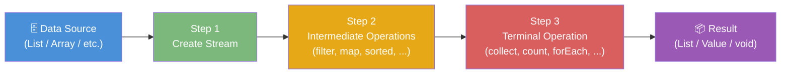
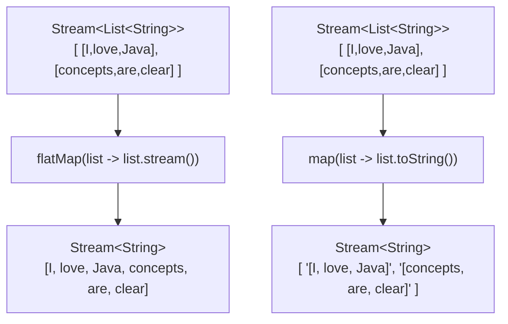
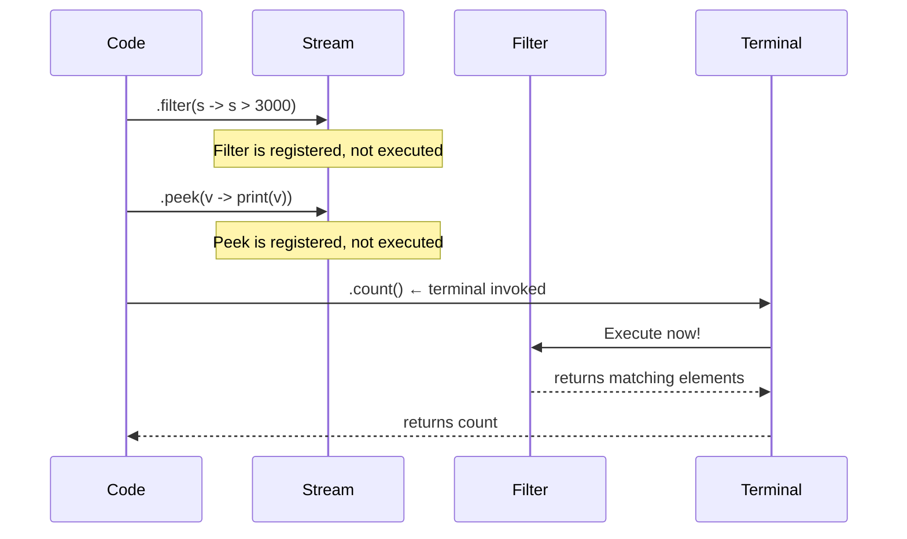
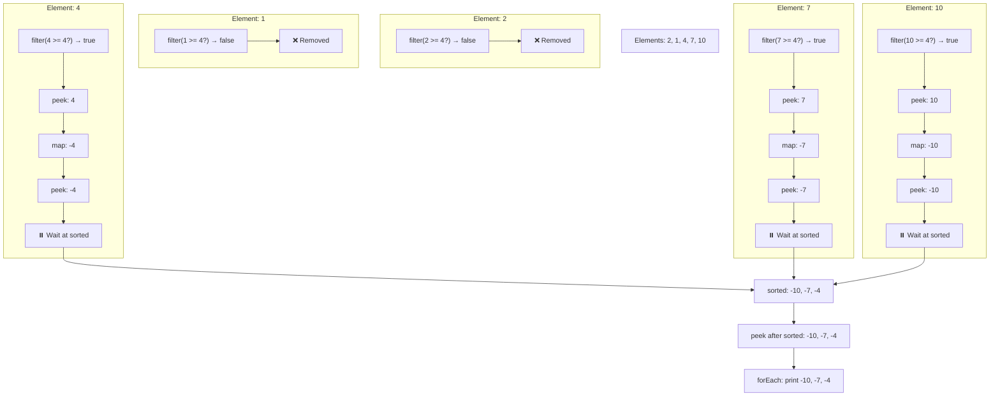
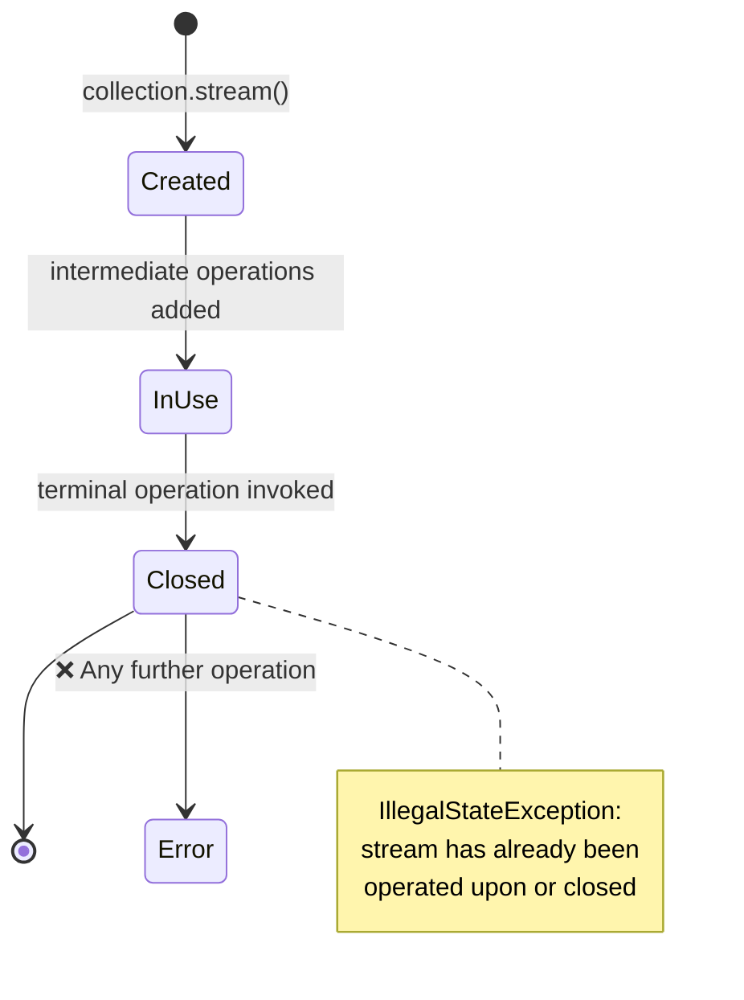
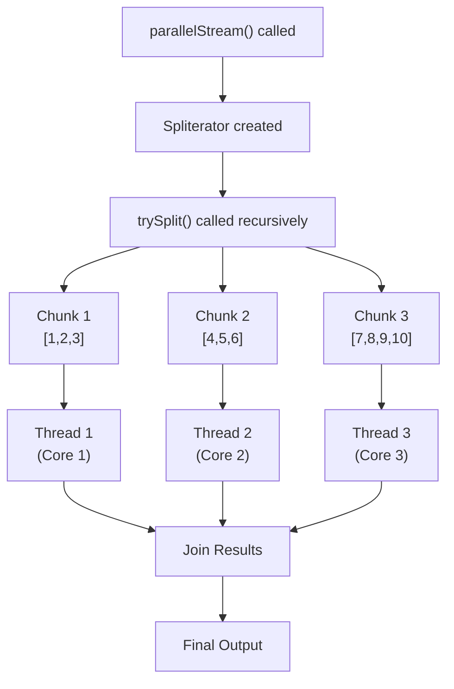

# 📚 Java Streams — Complete Study Guide

> A professional-quality reference covering everything from basics to internals, with code examples, diagrams, and interview preparation.

---

## Table of Contents

1. [What is a Stream?](#1-what-is-a-stream)
2. [The Three-Step Pipeline](#2-the-three-step-pipeline)
3. [Ways to Create a Stream](#3-ways-to-create-a-stream)
4. [Intermediate Operations](#4-intermediate-operations)
5. [Lazy Evaluation — Why Streams Are "Lazy"](#5-lazy-evaluation--why-streams-are-lazy)
6. [Stream Execution Order — The Surprising Truth](#6-stream-execution-order--the-surprising-truth)
7. [Terminal Operations](#7-terminal-operations)
8. [Stream Reuse and Closing](#8-stream-reuse-and-closing)
9. [Parallel Streams](#9-parallel-streams)
10. [Key Differences — Sequential vs Parallel Streams](#10-key-differences--sequential-vs-parallel-streams)
11. [Common Mistakes](#11-common-mistakes)
12. [Best Practices](#12-best-practices)
13. [Interview Notes](#13-interview-notes)
14. [Practice Questions](#14-practice-questions)
15. [Summary — Quick Revision Bullets](#15-summary--quick-revision-bullets)

---

# 1. What is a Stream?

## Overview

A **Stream** in Java is a sequence of elements that supports sequential and parallel operations. Think of it as a **pipeline** — data enters at one end, passes through a series of processing stages, and exits as a result at the other end.

Streams are part of the **`java.util.stream`** package, introduced in **Java 8**.

> [!IMPORTANT]
> A Stream is **not a data structure**. It does not store data. It processes data from an underlying source (like a List, Array, etc.) and produces a result.

---

## Real-World Analogy

Imagine a **water treatment pipeline**:

```
[Water Source] → [Filter Stage] → [Purification Stage] → [Output Tap]
```

- The **water source** = your collection (List, Array, etc.)
- The **filter and purification stages** = intermediate operations (filter, map, sort, etc.)
- The **output tap** = terminal operation (collect, count, forEach, etc.)
- The **water flowing through** = data elements

Water passes through each stage in sequence. The original reservoir (source) is never changed — you only draw from it.

---

## Definition

> A **Stream** is a pipeline through which data elements pass. It supports a sequence of operations — zero or more **intermediate operations** that transform the stream, followed by exactly one **terminal operation** that produces a result or a side-effect.

---

## Why Streams Exist

Before Java 8, processing a collection required verbose `for` loops and conditional blocks. Streams solve this by providing:

| Problem (Before Streams) | Solution (With Streams) |
|---|---|
| Verbose `for` loops for filtering | `stream().filter(...)` |
| Manual counting of elements | `.count()` |
| Manual sorting and collecting | `.sorted().collect(...)` |
| No built-in parallel processing | `.parallelStream()` |
| Code that mixes *what* and *how* | Streams separate *what* from *how* |

---

## Key Properties of Streams

| Property | Description |
|---|---|
| **Not a data structure** | Doesn't store elements; operates on a source |
| **Functional in nature** | Operations produce results without modifying the source |
| **Lazy** | Intermediate operations execute only when a terminal operation is invoked |
| **Possibly infinite** | Can represent an infinite sequence (e.g., `Stream.iterate`) |
| **Consumable** | A stream can only be traversed once; it is closed after the terminal operation |
| **Can be sequential or parallel** | Use `.stream()` or `.parallelStream()` |

---

## Internal Working

Internally, a Stream is backed by:

1. A **source** (collection, array, generator, etc.)
2. A chain of **intermediate operation descriptors** — these are stored lazily (not executed yet)
3. A **terminal operation** that, when invoked, triggers the pipeline

The JVM uses a **Spliterator** internally to traverse and optionally split the source for parallel processing.

---



---

# 2. The Three-Step Pipeline

Every Stream operation follows exactly this structure:

```
[Step 1: Open / Create a Stream]
    ↓
[Step 2: Zero or More Intermediate Operations]
    ↓
[Step 3: Exactly One Terminal Operation]
```

---

## Step 1 — Create a Stream

You must first **open or create a stream** from your data source. This does not process data — it only sets up the pipeline.

```java
List<Integer> salaries = Arrays.asList(3000, 4000, 10000, 9000, 1000, 3500);
Stream<Integer> stream = salaries.stream(); // Step 1: open a stream
```

---

## Step 2 — Intermediate Operations (Zero or More)

Intermediate operations **transform** the stream from one form into another stream. They are:

- **Lazy** — they don't execute until a terminal operation is called
- **Chainable** — you can chain many of them together
- **Non-destructive** — the source data is never modified

```java
stream.filter(salary -> salary > 3000)   // intermediate operation 1
      .sorted()                          // intermediate operation 2
```

> [!NOTE]
> Intermediate operations return a **new Stream**. They do **not** return a result directly.

---

## Step 3 — Terminal Operation (Exactly One)

The terminal operation:

- **Triggers** the execution of the entire stream pipeline
- **Produces** a result (a value, a collection, `void`, etc.)
- **Closes** the stream — no more operations can be added after this

```java
long count = stream.filter(salary -> salary > 3000)
                   .count(); // terminal operation — triggers pipeline, closes stream
```

---

## Code Example — With and Without Stream

### Without Stream (Traditional Loop)

```java
import java.util.Arrays;
import java.util.List;

public class WithoutStream {
    public static void main(String[] args) {
        List<Integer> salaries = Arrays.asList(3000, 4000, 10000, 9000, 1000, 3500);

        int count = 0;
        for (int salary : salaries) {
            if (salary > 3000) {
                count++;
            }
        }

        System.out.println("Total employees with salary greater than 3000 is: " + count);
    }
}
```

**Output:**
```
Total employees with salary greater than 3000 is: 3
```

**Explanation:**
- We iterate over each salary manually using a `for-each` loop.
- If the salary exceeds 3000, we increment a counter.
- Final count = 3 (salaries: 4000, 10000, 9000 qualify).

---

### With Stream

```java
import java.util.Arrays;
import java.util.List;

public class WithStream {
    public static void main(String[] args) {
        List<Integer> salaries = Arrays.asList(3000, 4000, 10000, 9000, 1000, 3500);

        long count = salaries.stream()                    // Step 1: create stream
                             .filter(s -> s > 3000)       // Step 2: intermediate operation
                             .count();                    // Step 3: terminal operation

        System.out.println("Total employees with salary greater than 3000 is: " + count);
    }
}
```

**Output:**
```
Total employees with salary greater than 3000 is: 3
```

**Line-by-Line Explanation:**
| Line | What Happens |
|---|---|
| `salaries.stream()` | Creates a `Stream<Integer>` from the list. No data is processed yet. |
| `.filter(s -> s > 3000)` | Registers a filter that will keep only elements > 3000. Still not executed. |
| `.count()` | This is the terminal operation. It triggers the pipeline: filter runs, and the count of remaining elements is returned. Stream is closed. |

---

# 3. Ways to Create a Stream

There are multiple ways to create a stream in Java, depending on your data source.

---

## 3.1 From a Collection (List, Set, etc.)

The most common approach. Every `Collection` exposes a `.stream()` method.

```java
import java.util.Arrays;
import java.util.List;
import java.util.stream.Stream;

List<Integer> salaries = new ArrayList<>(Arrays.asList(3000, 4000, 10000));
Stream<Integer> stream = salaries.stream();
```

- `salaries.stream()` creates a **sequential** `Stream<Integer>`.
- Works for any class that implements `Collection` (List, Set, Queue, etc.).

---

## 3.2 From an Array

Use `Arrays.stream()` to create a stream from an array.

```java
import java.util.Arrays;
import java.util.stream.Stream;

Integer[] arr = {3000, 4000, 10000};
Stream<Integer> stream = Arrays.stream(arr);
```

For primitive arrays, you get a **specialized stream**:

```java
int[] primitiveArr = {3000, 4000, 10000};
IntStream intStream = Arrays.stream(primitiveArr); // returns IntStream, not Stream<Integer>
```

> [!NOTE]
> `Arrays.stream()` with a primitive array returns `IntStream`, `LongStream`, or `DoubleStream` — not `Stream<T>`. These are specialized for performance (no boxing/unboxing overhead).

---

## 3.3 From Static Method — `Stream.of()`

Use `Stream.of()` to create a stream directly from values (varargs).

```java
import java.util.stream.Stream;

Stream<Integer> stream = Stream.of(3000, 4000, 10000);
```

- Accepts variable arguments (varargs).
- Useful for small, inline datasets.

---

## 3.4 From Stream Builder

Use `Stream.builder()` to add elements programmatically before building the stream.

```java
import java.util.stream.Stream;

Stream.Builder<String> builder = Stream.builder();
builder.add("Java");
builder.add("Streams");
builder.add("Are Fun");
Stream<String> stream = builder.build();
```

**Step-by-Step:**
1. `Stream.builder()` returns a `Stream.Builder<T>` object.
2. `.add(element)` adds elements to the builder.
3. `.build()` constructs and returns the final stream.

> [!TIP]
> Stream Builder is useful when you don't know all elements upfront and need to add them conditionally before building the stream.

---

## 3.5 From `Stream.iterate()` — Infinite Streams

`Stream.iterate()` creates a potentially **infinite** stream by repeatedly applying a function.

```java
import java.util.stream.Stream;

Stream<Integer> stream = Stream.iterate(1000, n -> n + 5000)
                               .limit(5); // MUST limit, or it runs forever!
```

**What this produces:** `1000, 6000, 11000, 16000, 21000`

| Parameter | Meaning |
|---|---|
| `1000` | Seed — the starting value |
| `n -> n + 5000` | UnaryOperator — how each next value is derived from the previous |
| `.limit(5)` | Stops after 5 elements — **mandatory for infinite streams** |

> [!CAUTION]
> Always pair `Stream.iterate()` with `.limit()` or another limiting terminal operation. Without it, the stream will run indefinitely and cause an out-of-memory error or infinite loop.

---

## Summary Table — Ways to Create Streams

| Method | Source | Return Type | Notes |
|---|---|---|---|
| `collection.stream()` | Any Collection | `Stream<T>` | Most common |
| `Arrays.stream(array)` | Array | `Stream<T>` or `IntStream` etc. | Works for both object and primitive arrays |
| `Stream.of(values...)` | Inline values | `Stream<T>` | Varargs |
| `Stream.builder()` | Programmatic | `Stream<T>` | Add elements then `.build()` |
| `Stream.iterate(seed, fn)` | Computed | `Stream<T>` | Infinite; use with `.limit()` |

---

```mermaid
mindmap
  root((Stream Creation))
    From Collection
      list.stream()
      set.stream()
    From Array
      Arrays.stream(arr)
      IntStream for primitives
    Static Method
      Stream.of(values)
    Builder
      Stream.builder()
      builder.add()
      builder.build()
    Iterate
      Stream.iterate(seed, fn)
      Must use .limit()
```

---

# 4. Intermediate Operations

Intermediate operations are operations that:
- Accept a stream as input
- Return **a new stream** as output (transformed)
- Are **lazy** — not executed until a terminal operation is invoked
- Can be **chained** together

> [!IMPORTANT]
> Intermediate operations always return a `Stream`. They **never** return a final result like a number, list, or boolean.

---

## 4.1 `filter(Predicate<T>)`

**Purpose:** Keeps only elements that satisfy a given condition. Removes elements for which the predicate returns `false`.

**Functional Interface Used:** `Predicate<T>` — has one abstract method `boolean test(T t)`

```java
import java.util.Arrays;
import java.util.List;
import java.util.stream.Collectors;

public class FilterExample {
    public static void main(String[] args) {
        List<String> words = Arrays.asList("Hello", "everybody", "How", "are", "you", "doing");

        List<String> shortWords = words.stream()
            .filter(name -> name.length() <= 3)   // keep words with length ≤ 3
            .collect(Collectors.toList());

        System.out.println(shortWords);
    }
}
```

**Output:**
```
[How, are, you]
```

**Step-by-Step Execution:**
1. Stream created from `words` list.
2. `filter` iterates over each word, calls the predicate.
3. `"Hello"` → length 5 → `false` → **excluded**
4. `"everybody"` → length 9 → `false` → **excluded**
5. `"How"` → length 3 → `true` → **included**
6. `"are"` → length 3 → `true` → **included**
7. `"you"` → length 3 → `true` → **included**
8. `"doing"` → length 5 → `false` → **excluded**
9. `collect` gathers the remaining stream elements into a List.

---

## 4.2 `map(Function<T, R>)`

**Purpose:** Transforms each element in the stream into a new form. The input and output types can differ.

**Functional Interface Used:** `Function<T, R>` — has one abstract method `R apply(T t)` — accepts one value, returns one value.

```java
import java.util.Arrays;
import java.util.List;
import java.util.stream.Collectors;

public class MapExample {
    public static void main(String[] args) {
        List<String> words = Arrays.asList("Hello", "EVERYBODY", "HOW", "ARE", "YOU", "DOING");

        List<String> lowerCaseWords = words.stream()
            .map(name -> name.toLowerCase())    // transform each element
            .collect(Collectors.toList());

        System.out.println(lowerCaseWords);
    }
}
```

**Output:**
```
[hello, everybody, how, are, you, doing]
```

**What Happens Internally:**
- `map` iterates over each element and passes it to the `Function` interface.
- The function receives `"Hello"`, returns `"hello"`.
- The output is placed into a new stream.
- The original list is **not modified**.

> [!NOTE]
> `map` does a **one-to-one transformation**: for each input element, exactly one output element is produced.

---

## 4.3 `flatMap(Function<T, Stream<R>>)`

**Purpose:** Used when each element of the stream is itself a collection or stream. `flatMap` **flattens** these nested collections into a single stream.

**Key Difference from `map`:**
- `map`: `Stream<List<String>>` → still `Stream<List<String>>`
- `flatMap`: `Stream<List<String>>` → `Stream<String>` (flattened)

```java
import java.util.Arrays;
import java.util.List;
import java.util.stream.Collectors;

public class FlatMapExample {
    public static void main(String[] args) {
        List<List<String>> sentences = Arrays.asList(
            Arrays.asList("I", "love", "Java"),
            Arrays.asList("concepts", "are", "clear"),
            Arrays.asList("it's", "very", "easy")
        );

        // Without flatMap, stream gives Stream<List<String>>
        // With flatMap, we get Stream<String>
        List<String> allWords = sentences.stream()
            .flatMap(sentence -> sentence.stream())  // flatten each list into its stream
            .collect(Collectors.toList());

        System.out.println(allWords);
    }
}
```

**Output:**
```
[I, love, Java, concepts, are, clear, it's, very, easy]
```

**Advanced FlatMap — with transformation inside:**

```java
List<String> allWordsLower = sentences.stream()
    .flatMap(sentence -> sentence.stream()
                                 .map(String::toLowerCase))  // lowercase inside flatMap
    .collect(Collectors.toList());

System.out.println(allWordsLower);
```

**Output:**
```
[i, love, java, concepts, are, clear, it's, very, easy]
```

---



---

## 4.4 `distinct()`

**Purpose:** Removes duplicate elements from the stream. Uses `equals()` for comparison.

```java
import java.util.Arrays;
import java.util.List;
import java.util.stream.Collectors;

public class DistinctExample {
    public static void main(String[] args) {
        Integer[] arr = {3, 1, 4, 1, 5, 9, 2, 6, 5, 3, 5};
        List<Integer> unique = Arrays.stream(arr)
            .distinct()
            .collect(Collectors.toList());

        System.out.println(unique);
    }
}
```

**Output:**
```
[3, 1, 4, 5, 9, 2, 6]
```

> [!NOTE]
> `distinct()` uses `equals()` and `hashCode()` to identify duplicates. For custom objects, override these methods.

---

## 4.5 `sorted()` and `sorted(Comparator)`

**Purpose:** Sorts the elements of the stream.

- `sorted()` — natural order (ascending for numbers, alphabetical for strings)
- `sorted(Comparator)` — custom order

```java
import java.util.Arrays;
import java.util.List;
import java.util.stream.Collectors;

public class SortedExample {
    public static void main(String[] args) {
        Integer[] arr = {10, 2, 4, 7, 1, 2, 4, 5};

        // Natural (ascending) order
        List<Integer> ascending = Arrays.stream(arr)
            .distinct()
            .sorted()
            .collect(Collectors.toList());
        System.out.println("Ascending: " + ascending);

        // Descending order using Comparator
        List<Integer> descending = Arrays.stream(arr)
            .distinct()
            .sorted((a, b) -> b - a)   // b - a = descending
            .collect(Collectors.toList());
        System.out.println("Descending: " + descending);
    }
}
```

**Output:**
```
Ascending: [1, 2, 4, 5, 7, 10]
Descending: [10, 7, 5, 4, 2, 1]
```

> [!IMPORTANT]
> `sorted()` is a **stateful intermediate operation** — it must see **all elements** before it can produce any output. This affects stream execution order (covered in Section 6).

---

## 4.6 `peek(Consumer<T>)`

**Purpose:** Performs an action on each element as it passes through, without modifying the stream. Mainly used for **debugging**.

**Functional Interface Used:** `Consumer<T>` — accepts one value, returns nothing (`void`).

```java
import java.util.Arrays;
import java.util.List;
import java.util.stream.Collectors;

public class PeekExample {
    public static void main(String[] args) {
        List<Integer> numbers = Arrays.asList(1, 2, 3, 4, 6);

        List<Integer> result = numbers.stream()
            .filter(v -> v > 2)
            .peek(v -> System.out.println("After filter: " + v))  // debug peek
            .collect(Collectors.toList());

        System.out.println("Result: " + result);
    }
}
```

**Output:**
```
After filter: 3
After filter: 4
After filter: 6
Result: [3, 4, 6]
```

> [!TIP]
> Use `peek` to inspect stream elements at any point in the pipeline during debugging. Remove it in production code.

---

## 4.7 `limit(long maxSize)`

**Purpose:** Truncates the stream to contain no more than `maxSize` elements.

```java
import java.util.Arrays;
import java.util.List;
import java.util.stream.Collectors;

public class LimitExample {
    public static void main(String[] args) {
        List<Integer> numbers = Arrays.asList(2, 1, 3, 4, 5, 6);

        List<Integer> limited = numbers.stream()
            .limit(3)
            .collect(Collectors.toList());

        System.out.println(limited);
    }
}
```

**Output:**
```
[2, 1, 3]
```

> [!NOTE]
> `limit()` is a **short-circuiting** intermediate operation — it can stop processing the stream early, which is a performance benefit for large or infinite streams.

---

## 4.8 `skip(long n)`

**Purpose:** Skips the first `n` elements of the stream.

```java
import java.util.Arrays;
import java.util.List;
import java.util.stream.Collectors;

public class SkipExample {
    public static void main(String[] args) {
        List<Integer> numbers = Arrays.asList(1, 2, 3, 4, 6);

        List<Integer> skipped = numbers.stream()
            .skip(3)   // skip first 3 elements
            .collect(Collectors.toList());

        System.out.println(skipped);
    }
}
```

**Output:**
```
[4, 6]
```

---

## 4.9 `mapToInt()`, `mapToLong()`, `mapToDouble()`

**Purpose:** Converts a `Stream<T>` to a specialized primitive stream (`IntStream`, `LongStream`, `DoubleStream`). This avoids boxing/unboxing overhead when working with primitive types.

**Why this exists:**
- `Stream<Integer>` uses boxed `Integer` objects (heap allocation, boxing overhead)
- `IntStream` uses primitive `int` values (stack, no boxing, faster)

```java
import java.util.Arrays;
import java.util.List;
import java.util.stream.IntStream;

public class MapToIntExample {
    public static void main(String[] args) {
        // Converting String list to int values
        List<String> strNumbers = Arrays.asList("2", "1", "4", "7");

        int[] intArr = strNumbers.stream()
            .mapToInt(s -> Integer.parseInt(s))   // convert String -> int
            .toArray();

        System.out.println(Arrays.toString(intArr));
    }
}
```

**Output:**
```
[2, 1, 4, 7]
```

**Working with primitive int array directly:**

```java
int[] primitiveArr = {3000, 4000, 10000};
IntStream intStream = Arrays.stream(primitiveArr);
// Now you can do intStream.filter(...).sum() etc. on primitive ints
```

> [!NOTE]
> `IntStream`, `LongStream`, and `DoubleStream` are specialized versions of `Stream` for primitive types. They have additional terminal operations like `.sum()`, `.average()`, `.min()`, `.max()` that aren't available on `Stream<T>`.

---

## Summary Table — Intermediate Operations

| Operation | Input | Output | Functional Interface | Purpose |
|---|---|---|---|---|
| `filter(predicate)` | `Stream<T>` | `Stream<T>` | `Predicate<T>` | Keep elements matching condition |
| `map(function)` | `Stream<T>` | `Stream<R>` | `Function<T,R>` | Transform each element |
| `flatMap(function)` | `Stream<T>` | `Stream<R>` | `Function<T, Stream<R>>` | Flatten nested collections |
| `distinct()` | `Stream<T>` | `Stream<T>` | — | Remove duplicates |
| `sorted()` | `Stream<T>` | `Stream<T>` | — | Sort in natural order |
| `sorted(comparator)` | `Stream<T>` | `Stream<T>` | `Comparator<T>` | Sort with custom order |
| `peek(consumer)` | `Stream<T>` | `Stream<T>` | `Consumer<T>` | Side-effect / debug |
| `limit(n)` | `Stream<T>` | `Stream<T>` | — | Truncate to n elements |
| `skip(n)` | `Stream<T>` | `Stream<T>` | — | Skip first n elements |
| `mapToInt(function)` | `Stream<T>` | `IntStream` | `ToIntFunction<T>` | Convert to primitive int stream |
| `mapToLong(function)` | `Stream<T>` | `LongStream` | `ToLongFunction<T>` | Convert to primitive long stream |
| `mapToDouble(function)` | `Stream<T>` | `DoubleStream` | `ToDoubleFunction<T>` | Convert to primitive double stream |

---

```mermaid
mindmap
  root((Intermediate Operations))
    Filtering
      filter(predicate)
      distinct()
    Transformation
      map(function)
      flatMap(function)
      mapToInt()
      mapToLong()
      mapToDouble()
    Ordering
      sorted()
      sorted(comparator)
    Slicing
      limit(n)
      skip(n)
    Inspection
      peek(consumer)
```

---

# 5. Lazy Evaluation — Why Streams Are "Lazy"

## What Does "Lazy" Mean?

Intermediate operations are **lazy**. This means:

> Intermediate operations do **not execute** when they are declared. They are only executed when a **terminal operation is invoked**.

This is one of the most important and frequently misunderstood properties of Java Streams.

---

## Demonstration — Lazy Evaluation

```java
import java.util.Arrays;
import java.util.List;
import java.util.stream.Stream;

public class LazyExample {
    public static void main(String[] args) {
        List<Integer> numbers = Arrays.asList(2, 1, 4, 7, 10);

        // Step 1: create stream
        // Step 2: add intermediate operations
        Stream<Integer> filteredStream = numbers.stream()
            .filter(v -> v >= 3)
            .peek(v -> System.out.println("Peeking: " + v));

        // At this point — NOTHING has printed yet!
        System.out.println("Stream pipeline created but NOT yet executed.");

        // Step 3: Now invoke terminal operation
        long count = filteredStream.count();

        System.out.println("Count: " + count);
    }
}
```

**Output:**
```
Stream pipeline created but NOT yet executed.
Peeking: 4
Peeking: 7
Peeking: 10
Count: 3
```

**Explanation:**
- After `.filter()` and `.peek()` are declared — **nothing runs**. The filter does not filter. The peek does not print.
- The line `"Stream pipeline created but NOT yet executed."` prints first.
- Only when `.count()` is called does the pipeline begin executing. The filter runs, the peek runs, and the count is computed.

---

## Why Is Lazy Evaluation Beneficial?

Consider this: you have a list of 1 million employees and you want to find **any one** whose salary exceeds 3000.

```java
Optional<Integer> found = salaries.stream()
    .filter(s -> s > 3000)
    .findFirst();  // terminal operation
```

Thanks to lazy evaluation:
- Stream processes elements **one at a time**.
- As soon as the **first match** is found, the pipeline **stops immediately**.
- It does **not** process all 1 million elements unnecessarily.

Without lazy evaluation, `filter` would first process all 1 million elements, and then `findFirst` would take the first — very inefficient!

---



---

# 6. Stream Execution Order — The Surprising Truth

## What Most People Expect

When looking at a stream like:

```java
list.stream()
    .filter(...)     // pass all elements through filter first
    .peek(...)       // then peek all elements
    .map(...)        // then map all elements
    .sorted()        // then sort all elements
    .peek(...)       // then peek all elements again
    .forEach(...)    // then print all
```

Most people expect the stream to:
1. Run **all elements through `filter`**, producing a filtered list
2. Then run **all of those** through `peek`
3. Then through `map`, etc.

**This is NOT how Java streams work.**

---

## What Actually Happens

Java streams process elements **one at a time**, passing each element as far down the pipeline as possible before picking up the next element — **except** for stateful operations like `sorted()` that need all elements before they can proceed.

### Full Demonstration

```java
import java.util.Arrays;
import java.util.List;

public class ExecutionOrderExample {
    public static void main(String[] args) {
        List<Integer> numbers = Arrays.asList(2, 1, 4, 7, 10);

        numbers.stream()
            .filter(v -> {
                System.out.println("Filter: " + v);
                return v >= 4;
            })
            .peek(v -> System.out.println("After filter peek: " + v))
            .map(v -> {
                int negated = -v;
                System.out.println("Map: " + v + " → " + negated);
                return negated;
            })
            .peek(v -> System.out.println("After map peek: " + v))
            .sorted()
            .peek(v -> System.out.println("After sorted peek: " + v))
            .forEach(v -> System.out.println("Final: " + v));
    }
}
```

**Output:**
```
Filter: 2
Filter: 1
Filter: 4
After filter peek: 4
Map: 4 → -4
After map peek: -4
Filter: 7
After filter peek: 7
Map: 7 → -7
After map peek: -7
Filter: 10
After filter peek: 10
Map: 10 → -10
After map peek: -10
After sorted peek: -10
After sorted peek: -7
After sorted peek: -4
Final: -10
Final: -7
Final: -4
```

---

## Why This Output?



**Key Insight:**

| Operation Type | Behavior |
|---|---|
| **Stateless** (filter, map, peek, limit) | Processes elements **one at a time**, passes each element to the next operation immediately |
| **Stateful** (sorted, distinct) | **Must wait for ALL elements** before it can produce output |

This element-by-element processing gives streams an important performance advantage: for operations like `findFirst()` or `anyMatch()`, the stream can **short-circuit** — stop early as soon as the answer is found.

---

# 7. Terminal Operations

Terminal operations:
- **Trigger** execution of the entire stream pipeline (because streams are lazy)
- **Produce** a result or side-effect
- **Close** the stream — no further operations can be added or run

> [!IMPORTANT]
> Every stream pipeline must end with **exactly one** terminal operation.

---

## 7.1 `forEach(Consumer<T>)`

**Purpose:** Performs an action for each element. Does not return a value.

```java
import java.util.Arrays;
import java.util.List;

public class ForEachExample {
    public static void main(String[] args) {
        List<Integer> numbers = Arrays.asList(1, 4, 7, 10);

        numbers.stream()
            .filter(v -> v >= 4)
            .forEach(v -> System.out.println(v));
    }
}
```

**Output:**
```
4
7
10
```

---

## 7.2 `toArray()`

**Purpose:** Collects stream elements into an array.

```java
import java.util.Arrays;
import java.util.List;

public class ToArrayExample {
    public static void main(String[] args) {
        List<String> names = Arrays.asList("Alice", "Bob", "Charlie");

        // Returns Object[]
        Object[] objectArr = names.stream().toArray();

        // Returns String[] using generator
        String[] stringArr = names.stream().toArray(String[]::new);

        System.out.println(Arrays.toString(stringArr));
    }
}
```

**Output:**
```
[Alice, Bob, Charlie]
```

**Explanation of `String[]::new`:**
- This is a **constructor reference** — it tells `toArray` to create a `String[]` of the required size.
- Equivalent to: `size -> new String[size]`

---

## 7.3 `reduce(BinaryOperator<T>)`

**Purpose:** Performs a reduction on the elements using an associative accumulation function, and returns an `Optional<T>`.

**"Associative Aggregation Function"** means:
- Take two elements at a time
- Combine them into one
- Repeat until only one value remains

```java
import java.util.Arrays;
import java.util.List;
import java.util.Optional;

public class ReduceExample {
    public static void main(String[] args) {
        List<Integer> numbers = Arrays.asList(1, 4, 7, 10);

        // Sum using reduce
        Optional<Integer> sum = numbers.stream()
            .reduce((v1, v2) -> v1 + v2);

        System.out.println("Sum: " + sum.get());

        // Product using reduce
        Optional<Integer> product = numbers.stream()
            .reduce((v1, v2) -> v1 * v2);

        System.out.println("Product: " + product.get());
    }
}
```

**Output:**
```
Sum: 22
Product: 280
```

**Step-by-Step for Sum:**
```
Step 1: v1=1,  v2=4  → result=5
Step 2: v1=5,  v2=7  → result=12
Step 3: v1=12, v2=10 → result=22
Final: 22
```

**What is `Optional<T>`?**

`Optional<T>` is a container that may or may not contain a non-null value. It prevents `NullPointerException`:

```java
Optional<Integer> result = stream.reduce(...);
if (!result.isEmpty()) {
    System.out.println(result.get()); // safely get the value
}
```

> [!NOTE]
> `reduce()` returns `Optional<T>` because if the stream is empty, there is no value to return. `Optional` lets you check this safely instead of getting a `NullPointerException`.

---

## 7.4 `collect(Collector)`

**Purpose:** The most versatile terminal operation. Collects stream elements into a mutable result container (like a `List`, `Set`, `Map`, etc.).

```java
import java.util.Arrays;
import java.util.List;
import java.util.Set;
import java.util.stream.Collectors;

public class CollectExample {
    public static void main(String[] args) {
        List<Integer> numbers = Arrays.asList(3, 1, 4, 1, 5, 9, 2, 6);

        // Collect to List
        List<Integer> list = numbers.stream()
            .filter(n -> n > 3)
            .collect(Collectors.toList());
        System.out.println("List: " + list);

        // Collect to Set (removes duplicates automatically)
        Set<Integer> set = numbers.stream()
            .collect(Collectors.toSet());
        System.out.println("Set: " + set);
    }
}
```

**Output:**
```
List: [4, 5, 9, 6]
Set: [1, 2, 3, 4, 5, 6, 9]
```

---

## 7.5 `min(Comparator)` and `max(Comparator)`

**Purpose:** Find the minimum or maximum element based on a comparator.

```java
import java.util.Arrays;
import java.util.List;
import java.util.Optional;

public class MinMaxExample {
    public static void main(String[] args) {
        List<Integer> numbers = Arrays.asList(4, 7, 10, 3);

        // Minimum in natural (ascending) order
        Optional<Integer> min = numbers.stream()
            .filter(n -> n >= 3)
            .min((v1, v2) -> v1 - v2);   // v1 - v2 = ascending order
        System.out.println("Min: " + min.get());

        // Maximum in natural order
        Optional<Integer> max = numbers.stream()
            .max((v1, v2) -> v1 - v2);
        System.out.println("Max: " + max.get());
    }
}
```

**Output:**
```
Min: 3
Max: 10
```

> [!TIP]
> Alternatively, use `Comparator.naturalOrder()` and `Comparator.reverseOrder()` for clarity:
> ```java
> .min(Comparator.naturalOrder())
> .max(Comparator.naturalOrder())
> ```

---

## 7.6 `count()`

**Purpose:** Returns the number of elements in the stream as a `long`.

```java
List<Integer> numbers = Arrays.asList(1, 4, 7, 10);

long count = numbers.stream()
    .filter(n -> n >= 4)
    .count();

System.out.println("Count: " + count); // Output: 3
```

---

## 7.7 `anyMatch(Predicate)`, `allMatch(Predicate)`, `noneMatch(Predicate)`

**Purpose:** Test whether elements match a condition. Return a `boolean`.

| Method | Returns `true` when... |
|---|---|
| `anyMatch(p)` | **At least one** element matches `p` |
| `allMatch(p)` | **All** elements match `p` |
| `noneMatch(p)` | **No** element matches `p` |

```java
import java.util.Arrays;
import java.util.List;

public class MatchExample {
    public static void main(String[] args) {
        List<Integer> numbers = Arrays.asList(2, 1, 4, 7);

        boolean any = numbers.stream().anyMatch(n -> n > 3);    // true (4 and 7 qualify)
        boolean all = numbers.stream().allMatch(n -> n > 0);    // true (all are positive)
        boolean none = numbers.stream().noneMatch(n -> n > 10); // true (none exceed 10)

        System.out.println("anyMatch > 3: " + any);
        System.out.println("allMatch > 0: " + all);
        System.out.println("noneMatch > 10: " + none);
    }
}
```

**Output:**
```
anyMatch > 3: true
allMatch > 0: true
noneMatch > 10: true
```

> [!NOTE]
> These are **short-circuiting** terminal operations — they stop processing as soon as the result is determined. `anyMatch` stops at the first `true`; `allMatch` stops at the first `false`.

---

## 7.8 `findFirst()` and `findAny()`

**Purpose:** Return an `Optional<T>` with an element from the stream.

| Method | Returns |
|---|---|
| `findFirst()` | The **first** element of the stream (respects encounter order) |
| `findAny()` | **Any** element (no order guarantee; useful in parallel streams) |

```java
import java.util.Arrays;
import java.util.List;
import java.util.Optional;

public class FindExample {
    public static void main(String[] args) {
        List<Integer> numbers = Arrays.asList(4, 7, 10);

        Optional<Integer> first = numbers.stream()
            .filter(n -> n >= 4)
            .findFirst();
        System.out.println("First: " + first.get()); // 4

        Optional<Integer> any = numbers.stream()
            .filter(n -> n >= 4)
            .findAny();
        System.out.println("Any: " + any.get()); // 4, 7, or 10 — random
    }
}
```

**Output (sequential):**
```
First: 4
Any: 4
```

> [!TIP]
> In **parallel streams**, `findAny()` can return any element from any thread and is faster. `findFirst()` guarantees the first element but may be slower in parallel because threads must coordinate.

---

## Summary Table — Terminal Operations

| Operation | Return Type | Purpose |
|---|---|---|
| `forEach(consumer)` | `void` | Perform action on each element |
| `toArray()` | `Object[]` or `T[]` | Collect into array |
| `reduce(binaryOp)` | `Optional<T>` | Aggregate into single value |
| `collect(collector)` | `R` (List, Set, Map, etc.) | Collect into container |
| `min(comparator)` | `Optional<T>` | Find minimum element |
| `max(comparator)` | `Optional<T>` | Find maximum element |
| `count()` | `long` | Count elements |
| `anyMatch(predicate)` | `boolean` | Any element matches? |
| `allMatch(predicate)` | `boolean` | All elements match? |
| `noneMatch(predicate)` | `boolean` | No element matches? |
| `findFirst()` | `Optional<T>` | First element |
| `findAny()` | `Optional<T>` | Any element (useful in parallel) |

---

# 8. Stream Reuse and Closing

## A Stream Can Only Be Used Once

Once a terminal operation is invoked, the stream is **closed**. Attempting to reuse it throws an exception.

```java
import java.util.Arrays;
import java.util.List;
import java.util.stream.Stream;

public class StreamReuseExample {
    public static void main(String[] args) {
        List<Integer> numbers = Arrays.asList(1, 2, 3, 4, 5);

        Stream<Integer> stream = numbers.stream()
            .filter(n -> n > 2);

        // First use — OK
        stream.forEach(System.out::println);

        // Second use — THROWS EXCEPTION
        stream.collect(java.util.stream.Collectors.toList()); // ❌ IllegalStateException
    }
}
```

**Exception:**
```
java.lang.IllegalStateException: stream has already been operated upon or closed
```

**How to fix:**

Create a **new stream** each time you need to process the data:

```java
// First use
numbers.stream().filter(n -> n > 2).forEach(System.out::println);

// Second use — create a NEW stream
List<Integer> result = numbers.stream().filter(n -> n > 2).collect(Collectors.toList());
```

> [!WARNING]
> Never store a stream in a variable and reuse it. Always chain from the source or call `.stream()` again.

---



---

# 9. Parallel Streams

## Overview

A **parallel stream** divides the data into multiple chunks and processes them **concurrently** using multiple CPU cores. This can dramatically reduce processing time for large datasets.

- Sequential stream: `.stream()`
- Parallel stream: `.parallelStream()`

The **only code change** needed is `.parallelStream()` instead of `.stream()`.

---

## Code Example — Sequential vs Parallel

```java
import java.util.Arrays;
import java.util.List;

public class ParallelStreamExample {
    public static void main(String[] args) {
        List<Integer> numbers = Arrays.asList(
            11, 22, 33, 44, 55, 66, 77, 88, 99, 110, 121
        );

        // Sequential
        long seqStart = System.currentTimeMillis();
        numbers.stream()
            .map(n -> n * n)
            .forEach(n -> System.out.print(n + " "));
        long seqTime = System.currentTimeMillis() - seqStart;
        System.out.println("\nSequential time: " + seqTime + " ms");

        // Parallel
        long parStart = System.currentTimeMillis();
        numbers.parallelStream()
            .map(n -> n * n)
            .forEach(n -> System.out.print(n + " "));
        long parTime = System.currentTimeMillis() - parStart;
        System.out.println("\nParallel time: " + parTime + " ms");
    }
}
```

**Approximate Output:**
```
121 484 1089 1936 3025 4356 5929 7744 9801 12100 14641 
Sequential time: 64 ms

484 121 3025 1936 1089 ...  (order may vary)
Parallel time: 5 ms
```

> [!NOTE]
> **Output order is not guaranteed** in parallel streams because elements are processed concurrently. If order matters, use `.forEachOrdered()` instead of `.forEach()`.

---

## How Parallel Streams Work Internally

Parallel streams use two key mechanisms:

### 1. Spliterator (Splittable Iterator)

When `.parallelStream()` is called, Java uses a **Spliterator** to divide the source data into chunks:

```java
// Called internally
SpliterableIterator<T> spliterator = collection.spliterator();
```

The `Spliterator` has a method called `trySplit()`:
- It finds the **midpoint** of the data
- Splits it into two halves
- Each half is itself a new `Spliterator`
- This continues **recursively** until chunks are small enough to process individually

```
Original: [1, 2, 3, 4, 5, 6, 7, 8, 9, 10]
Split 1:  [1,2,3,4,5]  +  [6,7,8,9,10]
Split 2:  [1,2] [3,4,5]  +  [6,7] [8,9,10]
...and so on
```

### 2. Fork/Join Pool

After splitting, the chunks are handed to the **Fork/Join Pool**:

- **Fork** = divide a task into smaller subtasks
- **Join** = combine results from completed subtasks

The Fork/Join pool maintains a pool of threads (usually equal to the number of CPU cores) and assigns chunks to available threads.



---

## When to Use Parallel Streams

| Use Parallel Streams | Avoid Parallel Streams |
|---|---|
| Very large datasets (millions of elements) | Small collections (overhead not worth it) |
| CPU-intensive operations (sorting, complex math) | I/O-bound operations |
| Independent operations per element | Operations with shared mutable state |
| Order doesn't matter | Order-sensitive operations |

> [!CAUTION]
> Parallel streams can introduce **race conditions** if you use shared mutable state inside lambda expressions. Always use **stateless** lambdas with parallel streams.

> [!NOTE]
> In real-world projects, parallel streams are used relatively rarely. Sequential streams handle most use cases well. Profile before parallelizing.

---

# 10. Key Differences — Sequential vs Parallel Streams

| Feature | Sequential Stream | Parallel Stream |
|---|---|---|
| **Creation** | `collection.stream()` | `collection.parallelStream()` |
| **Processing** | Single thread, one element at a time | Multiple threads, concurrent chunks |
| **Order** | Encounter order preserved | Order not guaranteed (unless `forEachOrdered`) |
| **Performance** | Fast for small data | Faster for large CPU-intensive data |
| **Overhead** | None | Thread creation, coordination overhead |
| **Internal mechanism** | Simple iteration | Fork/Join Pool + Spliterator |
| **Thread safety** | Not a concern | Must ensure no shared mutable state |

---

# 11. Common Mistakes

---

### ❌ Mistake 1: Forgetting the Terminal Operation

```java
// ❌ Wrong — no terminal operation, nothing happens
numbers.stream()
    .filter(n -> n > 3)
    .map(n -> n * 2);
// This produces a stream object but never executes it
```

```java
// ✅ Correct
numbers.stream()
    .filter(n -> n > 3)
    .map(n -> n * 2)
    .collect(Collectors.toList()); // terminal operation triggers execution
```

---

### ❌ Mistake 2: Reusing a Closed Stream

```java
Stream<Integer> stream = numbers.stream().filter(n -> n > 2);
stream.count(); // OK — stream now closed
stream.collect(Collectors.toList()); // ❌ IllegalStateException
```

```java
// ✅ Create a new stream each time
numbers.stream().filter(n -> n > 2).count();
numbers.stream().filter(n -> n > 2).collect(Collectors.toList());
```

---

### ❌ Mistake 3: Using `Stream.iterate()` Without `.limit()`

```java
// ❌ Infinite stream — will run forever / crash
Stream.iterate(0, n -> n + 1).forEach(System.out::println);
```

```java
// ✅ Always limit infinite streams
Stream.iterate(0, n -> n + 1).limit(10).forEach(System.out::println);
```

---

### ❌ Mistake 4: Assuming `peek()` is a Terminal Operation

```java
// ❌ Wrong — peek is intermediate; nothing runs without a terminal op
numbers.stream()
    .filter(n -> n > 2)
    .peek(System.out::println); // Nothing will print!
```

```java
// ✅ Correct
numbers.stream()
    .filter(n -> n > 2)
    .peek(System.out::println)
    .count(); // terminal operation triggers everything
```

---

### ❌ Mistake 5: Modifying Source Inside a Stream

```java
List<Integer> numbers = new ArrayList<>(Arrays.asList(1, 2, 3, 4, 5));

// ❌ Modifying source during stream processing — undefined behavior / ConcurrentModificationException
numbers.stream().forEach(n -> {
    if (n > 3) numbers.remove(n); // DO NOT DO THIS
});
```

```java
// ✅ Collect results and then remove
List<Integer> toRemove = numbers.stream()
    .filter(n -> n > 3)
    .collect(Collectors.toList());
numbers.removeAll(toRemove);
```

---

### ❌ Mistake 6: Using Parallel Streams with Shared Mutable State

```java
List<Integer> results = new ArrayList<>(); // shared mutable state

// ❌ Race condition — multiple threads modifying the same ArrayList
numbers.parallelStream().filter(n -> n > 3).forEach(results::add);
```

```java
// ✅ Use collect() instead
List<Integer> results = numbers.parallelStream()
    .filter(n -> n > 3)
    .collect(Collectors.toList()); // thread-safe collection
```

---

# 12. Best Practices

1. **Always end with a terminal operation.** A stream pipeline without one is useless.

2. **Never reuse a stream.** Create a new stream from the source each time.

3. **Keep lambdas simple and stateless.** Avoid modifying external variables inside lambdas — especially in parallel streams.

4. **Use `peek()` only for debugging**, not for transforming data (that's what `map()` is for).

5. **Chain operations fluently** for readability:
   ```java
   // ✅ Good — clearly reads as a pipeline
   list.stream()
       .filter(e -> e.getSalary() > 50000)
       .map(Employee::getName)
       .sorted()
       .collect(Collectors.toList());
   ```

6. **Use method references** when possible for clarity:
   ```java
   .map(String::toLowerCase)     // instead of: .map(s -> s.toLowerCase())
   .forEach(System.out::println) // instead of: .forEach(s -> System.out.println(s))
   ```

7. **Use `IntStream`, `LongStream`, `DoubleStream`** when working with primitives to avoid boxing overhead.

8. **Prefer `collect(Collectors.toList())`** over `toArray()` for most use cases.

9. **Use parallel streams cautiously** — profile first, and only use them for genuinely large, CPU-bound workloads with stateless operations.

10. **The original collection is never modified** by stream operations. Streams create new results.

---

# 13. Interview Notes

---

> [!IMPORTANT]
> These are the most commonly asked Java Stream interview questions.

---

### Q1: What is a Stream in Java?

**A:** A Stream is a sequence of elements supporting sequential and parallel aggregate operations. It is not a data structure — it does not store data. It operates on a data source (collection, array, etc.) and produces a result or side-effect. Introduced in Java 8 in the `java.util.stream` package.

---

### Q2: What are the three steps of a Stream pipeline?

**A:**
1. **Create** a stream from a data source
2. Apply **zero or more intermediate operations** (filter, map, sorted, etc.)
3. Apply **exactly one terminal operation** (collect, count, forEach, etc.)

---

### Q3: What is the difference between intermediate and terminal operations?

| | Intermediate | Terminal |
|---|---|---|
| **Return type** | `Stream<T>` | Result (List, value, void) |
| **Execution** | Lazy — not run until terminal is invoked | Triggers the pipeline |
| **Count** | Zero or more | Exactly one |
| **Examples** | filter, map, sorted, peek | collect, count, forEach, reduce |

---

### Q4: What does "lazy" mean in the context of Streams?

**A:** Intermediate operations are lazy — they are not executed when declared. They are only executed when a terminal operation is invoked. This enables optimizations like short-circuiting (stopping early when the answer is found) and processing elements one at a time rather than materializing intermediate collections.

---

### Q5: Can a stream be reused after the terminal operation?

**A:** No. Once a terminal operation is invoked, the stream is closed. Attempting to use it again throws `IllegalStateException: stream has already been operated upon or closed`. You must create a new stream from the source.

---

### Q6: What is the difference between `map()` and `flatMap()`?

**A:**
- `map()` applies a one-to-one transformation: each input element produces exactly one output element.
- `flatMap()` applies a one-to-many transformation and **flattens** the result: each input element produces a Stream of output elements, and all those streams are merged into one.

Use `flatMap()` when your source is a nested collection (e.g., `List<List<String>>`).

---

### Q7: What is the difference between `findFirst()` and `findAny()`?

**A:**
- `findFirst()` always returns the first element in encounter order. It is **deterministic**.
- `findAny()` may return any element. In parallel streams, it returns whatever thread completes first, making it **faster** but **non-deterministic**.
- In sequential streams, both typically return the same result.

---

### Q8: What is the difference between `.stream()` and `.parallelStream()`?

**A:**
- `.stream()` creates a sequential stream processed by a single thread in order.
- `.parallelStream()` creates a parallel stream that splits the data and processes chunks concurrently using the Fork/Join pool and multiple CPU cores.

---

### Q9: How does `sorted()` differ from other intermediate operations in terms of execution?

**A:** `sorted()` is a **stateful intermediate operation**. Unlike stateless operations (filter, map, peek) that can process elements one at a time, `sorted()` must collect **all elements** before it can produce any output, because it needs to compare all elements to determine their order. This breaks the element-by-element pipeline for that stage.

---

### Q10: What is the Fork/Join pool and how does it relate to parallel streams?

**A:** The Fork/Join pool is a special thread pool designed for divide-and-conquer algorithms. Parallel streams use it internally:
- **Fork**: the Spliterator divides the source into smaller chunks recursively
- **Join**: results from all chunks are combined after processing

The pool uses **work-stealing** — idle threads steal tasks from busy threads to maximize CPU utilization.

---

### Q11: What is a Spliterator?

**A:** A `Spliterator` (Splittable Iterator) is an interface that can both iterate over elements and split them for parallel processing. When `.parallelStream()` is called, the collection's `spliterator()` method is used, and `trySplit()` is called recursively to divide the data into chunks for parallel processing.

---

### Q12: Does a Stream modify the original collection?

**A:** No. Stream operations never modify the original source. All operations create new streams or new collections as output. The source remains unchanged.

---

# 14. Practice Questions

---

### Easy

1. Create a stream from a list of integers and print only the even numbers.
2. From a list of strings, find the count of strings with length greater than 5.
3. From a list of integers, find the sum using `reduce`.
4. Create a stream using `Stream.of()` and collect it into a list.
5. From a list of integers, skip the first 3 elements and print the rest.

---

### Medium

6. Given a list of `Employee` objects (with fields `name` and `salary`), find the names of all employees earning more than 50,000, sorted alphabetically.
7. Given a `List<List<Integer>>`, flatten it into a single `List<Integer>` and remove duplicates.
8. From a list of integers, find the maximum value using streams.
9. From a list of strings, create a `Map<String, Integer>` where the key is the string and the value is its length.
10. Use `Stream.iterate()` to generate the first 10 multiples of 7.

---

### Hard

11. Given a list of employees, group them by department using `Collectors.groupingBy()`.
12. Explain why the following code prints nothing, and fix it:
    ```java
    List<Integer> nums = Arrays.asList(1, 2, 3, 4, 5);
    nums.stream().filter(n -> n > 2).peek(System.out::println);
    ```
13. Write a parallel stream that computes the sum of squares of all integers from 1 to 1,000,000 and verify the result matches the sequential version.
14. Why might the following parallel stream produce incorrect results?
    ```java
    List<Integer> results = new ArrayList<>();
    numbers.parallelStream().forEach(results::add);
    ```
    How would you fix it?
15. Explain the output order of the following code and describe what happens step-by-step:
    ```java
    Arrays.asList(5, 1, 3, 2, 4)
          .stream()
          .filter(n -> n > 1)
          .map(n -> -n)
          .sorted()
          .forEach(System.out::println);
    ```

---

# 15. Summary — Quick Revision Bullets

- A **Stream** is a pipeline for processing data; it does **not store** data.
- Streams are created from **collections**, **arrays**, `Stream.of()`, `Stream.builder()`, or `Stream.iterate()`.
- A stream pipeline has **3 steps**: create stream → intermediate operations (0 or more) → terminal operation (exactly 1).
- **Intermediate operations** return a `Stream`, are **lazy**, and are only executed when a terminal operation is invoked.
- **Terminal operations** trigger execution, produce a result, and **close** the stream.
- Intermediate operations: `filter`, `map`, `flatMap`, `distinct`, `sorted`, `peek`, `limit`, `skip`, `mapToInt`, etc.
- Terminal operations: `forEach`, `collect`, `reduce`, `count`, `min`, `max`, `anyMatch`, `allMatch`, `noneMatch`, `findFirst`, `findAny`, `toArray`.
- **Lazy evaluation** means intermediate operations execute element-by-element only when a terminal operation triggers the pipeline.
- Streams process elements **one at a time** sequentially, passing each through each non-stateful operation before moving to the next element.
- **Stateful operations** (like `sorted`, `distinct`) require **all elements** before they can produce output.
- A stream is **closed** after the terminal operation. Attempting to reuse it throws `IllegalStateException`.
- **Original data is never modified** by stream operations.
- **Parallel streams** (`.parallelStream()`) divide data using a `Spliterator` and process chunks concurrently via the **Fork/Join pool**.
- Parallel streams are useful for **large, CPU-intensive, stateless** operations. Avoid them for small datasets or operations with shared mutable state.
- `IntStream`, `LongStream`, `DoubleStream` are specialized primitive streams that avoid boxing overhead.
- `Optional<T>` is returned by operations like `reduce`, `min`, `max`, `findFirst`, `findAny` to safely handle potentially-absent values.

---

*End of Java Streams Study Guide*
