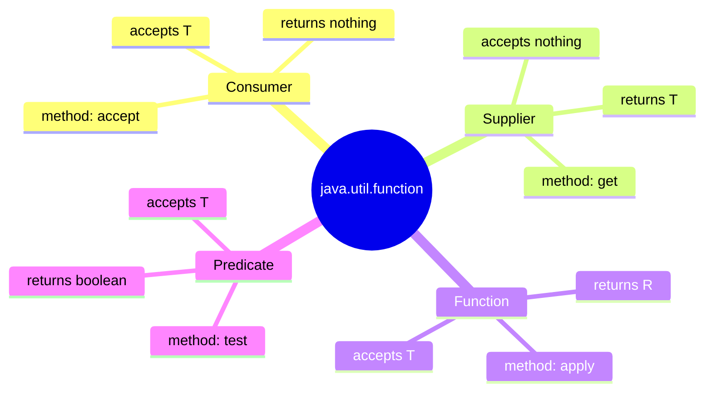
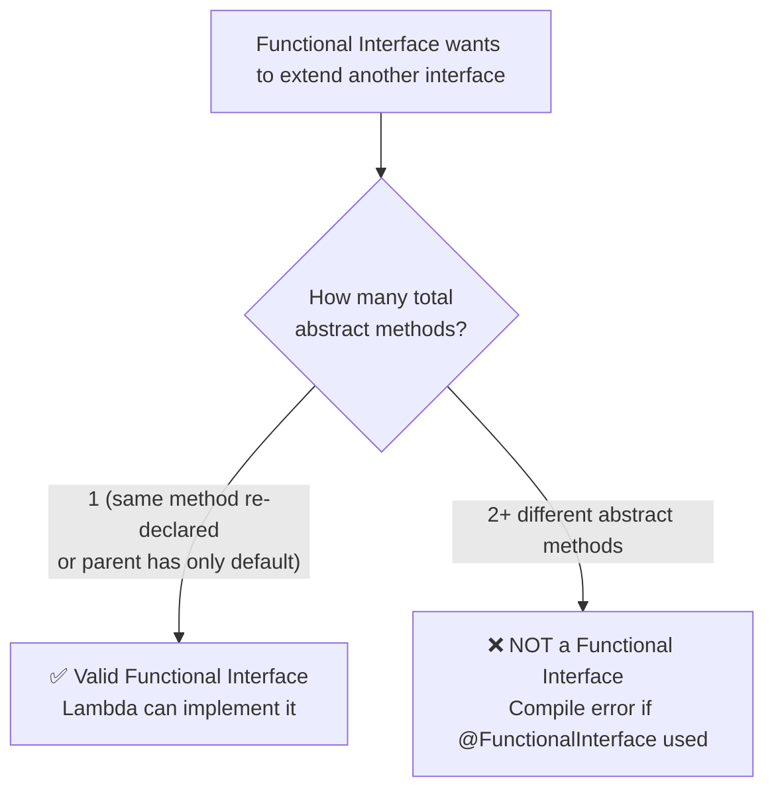
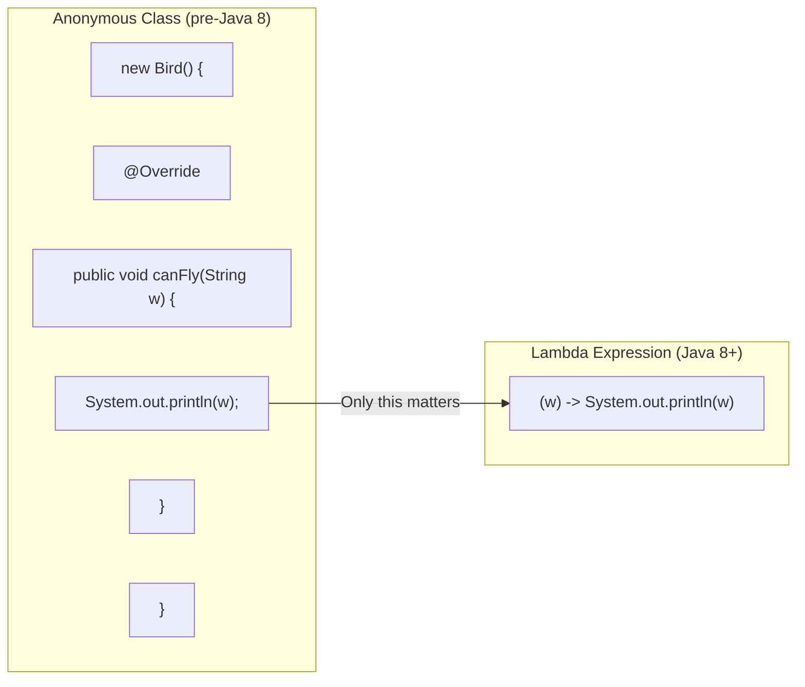
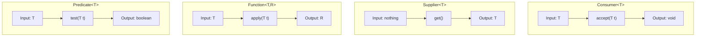
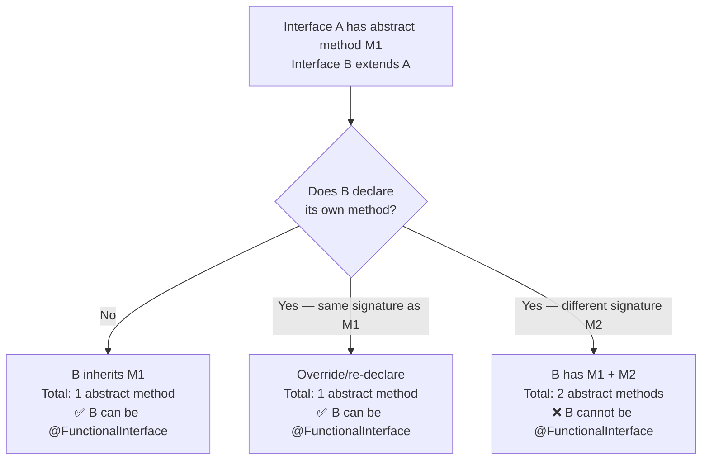

# ☕ Functional Interfaces & Lambda Expressions — Comprehensive Study Guide
### *Java Basics to Advanced | Interfaces — Final Topic*

---

> [!NOTE]
> This guide is a complete self-contained study resource covering Functional Interfaces and Lambda Expressions — a Java 8 feature that is **heavily tested in interviews**. A student should be able to learn the full topic from this document alone — no video required.

---

## 📚 Table of Contents

1. [What is a Functional Interface?](#1-what-is-a-functional-interface)
   - [Definition and SAM](#11-definition-and-sam)
   - [The `@FunctionalInterface` Annotation](#12-the-functionalinterface-annotation)
   - [What is Allowed Inside a Functional Interface?](#13-what-is-allowed-inside-a-functional-interface)
   - [Object Class Methods in Interfaces](#14-object-class-methods-in-interfaces)
2. [Three Ways to Implement an Interface](#2-three-ways-to-implement-an-interface)
   - [Way 1: Using `implements` Keyword](#21-way-1-using-implements-keyword)
   - [Way 2: Using Anonymous Class](#22-way-2-using-anonymous-class)
   - [Way 3: Using Lambda Expression](#23-way-3-using-lambda-expression)
   - [Comparison of All Three Ways](#24-comparison-of-all-three-ways)
3. [Lambda Expression — Deep Dive](#3-lambda-expression--deep-dive)
   - [Syntax Breakdown](#31-syntax-breakdown)
   - [Lambda Syntax Rules](#32-lambda-syntax-rules)
   - [Lambda Examples by Method Signature](#33-lambda-examples-by-method-signature)
4. [Built-in Functional Interfaces (`java.util.function`)](#4-built-in-functional-interfaces-javautilfunction)
   - [Consumer\<T\>](#41-consumert)
   - [Supplier\<T\>](#42-suppliert)
   - [Function\<T, R\>](#43-functiont-r)
   - [Predicate\<T\>](#44-predicatet)
   - [Built-in Types Comparison Table](#45-built-in-types-comparison-table)
5. [Functional Interface Inheritance — Use Cases](#5-functional-interface-inheritance--use-cases)
   - [Use Case 1: Functional Extending Non-Functional](#51-use-case-1-functional-extending-non-functional)
   - [Use Case 2: Non-Functional Extending Functional](#52-use-case-2-non-functional-extending-functional)
   - [Use Case 3: Functional Extending Functional](#53-use-case-3-functional-extending-functional)
6. [Writing Your Own Functional Interface](#6-writing-your-own-functional-interface)
7. [Summary Diagrams](#7-summary-diagrams)
8. [Common Mistakes](#8-common-mistakes)
9. [Best Practices](#9-best-practices)
10. [Interview Notes](#10-interview-notes)
11. [Practice Questions](#11-practice-questions)
12. [Quick Revision Summary](#12-quick-revision-summary)

---

# 1. What is a Functional Interface?

## 1.1 Definition and SAM

### Definition

> A **functional interface** is an interface that contains **exactly one abstract method**.

That is the complete definition. One abstract method — nothing more, nothing less (for the abstract methods; other method types are allowed, as explained below).

---

### SAM — Single Abstract Method

Functional interfaces are also called **SAM interfaces**:

> **SAM = Single Abstract Method**

The two terms are interchangeable:
- *Functional interface* — the Java 8 name
- *SAM interface* — the conceptual name emphasizing its defining characteristic

---

### Why "Exactly One"?

This constraint — having exactly one abstract method — is what makes functional interfaces **work with lambda expressions**. When there is only one abstract method, Java knows *which* method a lambda is implementing without you having to name it. If there were two abstract methods, Java would not know which one the lambda applies to.

---

### Basic Example

```java
// This IS a functional interface — one abstract method
public interface Bird {
    void canFly(String weather);   // only one abstract method
}
```

```java
// This is NOT a functional interface — two abstract methods
public interface Bird {
    void canFly(String weather);
    int getHeight();               // second abstract method → NOT functional
}
```

---

## 1.2 The `@FunctionalInterface` Annotation

### What It Does

The `@FunctionalInterface` annotation is an **optional marker annotation** that tells the compiler:

> "This interface is intended to be a functional interface. Please enforce that it has exactly one abstract method."

```java
@FunctionalInterface
public interface Bird {
    void canFly(String weather);   // ✅ one abstract method — OK
}
```

```java
@FunctionalInterface
public interface Bird {
    void canFly(String weather);
    int getHeight();   // ❌ COMPILE ERROR: Multiple non-overriding abstract methods found
}
```

---

### Is It Mandatory?

No. `@FunctionalInterface` is **completely optional**.

An interface with exactly one abstract method is a functional interface **whether or not** the annotation is present:

```java
// Without annotation — STILL a functional interface
public interface Bird {
    void canFly(String weather);   // one abstract method → functional interface
}
```

The annotation's only purpose is to **enforce the constraint at compile time** and to **document intent** for other developers.

| Scenario | Is it a Functional Interface? |
|---|---|
| `@FunctionalInterface` + 1 abstract method | ✅ Yes |
| No annotation + 1 abstract method | ✅ Yes |
| `@FunctionalInterface` + 2 abstract methods | ❌ Compile error |
| No annotation + 2 abstract methods | ❌ No (not functional, but compiles) |

> [!TIP]
> Always add `@FunctionalInterface` when you intend an interface to be used as a functional interface. It prevents accidental addition of a second abstract method in the future and clearly communicates your design intent.

---

## 1.3 What is Allowed Inside a Functional Interface?

A functional interface must have **exactly one abstract method**, but it **can** contain:

| Member Type | Allowed? | Notes |
|---|---|---|
| Abstract methods | ✅ Exactly ONE | The defining constraint |
| `default` methods | ✅ Any number | Must have implementation body |
| `static` methods | ✅ Any number | Must have implementation body |
| Object class methods | ✅ (do not count) | `toString`, `equals`, `hashCode`, etc. |
| Constants (`static final`) | ✅ Any number | Standard interface constants |

---

### Full Example with All Allowed Members

```java
@FunctionalInterface
public interface Bird {

    // ✅ THE one required abstract method
    void canFly(String weather);

    // ✅ Default method — allowed (has body)
    default void breathe() {
        System.out.println("Bird is breathing");
    }

    // ✅ Static method — allowed (has body)
    static String getKingdom() {
        return "Animalia";
    }

    // ✅ Object class method — NOT counted as abstract
    @Override
    String toString();

    // ❌ Would break functional interface
    // int getHeight();   // second abstract → compile error with @FunctionalInterface
}
```

---

## 1.4 Object Class Methods in Interfaces

### Background

Every Java class ultimately extends `java.lang.Object`. `Object` defines methods like:

- `toString()` — returns a String representation
- `equals(Object o)` — checks equality
- `hashCode()` — returns hash code

### Key Rule

> If an interface declares a method that matches a `public` method signature from `java.lang.Object`, that method does **NOT count as an abstract method** for the purposes of functional interface rules.

This is because any class implementing the interface will already have these methods from `Object` — the implementing class never needs to provide them explicitly.

```java
@FunctionalInterface
public interface TestInterface {
    void process();           // ← the ONE abstract method (counts)
    String toString();        // ← Object class method (does NOT count)
    boolean equals(Object o); // ← Object class method (does NOT count)
}
// Still a valid functional interface — only 'process()' counts
```

```java
// A class implementing this doesn't need to implement toString() or equals()
public class MyClass implements TestInterface {
    @Override
    public void process() {
        System.out.println("Processing...");
    }
    // No need to implement toString() or equals() — inherited from Object
}
```

---

# 2. Three Ways to Implement an Interface

Before lambda expressions existed (before Java 8), there were two ways to implement an interface. Lambda expressions provide a third, more concise way.

---

## 2.1 Way 1: Using `implements` Keyword

### The Traditional Approach

```java
// The functional interface
@FunctionalInterface
public interface Bird {
    void canFly(String weather);
}
```

```java
// A concrete class that implements the interface
public class Eagle implements Bird {
    @Override
    public void canFly(String weather) {
        System.out.println("Eagle is flying in " + weather + " weather");
    }
}
```

```java
// Using it
public class Main {
    public static void main(String[] args) {
        Bird eagle = new Eagle();          // Bird reference holds Eagle object
        eagle.canFly("sunny");             // Output: Eagle is flying in sunny weather
    }
}
```

**Characteristics:**
- Requires creating a separate named class (`Eagle`)
- More verbose but most explicit
- Class can be reused across the codebase
- Best when the implementation is complex or reused in many places

---

## 2.2 Way 2: Using Anonymous Class

### When You Don't Need a Reusable Named Class

```java
public class Main {
    public static void main(String[] args) {

        // Anonymous class — no separate .java file needed
        Bird eagle = new Bird() {
            @Override
            public void canFly(String weather) {
                System.out.println("Eagle is flying in " + weather + " weather");
            }
        };   // ← semicolon ends the variable declaration

        eagle.canFly("cloudy");   // Output: Eagle is flying in cloudy weather
    }
}
```

### What Happens Internally

The compiler creates a hidden class behind the scenes — something like:

```java
// What the compiler generates internally (simplified):
class Main$1 implements Bird {
    @Override
    public void canFly(String weather) {
        System.out.println("Eagle is flying in " + weather + " weather");
    }
}
```

The class name (`Main$1`) is assigned by the compiler. You never see or use this name — hence "anonymous."

**Characteristics:**
- No separate named class required
- Verbose — lots of boilerplate (`new Bird() { @Override public void... }`)
- Good for one-time-use implementations
- The only option before Java 8 for quick interface implementations

---

## 2.3 Way 3: Using Lambda Expression

### The Java 8 Way

```java
public class Main {
    public static void main(String[] args) {

        // Lambda expression — most concise
        Bird eagle = (weather) -> System.out.println("Eagle flying in " + weather);

        eagle.canFly("windy");   // Output: Eagle flying in windy weather
    }
}
```

### Why Lambdas Were Introduced

Look at the anonymous class version again:

```java
Bird eagle = new Bird() {           // ← boilerplate
    @Override                       // ← boilerplate
    public void canFly(String weather) {  // ← method name (redundant — only one abstract method!)
        System.out.println("Eagle is flying in " + weather + " weather");  // ← actual logic
    }                               // ← boilerplate
};                                  // ← boilerplate
```

Only the **highlighted line** is the actual logic you care about. Everything else is **boilerplate** (ceremony code that Java requires but adds no information).

Lambda expressions eliminate this boilerplate:

```java
Bird eagle = (weather) -> System.out.println("Eagle is flying in " + weather + " weather");
//            ↑ param      ↑ arrow     ↑ the actual logic (same line as before)
```

> The key insight: since a functional interface has **only one abstract method**, the compiler already knows which method you're implementing. There's no need to write the method name, `@Override`, `public void`, etc.

---

## 2.4 Comparison of All Three Ways

```java
@FunctionalInterface
interface Bird {
    void canFly(String weather);
}
```

| Approach | Code | Verbosity | When to Use |
|---|---|---|---|
| **implements** | Separate class file | High | Complex, reusable implementations |
| **Anonymous class** | Inline, but verbose | Medium | One-time use, before Java 8 |
| **Lambda** | Single line | Low | One-time use, Java 8+, preferred |

```java
// WAY 1: implements
public class Eagle implements Bird {
    public void canFly(String weather) {
        System.out.println("Flying in " + weather);
    }
}
Bird b1 = new Eagle();

// WAY 2: anonymous class
Bird b2 = new Bird() {
    @Override
    public void canFly(String weather) {
        System.out.println("Flying in " + weather);
    }
};

// WAY 3: lambda
Bird b3 = (weather) -> System.out.println("Flying in " + weather);

// All three produce identical behavior:
b1.canFly("sunny");   // Flying in sunny
b2.canFly("sunny");   // Flying in sunny
b3.canFly("sunny");   // Flying in sunny
```

> [!IMPORTANT]
> Lambda expressions can **only be used with functional interfaces** (interfaces with exactly one abstract method). This is why the one-abstract-method constraint exists — without it, the compiler couldn't know which method the lambda implements.

---

# 3. Lambda Expression — Deep Dive

## 3.1 Syntax Breakdown

```
(parameters) -> { body }
     ↑             ↑
     │             └── Implementation / method body
     └── Input parameters of the abstract method
         (empty if method takes no parameters)
```

The `->` is called the **lambda operator** or **arrow operator**.

---

### Full Anatomy

```java
Bird eagle = (String weather) -> {
//            ↑ parameter list    ↑ arrow operator
    System.out.println("Flying in " + weather);
//  ↑ method body
};
```

---

## 3.2 Lambda Syntax Rules

### Rule 1: Parameter Types Are Optional

The compiler can infer parameter types from the functional interface definition:

```java
// With explicit type (verbose but valid)
Bird b = (String weather) -> System.out.println(weather);

// Without type (compiler infers from interface) ← preferred
Bird b = (weather) -> System.out.println(weather);
```

### Rule 2: Single Parameter — Parentheses Are Optional

```java
// With parentheses (always valid)
Bird b = (weather) -> System.out.println(weather);

// Without parentheses (only valid for exactly one parameter)
Bird b = weather -> System.out.println(weather);
```

> [!NOTE]
> Parentheses are **required** when there are zero parameters or two or more parameters. They are optional only for exactly one parameter.

### Rule 3: No Parameters — Use Empty Parentheses

```java
@FunctionalInterface
interface Greeting {
    void sayHello();   // no parameters
}

Greeting g = () -> System.out.println("Hello!");
//           ↑ empty parentheses — required
```

### Rule 4: Single-Line Body — Curly Braces and `return` Are Optional

```java
// Multi-line: curly braces REQUIRED
Bird b = (weather) -> {
    String msg = "Flying in " + weather;
    System.out.println(msg);
};

// Single-line: curly braces OPTIONAL
Bird b = (weather) -> System.out.println("Flying in " + weather);
```

### Rule 5: Single-Line with Return — No `return` Keyword

When the body is a single expression that returns a value, `return` is implicit:

```java
@FunctionalInterface
interface Doubler {
    int doubleIt(int n);
}

// With block — needs explicit return
Doubler d = (n) -> { return n * 2; };

// Without block — return is implicit
Doubler d = (n) -> n * 2;
```

---

## 3.3 Lambda Examples by Method Signature

### No Parameters, No Return (`void`)

```java
@FunctionalInterface
interface Action {
    void execute();
}

Action a = () -> System.out.println("Executed!");
a.execute();   // Output: Executed!
```

### One Parameter, No Return

```java
@FunctionalInterface
interface Printer {
    void print(String message);
}

Printer p = message -> System.out.println(">> " + message);
p.print("Hello");   // Output: >> Hello
```

### One Parameter, With Return

```java
@FunctionalInterface
interface Square {
    int compute(int n);
}

Square sq = n -> n * n;
System.out.println(sq.compute(5));   // Output: 25
```

### Two Parameters, With Return

```java
@FunctionalInterface
interface Adder {
    int add(int a, int b);
}

Adder adder = (a, b) -> a + b;
System.out.println(adder.add(3, 7));   // Output: 10
```

### Multi-Line Body

```java
@FunctionalInterface
interface Validator {
    boolean validate(int value);
}

Validator v = (value) -> {
    if (value < 0) return false;
    if (value > 100) return false;
    return true;
};

System.out.println(v.validate(50));    // Output: true
System.out.println(v.validate(-5));    // Output: false
System.out.println(v.validate(150));   // Output: false
```

---

# 4. Built-in Functional Interfaces (`java.util.function`)

Java 8 introduced a package — `java.util.function` — that contains **pre-built functional interfaces** covering the most common use cases. You do not need to write your own for standard scenarios.

The four core built-in functional interfaces are:



---

## 4.1 `Consumer<T>`

### Definition

> **`Consumer<T>`** represents an operation that **accepts one input of type T** and **returns no result** (`void`). It "consumes" the input.

### Interface Structure

```java
@FunctionalInterface
public interface Consumer<T> {
    void accept(T t);   // the one abstract method
}
```

### Use Cases

- Printing or logging a value
- Saving data to a database
- Sending a notification
- Performing a side effect with an input

### Example

```java
import java.util.function.Consumer;

public class Main {
    public static void main(String[] args) {

        // Consumer that takes an Integer and logs it
        Consumer<Integer> logger = (value) -> {
            if (value > 10) {
                System.out.println("Large value: " + value);
            } else {
                System.out.println("Small value: " + value);
            }
        };

        logger.accept(11);   // Output: Large value: 11
        logger.accept(5);    // Output: Small value: 5
        logger.accept(100);  // Output: Large value: 100
    }
}
```

### Equivalence to Anonymous Class

```java
// These are IDENTICAL in behavior:

// Anonymous class
Consumer<Integer> logger1 = new Consumer<Integer>() {
    @Override
    public void accept(Integer value) {
        System.out.println("Value: " + value);
    }
};

// Lambda
Consumer<Integer> logger2 = (value) -> System.out.println("Value: " + value);
```

---

## 4.2 `Supplier<T>`

### Definition

> **`Supplier<T>`** represents a function that **accepts no input** and **returns a result of type T**. It "supplies" a value.

### Interface Structure

```java
@FunctionalInterface
public interface Supplier<T> {
    T get();   // the one abstract method
}
```

### Use Cases

- Factory methods that create objects
- Lazy initialization (compute a value only when needed)
- Providing default values
- Generating random values or timestamps

### Example

```java
import java.util.function.Supplier;

public class Main {
    public static void main(String[] args) {

        // Supplier that provides a greeting message
        Supplier<String> greetingSupplier = () -> "Hello, World!";

        String message = greetingSupplier.get();
        System.out.println(message);   // Output: Hello, World!

        // Supplier that provides current timestamp
        Supplier<Long> timestampSupplier = () -> System.currentTimeMillis();
        System.out.println(timestampSupplier.get());   // Output: current time in ms

        // Supplier that creates a new object
        Supplier<java.util.ArrayList<String>> listSupplier = () -> new java.util.ArrayList<>();
        java.util.ArrayList<String> newList = listSupplier.get();
    }
}
```

### Single-Line vs. Block Form

```java
// Single-line form (no return keyword, no braces)
Supplier<String> s1 = () -> "Hello!";

// Block form (explicit return, with braces)
Supplier<String> s2 = () -> {
    return "Hello!";
};

// Both are equivalent
System.out.println(s1.get());   // Hello!
System.out.println(s2.get());   // Hello!
```

---

## 4.3 `Function<T, R>`

### Definition

> **`Function<T, R>`** represents a function that **accepts one argument of type T** and **returns a result of type R**. It transforms the input into an output.

### Interface Structure

```java
@FunctionalInterface
public interface Function<T, R> {
    R apply(T t);   // the one abstract method
}
```

- `T` — the **input** type
- `R` — the **return/result** type

### Use Cases

- Type conversion (e.g., `Integer` → `String`)
- Data transformation / mapping
- Extracting a field from an object
- Applying a formula to a value

### Example

```java
import java.util.function.Function;

public class Main {
    public static void main(String[] args) {

        // Function that converts Integer to String
        Function<Integer, String> intToString = (num) -> {
            return "Number is: " + num.toString();
        };

        String result = intToString.apply(42);
        System.out.println(result);   // Output: Number is: 42

        // Function that squares a number
        Function<Integer, Integer> square = n -> n * n;
        System.out.println(square.apply(5));   // Output: 25

        // Function that converts String to its length
        Function<String, Integer> strLength = str -> str.length();
        System.out.println(strLength.apply("Hello"));   // Output: 5
    }
}
```

### Type Parameters in Practice

```java
// Function<T, R>
//         ↑  ↑
//         │  └── Return type
//         └── Input type

Function<Integer, String>  // takes int, returns String
Function<String, Boolean>  // takes String, returns Boolean
Function<Double, Integer>  // takes Double, returns Integer
Function<String, String>   // takes String, returns String (transform)
```

---

## 4.4 `Predicate<T>`

### Definition

> **`Predicate<T>`** represents a function that **accepts one argument of type T** and **always returns a `boolean`**. It tests whether the input satisfies a condition.

### Interface Structure

```java
@FunctionalInterface
public interface Predicate<T> {
    boolean test(T t);   // the one abstract method
}
```

### Use Cases

- Validation logic (is this input valid?)
- Filtering collections
- Conditional checks
- Testing properties (is even, is empty, is above threshold)

### Example

```java
import java.util.function.Predicate;

public class Main {
    public static void main(String[] args) {

        // Predicate that checks if a number is even
        Predicate<Integer> isEven = (value) -> {
            if (value % 2 == 0) return true;
            else return false;
        };

        // Simplified single-line version
        Predicate<Integer> isEvenSimple = value -> value % 2 == 0;

        System.out.println(isEven.test(4));    // Output: true
        System.out.println(isEven.test(7));    // Output: false

        // Predicate for String validation
        Predicate<String> isNotEmpty = str -> !str.isEmpty();
        System.out.println(isNotEmpty.test("hello"));   // Output: true
        System.out.println(isNotEmpty.test(""));         // Output: false

        // Predicate for age validation
        Predicate<Integer> isAdult = age -> age >= 18;
        System.out.println(isAdult.test(20));   // Output: true
        System.out.println(isAdult.test(15));   // Output: false
    }
}
```

### The Abstract Method is `test()` — Why We Don't Write It in Lambda

```java
// With anonymous class — must name the method
Predicate<Integer> p = new Predicate<Integer>() {
    @Override
    public boolean test(Integer value) {   // ← must write 'test'
        return value % 2 == 0;
    }
};

// With lambda — no method name needed
Predicate<Integer> p = value -> value % 2 == 0;
// Java knows this implements test() because:
// 1. Predicate is a functional interface
// 2. It has only one abstract method (test)
// 3. The lambda must be implementing that one method
```

---

## 4.5 Built-in Types Comparison Table

| Interface | Abstract Method | Input | Output | Use When |
|---|---|---|---|---|
| `Consumer<T>` | `void accept(T t)` | T | Nothing | Process/consume input with side effects |
| `Supplier<T>` | `T get()` | Nothing | T | Generate/supply a value |
| `Function<T,R>` | `R apply(T t)` | T | R | Transform input to output |
| `Predicate<T>` | `boolean test(T t)` | T | `boolean` | Test/validate a condition |

### Memory Device

```
Consumer  — takes IN, gives nothing out  ("consumes")
Supplier  — takes nothing in, gives OUT  ("supplies")
Function  — takes IN, gives OUT          ("transforms")
Predicate — takes IN, gives TRUE/FALSE   ("tests")
```

---

### Additional Built-in Variants (Bonus)

Java provides many variations of these four core interfaces:

| Interface | Description |
|---|---|
| `BiConsumer<T,U>` | Like `Consumer` but accepts two inputs |
| `BiFunction<T,U,R>` | Like `Function` but accepts two inputs |
| `BiPredicate<T,U>` | Like `Predicate` but accepts two inputs |
| `UnaryOperator<T>` | `Function<T,T>` — input and output same type |
| `BinaryOperator<T>` | Like `BiFunction<T,T,T>` — both inputs and output same type |
| `IntConsumer`, `LongConsumer` | Primitive-specialized versions (avoid boxing) |

---

# 5. Functional Interface Inheritance — Use Cases

Interfaces can extend other interfaces. When functional interfaces are involved, specific rules apply. There are three important use cases.

---

## 5.1 Use Case 1: Functional Extending Non-Functional

### Scenario: A `@FunctionalInterface` tries to extend an interface that has an abstract method

```java
// Non-functional interface — has one abstract method
public interface LivingThing {
    void canBreathe();   // abstract method #1
}

// Functional interface tries to extend LivingThing
@FunctionalInterface
public interface Bird extends LivingThing {
    void canFly(String weather);   // abstract method #2 (inherited + own = 2 total)
}
// ❌ COMPILE ERROR: Multiple non-overriding abstract methods found in interface Bird
```

**Why?** When `Bird` extends `LivingThing`, it **inherits** `canBreathe()`. Now `Bird` has two abstract methods: `canBreathe()` (inherited) + `canFly()` (own). Two abstract methods → cannot be a functional interface.

---

### Fix: Make the Parent Method `default`

```java
// Non-functional interface — method is default (has body)
public interface LivingThing {
    default void canBreathe() {
        System.out.println("Breathing...");
    }
}

// Functional interface extends it — only one abstract method (canFly)
@FunctionalInterface
public interface Bird extends LivingThing {
    void canFly(String weather);   // only ONE abstract method ✅
}
```

`canBreathe()` is now a `default` method — it has an implementation and is not abstract. `Bird` inherits it but is not required to implement it. `Bird` has exactly one abstract method → valid functional interface.

---

## 5.2 Use Case 2: Non-Functional Extending Functional

### Scenario: A regular interface extends a functional interface

```java
// Functional interface — one abstract method
@FunctionalInterface
public interface LivingThing {
    void canBreathe();   // abstract method #1
}

// Regular interface (NOT @FunctionalInterface) extends LivingThing
public interface Bird extends LivingThing {
    void canFly(String weather);   // abstract method #2
}
// ✅ COMPILES FINE
```

**Why does this work?** `Bird` is a **regular interface** (no `@FunctionalInterface` annotation). Regular interfaces can have any number of abstract methods. `Bird` has two (one inherited, one own) — that is perfectly legal.

**However:** `Bird` is now NOT a functional interface (two abstract methods), so you cannot use a lambda to implement it.

```java
// ❌ Cannot use lambda — Bird has two abstract methods
// Bird b = () -> System.out.println("breathing");  // Which method does this implement?

// ✅ Must use anonymous class or implements
Bird b = new Bird() {
    @Override public void canBreathe() { System.out.println("Breathing"); }
    @Override public void canFly(String w) { System.out.println("Flying in " + w); }
};
```

---

## 5.3 Use Case 3: Functional Extending Functional

### Scenario A: Both have DIFFERENT abstract methods → ❌ Compile Error

```java
@FunctionalInterface
public interface LivingThing {
    void canBreathe();   // abstract method #1
}

@FunctionalInterface
public interface Bird extends LivingThing {
    void canFly(String weather);   // abstract method #2 (different from canBreathe)
}
// ❌ COMPILE ERROR: Bird ends up with two different abstract methods
```

The child inherits `canBreathe()` from `LivingThing` and adds `canFly()`. Two different abstract methods → `@FunctionalInterface` constraint violated.

---

### Scenario B: Both have the SAME abstract method → ✅ Valid

```java
@FunctionalInterface
public interface LivingThing {
    boolean canBreathe();   // abstract method
}

@FunctionalInterface
public interface Bird extends LivingThing {
    boolean canBreathe();   // SAME signature as parent
}
// ✅ VALID — Bird's canBreathe() overrides (re-declares) LivingThing's canBreathe()
// Only ONE effective abstract method
```

**Why does this work?** When `Bird` declares a method with the **exact same signature** as the inherited one, it is effectively overriding (re-declaring) it. The result is still just one abstract method — it is not counted twice.

---

### Implementing the Valid Inheritance Case

```java
@FunctionalInterface
public interface LivingThing {
    boolean canBreathe();
}

@FunctionalInterface
public interface Bird extends LivingThing {
    boolean canBreathe();   // same signature — valid
}

public class Main {
    public static void main(String[] args) {

        // Lambda implementing Bird (which extends LivingThing)
        // No parameters → empty ()
        // Returns boolean → just return true (no braces needed for single expression)
        Bird eagleLambda = () -> true;

        System.out.println(eagleLambda.canBreathe());   // Output: true
    }
}
```

---

### Inheritance Rules Summary



---

# 6. Writing Your Own Functional Interface

Use a built-in functional interface when your use case fits one of the four patterns (Consumer, Supplier, Function, Predicate).

Write your own when:
- You need more than one or two parameters
- The semantics are domain-specific and a custom name improves readability
- The built-in types don't express your intent clearly

### Custom Functional Interface Examples

```java
// Custom: 3 parameters, returns a String
@FunctionalInterface
public interface TriFunction<A, B, C, R> {
    R apply(A a, B b, C c);
}

// Usage
TriFunction<String, Integer, Boolean, String> formatter =
    (name, age, active) -> name + " | Age: " + age + " | Active: " + active;

System.out.println(formatter.apply("Alice", 30, true));
// Output: Alice | Age: 30 | Active: true
```

```java
// Custom: domain-specific name improves clarity
@FunctionalInterface
public interface TaxCalculator {
    double calculate(double grossIncome, double taxRate);
}

TaxCalculator basic = (income, rate) -> income * rate / 100;
System.out.println(basic.calculate(100000, 30));   // Output: 30000.0
```

```java
// Custom: no input, no output (Runnable-like)
@FunctionalInterface
public interface DatabaseOperation {
    void execute() throws Exception;
}

DatabaseOperation saveUser = () -> System.out.println("Saving user to DB...");
```

---

# 7. Summary Diagrams

## Lambda vs. Anonymous Class



## Four Built-in Functional Interfaces



## Functional Interface Inheritance Decision Tree



---

# 8. Common Mistakes

## Mistake 1: Adding a Second Abstract Method to a `@FunctionalInterface`

```java
@FunctionalInterface
public interface Bird {
    void canFly(String weather);
    int getHeight();   // ❌ COMPILE ERROR
}
```

**Fix:** Remove the second abstract method, or make it `default` with an implementation.

---

## Mistake 2: Using Lambda with a Non-Functional Interface

```java
public interface Bird {
    void canFly(String weather);
    int getHeight();   // two abstract methods
}

// ❌ COMPILE ERROR: Bird is not a functional interface
Bird b = weather -> System.out.println(weather);
```

**Fix:** Use anonymous class or `implements`, or reduce the interface to one abstract method.

---

## Mistake 3: Wrong Argument Count in Lambda

```java
@FunctionalInterface
interface Adder {
    int add(int a, int b);   // two parameters
}

// ❌ COMPILE ERROR: wrong number of arguments
Adder adder = (a) -> a + 1;

// ✅ CORRECT
Adder adder = (a, b) -> a + b;
```

---

## Mistake 4: Using `return` in a Single-Line Lambda Without Braces

```java
@FunctionalInterface
interface Square {
    int compute(int n);
}

// ❌ COMPILE ERROR: return not allowed in expression lambda
Square sq = n -> return n * n;

// ✅ CORRECT — no return, no braces for single expression
Square sq = n -> n * n;

// ✅ ALSO CORRECT — return with braces
Square sq2 = n -> { return n * n; };
```

---

## Mistake 5: Empty Parentheses Missing for Zero-Parameter Lambda

```java
@FunctionalInterface
interface Action {
    void execute();   // no parameters
}

// ❌ COMPILE ERROR: syntax error
Action a = -> System.out.println("Hello");

// ✅ CORRECT — empty parentheses required
Action a = () -> System.out.println("Hello");
```

---

## Mistake 6: Thinking `default` Methods Break the Functional Interface Rule

```java
@FunctionalInterface
public interface Bird {
    void canFly(String weather);   // abstract — counts
    default void breathe() { }    // default — does NOT count
    static void info() { }        // static — does NOT count
}
// ✅ VALID — still a functional interface
```

> [!NOTE]
> Only **abstract** methods count toward the one-method limit. `default`, `static`, and Object-class methods are completely ignored in this count.

---

## Mistake 7: Forgetting Semicolon After Lambda Expression Statement

```java
// ❌ Missing semicolon
Bird b = weather -> System.out.println(weather)

// ✅ Correct
Bird b = weather -> System.out.println(weather);
```

---

# 9. Best Practices

1. **Always add `@FunctionalInterface`** when designing an interface intended for lambda use — it enforces the contract and documents intent.
2. **Prefer built-in functional interfaces** (`Consumer`, `Supplier`, `Function`, `Predicate`) over custom ones when the signature fits.
3. **Keep lambdas short** — if a lambda body is more than 2-3 lines, consider extracting it into a named method (improves readability and testability).
4. **Use method references** when the lambda simply calls an existing method:
   ```java
   // Lambda
   Consumer<String> printer = s -> System.out.println(s);
   // Method reference (more readable)
   Consumer<String> printer = System.out::println;
   ```
5. **Don't mutate external state inside lambdas** — lambdas should ideally be pure functions (same input → same output, no side effects) for predictability and thread safety.
6. **Use `Predicate` for validation chains** — `Predicate` has built-in `and()`, `or()`, `negate()` for composing conditions:
   ```java
   Predicate<Integer> isPositive = n -> n > 0;
   Predicate<Integer> isEven = n -> n % 2 == 0;
   Predicate<Integer> isPositiveAndEven = isPositive.and(isEven);
   ```
7. **Name lambda variables descriptively** — `isEven`, `userValidator`, `taxCalculator` are better than `p`, `f`, `c`.

---

# 10. Interview Notes

## Commonly Asked Questions

### Q1: What is a functional interface?
**Answer:** An interface with **exactly one abstract method**. Also called a SAM (Single Abstract Method) interface. It can have any number of `default` methods, `static` methods, and Object-class methods — only abstract methods are counted.

---

### Q2: What is `@FunctionalInterface`? Is it mandatory?
**Answer:** It is an optional annotation that tells the compiler to enforce the one-abstract-method constraint. Without it, an interface with one abstract method is still a functional interface, but the annotation adds compile-time enforcement and documents intent.

---

### Q3: What is a lambda expression? Why was it introduced?
**Answer:** A lambda expression is a concise way to implement a functional interface. It was introduced in Java 8 to reduce the boilerplate of anonymous classes. Since a functional interface has exactly one abstract method, the lambda's parameters and body are enough — no class name, method name, or `@Override` needed.

---

### Q4: What is the syntax of a lambda expression?
**Answer:** `(parameters) -> body`
- Parameters: empty `()` if none, or `(param1, param2, ...)`. Type annotations optional.
- Body: single expression (no braces, implicit return) or block `{ ... }` (needs explicit `return` for non-void).

---

### Q5: Can a functional interface have `default` and `static` methods?
**Answer:** Yes. `default` and `static` methods do not count toward the one-abstract-method limit. A functional interface can have any number of them as long as it has exactly one `abstract` method.

---

### Q6: What are the four core built-in functional interfaces in Java?
**Answer:**
- `Consumer<T>` — accepts T, returns nothing. Method: `accept()`
- `Supplier<T>` — accepts nothing, returns T. Method: `get()`
- `Function<T,R>` — accepts T, returns R. Method: `apply()`
- `Predicate<T>` — accepts T, returns boolean. Method: `test()`

---

### Q7: Can a functional interface extend another interface?
**Answer:** Yes, with rules:
- If the parent has an abstract method and the child adds a **different** abstract method → two abstract methods total → not a functional interface.
- If the parent has an abstract method and the child re-declares the **same** signature → still one effective abstract method → valid.
- If the parent only has `default` methods → child's one abstract method is fine → valid.

---

### Q8: Why can lambdas only be used with functional interfaces?
**Answer:** Lambda expressions work by implementing a method without naming it. This only works when there is **exactly one** abstract method — otherwise the compiler cannot determine which method the lambda implements.

---

### Q9: What is the difference between `Function<T,R>` and `Consumer<T>`?
**Answer:** `Function<T,R>` accepts T and returns R (transforms input to output). `Consumer<T>` accepts T and returns nothing — it performs a side effect (print, save, send).

---

### Q10: What is the difference between a lambda and an anonymous class?
**Answer:** Both implement an interface inline. A lambda is more concise — it omits the class declaration, method name, and `@Override`. A lambda can only implement functional interfaces (one abstract method). An anonymous class can implement any interface or extend any class.

---

# 11. Practice Questions

## Easy

1. What is the defining characteristic of a functional interface?
2. What does SAM stand for? What does it mean?
3. Is `@FunctionalInterface` mandatory? What does it do?
4. Write a functional interface `Greeter` with one method `greet(String name)` that returns `void`.
5. Can a functional interface have `default` methods? Static methods? Object-class methods?
6. Which abstract method does `Consumer<T>` expose? What does it accept and return?

## Medium

7. Implement the `Greeter` interface from Q4 using all three approaches: `implements`, anonymous class, and lambda expression.
8. Write a `Consumer<String>` lambda that prints the string in uppercase.
9. Write a `Supplier<Integer>` lambda that returns a random integer between 1 and 100.
10. Write a `Function<String, Integer>` lambda that returns the number of vowels in a string.
11. Write a `Predicate<String>` lambda that returns `true` if the string starts with an uppercase letter.
12. Explain why the following code has a compile error, and fix it:
    ```java
    @FunctionalInterface
    interface MyInterface {
        void doSomething();
        void doSomethingElse();
    }
    ```
13. Given this interface, can you use a lambda? Why or why not?
    ```java
    public interface Vehicle {
        void start();
        void stop();
    }
    ```

## Hard

14. Write a functional interface `TriFunction<A, B, C, R>` that accepts three inputs and returns a result. Implement it with a lambda that concatenates three strings with a separator.
15. Create two functional interfaces where one extends the other with the **same** method signature. Implement it with a lambda. Then show what happens if you change the child interface to use a **different** method signature.
16. Explain the three rules of lambda syntax (parameter types, parentheses, braces/return). Write four lambda examples progressively simplifying the syntax for: a two-parameter int adder.
17. Implement a mini-pipeline using all four built-in interfaces in sequence:
    - A `Supplier<String>` provides raw data
    - A `Function<String, Integer>` transforms it
    - A `Predicate<Integer>` validates it
    - A `Consumer<Integer>` consumes (prints) the result
18. Explain why `Predicate<T>` is preferable to `Function<T, Boolean>` when testing conditions, even though both return a boolean value. (Hint: think about the built-in `and()`, `or()`, `negate()` methods.)

---

# 12. Quick Revision Summary

```
☕ FUNCTIONAL INTERFACES & LAMBDA EXPRESSIONS — KEY POINTS

📌 FUNCTIONAL INTERFACE:
   = Interface with EXACTLY ONE abstract method
   = SAM (Single Abstract Method) interface
   @FunctionalInterface → optional annotation, enforces the rule at compile time

   ALLOWED inside functional interface:
   ✅ Exactly 1 abstract method       (required)
   ✅ Any number of default methods   (don't count)
   ✅ Any number of static methods    (don't count)
   ✅ Object class methods            (don't count)

🔧 THREE WAYS TO IMPLEMENT:
   1. implements keyword    → separate named class
   2. Anonymous class       → inline, verbose
   3. Lambda expression     → inline, concise (Java 8+)

   Lambda can ONLY implement FUNCTIONAL interfaces (1 abstract method)

📝 LAMBDA SYNTAX:
   (parameters) -> body

   Rules:
   • No params           → ()
   • One param           → (x) or just x
   • Multi params        → (x, y)
   • Types optional      → compiler infers
   • Single-line body    → no braces, no return
   • Multi-line body     → { } required, return required

   Examples:
   ()         -> "Hello"                     // no params, returns String
   x          -> x * 2                       // one param, returns int
   (x, y)     -> x + y                       // two params, returns int
   (x)        -> { System.out.println(x); }  // one param, void, multi-line

📦 4 BUILT-IN FUNCTIONAL INTERFACES (java.util.function):
   Consumer<T>      → accept(T)         Input: T    | Output: void
   Supplier<T>      → get()             Input: none | Output: T
   Function<T,R>    → apply(T)          Input: T    | Output: R
   Predicate<T>     → test(T)           Input: T    | Output: boolean

   Consumer  = consumes, no return
   Supplier  = supplies, no input
   Function  = transforms T to R
   Predicate = tests, returns true/false

🔗 FUNCTIONAL INTERFACE INHERITANCE:
   Functional extends Non-Functional:
     → If parent has abstract method → 2 total → ❌ ERROR
     → If parent has only default    → 1 total → ✅ OK

   Non-Functional extends Functional:
     → Adds its own abstract method → 2 total → ✅ Compiles (not functional)

   Functional extends Functional:
     → Same method signature → 1 effective → ✅ OK
     → Different signatures  → 2 total     → ❌ ERROR

⚠️ KEY INTERVIEW POINTS:
   • Lambda works ONLY with functional interfaces (1 abstract method)
   • @FunctionalInterface is OPTIONAL but recommended
   • default/static methods do NOT count toward the limit
   • Consumer = no return | Supplier = no input | Function = both | Predicate = boolean return
   • Lambda = less verbose anonymous class for functional interfaces
   • Cannot use return without braces; cannot use braces without return (for non-void)
```

---

*End of Chapter — Functional Interfaces & Lambda Expressions*

---

> [!TIP]
> **Related Topics to Study Next:**
> - **Method References** (`ClassName::methodName`) — an even more concise form of lambdas
> - **Stream API** — uses functional interfaces extensively (`filter`, `map`, `forEach`)
> - **`Optional<T>`** — uses `Supplier`, `Consumer`, `Predicate` in its API
> - **`volatile` keyword in depth** — for the memory visibility concepts introduced in the Singleton lecture

---

*Study Guide generated from: Java Basics to Advanced — Interfaces Part (Final): Functional Interfaces & Lambda Expressions*
