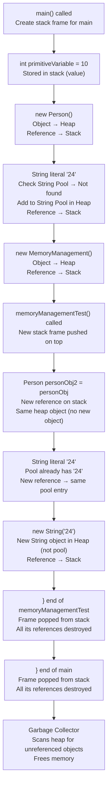
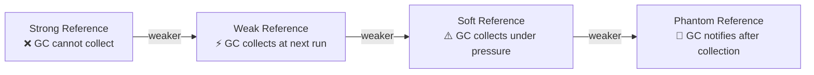
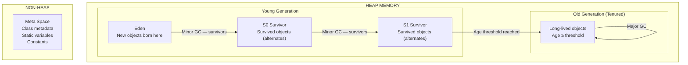
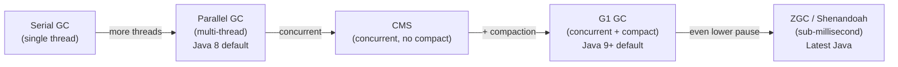
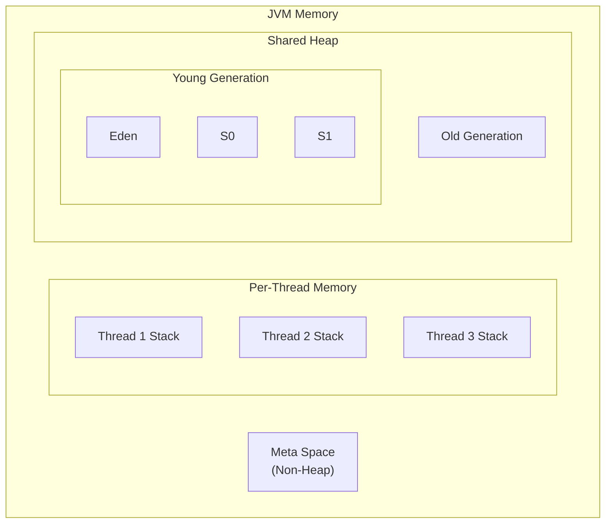
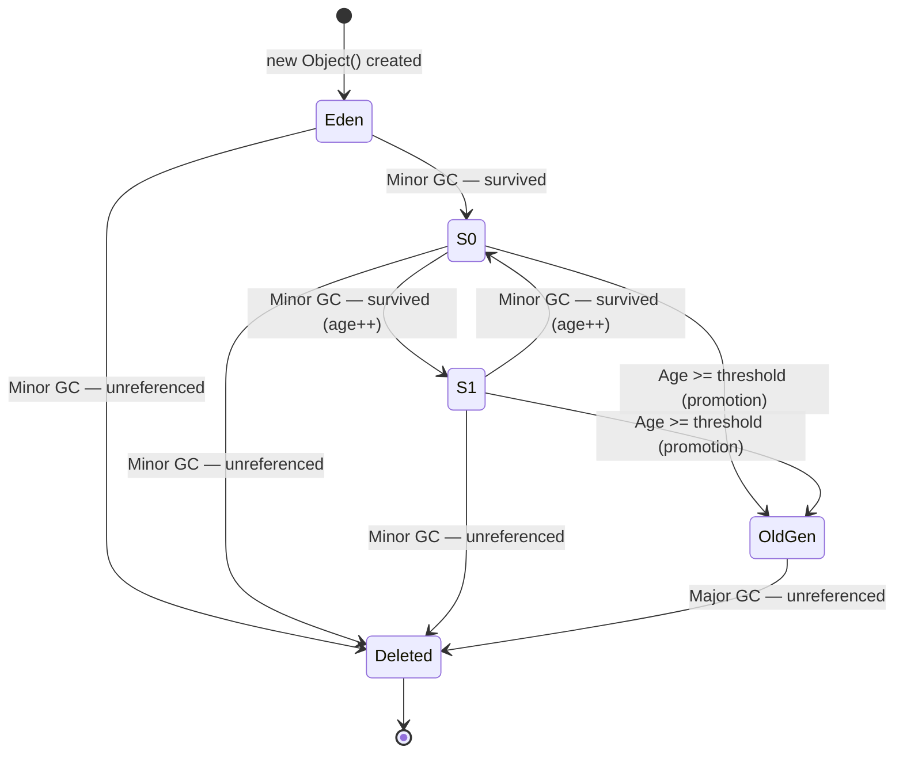

# ☕ Java Memory Management — Comprehensive Study Guide
### *Java Basics to Advanced | Lecture 4*

---

> [!NOTE]
> This guide is a complete self-contained study resource derived from the Java Basics to Advanced lecture series (Video 4 — Memory Management). A student should be able to learn the full topic from this document alone — no video required.

---

## 📚 Table of Contents

1. [Introduction to Java Memory Management](#1-introduction-to-java-memory-management)
2. [Stack Memory](#2-stack-memory)
3. [Heap Memory](#3-heap-memory)
4. [Stack vs. Heap — Complete Comparison](#4-stack-vs-heap--complete-comparison)
5. [Memory in Action — Full Code Walkthrough](#5-memory-in-action--full-code-walkthrough)
6. [Garbage Collector](#6-garbage-collector)
7. [Types of Object References](#7-types-of-object-references)
8. [Making an Object Eligible for GC](#8-making-an-object-eligible-for-gc)
9. [Heap Memory — Internal Structure](#9-heap-memory--internal-structure)
   - [Young Generation](#91-young-generation)
   - [Old Generation (Tenured)](#92-old-generation-tenured)
   - [Meta Space](#93-meta-space)
10. [Garbage Collection Algorithms](#10-garbage-collection-algorithms)
11. [Types of Garbage Collectors](#11-types-of-garbage-collectors)
12. [Summary Diagrams](#12-summary-diagrams)
13. [Common Mistakes](#13-common-mistakes)
14. [Best Practices](#14-best-practices)
15. [Interview Notes](#15-interview-notes)
16. [Practice Questions](#16-practice-questions)
17. [Quick Revision Summary](#17-quick-revision-summary)

---

# 1. Introduction to Java Memory Management

## Overview

When you write a Java program and run it, every variable, every object, every method call consumes **RAM (Random Access Memory)**. Understanding *how* that memory is allocated, organized, and freed is one of the most important concepts for any Java developer — both for interviews and for writing efficient, production-quality code.

---

## Who Manages Memory in Java?

> **JVM (Java Virtual Machine)** is entirely responsible for memory management in Java.

This is one of Java's key advantages over languages like C and C++, where the programmer must manually allocate and free memory (using `malloc` / `free` in C). In Java, memory is:

- **Automatically allocated** when you create variables and objects
- **Automatically freed** by the **Garbage Collector** when objects are no longer needed

This is why Java is described as having **automatic memory management**.

---

## The Two Main Memory Areas

JVM divides the available RAM into two primary regions:

```
┌─────────────────────────────────────────────────────────┐
│                      JVM Memory                         │
│                                                         │
│   ┌─────────────┐        ┌──────────────────────────┐  │
│   │    STACK    │        │          HEAP            │  │
│   │  (smaller)  │        │        (larger)          │  │
│   │             │        │                          │  │
│   │ • Primitive │        │ • Objects                │  │
│   │   values    │        │ • String pool            │  │
│   │ • References│        │ • Instance variables     │  │
│   │ • Method    │        │                          │  │
│   │   frames    │        │                          │  │
│   └─────────────┘        └──────────────────────────┘  │
│                                                         │
│   (one per thread)       (one shared by all threads)    │
└─────────────────────────────────────────────────────────┘
```

> [!IMPORTANT]
> - **Stack** — smaller, faster, one per thread
> - **Heap** — larger, shared among all threads, one single heap per JVM instance

---

# 2. Stack Memory

## Definition

> **Stack memory** is a region of RAM where **method frames, primitive values, and object references** are stored. Each thread in a Java program has its **own private stack**.

---

## What Gets Stored in Stack?

| Data Type | Stored In Stack? | Details |
|---|---|---|
| Primitive variables (`int`, `double`, `boolean`, etc.) | ✅ Yes | Value stored directly |
| Object references | ✅ Yes | The reference (address/pointer) is stored; the object itself is in heap |
| Method frames | ✅ Yes | One frame per active method call |
| Local variables | ✅ Yes | All variables declared inside a method |

---

## Key Characteristics of Stack

### 1. Temporary Variables
Variables in the stack exist only for the **lifetime of the block** they are declared in. Once execution leaves the block (`}`), the variable is destroyed.

### 2. Method Frames (Stack Frames)
Every time a method is called, JVM creates a new **memory block (frame)** on the stack for that method. This frame holds:
- All local variables of the method
- All object references created inside the method
- The method's parameters

### 3. Each Thread Has Its Own Stack
Since Java supports multithreading, every thread gets its **own independent stack**. Threads do **not share** stack memory.

```
Thread 1 Stack   Thread 2 Stack   Thread 3 Stack
┌───────────┐    ┌───────────┐    ┌───────────┐
│  method B │    │  method D │    │  method F │
│───────────│    │───────────│    │───────────│
│  method A │    │  method C │    │  method E │
└───────────┘    └───────────┘    └───────────┘
         All share one common Heap
```

### 4. LIFO Order — Last In, First Out
The stack operates on the **LIFO** principle. The last method called is the first one to finish and be removed from the stack (like a stack of plates — you remove the top one first).

### 5. Variable Scope
Variables in the stack are only accessible **within their own scope** (their own method frame). A variable in method B cannot be directly accessed from method A.

### 6. Stack Overflow Error
If too many method frames are pushed onto the stack (e.g., infinite recursion), the stack runs out of space and you get:

```
java.lang.StackOverflowError
```

---

# 3. Heap Memory

## Definition

> **Heap memory** is the region of RAM where **all Java objects** are stored. It is shared by all threads and is managed by the **Garbage Collector**.

---

## What Gets Stored in Heap?

| Data Type | Stored In Heap? | Details |
|---|---|---|
| Objects (created with `new`) | ✅ Yes | Full object data stored here |
| String literals | ✅ Yes | In the **String Pool** (a special area inside heap) |
| Instance variables | ✅ Yes | Stored as part of the object |
| Arrays | ✅ Yes | Arrays are objects in Java |

---

## Key Characteristics of Heap

- **Larger** than stack memory
- **One shared heap** per JVM instance — all threads access the same heap
- Objects live until they are **garbage collected**
- Managed by the **Garbage Collector**
- Running out of heap memory causes: `java.lang.OutOfMemoryError`

---

# 4. Stack vs. Heap — Complete Comparison

| Feature | Stack | Heap |
|---|---|---|
| **What it stores** | Primitives, references, method frames | Objects, arrays, String pool |
| **Size** | Smaller | Larger |
| **Number** | One per thread | One shared for all threads |
| **Access speed** | Faster | Slower (relative) |
| **Memory management** | Automatic — variables removed when scope ends | Garbage Collector |
| **Thread safety** | Thread-safe (private to each thread) | Shared — requires synchronization |
| **Lifetime** | Until method/block ends | Until no references remain (GC cleans up) |
| **Error when full** | `StackOverflowError` | `OutOfMemoryError` |
| **Order** | LIFO (Last In, First Out) | No particular order |

---

# 5. Memory in Action — Full Code Walkthrough

## The Code

```java
public class MemoryManagement {

    public static void main(String[] args) {
        int primitiveVariable = 10;                          // line 1
        Person personObj = new Person();                     // line 2
        String stringLiteral = "24";                         // line 3
        MemoryManagement memObj = new MemoryManagement();    // line 4
        memObj.memoryManagementTest(personObj);              // line 5
    }

    public void memoryManagementTest(Person personObj) {
        Person personObj2 = personObj;                       // line 6
        String stringLiteral2 = "24";                        // line 7
        String stringLiteral3 = new String("24");            // line 8
    }                                                        // line 9 — method ends
}                                                            // line 10 — main ends
```

---

## Step-by-Step Memory Trace

### Initial State

Stack and Heap are both empty.

```
STACK                   HEAP
┌─────────┐             ┌─────────────────────────────┐
│ (empty) │             │           (empty)           │
└─────────┘             └─────────────────────────────┘
```

---

### Step 1: `main()` is called

JVM creates a **new frame on the stack** for the `main` method.

```
STACK                   HEAP
┌──────────────┐        ┌──────────────────────────────┐
│  main frame  │        │           (empty)            │
└──────────────┘        └──────────────────────────────┘
```

---

### Step 2: Line 1 — `int primitiveVariable = 10`

A primitive variable. Its **value is stored directly on the stack** inside the `main` frame.

```
STACK                   HEAP
┌──────────────────┐    ┌──────────────────────────────┐
│  main frame      │    │           (empty)            │
│  primitiveVar=10 │    │                              │
└──────────────────┘    └──────────────────────────────┘
```

---

### Step 3: Line 2 — `Person personObj = new Person()`

- A **Person object** is created in the **heap**
- A **reference** (`personObj`) pointing to that heap object is stored on the **stack**

```
STACK                   HEAP
┌───────────────────┐   ┌────────────────────────────┐
│  main frame       │   │  [Person Object]           │
│  primitiveVar=10  │   │   (memory address: 0x100)  │
│  personObj → ─────┼───┼──►                         │
└───────────────────┘   └────────────────────────────┘
```

---

### Step 4: Line 3 — `String stringLiteral = "24"`

- String literals are stored in the **String Pool** (inside heap)
- String Pool first checks: is `"24"` already in the pool? No → creates it
- A **reference** (`stringLiteral`) is stored on the stack pointing to the pool entry

```
STACK                    HEAP
┌──────────────────┐     ┌───────────────────────────────────┐
│  main frame      │     │  [Person Object @ 0x100]          │
│  primitiveVar=10 │     │                                   │
│  personObj → ────┼─────┼──►                               │
│  stringLiteral──►│     │  String Pool:  ["24" @ 0x200]    │
└──────────────────┘     └───────────────────────────────────┘
```

---

### Step 5: Line 4 — `MemoryManagement memObj = new MemoryManagement()`

- A **MemoryManagement object** is created in the heap
- Its reference (`memObj`) is stored on the stack

---

### Step 6: Line 5 — `memObj.memoryManagementTest(personObj)` called

A **new frame** for `memoryManagementTest` is pushed **on top of** the `main` frame (LIFO).

```
STACK
┌────────────────────────────────────┐
│  memoryManagementTest frame        │  ← TOP (most recent)
│  (parameters and locals go here)   │
├────────────────────────────────────┤
│  main frame                        │
│  primitiveVar=10                   │
│  personObj → (heap @ 0x100)        │
│  stringLiteral → (pool "24")       │
│  memObj → (heap @ 0x300)           │
└────────────────────────────────────┘

HEAP
┌──────────────────────────────────────────┐
│  [Person Object @ 0x100]                 │
│  [MemoryManagement Object @ 0x300]       │
│  String Pool: ["24" @ 0x200]             │
└──────────────────────────────────────────┘
```

---

### Step 7: Line 6 — `Person personObj2 = personObj` (inside test method)

- No new object is created in heap
- `personObj2` is a **new reference** in the stack frame, pointing to the **same heap object** as `personObj`

```
STACK (memoryManagementTest frame)
┌───────────────────────────────────────┐
│  personObj  → (heap @ 0x100)          │  ← passed in as parameter
│  personObj2 → (heap @ 0x100)          │  ← same object, second reference
└───────────────────────────────────────┘
```

Two references, one object. No duplication in heap.

---

### Step 8: Line 7 — `String stringLiteral2 = "24"` (inside test method)

- String Pool already has `"24"` (created in Step 4)
- `stringLiteral2` simply points to the **same existing pool entry**
- No new String object created

```
stringLiteral  (main frame)  → String Pool "24" @ 0x200
stringLiteral2 (test frame)  → String Pool "24" @ 0x200   ← SAME pool entry
```

---

### Step 9: Line 8 — `String stringLiteral3 = new String("24")` (inside test method)

- The `new` keyword **forces a new object** to be created in the **heap** (outside String Pool)
- Even though the value `"24"` already exists in the pool, a brand-new String object is created
- `stringLiteral3` points to this new heap object

```
HEAP
┌──────────────────────────────────────────┐
│  [Person Object @ 0x100]                 │
│  [MemoryManagement Object @ 0x300]       │
│  [String Object "24" @ 0x400]            │  ← new, NOT in pool
│  String Pool: ["24" @ 0x200]             │
└──────────────────────────────────────────┘
```

---

### Step 10: Line 9 — Closing `}` of `memoryManagementTest`

The method's scope ends. The entire `memoryManagementTest` **frame is popped from the stack** (LIFO). All references in that frame are destroyed.

**Removed from stack:**
- `personObj` (reference) — gone
- `personObj2` (reference) — gone
- `stringLiteral2` (reference) — gone
- `stringLiteral3` (reference) — gone

**Still in heap (orphaned — no references):**
- String Object `"24" @ 0x400` — no reference left → **eligible for GC**

```
STACK (only main frame remains)
┌───────────────────────────────────┐
│  main frame                       │
│  primitiveVar=10                  │
│  personObj → (heap @ 0x100)       │
│  stringLiteral → (pool "24")      │
│  memObj → (heap @ 0x300)          │
└───────────────────────────────────┘
```

---

### Step 11: Line 10 — Closing `}` of `main`

`main` frame is also popped. All its references are destroyed.

**Stack is now empty.**

**In heap — all objects are now unreferenced:**
- Person Object @ 0x100 — eligible for GC
- MemoryManagement Object @ 0x300 — eligible for GC
- String Object "24" @ 0x400 — eligible for GC
- String Pool "24" @ 0x200 — eligible for GC (if no other references)

---

### What About the Heap Objects?

The stack references are gone, but the heap objects remain until the **Garbage Collector** runs and frees them.

---

## Complete Memory Flow Diagram



---

# 6. Garbage Collector

## Definition

> The **Garbage Collector (GC)** is a background process managed by JVM that automatically identifies and removes **objects in heap that have no active references**, freeing that memory for future use.

---

## Why GC Exists

Without GC, heap memory would fill up with abandoned objects and eventually cause the program to crash (`OutOfMemoryError`). GC eliminates the need for manual memory management.

---

## When Does GC Run?

GC is controlled **entirely by JVM**. You cannot force it to run on demand.

```java
System.gc();   // Suggests to JVM: "Please run GC now"
```

> [!WARNING]
> `System.gc()` is a **suggestion, not a command**. JVM may choose to ignore it. There is **no guarantee** that calling `System.gc()` will actually trigger garbage collection.

JVM decides when to run GC based on:
- How full the heap is
- Memory allocation rate
- Application pause time goals

If the heap fills up fast, GC runs more frequently. If there is plenty of space, GC may run rarely.

---

## What Makes an Object Eligible for GC?

An object becomes eligible for garbage collection when there are **no more active references** pointing to it from the stack (or from other reachable objects).

---

## Stop-the-World Pause

> [!IMPORTANT]
> Garbage collection is an **expensive operation**. When the GC runs, **all application threads are paused** ("Stop-the-World" pause). During this pause, your application cannot process requests.

This is why GC algorithm design is critical — minimizing pause times directly improves application **throughput** and **latency**.

```
Application threads:  ─────────────╗  ╔─────────────────────────
                                   ↓  ↑
GC thread:                         ╔══╝  (GC completes)
                       [ PAUSE - App threads stopped ]
```

---

# 7. Types of Object References

Java provides four types of references, which differ in how aggressively the Garbage Collector will collect the referenced object.

---

## 7.1 Strong Reference

> The **default** type of reference. As long as a strong reference to an object exists, the GC will **never collect** that object.

```java
Person pObj = new Person();   // Strong reference
// GC will NOT delete the Person object as long as pObj exists and is reachable
```

**Lifecycle:** Object lives as long as the strong reference is reachable.

---

## 7.2 Weak Reference

> An object with **only a weak reference** will be collected by GC **the next time GC runs**, regardless of whether memory is scarce.

```java
import java.lang.ref.WeakReference;

WeakReference<Person> weakPObj = new WeakReference<>(new Person());

// Access the object (before GC runs)
Person p = weakPObj.get();   // may return the object

// After GC runs
System.gc();
Person pAfterGC = weakPObj.get();   // returns null — object was collected
```

**Lifecycle:** Object lives until the next GC cycle. After GC runs, `get()` returns `null`.

**Common use case:** `WeakHashMap` — used for caches where entries should be evicted when no longer strongly referenced.

---

## 7.3 Soft Reference

> Similar to weak reference, but GC **will not collect** the object unless it **urgently needs memory** (i.e., heap is nearly full).

```java
import java.lang.ref.SoftReference;

SoftReference<Person> softPObj = new SoftReference<>(new Person());

// GC runs — if memory is fine, object is kept alive
// GC runs — if memory is critically low, object is collected
Person p = softPObj.get();   // may be null if GC cleared it
```

**Lifecycle:** Object may survive multiple GC cycles until heap pressure is high enough to force eviction.

**Common use case:** Memory-sensitive caches — the cache grows when memory is plentiful, shrinks automatically under memory pressure.

---

## 7.4 Phantom Reference

> The weakest reference type. Used for **post-mortem cleanup** — you are notified *after* an object is collected but before its memory is reclaimed. `get()` always returns `null`.

```java
import java.lang.ref.PhantomReference;
import java.lang.ref.ReferenceQueue;

ReferenceQueue<Person> queue = new ReferenceQueue<>();
PhantomReference<Person> phantomRef = new PhantomReference<>(new Person(), queue);

// phantomRef.get() always returns null
// Used for finalization and resource cleanup
```

**Common use case:** Advanced resource cleanup (e.g., closing native resources after an object is GC'd).

---

## Reference Types Comparison

| Reference Type | GC Behavior | `get()` after GC | Use Case |
|---|---|---|---|
| **Strong** | Never collected while reachable | Object still there | Default — all normal usage |
| **Weak** | Collected at next GC run | Returns `null` | `WeakHashMap`, canonical maps |
| **Soft** | Collected only under memory pressure | May return `null` | Memory-sensitive caches |
| **Phantom** | Always collected; notified post-mortem | Always `null` | Resource cleanup, finalization |



> [!NOTE]
> In day-to-day company development, **strong references** are almost exclusively used. Weak and soft references appear in specialized caching scenarios. Phantom references are rare and advanced.

---

# 8. Making an Object Eligible for GC

There are several ways to remove all strong references from an object, making it eligible for garbage collection.

---

## Method 1: Assign `null` to the Reference

```java
Person personObj = new Person();
// personObj → [Person Object in heap]

personObj = null;
// personObj now holds null — no reference to Person object
// Person object is now eligible for GC
```

---

## Method 2: Reassign the Reference to Another Object

```java
Person obj1 = new Person();   // obj1 → [Person Object 1]
Person obj2 = new Person();   // obj2 → [Person Object 2]

obj1 = obj2;
// obj1 now points to Person Object 2
// Person Object 1 has no references → eligible for GC
```

---

## Method 3: Reference Goes Out of Scope

```java
public void someMethod() {
    Person p = new Person();   // p → [Person Object]
    // ... use p ...
}   // p goes out of scope — stack frame destroyed
    // Person Object has no references → eligible for GC
```

---

## Method 4: All References Pointing to an Object Are Removed

```java
Person obj1 = new Person();
Person obj2 = obj1;            // two references to same object

obj1 = null;                   // one reference removed — object NOT yet eligible
obj2 = null;                   // last reference removed — NOW eligible for GC
```

---

# 9. Heap Memory — Internal Structure

The heap is not a flat, undivided block of memory. JVM divides it into regions, each with a specific purpose and GC strategy.

---

## Overview

```
┌─────────────────────────────────────────────────────────────────────┐
│                           HEAP MEMORY                               │
│                                                                     │
│   ┌────────────────────────────────────┐   ┌─────────────────────┐ │
│   │         YOUNG GENERATION          │   │   OLD GENERATION    │ │
│   │                                   │   │    (Tenured)        │ │
│   │  ┌──────────┐  ┌────┐  ┌────┐    │   │                     │ │
│   │  │  EDEN    │  │ S0 │  │ S1 │    │   │  Long-lived         │ │
│   │  │          │  │    │  │    │    │   │  objects            │ │
│   │  │ New objs │  │Surv│  │Surv│    │   │                     │ │
│   │  │ created  │  │ivor│  │ivor│    │   │                     │ │
│   │  └──────────┘  └────┘  └────┘    │   │                     │ │
│   └────────────────────────────────────┘   └─────────────────────┘ │
└─────────────────────────────────────────────────────────────────────┘

┌──────────────────────────────────────────┐
│  META SPACE (NON-HEAP — outside heap)    │
│  Class metadata, static vars, constants  │
└──────────────────────────────────────────┘
```

---

## 9.1 Young Generation

All **newly created objects** start their life in the Young Generation. The GC that operates here is called **Minor GC** — it runs frequently and is fast.

Young Generation is divided into three areas:

### Eden Space
- Every new object is **first allocated in Eden**
- When Eden fills up, Minor GC is triggered

### Survivor Spaces (S0 and S1)
- Two equal-sized spaces: **S0** and **S1**
- At any given time, **one is in use and the other is empty**
- Objects that survive GC are moved between S0 and S1 alternately
- Each time an object survives a GC cycle, its **age** increases by 1

---

### Minor GC — Step by Step

Let's trace through multiple GC cycles:

#### Initial State: 5 objects created in Eden

```
Eden:  [O1] [O2] [O3] [O4] [O5]
S0:    (empty)
S1:    (empty)
Old:   (empty)
```

#### Minor GC #1 runs

**Mark:** O2 and O5 have no references — mark for deletion  
**Sweep:** Delete O2, O5. Move survivors to S0, increment age.

```
Eden:  (empty — freed)
S0:    [O1 age=1] [O3 age=1] [O4 age=1]
S1:    (empty)
Old:   (empty)
```

#### More objects created: O6, O7 in Eden

```
Eden:  [O6] [O7]
S0:    [O1 age=1] [O3 age=1] [O4 age=1]
S1:    (empty)
Old:   (empty)
```

#### Minor GC #2 runs

**Mark:** O4 and O7 have no references  
**Sweep:** Delete O4, O7. Move survivors — this time to **S1** (alternating). Age increases.

```
Eden:  (empty)
S0:    (empty — freed)
S1:    [O6 age=1] [O1 age=2] [O3 age=2]
Old:   (empty)
```

#### More objects: O8, O9 in Eden

```
Eden:  [O8] [O9]
S1:    [O6 age=1] [O1 age=2] [O3 age=2]
```

#### Minor GC #3 runs (threshold = age 3)

**Mark:** O9 has no reference  
**Sweep:** Delete O9. Move survivors to S0. Ages increase.  
O1 now reaches **age 3** = threshold → **PROMOTED to Old Generation**

```
Eden:  (empty)
S0:    [O8 age=1] [O6 age=2] [O3 age=3→promoted]
S1:    (empty)
Old:   [O1]   ← PROMOTED
```

---

### Promotion Rule

> When an object's **age reaches the threshold** (configurable, default is typically 15 in HotSpot JVM), it is **promoted from Young Generation to Old Generation**.

The age threshold can be set with JVM flag: `-XX:MaxTenuringThreshold=N`

---

## 9.2 Old Generation (Tenured)

### Characteristics
- Holds **long-lived objects** that have survived many GC cycles in Young Generation
- GC here is called **Major GC** (or **Full GC**)
- Major GC runs **much less frequently** than Minor GC
- Major GC is **more time-consuming** because:
  - Objects here have many references pointing to them
  - Objects may reference other objects (complex object graphs)
  - The region is typically larger

### Why Is Major GC Slower?

Objects in the old generation have survived many GC cycles, which means:
1. There are likely **many references** to them from across the application
2. They may hold references to **many other objects**
3. Traversing and marking these complex reference graphs takes more time

---

## 9.3 Meta Space

### What Is It?

> **Meta Space** is a **non-heap** memory area (outside the heap) where JVM stores **class-level metadata**.

### What Does Meta Space Store?

| Data | Description |
|---|---|
| **Class metadata** | Information about loaded classes (name, methods, fields) |
| **Static (class) variables** | Variables declared with `static` — belong to the class, not objects |
| **Constants** | Values declared `static final` |
| **Method bytecode** | The compiled instructions of methods |

### Meta Space vs. PermGen (Historical Context)

> [!NOTE]
> In Java versions before Java 8, this area was called **PermGen (Permanent Generation)** and was **part of the heap**. It had a **fixed size** — when it filled up, you got `java.lang.OutOfMemoryError: PermGen space`.
>
> From **Java 8 onwards**, PermGen was replaced by **Meta Space**, which is **outside the heap** and **dynamically expandable** — it grows automatically as needed.

| Feature | PermGen (before Java 8) | Meta Space (Java 8+) |
|---|---|---|
| Location | Part of heap | Outside heap (native memory) |
| Size | Fixed | Dynamically expandable |
| Error when full | `OutOfMemoryError: PermGen space` | `OutOfMemoryError: Metaspace` (rare) |
| Stores | Same type of class data | Same type of class data |

---

## Complete Heap + Meta Space Diagram



---

# 10. Garbage Collection Algorithms

## Mark and Sweep

The foundational GC algorithm. It operates in two phases:

### Phase 1: Mark
GC traverses all **reachable objects** starting from **GC roots** (stack references, static references). Every reachable object is **marked** as alive. Unmarked objects are candidates for deletion.

```
Before Mark:
Heap: [O1✓] [O2?] [O3✓] [O4?] [O5✓]
              ↑ no ref        ↑ no ref

After Mark:
Marked alive: O1, O3, O5
Marked for deletion: O2, O4
```

### Phase 2: Sweep
All objects **not marked** (unreachable) are **deleted**, and their memory is freed.

```
After Sweep:
Heap: [O1] [   ] [O3] [   ] [O5]
           ↑freed      ↑freed
(fragmented memory)
```

---

## Mark and Sweep with Compaction

Adds a third **Compaction** phase after sweep to eliminate memory fragmentation.

### Phase 3: Compact
Surviving objects are **moved together** (compacted), leaving a contiguous free block at the end.

```
After Compact:
Heap: [O1] [O3] [O5] [                     FREE                     ]
```

**Benefits of compaction:**
- Eliminates fragmentation
- New objects can be allocated quickly (just move the pointer)
- Better cache performance (objects are contiguous)

**Drawback:**
- Compaction requires moving objects, which means **updating all references** to those objects — expensive

---

# 11. Types of Garbage Collectors

Java offers multiple GC implementations, each with different trade-offs between **throughput** (work done per unit time) and **pause time** (Stop-the-World duration).

---

## Overview Comparison

| GC Type | GC Threads | Pause Time | Compaction | Best For |
|---|---|---|---|---|
| **Serial GC** | 1 thread | Long | Yes | Single-core, small apps |
| **Parallel GC** | Multiple | Medium | Yes | Throughput-focused (Java 8 default) |
| **CMS (Concurrent Mark Sweep)** | Concurrent | Short (mostly) | No | Low-latency apps |
| **G1 GC** | Concurrent + Parallel | Very short | Yes | Balanced (Java 9+ default) |

---

## 11.1 Serial GC

```
GC Thread:    ═══════════════════════════
App Threads:  ────────╗               ╔──────
                      │  PAUSE (long) │
                      └───────────────┘
```

- **Only one GC thread** does all the cleanup work
- All application threads are **paused** for the entire duration
- **Slow** — single-threaded is inherently slower
- **Simple** — minimal overhead, good for tiny applications or single-core systems

**Enable with:** `-XX:+UseSerialGC`

---

## 11.2 Parallel GC *(Java 8 default)*

```
GC Thread 1:  ════════════
GC Thread 2:  ════════════   (parallel)
GC Thread 3:  ════════════
App Threads:  ────────╗    ╔────────────
                      │PAUSE│ (shorter)
                      └─────┘
```

- **Multiple GC threads** work in parallel (count depends on CPU cores)
- Application threads still **paused** during GC, but for a **shorter time**
- Higher **throughput** than Serial GC
- Still has Stop-the-World pause — just shorter

**Enable with:** `-XX:+UseParallelGC`  
**Set thread count:** `-XX:ParallelGCThreads=N`

---

## 11.3 Concurrent Mark Sweep (CMS)

```
App Threads:  ─────────────────────────────────────────
GC Thread:    ────────╗ ╔══════════════╗ ╔════╗ ╔──────
                      │ │  concurrent  │ │    │ │
                      │ │  GC work     │ │    │ │
                      ╚═╝              ╚═╝    ╚═╝
                    (tiny   (most work   (tiny  (tiny
                    pause)  concurrent) pause) pause)
```

- GC threads run **concurrently** with application threads — most GC work happens without stopping the app
- Application threads are paused for **very short periods** (only during initial mark and re-mark phases)
- **No compaction** — memory can become fragmented over time

**Drawbacks:**
- No compaction → fragmentation can lead to `OutOfMemoryError` even with free memory
- GC uses CPU cycles concurrently → reduces CPU available to the application
- Not 100% guaranteed to avoid Stop-the-World pauses

**Enable with:** `-XX:+UseConcMarkSweepGC`

---

## 11.4 G1 GC (Garbage First) *(Java 9+ default)*

```
Heap divided into equal regions:
┌───┬───┬───┬───┬───┬───┬───┬───┐
│ E │ S │ O │ E │ S │ O │ E │ F │  E=Eden, S=Survivor, O=Old, F=Free
└───┴───┴───┴───┴───┴───┴───┴───┘
GC targets regions with MOST garbage first (hence "Garbage First")
```

- Divides heap into **equal-sized regions** (not contiguous Eden/Old/Survivor areas)
- GC prioritizes regions with the **most garbage** first
- Runs **concurrently** AND **in parallel**
- **Does compaction** — avoids fragmentation
- Designed for **low-pause, predictable GC**
- Allows setting pause time goals: `-XX:MaxGCPauseMillis=200`

**Enable with:** `-XX:+UseG1GC`

---

## GC Evolution Timeline



---

## Impact on Application Performance

> **Throughput** = amount of work your application completes per unit time  
> **Latency** = time taken to respond to a single request

When GC pauses are reduced:
- App threads pause less → more time processing requests
- **Throughput increases** (e.g., from 1000 to 1500 requests/minute)
- **Latency decreases** (faster response times)

---

# 12. Summary Diagrams

## Complete JVM Memory Architecture



## Object Lifecycle



---

# 13. Common Mistakes

## Mistake 1: Thinking `System.gc()` Forces GC

```java
System.gc();   // ❌ Does NOT guarantee GC will run
```

> [!WARNING]
> `System.gc()` is merely a **request** to the JVM. JVM has the final say. Never write code that depends on GC running at a specific time.

---

## Mistake 2: Thinking Objects Are Immediately Deleted When References Are Removed

```java
Person p = new Person();
p = null;   // Object is ELIGIBLE for GC, but NOT immediately deleted
```

The object stays in heap until the Garbage Collector runs (which JVM controls).

---

## Mistake 3: Confusing Stack Overflow with Out of Memory

| Error | Cause | Memory Area |
|---|---|---|
| `StackOverflowError` | Too many nested method calls (stack is full) | Stack |
| `OutOfMemoryError` | Too many objects, GC cannot free enough (heap is full) | Heap |

---

## Mistake 4: String Literal vs. String Object

```java
String s1 = "hello";            // String Pool (heap) — may be shared
String s2 = "hello";            // Points to SAME pool entry as s1
String s3 = new String("hello");// NEW object in heap (NOT pool)

System.out.println(s1 == s2);   // true  (same pool reference)
System.out.println(s1 == s3);   // false (different heap objects)
System.out.println(s1.equals(s3)); // true (same content)
```

---

## Mistake 5: Assuming JVM is Platform-Independent for GC Behavior

GC behavior (timing, algorithms used) can vary between JVM implementations (HotSpot, OpenJ9, GraalVM) and can be tuned with JVM flags. Never assume specific GC timing in application code.

---

## Mistake 6: Holding Unnecessary References (Memory Leak Pattern)

```java
public class MyCache {
    static List<Object> cache = new ArrayList<>();   // static = lives forever

    public void addToCache(Object obj) {
        cache.add(obj);   // Objects added here are NEVER eligible for GC
                           // (static list holds strong references)
    }
}
```

This is a common **memory leak pattern** in Java — static collections holding strong references prevent GC from freeing objects.

---

# 14. Best Practices

1. **Let JVM manage memory** — don't try to control GC manually with `System.gc()`.
2. **Nullify references you no longer need** — especially in long-lived collections or static fields.
3. **Prefer local variables over instance/static variables** — local variables are cleaned up automatically when method ends.
4. **Avoid memory leaks** — be careful with static collections; always remove entries when no longer needed.
5. **Use `try-with-resources`** for I/O and database resources — ensures they are closed even if an exception occurs.
6. **Profile before optimizing** — use tools like VisualVM, JProfiler, or Java Mission Control to identify actual memory issues.
7. **Set JVM heap size appropriately** — `-Xms` (initial heap) and `-Xmx` (max heap) should be tuned for your application.
8. **Choose the right GC algorithm** — for low-latency apps use G1 or ZGC; for batch/throughput apps use Parallel GC.
9. **Understand the difference between `==` and `.equals()`** for Strings — especially given String Pool behavior.
10. **Use weak/soft references for caches** — allows GC to reclaim memory when needed, preventing `OutOfMemoryError`.

---

# 15. Interview Notes

## Commonly Asked Questions

### Q1: What are the two types of memory JVM uses? What does each store?
**Answer:**
- **Stack** — stores method frames, local variables, primitive values, and object references. One per thread. LIFO.
- **Heap** — stores all objects and arrays. One shared heap. Managed by Garbage Collector.

---

### Q2: What is the difference between Stack and Heap?
**Answer:** Stack is smaller, faster, thread-private, and stores primitives and references. Heap is larger, shared by all threads, stores actual objects, and is managed by GC.

---

### Q3: What is the Garbage Collector? When does it run?
**Answer:** GC is a JVM-managed background process that automatically frees heap memory by collecting objects with no active references. JVM decides when to run it — it runs periodically and more frequently when heap is under pressure. `System.gc()` only requests GC, does not guarantee it.

---

### Q4: Explain the heap structure — Young Generation, Old Generation, Meta Space.
**Answer:**
- **Young Generation** — new objects start here (Eden → Survivor S0/S1). Minor GC runs frequently here.
- **Old Generation (Tenured)** — objects promoted after surviving age threshold. Major GC runs less frequently.
- **Meta Space (non-heap)** — stores class metadata, static variables, constants. Replaced PermGen in Java 8. Expandable.

---

### Q5: What is Minor GC vs. Major GC?
**Answer:**
- **Minor GC** — collects Young Generation (Eden + Survivors). Fast, frequent.
- **Major GC** — collects Old Generation. Slow, infrequent, more Stop-the-World pause.

---

### Q6: What is the Mark and Sweep algorithm?
**Answer:** Two phases:
1. **Mark** — traverse all reachable objects from GC roots and mark them as alive. Unmarked objects are garbage.
2. **Sweep** — delete all unmarked (unreachable) objects and free their memory.

**Compaction** (optional third phase) — moves surviving objects together to eliminate fragmentation.

---

### Q7: What is Stop-the-World?
**Answer:** When GC runs, **all application threads are paused** — this is called a Stop-the-World event. The application cannot process requests during this time. Minimizing pause time is a key goal of GC optimization.

---

### Q8: What are the types of references in Java?
**Answer:**
- **Strong** — default; GC never collects while reference exists
- **Weak** — GC collects at next run regardless of memory pressure
- **Soft** — GC collects only under memory pressure
- **Phantom** — GC always collects; used for post-mortem cleanup

---

### Q9: What is the difference between PermGen and Meta Space?
**Answer:** PermGen was part of the heap (before Java 8), had a fixed size, and caused `OutOfMemoryError: PermGen space` when full. Meta Space (Java 8+) is outside the heap (native memory), dynamically expandable, and stores the same type of class metadata.

---

### Q10: What are the different GC algorithms/types?
**Answer:**
- **Serial GC** — single thread, long pauses, for small apps
- **Parallel GC** — multi-thread, shorter pauses, Java 8 default
- **CMS** — concurrent (most work while app runs), no compaction
- **G1 GC** — concurrent + parallel + compaction, low-pause, Java 9+ default

---

### Q11: How does an object move from Young to Old Generation?
**Answer:** Each time an object survives a Minor GC, its **age** increments. When its age reaches the **tenuring threshold** (default 15 in HotSpot, configurable), it is **promoted** to Old Generation.

---

### Q12: What error do you get when the stack is full? When the heap is full?
**Answer:**
- Stack full: `java.lang.StackOverflowError` (usually from infinite recursion)
- Heap full: `java.lang.OutOfMemoryError`

---

# 16. Practice Questions

## Easy

1. What are the two main memory areas in Java? Which is larger?
2. What kind of data is stored in stack? What kind in heap?
3. What does LIFO mean? How does it apply to the stack?
4. What error occurs when the stack is full? When the heap is full?
5. What is the Garbage Collector and what does it do?
6. Can you force the GC to run by calling `System.gc()`? Explain.
7. What is the String Pool? Where is it located?

## Medium

8. Trace through the memory allocation for this code:
   ```java
   public static void main(String[] args) {
       int x = 5;
       String s = "hello";
       Person p = new Person("Alice");
   }
   ```
   Show what is in stack and heap after each line.
9. What is the difference between a strong reference and a weak reference?
10. Explain Minor GC vs. Major GC — when each runs and what each collects.
11. Describe the Mark and Sweep algorithm. What is the role of compaction?
12. Why does each thread have its own stack, but they share a single heap?
13. What is the difference between PermGen and Meta Space? Why was PermGen replaced?
14. What is the "Stop-the-World" event? Why does it matter for application performance?

## Hard

15. Trace the full memory lifecycle (stack + heap + GC) for the complete `MemoryManagement` code example from this lecture. At each step, show what is in stack, what is in heap, and what becomes eligible for GC.
16. Explain object promotion in detail: from Eden → Survivor → Old Generation, with age tracking. What is the default age threshold in HotSpot JVM?
17. Compare Serial GC, Parallel GC, CMS, and G1 GC on the dimensions of: thread count, pause time, compaction, and best use case.
18. You have a Java application that processes millions of short-lived objects per second. Which GC algorithm would you choose and why? What JVM flags would you consider?
19. What is a memory leak in Java (given that GC exists)? Write a code example that creates a memory leak and explain how to fix it.
20. Given `Person obj1 = new Person(); Person obj2 = obj1; obj1 = null;` — is the Person object eligible for GC? Explain. What if `obj2 = null` is also added?

---

# 17. Quick Revision Summary

```
☕ JAVA MEMORY MANAGEMENT — KEY POINTS

🗂️ TWO MEMORY AREAS:
   Stack  → primitives, references, method frames
            one per thread | LIFO | faster | smaller
            full = StackOverflowError
   Heap   → all objects, String Pool
            shared by all threads | managed by GC
            full = OutOfMemoryError

📦 WHAT GOES WHERE:
   int a = 10              → value stored in STACK
   new Person()            → object in HEAP, reference in STACK
   String s = "hello"      → reference in STACK, value in STRING POOL (HEAP)
   new String("hello")     → NEW object in HEAP (not pool!)
   static int x            → META SPACE

🗑️ GARBAGE COLLECTOR:
   • Removes unreferenced objects from heap
   • JVM controls when it runs — System.gc() is only a request
   • When GC runs → all app threads PAUSE (Stop-the-World)
   • Algorithm: Mark (find garbage) → Sweep (delete) → Compact (optional)

🏗️ HEAP STRUCTURE:
   Young Generation:
     Eden     → new objects born here
     S0, S1   → survivors alternate; age++ each GC
   Old Generation (Tenured):
     → promoted when age >= threshold (default 15)
     → Major GC runs here (slower, less frequent)
   Meta Space (NON-HEAP):
     → class metadata, static vars, constants
     → replaced PermGen in Java 8; expandable

🔗 REFERENCE TYPES:
   Strong  → GC never collects  (default usage)
   Weak    → GC collects at next run
   Soft    → GC collects only under memory pressure
   Phantom → GC always collects; used for cleanup

♻️ GC TYPES:
   Serial GC     → 1 thread | long pause
   Parallel GC   → N threads | shorter pause | Java 8 default
   CMS           → concurrent | no compaction
   G1 GC         → concurrent + compact | Java 9+ default

⚠️ KEY INTERVIEW POINTS:
   • JVM manages all memory — you do NOT manually free memory in Java
   • System.gc() = request, NOT command
   • Minor GC = Young Gen (fast, frequent)
   • Major GC = Old Gen (slow, infrequent)
   • Stop-the-World = app threads pause during GC
   • PermGen (before Java 8) → MetaSpace (Java 8+)
   • String literals → Pool (reused) | new String() → Heap (new)
```

---

*End of Chapter — Java Memory Management*

---

> [!TIP]
> **Next Topics:**
> - **Constructors** — how objects are initialized in memory
> - **Exception Handling** — `try-catch-finally`, custom exceptions, checked vs unchecked
> - **Multithreading** — thread stacks, shared heap, synchronization, thread safety

---

*Study Guide generated from: Java Basics to Advanced — Lecture 4: Java Memory Management*
