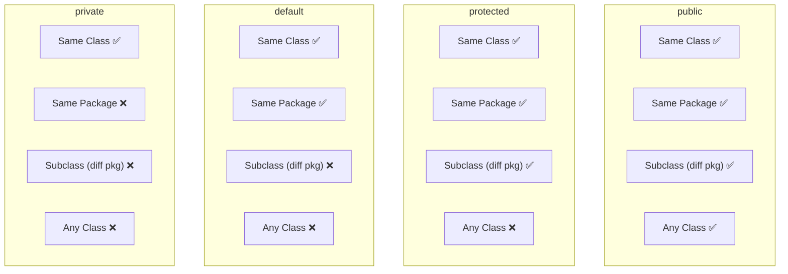
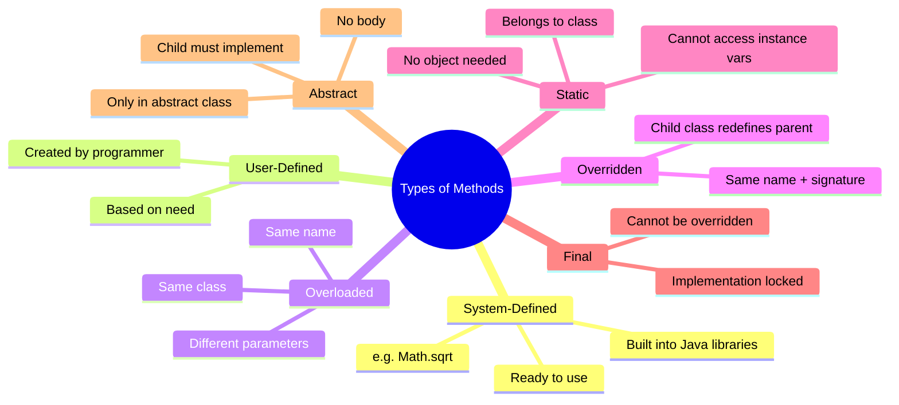
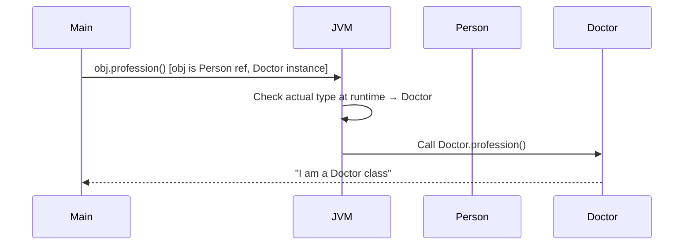
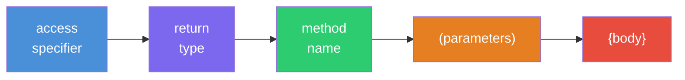
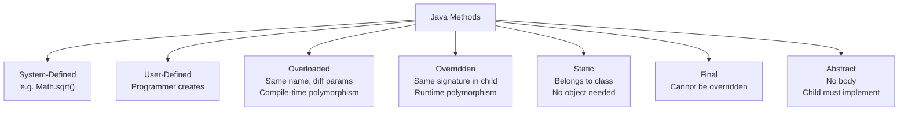

# ☕ Methods in Java — Comprehensive Study Guide
### *Java Basics to Advanced | Lecture 3*

---

> [!NOTE]
> This guide is a complete self-contained study resource derived from the Java Basics to Advanced lecture series (Video 3 — Methods). A student should be able to learn the full topic from this document alone — no video required.

---

## 📚 Table of Contents

1. [What is a Method?](#1-what-is-a-method)
2. [Method Declaration — Full Anatomy](#2-method-declaration--full-anatomy)
   - [Access Specifiers](#21-access-specifiers)
   - [Return Type](#22-return-type)
   - [Method Name — Naming Conventions](#23-method-name--naming-conventions)
   - [Parameter List](#24-parameter-list)
   - [Throws Exception (Preview)](#25-throws-exception-preview)
3. [Packages in Java (Supporting Concept)](#3-packages-in-java-supporting-concept)
4. [Types of Methods](#4-types-of-methods)
   - [System-Defined Methods](#41-system-defined-methods)
   - [User-Defined Methods](#42-user-defined-methods)
   - [Overloaded Methods](#43-overloaded-methods)
   - [Overridden Methods](#44-overridden-methods)
   - [Static Methods](#45-static-methods)
   - [Final Methods](#46-final-methods)
   - [Abstract Methods](#47-abstract-methods)
5. [Variable Arguments (Varargs)](#5-variable-arguments-varargs)
6. [Summary Diagrams](#6-summary-diagrams)
7. [Common Mistakes](#7-common-mistakes)
8. [Best Practices](#8-best-practices)
9. [Interview Notes](#9-interview-notes)
10. [Practice Questions](#10-practice-questions)
11. [Quick Revision Summary](#11-quick-revision-summary)

---

# 1. What is a Method?

## Overview

A **method** is one of the core building blocks of Java programs. Almost every action your program takes is performed inside a method. Understanding methods deeply is essential before moving on to constructors, memory management, and object-oriented design.

---

## Definition

> A **method** is a collection of instructions (statements) grouped together that perform a specific task.

Think of a method as a named block of code that:
- **Accepts input** (via parameters)
- **Does something** (computation, logic, I/O)
- **Returns output** (a result, or nothing — `void`)

---

## Real-World Analogy

> Think of a method like a **vending machine**.
> - You insert coins (input / parameters)
> - The machine processes your selection (computation)
> - It dispenses a snack (output / return value)
>
> You can use the vending machine again and again without rebuilding it. That is **reusability**.

---

## Why Methods Exist — Two Key Benefits

### 1. Code Reusability

Without methods, you would copy-paste the same logic everywhere it is needed. With methods, you write it once and call it as many times as needed.

```java
public class Calculation {

    // Written ONCE
    public int sum(int variable1, int variable2) {
        int total = variable1 + variable2;
        System.out.println("Sum computed: " + total);
        return total;
    }

    // Reused here
    public int getPriceOfPen() {
        int capPrice = 2;
        int penBodyPrice = 5;
        int totalPenPrice = sum(capPrice, penBodyPrice);  // ← reusing sum()
        return totalPenPrice;
    }

    // Reused again here
    public int getCombinedAge() {
        int youngerSisterAge = 2;
        int olderSisterAge = 5;
        return sum(youngerSisterAge, olderSisterAge);     // ← reusing sum() again
    }
}
```

The `sum()` method is written **once** and reused in multiple places. If you need to change how addition works (e.g., add logging), you change it in **one place** and every caller benefits automatically.

### 2. Code Readability

A method name communicates **intent**. When you see `getPriceOfPen()` or `calculateTax()`, you immediately understand what the method does — without reading every line of code inside it.

```java
// Without methods — hard to understand
int x = (2 + 5) * 100 / 7;

// With a well-named method — immediately clear
int finalPrice = calculateDiscountedPrice(basePrice, taxRate);
```

---

## What is a "Collection of Instructions"?

Inside a method, each statement is an **instruction**:

```java
public int sum(int variable1, int variable2) {
    int total = variable1 + variable2;   // Instruction 1: add the two values
    System.out.println(total);           // Instruction 2: log/print
    return total;                        // Instruction 3: return result
}
```

Three instructions together form the method. There is no limit to how many instructions a method can contain.

---

# 2. Method Declaration — Full Anatomy

## Overview

A method declaration defines everything about the method: who can access it, what it returns, what its name is, and what inputs it accepts.

---

## Complete Syntax

```java
accessSpecifier returnType methodName(parameterList) throws ExceptionType {
    // method body — instructions go here
}
```

---

## Visual Breakdown

```
public      int       sum       (int a, int b)    throws ArithmeticException
   │          │         │              │                       │
   │          │         │              │                       └── Throws clause
   │          │         │              └── Parameter List
   │          │         └── Method Name
   │          └── Return Type
   └── Access Specifier
```

---

## 2.1 Access Specifiers

### Definition

> An **access specifier** (also called an access modifier) is a keyword that controls **where a method (or variable or class) can be accessed from**.

There are **four** access specifiers in Java:

| Specifier | Keyword | Accessible From |
|---|---|---|
| Public | `public` | Anywhere — any class, any package |
| Private | `private` | Only within the **same class** |
| Protected | `protected` | Same package + **subclasses** in different packages |
| Default | *(no keyword)* | Only within the **same package** |

---

### `public` — Global Access

```java
// File: Invoice.java  (in package: salesDepartment)
package salesDepartment;

public class Invoice {
    public void getInvoice() {
        System.out.println("Inside invoice method");
    }
}
```

```java
// File: JobPortal.java  (in package: humanResource)
package humanResource;

import salesDepartment.Invoice;

public class JobPortal {
    public void getInvoiceForJobPortal() {
        Invoice invoiceObject = new Invoice();
        invoiceObject.getInvoice();   // ✅ Works — public is accessible anywhere
    }
}
```

**Rule:** `public` = accessible from **any class in any package**.

---

### `private` — Same Class Only

```java
package salesDepartment;

public class Invoice {
    private void getInvoice() {
        System.out.println("Inside invoice method");
    }

    public void printInvoice() {
        getInvoice();   // ✅ Works — same class can access private method
    }
}
```

```java
package humanResource;

import salesDepartment.Invoice;

public class JobPortal {
    public void test() {
        Invoice invoiceObject = new Invoice();
        invoiceObject.getInvoice();   // ❌ Compile error: getInvoice() has private access
    }
}
```

**Rule:** `private` = accessible **only within the same class**. Not even subclasses can access it.

---

### `protected` — Same Package + Subclasses

```java
package salesDepartment;

public class Invoice {
    protected void getInvoice() {
        System.out.println("Inside invoice method");
    }
}
```

```java
// Same package — OK
package salesDepartment;

public class Order {
    public void test() {
        Invoice inv = new Invoice();
        inv.getInvoice();   // ✅ Works — Order is in same package as Invoice
    }
}
```

```java
// Different package, NOT a subclass — NOT OK
package humanResource;

import salesDepartment.Invoice;

public class JobPortal {
    public void test() {
        Invoice inv = new Invoice();
        inv.getInvoice();   // ❌ Error — different package, not a subclass
    }
}
```

```java
// Different package, IS a subclass — OK
package humanResource;

import salesDepartment.Invoice;

public class JobPortal extends Invoice {   // ← JobPortal is a child of Invoice
    public void test() {
        getInvoice();   // ✅ Works — subclass can access protected method from parent
    }
}
```

**Rule:** `protected` = same package (all classes) + different package (only subclasses/child classes).

---

### `default` — Same Package Only

```java
package salesDepartment;

public class Invoice {
    void getInvoice() {   // ← no keyword = default access specifier
        System.out.println("Inside invoice method");
    }
}
```

```java
// Same package — OK
package salesDepartment;

public class Order {
    public void test() {
        Invoice inv = new Invoice();
        inv.getInvoice();   // ✅ Works — same package
    }
}
```

```java
// Different package — NOT OK, even for subclass
package humanResource;

import salesDepartment.Invoice;

public class JobPortal extends Invoice {
    public void test() {
        getInvoice();   // ❌ Error — default does NOT allow different package, even for child
    }
}
```

**Rule:** `default` (no keyword) = same package only. Unlike `protected`, child classes in different packages **cannot** access default members.

---

### Access Specifier Comparison Table

| Specifier | Same Class | Same Package | Subclass (diff. package) | Any Class (diff. package) |
|---|---|---|---|---|
| `public` | ✅ | ✅ | ✅ | ✅ |
| `protected` | ✅ | ✅ | ✅ | ❌ |
| default | ✅ | ✅ | ❌ | ❌ |
| `private` | ✅ | ❌ | ❌ | ❌ |

---



---

## 2.2 Return Type

### Definition

> The **return type** specifies what **type of value the method will return** after completing its task.

Every method in Java must declare a return type. If the method returns nothing, the return type is `void`.

---

### Common Return Types

| Return Type | Meaning | Example |
|---|---|---|
| `void` | Returns nothing | `public void print()` |
| `int` | Returns an integer | `public int getAge()` |
| `boolean` | Returns true or false | `public boolean isValid()` |
| `String` | Returns a String | `public String getName()` |
| `double` | Returns a decimal | `public double getPrice()` |
| `Object` / custom class | Returns an object | `public Employee getEmployee()` |

---

### Using `void`

```java
public void printInvoice() {
    System.out.println("Printing invoice...");
    // No return statement required
}
```

With `void`, you can optionally write a bare `return;` statement to exit the method early:

```java
public void printInvoice(boolean isValid) {
    if (!isValid) {
        return;   // ← exit early, return nothing
    }
    System.out.println("Printing invoice...");
}
```

> [!WARNING]
> You **cannot** return a value from a `void` method. The following is a compile error:
> ```java
> public void test() {
>     return 5;   // ❌ Error: cannot return a value from a void method
> }
> ```

---

### Using a Typed Return

When the return type is not `void`, the method **must** return a value of that type using the `return` keyword:

```java
public int sum(int a, int b) {
    int total = a + b;
    return total;   // ← required: must return an int
}
```

---

## 2.3 Method Name — Naming Conventions

### Rules (enforced by Java)

- Must start with a letter, underscore `_`, or dollar sign `$` (not a digit)
- Cannot be a Java keyword (e.g., `int`, `class`, `return`)
- Case-sensitive (`sum` and `Sum` are different method names)

### Conventions (standard Java style)

| Convention | Rule | Example |
|---|---|---|
| Use a **verb** | Methods perform actions | `getAge()`, `printInvoice()`, `calculateTax()` |
| Start with **lowercase** | First letter must be lowercase | `getEmployee()` ✅, `GetEmployee()` ❌ |
| Use **camelCase** | Each word after the first starts with uppercase | `getEmployeeDetails()` ✅ |
| Be descriptive | Name should reveal intent | `computeMonthlyTax()` ✅, `doStuff()` ❌ |

```java
// ✅ Correct naming
public int getAge() { ... }
public void printInvoice() { ... }
public boolean isEligibleForLoan() { ... }
public double calculateMonthlyInterest() { ... }

// ❌ Incorrect naming
public int GetAge() { ... }          // starts with capital
public void PrintInvoice() { ... }   // starts with capital
public int 2sum() { ... }            // starts with digit
```

---

## 2.4 Parameter List

### Definition

> The **parameter list** is the set of input variables a method accepts. These variables are used inside the method body to perform the task.

Parameters are also called **arguments** (the terms are often used interchangeably, though technically: *parameters* are in the declaration, *arguments* are the actual values passed during a call).

---

### Syntax

```java
public int sum(int variable1, int variable2) {
    //              ↑ param 1        ↑ param 2
}
```

Each parameter is declared as: `dataType parameterName`

Multiple parameters are separated by commas.

---

### Rules

- A method can have **zero or more** parameters
- Each parameter must have an explicit type
- Parameter names must be unique within the method

```java
// Zero parameters
public void printHello() {
    System.out.println("Hello!");
}

// One parameter
public void printMessage(String message) {
    System.out.println(message);
}

// Multiple parameters
public int add(int a, int b) {
    return a + b;
}

// Mixed types
public void createUser(String name, int age, boolean isActive) {
    // ...
}
```

---

## 2.5 Throws Exception (Preview)

> [!NOTE]
> **This topic will be covered in full in the Exception Handling video.** The following is a brief overview so you are aware it exists.

A method can optionally declare that it **may throw an exception** during execution. This is done using the `throws` keyword in the method signature.

```java
public void getInvoice() throws ArithmeticException {
    // This method might throw an ArithmeticException (e.g., divide by zero)
}
```

Any method that **calls** `getInvoice()` must then handle (or further declare) that exception. This mechanism is Java's way of communicating potential failure modes between methods.

We will cover:
- Checked vs. unchecked exceptions
- `try-catch-finally`
- Custom exceptions
- Exception propagation

…in the dedicated Exception Handling lecture.

---

# 3. Packages in Java (Supporting Concept)

## Definition

> A **package** is a namespace that groups related classes together — like a folder on your file system that organizes files.

Packages serve two purposes:
1. **Organization** — group similar classes together
2. **Access control** — access specifiers like `protected` and `default` use package boundaries

---

## Example

```
project/
├── salesDepartment/       ← package
│   ├── Invoice.java
│   └── Order.java
│
└── humanResource/         ← another package
    ├── JobPortal.java
    └── Application.java
```

```java
// Declaring a package — first line of the file
package salesDepartment;

public class Invoice {
    // ...
}
```

```java
// Importing from another package
package humanResource;

import salesDepartment.Invoice;   // ← import the class

public class JobPortal {
    public void test() {
        Invoice inv = new Invoice();
        // ...
    }
}
```

---

# 4. Types of Methods

## Overview



---

## 4.1 System-Defined Methods

### Definition

> **System-defined methods** are methods that are **already written, compiled, and provided by Java** as part of its standard class libraries. You use them without writing any code yourself.

These are provided by the **JRE class libraries** (recall from the Java Overview lecture: JRE = JVM + Class Libraries).

---

### Examples

```java
public class SystemMethodDemo {
    public static void main(String[] args) {

        // Math library — java.lang.Math
        int variable = 25;
        double squareRoot = Math.sqrt(variable);   // system-defined
        System.out.println("Square root: " + squareRoot);   // Output: 5.0

        int absValue = Math.abs(-42);              // system-defined
        System.out.println("Absolute: " + absValue);   // Output: 42

        // Arrays library — java.util.Arrays
        int[] arr = {5, 3, 1, 4, 2};
        java.util.Arrays.sort(arr);                // system-defined
        System.out.println(java.util.Arrays.toString(arr));   // Output: [1, 2, 3, 4, 5]

        // String library — java.lang.String
        String name = "hello";
        System.out.println(name.toUpperCase());    // system-defined → Output: HELLO
        System.out.println(name.length());         // system-defined → Output: 5
    }
}
```

---

## 4.2 User-Defined Methods

### Definition

> **User-defined methods** are methods created by the **programmer** based on the specific needs of their program.

```java
public class Calculation {

    // User-defined — the programmer wrote this
    public int sum(int a, int b) {
        int total = a + b;
        System.out.println("Sum: " + total);
        return total;
    }

    public int getPriceOfPen() {
        int capPrice = 2;
        int penBodyPrice = 5;
        return sum(capPrice, penBodyPrice);   // calls another user-defined method
    }
}
```

The distinction is simple: if Java gave it to you → system-defined. If you wrote it → user-defined.

---

## 4.3 Overloaded Methods

### Definition

> **Method overloading** is when **more than one method with the same name exists in the same class**, but with **different parameter lists**.

This is part of **polymorphism** — specifically **compile-time (static) polymorphism** or **static binding**.

---

### Rules of Overloading

| Rule | Detail |
|---|---|
| **Same name** | All overloaded methods share the same name |
| **Different parameters** | Must differ in number, type, or order of parameters |
| **Return type is NOT considered** | Two methods with same name and same parameters but different return types is a **compile error** |
| **Same class** | All overloads are in the same class |

---

### Code Example

```java
public class Invoice {

    // Version 1 — no parameters
    public void getInvoice() {
        System.out.println("Invoice with no parameters");
    }

    // Version 2 — one String parameter
    public void getInvoice(String invoiceId) {
        System.out.println("Invoice ID: " + invoiceId);
    }

    // Version 3 — one int parameter
    public void getInvoice(int amount) {
        System.out.println("Invoice Amount: " + amount);
    }

    // Version 4 — two int parameters
    public void getInvoice(int amount, int tax) {
        System.out.println("Amount: " + amount + ", Tax: " + tax);
    }
}
```

---

### Calling Overloaded Methods

```java
public class Order {
    public static void main(String[] args) {
        Invoice invoiceObj = new Invoice();

        invoiceObj.getInvoice();              // calls Version 1
        invoiceObj.getInvoice("INV-001");     // calls Version 2
        invoiceObj.getInvoice(500);           // calls Version 3
        invoiceObj.getInvoice(500, 90);       // calls Version 4
    }
}
```

**Output:**
```
Invoice with no parameters
Invoice ID: INV-001
Invoice Amount: 500
Amount: 500, Tax: 90
```

Java decides **at compile time** which version to call based on the arguments you pass. This is why overloading is called **static (compile-time) binding**.

---

### Invalid Overloading — Return Type Alone is NOT Enough

```java
public class Invoice {
    public void getInvoice() { }      // Version A

    public int getInvoice() {         // ❌ COMPILE ERROR
        return 0;
    }
    // Error: method getInvoice() is already defined in class Invoice
}
```

> [!IMPORTANT]
> Overloading is resolved **only** by the parameter list (number, type, order of parameters). **Return type is completely ignored** when determining overloads.

To fix — make the parameters different:

```java
public void getInvoice() { }           // no params → valid

public int getInvoice(String z) {      // different param → valid overload
    return 0;
}
```

---

## 4.4 Overridden Methods

### Definition

> **Method overriding** is when a **subclass (child class) provides its own implementation of a method that is already defined in its parent class**. The method signature (name, return type, parameters, access specifier) must be exactly the same.

This is **runtime (dynamic) polymorphism** — also called **dynamic binding**.

---

### Code Example

```java
// Parent class
public class Person {
    public void profession() {
        System.out.println("I am a person class");
    }
}
```

```java
// Child class
public class Doctor extends Person {

    @Override   // annotation — tells compiler this is intentionally overriding a parent method
    public void profession() {
        System.out.println("I am a Doctor class — doing something different");
    }
}
```

---

### The `@Override` Annotation

The `@Override` annotation is optional but **strongly recommended**. It tells the compiler: "I intend to override a parent method here." If you accidentally mistype the method name, the compiler will catch the mistake.

```java
@Override
public void profesion() {   // ← typo: 'profesion' instead of 'profession'
// ❌ Compile error: method does not override or implement a method from a supertype
```

---

### Invoking Overridden Methods — Dynamic Dispatch

```java
public class Main {
    public static void main(String[] args) {

        // Parent reference holding a child object
        Person obj = new Doctor();

        // Which profession() is called?
        obj.profession();   // → "I am a Doctor class — doing something different"
    }
}
```

Even though `obj` is declared as type `Person`, it holds an instance of `Doctor`. At **runtime**, the JVM checks the actual object type and calls `Doctor`'s `profession()`.



If `Doctor` did not have its own `profession()`, JVM would walk up the inheritance chain and call `Person`'s version.

---

### Overriding Rules

| Rule | Detail |
|---|---|
| **Same method name** | Exact match required |
| **Same parameter list** | Exact match required |
| **Same or covariant return type** | Return type must match (or be a subtype) |
| **Same or less restrictive access** | Cannot narrow access (`public` → `private` is illegal) |
| **`@Override` annotation** | Optional but highly recommended |

---

## 4.5 Static Methods

### Definition

> A **static method** is a method that is **associated with the class itself**, not with any individual object (instance). It can be called using the **class name** without creating an object.

---

### Static vs. Instance Methods — The Core Difference

```java
public class A {

    public void method1() {        // instance method — belongs to each object
        System.out.println("method1");
    }

    public static void method2() { // static method — belongs to the class
        System.out.println("method2");
    }
}
```

```java
public class Main {
    public static void main(String[] args) {

        A object1 = new A();
        A object2 = new A();

        // Calling instance method — needs an object
        object1.method1();   // ✅
        object2.method1();   // ✅

        // Calling static method — use class name, no object needed
        A.method2();         // ✅
    }
}
```

---

### Memory Visualization

```
Heap Memory
┌─────────────────────────────┐
│  Object1 (instance of A)    │
│  ├── method1 (copy)         │
│                             │
│  Object2 (instance of A)    │
│  ├── method1 (copy)         │
└─────────────────────────────┘

Method Area / Class Area
┌─────────────────────────────┐
│  Class A                    │
│  └── method2 (ONE copy)     │  ← static: ONE shared copy for all objects
└─────────────────────────────┘
```

---

### Calling a Static Method from Code

```java
public class Calculation {

    public static int getPriceOfPen() {
        int capPrice = 2;
        int penBodyPrice = 5;
        return capPrice + penBodyPrice;
    }
}

public class Main {
    public static void main(String[] args) {
        int price = Calculation.getPriceOfPen();   // ← called via class name
        System.out.println("Pen price: " + price); // Output: Pen price: 7
    }
}
```

---

### Critical Rule: Static Methods Cannot Access Non-Static Members

This is one of the most frequently asked Java interview questions.

```java
public class Calculation {

    int stockPrice = 20;       // instance variable (non-static)
    static int carPrice = 40;  // class variable (static)

    public static void staticMethod() {

        carPrice = 50;        // ✅ OK — carPrice is also static
        // stockPrice = 30;   // ❌ COMPILE ERROR — cannot access non-static variable

        // int result = print(); // ❌ COMPILE ERROR — cannot call non-static method

        // To access non-static: you MUST provide an object reference
        Calculation obj = new Calculation();
        obj.stockPrice = 30;  // ✅ OK — now we specify WHICH object's stockPrice
        obj.print();          // ✅ OK — now we specify WHICH object's print()
    }

    public int print() {
        return stockPrice;
    }
}
```

---

### Why Can't Static Methods Access Instance Variables?

The reason is conceptual:

- Instance variables (`stockPrice`) exist **per object**. Object1 has its own `stockPrice`, Object2 has its own `stockPrice`.
- Static methods belong to the **class**, not to any object.
- If a static method tries to access `stockPrice`, the question becomes: **which object's `stockPrice`?** There is no answer — the static method has no object context.
- Static variables (`carPrice`) exist **once** for the entire class, so there is no ambiguity.

```
object1.stockPrice = 20
object2.stockPrice = 35

Static method asks: "Give me stockPrice"
JVM responds: "Which one? object1's? object2's?"
→ No answer → Compile error
```

---

### Danger: Sharing Mutable State in Static Methods

```java
public class Calculation {
    static int carPrice = 40;  // shared state

    public static int sumTwo(int a, int b) {
        int total = a + b;
        carPrice = carPrice + total;   // ← MUTATING SHARED STATIC STATE
        return carPrice;
    }
}
```

If Thread 1 calls `sumTwo(2, 1)` and Thread 2 calls `sumTwo(5, 2)` simultaneously:
- Thread 1 computes: `carPrice = 40 + 3 = 43`
- Thread 2 reads `carPrice` as `43` (not `40`)
- Thread 2 computes: `carPrice = 43 + 7 = 50` (expected: `40 + 7 = 47`)

This is a **race condition** — shared mutable static state causes unexpected results in multi-threaded programs.

> [!CAUTION]
> **Never** make a method `static` if it reads from or writes to an instance variable.

---

### Static Methods Cannot Be Overridden

```java
public class Person {
    public static void profession() {
        System.out.println("Person class");
    }
}

public class Doctor extends Person {
    // This is NOT overriding — it is METHOD HIDING
    public static void profession() {
        System.out.println("Doctor class");
    }
}
```

```java
Person obj = new Doctor();
obj.profession();           // → "Person class"  ← calls Person's static method!
// No dynamic dispatch happens — static methods are resolved at COMPILE TIME
```

Compare with true overriding (non-static):

```java
Person obj = new Doctor();
obj.profession();           // → "Doctor class"  ← dynamic dispatch at runtime
```

This is the key distinction:
- **Instance methods** → dynamic binding → resolved at **runtime** based on object type
- **Static methods** → static binding → resolved at **compile time** based on reference type

The phenomenon where a subclass defines a static method with the same signature as the parent's static method is called **method hiding**, not overriding.

---

### When Should You Make a Method Static?

Make a method `static` when:

✅ It does **not** use any instance variable (non-static field)  
✅ It does **not** modify the state of any object  
✅ It only computes using its **arguments**  
✅ It is a **utility method** that any code can call independently  

```java
// ✅ Good candidate for static — only uses parameters
public static int sum(int a, int b) {
    return a + b;
}

// ❌ Bad candidate for static — uses instance variable
public int sumTwo(int a, int b) {
    carPrice = carPrice + a + b;   // modifies instance state
    return carPrice;
}
```

> [!TIP]
> A common real-world pattern: **Factory Design Pattern** uses static methods because they create objects based purely on arguments, with no instance state involved.

---

## 4.6 Final Methods

### Definition

> A **final method** is a method that **cannot be overridden** by any subclass. The implementation is locked in the class that declares it final.

---

### Syntax

```java
public class Person {
    public final void profession() {   // ← final keyword
        System.out.println("I am a person");
    }
}
```

```java
public class Doctor extends Person {
    @Override
    public void profession() {   // ❌ COMPILE ERROR: cannot override final method
        System.out.println("I am a doctor");
    }
}
```

---

### Why Use `final` on Methods?

When you mark a method `final`, you are saying:

> "This implementation is definitive. No subclass should change it."

Use cases:
- Security-sensitive code where changing behavior could create vulnerabilities
- Core algorithms that must not be altered in subclasses
- Template method pattern (core steps are `final`, hook methods are overridable)

---

### Logic Behind `final` and Overriding

> If a child class **cannot change** the method, then there is no point in overriding it — overriding exists to provide a different implementation. If the implementation must stay the same, the child class can simply **inherit and use** the method as-is.

---

## 4.7 Abstract Methods

### Definition

> An **abstract method** has a **declaration but no body (no implementation)**. The implementation is delegated entirely to subclasses.

---

### Rules

| Rule | Detail |
|---|---|
| **Must be inside an abstract class** | You cannot have an abstract method in a concrete (regular) class |
| **No method body** | Only the signature is declared; ends with `;` not `{}` |
| **Subclass must implement it** | The first non-abstract child class must provide the implementation |
| **Cannot be `final`** | `abstract` and `final` are contradictory (`abstract` demands overriding; `final` forbids it) |
| **Cannot be `static`** | Static methods don't participate in polymorphism |

---

### Syntax

```java
// Abstract class — cannot be instantiated directly
public abstract class Person {

    // Abstract method — declaration only, no body
    public abstract void print();

    // Can also have regular (concrete) methods
    public void greet() {
        System.out.println("Hello from Person");
    }
}
```

```java
// Concrete child class — MUST implement all abstract methods
public class Doctor extends Person {

    @Override
    public void print() {   // ← providing the required implementation
        System.out.println("Doctor implementation of print");
    }
}
```

---

### What Happens If Child Doesn't Implement?

```java
public class Doctor extends Person {
    // Forgot to implement print()
    // ❌ COMPILE ERROR: Doctor is not abstract and does not override abstract method print() in Person
}
```

The child class must either:
1. **Implement** all abstract methods from the parent, OR
2. **Also be declared abstract** (deferring implementation to its own subclass)

---

### Abstract vs. Final — They Are Opposites

| | `abstract` | `final` |
|---|---|---|
| **Purpose** | Force subclasses to implement | Prevent subclasses from overriding |
| **Overrideable?** | Must be overridden | Cannot be overridden |
| **Can combine?** | ❌ Cannot be `abstract final` | ❌ Cannot be `final abstract` |

---

# 5. Variable Arguments (Varargs)

## Overview

**Varargs** (Variable Arguments) is a Java feature that allows a method to accept **a variable number of arguments** of the same type — from zero arguments to any number.

---

## The Problem Varargs Solves

Suppose you want a `sum()` method that adds however many numbers the caller provides. Without varargs, you'd have to create many overloads:

```java
public int sum(int a) { return a; }
public int sum(int a, int b) { return a + b; }
public int sum(int a, int b, int c) { return a + b + c; }
public int sum(int a, int b, int c, int d) { return a + b + c + d; }
// ... this never ends!
```

This approach doesn't scale. What if someone wants to sum 10, 20, or 100 numbers?

---

## Solution: Varargs Syntax

```java
public int sum(int... variable) {
    //          ↑ three dots = varargs
    // 'variable' is treated as an int array inside the method
    int output = 0;
    for (int val : variable) {
        output = output + val;
    }
    return output;
}
```

The `...` (three dots) after the type declares a varargs parameter. Inside the method, it behaves as an **array**.

---

## Complete Code Example

```java
public class Calculation {

    public int sum(int... variable) {
        int output = 0;
        for (int val : variable) {
            output += val;
        }
        return output;
    }

    public static void main(String[] args) {
        Calculation calc = new Calculation();

        System.out.println(calc.sum());             // Output: 0   (zero args)
        System.out.println(calc.sum(3));            // Output: 3   (one arg)
        System.out.println(calc.sum(3, 8));         // Output: 11  (two args)
        System.out.println(calc.sum(3, 8, 9, 10)); // Output: 30  (four args)
        System.out.println(calc.sum(1, 2, 3, 4, 5, 6, 7)); // Output: 28
    }
}
```

All five calls use the **same single method**. No overloading needed.

---

## Varargs With Other Parameters

Varargs can be combined with other parameters:

```java
public void printInfo(String label, int... numbers) {
    System.out.print(label + ": ");
    for (int n : numbers) {
        System.out.print(n + " ");
    }
    System.out.println();
}
```

```java
printInfo("Scores", 85, 90, 78, 92);
// Output: Scores: 85 90 78 92
```

---

## Two Strict Rules of Varargs

### Rule 1: Only ONE varargs parameter per method

```java
// ❌ COMPILE ERROR — two varargs parameters
public void method(int... a, String... b) { }

// ✅ OK — only one varargs
public void method(int... a) { }
```

### Rule 2: Varargs MUST be the LAST parameter

```java
// ❌ COMPILE ERROR — varargs is not last
public void method(int... numbers, String label) { }

// ✅ OK — varargs is last
public void method(String label, int... numbers) { }
```

**Why must it be last?**

If varargs were first, Java would not know where the varargs portion ends and where the next fixed parameter begins:

```java
// If varargs were first (hypothetically):
method(1, 2, 3, 4, "hello");
// Is "hello" the label? Are 1,2,3,4 the numbers?
// OR are 1,2,3 the numbers and 4 is something else? → Ambiguous!
```

By placing varargs **last**, Java assigns all initial arguments to the fixed parameters, and everything remaining goes into the varargs:

```java
method("hello", 1, 2, 3, 4);
// "hello" → label (String)
// 1, 2, 3, 4 → numbers (int...)
// ✅ Unambiguous
```

---

## How Varargs Works Internally

At the bytecode level, Java converts a varargs call into an **array creation**:

```java
calc.sum(3, 8, 9)
// is equivalent to:
calc.sum(new int[]{3, 8, 9})
```

You can also pass an array directly to a varargs method:

```java
int[] myArray = {1, 2, 3, 4, 5};
System.out.println(calc.sum(myArray));   // ✅ Works
```

---

## Varargs Rules Summary Table

| Rule | Correct | Incorrect |
|---|---|---|
| One varargs per method | `void m(int... a)` | `void m(int... a, int... b)` |
| Must be last parameter | `void m(String s, int... n)` | `void m(int... n, String s)` |
| Treated as array inside | `for (int x : n)` | ✅ |
| Can accept zero arguments | `m()` → array length 0 | ✅ |
| Can pass explicit array | `m(new int[]{1,2,3})` | ✅ |

---

# 6. Summary Diagrams

## Method Declaration Anatomy



## Complete Types-of-Methods Overview



## Overloading vs. Overriding Comparison

| Feature | Overloading | Overriding |
|---|---|---|
| **Also known as** | Static / Compile-time Polymorphism | Dynamic / Runtime Polymorphism |
| **Location** | Same class | Parent and Child class |
| **Method name** | Same | Same |
| **Parameters** | Must be different | Must be same |
| **Return type** | Not considered | Must be same (or covariant) |
| **Access specifier** | Can differ | Cannot be more restrictive |
| **Resolved at** | Compile time | Runtime |

---

# 7. Common Mistakes

## Mistake 1: Thinking Return Type Alone Differentiates Overloads

```java
// ❌ WRONG — this is NOT valid overloading
public void getInvoice() { }
public int getInvoice() { return 0; }   // COMPILE ERROR
```

**Fix:** Change the parameters to create a valid overload.

---

## Mistake 2: Accessing Non-Static Members from Static Method

```java
public class MyClass {
    int instanceVar = 10;

    public static void myStatic() {
        System.out.println(instanceVar);   // ❌ COMPILE ERROR
    }
}
```

**Fix:** Either make `instanceVar` static, or pass an object reference:
```java
public static void myStatic(MyClass obj) {
    System.out.println(obj.instanceVar);   // ✅ OK
}
```

---

## Mistake 3: Thinking Static Methods Are Overridden

```java
Person obj = new Doctor();
obj.profession();   // If profession() is static → calls Person's version
                    // NOT Doctor's version — this is method HIDING not overriding
```

---

## Mistake 4: Placing Varargs Before Other Parameters

```java
// ❌ COMPILE ERROR
public void method(int... numbers, String label) { }

// ✅ CORRECT
public void method(String label, int... numbers) { }
```

---

## Mistake 5: Trying to Override an Abstract Method with Wrong Signature

```java
public abstract class Person {
    public abstract void print();
}

public class Doctor extends Person {
    public void print(String msg) { }   // ❌ — different signature, NOT implementing abstract method
    // COMPILE ERROR: Doctor must implement abstract method print() from Person
}
```

---

## Mistake 6: Making a Static Method Abstract or Final Making a Final Method Abstract

```java
public abstract class A {
    public abstract static void method();   // ❌ ILLEGAL COMBINATION
    public abstract final void method2();   // ❌ ILLEGAL COMBINATION
}
```

---

# 8. Best Practices

1. **Always choose the most restrictive access specifier** that still meets your needs. Default to `private`; only widen when necessary.
2. **Use `@Override` annotation** whenever you intend to override a method — it catches typos and signature mismatches.
3. **Name methods as verbs** — `calculateTax()`, `printReport()`, `isValid()`.
4. **Use `camelCase` starting with lowercase** for all method names.
5. **Make methods static only when they don't depend on instance state** — purity and predictability.
6. **Keep methods short and focused** — a method should do **one thing**. If it's doing many things, break it up.
7. **Use varargs sparingly** — they are powerful but can make method signatures ambiguous if overused.
8. **Mark methods `final`** when you want to guarantee behavior is not changed by subclasses.
9. **Prefer abstract methods** over empty default implementations when child classes must provide behavior.
10. **Avoid mutating static variables inside static methods** — it leads to thread-safety issues.

---

# 9. Interview Notes

## Commonly Asked Questions

### Q1: What is method overloading vs. method overriding?
**Answer:**
- **Overloading** — Same class, same name, different parameters. Resolved at compile time (static binding).
- **Overriding** — Parent and child class, same name + same signature. Resolved at runtime (dynamic binding).

---

### Q2: Can you overload a method by changing only the return type?
**Answer:** No. Return type is not considered during overload resolution. You will get a compile error.

---

### Q3: Can a static method be overridden?
**Answer:** No. Static methods cannot be overridden. If a subclass defines a static method with the same signature as the parent's static method, it is called **method hiding**, not overriding. Static methods use static (compile-time) binding and are resolved based on the reference type, not the object type.

---

### Q4: Why can't a static method access instance variables?
**Answer:** Static methods are associated with the class, not with any specific object. Instance variables belong to individual objects. Since a static method has no object context, it doesn't know which object's instance variable to access. You must provide an explicit object reference.

---

### Q5: What is the difference between `final`, `static`, and `abstract` methods?
**Answer:**
- `final` — Cannot be overridden by subclasses.
- `static` — Belongs to the class, not an object; called via class name.
- `abstract` — Has no body; subclass must provide implementation.

---

### Q6: What are the rules for varargs?
**Answer:**
1. Only one varargs parameter per method.
2. Varargs must be the last parameter.
3. Inside the method, it is treated as an array.

---

### Q7: When should you declare a method `static`?
**Answer:** Declare a method `static` when it does not use any instance variable (non-static field), does not modify the object's state, and performs its computation purely on its arguments. Utility methods and factory methods are common candidates.

---

### Q8: What is the difference between `protected` and `default` access?
**Answer:**
- `protected` — Accessible in same package AND in subclasses of different packages.
- `default` (no keyword) — Accessible only in the same package. Subclasses in different packages **cannot** access it.

---

### Q9: What does `void` mean as a return type?
**Answer:** `void` means the method does not return any value. It can have no `return` statement, or a bare `return;` to exit early.

---

### Q10: Can an abstract method be `final` or `static`?
**Answer:** No. `abstract` and `final` are contradictory — `abstract` requires the method to be overridden, while `final` prevents overriding. `abstract` and `static` are also incompatible — static methods don't participate in dynamic polymorphism, but abstract methods exist specifically for dynamic polymorphism.

---

# 10. Practice Questions

## Easy

1. What is a method? What two benefits does it provide?
2. List the four access specifiers in Java and the access level each provides.
3. What does `void` as a return type mean?
4. What is the naming convention for methods in Java? Give two correct and two incorrect examples.
5. What is the difference between a system-defined and a user-defined method?
6. Write a method that takes two `int` parameters and returns their product.

## Medium

7. Explain why overloading is called "compile-time polymorphism" and overriding is called "runtime polymorphism."
8. Can you overload a method by changing only the return type? Why or why not?
9. Why can't a `static` method access an instance variable directly?
10. Write an example of method overloading with three versions of a `display()` method.
11. Write a `final` method in a parent class and show what happens when a child tries to override it.
12. Write a varargs method that finds the maximum value among any number of integers passed.
13. What is `method hiding` in Java? How does it differ from method overriding?

## Hard

14. A static variable `count` is shared among all objects. A static method increments it. Explain the thread-safety risk and propose a solution.
15. Why is it illegal to combine `abstract` and `final` on the same method? Write a conceptual explanation.
16. Consider: `Person obj = new Doctor();`. If `profession()` is non-static in Person and overridden in Doctor, which version is called? What if `profession()` is static? Explain both cases with the concepts of static binding and dynamic binding.
17. Design a class `MathUtils` with overloaded `add()` methods that handle: two ints, three ints, two doubles, and a varargs int version. Show how Java chooses which method to call.
18. Given the four access specifiers, design a class hierarchy across two packages that demonstrates all four specifiers with working and failing access examples.

---

# 11. Quick Revision Summary

```
☕ JAVA METHODS — KEY POINTS

✅ Method = Collection of instructions that perform a specific task
✅ Benefits: Code Reusability + Code Readability

📋 METHOD ANATOMY:
   accessSpecifier  returnType  methodName(params) throws Exception { body }

🔐 ACCESS SPECIFIERS:
   public    → any class, any package
   private   → same class only
   protected → same package + child classes in diff package
   default   → same package only (no child in diff package)

🔄 RETURN TYPE:
   void  → returns nothing
   int, boolean, String, etc. → must use return statement

📛 NAMING:
   • Verb, camelCase, start lowercase
   • getAge() ✅ | GetAge() ❌ | 2sum() ❌

📦 TYPES OF METHODS:
   System-Defined  → provided by Java (Math.sqrt, Arrays.sort)
   User-Defined    → programmer creates
   Overloaded      → same name, diff params, SAME CLASS (compile-time)
   Overridden      → same name+signature, CHILD CLASS (runtime)
   Static          → belongs to CLASS, not object; no instance vars
   Final           → cannot be overridden
   Abstract        → no body; child MUST implement; only in abstract class

⚡ STATIC METHOD RULES:
   • Called via ClassName.method()
   • Cannot access non-static (instance) variables or methods
   • Cannot be overridden (it's method hiding, not overriding)
   • Use ONLY when: no instance variables needed, pure computation

🔢 VARARGS:
   Syntax: type... paramName
   • Treated as array inside method
   • Only ONE varargs per method
   • MUST be LAST parameter
   • Can receive 0 to many arguments

⚠️ KEY INTERVIEW POINTS:
   • Return type alone does NOT create valid overloads
   • Static methods → static binding (compile time)
   • Instance methods → dynamic binding (runtime)
   • abstract + final = ILLEGAL combination
   • protected ≠ default (protected allows child in diff package)
```

---

*End of Chapter — Methods in Java*

---

> [!TIP]
> **Next Topics:**
> - **Constructors** — Special methods for object initialization
> - **Memory Management** — Stack, Heap, how objects are stored
> - **Exception Handling** — `throws`, `try-catch-finally`, custom exceptions

---

*Study Guide generated from: Java Basics to Advanced — Lecture 3: Methods in Java*
