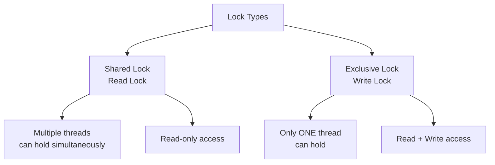
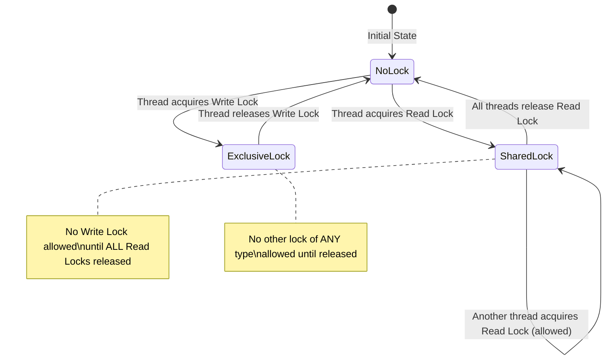
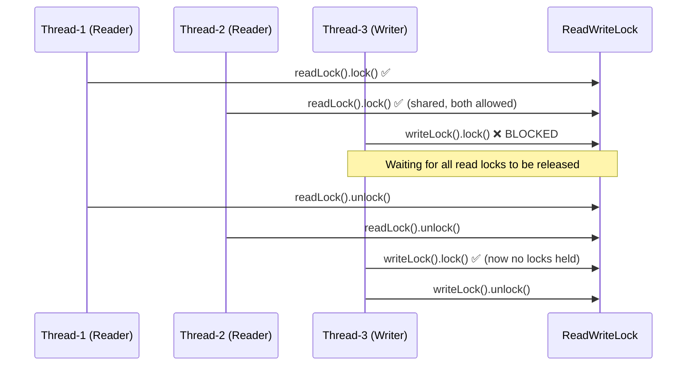
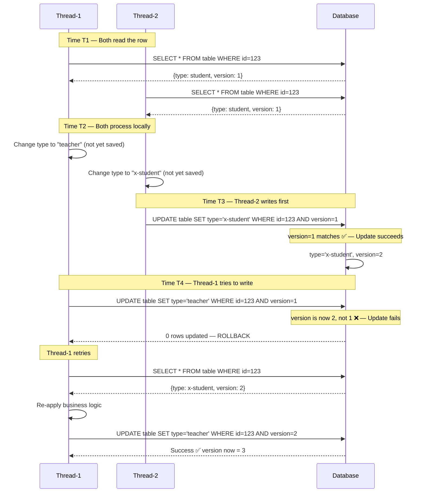
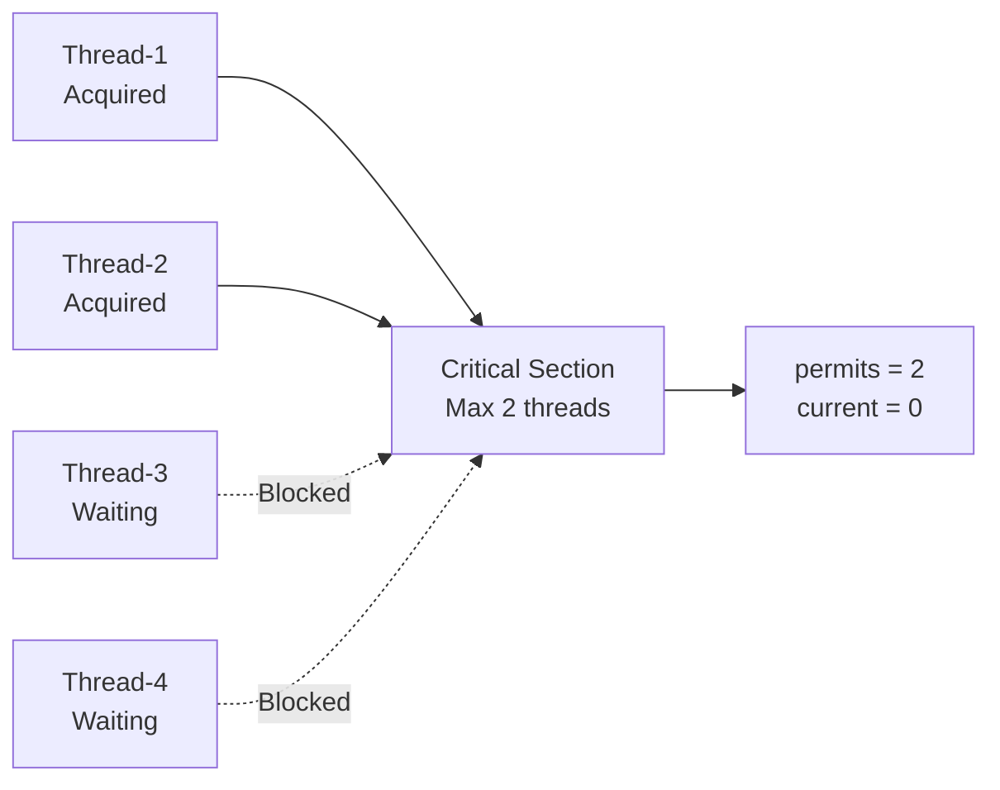
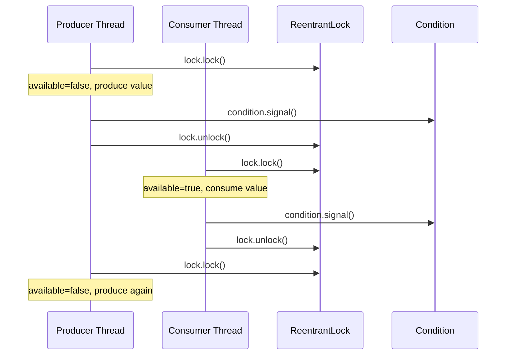

# 🔐 Java Multithreading — Types of Locks

> **Course:** Concept Encoding — Java Multithreading Series  
> **Topic:** Locks in Java — ReentrantLock, ReadWriteLock, StampedLock, Semaphore, Condition  
> **Prerequisite Knowledge:** `synchronized` keyword, Monitor Lock, Producer-Consumer Problem, Thread Basics

---

## 📑 Table of Contents

1. [Quick Revision — synchronized and Monitor Lock](#1-quick-revision--synchronized-and-monitor-lock)
2. [Problem with synchronized — Why Custom Locks?](#2-problem-with-synchronized--why-custom-locks)
3. [Overview of Java Custom Locks](#3-overview-of-java-custom-locks)
4. [📌 ReentrantLock](#4--reentrantlock)
5. [📌 Shared Lock vs Exclusive Lock (Theory Foundation)](#5--shared-lock-vs-exclusive-lock-theory-foundation)
6. [📌 ReadWriteLock](#6--readwritelock)
7. [📌 Pessimistic vs Optimistic Locking](#7--pessimistic-vs-optimistic-locking)
8. [📌 StampedLock](#8--stampedlock)
9. [📌 Semaphore](#9--semaphore)
10. [📌 Condition — Inter-Thread Communication with Custom Locks](#10--condition--inter-thread-communication-with-custom-locks)
11. [Comparison Table — All Lock Types](#11-comparison-table--all-lock-types)
12. [Interview Notes](#12-interview-notes)
13. [Practice Questions](#13-practice-questions)
14. [Summary Revision Bullets](#14-summary-revision-bullets)

---

## 1. Quick Revision — `synchronized` and Monitor Lock

Before diving into custom locks, it is essential to understand what `synchronized` does, because all custom locks are designed to solve its limitations.

### What `synchronized` does

- When you mark a method or block as `synchronized`, Java places a **monitor lock** on an **object**.
- Only **one thread** at a time can hold the monitor lock of a given object.
- If a second thread tries to enter the same `synchronized` block on the **same object**, it will **block** until the first thread releases the lock.

### Key property: Monitor lock is tied to an Object

```java
class SharedResource {
    // Monitor lock is placed on 'this' object (the instance calling this method)
    public synchronized void produce(String threadName) {
        System.out.println("Lock acquired by: " + threadName);
        try {
            Thread.sleep(4000); // Hold lock for 4 seconds
        } catch (InterruptedException e) {
            e.printStackTrace();
        }
        System.out.println("Lock released by: " + threadName);
    }
}
```

```java
public class Main {
    public static void main(String[] args) {
        SharedResource resource1 = new SharedResource(); // Object 1
        SharedResource resource2 = new SharedResource(); // Object 2

        Thread t1 = new Thread(() -> resource1.produce("Thread-1"));
        Thread t2 = new Thread(() -> resource2.produce("Thread-2"));

        t1.start();
        t2.start();
    }
}
```

**Output:**
```
Lock acquired by: Thread-1
Lock acquired by: Thread-2
Lock released by: Thread-1
Lock released by: Thread-2
```

### Why both threads ran simultaneously?

Because `synchronized` placed a monitor lock on **`resource1`** for Thread-1 and a **separate** monitor lock on **`resource2`** for Thread-2. They are **different objects**, so **different locks** — no blocking occurs.

> [!IMPORTANT]
> The monitor lock in `synchronized` is **object-scoped**. Two threads using two different objects of the same class will **not** block each other, even if the method is `synchronized`.

---

## 2. Problem with `synchronized` — Why Custom Locks?

### The Real-World Requirement

In many production systems, you may have a **critical section** that should be accessed by **only one thread at a time**, regardless of how many different objects are involved.

**Scenario:**
- Thread-1 operates on `resource1` (object 1)
- Thread-2 operates on `resource2` (object 2)
- Both call the same critical method
- **Requirement:** Only one thread should be inside that critical section at any point in time

`synchronized` **cannot solve this** because its monitor lock is object-bound. If threads use different objects, they bypass each other's locks.

### What We Need

A **lock that is independent of objects** — a standalone lock object that any number of objects/threads can share and respect.

> [!NOTE]
> This is exactly what Java's `java.util.concurrent.locks` package provides — **custom lock objects** that are decoupled from any particular instance.

---

## 3. Overview of Java Custom Locks

Java provides **four primary types of custom locks** in `java.util.concurrent.locks` (plus `Semaphore` in `java.util.concurrent`):

```mermaid
mindmap
  root((Java Locks))
    ReentrantLock
      Object-independent locking
      lock() / unlock()
    ReadWriteLock
      Shared Lock - Read
      Exclusive Lock - Write
    StampedLock
      ReadWrite capability
      Optimistic Read
    Semaphore
      Multiple permits
      Controls thread count
    Condition
      Inter-thread communication
      await / signal
```

| Lock Type | Key Feature | Replaces |
|---|---|---|
| `ReentrantLock` | Object-independent exclusive lock | `synchronized` |
| `ReadWriteLock` | Multiple readers OR one writer | `synchronized` |
| `StampedLock` | ReadWrite + Optimistic reads | `ReadWriteLock` |
| `Semaphore` | N threads allowed simultaneously | `synchronized` (1 thread only) |
| `Condition` | Thread communication with custom locks | `wait()` / `notify()` |

> [!NOTE]
> These locks do **not** depend on the object reference like `synchronized` does. They depend on the **lock object itself**, which can be shared across multiple instances.

---

## 4. 📌 ReentrantLock

### Overview

`ReentrantLock` is the most fundamental custom lock. It provides the same mutual exclusion as `synchronized`, but with more control — and critically, it is **not tied to any object instance**.

---

### Why This Concept Exists

**Problem `synchronized` has:**
- A `synchronized` method places a lock on `this` (the calling object).
- If two threads use different objects, they each get their own lock → no mutual exclusion.

**What `ReentrantLock` solves:**
- The lock is a **standalone object** you create.
- You pass this **same lock object** to all threads regardless of which class instance they're operating on.
- As long as all threads use the same lock object, only one thread can hold it at a time.

---

### Definition

`ReentrantLock` is a class in `java.util.concurrent.locks` that implements the `Lock` interface. It provides explicit lock acquisition (`lock()`) and release (`unlock()`) methods. It is called "reentrant" because the **same thread that holds the lock can re-acquire it** without deadlocking itself (a feature called **lock reentrancy**).

---

### Real-World Analogy

Think of `ReentrantLock` as a **physical key** to a server room:
- The key (lock object) is the authority — not the person (object instance).
- You can pass the same key to multiple departments.
- Whoever holds the key can enter. Others wait outside regardless of which department they're from.

---

### Syntax

```java
import java.util.concurrent.locks.ReentrantLock;

ReentrantLock lock = new ReentrantLock();

lock.lock();        // Acquire the lock
try {
    // Critical section — only one thread can be here at a time
} finally {
    lock.unlock();  // Always release in finally block
}
```

### Syntax Breakdown

| Syntax | Meaning |
|---|---|
| `new ReentrantLock()` | Creates a new lock object (unfair by default) |
| `lock.lock()` | Acquires the lock; blocks if another thread holds it |
| `lock.unlock()` | Releases the lock |
| `try { } finally { lock.unlock(); }` | Ensures lock is released even if an exception occurs |

> [!WARNING]
> **Always put `unlock()` inside a `finally` block.** If your critical section throws an exception and `unlock()` is not in `finally`, the lock will **never be released**, causing all other threads to block indefinitely (deadlock).

---

### Code Example — Basic ReentrantLock

**Step 1: The SharedResource class (without synchronized)**

```java
import java.util.concurrent.locks.ReentrantLock;

class SharedResource {

    public void produce(String threadName, ReentrantLock lock) {
        lock.lock(); // Acquire the lock
        try {
            System.out.println("Lock acquired by: " + threadName);
            Thread.sleep(4000); // Simulate work
            System.out.println("Lock released by: " + threadName);
        } catch (InterruptedException e) {
            e.printStackTrace();
        } finally {
            lock.unlock(); // Always release
        }
    }
}
```

**Step 2: Main — passing the SAME lock to threads using DIFFERENT objects**

```java
public class Main {
    public static void main(String[] args) {
        ReentrantLock sharedLock = new ReentrantLock(); // ONE lock object

        SharedResource resource1 = new SharedResource(); // Object 1
        SharedResource resource2 = new SharedResource(); // Object 2

        // Both threads use DIFFERENT objects but the SAME lock
        Thread t1 = new Thread(() -> resource1.produce("Thread-1", sharedLock));
        Thread t2 = new Thread(() -> resource2.produce("Thread-2", sharedLock));

        t1.start();
        t2.start();
    }
}
```

**Output:**
```
Lock acquired by: Thread-1
Lock released by: Thread-1
Lock acquired by: Thread-2
Lock released by: Thread-2
```

### Line-by-Line Explanation

| Line | Explanation |
|---|---|
| `ReentrantLock sharedLock = new ReentrantLock()` | Creates one shared lock object used by all threads |
| `resource1.produce("Thread-1", sharedLock)` | Thread-1 uses object `resource1` but passes the shared lock |
| `resource2.produce("Thread-2", sharedLock)` | Thread-2 uses object `resource2` but passes the **same** lock |
| `lock.lock()` | Thread tries to acquire. If another thread holds it, this thread blocks |
| `Thread.sleep(4000)` | Simulates 4 seconds of critical work |
| `lock.unlock()` inside `finally` | Guarantees release even on exception |

### Step-by-Step Execution

1. Main thread creates `sharedLock`, `resource1`, `resource2`.
2. Thread-1 starts → calls `resource1.produce()` → calls `sharedLock.lock()` → **acquires lock**.
3. Thread-2 starts → calls `resource2.produce()` → calls `sharedLock.lock()` → **blocks** (lock held by Thread-1).
4. Thread-1 sleeps 4 seconds, then hits `finally` → calls `sharedLock.unlock()` → **releases lock**.
5. Thread-2 **wakes up** → acquires `sharedLock` → executes critical section.
6. Thread-2 finishes → calls `sharedLock.unlock()`.

### Memory Representation

```
Stack (Thread-1)          Stack (Thread-2)         Heap
┌────────────────┐        ┌────────────────┐       ┌─────────────────────┐
│ produce()      │        │ produce() ──── │──────▶│  sharedLock object  │
│  lock ref ─────│───────▶│  lock ref      │       │  (ReentrantLock)    │
│  threadName    │        │  threadName    │       │  owner: Thread-1    │
└────────────────┘        └────────────────┘       │  waitQueue: [T2]    │
                                                   └─────────────────────┘
                                                   ┌──────────┐ ┌──────────┐
                                                   │resource1 │ │resource2 │
                                                   └──────────┘ └──────────┘
```

> [!TIP]
> The key insight: `resource1` and `resource2` are **different heap objects**, but both threads reference the **same `sharedLock` object**. The lock does not care which object the thread came from.

---

### Why Is It Called "Reentrant"?

A reentrant lock allows the **same thread** to call `lock()` multiple times without deadlocking itself. Each `lock()` call must be paired with an `unlock()` call.

```java
ReentrantLock lock = new ReentrantLock();

public void outerMethod() {
    lock.lock();
    try {
        innerMethod(); // Same thread calls lock again — allowed!
    } finally {
        lock.unlock();
    }
}

public void innerMethod() {
    lock.lock(); // Same thread re-acquires its own lock — no deadlock
    try {
        // work
    } finally {
        lock.unlock();
    }
}
```

> [!NOTE]
> `synchronized` in Java is also reentrant by default. The name `ReentrantLock` emphasizes this property explicitly.

---

### Common Mistakes

```java
// ❌ WRONG — unlock NOT in finally
lock.lock();
doWork(); // If this throws, lock is never released → DEADLOCK
lock.unlock();

// ✅ CORRECT
lock.lock();
try {
    doWork();
} finally {
    lock.unlock(); // Always executes
}
```

---

### Best Practices

- Always release in `finally`.
- Prefer `ReentrantLock` over `synchronized` when you need: fairness, try-lock with timeout, lock polling, or object-independent locking.
- Use `new ReentrantLock(true)` for **fair** lock (threads acquire in order they requested; prevents starvation).

---

### Key Observations

- `ReentrantLock` is **not** tied to any object instance.
- The lock is a **standalone object** that can be passed around.
- Multiple class instances can share the same lock.
- The lock tracks **which thread holds it** and a **wait queue** of blocked threads.

---

## 5. 📌 Shared Lock vs Exclusive Lock (Theory Foundation)

> [!IMPORTANT]
> Understanding Shared Lock and Exclusive Lock is **mandatory** before learning ReadWriteLock. These are not Java-specific concepts — they exist in databases, OS, and distributed systems.

---

### Overview

Two fundamental types of locks control concurrent access to resources:



---

### Shared Lock (Read Lock)

- **Multiple threads** can hold a shared lock on the **same resource simultaneously**.
- Threads with shared lock can only **read** the resource — they must **not modify** it.
- If any thread holds a shared lock, **no thread can acquire an exclusive lock** until all shared locks are released.

---

### Exclusive Lock (Write Lock)

- **Only ONE thread** can hold an exclusive lock at any time.
- The thread with exclusive lock can **read AND write** the resource.
- Exclusive lock can only be acquired when **no other lock (shared or exclusive) is present** on the resource.
- Once an exclusive lock is held, **no other thread can acquire any lock** (not even shared).

---

### Compatibility Matrix

| | Thread wants Shared Lock | Thread wants Exclusive Lock |
|---|---|---|
| **No lock currently held** | ✅ Allowed | ✅ Allowed |
| **Shared lock held by others** | ✅ Allowed (multiple readers OK) | ❌ Not allowed |
| **Exclusive lock held by another** | ❌ Not allowed | ❌ Not allowed |

---

### Real-World Analogy

Think of a **library book**:
- **Shared lock** = Multiple people can **read** the same book simultaneously (photocopy or digital). No one can modify it.
- **Exclusive lock** = One person takes the **original** book home to annotate it. No one else can even read it until they return it.

---

### Diagram



---

### Summary

> [!IMPORTANT]
> - **Shared + Shared = ✅ Allowed** (multiple readers)
> - **Shared + Exclusive = ❌ Not allowed** (can't write while reading)
> - **Exclusive + Shared = ❌ Not allowed** (can't read while writing)
> - **Exclusive + Exclusive = ❌ Not allowed** (only one writer at a time)

---

## 6. 📌 ReadWriteLock

### Overview

`ReadWriteLock` is a Java interface that maintains a **pair of locks**: one for read operations (shared) and one for write operations (exclusive). It directly implements the Shared Lock / Exclusive Lock theory.

---

### Why This Concept Exists

In many real applications, **reads vastly outnumber writes**:
- 1000 users reading a product page vs. 10 admin users updating it.
- Dashboard showing analytics (high read) vs. data ingestion (low write).

With `synchronized` or `ReentrantLock`, even readers block each other, which is **wasteful**. `ReadWriteLock` solves this by allowing **concurrent reads** while still ensuring **exclusive writes**.

---

### Definition

`ReadWriteLock` is an interface in `java.util.concurrent.locks` with two methods:
- `readLock()` — returns the shared (read) lock
- `writeLock()` — returns the exclusive (write) lock

Its primary implementation is `ReentrantReadWriteLock`.

---

### When to Use ReadWriteLock

```
Read requests >> Write requests
```

If your application has **very high reads and very low writes**, `ReadWriteLock` significantly improves throughput by allowing multiple threads to read concurrently.

---

### Syntax

```java
import java.util.concurrent.locks.ReadWriteLock;
import java.util.concurrent.locks.ReentrantReadWriteLock;

// Create the ReadWriteLock
ReadWriteLock rwLock = new ReentrantReadWriteLock();

// Acquiring READ lock (Shared)
rwLock.readLock().lock();
try {
    // Read-only operations
} finally {
    rwLock.readLock().unlock();
}

// Acquiring WRITE lock (Exclusive)
rwLock.writeLock().lock();
try {
    // Read or write operations
} finally {
    rwLock.writeLock().unlock();
}
```

### Syntax Breakdown

| Syntax | Meaning |
|---|---|
| `new ReentrantReadWriteLock()` | Creates the ReadWriteLock implementation object |
| `rwLock.readLock()` | Returns the shared read lock |
| `rwLock.writeLock()` | Returns the exclusive write lock |
| `.lock()` | Acquires the respective lock |
| `.unlock()` | Releases the respective lock |

> [!NOTE]
> `ReadWriteLock` is an **interface**. `ReentrantReadWriteLock` is its **concrete implementation**. This is a standard Java design pattern.

---

### Code Example — ReadWriteLock

```java
import java.util.concurrent.locks.ReadWriteLock;
import java.util.concurrent.locks.ReentrantReadWriteLock;

class SharedResource {

    // Producer uses READ lock (Shared)
    public void produce(String threadName, ReadWriteLock lock) {
        lock.readLock().lock(); // Acquire shared read lock
        try {
            System.out.println("Read lock acquired by: " + threadName);
            // Only read values here — do NOT modify shared state
            Thread.sleep(8000);
            System.out.println("Read lock released by: " + threadName);
        } catch (InterruptedException e) {
            e.printStackTrace();
        } finally {
            lock.readLock().unlock();
        }
    }

    // Consumer uses WRITE lock (Exclusive)
    public void consume(String threadName, ReadWriteLock lock) {
        lock.writeLock().lock(); // Acquire exclusive write lock
        try {
            System.out.println("Write lock acquired by: " + threadName);
            Thread.sleep(4000);
            System.out.println("Write lock released by: " + threadName);
        } catch (InterruptedException e) {
            e.printStackTrace();
        } finally {
            lock.writeLock().unlock();
        }
    }
}
```

```java
public class Main {
    public static void main(String[] args) throws InterruptedException {
        ReadWriteLock rwLock = new ReentrantReadWriteLock();

        SharedResource res1 = new SharedResource();
        SharedResource res2 = new SharedResource();
        SharedResource res3 = new SharedResource();

        // Thread-1 and Thread-2: both want READ lock (shared)
        Thread t1 = new Thread(() -> res1.produce("Thread-1", rwLock));
        Thread t2 = new Thread(() -> res2.produce("Thread-2", rwLock));

        // Thread-3: wants WRITE lock (exclusive)
        Thread t3 = new Thread(() -> res3.consume("Thread-3", rwLock));

        t1.start();
        t2.start();
        Thread.sleep(1000); // Give t1, t2 time to acquire read locks first
        t3.start();
    }
}
```

**Output:**
```
Read lock acquired by: Thread-1
Read lock acquired by: Thread-2
Read lock released by: Thread-1
Read lock released by: Thread-2
Write lock acquired by: Thread-3
Write lock released by: Thread-3
```

### Step-by-Step Execution

1. Thread-1 starts → acquires **read lock** (shared) → sleeping for 8 seconds.
2. Thread-2 starts → acquires **read lock** (shared) — **allowed** because Thread-1 only has a shared lock.
3. Thread-3 starts → tries to acquire **write lock** (exclusive) → **BLOCKED** because two shared locks are active.
4. Thread-1 finishes → releases read lock.
5. Thread-2 finishes → releases read lock.
6. Now **no locks** are held → Thread-3 unblocks → acquires write lock → does work → releases.

### Diagram



---

### Key Observations

- Multiple threads can hold **read locks** simultaneously.
- **Read lock** = Shared lock = multiple readers allowed.
- **Write lock** = Exclusive lock = only one writer, no concurrent readers.
- Write lock can only be acquired when **zero** read locks AND zero write locks are held.

> [!CAUTION]
> During a **read lock**, you must **only read** shared data. Modifying data while holding only a read lock defeats the entire safety guarantee of `ReadWriteLock` and can lead to data corruption.

---

### When to Use ReadWriteLock

```
Use ReadWriteLock when:
  reads are much more frequent than writes
  
Avoid when:
  reads and writes are balanced (use ReentrantLock instead)
  write operations are very frequent (read starvation can occur)
```

---

### Best Practices

- Always use `try-finally` for both read and write locks.
- In the read section, never modify shared state.
- Consider `StampedLock` for higher-performance scenarios.

---

## 7. 📌 Pessimistic vs Optimistic Locking

> [!IMPORTANT]
> This theory is fundamental to understanding `StampedLock`. It also directly maps to **database locking strategies** in system design interviews.

---

### Overview

There are two philosophies for handling concurrent access to shared data:

| Aspect | Pessimistic | Optimistic |
|---|---|---|
| **Assumption** | Conflicts are likely | Conflicts are rare |
| **How it works** | Lock first, then work | Work first, validate before commit |
| **Lock held during work?** | Yes | No |
| **What happens on conflict** | Thread blocks/waits | Rollback and retry |
| **Best for** | High contention | Low contention |
| **Examples** | synchronized, ReentrantLock, ReadWriteLock | StampedLock optimistic read, DB optimistic locking |

---

### Pessimistic Locking

- Assumes that another thread **will** try to modify the data while you're working.
- So it acquires a lock **before doing any work**.
- Other threads are blocked until the lock is released.
- Safe but **reduces concurrency**.

All locks covered so far (`synchronized`, `ReentrantLock`, `ReadWriteLock`) are pessimistic.

---

### Optimistic Locking

- Assumes that conflicts are **rare**.
- Does **not acquire any lock** before reading/working.
- Instead, it **remembers the state/version** of the data at the time it was read.
- Before writing/committing, it **validates** whether the state has changed since the read.
  - If unchanged → proceed with the update ✅
  - If changed → rollback and retry ❌

---

### Real-World Example — Database Row Version

This is the **exact mechanism** used in database optimistic locking (OCC — Optimistic Concurrency Control):

**Database table:**

| id | name | type | version |
|---|---|---|---|
| 123 | SJ | student | 1 |
| 456 | Ram | student | 1 |

**`version` column:** Starts at 1 when a row is inserted. **Incremented by 1 on every update.**

---

**Scenario: Two threads want to update row 123 simultaneously.**



### How the version check works in SQL

```sql
-- Thread-2's update (succeeds because version=1 matches)
UPDATE table 
SET type = 'x-student', version = version + 1
WHERE id = 123 AND version = 1;
-- Returns: 1 row affected ✅

-- Thread-1's update (fails because version is now 2, not 1)
UPDATE table 
SET type = 'teacher', version = version + 1
WHERE id = 123 AND version = 1;
-- Returns: 0 rows affected ❌ → Thread-1 must retry
```

---

### Key Points

- **No lock is ever held** during the processing time — other threads can read freely.
- Conflict is only detected at **write time**, not at read time.
- If conflict detected → **rollback + retry** (not block and wait).
- Very efficient under **low contention** because threads never block each other.

> [!NOTE]
> This same version-based validation mechanism is exactly what `StampedLock`'s **optimistic read** implements internally in Java.

---

## 8. 📌 StampedLock

### Overview

`StampedLock` is the most powerful and feature-rich lock in Java's locking framework. It combines **two capabilities**:

1. **ReadWrite locking** — same as `ReadWriteLock` (shared read + exclusive write)
2. **Optimistic reading** — a lock-free read mode with version validation

---

### Why This Concept Exists

`ReadWriteLock` still has a limitation: even readers must acquire a lock. In systems with extremely high read throughput, even acquiring a shared lock can be a bottleneck.

`StampedLock`'s **optimistic read** allows threads to read without acquiring any lock at all — they simply validate afterward whether a write happened in the meantime.

---

### The Stamp

A **stamp** is a `long` value returned by every lock operation in `StampedLock`. It represents the **state/version** of the lock at the time of acquisition.

- Like a "ticket number" or "row version" from the database analogy.
- Required when releasing the lock (`unlock` methods require the stamp).
- Used by `validate(stamp)` to check if a write has occurred since the stamp was issued.

---

### Three Modes of StampedLock

```mermaid
graph TD
    A[StampedLock] --> B[Write Lock\nExclusive]
    A --> C[Read Lock\nShared]
    A --> D[Optimistic Read\nNo Lock]
    B --> E[long stamp = lock.writeLock()]
    B --> F[lock.unlockWrite(stamp)]
    C --> G[long stamp = lock.readLock()]
    C --> H[lock.unlockRead(stamp)]
    D --> I[long stamp = lock.tryOptimisticRead()]
    D --> J[lock.validate(stamp)\ntrue = no write happened\nfalse = rollback]
```

---

### Syntax — All Three Modes

**Mode 1: Write Lock (Exclusive)**
```java
StampedLock lock = new StampedLock();

long stamp = lock.writeLock();  // Returns a stamp
try {
    // Exclusive write operation
} finally {
    lock.unlockWrite(stamp);  // Pass the stamp back
}
```

**Mode 2: Read Lock (Shared)**
```java
long stamp = lock.readLock();  // Returns a stamp
try {
    // Shared read operation
} finally {
    lock.unlockRead(stamp);  // Pass the stamp back
}
```

**Mode 3: Optimistic Read (No Lock)**
```java
long stamp = lock.tryOptimisticRead();  // Gets current state/version — NO lock acquired
// Perform read operations
if (lock.validate(stamp)) {
    // No write happened between tryOptimisticRead() and here → data is valid ✅
    // Proceed with results
} else {
    // A write happened → data may be stale ❌
    // Rollback / retry / fall back to regular read lock
}
```

### Syntax Breakdown

| Syntax | Meaning |
|---|---|
| `lock.writeLock()` | Acquires exclusive write lock; returns stamp |
| `lock.readLock()` | Acquires shared read lock; returns stamp |
| `lock.tryOptimisticRead()` | Records current lock state, acquires NO lock; returns stamp |
| `lock.unlockWrite(stamp)` | Releases write lock (stamp validates it's the correct release) |
| `lock.unlockRead(stamp)` | Releases read lock |
| `lock.validate(stamp)` | Returns `true` if no write lock was acquired since the stamp was issued |

> [!NOTE]
> The stamp in `readLock()`/`unlockRead()` is technically needed for internal consistency and also for the optimistic read feature. During pessimistic read operations, it is still required syntactically even though it's less meaningful for validation there.

---

### Code Example — StampedLock with Optimistic Read

```java
import java.util.concurrent.locks.StampedLock;

class SharedResource {
    private int value = 10; // Shared mutable data
    private final StampedLock lock = new StampedLock();

    // Producer: Uses OPTIMISTIC READ
    public void produce(String threadName) {
        long stamp = lock.tryOptimisticRead(); // No lock acquired
        System.out.println("Took optimistic read. Current value: " + value);

        // Perform some operation locally
        int newValue = value + 1; // Intend to update 10 → 11

        try {
            Thread.sleep(6000); // Simulate work — meanwhile consumer may write
        } catch (InterruptedException e) {
            e.printStackTrace();
        }

        // Validate: has any write lock been acquired since our optimistic read?
        if (lock.validate(stamp)) {
            // No write happened → safe to commit our change
            value = newValue;
            System.out.println("Optimistic read valid. Value updated to: " + value);
        } else {
            // A write happened → our data is stale → rollback
            value = 10; // Rollback to previous value
            System.out.println("Optimistic read INVALID. Rolled back. Value: " + value);
        }
    }

    // Consumer: Uses WRITE LOCK (Exclusive)
    public void consume(String threadName) {
        long stamp = lock.writeLock(); // Acquire exclusive write lock
        try {
            System.out.println("Write lock acquired by: " + threadName);
            Thread.sleep(2000);
            System.out.println("Write lock released by: " + threadName);
        } catch (InterruptedException e) {
            e.printStackTrace();
        } finally {
            lock.unlockWrite(stamp); // This changes the lock state → invalidates any optimistic stamps
        }
    }
}
```

```java
public class Main {
    public static void main(String[] args) throws InterruptedException {
        SharedResource resource = new SharedResource();

        Thread producer = new Thread(() -> resource.produce("Thread-1"));
        Thread consumer = new Thread(() -> resource.consume("Thread-2"));

        producer.start();
        Thread.sleep(1000); // Let producer take optimistic read first
        consumer.start();   // Consumer acquires write lock while producer is "working"
    }
}
```

**Output (when consumer writes during producer's work):**
```
Took optimistic read. Current value: 10
Write lock acquired by: Thread-2
Write lock released by: Thread-2
Optimistic read INVALID. Rolled back. Value: 10
```

**Output (when no consumer runs):**
```
Took optimistic read. Current value: 10
Optimistic read valid. Value updated to: 11
```

### Step-by-Step Execution (Conflict Scenario)

1. Producer calls `tryOptimisticRead()` → gets stamp (e.g., `256`). **No lock acquired.**
2. Producer reads `value = 10`, prepares to set it to `11`, then sleeps 6 seconds.
3. Consumer calls `lock.writeLock()` → acquires exclusive lock → does work → calls `lock.unlockWrite(stamp)`.
4. Internally, `StampedLock` **increments its version counter** when the write lock is acquired/released.
5. Producer wakes up → calls `lock.validate(256)`.
6. `validate` checks: "Is the current version still compatible with stamp `256`?" → **No**, version changed → returns `false`.
7. Producer rolls back `value` to `10`.

### Internal Mechanism — How validate() Works

```
StampedLock maintains an internal 64-bit state variable.

When tryOptimisticRead() is called:
  → Returns current state (the stamp)

When writeLock() is acquired and released:
  → Internal state is modified (version bits change)

When validate(stamp) is called:
  → Compares current state with the saved stamp
  → If they are compatible (no write occurred): returns true
  → If write occurred (state changed): returns false
```

This is directly analogous to the **database row version** mechanism described in section 7.

---

### Code Example — StampedLock ReadWrite Mode

```java
class SharedResourceRW {

    public void produce(String threadName, StampedLock lock) {
        long stamp = lock.readLock(); // Acquire shared read lock
        try {
            System.out.println("Read lock acquired by: " + threadName);
            Thread.sleep(4000);
        } catch (InterruptedException e) {
            e.printStackTrace();
        } finally {
            lock.unlockRead(stamp); // Must pass the stamp
        }
    }

    public void consume(String threadName, StampedLock lock) {
        long stamp = lock.writeLock(); // Acquire exclusive write lock
        try {
            System.out.println("Write lock acquired by: " + threadName);
            Thread.sleep(2000);
        } catch (InterruptedException e) {
            e.printStackTrace();
        } finally {
            lock.unlockWrite(stamp);
        }
    }
}
```

The behavior is identical to `ReadWriteLock` — the difference is the `stamp` parameter required in unlock methods.

---

### Key Observations

- `StampedLock` is **NOT reentrant** — unlike `ReentrantLock` or `ReentrantReadWriteLock`.
- Optimistic read requires **no unlock** call — because no lock was acquired.
- `validate()` is the equivalent of the DB version check.
- When `validate()` returns `false`, you should **fall back** to a regular read lock or retry.

> [!CAUTION]
> `StampedLock` does **not support** `Condition`. You cannot use `await()`/`signal()` with `StampedLock`.

> [!WARNING]
> Since `StampedLock` is not reentrant, if the same thread tries to acquire the same write lock twice, it will **deadlock**.

---

### When to Use StampedLock

- When you have **very high read throughput** and writes are very rare.
- When you want **lock-free reads** with validation semantics.
- Provides better performance than `ReentrantReadWriteLock` under read-heavy conditions.

---

## 9. 📌 Semaphore

### Overview

`Semaphore` is a concurrency primitive that controls **how many threads can access a resource simultaneously**. Unlike the previous locks that allow only one thread at a time, a semaphore has a configurable number of **permits**.

---

### Why This Concept Exists

All previous locks allow exactly **1 thread** inside the critical section at a time. But some real-world resources can be accessed by multiple threads simultaneously — just not **unlimited** threads.

**Examples:**
- **2 printers available** → Allow max 2 threads to print simultaneously.
- **5 database connections in pool** → Allow max 5 threads to use a connection.
- **Rate limiting** → Allow max N requests per second.

---

### Definition

A `Semaphore` maintains a set of **permits**. Each `acquire()` call takes a permit; each `release()` call returns one. If no permits are available, the calling thread **blocks** until a permit becomes available.

This concept originated from **Operating Systems** (Dijkstra's semaphore) and works identically in Java.

---

### Real-World Analogy

Think of a **parking lot** with a fixed number of spaces:
- `permits = 5` → 5 parking spaces.
- `acquire()` → A car takes a space.
- `release()` → A car leaves, freeing a space.
- If all 5 spaces are full, new cars wait outside until someone leaves.

---

### Syntax

```java
import java.util.concurrent.Semaphore;

// Create semaphore with N permits (N threads can run concurrently)
Semaphore semaphore = new Semaphore(2); // 2 permits = 2 threads at a time

// Acquiring a permit (equivalent to lock)
semaphore.acquire();
try {
    // Critical section — up to N threads can be here simultaneously
} catch (InterruptedException e) {
    e.printStackTrace();
} finally {
    semaphore.release(); // Release the permit
}
```

### Syntax Breakdown

| Syntax | Meaning |
|---|---|
| `new Semaphore(n)` | Creates semaphore with `n` permits |
| `semaphore.acquire()` | Decrements permit count; blocks if count = 0 |
| `semaphore.release()` | Increments permit count; unblocks a waiting thread |
| `new Semaphore(n, true)` | Fair semaphore — threads acquire permits in FIFO order |

---

### Code Example — Semaphore with 2 permits, 4 threads

```java
import java.util.concurrent.Semaphore;

class SharedResource {
    private final Semaphore semaphore;

    public SharedResource(int permits) {
        this.semaphore = new Semaphore(permits); // 2 permits
    }

    public void produce(String threadName) {
        try {
            semaphore.acquire(); // Acquire a permit (blocks if 0 available)
            System.out.println("Lock acquired by: " + threadName);
            Thread.sleep(4000); // Simulate work
            System.out.println("Lock released by: " + threadName);
        } catch (InterruptedException e) {
            e.printStackTrace();
        } finally {
            semaphore.release(); // Always release the permit
        }
    }
}
```

```java
public class Main {
    public static void main(String[] args) {
        SharedResource resource = new SharedResource(2); // Only 2 threads at a time

        // 4 threads competing for 2 permits
        Thread t1 = new Thread(() -> resource.produce("Thread-1"));
        Thread t2 = new Thread(() -> resource.produce("Thread-2"));
        Thread t3 = new Thread(() -> resource.produce("Thread-3"));
        Thread t4 = new Thread(() -> resource.produce("Thread-4"));

        t1.start();
        t2.start();
        t3.start();
        t4.start();
    }
}
```

**Output:**
```
Lock acquired by: Thread-1
Lock acquired by: Thread-2
Lock released by: Thread-2
Lock acquired by: Thread-3
Lock released by: Thread-1
Lock acquired by: Thread-4
Lock released by: Thread-3
Lock released by: Thread-4
```

### Step-by-Step Execution

1. Thread-1 calls `acquire()` → permits: 2 → 1. Enters critical section.
2. Thread-2 calls `acquire()` → permits: 1 → 0. Enters critical section.
3. Thread-3 calls `acquire()` → permits: 0 → **BLOCKED**.
4. Thread-4 calls `acquire()` → permits: 0 → **BLOCKED**.
5. Thread-2 finishes → calls `release()` → permits: 0 → 1. Thread-3 **unblocks**.
6. Thread-3 enters critical section.
7. Thread-1 finishes → calls `release()` → permits: 0 → 1 (Thread-3 holds one). Thread-4 unblocks.
8. And so on...

### Diagram



---

### Connection Pool Analogy in Code

```java
// Simulating a DB connection pool with Semaphore
Semaphore connectionPool = new Semaphore(5); // Max 5 DB connections

public Connection getConnection() throws InterruptedException {
    connectionPool.acquire();    // Wait for an available connection
    return pool.checkoutConnection();
}

public void releaseConnection(Connection conn) {
    pool.checkinConnection(conn);
    connectionPool.release();    // Free up a slot
}
```

---

### Key Observations

- `Semaphore(1)` behaves like a **mutex** (mutual exclusion lock) — equivalent to `ReentrantLock`.
- `Semaphore(n)` where n > 1 allows **concurrent access by n threads**.
- Unlike `ReentrantLock`, a semaphore is **not reentrant by default** — the same thread can acquire multiple permits (reducing the count each time).
- Semaphore does not track **which thread** acquired it — any thread can release a permit.

> [!WARNING]
> Since `Semaphore` doesn't track ownership, **one thread can release another thread's permit**. This is powerful but dangerous if misused. Use carefully.

---

### Best Practices

- Always release in `finally`.
- Use `new Semaphore(n, true)` for fairness when thread starvation is a concern.
- Semaphore is ideal for **resource pool management** and **rate limiting**.

---

### When to Use Semaphore

| Scenario | Semaphore Permits |
|---|---|
| Only 1 thread at a time (mutex) | 1 |
| 2 printers, 2 threads max | 2 |
| DB connection pool of size 5 | 5 |
| API rate limit: 10 concurrent requests | 10 |

---

## 10. 📌 Condition — Inter-Thread Communication with Custom Locks

### Overview

When using `synchronized`, Java provides `wait()`, `notify()`, and `notifyAll()` for inter-thread communication. These methods are tied to the **monitor lock** of an object.

Since custom locks (`ReentrantLock`, `ReadWriteLock`, etc.) do **not** use monitor locks, `wait()` and `notify()` **cannot be used** with them. The equivalent mechanism is the **`Condition`** interface.

---

### Why This Concept Exists

| Mechanism | Works With |
|---|---|
| `wait()` / `notify()` / `notifyAll()` | `synchronized` (monitor lock) |
| `await()` / `signal()` / `signalAll()` | `Condition` (custom locks) |

When you move from `synchronized` to `ReentrantLock` (for object-independent locking), you lose `wait/notify`. `Condition` fills that gap with exactly equivalent semantics.

---

### Definition

`Condition` is an interface in `java.util.concurrent.locks` that provides thread waiting and signaling functionality. A `Condition` is always associated with a specific `Lock` object. A thread must hold the lock before calling `await()` or `signal()`.

---

### Method Mapping

| `synchronized` + Object | `ReentrantLock` + `Condition` | Behavior |
|---|---|---|
| `object.wait()` | `condition.await()` | Release lock, wait to be signaled |
| `object.notify()` | `condition.signal()` | Wake one waiting thread |
| `object.notifyAll()` | `condition.signalAll()` | Wake all waiting threads |

---

### Syntax

```java
import java.util.concurrent.locks.Condition;
import java.util.concurrent.locks.ReentrantLock;

ReentrantLock lock = new ReentrantLock();
Condition condition = lock.newCondition(); // Condition is tied to this lock

// In one thread (Producer waiting):
lock.lock();
try {
    while (alreadyAvailable) {
        condition.await(); // Releases lock and waits
    }
    // Produce
    condition.signal(); // Signal consumer
} finally {
    lock.unlock();
}

// In another thread (Consumer):
lock.lock();
try {
    while (notAvailable) {
        condition.await();
    }
    // Consume
    condition.signal(); // Signal producer
} finally {
    lock.unlock();
}
```

### Syntax Breakdown

| Syntax | Meaning |
|---|---|
| `lock.newCondition()` | Creates a `Condition` bound to this lock |
| `condition.await()` | Releases the lock and waits; re-acquires lock when signaled |
| `condition.signal()` | Wakes up one thread waiting on this condition |
| `condition.signalAll()` | Wakes up all threads waiting on this condition |

> [!IMPORTANT]
> A thread **must hold the lock** before calling `await()` or `signal()`. Otherwise, `IllegalMonitorStateException` is thrown — same rule as `wait()`/`notify()`.

---

### Code Example — Producer-Consumer with Condition

```java
import java.util.concurrent.locks.Condition;
import java.util.concurrent.locks.ReentrantLock;

class SharedBuffer {
    private int value = 0;
    private boolean available = false; // Is there data to consume?
    
    private final ReentrantLock lock = new ReentrantLock();
    private final Condition condition = lock.newCondition();

    // Producer: adds a value
    public void produce(int val) {
        lock.lock();
        try {
            // If already has value, wait for consumer to consume it
            while (available) {
                System.out.println("Producer waiting — buffer full");
                condition.await(); // Release lock and wait
            }
            this.value = val;
            this.available = true;
            System.out.println("Produced: " + val);
            condition.signal(); // Notify consumer
        } catch (InterruptedException e) {
            e.printStackTrace();
        } finally {
            lock.unlock();
        }
    }

    // Consumer: takes the value
    public void consume() {
        lock.lock();
        try {
            // If nothing available, wait for producer
            while (!available) {
                System.out.println("Consumer waiting — buffer empty");
                condition.await(); // Release lock and wait
            }
            System.out.println("Consumed: " + value);
            available = false;
            condition.signal(); // Notify producer
        } catch (InterruptedException e) {
            e.printStackTrace();
        } finally {
            lock.unlock();
        }
    }
}
```

```java
public class Main {
    public static void main(String[] args) {
        SharedBuffer buffer = new SharedBuffer();

        Thread producer = new Thread(() -> {
            for (int i = 1; i <= 5; i++) {
                buffer.produce(i);
            }
        });

        Thread consumer = new Thread(() -> {
            for (int i = 0; i < 5; i++) {
                buffer.consume();
            }
        });

        producer.start();
        consumer.start();
    }
}
```

**Output:**
```
Produced: 1
Consumed: 1
Produced: 2
Consumed: 2
Produced: 3
Consumed: 3
...
```

### Step-by-Step Execution

1. Producer acquires lock → `available = false` → produces value 1 → sets `available = true` → calls `condition.signal()` → releases lock.
2. Consumer (was waiting on `condition.await()`) wakes up → re-acquires lock → consumes value → sets `available = false` → calls `condition.signal()` → releases lock.
3. Producer wakes up → produces next value → cycle continues.

### Sequence Diagram



---

### Key Observations

- `Condition` is created via `lock.newCondition()` — it is bound to that specific lock.
- You can create **multiple conditions** from one lock for more granular signaling (e.g., separate `notFull` and `notEmpty` conditions in a bounded buffer).
- `condition.await()` internally releases the lock (just like `wait()` releases the monitor).
- `condition.signal()` does not immediately give control to the signaled thread — it just moves it from the **wait set** to the **ready queue**.

> [!TIP]
> Using **multiple conditions** is one advantage `ReentrantLock + Condition` has over `synchronized + wait/notify`. For example, in `LinkedBlockingQueue`, separate conditions are used for "not full" and "not empty", avoiding unnecessary wake-ups.

---

### Common Mistake

```java
// ❌ WRONG — calling await() without holding the lock
condition.await(); // Throws IllegalMonitorStateException

// ✅ CORRECT
lock.lock();
try {
    condition.await(); // Must hold lock before await
} finally {
    lock.unlock();
}
```

---

## 11. Comparison Table — All Lock Types

```mermaid
mindmap
  root((Java Locking))
    synchronized
      Monitor lock on object
      wait/notify
    ReentrantLock
      Object-independent
      Condition await/signal
    ReadWriteLock
      Shared Read
      Exclusive Write
    StampedLock
      ReadWrite mode
      Optimistic Read
      validate()
    Semaphore
      N permits
      acquire/release
```

| Feature | `synchronized` | `ReentrantLock` | `ReadWriteLock` | `StampedLock` | `Semaphore` |
|---|---|---|---|---|---|
| **Lock type** | Monitor | Exclusive | Shared/Exclusive | Shared/Exclusive/Optimistic | Counting |
| **Object-dependent?** | ✅ Yes | ❌ No | ❌ No | ❌ No | ❌ No |
| **Multiple threads allowed?** | ❌ 1 only | ❌ 1 only | ✅ Multiple readers | ✅ Multiple readers | ✅ N threads |
| **Reentrant?** | ✅ Yes | ✅ Yes | ✅ Yes | ❌ No | ❌ No |
| **Optimistic read?** | ❌ No | ❌ No | ❌ No | ✅ Yes | ❌ No |
| **Inter-thread comm** | `wait`/`notify` | `Condition.await/signal` | `Condition.await/signal` | ❌ Not supported | ❌ Not supported |
| **Fairness option?** | ❌ No | ✅ Yes | ✅ Yes | ❌ No | ✅ Yes |
| **Returns stamp?** | ❌ No | ❌ No | ❌ No | ✅ Yes | ❌ No |
| **Use case** | Simple sync | Object-indep. exclusion | Read-heavy | High perf reads | Resource pools |

---

## 12. Interview Notes

> [!IMPORTANT]
> These topics are commonly tested in Java backend / multithreading interviews at senior/mid-level.

---

### Frequently Asked Questions

**Q1: What is the difference between `synchronized` and `ReentrantLock`?**

| Point | `synchronized` | `ReentrantLock` |
|---|---|---|
| Lock type | Monitor (implicit) | Explicit lock object |
| Object-dependency | Tied to object | Independent |
| Fairness | No | Yes (`new ReentrantLock(true)`) |
| Interruptibility | No | Yes (`lockInterruptibly()`) |
| Try-lock | No | Yes (`tryLock()`) |
| Condition support | `wait`/`notify` | `Condition.await`/`signal` |
| Auto-release | Yes (block scope) | No (must call unlock) |

---

**Q2: What is a Shared Lock vs Exclusive Lock?**

- **Shared Lock (Read Lock):** Multiple threads can hold it simultaneously; used for read-only access. No exclusive lock allowed while shared lock is held.
- **Exclusive Lock (Write Lock):** Only one thread can hold it; used for read+write. No other lock (shared or exclusive) can be held concurrently.

---

**Q3: What is Optimistic Locking? How is it different from Pessimistic Locking?**

- **Pessimistic:** Assumes conflict — acquires lock before work. Thread blocks if lock unavailable.
- **Optimistic:** Assumes no conflict — reads without lock, records version, validates before write. On version mismatch, rolls back and retries.

---

**Q4: When would you use `ReadWriteLock` over `ReentrantLock`?**

When reads **significantly outnumber** writes. `ReadWriteLock` allows concurrent reads, improving throughput. If reads and writes are balanced, `ReentrantLock` is simpler.

---

**Q5: What is `StampedLock`? How does `tryOptimisticRead` work?**

`StampedLock` provides read/write locks plus optimistic reading. `tryOptimisticRead()` returns a stamp (version number) without acquiring any lock. After performing a read, `validate(stamp)` checks if any write occurred in the interim. If `false`, rollback and retry with a proper read lock.

---

**Q6: What is a Semaphore? How is it different from a lock?**

A semaphore allows **N threads** to access a resource simultaneously (controlled by permit count). A lock allows **only 1 thread**. `Semaphore(1)` is functionally a mutex. Semaphores are not ownership-based — any thread can release.

---

**Q7: Why can't we use `wait()` and `notify()` with `ReentrantLock`?**

`wait()` and `notify()` are methods on `Object` and operate on the **monitor lock** (acquired via `synchronized`). `ReentrantLock` does not use monitor locks. Instead, use `Condition condition = lock.newCondition()` and call `condition.await()` / `condition.signal()`.

---

**Q8: What is the `stamp` in StampedLock?**

A `long` value representing the **lock state/version** at the time of acquisition. Required to release the lock. Also used by `validate()` to detect if any write occurred since the stamp was issued — analogous to database row version.

---

**Q9: What are the four types of custom locks in Java?**

1. `ReentrantLock` — Object-independent exclusive lock
2. `ReadWriteLock` / `ReentrantReadWriteLock` — Shared read + exclusive write
3. `StampedLock` — ReadWrite + optimistic reading
4. `Semaphore` — Counting lock allowing N concurrent threads

---

**Q10: How does optimistic locking relate to database concurrency control?**

Both use a **version/stamp** mechanism. In databases, a `version` column is checked on update (`WHERE version = ?`). In `StampedLock`, `validate(stamp)` checks if the internal state changed. Both avoid locks during reads and validate before writes.

---

### Tricky Points

> [!CAUTION]
> - `StampedLock` is **not reentrant** — the same thread acquiring the same lock twice will deadlock.
> - `StampedLock` does **not support `Condition`**.
> - `Semaphore.release()` can be called by a **different thread** than the one that called `acquire()`.
> - During `ReadWriteLock` read section, **never modify** shared data — you only have a shared lock.
> - `condition.await()` can wake up **spuriously** (without `signal()`) — always use `while` loop, not `if`.

---

## 13. Practice Questions

### Easy

1. What is the difference between a monitor lock and a `ReentrantLock`?
2. Can two threads simultaneously hold a read lock on the same `ReadWriteLock`?
3. What happens if you call `lock.unlock()` without calling `lock.lock()` first?
4. What does `Semaphore(3)` mean?
5. What is the Java equivalent of `wait()` when using `ReentrantLock`?

### Medium

6. Write a thread-safe counter class using `ReentrantLock` instead of `synchronized`.
7. Implement a simple read-heavy cache using `ReadWriteLock` where reads are concurrent but writes are exclusive.
8. Explain with code how `StampedLock.tryOptimisticRead()` and `validate()` work together.
9. Create a `ConnectionPool` class using `Semaphore` that allows max 3 concurrent connections.
10. Rewrite a producer-consumer problem using `ReentrantLock` and `Condition` (no `wait`/`notify`).

### Hard

11. Why might `ReentrantReadWriteLock` lead to **writer starvation**? How can you avoid it?
12. Implement a bounded blocking queue using `ReentrantLock` with **two separate `Condition` objects** — one for "not full" and one for "not empty".
13. Explain the internal stamp mechanism of `StampedLock`. When would `validate()` return `false`?
14. Compare `StampedLock` and `ReadWriteLock` in terms of performance characteristics. When would you prefer each?
15. Design a thread-safe LRU cache using `ReadWriteLock` or `StampedLock`. Discuss your choice.

---

## 14. Summary Revision Bullets

### synchronized (Baseline)
- Puts a **monitor lock on the calling object**.
- Two threads with **different objects** → different locks → no mutual exclusion.
- Inter-thread communication: `wait()` / `notify()` / `notifyAll()`.

### ReentrantLock
- **Object-independent** exclusive lock.
- Pass the **same lock object** to multiple threads/instances.
- Use `lock()` and `unlock()` (always in `finally`).
- Inter-thread communication: `Condition` (`await()` / `signal()`).
- Supports fairness (`new ReentrantLock(true)`).

### Shared Lock vs Exclusive Lock
- **Shared (Read) Lock:** Multiple threads can hold; read-only; blocks exclusive.
- **Exclusive (Write) Lock:** Only one thread; read+write; blocks all other locks.
- Exclusive requires: zero shared locks AND zero exclusive locks on resource.

### ReadWriteLock
- Interface: `readLock()` and `writeLock()`.
- Implementation: `ReentrantReadWriteLock`.
- Multiple readers concurrently → **better throughput for read-heavy workloads**.
- One writer at a time; no concurrent readers while writing.

### Pessimistic vs Optimistic Locking
- **Pessimistic:** Lock first, work, unlock. Threads block on conflict.
- **Optimistic:** Work without lock, record version, validate before commit. Rollback + retry on conflict.
- DB uses `version` column; Java uses `stamp`.

### StampedLock
- Supports: **Write Lock, Read Lock, Optimistic Read**.
- Every operation returns a **stamp** (version token).
- `tryOptimisticRead()` → no lock acquired; returns stamp.
- `validate(stamp)` → `true` if no write happened since stamp; `false` → rollback.
- **Not reentrant**. Does not support `Condition`.

### Semaphore
- Controls **how many threads** access a resource: `new Semaphore(n)`.
- `acquire()` decrements permits; blocks at 0.
- `release()` increments permits; unblocks waiter.
- Use for: connection pools, resource limiting, rate control.
- Any thread can `release()` — not ownership-based.

### Condition
- Required for inter-thread communication with custom locks.
- Created via: `lock.newCondition()`.
- `await()` = `wait()`, `signal()` = `notify()`, `signalAll()` = `notifyAll()`.
- Thread must **hold the lock** before calling `await()` or `signal()`.
- `await()` releases the lock (like `wait()` releases the monitor).

---

> [!TIP]
> **Practice suggestion:** Implement each lock type from scratch with a simple producer-consumer or counter scenario. Run them, observe the output, and experiment by changing thread counts and sleep durations. Hands-on practice builds deeper understanding than reading alone.

---

*End of Study Guide — Java Multithreading Locks*
