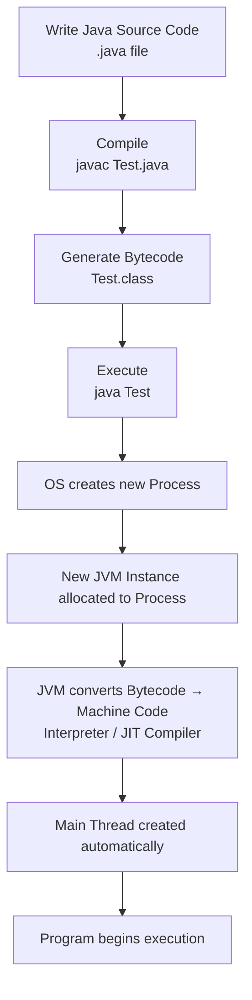
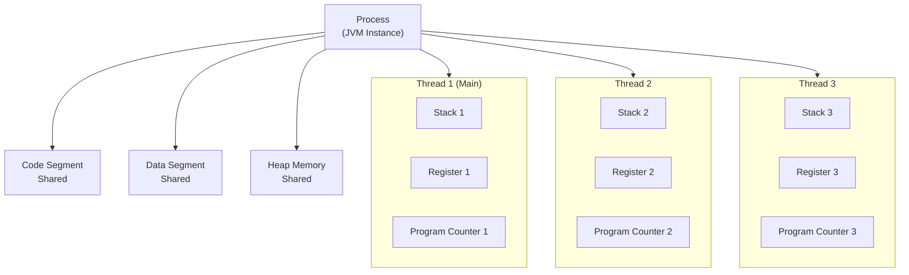
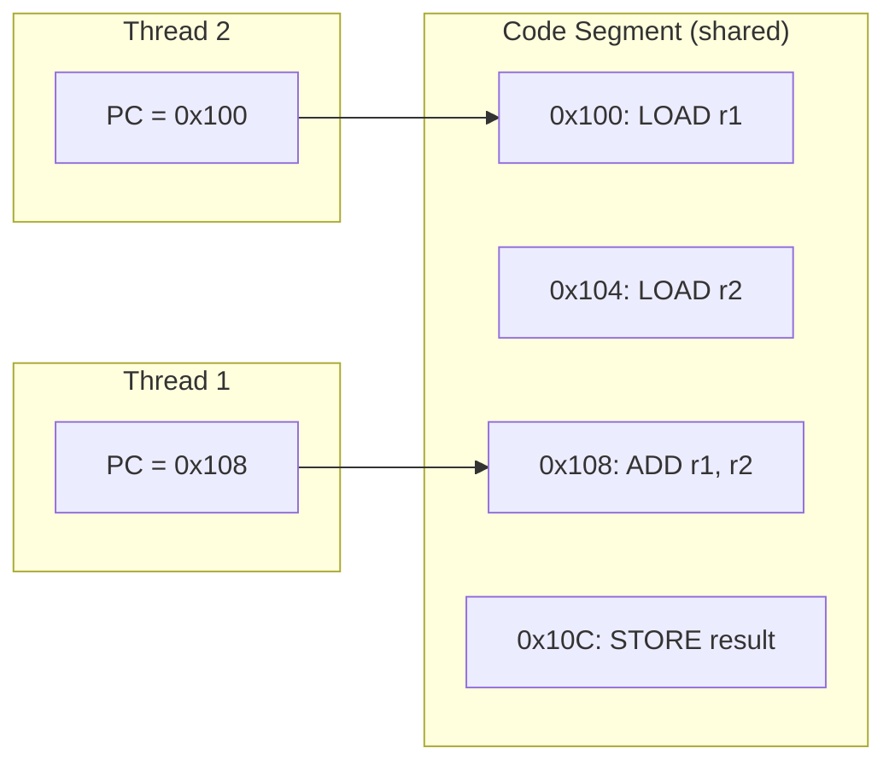
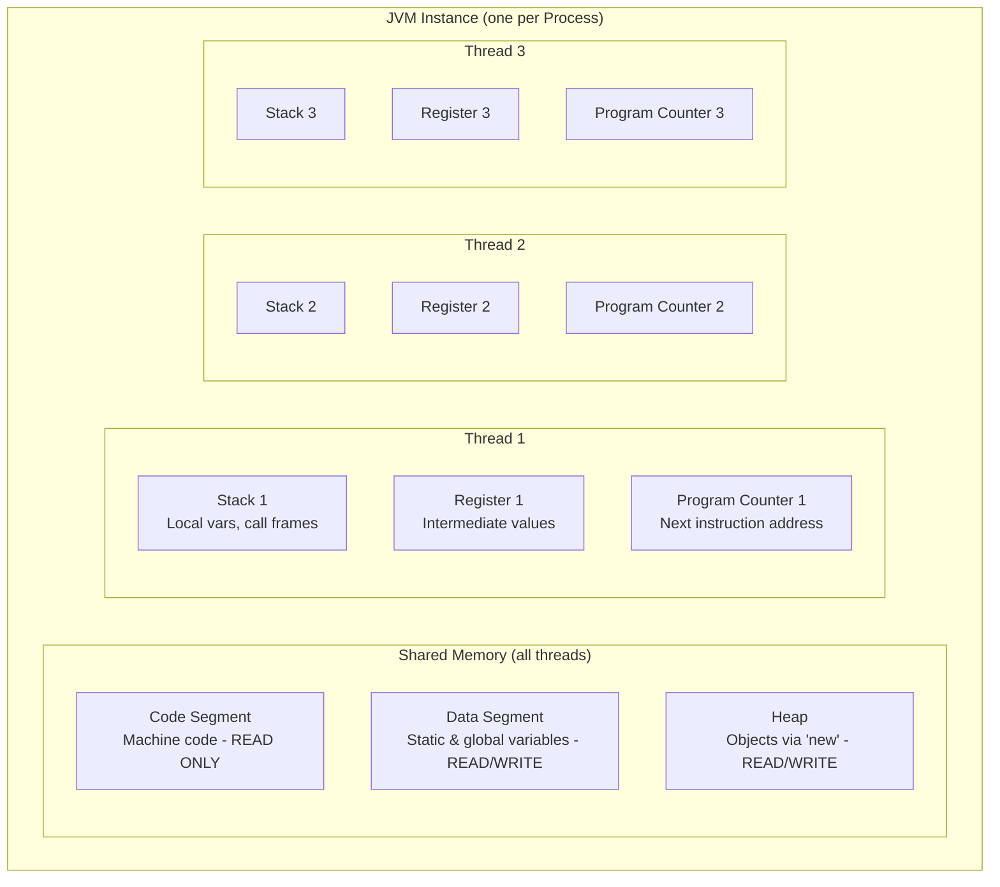
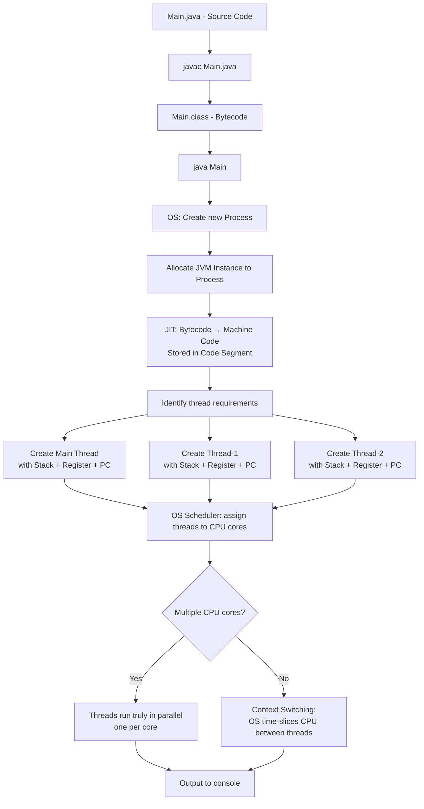
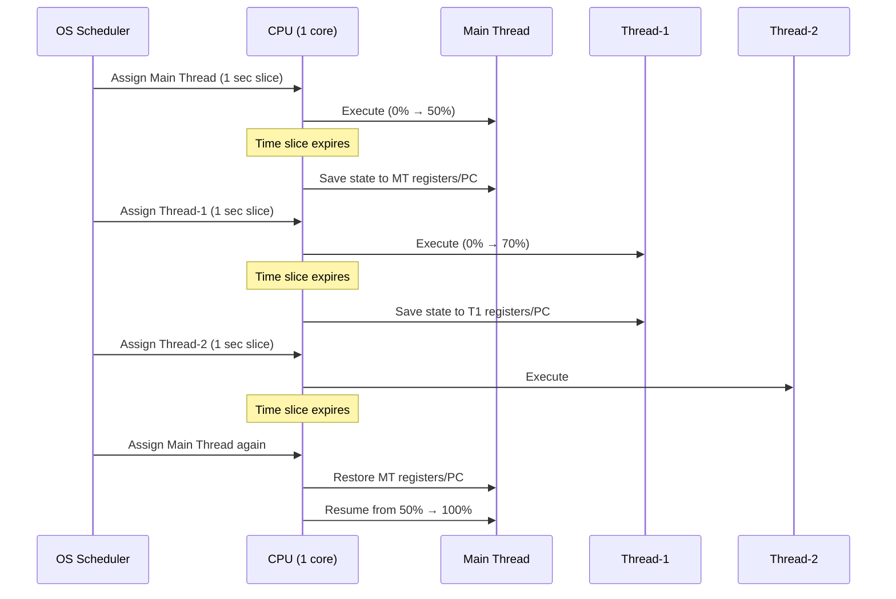
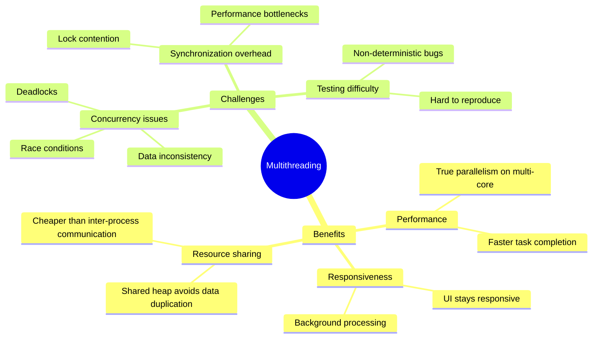
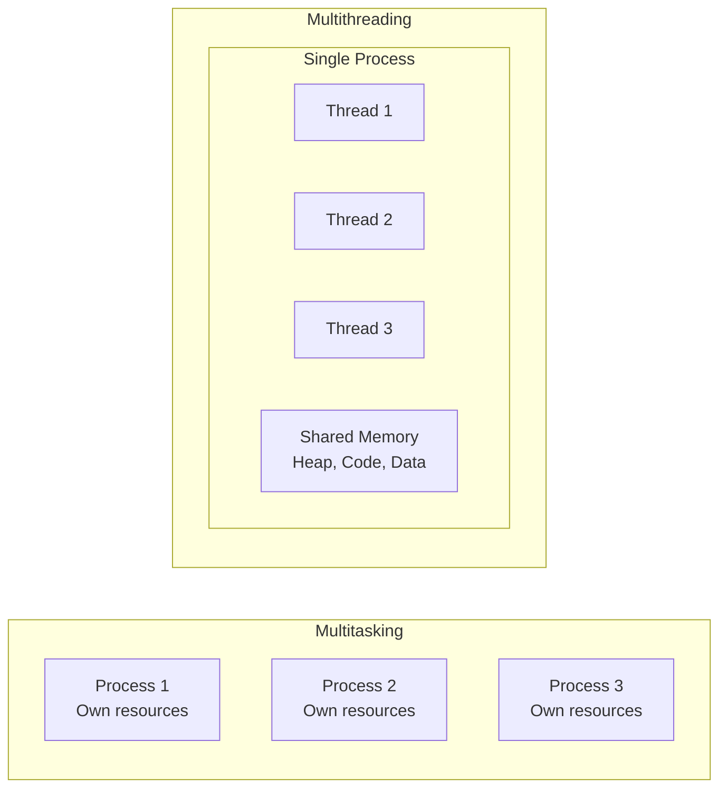

# 🧵 Java Multithreading & Concurrency — Part 1: Processes, Threads, and the JVM

> **Series:** Multithreading & Concurrency  
> **Part:** 1 of N  
> **Topics Covered:** Process vs Thread · JVM Memory Architecture · Context Switching · Multithreading vs Multitasking

---

## 📚 Table of Contents

1. [What is a Process?](#1-what-is-a-process)
2. [What is a Thread?](#2-what-is-a-thread)
3. [JVM Memory Architecture](#3-jvm-memory-architecture)
   - [Code Segment](#code-segment)
   - [Data Segment](#data-segment)
   - [Heap Memory](#heap-memory)
   - [Stack Memory](#stack-memory)
   - [Registers](#registers)
   - [Program Counter (PC)](#program-counter-pc)
4. [How Java Executes a Program — Complete Flow](#4-how-java-executes-a-program--complete-flow)
5. [Context Switching](#5-context-switching)
6. [What is Multithreading?](#6-what-is-multithreading)
7. [Benefits and Challenges of Multithreading](#7-benefits-and-challenges-of-multithreading)
8. [Multitasking vs Multithreading](#8-multitasking-vs-multithreading)
9. [Summary and Interview Notes](#9-summary-and-interview-notes)
10. [Practice Questions](#10-practice-questions)

---

# 1. What is a Process?

## Overview

Before understanding multithreading, you must first understand the two most fundamental concepts in concurrent programming: **Process** and **Thread**. These are among the most commonly asked interview questions in Java, and deceptively deep — many experienced engineers get tripped up by the follow-up questions.

---

## Definition

> **A process is an instance of a program that is getting executed.**

When you write a Java program and run it, the JVM creates a **new process** to manage that execution. The process is responsible for allocating resources, managing memory, converting bytecode to machine code, and interfacing with the CPU.

---

## Real-World Analogy

Think of a **recipe** as a program written on paper. The act of a chef actively cooking from that recipe is the **process** — it requires resources (kitchen, ingredients, utensils), has its own working space, and runs independently from another chef cooking a different recipe in another kitchen.

---

## How a Java Program Becomes a Process — Step by Step

### Step 1: Write the code

```java
public class Test {
    public static void main(String[] args) {
        System.out.println("Hello from main thread!");
    }
}
```

### Step 2: Compile

```bash
javac Test.java
```

This generates `Test.class` — a **bytecode** file that the JVM can interpret. Bytecode is a platform-independent intermediate representation; it is **not** machine code yet.

### Step 3: Execute

```bash
java Test
```

When this command runs:
1. The **JVM starts a new process**.
2. A **new JVM instance** is allocated to that process.
3. The JVM converts bytecode to **machine code** (via interpreter or JIT compiler).
4. A **main thread** is automatically created.
5. The main thread begins execution.

---

## Key Properties of a Process

| Property | Description |
|---|---|
| **Isolation** | Each process has its own private memory space |
| **Independence** | Processes do not share resources with each other |
| **Heavyweight** | Creating a process is expensive (memory allocation, JVM instance creation) |
| **Parallelism** | Multiple processes can run concurrently on the OS |
| **Own JVM instance** | Each Java process gets its own JVM instance with its own heap, stack, etc. |

---

## JVM Instance Per Process

A critical point: **every Java process gets its own JVM instance**. This JVM instance contains:

- Heap memory
- Stack memory
- Code segment
- Data segment
- Registers
- Program Counter (PC)

Two different Java processes running simultaneously each have **completely separate JVM instances** and **completely separate memory**. They cannot see each other's heap, stack, or any other memory region.

```
┌─────────────────────────┐     ┌─────────────────────────┐
│       Process 1         │     │       Process 2         │
│  ┌───────────────────┐  │     │  ┌───────────────────┐  │
│  │   JVM Instance 1  │  │     │  │   JVM Instance 2  │  │
│  │  - Heap (1 GB)    │  │     │  │  - Heap (2 GB)    │  │
│  │  - Stack          │  │     │  │  - Stack          │  │
│  │  - Code Segment   │  │     │  │  - Code Segment   │  │
│  │  - Data Segment   │  │     │  │  - Data Segment   │  │
│  └───────────────────┘  │     │  └───────────────────┘  │
└─────────────────────────┘     └─────────────────────────┘
         No shared memory between processes
```

---

## Configuring Heap Memory Per Process

When you launch a Java process, you can control how much heap memory the JVM instance for that process is allowed to use:

```bash
java -Xms256m -Xmx2g Test
```

| Flag | Meaning |
|---|---|
| `-Xms256m` | **Initial** (minimum) heap size = 256 MB |
| `-Xmx2g` | **Maximum** heap size = 2 GB |

> [!NOTE]
> All JVM instances draw from the same physical RAM on your machine. If the total JVM heap across your machine is, say, 10 GB, then multiple processes share that physical pool — but each process is limited to only what you allocate to it. If a process tries to exceed its `-Xmx` limit, it throws an `OutOfMemoryError`, even if other memory is technically available on the machine.

---

## Diagram: Process Lifecycle



---

# 2. What is a Thread?

## Overview

A thread is the actual worker inside a process. While a process sets up the environment (memory, machine code, resources), threads are the entities that **execute the instructions**.

---

## Definition

> **A thread is the smallest sequence of instructions that can be executed by the CPU independently.**

One process can contain multiple threads, and each thread can execute a different portion of the program's machine code simultaneously (or via context switching if only one CPU core is available).

---

## Real-World Analogy

Think of a **restaurant kitchen** as a process. The kitchen has its shared resources — refrigerator (heap), recipe books (code segment), pantry (data segment). The **chefs** are the threads. Each chef works independently using the shared kitchen resources, but has their own notepad (stack) and remembers exactly which step of the recipe they are on (program counter).

---

## The Main Thread

When a process is created, **one thread is automatically started**: the **main thread**.

```java
public class MultithreadingLearning {
    public static void main(String[] args) {
        System.out.println(Thread.currentThread().getName());
    }
}
```

**Output:**
```
main
```

The JVM automatically creates the main thread and begins executing `main()` on it. From the main thread, you can spawn additional threads.

---

## Creating Additional Threads

```java
public class MultithreadingLearning {
    public static void main(String[] args) {
        System.out.println("Main thread: " + Thread.currentThread().getName());

        Thread t1 = new Thread(() -> {
            System.out.println("Thread 1: " + Thread.currentThread().getName());
        });

        Thread t2 = new Thread(() -> {
            System.out.println("Thread 2: " + Thread.currentThread().getName());
        });

        t1.start();
        t2.start();
    }
}
```

**Output (order may vary):**
```
Main thread: main
Thread 1: Thread-0
Thread 2: Thread-1
```

> [!NOTE]
> Thread execution order is **not guaranteed**. The OS scheduler decides which thread runs next. This non-determinism is one of the key challenges of multithreading.

---

## Thread vs Process: Key Differences

| Aspect | Process | Thread |
|---|---|---|
| Definition | Instance of a running program | Smallest unit of execution within a process |
| Memory | Has its own private memory | Shares memory with other threads in the same process |
| Creation cost | Heavyweight (expensive) | Lightweight (cheap) |
| Communication | Complex (IPC — inter-process communication) | Simple (shared memory) |
| Isolation | Fully isolated | Not isolated — must synchronize shared data |
| Crash impact | One process crash doesn't affect others | One thread crash can crash the whole process |

---

## Diagram: Process Containing Multiple Threads



---

# 3. JVM Memory Architecture

## Overview

When a process is created and a JVM instance is allocated to it, that JVM instance contains multiple distinct memory regions. Understanding these regions is essential for understanding thread safety, synchronization, and performance.

---

## Memory Regions: Shared vs Thread-Local

| Memory Region | Shared Between Threads? | Purpose |
|---|---|---|
| Code Segment | ✅ Yes (read-only) | Stores compiled machine code |
| Data Segment | ✅ Yes (read/write) | Stores global and static variables |
| Heap | ✅ Yes (read/write) | Stores dynamically allocated objects |
| Stack | ❌ No (thread-local) | Stores method call frames and local variables |
| Register | ❌ No (thread-local) | Stores intermediate computation values |
| Program Counter | ❌ No (thread-local) | Tracks which instruction the thread is executing |

---

## Code Segment

### What it stores

The code segment contains the **machine code** generated by the JVM's JIT (Just-In-Time) compiler when it converts Java bytecode. This is the native binary code that the CPU actually executes.

### Key properties

- **Read-only**: Once machine code is generated, no thread can modify it.
- **Shared**: All threads in a process read from the same code segment.
- Since threads only *read* from the code segment (never write), no synchronization is needed here.

### How it gets populated

```
Test.java → (javac) → Test.class (bytecode) → (JIT compiler at runtime) → Machine code → Stored in Code Segment
```

---

## Data Segment

### What it stores

The data segment holds **global variables** and **static variables** declared in your Java program.

```java
public class Counter {
    static int count = 0;      // ← stored in Data Segment
    static String appName = "MyApp";  // ← stored in Data Segment

    public void increment() {
        count++;   // Multiple threads can modify this — synchronization needed!
    }
}
```

### Key properties

- **Shared**: All threads in a process can read AND modify data segment contents.
- **Requires synchronization**: Because threads can concurrently modify static/global variables, you must use synchronization mechanisms (like `synchronized`, `volatile`, `AtomicInteger`, etc.) to prevent data corruption.

> [!WARNING]
> Failing to synchronize access to static variables in a multi-threaded program is a very common source of bugs. Two threads incrementing `count++` simultaneously can result in lost updates because `count++` is not an atomic operation — it is actually three steps: read, increment, write.

---

## Heap Memory

### What it stores

The heap stores all **objects created with the `new` keyword** during program execution.

```java
// These objects go onto the heap:
String s = new String("hello");
List<Integer> list = new ArrayList<>();
MyClass obj = new MyClass();
```

### Key properties

- **Shared within a process**: All threads in a process share the same heap. Thread 1 can create an object and Thread 2 can access it.
- **NOT shared between processes**: Process 1's heap is completely separate from Process 2's heap. They map to different physical memory addresses.
- **Requires synchronization**: Since threads share the heap, concurrent writes to the same object require synchronization.
- **Managed by Garbage Collector**: Unreferenced objects on the heap are reclaimed by the GC.

### Heap size is configurable per process

```bash
java -Xms256m -Xmx1g MyApp   # Process 1: min 256MB, max 1GB heap
java -Xms512m -Xmx2g MyApp   # Process 2: min 512MB, max 2GB heap
```

Both processes draw from the machine's physical RAM, but their heap spaces are completely isolated.

---

## Stack Memory

### What it stores

Each thread has its **own private stack**. The stack manages:

- **Method call frames**: Every time a method is called, a new frame is pushed onto the stack.
- **Local variables**: Variables declared inside a method.
- **Return addresses**: Where execution should resume after a method returns.

```java
public void methodA() {
    int x = 10;         // x lives on Thread's stack
    methodB(x);
}

public void methodB(int value) {
    int y = value * 2;  // y lives on Thread's stack
}
```

### Key properties

- **Thread-local**: Each thread has its own stack. No sharing, no synchronization needed.
- **Automatically managed**: Stack frames are pushed on call and popped on return.
- **Stack Overflow**: If recursion is too deep, the stack fills up and throws `StackOverflowError`.

---

## Registers

### What they are

JVM registers are a small, fast storage area (analogous to CPU registers) used during execution. They temporarily hold:

- **Intermediate computation results** during bytecode-to-machine-code conversion
- **Operands** for instructions being executed

### Why threads need their own registers

This is a critical point for understanding **context switching**.

When the OS suspends a thread mid-execution to run another thread, all the intermediate work the CPU was doing for that thread must be saved somewhere. That "somewhere" is the thread's own register set. When the thread gets CPU time again, its register values are restored and execution continues exactly where it left off.

> [!IMPORTANT]
> Thread-local registers are what make context switching possible. Without per-thread registers, you could not pause and resume threads safely.

---

## Program Counter (PC)

### What it is

The **Program Counter** (also called PC register) is a thread-local pointer that tracks **which instruction in the code segment the thread should execute next**.

### How it works

1. When the JVM creates a thread and assigns it a slice of machine code to run, the PC is set to the **starting address** of that code in the code segment.
2. After each instruction executes successfully, the PC **increments** to point to the next instruction.
3. When the thread is context-switched out, its PC value is saved. When it resumes, execution continues from the saved PC address.

```
Code Segment (Machine Code):
  Address 0x100: LOAD r1, #5
  Address 0x104: LOAD r2, #3
  Address 0x108: ADD  r1, r2
  Address 0x10C: STORE result, r1
  ...

Thread 1 PC → 0x108   (Thread 1 is about to execute ADD)
Thread 2 PC → 0x100   (Thread 2 is starting from the beginning)
```

### Diagram: Program Counter pointing into Code Segment



---

## Complete JVM Memory Diagram



---

# 4. How Java Executes a Program — Complete Flow

This section walks through the entire lifecycle of a Java program from source code to CPU execution, tying together all the concepts above.

---

## Example Program

```java
// Main.java
public class Main {
    public static void main(String[] args) {
        System.out.println("Step 1: Main thread running");

        Thread t1 = new Thread(() -> {
            System.out.println("Step 2: Thread-1 running");
        });

        Thread t2 = new Thread(() -> {
            System.out.println("Step 3: Thread-2 running");
        });

        t1.start();
        t2.start();

        System.out.println("Step 4: Back in main thread");
    }
}
```

---

## Step-by-Step Execution Flow

### Step 1: Compilation

```bash
javac Main.java
```

- The Java compiler (`javac`) reads `Main.java`.
- Outputs `Main.class` — a file containing **bytecode** (platform-independent instructions for the JVM).
- Bytecode is **not** machine code. The CPU cannot directly execute it.

### Step 2: Invocation

```bash
java Main
```

### Step 3: Process Creation

- The OS creates a **new process** for this Java program.
- This process gets its own isolated memory space.

### Step 4: JVM Instance Allocation

- A **new JVM instance** is allocated to the process.
- This JVM instance includes: heap, code segment, data segment, and infrastructure for thread management.
- Heap size is configured by `-Xms` / `-Xmx` flags (or defaults if not specified).

### Step 5: Bytecode → Machine Code (JIT Compilation)

- The JVM reads the bytecode in `Main.class`.
- The **JIT (Just-In-Time) compiler** converts bytecode into **native machine code** that the CPU can execute.
- This machine code is stored in the **code segment**.
- During this conversion, the JVM also identifies **how many threads the program will need** (in this case: main thread, Thread-1, Thread-2).

### Step 6: Thread Creation

The JVM creates the required threads:

| Thread | Assigned to |
|---|---|
| Main thread | `main()` method |
| Thread-1 (t1) | Lambda `() -> println("Step 2...")` |
| Thread-2 (t2) | Lambda `() -> println("Step 3...")` |

For each thread, the JVM allocates:
- A private **stack**
- A private **register set**
- A private **program counter** pointing to where in the code segment this thread should start executing

### Step 7: OS Scheduling

Threads don't run themselves. The **OS scheduler** (sometimes assisted by the JVM scheduler) decides which thread gets CPU time and when.

Threads are placed in a **ready queue** and the OS assigns them to available CPU cores.

### Step 8: CPU Execution

When a thread is assigned to a CPU:
1. The thread's **register values** are loaded into the CPU's registers.
2. The thread's **program counter** tells the CPU which instruction to fetch from the code segment.
3. The CPU executes the instruction.
4. The program counter increments to the next instruction.
5. This repeats until the thread's time slice expires or the thread completes.

---

## Complete Execution Flowchart



---

# 5. Context Switching

## Overview

Context switching is the mechanism that allows a single CPU core to give the **illusion of running multiple threads simultaneously**. In reality, with one CPU core, only one thread can execute at any instant — but the OS rapidly switches between threads, making them all appear to progress concurrently.

---

## Definition

> **Context switching** is the process of saving the state of a currently running thread (so it can be resumed later) and loading the state of another thread so it can begin or continue executing.

---

## Why It's Needed

If you have 3 threads but only 1 CPU core, the CPU can only run one thread at a time. The OS gives each thread a **time slice** (a short window of CPU time). When a thread's time slice expires, the OS performs a context switch:

1. **Save** the current thread's state (registers, PC, etc.) → stored in the thread's own register/PC.
2. **Load** the next thread's saved state into the CPU.
3. The next thread continues from where it left off.

---

## Step-by-Step Context Switch Example

**Setup:** 1 CPU core, 3 threads (Main, T1, T2). Each thread gets a 1-second time slice.

### Round 1: Main Thread runs

- OS assigns Main Thread to CPU.
- CPU loads Main Thread's register values.
- CPU reads instruction from Main Thread's PC address in code segment.
- CPU executes instructions... let's say completes 50% of Main Thread's work.
- **Time slice expires.**

**Context switch:**
- CPU's intermediate results copied back into Main Thread's private register set.
- Main Thread's PC updated to the next instruction it needs to execute.
- Main Thread goes into the wait queue.

### Round 2: Thread-1 runs

- OS assigns Thread-1 to CPU.
- CPU loads Thread-1's register values (starting state).
- CPU executes Thread-1's instructions... completes 70% of Thread-1's work.
- **Time slice expires.**

**Context switch:**
- CPU's intermediate results saved into Thread-1's private register set.
- Thread-1 goes into the wait queue.

### Round 3: Thread-2 runs

Similar process.

### Round 4: Main Thread runs again

- OS assigns Main Thread back to CPU.
- CPU **restores** Main Thread's register values (the 50% completed state).
- CPU resumes execution from saved PC — exactly where it stopped.
- Continues from 50% as if it never paused.

---

## Diagram: Context Switching on Single CPU



---

## True Parallelism: Multiple CPU Cores

When you have **multiple CPU cores** and **fewer threads than cores**, threads can run **truly in parallel** — no context switching needed.

```
2 CPU cores, 2 threads:

CPU Core 1 → Thread-1 running ████████████
CPU Core 2 → Thread-2 running ████████████

Both running simultaneously — TRUE parallelism
```

```
1 CPU core, 3 threads:

CPU Core 1 → Main  ██░░░░██░░░░██  (context switching)
             T1    ░░██░░░░██░░░░  (context switching)
             T2    ░░░░██░░░░██░░  (context switching)

Appears parallel, but is actually interleaved — CONCURRENCY
```

---

## Concurrency vs Parallelism

| Term | Meaning |
|---|---|
| **Concurrency** | Multiple threads making progress (via context switching). Not necessarily at the exact same instant. |
| **Parallelism** | Multiple threads executing at the **exact same moment** on multiple CPU cores. |

> [!IMPORTANT]
> Multithreading on a single-core machine gives you **concurrency** (not true parallelism). On a multi-core machine with enough cores, you can achieve **true parallelism**.

---

## Why Thread-Local Registers Matter for Context Switching

Each thread has its **own private registers**. This is not a luxury — it is a **requirement** for context switching to work correctly.

When the CPU is interrupted mid-instruction (say, it was halfway through computing `a + b`), the intermediate value (partial result) lives in the CPU's registers. Before the OS can run another thread, it must **save** those register values. The only place to save them is the thread's own private register set. When the thread runs again, those values are **restored** into the CPU registers, and execution continues correctly.

Without thread-local registers, context switching would destroy the interrupted thread's work.

---

# 6. What is Multithreading?

## Definition

> **Multithreading** is the ability of a program to perform multiple operations at the same time by running multiple threads within a single process, where those threads share common resources (memory) but execute independently.

---

## Key Characteristics

- Multiple threads run within a **single process**.
- Threads **share** code segment, data segment, and heap memory.
- Threads each have **private** stack, registers, and program counter.
- Threads can truly run in parallel (on multi-core systems) or via context switching (single-core).

---

## Code Example: First Multithreaded Program

```java
public class FirstMultithreadedProgram {

    public static void main(String[] args) {

        // Main thread
        System.out.println("Main thread started: " + Thread.currentThread().getName());

        // Creating Thread 1
        Thread t1 = new Thread(() -> {
            for (int i = 0; i < 3; i++) {
                System.out.println("Thread-1 executing: iteration " + i);
                try {
                    Thread.sleep(100); // Simulate work
                } catch (InterruptedException e) {
                    Thread.currentThread().interrupt();
                }
            }
        });

        // Creating Thread 2
        Thread t2 = new Thread(() -> {
            for (int i = 0; i < 3; i++) {
                System.out.println("Thread-2 executing: iteration " + i);
                try {
                    Thread.sleep(100); // Simulate work
                } catch (InterruptedException e) {
                    Thread.currentThread().interrupt();
                }
            }
        });

        t1.start(); // JVM creates a new thread; OS schedules it
        t2.start(); // JVM creates a new thread; OS schedules it

        System.out.println("Main thread: threads started");
    }
}
```

**Sample Output (order is non-deterministic):**
```
Main thread started: main
Main thread: threads started
Thread-1 executing: iteration 0
Thread-2 executing: iteration 0
Thread-1 executing: iteration 1
Thread-2 executing: iteration 1
Thread-2 executing: iteration 2
Thread-1 executing: iteration 2
```

### Line-by-Line Explanation

| Line | Explanation |
|---|---|
| `Thread.currentThread().getName()` | Returns the name of the currently executing thread — "main" for the main thread |
| `new Thread(() -> {...})` | Creates a new Thread object with a lambda as its `Runnable` task |
| `t1.start()` | Tells the JVM to create a new OS thread and start executing the lambda. Does **not** block. |
| `Thread.sleep(100)` | Pauses the current thread for 100ms, simulating work and allowing context switching |

---

# 7. Benefits and Challenges of Multithreading

## Benefits

### 1. Improved Performance via Task Parallelism

By dividing work across multiple threads, a program can complete in less wall-clock time (especially on multi-core machines).

```
Single-threaded: Task A (5s) → Task B (5s) = 10s total

Multi-threaded:  Thread 1: Task A (5s)
                 Thread 2: Task B (5s)
                 = 5s total (on dual-core)
```

### 2. Better Responsiveness

In UI applications, a long-running task on the main thread would **freeze** the UI. Multithreading allows background tasks to run while the UI thread stays responsive.

```java
// Without multithreading — UI freezes:
void onButtonClick() {
    downloadFile(); // Takes 10 seconds — UI frozen!
    updateUI();
}

// With multithreading — UI stays responsive:
void onButtonClick() {
    new Thread(() -> {
        downloadFile();
        // Update UI on main thread when done
    }).start();
}
```

### 3. Efficient Resource Sharing

Threads within a process share the heap and other memory. This is far more efficient than creating separate processes, which would require expensive IPC (inter-process communication) to share data.

---

## Challenges

### 1. Concurrency Issues

Because threads share the heap and data segment, they can interfere with each other:

- **Race conditions**: Two threads modifying the same variable simultaneously, leading to incorrect results.
- **Data inconsistency**: A thread reads a value while another thread is in the middle of updating it.
- **Deadlocks**: Two threads each hold a lock that the other needs, and both wait forever.

```java
// Classic race condition:
class Counter {
    int count = 0;

    void increment() {
        count++; // NOT thread-safe! Read-increment-write is 3 operations.
    }
}
```

### 2. Synchronization Overhead

To prevent the above issues, you must use synchronization (`synchronized` blocks, `ReentrantLock`, atomic types, etc.). This adds complexity and can reduce performance if overused (threads must wait for locks).

### 3. Difficult Testing and Debugging

Race conditions are **non-deterministic** — they may not reproduce consistently. A bug might appear in production under high load but never appear in unit tests. This makes multithreaded bugs notoriously hard to find and fix.

> [!CAUTION]
> Many concurrency bugs are **timing-dependent** and cannot be reproduced on demand. Thorough code review, stress testing, and tools like Thread Sanitizer or Java's `java.util.concurrent` utilities are essential.

---

## Benefits vs Challenges Summary



---

# 8. Multitasking vs Multithreading

## Overview

These terms are often confused. The difference comes down to **process boundary**:

| Concept | What runs concurrently | Memory sharing | Example |
|---|---|---|---|
| **Multitasking** | Multiple **processes** | ❌ No sharing | Running Chrome + Spotify + IntelliJ simultaneously |
| **Multithreading** | Multiple **threads** within one process | ✅ Shared (heap, code, data) | A single Java app using multiple threads |

---

## Multitasking (Multi-process)

The OS runs multiple independent processes concurrently. Each process has its own isolated memory space. They do not share heap, code segment, data segment, or stack.

```
Process 1 (Chrome)         Process 2 (IntelliJ)
┌──────────────────┐       ┌──────────────────┐
│  Own Heap        │       │  Own Heap        │
│  Own Code Seg.   │       │  Own Code Seg.   │
│  Own Data Seg.   │       │  Own Data Seg.   │
│  Own Threads     │       │  Own Threads     │
└──────────────────┘       └──────────────────┘
  COMPLETELY ISOLATED — No shared memory
```

The OS uses context switching between processes (just as it does between threads), but at a **process level** rather than thread level.

---

## Multithreading (Multi-thread within one process)

A single process runs multiple threads. Threads share code segment, data segment, and heap. Each thread has its own private stack, register, and PC.

```
Process (Your Java App)
┌─────────────────────────────────────────────┐
│  Shared: Code Segment, Data Segment, Heap   │
│                                             │
│  Thread 1    Thread 2    Thread 3           │
│  ┌──────┐    ┌──────┐    ┌──────┐           │
│  │Stack │    │Stack │    │Stack │           │
│  │Reg.  │    │Reg.  │    │Reg.  │           │
│  │PC    │    │PC    │    │PC    │           │
│  └──────┘    └──────┘    └──────┘           │
└─────────────────────────────────────────────┘
```

---

## Comparison Diagram



---

# 9. Summary and Interview Notes

## Quick-Reference Summary

| Concept | Key Point |
|---|---|
| **Process** | Instance of a running program. Gets its own JVM instance. Isolated memory. |
| **Thread** | Smallest unit of execution within a process. Shares process memory. |
| **Main thread** | Automatically created when a process starts. Named "main". |
| **Code Segment** | Shared, read-only. Stores machine code. |
| **Data Segment** | Shared, read/write. Stores static/global variables. Needs sync. |
| **Heap** | Shared, read/write. Stores objects. Needs sync. Managed by GC. |
| **Stack** | Thread-local. Stores method frames and local variables. |
| **Register** | Thread-local. Stores intermediate CPU values. Critical for context switching. |
| **Program Counter** | Thread-local. Points to the next instruction in the code segment. |
| **Context Switching** | OS saves one thread's state and loads another's. Enables concurrency on single-core. |
| **Concurrency** | Multiple threads making progress via context switching. |
| **Parallelism** | Multiple threads executing simultaneously on multiple CPU cores. |
| **Multitasking** | Multiple processes. No shared memory. |
| **Multithreading** | Multiple threads in one process. Shared heap/code/data. |

---

## 🎯 Interview Notes

### Q1: What is the difference between a process and a thread?

A process is a running instance of a program with its own isolated memory space and JVM instance. A thread is the smallest unit of execution within a process. Multiple threads share the process's heap, code segment, and data segment, but each has its own stack, register, and program counter.

### Q2: What memory do threads share vs own privately?

**Shared:** code segment, data segment (static/global variables), heap (objects)  
**Private:** stack (local variables, call frames), registers (intermediate values), program counter (next instruction)

### Q3: Why does each thread need its own program counter?

Because threads execute different parts of the code at different points. The PC tracks which instruction *this specific thread* should execute next. Without a private PC, threads couldn't independently navigate the code segment.

### Q4: What is context switching and why is it needed?

Context switching is the OS saving a thread's current execution state (registers, PC) and loading another thread's saved state to give it CPU time. It's needed because there are typically more threads than CPU cores — context switching creates the illusion of parallelism on limited hardware.

### Q5: What is the difference between concurrency and parallelism?

Concurrency: multiple threads make progress but not necessarily at the same instant (via context switching). Parallelism: multiple threads execute at the exact same moment on different CPU cores.

### Q6: What is the difference between multitasking and multithreading?

Multitasking = multiple processes running concurrently. No shared memory. Expensive communication.  
Multithreading = multiple threads within a single process. Shared heap/code/data. Efficient communication, but requires synchronization.

### Q7: When a new Java process is created, what happens?

1. OS creates a new process.
2. A new JVM instance is allocated to the process.
3. The JVM's JIT compiler converts bytecode to machine code (stored in code segment).
4. A main thread is automatically created.
5. The main thread begins executing `main()`.

### Q8: Can two Java processes share heap memory?

No. Each process has its own JVM instance with its own completely isolated heap. Processes can communicate via IPC mechanisms (sockets, files, pipes) but not by sharing heap directly.

---

# 10. Practice Questions

## Easy

1. What is a process? Write the definition in your own words.
2. What is a thread? Why is it called a "lightweight process"?
3. What is the name of the first thread created when a Java program runs?
4. Which memory regions are shared between threads in the same process?
5. Which memory regions are private (local) to each thread?
6. What command compiles a Java file? What command runs it?
7. What JVM flags control minimum and maximum heap size?

---

## Medium

8. Explain what the Program Counter (PC) does and why each thread needs its own.
9. Explain what registers are and why thread-local registers are essential for context switching.
10. A Java application creates 5 threads but the machine has only 2 CPU cores. What happens? How does the OS handle this?
11. Explain the difference between concurrency and parallelism with a real-world analogy.
12. What is the difference between multitasking and multithreading? How does memory sharing differ?
13. If two threads both increment the same `static int counter` variable simultaneously, what can go wrong? Why?
14. Describe the full lifecycle from writing `Main.java` to CPU execution, step by step.

---

## Hard

15. Given that JVM has 10 GB of total heap, and you launch 5 Java processes each with `-Xmx2g`, is this safe? What happens if all 5 processes try to use their full 2 GB simultaneously?
16. Why is the code segment read-only? What would happen if threads could modify machine code at runtime?
17. Design a scenario where two threads could cause a deadlock. Explain why it happens and how you would prevent it.
18. In a multi-core system with 4 CPU cores and 4 threads, is context switching still possible? Give a scenario where it would occur even with enough cores.
19. Explain why testing and debugging multithreaded programs is significantly harder than single-threaded programs. What tools or strategies would you use?

---

> [!TIP]
> **Next up in Part 2:** How to create threads in Java — using `Thread` class, `Runnable` interface, `Callable`, and `ExecutorService`. Thread lifecycle states, daemon threads, and thread priorities.

---

*End of Part 1 — Java Multithreading & Concurrency*
