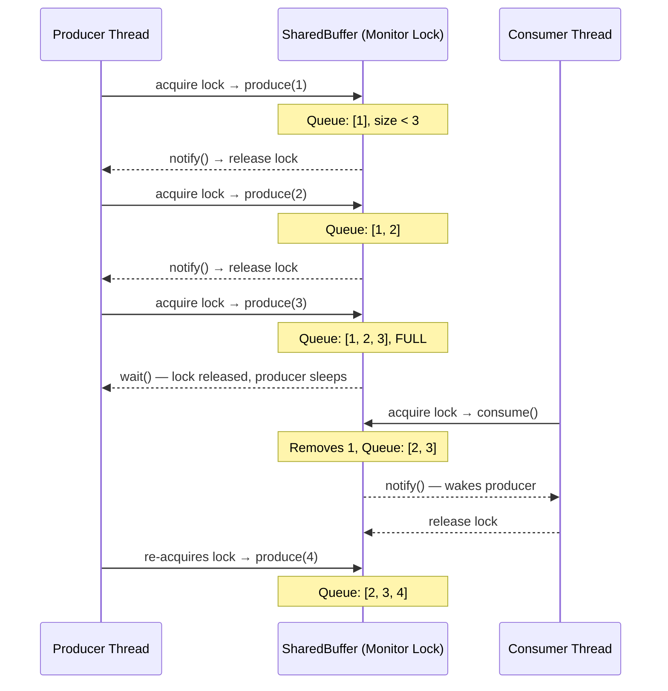
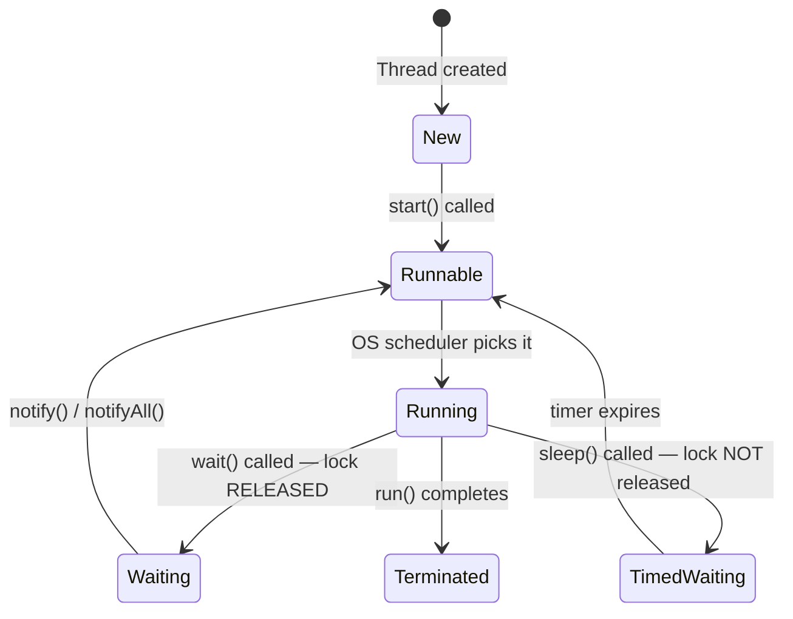
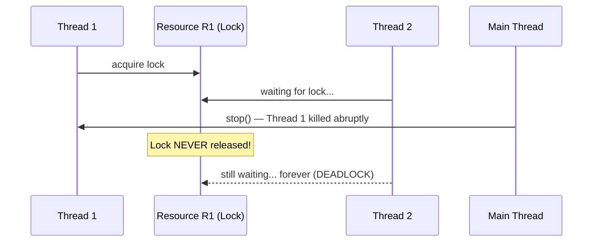
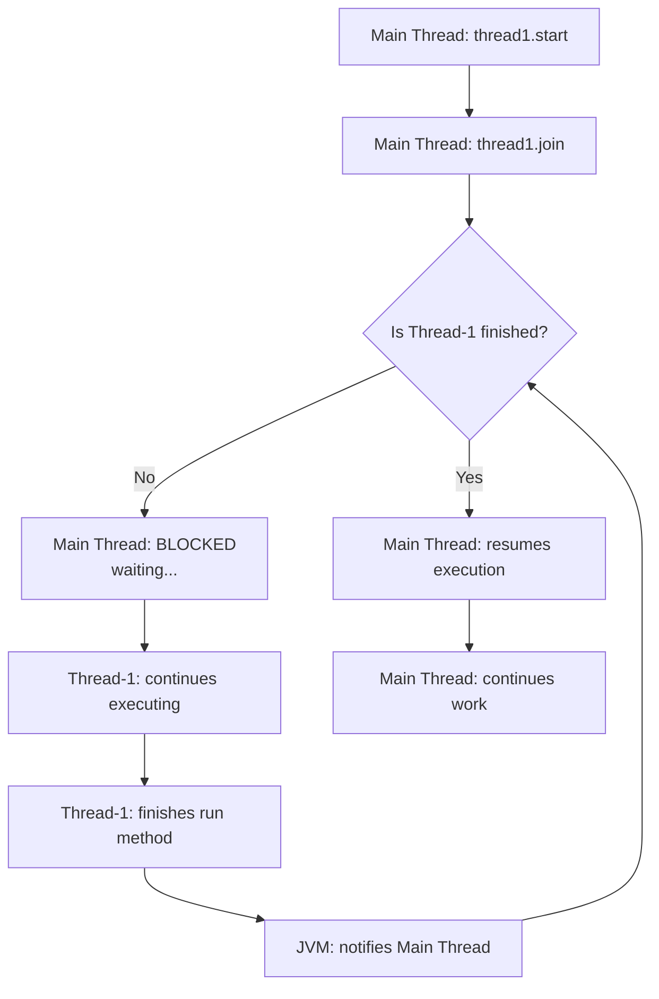
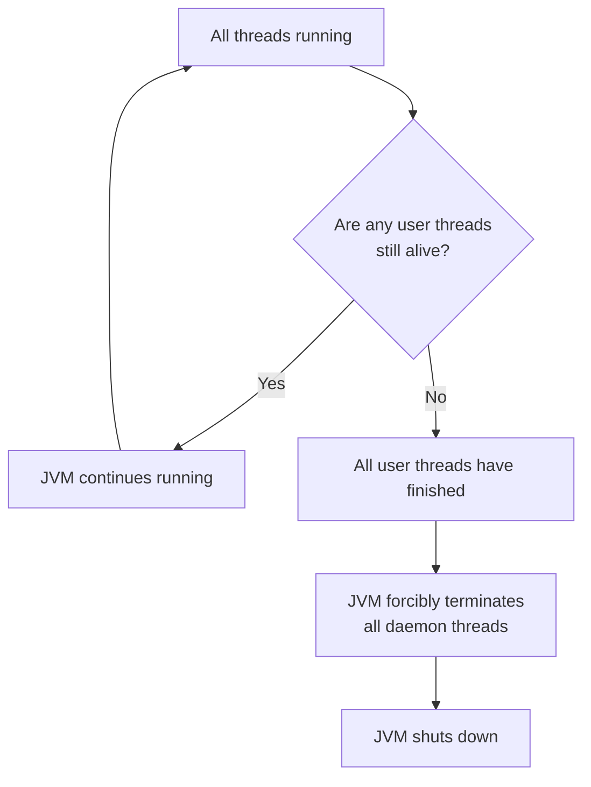

# 🧵 Java Multithreading & Concurrency — Part 3: Producer-Consumer, Deprecated Methods, Thread Join, Priority & Daemon Threads

> **Series:** Multithreading & Concurrency  
> **Part:** 3 of N  
> **Topics Covered:** Producer-Consumer Problem · Why stop/suspend/resume are Deprecated · Thread Join · Thread Priority · Daemon Threads

---

## 📚 Table of Contents

1. [Producer-Consumer Problem](#1-producer-consumer-problem)
2. [Why stop(), suspend(), and resume() Are Deprecated](#2-why-stop-suspend-and-resume-are-deprecated)
3. [Thread Joining](#3-thread-joining)
4. [Thread Priority](#4-thread-priority)
5. [Daemon Threads](#5-daemon-threads)
6. [Summary and Interview Notes](#6-summary-and-interview-notes)
7. [Practice Questions](#7-practice-questions)

---

# 1. Producer-Consumer Problem

## Overview

The **Producer-Consumer problem** is one of the most classic concurrency problems in computer science. It models a very common real-world scenario: one or more threads **produce** data, and one or more threads **consume** that data, with both operating on a **shared, bounded buffer** (queue).

This problem tests your understanding of thread coordination using `wait()`, `notify()`, and the monitor lock — concepts covered in Part 2.

---

## Problem Statement

- There is a **shared queue** with a fixed maximum capacity (buffer size).
- A **Producer thread** generates items and places them into the queue.
- A **Consumer thread** removes items from the queue.
- **If the queue is full**, the producer must **wait** — there is no room to add items.
- **If the queue is empty**, the consumer must **wait** — there is nothing to consume.
- When the producer adds an item, it must **notify** any waiting consumer.
- When the consumer removes an item, it must **notify** any waiting producer (freeing up space).

---

## Why This Problem Matters

Without proper coordination:
- A producer might overflow the queue (adding past capacity).
- A consumer might try to consume from an empty queue (reading garbage data or crashing).
- Both conditions cause **data corruption** or **incorrect program behavior**.

The solution demonstrates `wait()` and `notify()` used correctly on a shared object's monitor lock.

---

## Real-World Analogy

Think of a **restaurant kitchen**:
- The **chef (producer)** prepares dishes and places them on a service counter (the queue).
- The **waiter (consumer)** picks dishes from the counter to deliver to tables.
- If the counter is **full**, the chef must stop cooking and wait for space.
- If the counter is **empty**, the waiter must wait until food is ready.
- When the chef places a dish, they ring a bell (notify). When the waiter clears a dish, they ring the bell (notify).

---

## Implementation

### Step 1: The Shared Resource (SharedBuffer)

```java
import java.util.LinkedList;
import java.util.Queue;

public class SharedBuffer {

    private final Queue<Integer> queue = new LinkedList<>();
    private final int bufferSize;

    public SharedBuffer(int bufferSize) {
        this.bufferSize = bufferSize;
    }

    // Producer calls this method
    public synchronized void produce(int item) throws InterruptedException {

        // If buffer is full, producer must wait
        while (queue.size() == bufferSize) {
            System.out.println("Buffer full. Producer waiting...");
            wait(); // releases the monitor lock and waits
        }

        queue.add(item);
        System.out.println("Produced: " + item + " | Queue: " + queue);

        // Notify any waiting consumer that an item is now available
        notify();
    }

    // Consumer calls this method
    public synchronized void consume() throws InterruptedException {

        // If buffer is empty, consumer must wait
        while (queue.isEmpty()) {
            System.out.println("Buffer empty. Consumer waiting...");
            wait(); // releases the monitor lock and waits
        }

        int item = queue.poll();
        System.out.println("Consumed: " + item + " | Queue: " + queue);

        // Notify any waiting producer that space is now available
        notify();
    }
}
```

### Line-by-Line Explanation

| Code | Explanation |
|---|---|
| `Queue<Integer> queue = new LinkedList<>()` | `LinkedList` is unbounded by default. We enforce a size limit manually using `bufferSize`. |
| `synchronized` on both methods | Ensures only one thread (producer OR consumer) can be inside these methods at a time, using the `SharedBuffer` object's monitor lock. |
| `while (queue.size() == bufferSize)` | Uses `while` (not `if`) to re-check the condition after being woken up — protects against spurious wakeups. |
| `wait()` | Releases the monitor lock and suspends the calling thread until `notify()` is called on the same object. |
| `queue.add(item)` | Adds the produced item to the queue. |
| `notify()` | Wakes up one thread waiting on this object's monitor. The awakened thread then races to re-acquire the lock. |
| `queue.poll()` | Removes and returns the head of the queue. |

> [!IMPORTANT]
> Always use `while` instead of `if` when calling `wait()`. After a thread is notified and wakes up, it should re-check the condition, because another thread might have changed the state between the `notify()` and when the waiting thread re-acquires the lock. This is called a **spurious wakeup** guard.

---

### Step 2: The Main Class (Producer and Consumer Threads)

```java
public class ProducerConsumerDemo {

    public static void main(String[] args) {

        SharedBuffer sharedBuffer = new SharedBuffer(3); // Queue capacity = 3

        // Producer Thread: produces 6 items
        Thread producerThread = new Thread(() -> {
            for (int i = 1; i <= 6; i++) {
                try {
                    sharedBuffer.produce(i);
                } catch (InterruptedException e) {
                    Thread.currentThread().interrupt();
                }
            }
        });

        // Consumer Thread: consumes 6 items
        Thread consumerThread = new Thread(() -> {
            for (int i = 1; i <= 6; i++) {
                try {
                    sharedBuffer.consume();
                } catch (InterruptedException e) {
                    Thread.currentThread().interrupt();
                }
            }
        });

        producerThread.start();
        consumerThread.start();
    }
}
```

**Sample Output (may vary due to thread scheduling):**
```
Produced: 1 | Queue: [1]
Produced: 2 | Queue: [1, 2]
Produced: 3 | Queue: [1, 2, 3]
Buffer full. Producer waiting...
Consumed: 1 | Queue: [2, 3]
Produced: 4 | Queue: [2, 3, 4]
Buffer full. Producer waiting...
Consumed: 2 | Queue: [3, 4]
Produced: 5 | Queue: [3, 4, 5]
Buffer full. Producer waiting...
Consumed: 3 | Queue: [4, 5]
Produced: 6 | Queue: [4, 5, 6]
Consumed: 4 | Queue: [5, 6]
Consumed: 5 | Queue: [6]
Consumed: 6 | Queue: []
```

---

## Step-by-Step Execution Walkthrough



---

## Memory Diagram: What's Shared

```
Process (JVM Instance)
┌──────────────────────────────────────────────┐
│  Heap (SHARED)                               │
│  ┌─────────────────────────────────────────┐ │
│  │ sharedBuffer object                     │ │
│  │   - queue: [1, 2, 3]                    │ │
│  │   - bufferSize: 3                       │ │
│  │   - monitor lock (held by one thread)   │ │
│  └─────────────────────────────────────────┘ │
│                                              │
│  Producer Thread    │  Consumer Thread        │
│  - own Stack        │  - own Stack            │
│  - own PC           │  - own PC               │
│  - own Registers    │  - own Registers        │
└──────────────────────────────────────────────┘
```

---

## Key Observations

- `produce()` and `consume()` are both `synchronized` on the **same object** (`sharedBuffer`). Even though they are different methods, only one thread can hold `sharedBuffer`'s monitor lock at a time.
- `wait()` inside a `synchronized` method **releases the lock** so the other thread can enter.
- `notify()` does not immediately give the lock to the awakened thread — it just moves that thread from the **wait set** to the **ready queue**. The awakened thread must still compete for the lock.

---

# 2. Why stop(), suspend(), and resume() Are Deprecated

## Overview

Java's `Thread` class originally provided three methods for controlling thread execution: `stop()`, `suspend()`, and `resume()`. All three are **deprecated** — meaning Java strongly discourages their use and they may be removed in a future version. Understanding *why* they are dangerous is a very common interview question.

---

## The Thread Lifecycle (Quick Recap)



The key state to understand is **Terminated**: once a thread reaches this state, it **cannot be brought back**. It is permanently dead.

---

## Why `stop()` is Deprecated

### What it does

`thread.stop()` **immediately kills the thread**, regardless of what it is doing at that moment.

### The Problem: No Lock Release, No Cleanup

When `stop()` is called:
- The thread is terminated **abruptly**.
- Any **monitor locks (synchronized blocks)** the thread currently holds are **NOT released**.
- Any **resource cleanup** (closing files, releasing connections) does **NOT happen**.

### Deadlock Scenario with `stop()`

```
Thread 1: acquires lock on Resource R1
Thread 2: waiting for lock on Resource R1

→ Main thread calls thread1.stop()
→ Thread 1 is killed abruptly
→ Lock on R1 is NEVER released
→ Thread 2 waits forever → DEADLOCK
```



### Correct Alternative

Instead of `stop()`, use a **volatile flag** to signal the thread to stop gracefully:

```java
public class GracefulStop implements Runnable {

    // volatile ensures visibility across threads
    private volatile boolean running = true;

    public void stop() {
        running = false; // signal to stop
    }

    @Override
    public void run() {
        while (running) {
            // do work
            System.out.println("Working...");
            try {
                Thread.sleep(500);
            } catch (InterruptedException e) {
                Thread.currentThread().interrupt();
                break;
            }
        }
        // Cleanup happens here — locks released, resources closed properly
        System.out.println("Thread stopped gracefully.");
    }
}

// Usage:
GracefulStop task = new GracefulStop();
Thread t = new Thread(task);
t.start();

Thread.sleep(2000);
task.stop(); // signals the thread to stop at its next safe checkpoint
```

**Output:**
```
Working...
Working...
Working...
Working...
Thread stopped gracefully.
```

> [!TIP]
> The `volatile` keyword ensures that when one thread writes to `running`, other threads immediately see the updated value. Without `volatile`, each thread might cache its own copy of the variable and never see the update.

---

## Why `suspend()` is Deprecated

### What it does

`thread.suspend()` **pauses** a thread, halting its execution until `resume()` is called.

### The Problem: suspend() Does NOT Release Locks

Unlike `wait()`, which releases the monitor lock when a thread is suspended, `suspend()` does **NOT release any locks** the thread currently holds.

| Method | Releases lock? | Can return to active state? |
|---|---|---|
| `wait()` | ✅ Yes | ✅ Yes, via `notify()` |
| `suspend()` | ❌ No | ✅ Yes, via `resume()` — but risky |
| `stop()` | ❌ No | ❌ No — thread is terminated |

### Deadlock Scenario with `suspend()`

```
Thread 1: acquires lock on Resource R1, then gets suspended
Thread 2: waiting for lock on Resource R1

→ Thread 1 is suspended but still holds the lock
→ Thread 2 waits forever → DEADLOCK
```

### Demonstration (Why You Should Never Use This in Production)

```java
public class SuspendResumeDemo {

    public static void main(String[] args) throws InterruptedException {

        SharedResource resource = new SharedResource();

        Thread thread1 = new Thread(() -> {
            System.out.println("Thread-1: calling produce (acquiring lock)");
            resource.produce();
        });

        Thread thread2 = new Thread(() -> {
            try {
                Thread.sleep(1000); // Wait for Thread-1 to acquire the lock first
            } catch (InterruptedException e) {
                Thread.currentThread().interrupt();
            }
            System.out.println("Thread-2: trying to acquire lock...");
            resource.produce(); // Will wait for lock
        });

        thread1.start();
        thread2.start();

        // Main waits 3 seconds, then suspends Thread-1
        Thread.sleep(3000);
        System.out.println("Main: suspending Thread-1");
        thread1.suspend(); // ⚠️ DEPRECATED — Thread-1 suspended but LOCK NOT RELEASED

        System.out.println("Main: finishing");
        // Thread-2 is now in DEADLOCK — will wait forever for Thread-1's lock

        // If we call thread1.resume() here, Thread-1 finishes, releases lock, Thread-2 proceeds
        // Thread.sleep(3000);
        // thread1.resume(); // ⚠️ DEPRECATED
    }
}

class SharedResource {
    public synchronized void produce() {
        System.out.println(Thread.currentThread().getName() + ": Lock acquired");
        try {
            Thread.sleep(8000); // Hold the lock for 8 seconds
        } catch (InterruptedException e) {
            Thread.currentThread().interrupt();
        }
        System.out.println(Thread.currentThread().getName() + ": Lock released");
    }
}
```

**Output (without resume):**
```
Thread-1: calling produce (acquiring lock)
Thread-0: Lock acquired
Thread-2: trying to acquire lock...
Main: suspending Thread-1
Main: finishing
[Program hangs here — Thread-2 waits forever]
```

**Output (with resume after 3 more seconds):**
```
Thread-1: calling produce (acquiring lock)
Thread-0: Lock acquired
Thread-2: trying to acquire lock...
Main: suspending Thread-1
[3 seconds pass]
Thread-0: Lock released       ← Thread-1 resumes and finishes
Thread-1: Lock acquired       ← Thread-2 finally gets the lock
Thread-1: Lock released
Main: finishing
```

---

## Why `resume()` is Deprecated

`resume()` exists solely to undo the effect of `suspend()`. Since `suspend()` itself is deprecated and dangerous, `resume()` has no valid purpose and is deprecated by extension.

---

## Summary: Deprecated Methods

| Method | Problem | Correct Alternative |
|---|---|---|
| `stop()` | Kills thread abruptly; no lock release; no cleanup | Use a `volatile boolean` flag to stop gracefully |
| `suspend()` | Pauses thread but does NOT release locks; causes deadlock | Use `wait()` which releases locks |
| `resume()` | Only purpose was to resume a suspended thread | Use `notify()` / `notifyAll()` |

> [!WARNING]
> Even though `stop()`, `suspend()`, and `resume()` still compile and run in modern Java (they are deprecated, not removed), **never use them in production code**. They are thread-safety hazards and may be removed in a future Java version.

---

# 3. Thread Joining

## Overview

`thread.join()` is a coordination mechanism that allows one thread to **wait for another thread to finish** before it continues execution.

---

## Definition

> When `join()` is invoked on a Thread object, the **currently executing thread** blocks and waits until the **target thread** completes its execution.

---

## Real-World Analogy

Imagine you ask a colleague to complete a report. You say, "I'll wait here until you're done, then I'll review it." You are the calling thread; your colleague is the target thread. `join()` is you waiting.

---

## How join() Works

```
Without join():

Main Thread:  ──────────────────────────────────────────────► (finishes early)
Thread-1:           ──────────────────────────────────────────────► (completes later)


With thread1.join():

Main Thread:  ───────────────[WAITING FOR THREAD-1]─────────────────────────────►
Thread-1:           ────────────────────────────────────────────►
                                                                 ▲
                                                        Main resumes here
```

---

## Code Examples

### Without join() — Main finishes before Thread-1

```java
public class WithoutJoinDemo {

    public static void main(String[] args) throws InterruptedException {

        System.out.println("Main thread started");

        Thread thread1 = new Thread(() -> {
            System.out.println("Thread-1: started work");
            try {
                Thread.sleep(3000); // Simulate 3 seconds of work
            } catch (InterruptedException e) {
                Thread.currentThread().interrupt();
            }
            System.out.println("Thread-1: finished work");
        });

        thread1.start();

        // No join — main continues immediately
        System.out.println("Main thread finished");
    }
}
```

**Output:**
```
Main thread started
Main thread finished
Thread-1: started work
Thread-1: finished work
```

Main finishes *before* Thread-1 completes. The program stays alive until Thread-1 finishes (because Thread-1 is a user thread), but Main's final print happened early.

---

### With join() — Main waits for Thread-1

```java
public class WithJoinDemo {

    public static void main(String[] args) throws InterruptedException {

        System.out.println("Main thread started");

        Thread thread1 = new Thread(() -> {
            System.out.println("Thread-1: started work");
            try {
                Thread.sleep(3000);
            } catch (InterruptedException e) {
                Thread.currentThread().interrupt();
            }
            System.out.println("Thread-1: finished work");
        });

        thread1.start();

        System.out.println("Main thread: waiting for Thread-1 to finish...");
        thread1.join(); // Main blocks here until thread1 completes
        System.out.println("Main thread: Thread-1 is done. Main finishing now.");
    }
}
```

**Output:**
```
Main thread started
Main thread: waiting for Thread-1 to finish...
Thread-1: started work
Thread-1: finished work
Main thread: Thread-1 is done. Main finishing now.
```

---

### Advanced: Joining Multiple Threads Before Proceeding

```java
public class MultiJoinDemo {

    public static void main(String[] args) throws InterruptedException {

        System.out.println("Main: starting data pipeline");

        Thread fetchThread = new Thread(() -> {
            System.out.println("FetchThread: fetching data from API...");
            try { Thread.sleep(2000); } catch (InterruptedException e) { Thread.currentThread().interrupt(); }
            System.out.println("FetchThread: done");
        });

        Thread validateThread = new Thread(() -> {
            System.out.println("ValidateThread: validating data...");
            try { Thread.sleep(1500); } catch (InterruptedException e) { Thread.currentThread().interrupt(); }
            System.out.println("ValidateThread: done");
        });

        fetchThread.start();
        validateThread.start();

        // Main must wait for BOTH threads before processing results
        fetchThread.join();
        validateThread.join();

        System.out.println("Main: all data ready. Starting final processing.");
    }
}
```

**Output:**
```
Main: starting data pipeline
FetchThread: fetching data from API...
ValidateThread: validating data...
ValidateThread: done
FetchThread: done
Main: all data ready. Starting final processing.
```

> [!NOTE]
> `join()` waits for *that specific thread* to finish. By calling `join()` on multiple threads sequentially, you ensure **all of them have completed** before the main thread proceeds.

---

## join() with Timeout

You can specify a maximum wait time to avoid waiting forever:

```java
thread1.join(5000); // Wait at most 5000 milliseconds (5 seconds)
// Execution continues here whether thread1 finished or not
```

---

## Flowchart: join() Execution



---

## Key Properties

| Property | Detail |
|---|---|
| **Method signature** | `public final void join() throws InterruptedException` |
| **Who blocks?** | The thread that *calls* `join()` |
| **Who is waited for?** | The thread object on which `join()` is called |
| **Timeout variant** | `join(long millis)` — waits at most the given time |
| **Use case** | Coordinate threads; ensure prerequisites complete before proceeding |
| **Alternative** | `CountDownLatch`, `CompletableFuture` for more complex coordination |

---

# 4. Thread Priority

## Overview

Java allows you to assign a **priority** to each thread — a numeric hint to the thread scheduler about which threads should be preferred when the OS is deciding which thread to run next.

---

## Priority Range

| Constant | Value | Meaning |
|---|---|---|
| `Thread.MIN_PRIORITY` | 1 | Lowest priority |
| `Thread.NORM_PRIORITY` | 5 | Default (normal) priority |
| `Thread.MAX_PRIORITY` | 10 | Highest priority |

---

## Setting and Getting Priority

```java
Thread thread1 = new Thread(() -> {
    System.out.println("Thread-1 running, priority: " + Thread.currentThread().getPriority());
});

Thread thread2 = new Thread(() -> {
    System.out.println("Thread-2 running, priority: " + Thread.currentThread().getPriority());
});

Thread thread3 = new Thread(() -> {
    System.out.println("Thread-3 running, priority: " + Thread.currentThread().getPriority());
});

thread1.setPriority(Thread.NORM_PRIORITY);  // 5
thread2.setPriority(Thread.MAX_PRIORITY);   // 10
thread3.setPriority(Thread.MIN_PRIORITY);   // 1

thread1.start();
thread2.start();
thread3.start();
```

**Expected output (based on priority):**
```
Thread-2 running, priority: 10
Thread-1 running, priority: 5
Thread-3 running, priority: 1
```

**Actual output (may be completely different):**
```
Thread-1 running, priority: 5
Thread-3 running, priority: 1
Thread-2 running, priority: 10
```

---

## The Critical Rule: Priority Is a Hint, Not a Guarantee

> [!WARNING]
> Thread priority does **NOT** guarantee execution order. It is only a **hint** to the JVM thread scheduler. The OS is free to ignore it entirely. Running the same program ten times may produce ten different orderings.

The JVM scheduler may consider priorities when deciding which runnable thread to execute next — but it is under no obligation to strictly follow them. The underlying OS scheduler has its own priorities and policies that may override Java's hint.

---

## Priority Inheritance

When a thread creates a new thread, the child thread **inherits the parent's priority** by default.

```java
public class PriorityInheritanceDemo {
    public static void main(String[] args) {
        // Main thread has NORM_PRIORITY (5) by default
        System.out.println("Main priority: " + Thread.currentThread().getPriority()); // 5

        Thread child = new Thread(() -> {
            // Inherits main's priority of 5 unless explicitly set
            System.out.println("Child priority: " + Thread.currentThread().getPriority()); // 5
        });

        child.start();
    }
}
```

---

## Should You Use Thread Priority in Practice?

> **No.** In real-world production code, thread priority is almost never used.

Reasons to avoid it:
- **No guarantee**: As shown, it doesn't enforce ordering.
- **Platform-dependent**: Behavior varies between JVM implementations and operating systems.
- **Better alternatives exist**: `ExecutorService` with custom thread pools, `PriorityBlockingQueue`, or structured concurrency patterns give you actual control.

> [!CAUTION]
> Never design application logic that **depends** on thread priority ordering. If your program's correctness relies on one thread running before another, use proper synchronization primitives (`join()`, `CountDownLatch`, `Semaphore`, etc.), not priority.

---

## Priority Summary Table

| Scenario | Recommendation |
|---|---|
| Need thread T1 to finish before T2 starts | Use `t1.join()` |
| Need to limit concurrency to N threads | Use `Semaphore` |
| Need tasks in a specific order | Use `ExecutorService` with single thread or `CompletableFuture` chain |
| Thread priority hint (best-effort) | `setPriority()` — but never rely on it |

---

# 5. Daemon Threads

## Overview

Java threads are divided into two categories: **user threads** and **daemon threads**. Understanding daemon threads is essential for understanding the JVM's shutdown behavior.

---

## Definition

> A **daemon thread** is a background thread that exists to serve user threads. The JVM **automatically terminates all daemon threads** as soon as all user threads have finished execution.

Daemon threads are designed for background support tasks — they should not be doing critical work that must complete before the program exits.

---

## Two Types of Threads

| Type | Description | JVM Shutdown Behavior |
|---|---|---|
| **User Thread** | Normal thread doing application work | JVM waits for ALL user threads to finish before shutting down |
| **Daemon Thread** | Background support thread | JVM terminates immediately when all user threads finish, regardless of daemon thread state |

---

## How to Create a Daemon Thread

```java
Thread daemonThread = new Thread(() -> {
    // background work
});

daemonThread.setDaemon(true); // MUST be called BEFORE start()
daemonThread.start();
```

> [!WARNING]
> `setDaemon(true)` **must be called before** `start()`. Calling it after `start()` throws an `IllegalThreadStateException`.

---

## Checking if a Thread is a Daemon Thread

```java
System.out.println(Thread.currentThread().isDaemon()); // false for main thread
System.out.println(daemonThread.isDaemon());            // true
```

---

## Code Examples

### Example 1: User Thread — JVM Waits for It

```java
public class UserThreadDemo {

    public static void main(String[] args) {
        System.out.println("Main thread started");

        Thread userThread = new Thread(() -> {
            System.out.println("User thread: started");
            try {
                Thread.sleep(5000); // Simulate 5 seconds of work
            } catch (InterruptedException e) {
                Thread.currentThread().interrupt();
            }
            System.out.println("User thread: finished");
        });

        // userThread.setDaemon(false); // default — it's already a user thread
        userThread.start();

        System.out.println("Main thread: finished its work");
        // JVM does NOT exit here — it waits for userThread to finish
    }
}
```

**Output:**
```
Main thread started
Main thread: finished its work
User thread: started
User thread: finished
[JVM exits here — after user thread completes]
```

---

### Example 2: Daemon Thread — JVM Does NOT Wait

```java
public class DaemonThreadDemo {

    public static void main(String[] args) throws InterruptedException {
        System.out.println("Main thread started");

        Thread daemonThread = new Thread(() -> {
            System.out.println("Daemon thread: started");
            try {
                Thread.sleep(5000); // Would take 5 seconds
            } catch (InterruptedException e) {
                Thread.currentThread().interrupt();
            }
            System.out.println("Daemon thread: finished"); // This may NEVER print!
        });

        daemonThread.setDaemon(true); // Mark as daemon BEFORE start()
        daemonThread.start();

        System.out.println("Main thread: finished its work");
        // JVM exits immediately — daemon thread is killed mid-execution
    }
}
```

**Output:**
```
Main thread started
Main thread: finished its work
Daemon thread: started
[JVM exits — daemon thread killed abruptly, "finished" may never print]
```

---

### Example 3: Observing JVM Shutdown with Mixed Threads

```java
public class MixedThreadDemo {

    public static void main(String[] args) throws InterruptedException {

        // User thread — JVM will wait for this
        Thread userThread = new Thread(() -> {
            for (int i = 1; i <= 3; i++) {
                System.out.println("User thread: step " + i);
                try { Thread.sleep(500); } catch (InterruptedException e) { Thread.currentThread().interrupt(); }
            }
            System.out.println("User thread: done");
        });

        // Daemon thread — JVM will NOT wait for this
        Thread daemonThread = new Thread(() -> {
            int i = 0;
            while (true) { // Would run forever
                i++;
                System.out.println("Daemon thread: heartbeat " + i);
                try { Thread.sleep(300); } catch (InterruptedException e) { Thread.currentThread().interrupt(); }
            }
        });

        daemonThread.setDaemon(true);
        userThread.start();
        daemonThread.start();

        System.out.println("Main: started both threads, now finishing");
    }
}
```

**Sample Output:**
```
Main: started both threads, now finishing
Daemon thread: heartbeat 1
User thread: step 1
Daemon thread: heartbeat 2
User thread: step 2
Daemon thread: heartbeat 3
Daemon thread: heartbeat 4
User thread: step 3
User thread: done
[JVM exits — daemon thread killed. Did not reach heartbeat 5, 6, etc.]
```

---

## JVM Shutdown Logic



---

## Real-World Use Cases for Daemon Threads

| Use Case | Explanation |
|---|---|
| **Garbage Collector** | The JVM's GC runs as a daemon thread. It works in the background reclaiming memory. When your program ends, GC stops too — no need for GC to finish a cycle first. |
| **Auto-save** | An editor auto-saves your work periodically in the background. When you close the editor (program ends), auto-save stops. |
| **Logging** | Background logging threads write application logs while the app runs. When the app exits, logging stops. |
| **Heartbeat / Health Check** | A thread that periodically pings a health endpoint runs as a daemon — it should stop when the app stops. |
| **Cache Eviction** | A background thread that periodically removes stale entries from a cache. |

> [!NOTE]
> The **Java Garbage Collector** is the most famous example of a daemon thread. It runs silently in the background, reclaiming heap memory from unreachable objects. Students who ask "when does GC run?" often don't realize it's just a daemon thread continuously working alongside their program.

---

## Daemon Thread Inheritance

Like thread priority, **daemon status is inherited from the parent thread**. A thread created by a daemon thread is itself a daemon thread by default.

```java
Thread daemonParent = new Thread(() -> {
    Thread child = new Thread(() -> {
        System.out.println("Child is daemon: " + Thread.currentThread().isDaemon()); // true
    });
    child.start();
});
daemonParent.setDaemon(true);
daemonParent.start();
```

---

## Common Mistake: Calling setDaemon() After start()

```java
Thread t = new Thread(() -> { /* work */ });
t.start();
t.setDaemon(true); // ❌ WRONG — throws IllegalThreadStateException
```

**Correct approach:**
```java
Thread t = new Thread(() -> { /* work */ });
t.setDaemon(true); // ✅ Set BEFORE start()
t.start();
```

---

## Daemon vs User Thread: Full Comparison

| Aspect | User Thread | Daemon Thread |
|---|---|---|
| Default | ✅ Yes — all threads are user threads by default | ❌ Must be explicitly set with `setDaemon(true)` |
| JVM shutdown | JVM waits for all user threads | JVM does NOT wait; kills daemon threads immediately |
| Use for | Core application logic | Background support tasks |
| Examples | Main thread, worker threads, business logic threads | GC, auto-save, logging, cache eviction |
| Cleanup on exit | Runs to completion | May be killed mid-execution |
| Inherits from parent? | ✅ Yes | ✅ Yes (if parent is daemon, child is daemon) |

---

# 6. Summary and Interview Notes

## Quick-Reference Summary

| Concept | Key Point |
|---|---|
| **Producer-Consumer** | Shared bounded queue; producer waits when full; consumer waits when empty; use `wait()`/`notify()` on shared object |
| **`stop()`** | Deprecated — kills thread abruptly without releasing locks, risking deadlock |
| **`suspend()`** | Deprecated — pauses thread but does NOT release locks, risking deadlock |
| **`resume()`** | Deprecated — only purpose was to resume suspended threads; deprecated with `suspend()` |
| **Correct alternative to stop** | `volatile boolean` flag; thread checks flag and exits gracefully |
| **Correct alternative to suspend** | `wait()` — pauses thread AND releases lock |
| **`join()`** | Calling thread blocks until the target thread finishes; enables thread coordination |
| **`join(millis)`** | Blocks at most `millis` milliseconds, then continues regardless |
| **Thread priority** | Range 1–10; hint to scheduler only; NO execution order guarantee; avoid relying on it |
| **Priority inheritance** | Child thread inherits parent's priority by default |
| **User thread** | Normal thread; JVM waits for all user threads before shutting down |
| **Daemon thread** | Background thread; JVM kills all daemon threads when last user thread ends |
| **Daemon use cases** | Garbage Collector, auto-save, logging, heartbeat, cache eviction |
| **`setDaemon(true)`** | Must be called BEFORE `start()` |

---

## 🎯 Interview Notes

### Q1: What is the Producer-Consumer problem and how do you solve it in Java?

The Producer-Consumer problem involves a producer thread adding items to a shared bounded buffer and a consumer thread removing items. If the buffer is full, the producer must wait; if empty, the consumer must wait. The solution uses a `synchronized` shared buffer class with `wait()` to pause threads when the condition isn't met, and `notify()` to wake them up when the condition changes. Always use `while` (not `if`) to re-check the condition after waking up, to guard against spurious wakeups.

### Q2: Why are stop(), suspend(), and resume() deprecated?

`stop()` kills a thread abruptly without releasing any monitor locks it holds, which can cause deadlocks and leaves shared data in an inconsistent state. `suspend()` pauses a thread but also does not release locks — another thread waiting for the same lock will wait forever (deadlock). `resume()` is deprecated because its only purpose was to reverse `suspend()`. The correct alternatives are: a `volatile` boolean flag to gracefully stop threads, and `wait()`/`notify()` for pausing and resuming (which properly releases and reacquires locks).

### Q3: What does join() do? When would you use it?

`join()` causes the calling thread to block until the thread it's called on finishes execution. It's used when you need to ensure one or more threads complete before the current thread proceeds — for example, waiting for a data-fetch thread and a validation thread to both complete before processing their results.

### Q4: What is the difference between sleep() and wait() with respect to locks?

`sleep()` pauses the current thread for a given time but **does NOT release** any monitor locks. `wait()` pauses the current thread AND **releases** the monitor lock it holds, allowing other threads to enter the synchronized block.

### Q5: Can thread priority guarantee execution order?

No. Thread priority is a hint to the JVM/OS scheduler, not a strict rule. The scheduler may ignore it. In practice, you will rarely if ever see priority-based ordering reliably enforced. Never design application logic that depends on thread priority.

### Q6: What is a daemon thread? Give examples.

A daemon thread is a background thread that the JVM kills automatically when all user (non-daemon) threads have finished. Examples: Java's Garbage Collector, IDE auto-save functionality, background logging threads, cache eviction threads, heartbeat/health check threads.

### Q7: What happens if you call setDaemon(true) after start()?

It throws an `IllegalThreadStateException`. `setDaemon()` must be called before `start()`.

### Q8: If main() finishes but a user thread is still running, does the JVM exit?

No. The JVM waits for all user threads to complete before shutting down. If instead the still-running thread were a daemon thread, the JVM would exit immediately after main() finishes.

---

# 7. Practice Questions

## Easy

1. What are the two conditions that cause the producer or consumer to call `wait()` in the Producer-Consumer solution?
2. Why must `wait()` always be called inside a `synchronized` block?
3. What is the difference between `stop()` and `wait()` in terms of lock behavior?
4. What is the purpose of `thread.join()`?
5. What are the three thread priority constants in Java and their values?
6. What is a daemon thread? How do you create one?
7. What happens to daemon threads when all user threads finish?

---

## Medium

8. Why should you use `while` instead of `if` when calling `wait()` in the Producer-Consumer solution? What is a spurious wakeup?
9. Explain how `suspend()` can cause a deadlock. Write a scenario with two threads and one shared resource.
10. Write a program where the main thread starts a worker thread and waits for it to finish using `join()`, then prints a summary.
11. If Thread-1 has priority 10 and Thread-2 has priority 1, is it guaranteed that Thread-1 will always run first? Explain.
12. What happens to a daemon thread if it is in the middle of writing to a file when the last user thread finishes?
13. Why is the Garbage Collector implemented as a daemon thread rather than a user thread?
14. How does `notify()` differ from `notifyAll()`? When would you use each?

---

## Hard

15. Extend the Producer-Consumer solution to support **multiple producers and multiple consumers** (e.g., 3 producers and 2 consumers). What changes are needed? Why is `notifyAll()` safer than `notify()` in this case?
16. Implement the same Producer-Consumer problem using `BlockingQueue` (from `java.util.concurrent`) and compare the implementation complexity to the manual `wait()`/`notify()` solution.
17. Write a thread-safe task runner that: (a) accepts a list of tasks, (b) runs them in parallel, (c) waits for all of them to finish using `join()`, and (d) prints a completion report.
18. Design a logging system where a daemon thread collects log messages from a queue and writes them to a file. Ensure that log messages are not lost when the application shuts down — what problem does this reveal about daemon threads, and how would you solve it?
19. In the deprecated `suspend()` example, if you never call `resume()`, the program hangs. What mechanism would you use to replace this behavior safely? Write the equivalent code using `wait()` and `notify()`.

---

> [!TIP]
> **Next up in Part 4:** The `java.util.concurrent` package — `ExecutorService`, `ThreadPoolExecutor`, `Future`, `Callable`, `CountDownLatch`, `Semaphore`, and `BlockingQueue`. These are the tools professional Java engineers use instead of raw threads.

---

*End of Part 3 — Java Multithreading & Concurrency*
