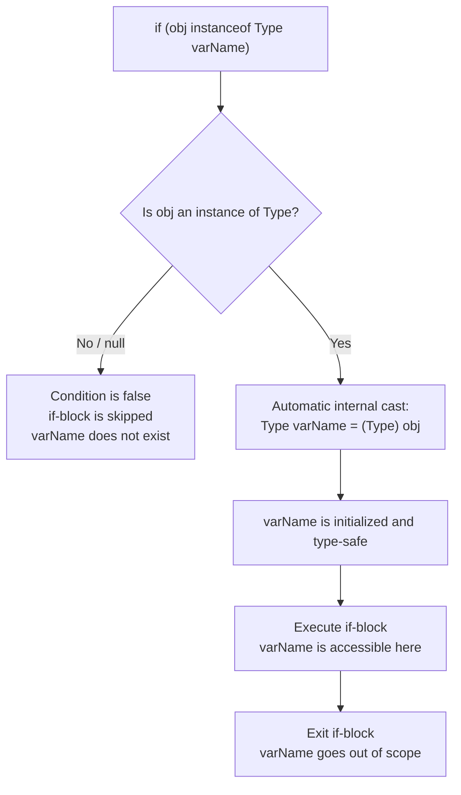
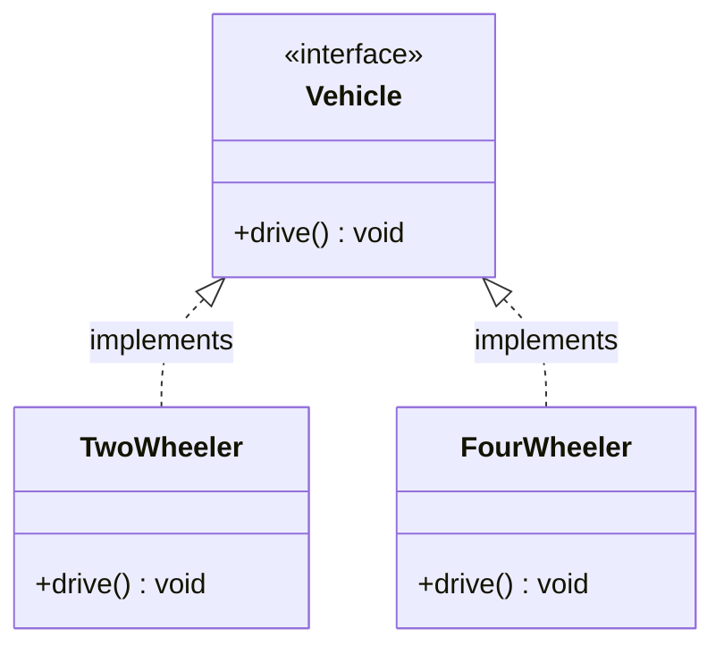
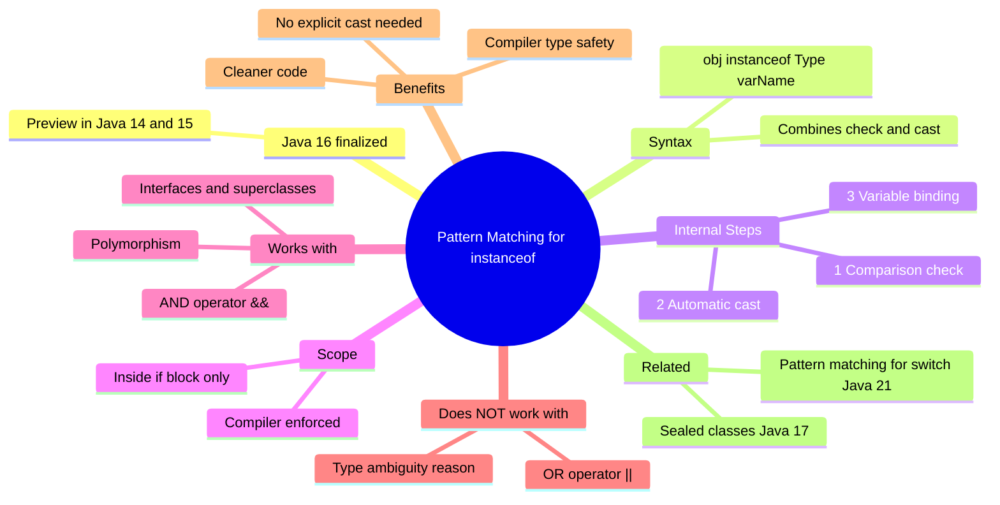

# Java 16 Feature — Pattern Matching for `instanceof`

> **Topics Covered:** Traditional `instanceof` · Pattern Matching syntax · Type safety guarantees · Variable scope · Combining with `&&` · Why `||` does not work · Pattern matching with interfaces and polymorphism · Preview vs finalized versions

---

# 📌 Pattern Matching for `instanceof`

## Overview

Java 16 finalized a powerful enhancement to the `instanceof` operator called **Pattern Matching for `instanceof`**. Before this feature, checking whether an object is of a certain type and then using it as that type required two separate steps: the `instanceof` check and an explicit cast. Pattern Matching collapses both steps into a single concise expression, eliminating boilerplate and reducing the chance of casting errors.

> [!NOTE]
> Pattern Matching for `instanceof` was available as a **preview feature** in Java 14 (JEP 305) and Java 15, and was **finalized (made production-ready) in Java 16** (JEP 394). Pattern Matching for `switch` is a related but separate feature, finalized in Java 21.

---

## Why This Concept Exists

### The Problem With the Old Approach

Before Java 16, whenever you wanted to work with an object as a specific type, you had to:

1. Check if the object is an instance of the desired type using `instanceof`.
2. **Explicitly cast** the object to that type.
3. Assign the result to a new variable.
4. Use the variable.

This is **redundant** — you already checked the type in step 1, yet you have to repeat the information in step 2. It adds noise, and a mismatched cast (if written carelessly) can cause a `ClassCastException`.

### The Solution

Pattern Matching for `instanceof` lets you **combine the check and the cast into a single statement**, making code shorter, safer, and more readable.

---

## Definition

> **Pattern Matching for `instanceof`** is a Java 16 feature that extends the `instanceof` operator. When the condition `object instanceof Type variableName` evaluates to `true`, the JVM automatically casts `object` to `Type` and binds the result to `variableName` — all in one expression. No explicit cast is needed.

---

## Real-World Analogy

Imagine a security guard at a building who checks your ID. In the old way, the guard checks your ID (instanceof check), hands it back, and then you have to re-present it to enter (explicit cast). With pattern matching, the guard checks your ID and immediately lets you in — one step, no redundancy.

---

## Traditional `instanceof` — The Old Way

### How It Was Done Before Java 16

```java
Object obj = "Hello, Java!";

// Step 1: Check type
if (obj instanceof String) {
    // Step 2: Explicit cast (redundant — we already know it's a String)
    String s = (String) obj;
    // Step 3: Use the variable
    System.out.println(s.toUpperCase());
}
```

### The Three-Step Problem

```
1. instanceof check  →  obj instanceof String  (is it a String?)
2. Explicit cast     →  (String) obj            (cast it — repeated info)
3. Assignment        →  String s = ...          (assign to usable variable)
```

All three steps convey the same intent — "treat `obj` as a `String`." This is unnecessary ceremony.

---

## Pattern Matching for `instanceof` — The New Way (Java 16)

### Syntax

```java
if (object instanceof Type variableName) {
    // variableName is automatically cast to Type here
    // use variableName directly
}
```

### Syntax Breakdown

| Element | Explanation |
|---|---|
| `object` | The variable being tested — must be a reference type (not primitive) |
| `instanceof` | The operator — performs the type check |
| `Type` | The target type to check and cast to |
| `variableName` | The **pattern variable** — automatically receives the cast result if the check passes |
| `{ ... }` | The block scope — `variableName` is accessible only within this block |

---

## Internal Working

When the JVM evaluates `object instanceof Type variableName`:

1. **Comparison step:** Is `object` an instance of `Type`? If `false`, the `if` body is skipped. If the object is `null`, the result is always `false`.
2. **Casting step:** The JVM automatically casts `object` to `Type`. This is a **safe cast** — it is guaranteed to succeed because step 1 already confirmed the type.
3. **Binding step:** The result of the cast is assigned to `variableName`.
4. **Usage:** `variableName` is available inside the `if` block as a properly typed variable.

> [!IMPORTANT]
> Steps 2 and 3 happen **automatically and internally**. You write nothing extra. The compiler ensures type safety — there is no risk of a `ClassCastException`.

---

## Code Examples

### Beginner Example — String Check

```java
public class PatternMatchingBasic {
    public static void main(String[] args) {

        Object obj = "Hello, Java 16!";

        // Old way (before Java 16)
        if (obj instanceof String) {
            String s = (String) obj;         // explicit cast
            System.out.println(s.length());
        }

        // New way — Pattern Matching (Java 16)
        if (obj instanceof String s) {       // check + cast + bind in one line
            System.out.println(s.length());  // s is available directly
        }
    }
}
```

#### Output

```
15
15
```

#### Step-by-Step Execution (New Way)

| Step | What Happens |
|---|---|
| 1 | `obj instanceof String` — is `obj` a `String`? Yes. |
| 2 | JVM casts `obj` to `String` internally. |
| 3 | The result is bound to the pattern variable `s`. |
| 4 | Inside the `if` block, `s` is a properly typed `String`. |
| 5 | `s.length()` returns `15`. |

---

### Intermediate Example — Multiple Type Checks (if-else if chain)

```java
public class PatternMatchingMultiType {
    public static void main(String[] args) {

        Object obj = 42; // try with "hello", 42, 3.14

        if (obj instanceof String s) {
            System.out.println("String value: " + s.toUpperCase());
        } else if (obj instanceof Integer i) {
            System.out.println("Integer value: " + i * 2);
        } else if (obj instanceof Double d) {
            System.out.println("Double value: " + d);
        } else {
            System.out.println("Unknown type");
        }
    }
}
```

#### Output (when `obj = 42`)

```
Integer value: 84
```

#### Compiler Type Safety Guarantee

The compiler guarantees that in each branch, the pattern variable is only accessible if the corresponding `instanceof` check is `true`. You cannot accidentally use `s` (the `String` variable) inside the `Integer` branch. Each variable is properly typed and scoped to its own branch.

```
if obj is String  → s is a String  → s.toUpperCase() is safe
if obj is Integer → i is an Integer → i * 2 is safe
if obj is Double  → d is a Double  → d is safe
```

---

### Advanced Example — Combining with `&&` Operator

Pattern variables can be combined with additional conditions using the `&&` (AND) operator in the same `if` statement.

```java
public class PatternMatchingWithAnd {
    public static void main(String[] args) {

        Object obj = 7;

        // Check: is obj an Integer AND is its value less than 10?
        if (obj instanceof Integer i && i < 10) {
            System.out.println(i + " is an Integer less than 10");
        }

        Object name = "Java";

        // Check: is obj a String AND does it start with "J"?
        if (name instanceof String s && s.startsWith("J")) {
            System.out.println(s + " starts with J");
        }
    }
}
```

#### Output

```
7 is an Integer less than 10
Java starts with J
```

#### How `&&` Works With Pattern Variables

```
obj instanceof Integer i   →  Step 1: Is obj an Integer? Yes.
                               Step 2: Cast obj to Integer, bind to i.
&&
i < 10                     →  Step 3: Now i is initialized — safe to use here.
                               Is i < 10? Yes → enter the block.
```

> [!IMPORTANT]
> The `&&` condition **must come after** the pattern match expression, not before. The pattern variable `i` is only initialized after the `instanceof` check passes. Writing `i < 10 && obj instanceof Integer i` would be a **compile error** because `i` hasn't been initialized yet.

```java
// ❌ COMPILE ERROR — i used before it is initialized
if (i < 10 && obj instanceof Integer i) { ... }

// ✅ CORRECT — instanceof check comes first
if (obj instanceof Integer i && i < 10) { ... }
```

---

## Variable Scope

The pattern variable exists **only within the scope where the `instanceof` check guarantees its validity**.

```java
Object obj = "Hello";

if (obj instanceof String s) {
    System.out.println(s); // ✅ s is accessible here
}

// System.out.println(s); // ❌ COMPILE ERROR — s is out of scope here
```

The compiler tracks this precisely. Outside the block where the type is guaranteed, the variable does not exist. This is a **compile-time enforcement** — no runtime surprises.

---

## Why `||` (OR) Does NOT Work With Pattern Matching

This is an important conceptual point. Pattern matching **cannot** be used with the `||` (OR) operator.

### Why Not?

With `&&`, if the `instanceof` check passes, the pattern variable is guaranteed to be of the correct type — the compiler can safely bind it.

With `||`, the logic is different. Consider:

```java
// ❌ This does NOT perform pattern matching — pattern variables i and s are useless here
if (obj instanceof Integer i || obj instanceof String s) {
    // What type is obj here? It could be Integer OR String.
    // The compiler has no guarantee about which one it is.
    // Therefore, neither i nor s can be safely used.
}
```

Inside an `||` block, the object might be either type. The compiler cannot guarantee which pattern variable is bound. As a result, **the compiler treats this as a plain old `instanceof` check** — the pattern variables are declared but cannot be used, making them pointless.

> [!CAUTION]
> Writing `obj instanceof Integer i || obj instanceof String s` will compile (in some Java versions it may warn), but pattern matching **does not activate** — no automatic casting is performed. The pattern variables `i` and `s` are inaccessible inside the block. This is effectively the same as the old `instanceof` with no benefit.

```
AND (&&) → "Both conditions must be true" → type is guaranteed → pattern variable is safe
OR  (||) → "Either condition may be true" → type is ambiguous → pattern variable is NOT safe
```

---

## Flowchart — Pattern Matching Execution



---

## Pattern Matching with Interfaces and Polymorphism

Pattern matching works seamlessly with interfaces and inheritance hierarchies. When you test against a **parent type** (interface or superclass), the JVM performs the cast to the appropriate subtype automatically based on the actual runtime object.

### Code Example — Interface Hierarchy

```java
// Interface definition
interface Vehicle {
    void drive();
}

// Concrete implementations
class TwoWheeler implements Vehicle {
    @Override
    public void drive() {
        System.out.println("Two Wheeler driving!");
    }
}

class FourWheeler implements Vehicle {
    @Override
    public void drive() {
        System.out.println("Four Wheeler driving!");
    }
}

public class PatternMatchingWithInterface {
    public static void main(String[] args) {

        Object obj = new TwoWheeler();

        // Pattern matching against the parent interface
        if (obj instanceof Vehicle v) {
            v.drive(); // Calls the correct overridden implementation
        }

        // Try with FourWheeler
        obj = new FourWheeler();
        if (obj instanceof Vehicle v) {
            v.drive(); // Calls FourWheeler's drive()
        }
    }
}
```

#### Output

```
Two Wheeler driving!
Four Wheeler driving!
```

#### Line-by-Line Explanation

| Line | Explanation |
|---|---|
| `Object obj = new TwoWheeler()` | `obj` holds a `TwoWheeler` instance; declared as `Object` (common in generic APIs) |
| `obj instanceof Vehicle v` | Is `obj` an instance of `Vehicle`? Yes — `TwoWheeler implements Vehicle`. Cast to `Vehicle`, bind to `v`. |
| `v.drive()` | Calls `drive()` on `v`. Since `v`'s runtime type is `TwoWheeler`, its overridden `drive()` executes. |
| Second block | Same logic — now `obj` is `FourWheeler`, so `FourWheeler`'s `drive()` is called. |

### How Polymorphism Works Here

The pattern variable `v` is of declared type `Vehicle`. However, the **runtime type** is either `TwoWheeler` or `FourWheeler`. Because of Java's polymorphism, calling `v.drive()` invokes the correct overridden method at runtime — no manual casting to the subclass is needed.

```
obj = new TwoWheeler()
obj instanceof Vehicle v  →  v is Vehicle (runtime type: TwoWheeler)
v.drive()                 →  JVM dispatches to TwoWheeler.drive()   ← polymorphism
```

---

## Class Diagram — Interface Pattern Matching Example



---

## Comparison — Old vs New

| Aspect | Old `instanceof` (before Java 16) | Pattern Matching (Java 16+) |
|---|---|---|
| Type check | `obj instanceof String` | `obj instanceof String s` |
| Explicit cast needed | Yes — `(String) obj` | No — automatic |
| Assignment needed | Yes — `String s = (String) obj` | No — automatic binding |
| Type safety | Manual (risk of `ClassCastException` if careless) | Compiler-enforced |
| Code lines | 3 steps | 1 step |
| Works with `&&` | N/A | Yes |
| Works with `\|\|` | Yes (plain check, no binding) | No (pattern binding doesn't activate) |
| Scope enforcement | Manual | Compiler-enforced |

---

## Memory and Compiler Behavior

- Pattern matching is a **compile-time feature** backed by the same bytecode as explicit casting.
- The compiler inserts the equivalent of `(Type) object` in the bytecode — there is **no runtime overhead** compared to a manual cast.
- The compiler tracks **definite assignment** of pattern variables — it knows exactly in which code paths the variable is bound, and enforces this statically.
- If the `instanceof` check fails (including when the object is `null`), no cast is attempted and no variable is bound.

---

## Key Observations

- Pattern matching works for **any reference type** — classes, abstract classes, interfaces.
- The pattern variable is **only accessible in the scope where the type is guaranteed** — the compiler enforces this.
- `null` always evaluates to `false` for `instanceof` — no `NullPointerException` risk.
- Pattern matching **combines** with `&&` for additional conditions — the pattern variable must come first.
- Pattern matching **does not combine** with `||` — type cannot be guaranteed in an OR condition.
- Internally, the cast is performed by the JVM — performance is identical to a manual cast.
- Pattern matching works with **polymorphism** — testing against a parent type correctly dispatches to the child's methods.

---

## Common Mistakes

### Mistake 1 — Using Pattern Variable Before Initialization

```java
// ❌ COMPILE ERROR — i used before instanceof check
if (i > 5 && obj instanceof Integer i) {
    System.out.println(i);
}

// ✅ CORRECT
if (obj instanceof Integer i && i > 5) {
    System.out.println(i);
}
```

### Mistake 2 — Accessing Pattern Variable Outside Its Scope

```java
Object obj = "hello";

if (obj instanceof String s) {
    System.out.println(s); // ✅ fine
}

System.out.println(s); // ❌ COMPILE ERROR — s is out of scope
```

### Mistake 3 — Expecting Pattern Matching to Work With `||`

```java
// ❌ Pattern variables i and s are UNUSABLE here — no pattern matching occurs
if (obj instanceof Integer i || obj instanceof String s) {
    // Cannot use i or s — compiler doesn't know which type obj is
    System.out.println(i); // COMPILE ERROR
}

// ✅ Use separate if-else if blocks instead
if (obj instanceof Integer i) {
    System.out.println("Integer: " + i);
} else if (obj instanceof String s) {
    System.out.println("String: " + s);
}
```

### Mistake 4 — Unnecessary Explicit Cast After Pattern Match

```java
if (obj instanceof String s) {
    String t = (String) s; // ❌ Redundant — s is already a String
    System.out.println(t);
}

// ✅ Use s directly
if (obj instanceof String s) {
    System.out.println(s); // s is already a String
}
```

---

## Best Practices

1. **Prefer pattern matching over explicit casts** whenever checking and using the type in the same block.
2. **Use `&&` for additional conditions** — e.g., `obj instanceof Integer i && i > 0`.
3. **Use if-else if chains** for multiple type checks — they are cleaner and more readable than nested ifs.
4. **Test against the most specific type** you need — testing against a parent type works but restricts what methods you can call.
5. **Do not store pattern variables beyond their natural scope** — the compiler prevents this, but architecturally, keep type-specific logic within the relevant branch.

---

## Interview Notes

> **Commonly Asked Interview Questions:**

- *What is pattern matching for `instanceof` and in which Java version was it introduced?* — A Java 16 feature that combines the `instanceof` check with automatic casting and variable binding in a single expression.
- *What problem does pattern matching for `instanceof` solve?* — It eliminates the redundant explicit cast after an `instanceof` check, reducing boilerplate and improving type safety.
- *What is the scope of a pattern variable?* — It exists only within the `if` block (or the logical scope) where the type is guaranteed by the compiler.
- *Why doesn't pattern matching work with `||`?* — Because in an OR condition, the compiler cannot guarantee which type the object is, so it cannot safely bind a typed pattern variable.
- *Does pattern matching work with interfaces?* — Yes. If the object is an instance of the interface, it is bound to the pattern variable as the interface type, and polymorphic dispatch works normally.
- *Is there any runtime overhead with pattern matching?* — No. The compiler generates the same bytecode as an explicit cast. The feature is a compile-time convenience.
- *What happens if the object is `null`?* — `null instanceof AnyType` is always `false`. No binding occurs and no exception is thrown.
- *What is the difference between pattern matching for `instanceof` (Java 16) and pattern matching for `switch` (Java 21)?* — The `instanceof` variant applies to if-else chains; the `switch` variant brings the same concept to `switch` expressions and statements and supports more pattern types.

---

## Related Concepts

- **`instanceof` operator** — the traditional form that pattern matching extends.
- **Explicit casting** — `(Type) obj` — what pattern matching replaces.
- **Pattern Matching for `switch`** — Java 21 feature; extends the same idea to `switch` blocks.
- **Sealed classes** — Java 17 feature; works powerfully with pattern matching (exhaustive type checking).
- **`ClassCastException`** — the runtime error that an incorrect explicit cast throws; pattern matching eliminates this risk.
- **Polymorphism** — pattern matching against parent types leverages Java's dynamic dispatch.

---

## Practice Questions

**Easy**
1. Rewrite this code using pattern matching:
   ```java
   if (obj instanceof Double) {
       Double d = (Double) obj;
       System.out.println(d * 2);
   }
   ```
2. What is the output of `System.out.println(null instanceof String s)`? *(Trick: this doesn't compile — `instanceof` can't be used as an expression that returns a value directly, and null check without an if is invalid here. With an if: the body is skipped.)*
3. Can you use a pattern variable declared in an `if` block outside that block? Why not?

**Medium**
4. Write a method `describe(Object obj)` that prints whether the object is a `String` (and its length), an `Integer` (and whether it's positive or negative), or a `Double` (and its rounded value) — using pattern matching.
5. Explain why `obj instanceof Integer i || obj instanceof String s` is effectively the same as the old `instanceof` without pattern matching.
6. Rewrite the following using pattern matching:
   ```java
   if (shape instanceof Circle) {
       Circle c = (Circle) shape;
       if (c.getRadius() > 10) {
           System.out.println("Large circle");
       }
   }
   ```

**Hard**
7. You have an interface `Shape` with implementations `Circle`, `Rectangle`, and `Triangle`. Write a method `area(Object shape)` using pattern matching that computes the area differently for each shape type.
8. Explain what the compiler does differently in terms of **definite assignment analysis** for pattern variables compared to regular local variables.
9. How does pattern matching for `instanceof` interact with **generics**? Can you write `obj instanceof List<String> s`? What are the limitations?

---

## Summary



| Key Point | Detail |
|---|---|
| Java version | Finalized in **Java 16** |
| What it does | Combines `instanceof` check + cast + variable binding in one line |
| Syntax | `obj instanceof Type varName` |
| Scope | `varName` is accessible only inside the `if` block |
| Works with `&&` | ✅ Yes — place `instanceof` check first |
| Works with `\|\|` | ❌ No — type cannot be guaranteed |
| Works with interfaces | ✅ Yes — polymorphic dispatch works correctly |
| `null` behavior | `instanceof` always returns `false` for `null` |
| Runtime overhead | None — same bytecode as explicit cast |
| Compiler guarantee | Type safety is enforced at compile time |

---

> [!TIP]
> **Quick Rule:** If you write `obj instanceof Type` followed immediately by a cast `(Type) obj`, replace both with `obj instanceof Type variableName` and use `variableName` directly. That's the entire motivation of this feature.

---

*End of Chapter — Java 16: Pattern Matching for `instanceof`*
