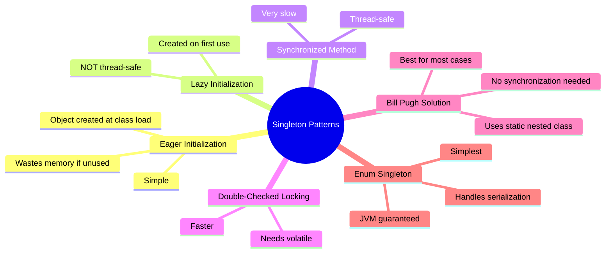
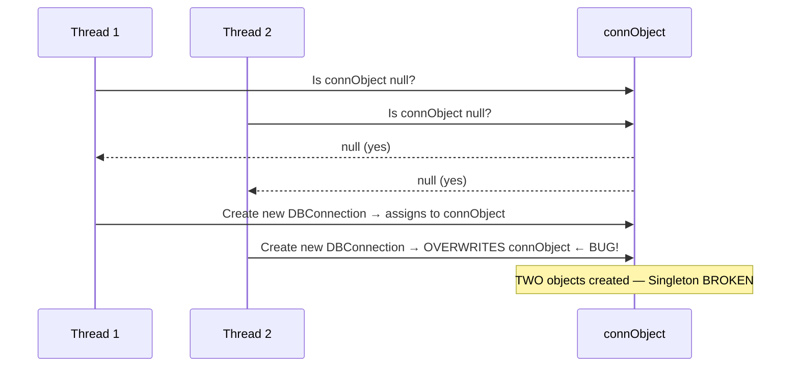
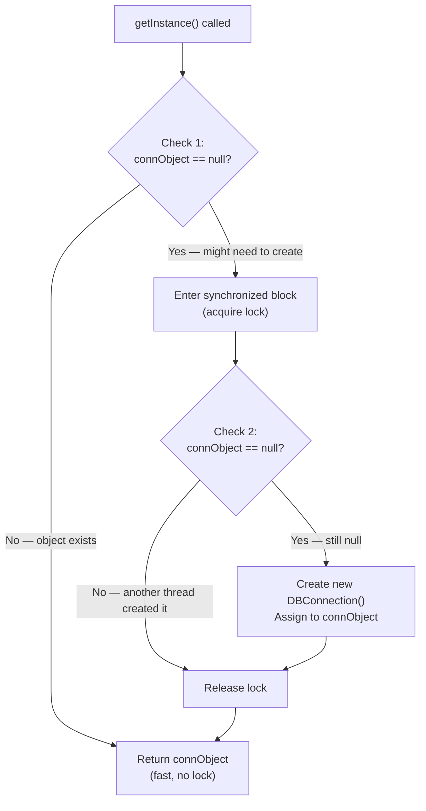
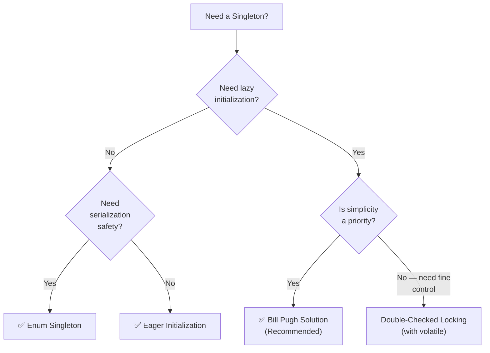
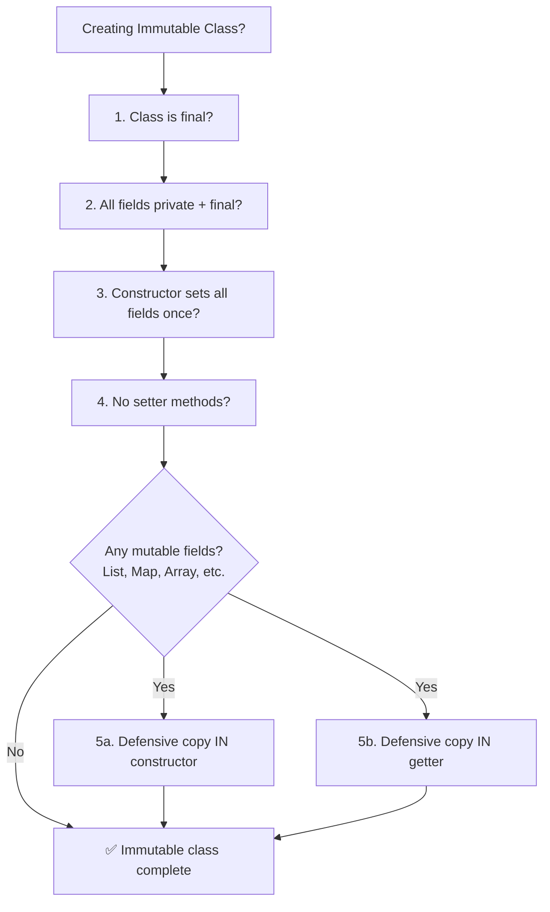

# ☕ Singleton, Immutable & Wrapper Classes — Comprehensive Study Guide
### *Java Basics to Advanced | Lecture — Classes Part 4*

---

> [!NOTE]
> This guide is a complete self-contained study resource covering three critical Java class topics: Singleton Pattern, Immutable Classes, and Wrapper Classes. A student should be able to learn the full topic from this document alone — no video required.

---

## 📚 Table of Contents

1. [Singleton Class](#1-singleton-class)
   - [What is a Singleton?](#11-what-is-a-singleton)
   - [Method 1: Eager Initialization](#12-method-1-eager-initialization)
   - [Method 2: Lazy Initialization](#13-method-2-lazy-initialization)
   - [Method 3: Synchronized Method](#14-method-3-synchronized-method)
   - [Method 4: Double-Checked Locking](#15-method-4-double-checked-locking)
   - [The Memory Issue — Why `volatile` is Required](#16-the-memory-issue--why-volatile-is-required)
   - [Method 5: Bill Pugh Solution (Static Nested Class)](#17-method-5-bill-pugh-solution-static-nested-class)
   - [Method 6: Enum Singleton](#18-method-6-enum-singleton)
   - [Singleton Methods Comparison](#19-singleton-methods-comparison)
2. [Immutable Classes](#2-immutable-classes)
   - [What is an Immutable Class?](#21-what-is-an-immutable-class)
   - [Rules for Creating Immutable Classes](#22-rules-for-creating-immutable-classes)
   - [The Collection Trap — Defensive Copying](#23-the-collection-trap--defensive-copying)
   - [Complete Immutable Class Example](#24-complete-immutable-class-example)
3. [Wrapper Classes](#3-wrapper-classes)
4. [Summary Diagrams](#4-summary-diagrams)
5. [Common Mistakes](#5-common-mistakes)
6. [Best Practices](#6-best-practices)
7. [Interview Notes](#7-interview-notes)
8. [Practice Questions](#8-practice-questions)
9. [Quick Revision Summary](#9-quick-revision-summary)

---

# 1. Singleton Class

## 1.1 What is a Singleton?

### Definition

> A **Singleton class** is a class that allows **only one object (instance) to be created** for its entire lifetime, regardless of how many times or from how many places it is instantiated.

The name says it all — *singleton* = single instance.

---

### Why Does Singleton Exist?

There are many real-world scenarios where creating multiple instances of a class would be wasteful, incorrect, or dangerous. The classic example is a **database connection**:

```
Application
    │
    ├── Class A ──── new DBConnection() ──┐
    ├── Class B ──── new DBConnection() ──┼──► 3 separate connections to DB ← WASTEFUL
    └── Class C ──── new DBConnection() ──┘

With Singleton:
Application
    │
    ├── Class A ──── DBConnection.getInstance() ──┐
    ├── Class B ──── DBConnection.getInstance() ──┼──► ONE shared connection ✅
    └── Class C ──── DBConnection.getInstance() ──┘
```

Setting up a database connection is expensive (network handshake, authentication, resource allocation). You want to do it **once** and reuse that connection everywhere.

---

### Other Real-World Use Cases

| Use Case | Why Singleton? |
|---|---|
| Database connection pool | Expensive to create; share one pool |
| Logger | All parts of app write to same log |
| Configuration manager | One source of truth for app config |
| Thread pool | Shared pool of worker threads |
| Cache | One shared in-memory cache |
| Registry / Service locator | Central registry of services |

---

### The Six Singleton Patterns



---

## 1.2 Method 1: Eager Initialization

### Concept

> **Eager initialization** creates the singleton object **at class loading time** — before anyone has even asked for it.

The word *eager* means "in advance, without waiting."

---

### Implementation

```java
public class DBConnection {

    // Step 1: Create the object eagerly — at class load time
    // private: nobody outside can access this directly
    // static: belongs to the CLASS, not to any object — only ONE copy ever exists
    private static DBConnection connObject = new DBConnection();

    // Step 2: Make constructor private — prevents 'new DBConnection()' from outside
    private DBConnection() {
        System.out.println("DBConnection created");
    }

    // Step 3: Public static method to return the single instance
    // static: can be called via class name without creating an object
    public static DBConnection getInstance() {
        return connObject;
    }
}
```

---

### How to Use It

```java
public class Application {
    public static void main(String[] args) {

        DBConnection conn1 = DBConnection.getInstance();
        DBConnection conn2 = DBConnection.getInstance();
        DBConnection conn3 = DBConnection.getInstance();

        // All three references point to the SAME object
        System.out.println(conn1 == conn2);   // true
        System.out.println(conn2 == conn3);   // true

        // This would be a COMPILE ERROR — constructor is private
        // DBConnection conn4 = new DBConnection();  // ❌
    }
}
```

**Output:**
```
DBConnection created      ← printed only ONCE, at class load time
true
true
```

---

### Three Key Design Decisions Explained

#### Why `private static` for the object?

```java
private static DBConnection connObject = new DBConnection();
```

- `private` → Nobody outside the class can access or reassign `connObject`
- `static` → Belongs to the **class**, not to any instance. No matter how many times `getInstance()` is called, there is only **one** `connObject` — it is a class-level variable

#### Why `private` constructor?

```java
private DBConnection() { }
```

Without a private constructor, anyone could do:
```java
DBConnection c = new DBConnection();   // Creates a SECOND object — breaks singleton!
```

Making the constructor `private` means **only code inside `DBConnection` itself** can call `new DBConnection()`.

#### Why `public static` for `getInstance()`?

```java
public static DBConnection getInstance() { return connObject; }
```

- `public` → Anyone can call it
- `static` → Can be called **without** an object: `DBConnection.getInstance()`. This is essential — if it were non-static, you'd need an object to call it, which defeats the purpose.

---

### Advantages and Disadvantages

| | Detail |
|---|---|
| ✅ **Simple** | Easy to implement and understand |
| ✅ **Thread-safe** | Object is created at class load time — before any thread can use it |
| ❌ **Wastes memory** | Object is created even if the application never uses it |

---

## 1.3 Method 2: Lazy Initialization

### Concept

> **Lazy initialization** delays creating the singleton object until the **first time it is actually needed**.

The word *lazy* means "don't do work until you have to."

---

### Implementation

```java
public class DBConnection {

    // Object NOT created yet — null initially
    private static DBConnection connObject = null;

    private DBConnection() { }

    public static DBConnection getInstance() {
        // Create object ONLY if it doesn't exist yet
        if (connObject == null) {
            connObject = new DBConnection();   // Created on first call only
        }
        return connObject;
    }
}
```

---

### How It Works (Single Thread)

```
First call:  getInstance() → connObject is null → CREATE new object → return it
Second call: getInstance() → connObject is NOT null → return existing object
Third call:  getInstance() → connObject is NOT null → return existing object
```

---

### The Thread-Safety Problem

Lazy initialization has a **critical flaw in multi-threaded environments**:

```
Thread 1:  checks connObject == null → TRUE  (object not yet created)
Thread 2:  checks connObject == null → TRUE  (object not yet created — same time!)
Thread 1:  creates new DBConnection() and assigns to connObject
Thread 2:  also creates new DBConnection() and assigns to connObject  ← SECOND OBJECT!
```

Both threads read `null` simultaneously, both enter the `if` block, and **two objects are created** — breaking the singleton guarantee.



---

### Advantages and Disadvantages

| | Detail |
|---|---|
| ✅ **Memory efficient** | Object created only when needed |
| ❌ **Not thread-safe** | Two threads can create two objects simultaneously |

---

## 1.4 Method 3: Synchronized Method

### Concept

Adding the `synchronized` keyword to `getInstance()` ensures that **only one thread can execute the method at a time**, preventing the race condition.

---

### Implementation

```java
public class DBConnection {

    private static DBConnection connObject = null;

    private DBConnection() { }

    // synchronized: only ONE thread can be inside this method at a time
    public static synchronized DBConnection getInstance() {
        if (connObject == null) {
            connObject = new DBConnection();
        }
        return connObject;
    }
}
```

---

### How Synchronization Works

```
Thread 1 enters getInstance() → acquires LOCK → checks null → creates object → releases LOCK
Thread 2 tries to enter       → BLOCKED (waiting for lock)
Thread 2 gets lock            → checks null → object exists → returns it → releases LOCK
```

The `synchronized` keyword ensures mutual exclusion — only one thread inside at a time.

---

### The Performance Problem

While `synchronized` solves thread safety, it creates a **performance bottleneck**:

```java
// Every single call to getInstance() acquires and releases a lock
// Even when the object is ALREADY created and we just need to return it!

Place 1: getInstance() → LOCK → check null? No → return → UNLOCK  (unnecessary!)
Place 2: getInstance() → LOCK → check null? No → return → UNLOCK  (unnecessary!)
Place 3: getInstance() → LOCK → check null? No → return → UNLOCK  (unnecessary!)
// ... called 1000 times → 1000 lock/unlock operations → VERY SLOW
```

After the object is created, the `null` check always fails and we just return the existing object. There is **no need** for synchronization at this point — yet the lock is acquired every single time.

> [!CAUTION]
> Synchronization at the method level makes `getInstance()` a performance bottleneck. This approach is **not recommended** for production use.

---

### Advantages and Disadvantages

| | Detail |
|---|---|
| ✅ **Thread-safe** | Synchronized prevents concurrent object creation |
| ❌ **Very slow** | Lock/unlock on every call, even after object is created |
| ❌ **Bottleneck** | All threads queue up for the lock |

---

## 1.5 Method 4: Double-Checked Locking

### Concept

> **Double-Checked Locking (DCL)** optimizes the synchronized approach by only acquiring the lock when the object does **not yet exist**. Once created, threads skip the lock entirely.

The name comes from checking the null condition **twice** — once outside the lock, once inside.

---

### Implementation

```java
public class DBConnection {

    // volatile is CRITICAL — explained in detail below
    private static volatile DBConnection connObject = null;

    private DBConnection() { }

    public static DBConnection getInstance() {

        // CHECK 1: If object exists, skip synchronization entirely (fast path)
        if (connObject == null) {

            // Only synchronize when object doesn't exist yet
            synchronized (DBConnection.class) {

                // CHECK 2: Re-check inside lock (another thread may have created it)
                if (connObject == null) {
                    connObject = new DBConnection();
                }
            }
        }
        return connObject;
    }
}
```

---

### Why Two Checks?

#### Check 1 (outside lock): Performance Gate
```
If object already exists → skip the lock entirely → just return it
```
This is the "fast path" — once the object is created, the vast majority of calls never enter the `synchronized` block.

#### Check 2 (inside lock): Safety Gate
```
Thread 1: passes Check 1 (null), waits for lock
Thread 2: passes Check 1 (null), gets lock, creates object, releases lock
Thread 1: gets lock now — checks again (Check 2) → object exists! → does NOT create another
```

Without Check 2, two threads could both pass Check 1 simultaneously and both create objects. The inner check prevents this.

---

### Execution Flow



---

### Performance Comparison

```
Synchronized Method:
  Every call:  LOCK → check → return → UNLOCK   (1000 calls = 1000 locks)

Double-Checked Locking (after object created):
  Every call:  check → return                    (1000 calls = 0 locks) ✅
```

---

## 1.6 The Memory Issue — Why `volatile` is Required

### Background: CPU Caches (L1 Cache)

Modern CPUs have **multiple cores**, each with their own **L1 cache** (a small, ultra-fast memory buffer). For performance, each core reads/writes data from its own cache rather than from main memory (RAM). Periodically, caches are synchronized with main memory.

```
┌─────────────────────────────────────────────┐
│                    CPU                      │
│  ┌──────────────┐    ┌──────────────┐       │
│  │    Core 1    │    │    Core 2    │       │
│  │  ┌────────┐  │    │  ┌────────┐  │       │
│  │  │L1 Cache│  │    │  │L1 Cache│  │       │
│  │  └────────┘  │    │  └────────┘  │       │
│  └──────────────┘    └──────────────┘       │
│              ↕ (periodic sync) ↕             │
│         ┌─────────────────────┐             │
│         │     Main Memory     │             │
│         │   (RAM / Heap)      │             │
│         └─────────────────────┘             │
└─────────────────────────────────────────────┘
```

### Problem 1: Visibility (Cache Not Synced)

```
Thread 1 runs on Core 1:
  - Acquires lock
  - Creates new DBConnection()
  - Assigns connObject = new DBConnection()
  - Stores result in Core 1's L1 CACHE (not yet synced to main memory)
  - Releases lock

Thread 2 runs on Core 2:
  - Checks connObject == null
  - Reads from main memory (or Core 2's cache)
  - Main memory is NOT yet updated (Core 1 hasn't synced)
  - Sees connObject == null  ← STALE VALUE
  - Creates ANOTHER object!   ← BUG: two objects exist
```

The cache sync between cores is **not instantaneous**. Thread 2 reads a stale `null` from memory before Core 1's cache has been flushed.

### Problem 2: Instruction Reordering

The JVM and CPU are allowed to **reorder instructions** for performance, as long as the result appears the same in a single-threaded context. But this can break multi-threaded assumptions.

The line `connObject = new DBConnection()` is not atomic — it compiles to roughly:
1. Allocate memory for a `DBConnection` object
2. Call constructor to initialize the object
3. Assign the memory address to `connObject`

The JVM may reorder steps 2 and 3:
1. Allocate memory
2. **Assign memory address to `connObject`** ← reordered!
3. Call constructor

Now another thread could see `connObject != null` (step 2 done) but the object is **not yet fully initialized** (step 3 not done). Accessing this half-initialized object causes unpredictable behavior.

---

### Solution: `volatile`

> The `volatile` keyword guarantees two things:
> 1. **Visibility** — all reads and writes to the variable go **directly to/from main memory**, bypassing the CPU cache
> 2. **Ordering** — prevents instruction reordering around the volatile write

```java
private static volatile DBConnection connObject = null;
//               ↑ volatile
```

With `volatile`:
- When Thread 1 writes to `connObject`, it writes **directly to main memory** (not just L1 cache)
- When Thread 2 reads `connObject`, it reads **directly from main memory** (not from its own stale cache)
- The constructor is guaranteed to complete **before** the reference is written to `connObject`

```
Without volatile:
  Thread 1 writes connObject → L1 Cache (not yet in main memory) → Thread 2 reads null from memory → BUG

With volatile:
  Thread 1 writes connObject → directly to main memory → Thread 2 reads correct value → ✅
```

> [!IMPORTANT]
> Double-Checked Locking **without `volatile` is broken** in Java's memory model. Always use `volatile` with DCL. Most interviews will specifically ask about this.

---

### Advantages and Disadvantages of DCL

| | Detail |
|---|---|
| ✅ **Thread-safe** | Double check + synchronization prevents race conditions |
| ✅ **Faster than synchronized method** | Lock only acquired during creation, not on every call |
| ❌ **Complex** | Easy to implement incorrectly (forgetting `volatile`) |
| ❌ **Still uses lock** | `synchronized` and `volatile` still have some overhead |

---

## 1.7 Method 5: Bill Pugh Solution (Static Nested Class)

### Concept

> The **Bill Pugh Solution** cleverly uses a **private static nested class** to hold the singleton instance. The nested class is loaded **only when it is first referenced** — providing lazy initialization without any synchronization.

This exploits a fundamental property of Java class loading:

> **A nested class is not loaded into memory when the outer class is loaded. It is loaded only when it is first accessed/used.**

---

### Implementation

```java
public class DBConnection {

    // Constructor private — prevents external instantiation
    private DBConnection() { }

    // Private static nested class — holds the singleton instance
    // This class is NOT loaded until getInstance() is first called
    private static class DBConnectionHelper {
        // Eager initialization inside the nested class
        // But since the class is loaded lazily, this is effectively lazy too
        private static final DBConnection INSTANCE = new DBConnection();
    }

    // When this method is called for the FIRST TIME:
    //   → JVM loads DBConnectionHelper
    //   → DBConnectionHelper's static field is initialized (object created)
    //   → INSTANCE is returned
    // Subsequent calls:
    //   → DBConnectionHelper is already loaded → INSTANCE already exists → return it
    public static DBConnection getInstance() {
        return DBConnectionHelper.INSTANCE;
    }
}
```

---

### How It Solves Eager Initialization's Problem

```
Application starts:
  → DBConnection class is loaded
  → DBConnectionHelper is NOT loaded yet (nested class — deferred)
  → No object created yet ✅ (lazy)

First call to DBConnection.getInstance():
  → JVM references DBConnectionHelper.INSTANCE
  → JVM loads DBConnectionHelper for the first time
  → Static field INSTANCE = new DBConnection() is executed → object created
  → INSTANCE returned

All subsequent calls:
  → DBConnectionHelper already loaded
  → INSTANCE already initialized
  → Simply returned (no lock, no check, no overhead)
```

---

### Why Is It Thread-Safe Without Synchronization?

Java's **class loading mechanism is inherently thread-safe**. The JVM guarantees that a class's static initializers are executed **exactly once**, even in a multi-threaded environment. So `private static final DBConnection INSTANCE = new DBConnection()` is guaranteed to run only once — no `synchronized` needed.

---

### Advantages

| | Detail |
|---|---|
| ✅ **Lazy** | Object created only when first needed |
| ✅ **Thread-safe** | JVM class loading is inherently thread-safe |
| ✅ **Fast** | No synchronization overhead after object creation |
| ✅ **No `volatile`** | No memory visibility issues |
| ✅ **Simple** | Clean, readable code |

> [!TIP]
> The **Bill Pugh Solution is the recommended approach** for most singleton implementations in Java. It is lazy, thread-safe, and performs well.

---

## 1.8 Method 6: Enum Singleton

### Concept

> Java `enum` types are **singleton by design**. The JVM guarantees that each enum constant is instantiated **exactly once per JVM**.

This is the simplest singleton implementation — and the most robust.

---

### Implementation

```java
public enum DBConnection {
    INSTANCE;   // This is the singleton instance

    // Add your connection methods here
    public void connect() {
        System.out.println("Connecting to DB...");
    }

    public void query(String sql) {
        System.out.println("Executing: " + sql);
    }
}
```

---

### How to Use It

```java
public class Application {
    public static void main(String[] args) {

        DBConnection conn1 = DBConnection.INSTANCE;
        DBConnection conn2 = DBConnection.INSTANCE;

        System.out.println(conn1 == conn2);   // true — same object

        conn1.connect();
        conn1.query("SELECT * FROM users");
    }
}
```

---

### Why Enum Works as Singleton

Java enums come with built-in guarantees:

1. **Enum constructors are always `private`** — you cannot call `new` on an enum from outside
2. **Each enum constant is instantiated exactly once per JVM** — this is guaranteed by the JVM specification
3. **Enum instances are created eagerly** at class load time

In just two lines, enum gives you what the other approaches need 20+ lines to implement.

---

### Enum Singleton vs. Other Methods

| Feature | Enum Singleton | Bill Pugh | DCL |
|---|---|---|---|
| Thread-safe | ✅ JVM guaranteed | ✅ Class loading | ✅ With `volatile` |
| Lazy | ❌ Eager | ✅ Yes | ✅ Yes |
| Serialization-safe | ✅ Yes | ❌ Needs extra code | ❌ Needs extra code |
| Reflection-safe | ✅ Yes | ❌ Can be broken | ❌ Can be broken |
| Code simplicity | ✅ 2 lines | ✅ Simple | ❌ Complex |

> [!NOTE]
> **Serialization safety** is an important bonus of Enum singletons. With other approaches, deserializing a serialized singleton creates a new object (breaking singleton). Enums handle this automatically. Similarly, **reflection** can break other singleton implementations by forcefully making the private constructor accessible — enums prevent this.

---

## 1.9 Singleton Methods Comparison

| Method | Lazy? | Thread-Safe? | Performance | Complexity | Recommended? |
|---|---|---|---|---|---|
| Eager Initialization | ❌ | ✅ | Fast | Low | ⚠️ Wastes memory |
| Lazy Initialization | ✅ | ❌ | Fast | Low | ❌ Not thread-safe |
| Synchronized Method | ✅ | ✅ | Very slow | Low | ❌ Performance issue |
| Double-Checked Locking | ✅ | ✅ (with `volatile`) | Good | High | ⚠️ Complex |
| Bill Pugh Solution | ✅ | ✅ | Excellent | Medium | ✅ **Recommended** |
| Enum Singleton | ❌ | ✅ | Fast | Very Low | ✅ **Recommended** |

---

# 2. Immutable Classes

## 2.1 What is an Immutable Class?

### Definition

> An **immutable class** is a class whose **objects cannot be changed after they are created**. Once an object is constructed and its state is set, that state remains fixed for the lifetime of the object.

You have already encountered immutability: **`String` in Java is immutable**. When you do:

```java
String s = "hello";
s = s + " world";   // Does NOT modify "hello" — creates a NEW String object
```

The original `"hello"` object is never changed. A brand new `"hello world"` object is created.

---

### Real-World Analogy

> Think of an immutable object like a **sealed, printed book**. Once printed, you cannot change the words inside. If you want a different version, you must print a completely new book.

---

### Benefits of Immutability

| Benefit | Explanation |
|---|---|
| **Thread safety** | Immutable objects can be shared across threads without synchronization — they cannot be corrupted |
| **Simplicity** | No need to track state changes; easier to reason about |
| **Safe sharing** | Can freely share references without defensive copying by the caller |
| **Cache-friendly** | Values can be cached and reused safely (e.g., String Pool) |
| **Good for keys** | Immutable objects make excellent HashMap keys (hash never changes) |

---

## 2.2 Rules for Creating Immutable Classes

There are **five essential rules**:

---

### Rule 1: Declare the Class as `final`

```java
public final class ImmutablePerson {
    // ...
}
```

**Why?** If the class is not `final`, a subclass could extend it and add mutable state or override methods, breaking immutability:

```java
// Without final — this is POSSIBLE and DANGEROUS:
public class MutablePerson extends ImmutablePerson {
    public void setName(String name) { this.name = name; }  // breaks immutability!
}
```

Making the class `final` prevents subclassing entirely.

---

### Rule 2: Make All Fields `private` and `final`

```java
public final class ImmutablePerson {
    private final String name;       // private: no direct external access
    private final List<String> pets; // final: reference cannot be reassigned
}
```

- `private` → No external code can directly read or write the field
- `final` → The field can only be assigned **once** (in the constructor); it cannot be reassigned later

---

### Rule 3: Initialize All Fields via Constructor Only

```java
public final class ImmutablePerson {
    private final String name;
    private final List<String> pets;

    public ImmutablePerson(String name, List<String> pets) {
        this.name = name;
        this.pets = new ArrayList<>(pets);   // defensive copy (explained below)
    }
}
```

Fields are set once in the constructor and never again. This is the **only** moment state is assigned.

---

### Rule 4: No Setter Methods

```java
// ✅ Only getters — no setters
public String getName() { return name; }

// ❌ NO setters allowed
// public void setName(String name) { this.name = name; }  ← FORBIDDEN
```

Without setters, there is no public API for changing the object's state.

---

### Rule 5: Return Defensive Copies from Getters (for Mutable Fields)

This is the most subtle and commonly missed rule. It applies specifically to **mutable fields** like `List`, `Map`, `Set`, arrays, and other objects.

This is explained in full detail in the next section.

---

## 2.3 The Collection Trap — Defensive Copying

### The Problem

Consider this field:

```java
private final List<String> pets;
```

The `final` keyword means: **this reference (`pets`) will always point to the same List object**. It does NOT mean the list's contents cannot change.

```
pets (reference) ─────────► [List Object: "SJ", "PJ"]
    ↑
    final: cannot point to a different list object
    
    But the List object's CONTENTS can still change:
    pets.add("Kiwi")   → [List Object: "SJ", "PJ", "Kiwi"]  ← MUTABLE!
```

So if your getter returns the actual list:

```java
// DANGEROUS getter — returns the actual internal list
public List<String> getPets() {
    return pets;   // ← returning the REAL list
}
```

An external caller can do:

```java
ImmutablePerson person = new ImmutablePerson("Alice", Arrays.asList("SJ", "PJ"));

List<String> petList = person.getPets();   // gets the REAL internal list
petList.add("Hallo");                       // MUTATES the internal list!

System.out.println(person.getPets());      // ["SJ", "PJ", "Hallo"] ← state changed!
```

Immutability is broken even though `pets` is `final`.

---

### The Solution: Defensive Copy

Return a **copy** of the internal collection, not the collection itself:

```java
// SAFE getter — returns a COPY of the internal list
public List<String> getPets() {
    return new ArrayList<>(pets);   // defensive copy
}
```

Now the caller gets their own independent copy. Any changes they make affect only their copy, not the internal state:

```java
ImmutablePerson person = new ImmutablePerson("Alice", Arrays.asList("SJ", "PJ"));

List<String> petList = person.getPets();   // gets a COPY
petList.add("Hallo");                       // modifies the COPY — not the original

System.out.println(person.getPets());      // ["SJ", "PJ"] ← UNCHANGED ✅
```

---

### Defensive Copy — Memory Visualization

```
After construction:
  person.pets ──────────────► [List: "SJ", "PJ"]   ← internal list

After person.getPets() call:
  person.pets ──────────────► [List: "SJ", "PJ"]   ← internal list (unchanged)
  returned copy ────────────► [List: "SJ", "PJ"]   ← NEW independent copy

After caller does copy.add("Hallo"):
  person.pets ──────────────► [List: "SJ", "PJ"]         ← STILL unchanged ✅
  returned copy ────────────► [List: "SJ", "PJ", "Hallo"] ← only copy is modified
  (copy has no references → eligible for GC after caller is done)
```

---

### Defensive Copy in Constructor Too

You must also defensively copy mutable objects **in the constructor**. Otherwise:

```java
// DANGEROUS constructor
public ImmutablePerson(String name, List<String> pets) {
    this.name = name;
    this.pets = pets;   // ← storing the CALLER'S list directly
}
```

The caller could do:

```java
List<String> myList = new ArrayList<>(Arrays.asList("SJ", "PJ"));
ImmutablePerson person = new ImmutablePerson("Alice", myList);

myList.add("Hallo");   // caller modifies their list
// person.pets is the SAME list — now contains "Hallo"! State changed!
```

**Fix — defensive copy in constructor:**

```java
public ImmutablePerson(String name, List<String> pets) {
    this.name = name;
    this.pets = new ArrayList<>(pets);   // store a COPY, not the original
}
```

Now even if the caller modifies their original list after construction, `person.pets` is unaffected.

---

## 2.4 Complete Immutable Class Example

```java
import java.util.ArrayList;
import java.util.List;

// Rule 1: Class declared final
public final class ImmutablePerson {

    // Rule 2: All fields private and final
    private final String name;
    private final List<String> petNames;

    // Rule 3: Fields initialized only in constructor
    public ImmutablePerson(String name, List<String> petNames) {
        this.name = name;
        // Defensive copy in constructor — protects against caller mutation
        this.petNames = new ArrayList<>(petNames);
    }

    // Rule 4: Only getters — NO setters
    public String getName() {
        return name;   // String is immutable — safe to return directly
    }

    // Rule 5: Return defensive copy for mutable fields
    public List<String> getPetNames() {
        return new ArrayList<>(petNames);   // defensive copy
    }

    @Override
    public String toString() {
        return "ImmutablePerson{name='" + name + "', pets=" + petNames + "}";
    }
}
```

---

### Usage Demonstration

```java
import java.util.Arrays;
import java.util.List;

public class Main {
    public static void main(String[] args) {

        List<String> pets = new ArrayList<>(Arrays.asList("SJ", "PJ"));
        ImmutablePerson person = new ImmutablePerson("Alice", pets);

        System.out.println(person);   // ImmutablePerson{name='Alice', pets=[SJ, PJ]}

        // Try 1: Modify the original list passed to constructor
        pets.add("Extra");   // modifying caller's original list
        System.out.println(person);   // STILL: ImmutablePerson{name='Alice', pets=[SJ, PJ]} ✅

        // Try 2: Modify the list returned by getter
        List<String> returned = person.getPetNames();
        returned.add("Hallo");   // modifying the COPY
        System.out.println(person);   // STILL: ImmutablePerson{name='Alice', pets=[SJ, PJ]} ✅

        // Try 3: Change the name — no setter exists
        // person.setName("Bob");   // ❌ COMPILE ERROR: no setName method

        // Try 4: Access field directly — private
        // person.name = "Bob";     // ❌ COMPILE ERROR: name has private access

        // Try 5: Subclass and override — class is final
        // class SubPerson extends ImmutablePerson { }  // ❌ COMPILE ERROR: cannot extend final class
    }
}
```

**Output:**
```
ImmutablePerson{name='Alice', pets=[SJ, PJ]}
ImmutablePerson{name='Alice', pets=[SJ, PJ]}
ImmutablePerson{name='Alice', pets=[SJ, PJ]}
```

State never changed. ✅

---

### Well-Known Immutable Classes in Java

| Class | Package |
|---|---|
| `String` | `java.lang` |
| `Integer`, `Long`, `Double`, etc. | `java.lang` |
| `BigDecimal`, `BigInteger` | `java.math` |
| `LocalDate`, `LocalTime`, `LocalDateTime` | `java.time` |
| `Optional<T>` | `java.util` |

---

# 3. Wrapper Classes

## Overview

> **Wrapper classes** provide an **object representation for each of Java's eight primitive data types**.

Every primitive type has a corresponding wrapper class in `java.lang`:

| Primitive | Wrapper Class |
|---|---|
| `byte` | `Byte` |
| `short` | `Short` |
| `int` | `Integer` |
| `long` | `Long` |
| `float` | `Float` |
| `double` | `Double` |
| `char` | `Character` |
| `boolean` | `Boolean` |

---

## Why Do Wrapper Classes Exist?

Java's Collections Framework (e.g., `ArrayList`, `HashMap`) can only work with **objects**, not primitives. Wrapper classes allow primitives to be used as objects:

```java
// This does NOT compile — ArrayList needs objects, not primitives
// ArrayList<int> list = new ArrayList<>();  // ❌

// This works — Integer is an object
ArrayList<Integer> list = new ArrayList<>();  // ✅
list.add(42);   // autoboxing: 42 (int) → Integer(42)
```

---

## Autoboxing and Unboxing

> **Autoboxing** is the automatic conversion of a **primitive to its wrapper class** by the Java compiler.  
> **Unboxing** is the automatic conversion of a **wrapper class back to its primitive**.

```java
// Autoboxing — int → Integer (automatic, done by compiler)
int primitive = 42;
Integer wrapped = primitive;   // compiler inserts: Integer.valueOf(42)

// Unboxing — Integer → int (automatic)
Integer wrapped2 = Integer.valueOf(100);
int primitive2 = wrapped2;     // compiler inserts: wrapped2.intValue()
```

---

## Useful Methods in Wrapper Classes

```java
// Parsing strings to primitives
int x = Integer.parseInt("123");       // → 123
double d = Double.parseDouble("3.14"); // → 3.14

// Converting to different bases
String binary = Integer.toBinaryString(10);  // → "1010"
String hex = Integer.toHexString(255);       // → "ff"
String octal = Integer.toOctalString(8);     // → "10"

// Max and Min values
System.out.println(Integer.MAX_VALUE);  // → 2147483647
System.out.println(Integer.MIN_VALUE);  // → -2147483648

// Comparing
int result = Integer.compare(5, 10);   // → negative (5 < 10)
```

---

## Integer Caching — Important Gotcha

Java caches `Integer` objects for values between **-128 and 127** (inclusive):

```java
Integer a = 127;
Integer b = 127;
System.out.println(a == b);   // true  ← same cached object

Integer c = 128;
Integer d = 128;
System.out.println(c == d);   // false ← different objects (outside cache range)
System.out.println(c.equals(d)); // true ← same value
```

> [!WARNING]
> Always use `.equals()` to compare `Integer` values, never `==`. The `==` operator compares object references, not values — and the Integer cache makes this unpredictable.

---

> [!NOTE]
> Wrapper classes are covered in greater depth in the **Java Variables Part 2** lecture (Video 6) in this series, which covers reference/non-primitive data types, autoboxing, unboxing, and the Integer cache in full detail. Refer to that guide for the complete treatment.

---

# 4. Summary Diagrams

## Singleton Pattern Decision Flow



## Immutable Class Checklist



---

# 5. Common Mistakes

## Singleton Mistakes

### Mistake 1: Forgetting `volatile` in Double-Checked Locking

```java
// ❌ WRONG — missing volatile
private static DBConnection connObject = null;

// ✅ CORRECT
private static volatile DBConnection connObject = null;
```

Without `volatile`, the double-checked locking pattern is broken due to CPU caching and instruction reordering.

---

### Mistake 2: Public Constructor in Singleton

```java
// ❌ WRONG — public constructor breaks singleton
public class DBConnection {
    public DBConnection() { }   // anyone can call new DBConnection()!
}

// ✅ CORRECT
public class DBConnection {
    private DBConnection() { }   // only this class can instantiate
}
```

---

### Mistake 3: Non-Static `getInstance()` Method

```java
// ❌ WRONG — how would you call it without an object?
public DBConnection getInstance() { return connObject; }

// ✅ CORRECT
public static DBConnection getInstance() { return connObject; }
```

---

## Immutable Class Mistakes

### Mistake 4: Missing `final` on Class

```java
// ❌ WRONG — subclass can break immutability
public class ImmutablePerson {
    // ...
}

// ✅ CORRECT
public final class ImmutablePerson {
    // ...
}
```

---

### Mistake 5: Returning the Actual Mutable Collection from Getter

```java
// ❌ WRONG — caller can modify internal list
public List<String> getPetNames() {
    return petNames;   // returns actual internal list
}

// ✅ CORRECT — returns a defensive copy
public List<String> getPetNames() {
    return new ArrayList<>(petNames);
}
```

---

### Mistake 6: Not Defensively Copying in Constructor

```java
// ❌ WRONG — caller can modify the list after construction
public ImmutablePerson(String name, List<String> pets) {
    this.name = name;
    this.pets = pets;   // storing the caller's reference
}

// ✅ CORRECT
public ImmutablePerson(String name, List<String> pets) {
    this.name = name;
    this.pets = new ArrayList<>(pets);   // store a copy
}
```

---

### Mistake 7: Thinking `final` on a Collection Means Its Contents Are Immutable

```java
private final List<String> pets = new ArrayList<>();

pets = new ArrayList<>();   // ❌ COMPILE ERROR — cannot reassign a final reference
pets.add("NewPet");         // ✅ ALLOWED — final only locks the reference, not the contents!
```

> [!WARNING]
> `final` on a collection means the **reference** is fixed, not the **contents**. You can still `add()`, `remove()`, and `set()` items. This is why defensive copying is essential.

---

# 6. Best Practices

## Singleton

1. **Prefer Bill Pugh or Enum** for new code — they are the cleanest, safest implementations.
2. **Always use `volatile`** with Double-Checked Locking — omitting it is a production bug.
3. **Never make the constructor public** — that would allow bypassing `getInstance()`.
4. **Be careful with serialization** — if your singleton implements `Serializable`, add `readResolve()` to prevent deserialization from creating a second instance (or use Enum which handles this automatically).
5. **Consider dependency injection** — in modern Spring/CDI applications, the framework manages singleton beans; hand-rolling singleton is less common.

## Immutable Classes

1. **Always declare immutable classes `final`** — prevents subclassing attacks.
2. **Defensively copy mutable inputs in the constructor** — protect against caller mutation after construction.
3. **Defensively copy mutable outputs in getters** — protect internal state from external modification.
4. **`String` is safe to return directly** — it is already immutable; no defensive copy needed.
5. **For deep immutability** (nested mutable objects), recursively copy or use immutable wrappers (e.g., `Collections.unmodifiableList()`).
6. **Prefer immutability by default** — immutable objects are inherently thread-safe and easier to test.

---

# 7. Interview Notes

## Commonly Asked Questions

### Q1: What is a Singleton class and why is it used?
**Answer:** A Singleton class ensures that **only one object** of that class exists throughout the application's lifetime. Used for expensive shared resources like database connections, logging, configuration managers, and caches.

---

### Q2: What are the different ways to implement a Singleton?
**Answer:** Eager Initialization, Lazy Initialization, Synchronized Method, Double-Checked Locking (with `volatile`), Bill Pugh Solution (static nested class), and Enum Singleton.

---

### Q3: Why is `volatile` necessary in Double-Checked Locking?
**Answer:** Without `volatile`, two issues arise:
1. **Visibility** — a thread may read a stale `null` from its CPU cache even after another thread has already created the object and written it to main memory.
2. **Reordering** — the JVM can reorder `connObject = new DBConnection()` such that the reference is assigned before the constructor completes, causing another thread to see a partially constructed object.

`volatile` forces all reads/writes to go directly to main memory (bypassing cache) and prevents reordering.

---

### Q4: Which Singleton implementation is the best?
**Answer:** **Bill Pugh Solution** (static nested class) for most cases — lazy, thread-safe, no synchronization overhead. **Enum Singleton** if you also need serialization safety and protection against reflection attacks.

---

### Q5: What is the difference between Eager and Lazy Initialization?
**Answer:** Eager creates the object when the class is loaded (even if never used — wastes memory). Lazy creates the object only on the first call to `getInstance()` (memory-efficient, but not thread-safe without additional measures).

---

### Q6: What is an Immutable class? Name some examples.
**Answer:** A class whose state cannot be changed after object creation. Examples: `String`, `Integer`, `BigDecimal`, `LocalDate`.

---

### Q7: How do you create an Immutable class?
**Answer:** Five rules:
1. Declare the class `final` (no subclassing)
2. All fields `private` and `final`
3. Initialize fields only in the constructor
4. No setter methods
5. Return defensive copies from getters for mutable fields

---

### Q8: Why is `String` immutable in Java?
**Answer:** Security (can't be modified after use), String Pool efficiency (safe sharing), thread safety, and suitability as HashMap keys (hash code never changes).

---

### Q9: Does `final` on a List mean its contents can't change?
**Answer:** No. `final` on a collection means the **reference** cannot be reassigned to a different list object. The contents (elements) of the list can still be added, removed, or modified. This is why defensive copying is necessary in immutable classes.

---

### Q10: What is autoboxing and unboxing?
**Answer:** **Autoboxing** is the automatic compiler-inserted conversion of a primitive (e.g., `int`) to its wrapper class (`Integer`). **Unboxing** is the reverse — wrapper class to primitive. Introduced in Java 5.

---

# 8. Practice Questions

## Easy

1. What is the purpose of making a constructor `private` in a Singleton class?
2. What does the `static` keyword mean when applied to the singleton instance field?
3. Name two real-world scenarios where a Singleton is appropriate.
4. List the five rules for creating an immutable class.
5. What is the difference between `String s = "hello"` and `String s = new String("hello")` in terms of immutability?
6. What are the eight primitive types and their corresponding wrapper classes?

## Medium

7. Implement a thread-safe Singleton using the Synchronized Method approach. Then explain its performance drawback.
8. Implement the Bill Pugh Singleton. Explain why it is lazy without using `synchronized`.
9. Why does `final` on a `List` field not guarantee immutability of the list's contents? Provide a code example demonstrating the problem and the fix.
10. Write a complete immutable class `Person` with a `String name` and `List<String> hobbies`. Demonstrate with code that its state cannot be changed from outside.
11. Explain the two memory issues (visibility and reordering) that make Double-Checked Locking without `volatile` incorrect.
12. What is the difference between `==` and `.equals()` for `Integer` objects? When does the Integer cache affect `==` comparisons?

## Hard

13. Implement all six Singleton patterns from memory. For each, state one advantage and one disadvantage.
14. A colleague implements Double-Checked Locking but forgets `volatile`. Write a scenario (with thread timeline) showing exactly how two objects can be created due to CPU caching.
15. A Singleton class implements `Serializable`. What problem arises during deserialization, and how do you fix it without using Enum?
16. Could reflection be used to break a Singleton? Show how, and explain why Enum Singleton is immune.
17. Design an immutable `ImmutableMatrix` class that wraps a 2D `int[][]` array. What special considerations does a 2D array require compared to a simple `List`?
18. Compare Enum Singleton vs. Bill Pugh Solution on: laziness, serialization safety, reflection safety, code simplicity, and thread safety.

---

# 9. Quick Revision Summary

```
☕ SINGLETON, IMMUTABLE & WRAPPER — KEY POINTS

🔒 SINGLETON CLASS:
   Purpose: Only ONE object per application/JVM
   Use cases: DB connection, Logger, Config, Cache

   6 Patterns:
   1. Eager     → create at class load | simple | wastes memory if unused
   2. Lazy      → create on first use  | simple | NOT thread-safe
   3. Synchronized → thread-safe | very slow (lock on every call)
   4. DCL       → fast + thread-safe | needs volatile | complex
   5. Bill Pugh → BEST: lazy + thread-safe + no lock | static nested class
   6. Enum      → SIMPLEST: JVM-guaranteed | serialization-safe

   DCL Template:
   private static volatile MyClass instance = null;
   public static MyClass getInstance() {
     if (instance == null) {             // Check 1 (no lock)
       synchronized(MyClass.class) {
         if (instance == null) {         // Check 2 (with lock)
           instance = new MyClass();
         }
       }
     }
     return instance;
   }

   volatile → bypasses CPU cache; reads/writes go to main memory
            → prevents instruction reordering
            → REQUIRED for correct DCL

🔐 IMMUTABLE CLASS:
   Purpose: Object state cannot change after construction

   5 Rules:
   1. Class is final             (no subclassing)
   2. Fields are private + final (no external access, no reassignment)
   3. Set fields in constructor  (only once)
   4. No setter methods          (no way to change state)
   5. Defensive copy for mutable fields (List, Map, arrays, etc.)

   KEY TRAP: final List ≠ immutable list contents!
     → Always return new ArrayList<>(internalList) from getters
     → Always store new ArrayList<>(inputList) in constructor

   Examples: String, Integer, BigDecimal, LocalDate

📦 WRAPPER CLASSES:
   Primitive → Wrapper:
   int→Integer, long→Long, double→Double, char→Character,
   boolean→Boolean, byte→Byte, short→Short, float→Float

   Autoboxing:  int → Integer (automatic by compiler)
   Unboxing:    Integer → int (automatic by compiler)

   Integer cache: -128 to 127 cached
     → a == b may be TRUE for cached range
     → ALWAYS use .equals() to compare Integer values

⚠️ KEY INTERVIEW POINTS:
   • volatile is REQUIRED for correct DCL — without it, DCL is BROKEN
   • final on a collection = reference is fixed, contents still mutable
   • Bill Pugh = best general-purpose singleton
   • Enum singleton = serialization-safe, reflection-safe, simplest
   • Immutable objects are inherently thread-safe
   • Defensive copy needed both IN constructor AND IN getters
```

---

*End of Chapter — Singleton, Immutable & Wrapper Classes*

---

> [!TIP]
> **Next Topics:**
> - **`volatile` keyword in depth** — memory visibility, happens-before, full explanation
> - **Exception Handling** — `try-catch-finally`, checked vs unchecked, custom exceptions
> - **Multithreading** — threads, synchronization, locks, concurrency utilities

---

*Study Guide generated from: Java Basics to Advanced — Classes Part 4: Singleton, Immutable & Wrapper Classes*
