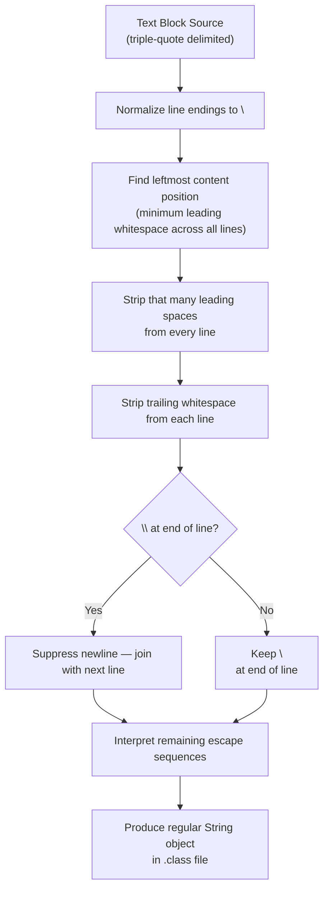
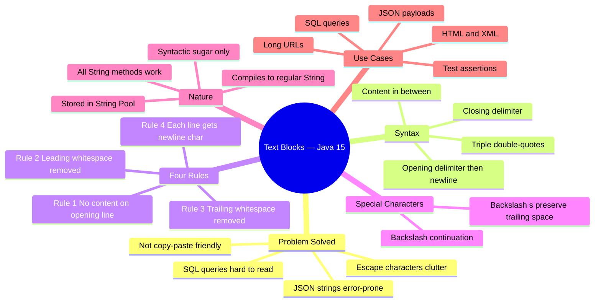

# Java 15 Feature — Text Blocks

> **Topics Covered:** Problems with multi-line strings · Text Block syntax · Compilation behavior · Four Text Block rules · Leading/trailing whitespace handling · Continuation character · Line terminator character · String methods on Text Blocks · `formatted()` for variable interpolation

---

# 📌 Text Blocks

## Overview

A **Text Block** is a multi-line string literal introduced as a standard feature in **Java 15**. It allows developers to write multi-line strings in a natural, readable format — without escape characters, string concatenation, or newline literals — by enclosing content between triple double-quote delimiters (`"""`).

Text Blocks are particularly useful for embedding structured content in Java source code, such as SQL queries, JSON payloads, HTML, and XML.

> [!NOTE]
> Text Blocks were available as a **preview feature** in Java 13 and Java 14, and were **finalized (made production-ready) in Java 15** (JEP 378). Use only the finalized version (Java 15+) in production code.

---

## Why This Concept Exists — The Problem With Multi-Line Strings

### Two Common Use Cases That Expose the Problem

Before Text Blocks, two situations in everyday Java development required writing multi-line strings: **SQL queries** and **JSON strings** (especially in test cases for validating expected output).

### Problem 1 — SQL Queries

```java
// Old way — SQL query as a multi-line string
String query = "SELECT id, name, email\n" +
               "FROM users\n" +
               "WHERE active = true\n" +
               "ORDER BY name ASC;";
```

### Problem 2 — JSON Strings (in test cases)

```java
// Old way — expected JSON for test assertion
String expectedJson = "{\n" +
                      "    \"name\": \"Alice\",\n" +
                      "    \"country\": \"India\"\n" +
                      "}";
```

### Four Problems With the Old Approach

#### 1. Difficult to Read

Special characters clutter the actual content. The real SQL or JSON logic is buried under `\n`, `\"`, and `+` operators. A developer reading this must mentally strip away the noise to understand the content.

#### 2. Error Prone

```java
// Can you spot the bug?
String json = "{\n" +
              "    \"name\": \"Alice\"\n" +   // ← missing comma!
              "    \"age\": 30\n" +
              "}";
```

The missing comma after `"Alice"` is almost invisible among the escape characters. In plain JSON it would stand out immediately. In this string form, it blends in.

#### 3. Hard to Maintain

Editing a multi-line string requires careful attention to ensure:
- Every `\n` is still in place after a change.
- Every `\"` is correctly escaped.
- The `+` concatenation operator is present on every line.

A single misplaced character breaks the string silently (wrong content) or loudly (compile error).

#### 4. Not Copy-Paste Friendly

You cannot copy a SQL query from a database tool and paste it directly into Java source code as a string — you must manually add `\n`, `\"`, and `+` throughout. Conversely, extracting a string from Java code to test it elsewhere requires the reverse cleanup.

---

## Definition

> **Text Block:** A Java 15 multi-line string literal delimited by `"""` (triple double-quotes). Everything written between the opening `"""` and closing `"""` is treated as string content. The compiler automatically handles newline characters, indentation stripping, and escape processing according to a defined set of rules, producing a regular `String` object at runtime.

---

## Real-World Analogy

Think of writing an address. The old string approach is like writing it all on one line with special codes: `"123 Main St\nSpringfield\nUSA"`. A Text Block is like writing it naturally on paper — each line on its own row — and letting the post office (the compiler) format it correctly for processing.

---

## Syntax

```java
String textBlock = """
        your content here
        second line
        third line
        """;
```

### Syntax Breakdown

| Element | Explanation |
|---|---|
| `"""` (opening) | Opening delimiter. Must be followed immediately by a newline — no content allowed on the same line. |
| Content | Written naturally across multiple lines. No escape characters needed. |
| `"""` (closing) | Closing delimiter. Can be on its own line or at the end of the last content line. Its horizontal position controls indentation removal. |

---

## Internal Working — Text Blocks Are Just Sugar Coating

Text Blocks are a **compile-time convenience** only. They do not introduce a new type. After compilation, a Text Block becomes an ordinary `String` object — identical to what you would get from the old multi-line concatenation approach.

```java
// You write (Text Block):
String json = """
        {
            "name": "Alice",
            "country": "India"
        }
        """;

// Compiler produces (equivalent to):
String json = "{\n    \"name\": \"Alice\",\n    \"country\": \"India\"\n}\n";
```

> [!IMPORTANT]
> Text Blocks are **syntactic sugar**. At the bytecode level, there is no difference between a Text Block and an equivalent traditional `String`. All `String` methods work identically on both.

### Compilation Steps

The Java compiler applies a specific sequence of transformations to a Text Block during compilation:

```
Source Text Block
       ↓
1. Line terminators normalized to \n
       ↓
2. Incidental leading whitespace removed (indentation rule)
       ↓
3. Trailing whitespace removed (unless \s is used)
       ↓
4. Escape sequences interpreted
       ↓
Regular String object in .class file
```

---

## The Four Text Block Rules

These rules govern how the compiler transforms a Text Block. Understanding them is essential for predicting exactly what string you will get.

---

### Rule 1 — Opening Delimiter: No Content on the Same Line

**Content must begin on the line after the opening `"""`.**

```java
// ✅ CORRECT — content starts on next line
String s = """
        Hello, World!
        """;

// ❌ COMPILE ERROR — content on same line as opening delimiter
String s = """Hello, World!
        """;
// Error: illegal text block start, missing newline after opening quotes
```

#### Why This Rule Exists

The compiler's job includes removing indentation (leading whitespace) from every line of content. To do this correctly, it must be able to identify what "indentation" means — i.e., how many spaces to strip from the front of each line.

If content were allowed on the same line as the opening `"""`, the first line would have zero leading spaces while subsequent lines might have several — leaving the compiler unable to determine a consistent indentation level to remove.

```
Without this rule — compiler is confused:
"""Hello          ← 0 leading spaces before "Hello"
    World         ← 4 leading spaces before "World"
    """

How many leading spaces should be removed from each line? 0? 4? Ambiguous!
```

```
With this rule — compiler is clear:
"""
    Hello         ← 4 leading spaces
    World         ← 4 leading spaces
    """

Minimum leading spaces = 4. Remove 4 from every line. Consistent!
```

---

### Rule 2 — Indentation: Leading Whitespace Removal

**All whitespace before the "leftmost" content is automatically removed.**

The compiler finds the line with the **fewest leading spaces** among all content lines (including the closing `"""`). That number of spaces is stripped from the beginning of every line. Any spaces beyond that minimum are preserved — they are part of the content's own internal indentation.

#### Example — Basic Indentation Removal

```java
public class IndentationExample {
    public static void main(String[] args) {

        String json = """
                {
                    "name": "Alice",
                    "age": 30
                }
                """;

        System.out.println(json);
    }
}
```

**Before compilation (as written in source):**

```
                {                     ← 16 leading spaces
                    "name": "Alice",  ← 20 leading spaces
                    "age": 30         ← 20 leading spaces
                }                     ← 16 leading spaces
                                      ← 16 leading spaces (closing """)
```

**Leftmost content:** 16 spaces (the `{` line and `}` line, and the closing `"""`).

**After compiler removes 16 leading spaces from every line:**

```
{
    "name": "Alice",
    "age": 30
}

```

**Output:**
```
{
    "name": "Alice",
    "age": 30
}
```

> [!TIP]
> The **position of the closing `"""`** influences indentation. If you move the closing `"""` to the left, more whitespace is stripped. This gives you manual control over how much indentation is removed.

#### Example — Controlling Indentation With Closing Delimiter Position

```java
// Closing """ at column 0 — maximum indentation removal
String s1 = """
        Hello
        World
""";
// Result: "        Hello\n        World\n"  ← closing """ is leftmost; nothing removed!

// Closing """ aligned with content — standard removal
String s2 = """
        Hello
        World
        """;
// Result: "Hello\nWorld\n"  ← 8 spaces removed from every line
```

---

### Rule 3 — Trailing Whitespace: Removed by Default, Preserved With `\s`

**All trailing whitespace (spaces at the end of a line) is removed by default.**

This prevents invisible characters from accidentally entering your string, which is almost always the desired behavior.

```java
String s = """
        Hello,   
        World
        """;
// The spaces after "Hello," are removed → "Hello,\nWorld\n"
```

#### Preserving Trailing Whitespace With `\s`

If you intentionally need trailing spaces, place `\s` (the space escape sequence) at the end of the line. The compiler treats `\s` as a literal space AND uses it as a marker that tells the trailing-whitespace stripper to stop before it.

```java
String s = """
        Hello,   \s
        World
        """;
// The \s and the spaces before it are preserved → "Hello,    \nWorld\n"
//                                                           ^^^^
//                                                     spaces + \s preserved
```

> [!NOTE]
> `\s` is equivalent to a single space character. Its primary purpose inside Text Blocks is to **anchor** trailing whitespace so it is not stripped.

---

### Rule 4 — Line Terminators and the Continuation Character `\`

**By default, each new line in a Text Block adds a `\n` (newline) character to the compiled string.**

```java
String s = """
        line one
        line two
        line three
        """;

// Compiled result: "line one\nline two\nline three\n"
```

#### The Problem — When You Don't Want a Newline

Sometimes you want to **write long content across multiple lines for readability** in your source file, but you want it to compile into a **single continuous line** with no `\n` characters. A common example is a very long URL:

```java
// Without continuation character — WRONG for a URL
String url = """
        https://www.example.com/api/v1/users/
        profile?param1=value1&param2=value2
        """;
// Compiled: "https://www.example.com/api/v1/users/\nprofile?param1=value1&param2=value2\n"
//                                              ^^^^ unwanted newline breaks the URL!
```

#### Solution — The Line Continuation Character `\`

Place a `\` at the end of a line to **suppress the newline** that would normally be added. The next line is treated as a continuation of the current one.

```java
// With continuation character — CORRECT
String url = """
        https://www.example.com/api/v1/users/\
        profile?param1=value1&param2=value2
        """;
// Compiled: "https://www.example.com/api/v1/users/profile?param1=value1&param2=value2\n"
//                                              ^^^^ no newline — lines are joined!
```

#### Another Use Case — Long Readable Strings

```java
String message = """
        This is the first part of a very long sentence that \
        continues here without a line break in the output.
        """;
// Compiled: "This is the first part of a very long sentence that continues here without a line break in the output.\n"
```

---

## Rules Summary Table

| Rule | Default Behavior | How to Override |
|---|---|---|
| Opening delimiter | Content must start on the next line | Cannot be overridden (compile rule) |
| Leading whitespace | Minimum leading spaces are removed from all lines | Move closing `"""` left/right to control stripping |
| Trailing whitespace | All trailing spaces on each line are removed | Use `\s` at end of line to preserve trailing spaces |
| Line terminators | Each new line adds `\n` to the compiled string | Use `\` at end of line to suppress the newline |

---

## Flowchart — Text Block Compilation



---

## Code Examples

### Beginner Example — SQL Query

```java
public class TextBlockSQL {
    public static void main(String[] args) {

        // Old way
        String oldQuery = "SELECT id, name, email\n" +
                          "FROM users\n" +
                          "WHERE active = true\n" +
                          "ORDER BY name ASC;";

        // New way — Text Block
        String newQuery = """
                SELECT id, name, email
                FROM users
                WHERE active = true
                ORDER BY name ASC;
                """;

        System.out.println(newQuery);
    }
}
```

#### Output

```
SELECT id, name, email
FROM users
WHERE active = true
ORDER BY name ASC;
```

---

### Beginner Example — JSON String

```java
public class TextBlockJSON {
    public static void main(String[] args) {

        // Old way — hard to read, error-prone
        String oldJson = "{\n" +
                         "    \"name\": \"Alice\",\n" +
                         "    \"age\": 30,\n" +
                         "    \"country\": \"India\"\n" +
                         "}";

        // New way — Text Block
        String newJson = """
                {
                    "name": "Alice",
                    "age": 30,
                    "country": "India"
                }
                """;

        System.out.println(newJson);
        System.out.println("Are they equal? " + oldJson.equals(newJson.stripTrailing()));
    }
}
```

#### Output

```
{
    "name": "Alice",
    "age": 30,
    "country": "India"
}
Are they equal? true
```

---

### Intermediate Example — Demonstrating All Four Rules

```java
public class TextBlockRules {
    public static void main(String[] args) {

        // Rule 2: Leading whitespace removal
        // The closing """ is at 8 spaces → 8 spaces removed from every line
        String indented = """
                Hello
                    World
                """;
        System.out.println("Indentation rule:");
        System.out.println(indented);

        // Rule 3: Trailing whitespace — default removal vs \s preservation
        String withTrailing = """
                no trailing   
                with trailing   \s
                """;
        System.out.println("Trailing whitespace rule:");
        System.out.println("[" + withTrailing.lines().toList().get(0) + "]");
        System.out.println("[" + withTrailing.lines().toList().get(1) + "]");

        // Rule 4: Continuation character
        String singleLine = """
                This is actually \
                one single line.
                """;
        System.out.println("Continuation character rule:");
        System.out.println(singleLine);
    }
}
```

#### Output

```
Indentation rule:
Hello
    World

Trailing whitespace rule:
[no trailing]
[with trailing   ]

Continuation character rule:
This is actually one single line.
```

---

### Advanced Example — String Methods on Text Blocks

Since Text Blocks compile to ordinary `String` objects, every `String` method works on them.

```java
public class TextBlockMethods {
    public static void main(String[] args) {

        String json = """
                {
                    "language": "java",
                    "version": "fifteen"
                }
                """;

        // toUpperCase()
        System.out.println(json.toUpperCase());

        // contains()
        System.out.println(json.contains("java")); // true

        // replace()
        System.out.println(json.replace("java", "python"));

        // length()
        System.out.println("Length: " + json.length());

        // strip()
        String stripped = json.strip();
        System.out.println("Stripped length: " + stripped.length());
    }
}
```

#### Output

```
{
    "LANGUAGE": "JAVA",
    "VERSION": "FIFTEEN"
}
true
{
    "language": "python",
    "version": "fifteen"
}
Length: 51
Stripped length: 50
```

---

### Advanced Example — Variable Interpolation With `formatted()`

You can embed dynamic values into a Text Block using the `formatted()` method (available since Java 15), which works like `String.format()` but called directly on the string.

```java
public class TextBlockFormatted {
    public static void main(String[] args) {

        String name = "Shreyansh";
        String country = "India";

        String profile = """
                {
                    "name": "%s",
                    "country": "%s"
                }
                """.formatted(name, country);

        System.out.println(profile);
    }
}
```

#### Output

```
{
    "name": "Shreyansh",
    "country": "India"
}
```

#### How `formatted()` Works

- `%s` is a format specifier for `String` (same as in `String.format()`).
- `.formatted(name, country)` replaces the first `%s` with `name` and the second `%s` with `country`.
- The method is called directly on the Text Block literal — no intermediate variable needed.

---

## Memory Representation

```
Source Code (.java file)
┌──────────────────────────────┐
│  String s = """              │
│          Hello               │  ← Text Block (human-readable)
│          World               │
│          """;                │
└──────────────────────────────┘
            ↓ compiler
Bytecode (.class file)
┌──────────────────────────────┐
│  String s = "Hello\nWorld\n" │  ← Regular String constant
└──────────────────────────────┘
            ↓ JVM (runtime)
Heap Memory
┌──────────────────────────────┐
│  String object               │
│  value: "Hello\nWorld\n"     │  ← Standard String Pool entry
└──────────────────────────────┘
```

Text Blocks are interned in the **String Pool** just like any other string literal — they benefit from the same memory optimization.

---

## Diagram — Text Block vs Old Multi-Line String

```mermaid
graph LR
    subgraph "Old Approach"
        A["\"line1\\n\" +\n\"line2\\n\" +\n\"line3\""]
        A -->|"compile"| B["\"line1\\nline2\\nline3\""]
    end
    subgraph "Text Block"
        C["\"\"\"\\n    line1\\n    line2\\n    line3\\n    \"\"\""]
        C -->|"compile\n(apply 4 rules)"| D["\"line1\\nline2\\nline3\\n\""]
    end
    B -.->|"identical runtime object"| E["String in JVM Heap"]
    D -.->|"identical runtime object"| E
```

---

## Key Observations

- A Text Block is **not a new type** — it compiles to a `java.lang.String`.
- **All `String` methods** (`toUpperCase()`, `contains()`, `replace()`, `length()`, `strip()`, `formatted()`, etc.) work on Text Blocks.
- Text Blocks **cannot start content on the same line** as the opening `"""`.
- The **closing `"""`** position acts as a control point for how much leading whitespace is stripped.
- **Trailing whitespace** is silently removed by default — use `\s` to preserve it.
- The **`\` continuation character** joins two physical lines into one logical line.
- Text Blocks are great for: SQL, JSON, HTML, XML, regular expressions, and any content that would otherwise require heavy escaping.
- `null` cannot be assigned with a Text Block — `String s = """null"""` gives the string "null", not `null`.

---

## Common Mistakes

### Mistake 1 — Content on Same Line as Opening Delimiter

```java
// ❌ COMPILE ERROR
String s = """Hello
        World
        """;

// ✅ CORRECT
String s = """
        Hello
        World
        """;
```

### Mistake 2 — Unexpected Indentation in Output

```java
public class Main {
    public static void main(String[] args) {
        // ❌ Closing """ is at column 8 — only 8 spaces removed
        // But content has 8 spaces → everything lines up at column 0 → correct
        // However, if closing """ is indented MORE than content, unexpected spaces appear
        String s = """
Hello
World
"""; // closing """ at column 0 — 0 spaces removed (nothing stripped!)
        // Result: "Hello\nWorld\n" — actually fine here!
    }
}
```

> [!TIP]
> Always align the closing `"""` with or to the left of your content start to get predictable stripping. The safest pattern is to align the closing `"""` with the content.

### Mistake 3 — Forgetting That Trailing Spaces Are Removed

```java
// ❌ Trailing spaces silently vanish
String csv = """
        Alice, 30,   
        Bob, 25,   
        """;
// "Alice, 30," and "Bob, 25," — the trailing spaces are gone!

// ✅ Use \s to preserve
String csv = """
        Alice, 30,   \s
        Bob, 25,   \s
        """;
```

### Mistake 4 — Using `+` Concatenation Inside Text Blocks

```java
// ❌ You cannot embed expressions inside Text Blocks (no interpolation syntax)
String name = "Alice";
String s = """
        Hello, """ + name + """!
        """;
// Ugly and defeats the purpose

// ✅ Use formatted() for dynamic values
String s = """
        Hello, %s!
        """.formatted(name);
```

### Mistake 5 — Expecting No Trailing Newline

```java
String s = """
        Hello
        """;
System.out.println(s.length()); // "Hello\n" → length is 6, not 5!
// The closing """ on its own line causes a trailing \n to be included.

// To avoid trailing newline, put closing """ on the last content line:
String s2 = """
        Hello""";
// "Hello" → length is 5, no trailing \n
```

---

## Best Practices

1. **Use Text Blocks for all multi-line strings** — SQL, JSON, HTML, XML, regex patterns.
2. **Align the closing `"""` with the content** for predictable indentation stripping.
3. **Use `.formatted()`** for variable substitution instead of string concatenation.
4. **Use `\s`** whenever trailing whitespace is semantically significant.
5. **Use `\`** (continuation) for logically single-line content that you want to wrap for readability.
6. **Do not use Text Blocks for single-line strings** — regular string literals are cleaner for those.
7. **Copy-paste freely** — Text Blocks are designed so you can paste real SQL or JSON directly into the source file with minimal adjustment.

---

## Interview Notes

> **Commonly Asked Interview Questions on Text Blocks:**

- *What is a Text Block in Java and when was it introduced?* — A multi-line string literal delimited by `"""`, finalized in Java 15.
- *What problem does Text Block solve?* — Eliminates the need for `\n`, `\"`, and string concatenation in multi-line strings, making code more readable and less error-prone.
- *Is a Text Block a new type in Java?* — No. It compiles to a regular `java.lang.String` object. It is purely a compile-time syntactic convenience (syntactic sugar).
- *Why can't you put content on the same line as the opening `"""`?* — Because the compiler needs all content to start from the next line so it can consistently determine how many leading whitespace characters to strip.
- *How does indentation stripping work?* — The compiler finds the leftmost content position (minimum leading spaces), then strips that many spaces from the beginning of every line.
- *How do you preserve trailing whitespace in a Text Block?* — Use `\s` at the end of the line.
- *What does the `\` (backslash) at the end of a line do in a Text Block?* — It suppresses the newline that would normally be added, joining the next line as a continuation.
- *Can you use String methods on a Text Block?* — Yes, all `String` methods work identically since Text Blocks compile to regular `String` objects.
- *How do you embed variables in a Text Block?* — Use `%s` (or other format specifiers) and call `.formatted(args)` on the Text Block.
- *Where are Text Blocks stored in memory?* — In the String Pool, like all string literals.

---

## Related Concepts

- **`String.format()`** — the traditional way to embed variables in strings; `.formatted()` is its instance-method equivalent available since Java 15.
- **`String` Pool / String Interning** — Text Blocks, like string literals, are stored in the pool.
- **`StringBuilder`** — another approach for dynamic multi-line string construction; less clean than Text Blocks for static content.
- **Pattern Matching (`instanceof`)** — another Java 16 readability/safety improvement in the same era of Java enhancements.
- **Escape sequences** — `\n`, `\t`, `\"`, `\\`, `\s` — understanding these is prerequisite to understanding what Text Blocks replace.

---

## Practice Questions

**Easy**
1. Convert this string to a Text Block:
   ```java
   String html = "<html>\n" +
                 "    <body>\n" +
                 "        <p>Hello</p>\n" +
                 "    </body>\n" +
                 "</html>";
   ```
2. What is the output of `System.out.println("""hello""".length())`? *(Hint: this causes a compile error — why?)*
3. What character do you use to preserve trailing whitespace in a Text Block?

**Medium**
4. Explain what happens to the leading whitespace in this Text Block and what the output will be:
   ```java
   String s = """
           Hello
               World
           """;
   System.out.println(s);
   ```
5. Write a Text Block that produces the string `"Hello World"` (single line, no `\n`) even though it is written across two lines in source code.
6. Given a Text Block with trailing spaces after some lines, how would you selectively preserve spaces on only some lines?

**Hard**
7. Consider two Text Blocks where the closing `"""` is at different indentation levels. Predict the exact `String` output for each and explain why they differ.
8. Write a method `buildJsonPayload(String name, int age, String city)` that returns a formatted JSON string using a Text Block.
9. Why does `"""hello"""` cause a compile error while `"""hello\n"""` would compile (albeit with an equivalent error message)? What is the exact rule being violated?

---

## Summary



| Key Point | Detail |
|---|---|
| Java version | Finalized in **Java 15** (preview in 13, 14) |
| Delimiter | `"""` (triple double-quote) on both ends |
| New type? | No — compiles to `java.lang.String` |
| Rule 1 | No content on same line as opening `"""` |
| Rule 2 | Leading whitespace stripped up to leftmost content |
| Rule 3 | Trailing whitespace removed by default; use `\s` to preserve |
| Rule 4 | Each new line adds `\n`; use `\` to suppress and continue |
| Variable values | Use `.formatted()` with `%s`, `%d`, etc. |
| String methods | All `String` methods work — `toUpperCase()`, `replace()`, etc. |
| Memory | Stored in String Pool like any literal |
| Use for | SQL, JSON, HTML, XML, long URLs, test expected values |

---

> [!TIP]
> **Quick Rule of Thumb:** If writing a multi-line string and you find yourself typing `\n`, `+`, or `\"`, stop and use a Text Block instead. Your future self (and your teammates) will thank you.

---

*End of Chapter — Java 15: Text Blocks*
