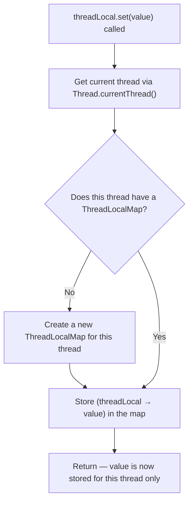
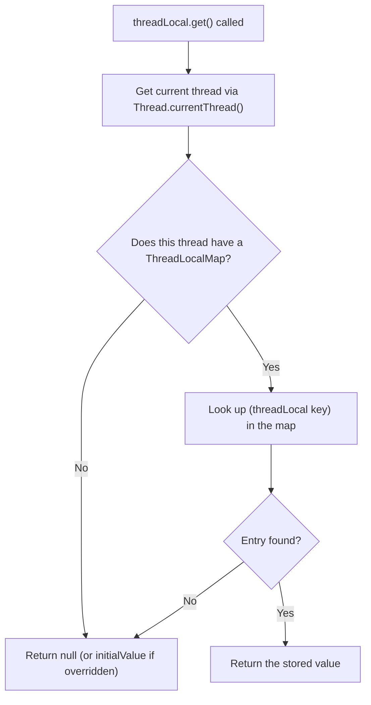
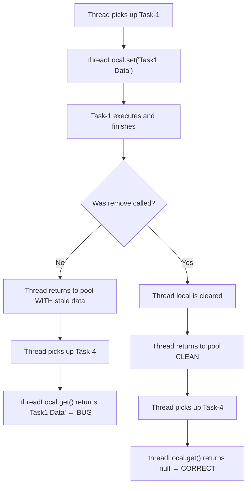
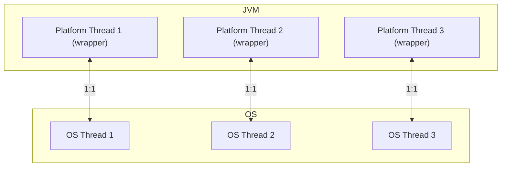
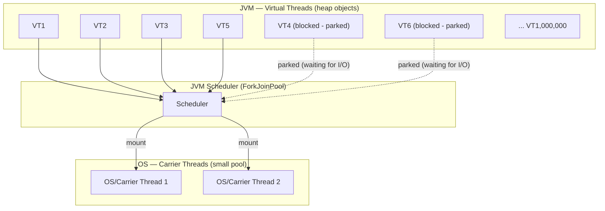
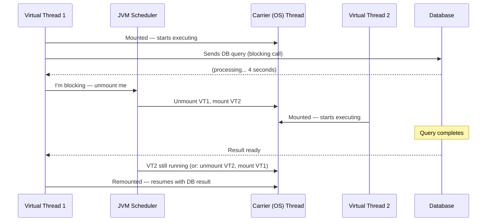
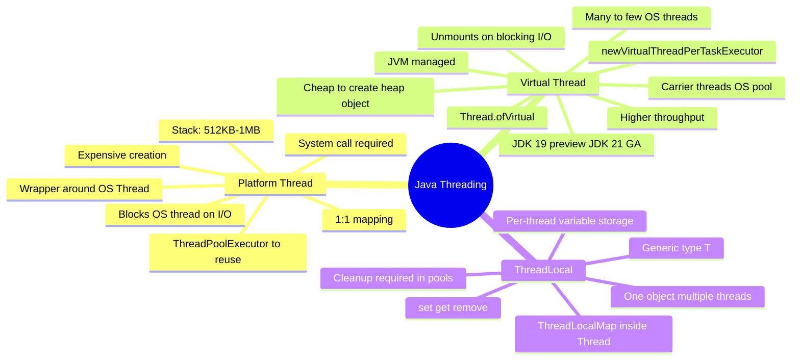

# Java Multithreading — Advanced Topics: `ThreadLocal` & Virtual Threads

> **Topics Covered:** `ThreadLocal` class · Thread-local cleanup · Virtual Threads vs Platform Threads · JVM thread management · Higher throughput · `Thread.ofVirtual` · `Executors.newVirtualThreadPerTaskExecutor`

---

# 📌 `ThreadLocal` — Per-Thread Variable Storage

## Overview

`ThreadLocal` is a Java class that provides **thread-local variables** — each thread that accesses a `ThreadLocal` variable has its own, independently initialized copy of that variable. The value stored in a `ThreadLocal` is private to the thread that set it; no other thread can read or modify that thread's copy.

This is one of Java's key tools for **thread isolation without synchronization**.

---

## Why This Concept Exists

### The Problem It Solves

In a multi-threaded application, sharing mutable state between threads introduces race conditions and requires expensive synchronization mechanisms (`synchronized`, `Lock`, etc.). Sometimes, however, you simply need **each thread to carry its own private data** — data that is specific to that thread's execution context. Examples include:

- A database connection per thread
- A user session or authentication token per request thread
- A formatter object (like `SimpleDateFormat`, which is not thread-safe)
- A transaction ID associated with the current request

Instead of passing this data as parameters through every method call, or creating separate objects for each thread manually, `ThreadLocal` provides a **clean, built-in mechanism** to associate data with the calling thread.

---

## Definition

> **`ThreadLocal<T>`** is a Java class that provides thread-local storage. Each thread that accesses a `ThreadLocal` variable (via `get()` or `set()`) has its own independently initialized copy of the variable. The type parameter `T` specifies what kind of data can be stored.

---

## Real-World Analogy

Think of a company with many employees (threads), each of whom has their own desk drawer (ThreadLocal variable). A single memo (the `ThreadLocal` object) goes out to all desks, and each employee writes their own personal note and stores it in their own drawer. When they come back to read it, they read only their own copy — they never see what their colleagues wrote.

---

## Internal Working

### How `ThreadLocal` Works Inside the JVM

Every Java `Thread` object internally maintains a field called `threadLocals`, which is of type `ThreadLocal.ThreadLocalMap`. This is essentially a custom hash map stored **inside the `Thread` object itself**.

```
Thread Object
└── threadLocals: ThreadLocalMap
    ├── Entry(ThreadLocal<String> key → "main")
    ├── Entry(ThreadLocal<Integer> key → 42)
    └── ...
```

When you call `threadLocalObj.set(value)`:
1. JVM calls `Thread.currentThread()` to get the currently running thread.
2. It fetches that thread's `ThreadLocalMap` (creating one if it doesn't exist).
3. It stores the value in the map, using the `ThreadLocal` object itself as the key.

When you call `threadLocalObj.get()`:
1. JVM calls `Thread.currentThread()`.
2. It fetches that thread's `ThreadLocalMap`.
3. It looks up the value using the `ThreadLocal` object as the key and returns it.

> [!IMPORTANT]
> You never have to tell Java **which thread** to associate data with. The `set()` and `get()` methods always automatically operate on the **currently running thread**. This is the core elegance of `ThreadLocal`.

---

## Syntax

```java
// Declaration and creation
ThreadLocal<T> threadLocalVar = new ThreadLocal<>();

// Setting a value for the current thread
threadLocalVar.set(value);

// Getting the value for the current thread
T value = threadLocalVar.get();

// Removing the value for the current thread
threadLocalVar.remove();
```

---

## Syntax Breakdown

| Syntax Element | Explanation |
|---|---|
| `ThreadLocal<T>` | Generic class; `T` is the type of data to store (e.g., `String`, `Integer`, or any object) |
| `new ThreadLocal<>()` | Creates one `ThreadLocal` object, shared across threads |
| `.set(value)` | Stores `value` in the **current thread's** local storage |
| `.get()` | Retrieves the value from the **current thread's** local storage |
| `.remove()` | Removes the current thread's value from local storage — **critical for cleanup** |
| `Thread.currentThread().getName()` | Gets the name of the currently executing thread as a `String` |

---

## Code Examples

### Beginner Example — Basic Set and Get

```java
public class ThreadLocalBasicExample {

    // One shared ThreadLocal object for the entire application
    static ThreadLocal<String> threadLocal = new ThreadLocal<>();

    public static void main(String[] args) throws InterruptedException {

        // The main thread sets its own value
        threadLocal.set(Thread.currentThread().getName());
        System.out.println("Main thread set: " + threadLocal.get());

        // Create a new thread — it will have its own copy
        Thread t1 = new Thread(() -> {
            threadLocal.set(Thread.currentThread().getName());
            System.out.println("Thread t1 set: " + threadLocal.get());
        });

        t1.start();
        t1.join();

        // Main thread still sees its own value
        System.out.println("Main thread still sees: " + threadLocal.get());
    }
}
```

#### Output

```
Main thread set: main
Thread t1 set: Thread-0
Main thread still sees: main
```

#### Line-by-Line Explanation

| Line | Explanation |
|---|---|
| `static ThreadLocal<String> threadLocal = new ThreadLocal<>()` | Creates one `ThreadLocal` object. `static` means all threads share this single object instance — but each thread has its own *value* inside it. |
| `threadLocal.set(Thread.currentThread().getName())` | The main thread calls `set()`. Java sees the current thread is "main", stores "main" in the main thread's `ThreadLocalMap`. |
| `threadLocal.get()` in `t1` | Thread `t1` is now current. Its `ThreadLocalMap` has "Thread-0" stored. Returns "Thread-0". |
| Final `threadLocal.get()` in main | Main thread is current again. Its map still has "main". Returns "main". |

---

### Intermediate Example — Multiple Threads, Same Object

```java
public class ThreadLocalMultiThread {

    static ThreadLocal<String> threadLocal = new ThreadLocal<>();

    public static void main(String[] args) throws InterruptedException {

        // Main thread sets its name
        threadLocal.set(Thread.currentThread().getName());

        Thread t1 = new Thread(() -> {
            threadLocal.set(Thread.currentThread().getName());
            System.out.println("Inside t1: " + threadLocal.get());
        }, "WorkerThread-1");

        Thread t2 = new Thread(() -> {
            threadLocal.set(Thread.currentThread().getName());
            System.out.println("Inside t2: " + threadLocal.get());
        }, "WorkerThread-2");

        t1.start();
        t2.start();
        t1.join();
        t2.join();

        // Main thread retrieves its own value — completely isolated
        System.out.println("Inside main: " + threadLocal.get());
    }
}
```

#### Output

```
Inside t1: WorkerThread-1
Inside t2: WorkerThread-2
Inside main: main
```

> [!NOTE]
> Even though all three threads use the exact same `ThreadLocal` object, each one sees only its own value. This is the isolation guarantee of `ThreadLocal`.

---

## Memory Representation

```
JVM Memory (Heap)

┌─────────────────────────────────────────────────────┐
│  Thread: "main"                                      │
│  ┌────────────────────────────────────────────────┐  │
│  │  threadLocals (ThreadLocalMap)                 │  │
│  │  key: threadLocal object → value: "main"       │  │
│  └────────────────────────────────────────────────┘  │
└─────────────────────────────────────────────────────┘

┌─────────────────────────────────────────────────────┐
│  Thread: "WorkerThread-1"                            │
│  ┌────────────────────────────────────────────────┐  │
│  │  threadLocals (ThreadLocalMap)                 │  │
│  │  key: threadLocal object → value: "WorkerThread-1"│
│  └────────────────────────────────────────────────┘  │
└─────────────────────────────────────────────────────┘

┌──────────────────────────┐
│  Heap: ThreadLocal object │  ← shared, one instance
│  (acts as key in maps)    │
└──────────────────────────┘
```

The `ThreadLocal` object itself lives on the heap and is shared. But the **values** are stored inside each thread's own `ThreadLocalMap`, giving complete isolation.

---

## Flowchart — `threadLocal.set(value)` Execution



---

## Flowchart — `threadLocal.get()` Execution



---

---

# ⚠️ Critical: Cleanup with `ThreadLocal.remove()` in Thread Pools

## The Problem — Thread Reuse Without Cleanup

This is one of the most important practical pitfalls with `ThreadLocal`. It is **directly relevant to thread pool usage** (e.g., `ThreadPoolExecutor`).

### The Scenario

In a thread pool (e.g., `Executors.newFixedThreadPool(5)`), a fixed number of threads execute many tasks over time. The threads are **reused** — the same thread object handles multiple tasks sequentially.

If Thread-1 handles Task-A and sets a `ThreadLocal` value, and Task-A completes without calling `.remove()`, then:

- Thread-1 goes back to the pool.
- Thread-1 picks up Task-B.
- Task-B calls `threadLocal.get()`.
- It gets Task-A's leftover value — **a bug!**

```
Thread Pool (5 threads)

  Thread-1 → runs Task-1 → sets threadLocal = "data from task 1"
  Task-1 completes. Thread-1 returns to pool.
                          ↓ (no cleanup!)
  Thread-1 → runs Task-4 → calls threadLocal.get()
  → GETS "data from task 1" ← BUG! Stale data from a previous task!
```

---

## Code Example — Demonstrating the Bug

```java
import java.util.concurrent.ExecutorService;
import java.util.concurrent.Executors;

public class ThreadLocalLeakDemo {

    static ThreadLocal<String> threadLocal = new ThreadLocal<>();

    public static void main(String[] args) throws InterruptedException {
        ExecutorService pool = Executors.newFixedThreadPool(5);

        // Submit one initial task that sets ThreadLocal
        pool.submit(() -> {
            threadLocal.set("TASK_DATA_" + Thread.currentThread().getName());
            System.out.println("Initial task set: " + threadLocal.get());
            // ❌ NO threadLocal.remove() here — intentional to show the bug
        });

        Thread.sleep(500); // Let the initial task finish

        // Submit 15 more tasks — some threads may be reused
        for (int i = 0; i < 15; i++) {
            pool.submit(() -> {
                // Should be null for fresh use, but might not be!
                System.out.println(Thread.currentThread().getName()
                    + " sees: " + threadLocal.get());
            });
        }

        pool.shutdown();
    }
}
```

#### Output (Example — non-deterministic)

```
pool-1-thread-1 set: TASK_DATA_pool-1-thread-1
pool-1-thread-1 sees: TASK_DATA_pool-1-thread-1   ← stale value!
pool-1-thread-2 sees: null
pool-1-thread-3 sees: null
pool-1-thread-1 sees: TASK_DATA_pool-1-thread-1   ← stale again!
...
```

> [!WARNING]
> Without calling `threadLocal.remove()`, threads in a pool carry stale data from previous tasks. This can cause **data leaks, incorrect behavior, and security vulnerabilities** (e.g., one user's session data leaking to another user's request in a web server).

---

## Code Example — Correct Approach With Cleanup

```java
import java.util.concurrent.ExecutorService;
import java.util.concurrent.Executors;

public class ThreadLocalCleanupDemo {

    static ThreadLocal<String> threadLocal = new ThreadLocal<>();

    public static void main(String[] args) throws InterruptedException {
        ExecutorService pool = Executors.newFixedThreadPool(5);

        // Initial task — sets ThreadLocal AND cleans up
        pool.submit(() -> {
            try {
                threadLocal.set("TASK_DATA_" + Thread.currentThread().getName());
                System.out.println("Initial task set: " + threadLocal.get());
                // ... do work ...
            } finally {
                threadLocal.remove(); // ✅ Always clean up in finally block
            }
        });

        Thread.sleep(500);

        // 15 subsequent tasks — all should see null
        for (int i = 0; i < 15; i++) {
            pool.submit(() -> {
                System.out.println(Thread.currentThread().getName()
                    + " sees: " + threadLocal.get());
            });
        }

        pool.shutdown();
    }
}
```

#### Output

```
pool-1-thread-1 set: TASK_DATA_pool-1-thread-1
pool-1-thread-1 sees: null
pool-1-thread-2 sees: null
pool-1-thread-3 sees: null
...
(all 15 tasks see null — correct!)
```

> [!TIP]
> Always call `threadLocal.remove()` inside a `finally` block so cleanup happens even if an exception is thrown. This is the professional standard.

---

## Flowchart — Thread Pool Reuse With and Without Cleanup



---

## Key Observations

- You need **only one `ThreadLocal` object** for all threads — Java automatically routes `set()`/`get()`/`remove()` to the correct thread's storage.
- The stored type can be **any Java type** — `String`, `Integer`, `Connection`, custom objects — because `ThreadLocal<T>` is generic.
- `ThreadLocal` provides **thread isolation without locks** — there is no synchronization needed because each thread accesses only its own data.
- The `ThreadLocal` object is the **key** inside each thread's `ThreadLocalMap`. The map is stored inside the `Thread` object itself.

---

## Common Mistakes

### Mistake 1 — Forgetting to Remove in Thread Pools

```java
// ❌ WRONG
pool.submit(() -> {
    threadLocal.set("value");
    doWork();
    // Forgot to call threadLocal.remove()!
});
```

```java
// ✅ CORRECT
pool.submit(() -> {
    try {
        threadLocal.set("value");
        doWork();
    } finally {
        threadLocal.remove();
    }
});
```

### Mistake 2 — Creating One `ThreadLocal` Per Thread

```java
// ❌ WRONG — unnecessary; defeats the purpose
Thread t1 = new Thread(() -> {
    ThreadLocal<String> local = new ThreadLocal<>(); // Don't create inside thread!
    local.set("value");
});
```

```java
// ✅ CORRECT — one shared ThreadLocal object
static ThreadLocal<String> local = new ThreadLocal<>();

Thread t1 = new Thread(() -> {
    local.set("value"); // Thread-specific, but uses shared object
});
```

---

## Best Practices

1. **Declare `ThreadLocal` as `static`** — it should be a class-level constant, not an instance variable.
2. **Always call `.remove()` in a `finally` block** when using thread pools.
3. **Prefer `ThreadLocal` with `initialValue()`** override or `ThreadLocal.withInitial()` to provide a default value.
4. **Document usage** — `ThreadLocal` variables can be subtle; comment why they exist and when cleanup happens.
5. **Avoid in long-lived threads without cleanup** — memory leaks can occur if the thread lives longer than the stored objects.

```java
// Using withInitial for a default value
ThreadLocal<List<String>> listHolder = ThreadLocal.withInitial(ArrayList::new);
```

---

## Interview Notes

> **Common Interview Questions on `ThreadLocal`:**

- *What is `ThreadLocal` in Java?* — A class that gives each thread its own copy of a variable.
- *How does `ThreadLocal` work internally?* — Each `Thread` object holds a `ThreadLocalMap`; the `ThreadLocal` instance is the key.
- *Why must you call `threadLocal.remove()` in thread pools?* — Threads are reused; without removal, stale data from a previous task is visible.
- *Is `ThreadLocal` thread-safe?* — Yes, by design — each thread only ever touches its own copy.
- *When would you use `ThreadLocal` over passing parameters?* — When the data needs to be accessible across many method calls without being in the method signature (e.g., request context, user session, database connections).
- *What is `InheritableThreadLocal`?* — A subclass where child threads inherit the parent thread's `ThreadLocal` values (for propagating context like logging IDs).

---

## Summary

- `ThreadLocal` lets each thread store its own private copy of a variable.
- One `ThreadLocal` object is shared; the values are separate per thread.
- Internally, each `Thread` has a `ThreadLocalMap` — the `ThreadLocal` object is the key.
- `set()` and `get()` automatically operate on the currently running thread.
- **Always call `remove()` when reusing threads (thread pools)** to prevent stale data bugs.

---

---

# 📌 Virtual Threads vs Platform (Normal) Threads

## Overview

Virtual Threads are a feature introduced in Java to dramatically improve the **scalability** of multi-threaded applications. They are a fundamentally different kind of thread — lightweight, managed by the JVM rather than the OS — and they allow applications to handle **far more concurrent tasks** than traditional threads allow.

> [!IMPORTANT]
> **The motto of Virtual Threads:** Higher **throughput** — not lower latency.

---

## Why This Concept Exists

### The Problem with Platform Threads

Traditional Java threads (platform threads) have two significant disadvantages:

1. **Thread creation is expensive** — creating a thread involves a system call to the OS, which takes time (milliseconds). This is why `ThreadPoolExecutor` was introduced — to pre-create a pool of threads and reuse them.

2. **Blocked threads waste OS resources** — each platform thread is 1:1 mapped to an OS thread. When a platform thread waits for I/O (database query, network call, file read), the underlying OS thread sits idle — it cannot be used for anything else. OS threads are a limited and expensive resource.

### The Goal of Virtual Threads

Virtual Threads solve these problems by:
- Making thread creation nearly free (they are just JVM-level objects).
- Automatically **unmounting** a virtual thread from its OS thread when it blocks, freeing the OS thread to run other work.

This allows a server to handle **millions of concurrent requests** with a fraction of the OS resources.

---

## Definition

> **Platform Thread** (Normal Thread): A Java thread that is a direct 1:1 wrapper around an OS thread. Created and managed by the JVM in cooperation with the operating system. Every platform thread corresponds to exactly one OS thread.

> **Virtual Thread**: A lightweight, JVM-managed thread that is **not** tied 1:1 to an OS thread. Many virtual threads can be **multiplexed** (scheduled) onto a small pool of OS threads (called *carrier threads*). When a virtual thread blocks, it is unmounted from its carrier thread, freeing that carrier thread to run another virtual thread.

---

## Real-World Analogy

**Platform threads** are like taxicabs: one cab (OS thread) carries one passenger (task) at a time. If the passenger stops at a shop (I/O wait), the cab sits outside doing nothing — it cannot take another fare.

**Virtual threads** are like a busy restaurant server: one server (OS thread) can juggle many tables (virtual threads). If one table is waiting for their food (I/O), the server moves on to take other orders — returning when that table's order is ready.

---

## Platform (Normal) Thread — Deep Dive

### How Platform Threads Work

```
Java Code                JVM                  Operating System
────────────────         ──────────────────   ──────────────────
new Thread(...)     →    Creates wrapper  →   Requests new OS Thread
t.start()           →    System Call      →   OS allocates OS Thread
                                              OS schedules OS Thread
                                              CPU executes OS Thread
```

- The JVM is just a **mediator** — a thin wrapper over OS threads.
- 1 Platform Thread = 1 OS Thread (1:1 mapping)
- Creating 10 platform threads = creating 10 OS threads via system calls.

### Disadvantages of Platform Threads

#### Disadvantage 1 — Expensive to Create

Calling `t.start()` triggers a **system call** (a request from user space to kernel space). System calls are expensive operations that switch execution contexts and involve the OS kernel. This cost (several milliseconds per thread) is why thread pools exist — to amortize this creation cost by reusing threads.

#### Disadvantage 2 — Blocking Wastes OS Resources

```
Platform Thread T1  ←→  OS Thread (1:1)
T1 sends DB query
DB takes 4 seconds to respond
↓
OS Thread is BLOCKED for 4 seconds
Cannot do anything else
4 seconds of wasted OS thread capacity
```

OS threads are limited. A typical JVM server can support thousands of OS threads before the system runs out of memory (each OS thread requires its own stack, usually 512KB–1MB). If each thread spends most of its time waiting for I/O, most of your OS thread capacity is wasted.

---

## Virtual Thread — Deep Dive

### How Virtual Threads Work

```
Virtual Threads (JVM objects — can be millions)
VT1, VT2, VT3, VT4, ... VT1000000

     Scheduler (JVM ForkJoinPool)
          ↓           ↓
     OS Thread 1  OS Thread 2   (small pool, e.g., one per CPU core)
```

- Virtual threads are **JVM objects** — heap-allocated, lightweight, cheap to create.
- The JVM has a small pool of **carrier threads** (OS threads — usually one per CPU core).
- The JVM **scheduler** mounts virtual threads onto carrier threads for execution.
- When a virtual thread performs a blocking operation (I/O, sleep), the JVM:
  1. **Unmounts** the virtual thread from its carrier thread.
  2. Saves the virtual thread's state (stack, program counter) on the heap.
  3. **Mounts another runnable virtual thread** onto the carrier thread.
  4. When the blocked operation completes, the original virtual thread is put back in the scheduler queue.

```
VT1 mounted on OS-Thread-1 → VT1 calls DB query (blocks)
JVM: unmount VT1 from OS-Thread-1, save VT1's state to heap
JVM: mount VT2 onto OS-Thread-1 → VT2 runs
... DB query response arrives ...
JVM: put VT1 back in scheduler queue
JVM: VT1 mounts on OS-Thread-1 (or OS-Thread-2) when available → resumes
```

### Key Result

- OS threads are **never idle waiting for I/O**.
- You can create **millions of virtual threads** (they are just objects on the heap).
- Higher throughput: more tasks completed per second using the same hardware.

---

## Availability

> [!NOTE]
> Virtual Threads were introduced as a **Preview Feature** in JDK 19, finalized (made generally available) in **JDK 21** (LTS). Use `--enable-preview` for JDK 19/20; no flag needed in JDK 21+.

---

## Comparison Table — Platform Thread vs Virtual Thread

| Feature | Platform Thread | Virtual Thread |
|---|---|---|
| Mapping | 1:1 with OS Thread | Many:Few with OS Threads |
| Managed by | JVM + OS | JVM (ForkJoinPool scheduler) |
| Creation cost | Expensive (system call) | Cheap (heap object) |
| Memory per thread | 512KB–1MB (OS stack) | Small (heap, grows dynamically) |
| Max practical count | ~Thousands | ~Millions |
| Blocking behavior | Blocks OS thread | OS thread freed; VT parked on heap |
| Throughput | Lower | Higher |
| Latency | Same | Same (not designed to improve latency) |
| Backward compatible | — | Yes — all Thread APIs work |
| Introduced | JDK 1.0 | JDK 19 (preview), JDK 21 (GA) |
| Also called | Normal thread, OS thread | Lightweight thread, green thread (conceptually) |

---

## Throughput vs Latency — Why Virtual Threads Improve Throughput Only

> [!IMPORTANT]
> Virtual threads improve **throughput** (how many tasks are completed per unit time), **not latency** (how long one individual task takes).

- If your DB query takes 4 seconds, a virtual thread still waits 4 seconds for the result — latency is unchanged.
- But while that virtual thread waits, the OS thread handles other virtual threads — so your server processes more requests in total per second.
- **Throughput** = tasks per second. Virtual threads significantly increase this.
- **Latency** = time for one request. Virtual threads do not reduce this.

---

## Diagrams

### Platform Thread Model



### Virtual Thread Model



### Virtual Thread Lifecycle During Blocking I/O



---

## Syntax — Creating Virtual Threads

### Method 1 — `Thread.ofVirtual()`

```java
// Create and start a virtual thread with a Runnable
Thread vt = Thread.ofVirtual().start(() -> {
    System.out.println("Running in virtual thread: "
        + Thread.currentThread().isVirtual());
});
vt.join();
```

### Method 2 — `Executors.newVirtualThreadPerTaskExecutor()`

```java
import java.util.concurrent.ExecutorService;
import java.util.concurrent.Executors;

try (ExecutorService executor = Executors.newVirtualThreadPerTaskExecutor()) {
    executor.submit(() -> {
        System.out.println("Task running in: "
            + Thread.currentThread().getName()
            + " | isVirtual: " + Thread.currentThread().isVirtual());
    });
} // auto-closes and awaits completion
```

---

## Syntax Breakdown

| Syntax | Explanation |
|---|---|
| `Thread.ofVirtual()` | Returns a `Thread.Builder` configured to create virtual threads |
| `.start(Runnable)` | Creates and immediately starts the virtual thread |
| `Executors.newVirtualThreadPerTaskExecutor()` | Creates an `ExecutorService` that spawns a new virtual thread for each submitted task |
| `executor.submit(Runnable)` | Submits a task — each task gets its own virtual thread |
| `Thread.currentThread().isVirtual()` | Returns `true` if the current thread is a virtual thread |
| `try-with-resources` on `ExecutorService` | Automatically shuts down and awaits task completion (JDK 19+) |

---

## Code Examples

### Example 1 — Basic Virtual Thread

```java
public class VirtualThreadBasic {
    public static void main(String[] args) throws InterruptedException {

        // Create and start a virtual thread
        Thread vt = Thread.ofVirtual().start(() -> {
            System.out.println("Thread name: " + Thread.currentThread().getName());
            System.out.println("Is virtual: " + Thread.currentThread().isVirtual());
        });

        vt.join(); // Wait for it to finish
    }
}
```

#### Output

```
Thread name: 
Is virtual: true
```

> [!NOTE]
> Virtual threads may have empty names by default unless explicitly named with `.name("myVT")`.

---

### Example 2 — Creating Many Virtual Threads (Power Demo)

```java
import java.util.ArrayList;
import java.util.List;

public class ManyVirtualThreads {
    public static void main(String[] args) throws InterruptedException {
        List<Thread> threads = new ArrayList<>();

        // Create 100,000 virtual threads — would be impossible with platform threads
        for (int i = 0; i < 100_000; i++) {
            Thread vt = Thread.ofVirtual().start(() -> {
                try {
                    Thread.sleep(1000); // Simulate I/O wait
                } catch (InterruptedException e) {
                    Thread.currentThread().interrupt();
                }
            });
            threads.add(vt);
        }

        // Wait for all to complete
        for (Thread t : threads) {
            t.join();
        }

        System.out.println("All 100,000 virtual threads completed.");
    }
}
```

#### Output

```
All 100,000 virtual threads completed.
```

> [!NOTE]
> Attempting this with 100,000 platform threads would likely throw `OutOfMemoryError` or crash the OS. Virtual threads handle this gracefully because they are heap objects.

---

### Example 3 — Using `newVirtualThreadPerTaskExecutor`

```java
import java.util.concurrent.ExecutorService;
import java.util.concurrent.Executors;

public class VirtualThreadExecutor {
    public static void main(String[] args) {

        try (ExecutorService executor = Executors.newVirtualThreadPerTaskExecutor()) {
            for (int i = 1; i <= 10; i++) {
                final int taskId = i;
                executor.submit(() -> {
                    System.out.println("Task " + taskId
                        + " | Thread: " + Thread.currentThread().getName()
                        + " | Virtual: " + Thread.currentThread().isVirtual());
                });
            }
        } // Executor shuts down here; all tasks complete before this line exits
    }
}
```

#### Output (order may vary)

```
Task 1 | Thread:  | Virtual: true
Task 3 | Thread:  | Virtual: true
Task 2 | Thread:  | Virtual: true
...
Task 10 | Thread:  | Virtual: true
```

---

### Example 4 — Platform Thread vs Virtual Thread Comparison

```java
import java.util.concurrent.ExecutorService;
import java.util.concurrent.Executors;

public class ThroughputComparison {

    static void simulateIOTask(String label) {
        try {
            Thread.sleep(100); // Simulate 100ms I/O (DB, network, etc.)
        } catch (InterruptedException e) {
            Thread.currentThread().interrupt();
        }
    }

    public static void main(String[] args) throws InterruptedException {
        int taskCount = 1000;

        // --- Platform Thread Pool (fixed 10 threads) ---
        long start1 = System.currentTimeMillis();
        try (ExecutorService platformPool = Executors.newFixedThreadPool(10)) {
            for (int i = 0; i < taskCount; i++) {
                platformPool.submit(() -> simulateIOTask("platform"));
            }
        }
        long end1 = System.currentTimeMillis();
        System.out.println("Platform threads (10 threads): " + (end1 - start1) + "ms");

        // --- Virtual Threads ---
        long start2 = System.currentTimeMillis();
        try (ExecutorService virtualPool = Executors.newVirtualThreadPerTaskExecutor()) {
            for (int i = 0; i < taskCount; i++) {
                virtualPool.submit(() -> simulateIOTask("virtual"));
            }
        }
        long end2 = System.currentTimeMillis();
        System.out.println("Virtual threads (1 per task): " + (end2 - start2) + "ms");
    }
}
```

#### Output (approximate)

```
Platform threads (10 threads): ~10000ms
Virtual threads (1 per task):  ~200ms
```

**Explanation:** With 10 platform threads and 1000 tasks (each taking 100ms), tasks run in batches of 10 → ~100 batches → ~10 seconds. With virtual threads, all 1000 run concurrently → ~100ms. This demonstrates the **throughput advantage**.

---

## Memory and JVM Behavior

### Platform Thread Memory

```
OS Memory
┌──────────────────────────────────┐
│  OS Thread Stack: 512KB–1MB each │  ← fixed, allocated by OS
│  Thread Metadata                 │
└──────────────────────────────────┘
```

- Each platform thread requires ~512KB–1MB of OS memory for its stack.
- 10,000 platform threads = ~5–10 GB of memory just for stacks.

### Virtual Thread Memory

```
JVM Heap
┌──────────────────────────────────────────┐
│  Virtual Thread Object: small (~few KB)  │  ← grows on demand
│  Stack (stored on heap when parked)      │
│  Grows and shrinks dynamically           │
└──────────────────────────────────────────┘
```

- Virtual thread stacks start tiny and grow dynamically on the heap.
- When parked (blocked), the stack state is saved to the heap; the carrier thread is freed.
- Much lower memory footprint per thread.

---

## Backward Compatibility

> [!IMPORTANT]
> Virtual threads are **fully backward compatible** with all existing Java multithreading APIs.

All the following work identically with virtual threads:
- `synchronized` blocks and methods
- `ReentrantLock`, `ReadWriteLock`
- `wait()`, `notify()`, `notifyAll()`
- `Thread.sleep()`
- `ExecutorService` submissions
- `Future`, `CompletableFuture`
- `ThreadLocal` (works, but with caveats — see below)

The only difference is **how the JVM manages scheduling** — the developer-facing API is unchanged.

---

## `ThreadLocal` with Virtual Threads

> [!CAUTION]
> While `ThreadLocal` works with virtual threads, be cautious. Since virtual threads are designed to be created in large numbers (millions), using `ThreadLocal` to store heavy objects per virtual thread can cause memory pressure. Prefer **scoped values** (`ScopedValue`, JDK 21+) for virtual thread context propagation.

---

## Key Observations

1. **Virtual threads are not faster than platform threads** for CPU-bound tasks. They shine for **I/O-bound** workloads.
2. **One virtual thread per task** is the recommended pattern — no need to tune pool sizes.
3. **JVM controls the carrier thread pool** size (typically one per CPU core) — developers cannot configure this directly.
4. **Pinning** is a known limitation: if a virtual thread executes inside a `synchronized` block and blocks on I/O, it may stay pinned to its carrier thread (this is being improved in newer JDK versions).
5. **No need for thread pools with virtual threads** for most use cases — just create a virtual thread per task.

---

## Common Mistakes

### Mistake 1 — Using Virtual Threads for CPU-Bound Work

```java
// ❌ No benefit — CPU-bound tasks don't block on I/O
try (var executor = Executors.newVirtualThreadPerTaskExecutor()) {
    executor.submit(() -> {
        long sum = 0;
        for (long i = 0; i < 1_000_000_000L; i++) sum += i; // pure CPU
        return sum;
    });
}
// Virtual threads don't help here; use ForkJoinPool or platform threads for CPU work
```

### Mistake 2 — Limiting Virtual Threads with a Fixed Pool

```java
// ❌ Defeats the purpose — wrapping virtual threads in a fixed pool
ExecutorService limited = Executors.newFixedThreadPool(100); // wrong for virtual threads
```

```java
// ✅ CORRECT — let the JVM create virtual threads per task freely
try (var executor = Executors.newVirtualThreadPerTaskExecutor()) {
    // submit tasks
}
```

### Mistake 3 — Using `synchronized` with Long Blocking in Virtual Threads (Pinning)

```java
// ⚠️ May cause pinning — VT stays bound to carrier thread during blocking I/O inside synchronized
synchronized (lock) {
    slowDatabaseCall(); // Blocks inside synchronized → potential pinning
}
// Use ReentrantLock instead for better virtual thread compatibility:
lock.lock();
try { slowDatabaseCall(); } finally { lock.unlock(); }
```

---

## Best Practices

1. **Use virtual threads for I/O-bound tasks** — database calls, HTTP requests, file reads/writes.
2. **Use `newVirtualThreadPerTaskExecutor()`** as your default executor for I/O-heavy workloads.
3. **Do not pool virtual threads** — unlike platform threads, they are cheap to create; create one per task.
4. **Prefer `ReentrantLock` over `synchronized`** inside virtual threads for better interoperability.
5. **Monitor pinning** with JVM flags: `-Djdk.tracePinnedThreads=full` to detect if virtual threads are stuck to carrier threads.
6. **Continue using platform threads** for CPU-intensive work (number crunching, compression, etc.).

---

## Interview Notes

> **Commonly Asked Interview Questions on Virtual Threads:**

- *What is a virtual thread in Java?* — A lightweight, JVM-managed thread not tied 1:1 to an OS thread, designed for high-throughput I/O-bound applications.
- *What is the difference between virtual threads and platform threads?* — Platform threads have 1:1 mapping to OS threads; virtual threads are multiplexed on a small carrier thread pool by the JVM.
- *Why were virtual threads introduced?* — To achieve higher throughput in I/O-bound applications without the overhead of OS thread creation and management.
- *Do virtual threads improve latency?* — No. They improve throughput (tasks per second), not the time taken for one individual task.
- *What is a carrier thread?* — An OS thread that virtual threads are mounted onto for execution.
- *What is pinning in virtual threads?* — When a virtual thread cannot be unmounted from its carrier thread (e.g., while inside a `synchronized` block), blocking the carrier thread.
- *Can you use `ThreadLocal` with virtual threads?* — Yes, but it's not recommended for heavy objects at scale. Use `ScopedValue` (JDK 21) instead.
- *In which JDK version were virtual threads released?* — Preview in JDK 19, GA (generally available) in JDK 21.
- *What is the recommended executor for virtual threads?* — `Executors.newVirtualThreadPerTaskExecutor()`.

---

## Mind Map



---

## Summary

### `ThreadLocal`

| Point | Detail |
|---|---|
| Purpose | Give each thread its own isolated copy of a variable |
| Key mechanism | Each `Thread` has a `ThreadLocalMap`; the `ThreadLocal` object is the key |
| API | `set(T)`, `get()`, `remove()` |
| Automatic routing | Operations always apply to the currently running thread |
| Critical rule | **Always call `remove()` when reusing threads in a thread pool** |
| Type | Generic — can store any type |

### Virtual Threads vs Platform Threads

| Point | Platform Thread | Virtual Thread |
|---|---|---|
| Mapping to OS | 1:1 | Many:Few |
| Creation cost | High (system call) | Low (heap object) |
| Scale | Thousands | Millions |
| Blocking behavior | OS thread blocked | OS thread freed, VT parked |
| Goal | General-purpose | Higher throughput for I/O |
| Availability | Since JDK 1.0 | JDK 21 (GA) |
| API | `new Thread(...)` | `Thread.ofVirtual()`, `newVirtualThreadPerTaskExecutor()` |

---

> [!TIP]
> **Quick Revision:**
> - `ThreadLocal` → per-thread data, always `.remove()` in pools.
> - Virtual Threads → high throughput, I/O-bound, cheap, JDK 21+, backward compatible.
> - Platform Threads → 1:1 OS, expensive, limited scale, good for CPU-bound.

---

*End of Chapter — Java Advanced Multithreading: ThreadLocal & Virtual Threads*
