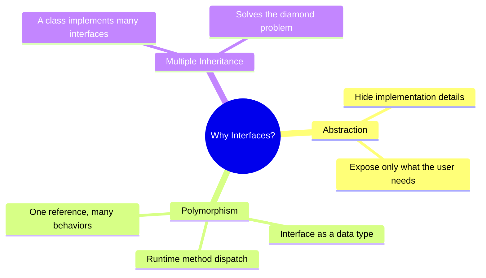
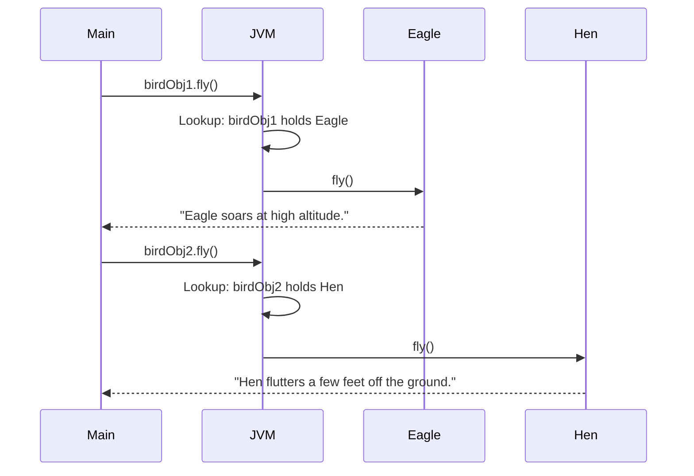
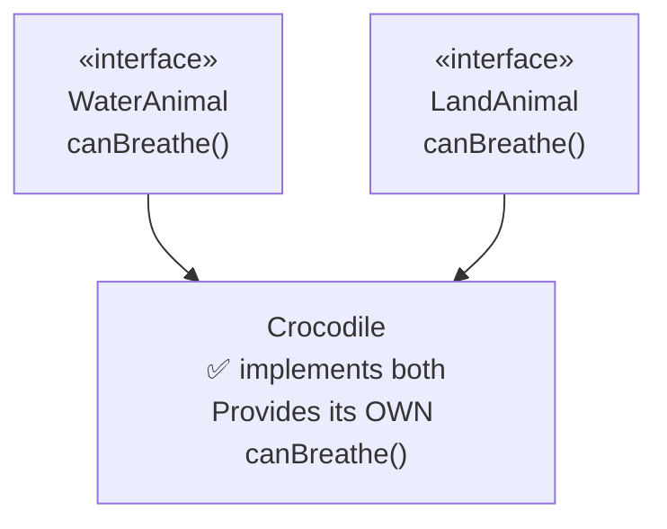
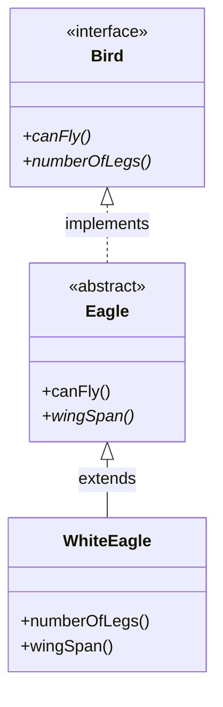
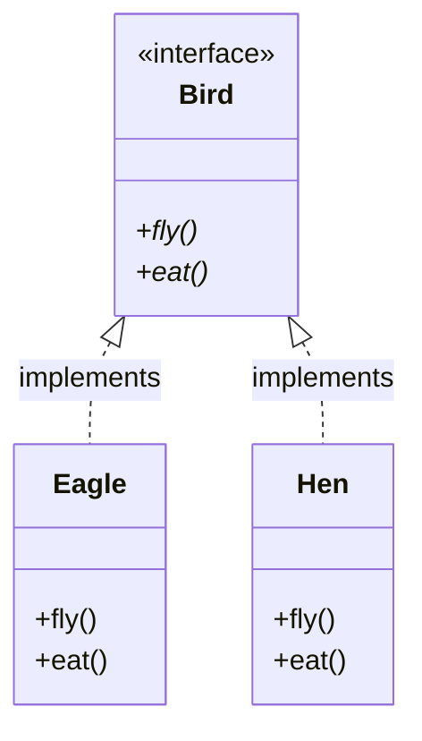
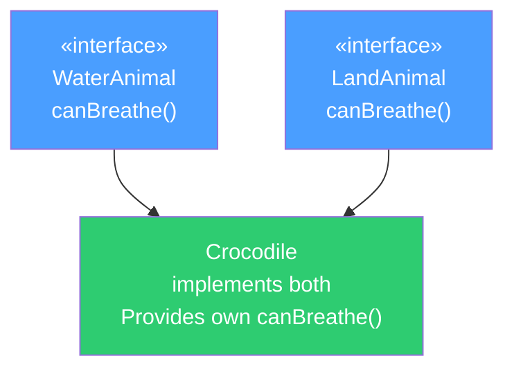
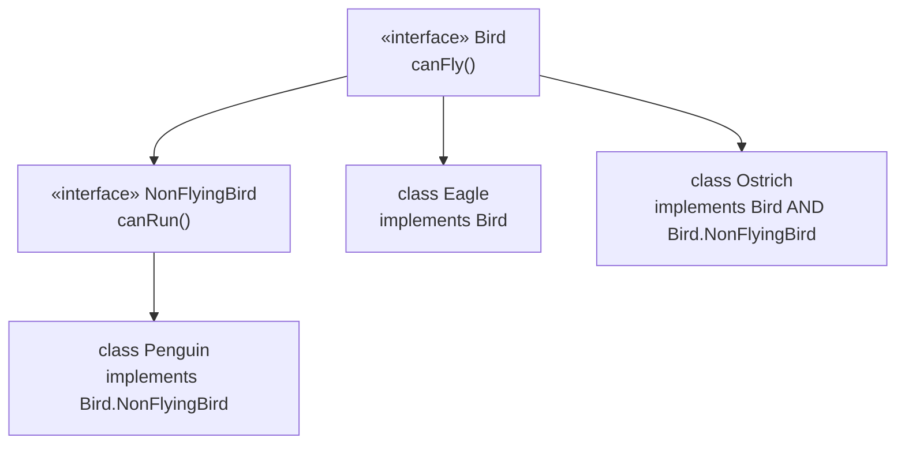
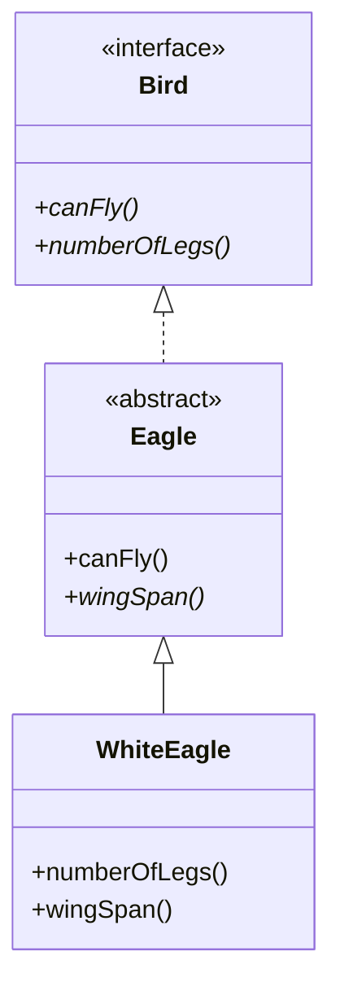
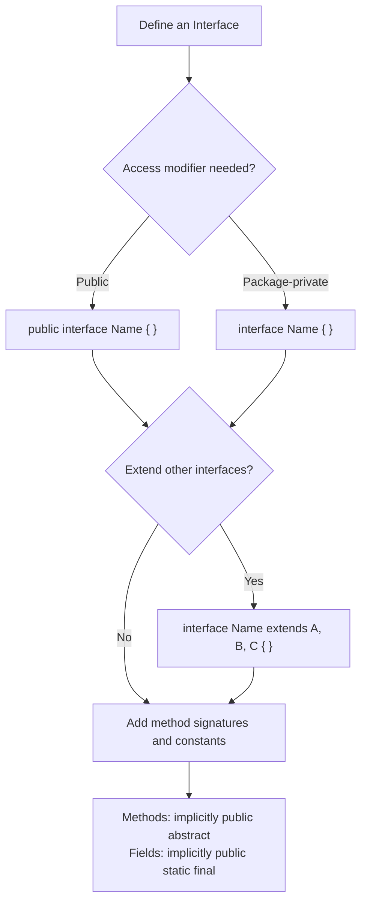

# 📚 Java Interfaces — Comprehensive Study Guide (Part 1)

> Part of the *Concept and Coding* Java lecture series.
> These notes are fully self-contained — no prior lecture viewing is required.
> This chapter covers interfaces in depth: definition, why they exist, methods, fields, implementation rules, nested interfaces, and the full comparison with abstract classes.
> Java 8 and Java 9 interface features are covered in Part 2.

---

## Table of Contents

1. [What is an Interface?](#1-what-is-an-interface)
2. [How to Define an Interface](#2-how-to-define-an-interface)
3. [Why We Need Interfaces](#3-why-we-need-interfaces)
   - [Abstraction](#31-abstraction)
   - [Polymorphism](#32-polymorphism)
   - [Multiple Inheritance](#33-multiple-inheritance--the-diamond-problem)
4. [Methods in an Interface](#4-methods-in-an-interface)
5. [Fields in an Interface](#5-fields-in-an-interface)
6. [Interface Implementation](#6-interface-implementation)
7. [Abstract Class Implementing an Interface](#7-abstract-class-implementing-an-interface)
8. [Nested Interfaces](#8-nested-interfaces)
9. [Interface vs Abstract Class — 10 Differences](#9-interface-vs-abstract-class--10-differences)
10. [Mermaid Diagrams](#10-mermaid-diagrams)
11. [Quick-Reference Tables](#11-quick-reference-tables)
12. [Common Mistakes](#12-common-mistakes)
13. [Best Practices](#13-best-practices)
14. [Interview Notes](#14-interview-notes)
15. [Practice Questions](#15-practice-questions)
16. [Summary Cheat Sheet](#16-summary-cheat-sheet)

---

# 1. What is an Interface?

## Overview

An interface is one of the most fundamental concepts in Java. It is the backbone of abstraction, polymorphism, and loosely coupled design. Every professional Java codebase uses interfaces extensively.

## Real-World Analogy

Consider driving a car. When you press the brake pedal, the car slows down. You (System 1) interact with the car (System 2) through the pedal — which is the **interface**. You don't know whether the car uses disc brakes, drum brakes, regenerative braking, or ABS logic. All of that is hidden. The pedal is all you need to interact with.

Another analogy: a TV remote control. The remote is the interface between you and the TV's internal electronics. You press "volume up" — you don't care how transistors and capacitors respond inside the TV.

## Technical Definition

> An **interface** in Java is a contract that defines **what** a class must do, without specifying **how** it will do it. It enables two systems (or classes) to interact with each other without one needing to know the internal details of the other.

In short: an interface defines **method signatures** (the *what*) and leaves **implementation** (the *how*) entirely to the classes that use it.

## One-Line Summary

> Interface = 100% abstraction (before Java 8). It defines a contract that implementing classes must fulfill.

---

# 2. How to Define an Interface

## Syntax

```java
modifier interface InterfaceName extends ParentInterface1, ParentInterface2 {
    // method signatures (abstract by default)
    // constants (public static final by default)
}
```

## Syntax Breakdown

| Part | Explanation |
|------|-------------|
| `modifier` | Only `public` or default (package-private) are allowed |
| `interface` | The keyword that declares this as an interface |
| `InterfaceName` | Name of the interface — by convention, a noun or adjective (e.g., `Flyable`, `Comparable`) |
| `extends` | Used when this interface extends one or more other interfaces |
| `ParentInterface1, ParentInterface2` | Comma-separated list of parent interfaces (NOT classes) |
| `{ ... }` | Body — contains method signatures and constants |

## Access Modifiers for Interfaces

| Modifier | Allowed? | Meaning |
|----------|----------|---------|
| `public` | ✅ Yes | Accessible from any package |
| *(default / package-private)* | ✅ Yes | Accessible only within the same package |
| `protected` | ❌ No | Not applicable to top-level interfaces |
| `private` | ❌ No | Not applicable to top-level interfaces |

## Basic Example

```java
public interface Bird {
    void fly();     // abstract method — signature only, no body
}
```

## Interface Extending Multiple Interfaces

An interface can extend **multiple other interfaces** using a comma-separated list:

```java
public interface Bird {
    void fly();
}

public interface LivingThing {
    void breathe();
}

// NonFlyingBird extends both Bird and LivingThing
public interface NonFlyingBird extends Bird, LivingThing {
    void run();
}
```

> [!IMPORTANT]
> An interface can only extend **other interfaces** — never a class. This is different from a class, which uses `implements` for interfaces and `extends` for classes.

---

# 3. Why We Need Interfaces

There are three primary reasons Java provides interfaces:



---

## 3.1 Abstraction

### What is Abstraction?

Abstraction means **hiding implementation details** and **exposing only the features** the user needs to know.

### How Interfaces Achieve Abstraction

An interface defines only method signatures — there is no implementation code. The implementing class provides the *how*. The caller only ever sees the *what*.

```
┌─────────────┐     interface      ┌─────────────────┐
│  System 1   │ ─── fly(), eat() ──▶  System 2        │
│  (caller)   │                   │  (implementer)   │
│             │                   │  full logic here │
└─────────────┘                   └─────────────────┘
     ↑
knows nothing about
System 2's internals
```

### Code Example

```java
public interface Car {
    void applyBrake();   // caller only knows this method exists
}

public class Audi implements Car {
    @Override
    public void applyBrake() {
        // hundreds of lines of internal logic:
        // ABS activation, brake fluid pressure, calliper engagement...
        System.out.println("Audi: ABS brake engaged.");
    }
}

public class Main {
    public static void main(String[] args) {
        Car car = new Audi();
        car.applyBrake();   // caller doesn't know or care how this works
    }
}
```

**Output:**
```
Audi: ABS brake engaged.
```

The `Main` class only knows about `applyBrake()`. The entire internal complexity of braking is hidden behind the interface — that is abstraction.

---

## 3.2 Polymorphism

### Interface as a Data Type

An interface can be used as a **reference type** (data type), just like a class. This enables polymorphism — one reference variable that can hold objects of different concrete classes, and calls the correct method at runtime.

> [!IMPORTANT]
> You **cannot** create an object of an interface directly:
> ```java
> Bird b = new Bird();  // ❌ COMPILE ERROR — cannot instantiate interface
> ```
> But you **can** hold a reference to a concrete class that implements it:
> ```java
> Bird b = new Eagle();  // ✅ Eagle implements Bird
> ```

### Code Example — Runtime Polymorphism

```java
public interface Bird {
    void fly();
}

public class Eagle implements Bird {
    @Override
    public void fly() {
        System.out.println("Eagle soars at high altitude.");
    }
}

public class Hen implements Bird {
    @Override
    public void fly() {
        System.out.println("Hen flutters a few feet off the ground.");
    }
}

public class Main {
    public static void main(String[] args) {
        Bird birdObj1 = new Eagle();   // interface reference → Eagle object
        Bird birdObj2 = new Hen();     // interface reference → Hen object

        birdObj1.fly();  // runtime lookup: birdObj1 holds Eagle → calls Eagle.fly()
        birdObj2.fly();  // runtime lookup: birdObj2 holds Hen   → calls Hen.fly()
    }
}
```

**Output:**
```
Eagle soars at high altitude.
Hen flutters a few feet off the ground.
```

### How Runtime Dispatch Works

When `birdObj1.fly()` is called:

1. JVM checks: what object does `birdObj1` actually hold at runtime?
2. Answer: an `Eagle` object.
3. JVM calls `Eagle`'s `fly()` method.

This decision happens **at runtime** (not compile time) — that is **dynamic dispatch** / **runtime polymorphism**.



---

## 3.3 Multiple Inheritance & The Diamond Problem

### Why Multiple Inheritance is Banned for Classes

In Java, **a class cannot extend more than one class**. The reason is the **Diamond Problem**.

### The Diamond Problem — Explained

Imagine (hypothetically) that multiple class inheritance was allowed:

```
         WaterAnimal          LandAnimal
         canBreathe()         canBreathe()
               \                 /
                \               /
                  Crocodile
                 canBreathe() ???
```

```java
// HYPOTHETICAL — does NOT compile in Java
class WaterAnimal {
    void canBreathe() { System.out.println("Breathing in water"); }
}

class LandAnimal {
    void canBreathe() { System.out.println("Breathing on land"); }
}

// This would cause ambiguity:
class Crocodile extends WaterAnimal, LandAnimal {  // ❌ not allowed
    // Which canBreathe() should be called?
    // WaterAnimal's or LandAnimal's?
    // The compiler cannot decide — this is the Diamond Problem.
}
```

When `crocodileObj.canBreathe()` is called, the compiler has no way to determine which parent's implementation to use. This ambiguity is the **Diamond Problem**, and it is why Java **does not** allow multiple class inheritance.

### How Interfaces Solve This

With interfaces, methods have **no implementation** (just signatures). So there is **nothing to be ambiguous about**. The implementing class provides its own implementation, which overrides everything:

```java
interface WaterAnimal {
    void canBreathe();   // signature only — no implementation
}

interface LandAnimal {
    void canBreathe();   // signature only — no implementation
}

// ✅ No ambiguity — Crocodile provides ITS OWN implementation
class Crocodile implements WaterAnimal, LandAnimal {
    @Override
    public void canBreathe() {
        System.out.println("Crocodile breathes through nostrils.");
    }
}

public class Main {
    public static void main(String[] args) {
        Crocodile c = new Crocodile();
        c.canBreathe();  // no confusion — calls Crocodile's own implementation
    }
}
```

**Output:**
```
Crocodile breathes through nostrils.
```

When `c.canBreathe()` is called, there is zero ambiguity. The compiler calls `Crocodile`'s own `canBreathe()` — which it was required to provide when it implemented both interfaces.



> [!IMPORTANT]
> **A class in Java can implement any number of interfaces.** This is how multiple inheritance is safely achieved.
> ```java
> class Crocodile implements WaterAnimal, LandAnimal, Reptile, Predator { ... }
> ```

---

# 4. Methods in an Interface

## Key Rules for Interface Methods

### Rule 1 — All Methods Are Implicitly `public`

Whether or not you write `public`, all methods in an interface are public by default:

```java
public interface Bird {
    void fly();           // implicitly public — same as writing 'public void fly()'
    public void eat();    // explicitly public — same as above
}
```

Both `fly()` and `eat()` are identical in terms of access — both are `public`. Writing `public` is optional but not wrong.

### Rule 2 — Methods Cannot Be Declared `final`

```java
public interface Bird {
    final void fly();  // ❌ COMPILE ERROR
}
```

**Why?** The `final` keyword on a method means it **cannot be overridden** in subclasses. But the entire purpose of an interface method is to **be overridden** (implemented) by concrete classes. Declaring it `final` would contradict the fundamental purpose of an interface. The two concepts are mutually exclusive.

### Rule 3 — Methods Are Abstract by Default (Pre-Java 8)

All methods in an interface (before Java 8) are implicitly `abstract` — they have no body, only a signature:

```java
public interface Bird {
    void fly();            // implicitly: public abstract void fly();
    abstract void eat();   // same as above — 'abstract' is redundant but valid
}
```

> [!NOTE]
> **Java 8 and Java 9** introduced `default`, `static`, and `private` methods in interfaces, which CAN have method bodies. These are covered in Part 2 of this series.

### Summary Table — Interface Method Rules

| Property | Rule |
|----------|------|
| Access modifier | Implicitly `public` — always |
| Abstract | Implicitly `abstract` (pre-Java 8) — no body |
| `final` | ❌ Not allowed — contradicts overriding |
| `private` | ❌ Not allowed before Java 9 |
| `protected` | ❌ Not allowed |
| `static` | ✅ Allowed from Java 8 (with body) |
| `default` | ✅ Allowed from Java 8 (with body) |

---

# 5. Fields in an Interface

## Key Rule — All Fields Are `public static final`

Every variable (field) declared in an interface is implicitly:
- `public` — accessible from anywhere
- `static` — belongs to the interface itself, not to any instance
- `final` — cannot be changed after assignment (it is a **constant**)

```java
public interface Bird {
    int MAX_HEIGHT_IN_FEET = 2000;
    // identical to:
    // public static final int MAX_HEIGHT_IN_FEET = 2000;
}
```

Both declarations above are completely equivalent.

## Why Are Interface Fields Always Constants?

Interfaces cannot be instantiated, so instance variables (non-static fields) make no sense. Every field must be associated with the interface itself (hence `static`) and should not be changeable by implementors (hence `final`). This ensures the interface provides reliable, unchangeable constants.

## Code Example

```java
public interface GeographicConstants {
    double EARTH_RADIUS_KM = 6371.0;         // public static final
    int    MAX_ALTITUDE_FEET = 60000;         // public static final
    String PLANET_NAME = "Earth";             // public static final
}

public class FlightCalculator implements GeographicConstants {
    public void display() {
        System.out.println("Planet: " + PLANET_NAME);
        System.out.println("Earth radius: " + EARTH_RADIUS_KM + " km");
        System.out.println("Max altitude: " + MAX_ALTITUDE_FEET + " feet");
    }
}

public class Main {
    public static void main(String[] args) {
        FlightCalculator fc = new FlightCalculator();
        fc.display();

        // Access directly via interface name — it's static
        System.out.println(GeographicConstants.EARTH_RADIUS_KM);
    }
}
```

**Output:**
```
Planet: Earth
Earth radius: 6371.0 km
Max altitude: 60000 feet
6371.0
```

> [!CAUTION]
> You cannot modify interface constants:
> ```java
> GeographicConstants.EARTH_RADIUS_KM = 5000.0;  // ❌ COMPILE ERROR — field is final
> ```

---

# 6. Interface Implementation

## The `implements` Keyword

A class uses the `implements` keyword to adopt an interface:

```java
class ClassName implements InterfaceName {
    // must provide implementation for all abstract methods
}
```

## Rule 1 — Overriding Method Cannot Have a More Restrictive Access Modifier

Interface methods are implicitly `public`. When a class implements an interface method, it must maintain or widen the access — it **cannot** narrow it (e.g., making it `protected` or `private`):

```java
public interface Bird {
    void fly();  // implicitly public
}

public class Eagle implements Bird {
    @Override
    protected void fly() {  // ❌ COMPILE ERROR — more restrictive than public
        System.out.println("Eagle flies.");
    }
}
```

**Fix:**

```java
public class Eagle implements Bird {
    @Override
    public void fly() {   // ✅ must be public (same as interface)
        System.out.println("Eagle flies.");
    }
}
```

> [!IMPORTANT]
> **Access can only be maintained or widened — never narrowed** when overriding. Since interface methods are `public`, implementing methods must also be `public`.

## Rule 2 — A Concrete Class Must Implement ALL Abstract Methods

If a concrete class implements an interface but does not implement every abstract method declared in it, the compiler will throw an error:

```java
public interface Bird {
    void fly();
    void eat();
    void nest();
}

public class Eagle implements Bird {
    @Override
    public void fly() { System.out.println("Flying."); }

    @Override
    public void eat() { System.out.println("Eating."); }

    // ❌ nest() is not implemented — COMPILE ERROR
    // "Eagle is not abstract and does not override abstract method nest() in Bird"
}
```

**Fix — implement all methods:**

```java
public class Eagle implements Bird {
    @Override
    public void fly()  { System.out.println("Flying."); }
    @Override
    public void eat()  { System.out.println("Eating."); }
    @Override
    public void nest() { System.out.println("Nesting."); }
}
```

## Rule 3 — A Class Can Implement Multiple Interfaces

```java
interface Flyable   { void fly(); }
interface Swimmable { void swim(); }
interface Runnable  { void run(); }

// One class, three interfaces ✅
public class Duck implements Flyable, Swimmable, Runnable {
    @Override public void fly()  { System.out.println("Duck flies."); }
    @Override public void swim() { System.out.println("Duck swims."); }
    @Override public void run()  { System.out.println("Duck runs."); }
}
```

## Full Implementation Code Example

```java
public interface Bird {
    void fly();
    void eat();
}

public class Eagle implements Bird {
    @Override
    public void fly() {
        System.out.println("Eagle: soaring at 3000 feet.");
    }

    @Override
    public void eat() {
        System.out.println("Eagle: catching fish.");
    }
}

public class Hen implements Bird {
    @Override
    public void fly() {
        System.out.println("Hen: fluttering 2 feet.");
    }

    @Override
    public void eat() {
        System.out.println("Hen: pecking at grain.");
    }
}

public class Main {
    public static void main(String[] args) {
        Bird b1 = new Eagle();
        Bird b2 = new Hen();

        b1.fly(); b1.eat();
        b2.fly(); b2.eat();
    }
}
```

**Output:**
```
Eagle: soaring at 3000 feet.
Eagle: catching fish.
Hen: fluttering 2 feet.
Hen: pecking at grain.
```

---

# 7. Abstract Class Implementing an Interface

## Key Rule

An **abstract class** that implements an interface is **not required** to implement all abstract methods from that interface. It can:

- Implement some methods (provide concrete implementations).
- Leave others as abstract (to be implemented by a concrete subclass).
- Add additional abstract methods of its own.

A **concrete class** in the chain, however, must implement every remaining unimplemented abstract method.

## Code Example

```java
public interface Bird {
    void canFly();
    void numberOfLegs();
}

// Abstract class implementing Bird — not forced to implement everything
public abstract class Eagle implements Bird {
    @Override
    public void canFly() {              // ✅ provides implementation
        System.out.println("Yes, eagle can fly.");
    }
    // numberOfLegs() is NOT implemented — left as abstract for children

    public abstract void wingSpan();    // adds a new abstract method
}

// Concrete class — MUST implement all remaining abstract methods
public class WhiteEagle extends Eagle {
    @Override
    public void numberOfLegs() {        // ✅ from Bird interface
        System.out.println("2 legs.");
    }

    @Override
    public void wingSpan() {            // ✅ from Eagle abstract class
        System.out.println("Wingspan: 7 feet.");
    }
}

public class Main {
    public static void main(String[] args) {
        WhiteEagle we = new WhiteEagle();
        we.canFly();        // from Eagle (concrete)
        we.numberOfLegs();  // from WhiteEagle (overrides Bird's abstract)
        we.wingSpan();      // from WhiteEagle (overrides Eagle's abstract)
    }
}
```

**Output:**
```
Yes, eagle can fly.
2 legs.
Wingspan: 7 feet.
```

## Class Hierarchy Diagram



### How the Concrete Class Checks for Unimplemented Methods

When the compiler processes `WhiteEagle`, it traces up the hierarchy and identifies every unimplemented abstract method:

1. From `Eagle` (parent): `wingSpan()` — abstract, not implemented → `WhiteEagle` must implement it ✅
2. From `Bird` (via `Eagle`): `canFly()` — already implemented in `Eagle` → no action needed ✅
3. From `Bird` (via `Eagle`): `numberOfLegs()` — not implemented anywhere → `WhiteEagle` must implement it ✅

---

# 8. Nested Interfaces

## Definition

> A **nested interface** is an interface declared **inside another interface** or **inside a class**.

## When to Use

Nested interfaces are used to **group logically related interfaces** in one place — similar to how nested classes group related classes.

> [!NOTE]
> Nested interfaces are rarely used in real-world production code. They appear in Java's own standard library (e.g., `Map.Entry` inside `Map`) and occasionally in interview questions.

---

## 8.1 Interface Nested Within an Interface

### Rules

| Rule | Detail |
|------|--------|
| Access modifier | Must be `public` — everything inside an interface is public |
| Can have its own abstract methods | ✅ Yes |
| Can be implemented independently | ✅ Yes |
| Can be implemented alongside the outer interface | ✅ Yes |

### Code Example

```java
public interface Bird {
    void canFly();                        // outer interface method

    public interface NonFlyingBird {      // nested interface — must be public
        void canRun();                    // nested interface method
    }
}
```

### Usage — Implementing Only the Outer Interface

```java
public class Eagle implements Bird {
    @Override
    public void canFly() {
        System.out.println("Eagle can fly.");
    }
    // NonFlyingBird not implemented — not required
}
```

### Usage — Implementing Only the Inner (Nested) Interface

```java
public class Penguin implements Bird.NonFlyingBird {   // access via Outer.Inner
    @Override
    public void canRun() {
        System.out.println("Penguin can run fast.");
    }
}

public class Main {
    public static void main(String[] args) {
        Bird.NonFlyingBird nfb = new Penguin();
        nfb.canRun();
    }
}
```

**Output:**
```
Penguin can run fast.
```

### Usage — Implementing Both Outer and Inner Interface

```java
public class Ostrich implements Bird, Bird.NonFlyingBird {
    @Override
    public void canFly() {
        System.out.println("Ostrich cannot really fly.");
    }

    @Override
    public void canRun() {
        System.out.println("Ostrich runs at 45 mph.");
    }
}
```

> [!IMPORTANT]
> Implementing the **outer** interface does NOT automatically require implementing the **inner** interface — and vice versa. They are independent contracts.

---

## 8.2 Interface Nested Within a Class

When an interface is nested inside a **class** (not another interface), it can have any access modifier: `public`, `protected`, `private`, or default.

### Rules

| Property | Nested in Interface | Nested in Class |
|----------|--------------------|-----------------| 
| Access modifiers allowed | `public` only | `public`, `protected`, `private`, default |
| Reason | Interface members are always public | Class members can have any access |

### Code Example

```java
public class Bird {
    protected interface NonFlyingBird {   // ✅ protected is allowed here
        void canRun();
    }
}

public class Emu implements Bird.NonFlyingBird {
    @Override
    public void canRun() {
        System.out.println("Emu runs at 30 mph.");
    }
}

public class Main {
    public static void main(String[] args) {
        Bird.NonFlyingBird nfb = new Emu();
        nfb.canRun();
    }
}
```

**Output:**
```
Emu runs at 30 mph.
```

### Private Nested Interface (Inside a Class)

```java
public class SecuritySystem {
    private interface Authenticator {    // only SecuritySystem can see this
        boolean authenticate(String password);
    }

    private class SimpleAuth implements Authenticator {
        @Override
        public boolean authenticate(String password) {
            return "secret123".equals(password);
        }
    }

    public boolean login(String password) {
        Authenticator auth = new SimpleAuth();
        return auth.authenticate(password);
    }
}
```

This pattern fully encapsulates the authentication strategy inside `SecuritySystem` — no outside class even knows `Authenticator` exists.

---

## 8.3 Famous Real-World Example — `Map.Entry`

Java's own standard library uses nested interfaces. `Map.Entry<K,V>` is an interface nested inside the `Map<K,V>` interface:

```java
// Simplified — how Java's Map.Entry works
public interface Map<K, V> {
    interface Entry<K, V> {       // nested interface
        K getKey();
        V getValue();
    }

    Set<Entry<K, V>> entrySet();
}
```

You use it like this:

```java
Map<String, Integer> scores = new HashMap<>();
scores.put("Alice", 95);

for (Map.Entry<String, Integer> entry : scores.entrySet()) {
    System.out.println(entry.getKey() + " → " + entry.getValue());
}
```

---

# 9. Interface vs Abstract Class — 10 Differences

This is one of the most frequently asked topics in Java interviews.

| # | Property | Abstract Class | Interface |
|---|----------|---------------|-----------|
| 1 | **Keyword** | `abstract class ClassName` | `interface InterfaceName` |
| 2 | **Used with** | `extends` (child class) | `implements` (child class) |
| 3 | **Method types** | Both abstract AND concrete methods | Only abstract (pre-Java 8); `default`/`static` added in Java 8 |
| 4 | **Inheritance** | Can extend one class + multiple interfaces | Can extend multiple interfaces only |
| 5 | **Variables** | Can be `static`, non-static, `final`, non-final | Always `public static final` (constants only) |
| 6 | **Access modifiers on members** | `private`, `protected`, `public`, default | Only `public` (pre-Java 9); `private` added in Java 9 |
| 7 | **Multiple inheritance** | ❌ Not supported | ✅ Supported (a class can implement many) |
| 8 | **Constructor** | ✅ Can have constructors | ❌ Cannot have constructors |
| 9 | **Abstract method declaration** | Requires `abstract` keyword: `abstract void fly();` | No keyword needed — signature alone is abstract: `void fly();` |
| 10 | **Abstract method access** | Can be `protected`, `public`, or default | Always `public` |

## Code Side-by-Side

```java
// Abstract Class
abstract class Animal {
    String name;                        // instance variable ✅
    private int age;                    // private variable ✅

    Animal(String name) {               // constructor ✅
        this.name = name;
    }

    abstract void makeSound();          // abstract method — needs 'abstract' keyword
    void breathe() {                    // concrete method ✅
        System.out.println("Breathing.");
    }
}

// Interface
interface Creature {
    int MAX_LIFESPAN = 100;             // public static final constant

    void makeSound();                   // abstract — no keyword needed, no body
    // void breathe() { ... }          // ❌ not allowed pre-Java 8
}
```

## Key Notes on the 10 Differences

**Difference 3 — Methods (important clarification):**
Before Java 8, interfaces could ONLY have abstract methods. From Java 8, `default` and `static` methods with bodies are allowed. From Java 9, `private` methods are also allowed. These are covered in Part 2.

**Difference 7 — Multiple Inheritance:**
```java
// Abstract class — only ONE parent class
abstract class A extends B { }  // B must be a class

// Interface — MANY parent interfaces
interface X extends Y, Z, W { }  // Y, Z, W must all be interfaces

// Class implementing multiple interfaces
class MyClass implements X, Y, Z { }  // ✅ allowed
```

**Difference 10 — Abstract method in abstract class can be protected:**
```java
abstract class Animal {
    protected abstract void makeSound();  // ✅ protected is fine in abstract class
}

// But in interface — always public:
interface Creature {
    void makeSound();  // implicitly public — cannot be protected
}
```

---

# 10. Mermaid Diagrams

## Interface Implementation Chain



## Multiple Interface Implementation (Diamond Problem Solution)



## Nested Interface Structure



## Abstract Class + Interface Hierarchy



## Interface Definition Flowchart



---

# 11. Quick-Reference Tables

## Interface Members — Implicit Modifiers

| Member | Implicit Modifiers | Can You Change? |
|--------|--------------------|----------------|
| Methods | `public abstract` | Add `public` explicitly — fine. Change to `private`/`protected` — ❌ |
| Fields | `public static final` | Add explicitly — fine. Change to non-static or non-final — ❌ |
| Nested interfaces (in interface) | `public` | Cannot make private/protected |
| Nested interfaces (in class) | none | Can be `public`, `protected`, `private`, or default |

## Can vs Cannot — Interface Checklist

| Action | Allowed? |
|--------|----------|
| Create an object of an interface | ❌ No |
| Hold a reference to an implementing class | ✅ Yes |
| Interface extends multiple interfaces | ✅ Yes |
| Interface extends a class | ❌ No |
| Class implements multiple interfaces | ✅ Yes |
| Abstract class implements interface partially | ✅ Yes |
| Concrete class implements interface partially | ❌ No — must implement all |
| Method in interface declared `final` | ❌ No |
| Method in interface declared `private` | ❌ No (before Java 9) |
| Field in interface non-final | ❌ No |
| Interface have a constructor | ❌ No |

---

# 12. Common Mistakes

## Mistake 1: Trying to Instantiate an Interface

```java
Bird b = new Bird();  // ❌ COMPILE ERROR — Bird is an interface
```

**Fix:** Instantiate a concrete implementing class:

```java
Bird b = new Eagle();  // ✅ Eagle implements Bird
```

---

## Mistake 2: Making Interface Method `final`

```java
public interface Animal {
    final void eat();  // ❌ COMPILE ERROR — illegal modifier final for interface method
}
```

**Fix:** Remove `final` — interface methods are abstract by design and must be overridable:

```java
public interface Animal {
    void eat();  // ✅
}
```

---

## Mistake 3: Using More Restrictive Access in Implementing Class

```java
public interface Bird {
    void fly();  // public
}

public class Eagle implements Bird {
    void fly() { }         // ❌ package-private — more restrictive than public
    protected void fly() { } // ❌ protected — more restrictive than public
}
```

**Fix:**

```java
public class Eagle implements Bird {
    @Override
    public void fly() { }  // ✅ must match or be less restrictive
}
```

---

## Mistake 4: Trying to Modify an Interface Field

```java
public interface Config {
    int TIMEOUT = 30;
}

Config.TIMEOUT = 60;  // ❌ COMPILE ERROR — field is final
```

Interface fields are constants — they can never be changed after initialization.

---

## Mistake 5: Concrete Class Missing Interface Method Implementation

```java
public interface Shape {
    double area();
    double perimeter();
}

public class Circle implements Shape {
    @Override
    public double area() { return 3.14 * 5 * 5; }
    // perimeter() missing ❌ COMPILE ERROR
}
```

**Fix:** Implement all methods, or declare the class `abstract`:

```java
// Option A: implement all
public class Circle implements Shape {
    @Override public double area()      { return Math.PI * 5 * 5; }
    @Override public double perimeter() { return 2 * Math.PI * 5; }
}

// Option B: declare abstract (let subclass implement perimeter)
public abstract class Circle implements Shape {
    @Override public double area() { return Math.PI * 5 * 5; }
    // perimeter() left for subclass
}
```

---

## Mistake 6: Interface Extending a Class

```java
class Animal { }
interface Pet extends Animal { }  // ❌ COMPILE ERROR — interface cannot extend a class
```

**Fix:** Interfaces can only extend other interfaces:

```java
interface LivingThing { }
interface Pet extends LivingThing { }  // ✅
```

---

# 13. Best Practices

1. **Program to interfaces, not implementations.** Always declare reference variables using the interface type:
   ```java
   Bird bird = new Eagle();  // ✅ use interface type
   Eagle eagle = new Eagle(); // ❌ avoid — ties you to the concrete class
   ```

2. **Name interfaces as adjectives or nouns** describing capability: `Flyable`, `Comparable`, `Serializable`, `Runnable`, `Iterator` — not `FlyInterface` or `IBird`.

3. **Keep interfaces focused (ISP — Interface Segregation Principle).** Don't create one giant interface with 20 methods. Split into smaller, specific interfaces. A class should implement only what it actually needs.

4. **Use interface constants (`public static final`) for true constants only** — values that logically belong to the interface's contract and will never change.

5. **Prefer interfaces over abstract classes** when you only need to define a contract and no shared state. This also allows implementors to extend another class freely.

6. **Use abstract classes** when you need to share common state (instance variables) or provide partial implementations that all subclasses should inherit.

7. **Add `@Override`** when implementing interface methods — it lets the compiler catch typos in method signatures.

8. **Use nested interfaces sparingly** — only when the nested interface is meaningfully tied to the outer type (like `Map.Entry`).

---

# 14. Interview Notes

## Most Frequently Asked Questions

**Q1: What is an interface in Java?**

A: An interface is a contract that defines what a class must do (method signatures and constants) without specifying how. It enables abstraction, polymorphism, and multiple inheritance. A class uses `implements` to adopt an interface and must provide implementations for all its abstract methods.

---

**Q2: What are the three main advantages of interfaces?**

A: Abstraction (hides implementation), Polymorphism (interface reference holds different object types; runtime dispatch), and Multiple Inheritance (a class can implement many interfaces, solving the diamond problem that prevents multiple class inheritance).

---

**Q3: What is the diamond problem and how do interfaces solve it?**

A: If class C extends both A and B, and both have a method `foo()`, the compiler cannot determine which `foo()` to call — this ambiguity is the diamond problem. Interfaces solve it because they only declare method signatures, not implementations. The implementing class always provides its own implementation, eliminating ambiguity.

---

**Q4: What modifiers are implicitly applied to interface methods and fields?**

A: Methods are implicitly `public abstract`. Fields are implicitly `public static final` (constants).

---

**Q5: Why can't interface methods be `final`?**

A: `final` prevents overriding. But the entire purpose of interface methods is to be overridden (implemented) by concrete classes. Declaring them `final` would create an unimplementable method — a direct contradiction.

---

**Q6: Can an abstract class implement an interface?**

A: Yes. An abstract class can implement an interface without providing implementations for all methods — it can leave some as abstract for its concrete subclasses to implement. A concrete class, however, must implement every unimplemented abstract method in the chain.

---

**Q7: What is the difference between `extends` and `implements`?**

A: `extends` is used when a class inherits from another class, or when an interface inherits from another interface. `implements` is used only when a class adopts an interface.

---

**Q8: Can an interface extend multiple interfaces?**

A: Yes. `interface C extends A, B { }` is perfectly legal. An interface can extend any number of other interfaces.

---

**Q9: Can you create an object of an interface?**

A: No. But you can create a reference variable of interface type that holds an object of a concrete implementing class:
```java
Bird b = new Eagle();  // ✅
```

---

**Q10: What is a nested interface?**

A: An interface declared inside another interface or class. When nested inside an interface, it must be `public`. When nested inside a class, it can be any access modifier. The famous example is `Map.Entry` inside `Map`.

---

**Q11: What changed in Java 8 for interfaces?**

A: Java 8 introduced `default` methods (concrete methods with a body, using the `default` keyword) and `static` methods in interfaces. This partially blurred the line between abstract classes and interfaces. Java 9 further added `private` methods. These are covered in Part 2.

---

**Q12: Can an interface have a constructor?**

A: No. Interfaces cannot be instantiated, so constructors serve no purpose in them.

---

# 15. Practice Questions

## Easy

1. What keyword does a class use to adopt an interface?
2. What are the implicit modifiers on interface methods?
3. What are the implicit modifiers on interface fields?
4. Can you instantiate an interface? Can you hold a reference to an implementing class?
5. Can an interface extend a class?

## Medium

6. Create an interface `Shape` with methods `area()` and `perimeter()`. Implement it with `Circle` and `Rectangle` classes. Store both in a `Shape[]` array and call both methods on each.

7. Demonstrate the diamond problem using classes (show why it fails), then solve it using interfaces.

8. Create an interface `Flyable` and `Swimmable`. Create a class `Duck` that implements both. Call methods through both interface reference types.

9. Write a nested interface `Map.Entry` style example with an outer interface `Library` containing a nested interface `Book`. Implement both using a class.

10. What is the output of the following code?
    ```java
    interface A { int X = 10; }
    interface B { int X = 20; }
    class C implements A, B {
        public void show() {
            System.out.println(A.X);
            System.out.println(B.X);
        }
    }
    ```

## Hard

11. Create an abstract class `Vehicle` that implements an interface `Drivable` (with methods `start()` and `stop()`). The abstract class should implement `start()` but leave `stop()` for concrete children. Create a concrete `Car` class that completes the hierarchy.

12. Explain why the following does not compile and fix it:
    ```java
    interface Greeter { void greet(); }
    class Hello implements Greeter {
        protected void greet() { System.out.println("Hello!"); }
    }
    ```

13. Create an interface `Sortable` with a constant `ASCENDING = 1` and `DESCENDING = -1`. Implement it in a `NumberSorter` class. Try to change the constant from the implementing class and explain what happens.

14. Explain the difference between an interface and an abstract class with respect to constructors, instance variables, and multiple inheritance. Give a code example for each difference.

15. Create a class that implements a nested interface declared inside another interface. Show how to reference the nested interface type from an external class.

---

# 16. Summary Cheat Sheet

```
┌─────────────────────────────────────────────────────────────────────────────┐
│                    JAVA INTERFACES — QUICK SUMMARY (Part 1)                  │
├─────────────────────────────────────────────────────────────────────────────┤
│ DEFINITION                                                                   │
│  Contract: defines WHAT a class must do, not HOW.                          │
│  Keyword: 'interface'. Implemented with 'implements'.                       │
├─────────────────────────────────────────────────────────────────────────────┤
│ THREE KEY ADVANTAGES                                                         │
│  1. Abstraction    — hides implementation from caller                       │
│  2. Polymorphism   — interface reference holds different concrete objects   │
│  3. Multiple Inh.  — one class implements many interfaces (no diamond issue)│
├─────────────────────────────────────────────────────────────────────────────┤
│ METHODS                                                                      │
│  Implicitly: public abstract                                                │
│  Cannot be: final, private, protected (pre-Java 9)                         │
├─────────────────────────────────────────────────────────────────────────────┤
│ FIELDS                                                                       │
│  Implicitly: public static final (constants)                                │
│  Cannot be changed (final) or made private                                 │
├─────────────────────────────────────────────────────────────────────────────┤
│ IMPLEMENTATION RULES                                                         │
│  Concrete class: must implement ALL abstract methods                        │
│  Abstract class: may implement some or none                                 │
│  Override access: cannot be more restrictive than public                    │
│  A class can implement multiple interfaces: implements A, B, C              │
├─────────────────────────────────────────────────────────────────────────────┤
│ NESTED INTERFACES                                                            │
│  In interface: must be public                                               │
│  In class: any access modifier (public/protected/private/default)           │
│  Access: OuterType.NestedInterface                                          │
├─────────────────────────────────────────────────────────────────────────────┤
│ INTERFACE vs ABSTRACT CLASS — KEY DIFFERENCES                                │
│  abstract class → 'abstract'    interface → 'interface'                     │
│  child uses → 'extends'         child uses → 'implements'                   │
│  variables → any type           variables → public static final only        │
│  constructor → ✅ allowed        constructor → ❌ not allowed                │
│  multiple inh → ❌               multiple inh → ✅                           │
│  partial impl → possible        partial impl → only via abstract class      │
└─────────────────────────────────────────────────────────────────────────────┘
```

---

*End of Chapter — Java Interfaces (Part 1)*

> Next: Part 2 — Java 8 Default Methods · Static Methods in Interfaces · Java 9 Private Methods · Functional Interfaces · Lambda Expressions
