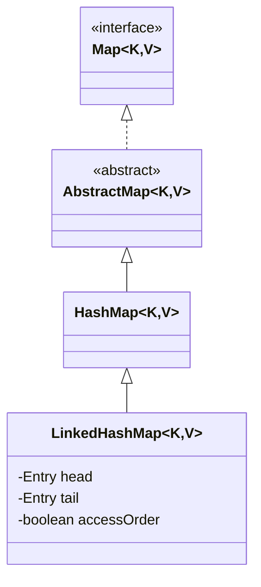
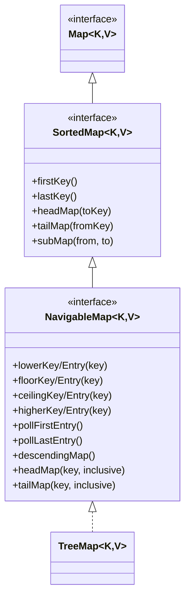
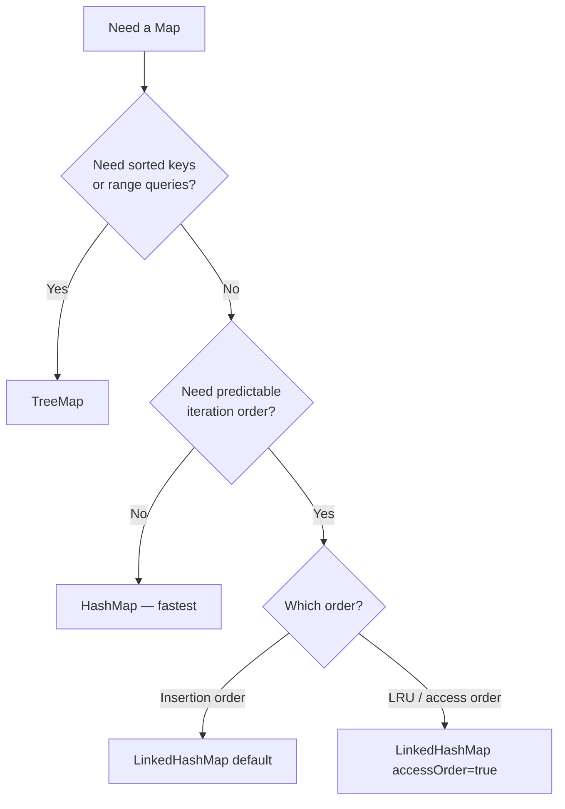

# 📚 Java Collections — Part 4: LinkedHashMap & TreeMap

> [!NOTE]
> Self-contained study guide covering **LinkedHashMap** and **TreeMap** internals, methods, and examples.

---

## 📋 Table of Contents
1. [LinkedHashMap — Overview](#1-linkedhashmap--overview)
2. [LinkedHashMap Node Structure](#2-linkedhashmap-node-structure)
3. [How Insertion Order is Maintained](#3-how-insertion-order-is-maintained)
4. [Access Order & LRU Cache](#4-access-order--lru-cache)
5. [LinkedHashMap Thread Safety](#5-linkedhashmap-thread-safety)
6. [LinkedHashMap Time Complexity](#6-linkedhashmap-time-complexity)
7. [TreeMap — Overview](#7-treemap--overview)
8. [TreeMap Internal Structure](#8-treemap-internal-structure)
9. [TreeMap Hierarchy — SortedMap & NavigableMap](#9-treemap-hierarchy--sortedmap--navigablemap)
10. [SortedMap Methods](#10-sortedmap-methods)
11. [NavigableMap Methods](#11-navigablemap-methods)
12. [TreeMap Code Examples](#12-treemap-code-examples)
13. [HashMap vs LinkedHashMap vs TreeMap](#13-hashmap-vs-linkedhashmap-vs-treemap)
14. [Common Mistakes](#14-common-mistakes)
15. [Interview Notes](#15-interview-notes)
16. [Practice Questions](#16-practice-questions)
17. [Summary Revision Bullets](#17-summary-revision-bullets)

---

# 1. LinkedHashMap — Overview

## Why It Exists

`HashMap` provides no guarantee on iteration order. `LinkedHashMap` solves this by maintaining a **doubly-linked list** over all entries — giving predictable, ordered iteration — while keeping the same O(1) average performance as HashMap.

## Two Ordering Modes

| Mode | Description | How to Enable |
|------|-------------|---------------|
| **Insertion Order** (default) | Entries returned in the order they were `put()` | `new LinkedHashMap<>()` |
| **Access Order** | Least-recently-used → most-recently-used | `new LinkedHashMap<>(capacity, loadFactor, true)` |

## Position in Hierarchy



> [!IMPORTANT]
> `LinkedHashMap` **extends** `HashMap`. It is not a separate implementation — it builds on top of HashMap's hash table and adds a doubly-linked list layer.

---

# 2. LinkedHashMap Node Structure

## HashMap Node vs LinkedHashMap Node

```java
// HashMap.Node — 4 fields
static class Node<K,V> {
    final int hash;
    final K key;
    V value;
    Node<K,V> next;       // next in same bucket (collision chain)
}

// LinkedHashMap.Entry — 6 fields (extends HashMap.Node)
static class Entry<K,V> extends HashMap.Node<K,V> {
    Entry<K,V> before;    // previous node in ordering chain
    Entry<K,V> after;     // next node in ordering chain
}
```

Every LinkedHashMap node participates in **two independent chains simultaneously**:

| Chain | Pointer used | Purpose |
|-------|-------------|---------|
| Bucket/collision chain | `.next` | Fast O(1) lookup (same as HashMap) |
| Ordering chain | `.before` / `.after` | Ordered iteration |

## Memory Layout

```
LinkedHashMap {1="A", 21="B", 23="C"}

Hash Table (buckets):
[0] → Node{key=1,  value="A", next=→Node_21}
           ↓.next
      Node{key=21, value="B", next=null}
[1] → Node{key=23, value="C", next=null}

Doubly-Linked List (before/after):
head → [key=1] ↔ [key=21] ↔ [key=23] ← tail
       (inserted first)      (inserted last)
```

---

# 3. How Insertion Order is Maintained

## Step-by-Step: Inserting `{1="A", 21="B", 23="C", 141="D", 25="E"}` into a size-3 map

| Insert | Hash Table Change | Doubly-Linked List State |
|--------|-------------------|--------------------------|
| `put(1,"A")` | `[0] → {key=1}` | `head → [1] → tail` |
| `put(21,"B")` | `[0] → {key=1}→{key=21}` (collision) | `head → [1]↔[21] → tail` |
| `put(23,"C")` | `[1] → {key=23}` | `head → [1]↔[21]↔[23] → tail` |
| `put(141,"D")` | `[2] → {key=141}` | `head → [1]↔[21]↔[23]↔[141] → tail` |
| `put(25,"E")` | `[1] → {key=23}→{key=25}` (collision) | `head → [1]↔[21]↔[23]↔[141]↔[25] → tail` |

## How Iteration Works

Iteration follows the **doubly-linked list** via `.after` from `head` to `tail` — not the hash table array. This guarantees insertion-order output regardless of bucket distribution.

```java
// Conceptually:
Entry current = head;
while (current != null) {
    yield current;
    current = current.after;
}
```

## Code Example

```java
import java.util.*;

public class LinkedHashMapDemo {
    public static void main(String[] args) {

        // HashMap — no order guarantee
        Map<Integer, String> hashMap = new HashMap<>();
        hashMap.put(1, "A"); hashMap.put(21, "B"); hashMap.put(23, "C");
        hashMap.put(141, "D"); hashMap.put(25, "E");
        System.out.println("HashMap: " + hashMap);
        // e.g. {1=A, 141=D, 21=B, 23=C, 25=E}  ← unpredictable

        // LinkedHashMap — insertion order guaranteed
        Map<Integer, String> linkedMap = new LinkedHashMap<>();
        linkedMap.put(1, "A"); linkedMap.put(21, "B"); linkedMap.put(23, "C");
        linkedMap.put(141, "D"); linkedMap.put(25, "E");
        System.out.println("LinkedHashMap: " + linkedMap);
        // {1=A, 21=B, 23=C, 141=D, 25=E}  ← always insertion order
    }
}
```

### Output
```
HashMap: {1=A, 141=D, 21=B, 23=C, 25=E}
LinkedHashMap: {1=A, 21=B, 23=C, 141=D, 25=E}
```

---

# 4. Access Order & LRU Cache

## What is Access Order?

In access-order mode, every `get()` or `put()` call **moves the accessed node to the tail**. The result:
- **Head** = Least Recently Used (LRU)
- **Tail** = Most Recently Used (MRU)

## How it Works Internally

When `get(key)` is called and `accessOrder=true`, LinkedHashMap calls `afterNodeAccess()` which:
1. Unlinks the node from its current position in the doubly-linked list.
2. Appends it to the tail.
3. Updates neighbors' `before`/`after` pointers.

## Access Order Code Example

```java
Map<Integer, String> map = new LinkedHashMap<>(16, 0.75f, true); // accessOrder=true
map.put(1, "A"); map.put(21, "B"); map.put(23, "C");
map.put(141, "D"); map.put(25, "E");

System.out.println("Before: " + map);
// {1=A, 21=B, 23=C, 141=D, 25=E}

map.get(23);  // access key 23 → moves to tail
System.out.println("After get(23): " + map);
// {1=A, 21=B, 141=D, 25=E, 23=C}

map.get(1);   // access key 1 → moves to tail
System.out.println("After get(1): " + map);
// {21=B, 141=D, 25=E, 23=C, 1=A}
```

## LRU Cache Implementation

```java
import java.util.*;

public class LRUCache<K, V> extends LinkedHashMap<K, V> {
    private final int capacity;

    public LRUCache(int capacity) {
        super(capacity, 0.75f, true);  // accessOrder = true
        this.capacity = capacity;
    }

    // Called after every put() — evicts LRU (head) when over capacity
    @Override
    protected boolean removeEldestEntry(Map.Entry<K, V> eldest) {
        return size() > capacity;
    }

    public static void main(String[] args) {
        LRUCache<Integer, String> cache = new LRUCache<>(3);
        cache.put(1, "A"); cache.put(2, "B"); cache.put(3, "C");
        System.out.println(cache);   // {1=A, 2=B, 3=C}

        cache.get(1);                // key 1 → tail; head = key 2 (LRU)
        cache.put(4, "D");           // capacity exceeded → evict head (key 2)
        System.out.println(cache);   // {3=C, 1=A, 4=D}

        cache.put(5, "E");           // evict head (key 3)
        System.out.println(cache);   // {1=A, 4=D, 5=E}
    }
}
```

### Output
```
{1=A, 2=B, 3=C}
{3=C, 1=A, 4=D}
{1=A, 4=D, 5=E}
```

> [!TIP]
> This LRU cache is **O(1)** for both `get` and `put`. It is a very popular interview question — knowing LinkedHashMap can implement it in ~10 lines is highly valued.

---

# 5. LinkedHashMap Thread Safety

LinkedHashMap is **not thread-safe**. There is no concurrent or synchronized variant built into the JDK. Use `Collections.synchronizedMap()` to wrap it:

```java
Map<Integer, String> safeMap =
    Collections.synchronizedMap(new LinkedHashMap<>());
```

Internally, `synchronizedMap` wraps every method call in a `synchronized(mutex)` block — coarse-grained locking, similar to `HashTable`.

> [!WARNING]
> Even with `synchronizedMap`, iteration must be manually synchronized:
> ```java
> synchronized (safeMap) {
>     for (Map.Entry<Integer, String> e : safeMap.entrySet()) { ... }
> }
> ```

---

# 6. LinkedHashMap Time Complexity

| Operation | Average | Worst Case |
|-----------|---------|------------|
| `put` / `get` / `remove` | **O(1)** | O(log N) |
| Iteration | **O(N)** | O(N) |

Identical to HashMap. The extra `before`/`after` pointer updates are always O(1) (constant pointer reassignment). Iteration over LinkedHashMap is actually **faster** than HashMap in sparse maps — it traverses only live entries via the linked list, not the entire backing array.

---

# 7. TreeMap — Overview

## What is TreeMap?

`TreeMap<K,V>` stores entries in **sorted key order** using a **Red-Black Tree** (self-balancing BST) internally. Unlike HashMap/LinkedHashMap which use hashing, TreeMap uses key comparison for all operations.

## Key Characteristics

| Property | Detail |
|----------|--------|
| Ordering | Natural ascending OR custom `Comparator` |
| Null keys | ❌ Not allowed (comparison on null → NPE) |
| Null values | ✅ Allowed |
| Thread-safe | ❌ No |
| Internal structure | Red-Black Tree |
| All operations | **O(log N)** |

---

# 8. TreeMap Internal Structure

## Red-Black Tree

A **Red-Black Tree** is a self-balancing BST that maintains these properties to guarantee O(log N) height:
- Every node is RED or BLACK.
- Root is always BLACK.
- No two consecutive RED nodes.
- Every root-to-null path has the same number of BLACK nodes.

This guarantees the tree height ≤ 2 log(N+1), ensuring O(log N) for all operations.

## BST Property

```
Left child key < Parent key < Right child key
```

In-order traversal always yields keys in **ascending sorted order**.

## TreeMap Node Structure

```java
// Inside TreeMap (simplified):
static final class Entry<K,V> implements Map.Entry<K,V> {
    K key;
    V value;
    Entry<K,V> left;    // smaller keys
    Entry<K,V> right;   // larger keys
    Entry<K,V> parent;
    boolean color;      // RED or BLACK
}
```

No `hash` field — TreeMap doesn't use hashing. No `next` field — no collision chaining needed.

## Inserting {4, 1, 5} — Visual

```
Insert 4:      Insert 1:      Insert 5:
    4              4               4
                  /               / \
                 1               1   5
```

New keys placed by BST rules (left if smaller, right if larger), then Red-Black rebalancing applied.

---

# 9. TreeMap Hierarchy — SortedMap & NavigableMap



TreeMap sits at the bottom of a three-level hierarchy, implementing all methods from `Map`, `SortedMap`, and `NavigableMap`.

---

# 10. SortedMap Methods

Setup for all examples:
```java
// Sorted order: 5, 11, 13, 21
TreeMap<Integer, String> map = new TreeMap<>();
map.put(5, "E"); map.put(11, "K"); map.put(13, "M"); map.put(21, "U");
```

| Method | Returns | Example Result |
|--------|---------|----------------|
| `firstKey()` | Smallest key | `5` |
| `lastKey()` | Largest key | `21` |
| `headMap(toKey)` | Keys **< toKey** (exclusive) | `headMap(13)` → `{5=E, 11=K}` |
| `tailMap(fromKey)` | Keys **≥ fromKey** (inclusive) | `tailMap(13)` → `{13=M, 21=U}` |
| `subMap(from, to)` | Keys from inclusive, to exclusive | `subMap(11,21)` → `{11=K, 13=M}` |

> [!IMPORTANT]
> `headMap` is **exclusive** on the upper bound. `tailMap` is **inclusive** on the lower bound. This asymmetry trips up many developers.

---

# 11. NavigableMap Methods

Setup for all examples:
```java
// Sorted order: 1, 21, 23, 25, 141
TreeMap<Integer, String> map = new TreeMap<>();
map.put(1,"A"); map.put(21,"B"); map.put(23,"C"); map.put(25,"D"); map.put(141,"E");
```

## The Four Navigation Directions

| Direction | Meaning | On key 23 | On key 24 (absent) |
|-----------|---------|-----------|---------------------|
| `lowerKey(k)` | Strictly **< k** | `21` | `23` |
| `floorKey(k)` | **≤ k** | `23` | `23` |
| `ceilingKey(k)` | **≥ k** | `23` | `25` |
| `higherKey(k)` | Strictly **> k** | `25` | `25` |

Each direction also has an `*Entry` variant that returns `Map.Entry<K,V>` (both key and value) instead of just the key.

```java
map.lowerEntry(23);    // Entry{21=B}
map.lowerKey(23);      // 21
map.floorEntry(23);    // Entry{23=C}  ← equal exists
map.floorEntry(24);    // Entry{23=C}  ← 24 absent, return greatest ≤ 24
map.ceilingEntry(24);  // Entry{25=D}  ← 24 absent, return smallest ≥ 24
map.higherEntry(23);   // Entry{25=D}
map.lowerKey(1);       // null  ← no key < 1
map.higherKey(141);    // null  ← no key > 141
```

## Boundary & Poll Methods

```java
map.firstEntry();       // Entry{1=A}    — read only, doesn't remove
map.lastEntry();        // Entry{141=E}  — read only, doesn't remove
map.pollFirstEntry();   // Entry{1=A}    — removes AND returns smallest
map.pollLastEntry();    // Entry{141=E}  — removes AND returns largest
// map is now {21=B, 23=C, 25=D}
```

## Descending Operations

```java
map.descendingMap();       // {141=E, 25=D, 23=C, 21=B, 1=A} — reverse-order view
map.descendingKeySet();    // [141, 25, 23, 21, 1]            — keys only, descending
```

## NavigableMap's Enhanced headMap / tailMap (with inclusivity control)

```java
map.headMap(23, true);   // {1=A, 21=B, 23=C}  ← 23 INCLUDED
map.headMap(23, false);  // {1=A, 21=B}         ← 23 excluded (same as SortedMap.headMap)
map.tailMap(23, true);   // {23=C, 25=D, 141=E} ← 23 INCLUDED (same as SortedMap.tailMap)
map.tailMap(23, false);  // {25=D, 141=E}        ← 23 excluded
```

> [!TIP]
> Use NavigableMap's overloaded `headMap(key, inclusive)` / `tailMap(key, inclusive)` when you need explicit control over whether the boundary key is included. This is cleaner than trying to compute `key+1` or `key-1`.

---

# 12. TreeMap Code Examples

## Example 1 — Default Ascending Order

```java
import java.util.*;

public class TreeMapAscending {
    public static void main(String[] args) {
        TreeMap<Integer, String> map = new TreeMap<>();
        map.put(13, "M"); map.put(5, "E"); map.put(21, "U"); map.put(11, "K");

        System.out.println(map); // {5=E, 11=K, 13=M, 21=U}

        System.out.println("firstKey: " + map.firstKey());        // 5
        System.out.println("lastKey:  " + map.lastKey());         // 21
        System.out.println("headMap(<13): " + map.headMap(13));   // {5=E, 11=K}
        System.out.println("tailMap(>=13): " + map.tailMap(13));  // {13=M, 21=U}
    }
}
```

## Example 2 — Custom Descending Order via Comparator

```java
import java.util.*;

public class TreeMapDescending {
    public static void main(String[] args) {
        TreeMap<Integer, String> map = new TreeMap<>((k1, k2) -> k2 - k1); // descending
        map.put(13, "M"); map.put(5, "E"); map.put(21, "U"); map.put(11, "K");

        System.out.println(map); // {21=U, 13=M, 11=K, 5=E}
    }
}
```

## Example 3 — Full Navigation Demo

```java
import java.util.*;

public class TreeMapNavigation {
    public static void main(String[] args) {
        TreeMap<Integer, String> map = new TreeMap<>();
        map.put(1,"A"); map.put(21,"B"); map.put(23,"C"); map.put(25,"D"); map.put(141,"E");
        // Sorted: {1, 21, 23, 25, 141}

        System.out.println("lowerKey(23):    " + map.lowerKey(23));    // 21
        System.out.println("floorKey(24):    " + map.floorKey(24));    // 23
        System.out.println("ceilingKey(24):  " + map.ceilingKey(24));  // 25
        System.out.println("higherKey(23):   " + map.higherKey(23));   // 25

        System.out.println("pollFirstEntry: " + map.pollFirstEntry()); // 1=A (removed)
        System.out.println("pollLastEntry:  " + map.pollLastEntry());  // 141=E (removed)
        System.out.println("After polls:    " + map);                  // {21=B, 23=C, 25=D}

        System.out.println("descendingMap:  " + map.descendingMap());  // {25=D, 23=C, 21=B}

        System.out.println("headMap(23,true):  " + map.headMap(23, true));  // {21=B, 23=C}
        System.out.println("tailMap(23,false): " + map.tailMap(23, false)); // {25=D}
    }
}
```

### Output
```
lowerKey(23):    21
floorKey(24):    23
ceilingKey(24):  25
higherKey(23):   25
pollFirstEntry: 1=A
pollLastEntry:  141=E
After polls:    {21=B, 23=C, 25=D}
descendingMap:  {25=D, 23=C, 21=B}
headMap(23,true):  {21=B, 23=C}
tailMap(23,false): {25=D}
```

---

# 13. HashMap vs LinkedHashMap vs TreeMap

## Full Comparison Table

| Feature | `HashMap` | `LinkedHashMap` | `TreeMap` |
|---------|-----------|-----------------|-----------|
| Internal structure | Hash table | Hash table + doubly-linked list | Red-Black Tree |
| Key ordering | None | Insertion order OR access order | Sorted (natural/Comparator) |
| Null keys | ✅ 1 allowed | ✅ 1 allowed | ❌ Not allowed |
| Null values | ✅ | ✅ | ✅ |
| Thread-safe | ❌ | ❌ | ❌ |
| `put`/`get` complexity | O(1) avg | O(1) avg | O(log N) |
| Iteration | O(N+capacity) | O(N) | O(N) |
| Extra memory/node | Low | +2 pointers | +3 pointers + color |
| Range queries | ❌ | ❌ | ✅ (SortedMap/NavigableMap) |

## Decision Guide



---

# 14. Common Mistakes

### Mistake 1 — Null Key in TreeMap
```java
TreeMap<String, Integer> map = new TreeMap<>();
map.put(null, 1); // ❌ NullPointerException — cannot compare null
```
**Fix:** Use `HashMap` if null keys are needed.

---

### Mistake 2 — Confusing headMap / tailMap inclusivity
```java
// Map: {5, 10, 15, 20}
map.headMap(15);  // {5, 10}    — 15 EXCLUDED
map.tailMap(15);  // {15, 20}   — 15 INCLUDED
```
**Fix:** Use NavigableMap's overloaded versions: `headMap(15, true)` to include 15.

---

### Mistake 3 — Confusing lower/floor/ceiling/higher
```java
// Map: {5, 10, 15}
map.floorKey(10);   // 10  (≤ 10, equal counts)
map.lowerKey(10);   // 5   (strictly < 10)
map.ceilingKey(10); // 10  (≥ 10, equal counts)
map.higherKey(10);  // 15  (strictly > 10)
```

---

### Mistake 4 — Expecting HashMap/LinkedHashMap to Support Range Queries
```java
HashMap<Integer, String> map = new HashMap<>();
map.headMap(10); // ❌ Compile error — HashMap has no headMap method
```
**Fix:** Use `TreeMap` for range queries.

---

### Mistake 5 — Using TreeMap When Ordering Not Needed
TreeMap is O(log N) for every operation. If you don't need sorted order, always use `HashMap` for O(1) average performance.

---

# 15. Interview Notes

> [!IMPORTANT]
> Most frequently asked questions on this topic.

### Q1: How does LinkedHashMap maintain insertion order?
**Answer:** By adding `before` and `after` pointers to every node, forming a doubly-linked list in insertion sequence. Iteration traverses this list from `head` to `tail` via `.after` — not the hash table array — guaranteeing insertion-order output.

### Q2: How would you implement an LRU cache using LinkedHashMap?
**Answer:** Create a `LinkedHashMap` with `accessOrder=true` and override `removeEldestEntry()` to return `true` when `size() > capacity`. Every `get()` moves the accessed node to the tail (MRU). When capacity is exceeded, the head (LRU) is automatically evicted. Both `get` and `put` are O(1).

### Q3: What is the internal data structure of TreeMap?
**Answer:** Red-Black Tree — a self-balancing BST. All operations are O(log N). In-order traversal always gives keys in ascending sorted order.

### Q4: Can TreeMap have null keys? Why?
**Answer:** No. TreeMap must compare keys to maintain sorted order. Calling `compareTo()` or a `Comparator` on `null` throws `NullPointerException`.

### Q5: What is the difference between `lowerKey`, `floorKey`, `ceilingKey`, `higherKey`?
**Answer:** `lower` = strictly less than (`<`). `floor` = less than or equal (`≤`). `ceiling` = greater than or equal (`≥`). `higher` = strictly greater than (`>`). All return `null` if no such key exists.

### Q6: Difference between `firstEntry()` and `pollFirstEntry()`?
**Answer:** `firstEntry()` reads the smallest-key entry without modifying the map. `pollFirstEntry()` removes it from the map AND returns it. Returns `null` if map is empty.

### Q7: How to make LinkedHashMap thread-safe?
**Answer:** `Collections.synchronizedMap(new LinkedHashMap<>())`. Must also manually synchronize during iteration. For high concurrency, there is no standard concurrent LinkedHashMap; consider `ConcurrentHashMap` (loses order) or a custom implementation.

### Q8: Why is TreeMap O(log N) while HashMap is O(1)?
**Answer:** HashMap hashes the key to a bucket index — direct array access is O(1). TreeMap must traverse a tree from root to leaf to find the right position, which takes O(log N) where N is the number of entries.

### Tricky Points
- `LinkedHashMap` is a **subclass** of `HashMap` — it inherits all HashMap behavior (load factor, treeify, rehashing).
- In access-order mode, calling `get()` **modifies the map's structure**. Iterating while calling `get()` is unsafe without synchronization.
- `TreeMap.headMap()`, `tailMap()`, `subMap()` return **live views** — changes in the view reflect in the original map and vice versa.
- `descendingMap()` returns a **reverse-order view** — no copying, O(1) to create.
- `TreeMap` with `Comparator.reverseOrder()` stores in descending order natively. `descendingMap()` is a view of an existing map.
- `Collections.synchronizedMap()` uses **coarse-grained locking** — one lock for the entire map. `ConcurrentHashMap` uses segment-level locking and is much faster under high concurrency.

---

# 16. Practice Questions

## Easy
1. Create a `LinkedHashMap<String, Integer>` with 5 entries. Print them and verify insertion order.
2. What constructor argument enables access-order mode in `LinkedHashMap`?
3. What does `TreeMap.firstKey()` return?
4. Is `headMap(toKey)` inclusive or exclusive? What about `tailMap(fromKey)`?
5. Can you store a null key in a `TreeMap`?

## Medium
6. Trace the state of a `LinkedHashMap` (accessOrder=true, capacity=3) as you insert keys 1,2,3, then `get(1)`, then insert key 4.
7. What extra fields does `LinkedHashMap.Entry` have compared to `HashMap.Node`? Why are they needed?
8. Using a `TreeMap`, find all entries with keys strictly between 10 and 50.
9. What is the difference between `lowerKey(23)` and `floorKey(23)` when the map contains key 23?
10. Implement a method that uses `TreeMap` to return the k-th smallest key.

## Hard
11. Implement a bounded LRU cache with O(1) `get` and `put` using `LinkedHashMap`.
12. `TreeMap.headMap()` returns a live view. Write code that modifies the view and shows the change reflected in the original map.
13. Compare memory per entry for `HashMap`, `LinkedHashMap`, and `TreeMap`. Which uses the most and why?
14. When would `ConcurrentSkipListMap` be preferred over a synchronized `TreeMap`?
15. Write a word-frequency counter using `HashMap`, then print words sorted by frequency descending using a `TreeMap` with a custom comparator.

---

# 17. Summary Revision Bullets

## LinkedHashMap
- Extends `HashMap` — same hash table, same O(1) average performance.
- Adds `before`/`after` pointers to every node → doubly-linked list over all entries.
- Two modes: **insertion order** (default) and **access order** (`accessOrder=true`).
- Access order: `get()`/`put()` moves node to tail → head = LRU, tail = MRU.
- Basis for LRU cache — override `removeEldestEntry()` to auto-evict.
- Not thread-safe. Wrap with `Collections.synchronizedMap()`.
- Iteration follows linked list (O(N)) — faster than HashMap in sparse maps.

## TreeMap
- Red-Black Tree internally — self-balancing BST.
- All keys always in sorted order. No null keys.
- All operations O(log N) — slower than HashMap/LinkedHashMap average.
- Not thread-safe. Use `ConcurrentSkipListMap` for concurrent sorted-map.
- Implements `SortedMap` → `firstKey`, `lastKey`, `headMap`, `tailMap`, `subMap`.
- Implements `NavigableMap` → `lower*`, `floor*`, `ceiling*`, `higher*`, `poll*`, `descending*`.

## Quick Reference — NavigableMap

| Method | Condition | Returns `null` when |
|--------|-----------|---------------------|
| `lowerKey(k)` | Greatest key **< k** | No key less than k |
| `floorKey(k)` | Greatest key **≤ k** | No key ≤ k |
| `ceilingKey(k)` | Smallest key **≥ k** | No key ≥ k |
| `higherKey(k)` | Smallest key **> k** | No key greater than k |
| `headMap(k)` | Keys **< k** | — |
| `tailMap(k)` | Keys **≥ k** | — |
| `headMap(k, true)` | Keys **≤ k** | — |
| `tailMap(k, false)` | Keys **> k** | — |

## When to Use Which Map

| Use Case | Best Choice |
|----------|-------------|
| Fast lookup, order irrelevant | `HashMap` |
| Preserve insertion order | `LinkedHashMap` |
| LRU cache | `LinkedHashMap` (accessOrder=true) |
| Sorted keys, range queries | `TreeMap` |
| Thread-safe, fast | `ConcurrentHashMap` |
| Thread-safe, sorted | `ConcurrentSkipListMap` |

---
*End of Chapter — LinkedHashMap & TreeMap*
