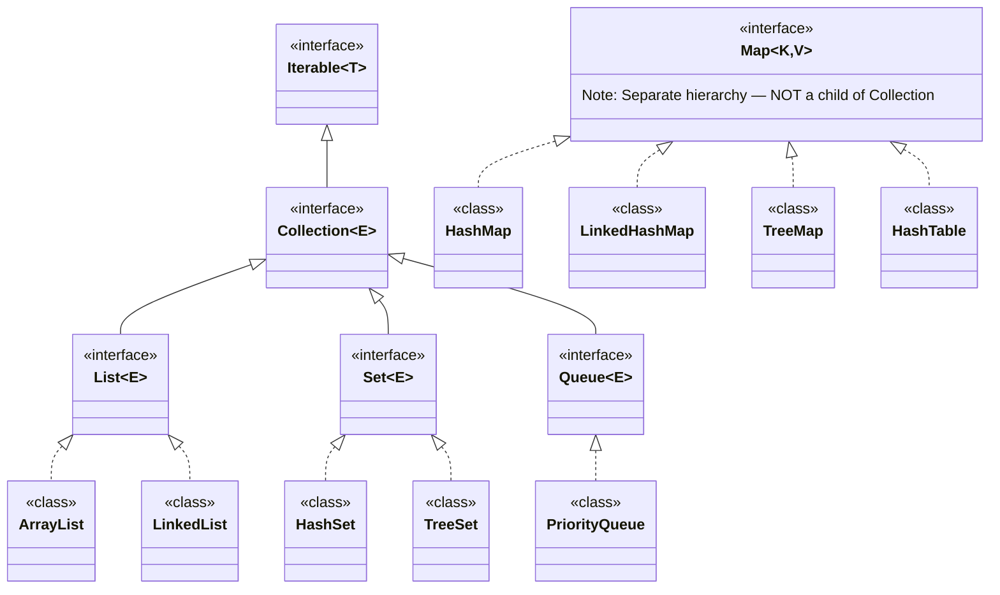
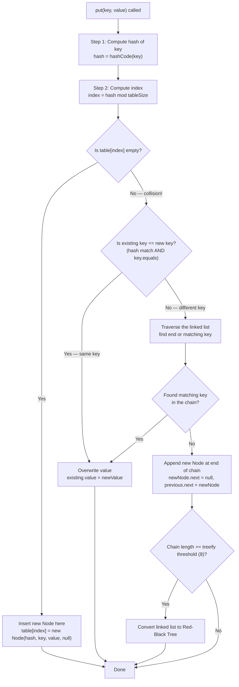
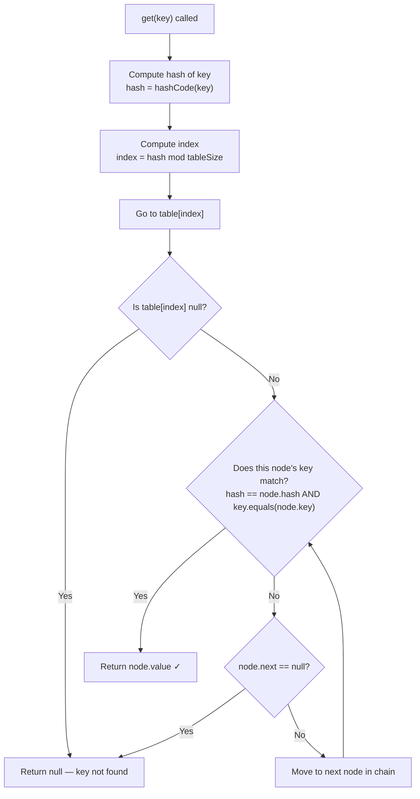
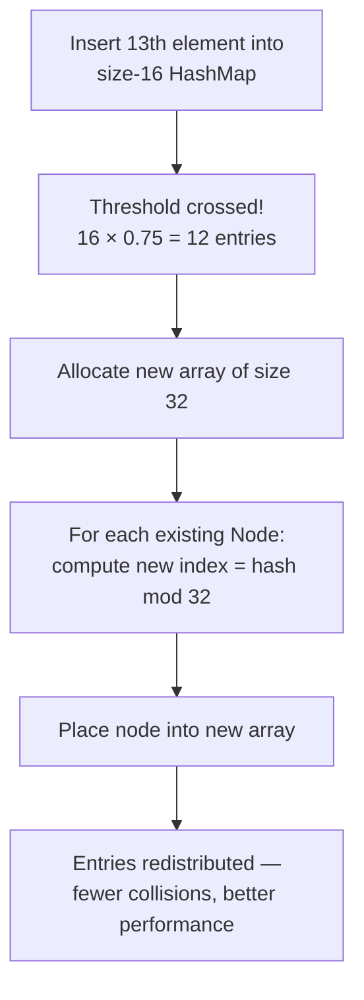
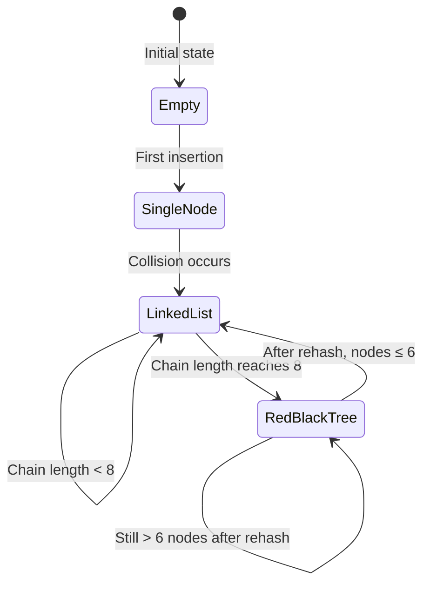
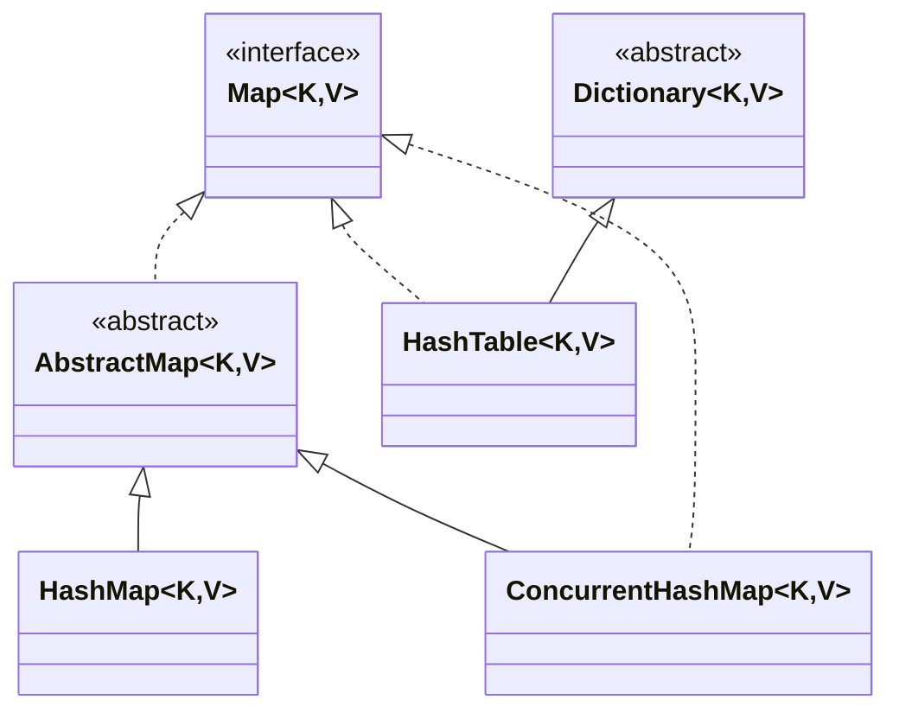

# 📚 Java Collections — Part 3: Map Interface & HashMap Internals

> [!NOTE]
> This document is a self-contained, professional-quality study guide covering the **Map Interface**, **HashMap Design & Internals**, **HashTable**, and all related concepts. It is written so that no prior lecture or external resource is needed.

---

## 📋 Table of Contents

1. [Why Map is Not a Child of Collection](#1-why-map-is-not-a-child-of-collection)
2. [Map Interface — Overview](#2-map-interface--overview)
3. [Map.Entry — The Sub-Interface](#3-mapentry--the-sub-interface)
4. [HashMap — Data Structure Internals](#4-hashmap--data-structure-internals)
5. [The Node (Entry) Structure](#5-the-node-entry-structure)
6. [How `put()` Works — Step by Step](#6-how-put-works--step-by-step)
7. [Collision and Chaining](#7-collision-and-chaining)
8. [How `get()` Works — Step by Step](#8-how-get-works--step-by-step)
9. [The `hashCode()` and `equals()` Contract](#9-the-hashcode-and-equals-contract)
10. [Load Factor and Rehashing](#10-load-factor-and-rehashing)
11. [Treeify Threshold — Linked List to BST](#11-treeify-threshold--linked-list-to-bst)
12. [Time Complexity of HashMap](#12-time-complexity-of-hashmap)
13. [HashMap Methods — Full Reference with Examples](#13-hashmap-methods--full-reference-with-examples)
14. [HashMap vs HashTable vs ConcurrentHashMap](#14-hashmap-vs-hashtable-vs-concurrenthashmap)
15. [Common Mistakes](#15-common-mistakes)
16. [Best Practices](#16-best-practices)
17. [Interview Notes](#17-interview-notes)
18. [Practice Questions](#18-practice-questions)
19. [Summary Revision Bullets](#19-summary-revision-bullets)

---

# 1. Why Map is Not a Child of Collection

## The Core Reason

Every structure under the `Collection` interface — `List`, `Set`, `Queue`, `Stack` — deals with **a sequence of single values**:

```
Collection holds:  [ value1, value2, value3, value4 ]
```

All methods in `Collection` (`add(e)`, `remove(e)`, `contains(e)`, `size()`, etc.) are designed to operate on **individual values**.

`Map`, however, deals with **key-value pairs**:

```
Map holds:  { key1=value1, key2=value2, key3=value3 }
```

This is fundamentally different — every operation now involves **two things** (a key and a value), not one. Methods like `get(key)`, `put(key, value)`, `containsKey(key)`, `containsValue(value)` don't fit the `Collection` API at all.

> [!IMPORTANT]
> **`Map` is a completely separate interface hierarchy from `Collection`.** It does not extend `Collection` or `Iterable`. This is by design — forcing Map to extend Collection would require shoehorning key-value semantics into single-value methods, which would be misleading and broken.

---

## The Java Collection Hierarchy — Big Picture



> [!NOTE]
> `HashSet` internally uses `HashMap`. `LinkedHashSet` internally uses `LinkedHashMap`. `TreeSet` internally uses `TreeMap`. This is why understanding Map first is essential before studying Set.

---

# 2. Map Interface — Overview

## Definition

> A `Map` is an object that maps **keys to values**. It cannot contain duplicate keys. Each key maps to at most one value. Values can be duplicated.

---

## Key Properties

| Property | Detail |
|----------|--------|
| Duplicate keys | ❌ Not allowed |
| Duplicate values | ✅ Allowed |
| Null keys | Depends on implementation (HashMap: yes, HashTable: no) |
| Null values | Depends on implementation (HashMap: yes, HashTable: no) |
| Order maintained | Depends (HashMap: no, LinkedHashMap: yes, TreeMap: sorted) |

---

## Map Implementations

| Implementation | Ordering | Thread-Safe | Null Keys/Values |
|---------------|----------|-------------|-----------------|
| `HashMap` | None | ❌ No | ✅ Both allowed |
| `LinkedHashMap` | Insertion order | ❌ No | ✅ Both allowed |
| `TreeMap` | Sorted (natural/comparator) | ❌ No | ❌ No null keys |
| `HashTable` | None | ✅ Yes | ❌ Neither allowed |
| `ConcurrentHashMap` | None | ✅ Yes | ❌ No nulls |

---

## Commonly Used Map Methods

| Method | Description |
|--------|-------------|
| `size()` | Returns number of key-value mappings |
| `isEmpty()` | Returns `true` if map has no entries |
| `containsKey(key)` | Returns `true` if the key exists |
| `containsValue(value)` | Returns `true` if the value exists |
| `get(key)` | Returns value for key, or `null` if absent |
| `put(key, value)` | Inserts or overwrites key-value pair |
| `putIfAbsent(key, value)` | Inserts only if key absent or value is null |
| `remove(key)` | Removes key-value pair, returns removed value |
| `getOrDefault(key, default)` | Returns value or default if key absent |
| `keySet()` | Returns a `Set` of all keys |
| `values()` | Returns a `Collection` of all values |
| `entrySet()` | Returns a `Set<Map.Entry<K,V>>` of all pairs |

---

# 3. Map.Entry — The Sub-Interface

## What is `Map.Entry`?

Inside the `Map` interface, there is a **nested sub-interface** called `Entry<K, V>`. This represents a single **key-value pair** (one row in the map).

```java
// Conceptually inside java.util.Map:
public interface Map<K, V> {
    interface Entry<K, V> {
        K getKey();
        V getValue();
        V setValue(V value);
    }
    // ... other methods
}
```

## Why Does It Exist?

When you iterate over a `Map`, you need an object that carries **both** the key and value together. `Map.Entry<K, V>` is exactly that object — it bundles a key and a value into a single unit that can be returned, stored, or passed around.

## How It Is Used

```java
Map<Integer, String> map = new HashMap<>();
map.put(1, "Alice");
map.put(2, "Bob");

// entrySet() returns Set<Map.Entry<Integer, String>>
for (Map.Entry<Integer, String> entry : map.entrySet()) {
    System.out.println("Key: " + entry.getKey() + ", Value: " + entry.getValue());
}
```

```mermaid
classDiagram
    class Map~K,V~ {
        <<interface>>
        +put(K key, V value)
        +get(K key)
        +entrySet() Set~Entry~
    }
    class Entry~K,V~ {
        <<interface>>
        +getKey() K
        +getValue() V
        +setValue(V value)
    }
    class Node~K,V~ {
        int hash
        K key
        V value
        Node next
    }

    Map +-- Entry : nested interface
    Entry <|.. Node : HashMap's implementation
```

---

# 4. HashMap — Data Structure Internals

## High-Level Structure

Internally, `HashMap` stores data in an **array of linked list nodes** (called a hash table). Each slot in the array is called a **bucket** or **bin**.

```
HashMap internal structure (default size 16):

Index:  [0]  [1]  [2]  [3]  [4] ... [15]
         |    |    |
       Node  Node  Node
              |
             Node  ← collision chain (linked list)
              |
             Node
```

Each **Node** in the array (and in the chain) holds four things:
- `hash` — the computed hash of the key
- `key` — the key of the mapping
- `value` — the value of the mapping
- `next` — a reference to the next Node (for collision chaining)

---

## Default Configuration

| Configuration | Default Value |
|---------------|--------------|
| Initial array capacity | **16** |
| Load factor | **0.75** |
| Treeify threshold (linked list → tree) | **8** |
| Untreeify threshold (tree → linked list) | **6** |

```java
// Creating a HashMap with all defaults:
Map<Integer, String> map = new HashMap<>();
// Internal array size = 16, load factor = 0.75

// Creating with custom initial capacity:
Map<Integer, String> map = new HashMap<>(32);

// Creating with custom capacity and load factor:
Map<Integer, String> map = new HashMap<>(32, 0.5f);
```

---

# 5. The Node (Entry) Structure

## Node Definition (inside HashMap)

```java
// Simplified from OpenJDK source:
static class Node<K, V> implements Map.Entry<K, V> {
    final int hash;   // cached hash of the key
    final K key;      // the key
    V value;          // the value
    Node<K, V> next;  // pointer to next node (for chaining)

    Node(int hash, K key, V value, Node<K, V> next) {
        this.hash = hash;
        this.key = key;
        this.value = value;
        this.next = next;
    }

    public K getKey()   { return key; }
    public V getValue() { return value; }
    // ...
}
```

## Memory Representation

```
HashMap object
│
└── Node[] table  (array of size 16 by default)
     │
     ├── [0] → null
     ├── [1] → Node { hash=1234567, key=1, value="SJ", next=null }
     ├── [2] → Node { hash=984120,  key=5, value="PJ", next=null }
     │               ↓
     │          Node { hash=515100, key=10, value="KJ", next=null }
     ├── [3] → null
     ...
     └── [15] → null
```

---

# 6. How `put()` Works — Step by Step

## The Algorithm

When you call `map.put(key, value)`, HashMap performs these steps:



---

## Concrete Example — Inserting into a Size-3 HashMap

Let's use a simplified size-3 array: indices `[0]`, `[1]`, `[2]`.

### Insert `put(1, "SJ")`

1. Compute hash of key `1` → e.g., `1234567`
2. Index = `1234567 mod 3` = `1`
3. `table[1]` is empty → insert Node `{hash=1234567, key=1, value="SJ", next=null}`

```
[0] → null
[1] → { hash=1234567, key=1, value="SJ", next=null }
[2] → null
```

### Insert `put(5, "PJ")`

1. Compute hash of key `5` → e.g., `984120`
2. Index = `984120 mod 3` = `2`
3. `table[2]` is empty → insert Node `{hash=984120, key=5, value="PJ", next=null}`

```
[0] → null
[1] → { key=1, value="SJ", next=null }
[2] → { key=5, value="PJ", next=null }
```

### Insert `put(10, "KJ")` — **Collision!**

1. Compute hash of key `10` → e.g., `515100`
2. Index = `515100 mod 3` = `1`
3. `table[1]` is **NOT empty** → collision!
4. Check: is existing key (`1`) == new key (`10`)? → **No**
5. Traverse chain; end of chain reached (next is null)
6. Append new node: `{hash=515100, key=10, value="KJ", next=null}`

```
[0] → null
[1] → { key=1, value="SJ", next=→ }
            ↓
       { key=10, value="KJ", next=null }
[2] → { key=5, value="PJ", next=null }
```

### Insert `put(1, "MJ")` — **Duplicate Key (Overwrite)**

1. Compute hash of key `1` → `1234567`
2. Index = `1`
3. `table[1]` is not empty → check: existing key (`1`) == new key (`1`)? → **Yes**
4. **Overwrite**: `value = "MJ"`

```
[1] → { key=1, value="MJ", next=→ }   ← value updated
            ↓
       { key=10, value="KJ", next=null }
```

> [!IMPORTANT]
> Duplicate keys are not stored. The **value is overwritten**. The map always has at most one entry per key.

---

# 7. Collision and Chaining

## What is a Collision?

A **collision** occurs when two different keys produce the **same array index** after hashing and mod operations. This is expected and unavoidable in any hash table.

```
hash("cat") mod 16 = 5
hash("dog") mod 16 = 5  ← collision! Both map to index 5
```

## How HashMap Resolves Collisions — Separate Chaining

HashMap uses **separate chaining**: when a collision occurs, the new node is **linked to the existing node** at that index, forming a **linked list** (chain).

```
Before collision:
[5] → { key="cat", value=1, next=null }

After collision (adding "dog"):
[5] → { key="cat", value=1, next=→ }
             ↓
        { key="dog", value=2, next=null }
```

This chain can grow indefinitely — but HashMap has mechanisms (load factor, treeify threshold) to prevent it from becoming too long.

---

# 8. How `get()` Works — Step by Step

## The Algorithm



---

## Concrete Example — `get(5)`

Using our earlier map state:

```
[0] → null
[1] → { key=1, value="SJ", next=→ } → { key=10, value="KJ", next=null }
[2] → { key=5, value="PJ", next=null }
```

1. Compute hash of `5` → `984120` (same hash function, same result — **guaranteed**)
2. Index = `984120 mod 3` = `2`
3. Go to `table[2]`
4. Node at `table[2]`: check `hash == 984120` ✓ AND `key.equals(5)` ✓ → **match!**
5. Return `"PJ"`

---

## Concrete Example — `get(10)` (requires chain traversal)

1. Compute hash of `10` → `515100`
2. Index = `515100 mod 3` = `1`
3. Go to `table[1]`
4. Node: `key=1` → `hash match? Yes (515100 == ... wait — 1's hash was 1234567)` → **No match**

> [!NOTE]
> In practice, HashMap checks both the **hash** AND the **key equality** together. If the hash of the query key matches the node's stored hash AND `key.equals(nodeKey)` is true, it's a match. This two-step check is why the `hashCode`/`equals` contract is critical.

5. Move to `next` → Node: `key=10`, check hash + equals → **match!**
6. Return `"KJ"`

---

# 9. The `hashCode()` and `equals()` Contract

## Why This Contract Exists

The `get()` and `put()` operations rely on two things:
- `hashCode()` to find the **right bucket** (array index)
- `equals()` to find the **right node** within that bucket

These two methods must work together consistently. Java defines a formal **contract** between them.

---

## The Two Rules of the Contract

### Rule 1 — Same objects MUST have the same hash

> If `object1.equals(object2)` is `true`, then `object1.hashCode() == object2.hashCode()` MUST also be `true`.

**Why this matters for HashMap:**

When you call `put(key, value)`, HashMap computes `hashCode(key)` and stores the node at a certain index.

Later, when you call `get(key)`, HashMap must compute `hashCode(key)` again and arrive at the **same index**. If `equals` says they're the same object but `hashCode` gives different results, `get` will look in the wrong bucket and return `null` — even though the key exists!

```java
// Correct: same object → same hash every time
// hashCode(5) called at put time   → 616100
// hashCode(5) called at get time   → 616100  ✓ (same bucket found)
```

### Rule 2 — Same hash does NOT mean same objects

> If `object1.hashCode() == object2.hashCode()`, it does NOT mean `object1.equals(object2)`.

**Why this is true:**

A hash function maps an infinite space of possible values into a finite number of buckets. Collisions are inevitable — two completely different objects can have the same hash. This is normal and expected.

```
hash(6)  → 51510
hash(8)  → 51510   ← same hash, but 6 ≠ 8
```

This is why HashMap stores both the hash AND the key, and checks both during lookup. Two nodes with the same hash at the same bucket are not necessarily the same entry.

---

## Contract Summary Table

| Scenario | `equals()` result | `hashCode()` requirement |
|----------|-------------------|--------------------------|
| `obj1` and `obj2` are logically equal | `true` | **MUST** be equal |
| `obj1` and `obj2` are NOT equal | `false` | May or may not be equal (collision is OK) |
| Same hash | N/A | Does NOT imply equality |

> [!WARNING]
> If you override `equals()` in a class, you **MUST** also override `hashCode()` consistently. Failing to do so breaks HashMap behavior: objects that are logically equal may end up in different buckets and `get()` will fail to find them.

---

## Practical Example

```java
class Point {
    int x, y;

    Point(int x, int y) { this.x = x; this.y = y; }

    // If we override equals but NOT hashCode — HashMap breaks!
    @Override
    public boolean equals(Object o) {
        Point p = (Point) o;
        return this.x == p.x && this.y == p.y;
    }

    // MUST also override hashCode:
    @Override
    public int hashCode() {
        return 31 * x + y; // consistent with equals
    }
}

Map<Point, String> map = new HashMap<>();
map.put(new Point(1, 2), "origin");
System.out.println(map.get(new Point(1, 2))); // "origin" — works correctly
```

---

# 10. Load Factor and Rehashing

## The Problem Load Factor Solves

Imagine a HashMap with only 3 buckets and 100 entries. All 100 would inevitably chain together in a few buckets, creating long linked lists. Every `get()` call would need to traverse most of the list — performance degrades to O(N).

**Load factor** prevents this by triggering an **expansion** of the array before it gets too crowded.

---

## Definition

> **Load Factor** is a threshold that controls when the HashMap's internal array is resized (rehashed). It is a float value between 0 and 1.

```
Threshold = Initial Capacity × Load Factor
          = 16 × 0.75
          = 12
```

When the **number of key-value mappings** reaches this threshold (12 in the default case), HashMap **doubles the array size** and **rehashes** all existing entries.

---

## Rehashing Process

When the threshold is crossed:

1. A **new array** of double the size is allocated (16 → 32 → 64 → 128…, always powers of 2).
2. Every existing node is **re-hashed**: `hash mod newSize` is computed for each entry.
3. Entries are **redistributed** into the new, larger array.
4. Previously colliding entries may now land in different buckets, reducing chain length.



---

## Why Always Double (Powers of 2)?

Using powers of 2 for the array size allows the index calculation to use a **bitwise AND** instead of modulo:

```
index = hash & (capacity - 1)   // bitwise AND — very fast
// equivalent to:
index = hash % capacity          // modulo — slower
```

This is a performance optimization in the JDK implementation.

---

## Choosing Load Factor

| Load Factor | Effect |
|-------------|--------|
| **Low (e.g. 0.25)** | Rehash earlier → more memory used, fewer collisions, faster lookups |
| **High (e.g. 0.9)** | Rehash later → less memory used, more collisions, slower lookups |
| **Default (0.75)** | Balanced trade-off between time and space |

> [!TIP]
> For most use cases, the default load factor of `0.75` is optimal. Only tune it if you have specific performance profiling data.

---

# 11. Treeify Threshold — Linked List to BST

## The Problem

Even with load factor and rehashing, there is still a **worst-case scenario**: a poorly written or malicious `hashCode()` implementation that returns the same hash for many different keys. This causes all entries to pile into one bucket as a long linked list.

In a linked list of N nodes, every search requires O(N) time in the worst case.

---

## The Solution — Treeify Threshold

HashMap has a second line of defense: if a single bucket's chain length reaches **8 nodes**, the linked list is **converted into a Red-Black Tree** (a self-balancing binary search tree).

```
BEFORE treeify (linked list — O(N) search):

[3] → Node1 → Node2 → Node3 → Node4 → Node5 → Node6 → Node7 → Node8

                        ↓ (9th insertion triggers treeify)

AFTER treeify (Red-Black Tree — O(log N) search):

[3] →       Node4
           /       \
        Node2      Node6
        /   \      /   \
     Node1 Node3 Node5 Node7
                         \
                        Node8
```

---

## Why Red-Black Tree?

A simple Binary Search Tree (BST) can degenerate into a linked list if keys are inserted in sorted order (making it O(N) again). A **Red-Black Tree** is a **self-balancing** BST that guarantees O(log N) height at all times, making search, insert, and delete all O(log N).

---

## Treeify and Untreeify Thresholds

| Threshold | Value | Meaning |
|-----------|-------|---------|
| `TREEIFY_THRESHOLD` | **8** | Chain of length ≥ 8 → convert to Red-Black Tree |
| `UNTREEIFY_THRESHOLD` | **6** | After rehashing, if tree nodes ≤ 6 → convert back to linked list |

The untreeify threshold is lower than treeify to prevent thrashing (repeatedly converting back and forth).

---

## Full Bucket Evolution Diagram



---

# 12. Time Complexity of HashMap

## Summary Table

| Operation | Average Case | Worst Case (old — linked list only) | Worst Case (modern — with treeify) |
|-----------|-------------|--------------------------------------|-------------------------------------|
| `put(key, value)` | **O(1)** | O(N) | **O(log N)** |
| `get(key)` | **O(1)** | O(N) | **O(log N)** |
| `remove(key)` | **O(1)** | O(N) | **O(log N)** |
| `containsKey(key)` | **O(1)** | O(N) | **O(log N)** |
| `remove(Object o)` arbitrary | O(N) | O(N) | O(N) |

> [!IMPORTANT]
> The **average O(1)** comes from the fact that with a good hash function, load factor control, and treeify, most operations hit the correct bucket directly without needing to traverse a chain.
>
> The **worst case O(log N)** (not O(N)) applies in modern Java (Java 8+) because of the treeify mechanism — long chains become Red-Black Trees.

---

## Why "Amortized O(1)"?

The occasional **rehash** operation costs O(N) (all entries must be moved). However, this happens very infrequently (only when threshold is crossed, and each rehash doubles the capacity). When averaged over all operations, the cost per operation approaches O(1). This is called **amortized O(1)**.

---

# 13. HashMap Methods — Full Reference with Examples

## Complete Working Example

```java
import java.util.*;

public class HashMapDemo {
    public static void main(String[] args) {

        // --- SETUP ---
        HashMap<Integer, String> map = new HashMap<>();

        // put(key, value) — insert; overwrites if key exists
        map.put(null, "test");   // null key is allowed
        map.put(0, null);        // null value is allowed
        map.put(1, "A");
        map.put(2, "B");

        // putIfAbsent(key, value) — only inserts if key absent OR value is null
        map.putIfAbsent(null, "newValue"); // null key EXISTS with value "test" (not null) → NO overwrite
        map.putIfAbsent(0, "zero");        // key 0 EXISTS but value IS null → OVERWRITES with "zero"
        map.putIfAbsent(3, "C");           // key 3 does NOT exist → INSERTS

        // --- QUERY METHODS ---

        // size() — number of key-value mappings
        System.out.println("Size: " + map.size()); // 5

        // isEmpty() — true if no entries
        System.out.println("Is empty: " + map.isEmpty()); // false

        // containsKey(key)
        System.out.println("Contains key 3: " + map.containsKey(3)); // true
        System.out.println("Contains key 9: " + map.containsKey(9)); // false

        // get(key) — returns value or null if key absent
        System.out.println("Get key 1: " + map.get(1)); // A

        // getOrDefault(key, defaultValue)
        System.out.println("Get key 9 or default: " + map.getOrDefault(9, "N/A")); // N/A

        // --- REMOVAL ---

        // remove(key) — removes and returns the value
        String removed = map.remove(null);
        System.out.println("Removed null key, value was: " + removed); // test

        // --- ITERATION ---

        // entrySet() — iterate over key-value pairs
        System.out.println("\nAll entries (entrySet):");
        for (Map.Entry<Integer, String> entry : map.entrySet()) {
            System.out.println("Key: " + entry.getKey() + " | Value: " + entry.getValue());
        }

        // keySet() — iterate over keys only
        System.out.println("\nAll keys (keySet):");
        for (Integer key : map.keySet()) {
            System.out.println(key);
        }

        // values() — iterate over values only
        System.out.println("\nAll values (values()):");
        for (String value : map.values()) {
            System.out.println(value);
        }
    }
}
```

### Output

```
Size: 5
Is empty: false
Contains key 3: true
Contains key 9: false
Get key 1: A
Get key 9 or default: N/A
Removed null key, value was: test

All entries (entrySet):
Key: 0 | Value: zero
Key: 1 | Value: A
Key: 2 | Value: B
Key: 3 | Value: C

All keys (keySet):
0
1
2
3

All values (values()):
zero
A
B
C
```

> [!NOTE]
> HashMap does **not** maintain insertion order. The iteration order of `entrySet()`, `keySet()`, and `values()` is unpredictable and may change between JVM runs.

---

## `putIfAbsent` — Detailed Explanation

`putIfAbsent(key, value)` considers a key "absent" in two cases:
1. The key does **not exist** in the map at all.
2. The key **exists** but its current value is `null`.

```java
map.put("x", null);             // x → null
map.putIfAbsent("x", "hello");  // x is present but value is null → OVERWRITES → x → "hello"

map.put("y", "world");
map.putIfAbsent("y", "bye");    // y is present with non-null value → NO overwrite → y stays "world"

map.putIfAbsent("z", "new");    // z doesn't exist → INSERTS → z → "new"
```

---

## `entrySet()` vs `keySet()` vs `values()`

| Method | Returns | Use when |
|--------|---------|----------|
| `entrySet()` | `Set<Map.Entry<K,V>>` | You need both key AND value |
| `keySet()` | `Set<K>` | You only need keys |
| `values()` | `Collection<V>` | You only need values |

> [!TIP]
> If you need both key and value during iteration, always use `entrySet()`. Using `keySet()` and then calling `get(key)` inside the loop is less efficient — it performs an extra hash lookup per iteration.

---

# 14. HashMap vs HashTable vs ConcurrentHashMap

## Overview

`HashMap` has two thread-safe counterparts: `HashTable` (legacy) and `ConcurrentHashMap` (modern).

---

## Comparison Table

| Feature | `HashMap` | `HashTable` | `ConcurrentHashMap` |
|---------|-----------|-------------|---------------------|
| Thread-safe | ❌ No | ✅ Yes (synchronized) | ✅ Yes (segment-level locking) |
| Null keys | ✅ 1 null key allowed | ❌ Not allowed | ❌ Not allowed |
| Null values | ✅ Allowed | ❌ Not allowed | ❌ Not allowed |
| Performance | Fast (no locking) | Slower (full lock) | Fast (partial locking) |
| Maintains order | ❌ No | ❌ No | ❌ No |
| Legacy? | No (modern) | Yes (legacy) | No (modern) |
| Recommended? | ✅ Single-threaded | ❌ Avoid | ✅ Multi-threaded |

---

## Key Points

### HashMap — Not Thread-Safe

`HashMap` does not synchronize any of its methods. If two threads modify a `HashMap` concurrently without external synchronization, the behavior is **undefined** and can result in infinite loops, data corruption, or exceptions.

```java
// NOT safe in multi-threaded code:
Map<String, Integer> map = new HashMap<>();
// Thread 1: map.put("a", 1)
// Thread 2: map.put("b", 2) ← concurrent modification → undefined behavior
```

### HashTable — Synchronized but Legacy

`HashTable` synchronizes **every method** with a single lock on the entire object. While thread-safe, this means only one thread can access the table at a time — a major bottleneck in high-concurrency scenarios. `HashTable` is considered **legacy** and its use is discouraged in new code.

```java
// Thread-safe but slow — avoid in new code:
Map<String, Integer> table = new Hashtable<>();
```

### ConcurrentHashMap — Modern Thread-Safe Choice

`ConcurrentHashMap` is the modern alternative. It uses **segment-level (or bucket-level) locking** in Java 8+, meaning multiple threads can read and write to different segments of the map simultaneously. It offers much better throughput than `HashTable`.

```java
// Recommended for multi-threaded code:
Map<String, Integer> concurrentMap = new ConcurrentHashMap<>();
```

---

## Inheritance Diagram



> [!NOTE]
> `HashTable` extends the old `Dictionary` abstract class (pre-Collections Framework) and also implements `Map`. This is a legacy design that predates the Java Collections Framework.

---

# 15. Common Mistakes

### Mistake 1 — Using HashMap in Multi-threaded Code Without Synchronization

```java
// WRONG — concurrent modification may cause infinite loops or data loss
Map<String, Integer> map = new HashMap<>();
// Thread A and Thread B both call map.put() simultaneously → undefined behavior
```

**Fix:** Use `ConcurrentHashMap` or wrap with `Collections.synchronizedMap()`.

```java
Map<String, Integer> safeMap = new ConcurrentHashMap<>();
// OR:
Map<String, Integer> safeMap = Collections.synchronizedMap(new HashMap<>());
```

---

### Mistake 2 — Overriding `equals()` Without Overriding `hashCode()`

```java
class Student {
    int id;
    Student(int id) { this.id = id; }

    @Override
    public boolean equals(Object o) {
        return ((Student) o).id == this.id;
    }
    // hashCode NOT overridden — uses default Object.hashCode() based on memory address
}

Map<Student, String> map = new HashMap<>();
map.put(new Student(1), "Alice");
System.out.println(map.get(new Student(1))); // null! Different object → different hash → wrong bucket
```

**Fix:** Always override both `equals()` and `hashCode()` together.

```java
@Override
public int hashCode() {
    return Integer.hashCode(this.id);
}
```

---

### Mistake 3 — Expecting HashMap to Maintain Insertion Order

```java
Map<Integer, String> map = new HashMap<>();
map.put(3, "C");
map.put(1, "A");
map.put(2, "B");
map.entrySet().forEach(System.out::println); // Order is NOT guaranteed
```

**Fix:** Use `LinkedHashMap` to maintain insertion order, or `TreeMap` for sorted order.

```java
Map<Integer, String> ordered = new LinkedHashMap<>();
```

---

### Mistake 4 — Iterating and Modifying a HashMap Simultaneously

```java
for (Map.Entry<Integer, String> entry : map.entrySet()) {
    map.remove(entry.getKey()); // ❌ ConcurrentModificationException
}
```

**Fix:** Use an `Iterator` with `iterator.remove()`, or collect keys to remove first.

```java
Iterator<Map.Entry<Integer, String>> it = map.entrySet().iterator();
while (it.hasNext()) {
    Map.Entry<Integer, String> entry = it.next();
    if (entry.getKey() == 2) {
        it.remove(); // ✅ safe removal during iteration
    }
}
```

---

### Mistake 5 — Using Mutable Objects as Keys

```java
List<Integer> key = new ArrayList<>(Arrays.asList(1, 2, 3));
map.put(key, "value");
key.add(4); // Mutating the key changes its hashCode → get() can never find it again
System.out.println(map.get(key)); // null — key's bucket has changed
```

**Fix:** Only use **immutable objects** as HashMap keys (`String`, `Integer`, `Long`, etc.).

---

# 16. Best Practices

1. **Always override both `equals()` and `hashCode()`** when using custom objects as keys.
2. **Prefer immutable keys** — `String`, `Integer`, `Long`, enums are safe choices.
3. **Use `ConcurrentHashMap`** in multi-threaded environments instead of `HashMap` or `HashTable`.
4. **Pre-size the HashMap** if you know the approximate number of entries to avoid rehashing:
   ```java
   // For 100 expected entries, set initial capacity to avoid rehashing at 75:
   Map<String, Integer> map = new HashMap<>(150);
   ```
5. **Use `entrySet()`** for iteration when you need both key and value — never `keySet()` + `get()` in a loop.
6. **Don't use `HashTable`** in new code — it's legacy. Use `ConcurrentHashMap` for thread-safety.
7. **Check `containsKey()` before `get()`** when null values are possible, to distinguish "key absent" from "key present with null value".

---

# 17. Interview Notes

> [!IMPORTANT]
> These are the most frequently asked HashMap interview questions in Java interviews.

---

### Q1: How does HashMap work internally?

**Answer:** HashMap stores data in an array of `Node` objects (called the hash table). When `put(key, value)` is called: (1) the hash of the key is computed, (2) the index is computed as `hash mod tableSize`, (3) the node is placed at that index. If a collision occurs (another node already at that index with a different key), the new node is chained as a linked list. If the chain length reaches 8, it converts to a Red-Black Tree. When `get(key)` is called, the same hash computation finds the right bucket, then the chain is traversed using `equals()` to find the exact node.

---

### Q2: What is the time complexity of HashMap operations?

**Answer:** Average case O(1) for `put`, `get`, and `remove`. Worst case is O(log N) in Java 8+ (due to treeify), not O(N) as in older versions. The O(1) average is amortized — occasional rehash operations cost O(N) but are rare.

---

### Q3: What is the default initial capacity and load factor of HashMap?

**Answer:** Default initial capacity is **16**. Default load factor is **0.75**. The rehash threshold is `16 × 0.75 = 12`, meaning rehashing occurs after the 12th entry is inserted.

---

### Q4: What is the difference between HashMap and HashTable?

**Answer:** `HashMap` is not thread-safe and allows one null key and null values. `HashTable` is thread-safe (fully synchronized) and does not allow null keys or values. `HashTable` is legacy — prefer `ConcurrentHashMap` in new multi-threaded code.

---

### Q5: What is the contract between `hashCode()` and `equals()`?

**Answer:** Two rules: (1) If two objects are equal (`equals()` returns true), they MUST have the same `hashCode()`. (2) If two objects have the same `hashCode()`, they are NOT necessarily equal. Violating rule 1 breaks HashMap — `get()` will fail to find entries.

---

### Q6: What happens when you put a duplicate key in a HashMap?

**Answer:** The **value is overwritten**. The map always has at most one entry per key. `put()` returns the **old value** that was replaced.

---

### Q7: Can HashMap have null keys?

**Answer:** Yes — `HashMap` allows exactly **one** null key. Internally, the null key is stored at index 0 of the array (since `hashCode(null) = 0`).

---

### Q8: What is rehashing?

**Answer:** When the number of entries exceeds `capacity × loadFactor`, HashMap allocates a new array of **double the size** and re-inserts all existing entries by recomputing their indices. This redistributes entries across more buckets, reducing collision chains and restoring O(1) average performance.

---

### Q9: When does HashMap convert a linked list to a tree?

**Answer:** When the number of nodes in a single bucket reaches the **treeify threshold of 8**, the linked list is converted to a Red-Black Tree, improving worst-case search from O(N) to O(log N). If after a rehash the nodes in a tree bucket fall to 6 or below, it converts back to a linked list.

---

### Q10: What is `Map.Entry`?

**Answer:** `Map.Entry<K, V>` is a nested interface inside `Map` that represents a single key-value pair. `HashMap` implements it as the `Node<K, V>` class. It is returned by `entrySet()` and provides `getKey()` and `getValue()` methods for accessing the pair's data.

---

### Tricky Points

- `HashTable` is spelled with a lowercase 't' in `Table` — `Hashtable`. Common spelling error.
- `HashMap` allows **one** null key but `ConcurrentHashMap` and `Hashtable` do not.
- Printing a `HashMap` directly calls `toString()` which iterates `entrySet()` — the order is NOT insertion order.
- `put()` returns the **previous value** for an existing key, or `null` if the key was absent (or if the previous value was `null`).
- Using `getOrDefault()` is safer than `get()` when you want to handle missing keys — no null check needed.
- The `keySet()` returned by HashMap is a **live view** — modifying the map while iterating `keySet()` causes `ConcurrentModificationException`.

---

# 18. Practice Questions

## Easy

1. Create a `HashMap<String, Integer>` representing word frequencies. Insert five words and print each word with its count.
2. What is the default initial capacity of a `HashMap`?
3. What is the difference between `get(key)` and `getOrDefault(key, defaultValue)`?
4. Can a `HashMap` have two entries with the same value but different keys? Show with an example.
5. What does `putIfAbsent()` do if the key already exists with a non-null value?

## Medium

6. Explain what happens step-by-step when you call `put("hello", 42)` on a `HashMap<String, Integer>`.
7. You override `equals()` in your custom class but forget to override `hashCode()`. What happens when you use it as a key in `HashMap`? Why?
8. When and why does HashMap convert a bucket's linked list to a Red-Black Tree?
9. Write a method that counts the frequency of each character in a string using `HashMap`.
10. What is the difference between iterating with `keySet()` vs `entrySet()`? Which is more efficient and why?

## Hard

11. Design a HashMap from scratch in Java. Implement `put(key, value)` and `get(key)` with collision handling via separate chaining.
12. What happens during rehashing? Walk through the rehash process for a `HashMap` that has grown from initial capacity 16 to 32.
13. Explain why the initial capacity is always a power of 2 in `HashMap`. What optimization does this enable?
14. Compare `HashMap`, `LinkedHashMap`, and `TreeMap` on time complexity for `put`, `get`, and iteration. When would you use each?
15. A `HashMap<List<Integer>, String>` is created and a mutable `List` is used as a key. After inserting an entry, the list is modified. What happens when you try to retrieve the value? Explain why, at the byte-code level.

---

# 19. Summary Revision Bullets

## Why Map is Separate from Collection
- `Collection` works with single values; `Map` works with key-value pairs.
- All `Collection` methods are single-value oriented — incompatible with Map's two-value API.
- `Map` is a completely independent interface hierarchy in `java.util`.

## Map Key Properties
- No duplicate keys; duplicate values allowed.
- Inserting a duplicate key **overwrites** the existing value.
- One null key allowed in `HashMap`; null values allowed.

## HashMap Internals
- Backed by an **array of Node objects** (the hash table).
- Default array size: **16**; load factor: **0.75**; rehash threshold: **12**.
- Each `Node` stores: `hash`, `key`, `value`, `next`.
- Index formula: `hash mod tableSize`.

## put() Process
1. Compute `hashCode(key)`.
2. Compute `index = hash mod tableSize`.
3. If bucket empty: insert new Node.
4. If collision: check `hash + equals` for duplicate key → overwrite or chain.
5. If chain length reaches 8: convert to Red-Black Tree.

## get() Process
1. Compute `hashCode(key)` → same index as during `put`.
2. Traverse chain at that index.
3. Match using `hash == node.hash && key.equals(node.key)`.
4. Return `node.value` on match; `null` if not found.

## hashCode/equals Contract
- Equal objects MUST have equal hash codes.
- Equal hash codes do NOT imply equal objects.
- Must override both together when using custom objects as keys.

## Load Factor & Rehashing
- Load factor (default 0.75) controls when to resize.
- Threshold crossed → array doubles → all entries rehashed.
- Prevents long chains; restores average O(1) performance.

## Treeify Threshold
- Chain length ≥ 8 → linked list converts to Red-Black Tree.
- Reduces worst-case from O(N) to O(log N).
- Untreeify at ≤ 6 nodes after rehash.

## Time Complexity
- Average: O(1) for all major operations (amortized).
- Worst case: O(log N) in Java 8+ (Red-Black Tree).

## HashMap vs HashTable vs ConcurrentHashMap
- `HashMap`: not thread-safe, allows null key/value, modern standard.
- `HashTable`: thread-safe (legacy), no nulls, avoid in new code.
- `ConcurrentHashMap`: thread-safe (modern), no nulls, preferred for concurrency.

---

*End of Chapter — Map Interface & HashMap Internals*
