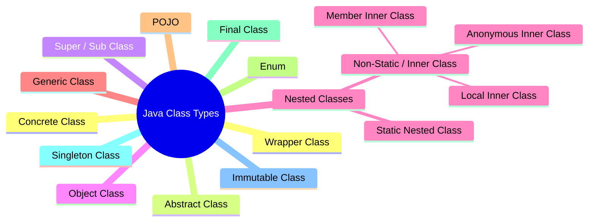
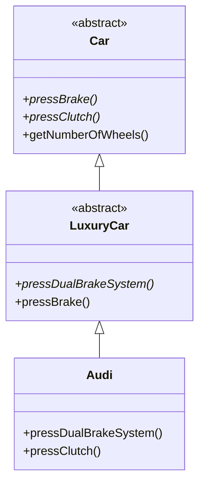
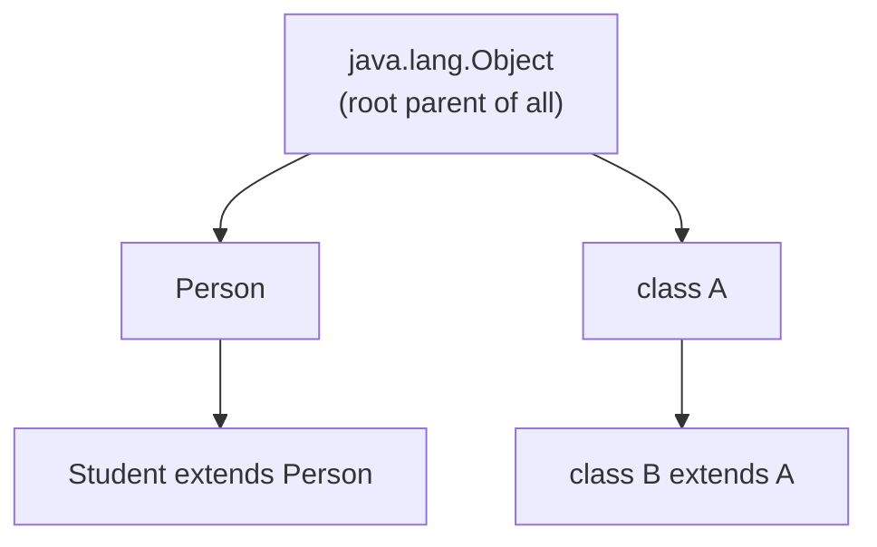
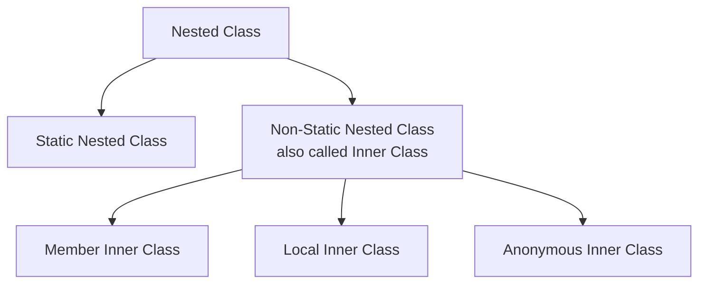
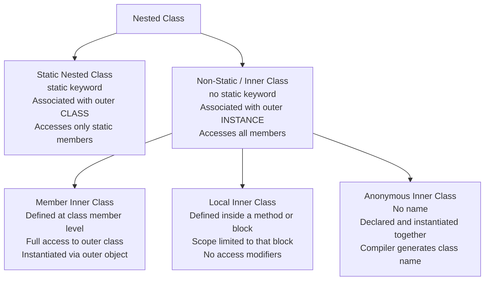
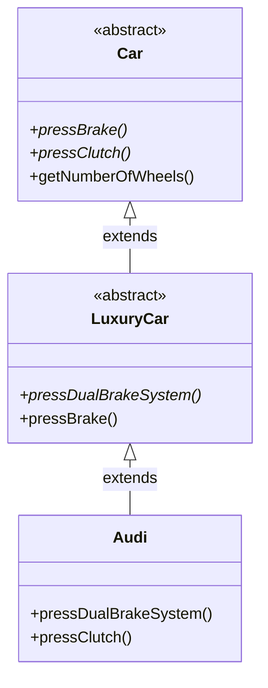
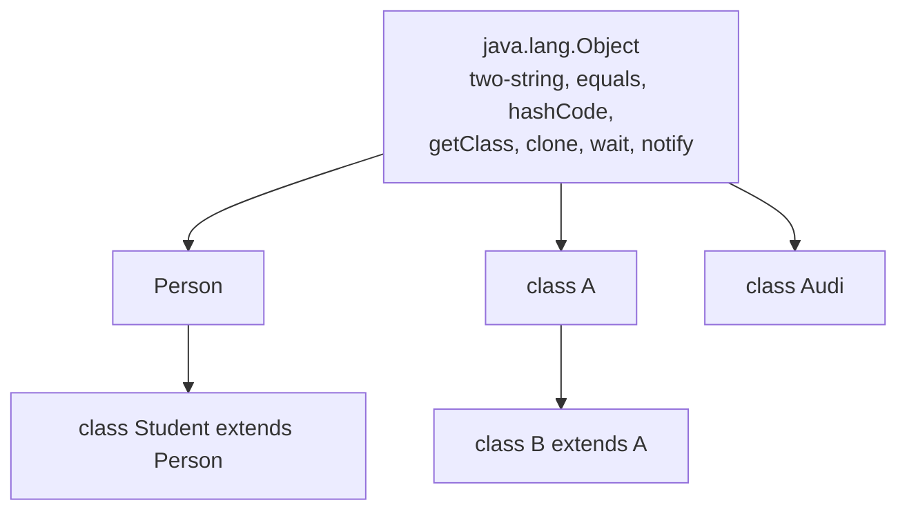
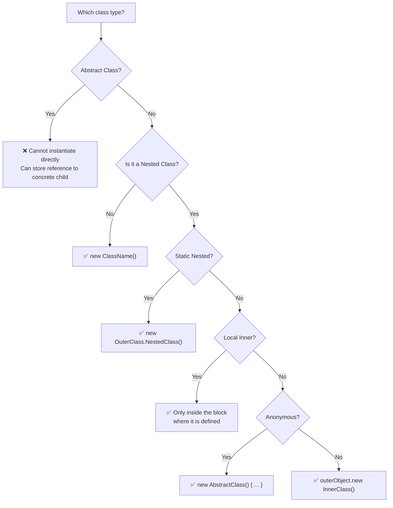

# 📚 Java Types of Classes — Comprehensive Study Guide (Part 1)

> Part of the *Concept and Coding* Java lecture series.
> These notes are fully self-contained — no prior lecture viewing is required.
> This chapter covers: Concrete Class, Abstract Class, Super/Subclass, Object Class, and all varieties of Nested Classes.

---

## Table of Contents

1. [Overview — Types of Classes in Java](#1-overview--types-of-classes-in-java)
2. [Concrete Class](#2-concrete-class)
3. [Abstract Class](#3-abstract-class)
4. [Super Class & Sub Class](#4-super-class--sub-class)
5. [The Object Class — Parent of All](#5-the-object-class--parent-of-all)
6. [Nested Classes — Overview](#6-nested-classes--overview)
7. [Static Nested Class](#7-static-nested-class)
8. [Non-Static Nested Class (Inner Class)](#8-non-static-nested-class-inner-class)
9. [Member Inner Class](#9-member-inner-class)
10. [Local Inner Class](#10-local-inner-class)
11. [Anonymous Inner Class](#11-anonymous-inner-class)
12. [Inheritance in Nested Classes](#12-inheritance-in-nested-classes)
13. [Access Modifiers — Full Comparison](#13-access-modifiers--full-comparison)
14. [Mermaid Diagrams](#14-mermaid-diagrams)
15. [Quick-Reference Tables](#15-quick-reference-tables)
16. [Common Mistakes](#16-common-mistakes)
17. [Best Practices](#17-best-practices)
18. [Interview Notes](#18-interview-notes)
19. [Practice Questions](#19-practice-questions)
20. [Summary Cheat Sheet](#20-summary-cheat-sheet)

---

# 1. Overview — Types of Classes in Java

Java supports many different flavors of class, each serving a distinct design purpose. The full taxonomy is:

| Class Type | Part Covered |
|-----------|-------------|
| Concrete Class | ✅ This guide |
| Abstract Class | ✅ This guide |
| Super Class / Sub Class | ✅ This guide |
| Object Class | ✅ This guide |
| Nested Class (all 5 kinds) | ✅ This guide |
| Generic Class | Part 2 |
| POJO | Part 2 |
| Enum | Part 2 |
| Final Class | Part 2 |
| Singleton Class | Part 2 |
| Immutable Class | Part 2 |
| Wrapper Class | Part 2 |



---

# 2. Concrete Class

## Overview

A concrete class is the most common, everyday type of class in Java. If you have written any Java class and created objects from it, you have already used a concrete class — even if you did not know the term.

## Definition

> A **concrete class** is any class from which you can create an instance (object) using the `new` keyword, and in which **all declared methods have a complete implementation**.

## Key Characteristics

| Property | Detail |
|----------|--------|
| Can create objects? | ✅ Yes — using `new` |
| All methods implemented? | ✅ Yes — no abstract methods allowed |
| Can extend another class? | ✅ Yes |
| Can implement an interface? | ✅ Yes — and must implement all interface methods |
| Access modifiers allowed | `public` or package-private (default) only |

## Real-World Analogy

Think of a concrete class like a completed blueprint. An abstract class or interface is an *unfinished* blueprint with gaps. A concrete class has every detail filled in — you can hand it to a builder (the JVM) and it will construct the object without needing anything else.

## Syntax

```java
public class ClassName {
    // fields
    // methods with full implementation
}
```

## Code Examples

### Example 1 — Simple Concrete Class

```java
public class Person {
    String name;
    int age;

    void display() {                        // method has full implementation
        System.out.println("Name: " + name + ", Age: " + age);
    }
}

public class Main {
    public static void main(String[] args) {
        Person p = new Person();            // ✅ object created with 'new'
        p.name = "Alice";
        p.age = 30;
        p.display();
    }
}
```

**Output:**
```
Name: Alice, Age: 30
```

---

### Example 2 — Concrete Class Implementing an Interface

```java
interface Shape {
    double area();      // no implementation — just definition
}

public class Rectangle implements Shape {  // ← concrete class implementing Shape
    double width, height;

    Rectangle(double w, double h) {
        this.width = w;
        this.height = h;
    }

    @Override
    public double area() {                 // ← must provide full implementation
        return width * height;
    }
}

public class Main {
    public static void main(String[] args) {
        Rectangle r = new Rectangle(5, 3); // ✅ object created — Rectangle is concrete
        System.out.println("Area: " + r.area());
    }
}
```

**Output:**
```
Area: 15.0
```

> [!NOTE]
> `Shape` is an interface — you **cannot** write `new Shape()`. But `Rectangle` **implements** `Shape` and provides all method bodies, making it concrete and fully instantiable.

## Class-Level Access Modifiers

Unlike variables and methods — which can be `public`, `private`, `protected`, or default — **top-level classes** (declared directly in a `.java` file) can only be:

| Modifier | Meaning |
|----------|---------|
| `public` | Accessible from any package |
| *(nothing)* — default / package-private | Accessible only within the same package |

```java
public class OpenClass { }  // accessible everywhere
class PackageClass { }      // accessible only within same package
private class X { }         // ❌ COMPILE ERROR for top-level class
protected class Y { }       // ❌ COMPILE ERROR for top-level class
```

> [!IMPORTANT]
> **Only nested classes** (classes declared inside another class) can use `private` and `protected`. Top-level classes are restricted to `public` or package-private.

---

# 3. Abstract Class

## Overview

An abstract class sits between a fully implemented concrete class and a completely unimplemented interface. It lets you define **some** behavior while leaving **other** behavior for child classes to fill in.

## Definition

> An **abstract class** is a class declared with the `abstract` keyword. It may contain both abstract methods (no implementation) and concrete methods (with implementation). **You cannot create objects of an abstract class.**

## What is Abstraction?

**Abstraction** means hiding the internal implementation details and exposing only the features (interface) that the user needs.

**Real-world analogy:** When you press the brake pedal in a car, you don't need to know about hydraulic fluid, callipers, rotors, or ABS logic. You just press the pedal and the car stops. The *what* is exposed; the *how* is hidden. That's abstraction.

## Two Ways to Achieve Abstraction in Java

| Method | Abstraction Level | Notes |
|--------|-------------------|-------|
| `interface` | 100% | All methods are definitions only (pre-Java 8); `default`/`static` methods added in Java 8+ |
| `abstract class` | 0% to 100% | Can mix abstract and implemented methods |

## Syntax

```java
abstract class ClassName {
    // concrete method — has implementation
    void concreteMethod() {
        System.out.println("I have a body.");
    }

    // abstract method — no body, just declaration
    abstract void abstractMethod();
}
```

## Key Rules

| Rule | Detail |
|------|--------|
| Declared with | `abstract` keyword before `class` |
| Abstract methods | No body — just a signature + semicolon |
| Concrete methods | Have full implementation — allowed inside abstract class |
| Can instantiate? | ❌ No — `new AbstractClass()` is a compile error |
| Can store a reference? | ✅ Yes — `AbstractClass ref = new ConcreteSubclass()` |
| Child class must | Implement all inherited abstract methods, OR itself be declared `abstract` |

## Code Example — Abstract Class Hierarchy

```java
// Abstract parent class
abstract class Car {
    abstract void pressBrake();      // abstract — no implementation
    abstract void pressClutch();     // abstract — no implementation

    void getNumberOfWheels() {       // concrete — has implementation
        System.out.println("4 wheels");
    }
}

// Abstract child — adds more abstraction, provides some implementation
abstract class LuxuryCar extends Car {
    abstract void pressDualBrakeSystem();  // new abstract method

    @Override
    void pressBrake() {                    // provides implementation for parent's abstract method
        System.out.println("Luxury brake applied.");
    }
    // pressClutch() is still unimplemented — child must handle it
}

// Concrete class — must implement ALL remaining abstract methods
class Audi extends LuxuryCar {
    @Override
    void pressDualBrakeSystem() {
        System.out.println("Dual brake system engaged.");
    }

    @Override
    void pressClutch() {
        System.out.println("Clutch pressed.");
    }
}

public class Main {
    public static void main(String[] args) {
        // Car c = new Car();           // ❌ COMPILE ERROR — abstract
        // LuxuryCar lc = new LuxuryCar(); // ❌ COMPILE ERROR — abstract

        Audi a = new Audi();             // ✅ concrete class — OK
        a.pressBrake();
        a.pressClutch();
        a.pressDualBrakeSystem();
        a.getNumberOfWheels();

        // Storing concrete object in abstract parent reference — VALID
        LuxuryCar ref = new Audi();
        ref.pressBrake();
    }
}
```

**Output:**
```
Luxury brake applied.
Clutch pressed.
Dual brake system engaged.
4 wheels
Luxury brake applied.
```

### Step-by-Step Explanation

- `Car` declares two abstract methods (`pressBrake`, `pressClutch`) and one concrete method (`getNumberOfWheels`).
- `LuxuryCar extends Car` — it is also abstract. It implements `pressBrake` but leaves `pressClutch` unimplemented, and adds a new abstract method `pressDualBrakeSystem`.
- `Audi extends LuxuryCar` — it is **concrete**, so it must implement all remaining abstract methods: `pressClutch` and `pressDualBrakeSystem`. (`pressBrake` is already covered by `LuxuryCar`.)
- Objects of `Audi` can be stored in references of type `Car` or `LuxuryCar` — this is **polymorphism**.



## Abstract Class vs Interface

| Feature | Abstract Class | Interface |
|---------|---------------|-----------|
| Keyword | `abstract class` | `interface` |
| Abstraction level | 0–100% | 100% (default pre-Java 8) |
| Constructor | ✅ Allowed | ❌ Not allowed |
| Instance variables | ✅ Allowed | Only `public static final` constants |
| Access modifiers on methods | Any | `public` by default |
| Multiple inheritance | ❌ Only one class | ✅ A class can implement many |
| `extends` vs `implements` | Extended with `extends` | Implemented with `implements` |

---

# 4. Super Class & Sub Class

## Definitions

> **Superclass** (also called *parent class* or *base class*): The class that is being inherited from.

> **Subclass** (also called *child class* or *derived class*): The class that inherits from the superclass.

## Syntax

```java
class Superclass {
    // parent content
}

class Subclass extends Superclass {
    // child content — inherits everything from Superclass (except private members)
}
```

## Code Example

```java
class A {
    void display() {
        System.out.println("I am class A — the superclass.");
    }
}

class B extends A {         // B is a subclass of A
    void show() {
        System.out.println("I am class B — the subclass.");
    }
}

public class Main {
    public static void main(String[] args) {
        B obj = new B();
        obj.display();      // inherited from A
        obj.show();         // defined in B
    }
}
```

**Output:**
```
I am class A — the superclass.
I am class B — the subclass.
```

## Key Points

- A class can have only **one direct superclass** in Java (no multiple class inheritance).
- A class can have **multiple subclasses**.
- The subclass inherits all non-private fields and methods of the superclass.
- The subclass can override (redefine) inherited methods.

---

# 5. The Object Class — Parent of All

## Overview

This is one of the most important concepts in all of Java and a classic interview topic.

## Definition

> In Java, **every class that does not explicitly extend another class** implicitly extends `java.lang.Object`. The `Object` class is therefore the **ultimate parent of every class** in Java.

## The Implicit Hierarchy

When you write:

```java
class Person {
    // no 'extends' keyword
}
```

Java treats it exactly as:

```java
class Person extends Object {
    // 'extends Object' is implicit
}
```

## Visual Hierarchy



Every class, no matter how deeply nested in an inheritance chain, traces its ancestry back to `Object`.

## Important Methods Provided by Object

The `Object` class gives every Java class access to these built-in methods:

| Method | Description |
|--------|-------------|
| `toString()` | Returns a string representation of the object |
| `equals(Object obj)` | Checks if two objects are logically equal |
| `hashCode()` | Returns an integer hash code for the object |
| `getClass()` | Returns the runtime `Class` of the object |
| `clone()` | Creates and returns a copy of the object |
| `wait()` | Used in multi-threading — causes thread to wait |
| `notify()` | Used in multi-threading — wakes one waiting thread |
| `notifyAll()` | Wakes all threads waiting on this object |
| `finalize()` | Called by GC before object is garbage collected (deprecated in Java 9+) |

> [!NOTE]
> `wait()`, `notify()`, and `notifyAll()` will be covered in detail in the Concurrency / Threading section.

## Code Example — Using Object as Universal Reference

```java
class Person { }
class Audi { }

public class ObjectTest {
    public static void main(String[] args) {
        // Object is parent of all — any object can be stored in Object reference
        Object obj1 = new Person();
        Object obj2 = new Audi();

        // getClass() — find out what actual type is stored
        System.out.println(obj1.getClass());  // Output: class Person
        System.out.println(obj2.getClass());  // Output: class Audi
    }
}
```

**Output:**
```
class Person
class Audi
```

### When Is This Useful?

When you write a utility method or data structure that needs to accept **any** type of object, you can use `Object` as the parameter or return type:

```java
void printAnything(Object obj) {
    System.out.println(obj.getClass().getName() + ": " + obj.toString());
}
```

Later, once you know the actual type, you can use `instanceof` and cast:

```java
if (obj1 instanceof Person) {
    Person p = (Person) obj1;
    // use p as a Person
}
```

> [!IMPORTANT]
> **Interview must-know:** "What is the parent class of all classes in Java?"
> Answer: `java.lang.Object`. Every class implicitly extends `Object` if it doesn't extend any other class.

---

# 6. Nested Classes — Overview

## Definition

> A **nested class** is a class defined **inside the body of another class**.

```java
class OuterClass {
    class NestedClass {   // ← nested class
    }
}
```

## When to Use Nested Classes

Use a nested class when a class is logically useful to **only one other class** and will never be needed independently. Instead of creating a separate `.java` file, you place it inside the class that uses it. This:

- Groups logically related code together
- Increases encapsulation
- Reduces namespace clutter

## Full Taxonomy of Nested Classes



There are **5 distinct kinds** of nested classes. Each has different rules for access, instantiation, and scope.

---

# 7. Static Nested Class

## Definition

> A **static nested class** is a nested class declared with the `static` keyword. It is associated with the **outer class itself**, not with any instance of the outer class.

## Key Characteristics

| Property | Detail |
|----------|--------|
| Declared with | `static` keyword inside outer class |
| Access to outer instance variables? | ❌ No — only static members of outer class |
| Access to outer static variables? | ✅ Yes |
| Needs outer class object to instantiate? | ❌ No — access directly via outer class name |
| Access modifiers allowed | `public`, `private`, `protected`, or default |

## Analogy

Think of it like a static method on a class. Just as a `static` method belongs to the class (not to any object), a static nested class belongs to the outer class, not to any instance of it.

## Syntax

```java
class OuterClass {
    static int classVar = 10;      // static variable
    int instanceVar = 20;          // instance variable

    static class NestedClass {     // ← static nested class
        void display() {
            System.out.println(classVar);    // ✅ can access static member
            // System.out.println(instanceVar); // ❌ COMPILE ERROR — not static
        }
    }
}
```

## How to Instantiate a Static Nested Class

You **do not need** an object of the outer class. Access it directly through the outer class name:

```java
OuterClass.NestedClass obj = new OuterClass.NestedClass();
obj.display();
```

Compare this to accessing a static method:

```java
OuterClass.staticMethod();             // access static method via class name
new OuterClass.NestedClass().display(); // access static nested class via class name
```

## Full Code Example

```java
class OuterClass {
    static int classVariable = 100;
    int instanceVariable = 200;

    static class StaticNestedClass {
        void display() {
            System.out.println("Class variable: " + classVariable);
            // instanceVariable not accessible here
        }
    }
}

public class Main {
    public static void main(String[] args) {
        // No outer class object needed
        OuterClass.StaticNestedClass nested = new OuterClass.StaticNestedClass();
        nested.display();
    }
}
```

**Output:**
```
Class variable: 100
```

## Private Static Nested Class

A static nested class can be made `private`. In that case, it can only be accessed from within the outer class itself:

```java
class OuterClass {
    private static class PrivateNested {
        void secret() {
            System.out.println("Only OuterClass can see me.");
        }
    }

    void exposeSecret() {
        PrivateNested pn = new PrivateNested();  // ✅ created inside outer class
        pn.secret();
    }
}

public class Main {
    public static void main(String[] args) {
        // new OuterClass.PrivateNested(); // ❌ COMPILE ERROR — private
        OuterClass outer = new OuterClass();
        outer.exposeSecret();              // ✅ access via a public method
    }
}
```

**Output:**
```
Only OuterClass can see me.
```

> [!IMPORTANT]
> **Nested classes** (both static and non-static) can have `private`, `protected`, `public`, or default access modifiers. This is unlike **top-level classes**, which can only be `public` or default.

---

# 8. Non-Static Nested Class (Inner Class)

## Definition

> A **non-static nested class** (commonly called an **inner class**) is a nested class declared **without** the `static` keyword. It is associated with an **instance** of the outer class.

## Key Characteristics

| Property | Detail |
|----------|--------|
| Declared with | No `static` keyword |
| Access to outer instance variables? | ✅ Yes — full access |
| Access to outer static variables? | ✅ Yes |
| Needs outer class object to instantiate? | ✅ Yes — must create outer object first |
| Access modifiers allowed | `public`, `private`, `protected`, or default |

## Syntax

```java
class OuterClass {
    int instanceVar = 10;
    static int classVar = 20;

    class InnerClass {           // ← non-static inner class
        void display() {
            System.out.println(instanceVar);  // ✅ can access instance variable
            System.out.println(classVar);     // ✅ can access static variable
        }
    }
}
```

## How to Instantiate a Non-Static Inner Class

You **must** first create an object of the outer class, then use that to create the inner class object:

```java
OuterClass outer = new OuterClass();                      // Step 1: outer object
OuterClass.InnerClass inner = outer.new InnerClass();     // Step 2: inner object via outer
inner.display();
```

## Full Code Example

```java
class OuterClass {
    int instanceVar = 10;
    static int classVar = 20;

    class InnerClass {
        void print() {
            System.out.println("Instance var: " + instanceVar);
            System.out.println("Class var: " + classVar);
        }
    }
}

public class Main {
    public static void main(String[] args) {
        OuterClass outer = new OuterClass();
        OuterClass.InnerClass inner = outer.new InnerClass();
        inner.print();
    }
}
```

**Output:**
```
Instance var: 10
Class var: 20
```

## Static Nested vs Non-Static Inner — Side-by-Side

| Feature | Static Nested Class | Non-Static Inner Class |
|---------|--------------------|-----------------------|
| `static` keyword | ✅ Yes | ❌ No |
| Accesses outer instance variables | ❌ No | ✅ Yes |
| Accesses outer static variables | ✅ Yes | ✅ Yes |
| Instantiation | `new Outer.Nested()` | `outer.new Inner()` |
| Needs outer object | ❌ No | ✅ Yes |
| Association | Outer class | Outer class instance |

---

# 9. Member Inner Class

## Definition

> A **member inner class** is a non-static inner class defined directly inside the outer class body — at the "member level" (alongside fields and methods, not inside a method or block).

The inner class examples shown in Section 8 are member inner classes. The name distinguishes them from **local** inner classes (defined inside a method) and **anonymous** inner classes (defined without a name).

## Key Points

- Has direct access to all instance and static members of the outer class.
- Can be given any access modifier: `public`, `private`, `protected`, or default.
- Instantiated using `outerObject.new InnerClass()`.

## Code Example

```java
class OuterClass {
    private int data = 42;

    class MemberInner {              // member inner class
        void display() {
            System.out.println("Outer data: " + data);  // ✅ private data accessible!
        }
    }
}

public class Main {
    public static void main(String[] args) {
        OuterClass outer = new OuterClass();
        OuterClass.MemberInner inner = outer.new MemberInner();
        inner.display();
    }
}
```

**Output:**
```
Outer data: 42
```

> [!NOTE]
> The inner class can access even `private` members of the outer class. This is one of the key advantages of inner classes — tight encapsulation between tightly coupled classes.

---

# 10. Local Inner Class

## Definition

> A **local inner class** is a class defined **inside a block of code** — such as inside a method, a `for` loop, an `if` block, or a `while` loop.

## Key Characteristics

| Property | Detail |
|----------|--------|
| Defined inside | A method, loop, if-block, or any `{ }` block |
| Scope | Only within the block where it is defined |
| Access modifiers allowed | ❌ None — cannot be `public`, `private`, or `protected` |
| Accesses outer members | ✅ Static and instance variables of outer class |
| Accesses block local variables | ✅ Only if they are effectively final |
| Can be instantiated outside the block? | ❌ No |

## Why No Access Modifiers?

A local inner class lives entirely inside a method/block. Its lifetime is the same as the method call's stack frame — when the method returns, the memory is freed. There is no point giving it `public` or `private` since it cannot exist outside the block anyway.

## Memory Note

When a method is called, the JVM allocates a **stack frame** for it. All local variables and local classes exist within this frame. When the method returns, the frame is popped off the stack and all its contents are gone. That is why a local inner class can only be instantiated and used inside the block where it is defined.

## Code Example

```java
class OuterClass {
    int instanceVar = 10;
    static int classVar = 20;

    void display() {
        int methodVar = 30;  // local variable — effectively final

        class LocalInner {   // ← local inner class, defined inside a method
            void print() {
                System.out.println("Instance var: " + instanceVar);  // ✅
                System.out.println("Class var: " + classVar);        // ✅
                System.out.println("Method var: " + methodVar);      // ✅
            }
        }

        LocalInner li = new LocalInner();  // ✅ instantiated inside the block
        li.print();
        // LocalInner is destroyed when display() returns
    }
}

public class Main {
    public static void main(String[] args) {
        OuterClass outer = new OuterClass();
        outer.display();
        // Cannot access LocalInner here — it doesn't exist outside display()
    }
}
```

**Output:**
```
Instance var: 10
Class var: 20
Method var: 30
```

## How to Use a Local Inner Class from Outside

You cannot — but you can call the method that uses it:

```java
OuterClass outer = new OuterClass();
outer.display();  // display() internally creates and uses LocalInner
```

---

# 11. Anonymous Inner Class

## Definition

> An **anonymous inner class** is an inner class **without a name**. It is declared and instantiated in a single expression, typically to provide a one-time implementation of an abstract class or interface.

## When to Use

When you want to override or implement a class/interface behavior **once**, without creating a full named subclass. It is ideal for short, single-use implementations.

## How It Works — Under the Hood

When you write an anonymous class, the Java compiler silently:

1. **Creates a hidden subclass** with a compiler-generated name (e.g., `OuterClass$1`).
2. **Makes it extend** the abstract class (or implement the interface) you specified.
3. **Implements the method(s)** with the body you wrote.
4. **Creates an instance** of that hidden subclass.
5. **Assigns the reference** to the variable you declared.

You write one expression; the compiler generates an entire class file behind the scenes.

## Syntax

```java
AbstractClass ref = new AbstractClass() {
    @Override
    void abstractMethod() {
        // your implementation here
    }
};   // ← semicolon — this is a statement
```

## Code Example — Without Anonymous Class (Verbose Way)

```java
abstract class Car {
    abstract void pressBrake();
}

class Audi extends Car {          // must create a new file / class
    @Override
    void pressBrake() {
        System.out.println("Audi brake applied.");
    }
}

public class Main {
    public static void main(String[] args) {
        Audi a = new Audi();
        a.pressBrake();
    }
}
```

## Code Example — With Anonymous Class (Concise Way)

```java
abstract class Car {
    abstract void pressBrake();
}

public class Main {
    public static void main(String[] args) {
        Car audiCar = new Car() {         // ← anonymous class
            @Override
            void pressBrake() {
                System.out.println("Anonymous Audi brake applied.");
            }
        };                                // ← semicolon required

        audiCar.pressBrake();
    }
}
```

**Output:**
```
Anonymous Audi brake applied.
```

### Line-by-Line Explanation

| Line | Meaning |
|------|---------|
| `Car audiCar =` | Declare a reference variable of type `Car` |
| `new Car() {` | Start creating an anonymous subclass of `Car` |
| `void pressBrake() { ... }` | Implement the abstract method |
| `};` | End of the anonymous class expression and statement |
| `audiCar.pressBrake();` | Call the implemented method via the `Car` reference |

## What the Compiler Generates (Conceptually)

```java
// This is what the compiler creates INVISIBLY:
class Main$1 extends Car {
    @Override
    void pressBrake() {
        System.out.println("Anonymous Audi brake applied.");
    }
}

// Then assigns: Car audiCar = new Main$1();
```

You can verify this by looking at the compiled `.class` files — you will see a file named `Main$1.class` alongside `Main.class`.

## Anonymous Class with an Interface

Anonymous classes work equally well with interfaces:

```java
interface Greeting {
    void sayHello();
}

public class Main {
    public static void main(String[] args) {
        Greeting g = new Greeting() {     // anonymous class implementing interface
            @Override
            public void sayHello() {
                System.out.println("Hello from anonymous class!");
            }
        };
        g.sayHello();
    }
}
```

**Output:**
```
Hello from anonymous class!
```

> [!TIP]
> In modern Java (Java 8+), **lambda expressions** are often a cleaner alternative to anonymous classes when implementing a **functional interface** (an interface with exactly one abstract method). However, anonymous classes are still needed for abstract classes and multi-method interfaces.
>
> ```java
> // Lambda version (Java 8+ only, for single-method interfaces)
> Greeting g = () -> System.out.println("Hello from lambda!");
> ```

---

# 12. Inheritance in Nested Classes

Nested classes support inheritance just like regular classes. There are three main scenarios:

## Scenario 1 — Inner Class Inheriting Another Inner Class (Same Outer Class)

```java
class OuterClass {
    class InnerClass1 {
        int data = 10;
        void display() {
            System.out.println("InnerClass1 display, data = " + data);
        }
    }

    class InnerClass2 extends InnerClass1 {  // inherits from sibling inner class
        int extra = 99;
        void show() {
            System.out.println("InnerClass2 show, extra = " + extra);
            display();  // inherited from InnerClass1
        }
    }
}

public class Main {
    public static void main(String[] args) {
        OuterClass outer = new OuterClass();
        OuterClass.InnerClass2 ic2 = outer.new InnerClass2();
        ic2.show();
        ic2.display();  // inherited method accessible
    }
}
```

**Output:**
```
InnerClass2 show, extra = 99
InnerClass1 display, data = 10
InnerClass1 display, data = 10
```

---

## Scenario 2 — External Class Inheriting a Static Nested Class

Since a static nested class is associated with the outer class (not an instance), extending it from an outside class is straightforward:

```java
class OuterClass {
    static class StaticNestedClass {
        void display() {
            System.out.println("StaticNestedClass display.");
        }
    }
}

class SomeOtherClass extends OuterClass.StaticNestedClass {
    void show() {
        System.out.println("SomeOtherClass show.");
        display();  // inherited from StaticNestedClass
    }
}

public class Main {
    public static void main(String[] args) {
        SomeOtherClass obj = new SomeOtherClass();
        obj.show();
    }
}
```

**Output:**
```
SomeOtherClass show.
StaticNestedClass display.
```

---

## Scenario 3 — External Class Inheriting a Non-Static Inner Class

This is the trickiest case. Since a non-static inner class is associated with an **instance** of the outer class, you must explicitly create an outer class instance and call `super()` using it.

```java
class OuterClass {
    class InnerClass {
        void display() {
            System.out.println("InnerClass display.");
        }
    }
}

class SomeOtherClass extends OuterClass.InnerClass {
    SomeOtherClass() {
        // Must create an OuterClass instance first, then call super via it
        new OuterClass().super();   // ← required to initialize the InnerClass part
    }

    void show() {
        System.out.println("SomeOtherClass show.");
        display();  // inherited from InnerClass
    }
}

public class Main {
    public static void main(String[] args) {
        SomeOtherClass obj = new SomeOtherClass();
        obj.show();
    }
}
```

**Output:**
```
SomeOtherClass show.
InnerClass display.
```

### Why `new OuterClass().super()`?

When `SomeOtherClass` extends `InnerClass`, calling the parent constructor (`super()`) requires an instance of `OuterClass` because `InnerClass` is tied to an `OuterClass` instance. The `new OuterClass().super()` syntax creates a temporary `OuterClass` instance and uses it to call `InnerClass`'s constructor.

> [!NOTE]
> This pattern is rare in real-world code. However, understanding it demonstrates deep knowledge of how inner classes and constructor chaining interact — which is why it sometimes appears in advanced Java interviews.

---

# 13. Access Modifiers — Full Comparison

## Top-Level Classes

| Modifier | Top-Level Class | Meaning |
|----------|----------------|---------|
| `public` | ✅ Allowed | Accessible from any package |
| *(default)* | ✅ Allowed | Accessible only within the same package |
| `private` | ❌ Not allowed | N/A |
| `protected` | ❌ Not allowed | N/A |

## Nested Classes (All Types)

| Modifier | Static Nested | Member Inner | Local Inner | Anonymous |
|----------|:-------------:|:------------:|:-----------:|:---------:|
| `public` | ✅ | ✅ | ❌ | ❌ |
| `protected` | ✅ | ✅ | ❌ | ❌ |
| *(default)* | ✅ | ✅ | ✅ | ❌ |
| `private` | ✅ | ✅ | ❌ | ❌ |

Local and anonymous inner classes cannot be given access modifiers because their scope is inherently confined to a single block.

---

# 14. Mermaid Diagrams

## Complete Nested Class Taxonomy



## Abstract Class Hierarchy



## Object Class Hierarchy



## Instantiation Rules — Decision Flowchart



---

# 15. Quick-Reference Tables

## All Nested Class Types at a Glance

| Type | Static? | Access to Instance Vars | Access Modifiers | Instantiation |
|------|---------|------------------------|-----------------|--------------|
| Static Nested Class | ✅ Yes | ❌ No | public/protected/default/private | `new Outer.Nested()` |
| Member Inner Class | ❌ No | ✅ Yes | public/protected/default/private | `outer.new Inner()` |
| Local Inner Class | ❌ No | ✅ Yes | None (no modifier) | Inside block only |
| Anonymous Inner Class | ❌ No | ✅ Yes | None (no modifier) | `new Type() { ... }` |

## Abstract Class vs Concrete Class vs Interface

| Feature | Concrete Class | Abstract Class | Interface |
|---------|:-------------:|:--------------:|:---------:|
| Can instantiate? | ✅ | ❌ | ❌ |
| Can have abstract methods? | ❌ | ✅ | ✅ (all methods, pre-Java 8) |
| Can have concrete methods? | ✅ | ✅ | ✅ (only `default`/`static`, Java 8+) |
| Can have constructors? | ✅ | ✅ | ❌ |
| Can have instance variables? | ✅ | ✅ | ❌ (only constants) |
| Multiple inheritance | ❌ | ❌ | ✅ |

---

# 16. Common Mistakes

## Mistake 1: Trying to Instantiate an Abstract Class

```java
abstract class Car {
    abstract void brake();
}

Car c = new Car();  // ❌ COMPILE ERROR: Car is abstract; cannot be instantiated
```

**Fix:** Create a concrete subclass:

```java
class Audi extends Car {
    @Override
    void brake() { System.out.println("Audi brakes."); }
}
Car c = new Audi();  // ✅
```

---

## Mistake 2: Accessing Instance Variable from Static Nested Class

```java
class Outer {
    int instanceVar = 5;

    static class Nested {
        void show() {
            System.out.println(instanceVar);  // ❌ COMPILE ERROR
        }
    }
}
```

**Fix:** Access only static members, or pass the outer instance as a parameter.

---

## Mistake 3: Forgetting Outer Object When Creating Non-Static Inner Class

```java
OuterClass.InnerClass obj = new OuterClass.InnerClass();  // ❌ COMPILE ERROR
```

**Fix:**

```java
OuterClass outer = new OuterClass();
OuterClass.InnerClass obj = outer.new InnerClass();  // ✅
```

---

## Mistake 4: Missing Semicolon After Anonymous Class

```java
Car c = new Car() {
    void brake() { System.out.println("braking"); }
}   // ❌ COMPILE ERROR — missing semicolon
```

**Fix:**

```java
Car c = new Car() {
    void brake() { System.out.println("braking"); }
};  // ✅ semicolon required — this is a statement
```

---

## Mistake 5: Giving Access Modifiers to a Local Inner Class

```java
void myMethod() {
    private class LocalInner { }  // ❌ COMPILE ERROR — modifiers not allowed
}
```

**Fix:** Remove the modifier:

```java
void myMethod() {
    class LocalInner { }  // ✅
}
```

---

## Mistake 6: Thinking a Class Without `extends` Has No Parent

```java
class Person { }  // appears to have no parent
```

This is incorrect. Java implicitly adds `extends Object`, so `Person` always has `Object` as its parent.

---

# 17. Best Practices

1. **Use abstract classes** when related classes share common state (fields) or behavior, and you want to enforce a template pattern.

2. **Prefer interfaces over abstract classes** when you only need to define a contract (no shared state needed), especially since a class can implement multiple interfaces.

3. **Use nested classes sparingly** — only when the nested class is truly meaningful only in the context of the outer class. Over-using nesting makes code hard to read.

4. **Prefer static nested classes over inner classes** when the nested class does not need access to instance variables of the outer class. This is more memory-efficient (no hidden reference to the outer instance).

5. **Use anonymous classes for short, one-time-use implementations** of interfaces or abstract classes. For anything longer or reused, create a named class.

6. **Override `toString()`, `equals()`, and `hashCode()`** from `Object` whenever you create classes whose instances will be printed, compared, or stored in collections.

7. **Never declare a top-level class as `private` or `protected`** — it will not compile. Reserve those modifiers for nested classes.

8. **Document why a nested class is nested** — the "only used by one class" justification should be clear to future readers.

---

# 18. Interview Notes

## Most Frequently Asked Questions

**Q1: What is the difference between an abstract class and an interface?**

A: An abstract class can have both abstract and concrete methods, constructors, and instance variables. It supports 0–100% abstraction. An interface (pre-Java 8) only has abstract methods (100% abstraction). A class can implement multiple interfaces but extend only one class.

---

**Q2: Can you instantiate an abstract class?**

A: No. You can only instantiate a concrete subclass of it. However, you can hold a reference of the abstract class type pointing to a concrete subclass object.

---

**Q3: What is the parent class of all classes in Java?**

A: `java.lang.Object`. Every class that doesn't explicitly extend another class implicitly extends `Object`.

---

**Q4: What methods does the `Object` class provide?**

A: `toString()`, `equals()`, `hashCode()`, `getClass()`, `clone()`, `wait()`, `notify()`, `notifyAll()`, `finalize()`.

---

**Q5: What is a nested class? When would you use one?**

A: A class defined inside another class. Use it when a class is only useful in the context of one other class — grouping them logically in a single file increases encapsulation and readability.

---

**Q6: What is the difference between a static nested class and a non-static inner class?**

A: A static nested class is associated with the outer **class** and can only access the outer class's static members. It is instantiated without an outer class object: `new Outer.Nested()`. A non-static inner class is associated with an outer class **instance**, can access all outer members including instance variables, and requires an outer object to instantiate: `outer.new Inner()`.

---

**Q7: Can a nested class be private?**

A: Yes. Unlike top-level classes, nested classes can use any access modifier: `public`, `protected`, `default`, or `private`. A `private` nested class can only be accessed from within the outer class.

---

**Q8: What is an anonymous class?**

A: A class without a name, declared and instantiated in a single expression. Typically used to provide a one-time implementation of an abstract class or interface. The compiler generates a hidden subclass with a compiler-assigned name.

---

**Q9: What is a local inner class?**

A: A class defined inside a method or block. Its scope is limited to that block. It cannot have access modifiers. It is created and used only within the block where it is defined.

---

**Q10: What happens when you compile code containing an anonymous class?**

A: The compiler generates a separate `.class` file for the anonymous class, named something like `Outer$1.class`. It creates a subclass of the specified type, implements the method(s) you wrote, creates an instance, and assigns the reference to your variable.

---

**Q11: Can abstract classes have constructors?**

A: Yes. Abstract class constructors cannot be called directly (since you can't instantiate the abstract class), but they are called via `super()` when a concrete subclass is instantiated.

---

**Q12: What is the access modifier of a top-level class?**

A: Only `public` or package-private (default — no keyword). `private` and `protected` are not allowed for top-level classes.

---

# 19. Practice Questions

## Easy

1. What keyword is used to declare an abstract class?
2. Can you create an object of an abstract class? Why or why not?
3. What is the parent class of every Java class?
4. What is a concrete class?
5. What is the difference between a superclass and a subclass?

## Medium

6. Create an abstract class `Animal` with an abstract method `makeSound()` and a concrete method `breathe()`. Create two concrete subclasses `Dog` and `Cat` that implement `makeSound()`. Demonstrate polymorphism.

7. Write code that stores a `Dog` object in an `Animal` reference and calls `makeSound()`.

8. Explain the difference between a static nested class and a member inner class. Write a code example showing both and how to instantiate each.

9. Create a class with a private static nested class. Show how to access it from within the outer class via a public method.

10. Rewrite the following using an anonymous class — without creating any named subclass:
    ```java
    abstract class Greeter {
        abstract void greet();
    }
    ```

## Hard

11. Create an outer class `Library` with a non-static inner class `Book`. The `Book` class should have access to the `Library`'s `libraryName` field. Instantiate a `Book` from a separate class.

12. Create a local inner class inside a method. Show that it can access the method's local variable. Explain what "effectively final" means in this context.

13. Demonstrate Scenario 3 from Section 12 (external class inheriting a non-static inner class). Explain why `new OuterClass().super()` is required.

14. What is the output of the following? Explain each line:
    ```java
    class Outer {
        static int x = 10;
        int y = 20;
        static class Nested {
            void show() { System.out.println(x); }
        }
        class Inner {
            void show() { System.out.println(y); }
        }
    }
    public class Test {
        public static void main(String[] args) {
            new Outer.Nested().show();
            new Outer().new Inner().show();
        }
    }
    ```

15. Write a program using an anonymous class to implement an interface `Comparator<Integer>` (or any single-method interface of your choice) and sort an array of integers in descending order.

---

# 20. Summary Cheat Sheet

```
┌─────────────────────────────────────────────────────────────────────────────┐
│             JAVA TYPES OF CLASSES — QUICK SUMMARY (Part 1)                  │
├─────────────────────────────────────────────────────────────────────────────┤
│ CONCRETE CLASS                                                               │
│  Any class instantiable with 'new'. All methods have bodies.               │
│  Top-level access: public OR default only.                                  │
├─────────────────────────────────────────────────────────────────────────────┤
│ ABSTRACT CLASS                                                               │
│  Declared with 'abstract'. Cannot instantiate directly.                     │
│  Can have abstract methods (no body) + concrete methods (with body).        │
│  Child must implement all abstract methods OR also be abstract.             │
│  Achieves 0–100% abstraction.                                               │
├─────────────────────────────────────────────────────────────────────────────┤
│ SUPER CLASS / SUB CLASS                                                      │
│  Superclass = parent. Subclass = child (extends parent).                    │
│  'class B extends A' → B is subclass, A is superclass.                     │
├─────────────────────────────────────────────────────────────────────────────┤
│ OBJECT CLASS                                                                 │
│  Parent of ALL Java classes (implicit if no extends).                       │
│  Provides: toString, equals, hashCode, getClass, clone, wait, notify       │
├─────────────────────────────────────────────────────────────────────────────┤
│ NESTED CLASSES                                                               │
│  Static Nested   → 'static' inside outer; only static members of outer;    │
│                    new Outer.Nested()                                        │
│  Member Inner    → no 'static'; all outer members; outer.new Inner()       │
│  Local Inner     → inside method/block; no access modifier; block scope    │
│  Anonymous Inner → no name; new Type() { impl }; compiler names it        │
├─────────────────────────────────────────────────────────────────────────────┤
│ ACCESS MODIFIERS                                                             │
│  Top-level class: public or default ONLY                                    │
│  Nested class:    public / protected / default / private ALL allowed        │
│  Local inner:     NO access modifier                                        │
└─────────────────────────────────────────────────────────────────────────────┘
```

---

*End of Chapter — Types of Classes in Java (Part 1)*

> Next: Part 2 — Generic Classes · POJOs · Enums · Final Class · Singleton · Immutable Class · Wrapper Class
