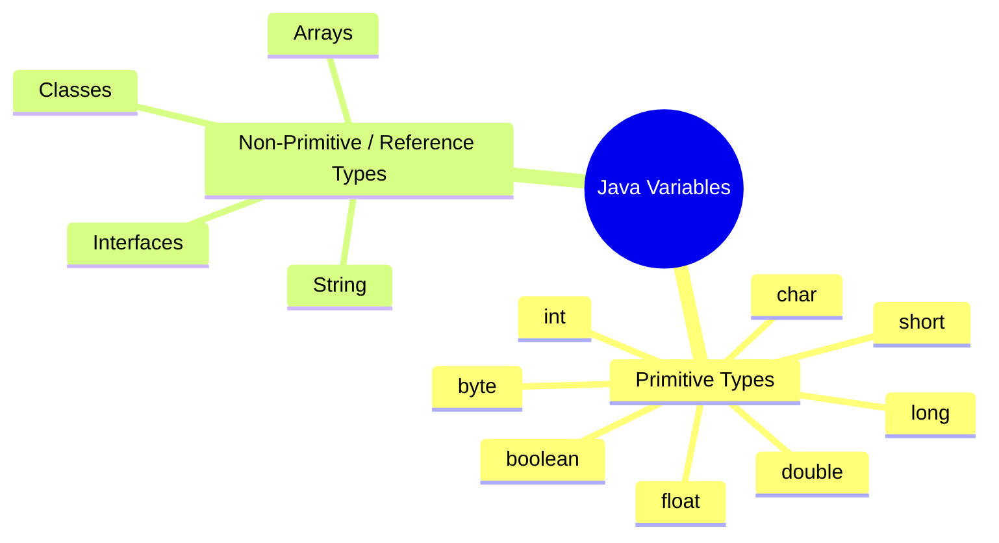
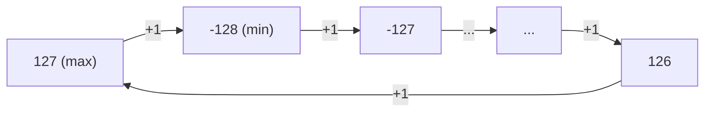
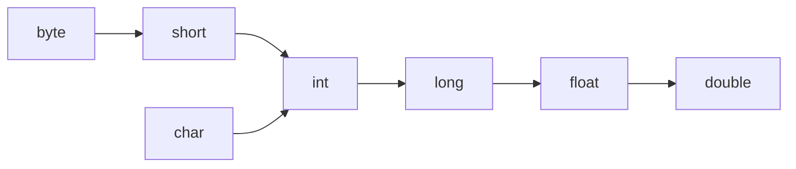
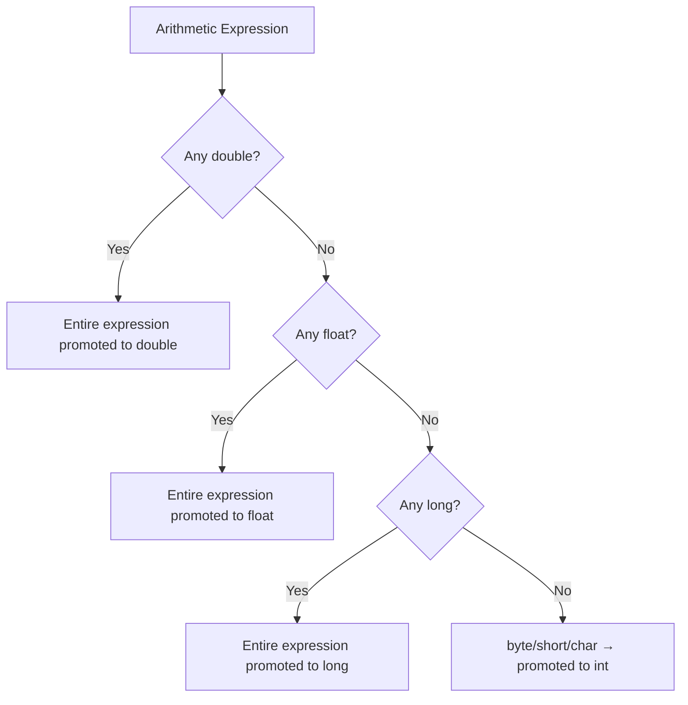
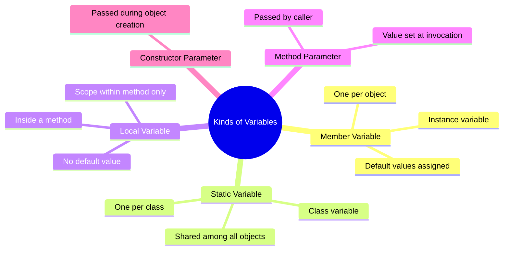
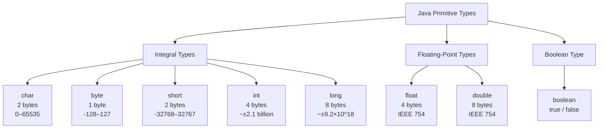
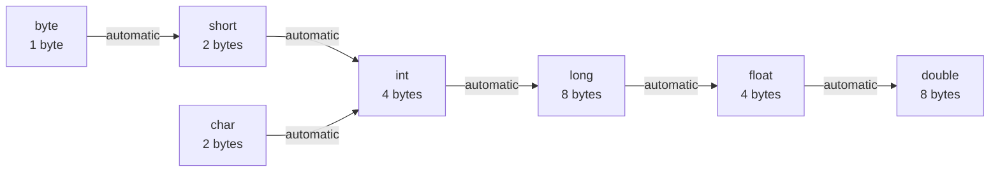
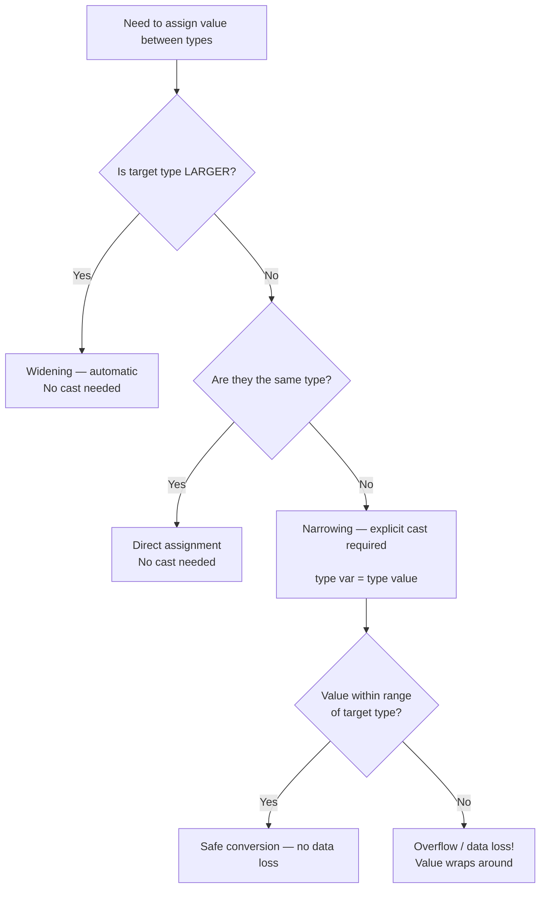
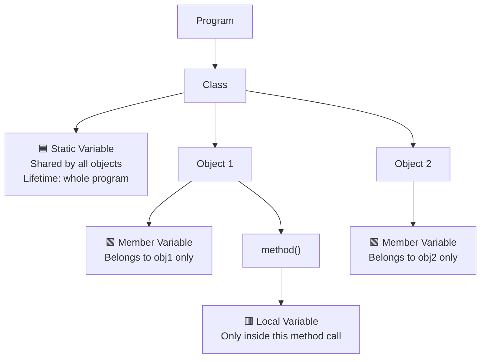

# 📚 Java Variables — Comprehensive Study Guide

> These notes are derived from the *Concept and Coding* Java lecture series on Variables.
> They are designed to be fully self-contained — no prior lecture viewing is required.

---

## Table of Contents

1. [What is a Variable?](#1-what-is-a-variable)
2. [Java as a Statically Typed & Strongly Typed Language](#2-java-as-a-statically-typed--strongly-typed-language)
3. [Variable Declaration Syntax](#3-variable-declaration-syntax)
4. [Variable Naming Conventions](#4-variable-naming-conventions)
5. [Types of Variables in Java](#5-types-of-variables-in-java)
6. [Primitive Data Types — Deep Dive](#6-primitive-data-types--deep-dive)
   - [char](#61-char)
   - [byte](#62-byte)
   - [short](#63-short)
   - [int](#64-int)
   - [long](#65-long)
   - [float](#66-float)
   - [double](#67-double)
   - [boolean](#68-boolean)
7. [Two's Complement & Signed Representation](#7-twos-complement--signed-representation)
8. [Type Conversion](#8-type-conversion)
   - [Widening (Automatic) Conversion](#81-widening-automatic-conversion)
   - [Narrowing (Explicit / Downcasting)](#82-narrowing-explicit--downcasting)
   - [Promotion During Expressions](#83-promotion-during-expressions)
9. [Kinds of Variables](#9-kinds-of-variables)
   - [Member (Instance) Variables](#91-member-instance-variables)
   - [Local Variables](#92-local-variables)
   - [Static (Class) Variables](#93-static-class-variables)
   - [Method Parameters](#94-method-parameters)
   - [Constructor Parameters](#95-constructor-parameters)
10. [Default Values](#10-default-values)
11. [Float & Double — The Precision Warning](#11-float--double--the-precision-warning)
12. [Quick-Reference Tables](#12-quick-reference-tables)
13. [Mermaid Diagrams](#13-mermaid-diagrams)
14. [Common Mistakes](#14-common-mistakes)
15. [Best Practices](#15-best-practices)
16. [Interview Notes](#16-interview-notes)
17. [Practice Questions](#17-practice-questions)
18. [Summary Cheat Sheet](#18-summary-cheat-sheet)

---

# 1. What is a Variable?

## Overview

A **variable** is the most fundamental building block of any Java program. Before you can write any meaningful logic, you must understand what variables are and how Java manages them.

## Real-World Analogy

Think of a variable as a **labelled container** (like a jar with a name written on it). The container has:

- A **label** (the variable name) — so you can refer to it later.
- A **type of content it can hold** (the data type) — a jar labelled *water* can only hold water; a jar labelled *coins* can only hold coins.
- The **actual content** (the value) — e.g., the number `32`.

## Definition

> A **variable** in Java is a named memory location that holds a value of a specific data type.

## Syntax

```java
dataType variableName = value;
```

## Example

```java
int var = 32;
```

### Line-by-Line Explanation

| Part | Meaning |
|------|---------|
| `int` | Data type — tells Java the variable will hold whole (integer) numbers |
| `var` | Variable name — the label you use to refer to this container |
| `=` | Assignment operator — puts the value into the container |
| `32` | The value stored in the container |
| `;` | Semicolon — required at the end of every Java statement |

## Memory Representation

When `int var = 32;` is executed:

- Java allocates **4 bytes** of memory on the **stack** (for local variables) or **heap** (for instance variables inside objects).
- The value `32` is stored in binary (`00000000 00000000 00000000 00100000`).
- The name `var` is a reference to that memory location.

---

# 2. Java as a Statically Typed & Strongly Typed Language

## Overview

Java has two important type-related properties that distinguish it from dynamically typed languages like Python or JavaScript.

## Static Typing

> **Static type language**: Every variable must have its data type declared at compile time.

In Java, you cannot write:

```java
var = 10;  // ❌ ERROR — data type not specified
```

You must always write:

```java
int var = 10;  // ✅ data type 'int' declared explicitly
```

The compiler knows the type of every variable before the program runs. This allows the compiler to catch type errors early.

**Contrast with Python (dynamically typed):**

```python
var = 10       # Python infers the type at runtime — no declaration needed
var = "hello"  # Python allows reassigning a different type to the same variable
```

In Java, this is impossible — once `var` is declared as `int`, it can only hold integers.

## Strong Typing

> **Strongly typed language**: Every data type has a defined range, and you cannot assign a value outside that range without explicit handling.

In Java, each primitive data type has strict limits:

- `int` can hold values approximately from **−2.1 billion to +2.1 billion**.
- You **cannot** store a value like `99999999999999` in an `int` without a compile-time error.

Strong typing prevents accidental data corruption and makes Java programs more predictable and safe.

## Interview Question

**Q: Is Java a statically typed language? Is Java a strongly typed language?**

**A:** Yes to both.
- **Static**: All variable types must be declared at compile time.
- **Strong**: Each type has a fixed range and implicit out-of-range assignments are not allowed.

---

# 3. Variable Declaration Syntax

## Full Syntax

```java
dataType variableName = value;
```

## Variations

```java
int age;           // Declaration only (no value assigned yet)
int age = 25;      // Declaration + initialization
int a, b, c;       // Multiple variables of the same type in one line
int a = 1, b = 2;  // Multiple variables with initial values
```

## Syntax Breakdown

| Element | Description |
|---------|-------------|
| `dataType` | One of Java's 8 primitive types, or a reference type (class/interface/array) |
| `variableName` | A legal Java identifier following naming conventions |
| `=` | The assignment operator |
| `value` | A literal, expression, or result of a method call compatible with `dataType` |
| `;` | Statement terminator — mandatory in Java |

---

# 4. Variable Naming Conventions

Java has both **rules** (enforced by the compiler) and **conventions** (followed by professional developers).

## Rules — Compiler Enforced

### ✅ Rule 1: Variable Names Are Case-Sensitive

```java
int age = 10;
int Age = 20;  // This is a DIFFERENT variable from 'age'
int AGE = 30;  // This is yet another DIFFERENT variable
```

All three are distinct variables because Java differentiates uppercase and lowercase letters.

---

### ✅ Rule 2: Legal Characters

Variable names may contain:

- **Unicode letters** (A–Z, a–z, and letters from any human language)
- **Digits** (0–9) — but NOT as the first character
- **Dollar sign** (`$`)
- **Underscore** (`_`)

```java
int myVar = 1;        // ✅ starts with letter
int _myVar = 2;       // ✅ starts with underscore
int $myVar = 3;       // ✅ starts with dollar sign
int myVar9 = 4;       // ✅ digit is NOT the first character

int 9myVar = 5;       // ❌ ILLEGAL — cannot start with a digit
int my-Var = 6;       // ❌ ILLEGAL — hyphen is not allowed
int my Var = 7;       // ❌ ILLEGAL — space is not allowed
```

---

### ✅ Rule 3: Cannot Use Java Reserved Words

Java reserves certain keywords for its own syntax. You **cannot** use them as variable names.

Examples of reserved words:

| Category | Keywords |
|----------|----------|
| Data types | `int`, `float`, `double`, `char`, `boolean`, `byte`, `short`, `long` |
| OOP | `class`, `interface`, `extends`, `implements`, `new`, `this`, `super` |
| Control flow | `if`, `else`, `for`, `while`, `do`, `switch`, `case`, `break`, `continue`, `return` |
| Access modifiers | `public`, `private`, `protected` |
| Others | `static`, `final`, `void`, `null`, `true`, `false` |

```java
int int = 5;    // ❌ 'int' is a reserved word — compiler error
int class = 5;  // ❌ 'class' is a reserved word — compiler error
```

> [!NOTE]
> As you gain experience with Java, you'll naturally memorize reserved words. There's no need to memorize them all at once.

---

## Conventions — Professional Standards

### 🎨 Convention 1: Single-Word Variable Names — All Lowercase

```java
int age = 25;
String city = "Jaipur";
double price = 99.99;
```

---

### 🎨 Convention 2: Multi-Word Variable Names — camelCase

When a variable name consists of multiple words, start with lowercase and capitalize each subsequent word.

```java
int jaipur = 2;          // single word — all lowercase ✅
int jaipurCity = 2;      // two words — camelCase ✅
int userAccountBalance;  // three words — camelCase ✅
```

> [!TIP]
> **camelCase** gets its name because the capital letters in the middle resemble the humps of a camel.

---

### 🎨 Convention 3: Constant Variables — ALL_CAPS with Underscores

When a variable is declared `static final` (meaning its value can never change), it should be named in ALL CAPITAL LETTERS, with words separated by underscores.

```java
static final int MAX_SPEED = 120;
static final double PI = 3.14159;
static final String APP_NAME = "MyApp";
```

> [!IMPORTANT]
> `static final` makes a variable a **constant** — its value is fixed for the lifetime of the program.
> We will cover `static` and `final` keywords in detail in later sections.

---

# 5. Types of Variables in Java



Java has **two broad categories** of variable types:

| Category | Description | Examples |
|----------|-------------|---------|
| **Primitive** | Basic, built-in data types; store actual values directly | `int`, `double`, `char`, `boolean`, etc. |
| **Non-Primitive (Reference)** | Store a reference (memory address) to an object | `String`, arrays, any class instance |

> [!NOTE]
> This guide focuses on **Primitive Types**. Non-primitive / Reference types will be covered in a separate section/video.

---

# 6. Primitive Data Types — Deep Dive

Java has exactly **8 primitive data types**:

```
char | byte | short | int | long | float | double | boolean
```

They fall into three functional groups:

| Group | Types |
|-------|-------|
| **Integral (whole numbers)** | `char`, `byte`, `short`, `int`, `long` |
| **Floating-point (decimal numbers)** | `float`, `double` |
| **Boolean (true/false)** | `boolean` |

---

## 6.1 `char`

### Overview

`char` stores a **single character**. Internally, Java stores characters as their **Unicode / ASCII integer value**, not as the visual symbol itself.

### Size & Range

| Property | Value |
|----------|-------|
| Size | 2 bytes (16 bits) |
| Range | 0 to 65,535 |
| Default value | `'\u0000'` (null character) |
| Type | Unsigned (no negative values) |

### Why 65,535?

With 16 bits, the maximum unsigned value is:

```
2^15 + 2^14 + ... + 2^1 + 2^0 = 65,535
(all 16 bits set to 1)
```

This covers all standard ASCII characters (0–127) plus the extended Unicode characters.

### Syntax

```java
char variableName = 'A';       // character literal (use single quotes)
char variableName = 65;        // integer literal — Java converts to 'A'
char variableName = '\u0041';  // Unicode escape for 'A'
```

> [!IMPORTANT]
> Use **single quotes** for `char` literals. Double quotes (`"A"`) are for `String` — a completely different type.

### ASCII Quick Reference

| Decimal | Character |
|---------|-----------|
| 65 | `A` |
| 66 | `B` |
| 97 | `a` |
| 98 | `b` |
| 48 | `0` (digit zero) |
| 64 | `@` |

### Code Examples

```java
public class CharExample {
    public static void main(String[] args) {
        char c1 = 'A';    // Assign a character literal
        char c2 = 65;     // Assign an integer — internally treated as 'A'
        char c3 = 97;     // 97 is the ASCII code for 'a'

        System.out.println(c1);  // Output: A
        System.out.println(c2);  // Output: A
        System.out.println(c3);  // Output: a
    }
}
```

**Output:**
```
A
A
a
```

### Line-by-Line Explanation

- `char c1 = 'A';` — Declares a char and directly assigns the character `A`.
- `char c2 = 65;` — The integer `65` is the ASCII code for `A`. Java internally stores `65` and displays `A` when printed.
- `char c3 = 97;` — The integer `97` is the ASCII code for lowercase `a`.

---

## 6.2 `byte`

### Overview

`byte` is the **smallest integer type** in Java. It is useful when memory is critical and values are known to be small (e.g., raw binary data, file I/O).

### Size & Range

| Property | Value |
|----------|-------|
| Size | 1 byte (8 bits) |
| Range | −128 to 127 |
| Default value | `0` |
| Representation | Signed two's complement |

### Why −128 to 127 (Not 0 to 255)?

With 8 bits, you can represent 256 (2^8) distinct values. Because `byte` is **signed** (allows negative numbers), half the range is negative:

- Positive side: 0 to 127 (128 values)
- Negative side: −128 to −1 (128 values)
- Total: 256 values

The **most significant bit (MSB)** — the leftmost bit — acts as the **sign bit**:
- MSB = `0` → positive number
- MSB = `1` → negative number

This is called **two's complement representation** (explained in detail in Section 7).

### Syntax

```java
byte variableName = 100;
byte variableName = -50;
```

### Code Example — Default Value

```java
public class Employee {
    byte memberVar;  // class member variable — automatically initialized to 0

    void dummy() {
        System.out.println(memberVar);  // prints 0
    }
}

public class Main {
    public static void main(String[] args) {
        Employee emp = new Employee();
        emp.dummy();
    }
}
```

**Output:**
```
0
```

> [!IMPORTANT]
> Default values (like `0` for `byte`) are **only assigned to class member variables** (instance variables). Local variables inside methods do NOT get default values — you must assign them manually before use.

### Code Example — Local Variable Must Be Initialized

```java
void myMethod() {
    byte localVar;           // declared but NOT initialized
    System.out.println(localVar);  // ❌ COMPILE ERROR: variable localVar might not have been initialized
}
```

Correct:

```java
void myMethod() {
    byte localVar = 7;       // ✅ initialized before use
    System.out.println(localVar);  // Output: 7
}
```

---

## 6.3 `short`

### Overview

`short` is rarely used in modern Java but exists for memory optimization in large arrays.

### Size & Range

| Property | Value |
|----------|-------|
| Size | 2 bytes (16 bits) |
| Range | −32,768 to 32,767 |
| Default value | `0` |
| Representation | Signed two's complement |

### Syntax

```java
short s = 200;
short s = -1000;
```

---

## 6.4 `int`

### Overview

`int` is the **most commonly used** integer type in Java. When you write a whole number literal in Java code, the compiler treats it as `int` by default.

### Size & Range

| Property | Value |
|----------|-------|
| Size | 4 bytes (32 bits) |
| Range | −2,147,483,648 to 2,147,483,647 (approximately ±2.1 billion) |
| Default value | `0` |
| Representation | Signed two's complement |

### Range Formula

```
Minimum: −2^31 = −2,147,483,648
Maximum:  2^31 − 1 =  2,147,483,647
```

### Syntax

```java
int age = 25;
int temperature = -5;
int population = 1_000_000;  // underscores allowed in Java 7+ for readability
```

### Code Example

```java
public class IntExample {
    public static void main(String[] args) {
        int a = 100;
        int b = 200;
        int sum = a + b;
        System.out.println("Sum: " + sum);  // Output: Sum: 300
    }
}
```

---

## 6.5 `long`

### Overview

Use `long` when your value exceeds the range of `int` (greater than ~2.1 billion). Common use cases include timestamps (milliseconds since epoch), large file sizes, and population counters.

### Size & Range

| Property | Value |
|----------|-------|
| Size | 8 bytes (64 bits) |
| Range | −9,223,372,036,854,775,808 to 9,223,372,036,854,775,807 (approximately ±9.2 × 10^18) |
| Default value | `0L` |
| Representation | Signed two's complement |

### Syntax

```java
long bigNumber = 500L;               // 'L' suffix tells Java this is a long literal
long worldPopulation = 8_000_000_000L;
```

> [!IMPORTANT]
> Always append `L` (uppercase) or `l` (lowercase, but avoid — it looks like the digit `1`) when writing `long` literals that exceed `int`'s range.
>
> Without `L`, Java tries to interpret the literal as an `int` first, which will cause a compile-time error if the value is too large.

### Code Example

```java
public class LongExample {
    public static void main(String[] args) {
        long var = 100L;
        System.out.println(var);  // Output: 100
    }
}
```

---

## 6.6 `float`

### Overview

`float` stores **single-precision 32-bit floating-point** numbers (decimal values). It follows the **IEEE 754** standard.

### Size & Range

| Property | Value |
|----------|-------|
| Size | 4 bytes (32 bits) |
| Precision | ~6–7 significant decimal digits |
| Default value | `0.0f` |
| Standard | IEEE 754 single precision |

### Syntax

```java
float price = 63.20f;   // 'f' suffix is REQUIRED
float pi = 3.14f;
```

> [!WARNING]
> **The `f` suffix is mandatory** for float literals. Without it, Java treats the decimal number as a `double` by default, causing a compile error when assigning to a `float` variable.

```java
float x = 3.14;   // ❌ ERROR — 3.14 is a double literal; incompatible types
float x = 3.14f;  // ✅ CORRECT
```

### ⚠️ Precision Warning

Float and double should **NEVER** be used for precise financial or currency calculations. See Section 11 for a detailed explanation.

---

## 6.7 `double`

### Overview

`double` stores **double-precision 64-bit floating-point** numbers. It is the default type for decimal literals in Java and provides roughly twice the precision of `float`.

### Size & Range

| Property | Value |
|----------|-------|
| Size | 8 bytes (64 bits) |
| Precision | ~15–16 significant decimal digits |
| Default value | `0.0d` |
| Standard | IEEE 754 double precision |

### Syntax

```java
double price = 63.20;    // no suffix needed — double is the default
double price = 63.20d;   // 'd' suffix is optional but valid
```

### ⚠️ Precision Warning

Same as `float` — do not use for currency. See Section 11.

---

## 6.8 `boolean`

### Overview

`boolean` stores one of only two possible values: `true` or `false`. It is used for all conditional logic.

### Size & Range

| Property | Value |
|----------|-------|
| Size | Conceptually 1 bit (JVM implementation may vary) |
| Values | `true` or `false` only |
| Default value | `false` |

### Syntax

```java
boolean isLoggedIn = true;
boolean hasError = false;
```

### Code Example

```java
public class BooleanExample {
    public static void main(String[] args) {
        boolean isJavaFun = true;
        boolean isHard = false;

        System.out.println("Java is fun: " + isJavaFun);  // Output: Java is fun: true
        System.out.println("Java is hard: " + isHard);    // Output: Java is hard: false

        if (isJavaFun) {
            System.out.println("Let's keep learning!");
        }
    }
}
```

**Output:**
```
Java is fun: true
Java is hard: false
Let's keep learning!
```

---

# 7. Two's Complement & Signed Representation

## Why This Matters

This is one of the most important (and confusing) concepts for beginners. Java's integer types (`byte`, `short`, `int`, `long`) are all **signed two's complement** integers. Understanding this explains why the ranges are asymmetric and what happens during overflow.

## The Sign Bit

In any signed binary number:
- The **most significant bit (MSB)** — leftmost — is the **sign bit**.
- `0` in MSB → positive number
- `1` in MSB → negative number

For a `byte` (8 bits):

```
0 1 1 1 1 1 1 1  =  +127   (MSB = 0, so positive)
1 0 0 0 0 0 0 0  =  −128   (MSB = 1, so negative)
```

## What is Two's Complement?

Two's complement is the method Java uses to represent **negative numbers** in binary.

### Step-by-Step: How to Find Two's Complement of a Number

**Example: Represent −3 in binary using 4 bits**

**Step 1:** Write +3 in binary (4 bits):
```
+3 = 0011
```

**Step 2:** Flip all the bits (this gives the **one's complement**):
```
0011  →  1100
```

**Step 3:** Add 1 (this gives the **two's complement**):
```
1100 + 0001 = 1101
```

So, **−3 = `1101`** in 4-bit two's complement.

### Verification: +3 + (−3) Should Equal 0

```
  0011   (+3)
+ 1101   (−3)
------
 10000
```

With 4-bit representation, we discard the 5th bit (carry overflow), leaving:

```
0000  =  0  ✅
```

> [!NOTE]
> For `byte` (8 bits), any carry into the 9th bit is similarly discarded.

## Why −128 to 127 (Not −127 to 127)?

- Positive values: `00000001` to `01111111` → 1 to 127 (127 values)
- Zero: `00000000` → 0 (1 value)
- Negative values: `10000000` to `11111111` → −128 to −1 (128 values)

This gives 256 total values, and the range **−128 to 127**.

There is one more negative value than positive because zero is counted on the positive side.

## Overflow Behavior

When a value exceeds the maximum (`127` for `byte`), it **wraps around** to the minimum:

```
127 + 1 = 128   →   overflows to   −128
127 + 2 = 129   →   overflows to   −127
```



---

# 8. Type Conversion

## Overview

Java frequently requires converting values between different data types. There are three kinds of conversions:

1. **Widening** (automatic)
2. **Narrowing** (explicit / casting)
3. **Promotion** (during expressions)

---

## 8.1 Widening (Automatic) Conversion

### Definition

When you assign a value of a **smaller** data type to a **larger** data type, Java **automatically** converts it. No data is lost.

### The Widening Hierarchy



You can always move to the right in this chain automatically.

### Why No Data Loss?

The larger type has more bits, so it can fully contain the value of the smaller type.

**Example:** A `byte` (8 bits) value fits perfectly in an `int` (32 bits) — Java just pads the extra bits with zeros.

### Code Examples

```java
public class WideningExample {
    public static void main(String[] args) {
        byte x = 10;
        int intVar = x;  // ✅ automatic widening — no cast needed
        System.out.println(intVar);  // Output: 10

        int a = 500;
        long b = a;  // ✅ int → long, automatic
        System.out.println(b);  // Output: 500

        int c = 100;
        double d = c;  // ✅ int → double, automatic
        System.out.println(d);  // Output: 100.0
    }
}
```

**Output:**
```
10
500
100.0
```

---

## 8.2 Narrowing (Explicit / Downcasting)

### Definition

When you assign a value of a **larger** data type to a **smaller** data type, Java **does NOT** convert automatically. You must explicitly tell Java to cast it. This is called **explicit casting** or **narrowing**.

### Why Is This Manual?

The smaller type might not be able to hold the value — data could be **lost**. Java forces you to acknowledge this risk explicitly.

### Syntax

```java
smallerType varName = (smallerType) largerTypeValue;
```

### Code Example — Successful Cast

```java
public class NarrowingExample {
    public static void main(String[] args) {
        int intVar = 10;
        byte byteVar = (byte) intVar;  // explicit cast
        System.out.println(byteVar);   // Output: 10
    }
}
```

**Output:**
```
10
```

### Code Example — Data Loss During Cast

```java
public class OverflowExample {
    public static void main(String[] args) {
        int intVar = 128;              // 128 is outside byte's range (max 127)
        byte byteVar = (byte) intVar;  // explicit cast
        System.out.println(byteVar);   // Output: -128
    }
}
```

**Output:**
```
-128
```

### Why Did 128 Become −128?

`128` in binary (using 8 bits): `10000000`

In two's complement, `10000000` represents **−128**.

So Java stored the bits as-is, and those bits mean −128 in a signed `byte`.

```
128 → 10000000 → interpreted as −128 in two's complement
129 → 10000001 → interpreted as −127
130 → 10000010 → interpreted as −126
```

> [!CAUTION]
> **Always verify the target type's range** before performing explicit downcasting. Unexpected overflow can silently corrupt data.

---

## 8.3 Promotion During Expressions

### Definition

When smaller types (`byte`, `short`, `char`) are used in **arithmetic expressions**, Java **automatically promotes** them to `int` before performing the calculation.

### Why Does Java Do This?

To prevent overflow during intermediate calculations. If two `byte` values (each max 127) are added, their sum could be 254 — which overflows `byte`. By promoting to `int`, the calculation is safe.

### Rule 1: byte and short → Always Promoted to int

```java
byte a = 127;
byte b = 1;
byte sum = a + b;  // ❌ ERROR — the expression (a + b) is of type int, not byte
```

To fix:

```java
byte a = 127;
byte b = 1;
int sum = a + b;          // ✅ store result in int
System.out.println(sum);  // Output: 128
```

OR force it back to byte (with possible overflow):

```java
byte sum = (byte)(a + b);  // explicit downcast — result is -128 due to overflow
System.out.println(sum);   // Output: -128
```

### Rule 2: If Any Operand Is a Larger Type, the Whole Expression Promotes

```
int + double   → double
long + float   → float
int + long     → long
```

The expression result is always the **largest type** present.

```java
public class PromotionExample {
    public static void main(String[] args) {
        int a = 34;
        double b = 20.0;

        // a + b → int + double → promoted to double
        // int sum = a + b;    // ❌ ERROR — result is double
        double sum = a + b;    // ✅ CORRECT
        System.out.println(sum);  // Output: 54.0
    }
}
```

If you need an `int` result:

```java
int sum = (int)(a + b);  // explicit downcast to int
System.out.println(sum); // Output: 54
```

### Summary Flowchart



---

# 9. Kinds of Variables

Beyond *type* (primitive vs. reference), Java variables are also classified by *where* they are declared and how they behave. There are **five kinds**:



---

## 9.1 Member (Instance) Variables

### Definition

Variables declared **directly inside a class**, but **outside any method or constructor**. Each object (instance) of the class gets its **own private copy**.

### Key Characteristics

| Property | Detail |
|----------|--------|
| Declared in | Class body (outside any method) |
| Default value | Yes (see Section 10) |
| Scope | Accessible from any method in the class |
| Lifetime | Lives as long as the object lives |
| Copies | One per object |

### Code Example

```java
public class Employee {
    int memberVariable = 10;  // instance/member variable
}

public class Main {
    public static void main(String[] args) {
        Employee obj1 = new Employee();
        Employee obj2 = new Employee();

        obj1.memberVariable = 50;
        obj2.memberVariable = 100;

        System.out.println(obj1.memberVariable);  // Output: 50
        System.out.println(obj2.memberVariable);  // Output: 100
    }
}
```

**Output:**
```
50
100
```

### Explanation

Even though both `obj1` and `obj2` are created from the same `Employee` class, each has its **own independent copy** of `memberVariable`. Changing one does not affect the other.

---

## 9.2 Local Variables

### Definition

Variables declared **inside a method, constructor, or block**. They are created when the method is called and destroyed when the method returns.

### Key Characteristics

| Property | Detail |
|----------|--------|
| Declared in | Inside a method or block `{ }` |
| Default value | **None** — must initialize before use |
| Scope | Only within the `{ }` block where declared |
| Lifetime | Exists only during the execution of that method |

### Code Example

```java
public class LocalExample {
    void myMethod() {
        byte localVar = 100;  // must initialize manually
        System.out.println(localVar);  // Output: 100
    }  // localVar is destroyed here
}
```

> [!WARNING]
> **Never use a local variable before initializing it.** The Java compiler will refuse to compile the code.
>
> ```java
> void myMethod() {
>     byte localVar;
>     System.out.println(localVar);  // ❌ COMPILE ERROR
> }
> ```

---

## 9.3 Static (Class) Variables

### Definition

Variables declared with the `static` keyword inside a class. There is only **one copy** for the entire class, shared by all objects.

### Key Characteristics

| Property | Detail |
|----------|--------|
| Declared with | `static` keyword |
| Default value | Yes (same as member variables) |
| Scope | Class-wide |
| Lifetime | Entire program lifetime |
| Access | Via class name: `ClassName.variableName` |
| Copies | **One per class** (not per object) |

### Code Example

```java
public class Employee {
    static int staticVar = 100;  // one copy for all Employee objects
    int memberVar = 10;          // one copy per Employee object
}

public class Main {
    public static void main(String[] args) {
        Employee obj1 = new Employee();
        Employee obj2 = new Employee();

        // Access static variable via class name
        System.out.println(Employee.staticVar);  // Output: 100

        // Both objects share the same static variable
        Employee.staticVar = 999;
        System.out.println(Employee.staticVar);  // Output: 999

        // Member variables are independent per object
        obj1.memberVar = 50;
        obj2.memberVar = 75;
        System.out.println(obj1.memberVar);  // Output: 50
        System.out.println(obj2.memberVar);  // Output: 75
    }
}
```

**Output:**
```
100
999
50
75
```

### Memory Diagram

```
Method Area (JVM)
┌─────────────────────────┐
│ Employee class           │
│  staticVar = 100         │  ← Only ONE copy
└─────────────────────────┘

Heap (JVM)
┌─────────────┐   ┌─────────────┐
│  obj1        │   │  obj2        │
│  memberVar=50│   │  memberVar=75│  ← Each object has its OWN copy
└─────────────┘   └─────────────┘
```

---

## 9.4 Method Parameters

### Definition

Variables listed in a method's **parameter list**. They receive values when the method is called.

### Code Example

```java
public class Calculator {
    int add(int a, int b) {  // a and b are method parameters
        return a + b;
    }
}

public class Main {
    public static void main(String[] args) {
        Calculator calc = new Calculator();
        int result = calc.add(2, 5);  // 2 → a, 5 → b
        System.out.println(result);   // Output: 7
    }
}
```

### Key Points

- Method parameters behave like **local variables** — they are created when the method is called and destroyed when it returns.
- They have no default value — they are always provided by the caller.

---

## 9.5 Constructor Parameters

### Definition

Variables listed in a **constructor's parameter list**. They receive values when a new object is created.

### Code Example

```java
public class Employee {
    int id;
    String name;

    // Default constructor (no parameters)
    Employee() {
        id = 0;
        name = "Unknown";
    }

    // Parameterized constructor
    Employee(int id, String name) {
        this.id = id;
        this.name = name;
    }
}

public class Main {
    public static void main(String[] args) {
        Employee e1 = new Employee();          // calls default constructor
        Employee e2 = new Employee(101, "Alice");  // calls parameterized constructor

        System.out.println(e1.id + " " + e1.name);  // Output: 0 Unknown
        System.out.println(e2.id + " " + e2.name);  // Output: 101 Alice
    }
}
```

> [!NOTE]
> Constructors and the `this` keyword will be covered in detail in later sessions.

---

# 10. Default Values

Default values are **automatically assigned** by Java to **class member variables** and **static variables** when they are not explicitly initialized.

> [!IMPORTANT]
> Default values are **NOT** assigned to **local variables**. Local variables must always be manually initialized before use.

| Data Type | Default Value |
|-----------|---------------|
| `byte` | `0` |
| `short` | `0` |
| `int` | `0` |
| `long` | `0L` |
| `float` | `0.0f` |
| `double` | `0.0d` |
| `char` | `'\u0000'` (null character) |
| `boolean` | `false` |
| Object references | `null` |

### Code Example

```java
public class DefaultValues {
    byte b;
    short s;
    int i;
    long l;
    float f;
    double d;
    char c;
    boolean bool;

    void printDefaults() {
        System.out.println("byte: " + b);
        System.out.println("short: " + s);
        System.out.println("int: " + i);
        System.out.println("long: " + l);
        System.out.println("float: " + f);
        System.out.println("double: " + d);
        System.out.println("char: " + (int)c);  // print as int to see 0
        System.out.println("boolean: " + bool);
    }

    public static void main(String[] args) {
        DefaultValues dv = new DefaultValues();
        dv.printDefaults();
    }
}
```

**Output:**
```
byte: 0
short: 0
int: 0
long: 0
float: 0.0
double: 0.0
char: 0
boolean: false
```

---

# 11. Float & Double — The Precision Warning

## The Problem

Both `float` and `double` follow the **IEEE 754** standard for floating-point arithmetic. This standard uses binary (base-2) representation for decimal numbers.

The problem is that many decimal fractions **cannot be represented exactly in binary**, just like `1/3` cannot be represented exactly in base-10 (`0.3333...`).

This leads to **tiny rounding errors** that accumulate during arithmetic operations.

## Demonstration

```java
public class PrecisionProblem {
    public static void main(String[] args) {
        float var1 = 0.3f;
        float var2 = 0.1f;
        float var3 = var1 - var2;  // expected: 0.2

        System.out.println(var3);  // Actual output: 0.20000002
    }
}
```

**Output:**
```
0.20000002
```

We expected `0.2`, but got `0.20000002`. The same issue occurs with `double`.

## Why Does This Happen? (IEEE 754)

The value `0.3` in binary is a **repeating fraction** (similar to `1/3` in decimal). The computer stores an approximation, and when you subtract another approximation, the tiny errors compound.

## Real-World Impact

This is NOT a minor academic concern. In financial systems:

- **Wrong:** `0.1 + 0.2 = 0.30000000000000004` (float/double)
- **Correct:** `0.1 + 0.2 = 0.3` (BigDecimal)

Imagine a banking system charging a customer `$0.30000000000000004` instead of `$0.30` — multiplied across millions of transactions, this is catastrophic.

## Solution: Use `BigDecimal`

For any application requiring **exact decimal arithmetic** (financial, scientific, medical):

```java
import java.math.BigDecimal;

public class BigDecimalExample {
    public static void main(String[] args) {
        BigDecimal a = new BigDecimal("0.3");
        BigDecimal b = new BigDecimal("0.1");
        BigDecimal result = a.subtract(b);
        System.out.println(result);  // Output: 0.2 ✅
    }
}
```

**Output:**
```
0.2
```

> [!CAUTION]
> **Never use `float` or `double` for currency, financial calculations, or any domain requiring exact decimal precision. Use `BigDecimal` instead.**

> [!TIP]
> Always initialize `BigDecimal` from a **String** (`new BigDecimal("0.3")`), not from a `double` (`new BigDecimal(0.3)`) — the latter still carries the float/double imprecision into the BigDecimal.

---

# 12. Quick-Reference Tables

## All 8 Primitive Data Types

| Type | Size | Range | Default | Use Case |
|------|------|-------|---------|----------|
| `byte` | 1 byte (8 bits) | −128 to 127 | `0` | Raw binary data, small integers |
| `short` | 2 bytes (16 bits) | −32,768 to 32,767 | `0` | Large arrays where memory matters |
| `int` | 4 bytes (32 bits) | −2,147,483,648 to 2,147,483,647 | `0` | General-purpose integer (most common) |
| `long` | 8 bytes (64 bits) | −9.2×10^18 to 9.2×10^18 | `0L` | Large numbers, timestamps |
| `float` | 4 bytes (32 bits) | ~±3.4×10^38 | `0.0f` | Approximate decimals (avoid for money) |
| `double` | 8 bytes (64 bits) | ~±1.8×10^308 | `0.0d` | Approximate decimals (avoid for money) |
| `char` | 2 bytes (16 bits) | 0 to 65,535 | `'\u0000'` | Single character |
| `boolean` | ~1 bit (JVM-dependent) | `true` / `false` | `false` | Logical flags, conditions |

## Type Suffixes

| Type | Suffix Required | Example |
|------|----------------|---------|
| `long` | `L` | `100L` |
| `float` | `f` | `3.14f` |
| `double` | `d` (optional) | `3.14d` or `3.14` |

## Variable Kinds at a Glance

| Kind | Declared In | Default Value? | Scope | Lifetime |
|------|-------------|----------------|-------|----------|
| Member (instance) | Class body | ✅ Yes | Whole class | Lifetime of object |
| Static (class) | Class body with `static` | ✅ Yes | Whole class | Whole program |
| Local | Inside method/block | ❌ No | That block only | Duration of method call |
| Method parameter | Method signature | ❌ No (caller provides) | Inside method | Duration of method call |
| Constructor parameter | Constructor signature | ❌ No (caller provides) | Inside constructor | During construction |

## Type Conversion Summary

| Conversion | Direction | Manual Cast? | Data Loss Risk? |
|------------|-----------|-------------|-----------------|
| Widening | Small → Large | ❌ Not needed | None |
| Narrowing | Large → Small | ✅ Required | Yes (possible overflow) |
| Promotion | During expression | ❌ Automatic | None (result in larger type) |

---

# 13. Mermaid Diagrams

## Primitive Type Hierarchy



## Widening Conversion Chain



## Type Conversion Decision Flowchart



## Variable Scope Diagram



---

# 14. Common Mistakes

## Mistake 1: Starting a Variable Name with a Digit

```java
int 1stValue = 10;  // ❌ COMPILE ERROR
int firstValue = 10;  // ✅ CORRECT
```

## Mistake 2: Using a Reserved Word as a Variable Name

```java
int int = 5;    // ❌ COMPILE ERROR — 'int' is reserved
int myInt = 5;  // ✅ CORRECT
```

## Mistake 3: Using float/double for Currency

```java
float price = 0.3f - 0.1f;
System.out.println(price);  // ❌ Prints 0.20000002 — NOT 0.2!

// ✅ Correct:
import java.math.BigDecimal;
BigDecimal price = new BigDecimal("0.3").subtract(new BigDecimal("0.1"));
System.out.println(price);  // Prints 0.2
```

## Mistake 4: Forgetting the `L` Suffix for long Literals

```java
long bigNum = 10000000000;   // ❌ COMPILE ERROR — too big for int
long bigNum = 10000000000L;  // ✅ CORRECT
```

## Mistake 5: Forgetting the `f` Suffix for float

```java
float f = 3.14;   // ❌ COMPILE ERROR — 3.14 is a double literal
float f = 3.14f;  // ✅ CORRECT
```

## Mistake 6: Using a Local Variable Without Initializing

```java
void myMethod() {
    int x;
    System.out.println(x);  // ❌ COMPILE ERROR — x not initialized
}

void myMethod() {
    int x = 0;
    System.out.println(x);  // ✅ CORRECT
}
```

## Mistake 7: Expecting Narrowing to Happen Automatically

```java
int bigValue = 200;
byte b = bigValue;  // ❌ COMPILE ERROR — possible loss of value

byte b = (byte) bigValue;  // ✅ explicit cast — but b will be -56 (overflow!)
```

## Mistake 8: Confusing Single vs. Double Quotes for char

```java
char c = "A";  // ❌ COMPILE ERROR — "A" is a String, not a char
char c = 'A';  // ✅ CORRECT — single quotes for char
```

## Mistake 9: Accessing Static Variables Through Object References

```java
Employee.staticVar = 10;  // ✅ Access through class name (recommended)
obj1.staticVar = 10;      // ⚠️ Works but is misleading — avoid this style
```

---

# 15. Best Practices

1. **Use the most appropriate data type.** Don't use `long` when `int` suffices. Don't use `double` when you only need an integer.

2. **Always use `BigDecimal` for money and precise decimals.** Never `float` or `double`.

3. **Follow camelCase for variable names** and ALL_CAPS for constants.

4. **Initialize local variables immediately** upon declaration to avoid accidentally using uninitialized values.

5. **Access static variables using the class name**, not through object references, for clarity.

6. **Prefer `int` over `byte` or `short` for general integers** — the JVM often promotes them anyway, and `int` is more readable.

7. **Use meaningful variable names.** `customerAge` is better than `a` or `x`.

8. **Declare each variable on its own line** for readability:
   ```java
   // ❌ Hard to read
   int a = 1, b = 2, c = 3;

   // ✅ Easier to maintain
   int a = 1;
   int b = 2;
   int c = 3;
   ```

9. **Mark truly constant values with `static final`** and name them in ALL_CAPS.

---

# 16. Interview Notes

## Most Frequently Asked Questions

**Q1: Is Java statically typed or dynamically typed?**
A: Java is **statically typed** — all variable types must be declared at compile time.

**Q2: Is Java strongly typed or weakly typed?**
A: Java is **strongly typed** — each data type has a defined range, and you cannot implicitly assign a value outside that range.

**Q3: How many primitive types does Java have? Name them.**
A: 8 — `byte`, `short`, `int`, `long`, `float`, `double`, `char`, `boolean`.

**Q4: What is the default value of int, boolean, char?**
A: `int` → `0`, `boolean` → `false`, `char` → `'\u0000'`.

**Q5: Do local variables get default values?**
A: No. Only instance (member) and static variables get default values.

**Q6: What is widening conversion?**
A: Automatic conversion from a smaller to a larger data type with no data loss.

**Q7: What is narrowing conversion?**
A: Explicit (manual) cast from a larger to a smaller data type, with possible data loss.

**Q8: What is promotion during expressions?**
A: Java automatically promotes `byte` and `short` to `int` in arithmetic expressions. If any operand is `double`, the whole expression becomes `double`.

**Q9: Why should we not use float/double for currency?**
A: IEEE 754 binary floating-point cannot represent many decimal fractions exactly, leading to rounding errors. Use `BigDecimal` for precise decimal arithmetic.

**Q10: What is two's complement?**
A: The method Java uses to represent negative integers in binary. To find two's complement: flip all bits (one's complement) and add 1.

**Q11: What is the range of byte?**
A: −128 to 127. (8 bits, signed two's complement)

**Q12: What happens when a byte overflows?**
A: It wraps around. `127 + 1` in a byte becomes `−128`.

**Q13: What is the difference between member variables and static variables?**
A: Member variables — each object gets its own copy. Static variables — one copy shared by the entire class.

**Q14: Can a variable name start with a digit in Java?**
A: No. Variable names must start with a letter, `$`, or `_`.

**Q15: What is `char`'s range and why?**
A: 0 to 65,535. It is 2 bytes (16 bits) and unsigned (no negative values), designed to hold Unicode characters.

---

# 17. Practice Questions

## Easy

1. Declare a variable of type `int` named `score` and assign it the value `100`. Print it.
2. What is the output of `System.out.println((char) 65);`?
3. Declare a `boolean` variable `isActive` and set it to `true`.
4. What is the default value of a `double` member variable?
5. Which is larger: `int` or `long`?

## Medium

6. What is the output of the following code?
   ```java
   byte a = 127;
   byte b = 1;
   int c = a + b;
   System.out.println(c);
   ```

7. Predict the output:
   ```java
   int x = 128;
   byte y = (byte) x;
   System.out.println(y);
   ```

8. Why does the following code not compile?
   ```java
   float f = 3.14;
   ```
   How do you fix it?

9. What is the output?
   ```java
   float a = 0.1f;
   float b = 0.2f;
   System.out.println(a + b);
   ```

10. Write code that demonstrates that two objects of a class have independent member variables but share a static variable.

## Hard

11. Explain why the range of `byte` is −128 to 127 (not 0 to 255) using two's complement.

12. Given a `byte` value of `200` (which is outside byte's range), what value will be stored after `byte b = (byte) 200`? Show your working.

13. Will the following compile? Explain:
    ```java
    byte x = 10;
    byte y = 20;
    byte z = x + y;
    ```

14. Explain the difference between `float f = 3.14f` and `double d = 3.14`. Which is more precise, and why?

15. Write a program using `BigDecimal` that correctly computes `0.1 + 0.2` and verify it equals `0.3`.

---

# 18. Summary Cheat Sheet

```
┌─────────────────────────────────────────────────────────────────────────────┐
│                        JAVA VARIABLES — QUICK SUMMARY                       │
├─────────────────────────────────────────────────────────────────────────────┤
│ Variable = named memory container holding a typed value                     │
│ Syntax:  dataType variableName = value;                                     │
├──────────────────────────┬──────────────────────────────────────────────────┤
│ JAVA TYPE SYSTEM          │ Static: type declared at compile time           │
│                           │ Strong: each type has a range; enforced strictly│
├──────────────────────────┴──────────────────────────────────────────────────┤
│ 8 PRIMITIVE TYPES                                                            │
│  Integral: char(2B) | byte(1B) | short(2B) | int(4B) | long(8B)            │
│  Floating: float(4B, IEEE754) | double(8B, IEEE754)                         │
│  Boolean:  boolean — true / false                                            │
├─────────────────────────────────────────────────────────────────────────────┤
│ NAMING RULES                                                                 │
│  ✓ Case-sensitive      ✓ Unicode letters/digits/$/_                         │
│  ✓ Cannot start with digit  ✗ No reserved words                             │
│  Convention: camelCase (vars), ALL_CAPS (constants)                          │
├─────────────────────────────────────────────────────────────────────────────┤
│ DEFAULT VALUES (member & static variables only)                              │
│  int/byte/short/long → 0    float/double → 0.0                              │
│  char → '\u0000'            boolean → false   Object → null                 │
├─────────────────────────────────────────────────────────────────────────────┤
│ TYPE CONVERSION                                                              │
│  Widening (small→large): automatic  — no data loss                          │
│  Narrowing (large→small): manual cast — possible overflow                   │
│  Promotion (expressions): byte/short→int; largest type wins                 │
├─────────────────────────────────────────────────────────────────────────────┤
│ KINDS OF VARIABLES                                                           │
│  Member    — per object, has default value                                   │
│  Static    — per class, shared, has default value                            │
│  Local     — inside method, NO default, must initialize                     │
│  Parameter — receives value from caller (method or constructor)              │
├─────────────────────────────────────────────────────────────────────────────┤
│ ⚠️  FLOAT/DOUBLE WARNING                                                      │
│  IEEE 754 cannot represent all decimals exactly                              │
│  0.3f - 0.1f = 0.20000002  ← WRONG for currency!                           │
│  USE BigDecimal for money and precise decimals                               │
└─────────────────────────────────────────────────────────────────────────────┘
```

---

*End of Chapter — Java Variables*

> Next Topics: Non-Primitive / Reference Types · Wrapper Classes · `final` keyword · Arrays
