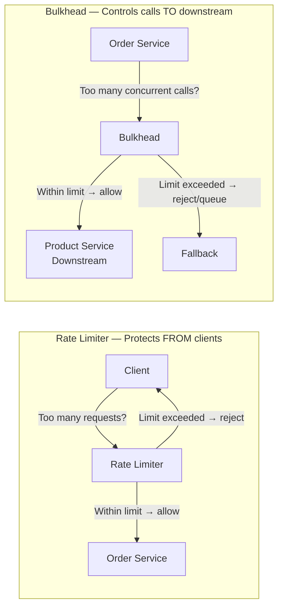
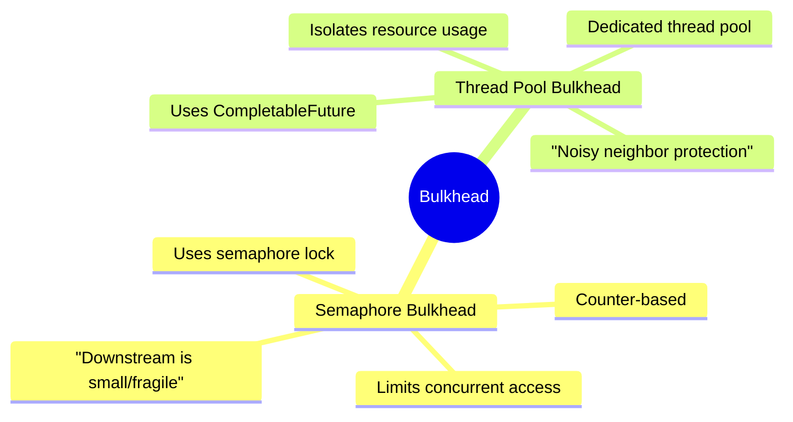
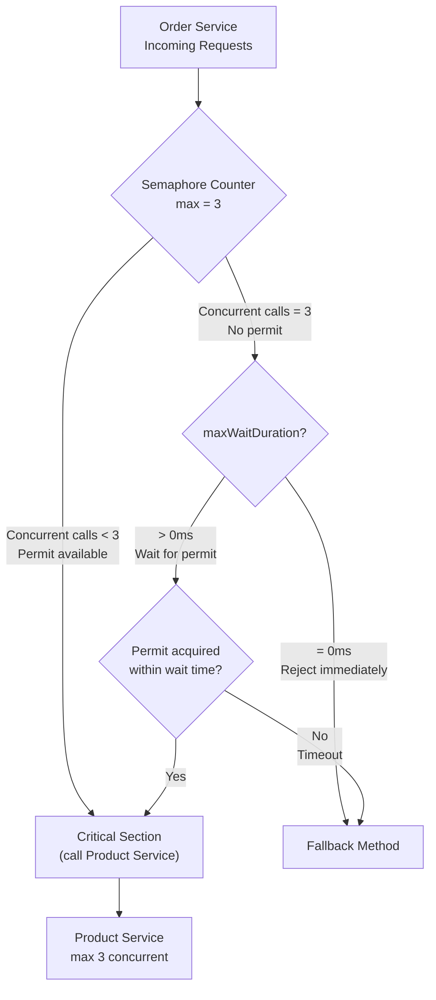
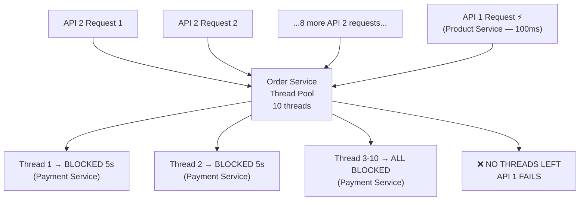
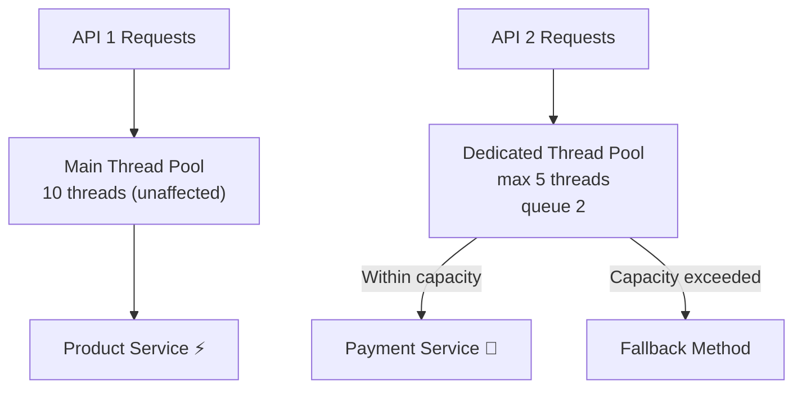
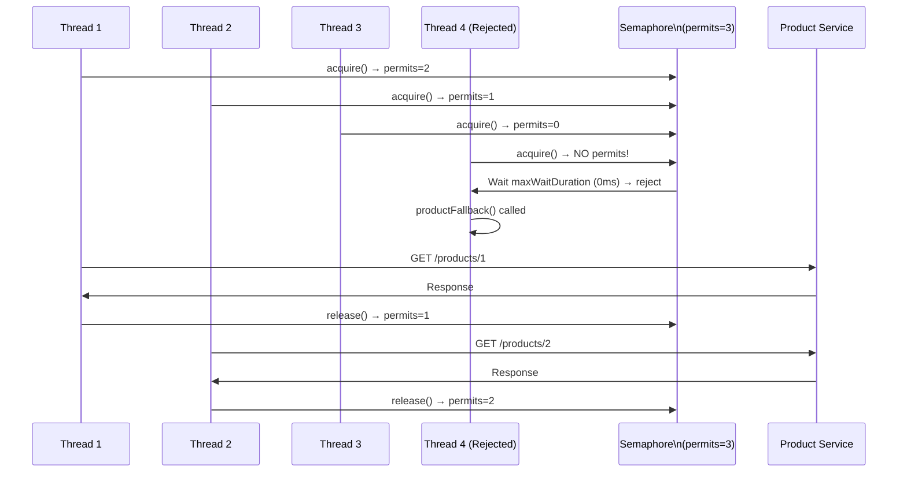
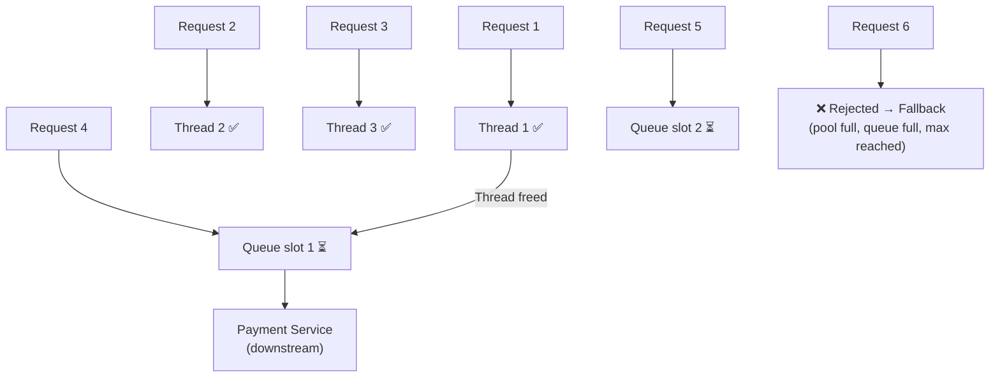
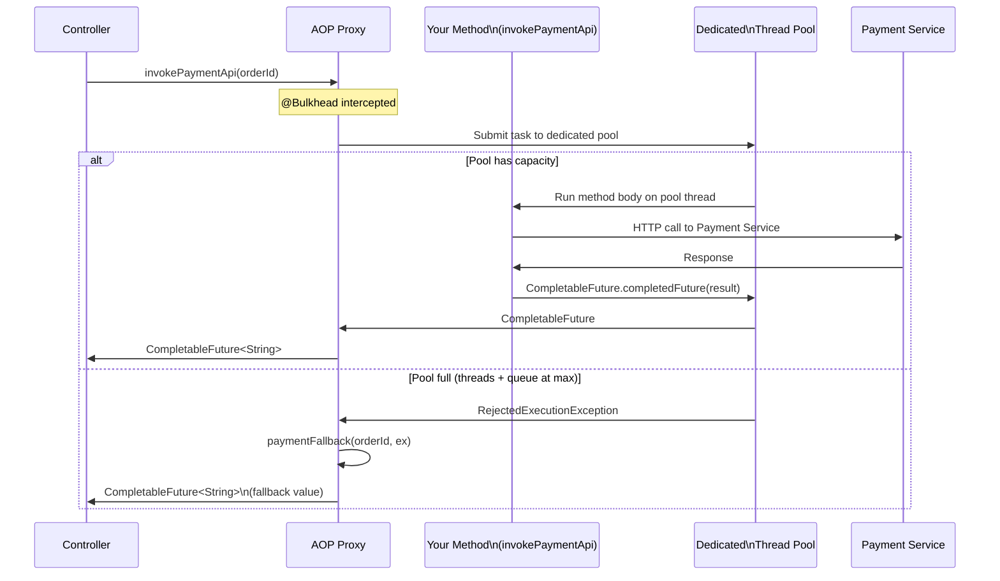
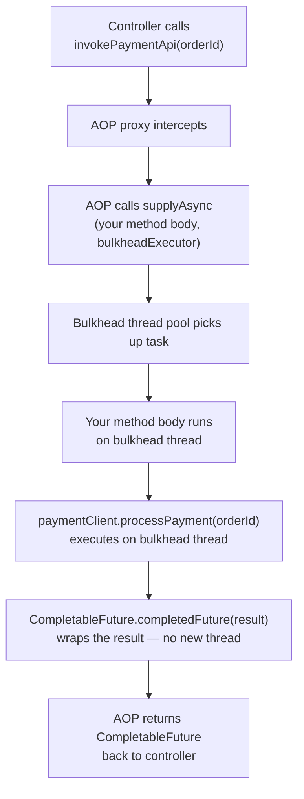
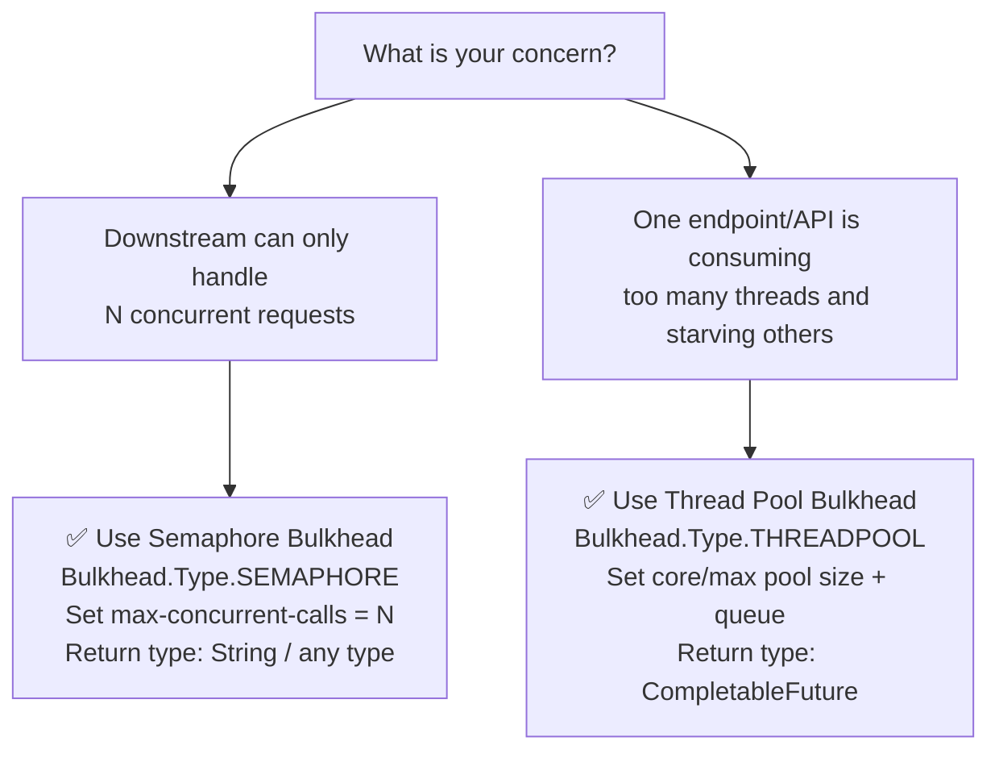

# 📌 Bulkhead Pattern — Fault Tolerant Microservices Study Guide

> A comprehensive reference covering Bulkhead concepts, Semaphore vs Thread Pool Bulkhead, the Noisy Neighbor problem, internal AOP mechanics, CompletableFuture internals, Time Limiter overview, and complete Spring Boot implementation.

---

## Table of Contents

1. [Rate Limiter vs Bulkhead — The Critical Distinction](#1-rate-limiter-vs-bulkhead--the-critical-distinction)
2. [What is the Bulkhead Pattern?](#2-what-is-the-bulkhead-pattern)
3. [Two Types of Bulkhead](#3-two-types-of-bulkhead)
4. [Use Case 1 — Semaphore Bulkhead](#4-use-case-1--semaphore-bulkhead)
5. [Use Case 2 — Thread Pool Bulkhead & The Noisy Neighbor Problem](#5-use-case-2--thread-pool-bulkhead--the-noisy-neighbor-problem)
6. [Project Setup — Maven Dependency](#6-project-setup--maven-dependency)
7. [Semaphore Bulkhead — Implementation](#7-semaphore-bulkhead--implementation)
8. [Thread Pool Bulkhead — Implementation](#8-thread-pool-bulkhead--implementation)
9. [How Bulkhead Works Internally — AOP & CompletableFuture](#9-how-bulkhead-works-internally--aop--completablefuture)
10. [CompletableFuture.completedFuture vs supplyAsync — Critical Distinction](#10-completablefuturecompletedFuture-vs-supplyasync--critical-distinction)
11. [Time Limiter — Overview](#11-time-limiter--overview)
12. [Complete Decision Guide — Which Bulkhead to Use?](#12-complete-decision-guide--which-bulkhead-to-use)
13. [Key Observations & Best Practices](#13-key-observations--best-practices)
14. [Common Mistakes](#14-common-mistakes)
15. [Interview Notes](#15-interview-notes)
16. [Summary — Revision Bullets](#16-summary--revision-bullets)

---

## 1. Rate Limiter vs Bulkhead — The Critical Distinction

Before diving into Bulkhead, it is essential to understand how it differs from Rate Limiter, because this distinction is frequently confused in both interviews and real implementations.

### The Core Difference

| Aspect | Rate Limiter | Bulkhead |
|---|---|---|
| **Protects** | Your service from its **clients** | Your **downstream** from your service |
| **Perspective** | Incoming traffic | Outgoing requests |
| **Concerned with** | Request **rate** (how many per time window) | **Concurrent** requests (how many at once) |
| **Talks about concurrency?** | No — only about rate | Yes — explicitly about concurrent threads |
| **Example** | "Accept max 10 requests per minute" | "Send max 3 concurrent calls to Product Service" |

### Visual Distinction



> [!IMPORTANT]
> **Rate Limiter** = guards your service's front door (from clients).
> **Bulkhead** = guards your service's back door (to downstream services).
> Rate limiter never talks about concurrency — only throughput per time window.

---

## 2. What is the Bulkhead Pattern?

### Overview

The **Bulkhead Pattern** is a fault tolerance design pattern that controls how many **concurrent requests** can flow from your service to a downstream service. If the limit is exceeded, further requests are either **queued** or **immediately rejected** — preventing resource exhaustion.

### Real-World Analogy

> The name comes from **ship design**. Ships are divided into separate watertight compartments (bulkheads). If one compartment is damaged and floods, the bulkhead walls prevent water from spreading to the rest of the ship. The ship survives even though one section is compromised.

In microservices:
- Each **downstream dependency** is a compartment.
- A **bulkhead** prevents one slow or failing downstream from consuming all threads and flooding the rest of the application.

### The Problem Bulkhead Solves

Without Bulkhead, if one downstream service is slow:
1. Threads calling that service block for a long time.
2. More requests arrive, blocking more threads.
3. Eventually, **all threads** in the service's thread pool are blocked.
4. Even APIs calling **completely different, fast downstreams** fail — because no threads are available.

---

## 3. Two Types of Bulkhead

Resilience4j provides two distinct bulkhead implementations:

| Type | Mechanism | Use Case |
|---|---|---|
| **Semaphore Bulkhead** | Counter (semaphore lock) | Downstream can only handle N concurrent calls |
| **Thread Pool Bulkhead** | Dedicated thread pool | Isolate resource usage of one API from the rest |



---

## 4. Use Case 1 — Semaphore Bulkhead

### The Scenario

- **Order Service** calls **Product Service**
- Product Service is small and lightweight — it can only handle **3 concurrent requests** at a time
- Product Service has **no rate limiting** of its own
- Without protection, Order Service could overwhelm Product Service with 20 concurrent calls

### The Solution — Semaphore Bulkhead

Add a semaphore bulkhead in Order Service that ensures **at most 3 concurrent calls** are ever sent to Product Service simultaneously.



### How the Semaphore Works

A semaphore is a **counter-based locking mechanism**:

1. Semaphore is initialized with a count of N (e.g., 3).
2. When a thread enters the critical section, it **acquires** a permit (counter decrements by 1).
3. When the thread finishes, it **releases** the permit (counter increments by 1).
4. If the counter reaches 0 and a new thread arrives, it either:
   - **Waits** for a permit to be released (if `maxWaitDuration > 0`)
   - **Is rejected immediately** (if `maxWaitDuration = 0`)

> [!NOTE]
> For a deep understanding of semaphore mechanics, refer to Java's `java.util.concurrent.Semaphore` class and its `acquire()` / `release()` methods.

---

## 5. Use Case 2 — Thread Pool Bulkhead & The Noisy Neighbor Problem

### Background: The Noisy Neighbor Problem

The **Noisy Neighbor Problem** is a well-known system design problem where one tenant/component consumes so many shared resources (CPU, memory, DB connections, threads) that other tenants/components are starved — even though they have much lower resource needs.

> [!NOTE]
> Noisy neighbor is a **broad concept** — it covers all shared resources: threads, DB connections, memory, infrastructure, etc.
> Thread Pool Bulkhead addresses a **narrow, specific version** of this: thread resource starvation between endpoints in the same service.

### The Scenario

```
Order Service (10 threads in its thread pool)
├── API 1 → calls Product Service (FAST — responds in < 100ms)
└── API 2 → calls Payment Service (SLOW — responds in ~5 seconds)
```

**Normal situation:** Both APIs function fine.

**Problem — Sudden spike in API 2 traffic:**

1. 10 requests hit API 2 simultaneously.
2. API 2 calls Payment Service — each call blocks a thread for **5 seconds**.
3. All 10 threads in Order Service's thread pool are now **blocked for 5 seconds**.
4. A request comes in for **API 1** (Product Service — fast!).
5. There is **no thread available** in the pool.
6. API 1's request is either **queued indefinitely** or **rejected**.

**Result:** API 1 (which calls a fast service and has light traffic) completely fails — because API 2 consumed all threads. This is the noisy neighbor problem at the thread level.



### The Solution — Thread Pool Bulkhead

Assign API 2 a **dedicated, limited thread pool** — separate from the main Order Service thread pool.

```
Order Service
├── Main Thread Pool (10 threads) — used by API 1 and everything else
└── Dedicated Thread Pool for API 2 (max 5 threads, queue 2) — used ONLY for API 2 → Payment Service
```

Now even if API 2 is flooded with traffic:
- Its dedicated pool handles up to 5 concurrent calls + 2 queued
- Excess requests (8th, 9th, ...) are rejected immediately → fallback
- **Main thread pool remains untouched** — API 1 continues working normally



---

## 6. Project Setup — Maven Dependency

```xml
<!-- pom.xml -->
<dependency>
    <groupId>io.github.resilience4j</groupId>
    <artifactId>resilience4j-spring-boot3</artifactId>
</dependency>

<!-- Also required for AOP support -->
<dependency>
    <groupId>org.springframework.boot</groupId>
    <artifactId>spring-boot-starter-aop</artifactId>
</dependency>
```

> [!IMPORTANT]
> Resilience4j provides **multiple** fault tolerance patterns in a **single dependency**:
> - Rate Limiter
> - Bulkhead (both types)
> - Retry
> - Circuit Breaker
> - Time Limiter
>
> You do not need separate dependencies for each pattern.

---

## 7. Semaphore Bulkhead — Implementation

### Step 1 — Service Method with `@Bulkhead` Annotation

```java
// OrderService.java
import io.github.resilience4j.bulkhead.annotation.Bulkhead;
import org.springframework.stereotype.Service;

@Service
public class OrderService {

    private final ProductClient productClient; // Feign client

    public OrderService(ProductClient productClient) {
        this.productClient = productClient;
    }

    @Bulkhead(
        name = "productBulkhead",           // Must match config in application.properties
        type = Bulkhead.Type.SEMAPHORE,      // Semaphore type
        fallbackMethod = "productFallback"   // Called when limit is exceeded
    )
    public String invokeProductApi(Long productId) {
        // This is the "critical section" — only maxConcurrentCalls threads enter here
        return productClient.getProductById(productId);
    }

    // Fallback method — signature must match the original method + a Throwable parameter
    public String productFallback(Long productId, Throwable throwable) {
        return "Product Service is busy. Please try again later. Error: " + throwable.getMessage();
    }
}
```

#### Important Rules for the Fallback Method

- Must have the **same name** as specified in `fallbackMethod`.
- Must have the **same return type** as the original method.
- Must accept all the **same parameters** as the original method.
- Must also accept a `Throwable` (or a specific exception type) as the **last parameter**.

---

### Step 2 — `application.properties` Configuration

```properties
# Semaphore Bulkhead Configuration
resilience4j.bulkhead.instances.productBulkhead.max-concurrent-calls=3
resilience4j.bulkhead.instances.productBulkhead.max-wait-duration=0

# maxWaitDuration examples:
# 0       = reject immediately if limit reached (no waiting)
# 300ms   = wait up to 300 milliseconds before rejecting
# 2s      = wait up to 2 seconds
# 1m      = wait up to 1 minute
# 1h      = wait up to 1 hour
```

### Configuration Properties Explained

| Property | Meaning |
|---|---|
| `max-concurrent-calls` | Maximum number of threads allowed into the critical section simultaneously |
| `max-wait-duration` | How long a blocked thread waits for a permit before being rejected |

### Duration Format Reference

| Suffix | Unit |
|---|---|
| `ms` | Milliseconds |
| `s` | Seconds |
| `m` | Minutes |
| `h` | Hours |
| `d` | Days |

---

### Step 3 — Controller

```java
// OrderController.java
import org.springframework.web.bind.annotation.GetMapping;
import org.springframework.web.bind.annotation.PathVariable;
import org.springframework.web.bind.annotation.RestController;

@RestController
public class OrderController {

    private final OrderService orderService;

    public OrderController(OrderService orderService) {
        this.orderService = orderService;
    }

    @GetMapping("/order/product/{id}")
    public String getProductForOrder(@PathVariable Long id) {
        return orderService.invokeProductApi(id);
    }
}
```

### Semaphore Bulkhead Flow



---

## 8. Thread Pool Bulkhead — Implementation

### Step 1 — Service Method with `@Bulkhead` (Thread Pool Type)

```java
// OrderService.java
import io.github.resilience4j.bulkhead.annotation.Bulkhead;
import org.springframework.stereotype.Service;

import java.util.concurrent.CompletableFuture;

@Service
public class OrderService {

    private final PaymentClient paymentClient; // Feign client for slow service

    public OrderService(PaymentClient paymentClient) {
        this.paymentClient = paymentClient;
    }

    @Bulkhead(
        name = "paymentBulkhead",              // Must match config in application.properties
        type = Bulkhead.Type.THREADPOOL,        // Thread Pool type
        fallbackMethod = "paymentFallback"      // Called when thread pool is full
    )
    public CompletableFuture<String> invokePaymentApi(Long orderId) {
        // IMPORTANT: Use CompletableFuture.completedFuture() — NOT supplyAsync()
        // AOP handles the async submission; you just wrap the result
        return CompletableFuture.completedFuture(
            paymentClient.processPayment(orderId)
        );
    }

    // Fallback — return type MUST be CompletableFuture<String> to match original
    public CompletableFuture<String> paymentFallback(Long orderId, Throwable throwable) {
        System.out.println("Payment service busy. Thread: " + Thread.currentThread().getName());
        return CompletableFuture.completedFuture(
            "Payment service is currently busy. Please retry. Error: " + throwable.getMessage()
        );
    }
}
```

---

### Step 2 — `application.properties` Configuration

```properties
# Thread Pool Bulkhead Configuration
resilience4j.thread-pool-bulkhead.instances.paymentBulkhead.core-thread-pool-size=3
resilience4j.thread-pool-bulkhead.instances.paymentBulkhead.max-thread-pool-size=3
resilience4j.thread-pool-bulkhead.instances.paymentBulkhead.queue-capacity=2
```

### Thread Pool Properties Explained

| Property | Meaning |
|---|---|
| `core-thread-pool-size` | Minimum threads always alive in the dedicated pool |
| `max-thread-pool-size` | Maximum threads the pool can grow to |
| `queue-capacity` | Number of tasks that can wait in the queue when all threads are busy |

### Thread Pool Behavior — Worked Example

Configuration: `core=3`, `max=3`, `queue=2`

| Request # | Thread Available? | Queue Space? | Action |
|---|---|---|---|
| 1 | Yes (Thread 1) | — | Thread 1 starts |
| 2 | Yes (Thread 2) | — | Thread 2 starts |
| 3 | Yes (Thread 3) | — | Thread 3 starts |
| 4 | No (all busy) | Yes (slot 1) | Queued |
| 5 | No (all busy) | Yes (slot 2) | Queued |
| 6 | No (all busy) | No (queue full) | Max reached? Yes → **Rejected → Fallback** |



---

### Step 3 — Controller

```java
// OrderController.java
@GetMapping("/order/payment/{orderId}")
public CompletableFuture<String> processPayment(@PathVariable Long orderId) {
    return orderService.invokePaymentApi(orderId);
}
```

> [!NOTE]
> The controller's return type also becomes `CompletableFuture<String>` because the service method returns that type. Spring MVC handles `CompletableFuture` return types natively.

---

### Debugging — Verifying the Thread Pool is Used

To confirm that your dedicated thread pool (not the main application pool) is being used, print the current thread name:

```java
@Bulkhead(name = "paymentBulkhead", type = Bulkhead.Type.THREADPOOL, fallbackMethod = "paymentFallback")
public CompletableFuture<String> invokePaymentApi(Long orderId) {
    // Thread name will show "bulkhead-paymentBulkhead-N" if the dedicated pool is used correctly
    System.out.println("Executing on thread: " + Thread.currentThread().getName());
    return CompletableFuture.completedFuture(
        paymentClient.processPayment(orderId)
    );
}
```

Expected output (with `max-thread-pool-size=3`):
```
Executing on thread: bulkhead-paymentBulkhead-1
Executing on thread: bulkhead-paymentBulkhead-2
Executing on thread: bulkhead-paymentBulkhead-3
Payment service busy. Thread: main (for rejected requests)
```

---

## 9. How Bulkhead Works Internally — AOP & CompletableFuture

### The Role of AOP (Aspect-Oriented Programming)

Bulkhead functionality is implemented using **Spring AOP**. When your application starts:

1. Spring detects the `@Bulkhead` annotation on methods.
2. Spring AOP creates a **proxy** around the annotated class.
3. Every call to the annotated method is **intercepted** by the proxy.
4. The proxy adds bulkhead logic **around** your actual method call.

You never write this proxy code — Spring generates it automatically at runtime.

---

### Semaphore Bulkhead — What AOP Does Internally

For a Semaphore bulkhead, AOP conceptually wraps your method like this:

```java
// Conceptual illustration — this is what AOP generates for Semaphore Bulkhead
public String invokeProductApi_PROXY(Long productId) {
    Semaphore semaphore = getSemaphore("productBulkhead"); // permits = maxConcurrentCalls

    boolean acquired = semaphore.tryAcquire(maxWaitDuration, TimeUnit.MILLISECONDS);

    if (!acquired) {
        // No permit available within wait duration
        return productFallback(productId, new BulkheadFullException(...));
    }

    try {
        return invokeProductApi(productId); // Your actual method
    } finally {
        semaphore.release(); // Always release the permit
    }
}
```

---

### Thread Pool Bulkhead — What AOP Does Internally

For a Thread Pool bulkhead, AOP conceptually does this:

```java
// Conceptual illustration — this is what AOP generates for Thread Pool Bulkhead
public CompletableFuture<String> invokePaymentApi_PROXY(Long orderId) {

    // 1. Create (or reuse) the dedicated thread pool from application.properties config
    ThreadPoolExecutor bulkheadExecutor = getBulkheadExecutor("paymentBulkhead");
    // core=3, max=3, queue=2 — from properties

    try {
        // 2. Submit your method body as a task to the dedicated thread pool
        return CompletableFuture.supplyAsync(
            () -> {
                // 3. Your method body runs here, on the bulkhead thread pool thread
                return paymentClient.processPayment(orderId);
            },
            bulkheadExecutor  // <-- Uses the DEDICATED pool, not the main app pool
        );
    } catch (RejectedExecutionException e) {
        // 4. Thread pool full AND queue full → rejected
        return paymentFallback(orderId, new BulkheadFullException(...));
    }
}
```

---

### The Complete AOP Proxy Flow



---

## 10. CompletableFuture.completedFuture vs supplyAsync — Critical Distinction

This is one of the most important technical points for Thread Pool Bulkhead.

### The Rule

```java
// ✅ CORRECT — Use completedFuture inside the @Bulkhead method
@Bulkhead(name = "paymentBulkhead", type = Bulkhead.Type.THREADPOOL, ...)
public CompletableFuture<String> invokePaymentApi(Long orderId) {
    return CompletableFuture.completedFuture(
        paymentClient.processPayment(orderId)
    );
}

// ❌ WRONG — Never use supplyAsync inside the @Bulkhead method
@Bulkhead(name = "paymentBulkhead", type = Bulkhead.Type.THREADPOOL, ...)
public CompletableFuture<String> invokePaymentApi(Long orderId) {
    return CompletableFuture.supplyAsync(        // ← DO NOT USE
        () -> paymentClient.processPayment(orderId)
    );
}
```

### Why?

| Method | What it does | Thread used |
|---|---|---|
| `CompletableFuture.supplyAsync(task)` | Submits task to **ForkJoinPool.commonPool()** (or default pool) | Common thread pool — NOT your bulkhead pool |
| `CompletableFuture.supplyAsync(task, executor)` | Submits task to the **provided executor** | Specified executor |
| `CompletableFuture.completedFuture(value)` | Wraps an **already computed value** in a CompletableFuture | No new thread — value already computed |

### The Flow in Detail

1. **AOP intercepts** your `invokePaymentApi(orderId)` call.
2. AOP calls `CompletableFuture.supplyAsync(() -> invokePaymentApi(orderId), bulkheadExecutor)`.
   - AOP submits **your entire method body** as a task to the dedicated bulkhead thread pool.
3. A bulkhead pool thread picks up the task and **runs your method body**.
4. Inside your method body, `paymentClient.processPayment(orderId)` executes **on the bulkhead thread**.
5. The result is wrapped in `CompletableFuture.completedFuture(result)` — no new thread is spawned here; it just wraps the already-computed value.
6. AOP returns this `CompletableFuture` up the call chain.



> [!WARNING]
> If you use `supplyAsync()` inside your method, you are submitting to a **second thread pool** (ForkJoinPool.commonPool by default) from within the bulkhead pool thread. This defeats the purpose of the bulkhead — the downstream call no longer runs on your dedicated bulkhead pool.

> [!TIP]
> If you want to manually verify behavior without using the bulkhead annotation, you must:
> 1. Create the executor manually using the same configuration.
> 2. Call `supplyAsync(task, manualExecutor)` — passing your executor explicitly.
> If you just call `supplyAsync(task)` without an executor, it uses the common pool and the bulkhead is bypassed.

---

## 11. Time Limiter — Overview

### What is Time Limiter?

Time Limiter is a Resilience4j component that **prevents asynchronous calls from hanging indefinitely**. It is specifically designed for **non-blocking, reactive/async operations**.

### Why Not Use Time Limiter for Blocking Calls?

For **blocking** HTTP clients (RestTemplate, RestClient, Feign):
- Connection timeout and read timeout **already** serve this purpose.
- These settings tell the HTTP client: "If you don't get a connection in X ms, or a response in Y ms, stop waiting and fail."
- Adding Time Limiter on top of blocking calls does not prevent the thread from hanging — the thread is already blocked by the HTTP client timeout mechanism.

### Where Time Limiter Makes Sense

For **reactive/async programming** (Spring WebFlux, Mono, Flux):
- An async operation fires and the calling thread continues (non-blocking).
- The async worker thread could hang indefinitely processing the task.
- Time Limiter sets a deadline on how long the async task is allowed to run.

> [!NOTE]
> Time Limiter will be covered in depth when WebFlux and Reactive Programming are introduced. For blocking microservice communication (Feign, RestTemplate), use connection timeout and read timeout settings instead.

### Summary Table

| Timeout Mechanism | For | How |
|---|---|---|
| `connect-timeout` in Feign | Blocking HTTP clients | TCP connection must be established within X ms |
| `read-timeout` in Feign | Blocking HTTP clients | Response must arrive within Y ms of connection |
| `@TimeLimiter` | Async / reactive calls | Total execution time of async task must be ≤ limit |

---

## 12. Complete Decision Guide — Which Bulkhead to Use?

Use this flowchart when faced with an interview scenario or implementation decision:



### Decision Criteria Summary

| Scenario | Answer |
|---|---|
| "Product Service can handle only 3 concurrent calls. How do I prevent overload?" | Semaphore Bulkhead |
| "API 2 calls a slow payment service and is starving API 1's threads. How to isolate?" | Thread Pool Bulkhead |
| "I need to limit how many simultaneous calls reach a downstream service" | Semaphore Bulkhead |
| "I need to give one downstream its own thread pool so it can't consume all resources" | Thread Pool Bulkhead |
| "My downstream has no rate limiting and I need to protect it" | Semaphore Bulkhead |
| "One endpoint is causing noisy neighbor issues at the thread level" | Thread Pool Bulkhead |

---

## 13. Key Observations & Best Practices

### Key Observations

1. **Both bulkhead types target downstream calls** — not incoming client traffic. That is Rate Limiter's job.

2. **Semaphore Bulkhead runs on the calling thread** — the original application thread enters the critical section (or waits/fails). No new thread is created.

3. **Thread Pool Bulkhead runs on a dedicated thread** — AOP submits your method to a separate thread pool. The calling thread is freed immediately.

4. **Thread Pool Bulkhead return type must be `CompletableFuture<T>`** — because the method executes asynchronously on a different thread.

5. **`completedFuture` does not spawn a thread** — it only wraps an already-computed value. AOP is responsible for the actual `supplyAsync` submission.

6. **Thread pool name includes your bulkhead name** — when you print the thread name inside a Thread Pool Bulkhead method, you'll see `bulkhead-<name>-N`, confirming the dedicated pool is used.

7. **AOP proxy intercepts at the method level** — everything inside the annotated method becomes the "task" submitted to the thread pool or semaphore-guarded section. Keep the method focused on only the downstream call.

### Best Practices

- **Use bulkhead only around the downstream call** — do not put heavy business logic or validation inside the annotated method. AOP submits the entire method body.
- **Set `maxWaitDuration=0` for Semaphore** in high-throughput scenarios to fail fast and trigger fallback quickly.
- **Size thread pools conservatively** — the goal is isolation, not performance. Oversized thread pools defeat the purpose.
- **Always implement a meaningful fallback** — returning cached data, a default response, or an appropriate error message.
- **Monitor rejected requests** — high rejection rates indicate your downstream is struggling and needs attention.
- **Use `core-thread-pool-size = max-thread-pool-size`** unless you have a specific need for a dynamic pool. A fixed-size pool is simpler to reason about.

---

## 14. Common Mistakes

### Mistake 1 — Using `supplyAsync` Inside Thread Pool Bulkhead

```java
// ❌ WRONG — bypasses bulkhead thread pool
@Bulkhead(name = "paymentBulkhead", type = Bulkhead.Type.THREADPOOL, ...)
public CompletableFuture<String> invokePaymentApi(Long orderId) {
    return CompletableFuture.supplyAsync(
        () -> paymentClient.processPayment(orderId)
        // No executor specified → uses ForkJoinPool.commonPool → NOT your bulkhead pool!
    );
}

// ✅ CORRECT — let AOP handle the async submission
@Bulkhead(name = "paymentBulkhead", type = Bulkhead.Type.THREADPOOL, ...)
public CompletableFuture<String> invokePaymentApi(Long orderId) {
    return CompletableFuture.completedFuture(
        paymentClient.processPayment(orderId)
    );
}
```

---

### Mistake 2 — Returning `String` from Thread Pool Bulkhead

```java
// ❌ WRONG — Thread Pool Bulkhead requires CompletableFuture return type
@Bulkhead(name = "paymentBulkhead", type = Bulkhead.Type.THREADPOOL, ...)
public String invokePaymentApi(Long orderId) {  // ← String won't work
    return paymentClient.processPayment(orderId);
}

// ✅ CORRECT
@Bulkhead(name = "paymentBulkhead", type = Bulkhead.Type.THREADPOOL, ...)
public CompletableFuture<String> invokePaymentApi(Long orderId) {
    return CompletableFuture.completedFuture(paymentClient.processPayment(orderId));
}
```

---

### Mistake 3 — Fallback Method Signature Mismatch

```java
// ❌ WRONG — fallback missing Throwable parameter
public CompletableFuture<String> paymentFallback(Long orderId) { ... }

// ❌ WRONG — fallback return type doesn't match original
public String paymentFallback(Long orderId, Throwable t) { ... }

// ✅ CORRECT — same parameters + Throwable, same return type
public CompletableFuture<String> paymentFallback(Long orderId, Throwable t) {
    return CompletableFuture.completedFuture("Fallback response");
}
```

---

### Mistake 4 — Confusing Bulkhead with Rate Limiter in Interviews

- **Rate Limiter** = "How many requests can I accept **per time window** from clients?" (Rate, not concurrency)
- **Bulkhead** = "How many **concurrent requests** can I send **to downstream** at once?" (Concurrency, not rate)

---

### Mistake 5 — Applying Bulkhead to the Wrong Layer

Bulkhead should be applied in the service that **calls** the downstream, not in the downstream itself. If Order Service calls Payment Service, the bulkhead belongs in **Order Service**.

---

## 15. Interview Notes

**Q: What is the Bulkhead pattern and why is it needed?**
> Bulkhead controls how many concurrent requests your service sends to a downstream service. It prevents one slow downstream from consuming all threads and causing failures in unrelated parts of the application (the noisy neighbor problem at the thread level).

**Q: What are the two types of Bulkhead in Resilience4j?**
> Semaphore Bulkhead (counter-based, uses semaphore lock, limits concurrent access to a critical section) and Thread Pool Bulkhead (dedicated thread pool per downstream, isolates resource usage between endpoints).

**Q: What is the difference between Rate Limiter and Bulkhead?**
> Rate Limiter protects your service from incoming client traffic by limiting requests per time window. It does not concern itself with concurrency. Bulkhead controls outgoing concurrent requests to downstream services. Rate Limiter guards the front door; Bulkhead guards the back door.

**Q: When would you choose Semaphore Bulkhead over Thread Pool Bulkhead?**
> Semaphore Bulkhead when the downstream service is fragile and can only handle N concurrent requests — you need to limit total concurrent calls reaching it. Thread Pool Bulkhead when you have multiple endpoints calling different downstreams and one slow downstream might starve threads needed by other endpoints.

**Q: Why must Thread Pool Bulkhead methods return `CompletableFuture`?**
> Because AOP submits the method body as an async task to a dedicated thread pool using `supplyAsync`. The calling thread does not block waiting for the result — it receives a `CompletableFuture` immediately. The actual work happens on the bulkhead pool thread asynchronously.

**Q: What is the difference between `CompletableFuture.completedFuture()` and `supplyAsync()`?**
> `supplyAsync()` submits a task to a thread pool and returns a future that completes when the task finishes. `completedFuture()` wraps an already-computed value in a CompletableFuture without any thread submission. Inside a Thread Pool Bulkhead method, you use `completedFuture()` because AOP's proxy is responsible for calling `supplyAsync()` with the dedicated executor.

**Q: What is the Noisy Neighbor problem in the context of Thread Pool Bulkhead?**
> When multiple API endpoints share a single thread pool, a sudden spike in one endpoint's traffic (calling a slow downstream) can block all threads. Other endpoints calling fast downstreams are denied threads and fail — even though they have low traffic and fast responses. Thread Pool Bulkhead solves this by giving the problematic endpoint its own limited thread pool.

**Q: How does Spring AOP implement Bulkhead?**
> Spring AOP creates a proxy around the annotated class at startup. Every call to the `@Bulkhead` method is intercepted by the proxy. For Semaphore Bulkhead, the proxy adds semaphore acquire/release logic around the call. For Thread Pool Bulkhead, the proxy submits the method body to a dedicated thread pool via `CompletableFuture.supplyAsync(task, bulkheadExecutor)` and handles rejection by calling the fallback method.

---

## 16. Summary — Revision Bullets

- **Bulkhead** = controls concurrent requests to **downstream services**; guards the outgoing side.
- **Rate Limiter** = controls incoming request rate from **clients**; never about concurrency.
- **Two types:** Semaphore (counter/lock-based) and Thread Pool (dedicated pool per downstream).
- **Semaphore Bulkhead:** uses semaphore permits; `max-concurrent-calls` limits concurrent threads in critical section; `max-wait-duration=0` rejects immediately; same thread as caller.
- **Thread Pool Bulkhead:** dedicated thread pool; isolates slow downstream from starving other endpoints; solves the noisy neighbor thread problem.
- **Thread Pool config:** `core-thread-pool-size`, `max-thread-pool-size`, `queue-capacity` — behavior mirrors Java's `ThreadPoolExecutor`.
- **Return type for Thread Pool Bulkhead** = `CompletableFuture<T>` — mandatory, not optional.
- **`completedFuture(value)`** = wraps already-computed value; no thread spawned. Use inside `@Bulkhead` methods.
- **`supplyAsync(task)`** = submits task to thread pool; do NOT use inside `@Bulkhead` method — AOP does this for you.
- **AOP proxy** intercepts `@Bulkhead` methods; for Thread Pool type, it calls `supplyAsync(methodBody, bulkheadExecutor)` behind the scenes.
- **Fallback rules:** same method name as `fallbackMethod`, same return type, same parameters + `Throwable` as last parameter.
- **Dependency:** `resilience4j-spring-boot3` covers all fault tolerance patterns (rate limiter, bulkhead, retry, circuit breaker) in one dependency.
- **Time Limiter** = for async/reactive calls (WebFlux); not applicable to blocking Feign/RestTemplate calls which use connection/read timeouts instead.
- **Thread pool isolation confirmed** by printing `Thread.currentThread().getName()` — should show `bulkhead-<name>-N`.

---

*End of Study Guide*
