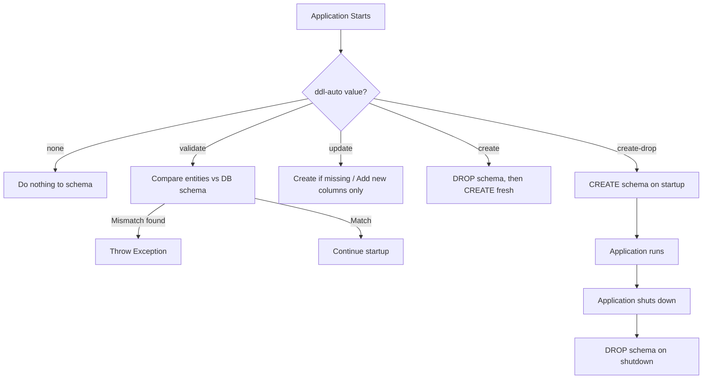
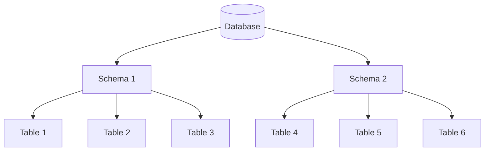
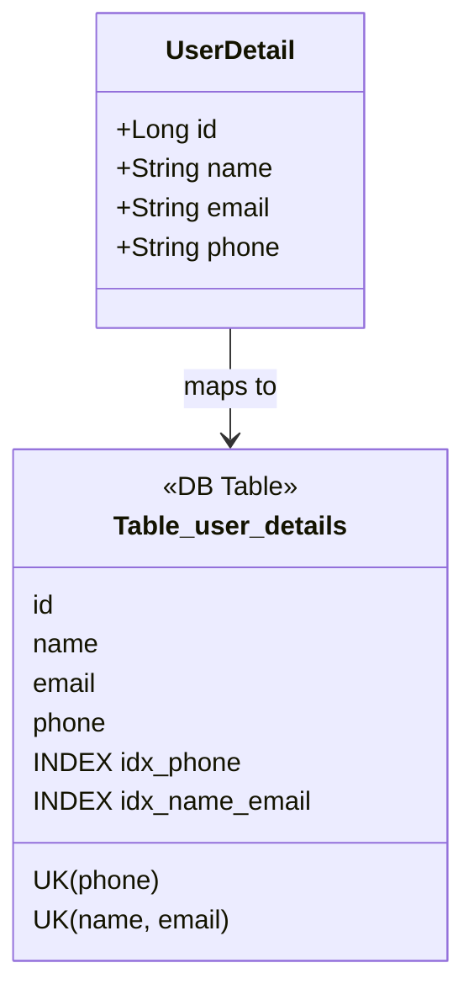
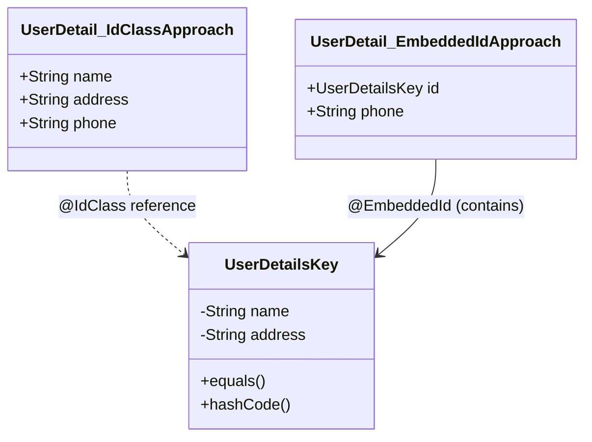
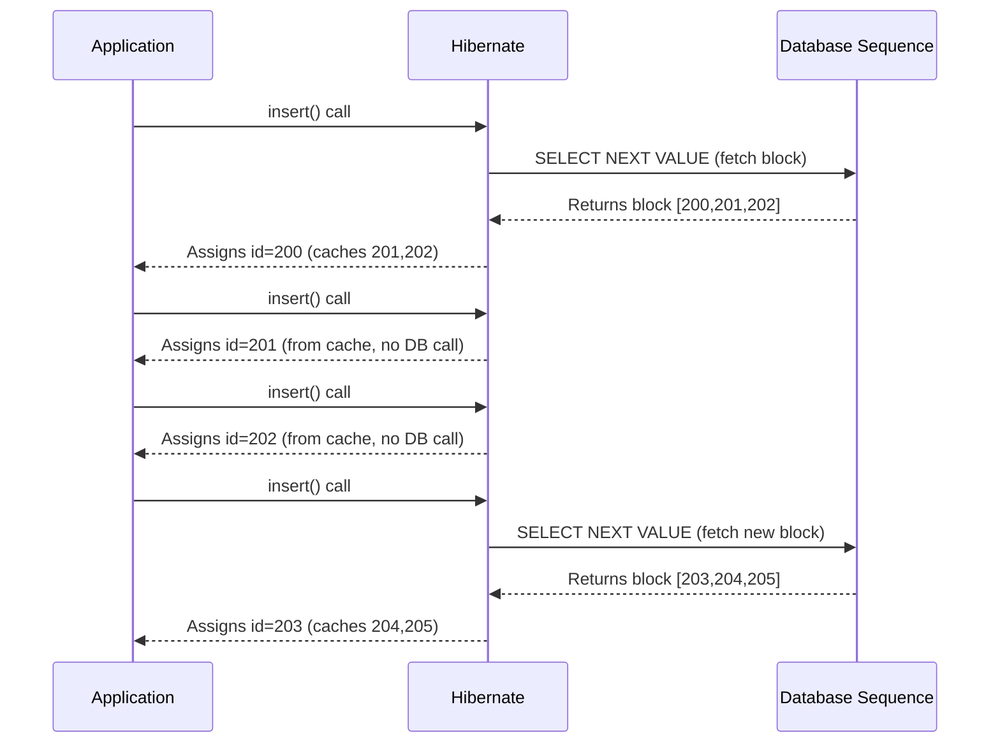
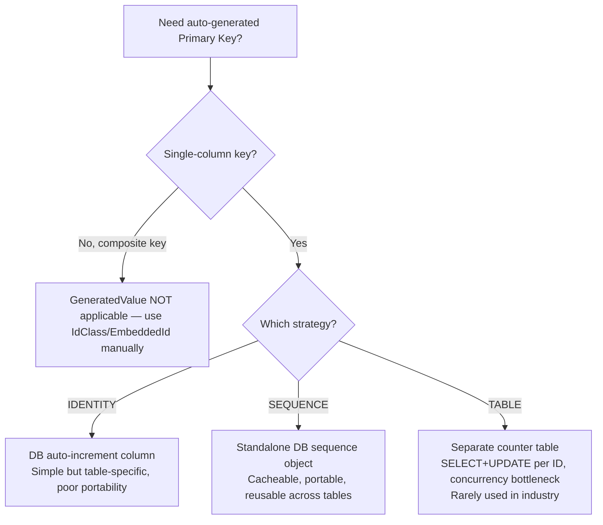

# JPA Deep Dive: Schema Management, Entity-Table Mapping, and Primary Key Generation

> A complete study guide covering Hibernate DDL auto configuration, database schemas, `@Table`, `@Column`, `@Id`, composite primary keys, and `@GeneratedValue` strategies.

---

## Table of Contents

1. [Hibernate DDL Auto Configuration](#-hibernate-ddl-auto-configuration)
2. [Database vs Schema (DB Concept)](#-database-vs-schema-db-concept)
3. [`@Table` Annotation](#-table-annotation)
4. [`@Column` Annotation](#-column-annotation)
5. [`@Id` Annotation and Primary Keys](#-id-annotation-and-primary-keys)
6. [Composite Primary Keys](#-composite-primary-keys)
7. [`@GeneratedValue` and Primary Key Generation Strategies](#-generatedvalue-and-primary-key-generation-strategies)
8. [Final Comparison Tables](#-final-comparison-tables)
9. [Practice Questions](#-practice-questions-overall)

---

# 📌 Hibernate DDL Auto Configuration

## Overview

`spring.jpa.hibernate.ddl-auto` is a Spring Boot configuration property that tells Hibernate **how to handle the database schema** when the application starts and stops. It controls whether Hibernate should create, update, validate, or do nothing to the schema, based on the entity classes defined in the application.

## Why This Concept Exists

Whenever you define a JPA entity, that entity must correspond to a table in the database. Someone has to keep the database schema in sync with the Java entity classes. Hibernate provides this configuration so that developers can decide **how much control** Hibernate should have over the schema — ranging from full automatic management (useful in development) to no control at all (mandatory in production, where schema changes must be reviewed and executed manually by a DBA).

## Definition

`spring.jpa.hibernate.ddl-auto` is a property placed in `application.properties` that determines Hibernate's schema-generation behavior at application startup (and, for one specific value, at shutdown as well).

## Real-World Analogy

Think of it like renovation permissions given to a contractor (Hibernate) for your house (the database):
- **none** – The contractor is not allowed to touch anything. You (the DBA) handle all renovations yourself.
- **update** – The contractor can add new rooms if your blueprint (entity) changed, but cannot demolish existing rooms.
- **validate** – The contractor just walks through the house with the blueprint and tells you if something doesn't match — they don't touch anything.
- **create** – The contractor demolishes the entire house and rebuilds it fresh every time you enter it (i.e., every application startup).
- **create-drop** – The contractor builds the house when you enter, and demolishes it completely when you leave (application shutdown).

## Internal Working

At application startup, Spring Boot's auto-configuration reads this property and passes an equivalent value to Hibernate's internal `hbm2ddl.auto` setting. Hibernate then inspects all classes annotated with `@Entity`, generates the necessary DDL (Data Definition Language) statements (`CREATE TABLE`, `ALTER TABLE`, `DROP TABLE`, etc.) based on the entity's fields and annotations, and executes them against the configured data source **before** the application context finishes initializing. For `create-drop`, Hibernate registers a shutdown hook so that the drop statements execute when the Spring application context is closed.

## Syntax

```properties
spring.jpa.hibernate.ddl-auto=none
```

Replace `none` with one of the valid values described below.

## Syntax Breakdown

| Part | Meaning |
|---|---|
| `spring.jpa.hibernate` | Namespace indicating this property configures Hibernate through Spring Boot's JPA auto-configuration. |
| `ddl-auto` | The specific setting that controls DDL (schema) generation behavior. |
| Value (`none`, `update`, `validate`, `create`, `create-drop`) | Defines exactly what Hibernate is permitted to do to the schema. |

## The Five Valid Values

### 1. `none`

- Hibernate does **nothing** to the schema.
- Does not create, does not update, does not delete.
- ✅ **Recommended value for production environments.**

> [!IMPORTANT]
> In production, database schema changes should be handled via reviewed DB scripts executed by a DBA, with a proper rollback plan in place. Never let Hibernate auto-manage schema in production — an unreviewed automatic change (especially `create` or `create-drop`) can destroy production data.

### 2. `update`

- If the schema does not exist, Hibernate creates it.
- If the schema already exists, Hibernate updates it — for example, if your entity gained a new field, Hibernate adds the corresponding new column.
- Hibernate **does not delete** any existing columns, tables, or data — it only adds what's missing.
- ✅ Good choice for **development environments**.

**Example scenario:** Suppose your database table currently has 4 columns, and you add a 5th field to your entity class. On the next application restart with `ddl-auto=update`, Hibernate detects the new field and issues an `ALTER TABLE` to add the new column — without touching the existing 4 columns or their data.

### 3. `validate`

- Does not create, does not update, does not delete anything.
- Simply **compares** (validates) the entity class definitions against the existing database schema.
- If there is a mismatch (a discrepancy between what the entity expects and what actually exists in the DB), Hibernate throws an exception at startup.
- Useful as a safety check to catch schema drift without risking any modification.

### 4. `create`

- **Drops** the entire schema and **recreates** it fresh, every single time the application starts.
- Sequence of operations on startup: `DROP` → `CREATE`.
- All existing data is lost on every restart.
- Useful only for throwaway/testing scenarios where persisted data doesn't matter between runs.

### 5. `create-drop`

- Very similar to `create`, but with a difference in **when** the drop happens.
- On application **startup**: Hibernate only performs `CREATE` (it does not drop first).
- On application **shutdown**: Hibernate performs `DROP`.
- So the sequence across a full run is: `CREATE` (on start) → use the app → `DROP` (on stop).

> [!NOTE]
> Compare this carefully with `create`: with `create`, the *drop* happens at **startup** (before creating fresh), whereas with `create-drop`, the *drop* happens at **shutdown** (after you're done using the app). Both result in a fresh schema per session, but the timing of the drop is different.

## Step-by-Step Execution (Example: `create-drop`)

1. You set `spring.jpa.hibernate.ddl-auto=create-drop`.
2. You start the application → Hibernate scans all `@Entity` classes → generates `CREATE TABLE` statements → schema is built fresh.
3. You use the application normally (insert/update/query data).
4. You stop the application → Spring's shutdown hook triggers → Hibernate issues `DROP TABLE` statements → schema is destroyed.

## Flowchart



## Key Observations

- `none` and `validate` never modify the schema — they are the "safe" options.
- `update` never deletes data or columns — it only adds.
- `create` and `create-drop` are destructive and will wipe data — never use in production.
- The difference between `create` and `create-drop` is purely about **when** the drop occurs (startup vs. shutdown).

## Common Mistakes

> [!WARNING]
> A very common beginner mistake is leaving `ddl-auto=update` (or worse, `create`) active in a production configuration file. This can silently alter or destroy production data. Always explicitly set `ddl-auto=none` for production profiles.

## Best Practices

- Use `none` in production — always pair schema changes with a reviewed migration tool (e.g., Flyway or Liquibase) and a DBA-managed rollback plan.
- Use `update` during active development for convenience.
- Use `validate` in staging/pre-production environments to catch mismatches without any risk of modification.
- Avoid `create` / `create-drop` outside of quick local experiments or ephemeral test databases.

## Interview Notes

- **Q: What happens to existing data with `update`?** It is preserved; only new schema elements are added.
- **Q: What's the difference between `create` and `create-drop`?** Both destroy and rebuild the schema, but `create` drops at startup (before creating), while `create-drop` drops at shutdown (after the app closes).
- **Q: Why is `none` recommended for production?** Because schema changes in production must go through controlled, reviewed DB scripts with rollback plans — not automatic tooling.

## Related Concepts

- [Database vs Schema](#-database-vs-schema-db-concept)
- [`@Table` Annotation](#-table-annotation)
- Database migration tools like Flyway/Liquibase (mentioned implicitly as the "proper" production alternative)

## Practice Questions

**Easy:** What does `ddl-auto=none` do?

**Medium:** If your entity has 4 fields mapped to DB columns and you add a 5th field, what happens under `update`? What about under `validate`?

**Hard:** Explain precisely the difference in execution timing between `create` and `create-drop`, and describe a scenario where using the wrong one in production could cause irrecoverable data loss.

## Summary

- `ddl-auto` controls how Hibernate manages your DB schema.
- `none`: no schema management — use in **production**.
- `update`: adds new schema elements without deleting — use in **development**.
- `validate`: checks entity-schema match, throws exception on mismatch, changes nothing.
- `create`: drops then creates schema on every startup.
- `create-drop`: creates on startup, drops on shutdown.

---

# 📌 Database vs Schema (DB Concept)

## Overview

Before diving deeper into JPA table mapping, it's essential to understand the distinction between a **database (DB)** and a **schema**, since JPA's `@Table` annotation allows you to associate an entity's table with a specific schema.

> [!NOTE]
> This is a general relational database concept — it is not specific to Java or JPA — but understanding it is required to correctly use JPA's schema-related annotations.

## Definition

A **database (DB)** can contain **multiple schemas**. A **schema** is a logical grouping of tables within a database. Each schema can hold its own set of tables, and different schemas can belong to different logical or organizational groupings.

## Why This Concept Exists

In many organizations, there is only **one physical database**, but **multiple teams** work with it. Rather than provisioning a separate database per team (which has operational overhead), the organization can create multiple schemas within a single database — one schema per team. Each team then "owns" its schema and its tables, and permissions can be scoped so that only the owning team can access their schema. This allows a single database to be shared cleanly among multiple teams while maintaining logical separation and access control.

## Real-World Analogy

Think of a database as an office building. Each floor (schema) belongs to a different department (team). Different departments can have their own rooms (tables) on their floor, and access badges (permissions) restrict who can enter which floor. If your company assigns each team an entire separate building (a separate DB), you don't need floors (schemas) — but when many teams share a single building, floors provide the necessary separation.

## Structure

```
Database (DB)
 ├── Schema 1
 │    ├── Table 1
 │    ├── Table 2
 │    └── Table 3
 └── Schema 2
      ├── Table 4
      ├── Table 5
      └── Table 6
```

## Diagram



## Key Observations

- If you don't explicitly assign a table to a schema, the table is added directly under the database (no schema grouping).
- If each team already has its own dedicated database, there is no need to introduce schemas — schemas become relevant specifically when **one database is shared by multiple teams**.
- Hibernate does **not** automatically create a schema for you — the schema must already exist in the database before Hibernate can place tables into it.

## Common Mistakes

> [!WARNING]
> If you specify a `schema` attribute on `@Table` without first creating that schema in the actual database, Hibernate will throw an error stating the schema was not found. The schema must be created independently — Hibernate will not create it automatically just because you referenced it in an annotation.

## Best Practices

- Use schemas when multiple teams share a single physical database, to logically separate ownership and simplify permission management.
- Ensure schemas are created ahead of time (via DB initialization scripts) before referencing them in `@Table(schema = "...")`.

## Related Concepts

- [`@Table` Annotation](#-table-annotation) (specifically its `schema` attribute)
- Database initialization scripts (e.g., the `spring.datasource.url` `INIT` parameter used to auto-create schemas — covered in the `@Table` section below)

## Practice Questions

**Easy:** Can one database contain multiple schemas?

**Medium:** Why might an organization choose to use multiple schemas instead of multiple databases?

**Hard:** What happens if you reference a schema in `@Table(schema = "onboarding")` but that schema was never created in the actual database? How can you fix this via the datasource URL?

## Summary

- A DB can have many schemas; a schema is a logical grouping of tables.
- Schemas let multiple teams share one database while maintaining separate ownership.
- Hibernate will **not** auto-create schemas — they must exist beforehand.

---

# 📌 `@Table` Annotation

## Overview

`@Table` is a JPA annotation placed on an entity class that lets you customize how that entity maps to a physical database table — including the table's name, the schema it belongs to, unique constraints across columns, and indexes.

## Why This Concept Exists

When you mark a class with `@Entity`, JPA already knows to treat that class as a table-equivalent, with each instance representing a row. However, JPA needs a table **name** to create/reference in the database, and by default it will auto-generate one from the entity's class name. `@Table` exists to give developers **explicit control** over the table name, its schema membership, uniqueness rules across multiple columns, and indexing — rather than relying purely on defaults.

## Definition

`@Table` is an **optional** annotation. If omitted, Hibernate derives the table name automatically from the entity class name (typically converting camelCase to a naming convention such as uppercase with underscores separating words, depending on the naming strategy in use).

> [!NOTE]
> As stated in the lecture: if an entity is named `UserDetail`, Hibernate may internally create a table named something like `user_details` — generally converting camelCase boundaries into underscores.

## Internal Working

At startup (when schema generation is active, or when Hibernate needs to construct SQL for the entity), Hibernate reads the `@Table` annotation's metadata (`name`, `schema`, `uniqueConstraints`, `indexes`) as part of building its internal metamodel for that entity. This metamodel is then used both for DDL generation (if `ddl-auto` allows it) and for constructing the SQL statements Hibernate issues for CRUD operations against that entity.

## Syntax

```java
@Entity
@Table(
    name = "user_details",
    schema = "onboarding",
    uniqueConstraints = {
        @UniqueConstraint(columnNames = "phone"),
        @UniqueConstraint(columnNames = {"name", "email"})
    },
    indexes = {
        @Index(name = "idx_phone", columnList = "phone"),
        @Index(name = "idx_name_email", columnList = "name,email")
    }
)
public class UserDetail {
    // fields...
}
```

## Syntax Breakdown

| Attribute | Type | Purpose |
|---|---|---|
| `name` | `String` | Explicitly sets the table name to use in the database, overriding the default derived name. |
| `schema` | `String` | Assigns the table to a specific schema. The schema **must already exist** in the database — Hibernate will not create it. |
| `uniqueConstraints` | `UniqueConstraint[]` | Defines table-level uniqueness rules across one or more columns. |
| `indexes` | `Index[]` | Defines one or more indexes on the table, each covering one or more columns. |

### `@UniqueConstraint`

| Attribute | Purpose |
|---|---|
| `columnNames` | A single column name (for a single-column unique constraint) or an array of column names (for a composite/multi-column unique constraint — meaning the **combination** of those columns must be unique, not each column individually). |

### `@Index`

| Attribute | Purpose |
|---|---|
| `name` | The name given to the index. |
| `columnList` | A comma-separated string of column names the index should cover. A single column name creates a single-column index; multiple comma-separated names create a composite index across those columns. |

## Code Examples

### Beginner Example — Custom Table Name Only

```java
@Entity
@Table(name = "user_details")
public class UserDetail {

    @Id
    private Long id;

    private String name;
    private String email;
    private String phone;
}
```

**Explanation:** Without `@Table`, Hibernate might name the table something derived automatically from the class name. By explicitly specifying `name = "user_details"`, the developer guarantees the exact table name that will appear in the database, regardless of the entity class's name.

### Intermediate Example — Schema Assignment

```properties
# application.properties
spring.datasource.url=jdbc:mysql://localhost:3306/mydb?createDatabaseIfNotExist=true&init=CREATE SCHEMA IF NOT EXISTS onboarding
```

```java
@Entity
@Table(name = "user_details", schema = "onboarding")
public class UserDetail {

    @Id
    private Long id;

    private String name;
}
```

```java
@Entity
@Table(name = "order_details") // No schema specified
public class OrderDetail {

    @Id
    private Long id;

    private String orderNumber;
}
```

**Line-by-Line Explanation:**
- The `spring.datasource.url` property includes an `init=CREATE SCHEMA IF NOT EXISTS onboarding` clause. This tells the database driver to run that SQL statement (creating the schema if it doesn't already exist) as part of establishing the connection — this is how the schema actually gets created, since Hibernate itself will not create schemas.
- `UserDetail` is annotated with `schema = "onboarding"`, so its `user_details` table will physically reside inside the `onboarding` schema.
- `OrderDetail` has no `schema` attribute, so its `order_details` table goes directly under the database (not inside any schema).

**Output (conceptual DB structure):**

```
Database: mydb
 └── Schema: onboarding
      └── Table: user_details
 └── Table: order_details   (no schema — directly under DB)
```

> [!TIP]
> You can create more than one schema by adding multiple `CREATE SCHEMA IF NOT EXISTS <name>` statements in the `init` parameter of the datasource URL.

### Advanced Example — Unique Constraints and Indexes Together

```java
@Entity
@Table(
    name = "user_details",
    uniqueConstraints = {
        @UniqueConstraint(columnNames = "phone"),
        @UniqueConstraint(columnNames = {"name", "email"})
    },
    indexes = {
        @Index(name = "idx_phone", columnList = "phone"),
        @Index(name = "idx_name_email", columnList = "name,email")
    }
)
public class UserDetail {

    @Id
    private Long id;

    private String name;
    private String email;
    private String phone;
}
```

**Line-by-Line Explanation:**
- `@Id private Long id;` — marks `id` as the primary key field.
- `uniqueConstraints`, first entry: `@UniqueConstraint(columnNames = "phone")` enforces that every value in the `phone` column must be unique across all rows (a single-column unique constraint, resulting in a `UK` — unique key — on `phone` in the generated schema).
- `uniqueConstraints`, second entry: `@UniqueConstraint(columnNames = {"name", "email"})` enforces a **composite** unique constraint — the *combination* of `name` and `email` must be unique together (two different rows could share the same `name` alone, or the same `email` alone, but not both together).
- `indexes`, first entry: creates an index named `idx_phone` on the `phone` column alone, improving lookup performance on that column.
- `indexes`, second entry: creates a composite index named `idx_name_email` spanning both `name` and `email` (comma-separated in `columnList`), improving performance for queries that filter or sort by both columns together.

**Output (conceptual DB schema view):**

```
Table: user_details
Columns: id, name, email, phone
Constraints:
  - UK on phone (unique)
  - UK on (name, email) (composite unique)
Indexes:
  - idx_phone -> phone
  - idx_name_email -> (name, email)
```

## Memory Representation

`@Table` metadata itself does not create runtime heap objects representing rows — it purely configures Hibernate's schema-generation and SQL-generation logic at the metamodel level (essentially part of Hibernate's internal configuration held in the **Method Area** / class metadata space of the JVM, not per-instance heap memory). Actual entity instances (rows) still live on the **heap** as regular Java objects once loaded via a persistence context.

## Diagram



## Key Observations

- `@Table` is entirely optional; omitting it just means you accept Hibernate's default table-naming convention.
- A single-column unique constraint (or a single-column index) can also be applied directly at the `@Column` level via `unique = true`, as an alternative to declaring it at the table level via `@Table`.
- A composite unique constraint or composite index can **only** be expressed at the table level (via `@Table`), since it spans multiple columns — `@Column` only applies to one field/column at a time.
- Schemas referenced via `@Table(schema = ...)` must be created independently (e.g., via a datasource `init` script) — Hibernate will not create them.

## Common Mistakes

> [!WARNING]
> Referencing a schema in `@Table(schema = "onboarding")` without first creating that schema in the actual database will cause Hibernate to fail with a "schema not found" type error at startup.

> [!WARNING]
> Confusing a single-column unique constraint with a composite one: `@UniqueConstraint(columnNames = "phone")` makes `phone` alone unique, while `@UniqueConstraint(columnNames = {"name","email"})` makes the **pair** unique — individual `name` or `email` values may still repeat across rows as long as the combination doesn't repeat.

## Best Practices

- Explicitly name your tables via `@Table(name = ...)` rather than relying on default naming, for clarity and to avoid unexpected naming-strategy surprises.
- Use schemas to logically separate ownership when multiple teams share a single database.
- Add indexes on columns that are frequently used in `WHERE` clauses or `JOIN` conditions to improve query performance.
- Use composite unique constraints (rather than application-level checks) whenever a business rule truly requires the combination of fields to be unique — the database will then enforce this rule reliably regardless of application logic bugs.

## Interview Notes

- **Q: Is `@Table` mandatory on an entity?** No — it's optional; Hibernate will derive a default table name from the class name if omitted.
- **Q: How do you enforce that a combination of two columns must be unique together?** Use `@Table(uniqueConstraints = @UniqueConstraint(columnNames = {"col1","col2"}))`.
- **Q: Does Hibernate create schemas automatically?** No — the schema must already exist in the database; Hibernate will only place the table inside it, and will error out if the schema doesn't exist.

## Related Concepts

- [Database vs Schema](#-database-vs-schema-db-concept)
- [`@Column` Annotation](#-column-annotation)
- [`@Id` and Primary Keys](#-id-annotation-and-primary-keys)

## Practice Questions

**Easy:** What is the purpose of the `name` attribute in `@Table`?

**Medium:** How would you enforce that `email` and `name` together must be unique, but each individually can repeat?

**Hard:** Explain why a schema referenced in `@Table(schema=...)` might cause a startup failure, and how to properly resolve it using datasource configuration.

## Summary

- `@Table` customizes table name, schema, unique constraints, and indexes for an entity.
- Optional — Hibernate falls back to default naming if omitted.
- `uniqueConstraints` can express both single-column and composite (multi-column) uniqueness.
- `indexes` can likewise cover single or multiple columns via comma-separated `columnList`.
- Schemas must be pre-created; Hibernate does not create them automatically.

---

# 📌 `@Column` Annotation

## Overview

`@Column` is a JPA annotation applied to individual entity fields to customize how that specific field maps to its corresponding database column — including the column's name, uniqueness, nullability, and length.

## Why This Concept Exists

By default, JPA will map each entity field to a column using default settings (a derived column name, nullable by default, a default length for string-like columns, etc.). `@Column` exists so developers can override these defaults on a **per-field basis** when the default behavior doesn't match the desired database design — for example, when the Java field name should not directly become the column name, or when a column must be constrained to be unique, non-null, or of a specific length.

## Definition

`@Column` is an **optional** field-level annotation. If not defined, JPA applies default values for the column's name, nullability, uniqueness, and length.

## Internal Working

Similar to `@Table`, `@Column` metadata feeds into Hibernate's internal metamodel construction. When Hibernate needs to generate DDL (`CREATE TABLE`/`ALTER TABLE`) or build SQL for CRUD operations, it reads each field's `@Column` metadata to determine the correct column name and constraints to use in the generated SQL.

## Syntax

```java
@Column(name = "full_name", unique = false, nullable = false, length = 100)
private String name;
```

## Syntax Breakdown

| Attribute | Type | Purpose |
|---|---|---|
| `name` | `String` | The actual column name to use in the database, overriding the default derived name. |
| `unique` | `boolean` | Whether this single column's values must be unique across all rows (single-column unique constraint). |
| `nullable` | `boolean` | Whether the column allows `NULL` values (`true`) or must always have a value (`false`). |
| `length` | `int` | The maximum length for the column (primarily relevant to `String`/`VARCHAR`-like columns). |

## Code Examples

### Beginner Example

```java
@Entity
@Table(name = "user_details")
public class UserDetail {

    @Id
    private Long id;

    @Column(name = "full_name")
    private String name;

    private String email;
    private String phone;
}
```

**Explanation:** The Java field is named `name`, but the actual database column will be named `full_name` because of the explicit `@Column(name = "full_name")` annotation. The `email` and `phone` fields have no `@Column` annotation at all, so JPA applies default values for their column name (typically derived from the field name, often capitalized per Hibernate's default naming strategy) and default settings for uniqueness, nullability, and length.

**Output (conceptual DB view):**

```
Table: user_details
Columns: id, full_name, email, phone
```

### Intermediate Example — Full Attribute Usage

```java
@Entity
@Table(name = "user_details")
public class UserDetail {

    @Id
    private Long id;

    @Column(name = "full_name", unique = false, nullable = false, length = 100)
    private String name;

    @Column(unique = true, nullable = false)
    private String email;

    @Column(unique = true)
    private String phone;
}
```

**Line-by-Line Explanation:**
- `@Column(name = "full_name", unique = false, nullable = false, length = 100)` on `name` — maps this field to a column literally named `full_name`, which is **not** required to be unique, **cannot** be null, and has a maximum length of 100 characters.
- `@Column(unique = true, nullable = false)` on `email` — no custom name is given (so the default derived name is used), but this column must be unique across all rows and cannot be null.
- `@Column(unique = true)` on `phone` — enforces uniqueness on this single column, using default settings otherwise.

## Memory Representation

As with `@Table`, `@Column` annotations configure Hibernate's static metamodel (part of class-level metadata in the JVM's Method Area) rather than affecting per-instance heap memory directly. The actual field values for a loaded entity instance live as instance fields on the heap, associated with the corresponding object reference.

## Key Observations

- `@Column` is optional on a per-field basis — you can annotate some fields and leave others with defaults.
- The `unique = true` attribute on `@Column` is functionally equivalent to declaring a single-column `@UniqueConstraint` at the table level via `@Table` — use whichever reads more naturally for your case, but table-level `uniqueConstraints` is required for composite (multi-column) uniqueness.
- Default values (when `@Column` is omitted) typically include: a derived column name (often capitalized, following the project's default naming strategy), `unique = false`, `nullable = false`, and a default length (commonly 255, though the lecture used a placeholder example of 50 — always confirm against your specific Hibernate version's defaults).

> [!WARNING]
> The lecture states that the default `length` when `@Column` is omitted is "let's say 50."
>
> However, according to the JPA specification (and Hibernate's implementation), the actual default value of the `length` attribute on `@Column` is **255**, not 50. The lecturer used "50" only as an illustrative placeholder number, not as the actual documented default. Always verify actual defaults against the JPA specification or your Hibernate version's documentation rather than assuming a specific number.

## Common Mistakes

> [!WARNING]
> Forgetting that omitting `@Column` still results in a real, defaulted mapping — beginners sometimes assume a field without `@Column` isn't mapped to any column at all, when in fact JPA maps it using default settings.

## Best Practices

- Explicitly name columns via `@Column(name = ...)` when your Java naming convention (camelCase) doesn't match your database's naming convention (commonly snake_case), for clarity and to avoid relying on implicit naming-strategy conversions.
- Set `nullable = false` explicitly for fields that represent mandatory business data, rather than relying on defaults, to make the constraint clear and intentional in the code.
- Use `unique = true` for genuinely unique single-column business identifiers (like `email` or `phone`), rather than enforcing uniqueness only at the application layer.

## Interview Notes

- **Q: What happens if you don't annotate a field with `@Column`?** JPA still maps it to a column using default settings (default name, `nullable=false`, `unique=false`, and a default length for string columns).
- **Q: How do you rename a column without renaming the Java field?** Use `@Column(name = "desired_column_name")`.

## Related Concepts

- [`@Table` Annotation](#-table-annotation) (table-level unique constraints and indexes)
- [`@Id` Annotation](#-id-annotation-and-primary-keys)

## Practice Questions

**Easy:** What does `@Column(nullable = false)` enforce?

**Medium:** What's the difference between enforcing uniqueness via `@Column(unique = true)` versus via `@Table(uniqueConstraints = ...)`?

**Hard:** Why can't you express a composite (multi-column) unique constraint using only `@Column`? What annotation must you use instead, and why?

## Summary

- `@Column` customizes a single field's mapping: name, uniqueness, nullability, and length.
- Optional — omitting it still results in a default mapping.
- `unique = true` on `@Column` only covers single-column uniqueness; composite uniqueness requires table-level `@UniqueConstraint`.

---

# 📌 `@Id` Annotation and Primary Keys

## Overview

`@Id` is the JPA annotation used to mark a specific entity field as the **primary key** of the corresponding database table.

## Why This Concept Exists

Every database table needs a way to uniquely identify each individual row — this is the role of a primary key. JPA needs a way for developers to declare, within the entity class itself, *which field* plays this role, so that Hibernate can generate the appropriate `PRIMARY KEY` constraint in the DDL and use that field correctly when generating SQL for lookups, updates, and deletes.

## Definition

`@Id` marks a field as the primary key of its entity. A given entity can have **only one** field annotated with `@Id` for a single (non-composite) primary key — you cannot mark multiple fields with `@Id` directly on the entity class to form a composite key (see [Composite Primary Keys](#-composite-primary-keys) for the correct approach to multi-column keys).

## Real-World Analogy

Think of `@Id` like a national ID number for a person — each individual must have exactly one unique identifying number, and no two people share the same one. Just as a person can't have two "official" ID numbers simultaneously, a JPA entity can't have two fields both marked as *the* primary key directly via plain `@Id`.

## Syntax

```java
@Entity
public class UserDetail {

    @Id
    private Long id;

    private String name;
}
```

## Syntax Breakdown

| Part | Meaning |
|---|---|
| `@Id` | Marks the annotated field as the entity's primary key. |
| `private Long id;` | The field itself — commonly a `Long` or similar numeric/string type, uniquely identifying each row. |

## Key Observations

- Each `@Entity` class can have exactly **one** field annotated with plain `@Id` (for a single-column primary key).
- To model a **composite** primary key (more than one column together forming the key), you cannot simply add `@Id` to multiple fields on the entity directly — you must use one of two dedicated approaches: `@IdClass` or `@EmbeddedId` (see next section).
- `@Id` alone does **not** make the primary key auto-generate values — by default, primary key columns are **not** auto-filled. You must explicitly provide a unique value for the primary key field on every insert unless you additionally use `@GeneratedValue` (see later section) to delegate that responsibility to Hibernate.

## Common Mistakes

> [!WARNING]
> A common misunderstanding is assuming `@Id` alone provides auto-incrementing behavior. It does not — `@Id` only marks the field as the primary key. Without `@GeneratedValue`, you must supply the primary key value yourself on every insert.

## Interview Notes

- **Q: Can an entity have more than one field marked `@Id` directly?** No — for a true composite key you must use `@IdClass` or `@EmbeddedId`.
- **Q: Does `@Id` alone provide auto-increment behavior?** No, that requires pairing it with `@GeneratedValue`.

## Related Concepts

- [Composite Primary Keys](#-composite-primary-keys)
- [`@GeneratedValue`](#-generatedvalue-and-primary-key-generation-strategies)

## Practice Questions

**Easy:** What is the purpose of `@Id`?

**Medium:** If you mark two fields on the same entity with `@Id` directly, what happens?

**Hard:** Why does JPA restrict plain `@Id` to a single field, and what mechanisms exist to properly represent a multi-column (composite) primary key?

## Summary

- `@Id` marks a field as the primary key of an entity.
- Only one field per entity can carry plain `@Id`.
- `@Id` by itself does not provide auto-generation of values — that requires `@GeneratedValue`.
- Composite keys require `@IdClass` or `@EmbeddedId` instead of multiple plain `@Id` fields.

---

# 📌 Composite Primary Keys

## Overview

A **composite primary key** is a primary key made up of **more than one column**, where the *combination* of those columns uniquely identifies each row. Since plain `@Id` only supports a single field, JPA provides two dedicated mechanisms to model composite keys: **`@IdClass`** and **`@EmbeddedId`** (used together with `@Embeddable`).

## Why This Concept Exists

Sometimes no single column is naturally unique on its own, but a combination of columns is. For example, `name` and `address` together might uniquely identify a row even though neither column alone is guaranteed to be unique. JPA needs a structured way to represent such a multi-column key as a single conceptual "primary key" both in Java and in the generated database schema.

## Definition

A composite key is modeled by creating a **separate key class** containing exactly the fields that together form the composite key, and then linking that class to the entity through either:
1. `@IdClass` (paired with individual `@Id` annotations on the entity's own fields), or
2. `@EmbeddedId` (paired with `@Embeddable` on the separate key class, and a single embedded field on the entity referencing that class).

## Mandatory Rules for the Composite Key Class

Regardless of which approach you use, the dedicated key class must follow these rules:

1. It **must be a `public` class**.
2. It **must implement `Serializable`**.
3. It **must have a no-argument (default) constructor**.
4. It **must override `equals()` and `hashCode()`**.

### Why These Rules Exist

> [!IMPORTANT]
> **Why `equals()` and `hashCode()` must be overridden:** Hibernate internally relies on `HashMap`-based structures for both first-level caching (the persistence context) and second-level caching. In a `HashMap`, the key is typically the entity's primary key. For a composite key, the "key" is now an entire custom object (not a simple `Long` or `String`), so Hibernate needs a correct, business-meaningful definition of equality and hash code for that object in order for the caching mechanisms to correctly recognize when two composite key instances represent the "same" logical key. Without correctly overridden `equals()`/`hashCode()`, two composite key objects with identical field values might not be recognized as equal by the `HashMap`, breaking Hibernate's caching behavior.
>
> **Why `Serializable` must be implemented:** Unlike a simple single-column primary key (a plain `Long` or `String`, which is inherently simple and already serializable), a composite key is represented by a custom class. Hibernate needs to guarantee that this class can be serialized — for example, for use in distributed caching or when passing the object over a network. Implementing `Serializable` ensures the composite key class can be properly serialized whenever such scenarios arise.

## Approach 1: `@IdClass` and `@Id`

### Internal Working

With this approach, you keep the `@Id` annotations directly on the entity's own fields (the ones that form the composite key), but you also annotate the entity class itself with `@IdClass`, pointing to a separate class that mirrors those same fields. This tells Hibernate that the combination of all `@Id`-annotated fields on the entity together form the composite primary key, and that the shape of that composite key is described by the referenced class.

### Syntax

```java
// Step 1: Create the composite key class
public class UserDetailsKey implements Serializable {

    private String name;
    private String address;

    public UserDetailsKey() {
        // Rule 3: no-argument constructor
    }

    public UserDetailsKey(String name, String address) {
        this.name = name;
        this.address = address;
    }

    @Override
    public boolean equals(Object o) {
        if (this == o) return true;
        if (o == null || getClass() != o.getClass()) return false;
        UserDetailsKey that = (UserDetailsKey) o;
        return Objects.equals(name, that.name) && Objects.equals(address, that.address);
    }

    @Override
    public int hashCode() {
        return Objects.hash(name, address);
    }
}
```

```java
// Step 2: Reference the key class from the entity using @IdClass
@Entity
@Table(name = "user_details")
@IdClass(UserDetailsKey.class)
public class UserDetail {

    @Id
    private String name;

    @Id
    private String address;

    private String phone;
}
```

### Syntax Breakdown

| Part | Meaning |
|---|---|
| `implements Serializable` | Satisfies Rule 2, allowing the key class to be safely serialized (e.g., for distributed caching). |
| `equals()` / `hashCode()` | Satisfies Rule 4 — defines what it means for two composite keys to be considered "equal," which Hibernate's internal `HashMap`-based caching relies on. |
| `@IdClass(UserDetailsKey.class)` | Placed on the entity class, tells JPA that the composite primary key's shape is described by `UserDetailsKey`. |
| `@Id` on `name` and `address` (on the entity) | Each field that is part of the composite key must still be individually marked `@Id` **on the entity itself** — the fields and their names/types must exactly match the corresponding fields in the `@IdClass`-referenced class. |

### Line-by-Line Explanation

- The `UserDetailsKey` class defines exactly the two fields (`name`, `address`) that together will act as the composite primary key.
- Its `equals()` method: if the two objects being compared are the *exact same reference*, immediately returns `true`. If the other object is `null` or of a different class, returns `false`. Otherwise, it compares the individual field values (`name` and `address`) of both objects — only if both fields match does it consider the two composite keys equal.
- Its `hashCode()` method uses `Objects.hash(...)`, passing in the relevant fields, to generate a consistent hash code derived from those field values.
- On the entity `UserDetail`, `@IdClass(UserDetailsKey.class)` tells Hibernate that `UserDetailsKey` describes the composite key's shape.
- The entity's own `name` and `address` fields are each individually annotated with `@Id` — together, these two `@Id`-marked fields form the actual composite primary key of the table.

> [!NOTE]
> `@Id` here does **not** mean each field individually is "a" primary key on its own — rather, once the entity class is annotated with `@IdClass`, every field marked `@Id` on that entity collectively becomes part of one single composite primary key.

### Output (conceptual DB schema)

```
Table: user_details
Columns: name, address, phone
Composite Primary Key / Index on: (address, name)
```

## Approach 2: `@Embeddable` and `@EmbeddedId`

### Internal Working

This approach also uses a separate class for the composite key fields, following the same four mandatory rules, but instead of scattering `@Id` across the entity's own fields, you annotate the key class itself with `@Embeddable`, and embed a **single** field of that type into the entity, annotated with `@EmbeddedId`.

### Syntax

```java
// Step 1: Create the composite key class, marked @Embeddable
@Embeddable
public class UserDetailsKey implements Serializable {

    private String name;
    private String address;

    public UserDetailsKey() {
        // Rule 3: no-argument constructor
    }

    public UserDetailsKey(String name, String address) {
        this.name = name;
        this.address = address;
    }

    @Override
    public boolean equals(Object o) {
        if (this == o) return true;
        if (o == null || getClass() != o.getClass()) return false;
        UserDetailsKey that = (UserDetailsKey) o;
        return Objects.equals(name, that.name) && Objects.equals(address, that.address);
    }

    @Override
    public int hashCode() {
        return Objects.hash(name, address);
    }
}
```

```java
// Step 2: Reference the key class via @EmbeddedId on the entity
@Entity
@Table(name = "user_details")
public class UserDetail {

    @EmbeddedId
    private UserDetailsKey id;

    private String phone;
}
```

### Syntax Breakdown

| Part | Meaning |
|---|---|
| `@Embeddable` | Marks the composite key class as a type whose fields can be "embedded" directly into an owning entity's table. |
| `@EmbeddedId` | Placed on a **single** field within the entity (of the `@Embeddable` type), designating that entire embedded object as the primary key. |

### Line-by-Line Explanation

- The `UserDetailsKey` class is now marked with `@Embeddable`, signaling that its fields (`name`, `address`) can be embedded directly as columns into any entity that includes it.
- The `UserDetail` entity has a single field `id` of type `UserDetailsKey`, annotated with `@EmbeddedId` — this single annotation designates the entire embedded object as the entity's composite primary key, and its inner fields (`name`, `address`) become the actual primary key columns in the generated table.
- The mandatory rules (public class, `Serializable`, no-arg constructor, `equals()`/`hashCode()`) still apply identically to this class as they did in the `@IdClass` approach — for the same underlying reasons (Hibernate's internal `HashMap`-based caching and safe serialization).

### Output (conceptual DB schema)

```
Table: user_details
Columns: address, name, phone
Composite Primary Key / Index on: (address, name)
```

## `@IdClass` vs `@EmbeddedId` — Comparison

| Aspect | `@IdClass` | `@EmbeddedId` |
|---|---|---|
| Where `@Id` is placed | On each individual field of the entity itself | Not used at all — instead a single `@EmbeddedId` on one embedded field |
| Key class annotation | No special annotation required on the key class itself (other than the 4 mandatory rules) | Key class must be annotated `@Embeddable` |
| Entity structure | Entity duplicates the key fields directly as its own fields | Entity has a single field of the embeddable key type |
| Access pattern | Access key fields directly on the entity (`entity.getName()`) | Access key fields through the embedded object (`entity.getId().getName()`) |

## Diagram



## Key Observations

- Both approaches require the same four mandatory rules on the key class: `public`, `Serializable`, no-arg constructor, and overridden `equals()`/`hashCode()`.
- `@IdClass` keeps the key fields directly on the entity (with each individually marked `@Id`), while `@EmbeddedId` consolidates them into a single embedded field.
- The generated database schema (columns, composite key/index) ends up equivalent either way — the difference lies purely in the Java-side modeling style.
- `@GeneratedValue` (auto-generation of primary key values) does **not** apply to composite keys — it only works with a single field's plain `@Id` (covered next).

## Common Mistakes

> [!WARNING]
> Forgetting to override `equals()` and `hashCode()` on the composite key class is a very common mistake — it silently breaks Hibernate's internal caching behavior (first-level and second-level caches rely on correct equality semantics for the key).

> [!WARNING]
> Forgetting to implement `Serializable` on the composite key class can cause failures in scenarios requiring serialization, such as distributed/second-level caching across a network.

## Best Practices

- Prefer `@EmbeddedId` when the composite key naturally represents a cohesive value object (e.g., a coordinate pair, a shipment tracking key) that might be reused across multiple entities.
- Prefer `@IdClass` when you want the key fields to remain as plain, directly-accessible fields on the entity itself, without an extra layer of object access.
- Always implement `equals()`/`hashCode()` based on the actual business meaning of "sameness" for your composite key.

## Interview Notes

- **Q: Why must the composite key class implement `Serializable`?** To support scenarios like distributed second-level caching, where the key may need to be transmitted over a network or serialized to disk.
- **Q: Why must `equals()`/`hashCode()` be overridden?** Because Hibernate uses `HashMap`-based structures internally (for first-level and second-level caching) keyed by the primary key — for composite keys, the key is now a custom object requiring correctly defined equality semantics.
- **Q: Can `@GeneratedValue` be used with a composite key?** No — `@GeneratedValue` only works with a plain `@Id` on a single field, not with composite keys defined via `@IdClass`/`@EmbeddedId`.

## Related Concepts

- [`@Id` Annotation](#-id-annotation-and-primary-keys)
- [`@GeneratedValue`](#-generatedvalue-and-primary-key-generation-strategies)
- First-level and second-level caching (referenced as the reason `equals()`/`hashCode()` matter)

## Practice Questions

**Easy:** What are the four mandatory rules for a composite primary key class?

**Medium:** What is the structural difference between using `@IdClass` and using `@EmbeddedId`?

**Hard:** Explain, from Hibernate's internal caching perspective, why overriding `equals()` and `hashCode()` correctly is critical for composite primary keys, and what could silently go wrong if this is done incorrectly.

## Summary

- Composite keys involve more than one column together uniquely identifying a row.
- Two approaches: `@IdClass` (key fields stay directly on entity, each with `@Id`) or `@EmbeddedId` (key fields consolidated into one `@Embeddable` object, referenced via `@EmbeddedId`).
- Both require: public class, `Serializable`, no-arg constructor, and correctly overridden `equals()`/`hashCode()`.
- `equals()`/`hashCode()` matter because Hibernate's internal caching relies on `HashMap` semantics keyed by the primary key.
- `Serializable` matters for safe serialization, e.g., in distributed caching scenarios.
- `@GeneratedValue` cannot be used with composite keys.

---

# 📌 `@GeneratedValue` and Primary Key Generation Strategies

## Overview

`@GeneratedValue` is a JPA annotation, used together with `@Id` on a **single-field** primary key, that delegates the responsibility of generating unique primary key values to Hibernate — rather than requiring the developer to manually supply a unique value on every insert.

## Why This Concept Exists

By default, primary key columns are **not** auto-filled — every insert requires you to manually provide a unique primary key value. This is tedious and error-prone. `@GeneratedValue` exists so Hibernate (or the underlying database) can automatically produce unique values for the primary key, following one of several supported strategies.

> [!IMPORTANT]
> `@GeneratedValue` only works in conjunction with `@Id` for a **single-column** primary key. It does **not** apply to composite primary keys defined via `@IdClass` or `@EmbeddedId`.

## Definition

`@GeneratedValue` specifies the **strategy** Hibernate should use to automatically generate values for a single primary key field. The main strategies discussed are:

1. `GenerationType.IDENTITY`
2. `GenerationType.SEQUENCE` (with `@SequenceGenerator`)
3. `GenerationType.TABLE` (with `@TableGenerator`) — mentioned but not recommended

## Strategy 1: `GenerationType.IDENTITY`

### Internal Working

`IDENTITY` relies on the database's native **auto-increment** column feature. Each time a new row is inserted, the database itself automatically assigns the next incrementing value for that column — Hibernate does not compute the value itself; it simply lets the database's auto-increment mechanism handle it.

### Syntax

```java
@Entity
public class UserDetail {

    @Id
    @GeneratedValue(strategy = GenerationType.IDENTITY)
    private Long id;

    private String name;
    private String email;
}
```

### Syntax Breakdown

| Part | Meaning |
|---|---|
| `@GeneratedValue(strategy = GenerationType.IDENTITY)` | Tells Hibernate to rely on the database's own auto-increment mechanism to generate values for this primary key field. |

### Step-by-Step Execution

1. First insert is performed without providing any value for `id`.
2. The database automatically assigns `id = 1` (the first auto-increment value) and returns it.
3. A second insert is performed (again without specifying `id`).
4. The database automatically assigns `id = 2`.
5. This continues, incrementing by 1 for each subsequent insert: `1, 2, 3, 4, ...`

### Output

```
Insert 1 -> id = 1
Insert 2 -> id = 2
```

## Key Observations — Identity

- `IDENTITY` generation is very **specific to the table itself** — the auto-increment counter is maintained per-table by the database.
- Simple to configure but has notable downsides (covered in the comparison section below).

## Strategy 2: `GenerationType.SEQUENCE`

### Internal Working

A **sequence** is a standalone database object that generates unique numbers — independent of any particular table. It is defined with its own starting value, increment step, and maximum value. Hibernate can ask the sequence to produce one or more unique values, and can even **cache/prefetch** several values at once in application memory, reducing the number of database round-trips needed purely for ID generation.

### Underlying SQL Concept (Database-Level Sequence)

```sql
CREATE SEQUENCE user_seq
    INCREMENT BY 25
    START WITH 100
    MAXVALUE 9999;
```

**Explanation:** This creates a database sequence named `user_seq` that starts at `100`, increases by `25` on each request for the "next value," and stops (or cycles, depending on configuration) once it reaches `9999`. Each time something requests "the next value" from this sequence, it returns `100`, then `125`, then `150`, then `175`, then `200`, and so on, until the maximum value is reached. At that point, the sequence's behavior (cycle back to the start, or stop) depends on how it was configured.

> [!TIP]
> Sequences also support a **caching** feature: instead of asking the database for one value at a time, Hibernate (or the database) can request a batch of values (e.g., 50 at once) in a single round trip, cache them in memory, and hand them out one by one without needing to re-query the database for every single value — saving on database hits.

### JPA-Level Configuration: `@SequenceGenerator`

```java
@Entity
public class UserDetail {

    @Id
    @GeneratedValue(strategy = GenerationType.SEQUENCE, generator = "user_seq_gen")
    @SequenceGenerator(
        name = "user_seq_gen",
        sequenceName = "user_sku",
        initialValue = 200,
        allocationSize = 3
    )
    private Long id;

    private String name;
    private String email;
}
```

### Syntax Breakdown

| Attribute | Belongs To | Purpose |
|---|---|---|
| `strategy = GenerationType.SEQUENCE` | `@GeneratedValue` | Declares that a database sequence should be used to generate primary key values. |
| `generator = "user_seq_gen"` | `@GeneratedValue` | Links this `@GeneratedValue` to a specific `@SequenceGenerator` definition by its logical `name`. |
| `name` | `@SequenceGenerator` | A unique logical name used **within the Java/JPA layer** to reference this generator from `@GeneratedValue(generator = ...)`. This name can be reused across different entity classes within the application. |
| `sequenceName` | `@SequenceGenerator` | The actual name of the sequence **as it exists (or will be created) in the database**. If a sequence with this name already exists in the DB, Hibernate will use that existing sequence rather than creating a new one. |
| `initialValue` | `@SequenceGenerator` | The starting value the sequence will begin from. |
| `allocationSize` | `@SequenceGenerator` | The number of values Hibernate will request and cache **in memory at once** per database round-trip to the sequence. |

> [!NOTE]
> Unlike a raw SQL `CREATE SEQUENCE` statement (which lets you control `INCREMENT BY` directly), `@SequenceGenerator` does not expose a separate "increment by" attribute distinct from `allocationSize` — the sequence itself increments by 1 per underlying database call, and `allocationSize` instead controls how many values Hibernate pre-fetches and caches at once from that sequence.

### Step-by-Step Execution Example

Given: `initialValue = 200`, `allocationSize = 3`.

1. **First insert:** Hibernate has no cached values yet, so it makes **one database query** to fetch the next value from the sequence. Because `allocationSize = 3`, Hibernate reserves a block of 3 values (e.g., `200, 201, 202`) and caches them in memory. It assigns `id = 200` to this first insert.
2. **Second insert:** Hibernate already has `201` cached — no database query needed. Assigns `id = 201`.
3. **Third insert:** Hibernate already has `202` cached — no database query needed. Assigns `id = 202`.
4. **Fourth insert:** The cached block is exhausted, so Hibernate makes another database query (`SELECT NEXT VALUE FROM user_sku` conceptually) to fetch the next block of 3 values (e.g., `203, 204, 205`). Assigns `id = 203`.
5. **Fifth and sixth inserts:** Served from the newly cached block (`204`, `205`) without additional database queries.
6. **Seventh insert:** Cache exhausted again — another database query is made to fetch the next block.

### Output

```
Insert 1 -> id = 200   (DB query made — new block [200,201,202] cached)
Insert 2 -> id = 201   (from cache, no DB query)
Insert 3 -> id = 202   (from cache, no DB query)
Insert 4 -> id = 203   (DB query made — new block [203,204,205] cached)
Insert 5 -> id = 204   (from cache, no DB query)
Insert 6 -> id = 205   (from cache, no DB query)
```

## Sequence Diagram — Caching Behavior



## Strategy 3: `GenerationType.TABLE` (Mentioned, Not Recommended)

### Overview

`GenerationType.TABLE` uses `@TableGenerator` and works by creating a **separate database table** dedicated purely to tracking the next unique ID value (typically holding one column that stores an incrementing counter value).

### Internal Working

Each time a new unique ID is required, Hibernate must:
1. Run a `SELECT` query on this dedicated table to read the current counter value.
2. Run an `UPDATE` query to increment that stored counter value for the next request.

### Key Observations — Table Strategy

- This approach is **significantly less efficient** than `SEQUENCE`, because it requires a `SELECT` + `UPDATE` pair of queries every time a new ID is needed.
- Because a real table is involved, **concurrency control** becomes a serious concern: when multiple insert operations happen in parallel, they must acquire locks on this counter table to avoid both reading (and then both incrementing from) the same stale value. This lock/unlock overhead is a performance bottleneck under concurrent load.
- In contrast, a database `SEQUENCE` is handled as an **atomic counter** internally by the database itself — there is no separate table and no explicit locking logic that the developer/Hibernate needs to manage; the database guarantees that concurrent requests each receive a unique value safely and efficiently.

> [!CAUTION]
> The lecturer notes that in many years of professional experience, `GenerationType.TABLE` is essentially never used in the industry, precisely because of this concurrency and performance overhead compared to `SEQUENCE`.

## `IDENTITY` vs `SEQUENCE` — Detailed Comparison

| Aspect | `IDENTITY` | `SEQUENCE` |
|---|---|---|
| Mechanism | Relies on the database table's native auto-increment column | Relies on a standalone database sequence object, independent of any table |
| Scope | Tied specifically to one table | Can be shared/reused across multiple tables (not tied to a specific table) |
| Caching/prefetching of IDs | Not supported — each insert typically needs its own auto-increment step | Supported via `allocationSize` — a block of IDs can be prefetched and cached in memory, reducing DB round-trips |
| Portability across databases | Poor — auto-increment implementation differs significantly between databases (e.g., Oracle vs. MySQL vs. Postgres behave differently), making migration between database vendors problematic | Better — since the sequence's behavior (start, increment, max value) is explicitly and consistently defined by the developer, it behaves consistently across different databases, easing migration |
| Custom generation logic | Limited — tightly coupled to the specific table's auto-increment behavior | Flexible — since sequence logic is independent of any specific table, it can be centralized and reused; some organizations even expose a small dedicated microservice purely to hand out unique sequence values to multiple other microservices |
| Typical industry usage | Common but has notable drawbacks | Very commonly used, especially in larger organizations, due to portability, performance (caching), and flexibility advantages |

> [!TIP]
> **Real-world pattern:** Some organizations build a small, centralized microservice whose sole responsibility is generating unique sequence values, which multiple other microservices then consume. This centralizes unique-ID generation logic, decouples it from any single table, and can serve many different tables/services consistently.

## Flowchart — Choosing a Generation Strategy



## Memory Representation

When using `SEQUENCE` with `allocationSize > 1`, the prefetched block of ID values is held in Hibernate's in-memory state (part of the application's heap, within Hibernate's internal session/factory-level structures) until exhausted, at which point another block is fetched from the database. This is distinct from the JVM heap objects representing the entity instances themselves — it is Hibernate's internal bookkeeping for ID generation.

## Common Mistakes

> [!WARNING]
> Assuming `allocationSize` in `@SequenceGenerator` corresponds to the sequence's actual DB-level increment step. In the lecture's advanced example, the developer noted this is a common point of confusion: setting `allocationSize = 3` does **not** mean the underlying database sequence increments by 3 per call — rather, it means Hibernate fetches (caches) 3 values per round trip, while the underlying sequence itself still increments by 1 per invocation. Always confirm the actual configured behavior of your specific setup.

> [!WARNING]
> Choosing `GenerationType.TABLE` without understanding its `SELECT` + `UPDATE` + locking overhead can introduce serious performance bottlenecks under concurrent load — this strategy is rarely appropriate for production systems.

## Best Practices

- Prefer `SEQUENCE` over `IDENTITY` in most professional/enterprise contexts, due to better portability across databases, support for caching/prefetching, and independence from any single table.
- Avoid `GenerationType.TABLE` in production systems due to its significant concurrency and performance drawbacks.
- When migrating between database vendors, favor `SEQUENCE`-based generation to reduce migration friction, since `IDENTITY`/auto-increment behavior varies significantly between vendors.
- Tune `allocationSize` based on your insert throughput — a larger allocation size reduces database round-trips for ID generation but can "waste" reserved ID ranges if the application restarts frequently (since cached-but-unused IDs from a previous run are not reclaimed).

## Interview Notes

- **Q: What is the key difference between `IDENTITY` and `SEQUENCE`?** `IDENTITY` relies on the database table's native auto-increment column and is tied to that specific table; `SEQUENCE` relies on a separate, reusable database object that can serve multiple tables and supports prefetch caching via `allocationSize`.
- **Q: Why is `SEQUENCE` considered more portable than `IDENTITY`?** Because auto-increment implementations differ across database vendors, whereas a sequence's behavior (start value, increment, max value) is explicitly defined and can be replicated consistently across different databases.
- **Q: Why is `GenerationType.TABLE` rarely used?** Because it requires a `SELECT` + `UPDATE` per generated ID and needs locking to handle concurrent access safely, making it a performance bottleneck compared to the atomic, lock-free nature of a database sequence.
- **Q: Can `@GeneratedValue` be applied to a composite primary key?** No — it only works with a single-field `@Id`.

## Related Concepts

- [`@Id` Annotation](#-id-annotation-and-primary-keys)
- [Composite Primary Keys](#-composite-primary-keys) (where `@GeneratedValue` does *not* apply)
- First-level and second-level caching (conceptually related to Hibernate's internal caching behavior, though distinct from sequence-value caching)

## Practice Questions

**Easy:** What does `GenerationType.IDENTITY` rely on to generate primary key values?

**Medium:** Explain how `allocationSize` in `@SequenceGenerator` affects the number of database round-trips needed during a burst of inserts.

**Hard:** Compare `IDENTITY`, `SEQUENCE`, and `TABLE` strategies in terms of portability across database vendors, performance under concurrent inserts, and flexibility to be reused across multiple tables. Explain specifically why `TABLE` is considered a performance bottleneck compared to `SEQUENCE`.

## Summary

- `@GeneratedValue` delegates primary key value generation to Hibernate/the database; it only applies to single-column `@Id` fields, not composite keys.
- `GenerationType.IDENTITY`: uses the database's native auto-increment; simple but table-specific and less portable across DB vendors.
- `GenerationType.SEQUENCE` (with `@SequenceGenerator`): uses a standalone, reusable database sequence object; supports prefetch caching via `allocationSize`; more portable and flexible; widely used in industry, sometimes centralized into a dedicated microservice.
- `GenerationType.TABLE` (with `@TableGenerator`): uses a dedicated counter table requiring `SELECT`+`UPDATE` and locking per ID — inefficient and rarely used in production.

---

# 📌 Final Comparison Tables

## `ddl-auto` Values at a Glance

| Value | Creates Schema | Updates Schema | Deletes Schema/Data | Typical Use |
|---|---|---|---|---|
| `none` | ❌ | ❌ | ❌ | Production |
| `update` | ✅ (if missing) | ✅ (adds only) | ❌ | Development |
| `validate` | ❌ | ❌ | ❌ (throws exception on mismatch) | Verification/staging |
| `create` | ✅ (drop then create, every startup) | N/A | ✅ (at startup) | Quick local testing |
| `create-drop` | ✅ (create at startup) | N/A | ✅ (at shutdown) | Quick local testing |

## Table-Level vs Column-Level Constraints

| Constraint Type | Table-Level Annotation | Column-Level Annotation | Supports Composite (Multi-Column)? |
|---|---|---|---|
| Uniqueness | `@Table(uniqueConstraints = @UniqueConstraint(...))` | `@Column(unique = true)` | Table-level only |
| Indexing | `@Table(indexes = @Index(...))` | N/A | Table-level only (via comma-separated `columnList`) |

## Primary Key Generation Strategies

| Strategy | Object Used | DB Round-Trips per ID | Portability | Concurrency Handling | Industry Usage |
|---|---|---|---|---|---|
| `IDENTITY` | Table's native auto-increment | 1 per insert | Poor (vendor-specific) | Handled natively by DB auto-increment | Common |
| `SEQUENCE` | Standalone DB sequence object | 1 per `allocationSize`-sized block (amortized) | Good | Atomic counter — no explicit locking needed | Very common, industry standard |
| `TABLE` | Dedicated counter table | 2 (`SELECT` + `UPDATE`) per ID | Good (logic is developer-defined) | Requires locking — bottleneck under concurrency | Rare |

---

# 📌 Practice Questions (Overall)

**Easy**
1. Which `ddl-auto` value should always be used in production, and why?
2. What is the purpose of the `@Id` annotation?
3. What does `GenerationType.IDENTITY` rely on internally?

**Medium**
4. How does a database schema differ from a database, and why do organizations use multiple schemas?
5. How would you configure a table-level composite unique constraint spanning `name` and `email`?
6. What are the four mandatory rules a composite primary key class must follow, and why does each rule exist?

**Hard**
7. Walk through, step by step, what happens internally when `@SequenceGenerator(allocationSize = 5)` is used and six consecutive inserts occur — specify exactly which inserts trigger a database round-trip and which are served from cache.
8. Compare and contrast `@IdClass` and `@EmbeddedId` in terms of Java-side structure, and explain why neither can be combined with `@GeneratedValue`.
9. Explain why `GenerationType.TABLE` is considered inefficient compared to `GenerationType.SEQUENCE`, specifically addressing concurrency behavior at the database level.

---

# 📌 Overall Summary (Revision Bullets)

- **`ddl-auto`**: `none` (production) / `update` (dev, additive only) / `validate` (check only) / `create` (drop+create every startup) / `create-drop` (create on startup, drop on shutdown).
- **DB vs Schema**: one DB can hold many schemas; schemas are logical groupings of tables, useful when multiple teams share one database. Hibernate never auto-creates schemas.
- **`@Table`**: customizes table name, schema, table-level unique constraints (single or composite), and indexes (single or composite via comma-separated `columnList`).
- **`@Column`**: customizes a single field's column name, uniqueness, nullability, and length; optional, with defaults applied if omitted.
- **`@Id`**: marks the primary key field; only one plain `@Id` field allowed per entity for a single-column key; does not itself provide auto-generation.
- **Composite keys**: require a separate key class (public, `Serializable`, no-arg constructor, overridden `equals()`/`hashCode()`), linked via either `@IdClass` (fields stay on entity) or `@Embeddable` + `@EmbeddedId` (fields consolidated into one embedded object).
- **`@GeneratedValue`**: delegates primary key generation to Hibernate/DB; only valid with single-field `@Id`, never with composite keys.
  - `IDENTITY`: DB-native auto-increment, table-specific, poor cross-DB portability.
  - `SEQUENCE` (`@SequenceGenerator`): standalone, reusable, cacheable (via `allocationSize`), portable — industry standard.
  - `TABLE` (`@TableGenerator`): dedicated counter table, requires `SELECT`+`UPDATE`+locking, inefficient, rarely used.

> [!NOTE]
> The lecture indicates that upcoming sessions will cover entity relationships/associations (One-to-One, One-to-Many, etc.) and, in a later part, custom queries, criteria queries, pagination, and sorting.
