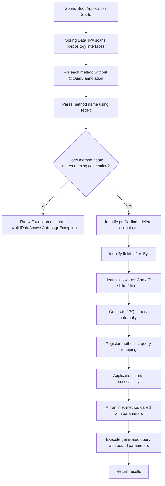
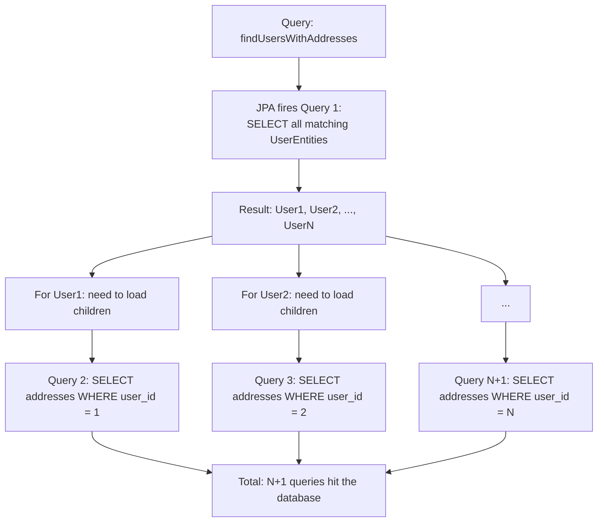
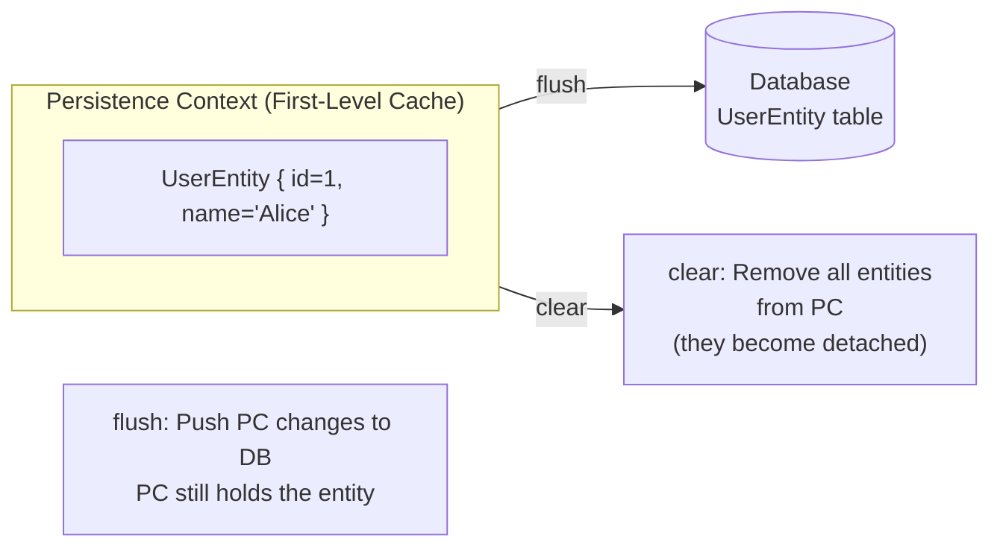
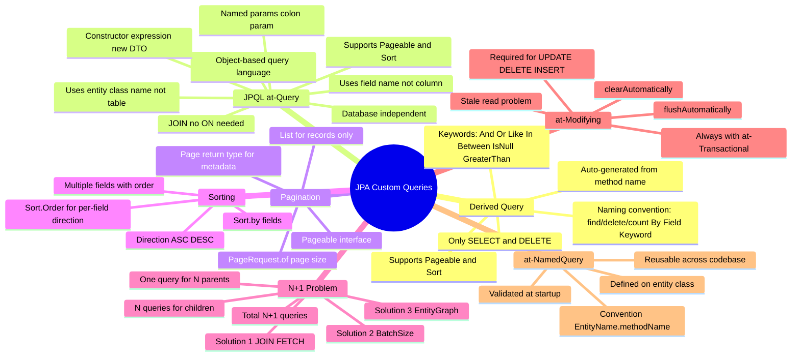

# 📌 JPA Custom Queries — Derived Queries, JPQL, Pagination, Sorting, N+1 Problem & More

> [!IMPORTANT]
> This guide assumes you are familiar with JPA basics: creating a `@Repository` interface that extends `JpaRepository`, using `save()` and `findById()`, and the concept of a JPA `EntityManager` and Persistence Context. If not, review those topics first.

---

## Overview

Spring Data JPA provides several built-in CRUD methods (`save()`, `findById()`, `deleteById()`, etc.) through `JpaRepository`. However, real-world applications almost always require **custom queries** — filtering by specific fields, joining tables, paginating results, and more.

JPA provides multiple mechanisms to write custom queries, each suited to different levels of complexity:

| Mechanism | Best For | Writes SQL/JPQL? |
|---|---|---|
| **Derived Query** | Simple filters, reads, deletes | No — auto-generated from method name |
| **JPQL (`@Query`)** | Complex filters, joins, projections | Yes — JPQL (object-based) |
| **`@NamedQuery`** | Reusable queries across codebase | Yes — JPQL |
| **`@Modifying`** | Update/Delete via JPQL | Yes — JPQL |
| **Native Query** | Raw SQL, DB-specific features | Yes — SQL |

This guide covers all of the above in depth.

---

## Part 1 — Derived Queries

---

### Overview

A **Derived Query** (also called a **query method**) is a Spring Data JPA feature where the query is **automatically generated** by parsing the method name you write in your repository interface. You write no SQL or JPQL — JPA reads your method name and converts it into a query.

---

### Why This Concept Exists

Writing a JPQL or SQL query for every simple filter (`find by name`, `find by email`, `delete by status`) is repetitive and verbose. Derived queries let you express simple queries purely through a method name following a strict naming convention, eliminating boilerplate.

---

### Definition

> A **Derived Query** is a repository method whose query is automatically generated by Spring Data JPA at startup time by parsing the method name according to a defined naming convention. No `@Query` annotation is required.

---

### How JPA Parses Method Names (Internal Working)

Internally, Spring Data JPA uses a **regex pattern** (defined in a class called `Part`) to parse your method name into a structured query. The method name must match this regex, otherwise Spring will fail at application startup with an error.

The recognized prefixes (what your method name must start with) are:

```
find, read, get, query, search, stream, count, exists, delete, remove
```

After the prefix, the structure is:

```
<prefix><OptionalDescription>By<FieldName><Keyword><FieldName>...
```

- Everything between the prefix and `By` is **ignored** by JPA (it is just for readability).
- Everything **after `By`** must correspond to **entity field names** (in camelCase).
- Keywords like `And`, `Or`, `Between`, `IsNull`, `Like`, `In`, `GreaterThan`, etc., can follow field names.

---

### Naming Convention Structure

```
findUserDetailsByNameAndPhone
│    │          │ │    │ │
│    │          │ │    │ └─ second field name (entity field)
│    │          │ │    └─── keyword: And
│    │          │ └──────── first field name: name (entity field)
│    │          └────────── keyword: By (starts the WHERE clause)
│    └───────────────────── optional description (ignored by JPA)
└────────────────────────── prefix: find → SELECT
```

---

### Supported Prefixes and Their SQL Equivalents

| Prefix | Generated SQL Type |
|---|---|
| `find`, `read`, `get`, `query`, `search`, `stream` | `SELECT` |
| `count` | `SELECT COUNT(*)` |
| `exists` | `SELECT CASE WHEN COUNT(*) > 0 THEN true ELSE false END` |
| `delete`, `remove` | `DELETE` |

---

### Supported Keywords (Comparisons and Conditions)

These keywords can be appended **after a field name** in the method name:

| Keyword in Method | SQL Equivalent | Example Method |
|---|---|---|
| `And` | `AND` | `findByNameAndPhone` |
| `Or` | `OR` | `findByNameOrUserId` |
| `Between` / `IsBetween` | `BETWEEN ? AND ?` | `findByAgeBetween` |
| `LessThan` | `<` | `findByAgeLessThan` |
| `LessThanEqual` | `<=` | `findByAgeLessThanEqual` |
| `GreaterThan` | `>` | `findByAgeGreaterThan` |
| `GreaterThanEqual` | `>=` | `findByAgeGreaterThanEqual` |
| `IsNull` / `Null` | `IS NULL` | `findByPhoneIsNull` |
| `IsNotNull` / `NotNull` | `IS NOT NULL` | `findByPhoneIsNotNull` |
| `Like` | `LIKE ?` | `findByNameLike` |
| `NotLike` | `NOT LIKE ?` | `findByNameNotLike` |
| `StartingWith` | `LIKE ?%` | `findByNameStartingWith` |
| `EndingWith` | `LIKE %?` | `findByNameEndingWith` |
| `Containing` | `LIKE %?%` | `findByNameContaining` |
| `In` | `IN (?)` | `findByNameIn` |
| `NotIn` | `NOT IN (?)` | `findByNameNotIn` |
| `True` | `= true` | `findByActiveTrue` |
| `False` | `= false` | `findByActiveFalse` |
| `OrderBy` | `ORDER BY` | `findByNameOrderByAgeDesc` |

---

### Supported Operations

> [!NOTE]
> Derived queries support **read (`SELECT`)** and **delete (`DELETE`)** operations. For **insert** and **update**, use the built-in `save()` method or `@Modifying` + `@Query` (covered later).
>
> This is because `save()` already handles both insert and update (upsert behavior based on whether the entity has an ID).

---

### Syntax

```java
// In your repository interface
public interface UserDetailRepository extends JpaRepository<UserEntity, Long> {

    // SELECT * FROM user_detail WHERE name = ?
    List<UserEntity> findUserDetailsByName(String name);

    // SELECT * FROM user_detail WHERE name = ? AND phone = ?
    List<UserEntity> findUserDetailsByNameAndPhone(String name, String phone);

    // SELECT * FROM user_detail WHERE name = ? OR user_id = ?
    List<UserEntity> findUserDetailsByNameOrUserId(String name, Long userId);

    // SELECT * FROM user_detail WHERE name IN (?, ?, ...)
    List<UserEntity> findUserDetailsByNameIn(List<String> names);

    // SELECT * FROM user_detail WHERE name LIKE ?
    List<UserEntity> findUserDetailsByNameLike(String namePattern);

    // DELETE FROM user_detail WHERE name = ?
    @Transactional
    void deleteUserDetailsByName(String name);
}
```

---

### Code Examples

#### Example 1 — Simple Find by Name

```java
// Repository
List<UserEntity> findUserDetailsByName(String name);
```

**Generated SQL:**
```sql
SELECT * FROM user_detail WHERE name = ?
```

**Usage in Service:**
```java
List<UserEntity> users = userRepository.findUserDetailsByName("Alice");
```

---

#### Example 2 — Find with AND / OR

```java
// AND condition
List<UserEntity> findUserDetailsByNameAndPhone(String name, String phone);

// OR condition
List<UserEntity> findUserDetailsByNameOrUserId(String name, Long userId);
```

**Generated SQL (AND):**
```sql
SELECT * FROM user_detail WHERE name = ? AND phone = ?
```

**Generated SQL (OR):**
```sql
SELECT * FROM user_detail WHERE name = ? OR user_id = ?
```

---

#### Example 3 — Find with IN

```java
List<UserEntity> findUserDetailsByNameIn(List<String> names);
```

**Generated SQL:**
```sql
SELECT * FROM user_detail WHERE name IN (?, ?, ...)
```

**Usage:**
```java
List<UserEntity> users = userRepository.findUserDetailsByNameIn(List.of("Alice", "Bob", "Charlie"));
```

---

#### Example 4 — Find with LIKE

```java
List<UserEntity> findUserDetailsByNameLike(String namePattern);
```

**Generated SQL:**
```sql
SELECT * FROM user_detail WHERE name LIKE ?
```

**Usage:**
```java
// Caller must provide the % wildcards manually
List<UserEntity> users = userRepository.findUserDetailsByNameLike("%Ali%");
```

> [!TIP]
> Use `findByNameContaining("Ali")` instead of `findByNameLike` if you want JPA to automatically add `%` around the value.

---

#### Example 5 — Delete by Name

```java
@Transactional
void deleteUserDetailsByName(String name);
```

**Generated SQL:**
```sql
DELETE FROM user_detail WHERE name = ?
```

> [!IMPORTANT]
> Delete-derived methods **must** be annotated with `@Transactional`. If there are 10 rows matching the name, the delete will be called for each one (individual DELETE statements per row by default).

---

### Flowchart — How Derived Query Works at Startup



---

### Limitations of Derived Queries

> [!CAUTION]
> Derived queries become difficult to read and maintain when the query involves complex conditions. For example:
> ```java
> findByNameLikeAndAgeGreaterThanAndPhoneIsNotNullOrderByNameDesc(...)
> ```
> This is technically valid but practically unmaintainable. Use **JPQL (`@Query`)** for anything more complex.

Derived queries also **cannot express JOIN queries** (joining multiple tables/entities). For joins, you must use JPQL.

---

## Part 2 — Pagination and Sorting

---

### Overview

JPA provides two interfaces to support **pagination** and **sorting** of query results:

- **`Pageable`** — controls which page of results to return and how many records per page.
- **`Sort`** — controls the ordering of results by one or more fields.

Both can be used with **derived queries** and **JPQL queries**.

---

### Why This Concept Exists

Returning all records from a database table in one query is impractical for large datasets — it wastes memory, increases response time, and degrades performance. Pagination solves this by returning results in chunks (pages). Sorting ensures results are in a meaningful order.

---

### Pageable Interface

`Pageable` is a Spring Data interface. You create a `Pageable` instance using `PageRequest.of(pageNumber, pageSize)`:

- **pageNumber** — zero-based index (page 0 is the first page).
- **pageSize** — how many records appear on each page.

**Example:**
```java
Pageable pageable = PageRequest.of(0, 5); // Page 0, 5 records per page
```

**Visualization:**
```
10 total records: [1, 2, 3, 4, 5, 6, 7, 8, 9, 10]

PageRequest.of(0, 5) → [1, 2, 3, 4, 5]   (Page 0)
PageRequest.of(1, 5) → [6, 7, 8, 9, 10]  (Page 1)
```

---

### Return Types with Pagination

| Return Type | What You Get |
|---|---|
| `List<T>` | Just the records for that page |
| `Page<T>` | Records + metadata (total pages, total elements, isFirst, isLast, etc.) |
| `Slice<T>` | Records + hasNext (lightweight, no total count query) |

> [!TIP]
> Use `Page<T>` when you need to show "Page 3 of 12" in your UI. Use `List<T>` when you only need the records. Use `Slice<T>` for infinite scroll scenarios.

---

### Derived Query with Pagination

```java
// Repository
Page<UserEntity> findByNameStartingWith(String prefix, Pageable pageable);
```

> [!NOTE]
> There is **no strict rule** that `Pageable` must be the last parameter — JPA can detect the `Pageable` parameter regardless of its position. However, the **convention** is to always place `Pageable` as the last parameter for readability.

**Service class:**
```java
Pageable pageable = PageRequest.of(0, 5); // Get first 5 records
Page<UserEntity> result = userRepository.findByNameStartingWith("A", pageable);

// Extracting data from Page object
List<UserEntity> content    = result.getContent();     // The actual records
long totalElements           = result.getTotalElements(); // Total matching rows in DB
int totalPages               = result.getTotalPages();    // Total number of pages
boolean isFirst              = result.isFirst();          // Is this the first page?
boolean isLast               = result.isLast();           // Is this the last page?
```

**Generated SQL (approximately):**
```sql
SELECT * FROM user_detail WHERE name LIKE 'A%' LIMIT 5 OFFSET 0;
SELECT COUNT(*) FROM user_detail WHERE name LIKE 'A%';  -- for totalElements
```

---

### Sort Interface

`Sort` controls the ordering of results. You create a `Sort` using `Sort.by()`.

#### Single Field Sort

```java
Sort sort = Sort.by("name").descending();
// Or:
Sort sort = Sort.by(Sort.Direction.DESC, "name");
```

> [!IMPORTANT]
> The field name provided to `Sort.by()` is the **Java entity field name**, not the database column name.

#### Multiple Fields, Same Direction

```java
Sort sort = Sort.by("name", "phone").descending();
```

**How multi-field sorting works:**
- Records are first sorted by the **first field** (`name`).
- Where two records have the **same value** for the first field, the **second field** (`phone`) is used as a tiebreaker.
- And so on for additional fields.

**Example:**

```
Data: [("Alice", 1), ("Alice", 3), ("Alice", 2), ("Bob", 5)]

Sort by name DESC, phone DESC:
→ [("Bob", 5), ("Alice", 3), ("Alice", 2), ("Alice", 1)]
```

#### Multiple Fields, Different Directions

When you need ascending for one field and descending for another, you must create **individual `Sort.Order` objects**:

```java
Sort sort = Sort.by(
    Sort.Order.asc("name"),
    Sort.Order.desc("phone")
);
```

---

### Pagination + Sorting Combined

Pass a `Sort` instance to `PageRequest.of()`:

```java
Sort sort = Sort.by("name").descending();
Pageable pageable = PageRequest.of(0, 5, sort);

Page<UserEntity> result = userRepository.findByNameStartingWith("A", pageable);
```

---

### Sort-Only (No Pagination)

If you only need sorting without pagination, use `Sort` as a standalone parameter:

```java
// Repository
List<UserEntity> findByNameStartingWith(String prefix, Sort sort);

// Service
Sort sort = Sort.by(Sort.Order.asc("name"), Sort.Order.desc("phone"));
List<UserEntity> result = userRepository.findByNameStartingWith("A", sort);
```

---

### Full Code Example — Pagination and Sorting

```java
@RestController
@RequestMapping("/users")
public class UserController {

    @Autowired
    private UserDetailService userDetailService;

    @GetMapping("/paginated")
    public Page<UserEntity> getPaginatedUsers(
            @RequestParam(defaultValue = "0") int page,
            @RequestParam(defaultValue = "5") int size,
            @RequestParam(defaultValue = "name") String sortBy,
            @RequestParam(defaultValue = "asc") String direction) {

        Sort sort = direction.equalsIgnoreCase("desc")
                ? Sort.by(sortBy).descending()
                : Sort.by(sortBy).ascending();

        Pageable pageable = PageRequest.of(page, size, sort);
        return userDetailService.getUsers("A", pageable);
    }
}
```

```java
@Service
public class UserDetailService {

    @Autowired
    private UserDetailRepository userDetailRepository;

    public Page<UserEntity> getUsers(String prefix, Pageable pageable) {
        return userDetailRepository.findByNameStartingWith(prefix, pageable);
    }
}
```

```java
public interface UserDetailRepository extends JpaRepository<UserEntity, Long> {
    Page<UserEntity> findByNameStartingWith(String prefix, Pageable pageable);
}
```

---

## Part 3 — JPQL (`@Query` Annotation)

---

### Overview

**JPQL (Java Persistence Query Language)** is a query language defined by the JPA specification. It is similar to SQL but operates on **Java entity objects and their fields**, not on database tables and columns directly.

---

### Why This Concept Exists

Derived queries have limitations — they cannot handle complex joins, subqueries, or projections efficiently. JPQL gives you full query control while keeping the queries **database-independent** (since they reference entities, not tables).

---

### JPQL vs SQL

| Aspect | SQL | JPQL |
|---|---|---|
| Works on | Database tables and columns | Java entity classes and fields |
| Table name | `user_detail` | `UserEntity` (the Java class name) |
| Column name | `user_name` | `name` (the Java field name) |
| Database-specific? | Yes | No — database independent |
| JOINs | Uses `ON` clause | No `ON` needed — JPA infers from entity relationships |
| Used with | Native DB drivers | JPA / Hibernate |

> [!IMPORTANT]
> JPQL is **database-independent**. If you switch from MySQL to PostgreSQL, your JPQL queries remain unchanged because they reference Java entity classes, not actual DB tables.

---

### Syntax

```java
@Query("SELECT u FROM UserEntity u WHERE u.name = :userName")
UserEntity findByUserName(@Param("userName") String name);
```

#### Syntax Breakdown

| Part | Meaning |
|---|---|
| `@Query(...)` | Annotation telling Spring Data this method uses a custom JPQL query |
| `"SELECT u FROM UserEntity u"` | `UserEntity` is the **Java class name** (not table name). `u` is an alias. |
| `WHERE u.name` | `name` is the **Java field name** in `UserEntity` (not the DB column name) |
| `:userName` | A **named parameter** — will be replaced with the method argument |
| `@Param("userName")` | Binds the method parameter `name` to the named query parameter `:userName` |

> [!NOTE]
> The method name in a `@Query`-annotated method **does not** need to follow any naming convention. Only derived query methods must follow the `findBy...` pattern.

---

### Named Parameters vs Positional Parameters

**Named parameters (recommended):**
```java
@Query("SELECT u FROM UserEntity u WHERE u.name = :name AND u.phone = :phone")
List<UserEntity> findByNameAndPhone(@Param("name") String name, @Param("phone") String phone);
```

**Positional parameters (older style):**
```java
@Query("SELECT u FROM UserEntity u WHERE u.name = ?1 AND u.phone = ?2")
List<UserEntity> findByNameAndPhone(String name, String phone);
```

> [!TIP]
> Always prefer named parameters (`:name` + `@Param`) over positional parameters (`?1`) for readability and maintainability.

---

### Return Types in JPQL

> [!CAUTION]
> The return type you choose must match what the query actually returns. If your query can return multiple rows but your return type is a single object (not `List<>`), JPA will throw a `NonUniqueResultException` at runtime. Always choose your return type based on the expected number of results.

| Query result | Correct return type |
|---|---|
| Always one row | `UserEntity` or `Optional<UserEntity>` |
| Zero or one row | `Optional<UserEntity>` |
| Multiple rows | `List<UserEntity>` |
| Count | `long` |

---

### Code Examples

#### Example 1 — Simple SELECT with Named Parameter

```java
@Query("SELECT u FROM UserEntity u WHERE u.name = :userName")
Optional<UserEntity> findByUserName(@Param("userName") String name);
```

**Generated SQL:**
```sql
SELECT * FROM user_detail WHERE name = ?
```

---

#### Example 2 — SELECT with JOIN (One-to-One)

**Entity setup:**
```java
@Entity
public class UserEntity {
    @Id
    private Long id;
    private String name;

    @OneToOne
    @JoinColumn(name = "address_id")
    private UserAddress userAddress;
}
```

**Repository:**
```java
@Query("SELECT ud FROM UserEntity ud JOIN ud.userAddress WHERE ud.name = :name")
List<UserEntity> findUsersWithAddress(@Param("name") String name);
```

**Generated SQL:**
```sql
SELECT ud.* FROM user_detail ud
JOIN user_address ua ON ud.address_id = ua.id
WHERE ud.name = ?
```

> [!NOTE]
> In JPQL JOINs, there is **no `ON` clause**. JPA automatically infers the join condition from the entity relationship mapping (`@JoinColumn`, `@OneToOne`, etc.).

---

#### Example 3 — Selecting Specific Fields (Projection) — Object Array

When you want to return only specific fields from one or multiple entities:

```java
@Query("SELECT ud.name, ua.country FROM UserEntity ud JOIN ud.userAddress ua WHERE ud.name = :name")
List<Object[]> findNameAndCountry(@Param("name") String name);
```

**Service usage:**
```java
List<Object[]> results = userRepository.findNameAndCountry("Alice");
List<UserDTO> dtos = new ArrayList<>();

for (Object[] row : results) {
    String name    = (String) row[0];
    String country = (String) row[1];
    dtos.add(new UserDTO(name, country));
}
```

> [!CAUTION]
> Using `Object[]` works but is error-prone — you must remember the column order and cast types manually. Prefer the **constructor expression** approach below.

---

#### Example 4 — Selecting Specific Fields Using Constructor Expression (Recommended)

Instead of returning `Object[]`, you can return a **DTO (Data Transfer Object)** directly from the JPQL query:

**DTO class:**
```java
public class UserDTO {
    private String name;
    private String country;

    // Constructor used by JPQL
    public UserDTO(String name, String country) {
        this.name = name;
        this.country = country;
    }
    // getters...
}
```

**Repository:**
```java
@Query("SELECT new com.example.dto.UserDTO(ud.name, ua.country) " +
       "FROM UserEntity ud JOIN ud.userAddress ua WHERE ud.name = :name")
List<UserDTO> findUserDTOs(@Param("name") String name);
```

> [!IMPORTANT]
> The full **package path** of the DTO class must be provided in the `new` expression. For each row returned by the query, JPQL calls the DTO constructor with the values from that row.

**Service usage:**
```java
List<UserDTO> dtos = userRepository.findUserDTOs("Alice");
// No manual parsing needed — dtos is ready to use
```

---

#### Example 5 — Multiple Table JOINs

```java
// Table A → Table B → Table C
@Query("SELECT a FROM TableA a JOIN a.bList b JOIN b.cList c WHERE a.name = :name")
List<TableA> findWithBAndC(@Param("name") String name);
```

Each additional table requires one more `JOIN`. No `ON` clause is needed at any level — JPA infers the join conditions from the entity mappings.

---

### JPQL with Pagination and Sorting

Pagination and sorting work **identically** with `@Query` methods as with derived query methods — just add `Pageable` or `Sort` as a parameter:

```java
@Query("SELECT u FROM UserEntity u WHERE u.name = :name")
Page<UserEntity> findByName(@Param("name") String name, Pageable pageable);
```

```java
// Service
Pageable pageable = PageRequest.of(0, 5, Sort.by("name").descending());
Page<UserEntity> page = userRepository.findByName("Alice", pageable);
```

---

## Part 4 — The N+1 Problem

---

### Overview

The **N+1 problem** is a performance issue that occurs in JPA when fetching a parent entity and its associated child entities results in **1 query for all parents + N additional queries (one per parent) for the children**, instead of a single efficient query.

---

### Why It Happens

This stems from how JPA handles **lazy** and **eager** loading when dealing with **one-to-many** and **many-to-many** relationships.

**Background — Eager vs Lazy loading:**

- **Lazy loading:** When you load a parent, child entities are **not loaded**. They are loaded on demand (when you first access them in code).
- **Eager loading:** When you load a parent, child entities are **loaded immediately** along with the parent.

**The trap:**
- Eager loading works as expected when fetching a **single parent** — JPA generates one joined query that fetches the parent and all its children together.
- When your query can return **multiple parents**, JPA changes its behavior for performance reasons: it first fetches all parents in one query, then fires **one additional SELECT per parent** to fetch that parent's children.
- This is true even with `FetchType.EAGER`.

---

### Definition

> The **N+1 Problem** is a query performance anti-pattern where loading N parent entities results in N additional database queries (one per parent) to load their child entities, for a total of N+1 database round-trips instead of 1.

---

### Real-World Analogy

Imagine going to a library to find all books by authors whose name starts with "A".

- **Without N+1 fix:** You first go to the author index and get a list of 50 authors (1 trip). Then, for each of the 50 authors, you make a separate trip to the shelf to get their books (50 trips). Total: 51 trips.
- **With the fix:** You ask the librarian to bring you all books by all matching authors in one trip. Total: 1 trip.

---

### Example Setup

```java
@Entity
public class UserEntity {
    @Id
    private Long id;
    private String name;

    @OneToMany(fetch = FetchType.EAGER)
    private List<UserAddress> userAddressList;
}
```

**Query:**
```java
@Query("SELECT ud FROM UserEntity ud JOIN ud.userAddressList WHERE ud.name = :name")
List<UserEntity> findUsersWithAddresses(@Param("name") String name);
```

**Scenario:** 2 users in DB, each with 1 address.

**Actual SQL generated:**

```sql
-- Query 1: Fetch all matching users
SELECT * FROM user_detail WHERE name = 'A';

-- Query 2: Fetch addresses for user ID 1
SELECT * FROM user_address WHERE user_id = 1;

-- Query 3: Fetch addresses for user ID 2
SELECT * FROM user_address WHERE user_id = 2;
```

**Total: 3 queries = 1 + N (where N = 2 users)**

If there were 100 users, there would be 101 queries.

---

### Flowchart — N+1 Problem



---

### Solutions to the N+1 Problem

There are three main solutions, each applicable to different scenarios.

---

#### Solution 1 — `JOIN FETCH` in JPQL

Use `JOIN FETCH` instead of `JOIN`. This tells JPA to fetch the parent and all children in a **single SQL query**.

```java
@Query("SELECT ud FROM UserEntity ud JOIN FETCH ud.userAddressList WHERE ud.name = :name")
List<UserEntity> findUsersWithAddressesFetch(@Param("name") String name);
```

**Generated SQL:**
```sql
SELECT ud.*, ua.* FROM user_detail ud
INNER JOIN user_address ua ON ua.user_id = ud.id
WHERE ud.name = ?
```

**One query. All parent and child data loaded together.**

> [!NOTE]
> Even though your JPQL selects only `ud` (user details), `JOIN FETCH` forces JPA to also retrieve `ua` (addresses) in the same query and populate the `userAddressList` collection on each `UserEntity`.

---

#### Solution 2 — `@BatchSize`

Applicable when you are using **derived queries** (where you cannot write `JOIN FETCH`) or want to reduce N+1 without eliminating it entirely.

```java
@Entity
public class UserEntity {
    @Id
    private Long id;
    private String name;

    @OneToMany(fetch = FetchType.EAGER)
    @BatchSize(size = 10)  // Fetch children in batches of 10
    private List<UserAddress> userAddressList;
}
```

**How it works:**
- Instead of N separate queries (one per parent), JPA groups the child fetches into **batches**.
- With `@BatchSize(size = 10)` and 50 parents: 1 query for all parents + ceil(50/10) = 5 batch queries for children = **6 queries total** (instead of 51).

> [!CAUTION]
> `@BatchSize` reduces the N+1 problem but does **not eliminate it**. It goes from N+1 queries to approximately `(N/batchSize) + 1` queries. Use `JOIN FETCH` for the best performance when a single query is viable.

---

#### Solution 3 — `@EntityGraph`

Applicable for **derived query methods** where you cannot write custom JPQL.

```java
// On the entity
@Entity
@NamedEntityGraph(
    name = "UserEntity.withAddresses",
    attributeNodes = @NamedAttributeNode("userAddressList")
)
public class UserEntity {
    ...
    @OneToMany
    private List<UserAddress> userAddressList;
}

// In the repository
@EntityGraph(attributePaths = {"userAddressList"})
List<UserEntity> findByName(String name);
```

`@EntityGraph` tells JPA: "Even though this is just a `findByName` query, eagerly fetch `userAddressList` alongside the main entity in a single query."

---

### Comparison of N+1 Solutions

| Solution | Eliminates N+1 Completely? | Works with Derived Queries? | Works with JPQL? |
|---|---|---|---|
| `JOIN FETCH` | ✅ Yes — single query | ❌ No | ✅ Yes |
| `@BatchSize` | ❌ No — reduces it | ✅ Yes | ✅ Yes |
| `@EntityGraph` | ✅ Yes — single query | ✅ Yes | ✅ Yes |

---

### Why Eager Loading Alone Doesn't Solve N+1

> [!WARNING]
> Many developers assume that `FetchType.EAGER` will always generate a single JOIN query. This is incorrect.
>
> **Eager loading generates a joined query ONLY when fetching a single parent** (e.g., `findById()`).
>
> When your query **can return multiple parents** (e.g., `findAll()`, `findByName()` returning a list), JPA abandons the join approach for performance optimization reasons and instead falls back to N+1 behavior — fetching all parents first, then fetching children per parent.
>
> This is why `JOIN FETCH`, `@BatchSize`, or `@EntityGraph` must be explicitly used.

---

## Part 5 — `@Modifying` Annotation

---

### Overview

By default, JPQL assumes every query written inside `@Query` is a **SELECT** (read) operation. If you write a `DELETE`, `UPDATE`, or `INSERT` query inside `@Query` without additional annotation, JPA will throw an error at runtime.

The `@Modifying` annotation tells JPA that the query **modifies the database** (i.e., it is not a SELECT).

---

### Definition

> `@Modifying` is a Spring Data JPA annotation that marks a `@Query`-annotated method as a **data-modifying operation** (UPDATE, DELETE, or INSERT). Without it, JPA will reject non-SELECT JPQL queries.

---

### Syntax

```java
@Modifying
@Transactional
@Query("DELETE FROM UserEntity u WHERE u.name = :name")
void deleteByUserName(@Param("name") String name);
```

```java
@Modifying
@Transactional
@Query("UPDATE UserEntity u SET u.phone = :phone WHERE u.name = :name")
int updatePhoneByName(@Param("phone") String phone, @Param("name") String name);
```

> [!IMPORTANT]
> `@Modifying` must **always** be used together with `@Transactional`. Since you are modifying the database, a transaction is required. Without `@Transactional`, Spring will throw `TransactionRequiredException`.

---

### The `flushAutomatically` and `clearAutomatically` Problem

This is a subtle but important concept that arises when using `@Modifying` with JPQL queries within the same transaction that also performs reads.

**The Problem:**

Consider this sequence within a single transaction:

```java
@Transactional
public void deleteAndVerify(Long id, String name) {
    // Step 1: Load the entity — stored in Persistence Context
    UserEntity user = userRepository.findById(id).get();

    // Step 2: Delete via @Modifying JPQL — DB record deleted
    userRepository.deleteByUserName(name);

    // Step 3: Try to find the entity again
    Optional<UserEntity> found = userRepository.findById(id);
    System.out.println(found.isPresent()); // ← What prints here?
}
```

**What actually prints: `true`**

**Why:** 
- Step 1 loads the entity into the **Persistence Context** (first-level cache).
- Step 2's `@Modifying` DELETE goes **directly to the database** via JPQL, bypassing the Persistence Context.
- The DB record is deleted, but the Persistence Context still holds the old entity.
- Step 3's `findById()` checks the Persistence Context first → finds the cached entity → returns it → prints `true`.

This is a **stale read** — the Persistence Context is out of sync with the database.

---

**The Solution: `flushAutomatically = true` and `clearAutomatically = true`**

```java
@Modifying(flushAutomatically = true, clearAutomatically = true)
@Transactional
@Query("DELETE FROM UserEntity u WHERE u.name = :name")
void deleteByUserName(@Param("name") String name);
```

| Option | What it does |
|---|---|
| `flushAutomatically = true` | Before executing the modifying query, flush any pending Persistence Context changes to the DB (sync PC → DB). |
| `clearAutomatically = true` | After executing the modifying query, clear the Persistence Context (remove all cached entities). |

**With these options set:**

- `clearAutomatically = true` removes all entities from the Persistence Context after the DELETE.
- Step 3's `findById()` finds an empty Persistence Context → goes to the DB → DB has no record → returns `Optional.empty()` → prints `false`.

> [!IMPORTANT]
> **When to use `clearAutomatically = true`:** Any time you use `@Modifying` with a JPQL query that modifies data, and you will subsequently read the same data within the same transaction. Without it, you risk stale reads from the Persistence Context.

---

### Flush vs Clear — Clarification



| Operation | Effect on PC | Effect on DB |
|---|---|---|
| `flush` | PC data is written to DB (sync) | DB is updated |
| `clear` | All entities removed from PC (detached) | DB unchanged |
| `flush + clear` | PC changes written to DB, then PC emptied | DB updated, PC empty |

---

## Part 6 — `@NamedQuery` Annotation

---

### Overview

`@NamedQuery` allows you to define a **reusable JPQL query** at the entity class level and reference it by name anywhere in your codebase.

---

### Why This Concept Exists

If the same query is used in multiple places in your codebase (multiple repositories or multiple methods), duplicating the query string is a maintenance problem. If the query needs to change, you must update it in every place it appears. `@NamedQuery` centralizes the query definition.

---

### Definition

> `@NamedQuery` is a JPA annotation placed on an entity class that defines a named JPQL query. The query can be referenced by name from any repository, avoiding duplication and centralizing query management.

---

### Syntax

**On the entity class:**

```java
@Entity
@NamedQuery(
    name = "UserEntity.findByUsername",
    query = "SELECT u FROM UserEntity u WHERE u.name = :name"
)
public class UserEntity {
    @Id
    private Long id;
    private String name;
    // ...
}
```

**In the repository:**

```java
public interface UserDetailRepository extends JpaRepository<UserEntity, Long> {

    // Method name must match the name defined in @NamedQuery: "UserEntity.findByUsername"
    // No @Query annotation needed — Spring Data finds the @NamedQuery by convention
    List<UserEntity> findByUsername(@Param("name") String name);
}
```

> [!NOTE]
> By convention, Spring Data JPA looks for a `@NamedQuery` named `<EntityClassName>.<methodName>`. So a method named `findByUsername` on a `UserEntity` repository will automatically match a `@NamedQuery` named `"UserEntity.findByUsername"`.

---

### Multiple Named Queries

Use `@NamedQueries` (plural) to define multiple named queries on one entity:

```java
@Entity
@NamedQueries({
    @NamedQuery(name = "UserEntity.findByUsername", query = "SELECT u FROM UserEntity u WHERE u.name = :name"),
    @NamedQuery(name = "UserEntity.findActiveUsers", query = "SELECT u FROM UserEntity u WHERE u.active = true")
})
public class UserEntity { ... }
```

---

### Benefits of `@NamedQuery`

- **Single source of truth** — query defined once, reused everywhere.
- **Validated at startup** — JPA validates all `@NamedQuery` queries when the application starts. Errors are caught early, not at runtime.
- **Performance** — named queries can be pre-compiled by the JPA provider at startup.

---

## Architecture Diagram — All Query Mechanisms

```mermaid
flowchart TD
    A[Repository Method Called] --> B{Has @Query?}
    B -- No --> C{Matches naming convention?}
    C -- Yes --> D[Derived Query\nMethod name parsed → JPQL generated]
    C -- No --> E{Matches @NamedQuery name?}
    E -- Yes --> F[@NamedQuery\nPre-defined JPQL used]
    E -- No --> G[Exception at startup]
    B -- Yes --> H{nativeQuery=true?}
    H -- No --> I[JPQL Query\noperated on Entity objects]
    H -- Yes --> J[Native SQL Query\noperated on DB tables directly]
    D --> K[Hibernate translates JPQL → SQL]
    F --> K
    I --> K
    K --> L[(Database)]
    J --> L
```

---

## Mind Map — All Topics



---

## Common Mistakes

### Mistake 1 — Missing `@Transactional` on Delete Derived Query

```java
// WRONG — will throw TransactionRequiredException
void deleteUserDetailsByName(String name);

// CORRECT
@Transactional
void deleteUserDetailsByName(String name);
```

---

### Mistake 2 — Wrong Field Name in Derived Query

```java
// WRONG — 'username' is not a field in UserEntity; field is 'name'
List<UserEntity> findByUsername(String name); // Exception at startup

// CORRECT
List<UserEntity> findByName(String name);
```

> [!WARNING]
> Spring Data JPA validates derived query method names at **application startup**. A typo in a field name will cause the application to fail to start, with a `PropertyReferenceException`.

---

### Mistake 3 — Using Table/Column Names in JPQL

```java
// WRONG — using table name and column name (SQL style)
@Query("SELECT * FROM user_detail WHERE user_name = :name")

// CORRECT — using entity class name and field name (JPQL style)
@Query("SELECT u FROM UserEntity u WHERE u.name = :name")
```

---

### Mistake 4 — Missing `@Modifying` on Update/Delete Query

```java
// WRONG — JPA expects SELECT by default
@Query("DELETE FROM UserEntity u WHERE u.name = :name")
void deleteByUserName(@Param("name") String name); // Throws exception

// CORRECT
@Modifying
@Transactional
@Query("DELETE FROM UserEntity u WHERE u.name = :name")
void deleteByUserName(@Param("name") String name);
```

---

### Mistake 5 — Stale Read After `@Modifying` Without `clearAutomatically`

```java
// WRONG — may return stale data from Persistence Context after delete
@Modifying
@Transactional
@Query("DELETE FROM UserEntity u WHERE u.name = :name")
void deleteByUserName(@Param("name") String name);

// CORRECT — clears Persistence Context after modification
@Modifying(flushAutomatically = true, clearAutomatically = true)
@Transactional
@Query("DELETE FROM UserEntity u WHERE u.name = :name")
void deleteByUserName(@Param("name") String name);
```

---

### Mistake 6 — Assuming Eager Loading Prevents N+1

```java
// WRONG assumption: FetchType.EAGER always generates one query
@OneToMany(fetch = FetchType.EAGER)
private List<UserAddress> userAddressList;
// When query returns multiple parents → still N+1 behavior!

// CORRECT: Use JOIN FETCH or @EntityGraph
@Query("SELECT ud FROM UserEntity ud JOIN FETCH ud.userAddressList WHERE ud.name = :name")
List<UserEntity> findUsers(@Param("name") String name);
```

---

## Best Practices

1. **Use derived queries for simple cases.** If your condition is one or two fields, a derived query is the cleanest solution.

2. **Switch to `@Query` (JPQL) when derived queries become unreadable.** A method name like `findByNameAndAgeGreaterThanAndPhoneIsNotNullOrderByNameDesc` is valid but unmaintainable.

3. **Always use named parameters (`:param` + `@Param`)** in JPQL. Positional parameters (`?1`) are fragile — reordering method parameters breaks the query silently.

4. **Always add `@Transactional` to modifying operations** (`@Modifying`, delete-derived queries).

5. **Use `clearAutomatically = true` with `@Modifying`** whenever you read data after a JPQL modification within the same transaction.

6. **Prefer `JOIN FETCH` over `@BatchSize`** when you need to completely eliminate N+1. Use `@BatchSize` only as a fallback when `JOIN FETCH` is not feasible.

7. **Use `Page<T>` as return type** only when you actually need pagination metadata (total pages, total elements). Use `List<T>` otherwise — `Page<T>` always fires an extra `COUNT(*)` query.

8. **Put `Pageable` as the last parameter** in repository methods by convention, even though JPA does not strictly require it.

9. **Use constructor expressions in JPQL** (the `new com.example.DTO(...)` syntax) instead of `Object[]` for cleaner, type-safe projections.

10. **Use `@NamedQuery` for queries shared across multiple repositories** to avoid duplication and benefit from startup-time validation.

---

## Interview Notes

### Frequently Asked Questions

**Q: What is a derived query in Spring Data JPA?**

A: A derived query is a repository method whose JPQL query is automatically generated by Spring Data JPA by parsing the method name. The method name must follow a strict naming convention starting with prefixes like `find`, `delete`, `count`, followed by `By` and field names with optional keywords like `And`, `Or`, `Like`, `In`, etc.

**Q: What is the difference between JPQL and SQL?**

A: JPQL operates on Java entity classes and their field names, while SQL operates on database tables and column names. JPQL is database-independent — you can switch databases without changing JPQL queries.

**Q: What is the N+1 problem? How do you solve it?**

A: When fetching N parent entities that each have child collections, JPA may fire 1 query for parents and then N additional queries (one per parent) for children — totaling N+1 queries. Solutions: (1) `JOIN FETCH` in JPQL, (2) `@BatchSize` on the collection, (3) `@EntityGraph` annotation.

**Q: What does `@Modifying` do?**

A: It tells Spring Data JPA that the associated `@Query` performs a data-modification operation (UPDATE, DELETE, INSERT) rather than a SELECT. Without it, JPA rejects non-SELECT queries.

**Q: What is `clearAutomatically` in `@Modifying`?**

A: It clears the Persistence Context (first-level cache) after executing the modifying query. This prevents stale reads — without it, a subsequent `findById()` in the same transaction may return the old cached entity even after it was deleted from the DB.

**Q: Why does `FetchType.EAGER` not always prevent N+1?**

A: Eager loading generates a JOIN query only when fetching a single parent. When a query can return multiple parents, JPA reverts to fetching all parents first, then fetching children per parent (N+1), as a performance optimization measure.

**Q: When would you use `@NamedQuery`?**

A: When the same JPQL query needs to be reused across multiple repository methods or repositories. It centralizes the query, making future changes easier, and JPA validates it at startup rather than at runtime.

**Q: What is the difference between `Page<T>` and `List<T>` return types in pagination?**

A: `Page<T>` includes metadata like total number of pages, total elements, whether it's the first or last page. It fires an additional `COUNT(*)` query automatically. `List<T>` returns only the records for the page. Use `Page<T>` when you need pagination metadata, `List<T>` otherwise.

---

## Practice Questions

### Easy

1. Write a derived query method to find all users where the phone number is not null.
2. Write a derived query to delete all users by a given name. What annotation must be added?
3. What prefixes can a derived query method start with?
4. What does `PageRequest.of(2, 10)` mean?
5. What annotation do you use to write a custom JPQL query in a repository method?

### Medium

6. Write a `@Query` JPQL method to find users by name and return only their `name` and `country` (from the related `UserAddress`) as a `List<UserDTO>` using a constructor expression.
7. Explain what happens without `clearAutomatically = true` when you delete an entity via `@Modifying` and then call `findById()` in the same transaction.
8. Write a repository method that finds users whose names start with "A", sorted by name descending, returning page 0 with 5 items per page.
9. Why does `FetchType.EAGER` on a `@OneToMany` field still result in N+1 queries when fetching multiple parents?
10. What is the difference between `flush` and `clear` in the context of Persistence Context?

### Hard

11. You have `UserEntity` with a `@OneToMany` list of `OrderEntity`, each with a `@OneToMany` list of `OrderItemEntity`. Write a JPQL query using `JOIN FETCH` to fetch all users along with their orders and order items in a single query.
12. Design a repository method that: (a) uses a custom JPQL query, (b) accepts pagination with sorting, (c) uses constructor expression to return a DTO, and (d) avoids N+1. Write the entity, DTO, repository method, and service call.
13. Explain why `@BatchSize` does not completely eliminate the N+1 problem but can significantly reduce database round-trips. Calculate the number of queries for 47 parents with `@BatchSize(size = 10)`.

---

## Summary

- **Derived Queries** — auto-generate SQL from method names using naming conventions (`findBy`, `deleteBy`, `countBy` + field names + keywords like `And`, `Or`, `Like`, `In`, `Between`). No `@Query` needed. Limited to simple conditions.

- **JPQL** — full query language using entity class and field names (not DB table/column names). Specified via `@Query`. Database-independent. Supports joins (no `ON` needed), projections, constructor expressions, `@Param` binding.

- **Pagination** — use `Pageable` (via `PageRequest.of(page, size)`). Return `Page<T>` for metadata, `List<T>` for records only. Pass `Pageable` as a method parameter.

- **Sorting** — use `Sort.by(field).direction()`. Combine with `Pageable` via `PageRequest.of(page, size, sort)`. Use `Sort.Order` for per-field direction control. Field names are Java entity field names.

- **N+1 Problem** — occurs when fetching multiple parents with child collections results in 1 parent query + N child queries. Fix with `JOIN FETCH` (best), `@EntityGraph`, or `@BatchSize` (partial fix). Eager loading alone does not prevent N+1 for multi-parent queries.

- **`@Modifying`** — required for JPQL UPDATE/DELETE/INSERT queries. Must be paired with `@Transactional`. Use `clearAutomatically = true` to prevent stale Persistence Context reads after modification.

- **`@NamedQuery`** — defined on the entity class. Centralizes reusable queries. Validated at startup. Referenced by name in repository methods.
