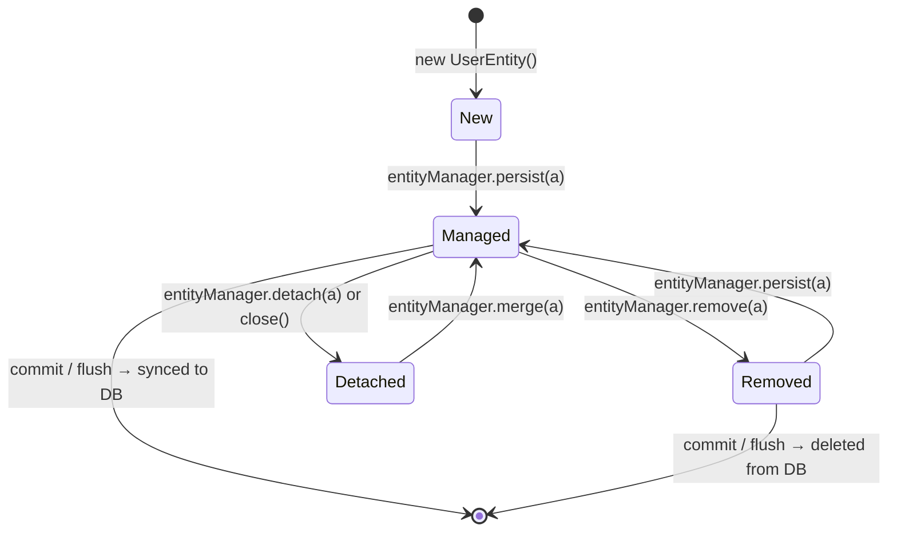
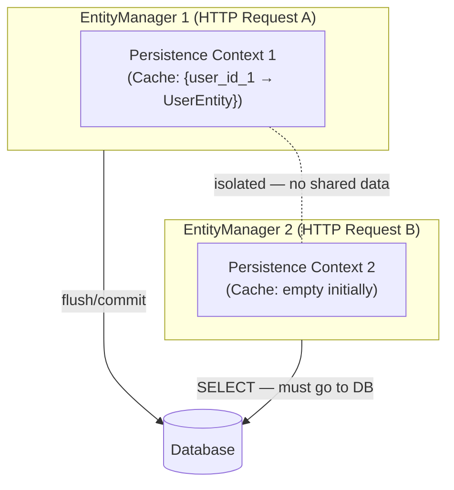
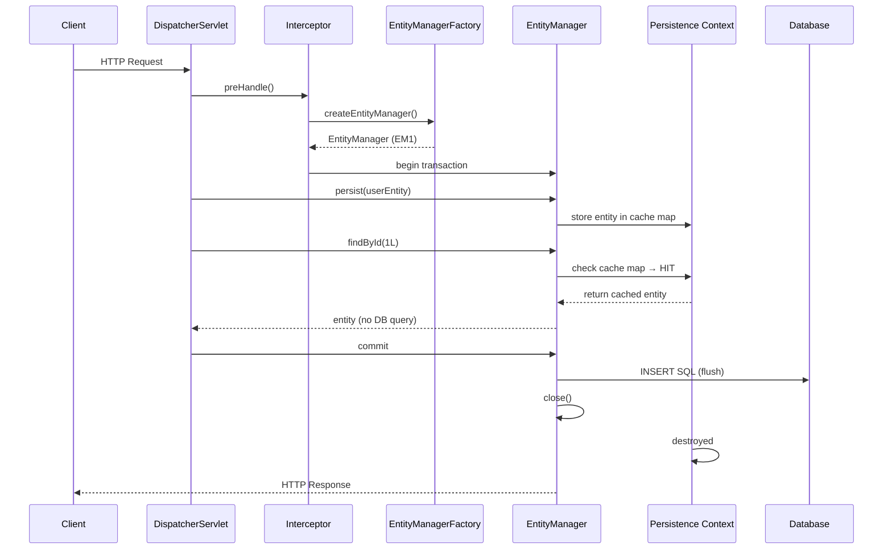
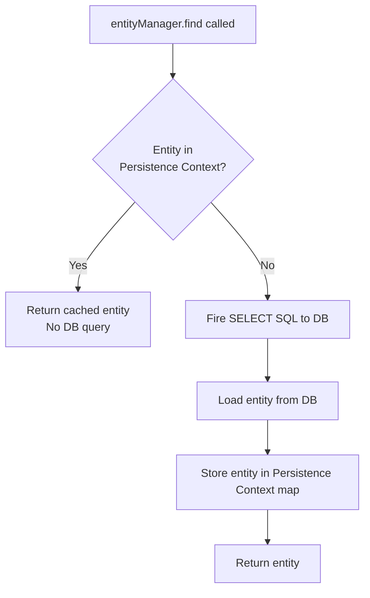
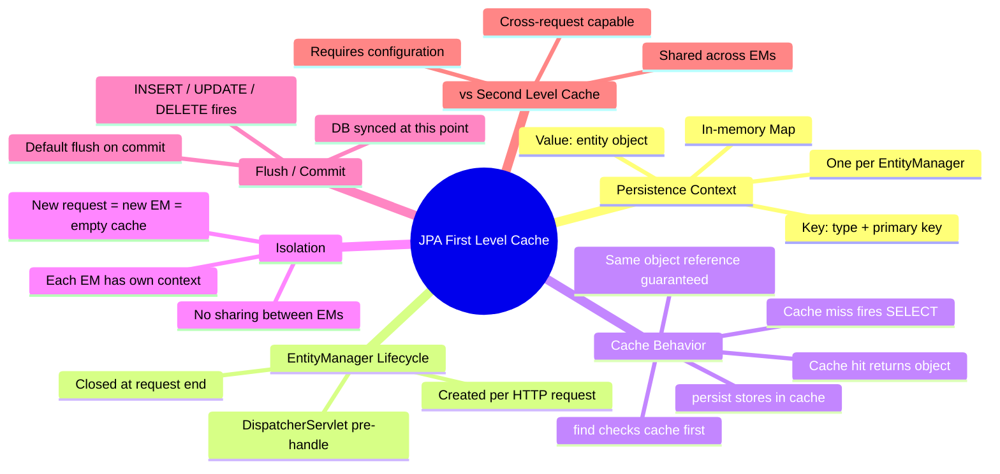

# 📌 JPA First Level Caching

> [!IMPORTANT]
> This guide assumes basic familiarity with JPA architecture, the JPA lifecycle, and the concept of an `EntityManager`. A brief recap of the lifecycle is included below to keep these notes self-contained.

---

## Overview

**First Level Caching** is a built-in, automatic caching mechanism provided by JPA (Java Persistence API) through the **Persistence Context**. It operates at the `EntityManager` level and ensures that within a single unit of work (a single `EntityManager` instance), the same database row is never fetched more than once — even if you call `find()` multiple times for the same primary key.

This cache is called "first level" because it is the most immediate, closest layer of caching between your application code and the database. It is **always active** and cannot be disabled.

---

## Why This Concept Exists

### Problem It Solves

Without any caching, every call to `find()` or a query method would result in a SQL `SELECT` statement going to the database. In a single HTTP request that retrieves the same entity multiple times (for example, in a service that loads a user and then passes it to multiple validators), this would cause redundant database round-trips, increasing latency and load on the database.

### Purpose

- Reduce unnecessary database queries within a single unit of work.
- Maintain a consistent view of entity state within a transaction — if you modify an object and then read it again, you should see your modification, not the old database value.
- Support the JPA lifecycle model where entities transition through states (`NEW → MANAGED → REMOVED → DETACHED`) without every state change immediately hitting the database.

---

## Prerequisites: JPA Lifecycle Recap

Before understanding first level caching, you must understand the JPA entity lifecycle.

### Entity States

| State | Description |
|---|---|
| **New (Transient)** | Object created with `new`, not associated with any `EntityManager` or persistence context. Not tracked. |
| **Managed (Persistent)** | Associated with a persistence context. Changes are tracked and will be synced to DB on flush/commit. |
| **Removed** | Scheduled for deletion. Still inside persistence context but marked for removal. Will be deleted on flush/commit. |
| **Detached** | Was managed, but the `EntityManager` was closed or `detach()` was called. Changes are no longer tracked. |

### Lifecycle Diagram



### Key Lifecycle Rule

> [!IMPORTANT]
> The database is **not touched** until a **flush** or **commit** happens. Until then, all entity state changes are tracked inside the **Persistence Context** in memory.

### Lifecycle Example (from the lecture)

```java
UserEntity a = new UserEntity();  // State: NEW

entityManager.getTransaction().begin();

entityManager.persist(a);   // State: MANAGED — stored in Persistence Context, NOT yet in DB

entityManager.remove(a);    // State: REMOVED — marked for deletion, still in Persistence Context

entityManager.persist(a);   // State: MANAGED again — removal cancelled

entityManager.getTransaction().commit(); // FLUSH happens: INSERT query fires, data goes to DB
```

**What actually happens at the DB level:** Only **one INSERT** query fires at commit time. All the intermediate state changes (`persist → remove → persist`) happen in the persistence context in memory — no SQL is generated for each individual call.

---

## Definition

> **First Level Cache** is the cache associated with the `EntityManager` (or Hibernate `Session`). It is scoped to the lifetime of a single `EntityManager` instance. Within that scope, every entity loaded or persisted is stored in the **Persistence Context**, which acts as an identity map. Subsequent lookups for the same entity by primary key are served from this in-memory map without hitting the database.

---

## Real-World Analogy

Think of the Persistence Context as a **shopping cart** in a store session.

- You walk into the store (start an HTTP request → EntityManager is created).
- You pick up items (persist entities).
- You look at items you already picked up (find by ID) — you don't go back to the shelf; they're already in your cart.
- You check out (commit/flush) — the final state of your cart goes to the cashier (database).
- When you leave and someone else walks in (new HTTP request → new EntityManager), they start with a completely empty cart. They have no knowledge of what was in yours.

---

## Core Concepts

### Persistence Context

The **Persistence Context** is the in-memory workspace managed by the `EntityManager`. It:

- Stores all entities that have been loaded or persisted during the current `EntityManager` lifetime.
- Tracks the state of each entity (Managed, Removed, etc.).
- Acts as a **first-level cache** — the same entity (by primary key) is never fetched from the DB twice within the same persistence context.
- Is implemented internally as a **Map (identity map)** where the key is derived from the entity's primary key and type, and the value is the entity object.

### EntityManager ↔ Persistence Context Relationship

```
One EntityManager  =  One Persistence Context
```

- If you create two `EntityManager` instances, each has its **own separate** persistence context.
- These two persistence contexts are **completely isolated** — data visible in one is **invisible** to the other.
- This is the fundamental reason why first-level caching is **scoped to a single EntityManager**.



### EntityManager Lifecycle in Spring / Dispatcher Servlet

In a Spring MVC application:

- **`DispatcherServlet`** is the front controller — every HTTP request passes through it.
- Before invoking the controller, `DispatcherServlet` runs pre-handle interceptors.
- One of these interceptors creates an **`EntityManagerFactory`** (created once at application startup) and from it creates a **new `EntityManager`** for this HTTP request.
- **Every HTTP request gets exactly one `EntityManager`.**
- All JPA/Spring Data JPA operations within that HTTP request (whether `save()`, `findById()`, custom queries) use **the same `EntityManager`** and therefore the **same persistence context**.
- When the HTTP request ends, the `EntityManager` is closed, and the persistence context is destroyed.



---

## Internal Working

### How the Persistence Context Cache Works (Internally)

Internally, Hibernate's `SessionImpl` (which implements JPA's `EntityManager`) maintains the persistence context as a **`StatefulPersistenceContext`**. This class holds a `Map` where:

- **Key:** A composite of the entity type + primary key value.
- **Value:** The actual entity object.

When you call `entityManager.persist(entity)`:

1. Hibernate checks if the entity is already in the map (`putIfAbsent` semantics).
2. If not, it adds the entity to the map.
3. The entity is now in **MANAGED** state.
4. No SQL is fired yet.

When you call `entityManager.find(UserEntity.class, 1L)`:

1. Hibernate first checks the persistence context map for the key `(UserEntity, 1L)`.
2. If found → returns the cached object. **No SELECT query**.
3. If not found → fires a `SELECT` SQL query to the database, loads the entity, stores it in the map, and returns it.



---

## Syntax

### Using Spring Data JPA (Most Common)

```java
// Repository interface
public interface UserDetailRepository extends JpaRepository<UserEntity, Long> {
    // No custom code needed for basic CRUD
}

// Service
@Service
public class UserDetailService {

    @Autowired
    private UserDetailRepository userDetailRepository;

    @Transactional
    public UserEntity saveUser(UserEntity user) {
        return userDetailRepository.save(user);  // internally calls entityManager.persist()
    }

    public Optional<UserEntity> getUser(Long id) {
        return userDetailRepository.findById(id);  // internally calls entityManager.find()
    }
}
```

### Using EntityManager Directly (Manual / Verbose)

```java
@Autowired
private EntityManagerFactory entityManagerFactory;

public void demonstrateFirstLevelCache() {
    EntityManager em = entityManagerFactory.createEntityManager();
    em.getTransaction().begin();

    UserEntity user = new UserEntity();
    user.setName("Alice");

    em.persist(user);           // Entity stored in Persistence Context. No INSERT yet.

    UserEntity found1 = em.find(UserEntity.class, user.getId());  // Cache HIT — no SELECT
    UserEntity found2 = em.find(UserEntity.class, user.getId());  // Cache HIT — no SELECT

    System.out.println(found1 == found2);  // true — same object reference from cache

    em.getTransaction().commit();  // FLUSH: INSERT SQL fires now
    em.close();                    // Persistence Context destroyed
}
```

---

## Code Examples

### Example 1 — Basic First Level Cache: Same HTTP Request

**Scenario:** Save a user, then immediately fetch the same user within the same HTTP request.

**Controller:**

```java
@RestController
public class EntityController {

    @Autowired
    private UserDetailService userDetailService;

    @GetMapping("/test-jpa")
    public UserEntity testJpa() {
        UserEntity user = new UserEntity();
        user.setName("Alice");

        userDetailService.saveUser(user);           // INSERT fires on commit
        return userDetailService.getUser(user.getId()); // NO SELECT — served from cache
    }
}
```

**Service:**

```java
@Service
public class UserDetailService {

    @Autowired
    private UserDetailRepository userDetailRepository;

    @Transactional
    public UserEntity saveUser(UserEntity user) {
        return userDetailRepository.save(user);
    }

    public Optional<UserEntity> getUser(Long id) {
        return userDetailRepository.findById(id);
    }
}
```

**Expected Console Output:**

```
Hibernate: insert into user_entity (name) values (?)
```

> [!NOTE]
> There is **no SELECT query** in the output, even though `getUser()` was called. The data was returned from the first-level cache (persistence context), not from the database.

**Why no SELECT?**
- `saveUser()` is `@Transactional`, so Spring creates an `EntityManager` for it, calls `persist()`, and commits (flushing to DB).
- `getUser()` runs in the same HTTP request, so Spring detects there is already an active `EntityManager` (or the same `EntityManagerFactory` context is reused for this request scope) and the persistence context already has `user` in it.
- `findById()` internally calls `em.find()` → checks persistence context → cache hit → no DB round-trip.

---

### Example 2 — New HTTP Request, New EntityManager

**Scenario:** A second API endpoint fetches the same user twice. Since this is a new HTTP request, a new `EntityManager` is created with an empty persistence context.

**Controller:**

```java
@GetMapping("/read-jpa")
public List<UserEntity> readJpa() {
    Long id = 1L;
    UserEntity first  = userDetailService.getUser(id);  // SELECT fires — cache miss
    UserEntity second = userDetailService.getUser(id);  // No SELECT — cache hit
    return List.of(first, second);
}
```

**Expected Console Output:**

```
Hibernate: select u.* from user_entity u where u.id=?
```

> [!NOTE]
> Only **one SELECT** query appears, even though `getUser()` is called twice. The first call misses the cache (empty persistence context) and fires a SELECT. The entity is then stored in the persistence context. The second call hits the cache.

---

### Example 3 — Manual EntityManager: Full Demonstration

```java
@Autowired
private EntityManagerFactory entityManagerFactory;

public void runDemo() {

    // === First EntityManager ===
    EntityManager em1 = entityManagerFactory.createEntityManager();
    em1.getTransaction().begin();

    UserEntity user = new UserEntity();
    user.setName("Bob");

    em1.persist(user);  // Stored in PC1. No INSERT yet.

    // Same EM — both hits are cache hits. No SELECT queries.
    UserEntity r1 = em1.find(UserEntity.class, user.getId()); // Cache HIT
    UserEntity r2 = em1.find(UserEntity.class, user.getId()); // Cache HIT

    System.out.println("r1 == r2: " + (r1 == r2)); // true

    em1.getTransaction().commit(); // FLUSH → INSERT fires now
    em1.close();                   // PC1 destroyed

    // === Second EntityManager ===
    EntityManager em2 = entityManagerFactory.createEntityManager();
    em2.getTransaction().begin();

    // em2 has a fresh persistence context — no knowledge of em1's data
    UserEntity s1 = em2.find(UserEntity.class, user.getId()); // Cache MISS → SELECT fires
    UserEntity s2 = em2.find(UserEntity.class, user.getId()); // Cache HIT — no SELECT

    System.out.println("s1 == s2: " + (s1 == s2)); // true

    em2.getTransaction().commit();
    em2.close();
}
```

**Expected Console Output:**

```
Hibernate: insert into user_entity (name, id) values (?, ?)
Hibernate: select u.* from user_entity u where u.id=?
```

**Line-by-Line Explanation:**

| Line | What Happens |
|---|---|
| `em1.persist(user)` | Entity stored in PC1 (in-memory map). No DB interaction. |
| `em1.find(...) x2` | Both look up the map. Key found both times. No SQL fired. |
| `em1.commit()` | Flush happens. INSERT SQL is generated and sent to DB. |
| `em1.close()` | PC1 is destroyed. Entity state is lost from memory. |
| `em2.find(...)` (1st) | PC2 is empty. Cache miss. SELECT fires. Entity loaded from DB and stored in PC2. |
| `em2.find(...)` (2nd) | PC2 now has the entity. Cache hit. No SQL. |
| `em2.commit()` | Nothing to flush (no modifications). |
| `em2.close()` | PC2 destroyed. |

---

## Step-by-Step Execution Flow

```mermaid
flowchart TD
    A[HTTP Request arrives] --> B[DispatcherServlet creates EntityManager EM1]
    B --> C[EntityManager creates Persistence Context PC1 as empty Map]
    C --> D[Controller calls saveUser]
    D --> E[JPA Repository.save calls EM.persist]
    E --> F[Entity added to PC1 map with key = type+primaryKey]
    F --> G[@Transactional commit — flush happens]
    G --> H[INSERT SQL sent to DB]
    H --> I[DB now has the record]
    I --> J[Controller calls getUser with same ID]
    J --> K[JPA Repository.findById calls EM.find]
    K --> L{PC1 map contains key?}
    L -- YES --> M[Return cached entity — NO SELECT query]
    L -- NO --> N[Fire SELECT SQL to DB]
    N --> O[Store entity in PC1]
    O --> M
    M --> P[Return response]
    P --> Q[HTTP Request ends — EM1 closed — PC1 destroyed]
```

---

## Memory Representation

### During a Single HTTP Request

```
┌─────────────────────────────────────────────────────┐
│                 JVM Memory                          │
│                                                     │
│  ┌─────────────────────────────────────────────┐   │
│  │          EntityManager (em1)                │   │
│  │                                             │   │
│  │  ┌───────────────────────────────────────┐  │   │
│  │  │      Persistence Context (PC1)        │  │   │
│  │  │   (StatefulPersistenceContext)        │  │   │
│  │  │                                       │  │   │
│  │  │   Map {                               │  │   │
│  │  │     (UserEntity, 1L) → UserEntity@123 │  │   │
│  │  │     (UserEntity, 2L) → UserEntity@456 │  │   │
│  │  │   }                                   │  │   │
│  │  └───────────────────────────────────────┘  │   │
│  └─────────────────────────────────────────────┘   │
│                                                     │
│  Heap: UserEntity@123 { id=1, name="Alice" }        │
│  Heap: UserEntity@456 { id=2, name="Bob"   }        │
└─────────────────────────────────────────────────────┘
                          │
                     (flush/commit)
                          │
                          ▼
┌─────────────────────────────────────────────────────┐
│                   Database                          │
│  user_entity: | id | name  |                       │
│               |  1 | Alice |                       │
│               |  2 | Bob   |                       │
└─────────────────────────────────────────────────────┘
```

### Stack

- Each method call (`persist`, `find`, etc.) creates a stack frame.
- The `EntityManager` reference is held in the service/repository layer.

### Heap

- Entity objects (`UserEntity`) live on the heap.
- The persistence context `Map` also lives on the heap, holding references to these objects.
- The entity object in the cache and the entity object you hold a reference to are the **same object** in memory (same reference).

---

## Key Observations

1. **First-level cache is always on.** You cannot disable it. It is a core part of JPA and Hibernate.

2. **Scope = One EntityManager.** When the `EntityManager` is closed, the cache is gone.

3. **In Spring MVC: Scope = One HTTP Request.** `DispatcherServlet` creates one `EntityManager` per HTTP request.

4. **`persist()` stores in cache before DB.** The entity is in the cache even before the INSERT hits the database.

5. **`find()` checks cache first.** If the entity is already in the persistence context (managed), no SQL is generated.

6. **Identity guarantee.** Within the same persistence context, calling `find()` twice for the same ID returns the **same Java object** (same reference, `==` returns `true`).

7. **Two EntityManagers are fully isolated.** There is no sharing of cache state between two `EntityManager` instances, even if they are connected to the same database and running in the same JVM.

8. **This is NOT second-level caching.** Second-level caching is shared across EntityManagers and requires explicit configuration (e.g., Ehcache, Infinispan). First-level caching is automatic and per-EntityManager.

---

## Common Mistakes

### Mistake 1 — Expecting Second Request to Use Same Cache

```java
// Request 1: saves user
@GetMapping("/save")
public void save() {
    userService.saveUser(new UserEntity("Alice"));
}

// Request 2: expects cache hit — WRONG assumption
@GetMapping("/get")
public UserEntity get() {
    return userService.getUser(1L); // This WILL fire a SELECT — new EntityManager, new cache
}
```

> [!WARNING]
> A new HTTP request always gets a new `EntityManager` with an empty persistence context. First-level cache does **not** survive across HTTP requests. If you need cross-request caching, you need **second-level caching**.

---

### Mistake 2 — Thinking DB Is Queried on Every `persist()`

```java
em.persist(user1); // Beginner thinks: "INSERT fires now"
em.persist(user2); // Beginner thinks: "INSERT fires now"
em.getTransaction().commit(); // Reality: BOTH inserts fire here
```

> [!CAUTION]
> `persist()` only moves the entity to the persistence context (Managed state). The actual INSERT only happens during **flush**, which by default happens at **commit**. This is called **write-behind** or **transactional write-behind**.

---

### Mistake 3 — Assuming `findById()` Always Hits DB

```java
// Both lines below are in the same transaction / same EntityManager scope
Optional<UserEntity> u1 = repo.findById(1L); // SELECT fires
Optional<UserEntity> u2 = repo.findById(1L); // NO SELECT — cache hit
```

Many developers are surprised that the second call generates no SQL. This is correct and expected behavior. Use this to your advantage.

---

### Mistake 4 — Using Multiple EntityManagers and Wondering Why Cache Doesn't Work

```java
EntityManager em1 = factory.createEntityManager();
em1.persist(user);
em1.getTransaction().commit();

EntityManager em2 = factory.createEntityManager();
UserEntity found = em2.find(UserEntity.class, 1L); // Will fire SELECT — em2 has empty cache
```

> [!NOTE]
> Each `EntityManager` is its own isolated unit. `em2` knows nothing about `em1`'s persistence context.

---

## Best Practices

1. **Let Spring manage EntityManagers.** Use `@Transactional` and Spring Data JPA repositories. Don't create `EntityManager` instances manually unless you have a specific reason (testing, custom batch operations).

2. **Batch operations within one transaction.** If you need to load and process multiple entities, do it within a single transaction / EntityManager scope to maximize cache hits and minimize DB round-trips.

3. **Understand transaction boundaries.** Know where your `@Transactional` annotations begin and end. Cache is only effective within one persistence context scope.

4. **Don't fight the cache.** If you explicitly need fresh data from DB within the same transaction, use `em.refresh(entity)` — but understand that this adds a SELECT query.

5. **For cross-request caching, use second-level cache.** Configure Ehcache or similar. Don't try to manually work around first-level cache for cross-request sharing.

---

## Interview Notes

### Common Interview Questions

**Q: What is first-level caching in JPA/Hibernate?**

A: First-level cache is the cache maintained by the `EntityManager` (Hibernate `Session`) within the scope of a single persistence context. It stores all managed entities in a Map keyed by entity type and primary key. Any `find()` call for an entity already in the persistence context returns the cached object without hitting the database.

**Q: Can first-level cache be disabled?**

A: No. It is always enabled and is a fundamental part of JPA / Hibernate. It cannot be disabled.

**Q: What is the scope of first-level cache?**

A: It is scoped to the lifetime of a single `EntityManager` (or Hibernate `Session`). In Spring MVC, this typically means one HTTP request.

**Q: What is the difference between first-level and second-level cache?**

| | First-Level Cache | Second-Level Cache |
|---|---|---|
| Scope | Single EntityManager | Shared across EntityManagers |
| Always active? | Yes | No — must be explicitly enabled |
| Implementation | Built into JPA / Hibernate | External (Ehcache, Infinispan, etc.) |
| Survives HTTP request? | No | Yes |
| Configuration needed? | None | Yes |

**Q: If you call `findById(1L)` three times in the same request, how many SELECT queries fire?**

A: At most one. The first call may fire a SELECT (if the entity isn't already in the context). Subsequent calls are served from the cache.

**Q: What happens if you persist an entity and then find it by ID within the same EntityManager before commit?**

A: The `find()` returns the entity from the persistence context cache without firing a SELECT query, even though the entity is not yet in the database (INSERT hasn't fired yet, as it's before commit).

**Q: Is the object returned by two `find()` calls for the same ID the same Java object?**

A: Yes. Within the same persistence context, JPA guarantees identity — the same entity object reference is returned every time.

**Q: What happens to the first-level cache when the EntityManager is closed?**

A: The persistence context (and the cache) is destroyed. All entities become detached.

---

## Related Concepts

| Concept | Relationship |
|---|---|
| **Persistence Context** | The mechanism that implements first-level caching |
| **EntityManager** | One EntityManager = one persistence context = one first-level cache |
| **Hibernate Session** | Hibernate's implementation of `EntityManager`; `SessionImpl` holds `StatefulPersistenceContext` |
| **@Transactional** | Defines transaction boundaries; flush/commit triggers DB sync |
| **Second-Level Cache** | Cross-EntityManager cache; requires explicit configuration |
| **Flush** | The action of syncing persistence context state to DB |
| **Detached State** | When an entity leaves the persistence context (cache no longer tracks it) |
| **EntityManagerFactory** | Factory for creating EntityManagers; created once at app startup |
| **DispatcherServlet** | In Spring MVC, responsible for creating one EntityManager per HTTP request |

---

## Mind Map



---

## Practice Questions

### Easy

1. What is the first-level cache in JPA?
2. Is the first-level cache enabled by default? Can it be disabled?
3. How many `EntityManager` instances are created per HTTP request in a default Spring MVC application?
4. If you call `entityManager.persist(user)` and then `entityManager.find(UserEntity.class, user.getId())`, will a SELECT query fire? Why?

### Medium

5. A Spring service method is annotated with `@Transactional`. Inside it, `userRepo.findById(1L)` is called three times. How many SELECT queries are generated? Why?
6. You have two separate REST endpoints. Endpoint A saves a user. Endpoint B fetches the user by ID. Does Endpoint B benefit from first-level caching? Explain.
7. Explain the relationship between `EntityManagerFactory`, `EntityManager`, and Persistence Context in the context of caching.
8. What happens to the entities in the persistence context when `entityManager.close()` is called?

### Hard

9. You call `em.persist(user)` without committing, then call `em.find(UserEntity.class, user.getId())`. The SELECT is not fired. But the data is not in the DB yet. Explain step by step how this works internally.
10. Two concurrent HTTP requests both try to update the same entity (same ID). Describe what happens at the persistence context level and at the database level. Is there any conflict at the first-level cache level?
11. Given two `EntityManager` instances `em1` and `em2`, both open simultaneously, `em1` modifies an entity and commits. If `em2` now calls `find()` for that same entity ID that `em2` had already loaded before `em1`'s commit, what does `em2` see? Explain the cache behavior and the stale read problem.

---

## Summary

- **First-level cache = Persistence Context cache.** Scoped to one `EntityManager`.
- **Always active.** Cannot be disabled.
- **In Spring MVC:** One `EntityManager` per HTTP request, created by `DispatcherServlet`.
- **`persist()`** stores the entity in the persistence context. No DB query yet.
- **`find()`** checks the persistence context first. If found → no SELECT. If not found → SELECT fires and result is cached.
- **Commit/Flush** is when SQL (INSERT/UPDATE/DELETE) is actually sent to the database.
- **Two EntityManagers are fully isolated.** Each has its own persistence context. No sharing.
- **Same entity, same EM → same Java object.** Identity is guaranteed within one persistence context.
- **First-level ≠ Second-level.** Second-level cache is cross-EntityManager, requires setup, and is not covered here.
