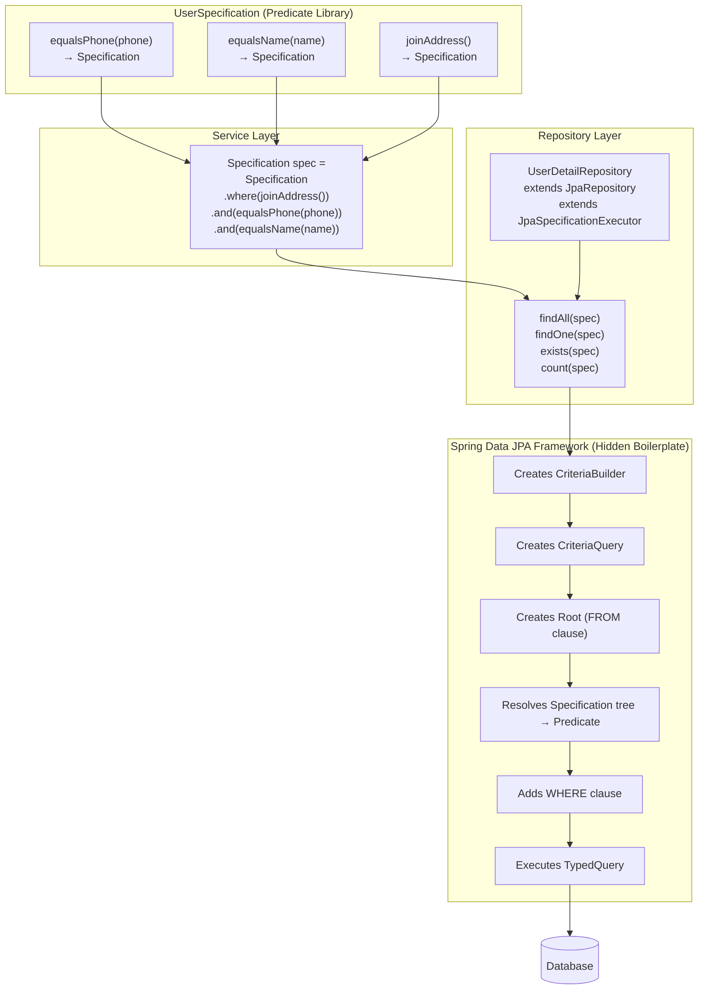
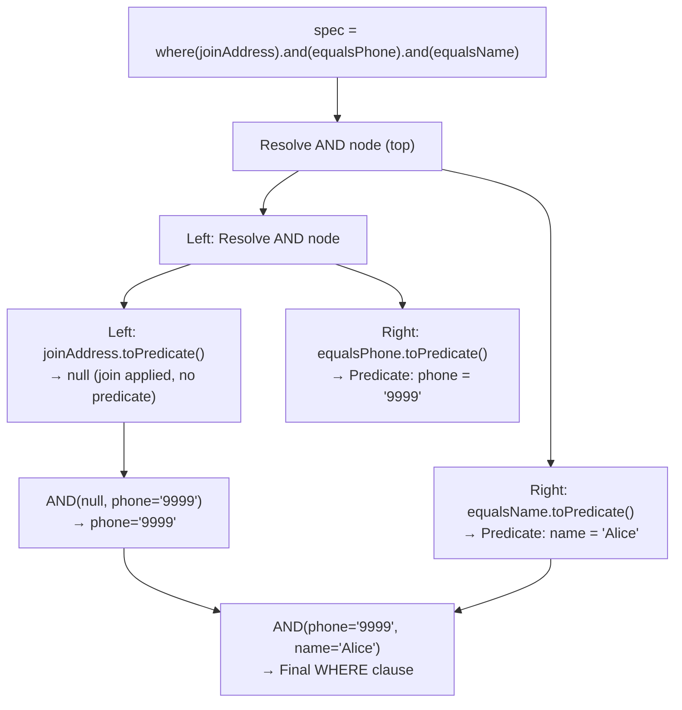
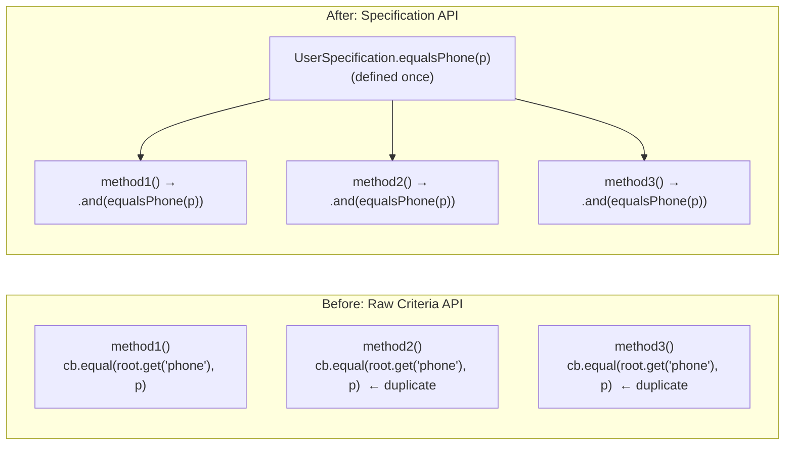
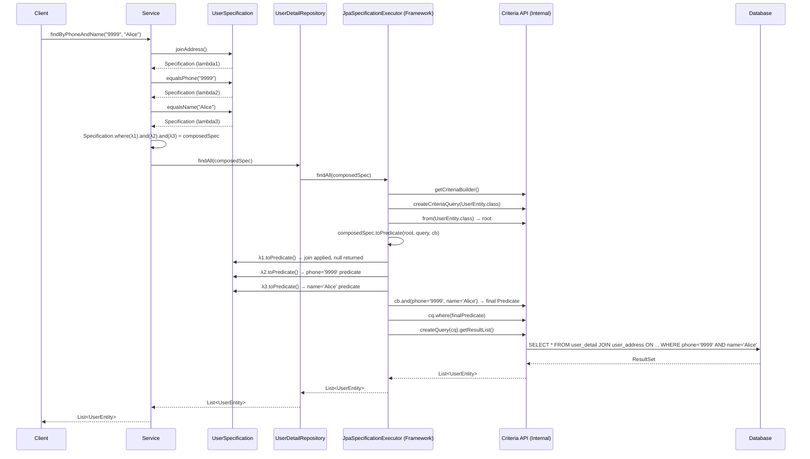
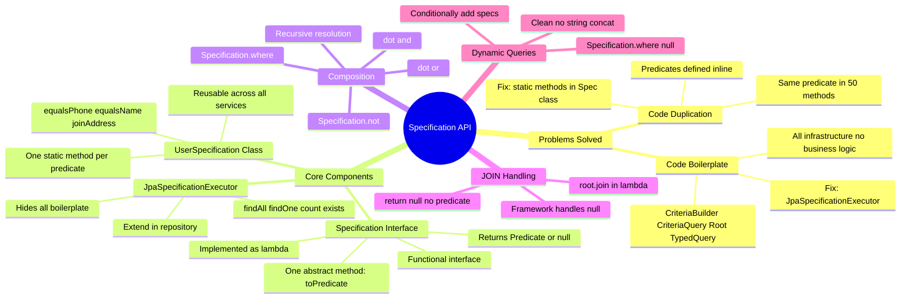

# 📌 JPA Specification API

> [!IMPORTANT]
> This guide assumes familiarity with JPA **Criteria API** (how to create a `CriteriaBuilder`, `CriteriaQuery`, `Root`, and `Predicate`). It also assumes knowledge of Java **Functional Interfaces** and **Lambda Expressions**, as the Specification API is built entirely on top of them. Brief recaps are included below to keep these notes self-contained.

---

## Overview

The **Specification API** is a Spring Data JPA feature that provides a cleaner, more maintainable alternative to the raw Criteria API for building dynamic, type-safe queries programmatically. It is built on top of the JPA `Criteria API` internally, but it hides all the boilerplate object creation and solves the code duplication problem by allowing individual query conditions (`Predicate`s) to be extracted into reusable, composable units called **Specifications**.

---

## Why This Concept Exists

The raw **Criteria API** has two significant problems in practice:

### Problem 1 — Code Duplication

When writing Criteria API queries, you create `Predicate` objects for your WHERE conditions directly inside each repository/service method. The same predicate (e.g., "phone equals X", "name equals Y") may be needed in many different methods across many different classes. Since predicates are defined inline, the same condition logic gets **copy-pasted** across the codebase.

**Example:** If you have 50 different query methods that all filter by phone number, you would write the same `cb.equal(root.get("phone"), phoneNumber)` predicate 50 times — in 50 different places. If the field name changes, you must update it in 50 places.

### Problem 2 — Code Boilerplate

Every Criteria API query requires creating several infrastructure objects just to run a query:

```java
CriteriaBuilder cb = entityManager.getCriteriaBuilder();
CriteriaQuery<UserEntity> cq = cb.createQuery(UserEntity.class);
Root<UserEntity> root = cq.from(UserEntity.class);
// ... add predicates, where clause, order by, etc.
TypedQuery<UserEntity> typedQuery = entityManager.createQuery(cq);
List<UserEntity> result = typedQuery.getResultList();
```

None of this is **business logic**. Your actual business concern is: *from which table, with which join, and with which conditions?* Everything else is infrastructure ceremony. This infrastructure code must be repeated in every method, making the codebase verbose.

---

## How Specification API Solves These Problems

| Problem | Solution |
|---|---|
| Code Duplication | Extract each `Predicate` into a named static method in a dedicated `UserSpecification` class. Any method anywhere can call it by name — no copy-paste. |
| Code Boilerplate | Extend the repository with `JpaSpecificationExecutor<T>`. This interface provides `findAll(Specification)`, `findOne(Specification)`, etc., and internally handles all object creation (`CriteriaBuilder`, `CriteriaQuery`, `Root`, `TypedQuery`). |

---

## Prerequisites

### Functional Interface Recap

A **functional interface** is an interface with exactly **one abstract method**. It can be implemented using a **lambda expression**.

```java
@FunctionalInterface
interface MyCondition {
    boolean check(int value);
}

// Lambda implementation
MyCondition isPositive = (value) -> value > 0;
```

### The `Specification<T>` Interface

`Specification<T>` is a Spring Data JPA functional interface with **one abstract method**: `toPredicate()`.

```java
public interface Specification<T> {
    Predicate toPredicate(Root<T> root, CriteriaQuery<?> query, CriteriaBuilder criteriaBuilder);
}
```

| Parameter | Type | Description |
|---|---|---|
| `root` | `Root<T>` | Represents the entity being queried. Used to access fields: `root.get("fieldName")`. Also used to perform joins: `root.join("relationshipField")`. |
| `query` | `CriteriaQuery<?>` | Represents the query being built. Used for ordering and grouping. |
| `criteriaBuilder` | `CriteriaBuilder` | Factory for creating `Predicate` objects: `cb.equal(...)`, `cb.like(...)`, `cb.and(...)`, etc. |
| **Returns** | `Predicate` | The WHERE condition this Specification contributes. Return `null` if no condition is needed (e.g., join-only specifications). |

Since `Specification<T>` is a functional interface, it can be implemented as a **lambda expression**.

---

## Definition

> A **Specification** is a reusable, composable unit that encapsulates a single query condition (a `Predicate`) for a JPA entity. Multiple specifications can be combined using `and()`, `or()`, and `not()` to build complex queries without duplicating predicate logic or writing boilerplate infrastructure code.

---

## Real-World Analogy

Think of building a search filter for an e-commerce site.

- **Without Specification API (raw Criteria):** Every search endpoint rewrites the same filter logic — "price > X", "category = Y", "brand = Z" — from scratch in every controller/service method, duplicating code everywhere.
- **With Specification API:** You define reusable filter "lego bricks" — `PriceGreaterThan(x)`, `CategoryEquals(y)`, `BrandEquals(z)`. Any part of your application picks up these bricks and snaps them together: `PriceGreaterThan(100).and(CategoryEquals("Electronics"))`. The bricks are defined once, reused everywhere.

---

## Architecture



---

## Step-by-Step Implementation

### Step 1 — Extend the Repository with `JpaSpecificationExecutor`

```java
import org.springframework.data.jpa.repository.JpaRepository;
import org.springframework.data.jpa.repository.JpaSpecificationExecutor;

public interface UserDetailRepository
        extends JpaRepository<UserEntity, Long>,
                JpaSpecificationExecutor<UserEntity> {
    // No additional methods needed
    // JpaSpecificationExecutor provides: findAll, findOne, count, exists
}
```

> [!IMPORTANT]
> The repository must extend **both** `JpaRepository<T, ID>` (for standard CRUD) and `JpaSpecificationExecutor<T>` (for specification-based queries). Both are interfaces — Java allows multiple interface inheritance.

---

### Step 2 — Create a Specification Class

Create a dedicated class (conventionally named `<Entity>Specification`) with one **static method per predicate**. Each method returns a `Specification<T>`, implemented as a lambda expression.

```java
import org.springframework.data.jpa.domain.Specification;
import jakarta.persistence.criteria.*;

public class UserSpecification {

    /**
     * Condition: WHERE phone = :phone
     */
    public static Specification<UserEntity> equalsPhone(String phone) {
        return (root, query, cb) -> cb.equal(root.get("phone"), phone);
    }

    /**
     * Condition: WHERE name = :name
     */
    public static Specification<UserEntity> equalsName(String name) {
        return (root, query, cb) -> cb.equal(root.get("name"), name);
    }

    /**
     * Join-only: JOIN user_address (no WHERE condition added)
     * Returns null — signals to JPA framework: no predicate, just apply the join.
     */
    public static Specification<UserEntity> joinAddress() {
        return (root, query, cb) -> {
            root.join("userAddress", JoinType.INNER); // modifies root with a join
            return null; // no WHERE condition from this specification
        };
    }
}
```

#### Lambda Expression Breakdown

```java
(root, query, cb) -> cb.equal(root.get("phone"), phone)
│                    │
│                    └── Implementation of Specification.toPredicate(root, query, cb)
│
└── Parameters matching toPredicate's signature:
    root  → Root<UserEntity>
    query → CriteriaQuery<?>
    cb    → CriteriaBuilder
```

The lambda is the implementation of the single abstract method `toPredicate(...)` of the `Specification<T>` functional interface.

---

### Step 3 — Combine Specifications in the Service Layer

```java
import org.springframework.data.jpa.domain.Specification;
import org.springframework.stereotype.Service;

@Service
public class UserDetailService {

    private final UserDetailRepository userDetailRepository;

    public UserDetailService(UserDetailRepository userDetailRepository) {
        this.userDetailRepository = userDetailRepository;
    }

    public List<UserEntity> findUsers(String phone, String name) {

        Specification<UserEntity> spec = Specification
                .where(UserSpecification.joinAddress())        // JOIN user_address
                .and(UserSpecification.equalsPhone(phone))    // AND phone = ?
                .and(UserSpecification.equalsName(name));     // AND name = ?

        return userDetailRepository.findAll(spec);
    }
}
```

---

## Internal Working — How JPA Resolves the Specification Tree

When you call `userDetailRepository.findAll(spec)`, Spring Data JPA internally executes logic equivalent to this (the boilerplate that `JpaSpecificationExecutor` hides from you):

```java
// What Spring Data JPA does internally inside findAll(Specification spec):
CriteriaBuilder cb = entityManager.getCriteriaBuilder();
CriteriaQuery<UserEntity> cq = cb.createQuery(UserEntity.class);
Root<UserEntity> root = cq.from(UserEntity.class);

// Resolve the Specification tree into a Predicate
Predicate predicate = spec.toPredicate(root, cq, cb);

if (predicate != null) {
    cq.where(predicate);
}

TypedQuery<UserEntity> typedQuery = entityManager.createQuery(cq);
List<UserEntity> result = typedQuery.getResultList();
```

### Resolving `and()` Chains (Recursive)

When you call `.and(anotherSpec)`, the `Specification` interface provides a **default method** that creates a composed specification:

```java
// Default method in Specification interface (Spring Data source)
default Specification<T> and(Specification<T> other) {
    return (root, query, cb) -> {
        Predicate left  = this.toPredicate(root, query, cb);   // resolve left
        Predicate right = other.toPredicate(root, query, cb);  // resolve right

        // Handle nulls (join-only specs return null)
        if (left == null)  return right;
        if (right == null) return left;
        return cb.and(left, right);   // combine into AND predicate
    };
}
```

This is **recursive composition**: each `.and()` creates a new `Specification` that resolves both its left and right children before combining them. The tree is resolved depth-first when `toPredicate` is finally called by the framework.



---

## Full Code Example

### Entity

```java
@Entity
@Table(name = "user_detail")
public class UserEntity {

    @Id
    @GeneratedValue(strategy = GenerationType.IDENTITY)
    private Long id;

    private String name;
    private String phone;

    @OneToOne(cascade = CascadeType.ALL)
    @JoinColumn(name = "address_id")
    private UserAddress userAddress;

    // getters, setters, constructors
}
```

### Repository

```java
public interface UserDetailRepository
        extends JpaRepository<UserEntity, Long>,
                JpaSpecificationExecutor<UserEntity> {
}
```

### Specification Class

```java
public class UserSpecification {

    // Condition: phone = :phone
    public static Specification<UserEntity> equalsPhone(String phone) {
        return (root, query, cb) -> cb.equal(root.get("phone"), phone);
    }

    // Condition: name = :name
    public static Specification<UserEntity> equalsName(String name) {
        return (root, query, cb) -> cb.equal(root.get("name"), name);
    }

    // Join user_address table — no WHERE condition
    public static Specification<UserEntity> joinAddress() {
        return (root, query, cb) -> {
            root.join("userAddress", JoinType.INNER);
            return null;
        };
    }

    // Condition: name LIKE %:keyword%
    public static Specification<UserEntity> nameLike(String keyword) {
        return (root, query, cb) -> cb.like(root.get("name"), "%" + keyword + "%");
    }

    // Condition: phone IS NOT NULL
    public static Specification<UserEntity> phoneIsNotNull() {
        return (root, query, cb) -> cb.isNotNull(root.get("phone"));
    }
}
```

### Service

```java
@Service
public class UserDetailService {

    private final UserDetailRepository userDetailRepository;

    public UserDetailService(UserDetailRepository repo) {
        this.userDetailRepository = repo;
    }

    // Find users where phone = ? AND name = ? AND joined with address
    public List<UserEntity> findByPhoneAndName(String phone, String name) {
        Specification<UserEntity> spec = Specification
                .where(UserSpecification.joinAddress())
                .and(UserSpecification.equalsPhone(phone))
                .and(UserSpecification.equalsName(name));

        return userDetailRepository.findAll(spec);
    }

    // Find users where name LIKE ? AND phone is not null
    public List<UserEntity> searchByName(String keyword) {
        Specification<UserEntity> spec = Specification
                .where(UserSpecification.nameLike(keyword))
                .and(UserSpecification.phoneIsNotNull());

        return userDetailRepository.findAll(spec);
    }

    // Dynamic search — conditions added only if values are provided
    public List<UserEntity> dynamicSearch(String phone, String name) {
        Specification<UserEntity> spec = Specification.where(null);

        if (phone != null && !phone.isBlank()) {
            spec = spec.and(UserSpecification.equalsPhone(phone));
        }
        if (name != null && !name.isBlank()) {
            spec = spec.and(UserSpecification.equalsName(name));
        }

        return userDetailRepository.findAll(spec);
    }
}
```

### Controller

```java
@RestController
@RequestMapping("/users")
public class UserController {

    @Autowired
    private UserDetailService userDetailService;

    @GetMapping("/search")
    public List<UserEntity> search(
            @RequestParam(required = false) String phone,
            @RequestParam(required = false) String name) {
        return userDetailService.dynamicSearch(phone, name);
    }
}
```

---

## `JpaSpecificationExecutor` — Available Methods

When your repository extends `JpaSpecificationExecutor<T>`, the following methods become available:

```java
// Find all matching records
List<T> findAll(Specification<T> spec);

// Find all matching records with pagination
Page<T> findAll(Specification<T> spec, Pageable pageable);

// Find all matching records with sorting
List<T> findAll(Specification<T> spec, Sort sort);

// Find one matching record (throws exception if more than one match)
Optional<T> findOne(Specification<T> spec);

// Count matching records
long count(Specification<T> spec);

// Check if any record matches
boolean exists(Specification<T> spec);
```

> [!NOTE]
> All object creation (`CriteriaBuilder`, `CriteriaQuery`, `Root`, `TypedQuery`) is handled internally by the framework when you call any of these methods. You provide only the `Specification` (the business conditions). Everything else is done for you.

---

## Specification Composition Methods

The `Specification<T>` interface provides default methods for combining specifications:

| Method | Description | SQL Equivalent |
|---|---|---|
| `Specification.where(spec)` | Starting point — wraps a specification (handles null gracefully) | `WHERE ...` |
| `.and(otherSpec)` | Combines two specifications with AND | `... AND ...` |
| `.or(otherSpec)` | Combines two specifications with OR | `... OR ...` |
| `Specification.not(spec)` | Negates a specification | `NOT (...)` |

### Example — OR Condition

```java
Specification<UserEntity> spec = Specification
        .where(UserSpecification.equalsPhone("9999"))
        .or(UserSpecification.equalsName("Alice"));

// Generated WHERE: WHERE phone = '9999' OR name = 'Alice'
```

### Example — NOT Condition

```java
Specification<UserEntity> spec = Specification
        .not(UserSpecification.equalsName("Alice"));

// Generated WHERE: WHERE NOT (name = 'Alice')
```

### Example — Complex Combination

```java
Specification<UserEntity> spec = Specification
        .where(UserSpecification.equalsName("Alice"))
        .and(
            UserSpecification.equalsPhone("9999")
                .or(UserSpecification.phoneIsNotNull())
        );

// Generated WHERE: WHERE name = 'Alice' AND (phone = '9999' OR phone IS NOT NULL)
```

---

## Handling JOIN in Specifications

The `Specification` interface is designed primarily for **WHERE conditions (predicates)**. JOIN operations are a secondary concern but can be handled through a workaround.

### The Join Workaround

When you need to join a related table:

```java
public static Specification<UserEntity> joinAddress() {
    return (root, query, cb) -> {
        root.join("userAddress", JoinType.INNER); // Applies join to the root
        return null; // Return null — no WHERE condition from this spec
    };
}
```

**Why `null` is returned:**
- Returning `null` from `toPredicate()` signals to the framework: "apply the effect of this specification (the join) but add no WHERE condition."
- The framework's `and()` implementation correctly handles `null` predicates — if either side is `null`, it uses only the non-null side.

> [!NOTE]
> `cb.conjunction()` is another option — it generates `WHERE 1=1` (always true). However, returning `null` is the cleaner approach. JPA's framework code handles `null` predicates gracefully and does not add any condition for them.

> [!CAUTION]
> **Limitation:** Specification API is fundamentally designed for predicate composition. Complex join strategies or queries that require structural changes to the SELECT clause (e.g., projections, GROUP BY) are better handled with raw Criteria API or JPQL `@Query`. Specification API shines for dynamic WHERE clause composition.

---

## Criteria API vs Specification API — Comparison

| Aspect | Raw Criteria API | Specification API |
|---|---|---|
| Boilerplate | High — must create CB, CQ, Root, TypedQuery every time | None — hidden by `JpaSpecificationExecutor` |
| Code duplication | High — predicates defined inline, duplicated across methods | None — predicates in reusable static methods |
| Reusability | Low — conditions are method-local | High — conditions are named, shared methods |
| Readability | Low — verbose infrastructure code mixes with business logic | High — reads like: `where(condition1).and(condition2)` |
| Dynamic queries | Supported but verbose | Supported and clean |
| JOIN support | Full support | Limited — join workaround needed |
| Complex projections | Supported | Not ideal |
| Composability | Manual `cb.and(p1, p2, ...)` | Built-in `.and()`, `.or()`, `.not()` |
| Setup effort | None extra | Extend `JpaSpecificationExecutor` + create Specification class |

---

## Diagram — Code Duplication: Before and After



---

## Memory and Execution Flow



---

## Key Observations

1. **`Specification<T>` is a functional interface.** It has one abstract method: `toPredicate(root, query, cb)`. This means it can be implemented with a lambda expression — one lambda = one specification.

2. **Each static method in the Specification class = one reusable predicate.** Define it once, use it in any number of queries across any number of classes.

3. **`JpaSpecificationExecutor` eliminates all boilerplate.** You never write `CriteriaBuilder`, `CriteriaQuery`, or `TypedQuery` yourself. The framework creates all of these internally.

4. **Returning `null` from `toPredicate()` is valid and means "no condition."** This is used for join-only specifications. The framework's composition methods (`and()`, `or()`) handle `null` correctly.

5. **Specifications are composable.** `.and()`, `.or()`, and `.not()` are built-in default methods on the `Specification` interface. They build a tree of specifications that is resolved recursively when `toPredicate()` is called.

6. **Dynamic queries are trivially easy.** Add or skip a specification based on whether a filter value is present. No if/else inside query-building code or string concatenation needed.

7. **Specification API is primarily for WHERE conditions.** JOINs require a workaround (mutate the `root`, return `null`). For complex projections or GROUP BY, Criteria API or JPQL is more appropriate.

---

## Common Mistakes

### Mistake 1 — Forgetting to Extend `JpaSpecificationExecutor`

```java
// WRONG — findAll(Specification) method not available
public interface UserDetailRepository extends JpaRepository<UserEntity, Long> {}

// CORRECT
public interface UserDetailRepository
        extends JpaRepository<UserEntity, Long>,
                JpaSpecificationExecutor<UserEntity> {}
```

---

### Mistake 2 — Defining Predicates Inline (Defeats the Purpose)

```java
// WRONG — predicate defined inline, not reusable
public List<UserEntity> findByPhone(String phone) {
    Specification<UserEntity> spec = (root, query, cb) ->
            cb.equal(root.get("phone"), phone); // defined here, can't reuse
    return repo.findAll(spec);
}

// CORRECT — predicate in dedicated Specification class
public List<UserEntity> findByPhone(String phone) {
    return repo.findAll(Specification.where(UserSpecification.equalsPhone(phone)));
}
```

---

### Mistake 3 — Using DB Column Names Instead of Entity Field Names

```java
// WRONG — "phone_number" is the DB column name
(root, query, cb) -> cb.equal(root.get("phone_number"), phone)

// CORRECT — "phone" is the Java entity field name
(root, query, cb) -> cb.equal(root.get("phone"), phone)
```

> [!WARNING]
> `root.get("fieldName")` expects the **Java field name** of the entity class, not the database column name. Using the column name (`phone_number`) will throw a `IllegalArgumentException` at runtime.

---

### Mistake 4 — Not Handling `null` Values in Dynamic Queries

```java
// WRONG — if phone is null, cb.equal(root.get("phone"), null) produces unexpected SQL
public List<UserEntity> find(String phone) {
    return repo.findAll(Specification.where(UserSpecification.equalsPhone(phone)));
}

// CORRECT — guard against null before adding the specification
public List<UserEntity> find(String phone) {
    Specification<UserEntity> spec = Specification.where(null);
    if (phone != null) {
        spec = spec.and(UserSpecification.equalsPhone(phone));
    }
    return repo.findAll(spec);
}
```

---

### Mistake 5 — Trying to Return a Meaningful Predicate from a Join-Only Spec

```java
// PROBLEMATIC — cb.conjunction() adds WHERE 1=1 to every query
public static Specification<UserEntity> joinAddress() {
    return (root, query, cb) -> {
        root.join("userAddress");
        return cb.conjunction(); // adds "WHERE 1=1" — unnecessary
    };
}

// CORRECT — return null; framework handles it gracefully
public static Specification<UserEntity> joinAddress() {
    return (root, query, cb) -> {
        root.join("userAddress");
        return null;
    };
}
```

---

## Best Practices

1. **Create one `<Entity>Specification` class per entity.** Keep all predicates for `UserEntity` in `UserSpecification`, all predicates for `OrderEntity` in `OrderSpecification`, etc.

2. **Make all specification methods `static`.** This allows calling them without creating an instance: `UserSpecification.equalsPhone(phone)`.

3. **Name methods descriptively after the business condition** they represent (`equalsPhone`, `nameLike`, `activeOnly`, `olderThan`), not after technical details (`phoneEqualsCbEqual`).

4. **Use Specification API for dynamic queries** where filter conditions change at runtime based on user input (search forms, API filter parameters). It is the cleanest solution for this use case.

5. **Start with `Specification.where(null)`** when building dynamic queries conditionally. `where(null)` returns a no-op specification, and `.and(...)` chaining on it works correctly even if no conditions are ever added.

6. **Combine with `Pageable` and `Sort`** using `findAll(spec, pageable)` for production-grade paginated, sorted, filtered endpoints.

7. **Reserve raw Criteria API** for cases where Specification API is insufficient — complex projections, GROUP BY / HAVING, subqueries, or very complex JOIN strategies.

---

## Interview Notes

### Frequently Asked Questions

**Q: What is the Specification API in Spring Data JPA?**

A: Specification API is a Spring Data JPA feature that wraps the JPA Criteria API to provide reusable, composable query conditions (predicates). Each `Specification<T>` represents one condition. Specifications can be combined with `.and()`, `.or()`, and `.not()`. The repository's `JpaSpecificationExecutor` executes them without any boilerplate.

**Q: What are the two main problems with Criteria API that Specification API solves?**

A: (1) **Code duplication** — predicates are defined inline and duplicated across methods/classes. Specification API extracts predicates into reusable static methods. (2) **Code boilerplate** — every Criteria API query requires creating `CriteriaBuilder`, `CriteriaQuery`, `Root`, and `TypedQuery`. `JpaSpecificationExecutor` hides all of this.

**Q: What is the `toPredicate()` method?**

A: It is the single abstract method of the `Specification<T>` functional interface. It accepts `Root<T>`, `CriteriaQuery<?>`, and `CriteriaBuilder`, and returns a `Predicate`. It is implemented using a lambda expression. The framework calls this method when building the final query.

**Q: Why can `toPredicate()` return `null`?**

A: Returning `null` signals that this specification contributes no WHERE condition. It is used for join-only specifications, where you want to apply a JOIN to the query but add no predicate. The framework's `and()` and `or()` methods handle `null` correctly — they use only the non-null predicate.

**Q: How do you perform a JOIN using Specification API?**

A: By calling `root.join("relationshipFieldName", JoinType.INNER)` inside the lambda, and returning `null` for the predicate. This is a workaround since Specification API is designed for predicates, not structural query changes.

**Q: What does `JpaSpecificationExecutor` provide?**

A: It provides `findAll(Specification)`, `findAll(Specification, Pageable)`, `findAll(Specification, Sort)`, `findOne(Specification)`, `count(Specification)`, and `exists(Specification)` — all without any boilerplate object creation on the developer's part.

**Q: How is dynamic filtering implemented cleanly with Specification API?**

A: Start with `Specification.where(null)`, then conditionally chain `.and(spec)` calls based on whether filter values are present. Null-safe and clean, with no string concatenation or large if/else blocks.

---

## Mind Map



---

## Practice Questions

### Easy

1. What are the two main problems with raw Criteria API that the Specification API addresses?
2. What interface must a repository extend to use Specification API? What does it provide?
3. What is the single abstract method in the `Specification<T>` interface? What are its three parameters?
4. Why is `Specification<T>` considered a functional interface? How is it typically implemented?
5. What does returning `null` from `toPredicate()` mean?

### Medium

6. Write a `UserSpecification` class with three static methods: `equalsName(String name)`, `phoneIsNotNull()`, and `nameLike(String keyword)`. Show how to combine all three in a service using `.and()`.
7. Write a dynamic search method in a service that accepts optional `name` and `phone` parameters and adds specifications only if the values are non-null and non-blank.
8. How would you perform a JOIN between `UserEntity` and `UserAddress` using Specification API? Why must you return `null` from the predicate?
9. How do you use pagination and sorting with Specification API? Write an example.
10. Compare `Specification.where(null).and(spec)` vs `Specification.where(spec)`. What is the difference in behavior?

### Hard

11. Explain how `.and(otherSpec)` works internally. Describe the recursive resolution of a specification tree for `where(joinAddress).and(equalsPhone).and(equalsName)`. Show which predicates are resolved in what order.
12. You have a search form with five optional fields: `name`, `phone`, `email`, `city`, and `minAge`. Design a complete solution using Specification API — the `UserSpecification` class with all five specifications, and a service method that dynamically builds the query based on which fields are filled in by the user.
13. Discuss the limitations of Specification API compared to raw Criteria API. In which scenarios would you choose Criteria API over Specification API despite the extra boilerplate?

---

## Summary

- **Specification API** solves two raw Criteria API problems: **code duplication** (predicates repeated across methods) and **code boilerplate** (infrastructure object creation in every query).

- **`Specification<T>`** is a functional interface with one abstract method `toPredicate(root, query, cb)`. Each lambda that implements it represents one reusable query condition.

- **Create a `<Entity>Specification` class** with one `static` method per predicate. Any part of the codebase calls these methods by name — no duplication.

- **Extend the repository** with `JpaSpecificationExecutor<T>`. This provides `findAll(spec)`, `findOne(spec)`, `count(spec)`, and `exists(spec)` — all boilerplate is hidden inside the framework.

- **Compose specifications** using `Specification.where(spec1).and(spec2).or(spec3).not(spec4)`. These are default methods on the `Specification` interface that build a tree resolved recursively.

- **For JOINs**, mutate the `root` inside the lambda and return `null`. This is a workaround — Specification API is designed for predicates (WHERE conditions), not structural changes.

- **For dynamic queries**, start with `Specification.where(null)` and conditionally chain `.and(spec)` calls. `null` is handled gracefully by the framework.

- **Specification API is not a replacement for JPQL or Criteria API** in all cases. Complex projections, GROUP BY, HAVING, and intricate join strategies are still better served by those mechanisms.
