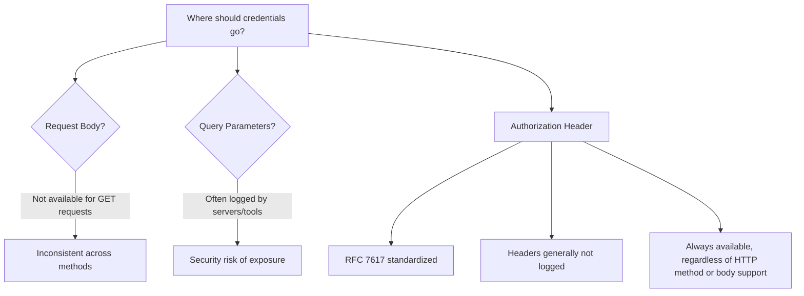
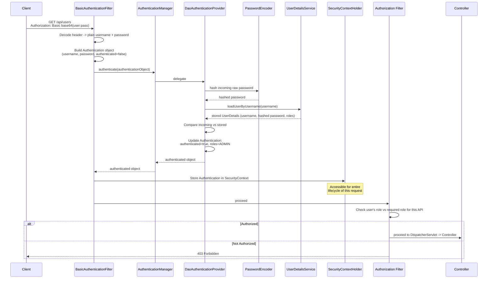
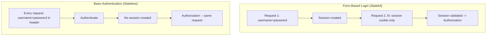
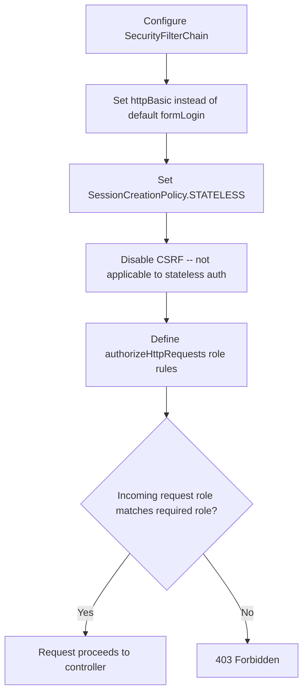
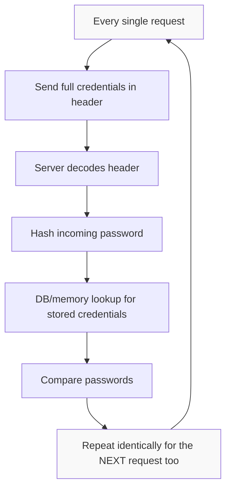

# Spring Boot Security — Basic Authentication

> A complete study guide covering HTTP Basic Authentication: how it works, the Authorization header format, why headers are used for credentials, the full internal filter flow, implementation, and its disadvantages compared to JWT.

---

## Table of Contents

1. [Overview: Basic Authentication vs. Form Login](#-overview-basic-authentication-vs-form-login)
2. [The Authorization Header Format](#-the-authorization-header-format)
3. [Why Credentials Go in the Header (Not Body or Query Params)](#-why-credentials-go-in-the-header-not-body-or-query-params)
4. [Internal Working: The Full Authentication Flow](#-internal-working-the-full-authentication-flow)
5. [Implementation](#-implementation)
6. [Disadvantages of Basic Authentication](#-disadvantages-of-basic-authentication)
7. [Final Comparison Tables](#-final-comparison-tables)
8. [Practice Questions](#-practice-questions-overall)
9. [Overall Summary](#-overall-summary-revision-bullets)

---

# 📌 Overview: Basic Authentication vs. Form Login

## Overview

**Basic Authentication** is the next authentication method covered after form-login authentication. Unlike form login (which is **stateful**), Basic Authentication is a **stateless** authentication method — the server does not maintain any authentication state (no session) between requests.

## Why This Concept Exists

Different applications have different needs: some benefit from maintaining a session (form login), while others — particularly simple APIs, machine-to-machine communication, or clients that don't want to manage cookies/sessions — benefit from a stateless model where every single request carries its own proof of identity. Basic Authentication exists as the simplest possible implementation of this stateless model.

## Definition

**Stateless authentication** means the server does **not** maintain any record of a user's authentication state between requests — no session is created or stored server-side. Each request must independently prove the caller's identity.

**Basic Authentication** requires the client to pass the username and password with **every single request** — if you access a resource 100 times, you must supply the username and password on all 100 requests. As the name suggests, it is deliberately simple ("basic").

## Real-World Analogy

Think of form-login authentication like getting a wristband at a festival entrance (you show ID once, then flash the wristband for every subsequent entry). Basic Authentication, by contrast, is like having to show your full ID card at *every single* checkpoint inside the venue, every single time — no wristband is ever issued; you always present your raw credentials directly, no matter how many times you need to pass through.

## Key Observations

- Basic Authentication is **stateless** — no session is maintained by the server.
- Credentials must be resent on **every** request.
- It builds conceptually on form-login authentication, and understanding form login first makes Basic Authentication much easier to follow, since much of the underlying flow (authentication object creation, delegation to `AuthenticationManager`, etc.) is shared between the two.

## Related Concepts

- Form-based (stateful) authentication (the prerequisite topic)
- [JWT](#-disadvantages-of-basic-authentication) (the next topic, motivated by Basic Authentication's disadvantages)

## Practice Questions

**Easy:** Is Basic Authentication stateful or stateless?

**Medium:** What is the key practical difference in what the client must do on every request, between form login and Basic Authentication?

## Summary

- Basic Authentication is a **stateless** authentication method — no session is maintained.
- The client must send its username and password on **every** request.
- It builds on the same underlying authentication flow used in form-login authentication.

---

# 📌 The Authorization Header Format

## Overview

In Basic Authentication, the client transmits its username and password using a specifically formatted value inside the HTTP **`Authorization`** request header.

## Definition

The header value follows this exact structure:

```
Authorization: Basic <Base64Encode(username:password)>
```

## Syntax Breakdown

| Part | Meaning |
|---|---|
| `Authorization` | The name of the HTTP header used to carry the credentials. |
| `Basic` | A literal keyword indicating that Basic Authentication is the scheme being used. |
| `<Base64Encode(username:password)>` | The actual username and password, joined together with a colon (`:`) separator, and then encoded using **Base64**. |

> [!IMPORTANT]
> This value is **Base64-encoded, not encrypted**. Base64 encoding is a reversible, non-secret transformation — anyone who intercepts this header can trivially **decode** it back into the plain `username:password` string. It provides no actual confidentiality on its own.

## Real-World Analogy

Base64 encoding here is like writing your password in a very common, publicly-known secret code (e.g., simple letter-substitution) rather than a truly secure lock. Anyone who knows the (extremely well-known) decoding rule — which is essentially everyone, since Base64 is a universal, public standard — can read your original message instantly. It is not designed to keep secrets from an active eavesdropper; it is purely a way to safely represent binary/text data within header-compatible characters.

## Internal Working

When a request carrying this header arrives at the server, Spring Security's **`BasicAuthenticationFilter`** is the first filter invoked. It:

1. Reads the `Authorization` header from the incoming request.
2. Extracts and Base64-**decodes** the value following `Basic `.
3. Splits the decoded string on the `:` separator to recover the plain username and plain password.

## Code Example (Conceptual Header Value)

```
Authorization: Basic dXNlcjpwYXNz
```

**Line-by-Line Explanation:**
- `Basic` tells the server which authentication scheme is being used.
- `dXNlcjpwYXNz` is the Base64-encoded form of the literal string `user:pass` — decoding it yields the username `user` and the password `pass`, separated by a colon.

## Output (After Decoding)

```
Decoded value: user:pass
  -> username = user
  -> password = pass
```

## Key Observations

- The credentials are always sent in **encoded**, not encrypted, form.
- Because Base64 is trivially reversible, Basic Authentication is only ever considered acceptable when the connection itself is secured via **HTTPS/TLS** — the encryption protecting the credentials in transit comes entirely from the transport layer (HTTPS), not from anything in the Basic Auth scheme itself.

## Common Mistakes

> [!WARNING]
> Assuming Base64 encoding provides any meaningful security. It does not — it is purely a data-representation format. If someone intercepts the raw request (e.g., over plain HTTP), they can decode the username and password in seconds.

## Best Practices

- **Never use Basic Authentication over plain HTTP.** Always enforce HTTPS when using Basic Authentication, since the credentials are only encoded (trivially reversible), not encrypted.

## Interview Notes

- **Q: Is the Base64-encoded credential in a Basic Auth header encrypted?** No — it is only encoded, which is easily and quickly reversible; it provides no confidentiality by itself.
- **Q: Why must Basic Authentication always be used over HTTPS?** Because the transport-layer encryption from HTTPS is the *only* thing actually protecting the credentials in transit — the Base64 encoding itself offers no real protection against interception.

## Related Concepts

- [Why Credentials Go in the Header](#-why-credentials-go-in-the-header-not-body-or-query-params)
- [Internal Working: The Full Authentication Flow](#-internal-working-the-full-authentication-flow) (where `BasicAuthenticationFilter` decodes this header)

## Practice Questions

**Easy:** What Basic encoding scheme is used for the username:password pair in the Authorization header?

**Medium:** Why is it critically important to never use Basic Authentication over plain HTTP?

**Hard:** Explain precisely why Base64 encoding provides no meaningful security against an eavesdropper, and what actually protects the credentials in a real-world Basic Authentication deployment.

## Summary

- Format: `Authorization: Basic <Base64Encode(username:password)>`.
- Base64 is **encoding, not encryption** — trivially reversible by anyone who intercepts it.
- Must always be used over HTTPS, never plain HTTP.
- `BasicAuthenticationFilter` is responsible for reading and decoding this header on the server side.

---

# 📌 Why Credentials Go in the Header (Not Body or Query Params)

## Overview

A natural question is: why must credentials be sent specifically in the `Authorization` **header**, rather than in the request body or as query parameters? Three main reasons are given: standardization, security, and universal support across all HTTP methods.

## Reason 1 — Standardization

### Explanation

Without a single agreed-upon convention, different clients might each choose a different place to send credentials — one client in the request body, another in a query parameter, another in a header — making it extremely difficult for servers and frameworks to handle all clients consistently.

> [!NOTE]
> This is formally standardized by **RFC 7617**, part of the broader HTTP standardization effort, which specifies that Basic Authentication credentials must be passed via the header. This universally accepted standard is what allows frameworks (like Spring Security) to be built consistently on top of it, working reliably across arbitrary clients and APIs.

## Reason 2 — Security

### Explanation

Many web servers and infrastructure components **log request bodies and query parameters** — often for debugging or analytics purposes. If credentials were sent in the body or as query parameters, they could easily end up captured in these logs.

> [!WARNING]
> Logging tools used by a company are sometimes **third-party** tools, not fully controlled in-house. If a username and password were logged as part of a request body or query string, this would constitute a serious security breach, since that data might now be visible to systems and parties well beyond the original request's intended scope.

By contrast, **headers are generally not logged** by default in most systems — using the `Authorization` header therefore significantly reduces the risk of accidental credential exposure through routine logging practices.

## Reason 3 — Support for All HTTP Request Types

### Explanation

- `POST` and `PUT` requests naturally have a request **body**, so credentials *could* technically be placed there.
- `GET` requests, however, **generally do not have a body** at all.
- Headers, on the other hand, are **always available** regardless of the HTTP method being used or whether the API accepts a body or query parameters.

Using the header therefore provides a single, **consistent mechanism** for passing credentials that works uniformly across every HTTP method — `GET`, `POST`, `PUT`, `DELETE`, and so on — without needing special-case handling depending on the request type.

## Diagram — Why Headers Win



## Key Observations

- **Standardization** (RFC 7617) ensures universal, framework-friendly consistency across clients and APIs.
- **Security**: headers are typically excluded from logging, unlike request bodies and query parameters.
- **Universality**: headers work identically across all HTTP methods, including `GET` requests that lack a body.

## Common Mistakes

> [!WARNING]
> Passing sensitive credentials via query parameters is a common anti-pattern — query parameters are frequently logged (e.g., in server access logs, browser history, or proxy logs), creating an easily overlooked but serious credential-exposure risk.

## Best Practices

- Always use the `Authorization` header for credentials, in line with RFC 7617 and standard HTTP practice.
- Avoid ever placing sensitive authentication data in a request body or query parameters, precisely because of the increased logging exposure risk.

## Interview Notes

- **Q: What RFC standardizes placing Basic Auth credentials in the header?** RFC 7617.
- **Q: Why are headers preferred over query parameters from a security standpoint?** Because query parameters (and request bodies) are commonly logged by servers and third-party tooling, whereas headers generally are not — reducing the risk of credential exposure.
- **Q: Why can't credentials always be placed in the request body?** Because some HTTP methods, notably `GET`, generally don't have a body at all — headers, by contrast, are always available regardless of method.

## Related Concepts

- [The Authorization Header Format](#-the-authorization-header-format)

## Practice Questions

**Easy:** Name the three reasons given for placing credentials in the `Authorization` header.

**Medium:** Why are request logs a security concern if credentials were placed in the request body or query parameters instead of headers?

**Hard:** Explain why "support for all HTTP request types" specifically rules out relying on the request body as a universal place to send credentials.

## Summary

- Credentials go in the `Authorization` header for three reasons: **standardization** (RFC 7617), **security** (headers aren't typically logged, unlike bodies/query params), and **universal support** (headers work for all HTTP methods, including bodiless `GET` requests).

---

# 📌 Internal Working: The Full Authentication Flow

## Overview

Basic Authentication's internal flow closely mirrors form-login authentication, but **combines** what would normally be two separate steps (in form login: first authenticate and get a session, then use that session on later requests) into a **single request**: the username/password is authenticated **and authorized in the very same request**, with no session ever created.

## Why This Concept Exists

Understanding this flow in detail — filter by filter — demystifies what Spring Security is actually doing under the hood, and explains precisely why no session ends up being created despite full authentication and authorization occurring on every single request.

## Prerequisite Concept — Recap of Form-Based Login's Two Parts

> [!NOTE]
> The lecture strongly recommends first understanding **form-based login** before tackling Basic Authentication, since Basic Authentication essentially fuses form login's two separate steps into one:
> 1. **Part 1 (form login):** user provides username/password → a session gets created.
> 2. **Part 2 (form login):** user passes the session (e.g., via a cookie) on subsequent requests → that session is validated/authorized.
>
> In **Basic Authentication**, there is no "second request" — instead, in the **single** request, the username and password are provided **and** the authorization check happens together, with **no session being created** at any point.

## Step-by-Step Execution

Consider a client hitting `GET /api/users`, with the username and password included in the `Authorization` header.

### Step 1 — `BasicAuthenticationFilter` Is Invoked

Since Basic Authentication is configured, the **first filter** invoked in the security filter chain is `BasicAuthenticationFilter`.

### Step 2 — Decode the Authorization Header

The filter reads and Base64-decodes the `Authorization` header, recovering the plain username and password.

### Step 3 — Build an (Unauthenticated) `Authentication` Object

An `Authentication` object is created holding:
- The plain **username**
- The plain **password**
- `authenticated = false`
- No other information (e.g., no roles yet)

### Step 4 — Delegate to `AuthenticationManager`

This `Authentication` object is passed to the `AuthenticationManager`, which delegates the actual verification work to a `DaoAuthenticationProvider`.

### Step 5 — `DaoAuthenticationProvider`'s Work

1. **Hash the incoming raw password:** The provider calls the configured `PasswordEncoder` to hash the plain-text password that was just received in the request.
2. **Fetch the stored user details:** It retrieves the corresponding user's stored details (username, hashed password, roles) via the configured `UserDetailsService` — whether that's backed by in-memory storage or a database — exactly as covered in the earlier user-creation session. (In the lecture's demo, a hardcoded in-memory user is created at application startup for testing.)
3. **Compare:** It validates the incoming (now hashed) username/password against the stored username/password.
4. **Update the `Authentication` object:** Once matched successfully, the `Authentication` object is updated: `authenticated = true`, and roles are populated (e.g., `roles = ADMIN`).
5. **Return control:** This updated, now-authenticated object is returned back to `BasicAuthenticationFilter`.

### Step 6 — Store the Authentication in the `SecurityContextHolder`

`BasicAuthenticationFilter` takes this fully authenticated `Authentication` object and saves it into the **`SecurityContext`**, which itself is placed inside the **`SecurityContextHolder`**.

> [!NOTE]
> This `SecurityContextHolder` is accessible throughout the **entire lifecycle of the current request** — all the way down to the controller layer. This means that anywhere later in the request-handling flow, you can retrieve whether the current user is authenticated and what their role is, simply by consulting the `SecurityContextHolder`.

### Step 7 — Authorization Filter Is Invoked

The **second** filter invoked is the **authorization filter** — functioning exactly as it did in form-based login. It checks whether the now-authenticated user actually has the **permission** (role) required to access the specific requested resource.

### Step 8 — Request Proceeds

If authorized, the request proceeds onward through the `DispatcherServlet`, through any configured interceptors (if present), and finally reaches the controller.

### Repeats Every Time

> [!IMPORTANT]
> Because Basic Authentication is stateless, **every single request** repeats this **entire** flow from scratch — decoding the header, building a fresh `Authentication` object, hashing and comparing the password, fetching user details from storage, and re-populating the `SecurityContextHolder`. Nothing is cached or remembered from a previous request.

## Sequence Diagram — Full Basic Authentication Flow



## Diagram — Basic vs. Form Login Flow Comparison



## Key Observations

- `BasicAuthenticationFilter` is the **first** filter invoked in this flow — its job is decoding the header and constructing the initial (unauthenticated) `Authentication` object.
- The password-hashing and user-fetching logic performed by `DaoAuthenticationProvider` (via `PasswordEncoder` and `UserDetailsService`) is **identical in principle** to what happens in form-based login — this is the shared core logic between the two authentication methods.
- The critical difference from form login: **no session is ever created** — the `SecurityContextHolder` populated in Step 6 lives only for the duration of the **current** request; the very next request must repeat this entire process from scratch.
- The authorization filter step (checking role-based permissions) is functionally identical to what was covered in form-based login.

## Common Mistakes

> [!WARNING]
> Assuming that because a `SecurityContextHolder` gets populated (just as in form login), some form of "session-like" persistence exists across requests in Basic Authentication. It does not — that context is only valid for the current request's lifecycle; the next request starts completely fresh.

## Best Practices

- Since the entire authentication flow (header decode, password hash, DB/in-memory lookup, comparison) repeats on **every single request**, be mindful of the cumulative performance cost at scale (covered further in the disadvantages section below).

## Interview Notes

- **Q: Which filter is invoked first in Basic Authentication, and what does it do?** `BasicAuthenticationFilter` — it decodes the `Authorization` header and constructs the initial `Authentication` object.
- **Q: What class actually performs password hashing and user lookup?** `DaoAuthenticationProvider`, using the configured `PasswordEncoder` and `UserDetailsService`.
- **Q: Where is the authenticated `Authentication` object stored, and for how long is it valid?** In the `SecurityContext`, held by the `SecurityContextHolder` — valid only for the current request's lifecycle, since no session persists it across requests.
- **Q: How does the authorization step in Basic Authentication compare to form-based login?** It is functionally identical — checking whether the now-authenticated user's role satisfies the requirements of the requested resource.

## Related Concepts

- Form-based login authentication (the conceptual prerequisite)
- `PasswordEncoder` and password hashing internals
- `UserDetailsService` and user creation (covered in the prior session)
- `SecurityContextHolder`

## Practice Questions

**Easy:** Which filter is invoked first when a Basic Authentication request arrives?

**Medium:** What is stored in the `Authentication` object immediately after `BasicAuthenticationFilter` decodes the header, before any verification has happened?

**Hard:** Explain, step by step, everything `DaoAuthenticationProvider` does between receiving the initial unauthenticated `Authentication` object and returning a fully authenticated one, and explain why none of this work is ever skipped or cached across requests.

## Summary

- `BasicAuthenticationFilter` decodes the header and builds an initial, unauthenticated `Authentication` object (username + password only).
- `AuthenticationManager` delegates to `DaoAuthenticationProvider`, which hashes the incoming password, fetches stored user details via `UserDetailsService`, compares them, and — on success — marks the object authenticated with roles populated.
- The authenticated object is stored in the `SecurityContextHolder`, valid only for the current request.
- The authorization filter then checks role-based permissions, exactly as in form login.
- Because Basic Authentication is stateless, this **entire flow repeats on every single request** — nothing is cached or remembered.

---

# 📌 Implementation

## Overview

Implementing Basic Authentication in Spring Boot requires: the security dependency (without any session-persistence dependency, since no session exists), a test user (hardcoded or dynamic), and a configuration class overriding the default `SecurityFilterChain` to specify HTTP Basic instead of the default form-login behavior, mark the session policy as stateless, disable CSRF, and define role-based authorization rules.

## Dependencies

```xml
<dependency>
    <groupId>org.springframework.boot</groupId>
    <artifactId>spring-boot-starter-security</artifactId>
</dependency>
```

> [!NOTE]
> Unlike form-based login (which additionally required a dependency for persisting sessions into a database), Basic Authentication requires **only** the core security dependency — since **no session is ever created**, there is nothing to persist.

## Test User (Hardcoded, for Demonstration)

```java
UserDetails user = User.builder()
        .username("user")
        .password("{noop}pass")
        .roles("ADMIN")
        .build();
```

**Explanation:** A hardcoded user is created purely for testing purposes — username `user`, password `pass` (stored here as `{noop}`, i.e., plain text, purely for this demo), and role `ADMIN`. By default, this gets stored **in memory**, not in a database. Dynamic user creation (in-memory or DB-backed) was already covered in the prior user-creation session, and any of those approaches apply equally here.

## Security Configuration Class

```java
@Configuration
@EnableWebSecurity
public class SecurityConfig {

    @Bean
    public SecurityFilterChain securityFilterChain(HttpSecurity http) throws Exception {
        http
            .httpBasic(Customizer.withDefaults())
            .sessionManagement(session -> session
                .sessionCreationPolicy(SessionCreationPolicy.STATELESS))
            .csrf(csrf -> csrf.disable())
            .authorizeHttpRequests(auth -> auth
                .requestMatchers("/api/users").hasRole("USER")
                .anyRequest().authenticated()
            );

        return http.build();
    }
}
```

## Syntax Breakdown

| Line | Purpose |
|---|---|
| `.httpBasic(Customizer.withDefaults())` | Explicitly tells Spring Security to use **HTTP Basic** authentication. This is necessary because Spring Boot's **default** authentication method is form-based login — this line overrides that default. |
| `.sessionManagement(session -> session.sessionCreationPolicy(SessionCreationPolicy.STATELESS))` | Explicitly marks the session policy as **stateless**. Recall from form-login: there, a session is created *if required*; here, in Basic Authentication, a session is **never** created, and this explicit setting communicates that intent to the framework. |
| `.csrf(csrf -> csrf.disable())` | Disables CSRF protection. |
| `.requestMatchers("/api/users").hasRole("USER")` | Declares that any request matching `/api/users` requires the caller to have the `USER` role. |
| `.anyRequest().authenticated()` | All other requests simply require the caller to be authenticated (any role). |

## Why CSRF Is Disabled

> [!IMPORTANT]
> Recall from the earlier "common attacks" session: **CSRF (Cross-Site Request Forgery)** is an attack that is only meaningfully applicable where **session/state is maintained** — it relies on the browser automatically re-attaching a previously-established session cookie to a forged request. Since Basic Authentication is **stateless** (no session is ever created or reused), there is no session cookie for a CSRF attack to exploit. Therefore, CSRF protection is explicitly disabled here, as it is simply **not applicable** to this stateless authentication model.

## Step-by-Step Execution — Authorization Example

Given the configuration above (`/api/users` requires role `USER`), and the hardcoded test user has role `ADMIN`:

1. A request is sent to `GET /api/users` with valid Basic Auth credentials for the `ADMIN`-role user.
2. `BasicAuthenticationFilter` successfully authenticates the request (username/password match).
3. The authorization filter checks: does this API require a specific role? Yes — `USER`.
4. Does the authenticated user have the `USER` role? No — this user only has `ADMIN`.
5. Since the required role does **not** match the user's actual role, the request is rejected with a **403 Forbidden** response.

> [!NOTE]
> If the same request were made by a user who **does** have the `USER` role, the authorization check would pass, and the request would proceed onward to the controller.

## Diagram — Configuration Decision Flow



## Key Observations

- Only the core `spring-boot-starter-security` dependency is needed — no session-persistence dependency is required, since no session exists.
- The `SecurityFilterChain` bean must explicitly declare `.httpBasic(...)` to override Spring Boot's **default** form-login behavior.
- `SessionCreationPolicy.STATELESS` explicitly communicates that no session should ever be created — contrasting with form login's "create a session if required" behavior.
- CSRF is disabled because it fundamentally does not apply to stateless authentication (there is no session for a CSRF attack to hijack).
- Role-based authorization (`hasRole(...)` / `authenticated()`) works exactly as it did in form-based login.

## Common Mistakes

> [!WARNING]
> Leaving CSRF protection **enabled** by mistake in a purely stateless Basic Authentication setup can unnecessarily complicate requests (since CSRF protection often expects a token to be sent) without providing any real additional security benefit, given that there is no session-based attack surface for CSRF to target in this stateless context.

## Best Practices

- Always explicitly set `.httpBasic(...)` when Basic Authentication is intended, rather than relying on any implicit default.
- Always explicitly declare `SessionCreationPolicy.STATELESS` to make the stateless intent unambiguous in configuration.
- Explicitly disable CSRF only when you have confirmed the authentication model is genuinely stateless (as with Basic Authentication) — CSRF disabling should not be applied blindly to stateful authentication setups.

## Interview Notes

- **Q: What is Spring Boot's default authentication method, and how do you override it for Basic Authentication?** The default is form-based login; you override it by explicitly configuring `.httpBasic(...)` on the `SecurityFilterChain`.
- **Q: Why is `SessionCreationPolicy.STATELESS` used here, given that form login has a similar-sounding session policy setting?** Because Basic Authentication never creates a session under any circumstance, whereas form login creates one *if required* — the two policies reflect genuinely different underlying behaviors.
- **Q: Why is CSRF disabled for Basic Authentication?** Because CSRF specifically targets stateful, session-based authentication scenarios — since Basic Authentication maintains no session at all, there's no session-cookie-based attack surface for CSRF to exploit.

## Related Concepts

- [Internal Working: The Full Authentication Flow](#-internal-working-the-full-authentication-flow)
- CSRF attacks (from the earlier "common attacks" session)
- User creation approaches (from the prior session)

## Practice Questions

**Easy:** Which dependency is *not* needed for Basic Authentication that *would* be needed for form-based login with DB-backed sessions?

**Medium:** Why must `.httpBasic(...)` be explicitly configured, rather than relying on Spring Boot's defaults?

**Hard:** Explain precisely why CSRF protection is disabled in this configuration, tying it back to the underlying mechanics of how a CSRF attack actually works.

## Summary

- Only the core security dependency is required (no session-persistence dependency needed).
- A test user can be created hardcoded (for demo purposes) or dynamically (as covered previously).
- The `SecurityFilterChain` must explicitly set `.httpBasic(...)` (overriding the form-login default), `SessionCreationPolicy.STATELESS`, disable CSRF (since it's inapplicable to stateless auth), and define role-based authorization rules via `authorizeHttpRequests(...)`.
- Everything else (the actual authentication/authorization mechanics) is fully handled by the framework once this configuration is in place.

---

# 📌 Disadvantages of Basic Authentication

## Overview

Despite being simple and stateless, Basic Authentication is **not popular** in practice, due to three main categories of drawbacks: security risk, poor user experience/scalability, and performance overhead from repeated per-request work.

## Disadvantage 1 — Credentials Sent on Every Request (Security Risk)

### Explanation

Since credentials are sent with **every single request**, if HTTPS is not strictly enforced, the (merely Base64-encoded, not encrypted) credentials can be intercepted and trivially decoded.

> [!CAUTION]
> Once credentials are compromised under Basic Authentication, there is **no partial remediation available** — unlike session-based or token-based systems, where you can simply **invalidate the session or token**, with Basic Authentication the **only** remedy is to actually **change the password** itself. There is no intermediate revocation mechanism.

## Disadvantage 2 — Poor User Experience / Not Scalable for Large Applications

### Explanation

Requiring the client to authenticate (send full credentials) on literally **every** request creates meaningful **extra overhead**, in several concrete ways:

1. **Increased request size:** Every request must carry the `Authorization` header, the encoded username, and the encoded password — adding extra bytes to every single request compared to a lighter session-token-based scheme.
2. **Repeated computational work:** For every request, the server must: decode the header, hash the incoming password, fetch the stored username/password from the database (or memory), and compare them. This full sequence of work repeats identically on **every single request** — at scale (e.g., "if your application is accepting 1 billion requests per day"), this repeated overhead compounds enormously.

## Disadvantage 3 — Database Lookup on Every Request (Latency)

### Explanation

Because the username and password must be freshly validated on every request, a **database (or in-memory store) lookup** is required each time to fetch the stored credentials for comparison. This repeated lookup work directly **increases latency** for every single request, compared to schemes where identity, once established, can be verified more cheaply (e.g., by validating a self-contained token without necessarily hitting the database each time).

## Diagram — Why Basic Authentication Doesn't Scale Well



## Key Observations

- **Security:** credentials are only encoded, not encrypted; if compromised, the only fix is changing the password entirely — there's no session/token to simply invalidate.
- **Scalability/UX:** repeated full authentication work (decode, hash, compare) on every request adds real overhead, especially at very high request volumes.
- **Latency:** a database (or memory) lookup is required on every single request to fetch and compare stored credentials, adding to per-request latency.
- These three combined disadvantages are given as the primary motivation for moving on to **JWT** as the next authentication method to study.

## Common Mistakes

> [!WARNING]
> Assuming that because Basic Authentication is "stateless" (often perceived as inherently more scalable/modern), it is automatically a good fit for large-scale applications. In practice, the repeated full-authentication overhead on every request, combined with the all-or-nothing nature of credential compromise, makes it a poor fit for large-scale production systems.

## Best Practices

- Reserve Basic Authentication for low-traffic, internal, or simple use cases where its simplicity outweighs its scalability and security-remediation drawbacks.
- For larger-scale, production-facing systems, prefer more scalable, revocable schemes (such as JWT, covered next) that avoid resending raw credentials on every request and avoid a mandatory database lookup for every single verification.

## Interview Notes

- **Q: If a Basic Authentication credential is compromised, how do you "revoke" access?** There is no revocation mechanism apart from changing the password itself — unlike sessions or tokens, which can simply be invalidated.
- **Q: Why does Basic Authentication scale poorly for very high-traffic applications?** Because every single request repeats the full authentication sequence (header decode, password hashing, DB/memory lookup, comparison), and this overhead compounds significantly at very large request volumes.
- **Q: What motivates moving on to JWT after learning Basic Authentication?** JWT is introduced specifically as a response to these three disadvantages — security risk from repeatedly transmitting raw credentials, poor scalability from repeated full-authentication work, and the latency cost of a mandatory lookup on every request.

## Related Concepts

- JWT (the next authentication method, motivated directly by these disadvantages)
- [The Authorization Header Format](#-the-authorization-header-format) (Base64 encoding, not encryption — the root of the security concern)

## Practice Questions

**Easy:** Name the three main categories of disadvantages of Basic Authentication.

**Medium:** If a user's Basic Auth credentials are compromised, what is the only available remedy, and why is this different from session- or token-based systems?

**Hard:** Explain, quantitatively in concept, why the combination of "credentials on every request" and "DB lookup on every request" becomes especially problematic at very large request volumes (e.g., billions of requests per day), and how this motivates the shift toward JWT.

## Summary

- **Security risk:** credentials are only encoded (not encrypted) and sent on every request; if compromised, the only fix is changing the password — there's no session/token to invalidate.
- **Poor UX/scalability:** every request repeats the full authentication sequence (decode, hash, compare), adding overhead that compounds at very high request volumes.
- **Latency:** a database/memory lookup is required on every single request to validate credentials.
- These disadvantages collectively motivate the shift toward **JWT** as the next authentication method.

---

# 📌 Final Comparison Tables

## Form-Based Login vs. Basic Authentication

| Aspect | Form-Based Login | Basic Authentication |
|---|---|---|
| State | Stateful (session created if required) | Stateless (no session ever created) |
| Credentials sent | Once, at login; session token/cookie thereafter | On **every** request |
| Where credentials travel | Login request body/form; then session cookie | `Authorization` header, every time |
| CSRF relevant? | Yes (session-based, so applicable) | No — disabled, since no session exists to hijack |
| Revocation on compromise | Invalidate the session | Must change the password — no partial revocation |
| Required dependency | Security + session-persistence dependency (e.g., for DB-backed sessions) | Security only — no session to persist |

## Reasons Credentials Belong in the Header

| Reason | Explanation |
|---|---|
| Standardization | RFC 7617 mandates header-based transmission for Basic Auth credentials, enabling consistent framework support |
| Security | Headers are typically not logged, unlike request bodies and query parameters |
| Universal HTTP support | Headers work uniformly across all HTTP methods, including bodiless `GET` requests |

## Disadvantages Summary

| Disadvantage | Root Cause | Consequence |
|---|---|---|
| Security risk | Credentials only Base64-encoded, sent every request | Easily intercepted/decoded if not over HTTPS; no partial revocation on compromise |
| Poor UX / scalability | Full re-authentication required on every request | Increased request size + repeated computational overhead at scale |
| Latency | DB/memory lookup needed on every request | Increased per-request latency |

---

# 📌 Practice Questions (Overall)

**Easy**
1. Is Basic Authentication stateful or stateless?
2. What HTTP header carries the credentials in Basic Authentication?
3. Is the credential value in that header encrypted or merely encoded?

**Medium**
4. Why is CSRF protection disabled in a typical Basic Authentication configuration?
5. What are the three reasons given for placing credentials in the `Authorization` header rather than the body or query parameters?
6. What is the only way to "revoke" access if Basic Authentication credentials are compromised?

**Hard**
7. Trace the complete internal authentication flow for a Basic Authentication request, from the moment `BasicAuthenticationFilter` receives it through to the request reaching the controller — naming every component involved and what each one does.
8. Explain why Basic Authentication is described as "combining both parts" of form-based login into a single request, referencing specifically what those two parts are in form login.
9. Explain, referencing all three disadvantages (security, UX/scalability, latency), why these collectively motivate a shift toward JWT as the next authentication method to study.

---

# 📌 Overall Summary (Revision Bullets)

- **Basic Authentication** is a **stateless** authentication method — no session is ever maintained; credentials must be sent on **every** request.
- Credentials travel in the `Authorization` header as: `Basic <Base64Encode(username:password)>` — this is **encoded, never encrypted**, so Basic Authentication must always be used over **HTTPS**, never plain HTTP.
- Credentials belong in the header (not body/query params) for three reasons: **standardization** (RFC 7617), **security** (headers aren't typically logged), and **universal HTTP method support** (headers work even for bodiless `GET` requests).
- **Internal flow:** `BasicAuthenticationFilter` decodes the header and builds an unauthenticated `Authentication` object → `AuthenticationManager` delegates to `DaoAuthenticationProvider` → password is hashed and compared against stored `UserDetails` (fetched via `UserDetailsService`) → on success, the `Authentication` object is marked authenticated with roles, and stored in the `SecurityContextHolder` → the authorization filter then checks role-based permissions → request proceeds to the controller. This entire flow repeats on **every single request**, since no session is ever cached.
- **Implementation** requires only the core security dependency (no session-persistence dependency needed), a test user, and a `SecurityFilterChain` configured with `.httpBasic(...)`, `SessionCreationPolicy.STATELESS`, CSRF disabled (since it's inapplicable to stateless auth), and role-based `authorizeHttpRequests(...)` rules.
- **Disadvantages:** (1) credentials sent on every request create a **security risk** with no partial revocation option if compromised (must change the password); (2) repeating the **entire authentication sequence on every request** creates poor scalability/UX at high request volumes; (3) a **database/memory lookup on every request** adds latency.
- These disadvantages are the direct motivation for studying **JWT** as the next authentication method.
