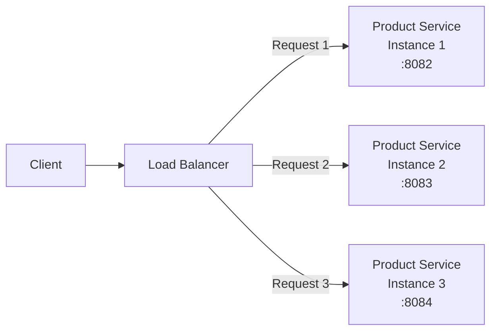
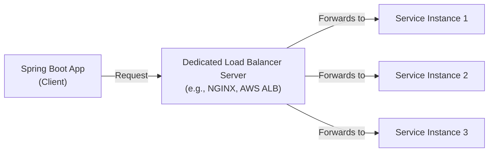
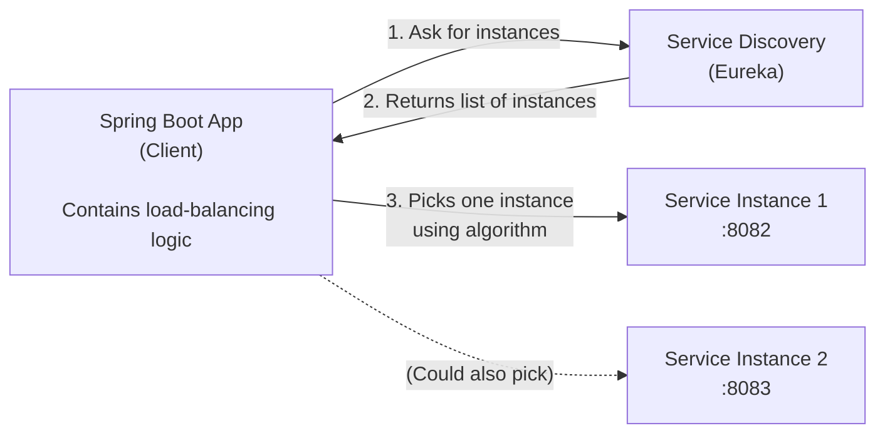
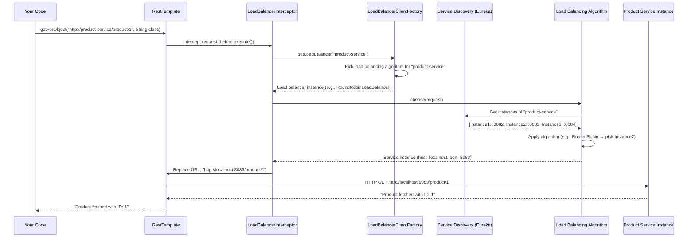
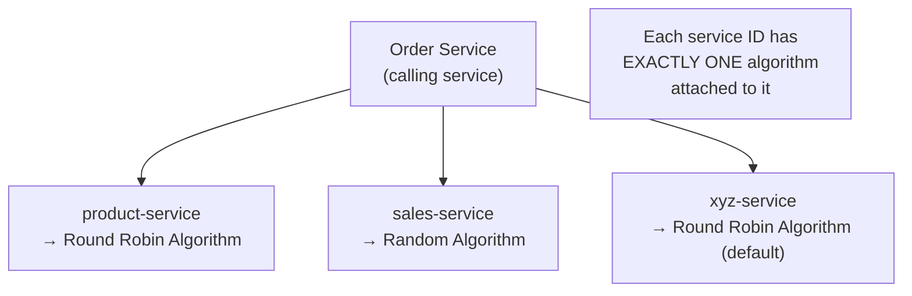
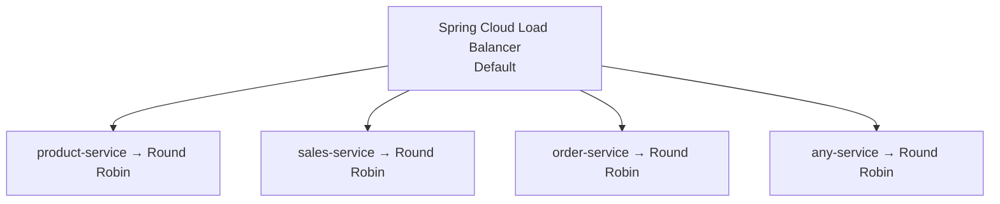
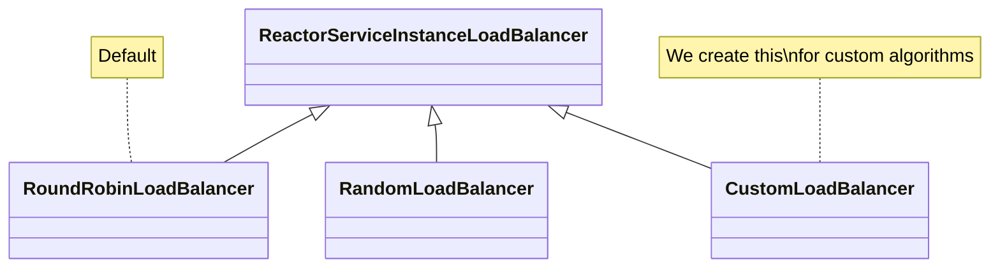
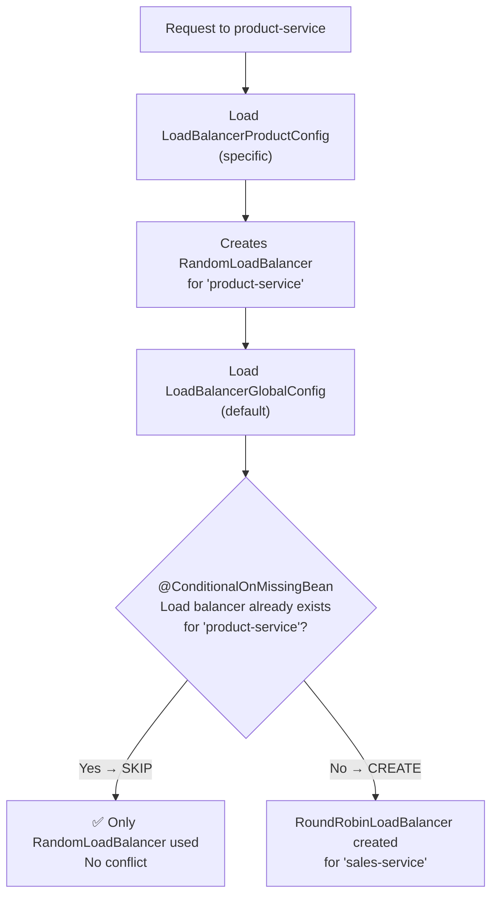
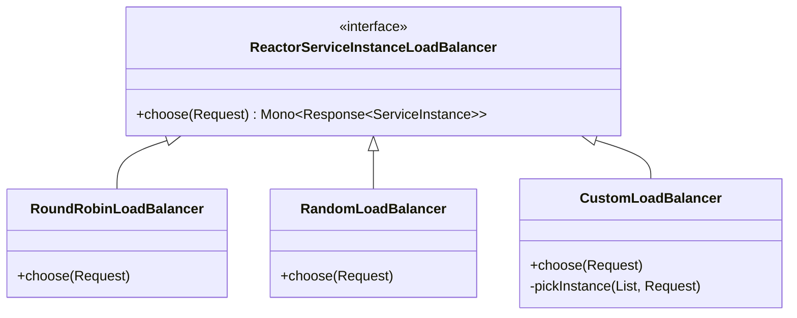
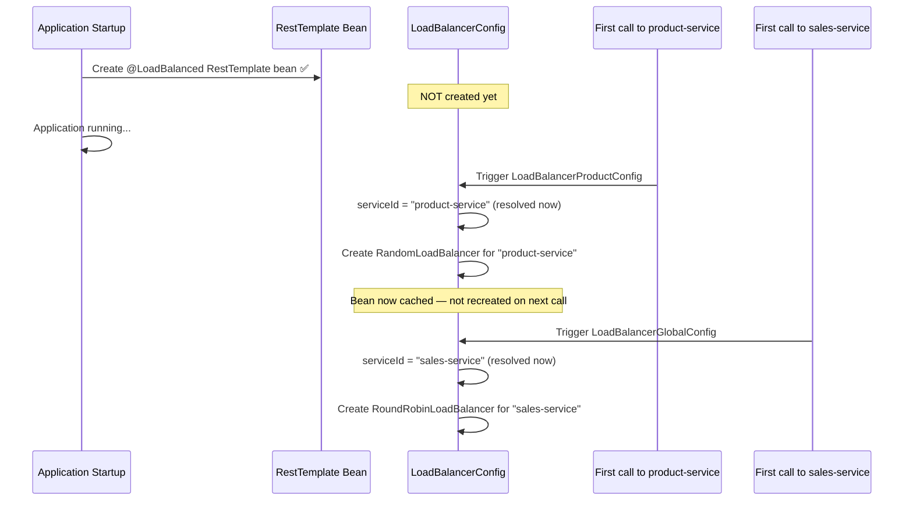

# 📌 Spring Boot Microservices — Client-Side Load Balancing Study Guide

> [!IMPORTANT]
> This guide covers client-side load balancing in Spring Boot microservices using **Spring Cloud Load Balancer** — including how it integrates with `RestTemplate`, `RestClient`, and `FeignClient`, how to configure per-service and global algorithms, and how to write a fully custom load balancer.

---

## Table of Contents

1. [What Is Load Balancing?](#1-what-is-load-balancing)
2. [Server-Side vs Client-Side Load Balancing](#2-server-side-vs-client-side-load-balancing)
3. [Prerequisite — Service Discovery Recap](#3-prerequisite--service-discovery-recap)
4. [Spring Cloud Load Balancer Overview](#4-spring-cloud-load-balancer-overview)
5. [Adding Load Balancing to RestTemplate](#5-adding-load-balancing-to-resttemplate)
6. [Internal Flow — How the Load Balancer Interceptor Works](#6-internal-flow--how-the-load-balancer-interceptor-works)
7. [The Service ID Concept — Critical Understanding](#7-the-service-id-concept--critical-understanding)
8. [Default Algorithm — Round Robin](#8-default-algorithm--round-robin)
9. [Overriding the Algorithm for a Specific Service](#9-overriding-the-algorithm-for-a-specific-service)
10. [Global + Per-Service Configuration Combined](#10-global--per-service-configuration-combined)
11. [Writing a Custom Load Balancer](#11-writing-a-custom-load-balancer)
12. [Load Balancing with FeignClient](#12-load-balancing-with-feignclient)
13. [Load Balancing with RestClient](#13-load-balancing-with-restclient)
14. [Load Balancer Configuration — Lazy Loading at Runtime](#14-load-balancer-configuration--lazy-loading-at-runtime)
15. [Common Mistakes](#15-common-mistakes)
16. [Best Practices](#16-best-practices)
17. [Interview Notes](#17-interview-notes)
18. [Practice Questions](#18-practice-questions)
19. [Summary Revision Bullets](#19-summary-revision-bullets)

---

# 1. What Is Load Balancing?

## Overview

**Load balancing** is the process of distributing incoming network traffic across multiple instances of a server or service. Its primary purpose is to prevent any single server from being overwhelmed by too many requests.

## Why It Exists

When traffic to a service increases, one common solution is to run **multiple instances** of that service. But then a new question arises: which instance should handle each incoming request? Load balancing answers this question.



## Benefits

| Benefit | Description |
|---|---|
| **Prevents overload** | No single instance receives all traffic |
| **High availability** | If one instance fails, others handle the load |
| **Scalability** | Add more instances as traffic grows |
| **Improved latency** | Requests can be routed to the fastest/least-busy instance |

---

# 2. Server-Side vs Client-Side Load Balancing

These are the two fundamental architectures for load balancing. Understanding the difference is essential because Spring Cloud uses the **client-side** model.

## 2.1 Server-Side Load Balancing



- A **dedicated, centralized** server sits between the client and the service instances
- The client knows nothing about load balancing — it just calls the load balancer's address
- The load balancer decides which instance to forward to
- Examples: **NGINX**, **AWS Application Load Balancer**, **HAProxy**
- Covered when: **API Gateway** topic

## 2.2 Client-Side Load Balancing



- The **caller itself** contains the load-balancing logic
- The client first queries **Service Discovery** to get all available instances
- The client then applies a load-balancing algorithm to pick one
- The load balancing logic lives as a **library** inside the client application
- Examples: **Spring Cloud Load Balancer**, **Netflix Ribbon** (deprecated), **Istio** (service mesh)

### Comparison Table

| Aspect | Server-Side | Client-Side |
|---|---|---|
| Load balancing location | Dedicated external server | Inside the calling service |
| Client awareness | None | Knows about instances |
| Service Discovery needed | No | Yes |
| Single point of failure risk | Yes (the LB server) | No (distributed) |
| Flexibility | Fixed by LB server | Configurable per client |
| Examples | NGINX, AWS ALB | Spring Cloud LB, Ribbon |

> [!NOTE]
> This guide covers **client-side load balancing** using **Spring Cloud Load Balancer**. Server-side load balancing (NGINX, API Gateway) is covered in a separate topic.

---

# 3. Prerequisite — Service Discovery Recap

## Why Service Discovery Comes First

Client-side load balancing depends on Service Discovery. Before the client can choose between instances, it must first **know what instances exist**. Service Discovery (Eureka) provides this list.

## What We Had Before (Manual, Without Load Balancer Library)

In the Service Discovery video, we fetched instances manually and picked one ourselves:

```java
@RestController
public class OrderController {

    @Autowired
    private DiscoveryClient discoveryClient; // Spring's service discovery client

    @Autowired
    private RestTemplate restTemplate;

    @GetMapping("/order/{id}")
    public String getOrder(@PathVariable String id) {

        // Step 1: Ask Eureka for all instances of "product-service"
        List<ServiceInstance> instances =
            discoveryClient.getInstances("product-service");

        // Step 2: Pick one — but this is a BAD algorithm (always picks index 0)
        ServiceInstance instance = instances.get(0);

        // Step 3: Build the URL manually using the instance's host and port
        String url = "http://" + instance.getHost() + ":" + instance.getPort() + "/product/" + id;

        // Step 4: Call it
        return restTemplate.getForObject(url, String.class);
    }
}
```

### Problems With This Approach

| Problem | Description |
|---|---|
| Manual instance fetching | Developer must call `discoveryClient.getInstances()` every time |
| No real algorithm | `get(0)` always picks the first instance — not load balancing |
| Tight coupling | Business logic mixed with infrastructure concerns |
| Hard to change algorithm | Must modify controller code |

**Spring Cloud Load Balancer automates all of this.**

---

# 4. Spring Cloud Load Balancer Overview

## What It Is

**Spring Cloud Load Balancer** is a client-side load balancing library provided by the Spring Cloud project. It integrates with Spring's HTTP clients (`RestTemplate`, `RestClient`, `FeignClient`) and automatically:

1. Queries Service Discovery for available instances
2. Applies a load-balancing algorithm to select one
3. Routes the request to the selected instance

## Available Client-Side Load Balancers

| Library | Status | Notes |
|---|---|---|
| **Spring Cloud Load Balancer** | ✅ Active | Default choice in modern Spring Cloud |
| **Netflix Ribbon** | ❌ Deprecated | Do not use for new projects |
| **Istio (Service Mesh)** | ✅ Active | Wide variety of algorithms; operates as a sidecar |

> [!IMPORTANT]
> Netflix Ribbon is **deprecated**. Always use **Spring Cloud Load Balancer** for new Spring Cloud projects.

## Required Dependency

```xml
<dependency>
    <groupId>org.springframework.cloud</groupId>
    <artifactId>spring-cloud-starter-loadbalancer</artifactId>
</dependency>
```

This single dependency brings in all the Spring Cloud Load Balancer infrastructure.

---

# 5. Adding Load Balancing to RestTemplate

## The Two Changes Required

To add Spring Cloud Load Balancer to an existing `RestTemplate` setup, only **two changes** are needed:

1. Add the `@LoadBalanced` annotation to the `RestTemplate` bean
2. Use the **service name** (not a hardcoded host/port) in the URL

### Before — Manual Discovery, Hardcoded URL

```java
@Configuration
public class AppConfig {

    @Bean
    public RestTemplate restTemplate() {
        return new RestTemplate(); // plain, no load balancing
    }
}

// In controller:
String url = "http://" + instance.getHost() + ":" + instance.getPort() + "/product/" + id;
String response = restTemplate.getForObject(url, String.class);
```

### After — Spring Cloud Load Balancer

```java
@Configuration
public class AppConfig {

    @Bean
    @LoadBalanced  // ← THE ONLY CHANGE to the bean definition
    public RestTemplate restTemplate() {
        return new RestTemplate();
    }
}
```

```java
@RestController
public class OrderController {

    @Autowired
    private RestTemplate restTemplate;

    @GetMapping("/order/{id}")
    public String getOrder(@PathVariable String id) {

        // Use service NAME instead of hardcoded host:port
        // "product-service" is the spring.application.name of the Product Service
        String response = restTemplate.getForObject(
            "http://product-service/product/" + id,
            String.class
        );

        return "Order placed. " + response;
    }
}
```

### `application.properties` for Order Service

```properties
spring.application.name=order-service
server.port=8081

# The base URL for product service — uses service name, not IP
product.service.url=http://product-service
```

> [!IMPORTANT]
> The URL scheme `http://product-service/...` is **not a real hostname**. The `@LoadBalanced` annotation installs an interceptor that intercepts this URL, resolves `product-service` via Service Discovery, picks an instance, and replaces the URL with the actual `host:port` before the request is sent.

### What Changed — Side by Side

| Aspect | Before (Manual) | After (Load Balanced) |
|---|---|---|
| `DiscoveryClient` needed? | ✅ Yes | ❌ No |
| URL format | `http://192.168.1.5:8082/product/1` | `http://product-service/product/1` |
| Instance selection logic | Written by developer | Handled by framework |
| Load balancing algorithm | None (always `get(0)`) | Round robin (default) |
| Code changes required | Many | Just `@LoadBalanced` |

---

# 6. Internal Flow — How the Load Balancer Interceptor Works

## The `@LoadBalanced` Annotation

When you annotate `RestTemplate` with `@LoadBalanced`, Spring installs a **`LoadBalancerInterceptor`** into the `RestTemplate`'s interceptor chain. This interceptor runs **before** the actual HTTP request is executed.

## Step-by-Step Internal Execution



## Key Internal Classes

| Class | Role |
|---|---|
| `LoadBalancerInterceptor` | Intercepts all requests made by `@LoadBalanced` `RestTemplate` |
| `LoadBalancerClientFactory` | Factory that selects and returns the correct load balancer for a given service ID |
| `ServiceInstanceListSupplier` | Calls Service Discovery to retrieve all available instances |
| `ReactorServiceInstanceLoadBalancer` | Interface that all load balancing algorithms implement |
| `RoundRobinLoadBalancer` | Default algorithm — distributes requests evenly in rotation |
| `RandomLoadBalancer` | Alternative built-in algorithm — picks randomly |

## Inside `LoadBalancerInterceptor` (Simplified)

```java
// Simplified view of what LoadBalancerInterceptor does internally
public ClientHttpResponse intercept(HttpRequest request, byte[] body,
                                    ClientHttpRequestExecution execution) {

    String serviceId = request.getURI().getHost(); // extracts "product-service"

    // Step 1: Get the load balancer for this specific service ID
    ReactorLoadBalancer<ServiceInstance> loadBalancer =
        loadBalancerClientFactory.getInstance(serviceId);

    // Step 2: Choose one instance using the load balancing algorithm
    // (internally calls Service Discovery to get the list of instances)
    ServiceInstance instance = loadBalancer.choose(request).block().getServer();

    // Step 3: Reconstruct the request with the real host:port
    URI resolvedUri = URI.create("http://" + instance.getHost() + ":" + instance.getPort()
        + request.getURI().getPath());

    // Step 4: Execute the actual HTTP request
    return execution.execute(new ResolvedRequest(request, resolvedUri), body);
}
```

---

# 7. The Service ID Concept — Critical Understanding

> [!IMPORTANT]
> This is the most commonly misunderstood concept in Spring Cloud Load Balancer. Getting this wrong causes runtime errors that are hard to debug. Understand this section thoroughly before writing any configuration code.

## What Is a Service ID?

A **Service ID** is the identifier for a microservice — it is the value of `spring.application.name` in that service's `application.properties`.

```properties
# In Product Service's application.properties
spring.application.name=product-service
```

The value `product-service` is the **Service ID** (also called **client name**). It is:
- Used to register the service with Eureka
- Used to look up instances from Eureka
- Used to identify which load-balancing algorithm applies to which service

## The Key Rule — Algorithm Is Attached to Service ID



> [!IMPORTANT]
> A load-balancing algorithm is **always attached to a specific Service ID**. It is not global in the sense that one algorithm applies to all services. You configure: **"For service X, use algorithm Y."**
>
> When a load balancer configuration runs at runtime, it must know the service ID so the algorithm can be correctly associated with that specific service.

## Why This Matters in Practice

When you create a `RoundRobinLoadBalancer` or `RandomLoadBalancer`, the constructor **requires a Service ID**:

```java
// Each load balancer instance is created for ONE specific service
new RoundRobinLoadBalancer(serviceInstanceListSupplier, "product-service");
new RandomLoadBalancer(serviceInstanceListSupplier, "sales-service");
```

This ties the algorithm to the service. When `LoadBalancerClientFactory.getInstance("product-service")` is called, it retrieves the load balancer registered for `product-service` only.

---

# 8. Default Algorithm — Round Robin

## What Round Robin Does

Round Robin distributes requests evenly across all available instances in a rotating sequence:

```
Request 1 → Instance A (:8082)
Request 2 → Instance B (:8083)
Request 3 → Instance C (:8084)
Request 4 → Instance A (:8082)  ← wraps around
Request 5 → Instance B (:8083)
...
```

## Default Behavior

By default, **Spring Cloud Load Balancer uses Round Robin for every service** — no configuration needed.



## Built-In Algorithms

Spring Cloud Load Balancer ships with only **two built-in algorithms**:

| Algorithm | Class | Description |
|---|---|---|
| **Round Robin** | `RoundRobinLoadBalancer` | Cycles through instances in order (default) |
| **Random** | `RandomLoadBalancer` | Picks a random instance each time |



> [!NOTE]
> For more sophisticated algorithms (weighted, least connections, least response time, IP hash), you either write a **custom load balancer** (shown in Section 11) or use a service mesh like **Istio**, which provides a wide variety of algorithms via its sidecar proxy.

---

# 9. Overriding the Algorithm for a Specific Service

## Goal

Change the load-balancing algorithm for **one specific service** (e.g., use `RandomLoadBalancer` for `product-service` only) while keeping Round Robin for everything else.

## Step 1 — Annotate the Application Class

In **Order Service** (the calling service), add `@LoadBalancerClient`:

```java
@SpringBootApplication
@LoadBalancerClient(
    name = "product-service",           // Service ID this config applies to
    configuration = LoadBalancerProductConfig.class  // Configuration class to use
)
public class OrderServiceApplication {
    public static void main(String[] args) {
        SpringApplication.run(OrderServiceApplication.class, args);
    }
}
```

> [!IMPORTANT]
> `@LoadBalancerClient` is placed on the **calling service** (Order Service), not the called service (Product Service). You are configuring how the **caller** handles load balancing for requests to `product-service`.

## Step 2 — Write the Load Balancer Configuration Class

```java
// NOTE: Do NOT annotate this with @Configuration at the class level
// It must NOT be in the component scan path — it is loaded by Spring Cloud specifically
public class LoadBalancerProductConfig {

    @Bean
    public ReactorLoadBalancer<ServiceInstance> randomLoadBalancer(
            Environment environment,
            LoadBalancerClientFactory loadBalancerClientFactory) {

        // Get the service ID this config is running for
        String serviceId = environment.getProperty(
            LoadBalancerClientFactory.PROPERTY_NAME  // = "loadbalancer.client.name"
        );
        // At runtime, serviceId = "product-service"

        // Create the ServiceInstanceListSupplier (handles Eureka calls)
        ObjectProvider<ServiceInstanceListSupplier> supplier =
            loadBalancerClientFactory.getLazyProvider(serviceId, ServiceInstanceListSupplier.class);

        // Return RandomLoadBalancer tied to "product-service"
        return new RandomLoadBalancer(supplier, serviceId);
    }
}
```

### Why This Config Class Is Different

> [!WARNING]
> **Do NOT** annotate this class with `@Configuration` and scan it normally. It must be referenced only through `@LoadBalancerClient(configuration = ...)`. If Spring scans it as a normal `@Configuration`, it will be applied **globally** to all services, not just `product-service`.

| Aspect | Normal `@Configuration` | Load Balancer Config |
|---|---|---|
| When beans are created | At application startup | **At runtime** (when service is first called) |
| Scope | Application-wide | Per service ID |
| Scanning | Auto-scanned | Only via `@LoadBalancerClient` |

## Step 3 — Use the Service Name in the URL (No Change Needed)

```java
// No change to the calling code — it still uses the service name
String response = restTemplate.getForObject(
    "http://product-service/product/" + id,
    String.class
);
// But now RandomLoadBalancer is used when selecting among product-service instances
```

---

# 10. Global + Per-Service Configuration Combined

## Scenario

You have many services. For some you want specific algorithms, for the rest you want a **common default**:

```
product-service  → Random (specific)
sales-service    → Round Robin (default)
inventory-service → Round Robin (default)
xyz-service      → Round Robin (default)
```

## Step 1 — Use `@LoadBalancerClients` (Plural)

```java
@SpringBootApplication
@LoadBalancerClients(
    // Specific configuration for product-service
    value = {
        @LoadBalancerClient(
            name = "product-service",
            configuration = LoadBalancerProductConfig.class
        )
        // Add more @LoadBalancerClient entries for other specific services
    },
    // Default configuration for ALL other services
    defaultConfiguration = LoadBalancerGlobalConfig.class
)
public class OrderServiceApplication {
    public static void main(String[] args) {
        SpringApplication.run(OrderServiceApplication.class, args);
    }
}
```

## Step 2 — Write the Global (Default) Configuration

The global config is trickier because it applies to **any** service — and we don't know the service name at compile time. The service ID must be resolved **dynamically at runtime**.

```java
public class LoadBalancerGlobalConfig {

    @Bean
    @ConditionalOnMissingBean  // ← CRITICAL — explained below
    public ReactorLoadBalancer<ServiceInstance> roundRobinLoadBalancer(
            Environment environment,
            LoadBalancerClientFactory loadBalancerClientFactory) {

        // Dynamically get the service ID at runtime
        // (NOT hardcoded — different service = different value)
        String serviceId = environment.getProperty(
            LoadBalancerClientFactory.PROPERTY_NAME
        );
        // When invoked for "sales-service", serviceId = "sales-service"
        // When invoked for "inventory-service", serviceId = "inventory-service"

        ObjectProvider<ServiceInstanceListSupplier> supplier =
            loadBalancerClientFactory.getLazyProvider(serviceId, ServiceInstanceListSupplier.class);

        // Round Robin tied to whatever service is being called right now
        return new RoundRobinLoadBalancer(supplier, serviceId);
    }
}
```

## Why `@ConditionalOnMissingBean` Is Critical

> [!WARNING]
> Without `@ConditionalOnMissingBean`, when `product-service` is called:
> 1. Spring first runs `LoadBalancerProductConfig` → creates `RandomLoadBalancer` for `product-service`
> 2. Spring then runs `LoadBalancerGlobalConfig` → tries to create **another** `RoundRobinLoadBalancer` for `product-service`
> 3. Two load balancers for the same service ID → **Runtime Exception**
>
> `@ConditionalOnMissingBean` says: "Only create this bean if no load balancer bean already exists for this service ID." This prevents the duplicate.



## Configuration Priority Order

When a service is called, Spring Cloud applies configurations in this order:

```
1. Specific @LoadBalancerClient config (highest priority)
   → e.g., LoadBalancerProductConfig for "product-service"

2. Default @LoadBalancerClients(defaultConfiguration=...) config
   → e.g., LoadBalancerGlobalConfig for all other services

3. Spring Cloud Load Balancer auto-configuration defaults
   → RoundRobin for everything (lowest priority)
```

---

# 11. Writing a Custom Load Balancer

## When You Need This

Spring Cloud Load Balancer only has two built-in algorithms (Round Robin and Random). If you need:
- Weighted distribution
- Least connections
- Least response time
- IP hash / sticky sessions
- Any custom logic

You must write a **custom load balancer**.

## Step 1 — Implement `ReactorServiceInstanceLoadBalancer`

```java
public class CustomLoadBalancer implements ReactorServiceInstanceLoadBalancer {

    private final ObjectProvider<ServiceInstanceListSupplier> serviceInstanceListSupplierProvider;
    private final String serviceId;

    // Constructor — same signature as RoundRobinLoadBalancer and RandomLoadBalancer
    public CustomLoadBalancer(
            ObjectProvider<ServiceInstanceListSupplier> serviceInstanceListSupplierProvider,
            String serviceId) {
        this.serviceInstanceListSupplierProvider = serviceInstanceListSupplierProvider;
        this.serviceId = serviceId;
    }

    @Override
    public Mono<Response<ServiceInstance>> choose(Request request) {

        // Step 1: Get the ServiceInstanceListSupplier
        ServiceInstanceListSupplier supplier =
            serviceInstanceListSupplierProvider.getIfAvailable();

        // Step 2: Get all available instances from Service Discovery
        return supplier.get(request)
            .next()
            .map(instances -> pickInstance(instances, request));
    }

    private Response<ServiceInstance> pickInstance(
            List<ServiceInstance> instances, Request request) {

        // Step 3: Handle empty instance list
        if (instances == null || instances.isEmpty()) {
            return new EmptyResponse();
        }

        // Step 4: Apply your custom selection logic
        // Example: always pick the first instance (replace with real logic)
        ServiceInstance chosen = instances.get(0);

        // Examples of real custom logic you could implement:
        // - Weighted: pick based on instance metadata weights
        // - Least connections: track active connections per instance
        // - Response time: track average latency per instance
        // - Geographic: pick instance closest to client's region

        return new DefaultResponse(chosen);
    }
}
```

### Class Hierarchy



## Step 2 — Register It in Configuration

```java
public class LoadBalancerProductConfig {

    @Bean
    public ReactorLoadBalancer<ServiceInstance> customLoadBalancer(
            Environment environment,
            LoadBalancerClientFactory loadBalancerClientFactory) {

        String serviceId = environment.getProperty(
            LoadBalancerClientFactory.PROPERTY_NAME
        );

        ObjectProvider<ServiceInstanceListSupplier> supplier =
            loadBalancerClientFactory.getLazyProvider(serviceId, ServiceInstanceListSupplier.class);

        // Use custom load balancer instead of built-in ones
        return new CustomLoadBalancer(supplier, serviceId);
    }
}
```

## Step 3 — Register via `@LoadBalancerClient`

```java
@SpringBootApplication
@LoadBalancerClient(
    name = "product-service",
    configuration = LoadBalancerProductConfig.class
)
public class OrderServiceApplication { ... }
```

### How `choose()` Works Internally (for reference)

| Algorithm | What `choose()` does |
|---|---|
| `RoundRobinLoadBalancer` | Gets instances list → picks next using atomic counter (cycles through) |
| `RandomLoadBalancer` | Gets instances list → calls `Random.nextInt(instances.size())` |
| `CustomLoadBalancer` | Gets instances list → applies your logic |

---

# 12. Load Balancing with FeignClient

## How FeignClient Uses Load Balancing

When you use `FeignClient` with Service Discovery, load balancing is **automatically applied** — you don't need `@LoadBalanced` or manual configuration. FeignClient internally uses the same `LoadBalancerInterceptor` infrastructure.

## Basic FeignClient Setup (With Service Discovery)

```java
@FeignClient(name = "product-service")  // service name = service ID
public interface ProductClient {

    @GetMapping("/product/{id}")
    String getProduct(@PathVariable("id") String id);
}
```

```java
@RestController
public class OrderController {

    @Autowired
    private ProductClient productClient; // Spring generates implementation

    @GetMapping("/order/{id}")
    public String getOrder(@PathVariable String id) {
        return "Order: " + productClient.getProduct(id);
        // ↑ Internally uses Round Robin to pick among product-service instances
    }
}
```

## Changing the Algorithm for FeignClient

The mechanism is identical to `RestTemplate` — use `@LoadBalancerClient`:

```java
@SpringBootApplication
@LoadBalancerClient(
    name = "product-service",
    configuration = LoadBalancerProductConfig.class  // same config as before
)
@EnableFeignClients
public class OrderServiceApplication { ... }
```

```java
// LoadBalancerProductConfig — same as written before
public class LoadBalancerProductConfig {

    @Bean
    public ReactorLoadBalancer<ServiceInstance> randomLoadBalancer(
            Environment environment,
            LoadBalancerClientFactory loadBalancerClientFactory) {

        String serviceId = environment.getProperty(
            LoadBalancerClientFactory.PROPERTY_NAME
        );
        ObjectProvider<ServiceInstanceListSupplier> supplier =
            loadBalancerClientFactory.getLazyProvider(serviceId, ServiceInstanceListSupplier.class);

        return new RandomLoadBalancer(supplier, serviceId);
    }
}
```

> [!NOTE]
> The load balancer configuration is **independent of which HTTP client you use** (`RestTemplate`, `RestClient`, or `FeignClient`). The same `@LoadBalancerClient` configuration applies equally to all of them.

## FeignClient Without Service Discovery

If you are NOT using Eureka, you must provide the URL explicitly:

```java
@FeignClient(name = "product-service", url = "http://localhost:8082")
public interface ProductClient { ... }
// No load balancing — URL is fixed
```

---

# 13. Load Balancing with RestClient

## Same Infrastructure, Different HTTP Client

`RestClient` (Spring 6.1+) uses the **exact same** `LoadBalancerInterceptor` as `RestTemplate`. The load balancing logic is completely identical.

```java
@Configuration
public class AppConfig {

    @Bean
    @LoadBalanced  // Same annotation
    public RestClient.Builder restClientBuilder() {
        return RestClient.builder();
    }
}
```

```java
@RestController
public class OrderController {

    @Autowired
    private RestClient.Builder restClientBuilder;

    @GetMapping("/order/{id}")
    public String getOrder(@PathVariable String id) {

        return restClientBuilder.build()
            .get()
            .uri("http://product-service/product/" + id)  // Same service-name URL
            .retrieve()
            .body(String.class);
    }
}
```

> [!TIP]
> Since the load balancing infrastructure is shared, **all algorithm customizations** (`@LoadBalancerClient`, custom load balancers, global configs) work identically for `RestTemplate`, `RestClient`, and `FeignClient`. You configure once, it applies regardless of which HTTP client is used.

---

# 14. Load Balancer Configuration — Lazy Loading at Runtime

## Why Load Balancer Config Is Lazy

This is a critical behavioral difference between normal Spring beans and load balancer configuration beans.

| Bean Type | When Created |
|---|---|
| Normal `@Configuration` beans | At **application startup** |
| Load Balancer configuration beans | At **runtime**, when the service is first called |

## Why This Matters for the Global Config

```java
// Global config — serviceId is resolved at RUNTIME
String serviceId = environment.getProperty(LoadBalancerClientFactory.PROPERTY_NAME);
```

During application startup, Order Service doesn't know which other services it will call. `product-service`, `sales-service`, etc. are not "invoked" yet — they're just names. So:

- At startup: `serviceId` would be `null` (no service is being called yet)
- At runtime (when `http://product-service/...` is first invoked): `serviceId` = `"product-service"`
- At runtime (when `http://sales-service/...` is first invoked): `serviceId` = `"sales-service"`

## Load Balancer Bean Lifecycle



> [!NOTE]
> Once the load balancer bean is created for a specific service ID, it is **cached**. Subsequent calls to the same service reuse the existing load balancer bean — it is not recreated on every request. Only the **first** call to a service triggers the configuration.

---

# 15. Common Mistakes

## Mistake 1 — Scanning the Load Balancer Config Class

```java
// ❌ WRONG — do NOT annotate load balancer config with @Configuration
// at the package level where Spring scans
@Configuration
public class LoadBalancerProductConfig { ... }
// This applies the config GLOBALLY to ALL services, not just product-service

// ✅ CORRECT — reference it only via @LoadBalancerClient
// Do NOT put @Configuration on the class, or exclude it from component scan
public class LoadBalancerProductConfig { ... }

@LoadBalancerClient(name = "product-service", configuration = LoadBalancerProductConfig.class)
```

## Mistake 2 — Forgetting `@ConditionalOnMissingBean` in Global Config

```java
// ❌ WRONG — global config without @ConditionalOnMissingBean
public class LoadBalancerGlobalConfig {
    @Bean
    public ReactorLoadBalancer<ServiceInstance> roundRobin(...) { ... }
}
// When product-service is called: RandomLoadBalancer (from specific config) +
// RoundRobinLoadBalancer (from global config) = RUNTIME EXCEPTION

// ✅ CORRECT
public class LoadBalancerGlobalConfig {
    @Bean
    @ConditionalOnMissingBean  // ← Skip if a load balancer already exists for this serviceId
    public ReactorLoadBalancer<ServiceInstance> roundRobin(...) { ... }
}
```

## Mistake 3 — Hardcoding Service ID in Global Config

```java
// ❌ WRONG — hardcoded service ID in global config
return new RoundRobinLoadBalancer(supplier, "product-service");
// This global config would only work for product-service, not for sales-service etc.

// ✅ CORRECT — resolve dynamically at runtime
String serviceId = environment.getProperty(LoadBalancerClientFactory.PROPERTY_NAME);
return new RoundRobinLoadBalancer(supplier, serviceId);
```

## Mistake 4 — Using `@LoadBalanced` Without Service Discovery

```java
// ❌ WRONG — @LoadBalanced with hardcoded IP (no service registry)
// @LoadBalanced RestTemplate tries to resolve "192.168.1.5" as a service name
restTemplate.getForObject("http://192.168.1.5:8082/product/1", String.class);
// This will FAIL — the interceptor treats "192.168.1.5" as a service ID and
// looks it up in Service Discovery (Eureka), where it won't be found

// ✅ CORRECT — use service name, register with Eureka
restTemplate.getForObject("http://product-service/product/1", String.class);
```

## Mistake 5 — Not Adding the Load Balancer Dependency

```java
// ❌ WRONG — @LoadBalanced does nothing without the dependency
// The annotation exists in Spring Cloud Commons, but the actual
// LoadBalancerInterceptor requires spring-cloud-starter-loadbalancer

// ✅ CORRECT — add to pom.xml
<dependency>
    <groupId>org.springframework.cloud</groupId>
    <artifactId>spring-cloud-starter-loadbalancer</artifactId>
</dependency>
```

---

# 16. Best Practices

| Practice | Reason |
|---|---|
| Always use `spring.application.name` consistently | Service ID must match exactly between the caller's config and the service's registration |
| Keep load balancer config classes outside the component scan | Prevents accidental global application |
| Always add `@ConditionalOnMissingBean` in global configs | Prevents duplicate bean exception when specific configs exist |
| Use `environment.getProperty(PROPERTY_NAME)` for service ID in global config | Enables dynamic per-service algorithm binding at runtime |
| Prefer FeignClient for new Spring Cloud projects | More declarative, cleaner code, same load balancing capability |
| Test load balancing by running multiple instances locally | Verify round-robin or random behavior with logs |
| Use Istio/service mesh for advanced algorithms | Weighted, least connections, circuit breaking at infrastructure level |
| Don't mix `@LoadBalanced` `RestTemplate` with hardcoded IPs | Will fail — the interceptor treats hostname as a service ID |

---

# 17. Interview Notes

### Q: What is the difference between server-side and client-side load balancing?

Server-side: a dedicated external load balancer (NGINX, AWS ALB) receives all requests and forwards them. The client knows nothing about individual instances. Client-side: the calling service itself contains the load-balancing logic, queries Service Discovery for instances, and picks one using an algorithm.

### Q: What does `@LoadBalanced` do?

It instructs Spring to add a `LoadBalancerInterceptor` to the `RestTemplate` (or `RestClient`). This interceptor intercepts every request, resolves the service name in the URL via Service Discovery, applies the configured load-balancing algorithm, and replaces the URL with the selected instance's real `host:port`.

### Q: What is a Service ID in Spring Cloud Load Balancer?

The Service ID (or client name) is the value of `spring.application.name` of the target service. It is the key used to: register with Eureka, look up instances from Eureka, and bind a specific load-balancing algorithm to a specific service.

### Q: What algorithms does Spring Cloud Load Balancer support out of the box?

Only two: **Round Robin** (`RoundRobinLoadBalancer`) and **Random** (`RandomLoadBalancer`). For other algorithms (weighted, least connections, etc.), you must write a custom implementation or use a service mesh like Istio.

### Q: Why do load balancer configuration beans load at runtime, not at startup?

Because at startup, no service calls have been made yet. The Service ID is only known when a call is actually in flight. The global config especially must resolve the service ID dynamically — at startup it would be null because no service is being invoked yet.

### Q: What is `ServiceInstanceListSupplier`?

It is the component that calls Service Discovery (Eureka) to retrieve the list of available instances for a given service ID. It is injected into every load balancer algorithm and provides the instance list that the algorithm selects from.

### Q: Why must the load balancer config class not be in the component scan path?

If it is scanned as a normal `@Configuration`, it becomes a global application-level bean and applies its algorithm to ALL services. It should only be activated for the specific service named in `@LoadBalancerClient`.

### Q: How do you use a different load-balancing algorithm for just one service?

Use `@LoadBalancerClient(name = "service-name", configuration = YourConfig.class)` on the main application class. In `YourConfig`, return the desired `ReactorLoadBalancer` bean. This config loads lazily at runtime only when that service is called.

### Q: How does load balancing work transparently with FeignClient?

FeignClient automatically integrates with Spring Cloud Load Balancer when Service Discovery is on the classpath. No extra annotation is needed. Algorithm customization uses the same `@LoadBalancerClient` mechanism as `RestTemplate`.

---

# 18. Practice Questions

## Easy

1. What is the purpose of load balancing? What problem does it solve?
2. What is the difference between server-side and client-side load balancing? Give one example of each.
3. What annotation enables load balancing in a `RestTemplate` bean?
4. What are the two built-in algorithms in Spring Cloud Load Balancer?
5. What is a Service ID? What property defines it?

## Medium

6. Trace what happens internally when `restTemplate.getForObject("http://product-service/product/1", String.class)` is called with `@LoadBalanced`.
7. How do you configure `RandomLoadBalancer` for `product-service` while keeping Round Robin for all other services?
8. Why must the load balancer configuration class not be annotated with `@Configuration` and placed in the component scan path?
9. Explain why `@ConditionalOnMissingBean` is required in the global load balancer config.
10. Why is the service ID resolved dynamically at runtime in the global config instead of being hardcoded?

## Hard

11. Implement a custom `WeightedLoadBalancer` that reads a `weight` metadata value from each `ServiceInstance` and selects instances proportionally to their weight.
12. Explain the full lifecycle of a load balancer bean: when is it created, when is it cached, and when would it be recreated?
13. You have five downstream services. Three use Round Robin, one uses Random, and one uses a custom algorithm. Write the complete `@LoadBalancerClients` configuration for this setup.
14. What would happen if you called `http://192.168.1.5:8082/product/1` with a `@LoadBalanced` `RestTemplate`? Why would it fail?
15. Compare Spring Cloud Load Balancer with Istio service mesh as client-side load balancing solutions. When would you choose each?

---

# 19. Summary Revision Bullets

- **Load balancing** = distributing traffic across multiple service instances to prevent overload
- **Server-side** = dedicated external LB server (NGINX, AWS ALB); client is unaware of instances
- **Client-side** = LB logic lives inside the caller; requires Service Discovery to get instance list
- **Spring Cloud Load Balancer** = Spring's client-side LB library; integrates with RestTemplate, RestClient, FeignClient
- **`@LoadBalanced`** on `RestTemplate` bean → installs `LoadBalancerInterceptor` → intercepts requests → resolves service name → picks instance → replaces URL
- **URL format** with load balancing: `http://service-name/path` (not `http://host:port/path`)
- **Service ID** = `spring.application.name` value = key that binds algorithm to service
- **Each algorithm is tied to exactly one Service ID** — not global across all services
- **Default algorithm** = Round Robin for every service
- **Built-in algorithms**: `RoundRobinLoadBalancer`, `RandomLoadBalancer` — that's it
- **Custom algorithm**: implement `ReactorServiceInstanceLoadBalancer`, override `choose()` method
- **Per-service config**: `@LoadBalancerClient(name="product-service", configuration=Config.class)`
- **Global + per-service**: `@LoadBalancerClients(value={specific...}, defaultConfiguration=GlobalConfig.class)`
- **`@ConditionalOnMissingBean`** in global config = prevents duplicate algorithm for same service ID
- **Dynamic service ID** in global config: `environment.getProperty(LoadBalancerClientFactory.PROPERTY_NAME)` — null at startup, resolved at runtime
- **Load balancer config beans** = lazy — created at runtime on first call to a service, not at startup
- **FeignClient**: load balancing is automatic with Service Discovery; customize with same `@LoadBalancerClient`
- **RestClient**: same `@LoadBalanced` annotation, same interceptor, same config — identical behavior to RestTemplate
- **Istio**: service mesh alternative for advanced algorithms (weighted, least connections); operates as sidecar

---

> [!TIP]
> To deepen understanding, add `System.out.println` statements inside your load balancer config beans and run multiple instances of Product Service locally. Call the Order Service repeatedly and observe which instance is selected each time — this makes the round-robin and random behaviors concrete.

---

> [!NOTE]
> **What comes next:** Server-side load balancing via **API Gateway** (NGINX or Spring Cloud Gateway), which handles load distribution at the infrastructure level rather than inside the calling service.
