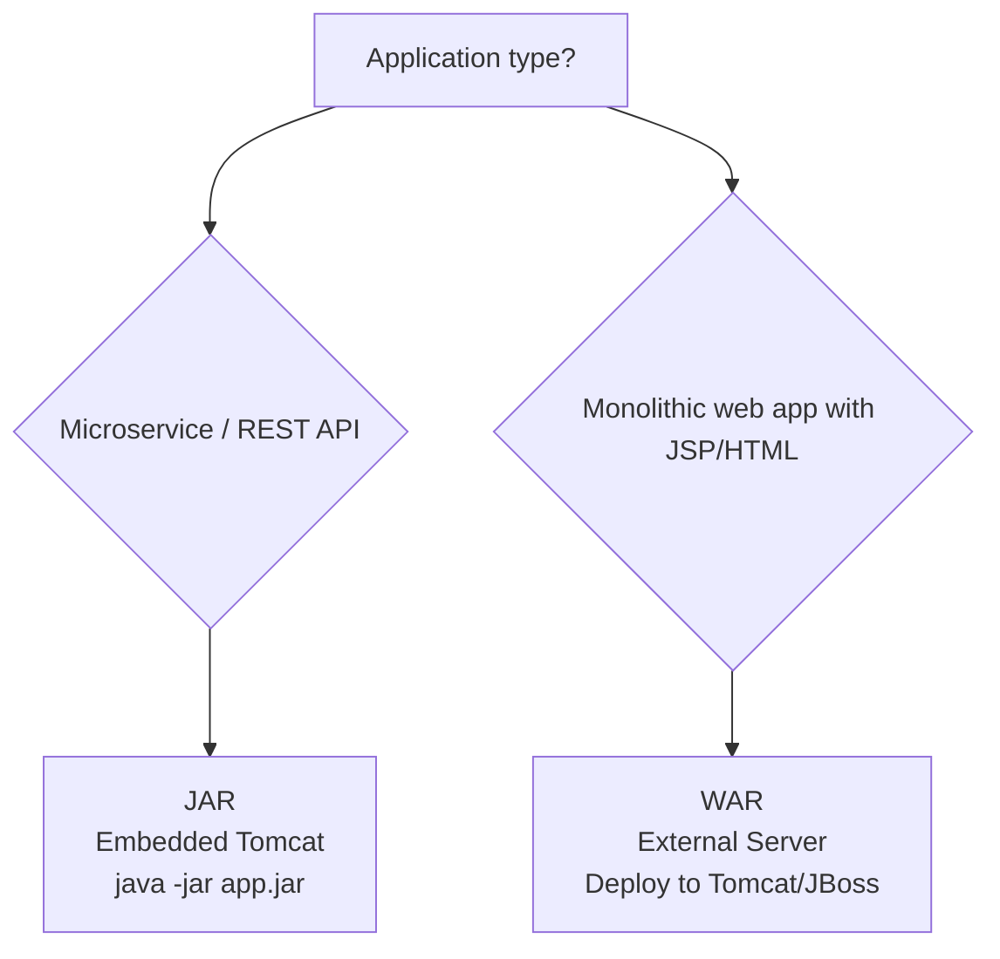
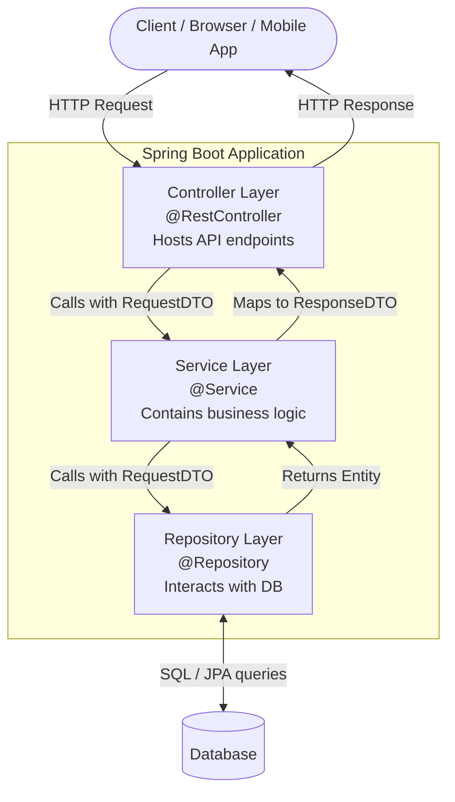
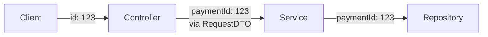
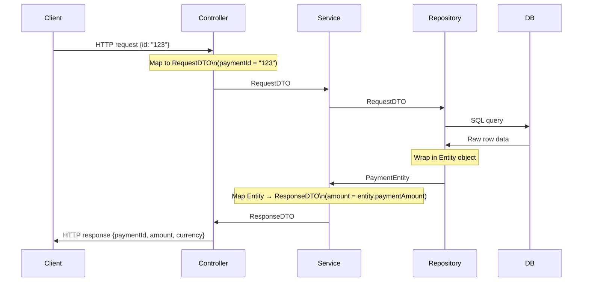
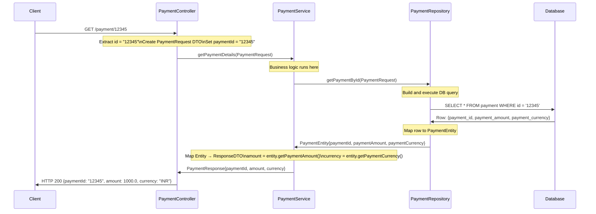
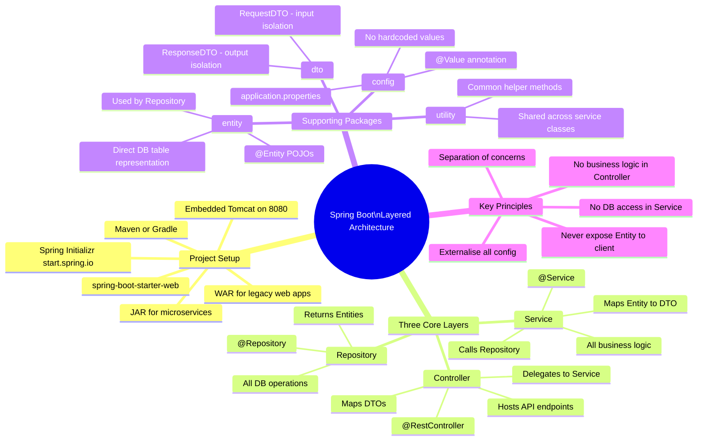

# 📘 Spring Boot — Project Setup & Layered Architecture: Complete Study Guide

> A professional-quality reference covering Spring Boot project setup from scratch, JAR vs WAR packaging, the layered architecture pattern, DTOs, entities, and a full end-to-end request flow walkthrough.

---

## Table of Contents

1. [What is Spring Boot?](#1-what-is-spring-boot)
2. [Setting Up a Spring Boot Project](#2-setting-up-a-spring-boot-project)
3. [JAR vs WAR — Packaging Types](#3-jar-vs-war--packaging-types)
4. [Project Structure After Setup](#4-project-structure-after-setup)
5. [Layered Architecture in Spring Boot](#5-layered-architecture-in-spring-boot)
6. [Layer 1 — Controller Layer](#6-layer-1--controller-layer)
7. [Layer 2 — Service Layer](#7-layer-2--service-layer)
8. [Layer 3 — Repository Layer](#8-layer-3--repository-layer)
9. [Supporting Package — DTO (Data Transfer Object)](#9-supporting-package--dto-data-transfer-object)
10. [Supporting Package — Entity](#10-supporting-package--entity)
11. [Supporting Package — Utility](#11-supporting-package--utility)
12. [Supporting Package — Configuration](#12-supporting-package--configuration)
13. [End-to-End Request Flow Walkthrough](#13-end-to-end-request-flow-walkthrough)
14. [Maven `pom.xml` — Dependency Management](#14-maven-pomxml--dependency-management)
15. [Quick Reference Table](#15-quick-reference-table)
16. [Interview Notes](#16-interview-notes)
17. [Common Mistakes](#17-common-mistakes)
18. [Best Practices](#18-best-practices)
19. [Practice Questions](#19-practice-questions)
20. [Summary](#20-summary)

---

# 1. What is Spring Boot?

## Overview

Spring Boot is a framework built on top of the Spring Framework that simplifies the creation of production-ready, standalone Java applications. It eliminates most of the boilerplate configuration traditionally required in Spring by providing:

- **Auto-configuration** — Spring Boot detects what libraries are on the classpath and configures them automatically
- **Embedded server** — An embedded Tomcat (or Jetty/Undertow) server is bundled inside the application itself; no separate server installation required
- **Starter dependencies** — Curated dependency bundles (e.g., `spring-boot-starter-web`) that pull in everything needed for a feature
- **Production-ready defaults** — Sensible configuration out of the box

## Why Spring Boot Exists

Before Spring Boot, setting up a Spring application required:
- Writing extensive XML configuration files
- Deploying a WAR file to an external application server
- Manually managing dependency version compatibility

Spring Boot solves all three problems: convention over configuration, embedded server, and managed dependency versions.

---

# 2. Setting Up a Spring Boot Project

## Method 1 — Spring Initializr (Recommended, Works for All IDEs)

The official Spring Initializr website generates a ready-to-import project skeleton.

**URL:** [https://start.spring.io](https://start.spring.io)

### Step-by-Step Setup

**Step 1 — Choose Project Type (Build Tool)**

| Option | Description |
|---|---|
| **Maven** | XML-based build and dependency management; most widely used in enterprise Java |
| **Gradle** | Groovy/Kotlin DSL-based; popular in Android and modern Java projects |

> For beginners and most enterprise projects, **Maven** is the standard choice.

---

**Step 2 — Choose Language**

Select **Java** (Kotlin and Groovy are also options).

---

**Step 3 — Choose Spring Boot Version**

Pick the **latest stable release** (e.g., `3.2.3`). Avoid SNAPSHOT versions in production — they are development builds and may be unstable.

---

**Step 4 — Fill Project Metadata**

| Field | Purpose | Example |
|---|---|---|
| **Group** | Uniquely identifies your organisation — typically a reversed domain name | `com.conceptandcoding` |
| **Artifact** | The project/module name | `learning-spring-boot` |
| **Name** | Display name of the project | `Learning Spring Boot` |
| **Description** | Short description | `Demo project for Spring Boot` |
| **Package Name** | Auto-generated from Group + Artifact | `com.conceptandcoding.learningspringboot` |

> Together, **Group + Artifact** uniquely identify a project in the Maven ecosystem — similar to how a full class name (package + class) uniquely identifies a Java class.

---

**Step 5 — Choose Packaging**

Select **JAR** for modern microservices (explained in detail in section 3).

---

**Step 6 — Choose Java Version**

Select the Java version your team uses. Common stable choices:
- **Java 17** — LTS (Long-Term Support), widely used in industry
- **Java 21** — Latest LTS

---

**Step 7 — Add Dependencies**

For a basic web application / REST API, add:

| Dependency | What it provides |
|---|---|
| **Spring Web** | Builds RESTful web APIs; includes embedded Tomcat server; provides `@RestController`, `@GetMapping`, etc. |

You can add more dependencies later directly in `pom.xml`. Start minimal and grow as needed.

---

**Step 8 — Generate and Download**

Click **Generate**. A `.zip` file is downloaded to your system containing the complete project skeleton.

---

**Step 9 — Open in IDE**

1. Extract the `.zip` file
2. Open your IDE (IntelliJ IDEA, Eclipse, VS Code)
3. Import the project as a **Maven project**

In IntelliJ: `File → Open → select the extracted folder`

---

## Method 2 — IntelliJ IDEA Ultimate (Direct IDE Setup)

IntelliJ IDEA Ultimate has Spring Initializr built in:

1. `File → New → Project`
2. Select **Spring** from the left panel
3. Fill in the same metadata fields as above
4. Choose dependencies
5. Click Finish

> [!NOTE]
> This feature is only available in **IntelliJ IDEA Ultimate** (paid version). The free **Community Edition** does not include Spring support. Use Method 1 (Spring Initializr) if you have Community Edition.

---

## What You Get After Setup

After opening the project, you will find exactly two things:

```
src/
└── main/
    └── java/
        └── com/conceptandcoding/learningspringboot/
            └── LearningSpringBootApplication.java   ← Main application class
pom.xml                                               ← Maven dependency file
```

**`LearningSpringBootApplication.java`** — The entry point:

```java
package com.conceptandcoding.learningspringboot;

import org.springframework.boot.SpringApplication;
import org.springframework.boot.autoconfigure.SpringBootApplication;

@SpringBootApplication
public class LearningSpringBootApplication {
    public static void main(String[] args) {
        SpringApplication.run(LearningSpringBootApplication.class, args);
    }
}
```

Running this class starts the embedded Tomcat server. If you run it immediately after setup (before writing any controllers), you will see in the console:

```
Tomcat started on port(s): 8080 (http)
Started LearningSpringBootApplication in 2.345 seconds
```

The server is running, but since no endpoints are defined yet, no API can be called yet.

---

# 3. JAR vs WAR — Packaging Types

## Definition

| Term | Full Form | Purpose |
|---|---|---|
| **JAR** | Java ARchive | Packages a standalone Java application with all its dependencies |
| **WAR** | Web ARchive | Packages a complete web application including HTML, CSS, JavaScript, JSP pages, for deployment to an external server |

## Detailed Comparison

| Aspect | JAR | WAR |
|---|---|---|
| Contains | Java classes + libraries + resources | Java classes + web resources (HTML/CSS/JS/JSP) + libraries |
| Server | **Embedded** (Tomcat bundled inside) | **External** (deploy to Tomcat, JBoss, WebLogic, etc.) |
| Deployment | Run with `java -jar app.jar` | Drop `.war` file into server's `webapps/` folder |
| Use case | Microservices, REST APIs, standalone apps | Traditional monolithic web apps with server-rendered pages |
| Modern usage | ✅ Standard in microservices era | ⚠️ Legacy — used before microservices |

## Real-World Context

In the **microservices architecture** that dominates modern software:
- Each service is an **independent, self-contained application**
- It starts its own server, listens on a port, and handles requests
- It does not need HTML, CSS, or JavaScript bundled with it — the frontend is a separate application
- **JAR is the correct choice** for every microservice

WAR was common in the era of monolithic applications where one server hosted the entire application (backend logic + HTML pages + CSS). That architecture is largely obsolete in new projects.

> [!IMPORTANT]
> In today's industry, **always choose JAR** for Spring Boot microservices and REST APIs. Only choose WAR if you are deploying to a legacy server that requires it, or working with a traditional monolithic project.

## Diagram



---

# 4. Project Structure After Setup

A well-organised Spring Boot project following layered architecture looks like this:

```
src/
└── main/
    ├── java/
    │   └── com/conceptandcoding/learningspringboot/
    │       ├── LearningSpringBootApplication.java   ← Entry point
    │       ├── controller/                           ← Controller layer
    │       │   └── PaymentController.java
    │       ├── service/                              ← Service layer
    │       │   └── PaymentService.java
    │       ├── repository/                           ← Repository layer
    │       │   └── PaymentRepository.java
    │       ├── dto/                                  ← Data Transfer Objects
    │       │   ├── PaymentRequest.java
    │       │   └── PaymentResponse.java
    │       ├── entity/                               ← DB table representations
    │       │   └── PaymentEntity.java
    │       ├── utility/                              ← Helper/common methods
    │       │   └── PaymentUtil.java
    │       └── config/                               ← Configuration classes
    │           └── AppConfig.java
    └── resources/
        └── application.properties                   ← External configuration
pom.xml                                              ← Maven dependencies
```

---

# 5. Layered Architecture in Spring Boot

## Overview

The **layered architecture** (also called the **n-tier architecture**) is the standard architectural pattern used in Spring Boot applications across the industry. It organises your code into distinct horizontal layers, each with a clear and specific responsibility.

## Why Layered Architecture?

| Problem without layers | How layered architecture solves it |
|---|---|
| Business logic scattered everywhere | Service layer is the designated home for all business logic |
| DB code mixed with API handling code | Repository layer exclusively handles DB operations |
| Any change in external API schema breaks internal code | Controller layer absorbs schema changes via DTO mapping |
| Hard to test individual components | Each layer can be unit-tested independently |
| Hard to onboard new developers | Standard structure — any experienced Java developer knows where to look |

## The Three Core Layers



## One-Line Summary of Each Layer

| Layer | Annotation | Responsibility |
|---|---|---|
| Controller | `@RestController` / `@Controller` | Receives requests, sends responses, does DTO mapping |
| Service | `@Service` | Contains all business logic |
| Repository | `@Repository` | Connects to and queries the database |

---

# 6. Layer 1 — Controller Layer

## Overview

The Controller layer is the **entry point** of your application for every incoming HTTP request. It is the outermost layer — the only layer that directly communicates with the outside world (clients, browsers, mobile apps, other services).

## Responsibilities

- **Host API endpoints** — declare the URL paths and HTTP methods (`GET`, `POST`, `PUT`, `DELETE`)
- **Receive request data** — extract parameters, request bodies, headers
- **Map incoming data to Request DTOs** — translate external data formats into internal DTOs
- **Delegate to Service layer** — never contain business logic itself
- **Receive Response DTOs from Service layer**
- **Return HTTP responses** to the client

## Key Annotations

| Annotation | Purpose |
|---|---|
| `@RestController` | Marks class as a REST controller; combines `@Controller` + `@ResponseBody` (returns JSON by default) |
| `@Controller` | Classic controller; typically used for server-rendered views (Thymeleaf, JSP) |
| `@GetMapping("/path")` | Maps HTTP GET requests to this method |
| `@PostMapping("/path")` | Maps HTTP POST requests to this method |
| `@RequestBody` | Binds the HTTP request body to a method parameter |
| `@PathVariable` | Extracts a variable from the URL path |
| `@RequestParam` | Extracts a query parameter from the URL |

## Code Example

```java
package com.conceptandcoding.learningspringboot.controller;

import com.conceptandcoding.learningspringboot.dto.PaymentRequest;
import com.conceptandcoding.learningspringboot.dto.PaymentResponse;
import com.conceptandcoding.learningspringboot.service.PaymentService;
import org.springframework.beans.factory.annotation.Autowired;
import org.springframework.web.bind.annotation.*;

@RestController
@RequestMapping("/payment")
public class PaymentController {

    @Autowired
    private PaymentService paymentService;

    @GetMapping("/{id}")
    public PaymentResponse getPaymentDetails(@PathVariable String id) {
        // Step 1: Map incoming request data to internal DTO
        PaymentRequest paymentRequest = new PaymentRequest();
        paymentRequest.setPaymentId(id);

        // Step 2: Delegate to Service layer
        PaymentResponse response = paymentService.getPaymentDetails(paymentRequest);

        // Step 3: Return response to client
        return response;
    }
}
```

### Line-by-Line Explanation

| Line | Explanation |
|---|---|
| `@RestController` | Spring registers this class as a REST controller; all methods return JSON by default |
| `@RequestMapping("/payment")` | All endpoints in this class are prefixed with `/payment` |
| `@Autowired PaymentService` | Spring injects a `PaymentService` bean automatically |
| `@GetMapping("/{id}")` | Maps `GET /payment/{id}` to this method |
| `@PathVariable String id` | Extracts the `{id}` segment from the URL |
| `PaymentRequest paymentRequest = new PaymentRequest()` | Creates internal DTO |
| `paymentRequest.setPaymentId(id)` | Maps external field to internal DTO — **this is the mapping responsibility** |
| `paymentService.getPaymentDetails(paymentRequest)` | Delegates to Service — controller does NOT perform business logic |

## What Controller Should NOT Do

```java
// ❌ Business logic in controller — wrong!
@GetMapping("/{id}")
public PaymentResponse getPaymentDetails(@PathVariable String id) {
    // Never calculate, transform, or make decisions here
    double tax = amount * 0.18; // ❌ Business logic belongs in Service
    return response;
}
```

> [!WARNING]
> **Never put business logic in the Controller layer.** The controller's only job is routing, DTO mapping, and delegation. All decisions, calculations, and transformations belong in the Service layer.

---

# 7. Layer 2 — Service Layer

## Overview

The Service layer is the **heart of your application**. It contains all business logic — the rules, calculations, decisions, and transformations that define what your application *does*.

## Responsibilities

- Contain **all business logic**
- Coordinate calls between multiple repositories if needed
- Map **Entity objects** (from repository) to **Response DTOs** (for controller)
- Apply validations, transformations, business rules
- Call external APIs if required

## Key Annotation

| Annotation | Purpose |
|---|---|
| `@Service` | Marks the class as a Spring service bean; Spring manages its lifecycle |

## Code Example

```java
package com.conceptandcoding.learningspringboot.service;

import com.conceptandcoding.learningspringboot.dto.PaymentRequest;
import com.conceptandcoding.learningspringboot.dto.PaymentResponse;
import com.conceptandcoding.learningspringboot.entity.PaymentEntity;
import com.conceptandcoding.learningspringboot.repository.PaymentRepository;
import org.springframework.beans.factory.annotation.Autowired;
import org.springframework.stereotype.Service;

@Service
public class PaymentService {

    @Autowired
    private PaymentRepository paymentRepository;

    public PaymentResponse getPaymentDetails(PaymentRequest paymentRequest) {
        // Step 1: Call repository to fetch data (comes back as Entity)
        PaymentEntity paymentEntity = paymentRepository.getPaymentById(paymentRequest);

        // Step 2: Map Entity → Response DTO (keep DB column names internal)
        PaymentResponse response = new PaymentResponse();
        response.setPaymentId(paymentEntity.getPaymentId());
        response.setAmount(paymentEntity.getPaymentAmount()); // field name differs from DB column
        response.setCurrency(paymentEntity.getPaymentCurrency());

        // Step 3: Return Response DTO to controller
        return response;
    }
}
```

### Why the Service Layer Maps Entity to Response DTO

The database table may have a column named `payment_amount`. The Response DTO field that goes to the client is named `amount`. The Service layer owns this mapping — so if the DB column name changes, only the Service layer needs updating. The controller and the client-facing DTO are unaffected.

---

# 8. Layer 3 — Repository Layer

## Overview

The Repository layer is the **only layer that should directly communicate with the database**. It is responsible for all data access operations: fetching, inserting, updating, and deleting records.

## Responsibilities

- Execute database queries (SQL / JPQL / NoSQL)
- Return results as **Entity objects**
- Receive Entity objects for insert/update operations
- Isolate all DB interaction from the rest of the application

## Key Annotation

| Annotation | Purpose |
|---|---|
| `@Repository` | Marks the class as a data access bean; Spring also translates DB-specific exceptions into Spring's unified exception hierarchy |

## Code Example

```java
package com.conceptandcoding.learningspringboot.repository;

import com.conceptandcoding.learningspringboot.dto.PaymentRequest;
import com.conceptandcoding.learningspringboot.entity.PaymentEntity;
import org.springframework.stereotype.Repository;

@Repository
public class PaymentRepository {

    public PaymentEntity getPaymentById(PaymentRequest paymentRequest) {
        // In real projects: use Spring Data JPA, JDBC Template, etc.
        // For this example: simulating a DB fetch
        PaymentEntity entity = new PaymentEntity();
        entity.setPaymentId(paymentRequest.getPaymentId());
        entity.setPaymentAmount(1000.00);
        entity.setPaymentCurrency("INR");
        return entity;
    }
}
```

> [!IMPORTANT]
> In real projects, repositories typically extend Spring Data JPA interfaces (like `JpaRepository`) which provide ready-made CRUD methods — no manual SQL needed. Or they use `JdbcTemplate` for raw SQL. The key principle remains: **all DB access lives here**.

## What Repository Should NOT Do

```java
// ❌ Business logic in repository — wrong!
@Repository
public class PaymentRepository {
    public PaymentEntity getPayment(PaymentRequest req) {
        PaymentEntity entity = fetchFromDB(req.getId());
        entity.setAmount(entity.getAmount() * 1.18); // ❌ Tax calculation — belongs in Service
        return entity;
    }
}
```

> [!WARNING]
> **Never put business logic in the Repository layer.** Repository returns raw data from the DB. Business transformations happen in the Service layer.

---

# 9. Supporting Package — DTO (Data Transfer Object)

## Overview

DTOs are **plain Java objects** used to carry data between layers or between your application and the outside world. They act as a protective buffer — decoupling your internal data model from what external clients send and receive.

## Why DTOs Exist — The Problem They Solve

### Without DTOs

If your controller directly works with the same field names that clients send:

```java
// Client sends: { "id": "123", "cardNumber": "54321" }
// Your controller uses 'id' directly everywhere internally
```

Now if the client schema changes from `id` to `sequenceNumber`:
- You must update **every** class, method, and variable that referenced `id`
- Changes propagate through controller → service → repository → entity
- High risk of bugs

### With DTOs (Request DTO)

- The **controller** maps `id` (external name) to `paymentId` (internal DTO field)
- All other layers work with `paymentId` exclusively
- If the client changes to `sequenceNumber`, **only the controller mapping changes** — nothing else is affected



## Two Types of DTOs

### Request DTO

Carries data **from the client into your application**.

```java
package com.conceptandcoding.learningspringboot.dto;

public class PaymentRequest {
    private String paymentId;  // Internal name — may differ from client's field name

    public String getPaymentId() { return paymentId; }
    public void setPaymentId(String paymentId) { this.paymentId = paymentId; }
}
```

### Response DTO

Carries data **from your application back to the client**. It controls exactly which fields are exposed — you never expose DB column names or internal implementation details.

```java
package com.conceptandcoding.learningspringboot.dto;

public class PaymentResponse {
    private String paymentId;
    private Double amount;      // 'amount' — not 'payment_amount' (the DB column name)
    private String currency;

    // Getters and setters
    public String getPaymentId() { return paymentId; }
    public void setPaymentId(String paymentId) { this.paymentId = paymentId; }
    public Double getAmount() { return amount; }
    public void setAmount(Double amount) { this.amount = amount; }
    public String getCurrency() { return currency; }
    public void setCurrency(String currency) { this.currency = currency; }
}
```

## Diagram — Where DTOs Are Used



## Key Benefits of DTOs

| Benefit | Explanation |
|---|---|
| **Schema isolation** | External schema changes only impact the mapping point (controller) |
| **Security** | You choose exactly which fields to expose; DB column names are never leaked |
| **Flexibility** | Internal and external field names can differ freely |
| **Testability** | DTOs are simple POJOs — easy to create in tests |

---

# 10. Supporting Package — Entity

## Overview

Entities are **Java classes that directly represent database tables**. Each field in an entity class corresponds to a column in a database table. The field name should match the column name exactly.

## Why Entities Exist

In Java, everything is an object. When you fetch a row from a database, the result must be mapped into a Java object. Entities are those objects. Frameworks like **Spring Data JPA** and **JDBC Template** use these entity classes to:
- Automatically map query results to entity objects (rows → fields)
- Automatically generate SQL from entity objects (fields → columns)

## Key Annotation

| Annotation | Purpose |
|---|---|
| `@Entity` | Marks the class as a JPA entity — a direct representation of a DB table |
| `@Table(name = "table_name")` | Specifies the exact table name (optional if class name matches) |
| `@Id` | Marks the primary key field |
| `@Column(name = "col_name")` | Maps a field to a specific column name |

## Code Example

```java
package com.conceptandcoding.learningspringboot.entity;

import jakarta.persistence.Entity;
import jakarta.persistence.Id;

@Entity
public class PaymentEntity {

    @Id
    private String paymentId;      // corresponds to DB column: payment_id
    private Double paymentAmount;  // corresponds to DB column: payment_amount
    private String paymentCurrency; // corresponds to DB column: payment_currency

    // Getters and setters
    public String getPaymentId() { return paymentId; }
    public void setPaymentId(String paymentId) { this.paymentId = paymentId; }
    public Double getPaymentAmount() { return paymentAmount; }
    public void setPaymentAmount(Double paymentAmount) { this.paymentAmount = paymentAmount; }
    public String getPaymentCurrency() { return paymentCurrency; }
    public void setPaymentCurrency(String paymentCurrency) { this.paymentCurrency = paymentCurrency; }
}
```

## Corresponding Database Table

| DB Column | Entity Field |
|---|---|
| `payment_id` | `paymentId` |
| `payment_amount` | `paymentAmount` |
| `payment_currency` | `paymentCurrency` |

The ORM (Object-Relational Mapping) framework handles the mapping between Java's camelCase convention and SQL's snake_case convention automatically.

## Entity vs DTO — Critical Distinction

| Aspect | Entity | DTO |
|---|---|---|
| Represents | A database table | Data being transferred |
| Used by | Repository layer | Controller and Service layers |
| Field names match | DB column names | Whatever is convenient / agreed with client |
| Annotation | `@Entity` | None (plain POJO) |
| Exposed to client? | ❌ Never directly | ✅ Yes (Response DTO) |

> [!WARNING]
> **Never return an Entity directly from a controller to a client.** This exposes your database column names and internal table structure — a security risk. Always map to a Response DTO first.

---

# 11. Supporting Package — Utility

## Overview

The Utility (or Helper) package contains **common methods that are shared across multiple classes** in the service or repository layer. These are stateless helper functions that don't belong to any single class's core responsibility.

## Characteristics

- Contains static or simple utility methods
- No business logic specific to a single feature
- No DB access
- Examples: date formatting, string manipulation, conversion helpers, mathematical calculations used in multiple places

## Code Example

```java
package com.conceptandcoding.learningspringboot.utility;

public class PaymentUtil {

    // Common method reused by multiple service classes
    public static String formatCurrency(Double amount, String currency) {
        return currency + " " + String.format("%.2f", amount);
    }

    public static boolean isValidPaymentId(String paymentId) {
        return paymentId != null && paymentId.length() == 10;
    }
}
```

**Usage in Service layer:**

```java
String formatted = PaymentUtil.formatCurrency(1000.0, "INR"); // "INR 1000.00"
```

## When to Create a Utility Method

- The **same logic appears in two or more** service or repository classes
- The logic is **not specific** to any one feature or domain
- The method is **stateless** (doesn't depend on instance variables)

---

# 12. Supporting Package — Configuration

## Overview

The Configuration package manages **external configuration values** that drive your application's behavior. The core principle: **never hardcode values** that might change — drive them from configuration files instead.

## The Problem with Hardcoded Values

```java
// ❌ Hardcoded — requires code change + redeployment to modify
int timeout = 5000;
String dbUrl = "jdbc:mysql://localhost:3306/mydb";
```

If `timeout` needs to change from 5000ms to 10000ms in production, you must:
1. Change the code
2. Rebuild the project
3. Redeploy the application

This is slow, risky, and unnecessary.

## The Solution — `application.properties`

Store configuration values in `src/main/resources/application.properties`:

```properties
# application.properties
payment.timeout=5000
payment.maxRetries=3
server.port=8080
spring.datasource.url=jdbc:mysql://localhost:3306/paymentdb
```

## Reading Configuration in Code

### Using `@Value`

```java
import org.springframework.beans.factory.annotation.Value;
import org.springframework.stereotype.Service;

@Service
public class PaymentService {

    @Value("${payment.timeout}")
    private int timeout; // Spring reads from application.properties at startup

    @Value("${payment.maxRetries}")
    private int maxRetries;

    public void processPayment() {
        // Use 'timeout' and 'maxRetries' — no hardcoded values
    }
}
```

### Using `@ConfigurationProperties` (for grouped config)

```java
import org.springframework.boot.context.properties.ConfigurationProperties;
import org.springframework.stereotype.Component;

@Component
@ConfigurationProperties(prefix = "payment")
public class PaymentConfig {
    private int timeout;
    private int maxRetries;

    // Getters and setters
}
```

## The Benefit

To change `timeout` from 5000 to 10000:
1. Edit `application.properties`: `payment.timeout=10000`
2. Restart the application (or in some setups, reload config without restart)
3. **No code changes, no rebuild** needed

> [!TIP]
> In production microservices environments, configuration is often managed by a centralised **Config Server** (Spring Cloud Config). The application reads config from the server at startup, and config changes can be applied to all instances without redeployment.

---

# 13. End-to-End Request Flow Walkthrough

## Scenario

A client sends: `GET /payment/12345`

The application should fetch payment details for ID `12345` and return a response with `paymentId`, `amount`, and `currency`.

## Full Flow



## Code — All Layers Together

### Controller

```java
@RestController
@RequestMapping("/payment")
public class PaymentController {

    @Autowired
    private PaymentService paymentService;

    @GetMapping("/{id}")
    public PaymentResponse getPaymentDetails(@PathVariable String id) {
        // Map incoming request to internal DTO
        PaymentRequest paymentRequest = new PaymentRequest();
        paymentRequest.setPaymentId(id);

        // Delegate to Service
        return paymentService.getPaymentDetails(paymentRequest);
    }
}
```

### Service

```java
@Service
public class PaymentService {

    @Autowired
    private PaymentRepository paymentRepository;

    public PaymentResponse getPaymentDetails(PaymentRequest paymentRequest) {
        // Call Repository
        PaymentEntity entity = paymentRepository.getPaymentById(paymentRequest);

        // Map Entity → Response DTO
        PaymentResponse response = new PaymentResponse();
        response.setPaymentId(entity.getPaymentId());
        response.setAmount(entity.getPaymentAmount());  // field name differs from DB column
        response.setCurrency(entity.getPaymentCurrency());

        return response;
    }
}
```

### Repository

```java
@Repository
public class PaymentRepository {

    public PaymentEntity getPaymentById(PaymentRequest paymentRequest) {
        // In real projects: JPA / JDBC query here
        PaymentEntity entity = new PaymentEntity();
        entity.setPaymentId(paymentRequest.getPaymentId());
        entity.setPaymentAmount(1000.00);
        entity.setPaymentCurrency("INR");
        return entity;
    }
}
```

### Request DTO

```java
public class PaymentRequest {
    private String paymentId;
    // getter + setter
}
```

### Response DTO

```java
public class PaymentResponse {
    private String paymentId;
    private Double amount;
    private String currency;
    // getters + setters
}
```

### Entity

```java
@Entity
public class PaymentEntity {
    private String paymentId;
    private Double paymentAmount;
    private String paymentCurrency;
    // getters + setters
}
```

## HTTP Response (on port 8080)

```json
{
  "paymentId": "12345",
  "amount": 1000.0,
  "currency": "INR"
}
```

Notice:
- The client sees `amount` — not `paymentAmount` (the internal/DB field name)
- The DB column name (`payment_amount`) is completely hidden from the response
- This isolation is enforced by the DTO + mapping in the Service layer

---

# 14. Maven `pom.xml` — Dependency Management

## Overview

`pom.xml` (Project Object Model) is Maven's configuration file. It declares the project's dependencies, build plugins, and metadata.

## Initial `pom.xml` After Spring Initializr

```xml
<?xml version="1.0" encoding="UTF-8"?>
<project xmlns="http://maven.apache.org/POM/4.0.0"
         xmlns:xsi="http://www.w3.org/2001/XMLSchema-instance"
         xsi:schemaLocation="http://maven.apache.org/POM/4.0.0
         https://maven.apache.org/xsd/maven-4.0.0.xsd">
    <modelVersion>4.0.0</modelVersion>

    <!-- Spring Boot parent manages dependency versions -->
    <parent>
        <groupId>org.springframework.boot</groupId>
        <artifactId>spring-boot-starter-parent</artifactId>
        <version>3.2.3</version>
    </parent>

    <!-- Your project identity -->
    <groupId>com.conceptandcoding</groupId>
    <artifactId>learning-spring-boot</artifactId>
    <version>0.0.1-SNAPSHOT</version>
    <name>learning-spring-boot</name>
    <description>Demo project for Spring Boot</description>

    <properties>
        <java.version>17</java.version>
    </properties>

    <dependencies>
        <!-- Spring Web: REST APIs + embedded Tomcat -->
        <dependency>
            <groupId>org.springframework.boot</groupId>
            <artifactId>spring-boot-starter-web</artifactId>
        </dependency>

        <!-- Testing dependency (JUnit, Mockito) -->
        <dependency>
            <groupId>org.springframework.boot</groupId>
            <artifactId>spring-boot-starter-test</artifactId>
            <scope>test</scope>
        </dependency>
    </dependencies>

    <build>
        <plugins>
            <plugin>
                <groupId>org.springframework.boot</groupId>
                <artifactId>spring-boot-maven-plugin</artifactId>
            </plugin>
        </plugins>
    </build>
</project>
```

## Adding More Dependencies Later

As the project grows, add dependencies directly in `pom.xml`. For example, to add database access:

```xml
<!-- Spring Data JPA (database ORM) -->
<dependency>
    <groupId>org.springframework.boot</groupId>
    <artifactId>spring-boot-starter-data-jpa</artifactId>
</dependency>

<!-- MySQL Driver -->
<dependency>
    <groupId>com.mysql</groupId>
    <artifactId>mysql-connector-j</artifactId>
    <scope>runtime</scope>
</dependency>
```

Maven will automatically download these from the central repository.

---

# 15. Quick Reference Table

## Layers

| Layer | Package | Key Annotation | Primary Responsibility |
|---|---|---|---|
| Controller | `controller/` | `@RestController` | Receive requests, map DTOs, delegate to Service |
| Service | `service/` | `@Service` | All business logic |
| Repository | `repository/` | `@Repository` | All DB operations |

## Supporting Packages

| Package | Contents | Purpose |
|---|---|---|
| `dto/` | Request/Response DTOs | Decouple internal model from external schema |
| `entity/` | `@Entity` POJOs | Direct DB table representations |
| `utility/` | Static helper methods | Shared logic across multiple service classes |
| `config/` | Configuration classes | Externalise hardcoded values |

## Annotations Summary

| Annotation | Layer / Package | What it does |
|---|---|---|
| `@SpringBootApplication` | Main class | Entry point; enables auto-configuration, component scan |
| `@RestController` | Controller | REST controller; returns JSON by default |
| `@GetMapping` / `@PostMapping` | Controller | Maps HTTP methods to handler methods |
| `@Service` | Service | Marks Spring service bean |
| `@Repository` | Repository | Marks Spring data access bean |
| `@Entity` | Entity | Marks JPA entity (DB table representation) |
| `@Autowired` | All layers | Injects Spring beans |
| `@Value` | Config / Service | Reads a value from `application.properties` |

---

# 16. Interview Notes

> [!IMPORTANT]
> Frequently asked Spring Boot architecture questions.

### Q1: What is the difference between JAR and WAR? When do you use each?

**Answer:** JAR (Java Archive) is a standalone application with an embedded server. WAR (Web Archive) is a package for deployment to an external server and typically includes web resources like HTML/CSS/JS. In modern microservices, JAR is standard — each service is self-contained. WAR is used in legacy deployments or when working with traditional servlet containers.

---

### Q2: What is layered architecture? Why is it important?

**Answer:** Layered architecture divides a Spring Boot application into distinct layers — Controller (API entry point), Service (business logic), and Repository (data access). Each layer has a single clear responsibility. Benefits: separation of concerns, independent testability, easier maintenance, changes in one layer don't cascade to others, and the structure is recognisable to any Spring Boot developer.

---

### Q3: What should the Controller layer NOT contain?

**Answer:** Business logic. The Controller should only receive requests, map external data to DTOs, delegate to the Service layer, and return responses. Any calculation, decision, or transformation is the Service layer's responsibility.

---

### Q4: What is a DTO and why do we use it?

**Answer:** A Data Transfer Object is a plain Java class used to carry data between layers or between the application and external clients. Request DTOs decouple the internal field names from what clients send — if the external schema changes, only the controller mapping changes. Response DTOs control exactly which fields are exposed, preventing internal DB column names from leaking to clients.

---

### Q5: What is the difference between an Entity and a DTO?

**Answer:** An Entity is a Java class that directly maps to a database table (annotated with `@Entity`). Its fields match DB column names. A DTO is a plain Java class used to transfer data to/from clients or between layers. Entities are used by the Repository layer; DTOs are used by the Controller and Service layers. You should never return an Entity directly to a client — always map to a Response DTO first.

---

### Q6: Which layer should interact with the database?

**Answer:** Only the Repository layer. The Service layer calls the Repository layer to get or persist data. The Controller layer should never directly access the database. This separation ensures DB logic is isolated, making it easy to swap database technologies or mock the repository in tests.

---

### Q7: Why should values be externalised to `application.properties` instead of hardcoding?

**Answer:** Hardcoded values require a code change + rebuild + redeployment whenever the value needs to change. Externalised config (in `application.properties`) can be changed without any code changes. In production, this allows configuration changes to be applied to a running system quickly and safely.

---

### Q8: What does `@SpringBootApplication` do?

**Answer:** It is a convenience annotation that combines three annotations: `@Configuration` (marks the class as a source of bean definitions), `@EnableAutoConfiguration` (enables Spring Boot's auto-configuration), and `@ComponentScan` (tells Spring to scan the current package and sub-packages for Spring components like `@Controller`, `@Service`, `@Repository`).

---

### Q9: What is Spring Initializr?

**Answer:** Spring Initializr (start.spring.io) is an online tool that generates a Spring Boot project skeleton. You select your build tool (Maven/Gradle), language, Spring Boot version, Java version, dependencies, and project metadata. It generates and downloads a `.zip` file containing a ready-to-import project with a configured `pom.xml` and a main application class.

---

### Q10: What is the embedded server in Spring Boot and what does it mean?

**Answer:** Spring Boot includes an embedded Tomcat server (by default) inside the JAR file. This means the application is completely self-contained — you don't need to install or configure an external Tomcat or any other server. You run the application with `java -jar app.jar` and it starts its own server on the configured port (default: 8080).

---

# 17. Common Mistakes

> [!WARNING]
> **Mistake 1: Putting business logic in the Controller**

```java
// ❌ Wrong
@GetMapping("/{id}")
public PaymentResponse getPayment(@PathVariable String id) {
    // Business logic in controller — violates layered architecture
    double tax = fetchAmount(id) * 0.18;
    return buildResponse(tax);
}

// ✅ Correct — delegate to Service
@GetMapping("/{id}")
public PaymentResponse getPayment(@PathVariable String id) {
    PaymentRequest request = new PaymentRequest();
    request.setPaymentId(id);
    return paymentService.getPaymentDetails(request);
}
```

---

> [!WARNING]
> **Mistake 2: Repository accessing DB directly from Service layer**

```java
// ❌ Wrong — Service directly calls DB
@Service
public class PaymentService {
    @Autowired
    private JdbcTemplate jdbcTemplate;

    public Payment getPayment(String id) {
        // Direct DB access in service — should go through Repository
        return jdbcTemplate.queryForObject("SELECT ...", ...);
    }
}

// ✅ Correct — Service calls Repository, Repository accesses DB
```

---

> [!WARNING]
> **Mistake 3: Returning an Entity directly from the Controller**

```java
// ❌ Wrong — exposes DB column names and internal structure
@GetMapping("/{id}")
public PaymentEntity getPayment(@PathVariable String id) {
    return paymentRepository.findById(id); // leaks internal DB field names
}

// ✅ Correct — map Entity to Response DTO in Service layer, return DTO
@GetMapping("/{id}")
public PaymentResponse getPayment(@PathVariable String id) {
    return paymentService.getPaymentDetails(id);
}
```

---

> [!WARNING]
> **Mistake 4: Hardcoding configuration values in code**

```java
// ❌ Wrong — hardcoded values require code change to modify
int timeout = 5000;
String apiUrl = "https://api.example.com/v1";

// ✅ Correct — read from application.properties via @Value
@Value("${payment.timeout}")
private int timeout;

@Value("${payment.apiUrl}")
private String apiUrl;
```

---

> [!WARNING]
> **Mistake 5: Using WAR packaging for a microservice**

```
// ❌ Wrong for microservices
<packaging>war</packaging>

// ✅ Correct for microservices
<packaging>jar</packaging>
```

---

# 18. Best Practices

1. **Always follow layered architecture** — Controller → Service → Repository — even for small applications. The habits built here scale to large projects.

2. **Never put business logic in Controller or Repository.** If you find yourself writing `if/else` or calculations in a controller, move it to Service.

3. **Always use DTOs** — never pass Entity objects to controllers or return them in HTTP responses.

4. **Externalise all configuration** to `application.properties`. No hardcoded URLs, timeouts, credentials, or thresholds in source code.

5. **Keep each class focused** — one controller per feature area (`PaymentController`, `UserController`), one service per feature (`PaymentService`, `UserService`).

6. **Name packages clearly** — `controller`, `service`, `repository`, `dto`, `entity`, `utility`, `config`. Standard naming makes onboarding instant.

7. **Add dependencies incrementally** — start with only what you need (e.g., `spring-boot-starter-web`). Add more to `pom.xml` as features require them.

8. **Use `spring-boot-starter-test`** for unit testing each layer independently using JUnit and Mockito.

9. **Never commit credentials** in `application.properties`. Use environment variables or a secrets manager for sensitive values (passwords, API keys).

10. **Use Spring Data JPA** for the Repository layer rather than writing raw JDBC code — it provides ready-made CRUD methods and eliminates boilerplate SQL.

---

# 19. Practice Questions

### Easy

1. What is the URL for Spring Initializr?
2. What is the difference between Group and Artifact in project metadata?
3. Which packaging should you choose for a microservice and why?
4. Name the three core layers in Spring Boot layered architecture and their annotations.
5. What is the default port that Spring Boot's embedded Tomcat starts on?

### Medium

6. Explain the flow of a `POST /payment` request through all three layers, from the client sending data to the client receiving a response.
7. Why do we use Request DTOs instead of directly passing client request parameters to the Service layer?
8. What is the difference between an Entity and a Response DTO? Why should you never return an Entity from a controller?
9. A developer hardcoded `int maxRetry = 3` in a Service class. Explain the problem and show how to fix it using `application.properties` and `@Value`.
10. If the client changes the request field name from `id` to `referenceNumber`, which layer needs to change and why?

### Hard

11. Design the complete layered architecture for a `UserService` that exposes:
    - `POST /user` — create a user
    - `GET /user/{id}` — fetch a user
    - `DELETE /user/{id}` — delete a user
    
    Show all classes across all layers with their fields and key methods.

12. Explain what happens at the JVM and framework level when a Spring Boot JAR starts: from `java -jar app.jar` to "Tomcat started on port 8080".

13. A senior developer tells you: "The Service layer should never know about HTTP." What do they mean, and how does the layered architecture enforce this?

14. In a production system, you have 10 microservices all reading from the same `application.properties` config. A timeout value needs to change. What problem does this present, and how does Spring Cloud Config Server solve it?

15. Why is it a security risk to return an `@Entity` object directly in a REST API response? Give two concrete examples of what could go wrong.

---

# 20. Summary



### Quick Revision Bullets

- **Spring Initializr** (`start.spring.io`) generates a project skeleton with `pom.xml` and a main `@SpringBootApplication` class
- **JAR** = standalone app with embedded Tomcat — correct choice for microservices; **WAR** = external server deployment — legacy use case
- **Controller layer** (`@RestController`): receives HTTP requests, maps to Request DTO, delegates to Service, returns Response DTO
- **Service layer** (`@Service`): all business logic lives here — never in Controller or Repository
- **Repository layer** (`@Repository`): only layer that accesses the database; returns Entity objects
- **Request DTO**: maps external client fields to internal field names; isolates controller from internal changes
- **Response DTO**: controls which fields are sent to the client; prevents DB column names from leaking
- **Entity** (`@Entity`): POJO that directly mirrors a DB table; used by Repository; never returned directly to clients
- **Utility package**: shared helper methods used across multiple service classes
- **Configuration**: externalise all values to `application.properties` and read with `@Value` — no hardcoded constants in code
- **Default port**: embedded Tomcat starts on `8080`; configurable via `server.port` in `application.properties`
- **Dependencies** are added in `pom.xml`; Spring Boot parent manages version compatibility automatically

---

*This guide covers Spring Boot project setup and layered architecture as commonly implemented in enterprise Java microservices. For further depth, explore Spring Data JPA (Repository layer), Spring Security, and Spring Cloud Config.*
