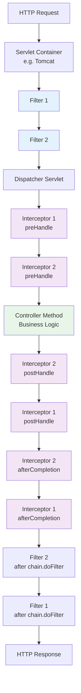
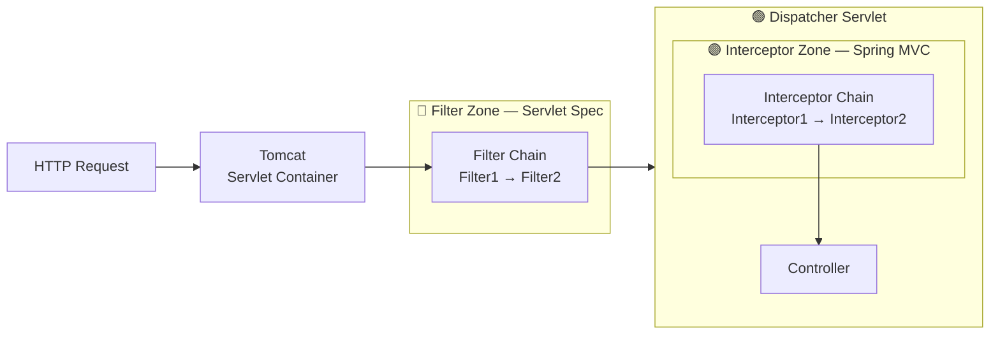
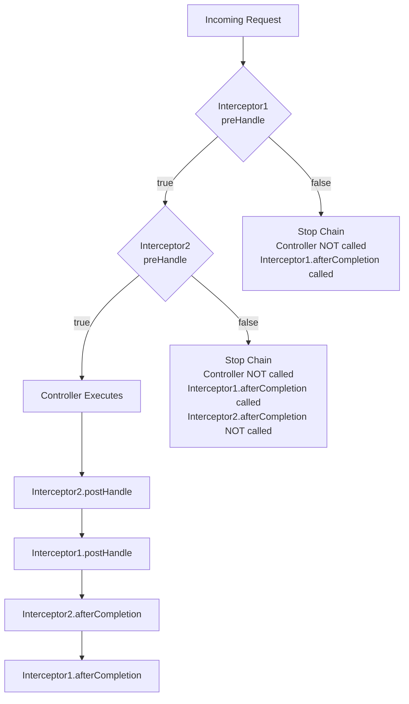
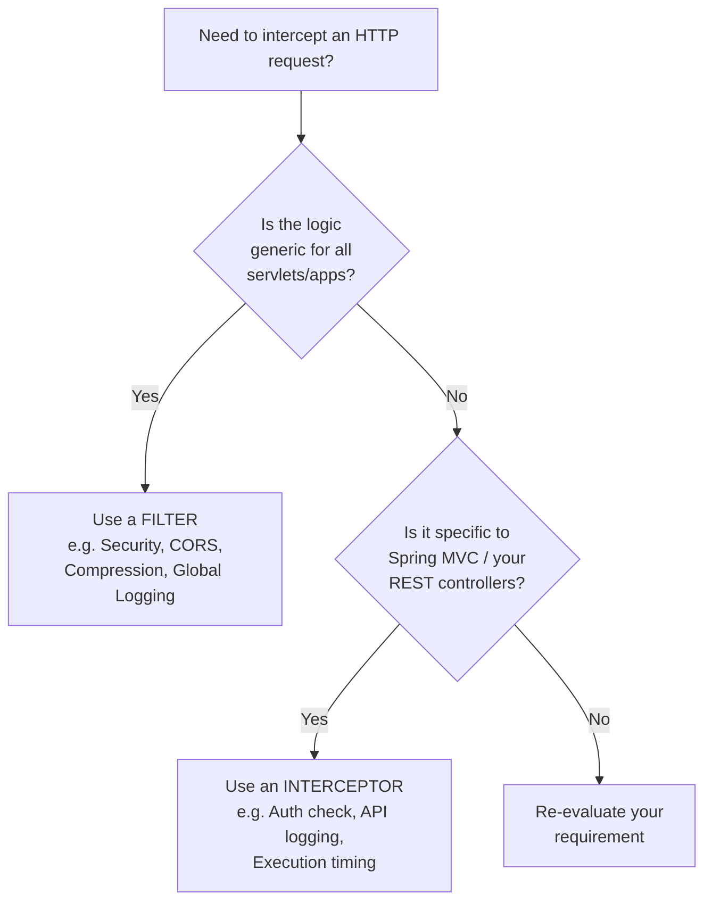
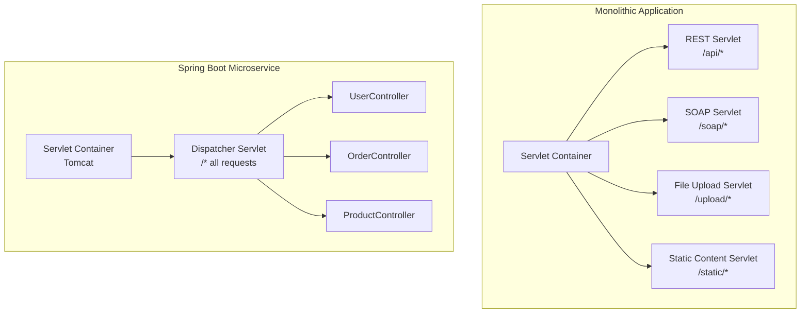

# 📌 Spring Boot — Filters vs Interceptors

> **Series:** Spring Boot Deep Dive | **Topic:** Filters vs Interceptors  
> **Level:** Intermediate | **Prerequisite:** Spring MVC, `@Controller`, Dispatcher Servlet basics

---

## Table of Contents

1. [Overview](#overview)
2. [One-Line Definitions](#one-line-definitions)
3. [The Big Picture — Request Lifecycle](#request-lifecycle)
4. [What is a Servlet?](#what-is-a-servlet)
5. [What is the Dispatcher Servlet?](#dispatcher-servlet)
6. [Filters — Deep Dive](#filters)
   - [Where Filters Live](#where-filters-live)
   - [Filter Interface Methods](#filter-interface-methods)
   - [Creating a Filter](#creating-a-filter)
   - [Registering a Filter with Order](#registering-a-filter)
   - [Filter Execution Order](#filter-execution-order)
7. [Interceptors — Deep Dive](#interceptors)
   - [Where Interceptors Live](#where-interceptors-live)
   - [Interceptor Interface Methods](#interceptor-interface-methods)
   - [Creating an Interceptor](#creating-an-interceptor)
   - [Registering Multiple Interceptors with Order](#registering-multiple-interceptors)
   - [Interceptor Execution Order](#interceptor-execution-order)
   - [preHandle Returning False](#prehandle-returning-false)
8. [Combined Request Flow — Filters + Interceptors Together](#combined-flow)
9. [When to Use What](#when-to-use-what)
10. [Filters vs Interceptors — Comparison Table](#comparison-table)
11. [Mermaid Diagrams](#mermaid-diagrams)
12. [Key Observations](#key-observations)
13. [Common Mistakes](#common-mistakes)
14. [Best Practices](#best-practices)
15. [Interview Notes](#interview-notes)
16. [Practice Questions](#practice-questions)
17. [Summary](#summary)

---

## Overview

When an HTTP request arrives at a Spring Boot application, it passes through several layers before reaching your controller method — and through several layers again on the way back. Two of the most important interception mechanisms along this path are **Filters** and **Interceptors**.

Both allow you to:
- Inspect and modify the incoming request
- Inspect and modify the outgoing response
- Execute logic before and after the core business code runs

But they sit at **different positions** in the request lifecycle, serve **different scopes**, and belong to **different frameworks** entirely. Knowing when to use each one is a frequently asked interview question and an important day-to-day architectural decision.

---

## One-Line Definitions

> **Filter** — Intercepts HTTP requests and responses **before they reach a Servlet**.

> **Interceptor** — Intercepts HTTP requests and responses **after the Servlet is chosen but before they reach the Controller** (and after the Controller responds).

Keep these definitions in mind. They will make complete sense once you see the full request lifecycle.

---

## Request Lifecycle

When an HTTP request enters a Spring Boot application, it travels through the following layers in order:

```
HTTP Request
    ↓
Servlet Container (e.g. Tomcat)
    ↓
[ Filter Chain ]         ← Filters live here
    ↓
Dispatcher Servlet       ← Servlet chosen
    ↓
[ Interceptor Chain ]    ← Interceptors live here
    ↓
Controller Method        ← Your business logic
    ↓
[ Interceptors (post) ]
    ↓
[ Filters (post) ]
    ↓
HTTP Response
```

This single diagram explains the entire Filter vs Interceptor story:
- **Filters** sit between the Servlet Container and the Servlet
- **Interceptors** sit between the Dispatcher Servlet and the Controller

---

## What is a Servlet?

Before understanding where Filters and Interceptors live, you must understand what a **Servlet** is.

### Definition

A **Servlet** is a plain Java class that:
- Accepts an incoming HTTP request
- Processes it
- Returns an HTTP response

The Servlet Container (e.g., Tomcat, Jetty) manages all Servlets and routes incoming requests to the appropriate one.

### Multiple Servlets in a Monolithic Application

In older monolithic applications, it was common to have multiple Servlets, each responsible for a different category of request:

| Servlet | Handles |
|---|---|
| `RestApiServlet` | All REST API calls (`/api/*`) |
| `SoapServlet` | All SOAP API calls |
| `FileUploadServlet` | File upload endpoints |
| `StaticContentServlet` | Images, CSS, JS files |

Each Servlet could declare which URL pattern it handles, and the Servlet Container would route requests accordingly.

### Servlets in Microservices / Spring Boot

In modern Spring Boot microservices, the need for multiple Servlets has greatly reduced. Spring Boot provides a single, powerful Servlet called the **Dispatcher Servlet** that handles **all requests** (default pattern: `/*`).

Instead of writing business logic directly in the Servlet (as was done in older code with factory-style if/else routing), Spring Boot's Dispatcher Servlet delegates to **Controllers** — which is where your business logic lives today.

---

## Dispatcher Servlet

The **Dispatcher Servlet** is Spring Boot's default Servlet. It:
- Handles all incoming HTTP requests (default pattern: `/*`)
- Determines which `@Controller` or `@RestController` should handle the request
- Creates the appropriate handler and invokes it
- Manages the response back to the client

```
Dispatcher Servlet responsibilities:
1. Receive request from Servlet Container
2. Consult Handler Mapping → find the right controller method
3. Invoke Interceptors (preHandle)
4. Call the Controller method
5. Invoke Interceptors (postHandle)
6. Render the response
7. Invoke Interceptors (afterCompletion)
```

> [!NOTE]
> The default URL pattern for the Dispatcher Servlet is `/*` — meaning it handles every incoming request. You can restrict this (e.g., to `/api/*`) via configuration, but this is rarely needed in microservices.

> [!IMPORTANT]
> Interceptors are a **Spring/Dispatcher Servlet concept**. They are managed by Spring and only apply to requests handled by the Dispatcher Servlet. Filters are a **Java Servlet specification concept** — they apply regardless of which Servlet handles the request.

---

## Filters

### Where Filters Live

Filters live **between the Servlet Container and the Servlet**. This means they execute before the Servlet Container has even decided which Servlet will handle the request.

```
HTTP Request → Servlet Container → [Filter 1 → Filter 2 → ...] → Servlet
```

Because Filters execute before Servlet selection, they are:
- **Framework-agnostic** — they work regardless of whether the underlying framework is Spring, plain Java EE, Jakarta EE, etc.
- **Servlet-agnostic** — they apply to ALL servlets, not just the Dispatcher Servlet
- **Scope: entire application** — every request passes through every configured filter

### Real-World Use Case — Spring Security

Spring Security uses Filters, not Interceptors, because security must be applied to **all HTTP requests regardless of the underlying servlet**. It is generic, cross-cutting infrastructure that should not be tied to Spring MVC's Dispatcher Servlet.

### Filter Interface Methods

The `Filter` interface (from `jakarta.servlet` or `javax.servlet`) defines three methods:

```java
public interface Filter {
    void init(FilterConfig filterConfig) throws ServletException;
    void doFilter(ServletRequest request, ServletResponse response, FilterChain chain)
            throws IOException, ServletException;
    void destroy();
}
```

| Method | When Called | Purpose |
|---|---|---|
| `init()` | Once when the Filter object is created | Initialization logic — set up resources, read config |
| `doFilter()` | On every matching request | Main processing logic — executed for each request |
| `destroy()` | Once when the Filter is destroyed | Cleanup — release resources |

#### `doFilter()` — The Core Method

`doFilter` is the main method. It receives:
- `ServletRequest request` — the incoming HTTP request
- `ServletResponse response` — the outgoing HTTP response
- `FilterChain chain` — the remaining filters and the eventual servlet

```java
@Override
public void doFilter(ServletRequest request, ServletResponse response, FilterChain chain)
        throws IOException, ServletException {

    // ✅ Logic BEFORE passing to next filter/servlet
    System.out.println("MyFilter: Before processing");

    chain.doFilter(request, response);  // ← Pass control to next filter or servlet

    // ✅ Logic AFTER the servlet/controller has processed
    System.out.println("MyFilter: After processing");
}
```

> [!IMPORTANT]
> `chain.doFilter(request, response)` passes control to the next Filter in the chain, or to the Servlet if no more Filters remain. If you do **not** call this, the request is terminated — no further filters, no servlet, no controller will be invoked.

---

### Creating a Filter

```java
import jakarta.servlet.Filter;
import jakarta.servlet.FilterChain;
import jakarta.servlet.FilterConfig;
import jakarta.servlet.ServletException;
import jakarta.servlet.ServletRequest;
import jakarta.servlet.ServletResponse;
import java.io.IOException;

public class MyFilter1 implements Filter {

    @Override
    public void init(FilterConfig filterConfig) throws ServletException {
        // Called once at startup. Initialize resources here if needed.
        System.out.println("MyFilter1: init");
    }

    @Override
    public void doFilter(ServletRequest request, ServletResponse response, FilterChain chain)
            throws IOException, ServletException {
        System.out.println("MyFilter1: inside - before processing");

        chain.doFilter(request, response);  // Continue to next filter or servlet

        System.out.println("MyFilter1: completed");
    }

    @Override
    public void destroy() {
        // Called once at shutdown. Clean up resources here.
        System.out.println("MyFilter1: destroy");
    }
}
```

---

### Registering a Filter with Order

Filters are registered as Spring beans using `FilterRegistrationBean`. The `setOrder()` method controls execution order — **lower number = runs first**.

```java
@Configuration
public class FilterConfig {

    @Bean
    public FilterRegistrationBean<MyFilter1> registerFilter1() {
        FilterRegistrationBean<MyFilter1> registration = new FilterRegistrationBean<>();
        registration.setFilter(new MyFilter1());
        registration.addUrlPatterns("/*");   // Apply to all URLs
        registration.setOrder(1);            // Order 1 = runs first
        return registration;
    }

    @Bean
    public FilterRegistrationBean<MyFilter2> registerFilter2() {
        FilterRegistrationBean<MyFilter2> registration = new FilterRegistrationBean<>();
        registration.setFilter(new MyFilter2());
        registration.addUrlPatterns("/*");
        registration.setOrder(2);            // Order 2 = runs second
        return registration;
    }
}
```

> [!NOTE]
> Notice that `MyFilter1` and `MyFilter2` do **not** have `@Component` annotation here — because we are manually creating instances via `new` inside the `FilterRegistrationBean`. If you add `@Component` to the filter class, Spring will auto-register it, but you lose control over ordering unless you also implement `Ordered` or use `@Order`.

---

### Filter Execution Order

With two filters configured (Filter1 order=1, Filter2 order=2):

```
Request  →  Filter1 (doFilter: before)
         →  Filter2 (doFilter: before)
         →  Dispatcher Servlet
         →  Controller (business logic)
         ←  Filter2 (doFilter: after chain.doFilter)
         ←  Filter1 (doFilter: after chain.doFilter)
Response
```

**Request path:** Filter1 → Filter2 → Servlet → Controller  
**Response path:** Controller → Servlet → Filter2 → Filter1

The response travels back in reverse filter order — same as how a stack unwinds.

---

## Interceptors

### Where Interceptors Live

Interceptors live **between the Dispatcher Servlet and the Controller**. They execute after the Servlet Container has chosen the Dispatcher Servlet but before the Dispatcher Servlet routes to a specific Controller method.

```
HTTP Request → Servlet Container → Filters → Dispatcher Servlet → [Interceptors] → Controller
```

Because Interceptors execute inside the Dispatcher Servlet, they are:
- **Spring MVC-specific** — they are a Spring framework concept
- **Dispatcher Servlet-specific** — they only apply to requests handled by the Dispatcher Servlet
- **Controller-aware** — they have access to the handler method that will be invoked
- **Application-specific** — best for logic tied to your application's REST API layer

### Interceptor Interface Methods

The `HandlerInterceptor` interface defines three methods:

```java
public interface HandlerInterceptor {
    boolean preHandle(HttpServletRequest request, HttpServletResponse response, Object handler)
            throws Exception;

    void postHandle(HttpServletRequest request, HttpServletResponse response, Object handler,
            ModelAndView modelAndView) throws Exception;

    void afterCompletion(HttpServletRequest request, HttpServletResponse response, Object handler,
            Exception ex) throws Exception;
}
```

| Method | Return Type | When Called | Purpose |
|---|---|---|---|
| `preHandle()` | `boolean` | Before controller method executes | Pre-processing — authentication, logging, validation |
| `postHandle()` | `void` | After controller method executes, before response is sent | Post-processing — modify ModelAndView |
| `afterCompletion()` | `void` | After complete request is finished (response sent) | Cleanup, resource release, final logging |

#### `preHandle()` — The Gate Keeper

`preHandle` is unique because it **returns a boolean**:
- `true` → proceed; pass the request to the next interceptor or controller
- `false` → stop; do NOT invoke the next interceptor or controller

```java
@Override
public boolean preHandle(HttpServletRequest request, HttpServletResponse response, Object handler)
        throws Exception {
    System.out.println("Interceptor1: preHandle");

    // Example: check for auth token
    String token = request.getHeader("Authorization");
    if (token == null) {
        response.setStatus(HttpServletResponse.SC_UNAUTHORIZED);
        return false;  // ← Stop the chain; controller will NOT be called
    }

    return true;  // ← Continue to next interceptor and then controller
}
```

> [!WARNING]
> If `preHandle()` returns `false`, Spring immediately stops the interceptor chain. No further `preHandle()` calls, no controller invocation, no `postHandle()` calls. However, `afterCompletion()` IS called for all interceptors whose `preHandle()` already returned `true`.

---

### Creating an Interceptor

```java
import jakarta.servlet.http.HttpServletRequest;
import jakarta.servlet.http.HttpServletResponse;
import org.springframework.stereotype.Component;
import org.springframework.web.servlet.HandlerInterceptor;
import org.springframework.web.servlet.ModelAndView;

@Component
public class MyCustomInterceptor1 implements HandlerInterceptor {

    @Override
    public boolean preHandle(HttpServletRequest request, HttpServletResponse response, Object handler)
            throws Exception {
        System.out.println("Interceptor1: preHandle");
        return true;  // Continue processing
    }

    @Override
    public void postHandle(HttpServletRequest request, HttpServletResponse response, Object handler,
            ModelAndView modelAndView) throws Exception {
        System.out.println("Interceptor1: postHandle");
    }

    @Override
    public void afterCompletion(HttpServletRequest request, HttpServletResponse response, Object handler,
            Exception ex) throws Exception {
        System.out.println("Interceptor1: afterCompletion");
    }
}
```

---

### Registering Multiple Interceptors with Order

Interceptors are registered by implementing `WebMvcConfigurer` and overriding `addInterceptors()`. The **order in which you add them** determines their execution order:

```java
import org.springframework.beans.factory.annotation.Autowired;
import org.springframework.context.annotation.Configuration;
import org.springframework.web.servlet.config.annotation.InterceptorRegistry;
import org.springframework.web.servlet.config.annotation.WebMvcConfigurer;

@Configuration
public class InterceptorConfig implements WebMvcConfigurer {

    @Autowired
    private MyCustomInterceptor1 interceptor1;

    @Autowired
    private MyCustomInterceptor2 interceptor2;

    @Override
    public void addInterceptors(InterceptorRegistry registry) {
        registry.addInterceptor(interceptor1);  // Added first → runs first on request
        registry.addInterceptor(interceptor2);  // Added second → runs second on request
    }
}
```

---

### Interceptor Execution Order

With two interceptors (Interceptor1 added first, Interceptor2 added second):

```
Request  →  Interceptor1.preHandle()
         →  Interceptor2.preHandle()
         →  Controller (business logic runs)
         ←  Interceptor2.postHandle()
         ←  Interceptor1.postHandle()
         ←  Interceptor2.afterCompletion()
         ←  Interceptor1.afterCompletion()
Response
```

**Request path (preHandle):** Interceptor1 → Interceptor2 → Controller  
**Response path (postHandle + afterCompletion):** Interceptor2 → Interceptor1

Again, the response unwinds in reverse order — mirror image of the request path.

---

### preHandle Returning False

```
Request  →  Interceptor1.preHandle() → returns true ✓
         →  Interceptor2.preHandle() → returns false ✗
         ✗  Controller is NOT invoked
         ✗  postHandle is NOT called for any interceptor
         ✓  Interceptor1.afterCompletion() IS called (its preHandle returned true)
         ✗  Interceptor2.afterCompletion() is NOT called (its own preHandle returned false)
Response (sent directly with whatever Interceptor2 wrote to response, e.g., 401)
```

---

## Combined Flow — Filters + Interceptors Together

When both Filters and Interceptors are configured, the full request/response lifecycle looks like this:

### Request Path (Incoming)

```
HTTP Request
    ↓
Servlet Container (Tomcat)
    ↓
Filter1.doFilter() [before chain.doFilter()]
    ↓
Filter2.doFilter() [before chain.doFilter()]
    ↓
Dispatcher Servlet
    ↓
Interceptor1.preHandle()
    ↓
Interceptor2.preHandle()
    ↓
Controller Method (business logic)
```

### Response Path (Outgoing)

```
Controller Method returns
    ↓
Interceptor2.postHandle()
    ↓
Interceptor1.postHandle()
    ↓
Interceptor2.afterCompletion()
    ↓
Interceptor1.afterCompletion()
    ↓
Filter2.doFilter() [after chain.doFilter()]
    ↓
Filter1.doFilter() [after chain.doFilter()]
    ↓
HTTP Response sent to client
```

### Full Console Output (Both Filters + Both Interceptors)

```
Filter1: inside - before processing
Filter2: inside - before processing
Interceptor1: preHandle
Interceptor2: preHandle
[Controller executes: hitting business logic]
Interceptor2: postHandle
Interceptor1: postHandle
Interceptor2: afterCompletion
Interceptor1: afterCompletion
Filter2: completed
Filter1: completed
```

---

## When to Use What

| Scenario | Use |
|---|---|
| Authentication / Authorization for all requests | **Filter** (Spring Security uses filters) |
| CORS headers on all responses | **Filter** |
| Request/Response logging for all endpoints | **Filter** |
| Request body compression / decompression | **Filter** |
| Rate limiting at the infrastructure level | **Filter** |
| Logging specific to your REST API layer | **Interceptor** |
| Checking custom headers before controller | **Interceptor** |
| Measuring controller execution time | **Interceptor** |
| Role-based access to specific API endpoints | **Interceptor** |
| Modifying ModelAndView before rendering | **Interceptor** (`postHandle`) |
| Cleanup after a specific controller completes | **Interceptor** (`afterCompletion`) |

### The Decision Rule

```
Is the logic generic and applicable to ALL servlets (not just Spring MVC)?
    YES → Use a Filter
    NO  → Is the logic specific to Spring MVC / your REST controllers?
              YES → Use an Interceptor
```

---

## Filters vs Interceptors — Comparison Table

| Feature | Filter | Interceptor |
|---|---|---|
| **Specification** | Java Servlet Specification (`jakarta.servlet`) | Spring Framework (`HandlerInterceptor`) |
| **Position in lifecycle** | Before Servlet | After Servlet, before Controller |
| **Scope** | All Servlets | Specific Servlet (Dispatcher Servlet) |
| **Framework dependency** | Framework-agnostic (works without Spring) | Spring MVC specific |
| **Access to Spring context** | ❌ Limited — not a Spring bean by default | ✅ Full Spring context access |
| **Access to handler info** | ❌ No | ✅ Yes — knows which controller method will run |
| **Main interface** | `jakarta.servlet.Filter` | `HandlerInterceptor` |
| **Key method** | `doFilter()` | `preHandle()`, `postHandle()`, `afterCompletion()` |
| **Stop the chain** | Do not call `chain.doFilter()` | Return `false` from `preHandle()` |
| **Ordering** | `FilterRegistrationBean.setOrder(n)` | Order of `addInterceptor()` calls |
| **Real-world use** | Spring Security, CORS, compression, logging | Auth checks, API logging, execution timing |

---

## Mermaid Diagrams

### Full Request Lifecycle



---

### Filter vs Interceptor — Position



---

### Interceptor preHandle Chain — False Return



---

### When to Choose Filter vs Interceptor



---

### Servlet Architecture — Monolithic vs Microservice



---

## Key Observations

1. **Filters are part of the Java Servlet specification** — they work with any Java web framework (Spring, Jakarta EE, plain servlets). Interceptors are **Spring MVC specific**.

2. **Filters execute before the Servlet Container decides which servlet to use** — they are truly framework-agnostic at the point they execute.

3. **Interceptors execute inside the Dispatcher Servlet** — they are Spring's way of adding pre/post logic around controller invocations.

4. **Both can modify request and response** — the choice between them is not about capability but about the appropriate position in the lifecycle and the scope of the concern being addressed.

5. **`preHandle()` returning `false` is a hard stop** — no controller, no subsequent `preHandle` calls. It is the correct way to reject a request at the interceptor level (e.g., return 401 Unauthorized).

6. **`chain.doFilter()` not being called in a Filter is a hard stop** — equivalent to `preHandle` returning `false`.

7. **Response path is always the reverse of the request path** — both for filters and interceptors. This is the "stack unwind" pattern — last in, first out.

8. **Spring Security is entirely built on Filters** — it creates a chain of security filters (`SecurityFilterChain`) that sits in the Filter layer, completely before Spring MVC. This is by design so that security applies to all HTTP traffic.

9. **Interceptors have access to the handler object** — they know which controller method will be called, which Filters do not. This allows interceptors to read controller-level annotations for fine-grained logic.

10. **You can have multiple Filters and multiple Interceptors** — both support ordering to control execution sequence.

---

## Common Mistakes

### Mistake 1 — Using Interceptor for Global Security

```java
// ❌ Wrong — Interceptors only cover the Dispatcher Servlet
// If you have other servlets, they won't be protected
@Component
public class SecurityInterceptor implements HandlerInterceptor {
    @Override
    public boolean preHandle(...) {
        // This only intercepts requests going to Spring MVC controllers
        // Requests to other servlets bypass this entirely
    }
}

// ✅ Correct — Spring Security uses Filters for global coverage
// Spring Security's FilterChain covers all HTTP traffic
```

---

### Mistake 2 — Forgetting to Call `chain.doFilter()`

```java
// ❌ Wrong — request terminates here, controller never runs
@Override
public void doFilter(ServletRequest req, ServletResponse res, FilterChain chain)
        throws IOException, ServletException {
    System.out.println("Before");
    // Missing chain.doFilter(req, res) !
    System.out.println("After");
}

// ✅ Correct
@Override
public void doFilter(ServletRequest req, ServletResponse res, FilterChain chain)
        throws IOException, ServletException {
    System.out.println("Before");
    chain.doFilter(req, res);  // Must call this to continue
    System.out.println("After");
}
```

---

### Mistake 3 — Confusing Interceptor Ordering with Filter Ordering

Filters use `FilterRegistrationBean.setOrder(n)` — lower number runs first.  
Interceptors use the order they are added to the `InterceptorRegistry` — first added runs first.

```java
// ✅ Filter ordering — explicit numeric order
registration1.setOrder(1);   // runs first
registration2.setOrder(2);   // runs second

// ✅ Interceptor ordering — positional order in addInterceptors
registry.addInterceptor(interceptor1);  // runs first
registry.addInterceptor(interceptor2);  // runs second
```

---

### Mistake 4 — Expecting `postHandle` to Run When `preHandle` Returns False

If any `preHandle` returns `false`, `postHandle` is **not called** for any interceptor. Only `afterCompletion` is called for interceptors whose `preHandle` already returned `true`.

---

## Best Practices

1. **Use Filters for cross-cutting infrastructure concerns** — authentication tokens, CORS, request/response logging at the HTTP level, compression.

2. **Use Interceptors for application-layer concerns** — validating business-specific headers, logging at the API level, measuring controller execution time.

3. **Keep Filters lean** — since they run for every request before any Spring processing, expensive logic here impacts all traffic.

4. **Use `preHandle` for early rejection** — it is the cleanest point to reject unauthorized or invalid requests before any business logic runs.

5. **Use `afterCompletion` for cleanup** — it always runs (even when exceptions occur), making it ideal for releasing resources, closing connections, or final audit logging.

6. **Name your filters and interceptors clearly** — `AuthenticationFilter`, `CorrelationIdInterceptor`, `ExecutionTimingInterceptor`. The name should state the purpose.

7. **Prefer Spring Security for authentication/authorization** — do not implement security from scratch using custom Filters or Interceptors unless you have a very specific reason.

8. **Be explicit about URL patterns** — when registering filters with `FilterRegistrationBean`, always specify `addUrlPatterns()`. A filter that applies to everything when it only needs to apply to `/api/*` wastes CPU cycles.

---

## Interview Notes

### Commonly Asked Questions

**Q: What is the difference between a Filter and an Interceptor?**  
A: A Filter intercepts HTTP requests before they reach a Servlet — it is part of the Java Servlet spec and applies to all servlets. An Interceptor is Spring MVC-specific and intercepts requests after the Dispatcher Servlet is chosen but before the Controller is invoked. Filters are framework-agnostic; Interceptors are Spring-specific.

**Q: Where does a Filter sit in the request lifecycle?**  
A: Between the Servlet Container (e.g., Tomcat) and the Servlet (e.g., Dispatcher Servlet).

**Q: Where does an Interceptor sit in the request lifecycle?**  
A: Between the Dispatcher Servlet and the Controller.

**Q: Why does Spring Security use Filters and not Interceptors?**  
A: Spring Security needs to secure all HTTP traffic, regardless of which servlet handles it. Interceptors only apply to requests going through the Dispatcher Servlet. By using Filters, Spring Security can intercept every request at the servlet container level, before any framework-specific processing.

**Q: What happens if `preHandle()` returns `false`?**  
A: The entire chain stops. No further `preHandle()` calls, no controller invocation, no `postHandle()` calls. `afterCompletion()` is called only for interceptors whose `preHandle()` already returned `true`.

**Q: Can you modify the request/response in both Filters and Interceptors?**  
A: Yes, both have access to the `HttpServletRequest` and `HttpServletResponse` objects and can read/modify headers, body (using wrapper classes), etc. The choice is about scope and position, not capability.

**Q: What is the execution order when you have 2 Filters and 2 Interceptors?**  
A: Request: Filter1 → Filter2 → Interceptor1.preHandle → Interceptor2.preHandle → Controller. Response: Interceptor2.postHandle → Interceptor1.postHandle → Interceptor2.afterCompletion → Interceptor1.afterCompletion → Filter2 → Filter1.

**Q: How do you control the order of Filters? Of Interceptors?**  
A: Filters — use `FilterRegistrationBean.setOrder(n)`, lower number runs first. Interceptors — the order they are added via `registry.addInterceptor()` in `WebMvcConfigurer.addInterceptors()`.

**Q: Can an Interceptor access which controller method is going to handle the request?**  
A: Yes — the `handler` parameter in `preHandle(request, response, handler)` is typically a `HandlerMethod` object that exposes the controller class and method, including their annotations.

---

## Practice Questions

### Easy

1. What is the Java interface you implement to create a Filter?
2. What is the Spring interface you implement to create an Interceptor?
3. In what order do Filters execute on the response — same as request or reversed?
4. What does `chain.doFilter()` do? What happens if you don't call it?

### Medium

5. You need to add a `X-Correlation-ID` header to every request for distributed tracing. Should you use a Filter or Interceptor? Why?
6. You need to check that a user has the `ADMIN` role before certain controller methods execute. Should you use a Filter or Interceptor? What are the trade-offs?
7. Explain the method execution order for `preHandle`, `postHandle`, and `afterCompletion` when two interceptors are registered and the second interceptor's `preHandle` returns `false`.
8. Write a Filter that logs the HTTP method, URL, and response status code for every request.

### Hard

9. You have a Spring Boot application with both a Dispatcher Servlet (`/*`) and a custom `FileUploadServlet` (`/upload/*`). You register an Interceptor for your application. Will it intercept requests to `/upload/*`? Why or why not? How would you intercept those requests?
10. Describe in detail the full lifecycle of an HTTP `GET /api/users` request through a Spring Boot application that has: 2 Filters, 2 Interceptors, and a `@RestController`. Include both request and response paths.
11. A developer wants to implement request throttling (rate limiting) and puts it in an Interceptor. A security review flags this as incorrect placement. What is the reviewer's concern and what is the correct solution?
12. How does Spring Security's `SecurityFilterChain` relate to the Filter concept discussed in this guide? Why is it implemented as a Filter chain rather than an Interceptor chain?

---

## Summary

| Concept | Key Point |
|---|---|
| **Filter** | Java Servlet Specification; sits before the Servlet; applies to all servlets |
| **Interceptor** | Spring MVC specific; sits between Dispatcher Servlet and Controller |
| **Servlet** | Java class that processes HTTP requests and returns responses |
| **Dispatcher Servlet** | Spring Boot's default servlet; routes all requests to Controllers |
| **Filter interface** | `jakarta.servlet.Filter` → `init()`, `doFilter()`, `destroy()` |
| **Interceptor interface** | `HandlerInterceptor` → `preHandle()`, `postHandle()`, `afterCompletion()` |
| **`chain.doFilter()`** | Passes control to next Filter or Servlet; must be called to continue |
| **`preHandle()` returns false** | Hard stop; no controller, no postHandle; afterCompletion runs for already-true interceptors |
| **Request order** | Filter1 → Filter2 → Interceptor1 → Interceptor2 → Controller |
| **Response order** | Controller → Interceptor2 → Interceptor1 → Filter2 → Filter1 |
| **Filter ordering** | `FilterRegistrationBean.setOrder(n)` — lower number first |
| **Interceptor ordering** | Order of `registry.addInterceptor()` calls |
| **Use Filters for** | Security, CORS, compression, global logging — framework-agnostic concerns |
| **Use Interceptors for** | Application-layer logging, auth header checks, execution timing — Spring MVC concerns |
| **Spring Security uses** | Filters — because security must apply before any servlet, not just Dispatcher Servlet |

> [!IMPORTANT]
> Both Filters and Interceptors can read and modify the request and response. The decision between them is **not** about capability — it is about **scope** (all servlets vs one servlet) and **position** in the lifecycle (pre-servlet vs pre-controller).

---

*End of Filters vs Interceptors Study Guide*
