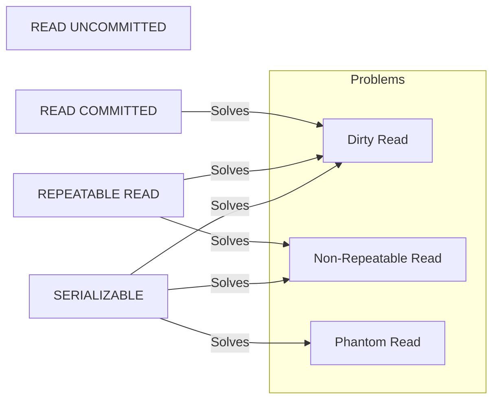
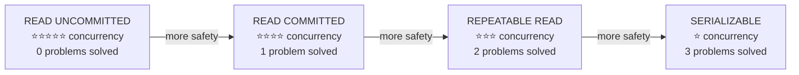
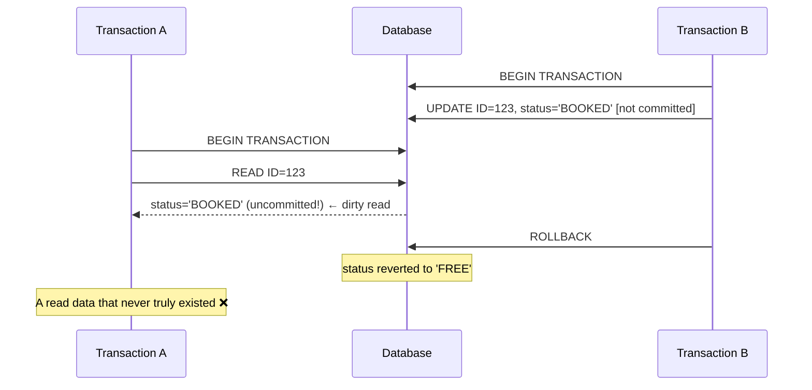
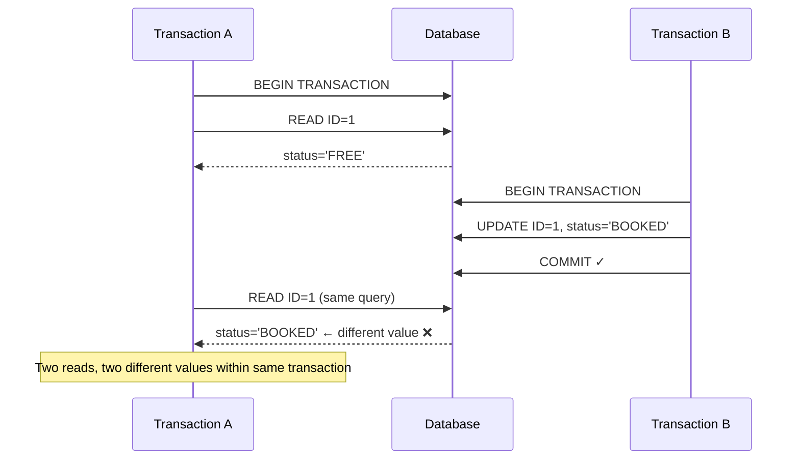
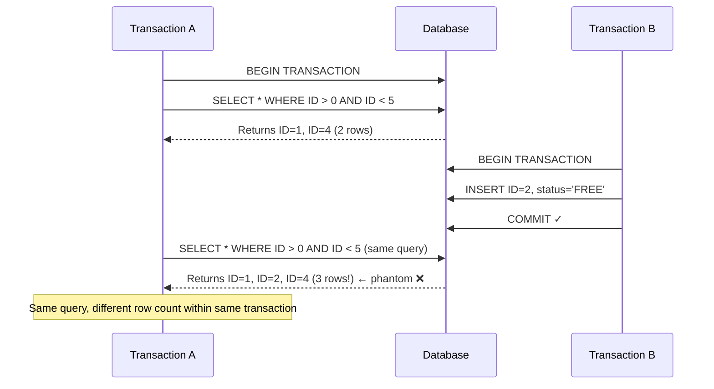
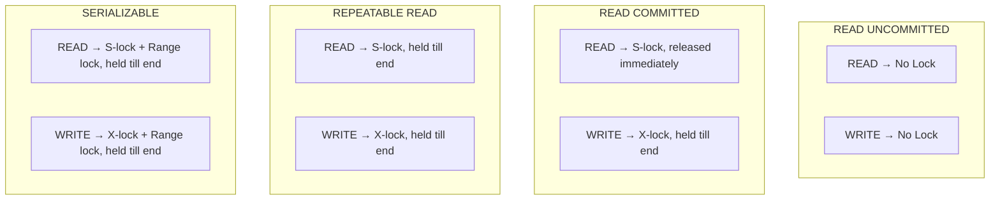
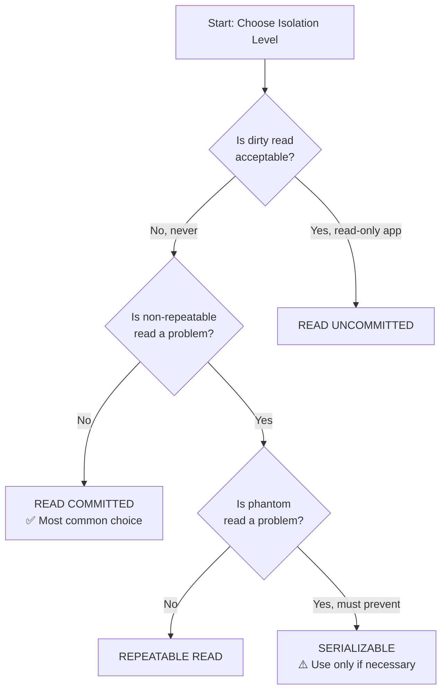

# 📌 Spring Boot — Transaction Isolation Levels

> **Series:** Spring Boot Deep Dive | **Topic:** Transaction Management — Part 3: Isolation Levels  
> **Level:** Intermediate → Advanced | **Prerequisite:** Spring Transactions, `@Transactional`, Basic SQL

---

## Table of Contents

1. [Overview](#overview)
2. [Why Isolation Levels Exist](#why-isolation-levels-exist)
3. [The Three Concurrency Problems](#the-three-concurrency-problems)
   - [Dirty Read](#dirty-read)
   - [Non-Repeatable Read](#non-repeatable-read)
   - [Phantom Read](#phantom-read)
4. [Database Locking Fundamentals](#database-locking-fundamentals)
   - [Shared Lock (Read Lock)](#shared-lock)
   - [Exclusive Lock (Write Lock)](#exclusive-lock)
   - [Lock Compatibility Matrix](#lock-compatibility-matrix)
5. [The Four Isolation Levels](#the-four-isolation-levels)
   - [READ UNCOMMITTED](#read-uncommitted)
   - [READ COMMITTED](#read-committed)
   - [REPEATABLE READ](#repeatable-read)
   - [SERIALIZABLE](#serializable)
6. [Isolation Level Comparison Table](#isolation-level-comparison-table)
7. [How to Configure Isolation in Spring Boot](#how-to-configure-in-spring-boot)
8. [Default Isolation Levels by Database](#default-isolation-levels-by-database)
9. [Where Locking Code Actually Lives](#where-locking-code-lives)
10. [Mermaid Diagrams](#mermaid-diagrams)
11. [Concurrency vs Safety Trade-off](#concurrency-vs-safety)
12. [Key Observations](#key-observations)
13. [Common Mistakes](#common-mistakes)
14. [Best Practices](#best-practices)
15. [Interview Notes](#interview-notes)
16. [Practice Questions](#practice-questions)
17. [Summary](#summary)

---

## Overview

**Transaction Isolation Level** defines how changes made by one transaction are visible to other transactions running in parallel.

It is a critical concept in:
- **Concurrency control** — how many transactions can run simultaneously
- **Data consistency** — ensuring each transaction sees a correct and predictable view of the data
- **High-Level Design (HLD)** interviews — a common and important topic

In one line:

> *Isolation level tells how the changes made by one transaction are visible to other transactions running in parallel.*

---

## Why Isolation Levels Exist

In any production system, thousands of database transactions may run concurrently. Without isolation controls, transactions can interfere with each other, causing data anomalies. Isolation levels are the mechanism databases provide to manage this interference.

The challenge is a fundamental trade-off:

```
HIGH CONCURRENCY  ←————————————→  HIGH DATA SAFETY
(more parallel txns)               (fewer anomalies)
READ UNCOMMITTED → READ COMMITTED → REPEATABLE READ → SERIALIZABLE
```

You cannot have maximum concurrency and maximum safety simultaneously. You must choose where on this spectrum your application needs to sit, based on its business requirements.

---

## The Three Concurrency Problems

Before understanding isolation levels, you must understand the three problems they solve. Each isolation level is defined by which of these problems it resolves.

---

### Dirty Read

#### Definition

> Transaction A reads the **uncommitted** data written by Transaction B. If Transaction B later rolls back, Transaction A has read data that never truly existed in the database — this is a **dirty read**.

#### Timeline Example

```
Time    Transaction A                   Transaction B           DB State
─────────────────────────────────────────────────────────────────────────
T1      BEGIN TRANSACTION               BEGIN TRANSACTION       ID=123, status=FREE
T2                                      UPDATE row 123
                                        SET status='BOOKED'
                                        [NOT YET COMMITTED]     ID=123, status=BOOKED (uncommitted)
T3      READ row 123
        → reads status='BOOKED'  ←── reads uncommitted data!
T4                                      ROLLBACK                ID=123, status=FREE  (reverted)
T5      Transaction A now holds
        status='BOOKED' which does
        not exist in the DB ❌
```

#### Why It's a Problem

Transaction A made a business decision based on `status='BOOKED'`, but that state never actually committed. The data Transaction A read was a **ghost** — it was rolled back. Any action Transaction A took based on that data (booking a seat, reserving inventory) is now incorrect.

---

### Non-Repeatable Read

#### Definition

> Transaction A reads the **same row** multiple times within the same transaction and gets **different values** each time, because another transaction committed an update in between.

#### Timeline Example

```
Time    Transaction A                   Transaction B           DB State
─────────────────────────────────────────────────────────────────────────
T1      BEGIN TRANSACTION                                       ID=1, status=FREE
T2      READ row ID=1
        → status='FREE' ✓
T3                                      BEGIN TRANSACTION
                                        UPDATE row ID=1
                                        SET status='BOOKED'
                                        COMMIT ✓               ID=1, status=BOOKED
T4      READ row ID=1 again
        → status='BOOKED' ❌
        (different from T2 read!)
```

#### Why It's a Problem

Transaction A is doing a multi-step business operation that reads the same row twice — perhaps for validation before proceeding. Between its two reads, the data changed (committed by another transaction). Transaction A now has an inconsistent view within its own lifecycle.

---

### Phantom Read

#### Definition

> Transaction A executes the **same query** multiple times within the same transaction but gets a **different set of rows** each time, because another transaction inserted or deleted rows that fall within the query's range.

#### Timeline Example

```
Time    Transaction A                   Transaction B           DB State
─────────────────────────────────────────────────────────────────────────
T1      BEGIN TRANSACTION                                       ID=1 (FREE), ID=4 (PENDING)
T2      SELECT * WHERE ID > 0
        AND ID < 5
        → returns 2 rows (ID=1, ID=4)
T3                                      BEGIN TRANSACTION
                                        INSERT row ID=2
                                        (status='FREE')
                                        COMMIT ✓               ID=1, ID=2 (new!), ID=4
T4      SELECT * WHERE ID > 0
        AND ID < 5 (same query!)
        → returns 3 rows ❌
        (ID=1, ID=2, ID=4)
        — a "phantom" row appeared!
```

#### Key Distinction — Non-Repeatable vs Phantom

| Problem | What Changed | Type of Change |
|---|---|---|
| Non-Repeatable Read | Same row, different **value** | UPDATE to existing row |
| Phantom Read | Same query, different **row count** | INSERT or DELETE of rows |

---

## Database Locking Fundamentals

Isolation levels are implemented using database locks. Understanding locks is essential to understanding how each isolation level works under the hood.

---

### Shared Lock

**Also known as:** Read Lock | Symbol: `S`

- Multiple transactions can **simultaneously** hold a shared lock on the same row
- A shared lock **only permits reading** — no modifications allowed while held
- Think of it as: *"Everyone is allowed to look, but nobody is allowed to touch"*

```
DB Row: ID=1, status=FREE

Transaction T1: acquires S-lock on ID=1 → reads status=FREE ✓
Transaction T2: acquires S-lock on ID=1 → reads status=FREE ✓  (allowed — shared!)
Transaction T3: wants to UPDATE ID=1    → BLOCKED ✗             (cannot get X-lock while S-lock held)
```

---

### Exclusive Lock

**Also known as:** Write Lock | Symbol: `X`

- Only **one** transaction can hold an exclusive lock at a time
- An exclusive lock **blocks everyone else** — no reads, no writes from other transactions
- Think of it as: *"I am modifying this. Nobody else can even look at it until I'm done."*

```
DB Row: ID=1, status=FREE

Transaction T1: acquires X-lock on ID=1 → updating status to BOOKED
Transaction T2: wants to READ ID=1      → BLOCKED ✗  (cannot get S-lock while X-lock held)
Transaction T3: wants to UPDATE ID=1    → BLOCKED ✗  (cannot get X-lock while X-lock held)
```

---

### Lock Compatibility Matrix

| Lock Held \ Lock Requested | Shared (S) | Exclusive (X) |
|---|---|---|
| **Shared (S)** | ✅ Compatible | ❌ Blocked |
| **Exclusive (X)** | ❌ Blocked | ❌ Blocked |

> [!IMPORTANT]
> You can layer multiple shared locks (many readers). But as soon as any exclusive lock enters the picture, all other access is blocked — both reads and writes.

---

## The Four Isolation Levels

---

### READ UNCOMMITTED

#### What It Does

The weakest isolation level. Transactions can read data that has been written by other transactions but **not yet committed**. No locks are acquired during reads. No locks are held during writes either.

#### Locking Behaviour

| Operation | Lock Acquired | Lock Released |
|---|---|---|
| READ | ❌ None | — |
| WRITE | ❌ None | — |

#### Problems Solved

| Dirty Read | Non-Repeatable Read | Phantom Read |
|---|---|---|
| ❌ Not solved | ❌ Not solved | ❌ Not solved |

#### Why All Three Problems Exist

Since no locks are acquired at all, there is nothing stopping:
- Transaction B writing uncommitted data that Transaction A reads (dirty read)
- Transaction B committing an update between two reads by Transaction A (non-repeatable read)
- Transaction B inserting new rows between two range queries by Transaction A (phantom read)

#### Why Does This Level Even Exist?

> [!NOTE]
> READ UNCOMMITTED is only useful when your application is **read-only** and your data is **static or near-static**. In such a scenario, the three concurrency problems are not a concern because nothing is being written concurrently. The advantage is maximum concurrency — no transaction ever waits for a lock.

#### Concurrency

⭐⭐⭐⭐⭐ Maximum — no transaction ever blocks

#### When to Use

Only in read-only reporting applications where stale or approximate data is acceptable and performance is the top priority.

---

### READ COMMITTED

#### What It Does

Prevents dirty reads by ensuring a transaction can only read data that has been **committed** by another transaction. The most commonly used isolation level in production.

#### Locking Behaviour

| Operation | Lock Acquired | Lock Released |
|---|---|---|
| READ | ✅ Shared (S) | ⚡ Immediately after read |
| WRITE | ✅ Exclusive (X) | 🔚 At end of transaction (commit/rollback) |

#### Problems Solved

| Dirty Read | Non-Repeatable Read | Phantom Read |
|---|---|---|
| ✅ Solved | ❌ Not solved | ❌ Not solved |

#### How Dirty Read is Solved

```
Time    Transaction A                   Transaction B
─────────────────────────────────────────────────────
T1      -                               BEGIN TRANSACTION
                                        UPDATE ID=1 → 'BOOKED'
                                        → acquires X-lock on ID=1
                                        [NOT COMMITTED YET]
T2      BEGIN TRANSACTION
        READ ID=1
        → wants S-lock on ID=1
        → BLOCKED ✗ (X-lock held by B)
        → waits...
T3      -                               ROLLBACK
                                        → X-lock released
T4      READ ID=1
        → S-lock acquired ✓
        → reads status='FREE' ✓
        → S-lock released immediately
```

Since Transaction A cannot acquire even a shared lock while Transaction B holds an exclusive lock, it is forced to wait. By the time A can read, B has either committed or rolled back. So A always reads committed data — no dirty reads.

#### Why Non-Repeatable Read is NOT Solved

```
Time    Transaction A                   Transaction B
─────────────────────────────────────────────────────
T1      BEGIN TRANSACTION
        READ ID=1 → 'FREE'
        → S-lock acquired, then RELEASED immediately ←─ key!
T2                                      BEGIN TRANSACTION
                                        UPDATE ID=1 → 'BOOKED'
                                        COMMIT ✓
                                        → X-lock released
T3      READ ID=1 again → 'BOOKED' ❌
```

Because the S-lock was released immediately after the first read, Transaction B was free to modify the row and commit. Transaction A's second read picks up the new committed value — a non-repeatable read.

#### Why Phantom Read is NOT Solved

Because the S-lock is released immediately after reading, there is no lock on the **range** of rows. Another transaction can freely insert new rows into the range and commit them before Transaction A runs the same query again.

#### Concurrency

⭐⭐⭐⭐ High — readers only block writers during writes; readers don't block each other

#### When to Use

- Default for most OLTP applications
- When dirty reads are unacceptable but you can tolerate a value changing between reads in the same transaction
- When non-repeatable reads will not break your business logic

---

### REPEATABLE READ

#### What It Does

Extends READ COMMITTED by **holding the shared lock for the entire duration of the transaction** (not releasing after each read). This prevents any other transaction from modifying a row that has been read, until the current transaction completes.

#### Locking Behaviour

| Operation | Lock Acquired | Lock Released |
|---|---|---|
| READ | ✅ Shared (S) | 🔚 At end of transaction |
| WRITE | ✅ Exclusive (X) | 🔚 At end of transaction |

#### Problems Solved

| Dirty Read | Non-Repeatable Read | Phantom Read |
|---|---|---|
| ✅ Solved | ✅ Solved | ❌ Not solved |

#### How Non-Repeatable Read is Solved

```
Time    Transaction A                   Transaction B
─────────────────────────────────────────────────────
T1      BEGIN TRANSACTION
        READ ID=1 → 'FREE'
        → S-lock acquired on ID=1
        → lock HELD (not released!) ←─ key change!
T2                                      BEGIN TRANSACTION
                                        UPDATE ID=1 → 'BOOKED'
                                        → wants X-lock on ID=1
                                        → BLOCKED ✗ (S-lock held by A)
T3      READ ID=1 again → 'FREE' ✓
        (same value — consistent!)
T4      COMMIT / ROLLBACK
        → S-lock released
T5                                      → X-lock now acquired ✓
                                        UPDATE committed ✓
```

By holding the S-lock until the transaction ends, no other transaction can acquire an X-lock to modify the row. Transaction A is guaranteed to see the same value on every read of that row.

#### How Dirty Read is Also Solved

Same mechanism as READ COMMITTED — exclusive locks are held until commit/rollback, so no uncommitted data can be read.

#### Why Phantom Read is NOT Solved

```
Time    Transaction A                   Transaction B
─────────────────────────────────────────────────────
T1      BEGIN TRANSACTION
        SELECT * WHERE ID > 0 AND ID < 5
        → rows returned: ID=1, ID=4
        → S-lock on ID=1 and ID=4 ✓
        [NO LOCK on "gaps" between rows]
T2                                      BEGIN TRANSACTION
                                        INSERT ID=2, status='FREE'
                                        → no lock exists on ID=2 slot ✓
                                        COMMIT ✓
T3      SELECT * WHERE ID > 0 AND ID < 5
        → rows returned: ID=1, ID=2, ID=4 ❌
        (phantom row ID=2 appeared!)
```

REPEATABLE READ locks existing rows but does **not** lock the gaps between them. A new row can be inserted into a gap, and it will appear in the next range query — a phantom read.

#### Concurrency

⭐⭐⭐ Medium — rows being read are locked for the entire transaction duration

#### When to Use

- When your transaction reads the same row multiple times and must get consistent results
- Financial calculations, inventory checks, report generation within a transaction

---

### SERIALIZABLE

#### What It Does

The strongest isolation level. Fully eliminates all three concurrency problems by additionally applying **range locks** (also called gap locks or predicate locks). No other transaction can insert rows into any range that the current transaction has queried.

Transactions execute as if they were running **one at a time** (serially) — even though they may actually overlap in time.

#### Locking Behaviour

| Operation | Lock Acquired | Lock Released |
|---|---|---|
| READ | ✅ Shared (S) + Range lock | 🔚 At end of transaction |
| WRITE | ✅ Exclusive (X) + Range lock | 🔚 At end of transaction |

#### Problems Solved

| Dirty Read | Non-Repeatable Read | Phantom Read |
|---|---|---|
| ✅ Solved | ✅ Solved | ✅ Solved |

#### How Phantom Read is Solved — Range Lock

```
Time    Transaction A                   Transaction B
─────────────────────────────────────────────────────
T1      BEGIN TRANSACTION
        SELECT * WHERE ID > 0 AND ID < 5
        → rows: ID=1, ID=4
        → S-lock on ID=1 ✓
        → S-lock on ID=4 ✓
        → RANGE LOCK on [0..5] ✓ ←─ key addition!
           (locks the entire range,
            including gaps)
T2                                      BEGIN TRANSACTION
                                        INSERT ID=2, status='FREE'
                                        → wants to write into [0..5] range
                                        → BLOCKED ✗ (range lock held by A)
T3      SELECT * WHERE ID > 0 AND ID < 5
        → rows: ID=1, ID=4 ✓
        (same result — no phantom!)
T4      COMMIT → all locks released
T5                                      → INSERT now proceeds ✓
                                        COMMIT ✓
```

By locking the entire range of the predicate (including gaps where new rows could be inserted), no other transaction can insert a phantom row that would change the result set.

#### Concurrency

⭐ Minimum — very few transactions can run in parallel; many must wait for locks

#### When to Use

- Financial systems where absolute consistency is required (e.g., double-entry accounting)
- Seat reservation / ticket booking where overbooking is catastrophic
- Any scenario where phantom reads would cause a serious business error

> [!CAUTION]
> SERIALIZABLE can cause severe performance degradation and deadlocks in high-traffic systems. Use it only when lower isolation levels provably cannot meet your consistency requirements.

---

## Isolation Level Comparison Table

| Isolation Level | Dirty Read | Non-Repeatable Read | Phantom Read | Concurrency | Read Lock | Write Lock |
|---|---|---|---|---|---|---|
| **READ UNCOMMITTED** | ❌ Possible | ❌ Possible | ❌ Possible | ⭐⭐⭐⭐⭐ Max | None | None |
| **READ COMMITTED** | ✅ Prevented | ❌ Possible | ❌ Possible | ⭐⭐⭐⭐ High | S — released immediately | X — held till end |
| **REPEATABLE READ** | ✅ Prevented | ✅ Prevented | ❌ Possible | ⭐⭐⭐ Medium | S — held till end | X — held till end |
| **SERIALIZABLE** | ✅ Prevented | ✅ Prevented | ✅ Prevented | ⭐ Low | S + Range — held till end | X + Range — held till end |

---

## How to Configure in Spring Boot

```java
import org.springframework.transaction.annotation.Isolation;
import org.springframework.transaction.annotation.Transactional;

@Service
public class BookingService {

    // READ UNCOMMITTED
    @Transactional(isolation = Isolation.READ_UNCOMMITTED)
    public void readUncommittedExample() { ... }

    // READ COMMITTED
    @Transactional(isolation = Isolation.READ_COMMITTED)
    public void readCommittedExample() { ... }

    // REPEATABLE READ
    @Transactional(isolation = Isolation.REPEATABLE_READ)
    public void repeatableReadExample() { ... }

    // SERIALIZABLE
    @Transactional(isolation = Isolation.SERIALIZABLE)
    public void serializableExample() { ... }

    // DEFAULT — uses the database's default isolation level
    @Transactional(isolation = Isolation.DEFAULT)
    public void defaultIsolationExample() { ... }
}
```

> [!NOTE]
> `Isolation.DEFAULT` tells Spring to use whatever the underlying database has configured as its default. This is the behaviour when you write `@Transactional` with no isolation parameter at all.

### The `Isolation` Enum

| Enum Constant | SQL Standard Level |
|---|---|
| `Isolation.DEFAULT` | Uses DB default |
| `Isolation.READ_UNCOMMITTED` | READ UNCOMMITTED |
| `Isolation.READ_COMMITTED` | READ COMMITTED |
| `Isolation.REPEATABLE_READ` | REPEATABLE READ |
| `Isolation.SERIALIZABLE` | SERIALIZABLE |

---

## Default Isolation Levels by Database

> [!WARNING]
> The default isolation level is **not universal**. Always check your database's documentation.

| Database | Default Isolation Level |
|---|---|
| **PostgreSQL** | READ COMMITTED |
| **MySQL (InnoDB)** | REPEATABLE READ |
| **Oracle** | READ COMMITTED |
| **SQL Server** | READ COMMITTED |
| **H2** | READ COMMITTED |

> [!IMPORTANT]
> Do not assume the default. Read your database documentation and test your application's behaviour explicitly. The isolation level your application sees may also depend on connection pool settings and JDBC driver configuration.

---

## Where Locking Code Lives

A common question: *"I only write SELECT/INSERT/UPDATE queries in my Java code — where does the locking actually happen?"*

The answer is: **in the Database Transaction Manager**, not in your application code.

```
Your Java Code                  Spring Framework          Database
─────────────────────────────────────────────────────────────────
@Transactional                  reads isolation level
(isolation = READ_COMMITTED)    from annotation
                                    ↓
String result =                 passes isolation level
repository.findById(id);        to JDBC connection
                                    ↓
                                                         DB Transaction Manager
                                                         applies locking rules:
                                                         - acquires S-lock on read
                                                         - releases S-lock after read
                                                         - acquires X-lock on write
                                                         - holds X-lock till commit
```

As an application developer, you simply:
1. Write your SQL queries normally
2. Annotate your method with `@Transactional(isolation = ...)`

The database's transaction manager handles all the locking details — when to acquire, what type, when to release — based on the isolation level you specified. This is fully abstracted from your application layer.

---

## Mermaid Diagrams

### Isolation Levels — Problem Resolution Map



---

### Concurrency vs Safety Trade-off



---

### Dirty Read Timeline



---

### Non-Repeatable Read Timeline



---

### Phantom Read Timeline



---

### Lock Strategy by Isolation Level



---

### Isolation Level Decision Flowchart



---

## Concurrency vs Safety

Understanding this trade-off is critical for both production architecture and interviews.

| Isolation Level | What is locked | Lock Duration | Concurrency Impact |
|---|---|---|---|
| READ UNCOMMITTED | Nothing | — | Zero wait time; maximum parallelism |
| READ COMMITTED | Row being written | Until commit | Writers briefly block readers of same row |
| REPEATABLE READ | Rows being read or written | Until commit | Readers of a row block writers of that row for full txn |
| SERIALIZABLE | Rows + range gaps | Until commit | Range queries lock out inserts in that range |

**Rule of thumb for interviews:**
- Start with READ COMMITTED as the default for OLTP systems
- Upgrade to REPEATABLE READ if non-repeatable reads break your business logic
- Use SERIALIZABLE only for critical financial or booking systems where any anomaly is catastrophic

---

## Key Observations

1. **Isolation level is a per-transaction setting**, not a global application setting. You can use different isolation levels for different methods in the same application.

2. **Locking is handled by the database, not your application code.** You just specify the isolation level; the DB transaction manager does the actual locking.

3. **Higher isolation = lower concurrency.** Each step up the isolation ladder adds more locking, which means more waiting between transactions.

4. **READ UNCOMMITTED is never used in most real-world transactional applications.** It is useful only for read-heavy, static-data scenarios where approximate reads are acceptable.

5. **READ COMMITTED is the most common default** (PostgreSQL, Oracle, SQL Server all default to it).

6. **MySQL defaults to REPEATABLE READ**, which is stricter than most other databases.

7. **SERIALIZABLE does not mean one transaction at a time globally** — it means the outcome is *equivalent to* some serial execution. The database can still run transactions in parallel, as long as the result is consistent.

8. **Range locks in SERIALIZABLE prevent phantom reads** by locking not just rows but the gaps between them, blocking inserts into those gaps.

---

## Common Mistakes

### Mistake 1 — Assuming a Universal Default

```java
// ❌ Wrong assumption
@Transactional  // "It uses READ COMMITTED by default"
public void process() { ... }
// This is only true if your DB defaults to READ COMMITTED!
// MySQL defaults to REPEATABLE READ.
```

```java
// ✅ Correct — be explicit when isolation matters
@Transactional(isolation = Isolation.READ_COMMITTED)
public void process() { ... }
```

---

### Mistake 2 — Always Using SERIALIZABLE "To Be Safe"

```java
// ❌ Wrong — performance killer
@Transactional(isolation = Isolation.SERIALIZABLE)
public List<Product> getAllProducts() {
    return productRepository.findAll();  // Simple read — no need for SERIALIZABLE
}
```

Using SERIALIZABLE for every operation will cause severe performance degradation. Match the isolation level to the actual risk.

---

### Mistake 3 — Not Considering the Actual Business Impact

Before choosing an isolation level, ask:
- Can my business logic tolerate dirty reads? (Almost always: No)
- Can my business logic tolerate non-repeatable reads? (Sometimes: Yes — depends on use case)
- Can my business logic tolerate phantom reads? (Sometimes: Yes — depends on use case)

---

### Mistake 4 — Confusing Non-Repeatable Read with Phantom Read

| Scenario | Problem Type |
|---|---|
| You read `row ID=5` and get `status=FREE`. Later in same txn, you read `row ID=5` and get `status=BOOKED` | Non-Repeatable Read |
| You query `SELECT * WHERE ID < 10` and get 3 rows. Later in same txn, same query returns 4 rows | Phantom Read |

The first is about a **value changing** in an existing row. The second is about **new rows appearing** in a result set.

---

## Best Practices

1. **Always be explicit about isolation level** in critical transactions — do not rely on database defaults.

2. **Default to READ COMMITTED** for most OLTP transactions unless you have a specific reason to go higher.

3. **Upgrade to REPEATABLE READ** when:
   - You read the same row multiple times within a transaction
   - Your business logic requires consistent reads across multiple queries

4. **Use SERIALIZABLE sparingly** — only for transactions where phantom reads would cause a real business problem (overbooking, financial fraud, etc.).

5. **Never use READ UNCOMMITTED in transactional applications** — reserve it for read-only reporting scenarios.

6. **Ask the interviewer (or yourself):**
   - *"Is non-repeatable read a problem for this use case?"*
     - No → READ COMMITTED
     - Yes → REPEATABLE READ
   - *"Is phantom read a problem?"*
     - No → REPEATABLE READ
     - Yes → SERIALIZABLE

7. **Monitor lock contention** in production — if you see many lock wait timeouts, your isolation level may be too high for your concurrency requirements.

---

## Interview Notes

### Commonly Asked Questions

**Q: What are the four isolation levels in order from weakest to strongest?**  
A: READ UNCOMMITTED → READ COMMITTED → REPEATABLE READ → SERIALIZABLE

**Q: What is a dirty read?**  
A: When Transaction A reads uncommitted data written by Transaction B. If B rolls back, A has read data that never truly committed — it's "dirty."

**Q: What is the difference between non-repeatable read and phantom read?**  
A: Non-repeatable read is when the **value** of an existing row changes between two reads in the same transaction (due to another transaction's UPDATE). Phantom read is when the **set of rows** returned by the same query changes (due to another transaction's INSERT or DELETE).

**Q: Which isolation level should you use for most applications?**  
A: READ COMMITTED — it prevents dirty reads with reasonable concurrency. Upgrade to REPEATABLE READ if the business logic requires consistent re-reads of the same row.

**Q: How does SERIALIZABLE prevent phantom reads?**  
A: By applying a range lock on the predicate/range of the query. This blocks any other transaction from inserting rows into that range, preventing phantom rows from appearing.

**Q: Why does READ COMMITTED not prevent non-repeatable reads?**  
A: Because it releases the shared lock immediately after reading. Once released, another transaction can modify and commit the row, and the next read in the same transaction sees a different value.

**Q: Where is the locking code in a Spring Boot application?**  
A: In the database's transaction manager, not in the application code. The application specifies the isolation level via `@Transactional(isolation = ...)`, and the DB handles all locking automatically.

**Q: What is the default isolation level in Spring Boot?**  
A: `Isolation.DEFAULT`, which delegates to the database's default. Most relational databases default to READ COMMITTED, but MySQL defaults to REPEATABLE READ.

**Q: What is a shared lock vs an exclusive lock?**  
A: A shared lock (read lock) allows multiple transactions to read simultaneously but blocks writes. An exclusive lock (write lock) blocks all other reads and writes — complete ownership of the row.

**Q: What is a range lock and which isolation level uses it?**  
A: A range lock locks not just existing rows but also the gaps between them within a query's predicate range. SERIALIZABLE uses range locks to prevent phantom reads by blocking inserts into those gaps.

---

## Practice Questions

### Easy

1. Name the four isolation levels in order from weakest to strongest.
2. Which isolation level solves dirty reads but not non-repeatable reads?
3. What type of lock allows multiple transactions to read the same row simultaneously?
4. What happens to an exclusive lock when a transaction commits?

### Medium

5. Explain with a timeline how READ COMMITTED prevents dirty reads but fails to prevent non-repeatable reads.
6. Two transactions both hold a shared lock on the same row. Transaction A now wants an exclusive lock. What happens?
7. What is the difference between a phantom read and a non-repeatable read? Give an example of each.
8. Your application reads a user's account balance, does some calculation, and then deducts an amount. All within one transaction. Which isolation level would you choose and why?

### Hard

9. A flight booking system needs to prevent overbooking. Two transactions simultaneously check available seats and both see 1 seat left. Both proceed to book. Which isolation level prevents this? Explain the locking mechanism in detail.
10. Explain why REPEATABLE READ does not prevent phantom reads, but SERIALIZABLE does. What exactly is different about SERIALIZABLE's locking strategy?
11. Your system uses READ COMMITTED. A long-running report transaction reads 10,000 rows. Meanwhile, short update transactions are running. What concurrency problems could your report face? How would you address them without using SERIALIZABLE?
12. A developer argues: "I'll use READ UNCOMMITTED everywhere to maximize performance." What are the risks? When, if ever, is this acceptable?

---

## Summary

| Concept | Key Point |
|---|---|
| **Isolation Level Purpose** | Controls how changes in one transaction are visible to other concurrent transactions |
| **Dirty Read** | Reading uncommitted data from another transaction |
| **Non-Repeatable Read** | Same row read twice gives different values (due to another txn's committed UPDATE) |
| **Phantom Read** | Same range query gives different row count (due to another txn's committed INSERT/DELETE) |
| **Shared Lock (S)** | Multiple transactions can hold; read-only; blocks exclusive locks |
| **Exclusive Lock (X)** | One transaction only; blocks all reads and writes |
| **READ UNCOMMITTED** | No locks; solves nothing; maximum concurrency; only for read-only static data |
| **READ COMMITTED** | S-lock released immediately; X-lock held till end; solves dirty read |
| **REPEATABLE READ** | S-lock held till end; X-lock held till end; solves dirty + non-repeatable read |
| **SERIALIZABLE** | S-lock + range lock held till end; solves all three problems; minimum concurrency |
| **Range Lock** | Locks rows + gaps in a query's range; used by SERIALIZABLE to prevent phantom reads |
| **Default** | Depends on database — PostgreSQL/Oracle/SQL Server: READ COMMITTED; MySQL: REPEATABLE READ |
| **Where locking happens** | In the DB transaction manager — abstracted from application code |
| **Interview decision rule** | Default to READ COMMITTED → upgrade to REPEATABLE READ if non-repeatable read is a problem → SERIALIZABLE only if phantom read is a hard requirement |

> [!IMPORTANT]
> `@Transactional` in Spring enables transaction management. `@Transactional(isolation = Isolation.READ_COMMITTED)` additionally controls the isolation level. These are separate concerns — you can have transaction management without specifying an explicit isolation (it defaults to the DB default), but you cannot specify isolation without a transaction context.

---

*End of Transaction Isolation Levels Study Guide*
