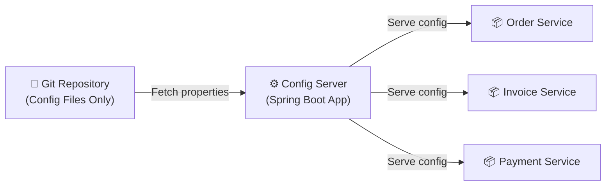
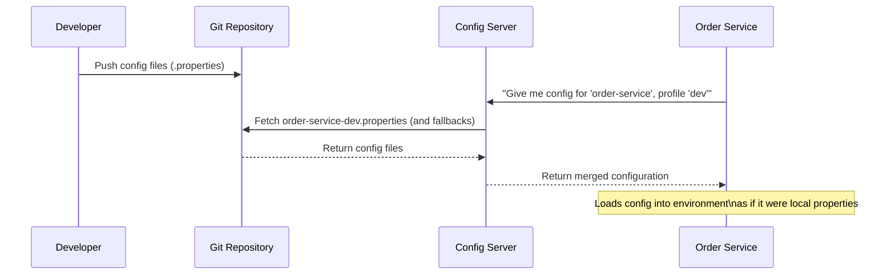
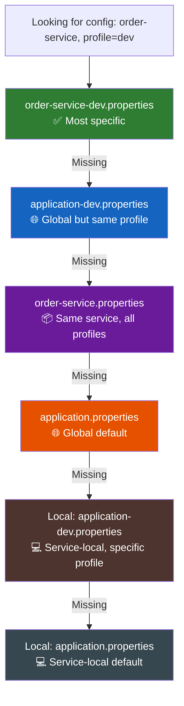
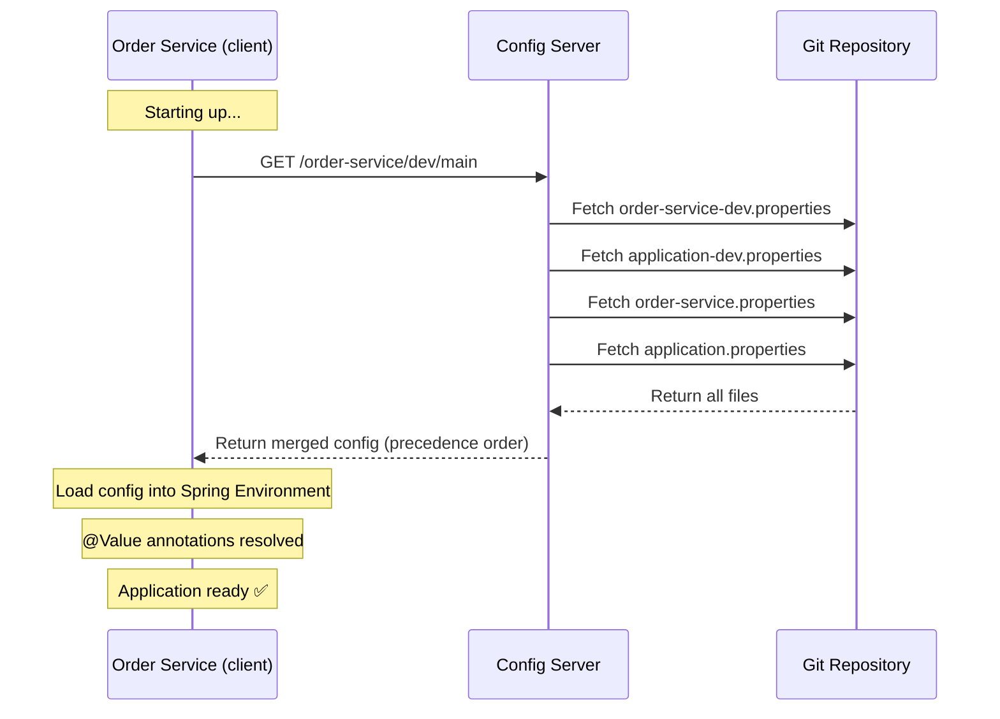
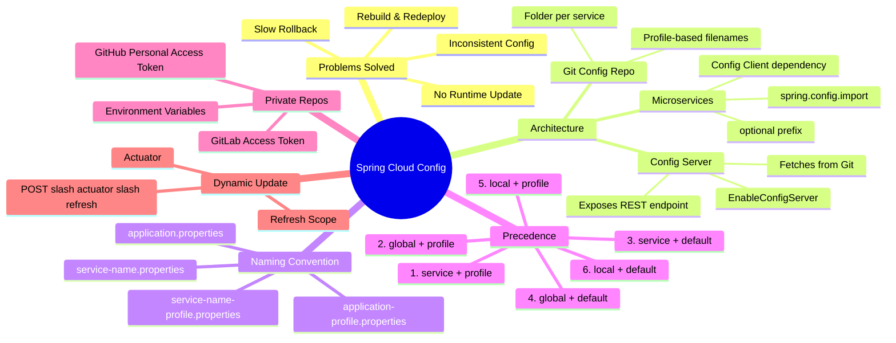

# 📌 Centralized Configuration — Spring Cloud Config

> [!IMPORTANT]
> This topic is part of the **Spring Microservices** series. Centralized Configuration is one of the most widely adopted patterns in production Spring Boot microservices. Almost every company dealing with Spring Boot uses this approach to manage configurations across services.

---

## Overview

In a traditional Spring Boot application, configuration is stored in `application.properties` (or `application.yml`) files that are bundled with each service. As the number of microservices grows, managing these scattered configuration files becomes increasingly painful and error-prone.

**Spring Cloud Config** solves this by introducing a centralized configuration management system, where all configuration files for all microservices are stored in a single Git repository and served dynamically through a dedicated **Config Server**.

---

## Why This Concept Exists — The Problems

### Problem 1: Rebuild and Redeploy

In a standard Spring Boot setup, configuration lives inside the JAR:

```
Order Service JAR
└── application.properties   ← config is bundled here
```

To change even a single property (e.g., a timeout value or a feature flag), you must:

1. Edit `application.properties`
2. **Rebuild** the JAR
3. **Redeploy** the service

This is a heavyweight operation for what could be a one-line change.

---

### Problem 2: Inconsistent Config Across Services

In a microservices architecture, multiple services often share common configuration — for example, the same database URL:

```
Pre-Order Service ──┐
                    ├── Both point to the same DB
Post-Order Service ─┘
```

If the DB URL changes, you must update it in **every service** that uses it. Miss one, and you have inconsistent configuration — a bug that is hard to detect and dangerous in production.

---

### Problem 3: No Runtime Update

`application.properties` is loaded **once** — at application startup. If the application is already running and you update the file:

- The running application **cannot see the change**
- You must stop, rebuild, and restart the service
- This causes downtime

There is no built-in mechanism to pick up configuration changes at runtime in a standard setup.

---

### Problem 4: Time-Consuming Rollback

If a configuration change causes a bug in production:

1. You must raise a PR to revert the change
2. Get it merged
3. Rebuild the service
4. Redeploy

If multiple services are affected, this process must be repeated for each one. The rollback process is slow and risky.

---

## The Solution — Centralized Configuration with Spring Cloud Config



**Three layers:**

| Layer | Component | Role |
|-------|-----------|------|
| Layer 1 | Git Repository | Stores all `.properties` files for all microservices |
| Layer 2 | Config Server | A Spring Boot app that fetches config from Git and serves it |
| Layer 3 | Microservices | Each service contacts the Config Server on startup to fetch its config |

---

## Architecture Diagram



---

## Step 1 — Setting Up the Config File Repository

### What Is This?

A plain **Git repository** (no Maven, no Spring Boot — just files) that contains `.properties` files for all your microservices. This is the single source of truth for all configuration.

### Recommended Folder Structure

```
config-repo/
├── global/
│   ├── application.properties          ← All services, all profiles (default)
│   ├── application-dev.properties      ← All services, dev profile
│   ├── application-qa.properties       ← All services, QA profile
│   └── application-prod.properties     ← All services, prod profile
│
├── order-service/
│   ├── order-service.properties        ← Order service, all profiles (default)
│   ├── order-service-dev.properties    ← Order service, dev profile
│   ├── order-service-qa.properties     ← Order service, QA profile
│   └── order-service-prod.properties   ← Order service, prod profile
│
├── invoice-service/
│   ├── invoice-service.properties
│   ├── invoice-service-dev.properties
│   └── ...
│
└── payment-service/
    ├── payment-service.properties
    └── ...
```

### Naming Convention — Critical Rule

> [!IMPORTANT]
> The filename prefix (before `-dev`, `-qa`, `-prod`) must **exactly match** the `spring.application.name` configured in that microservice's `application.properties`.

If Order Service has:
```properties
spring.application.name=order-service
```

Then the config repo files must be named:
```
order-service.properties
order-service-dev.properties
order-service-qa.properties
order-service-prod.properties
```

---

## Understanding Precedence — The Most Important Concept

> [!IMPORTANT]
> Configuration precedence is where most confusion happens. Understanding this correctly is essential for managing centralized config.

### The Four Types of Config Files

| File Pattern | Applies To |
|-------------|-----------|
| `application.properties` | **All services**, **all profiles** (global default) |
| `application-{profile}.properties` | **All services**, **specific profile** |
| `{service-name}.properties` | **Specific service**, **all profiles** |
| `{service-name}-{profile}.properties` | **Specific service**, **specific profile** |

### Precedence Order (Highest → Lowest)

When Order Service requests its `dev` profile config, the Config Server searches in this order:

```
1st  →  order-service-dev.properties       (specific service + specific profile)
2nd  →  application-dev.properties         (global + specific profile)
3rd  →  order-service.properties           (specific service + all profiles)
4th  →  application.properties             (global + all profiles)
5th  →  [local] application-dev.properties (service-local + specific profile)
6th  →  [local] application.properties     (service-local default)
```

> [!NOTE]
> Profile takes priority over service-specificity. The system prefers "same profile, global" over "same service, different profile."

### Precedence Diagram



### Concrete Example

**Config Repo Contents:**

```properties
# global/application.properties
custom.message=Hello from global default

# global/application-dev.properties
custom.message=Hello from global dev

# order-service/order-service.properties
custom.message=Hello from order default

# order-service/order-service-dev.properties
custom.message=Hello from order dev
```

**Request:** Order Service, profile = `dev`

**Response Array (in precedence order):**
```json
[
  "Hello from order dev",        ← order-service-dev.properties     (1st)
  "Hello from global dev",       ← application-dev.properties       (2nd)
  "Hello from order default",    ← order-service.properties         (3rd)
  "Hello from global default"    ← application.properties           (4th)
]
```

The **first item** in the array is the one actually used. The rest are fallbacks.

---

## Step 2 — Setting Up the Config Server

### What Is the Config Server?

A separate Spring Boot application whose sole responsibility is:
1. Connecting to the Git config repository
2. Fetching the correct `.properties` files on request
3. Exposing REST endpoints that microservices can query

### Dependency (`pom.xml`)

```xml
<dependency>
    <groupId>org.springframework.cloud</groupId>
    <artifactId>spring-cloud-config-server</artifactId>
</dependency>
```

Select "Config Server" dependency when creating the project in Spring Initializr.

---

### Main Class — Enable Config Server

```java
@SpringBootApplication
@EnableConfigServer   // ← This is required
public class ConfigServerApplication {
    public static void main(String[] args) {
        SpringApplication.run(ConfigServerApplication.class, args);
    }
}
```

**What does `@EnableConfigServer` do?**

- Signals Spring that this application is a Config Server
- Initializes the necessary beans and repository connectors
- Exposes built-in REST endpoints for clients to query config
- Loads the Git repository on startup (if clone-on-start is true)

> [!WARNING]
> Without `@EnableConfigServer`, the application is just a regular Spring Boot app. The config-serving beans will **not** be initialized.

---

### Config Server `application.properties`

```properties
server.port=8888

# ── Git Repository URI ────────────────────────────────────────────────────────
spring.cloud.config.server.git.uri=${GIT_URI}

# ── Search Paths (folders to look in) ────────────────────────────────────────
spring.cloud.config.server.git.search-paths=global,order-service,invoice-service

# ── Clone behavior ────────────────────────────────────────────────────────────
spring.cloud.config.server.git.clone-on-start=true

# ── Default branch to fetch from ─────────────────────────────────────────────
spring.cloud.config.server.git.default-label=main

# ── (Optional) Private repo credentials ──────────────────────────────────────
spring.cloud.config.server.git.username=${GIT_USERNAME}
spring.cloud.config.server.git.password=${GIT_TOKEN}
```

---

### Configuration Properties — Deep Dive

#### `spring.cloud.config.server.git.uri`

The URL of the Git repository that holds the config files.

- **Public repo:** Provide the URL directly; no credentials needed.
- **Private repo:** Must also provide `username` and `password` (token).

```properties
# Public repo
spring.cloud.config.server.git.uri=https://github.com/yourorg/config-repo

# Private repo
spring.cloud.config.server.git.uri=https://github.com/yourorg/private-config-repo
spring.cloud.config.server.git.username=${GIT_USERNAME}
spring.cloud.config.server.git.password=${GIT_TOKEN}
```

---

#### `spring.cloud.config.server.git.search-paths`

Comma-separated list of folders within the repo to search for property files.

```properties
spring.cloud.config.server.git.search-paths=global,order-service
```

If your files are **not** inside any folder (flat structure), omit this property.

---

#### `spring.cloud.config.server.git.clone-on-start`

| Value | Behavior |
|-------|---------|
| `true` | Download and cache all property files **at application startup** |
| `false` | Download and cache on **first request** (lazy loading) |

> [!TIP]
> Always set `clone-on-start=true` in production. This ensures the Config Server is ready to serve config immediately when it starts, rather than having a cold-start delay on the first request.

---

#### `spring.cloud.config.server.git.default-label`

The Git **branch name** to fetch config files from.

```properties
spring.cloud.config.server.git.default-label=main
```

- Default: `main`
- Use this to point to a feature branch for environment-specific or experimental configs.
- Can also be overridden per-request in the URL (see REST endpoint section).

---

### Private Repository — Getting Access Tokens

#### GitHub

```
Profile → Settings → Developer settings → Personal access tokens
→ Fine-grained tokens → Generate new token → Copy token
```

#### GitLab

```
Your Repo → (three dots) → Project Settings → Access Tokens
→ Create token → Copy token
```

> [!IMPORTANT]
> **Never hardcode credentials in `application.properties`**. Always use environment variables or a secrets manager.

#### Setting Environment Variables in IntelliJ

```
Run → Edit Configurations → Environment Variables

Add:
GIT_USERNAME=your-username
GIT_TOKEN=your-personal-access-token
```

---

### Config Server Built-In REST Endpoint

Once the Config Server is running, it automatically exposes:

```
GET http://localhost:8888/{application}/{profile}/{label}
```

| Parameter | Meaning | Example |
|-----------|---------|---------|
| `application` | Service name (`spring.application.name`) | `order-service` |
| `profile` | Active profile | `dev`, `qa`, `prod` |
| `label` | Git branch (optional, defaults to `main`) | `main`, `feature-xyz` |

**Example Request:**

```
GET http://localhost:8888/order-service/dev/main
```

**Example Response:**

```json
{
  "name": "order-service",
  "profiles": ["dev"],
  "label": "main",
  "propertySources": [
    {
      "name": "order-service-dev.properties",
      "source": { "custom.message": "Hello from order dev" }
    },
    {
      "name": "application-dev.properties",
      "source": { "custom.message": "Hello from global dev" }
    },
    {
      "name": "order-service.properties",
      "source": { "custom.message": "Hello from order default" }
    },
    {
      "name": "application.properties",
      "source": { "custom.message": "Hello from global default" }
    }
  ]
}
```

The `propertySources` array is ordered by **precedence** — the first entry wins.

---

## Step 3 — Setting Up Microservices as Config Clients

### What Happens on Startup?

When Order Service starts:
1. It contacts the Config Server using the URL from `spring.config.import`
2. Sends its `spring.application.name` and `spring.profiles.active`
3. Config Server fetches and returns the merged config
4. Order Service loads those properties into its Spring `Environment`
5. The properties are available exactly as if they were in a local `application.properties`

---

### Dependency (`pom.xml`)

```xml
<dependency>
    <groupId>org.springframework.cloud</groupId>
    <artifactId>spring-cloud-starter-config</artifactId>
</dependency>
```

---

### Client `application.properties`

```properties
# Service name — must match the filename prefix in the config repo
spring.application.name=order-service

# Config Server URL
spring.config.import=optional:configserver:http://localhost:8888

# Active profile
spring.profiles.active=dev

# Local fallback values (used if config server is unreachable)
custom.message=Hello from local default
```

---

### Configuration Properties — Deep Dive

#### `spring.application.name`

The name of this service. Must exactly match the filename prefix used in the Git config repository.

```properties
spring.application.name=order-service
```

This tells the Config Server: "Give me the config files prefixed with `order-service`."

---

#### `spring.config.import`

Tells Spring where to import configuration from. For Config Server:

```properties
# With 'optional:' prefix — recommended
spring.config.import=optional:configserver:http://localhost:8888

# Without 'optional:' — application fails to start if config server is down
spring.config.import=configserver:http://localhost:8888
```

| Prefix | Behavior if Config Server is Down |
|--------|----------------------------------|
| `optional:configserver:` | Application **starts normally**, uses local properties as fallback |
| `configserver:` | Application **fails to start** |

> [!TIP]
> Always use `optional:` in development. In production, you may want to remove it to ensure services don't silently start with stale local config.

---

#### `spring.profiles.active`

Specifies the active profile. Tells Config Server which profile-specific files to load.

```properties
spring.profiles.active=dev
```

Can also be set dynamically at startup:
```bash
java -jar order-service.jar --spring.profiles.active=prod
```

---

### Using Config in a Controller

```java
@RestController
@RequestMapping("/order")
public class OrderController {

    @Value("${custom.message}")   // Injects from wherever config resolves
    private String customMessage;

    @GetMapping("/fetch")
    public String fetchConfig() {
        return "Order message: " + customMessage;
    }
}
```

**What happens at runtime:**

1. On startup, Order Service fetches config from Config Server
2. Config Server returns `"Hello from order dev"` (highest precedence match)
3. `@Value("${custom.message}")` injects `"Hello from order dev"`
4. `GET /order/fetch` returns `"Order message: Hello from order dev"`

---

## Complete Flow Diagram



---

## Dynamic Config Update — Refresh Scope (Preview)

> [!NOTE]
> The following is a preview of the next topic (**Refresh Scope + Actuator**), explained here for completeness.

**The Problem:**

Your Order Service is running. Someone pushes a new `custom.message` value to the Git config repo. The Config Server immediately has the new value. But Order Service still uses the old value — because Spring properties are loaded only at startup.

**The Solution:** Spring Cloud provides `@RefreshScope` combined with Spring Boot Actuator's `/actuator/refresh` endpoint.

- Annotate beans that use externalized config with `@RefreshScope`
- When config changes, hit `POST /actuator/refresh` on the microservice
- Spring reinitializes all `@RefreshScope` beans with the new config
- No restart required

```java
@RefreshScope     // Marks this bean for dynamic refresh
@RestController
@RequestMapping("/order")
public class OrderController {
    @Value("${custom.message}")
    private String customMessage;

    @GetMapping("/fetch")
    public String fetchConfig() {
        return customMessage;
    }
}
```

> [!IMPORTANT]
> Full implementation of Refresh Scope requires understanding Spring Boot Actuator, which is covered in the next lecture.

---

## Component Comparison Table

| Component | Type | Role | Key Annotation/Dependency |
|-----------|------|------|--------------------------|
| Git Config Repo | Plain Git repo | Stores all `.properties` files | None (just files) |
| Config Server | Spring Boot app | Fetches from Git, serves to clients | `@EnableConfigServer`, `spring-cloud-config-server` |
| Microservice (Client) | Spring Boot app | Fetches config from Config Server on startup | `spring-cloud-starter-config` |

---

## Problems Solved — Comparison

| Problem | Without Centralized Config | With Spring Cloud Config |
|---------|---------------------------|-------------------------|
| Config change | Rebuild + redeploy required | Update Git repo only |
| Consistency | Must update all services manually | Single source of truth |
| Runtime update | Impossible | Possible with Refresh Scope |
| Rollback | Rebuild + redeploy all affected services | `git revert` + refresh |
| Profile management | Separate `.properties` files per service | Centralized with clear naming convention |

---

## Mind Map



---

## Common Mistakes

### ❌ Mistake 1: Service Name Mismatch

```properties
# In order-service application.properties
spring.application.name=orderService    ← camelCase

# In Git repo — filename uses hyphenated form
order-service-dev.properties            ← won't match!

# ✅ Fix: be consistent
spring.application.name=order-service
# and filename: order-service-dev.properties
```

---

### ❌ Mistake 2: Forgetting `@EnableConfigServer`

```java
@SpringBootApplication
// ❌ Missing @EnableConfigServer — this is just a regular Spring Boot app
public class ConfigServerApplication { ... }

// ✅ Correct
@SpringBootApplication
@EnableConfigServer
public class ConfigServerApplication { ... }
```

---

### ❌ Mistake 3: Not Using `optional:` in Dev

```properties
# ❌ If Config Server is down, Order Service won't start at all
spring.config.import=configserver:http://localhost:8888

# ✅ Safer for development
spring.config.import=optional:configserver:http://localhost:8888
```

---

### ❌ Mistake 4: Hardcoding Credentials

```properties
# ❌ Never hardcode tokens in properties files
spring.cloud.config.server.git.username=myuser
spring.cloud.config.server.git.password=ghp_actualToken123

# ✅ Use environment variables
spring.cloud.config.server.git.username=${GIT_USERNAME}
spring.cloud.config.server.git.password=${GIT_TOKEN}
```

---

### ❌ Mistake 5: Missing `search-paths` for Folder-Based Structure

```properties
# ❌ If you organized files into folders and don't specify search-paths,
#    Config Server won't find your files
spring.cloud.config.server.git.uri=https://github.com/org/config-repo

# ✅ Specify each folder
spring.cloud.config.server.git.search-paths=global,order-service,invoice-service
```

---

## Best Practices

1. **Organize config files into folders** by service name for clarity and maintainability.

2. **Use `optional:configserver:` prefix** in development to allow the service to start even when the Config Server is unavailable.

3. **Never hardcode credentials.** Use environment variables or a secrets manager (HashiCorp Vault, AWS Secrets Manager) for Git credentials.

4. **Set `clone-on-start=true`** on the Config Server to pre-warm the cache on startup, ensuring instant response to the first client request.

5. **Use Eureka for Config Server discovery** rather than hardcoding the Config Server URL in every microservice's properties. This avoids a single point of configuration failure.

6. **Use meaningful `default-label`** to allow blue/green config deployments — push new config to a branch and only switch when ready.

7. **Keep local `application.properties` minimal** — just enough for the service to start when the Config Server is unavailable (`optional:` mode). All real config should live in the Git repo.

8. **Version your config changes** using Git branches and tags for traceability and easy rollback (`git revert` is all you need).

---

## Interview Questions

### Q1: What problems does Spring Cloud Config solve?

**Answer:** Four main problems:
1. **Rebuild/redeploy** for every config change
2. **Inconsistent config** across multiple services sharing common properties
3. **No runtime update** — `application.properties` is loaded only at startup
4. **Slow rollback** — any config mistake requires rebuild and redeploy of all affected services

---

### Q2: What are the three layers of Spring Cloud Config?

**Answer:**
- **Layer 1 — Git Config Repository:** A plain Git repo containing `.properties` files for all services.
- **Layer 2 — Config Server:** A Spring Boot app annotated with `@EnableConfigServer`. Fetches config from Git and exposes a REST API.
- **Layer 3 — Microservices (Clients):** Each service has the `spring-cloud-starter-config` dependency and contacts the Config Server on startup.

---

### Q3: Explain the configuration precedence in Spring Cloud Config.

**Answer:** When a service requests config for a specific profile, the lookup order (highest to lowest precedence) is:
1. `{service-name}-{profile}.properties` — most specific
2. `application-{profile}.properties` — global, same profile
3. `{service-name}.properties` — same service, all profiles
4. `application.properties` — global default
5. Local `application-{profile}.properties`
6. Local `application.properties` — least specific

---

### Q4: What does `optional:configserver:` mean in `spring.config.import`?

**Answer:** The `optional:` prefix tells Spring Boot that if the Config Server is unreachable, the application should still start normally using local `application.properties` as a fallback. Without `optional:`, the application will refuse to start if it cannot reach the Config Server.

---

### Q5: What is `clone-on-start` and why should it be `true`?

**Answer:** When `clone-on-start=true`, the Config Server downloads and caches all config files from Git at application startup. If `false`, it downloads on the first client request (lazy). Setting it to `true` is preferred because it ensures the Config Server is immediately ready to serve requests and exposes Git connectivity issues at startup rather than at runtime.

---

### Q6: How would you handle private Git repositories in Spring Cloud Config?

**Answer:** Provide Git credentials via `spring.cloud.config.server.git.username` and `.password`. For GitHub, create a **Personal Access Token** (Profile → Settings → Developer Settings → Personal Access Tokens). For GitLab, create a **Project Access Token** (Project Settings → Access Tokens). Always read credentials from environment variables, never hardcode them in `application.properties`.

---

### Q7: How does a microservice know which config to fetch from the Config Server?

**Answer:** Two properties determine this:
- `spring.application.name` — tells the Config Server which service-specific files to look for
- `spring.profiles.active` — tells the Config Server which profile-specific files to include

The Config Server uses these to construct the correct file lookup and returns a precedence-ordered array of property sources.

---

### Q8: What is `default-label` in the Config Server configuration?

**Answer:** It specifies the Git **branch** from which config files are fetched. Default is `main`. You can override it for feature-specific or environment-specific configs. Can also be overridden per-request in the Config Server REST endpoint URL: `/{application}/{profile}/{label}`.

---

## Practice Questions

### Easy

1. What are the four problems that centralized configuration solves?
2. What annotation is required on the Config Server's main class?
3. What is the naming convention for a config file specific to `order-service` in the `dev` profile?
4. What dependency does a microservice need to act as a config client?

### Medium

5. Given this folder structure in the Git config repo, list the full precedence order when `invoice-service` requests the `prod` profile.
6. What is the difference between `configserver:` and `optional:configserver:` in `spring.config.import`? When would you use each?
7. Your company uses a private GitHub repo for config files. Walk through the exact steps to configure the Config Server to access it securely.
8. If `clone-on-start=false` and the Config Server restarts, what happens to the cache? When is the cache repopulated?

### Hard

9. A developer pushes a new property value to the Git config repo. The Config Server is running. Order Service is also running. Will Order Service pick up the new value automatically? Why or why not? What mechanism would allow it to do so without restarting?
10. Your team has 20 microservices. How would you structure the Git config repo to minimize duplication while maintaining service-specific overrides? Describe the folder structure and naming convention.
11. The Config Server itself has configuration (its `application.properties`). How do you prevent the Config Server from becoming a single point of failure in your architecture?
12. Compare the tradeoffs of using `optional:configserver:` vs requiring the Config Server to be available before any microservice starts.

---

## Summary

- **Spring Cloud Config** centralizes configuration management for all microservices.
- Three components: **Git repo** (config files) → **Config Server** → **Microservices** (clients).
- The Git repo holds plain `.properties` files organized by service and profile.
- **Naming convention:** `{service-name}-{profile}.properties` for service-specific profile config.
- **Precedence (high → low):** service+profile → global+profile → service+default → global+default → local+profile → local+default.
- Config Server is a Spring Boot app with `@EnableConfigServer` and `spring-cloud-config-server` dependency.
- Config Server exposes: `GET /{application}/{profile}/{label}`
- Microservices use `spring-cloud-starter-config` and `spring.config.import=optional:configserver:URL`.
- `spring.application.name` must match the filename prefix in the Git repo.
- `optional:` prefix prevents startup failure when Config Server is unreachable.
- For private repos: provide `username` + access token via environment variables.
- `clone-on-start=true` pre-warms the Config Server cache at startup.
- `default-label` specifies the Git branch to fetch config from (default: `main`).
- **Runtime updates** require `@RefreshScope` + Spring Boot Actuator (covered in the next lecture).
