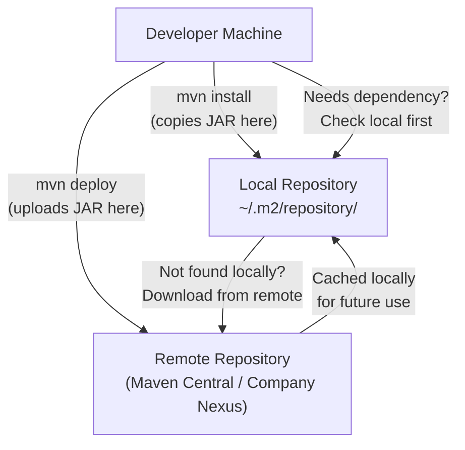
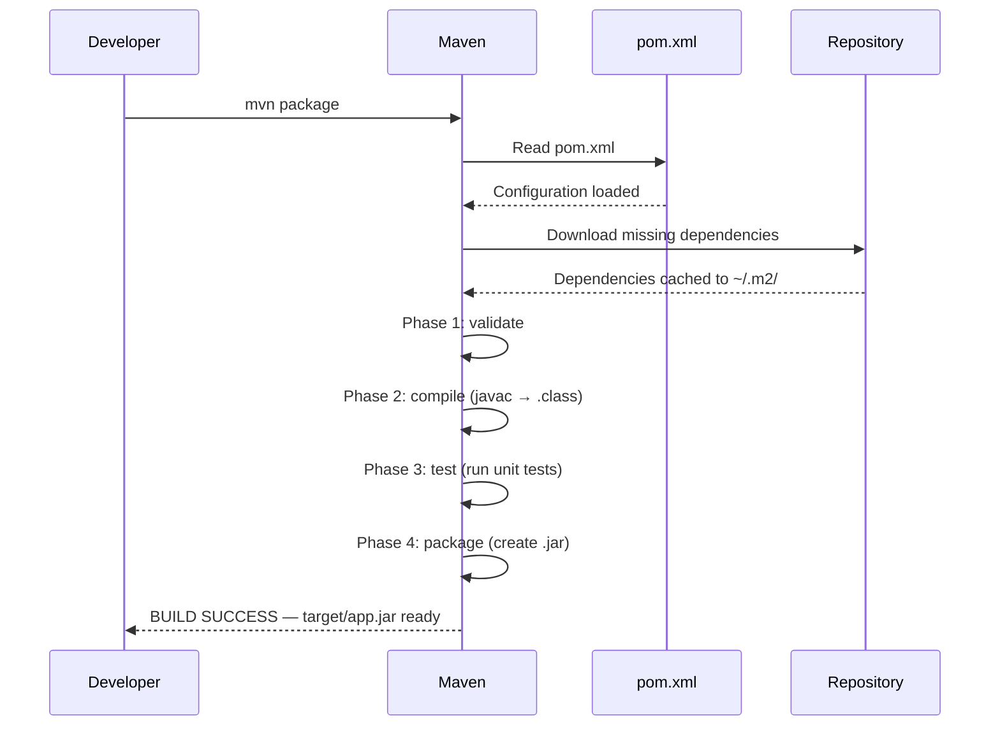
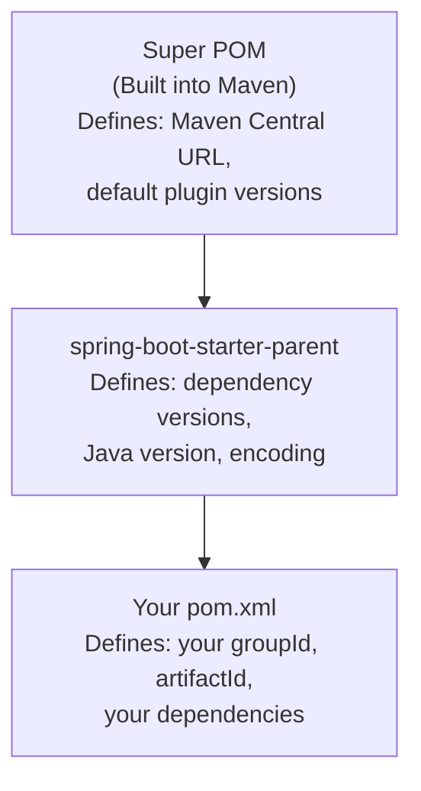
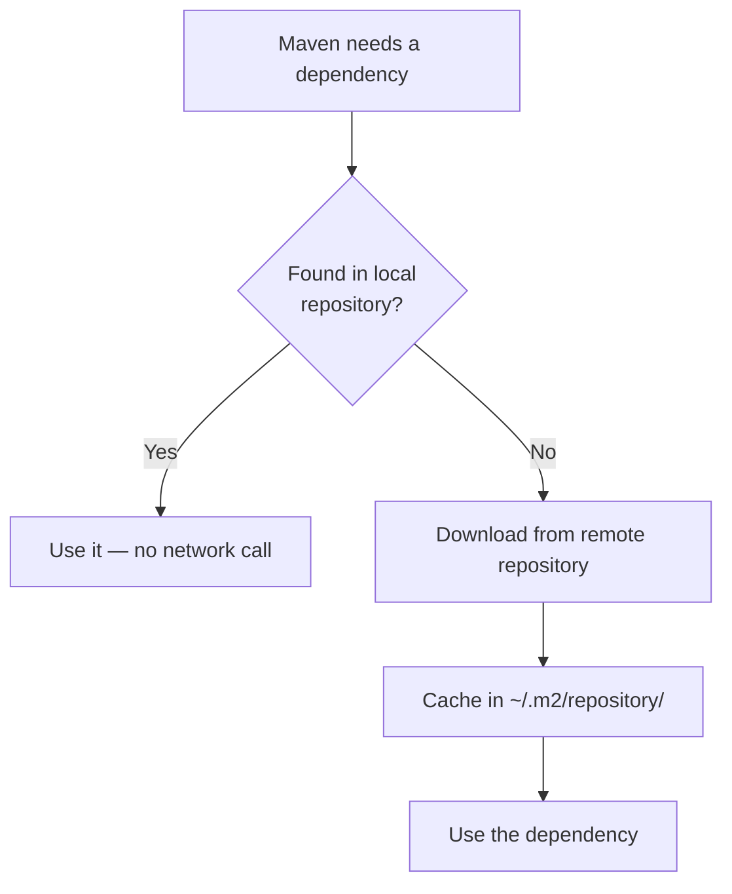
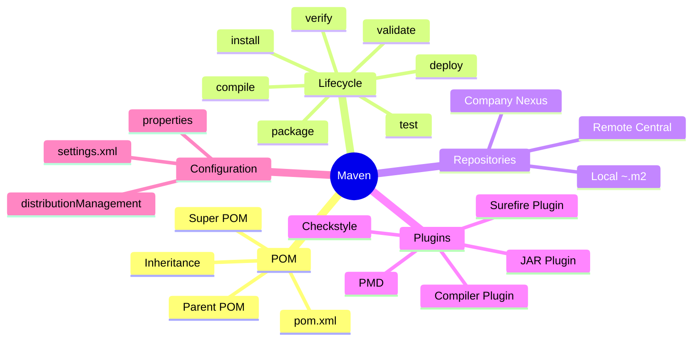

# 📦 Maven — Comprehensive Study Guide
### Spring Boot Series | Concept and Coding

---

> [!IMPORTANT]
> These notes are designed to be fully self-contained. A student can learn Maven entirely from this guide without watching the original lecture.

---

## Table of Contents

1. [What is Maven?](#1-what-is-maven)
2. [Maven vs Ant](#2-maven-vs-ant)
3. [POM — Project Object Model](#3-pom--project-object-model)
4. [Maven Project Structure](#4-maven-project-structure)
5. [Reading pom.xml — Element by Element](#5-reading-pomxml--element-by-element)
6. [Maven Build Lifecycle](#6-maven-build-lifecycle)
7. [Phase 1 — Validate](#7-phase-1--validate)
8. [Phase 2 — Compile](#8-phase-2--compile)
9. [Phase 3 — Test](#9-phase-3--test)
10. [Phase 4 — Package](#10-phase-4--package)
11. [Phase 5 — Verify](#11-phase-5--verify)
12. [Phase 6 — Install](#12-phase-6--install)
13. [Phase 7 — Deploy](#13-phase-7--deploy)
14. [Local vs Remote Repository](#14-local-vs-remote-repository)
15. [Plugins and Goals (Deep Dive)](#15-plugins-and-goals-deep-dive)
16. [settings.xml](#16-settingsxml)
17. [Key Diagrams](#17-key-diagrams)
18. [Interview Notes](#18-interview-notes)
19. [Common Mistakes](#19-common-mistakes)
20. [Summary Cheat Sheet](#20-summary-cheat-sheet)

---

# 1. What is Maven?

## Overview

Maven is commonly misunderstood as just a "build tool" — something that generates a JAR file. In reality, Maven is a **project management tool** that handles a wide range of developer tasks throughout a project's lifecycle.

## Why This Concept Exists

Before Maven, developers had to manually manage:
- Downloading third-party libraries (JAR files)
- Telling the build tool exactly *how* to compile, test, and package code (step by step)
- Documenting the project
- Managing dependencies between libraries

Maven was created to **automate and standardize** all of these activities so that developers can focus on writing code.

## Definition

> **Maven** is an open-source project management and build automation tool primarily used for Java projects. It uses a **Project Object Model (POM)** defined in `pom.xml` to describe the project, its dependencies, and its build process.

## What Maven Provides

| Feature | Description |
|---|---|
| **Build Generation** | Compiles code, runs tests, creates JAR/WAR files |
| **Dependency Resolution** | Automatically downloads required libraries |
| **Documentation** | Can generate project documentation |
| **Project Structure** | Enforces a standard directory layout |
| **Lifecycle Management** | Defines ordered phases from validate → deploy |
| **Plugin System** | Extensible via plugins for custom tasks |

## Real-World Analogy

Think of Maven as a **project manager** at a construction site. You tell the project manager: *"Build the house."* You don't need to explain how to pour the foundation, lay bricks, or wire electricity. The project manager knows the steps, the order, and how to do each one. You only declare *what* you want — Maven handles the *how*.

---

# 2. Maven vs Ant

## Background

Before Maven, **Apache Ant** was the dominant build tool for Java projects. Understanding why Maven replaced Ant for most use cases helps clarify Maven's design philosophy.

## The Core Difference

| Aspect | Ant | Maven |
|---|---|---|
| **Approach** | Imperative (tell *what* AND *how*) | Declarative (tell only *what*) |
| **Configuration** | `build.xml` with explicit steps | `pom.xml` with goals and lifecycle |
| **Convention** | None — you define everything | Convention over configuration |
| **Dependency management** | Manual (download JARs yourself) | Automatic (Maven downloads from Central) |
| **Learning curve** | Lower initially, harder to maintain | Steeper initially, easier long-term |

## Ant Example (Compile Task)

In Ant, you had to explicitly instruct the tool **what to do AND exactly how to do it**:

```xml
<!-- Ant build.xml — must specify source, destination, and the javac compiler explicitly -->
<target name="compile">
    <javac srcdir="src/main/java"
           destdir="target/classes"
           executable="javac" />
</target>
```

Every attribute — where the source is, where to put the output, which compiler to use — had to be manually specified.

## Maven Equivalent

In Maven, you simply run:

```bash
mvn compile
```

Maven already knows:
- Where to find source files (`src/main/java`)
- Where to put compiled classes (`target/classes`)
- How to invoke the Java compiler

This knowledge is built into Maven's conventions and plugins. **You declare the goal; Maven figures out the steps.**

> [!TIP]
> This principle is called **"Convention over Configuration"** — Maven assumes sensible defaults so you only need to configure things that differ from the standard.

---

# 3. POM — Project Object Model

## Definition

The **POM (Project Object Model)** is the core concept of Maven. It is represented as an XML file named `pom.xml` and contains all the information Maven needs to build and manage a project.

> **Every Maven command you run first looks for `pom.xml` in the current directory.**

## The POM Hierarchy

Every `pom.xml` in Maven is part of a **hierarchy**. No POM exists in isolation.

```
Super POM (Built into Maven — the ultimate parent of all POMs)
    │
    └── Spring Boot Starter Parent POM
            │
            └── Your Project's pom.xml  ← This is what you write
```

### Rules of the Hierarchy

- If your `pom.xml` defines a `<parent>`, it inherits all configurations, dependencies, and plugin settings from that parent POM.
- If no `<parent>` is specified, Maven **automatically** makes your POM a child of the **Super POM**.
- The Super POM is the ultimate root of all inheritance and contains default configurations like the Maven Central repository URL.

> [!NOTE]
> This is why your project's `pom.xml` can be small and still work — it inherits a lot of configuration from its parent and ultimately from the Super POM.

You can view Maven's Super POM at:
`https://maven.apache.org/ref/3.x.x/maven-model-builder/super-pom.html`

---

# 4. Maven Project Structure

## Standard Directory Layout

Maven enforces a **standard project structure**. This is one of its core conventions. When you generate a Spring Boot project (with Maven selected), the following structure is created:

```
your-app-name/
├── pom.xml                         ← Project configuration
└── src/
    ├── main/
    │   └── java/
    │       └── com/
    │           └── conceptandcoding/
    │               └── learningspringboot/
    │                   └── LearningSpringBootApplication.java
    └── test/
        └── java/
            └── com/
                └── conceptandcoding/
                    └── learningspringboot/
                        └── LearningSpringBootApplicationTests.java
```

## Directory Explanation

| Directory | Purpose |
|---|---|
| `src/main/java` | Your application source code |
| `src/main/resources` | Configuration files (e.g., `application.properties`) |
| `src/test/java` | Unit and integration test code |
| `src/test/resources` | Test-specific resources |
| `target/` | Generated by Maven — compiled classes, JARs, reports |
| `pom.xml` | Maven project configuration |

> [!IMPORTANT]
> The `target/` directory is auto-generated by Maven during the build. You should **never** commit this to version control (add it to `.gitignore`).

## How the Package Structure is Generated

When creating a Spring Boot project, you provide three values:

| Field | Example Value | Role |
|---|---|---|
| **Group ID** | `com.conceptandcoding` | Company/organization identifier |
| **Artifact ID** | `learningspringboot` | Project/module name |
| **Version** | `0.0.1-SNAPSHOT` | Current version |

Maven uses Group ID to create the nested package folder structure under `src/main/java`. So `com.conceptandcoding` becomes:

```
src/main/java/com/conceptandcoding/learningspringboot/
```

The same mirrored structure is created under `src/test/java` — every main class has a corresponding test class location.

---

# 5. Reading pom.xml — Element by Element

Below is a typical `pom.xml` for a Spring Boot project, annotated section by section.

```xml
<?xml version="1.0" encoding="UTF-8"?>
<project xmlns="http://maven.apache.org/POM/4.0.0"
         xmlns:xsi="http://www.w3.org/2001/XMLSchema-instance"
         xsi:schemaLocation="http://maven.apache.org/POM/4.0.0
                             https://maven.apache.org/xsd/maven-4.0.0.xsd">

    <modelVersion>4.0.0</modelVersion>

    <!-- 1. PARENT -->
    <parent>
        <groupId>org.springframework.boot</groupId>
        <artifactId>spring-boot-starter-parent</artifactId>
        <version>3.1.0</version>
        <relativePath/>
    </parent>

    <!-- 2. PROJECT COORDINATES -->
    <groupId>com.conceptandcoding</groupId>
    <artifactId>learningspringboot</artifactId>
    <version>0.0.1-SNAPSHOT</version>

    <!-- 3. PROPERTIES -->
    <properties>
        <java.version>17</java.version>
    </properties>

    <!-- 4. DEPENDENCIES -->
    <dependencies>
        <dependency>
            <groupId>org.springframework.boot</groupId>
            <artifactId>spring-boot-starter-web</artifactId>
        </dependency>

        <dependency>
            <groupId>org.springframework.boot</groupId>
            <artifactId>spring-boot-starter-test</artifactId>
            <scope>test</scope>
        </dependency>
    </dependencies>

    <!-- 5. BUILD (optional — for custom plugins/tasks) -->
    <build>
        <plugins>
            <!-- custom plugins go here -->
        </plugins>
    </build>

</project>
```

---

## 5.1 — Schema Declaration

```xml
<project xmlns="http://maven.apache.org/POM/4.0.0"
         xsi:schemaLocation="http://maven.apache.org/POM/4.0.0 ...">
```

**Purpose:** Specifies the XML schema that this POM file must conform to. The schema defines:
- What elements are valid inside `<project>`
- What elements are valid inside `<parent>`, `<dependencies>`, etc.
- The correct nesting rules

If you try to put an arbitrary element (e.g., `<xyz>`) in a place where the schema doesn't allow it, Maven will reject it.

---

## 5.2 — `<parent>`

```xml
<parent>
    <groupId>org.springframework.boot</groupId>
    <artifactId>spring-boot-starter-parent</artifactId>
    <version>3.1.0</version>
    <relativePath/>
</parent>
```

**Purpose:** Declares the parent POM. Your project **inherits** all configurations, dependency versions, and plugin configurations from this parent.

**What is inherited?**
- Plugin versions and configurations
- Dependency management (versions of common libraries)
- Build settings
- Java version defaults

This is why your own `pom.xml` doesn't need to specify versions for Spring Boot dependencies — the parent already declares them.

> [!TIP]
> If you look at the `spring-boot-starter-parent` POM online, you will find hundreds of pre-configured dependency versions. Because your project inherits from it, you get all of that for free.

---

## 5.3 — Project Coordinates: `<groupId>`, `<artifactId>`, `<version>`

```xml
<groupId>com.conceptandcoding</groupId>
<artifactId>learningspringboot</artifactId>
<version>0.0.1-SNAPSHOT</version>
```

These three elements together form a **unique identifier** for your project in the Maven ecosystem. They are called **Maven Coordinates** or **GAV Coordinates**.

| Element | Meaning | Convention |
|---|---|---|
| `groupId` | Organization or company | Reverse domain: `com.google`, `org.apache` |
| `artifactId` | Project or module name | Lowercase, hyphenated: `spring-boot-web` |
| `version` | Current version | Semantic versioning: `1.0.0`, `2.3.1-SNAPSHOT` |

**SNAPSHOT** means this is a development/in-progress version. A version without SNAPSHOT (e.g., `1.0.0`) is a release version.

---

## 5.4 — `<properties>`

```xml
<properties>
    <java.version>17</java.version>
</properties>
```

**Purpose:** Key-value pairs for configuration values that can be **referenced anywhere** in the POM using the `${key}` syntax.

### How to Use a Property

```xml
<properties>
    <java.version>17</java.version>
    <project.encoding>UTF-8</project.encoding>
</properties>

<dependencies>
    <dependency>
        <groupId>com.example</groupId>
        <artifactId>my-lib</artifactId>
        <version>${java.version}</version>  <!-- resolves to "17" -->
    </dependency>
</dependencies>
```

When Maven processes the POM, it replaces `${java.version}` with `17`.

**Benefits:**
- Avoids repeating the same version number in multiple places
- Changing the value in one place updates it everywhere
- Makes the POM easier to read and maintain

---

## 5.5 — `<repositories>`

```xml
<repositories>
    <repository>
        <id>central</id>
        <url>https://repo.maven.apache.org/maven2</url>
    </repository>
</repositories>
```

**Purpose:** Tells Maven **where to download dependencies** from.

> [!NOTE]
> You typically won't see this in a standard Spring Boot `pom.xml` because the Maven Central URL is already defined in the **Super POM**. Maven inherits it automatically. This element is only needed when you want to add an additional or custom repository (e.g., your company's private Nexus or Artifactory server).

---

## 5.6 — `<dependencies>`

```xml
<dependencies>
    <dependency>
        <groupId>org.springframework.boot</groupId>
        <artifactId>spring-boot-starter-web</artifactId>
    </dependency>
</dependencies>
```

**Purpose:** Declares the libraries your project needs. Maven will automatically download these and make them available on the classpath.

Each `<dependency>` is identified by the same GAV coordinates (groupId, artifactId, version).

**Dependency Scope** — Controls when the dependency is available:

| Scope | Meaning |
|---|---|
| `compile` (default) | Available at compile time and runtime |
| `test` | Only available during testing |
| `provided` | Available at compile time but NOT packaged (e.g., servlet API — provided by the server) |
| `runtime` | Not needed at compile time, but needed at runtime |

---

## 5.7 — `<build>` and `<plugins>`

```xml
<build>
    <plugins>
        <plugin>
            <groupId>org.apache.maven.plugins</groupId>
            <artifactId>maven-checkstyle-plugin</artifactId>
            <version>3.2.0</version>
            <executions>
                <execution>
                    <phase>validate</phase>
                    <goals>
                        <goal>check</goal>
                    </goals>
                </execution>
            </executions>
            <configuration>
                <configLocation>my-code-styles.xml</configLocation>
            </configuration>
        </plugin>
    </plugins>
</build>
```

**Purpose:** Used to add custom tasks (plugins/goals) to specific phases of the Maven build lifecycle.

This is where Maven's real power becomes visible — you can hook in any behavior at any point in the lifecycle.

---

# 6. Maven Build Lifecycle

## Overview

The Maven Build Lifecycle is a **defined sequence of phases** that Maven executes in strict order. Understanding this is the most important concept in Maven.

## The 7 Phases

```
1. validate  →  2. compile  →  3. test  →  4. package  →  5. verify  →  6. install  →  7. deploy
```

## Sequential Execution Rule

> [!IMPORTANT]
> **When you run any phase, all preceding phases execute first.**
>
> Example: `mvn package` triggers: validate → compile → test → package

This means you can't skip phases. Running `mvn deploy` runs all 7 phases.

## Phases and Goals

Each phase contains one or more **goals**. A goal is a specific task within a phase.

```
Phase: compile
  └── Goal 1: compiler:compile   (compiles Java source files)

Phase: test
  └── Goal 1: surefire:test      (runs unit tests)

Phase: package
  └── Goal 1: jar:jar            (creates JAR file)
```

**Running a specific goal directly:**

```bash
mvn compiler:compile        # Run just this goal, not the full phase
mvn surefire:test           # Run just the test goal
```

**Running a phase** (runs all goals in the phase, plus all preceding phases):

```bash
mvn compile
mvn test
mvn package
```

## Build Lifecycle Diagram


---

# 7. Phase 1 — Validate

## Purpose

The **validate** phase checks that the project structure is correct and all necessary information is available before the build begins.

**Default behavior:** Maven's default validate phase does very little on its own. It doesn't enforce code style or complex structural rules unless you add a plugin.

## Adding Custom Validation with a Plugin

A common use case is enforcing **code style** using the Checkstyle plugin:

```xml
<build>
    <plugins>
        <plugin>
            <groupId>org.apache.maven.plugins</groupId>
            <artifactId>maven-checkstyle-plugin</artifactId>
            <version>3.2.0</version>
            <executions>
                <execution>
                    <phase>validate</phase>        <!-- Hook into validate phase -->
                    <goals>
                        <goal>check</goal>         <!-- The task to run -->
                    </goals>
                </execution>
            </executions>
            <configuration>
                <configLocation>my-code-styles.xml</configLocation>
            </configuration>
        </plugin>
    </plugins>
</build>
```

**What this does:**
- Before any compilation, Maven checks if the code follows the style rules defined in `my-code-styles.xml`
- If violations are found, the build fails early — before wasting time compiling bad code
- Different companies have different style guides; this enforces them automatically

**Command to trigger:**
```bash
mvn validate
```

---

# 8. Phase 2 — Compile

## Purpose

Converts Java source code (`.java` files) into **bytecode** (`.class` files) that the JVM can execute.

**Command:**
```bash
mvn compile
```

**What runs:** validate → compile

## What Happens Internally

When you run `mvn compile`:

1. Maven looks for `pom.xml`
2. Maven finds the `maven-compiler-plugin` (defined in Super POM or parent)
3. The plugin runs `javac` internally on all `.java` files in `src/main/java`
4. Compiled `.class` files are placed in `target/classes/`

> [!NOTE]
> You never told Maven to use `javac`. Maven's compiler plugin knows how to do this. You only said `compile` — Maven figured out *how*.

## Output Location

```
Before mvn compile:
your-project/
├── pom.xml
└── src/main/java/com/conceptandcoding/.../YourClass.java

After mvn compile:
your-project/
├── pom.xml
├── src/main/java/...
└── target/
    └── classes/
        └── com/conceptandcoding/.../YourClass.class   ← Generated bytecode
```

## Ant vs Maven Comparison (Compile)

```xml
<!-- ANT — must specify everything explicitly -->
<target name="compile">
    <javac srcdir="${src.dir}"
           destdir="${build.dir}"
           executable="javac" />
</target>
```

```bash
# MAVEN — just declare the goal
mvn compile
```

---

# 9. Phase 3 — Test

## Purpose

Runs all **unit tests** in the `src/test/java` directory using a testing framework (typically JUnit).

**Command:**
```bash
mvn test
```

**What runs:** validate → compile → test

## Test Class Structure

Maven expects test classes in the mirror structure of main:

```
src/
├── main/java/com/conceptandcoding/learningspringboot/
│   └── LearningSpringBootApplication.java
└── test/java/com/conceptandcoding/learningspringboot/
    └── LearningSpringBootApplicationTests.java   ← Test class for the above
```

## Example Test Class

```java
package com.conceptandcoding.learningspringboot;

import org.junit.jupiter.api.Test;
import org.springframework.boot.test.context.SpringBootTest;

@SpringBootTest
class LearningSpringBootApplicationTests {

    @Test
    void contextLoads() {
        System.out.println("Concept and Coding — Test case running!");
    }
}
```

**Expected output during `mvn test`:**
```
[INFO] Running com.conceptandcoding.learningspringboot.LearningSpringBootApplicationTests
Concept and Coding — Test case running!
[INFO] Tests run: 1, Failures: 0, Errors: 0
[INFO] BUILD SUCCESS
```

## What Maven Does During Test Phase

1. Compiles test classes (if not already compiled)
2. Uses the **Surefire plugin** to run all test classes
3. Generates test reports under `target/surefire-reports/`
4. If any test **fails**, the build stops with `BUILD FAILURE`

> [!WARNING]
> Failing tests will stop the build. If you intentionally want to skip tests (not recommended), use:
> ```bash
> mvn package -DskipTests
> ```

---

# 10. Phase 4 — Package

## Purpose

Takes the compiled bytecode (`.class` files) and packages them into a distributable format — typically a **JAR** file (or WAR for web applications).

**Command:**
```bash
mvn package
```

**What runs:** validate → compile → test → package

## What is a JAR?

A **JAR (Java ARchive)** is a ZIP file containing:
- All compiled `.class` files
- Resources (images, config files, etc.)
- `META-INF/MANIFEST.MF` — metadata about the JAR

For Spring Boot applications, the JAR is a **"fat JAR"** or **"uber JAR"** — it includes all dependencies, making it fully self-contained and directly executable.

## Output Location

```
target/
├── classes/                                    ← Compiled classes (from compile phase)
└── learningspringboot-0.0.1-SNAPSHOT.jar       ← The packaged JAR (from package phase)
```

## JAR Naming Convention

```
{artifactId}-{version}.jar

Example: learningspringboot-0.0.1-SNAPSHOT.jar
```

## What You Can Do with the JAR

| Action | Command |
|---|---|
| Run the application | `java -jar learningspringboot-0.0.1-SNAPSHOT.jar` |
| Share with teammates | Send the `.jar` file |
| Deploy to a server | Copy to server and run |
| Add as dependency | Install to local/remote repository |

## Specifying Package Type in pom.xml

```xml
<packaging>jar</packaging>   <!-- default — creates .jar -->
<!-- or -->
<packaging>war</packaging>   <!-- for web apps deployed on Tomcat/Wildfly -->
```

---

# 11. Phase 5 — Verify

## Purpose

Runs checks to verify that the **packaged artifact is valid and meets quality criteria**. This phase is designed for integration tests and static analysis.

**Command:**
```bash
mvn verify
```

**What runs:** validate → compile → test → package → verify

## Default Behavior

Like validate, Maven's default verify phase does very little unless you add plugins.

## Adding Static Code Analysis with PMD

**PMD** is a popular static analysis tool that detects:
- Unused variables
- Unused imports
- Empty catch blocks
- Duplicate code
- Dead code
- Overly complex methods

```xml
<build>
    <plugins>
        <plugin>
            <groupId>org.apache.maven.plugins</groupId>
            <artifactId>maven-pmd-plugin</artifactId>
            <version>3.20.0</version>
            <executions>
                <execution>
                    <phase>verify</phase>         <!-- Hook into verify phase -->
                    <goals>
                        <goal>pmd</goal>          <!-- Run PMD analysis -->
                    </goals>
                </execution>
            </executions>
        </plugin>
    </plugins>
</build>
```

**What this does:**
- After packaging, Maven runs PMD on all source files
- Issues are reported as warnings or errors
- If configured strictly, violations fail the build

## Other Common Verify Plugins

| Plugin | Purpose |
|---|---|
| PMD | Static code analysis |
| SpotBugs | Bug detection |
| JaCoCo | Code coverage reporting |
| OWASP Dependency Check | Security vulnerability scanning |

---

# 12. Phase 6 — Install

## Purpose

Copies the packaged JAR file from the `target/` directory into your **local Maven repository** (`~/.m2/repository/`). Once installed locally, any other project on your machine can use it as a dependency.

**Command:**
```bash
mvn install
```

**What runs:** validate → compile → test → package → verify → install

## What is the Local Repository?

The local repository is a directory on your own machine where Maven stores:
- All downloaded dependencies (cached so they don't need to be re-downloaded)
- JARs you have installed locally with `mvn install`

**Default location:**

| OS | Path |
|---|---|
| macOS / Linux | `~/.m2/repository/` |
| Windows | `C:\Users\YourName\.m2\repository\` |

## Repository Directory Structure

After running `mvn install` on our example project:

```
~/.m2/repository/
└── com/
    └── conceptandcoding/
        └── learningspringboot/
            └── 0.0.1-SNAPSHOT/
                ├── learningspringboot-0.0.1-SNAPSHOT.jar
                └── learningspringboot-0.0.1-SNAPSHOT.pom
```

The path mirrors the GAV coordinates: `groupId/artifactId/version/`.

## Why Install to Local Repository?

**Scenario:** You have two projects, A and B. Project B depends on Project A.

```
Project A (library)     →   mvn install   →   stored in ~/.m2/
                                                        ↓
Project B (app)         →   declares A as dependency   →   Maven finds it in ~/.m2/
```

Without `mvn install`, Project B cannot find Project A's JAR unless it's on Maven Central.

## Customizing the Local Repository Path

In `~/.m2/settings.xml`, you can override the default local repository path:

```xml
<settings>
    <localRepository>/path/to/my/custom/repository</localRepository>
</settings>
```

After this change, all installed JARs go to your custom path instead of the default `~/.m2/repository/`.

---

# 13. Phase 7 — Deploy

## Purpose

Copies the packaged JAR to a **remote repository** — either your company's internal repository manager (Nexus, Artifactory) or Maven Central — so that others can use it as a dependency.

**Command:**
```bash
mvn deploy
```

**What runs:** All 7 phases (validate → compile → test → package → verify → install → deploy)

## Configuring the Remote Repository

To deploy, you must tell Maven *where* to upload the artifact. This is done via `<distributionManagement>` in `pom.xml`:

```xml
<distributionManagement>
    <repository>
        <id>company-releases</id>
        <url>https://nexus.mycompany.com/repository/maven-releases/</url>
    </repository>
    <snapshotRepository>
        <id>company-snapshots</id>
        <url>https://nexus.mycompany.com/repository/maven-snapshots/</url>
    </snapshotRepository>
</distributionManagement>
```

## Authentication for Remote Repository

You can't upload to a remote repository without credentials. Credentials are stored in `settings.xml` (NOT in `pom.xml` — never put passwords in version-controlled files):

```xml
<!-- ~/.m2/settings.xml -->
<settings>
    <servers>
        <server>
            <id>company-releases</id>       <!-- Must match <id> in distributionManagement -->
            <username>your-username</username>
            <password>your-password</password>
        </server>
    </servers>
</settings>
```

The `<id>` in `<server>` must **exactly match** the `<id>` in `<distributionManagement>`.

## Error When distributionManagement is Missing

If you run `mvn deploy` without configuring `<distributionManagement>`:

```
[ERROR] BUILD FAILURE
[ERROR] Failed to execute goal org.apache.maven.plugins:maven-deploy-plugin
Deployment failure — repository element was not specified in the POM inside
distributionManagement element.
```

## Deploying to Maven Central

If you want to publish an open-source library to Maven Central:

```xml
<distributionManagement>
    <repository>
        <id>maven-central</id>
        <url>https://repo.maven.apache.org/maven2</url>
    </repository>
</distributionManagement>
```

> [!NOTE]
> Publishing to Maven Central has additional requirements: GPG signing, OSSRH account, license declarations, etc. For internal company use, most teams use Nexus or Artifactory.

---

# 14. Local vs Remote Repository

## Repository Architecture Diagram



## Dependency Resolution Order

When Maven needs a dependency:

1. **Check local repository** (`~/.m2/repository/`)
   - If found → use it (no network call)
   - If not found → go to step 2

2. **Check remote repository** (Maven Central or configured URL)
   - Download the JAR
   - Cache it in local repository
   - Use it

3. **Future builds** → found in local repository (no re-download needed)

> [!TIP]
> This caching behavior is why the first build of a new project takes a long time (downloading everything) while subsequent builds are much faster.

## Comparison Table

| Aspect | Local Repository | Remote Repository |
|---|---|---|
| **Location** | Your machine (`~/.m2/`) | External server |
| **Purpose** | Cache + locally installed JARs | Shared, team-wide artifact storage |
| **Access** | Instant (filesystem) | Network required |
| **Write** | `mvn install` | `mvn deploy` |
| **Configuration** | `settings.xml` | `pom.xml` `<distributionManagement>` |
| **Examples** | `~/.m2/repository/` | Maven Central, Nexus, Artifactory |

---

# 15. Plugins and Goals (Deep Dive)

## What is a Plugin?

A Maven plugin is a collection of **goals** (tasks). Plugins extend Maven's built-in capabilities.

```
Plugin: maven-compiler-plugin
    Goal: compile    ← compiles main sources
    Goal: testCompile ← compiles test sources

Plugin: maven-surefire-plugin
    Goal: test       ← runs unit tests

Plugin: maven-jar-plugin
    Goal: jar        ← creates the JAR
```

## Default Lifecycle Bindings

Maven's built-in lifecycle phases are already bound to default plugin goals:

| Phase | Default Plugin | Default Goal |
|---|---|---|
| compile | maven-compiler-plugin | compile |
| test | maven-surefire-plugin | test |
| package | maven-jar-plugin | jar |
| install | maven-install-plugin | install |
| deploy | maven-deploy-plugin | deploy |

These default bindings come from the Super POM. You don't need to declare them.

## Running a Goal Directly

You can run any goal directly without going through the lifecycle phases:

```bash
mvn compiler:compile        # plugin-name:goal-name syntax
mvn surefire:test
mvn dependency:tree         # Show dependency tree
mvn dependency:resolve      # Download all dependencies
```

## Adding a Custom Plugin (Full Example)

```xml
<build>
    <plugins>
        <plugin>
            <!-- Where to find this plugin -->
            <groupId>org.apache.maven.plugins</groupId>
            <artifactId>maven-pmd-plugin</artifactId>
            <version>3.20.0</version>

            <!-- What to execute and when -->
            <executions>
                <execution>
                    <id>pmd-analysis</id>           <!-- Unique name for this execution -->
                    <phase>verify</phase>            <!-- When to run it -->
                    <goals>
                        <goal>pmd</goal>             <!-- Which goal (task) to run -->
                    </goals>
                </execution>
            </executions>

            <!-- Plugin-specific settings -->
            <configuration>
                <failOnViolation>true</failOnViolation>
                <printFailingErrors>true</printFailingErrors>
            </configuration>
        </plugin>
    </plugins>
</build>
```

---

# 16. settings.xml

## Overview

`settings.xml` is Maven's global or user-level configuration file. It is **separate from `pom.xml`** and stored in the Maven home directory.

**Location:**
```
~/.m2/settings.xml           ← User-level (most common)
$MAVEN_HOME/conf/settings.xml ← System-level (applies to all users)
```

## What settings.xml Configures

```xml
<settings>

    <!-- 1. Override default local repository path -->
    <localRepository>/custom/path/to/repo</localRepository>

    <!-- 2. Proxy settings for corporate networks -->
    <proxies>
        <proxy>
            <id>company-proxy</id>
            <active>true</active>
            <protocol>http</protocol>
            <host>proxy.mycompany.com</host>
            <port>8080</port>
        </proxy>
    </proxies>

    <!-- 3. Server credentials for remote repositories -->
    <servers>
        <server>
            <id>company-nexus</id>
            <username>deploy-user</username>
            <password>s3cr3t</password>
        </server>
    </servers>

    <!-- 4. Mirror — redirect repository requests to a different URL -->
    <mirrors>
        <mirror>
            <id>company-mirror</id>
            <mirrorOf>central</mirrorOf>
            <url>https://nexus.mycompany.com/repository/maven-central/</url>
        </mirror>
    </mirrors>

</settings>
```

> [!WARNING]
> Never put credentials (username/password) in `pom.xml`. It gets committed to version control. Always use `settings.xml`, which stays on your local machine.

---

# 17. Key Diagrams

## Maven Build Lifecycle Sequence



---

## POM Inheritance Hierarchy



---

## Dependency Resolution Flow



---

## Full Maven Architecture Mind Map



---

# 18. Interview Notes

## Common Interview Questions and Answers

### Q1: What is Maven? Is it just a build tool?

**Answer:** No. Maven is a **project management tool**. Build generation is only one of its capabilities. It also handles dependency resolution, project documentation, lifecycle management, and plugin-based extensibility.

---

### Q2: What is POM? What is Super POM?

**Answer:** POM stands for Project Object Model. It is the `pom.xml` file that describes your project to Maven. The **Super POM** is the ultimate parent of all POMs — every `pom.xml` implicitly inherits from it if no explicit parent is defined.

---

### Q3: What is the Maven Build Lifecycle?

**Answer:** A sequence of 7 ordered phases:
1. validate → 2. compile → 3. test → 4. package → 5. verify → 6. install → 7. deploy

Each phase is sequential — running any phase also runs all preceding phases.

---

### Q4: What is the difference between `mvn install` and `mvn deploy`?

| `mvn install` | `mvn deploy` |
|---|---|
| Copies JAR to local repository (`~/.m2/`) | Copies JAR to remote repository |
| Available only on your machine | Available to the whole team |
| No credentials needed | Credentials required |

---

### Q5: What is the difference between a Phase and a Goal?

**Answer:** A **phase** is a step in the build lifecycle (e.g., `compile`, `test`, `package`). A **goal** is a specific task within a phase, executed by a plugin (e.g., `compiler:compile`, `surefire:test`). Multiple goals can be bound to a single phase.

---

### Q6: Where are downloaded dependencies stored?

**Answer:** In the local repository, typically at `~/.m2/repository/` on macOS/Linux or `C:\Users\Name\.m2\repository\` on Windows.

---

### Q7: What is the `<parent>` element in pom.xml?

**Answer:** It declares the parent POM from which the current project inherits configurations. For Spring Boot projects, the parent is `spring-boot-starter-parent`, which provides pre-configured dependency versions, plugin settings, and build conventions.

---

### Q8: What happens when you run `mvn test`?

**Answer:** Maven runs: validate → compile → test. It compiles main and test sources, then uses the Surefire plugin to execute all JUnit/TestNG test classes in `src/test/java/`. If any test fails, the build fails.

---

### Q9: How do you skip tests during a build?

```bash
mvn package -DskipTests          # Skip test execution (still compiles tests)
mvn package -Dmaven.test.skip=true  # Skip compilation AND execution of tests
```

> [!CAUTION]
> Skipping tests in production builds is dangerous. Only use for specific debugging situations.

---

### Q10: What is `<distributionManagement>`?

**Answer:** An element in `pom.xml` that specifies the remote repository URL where `mvn deploy` will upload the artifact. Without it, `mvn deploy` fails with a configuration error.

---

# 19. Common Mistakes

## Mistake 1: Forgetting Sequential Phase Execution

```bash
# ❌ Wrong assumption: "I want ONLY the package phase to run"
mvn package

# ✅ Reality: validate, compile, test, and THEN package all run
```

## Mistake 2: Putting Credentials in pom.xml

```xml
<!-- ❌ NEVER DO THIS — pom.xml goes into version control -->
<distributionManagement>
    <repository>
        <id>company-repo</id>
        <url>https://nexus.company.com/repo</url>
        <username>admin</username>    <!-- WRONG! -->
        <password>secret</password>   <!-- WRONG! -->
    </repository>
</distributionManagement>
```

```xml
<!-- ✅ Correct — credentials go in ~/.m2/settings.xml -->
<servers>
    <server>
        <id>company-repo</id>     <!-- Must match <id> in distributionManagement -->
        <username>admin</username>
        <password>secret</password>
    </server>
</servers>
```

## Mistake 3: Running `mvn deploy` Without `<distributionManagement>`

**Result:** Build fails with:
```
Deployment failure — repository element was not specified in the POM
inside distributionManagement element.
```

**Fix:** Add `<distributionManagement>` with the remote repository URL.

## Mistake 4: Editing the `target/` Directory

The `target/` directory is **generated by Maven** and overwritten on every build. Never manually edit files there.

## Mistake 5: Committing `target/` to Version Control

Add to `.gitignore`:
```
target/
```

## Mistake 6: Using the Same `<id>` for Different Servers in settings.xml

The `<id>` in `<server>` must exactly match the `<id>` in `<repository>` inside `<distributionManagement>`. Mismatches cause authentication failures silently.

---

# 20. Summary Cheat Sheet

## Maven Commands Quick Reference

| Command | Phases Executed | Output |
|---|---|---|
| `mvn validate` | validate | Validation report |
| `mvn compile` | validate → compile | `.class` files in `target/classes/` |
| `mvn test` | validate → compile → test | Test results in `target/surefire-reports/` |
| `mvn package` | validate → compile → test → package | `.jar` in `target/` |
| `mvn verify` | validate → ... → verify | Quality analysis reports |
| `mvn install` | validate → ... → install | JAR copied to `~/.m2/` |
| `mvn deploy` | All 7 phases | JAR uploaded to remote repository |
| `mvn clean` | (separate) | Deletes `target/` directory |
| `mvn clean package` | clean + all through package | Fresh build with JAR |

## pom.xml Key Elements

| Element | Purpose |
|---|---|
| `<parent>` | Inherit from parent POM |
| `<groupId>` | Organization identifier |
| `<artifactId>` | Project name |
| `<version>` | Project version |
| `<properties>` | Reusable key-value config values |
| `<dependencies>` | Required libraries |
| `<repositories>` | Where to download dependencies from |
| `<build><plugins>` | Custom tasks hooked into phases |
| `<distributionManagement>` | Where to deploy the artifact |

## Lifecycle Summary

```
validate  →  Validate project structure
compile   →  .java → .class (bytecode)
test      →  Run unit tests (JUnit/TestNG)
package   →  .class → .jar / .war
verify    →  Static analysis, integration tests
install   →  Copy JAR to ~/.m2/repository/
deploy    →  Upload JAR to remote repository
```

## Repository Summary

```
Local Repository  = ~/.m2/repository/    (your machine, fast)
Remote Repository = Maven Central        (public, internet)
                  = Company Nexus/Artifactory (team, intranet)

Dependency lookup order: Local → Remote → Cache locally → Use
```

---

> [!NOTE]
> **Key Takeaway:** Maven's power comes from its convention-based approach. By following the standard project structure and lifecycle, you get a fully functional build system with minimal configuration. Only add `<build>` plugins when you need to go beyond the defaults.

---

*Study Guide — Maven | Spring Boot Series | Concept and Coding*
