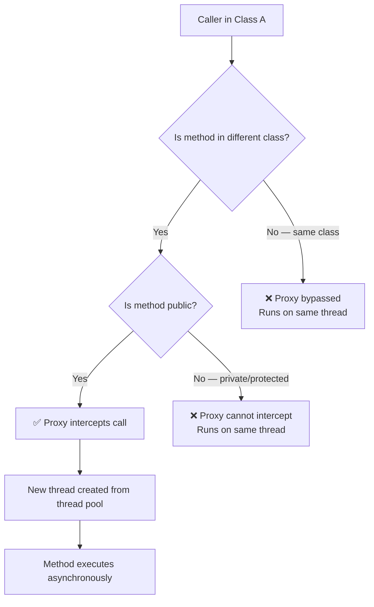
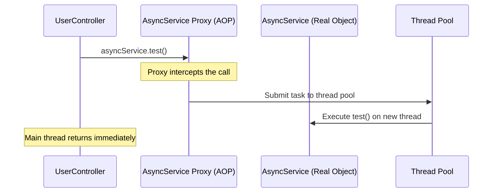
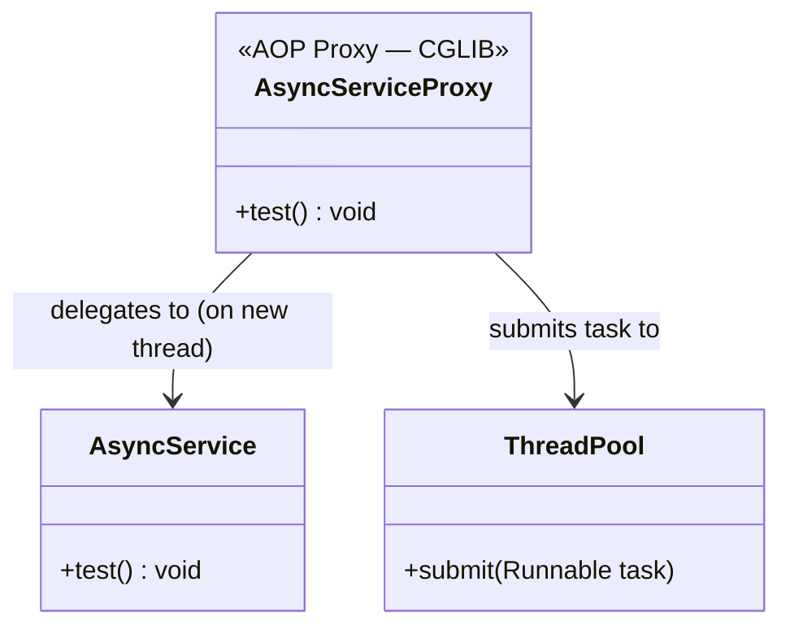
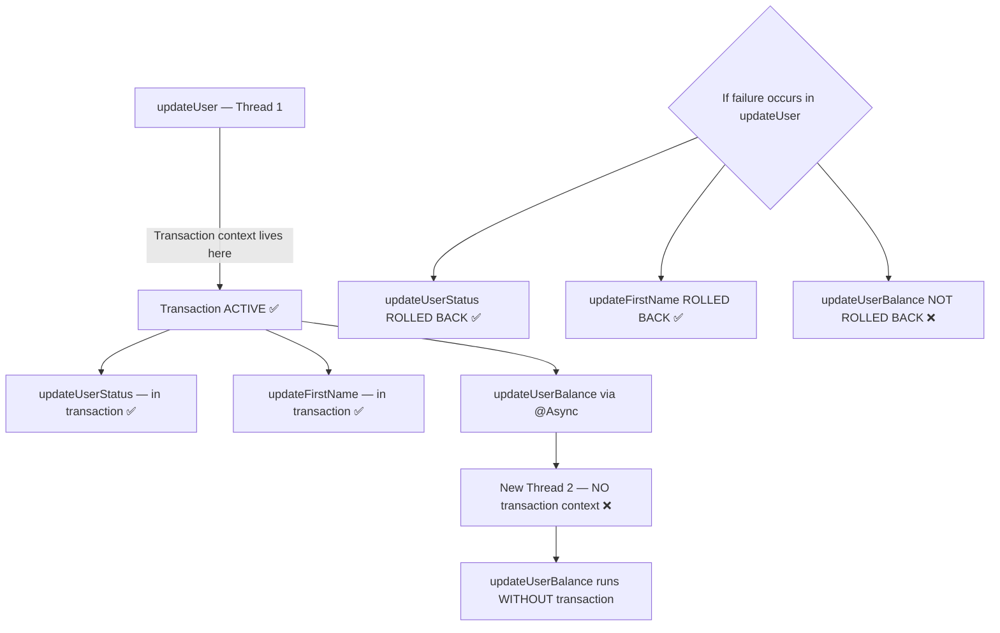
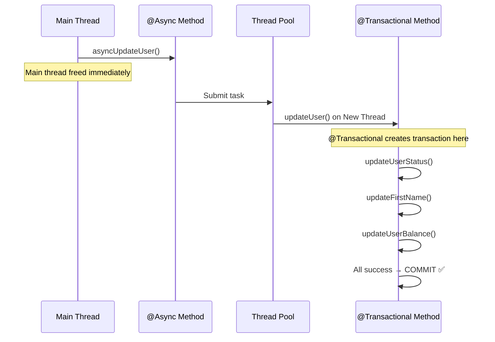
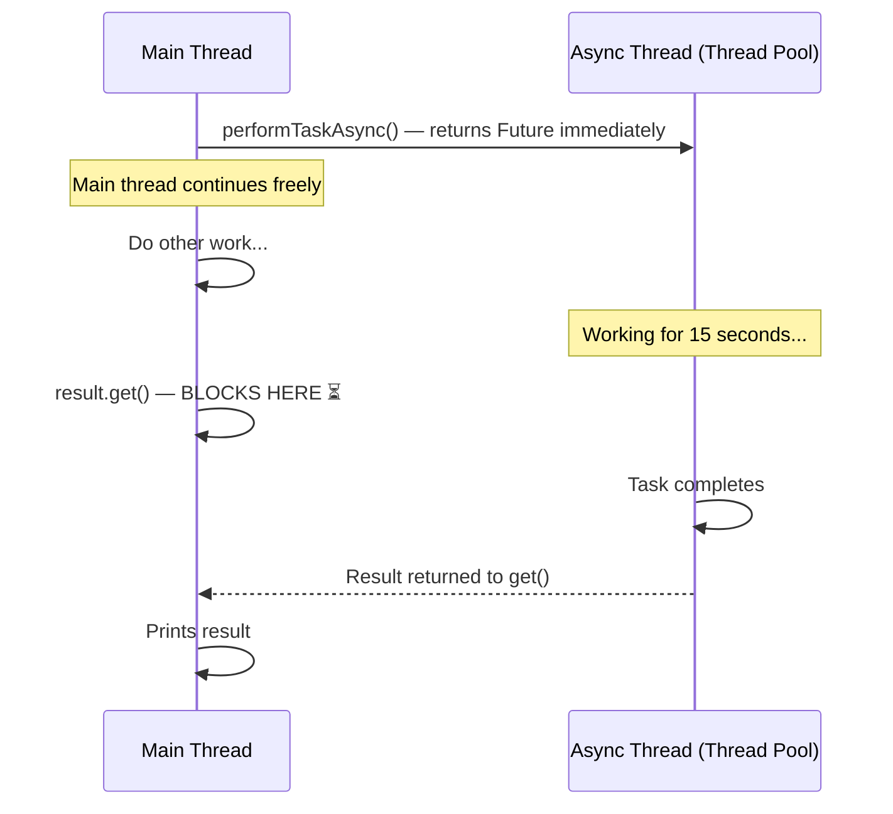
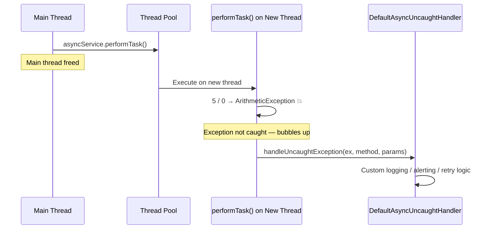
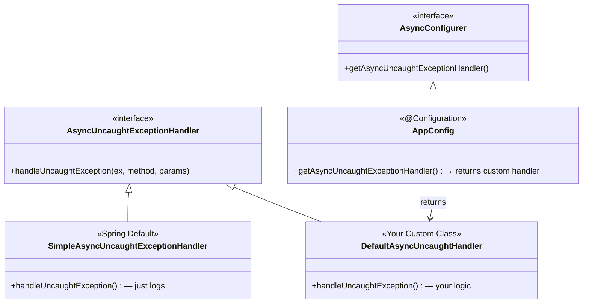

# 📌 Spring Boot `@Async` — Advanced Concepts & Interview Guide

> **Course:** Spring Boot Series  
> **Instructor:** Shreyansh  
> **Prerequisites:** Spring Boot AOP, Spring Boot `@Async` Basics, Java Multithreading (Future, Callable, CompletableFuture)

---

## Table of Contents

1. [Conditions for @Async to Work Properly](#conditions-for-async-to-work-properly)
2. [How @Async Works Internally (AOP)](#how-async-works-internally-aop)
3. [@Async and @Transactional Together](#async-and-transactional-together)
4. [@Async Method Return Types](#async-method-return-types)
5. [Exception Handling in @Async Methods](#exception-handling-in-async-methods)
6. [Key Observations](#key-observations)
7. [Common Mistakes](#common-mistakes)
8. [Best Practices](#best-practices)
9. [Interview Notes](#interview-notes)
10. [Summary](#summary)

---

## Conditions for `@Async` to Work Properly

### Overview

`@Async` does **not** always work just because you add the annotation. There are two mandatory conditions that must be satisfied, and violating either will cause the annotation to be silently ignored — no error is thrown, but the method runs on the **same thread** instead of a new one.

---

### The Two Conditions

| # | Condition | Why |
|---|---|---|
| 1 | The `@Async`-annotated method must be in a **different class** from the caller | AOP interception only happens across class boundaries |
| 2 | The `@Async`-annotated method must be **public** | AOP proxy cannot intercept private or protected methods |

> [!IMPORTANT]
> Both conditions must be met simultaneously. A public method in the same class will still **not** work asynchronously. A method in a different class that is private will also **not** work.

---

### Why These Conditions Exist — AOP Interception

`@Async` is implemented using **Spring AOP**. The mechanism works like this:

1. Spring scans for `@Async`-annotated methods at startup
2. Spring wraps the bean in a **proxy** object
3. When a caller invokes the method **through the proxy**, the proxy intercepts the call and executes it on a new thread from the thread pool
4. The proxy is bypassed when:
   - The call is **within the same class** (`this.methodName()`)
   - The method is **private** (proxies cannot override private methods)



---

### Broken Example — Same Class Invocation

```java
@RestController
public class UserController {

    // ❌ BROKEN: @Async method is in the SAME class as the caller
    @GetMapping("/get-user")
    public String getUser() {
        System.out.println("getUser thread: " + Thread.currentThread().getName());
        test();  // Calling async method in the same class
        return "Done";
    }

    @Async
    public void test() {
        // EXPECTATION: runs on a new thread
        // REALITY: runs on the SAME thread as getUser()
        System.out.println("test thread: " + Thread.currentThread().getName());
    }
}
```

**Output (actual — NOT what you expect):**

```
getUser thread: http-nio-8080-exec-1
test thread:    http-nio-8080-exec-1   ← SAME thread! @Async did nothing.
```

**Expected output (what you wanted):**

```
getUser thread: http-nio-8080-exec-1
test thread:    task-1                 ← Different thread
```

---

### Fixed Example — Method in Separate Class

```java
// Caller class
@RestController
public class UserController {

    @Autowired
    private AsyncService asyncService;  // Injected from a DIFFERENT class

    @GetMapping("/get-user")
    public String getUser() {
        System.out.println("getUser thread: " + Thread.currentThread().getName());
        asyncService.test();  // Calling async method from a DIFFERENT class ✅
        return "Done";
    }
}
```

```java
// Async method in a separate class
@Component
public class AsyncService {

    @Async           // ✅ public method
    public void test() {
        System.out.println("test thread: " + Thread.currentThread().getName());
    }
}
```

**Output (correct):**

```
getUser thread: http-nio-8080-exec-1
test thread:    task-1                 ← New thread created ✅
```

---

### Internal Mechanism Diagram



---

## How `@Async` Works Internally (AOP)

### Step-by-Step

1. **Application Startup:** Spring detects `@EnableAsync` and scans all beans for `@Async`-annotated methods
2. **Proxy Creation:** Spring wraps each bean containing `@Async` methods in a CGLIB or JDK dynamic proxy
3. **Method Invocation:** When the caller calls `asyncService.test()`, it actually calls `asyncServiceProxy.test()`
4. **Interception:** The proxy intercepts the call and submits the method as a `Runnable` or `Callable` to the configured thread pool (by default, `SimpleAsyncTaskExecutor`)
5. **Main Thread Freed:** The calling thread returns immediately without waiting
6. **Async Execution:** The method executes on a separate thread from the pool



---

## `@Async` and `@Transactional` Together

This is a critically important topic with three use cases. Understanding what works and what does not is a common interview question.

> [!IMPORTANT]
> **Core Rule:** Transaction context is **thread-local**. It is bound to the current thread and is **never automatically transferred to a new thread** spawned by `@Async`.

---

### Use Case 1 — `@Transactional` Method Calls an `@Async` Method (❌ Avoid)

#### Scenario

```java
// Class A — caller
public class SomeClass {
    @Autowired
    private UserService userService;

    public void someMethod() {
        userService.updateUser();  // Calls the transactional method
    }
}
```

```java
// UserService — has @Transactional, calls @Async method internally
@Service
public class UserService {

    @Autowired
    private BalanceService balanceService;

    @Transactional
    public void updateUser() {
        // These run within the transaction ✅
        updateUserStatus();
        updateFirstName();
        updateLastName();

        // ❌ This spawns a NEW thread — transaction context NOT carried forward
        balanceService.updateUserBalance();
    }
}
```

```java
@Component
public class BalanceService {

    @Async
    public void updateUserBalance() {
        // Runs in a new thread — NO transaction context here
        // Any DB changes here are NOT part of updateUser's transaction
    }
}
```

#### The Problem



#### Why It Fails

- The transaction is bound to **Thread 1** (the main thread)
- `@Async` creates **Thread 2** — a brand-new thread
- Thread 2 has **no transaction context** — it runs completely outside any transaction
- If `updateUser()` fails and rolls back:
  - `updateUserStatus()` is rolled back ✅
  - `updateFirstName()` is rolled back ✅
  - `updateUserBalance()` is **NOT rolled back** ❌ (it ran without a transaction on Thread 2)

> [!CAUTION]
> This use case creates **partial data updates** that are invisible to the rollback mechanism. This is a serious data integrity bug. **Avoid this pattern.**

---

### Use Case 2 — Same Method Has Both `@Async` and `@Transactional` (⚠️ Use With Caution)

#### Scenario

```java
@Service
public class UserService {

    // Both annotations on the same method
    @Async
    @Transactional
    public void updateUser() {
        updateUserStatus();
        updateFirstName();
        // ... all operations
    }
}
```

#### What Happens

```mermaid
flowchart TD
    A[Caller Thread — Thread 1] --> B[Invokes updateUser via @Async]
    B --> C[New Thread 2 created]
    C --> D[@Transactional creates a NEW transaction on Thread 2]
    D --> E[updateUserStatus — in transaction ✅]
    D --> F[updateFirstName — in transaction ✅]
    E & F --> G{Any exception?}
    G --> |Yes| H[Rollback on Thread 2 ✅]
    G --> |No| I[Commit on Thread 2 ✅]
```

#### Why It's Risky

A new thread **is** created, and that new thread **does** have its own transaction. So operations inside `updateUser()` are transactional. However:

- If the **caller (Thread 1) also has a transaction**, that parent transaction context is **not inherited**
- Propagation settings like `PROPAGATION_REQUIRED` (use existing transaction if present) **will not work** as expected — because from Thread 2's perspective, there is **no existing transaction** to join
- Propagation settings like `SUPPORTS`, `MANDATORY`, `NEVER`, etc., will all behave as if no parent transaction exists

```java
// Caller with its own transaction
@Transactional
public void callerMethod() {
    userService.updateUser();
    // updateUser runs on a NEW thread with a NEW transaction
    // It does NOT participate in callerMethod's transaction
    // Propagation settings in updateUser() are meaningless here
}
```

> [!WARNING]
> **Use Case 2 Summary:** The async method will have its own independent transaction, which is fine in isolation. But if you rely on transaction propagation from a parent transaction, it will **not work**. Use with caution and only when you explicitly want an isolated transaction on a new thread.

---

### Use Case 3 — Call `@Async` First, Then `@Transactional` Inside It (✅ Correct & Industry Standard)

#### Scenario

```java
// Controller or Service — calls an async wrapper
@Service
public class UserController {

    @Autowired
    private AsyncUserService asyncUserService;

    public void handleRequest() {
        asyncUserService.asyncUpdateUser();  // Main thread is freed immediately
        // Main thread continues here
    }
}
```

```java
// Async wrapper — spawns a new thread
@Component
public class AsyncUserService {

    @Autowired
    private UserService userService;

    @Async  // Creates a new thread — main thread freed
    public void asyncUpdateUser() {
        userService.updateUser();  // Calls the transactional method
    }
}
```

```java
// The actual transactional logic — runs on the new thread
@Service
public class UserService {

    @Transactional  // Transaction starts here, on the new thread
    public void updateUser() {
        updateUserStatus();
        updateFirstName();
        updateUserBalance();
        // Everything in here is transactional ✅
        // Any failure → rollback all ✅
    }
}
```

#### Why This Works



#### Advantages

| Aspect | Result |
|---|---|
| Main thread | Freed immediately, no waiting |
| Transaction | Fully functional on the new thread |
| Propagation | Works correctly within the new thread |
| Rollback | Works correctly — any failure rolls back everything |
| Isolation | Clean separation of async and transactional concerns |

> [!TIP]
> **This is the industry-standard pattern.** Separate the `@Async` concern (spawning a thread) from the `@Transactional` concern (managing a transaction). Let `@Async` live in a "launcher" method and `@Transactional` live in the actual business logic method.

---

### Use Case Comparison Table

| Use Case | Pattern | Problem | Recommendation |
|---|---|---|---|
| **1** | `@Transactional` method calls `@Async` method | Async method runs without transaction; rollback incomplete | ❌ Avoid |
| **2** | Same method has both `@Async` and `@Transactional` | Propagation from parent transaction doesn't work | ⚠️ Use with caution |
| **3** | `@Async` wrapper calls `@Transactional` method | No issues; full transaction management on new thread | ✅ Industry standard |

---

## `@Async` Method Return Types

### Overview

When a method runs on a separate thread, the main thread needs a mechanism to **retrieve the result** once the async work is complete. Java provides two types for this purpose: `Future` and `CompletableFuture`.

> [!NOTE]
> `Future` is now **deprecated** in favor of `CompletableFuture`, which was introduced in **Java 8**. `CompletableFuture` is the industry standard and offers chaining, composition, and more powerful APIs. For a deep dive into these types, refer to the Java Multithreading playlist — there is a dedicated 1+ hour video on Future, Callable, and CompletableFuture.

---

### Return Type Options

| Return Type | Description | Status |
|---|---|---|
| `void` | Fire-and-forget — no result needed | ✅ Common |
| `Future<T>` | Older mechanism to retrieve async result | ⚠️ Deprecated |
| `CompletableFuture<T>` | Modern, feature-rich async result holder | ✅ Industry standard |

---

### Option 1 — `void` Return Type (Fire and Forget)

```java
@Async
public void performTask() {
    // Run some work on a new thread
    // No result is returned to the caller
    System.out.println("Running on: " + Thread.currentThread().getName());
}
```

```java
// Caller
public void callerMethod() {
    asyncService.performTask();  // Returns immediately
    // Main thread continues here — no way to get a result
}
```

**Use when:** You don't need the result and don't need to wait for completion (e.g., sending emails, logging, notifications).

---

### Option 2 — `Future<T>` Return Type (Deprecated)

```java
@Async
public Future<String> performTaskAsync() {
    // Simulate long-running task
    Thread.sleep(15000);  // 15 seconds
    return new AsyncResult<>("Task completed!");  // Wrap result in AsyncResult
}
```

```java
// Caller
public void callerMethod() throws Exception {
    Future<String> result = asyncService.performTaskAsync();  // Returns immediately

    // Main thread is free here — can do other work
    System.out.println("Doing other work while async task runs...");

    // When you need the result — main thread WAITS here
    String output = result.get();  // BLOCKS until async method completes
    System.out.println("Result: " + output);
}
```

#### Key `Future` Methods

| Method | Description |
|---|---|
| `get()` | Blocks until result is available |
| `get(timeout, unit)` | Blocks up to specified timeout |
| `isDone()` | Returns true if task completed |
| `isCancelled()` | Returns true if task was cancelled |
| `cancel(mayInterrupt)` | Attempts to cancel the task |

#### Execution Timeline



---

### Option 3 — `CompletableFuture<T>` Return Type (Industry Standard)

```java
@Async
public CompletableFuture<String> performTaskAsync() {
    // Simulate long-running task
    Thread.sleep(15000);
    return CompletableFuture.completedFuture("Task completed!");
}
```

```java
// Caller
public void callerMethod() throws Exception {
    CompletableFuture<String> result = asyncService.performTaskAsync();  // Returns immediately

    // Main thread continues freely
    System.out.println("Doing other work while task runs...");

    // Wait for result when needed
    String output = result.get();  // BLOCKS until completion
    System.out.println("Result: " + output);
}
```

#### Why CompletableFuture Over Future

| Feature | `Future` | `CompletableFuture` |
|---|---|---|
| Block for result | ✅ `get()` | ✅ `get()` |
| Non-blocking callbacks | ❌ No | ✅ `thenApply()`, `thenAccept()` |
| Chaining operations | ❌ No | ✅ Yes |
| Combining futures | ❌ No | ✅ `allOf()`, `anyOf()` |
| Manual completion | ❌ No | ✅ `complete()` |
| Exception handling | ❌ Limited | ✅ `exceptionally()`, `handle()` |
| Status | ⚠️ Deprecated | ✅ Industry standard |

> [!TIP]
> `CompletableFuture` supports powerful **chaining**: you can chain operations like `.thenApply()`, `.thenCompose()`, `.thenAccept()`, etc. This allows you to build complex async pipelines without blocking. See the Java Multithreading playlist for a full in-depth explanation.

---

## Exception Handling in `@Async` Methods

This is a very important interview topic. The challenge differs based on whether the async method returns `void` or a `Future`/`CompletableFuture`.

---

### Case 1 — Method Returns `Future` or `CompletableFuture` (Simple)

```java
@Async
public CompletableFuture<String> performTask() {
    // Some exception occurs
    int result = 5 / 0;  // ArithmeticException
    return CompletableFuture.completedFuture("Done");
}
```

```java
// Caller
public void callerMethod() {
    CompletableFuture<String> result = asyncService.performTask();

    try {
        String output = result.get();  // Exception is thrown HERE
        System.out.println(output);
    } catch (ExecutionException e) {
        // The original exception is wrapped in ExecutionException
        System.err.println("Async task failed: " + e.getCause().getMessage());
    } catch (InterruptedException e) {
        Thread.currentThread().interrupt();
    }
}
```

**How it works:**
- The exception is held inside the `CompletableFuture` / `Future` object
- When the caller calls `.get()`, the exception is **re-thrown** wrapped in `ExecutionException`
- The caller can catch and handle it at the `get()` call site

---

### Case 2 — Method Returns `void` (The Tricky One)

```java
@Async
public void performTask() {
    int result = 5 / 0;  // ArithmeticException — how do we handle this?
}
```

```java
// Caller
public void callerMethod() {
    asyncService.performTask();  // Returns immediately
    // No Future to call .get() on
    // Main thread has NO WAY to know if an exception occurred
}
```

The exception occurs on a **different thread**. The main thread has already moved on. There is no reference to catch it with.

---

#### Solution A — Try-Catch Inside the Async Method

```java
@Async
public void performTask() {
    try {
        int result = 5 / 0;  // Simulate exception
        // ... business logic
    } catch (Exception e) {
        // Handle here: log, alert, retry, etc.
        System.err.println("Exception in async method: " + e.getMessage());
        log.error("Async task failed", e);
    }
}
```

**Pros:** Simple, straightforward.  
**Cons:** You have to add try-catch to **every** async void method — code duplication.

---

#### Solution B — Custom `AsyncUncaughtExceptionHandler` (Industry Standard)

Spring Boot provides a built-in default handler:

```java
// Spring Boot's built-in default (SimpleAsyncUncaughtExceptionHandler)
public class SimpleAsyncUncaughtExceptionHandler implements AsyncUncaughtExceptionHandler {

    @Override
    public void handleUncaughtException(Throwable ex, Method method, Object... params) {
        // Default behavior: just logs the exception
        logger.error("Unexpected exception occurred invoking async method: " + method, ex);
    }
}
```

If you don't configure anything, Spring Boot uses this and logs the exception automatically. But you can **replace it with your own**.

---

##### Step 1 — Create a Custom Exception Handler

```java
@Component
public class DefaultAsyncUncaughtHandler implements AsyncUncaughtExceptionHandler {

    @Override
    public void handleUncaughtException(Throwable ex, Method method, Object... params) {
        // Custom handling — you define the logic
        System.out.println("=== Async Exception Caught ===");
        System.out.println("Method: " + method.getName());
        System.out.println("Exception: " + ex.getMessage());

        // You can also:
        // - Send an alert/notification
        // - Log to a monitoring system (Datadog, Splunk, etc.)
        // - Retry the operation
        // - Write to a dead-letter queue
        log.error("Async method [{}] threw exception: {}", method.getName(), ex.getMessage(), ex);
    }
}
```

---

##### Step 2 — Register the Custom Handler via `AsyncConfigurer`

```java
@Configuration
@EnableAsync
public class AppConfig implements AsyncConfigurer {

    @Autowired
    private DefaultAsyncUncaughtHandler asyncUncaughtHandler;

    @Override
    public AsyncUncaughtExceptionHandler getAsyncUncaughtExceptionHandler() {
        // Return your custom handler
        // Spring will use this instead of the default one
        return asyncUncaughtHandler;
    }
}
```

---

##### Step 3 — The Async Method (No try-catch needed)

```java
@Component
public class AsyncService {

    @Async
    public void performTask() {
        int result = 5 / 0;  // ArithmeticException — no try-catch here
        // Spring automatically routes uncaught exceptions to your handler
    }
}
```

---

#### How the Custom Handler Gets Invoked



---

#### Exception Handler Configuration Diagram



---

#### Comparison of Exception Handling Approaches

| Approach | Pros | Cons | Best For |
|---|---|---|---|
| **Try-catch inside async method** | Simple, explicit, method-level control | Duplicated in every async void method | One-off cases with unique handling |
| **Custom `AsyncUncaughtExceptionHandler`** | Centralized, no duplication, clean code | Applies globally to all async void methods | Industry standard — most applications |
| **Spring default handler** | Zero configuration | Only logs; no custom logic | Development / debugging only |

> [!TIP]
> The **industry standard** is to implement a custom `AsyncUncaughtExceptionHandler` and register it via `AsyncConfigurer`. This keeps async methods clean and provides a single centralized place for exception handling, logging, alerting, and retry logic.

---

## Key Observations

1. **Both conditions must be met** for `@Async` to work: public method + different class from caller.

2. **`@Async` is AOP-based** — the same proxy mechanism that powers `@Transactional` also powers `@Async`.

3. **Transaction context is thread-local** — it never crosses thread boundaries. A new thread spawned by `@Async` has no awareness of any transaction on the parent thread.

4. **Use Case 3 is the correct pattern** — `@Async` in a launcher method, `@Transactional` in the actual business method, all on the new thread.

5. **`CompletableFuture` is the preferred return type** over `Future`. `Future` is deprecated.

6. **Exception handling differs by return type:**
   - With `Future`/`CompletableFuture` — exception surfaces at `.get()` call
   - With `void` — exception must be handled via `AsyncUncaughtExceptionHandler` or try-catch

7. **Spring provides a default exception handler** (`SimpleAsyncUncaughtExceptionHandler`) that simply logs uncaught exceptions from async void methods.

8. **You can override the default handler** by implementing `AsyncUncaughtExceptionHandler` and registering it via `AsyncConfigurer`.

---

## Common Mistakes

### Mistake 1 — Calling `@Async` From the Same Class

```java
// ❌ Does NOT work — same class invocation bypasses AOP proxy
@Component
public class MyService {

    public void caller() {
        this.asyncMethod();  // Bypasses proxy — runs synchronously
    }

    @Async
    public void asyncMethod() {
        // Expected: new thread. Reality: same thread.
    }
}
```

**Fix:** Move `asyncMethod()` to a separate `@Component` class and inject it.

---

### Mistake 2 — Using `@Async` on a Private Method

```java
// ❌ Does NOT work — AOP cannot proxy private methods
@Async
private void asyncMethod() {
    // @Async has NO effect here
}

// ✅ Must be public
@Async
public void asyncMethod() {
    // Works correctly
}
```

---

### Mistake 3 — Calling `@Async` Method Inside a `@Transactional` and Expecting Shared Transaction

```java
// ❌ WRONG ASSUMPTION: balance update is part of the transaction
@Transactional
public void updateUser() {
    updateStatus();
    balanceService.updateBalance();  // @Async — runs WITHOUT transaction!
}
```

**Fix:** Use Use Case 3 pattern — `@Async` first, then `@Transactional` on the inner method.

---

### Mistake 4 — Not Handling Exceptions in `void` Async Methods

```java
// ❌ Exception silently disappears if no handler is configured
@Async
public void asyncTask() {
    throw new RuntimeException("This will be silently lost!");
}
```

**Fix:** Implement a custom `AsyncUncaughtExceptionHandler` or use try-catch inside the method.

---

### Mistake 5 — Forgetting `@EnableAsync`

```java
// ❌ @Async annotation is completely ignored without this
@SpringBootApplication
// Missing @EnableAsync!
public class MyApp { ... }

// ✅ Correct
@SpringBootApplication
@EnableAsync
public class MyApp { ... }
```

---

## Best Practices

1. **Always place `@Async` methods in a separate `@Service` or `@Component` class** from the calling code.

2. **Always make `@Async` methods public.**

3. **Configure a custom thread pool** using `ThreadPoolTaskExecutor` instead of the default `SimpleAsyncTaskExecutor` (which creates a new thread for every call, with no pooling).

   ```java
   @Bean(name = "taskExecutor")
   public Executor taskExecutor() {
       ThreadPoolTaskExecutor executor = new ThreadPoolTaskExecutor();
       executor.setCorePoolSize(5);
       executor.setMaxPoolSize(10);
       executor.setQueueCapacity(100);
       executor.setThreadNamePrefix("Async-");
       executor.initialize();
       return executor;
   }
   ```

4. **Use `CompletableFuture<T>` over `Future<T>`** when you need to retrieve the result.

5. **Implement a custom `AsyncUncaughtExceptionHandler`** for centralized exception handling of `void` async methods — don't scatter try-catch blocks.

6. **Follow Use Case 3 for `@Async` + `@Transactional`** — never mix them on the same method unless you fully understand the implications, and never call an `@Async` method from within a `@Transactional` method.

7. **Name your thread pool executors** so logs clearly identify which pool executed which task.

---

## Interview Notes

> [!IMPORTANT]
> These are common interview questions about `@Async` in Spring Boot.

---

### Q1: What are the two conditions for `@Async` to work correctly?

**Answer:**
1. The `@Async`-annotated method must be in a **different class** from the caller.
2. The method must be **public**.

Both conditions exist because `@Async` uses Spring AOP proxies, which can only intercept public methods called from outside the class.

---

### Q2: Why does calling an `@Async` method from the same class not work?

**Answer:** Spring AOP creates a proxy around the bean. When you call `this.asyncMethod()` from within the same class, you are calling the **actual object**, not the proxy. The proxy is never involved, so the AOP advice (which spawns the new thread) never executes. The method runs synchronously on the same thread.

---

### Q3: How do `@Async` and `@Transactional` interact? What are the challenges?

**Answer:** Transaction context is **thread-local** and is never transferred to a new thread created by `@Async`. There are three patterns:

- **Pattern 1 (Avoid):** A `@Transactional` method calls an `@Async` method — the async method runs without any transaction; rollback is incomplete.
- **Pattern 2 (Caution):** Same method has both annotations — creates a new transaction on the new thread, but parent transaction context is not inherited; propagation doesn't work as expected.
- **Pattern 3 (Correct):** An `@Async` wrapper method calls a `@Transactional` method — the transactional method runs fully on the new thread with a proper transaction.

---

### Q4: How do you handle exceptions in an `@Async` method that returns `void`?

**Answer:** Two approaches:
1. **Try-catch inside the method** — catches the exception locally; fine for one-off cases.
2. **Custom `AsyncUncaughtExceptionHandler`** — implement the interface, override `handleUncaughtException()`, and register it via `AsyncConfigurer.getAsyncUncaughtExceptionHandler()`. This is the industry standard as it centralizes all async exception handling.

---

### Q5: How do you handle exceptions in an `@Async` method that returns `CompletableFuture`?

**Answer:** The exception is stored inside the `CompletableFuture` object. When the caller calls `.get()`, the exception is re-thrown wrapped in `ExecutionException`. The caller wraps `.get()` in a try-catch and handles `ExecutionException`, accessing the original exception via `e.getCause()`.

---

### Q6: What is the difference between `Future` and `CompletableFuture` in the context of `@Async`?

**Answer:** Both allow the caller to retrieve the result of an async method. However, `CompletableFuture` (Java 8+) is far superior: it supports non-blocking callbacks (`.thenApply()`, `.thenAccept()`), chaining of multiple async operations, combining multiple futures (`allOf()`, `anyOf()`), and manual completion. `Future` is deprecated in favor of `CompletableFuture`.

---

### Q7: What happens if you don't configure `AsyncUncaughtExceptionHandler`?

**Answer:** Spring Boot uses its built-in `SimpleAsyncUncaughtExceptionHandler` by default, which simply logs the exception with the message `"Unexpected exception occurred invoking async method"`. The exception is not re-thrown and does not affect the main thread.

---

## Summary

| Topic | Key Point |
|---|---|
| **Condition 1** | `@Async` method must be in a **different class** from caller |
| **Condition 2** | `@Async` method must be **public** |
| **Why** | AOP proxy can only intercept public cross-class method calls |
| **Use Case 1** | `@Transactional` calls `@Async` → async runs without transaction ❌ |
| **Use Case 2** | Same method with both → works but propagation broken ⚠️ |
| **Use Case 3** | `@Async` wrapper → `@Transactional` method → industry standard ✅ |
| **Transaction context** | Thread-local — never transferred to new threads |
| **void return** | Exception handled via `AsyncUncaughtExceptionHandler` or try-catch |
| **Future return** | Exception surfaces at `.get()` call — use try-catch there |
| **CompletableFuture** | Preferred return type; richer API than `Future` |
| **Custom handler** | Implement `AsyncUncaughtExceptionHandler` + register via `AsyncConfigurer` |
| **Default handler** | `SimpleAsyncUncaughtExceptionHandler` — just logs; no custom logic |

> [!TIP]
> **One-line mental model for `@Async` + `@Transactional`:** Always let `@Async` spawn the thread first, then let `@Transactional` manage the transaction **on that new thread**. Never go the other direction.

---

*End of Study Guide — Spring Boot @Async Advanced Concepts*
