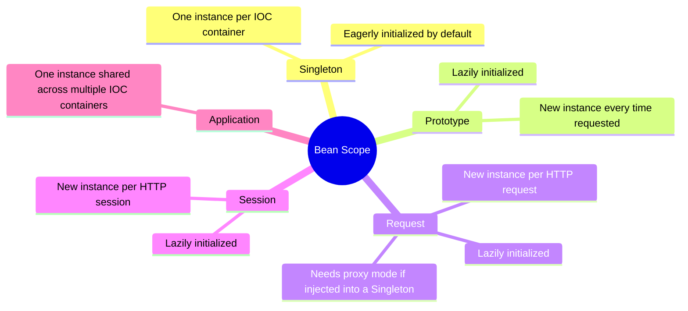
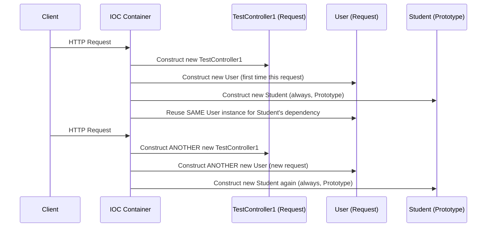
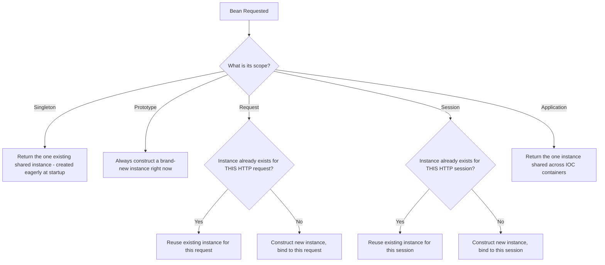

# 📌 Spring Boot Bean Scopes — Complete Study Guide

> [!NOTE]
> **Prerequisite:** This topic requires a solid understanding of **Beans** and the **Bean Lifecycle** (construct → inject dependencies → `@PostConstruct` → use → `@PreDestroy` → destroy), as well as **Dependency Injection**. Bean Scope determines *how many instances* of a bean exist and *when* they're created — but the underlying construction/injection/post-construct sequence for each individual instance still follows the same lifecycle covered earlier. If those topics aren't clear yet, review them first.

---

## Table of Contents

1. [What Is Bean Scope?](#-what-is-bean-scope)
2. [Singleton Scope](#-singleton-scope)
3. [Prototype Scope](#-prototype-scope)
4. [Request Scope](#-request-scope)
5. [Proxy Mode — Injecting a Request-Scoped Bean into a Singleton](#-proxy-mode--injecting-a-request-scoped-bean-into-a-singleton)
6. [Session Scope](#-session-scope)
7. [Application Scope](#-application-scope)
8. [Comparison Table of All Scopes](#-comparison-table-of-all-scopes)
9. [Practice Questions](#-practice-questions)
10. [Summary](#-summary)

---

# 📌 What Is Bean Scope?

## Overview

**Bean Scope** defines how many instances of a given bean the Spring IOC container creates, and under what conditions/lifetime each instance exists. There are **five types** of bean scope in Spring:

1. **Singleton**
2. **Prototype**
3. **Request**
4. **Session**
5. **Application**

## Definition

> **Bean Scope** is a configuration that tells the Spring IOC container the *cardinality* (how many instances) and *lifetime* (when created, how long it lives) of a bean.

## Why This Concept Exists

Not every object in an application should behave the same way in terms of instance count and lifetime. Some objects (like a shared configuration or service) should exist exactly once for the whole application. Others (like a form object that captures user-specific input) need a **fresh instance every single time** they're requested. Some need to be tied to the lifetime of a single web request, and others to an entire user session. Bean Scope gives developers fine-grained control over exactly this behavior, rather than forcing every bean to behave identically.

## Internal Working — Why the Bean Lifecycle Matters Here

> [!IMPORTANT]
> Understanding the **bean lifecycle** (construct → inject dependencies → `@PostConstruct`) is essential to understanding scope, because scope essentially controls **when**, in relation to the application/request/session timeline, this lifecycle sequence gets triggered for a given class — and **how many times** it gets triggered.

## Diagrams



## Related Concepts

- Bean Lifecycle (construction, dependency injection, `@PostConstruct`, `@PreDestroy`)
- Dependency Injection (`@Autowired`)
- Eager vs. Lazy Initialization

---

# 📌 Singleton Scope

## Overview

**Singleton** is the **default scope** in Spring — if you don't explicitly specify a scope on a bean, it is automatically treated as Singleton.

## Definition

> **Singleton scope** means **only one instance is created per IOC container** (in practice, since most applications run a single IOC container, this effectively means one instance per application).

## Why This Concept Exists

Many objects in an application — services, repositories, shared configuration, utility beans — don't need or benefit from having multiple copies. Creating a single shared instance saves memory and ensures consistent shared state (where appropriate) across the entire application.

## Internal Working — Eager Initialization

> [!NOTE]
> Singleton-scoped beans are, by default, **eagerly initialized** — meaning the IOC container constructs them **immediately at application startup**, not later when they're first used.

This directly connects to the general eager-vs-lazy discussion from the bean lifecycle: Singleton is the scope that qualifies a bean for eager initialization by default.

## Syntax

**Implicit (default) Singleton — no annotation needed:**

```java
@RestController
public class TestController1 {

    @GetMapping("/fetchUser")
    public String fetchUser() {
        return "user fetched";
    }
}
```

**Explicit Singleton — using the `ConfigurableBeanFactory` enum constant:**

```java
@RestController
@Scope(ConfigurableBeanFactory.SCOPE_SINGLETON)
public class TestController2 {
}
```

**Explicit Singleton — using a plain string:**

```java
@Component
@Scope("singleton")
public class User {
}
```

## Syntax Breakdown

| Element | Meaning |
|---|---|
| `@Scope(...)` | Explicitly declares the scope of the bean |
| `ConfigurableBeanFactory.SCOPE_SINGLETON` | An enum-like constant that internally just resolves to the string `"singleton"` |
| `"singleton"` (plain string) | Equivalent to using the constant — both work identically |
| (No `@Scope` at all) | Defaults to Singleton automatically |

> [!TIP]
> You can declare Singleton scope in three equivalent ways: omit `@Scope` entirely (relying on the default), use the `ConfigurableBeanFactory.SCOPE_SINGLETON` constant, or use the plain string `"singleton"` directly. All three produce identical behavior — internally, the constant is just a `String` value.

## Code Examples

**Setup — Two Singleton-scoped controllers sharing one Singleton-scoped dependency:**

```java
@RestController
public class TestController1 {

    @Autowired
    private User user;

    public TestController1() {
        System.out.println("TestController1 instance initialization");
    }

    @PostConstruct
    public void init() {
        System.out.println("TestController1 object hashCode: " + this.hashCode());
        System.out.println("User object hashCode: " + user.hashCode());
    }
}
```

```java
@RestController
public class TestController2 {

    @Autowired
    private User user;

    public TestController2() {
        System.out.println("TestController2 instance initialization");
    }

    @PostConstruct
    public void init() {
        System.out.println("TestController2 object hashCode: " + this.hashCode());
        System.out.println("User object hashCode: " + user.hashCode());
    }
}
```

```java
@Component
public class User {
    public User() {
        System.out.println("User initialization");
    }
}
```

**Output (at application startup):**

```
TestController1 instance initialization
User initialization
TestController1 object hashCode: <hash-A>
User object hashCode: <hash-U>

TestController2 instance initialization
TestController2 object hashCode: <hash-B>
User object hashCode: <hash-U>   <-- SAME as above
```

## Step-by-Step Execution

1. Application starts → IOC container invoked.
2. IOC scans and finds `TestController1` (`@RestController`, effectively a `@Component`) — since Singleton is eagerly initialized, its constructor runs immediately → `"TestController1 instance initialization"` prints. At this point, the bean is constructed but its dependency is **not yet injected**.
3. IOC now resolves `TestController1`'s dependency: the `user` field. It checks if a `User` bean already exists — it does not, so IOC constructs it → `"User initialization"` prints.
4. `User` has no further dependencies, so it proceeds straight to `@PostConstruct` — the `User` bean is now fully constructed, with some hash code (e.g., `<hash-U>`).
5. The newly constructed `User` object is injected into `TestController1`'s `user` field.
6. `TestController1` has no more unresolved dependencies, so its own `@PostConstruct` runs — printing both `TestController1`'s hash code and the injected `User`'s hash code.
7. IOC then finds `TestController2`, also Singleton and eagerly initialized → its constructor runs → `"TestController2 instance initialization"` prints.
8. IOC resolves `TestController2`'s `user` dependency. This time, a `User` bean **already exists** in the container (created in step 3) — since `User` is Singleton, IOC reuses the **same existing instance** rather than creating a new one.
9. The **same** `User` object (same hash code, `<hash-U>`) is injected into `TestController2`.
10. `TestController2`'s `@PostConstruct` runs, printing its own hash code and the (same) `User` hash code.

## Memory Representation

| Concept | Behavior Under Singleton Scope |
|---|---|
| Number of heap objects created for `User` | Exactly **one**, for the entire application/IOC container lifetime |
| Reference sharing | Every class that `@Autowired`s a `User` receives a reference to the **same** heap object |
| Timing of creation | At application startup (eager initialization), assuming no `@Lazy` override |

## Key Observations

- **Only one instance is ever created per IOC container**, no matter how many other beans depend on it.
- Once created, the **same object** is reused/injected everywhere that bean type is required.
- When you later invoke an API endpoint (e.g., `fetchUser`), **no new object construction happens** — everything was already constructed at startup; the API call simply invokes existing, already-wired objects.
- Singleton beans are, by default, **eagerly initialized** at application startup (though this can still be overridden with `@Lazy`, as covered in the bean lifecycle guide).

## Best Practices

- Use Singleton (the default) for stateless services, shared configuration, repositories, and utility beans — anything that doesn't need per-request or per-user-specific state.
- Avoid storing mutable, request-specific, or user-specific state inside a Singleton bean's fields, since that state would be shared (and potentially corrupted) across all usages of the bean throughout the whole application.

## Interview Notes

- **Q: What is the default bean scope in Spring?** → Singleton.
- **Q: Is Singleton scope tied to the number of times a bean is `@Autowired` elsewhere?** → No — regardless of how many classes depend on it, exactly one instance is created and shared.
- **Q: Are Singleton beans eagerly or lazily initialized by default?** → Eagerly initialized (unless explicitly marked `@Lazy`).

---

# 📌 Prototype Scope

## Overview

**Prototype** scope is essentially the opposite of Singleton in terms of instance count: a brand-new object is created **every single time** the bean is requested.

## Definition

> **Prototype scope** means a **new object is created each and every time** the bean is requested — whether that request comes from a different class or the same class asking again. It is also, importantly, **lazily initialized** — never created at application startup, only when actually needed/requested.

## Why This Concept Exists

Some objects genuinely need to be independent, fresh instances every time they're used — for example, objects representing a specific unit of work, a specific calculation, or any object where sharing state across usages would be incorrect or unsafe. Prototype scope exists for exactly these cases.

## Syntax

```java
@Component
@Scope(ConfigurableBeanFactory.SCOPE_PROTOTYPE)
public class User {
    public User() {
        System.out.println("User initialization");
    }
}
```

Or equivalently, using a plain string:

```java
@Component
@Scope("prototype")
public class User {
}
```

## Syntax Breakdown

| Element | Meaning |
|---|---|
| `@Scope(...)` | Declares the bean's scope |
| `ConfigurableBeanFactory.SCOPE_PROTOTYPE` / `"prototype"` | Both are equivalent ways of specifying prototype scope |

## Internal Working — Lazy Initialization

> [!IMPORTANT]
> Prototype-scoped beans are **always lazily initialized** — they are **never** constructed at application startup, no matter what. They are constructed only at the exact moment they are actually needed (i.e., requested by another bean's dependency resolution, or explicitly fetched from the container).

## Code Examples

**Setup:**

```java
@RestController
@Scope(ConfigurableBeanFactory.SCOPE_PROTOTYPE)
public class TestController1 {

    @Autowired
    private User user;

    @Autowired
    private Student student;

    public TestController1() {
        System.out.println("TestController1 instance initialization");
    }

    @GetMapping("/fetchUser")
    public String fetchUser() {
        return "fetched";
    }
}
```

```java
@Component
@Scope(ConfigurableBeanFactory.SCOPE_PROTOTYPE)
public class User {
    public User() {
        System.out.println("User initialization");
    }
}
```

```java
@Component // no explicit scope --> defaults to Singleton
public class Student {

    @Autowired
    private User user;

    public Student() {
        System.out.println("Student instance initialization");
    }

    @PostConstruct
    public void init() {
        System.out.println("Student object hashCode: " + this.hashCode());
        System.out.println("User object hashCode: " + user.hashCode());
    }
}
```

**Output at Application Startup:**

```
Student instance initialization
User initialization
Student object hashCode: <hash-S>
User object hashCode: <hash-U1>
```

> [!NOTE]
> Notice that `TestController1` prints **nothing** at startup — since it's Prototype-scoped, it is never eagerly constructed. Similarly, if `User` were referenced only by `TestController1`, it too would print nothing at startup. `User` prints here *only* because `Student` (a Singleton, eagerly initialized) also depends on it, forcing its construction at startup regardless of its own prototype-ness — because it is *needed* right then.

**Step-by-Step Execution — Application Startup**

1. IOC finds `TestController1` — sees it's Prototype scope → lazily initialized → **skips creating it now**.
2. IOC finds `User` — also Prototype scope → lazily initialized → **skips creating it now** (on its own, in isolation).
3. IOC finds `Student` — Singleton scope (default, no `@Scope` specified) → eagerly initialized → constructs it now → `"Student instance initialization"` prints.
4. IOC resolves `Student`'s dependency: `user`. Since `User` is genuinely required right now (to satisfy `Student`'s construction), IOC constructs a `User` instance at this point → `"User initialization"` prints, despite `User` itself being marked Prototype.
5. `User` has no dependencies, so its `@PostConstruct` runs (implicitly) — it's now fully constructed with hash code `<hash-U1>`.
6. This `User` instance is injected into `Student`.
7. `Student`'s `@PostConstruct` runs, printing its own hash code (`<hash-S>`) and the injected `User`'s hash code (`<hash-U1>`).
8. Application startup completes — `TestController1` was never touched, since nothing required it yet.

**Now — Hitting the `fetchUser` API Endpoint (First Call):**

**Output:**

```
TestController1 instance initialization
User initialization
```

**Step-by-Step Execution**

1. Since `TestController1` is Prototype scope, IOC must construct a **brand-new instance** to service this request → `"TestController1 instance initialization"` prints.
2. IOC resolves `TestController1`'s dependencies. First, `user`: since `User` is Prototype, **a brand-new `User` instance is constructed here as well** — even though a `User` object was already constructed earlier (and injected into `Student`), Prototype scope means every single request for a `User` bean produces a fresh instance. So `"User initialization"` prints again, and this new `User` object has a **different hash code** (`<hash-U2>`) than the one injected into `Student` (`<hash-U1>`).
3. Next, `student`: since `Student` is Singleton, the **already-existing** `Student` instance (created at startup, hash code `<hash-S>`) is simply reused/injected — no new construction happens.
4. `TestController1`'s dependencies are now resolved (a fresh `User`, and the existing `Student`), and the request completes.

**Hitting the `fetchUser` API a Second Time:**

Since `TestController1` is Prototype, **another brand-new instance is constructed** for this second call as well — you would see `"TestController1 instance initialization"` print yet again, along with another fresh `User` instance being constructed (since `User` is also Prototype).

## Key Observations

- Prototype beans are **never eagerly constructed** at startup, regardless of anything else.
- However, a Prototype bean **can** still be constructed at startup **indirectly** — if a Singleton (eagerly initialized) bean depends on it, that dependency must be resolved right then, forcing construction at that moment, even though the bean's own scope is Prototype.
- Every time a Prototype-scoped bean is genuinely requested/needed — whether during startup dependency-resolution or in response to an explicit request like an API call — a **completely new instance** is created, evidenced by a different hash code each time.
- A Singleton bean injected as a dependency of a Prototype bean (or vice versa) still behaves according to **its own** scope rules — a Singleton stays the same single shared instance regardless of how many times a Prototype bean around it gets recreated.

## Common Mistakes

> [!WARNING]
> A common misconception is assuming that once a Prototype bean has been created once (e.g., because a Singleton depended on it), all future requests for it will reuse that same object. In reality, **every single request** for a Prototype-scoped bean produces a **new** instance — the earlier instance created to satisfy a Singleton's dependency has no bearing on later requests.

## Interview Notes

- **Q: Is a Prototype bean ever created at application startup?** → Only indirectly — if some eagerly-initialized (Singleton) bean has a hard dependency on it, forcing its construction to satisfy that dependency. On its own, Prototype is always lazy.
- **Q: If you call the same API endpoint (backed by a Prototype-scoped controller) twice, how many controller instances get created?** → Two — one for each individual call, since Prototype always constructs a fresh instance per request.

---

# 📌 Request Scope

## Overview

**Request** scope creates exactly **one new object per HTTP request**. This is one of the scopes most prone to developer confusion, largely because of the interaction with something called **proxy mode**, covered in its own section below.

## Definition

> **Request scope** means a **new object is created for each individual HTTP request**. If, within processing that single HTTP request, the same bean type is needed multiple times, it is **not** recreated multiple times — the **same** instance is reused for the duration of that one request. It is **lazily initialized**.

## Why This Concept Exists

Some data is naturally scoped to a single web request — for example, request-specific context, a request-tracking ID, or request-specific parsed data. Request scope allows Spring to automatically manage such objects, giving each incoming HTTP request its own isolated instance without the developer manually tracking request boundaries.

## Syntax

```java
@RestController
@Scope(value = WebApplicationContext.SCOPE_REQUEST)
public class TestController1 {
}
```

```java
@Component
@Scope(value = WebApplicationContext.SCOPE_REQUEST)
public class User {
}
```

## Syntax Breakdown

| Element | Meaning |
|---|---|
| `@Scope(value = WebApplicationContext.SCOPE_REQUEST)` | Declares the bean to be created fresh once per HTTP request |
| (or the string `"request"`) | Equivalent literal value |

## Code Examples

**Setup:**

```java
@RestController
@Scope(value = WebApplicationContext.SCOPE_REQUEST)
public class TestController1 {

    @Autowired
    private User user;

    @Autowired
    private Student student;

    public TestController1() {
        System.out.println("TestController1 instance initialization");
    }

    @GetMapping("/fetchUser")
    public String fetchUser() {
        return "fetched";
    }
}
```

```java
@Component
@Scope(value = WebApplicationContext.SCOPE_REQUEST)
public class User {
    public User() {
        System.out.println("User initialization");
    }
}
```

```java
@Component
@Scope(ConfigurableBeanFactory.SCOPE_PROTOTYPE)
public class Student {

    @Autowired
    private User user;

    public Student() {
        System.out.println("Student instance initialization");
    }
}
```

**Output at Application Startup:**

```
(nothing printed — no beans constructed at startup)
```

**Step-by-Step Execution — Application Startup**

1. IOC finds `TestController1` — scope is Request → lazily initialized → nothing constructed now.
2. IOC finds `Student` — scope is Prototype → also lazily initialized → nothing constructed now.
3. IOC finds `User` — scope is Request → also lazily initialized → nothing constructed now.
4. Since nothing depends on anything else at *startup* time in a way that forces construction (unlike the earlier Singleton-depends-on-Prototype scenario), **no objects are constructed at all** during application startup.

**Hitting `fetchUser` for the First Time (First HTTP Request):**

**Output:**

```
TestController1 instance initialization
User initialization
Student instance initialization
```

**Step-by-Step Execution**

1. An HTTP request arrives at `/fetchUser`. Since `TestController1` is Request-scoped, IOC constructs a **new** instance specifically for this request → `"TestController1 instance initialization"` prints.
2. IOC resolves dependencies. First, `user`: `User` is also Request-scoped. Since **no `User` object exists yet for this particular request**, IOC constructs one now → `"User initialization"` prints. This `User` instance is now considered "the" `User` for the remainder of this specific HTTP request.
3. Next, `student`: `Student` is Prototype-scoped — regardless of request boundaries, a **new** instance is always created → `"Student instance initialization"` prints.
4. IOC resolves `Student`'s own dependency on `User`. Since `User` is Request-scoped, and a `User` instance **was already created for this request** (in step 2), IOC **reuses that same instance** rather than creating another one.
5. Result: within this single HTTP request, both `TestController1` and `Student` end up sharing the **exact same** `User` instance — because Request scope guarantees one instance *per request*, not one instance *per injection point*.

**Hitting `fetchUser` a Second Time (Second, New HTTP Request):**

**Output:**

```
TestController1 instance initialization
User initialization
Student instance initialization
```

**Step-by-Step Execution**

1. A **new** HTTP request arrives. Since `TestController1` is Request-scoped, a **brand-new** instance is constructed for this new request (different from the one created for the first request) → prints again.
2. `User` is Request-scoped, and since this is a **new** request, no `User` instance yet exists for *this* request (the previous request's `User` instance is irrelevant here) → a **new** `User` instance is constructed.
3. `Student` is Prototype-scoped → a new instance is constructed regardless (as always).
4. `Student`'s dependency on `User` is resolved using the **same** `User` instance created in step 2 for this current request — again, one shared instance *within* this request.

## Key Observations

- **Within a single HTTP request**, if the same Request-scoped bean type is needed by multiple different classes, **only one instance is created and shared** across all of them for that request.
- **Across different HTTP requests**, each request gets its **own, independent** instance of any Request-scoped bean.
- Request scope is always **lazily initialized** — never created at application startup on its own.

## Diagrams



---

# 📌 Proxy Mode — Injecting a Request-Scoped Bean into a Singleton

## Overview

This is described as the point where "a lot of confusion happens" — what occurs when a **Singleton**-scoped bean has a dependency on a **Request**-scoped bean.

## The Problem

Consider:

```java
@RestController
public class TestController1 { // Singleton (default, no scope specified)

    @Autowired
    private User user; // Request scoped

    public TestController1() {
        System.out.println("TestController1 instance initialization");
    }
}
```

```java
@Component
@Scope(value = WebApplicationContext.SCOPE_REQUEST)
public class User {
    public User() {
        System.out.println("User initialization");
    }
}
```

### Why This Fails

> [!WARNING]
> When the application starts, IOC sees that `TestController1` is Singleton → eligible for eager initialization → it begins constructing it immediately. It then tries to resolve `TestController1`'s dependency on `user`. Since `User` is scoped to an **HTTP request**, and **there is no active HTTP request during application startup** (the application is just starting — no client request is in progress), Spring **cannot** construct or bind a `User` instance to satisfy this dependency. This causes **bean creation to fail**, and the application throws an error at startup.

### Internal Working — The Root Cause

Request scope is fundamentally **tied to the lifetime of an HTTP request**. Eager initialization (which Singleton triggers by default) happens at application startup — a point in time where, by definition, no HTTP request yet exists. This creates a fundamental timing conflict: the Singleton wants its dependency resolved *now* (at startup), but the Request-scoped dependency can only meaningfully exist *during* an actual HTTP request, which hasn't happened yet.

## The Solution — Proxy Mode

### Definition

> **Proxy Mode** tells Spring: *"At the time of eager initialization (e.g., application startup), even though there's no active HTTP request, create a placeholder proxy object instead of the real one, and use that for the dependent bean's construction. Only when the proxy is actually invoked/used (during a real HTTP request) will the real, request-bound object be created and delegated to."*

### Syntax

```java
@Component
@Scope(value = WebApplicationContext.SCOPE_REQUEST, proxyMode = ScopedProxyMode.TARGET_CLASS)
public class User {
    public User() {
        System.out.println("User initialization");
    }
}
```

### Syntax Breakdown

| Element | Meaning |
|---|---|
| `proxyMode = ScopedProxyMode.TARGET_CLASS` | Tells Spring to generate a CGLIB-based proxy standing in for the real `User` class, usable even outside an active HTTP request |

## Code Examples

**Startup Behavior With Proxy Mode:**

**Output:**

```
TestController1 instance initialization
TestController1 object hashCode: <hash-A>
User object hashCode: <some-proxy-hash>
```

> [!NOTE]
> Notice: **no** `"User initialization"` line prints at startup. This is the key signal that a **dummy/proxy object** was inserted in place of the real `User` instance — the real constructor never actually ran.

**Step-by-Step Execution — Application Startup With Proxy Mode**

1. IOC begins constructing `TestController1` (Singleton, eager) → `"TestController1 instance initialization"` prints.
2. IOC attempts to resolve the `user` dependency. `User` is Request-scoped, but this time it's also configured with `proxyMode = ScopedProxyMode.TARGET_CLASS`.
3. Since there's no active HTTP request, but proxy mode is enabled, Spring creates a **dummy proxy object** standing in for the real `User` bean, and injects **that proxy** into `TestController1`.
4. `TestController1`'s dependency is now considered "resolved" (with the proxy standing in), so its `@PostConstruct` runs successfully — printing its own hash code and the **proxy's** hash code (not a real, constructed `User` object's hash code).
5. Bean creation for `TestController1` **succeeds** — the earlier failure is avoided.

**Hitting an API Endpoint That Actually Uses `user` (an actual HTTP Request):**

**Output:**

```
User initialization
```

**Step-by-Step Execution**

1. A real HTTP request now arrives, and code inside `TestController1` actually invokes a method on `user` (the proxy).
2. At this exact moment, the proxy internally delegates to constructing the **real** `User` object, now properly bound to this actual HTTP request → `"User initialization"` prints for the first time.
3. The real, request-bound `User` object is used to service this request.

## Key Observations

- **Proxy mode only defers the real object's creation** — it doesn't eliminate Request scope's fundamental one-per-request behavior; it simply allows a Singleton to hold a stable reference (the proxy) that safely delegates to the real, per-request object only when actually invoked.
- The clearest way to detect whether a proxy (rather than a real object) was injected is to check whether the constructor's print statement (`"User initialization"`) actually executed at that point in time — if it's missing, a proxy was used instead.
- Proxy mode is specifically the mechanism that resolves the "Singleton depends on Request-scoped bean" timing conflict.

## Common Mistakes

> [!WARNING]
> Attempting to `@Autowired` a Request-scoped (or Session-scoped) bean directly into a Singleton bean **without** configuring `proxyMode` will cause the application to **fail at startup**, because there is no active HTTP request (or session) to bind the dependency to during eager Singleton initialization.

## Best Practices

- Whenever a Singleton bean needs a Request-scoped (or Session-scoped) dependency, **always configure `proxyMode = ScopedProxyMode.TARGET_CLASS`** on that dependency to avoid startup failures.

## Interview Notes

- **Q: Why does injecting a Request-scoped bean into a Singleton bean fail without proxy mode?** → Because Singleton beans are eagerly initialized at application startup, at which point no HTTP request exists yet to bind the Request-scoped bean to.
- **Q: What does `proxyMode = ScopedProxyMode.TARGET_CLASS` actually do?** → It causes Spring to inject a proxy object in place of the real bean at eager-initialization time; the real, request-bound object is only constructed later, when the proxy is actually invoked during a genuine HTTP request.

---

# 📌 Session Scope

## Overview

**Session** scope is conceptually very similar to Request scope, but tied to the lifetime of an **entire HTTP session** rather than a single HTTP request.

## Definition

> **Session scope** means **one object is created per HTTP session**. A single HTTP session can span **many** individual HTTP requests — the same Session-scoped bean instance is reused across all of them, for as long as that session remains active (i.e., until it expires or is explicitly invalidated).

## Why This Concept Exists

Some data genuinely needs to persist across multiple requests made by the same user during one continuous visit — for example, a shopping cart, login/authentication context, or any per-user state that should survive across multiple page loads/API calls but should **not** persist forever (only for the duration of that session).

## Internal Working

- Session scope is **lazily initialized**, just like Request scope.
- Typically, an HTTP session is created the first time a user accesses an endpoint.
- A session remains active until it **expires** or is explicitly invalidated (e.g., via logout).
- Session expiry timing can be configured — the lecture specifically mentions checking a property resembling `server.servlet.session.timeout` in `application.properties`, though it notes there is some default expiry time Spring uses if you don't configure one explicitly.

## Syntax

```java
@RestController
@Scope(value = WebApplicationContext.SCOPE_SESSION)
public class TestController1 {

    @Autowired
    private User user; // Singleton

    public TestController1() {
        System.out.println("TestController1 instance initialization");
    }

    @PostConstruct
    public void init() {
        System.out.println("TestController1 object hashCode: " + this.hashCode());
        System.out.println("User object hashCode: " + user.hashCode());
    }
}
```

```java
@Component // no scope specified --> Singleton
public class User {
    public User() {
        System.out.println("User initialization");
    }
}
```

## Code Examples & Step-by-Step Execution

**Application Startup:**

1. `TestController1` is Session-scoped → lazily initialized → nothing constructed yet.
2. `User` is Singleton (default) → eagerly initialized → constructed immediately → `"User initialization"` prints, along with its hash code (from `@PostConstruct`, if defined on `User` itself, or simply upon construction).

**First Call to `fetchUser` (Creates a New HTTP Session):**

**Output:**

```
TestController1 instance initialization
TestController1 object hashCode: <hash-T1>
User object hashCode: <hash-U>  (same as at startup)
```

**Step-by-Step Execution**

1. This is the **first request**, so a new HTTP session is created along with it.
2. Since no `TestController1` instance exists yet for this new session, IOC constructs one now → `"TestController1 instance initialization"` prints.
3. IOC resolves the `user` dependency. Since `User` is Singleton, the **already-existing** instance (created at startup) is reused/injected — no new construction.
4. `TestController1`'s `@PostConstruct` runs, printing its own hash code and the (unchanged, shared) `User` hash code.

**Calling `fetchUser` Again (Same, Still-Active Session):**

**Output:**

```
(no new instance-initialization prints — nothing new is constructed)
```

**Step-by-Step Execution**

1. The HTTP session created during the first call is **still active** (has not expired or been invalidated).
2. Since this is merely a **new HTTP request within the same, still-valid session**, and `TestController1` is Session-scoped (not Request-scoped), **no new object is created** — the existing `TestController1` instance for this session is simply reused directly. The API just executes normally, with no additional bean construction logging.

**Calling a `logout` Endpoint That Ends the Session:**

```java
@GetMapping("/logout")
public String logout(HttpServletRequest request) {
    HttpSession session = request.getSession();
    session.invalidate(); // manually ending the session for demonstration
    return "logged out";
}
```

> [!NOTE]
> The lecture demonstrates manually invalidating the session via `HttpServletRequest`/`HttpSession` purely to make the session-ending behavior clearly observable. In real applications, session expiry is often handled automatically via configuration/timeout rather than manual invalidation.

**Calling `fetchUser` Again After Logout (New Session Now Required):**

**Output:**

```
TestController1 instance initialization
TestController1 object hashCode: <hash-T2>   (different from before)
User object hashCode: <hash-U>               (SAME as always - Singleton)
```

**Step-by-Step Execution**

1. Since the previous session was ended (invalidated) via the logout call, this new `fetchUser` call causes a **brand-new HTTP session** to be created.
2. Because `TestController1` is Session-scoped, and there is no existing instance tied to this new session, IOC constructs a **new** `TestController1` instance → `"TestController1 instance initialization"` prints again, with a **different** hash code from the one created for the previous (now-ended) session.
3. `User` remains Singleton, so the **exact same** `User` instance (created once, at application startup) is reused — its hash code never changes throughout the entire application's lifetime.

## Key Observations

- **Within the same active HTTP session**, regardless of how many individual HTTP requests occur, the **same** Session-scoped bean instance is reused.
- **A new session** (whether it's the very first one, or a new one created after a previous session ends) results in a **new** instance being constructed for any Session-scoped bean.
- Session scope is, like Request scope, always **lazily initialized**.
- A Singleton dependency injected into a Session-scoped bean behaves exactly as expected for Singleton — always the same shared instance, completely unaffected by session creation/expiry.

## Related Concepts

- `server.servlet.session.timeout` (or similarly named property) in `application.properties` — used to configure how long a session remains valid before automatically expiring.
- Proxy Mode — the same proxy-mode mechanism used for Request scope applies equally if a Singleton bean needs to depend on a Session-scoped bean, for the same underlying reason (no active session exists at application startup).

## Interview Notes

- **Q: What's the key difference between Request scope and Session scope?** → Request scope creates a new instance per individual HTTP request; Session scope creates a new instance per HTTP session, which can span many HTTP requests.
- **Q: Does calling the same endpoint twice within the same session create two Session-scoped bean instances?** → No — as long as the session remains valid, the same instance is reused across multiple requests within that session.

---

# 📌 Application Scope

## Overview

**Application** scope is very similar to Singleton, but with one key distinction relating to multiple IOC containers.

## Definition

> **Application scope** means **one object is shared across multiple IOC containers** — as opposed to Singleton, which guarantees only one object **within a single IOC container**.

## Internal Working — Singleton vs. Application

| Scope | Guarantee |
|---|---|
| Singleton | One object **per IOC container** |
| Application | One object shared **across multiple IOC containers** (e.g., if three separate IOC containers — IOC1, IOC2, IOC3 — were all running simultaneously, Application scope would ensure they all share the exact same single object) |

## Key Observations

> [!NOTE]
> The instructor explicitly notes that, across nine years of professional experience, they have not personally encountered a real-world use case involving **multiple IOC containers running simultaneously within a single application** — this is why Application scope is considered far less commonly used in practice compared to the other four scopes. Still, it's presented here for conceptual completeness, since it's a valid, documented scope type.

## Best Practices

- Application scope is primarily relevant in **multi-module** or **multi-context** setups where more than one Spring IOC container genuinely coexists within the same running application — a comparatively rare architectural pattern.
- For the vast majority of standard Spring Boot applications (which run a single IOC container), **Singleton and Application scope behave effectively identically** — so there is rarely a practical reason to choose Application scope over the default Singleton.

## Interview Notes

- **Q: How does Application scope differ from Singleton scope?** → Singleton guarantees one instance per IOC container; Application scope guarantees one instance shared across *multiple* IOC containers, when more than one exists.
- **Q: Is Application scope commonly used in typical Spring Boot applications?** → No — it's considered a rarely-needed scope in practice, since most applications run only a single IOC container, making it functionally indistinguishable from Singleton in those cases.

---

# 📌 Comparison Table of All Scopes

| Scope | Instances Created | Initialization Timing | Lifetime Tied To | Needs Proxy Mode When Injected Into Singleton? |
|---|---|---|---|---|
| **Singleton** (default) | One per IOC container | Eager (by default) | Entire application/IOC container lifetime | N/A (it *is* the Singleton) |
| **Prototype** | New instance every single time requested | Lazy (always) | Not tracked/managed long-term by the container after creation | N/A — but injecting Prototype into Singleton means the Singleton only ever gets the one instance resolved at its own construction time |
| **Request** | New instance per HTTP request (shared within that one request) | Lazy (always) | Duration of a single HTTP request | ✅ Yes |
| **Session** | New instance per HTTP session (shared across many requests within that session) | Lazy (always) | Duration of an HTTP session (until expiry/invalidation) | ✅ Yes |
| **Application** | One instance shared across multiple IOC containers | Lazy | Lifetime spanning multiple IOC containers | Rarely relevant in practice |

## Diagrams



---

# 📌 Practice Questions

### Easy

1. What is the default scope in Spring, and is it eagerly or lazily initialized by default?
2. Which scope creates a brand-new instance every single time the bean is requested?
3. What is the main difference between Request scope and Session scope?

### Medium

4. Why does an application fail to start when a Singleton bean has an unmodified (no proxy mode) `@Autowired` dependency on a Request-scoped bean?
5. If a Singleton bean (`Student`) depends on a Prototype-scoped bean (`User`), and no other class ever separately requests a `User` bean, will `User` ever be constructed at application startup? Why or why not?
6. Within one single HTTP request, if two different classes both `@Autowired` the same Request-scoped bean, how many instances of that bean are created for that request?

### Hard

7. Trace through, step-by-step, what happens when `proxyMode = ScopedProxyMode.TARGET_CLASS` is applied to a Request-scoped bean that a Singleton depends on — describe exactly what gets injected at startup, and precisely when the real object finally gets constructed.
8. Explain why calling the same API endpoint twice within the same still-active HTTP session does **not** create a new instance of a Session-scoped controller, but calling it after the session has been invalidated (e.g., via logout) **does**.
9. A Prototype-scoped bean is injected as a dependency into another Prototype-scoped bean, which is itself injected into a Singleton controller. Explain how many total distinct object-creation events would occur if the Singleton's dependency were resolved once at startup, versus if the Singleton itself were instead marked `@Lazy` and only triggered at first use.

---

# 📌 Summary

- **Bean Scope** controls **how many instances** of a bean are created and **when**, building directly on the fundamentals of the bean lifecycle and dependency injection. There are **five** scopes: Singleton, Prototype, Request, Session, and Application.
- **Singleton** (the default) — exactly **one instance per IOC container**; **eagerly initialized** by default at application startup; the same shared instance is injected everywhere it's required.
- **Prototype** — a **brand-new instance every single time** the bean is requested; always **lazily initialized**, though it can still be constructed at startup indirectly if an eagerly-initialized (Singleton) bean genuinely depends on it.
- **Request** — **one new instance per HTTP request**; reused across multiple injection points *within* that same request, but a fresh instance is created for each new request; always **lazily initialized**.
- **Proxy Mode** (`proxyMode = ScopedProxyMode.TARGET_CLASS`) — required whenever a Singleton (or any eagerly-resolved bean) needs to depend on a Request- or Session-scoped bean; it injects a placeholder proxy at eager-initialization time and defers real object construction until the proxy is actually invoked during a genuine request/session.
- **Session** — **one new instance per HTTP session**, reused across all requests within that same session, until the session expires or is explicitly invalidated (e.g., via logout); always **lazily initialized**; expiry can be configured (e.g., via a session-timeout property in `application.properties`).
- **Application** — **one instance shared across multiple IOC containers** (as opposed to Singleton's one-per-single-container guarantee); explicitly noted as a rarely-used scope in real-world practice, since most applications run only a single IOC container.
