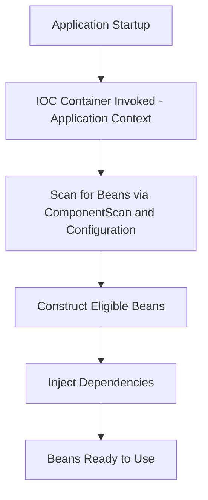
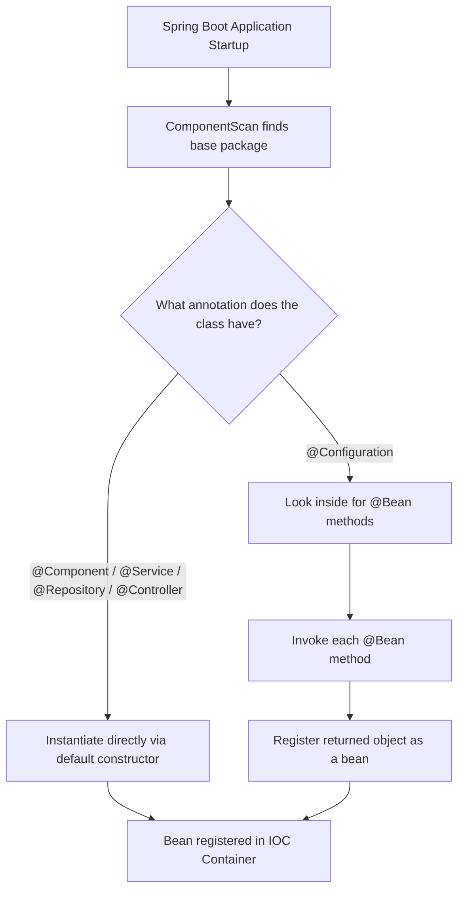
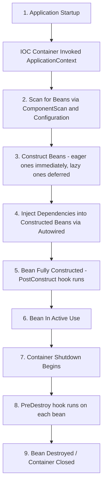

# 📌 Spring Boot Beans, IOC Container & Bean Lifecycle — Complete Study Guide

---

## Table of Contents

1. [What Is a Bean?](#-what-is-a-bean)
2. [What Is the IOC Container?](#-what-is-the-ioc-container)
3. [Ways to Create a Bean](#-ways-to-create-a-bean)
   - [@Component Annotation](#component-annotation)
   - [@Bean Annotation](#bean-annotation)
   - [@Component vs @Bean — When Both Are Present](#component-vs-bean--priority-when-both-are-present)
   - [Multiple @Bean Methods Returning the Same Type](#multiple-bean-methods-returning-the-same-type)
4. [How Spring Boot Finds Beans (Bean Discovery)](#-how-spring-boot-finds-beans-bean-discovery)
   - [@ComponentScan](#componentscan)
   - [@Configuration](#configuration)
5. [When Beans Are Created — Eager vs Lazy Initialization](#-when-beans-are-created--eager-vs-lazy-initialization)
6. [The Complete Bean Lifecycle](#-the-complete-bean-lifecycle)
7. [Practice Questions](#-practice-questions)
8. [Summary](#-summary)

---

# 📌 What Is a Bean?

## Overview

In Spring / Spring Boot, a **bean** is simply a Java object — but one whose creation, configuration, and entire lifecycle are handled by the Spring Framework rather than by the developer manually calling `new`.

## Definition

> A **bean** is a Java object which is managed by the Spring container (the IOC — Inversion of Control — container). It is functionally no different from a normal Java object; the only difference is *who* creates it and *who* manages it — Spring, instead of the application code directly.

## Why This Concept Exists

Normally in plain Java, if class `A` needs an object of class `B`, class `A` has to create it itself:

```java
class A {
    B b = new B(); // A is responsible for creating B
}
```

This tightly couples `A` to `B`. Spring's bean model exists to solve this coupling problem through **Inversion of Control (IOC)** — instead of your code controlling object creation, you *hand over* that control to the Spring container. The container creates the objects, wires them together, and manages their entire life from birth to destruction.

## Real-World Analogy

Think of a restaurant kitchen. Instead of each chef (your classes) going out to the market to buy their own ingredients (dependencies) every time they need them, there's a **central pantry/inventory manager (the IOC container)** who stocks, prepares, and hands over exactly what each chef needs, exactly when they need it. The chefs don't worry about *how* the ingredients got there — they just use them.

## Internal Working

Internally, Spring Boot maintains an **Application Context** (the concrete implementation of the IOC container). This context:
- Scans the codebase for classes that should become beans
- Instantiates those classes (calls constructors)
- Injects dependencies into them
- Tracks their lifecycle state
- Destroys them when the context shuts down

> [!NOTE]
> The terms "IOC container" and "ApplicationContext" are used almost interchangeably in Spring. `ApplicationContext` is the interface/implementation that actually carries out the IOC container's responsibilities.

## Key Observations

- A bean is **not a special type of object** — structurally it's a plain Java object (POJO).
- What makes it a "bean" is that **Spring created it and is tracking it** inside the IOC container.
- The IOC container is responsible for the **complete end-to-end lifecycle**: creation, initialization, dependency injection, and eventual destruction of beans.

---

# 📌 What Is the IOC Container?

## Overview

The **IOC (Inversion of Control) Container** is the core of the Spring Framework. It is responsible for creating beans, wiring their dependencies together, and managing their complete lifecycle.

## Definition

> The IOC Container is the runtime environment inside a Spring application that:
> 1. Contains all the beans that get created.
> 2. Manages them — meaning it handles creation, initialization, and complete end-to-end lifecycle management.

## Why This Concept Exists

Without a container, the responsibility of creating and wiring objects together would be scattered throughout the application code, making it hard to maintain, test, and swap out implementations. By centralizing this responsibility inside one container, Spring makes applications more modular, more testable, and loosely coupled.

## Internal Working

When a Spring Boot application starts:

1. Spring Boot invokes the IOC container.
2. The implementation of the IOC container is the **Application Context**.
3. You will typically see log lines like:

```
Root WebApplicationContext: initialization started
Root WebApplicationContext: initialization completed in XXX ms
```

or, in embedded server setups:

```
Initializing Spring embedded WebApplicationContext
Root WebApplicationContext: initialization completed
```

> [!NOTE]
> These log lines are direct evidence that the IOC container (Application Context) is starting up and doing its bean discovery + creation work.

## Diagrams



## Related Concepts

- Dependency Injection
- Application Context
- Bean Scopes (Singleton, Prototype)
- Component Scanning

---

# 📌 Ways to Create a Bean

## Overview

There are **two ways** to tell Spring Boot that a class should be turned into a managed bean:

1. `@Component` (and its specializations `@Service`, `@Repository`, `@Controller`)
2. `@Bean` (used inside an `@Configuration` class)

Both approaches result in a Spring-managed bean, but they solve different problems and there are specific situations where only `@Bean` will work.

---

## @Component Annotation

### Definition

`@Component` is a class-level annotation that tells Spring Boot: *"You need to create an object of this class and manage its complete lifecycle."*

### Why This Concept Exists

It provides a simple, low-ceremony way to register your own classes as Spring beans without writing any separate configuration — you just annotate the class itself.

### Internal Working — "Convention Over Configuration"

`@Component` follows a **convention over configuration** approach. This means Spring Boot doesn't need you to explicitly describe *how* to construct the object — it makes reasonable default assumptions (conventions) about how to do it, unless you tell it otherwise.

Specifically, when Spring Boot sees `@Component` on a class, its auto-configuration logic says:

> "To create this object, call its **default (no-argument) constructor**."

### Syntax

```java
@Component
public class User {
    private String username;
    private String email;

    // getters and setters
}
```

### Syntax Breakdown

| Element | Meaning |
|---|---|
| `@Component` | Marks the class as a Spring-managed bean using default/auto configuration |
| `public class User` | The plain Java class being turned into a bean |
| (No explicit constructor) | Java auto-generates a default no-arg constructor, which Spring will call |

### Code Examples

**Beginner Example — Simple POJO as a bean**

```java
@Component
public class User {
    private String username;
    private String email;

    public String getUsername() { return username; }
    public void setUsername(String username) { this.username = username; }

    public String getEmail() { return email; }
    public void setEmail(String email) { this.email = email; }
}
```

**Output**

There is no visible console output from this class alone — Spring simply constructs a `User` object internally using the default constructor and registers it inside the IOC container as a bean.

**Line-by-Line Explanation**

- `@Component` — Tells the Spring container to create and manage an object of this class.
- `public class User { ... }` — A plain Java class with two fields: `username` and `email`.
- Getters/setters — Standard Java Bean-style accessor methods, allowing the fields to be read and modified.

### Related Specializations

`@Controller`, `@Service`, and `@Repository` are all, internally, specialized forms of `@Component`. They each perform a specific *architectural* role (handling web requests, business logic, data access respectively), but **at their core they all tell Spring the same thing**: *"create an object of this class and manage it."*

> [!NOTE]
> If you inspect the source/annotations of `@Controller`, `@Service`, or `@Repository`, you'll find they are themselves annotated with `@Component` — meaning Spring's component-scanning mechanism picks them up exactly the same way it picks up plain `@Component` classes.

### Common Mistakes — When @Component Fails

Now consider a modified version of the same `User` class:

```java
@Component
public class User {
    private String username;
    private String email;

    // Custom constructor — no default constructor is generated automatically
    public User(String username, String email) {
        this.username = username;
        this.email = email;
    }
}
```

**Why This Breaks**

> [!WARNING]
> In Java, **once you define your own constructor** (parameterized or not), the compiler **no longer auto-generates the default no-argument constructor** for you. If you still want a no-arg constructor available, you must write it explicitly.

So in this example:
- `@Component` tells Spring: "create this object using auto-configuration → call the default constructor."
- But there **is no default constructor** anymore — only a constructor requiring `(String username, String email)`.
- Spring has no way of knowing *what values* to pass into `username` and `email`.

**Result:** The application will **fail to start**, throwing an error that Spring is not able to create the bean (commonly a `BeanCreationException` / `NoSuchMethodException` in real Spring applications, because Spring is trying to invoke a no-arg constructor that does not exist).

### Best Practices

- Use `@Component` for simple classes where Spring can safely rely on a default constructor (or where you're comfortable letting Spring auto-wire constructor parameters from other beans).
- Use the more specific stereotypes (`@Service`, `@Repository`, `@Controller`) instead of generic `@Component` when the class has one of those specific architectural roles — this improves code readability and enables role-specific framework behavior (e.g., `@Repository` enables automatic exception translation for persistence exceptions in full Spring/Spring Data).

---

## @Bean Annotation

### Definition

`@Bean` is a **method-level** annotation used inside a class marked `@Configuration`. It allows you to manually and explicitly describe *how* an object should be constructed — providing **external configuration** rather than relying on Spring's default conventions.

### Why This Concept Exists

`@Component` only works smoothly when Spring can use a no-argument constructor. But what if:
- The class has no default constructor (only parameterized constructors)?
- The class comes from a third-party library, so you cannot annotate its source code with `@Component` at all?
- You need fine-grained control over exactly what values are passed into the constructor?

In all of these situations, `@Component`'s "convention over configuration" approach cannot help — you need to explicitly tell Spring **how** to build the object. That is exactly the use case `@Bean` was designed for.

### Internal Working

When you use `@Bean`:
1. Spring Boot does **not** use its default auto-configuration approach (i.e., it doesn't try to blindly invoke a default constructor).
2. Instead, it invokes the exact method you wrote, executes whatever object-construction logic is inside that method, and registers the **returned object** as a bean in the IOC container.

### Syntax

```java
@Configuration
public class AppConfig {

    @Bean
    public User createUserBean() {
        return new User("defaultUsername", "defaultEmail");
    }
}
```

### Syntax Breakdown

| Element | Meaning |
|---|---|
| `@Configuration` | Marks this class as a source of bean definitions; tells Spring "look inside this class for `@Bean` methods." |
| `@Bean` | Marks an individual method whose **return value** should be registered as a Spring bean. |
| `createUserBean()` | An arbitrary method name — you may name it anything you like. |
| Return type `User` | This is important — it determines the **type** of bean being registered. |
| `new User("defaultUsername", "defaultEmail")` | The explicit, external configuration describing exactly how to build the object. |

> [!IMPORTANT]
> `@Configuration` is itself, internally, just another `@Component`. This means Spring's component scanning mechanism can discover `@Configuration` classes exactly the same way it discovers any other `@Component`-annotated class — after which Spring looks *inside* that configuration class for any `@Bean`-annotated methods.

### Code Examples

**Beginner Example**

```java
public class User {
    private String username;
    private String email;

    public User(String username, String email) {
        this.username = username;
        this.email = email;
    }

    @Override
    public String toString() {
        return "User{username='" + username + "', email='" + email + "'}";
    }
}
```

```java
@Configuration
public class AppConfig {

    @Bean
    public User createUserBean() {
        return new User("defaultUsername", "defaultEmail");
    }
}
```

**Output**

No console output by default, but internally the IOC container now holds one `User` bean, equivalent to:

```
User{username='defaultUsername', email='defaultEmail'}
```

**Line-by-Line Explanation**

- `public class User { ... }` — plain class, no `@Component` this time (it's been removed since the configuration class handles bean creation instead).
- `public User(String username, String email)` — the only available constructor, requiring two arguments.
- `@Configuration public class AppConfig` — marks this class as a bean-definition source.
- `@Bean public User createUserBean()` — tells Spring: "when you need a `User` bean, call this method; whatever it returns becomes the bean."
- `return new User("defaultUsername", "defaultEmail");` — the explicit object-creation logic, supplying the two required constructor arguments manually.

### Key Observations

- With `@Bean`, **you** (the developer) write the object-creation logic — Spring just calls your method and registers the result.
- This is essential when there's no default constructor, or when constructing the object requires custom logic (e.g., reading from a properties file, calling a builder, configuring a third-party class).

---

## @Component vs @Bean — Priority When Both Are Present

Consider a scenario where a class has:
- `@Component` on the class itself (Spring's auto-configuration route), **and**
- An `@Bean` method inside an `@Configuration` class (an explicit external-configuration route), **and**
- A default constructor still present.

**Which one does Spring Boot actually use?**

> [!IMPORTANT]
> The **external configuration (`@Bean`) takes first priority** over the automatic/convention-based configuration (`@Component`).

The reasoning is: `@Bean` is a direct, explicit instruction from the developer — "use *this* logic to build the object." Since this is more specific and deliberate than relying on default conventions, Spring gives it priority.

> [!TIP]
> You can verify this yourself experimentally: put a `System.out.println` inside both the class's constructor and the `@Bean` method, start the application, and observe which one actually executes/gets invoked first (or, in the case of a genuine same-bean conflict, which construction path Spring actually uses).

### Comparison Table

| Aspect | `@Component` | `@Bean` |
|---|---|---|
| Level applied | Class-level | Method-level (inside `@Configuration`) |
| Configuration style | Convention over configuration (auto) | Explicit / external configuration |
| Requires default constructor? | Yes (unless other injection mechanisms apply) | No — full control over construction logic |
| Use with third-party classes | ❌ Not possible (can't annotate library source) | ✅ Possible (you write the factory method) |
| Priority when both apply to the "same" bean | Lower | **Higher** |
| Discovered via | `@ComponentScan` | `@Configuration` class discovery |

---

## Multiple @Bean Methods Returning the Same Type

### Scenario

```java
@Configuration
public class AppConfig {

    @Bean
    public User createUserBean1() {
        return new User("defaultUsername", "defaultEmail");
    }

    @Bean
    public User createUserBean2() {
        return new User("anotherUsername", "anotherEmail");
    }
}
```

### What Happens Internally

> [!NOTE]
> Spring Boot goes **method by method** and constructs a **separate bean for each `@Bean` method**, even if they return the same type.

In this example:
- `createUserBean1()` creates **one** `User` object → `User{username='defaultUsername', email='defaultEmail'}`
- `createUserBean2()` creates **another, independent** `User` object → `User{username='anotherUsername', email='anotherEmail'}`

Both objects are registered and managed by the IOC container — there are now **two distinct `User` beans** in the container.

### Key Observations

- No matter how many `@Bean` methods you write for the same return type, Spring Boot will create that many separate bean instances.
- Since there are now multiple candidate beans of the same type, if some other class tries to `@Autowired` a `User`, Spring will not automatically know *which one* to inject — this is exactly the kind of ambiguity that **`@Qualifier`** and **explicit bean naming** are designed to resolve.

> [!NOTE]
> This lecture explicitly defers detailed coverage of `@Qualifier` and bean-naming resolution to a later session — but the ambiguity problem itself is introduced here as the *reason* those mechanisms exist.

### Related Concepts

- `@Qualifier` — used to specify exactly which bean (by name) should be injected when multiple candidates of the same type exist.
- Bean naming — you can give a bean an explicit name to disambiguate it from others of the same type.

---

# 📌 How Spring Boot Finds Beans (Bean Discovery)

## Overview

Once you know *how* to declare a bean (`@Component` or `@Bean`), the next natural question is: **in a huge codebase with potentially thousands of files, how does Spring Boot actually locate the classes that need to become beans?**

There are exactly **two mechanisms**:

1. `@ComponentScan`
2. `@Configuration` class discovery

## Why This Concept Exists

Without a discovery mechanism, Spring would have no way of knowing which classes among potentially thousands of files should be instantiated and managed. Scanning provides an automated, convention-driven way to find all the candidate classes without the developer having to register each one by hand.

---

## @ComponentScan

### Definition

`@ComponentScan` tells Spring Boot to look inside a **specific package (and all its sub-packages)** for annotated classes — `@Component`, `@Service`, `@Repository`, `@Controller` (all of which are, as established earlier, fundamentally `@Component` under the hood) — and register them as beans.

### Syntax

```java
@SpringBootApplication
@ComponentScan(basePackages = "com.example.myapp")
public class MyApplication {
    public static void main(String[] args) {
        SpringApplication.run(MyApplication.class, args);
    }
}
```

### Syntax Breakdown

| Element | Meaning |
|---|---|
| `@ComponentScan` | Instructs Spring to scan a base package (and sub-packages) for component-annotated classes |
| `basePackages = "com.example.myapp"` | The starting package for the scan |
| (sub-packages) | Everything nested under the base package is scanned as well |

### Internal Working — Default Behavior via @SpringBootApplication

> [!NOTE]
> `@SpringBootApplication` **internally already includes `@ComponentScan`**. Its auto-configuration behavior is: *start scanning from the package in which the main application class itself resides*, and continue into all sub-packages from there.

This is why, in most Spring Boot projects, you never see an explicit `@ComponentScan` annotation — it's implicitly provided, and its default base package is wherever your `@SpringBootApplication`-annotated main class lives.

### Key Observations

- If you place your main class in the **root** package of your project, `@ComponentScan`'s default behavior will cover your **entire** codebase.
- If you place classes in packages *outside* (e.g., sibling to, not nested under) the main class's package, they will **not** be picked up unless you explicitly configure `basePackages`.

---

## @Configuration

### Definition

The second discovery mechanism: Spring Boot also looks (within the scanned package structure) for any classes annotated with `@Configuration`.

### Internal Working

1. Spring Boot determines the package to scan (either explicitly given via `@ComponentScan`, or auto-configured from the main class's package, as described above).
2. Within that scanned scope, it looks for `@Configuration`-annotated classes.
3. Once such a class is found, Spring inspects it for `@Bean`-annotated methods.
4. For every `@Bean` method found, Spring **invokes it** and registers whatever object it returns as a managed bean.

> [!IMPORTANT]
> `@Configuration` is itself just a specialized `@Component`. This means the **same** `@ComponentScan` mechanism that finds `@Component` classes is what finds `@Configuration` classes in the first place — after which Spring performs the additional step of reading their `@Bean` methods.

## Diagrams



## Key Observations

- **Two, and only two**, discovery mechanisms exist: `@ComponentScan` (for `@Component`-family classes) and `@Configuration` class scanning (for `@Bean`-family methods).
- Both mechanisms ultimately rely on the *same underlying scan* of the package structure — `@Configuration` classes are found via component scanning too, since `@Configuration` is a `@Component`.

## Related Concepts

- Package structure conventions in Spring Boot projects
- `@SpringBootApplication` (a meta-annotation combining `@Configuration`, `@ComponentScan`, and `@EnableAutoConfiguration`)

---

# 📌 When Beans Are Created — Eager vs Lazy Initialization

## Overview

Beyond knowing *how* beans are declared and *how* they're discovered, it's important to understand **at what point in time** they actually get instantiated. There are exactly two possible timings.

## Definition

| Mode | Definition |
|---|---|
| **Eager Initialization** | The bean is created **at application startup** — i.e., as soon as the Spring Boot application starts running, the bean is immediately constructed. |
| **Lazy Initialization** | The bean is **not** created at startup. It is created only **when it is actually needed** (e.g., when some other bean depends on it, or when it's explicitly requested). |

## Why This Concept Exists

Not every bean needs to exist immediately. Some beans are expensive to create (e.g., involve network calls, file I/O, or heavy computation) and are only used occasionally. Lazy initialization lets Spring defer that cost until the object is genuinely required, improving startup time and resource usage. Conversely, some beans are core/critical and should be ready immediately — eager initialization guarantees that.

## Internal Working — Relationship With Bean Scope

> [!NOTE]
> This lecture introduces **bean scope** only briefly here, promising a deeper treatment (Singleton scope, Prototype scope, etc.) in a later session. For now, only the eagerness/laziness relationship is relevant:

- Beans with **Singleton** scope are, **by default, eagerly initialized** — they are created at application startup.
- Beans with **Prototype** scope are **lazily initialized** — they are created only when actually requested/needed, not at startup.
- Even a **Singleton**-scoped bean can be forced into lazy behavior by explicitly applying the `@Lazy` annotation to it — this overrides its default eager behavior.

### Default Scope Behavior

> [!TIP]
> If you don't specify `@Scope` at all on a bean, Spring Boot's auto-configuration defaults it to **Singleton** scope.

## Syntax

**Default (implicit Singleton, eagerly initialized):**

```java
@Component
public class Order {
    public Order() {
        System.out.println("Initializing Order");
    }
}
```

**Explicitly forcing lazy initialization on an otherwise-Singleton bean:**

```java
@Component
@Lazy
public class Order {
    public Order() {
        System.out.println("Initializing Order");
    }
}
```

## Syntax Breakdown

| Element | Meaning |
|---|---|
| `@Component` | Registers the class as a Spring bean |
| (no `@Scope`) | Defaults to Singleton scope |
| `@Lazy` | Overrides default eager behavior for this bean — it will **not** be constructed at startup, only when actually needed |

## Code Examples

**Example demonstrating default eager initialization:**

```java
@Component
public class User {
    public User() {
        System.out.println("Initializing User");
    }
}
```

**Output (on application startup):**

```
Initializing User
```

**Step-by-Step Execution**

1. Application starts.
2. IOC container (`ApplicationContext`) is invoked.
3. IOC scans via `@ComponentScan`/`@Configuration` and finds the `User` class.
4. Since `User` has no explicit `@Scope` and no `@Lazy`, it defaults to Singleton + eager.
5. IOC immediately constructs the `User` bean by calling its default constructor.
6. `"Initializing User"` is printed to the console **at startup**, before any explicit use of the bean.

---

**Example demonstrating @Lazy overriding default eager Singleton behavior:**

```java
@Component
public class User {
    public User() {
        System.out.println("Initializing User");
    }
}
```

```java
@Component
@Lazy
public class Order {
    public Order() {
        System.out.println("Initializing Order");
    }
}
```

**Case A — `User` has no dependency on `Order`:**

**Output at startup:**

```
Initializing User
```

`"Initializing Order"` does **not** print at startup, because `Order` is marked `@Lazy` and nothing is currently requesting it.

**Case B — `User` depends on `Order` via `@Autowired`:**

```java
@Component
public class User {

    @Autowired
    private Order order;

    public User() {
        System.out.println("Initializing User");
    }
}
```

**Output at startup:**

```
Initializing User
Initializing Order
```

**Line-by-Line / Step-by-Step Explanation**

1. IOC starts, finds both `User` and `Order` classes via component scanning.
2. `User` is Singleton (default) → eagerly initialized, so its constructor runs immediately: `"Initializing User"` prints.
3. After `User`'s bean is constructed, IOC proceeds to **inject dependencies** into it.
4. `User` has a field `order` marked `@Autowired`. Spring checks: *is an `Order` bean already present in the container?*
5. Since `Order` is `@Lazy`, it was **not** created at startup — so it is **not yet present**.
6. Because `User` genuinely needs an `Order` object (due to the `@Autowired` dependency), Spring is now forced to construct the `Order` bean **at this point**, even though it's marked lazy — laziness only prevents *unconditional* startup-time creation; it does not prevent creation when a dependency actually requires it.
7. `Order`'s constructor runs: `"Initializing Order"` prints.
8. The constructed `Order` object is then injected into `User`'s `order` field.

## Key Observations

- `@Lazy` prevents *unconditional* eager creation at startup — but if something else genuinely depends on that bean, it will still be created (just later than it would have been if eager).
- Whether a bean prints its "initializing" message at startup or later is a direct, observable signal of whether it was eagerly or lazily constructed.

## Common Mistakes

> [!WARNING]
> A common misunderstanding is thinking `@Lazy` means "never create unless explicitly and directly requested by name." In reality, if **any other eagerly-created bean has a hard dependency** (`@Autowired`) on the lazy bean, the lazy bean **will** be constructed to satisfy that dependency — just not necessarily at the very start of the application.

## Best Practices

- Use `@Lazy` for beans that are expensive to construct and not always needed (e.g., beans wrapping optional integrations, heavy caches used only in rare code paths).
- Don't lazily initialize beans that are core to your application's startup health checks or that you want to fail-fast on if misconfigured — eager initialization surfaces configuration errors immediately at startup rather than deep into runtime.

## Interview Notes

- **Q: What is the default scope of a Spring bean?** → Singleton.
- **Q: Are Singleton beans always eagerly initialized?** → By default yes, but this can be overridden with `@Lazy`.
- **Q: What happens if a lazily-initialized bean is a required dependency of an eagerly-initialized bean?** → It gets constructed anyway, at the point dependency injection occurs, because the eager bean cannot be fully constructed without it.

---

# 📌 The Complete Bean Lifecycle

## Overview

This is the single most important concept tying everything together: the exact sequence of steps the IOC container performs, from application startup to bean destruction.

## Definition

> The **Bean Lifecycle** is the well-defined sequence of stages a Spring bean passes through: IOC invocation → bean scanning/discovery → bean construction → dependency injection → post-construction hooks → active use → pre-destruction hooks → destruction.

## Real-World Analogy

Think of it like the lifecycle of an employee at a company:
1. The company (IOC) starts operating.
2. HR (component scan / configuration scan) identifies which roles/people need to be hired.
3. The employee is hired (bean constructed).
4. The employee is given their tools/equipment/team assignments (dependency injection).
5. Before starting real work, there's onboarding (post-construct).
6. The employee does actual work (bean in use).
7. Before leaving the company, there's an offboarding checklist — returning equipment, revoking access (pre-destroy).
8. The employee's departure is finalized (bean destroyed).

## Internal Working — The Full Sequence



### Stage 1 — Application Startup Invokes IOC

When the application starts, Spring Boot invokes the IOC container. The concrete implementation of the IOC container is the **Application Context**. You'll typically observe log output similar to:

```
Initializing Spring embedded WebApplicationContext
Root WebApplicationContext: initialization completed
```

> [!NOTE]
> These log lines are the visible evidence that the Application Context (IOC) has begun its work.

### Stage 2 — IOC Scans for Beans

The IOC container uses `@ComponentScan` and `@Configuration` discovery (as covered earlier) to identify every class that needs to become a bean.

### Stage 3 — Beans Are Constructed

- If a bean is eligible for **eager initialization** (default Singleton scope, no `@Lazy`), it is constructed immediately during this stage — its constructor runs.
- If a bean is marked `@Lazy` (or is Prototype-scoped), construction is **deferred** until the bean is actually required.

**Example:**

```java
@Component
public class User {
    public User() {
        System.out.println("Initializing User");
    }
}
```

At startup, since `User` is Singleton by default (no `@Scope`, no `@Lazy`), IOC immediately calls its constructor:

```
Initializing User
```

### Stage 4 — Dependency Injection

Once a bean is constructed, the IOC container proceeds to inject whatever dependencies it declares (commonly through `@Autowired`).

**Example — User depends on Order:**

```java
@Component
public class Order {
    public Order() {
        System.out.println("Initializing Order");
    }
}
```

```java
@Component
public class User {

    @Autowired
    private Order order;

    public User() {
        System.out.println("Initializing User");
    }
}
```

**Step-by-Step Execution:**

1. `User` is constructed first (its constructor runs) → `"Initializing User"` prints.
2. IOC now examines `User`'s dependencies and finds the `@Autowired` field of type `Order`.
3. IOC checks: *is an `Order` bean already present in the container?*
   - **If yes** → simply inject the already-existing bean; no new object is created.
   - **If no** → IOC must first construct the `Order` bean itself, then inject it.
4. Assuming `Order` wasn't already present, `Order`'s constructor now runs → `"Initializing Order"` prints.
5. The newly constructed `Order` object is injected into `User`'s `order` field.

> [!NOTE]
> This same lecture mentions that dependency injection can happen via **three different mechanisms** — constructor injection, setter injection, and field injection — and explicitly defers the detailed comparison of these three to a later session.

### Stage 5 — Bean Fully Constructed → @PostConstruct

Once the bean is fully constructed **and** all its dependencies have been injected, it is ready to be used. But before actual use, you may want to run some setup/initialization logic. This is exactly what `@PostConstruct` is for.

**Syntax:**

```java
@Component
public class User {

    @Autowired
    private Order order;

    public User() {
        System.out.println("Initializing User");
    }

    @PostConstruct
    public void init() {
        System.out.println("Bean has been constructed and dependencies have been injected");
    }
}
```

**Output at startup:**

```
Initializing User
Initializing Order
Bean has been constructed and dependencies have been injected
```

**Line-by-Line Explanation**

- `@Autowired private Order order;` — declares the dependency on `Order`, to be injected by the container.
- Constructor `User()` — runs first, prints `"Initializing User"`.
- IOC then resolves the `Order` dependency (constructing it if not already present) — prints `"Initializing Order"`.
- `@PostConstruct public void init()` — you may name this method anything; it is invoked automatically by Spring **only after** the constructor has run **and** all dependency injection is complete.
- Inside `init()`, you can perform any setup logic — e.g., logging, initializing internal data structures like a `HashMap`, warming up caches, etc.

### Stage 6 — Bean In Active Use

At this point, the bean is completely ready. Application code can call its methods, access its fields, and use it exactly as intended — this is simply normal usage of the object.

### Stage 7–8 — Pre-Destruction and Destruction → @PreDestroy

Before a bean is destroyed (typically when the application context is closed/shut down), you may need to run cleanup logic — e.g., releasing a database connection, closing file handles, or flushing buffered data. This is done using `@PreDestroy`.

**Syntax:**

```java
@Component
public class User {

    public User() {
        System.out.println("Initializing User");
    }

    @PostConstruct
    public void init() {
        System.out.println("Post construct invoked");
    }

    @PreDestroy
    public void cleanup() {
        System.out.println("Bean is about to be destroyed");
    }
}
```

**Main class explicitly closing the context (for demonstration):**

```java
@SpringBootApplication
public class DemoApplication {
    public static void main(String[] args) {
        ConfigurableApplicationContext context =
            SpringApplication.run(DemoApplication.class, args);

        // Normally you would NOT do this manually —
        // this is only for demonstrating the destroy phase.
        context.close();
    }
}
```

**Output:**

```
Initializing User
Post construct invoked
Bean is about to be destroyed
```

**Step-by-Step Execution**

1. IOC starts and constructs the `User` bean (Singleton, eagerly initialized) → `"Initializing User"` prints.
2. No dependencies to inject in this example, so the bean is now fully constructed.
3. `@PostConstruct` method runs → `"Post construct invoked"` prints. The bean is now ready to use.
4. The application explicitly calls `context.close()`, which closes the entire IOC container.
5. As the container closes, **every managed bean's `@PreDestroy` method is invoked** (if defined) before that bean is actually destroyed.
6. `"Bean is about to be destroyed"` prints.
7. Finally, the `User` bean is destroyed, and the IOC container itself finishes closing.

> [!CAUTION]
> Manually calling `context.close()` is generally **not** something you do in normal application code — a Spring Boot web application's context is closed automatically by the framework/servlet container on shutdown. It was done here purely to demonstrate the destroy phase of the bean lifecycle.

## Memory Representation

While this lecture doesn't go deep into JVM memory internals, it's useful to connect the bean lifecycle to standard JVM memory concepts:

| Concept | Where It Lives / What Happens |
|---|---|
| **Bean object itself** | Allocated on the **Heap**, like any Java object created via `new`. |
| **Reference held by IOC container** | The `ApplicationContext` internally maintains a registry (essentially a map from bean name/type → bean instance) that holds references to these heap objects, keeping them reachable (and therefore not garbage-collected) for as long as the container is alive. |
| **Constructor execution** | Happens using the normal JVM method-invocation mechanics — a new stack frame is pushed for the constructor call, executes, and pops off once complete. |
| **`@PostConstruct` / `@PreDestroy` method calls** | Also normal method invocations — new stack frames created and popped as usual; no special JVM memory area is involved beyond standard method call semantics. |
| **After `context.close()`** | Once the container releases its references to the bean objects (after invoking `@PreDestroy`), those objects become eligible for garbage collection, assuming nothing else in the application still holds a reference to them. |

## Key Observations

- The complete sequence, in order, is:
  1. Application startup → IOC container invoked
  2. IOC scans for beans (`@ComponentScan` / `@Configuration`)
  3. Beans constructed (eagerly or lazily, depending on scope/`@Lazy`)
  4. Dependencies injected (`@Autowired`)
  5. `@PostConstruct` invoked — bean now fully ready to use
  6. Bean used in application logic
  7. Container begins shutdown
  8. `@PreDestroy` invoked on each bean
  9. Bean (and eventually the container) destroyed
- `@Autowired`'s dependency-resolution logic **always checks first** whether the required bean already exists in the container; only if it doesn't will Spring construct it before injecting.

## Common Mistakes

> [!WARNING]
> Forgetting that `@PostConstruct` runs **after** both construction **and** dependency injection — some beginners mistakenly assume it runs immediately after the constructor, before dependencies are available. In reality, by the time `@PostConstruct` executes, all `@Autowired` fields are already populated and safe to use.

> [!WARNING]
> Assuming a `@Lazy` bean will *never* run its constructor at startup under any circumstances. As shown earlier, if an eagerly-initialized bean has a hard dependency on it, it will still be constructed — just at the dependency-injection stage rather than immediately at container startup.

## Best Practices

- Use `@PostConstruct` for any initialization logic that depends on injected dependencies being present (e.g., warming a cache using an injected repository).
- Use `@PreDestroy` for releasing external resources — database connections, file handles, thread pools, network sockets — to avoid resource leaks when the application shuts down.
- Avoid manually calling `context.close()` in normal production code; let the framework/container manage the application lifecycle.

## Interview Notes

- **Q: What is the order of `@PostConstruct` relative to constructor and dependency injection?** → Constructor → Dependency Injection → `@PostConstruct`.
- **Q: What triggers `@PreDestroy`?** → The container being closed/shut down (e.g., application stopping).
- **Q: Can a lazy bean still get created at application startup?** → Yes, if a hard dependency from an eagerly-initialized bean forces its creation.
- **Q: What are the three types of dependency injection?** → Constructor injection, setter injection, field injection (each covered in more depth separately).
- **Q: What determines whether `@Autowired` creates a new bean or reuses an existing one?** → Spring first checks if a bean of the required type already exists in the IOC container; if yes, it's reused; if no, Spring constructs it first.

## Related Concepts

- `@Autowired` and the three injection styles (constructor / setter / field)
- Bean Scopes: Singleton vs Prototype (and others, e.g., request/session scope in web applications)
- `@Qualifier` and bean naming — for resolving ambiguity when multiple beans of the same type exist
- `ApplicationContext` lifecycle and shutdown hooks

---

# 📌 Practice Questions

### Easy

1. What is a Spring bean, in one sentence?
2. Name the two annotations that can be used to create a bean.
3. What is the default scope of a Spring bean if none is specified?

### Medium

4. Why would `@Component` fail to create a bean for a class that only has a parameterized constructor?
5. What is the purpose of `@ComponentScan`, and where does Spring Boot get its default base package from if you don't specify one?
6. If two `@Bean` methods in the same `@Configuration` class both return a `User` object, how many `User` beans will exist in the container?

### Hard

7. Explain the exact order of execution in the bean lifecycle from application startup to a bean being ready for use, and identify at which stage `@PostConstruct` executes.
8. A bean `Order` is annotated `@Lazy`, and another Singleton bean `User` has `@Autowired private Order order;`. Explain precisely when `Order`'s constructor will run, and why.
9. If both `@Component` and an `@Bean` method (in an `@Configuration` class) are set up to create a bean of the same type, and a default constructor also exists, which configuration wins, and why?

---

# 📌 Summary

- A **bean** is a plain Java object whose lifecycle (creation, initialization, destruction) is managed by the **Spring IOC container**, rather than by application code directly.
- The **IOC container** (implemented as the `ApplicationContext`) is responsible for creating beans, injecting their dependencies, and managing their complete lifecycle.
- Beans can be created via:
  - **`@Component`** — convention-over-configuration; relies on a default constructor being available.
  - **`@Bean`** (inside an **`@Configuration`** class) — explicit, external configuration; required when there's no default constructor or when construction logic must be customized.
- When both `@Component` and `@Bean` apply to what would be "the same" bean, **`@Bean` (external configuration) takes priority**.
- Multiple `@Bean` methods returning the same type each produce a **separate, independent bean** — later resolved via `@Qualifier`/naming (covered separately).
- Spring Boot **discovers** beans via two mechanisms:
  - **`@ComponentScan`** — scans a base package (default: the package of the `@SpringBootApplication` main class) and its sub-packages for `@Component`-family classes.
  - **`@Configuration` class discovery** — itself found via component scanning (since `@Configuration` is a `@Component`), after which its `@Bean` methods are read and invoked.
- Beans are created at one of two possible times:
  - **Eager initialization** — at application startup (default for Singleton scope).
  - **Lazy initialization** — only when actually needed (default for Prototype scope, or any bean explicitly marked `@Lazy`).
  - Even a lazily-marked bean will be constructed early if an eagerly-initialized bean has a hard `@Autowired` dependency on it.
- The **complete bean lifecycle**, in order:
  1. Application startup → IOC invoked
  2. Bean scanning (`@ComponentScan` + `@Configuration`)
  3. Bean construction (eager beans immediately; lazy beans deferred)
  4. Dependency injection (`@Autowired`)
  5. `@PostConstruct` — bean fully ready
  6. Active use
  7. Container shutdown begins
  8. `@PreDestroy` — cleanup before removal
  9. Bean/container destroyed
- Topics explicitly deferred to future lessons: bean **scopes** in depth (Singleton, Prototype, etc.), the three **dependency injection** styles (constructor/setter/field), and **`@Qualifier`**/bean-naming for resolving multiple-beans-of-same-type ambiguity.
