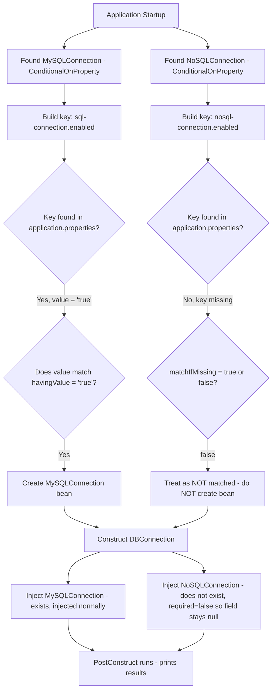

# 📌 Spring Boot `@ConditionalOnProperty` — Complete Study Guide

> [!NOTE]
> **Prerequisite:** This topic builds on **Beans**, the **Bean Lifecycle**, **Dependency Injection** (specifically `@Autowired`'s `required` attribute), and **Bean Scope** (Singleton's default eager initialization). If those aren't clear yet, review them first — this guide assumes that foundation.

---

## Table of Contents

1. [Overview & Why It Matters](#-overview--why-it-matters)
2. [The Problem — Cluttered Application Context](#-the-problem--cluttered-application-context)
3. [Real-World Use Cases](#-real-world-use-cases)
4. [What Is `@ConditionalOnProperty`?](#-what-is-conditionalonproperty)
5. [Syntax & Attribute Breakdown](#-syntax--attribute-breakdown)
6. [The `required = false` Companion Setting](#-the-required--false-companion-setting)
7. [Complete Worked Example](#-complete-worked-example)
8. [Advantages](#-advantages)
9. [Disadvantages](#-disadvantages)
10. [Practice Questions](#-practice-questions)
11. [Summary](#-summary)

---

# 📌 Overview & Why It Matters

## Overview

`@ConditionalOnProperty` is a Spring Boot annotation that allows a bean to be created **conditionally** — based on whether a specific key-value pair exists (and matches) in `application.properties` (or `application.yml`).

## Definition

> **`@ConditionalOnProperty`** is a class-level annotation that tells Spring Boot: *"Only create this bean if a specific property, defined in the application's configuration, exists and holds a specific expected value. If the condition is not satisfied, skip creating this bean entirely."*

In simple terms: **if the condition becomes true, the bean is created; if the condition is false, the bean is not created.**

## Why This Concept Exists

In a large-scale application containing **thousands of beans**, many of which are eagerly initialized (Singleton, by default) at startup, not every bean is actually needed in every deployment, environment, or configuration variant. Without a way to conditionally control bean creation, the **application context** (the IOC container's internal registry of beans) gets **cluttered with unnecessary beans** that consume memory and increase startup time, even though they may never actually be used.

> [!IMPORTANT]
> This is explicitly called out as a **commonly asked interview question**: *"How can we avoid cluttering our application context with unnecessary beans?"* — `@ConditionalOnProperty` is a direct, practical answer to that question.

## Related Concepts

- Bean Lifecycle & Singleton eager initialization (the reason unnecessary beans get created at startup in the first place)
- `@Autowired(required = false)` — the companion setting needed at injection points when a conditionally-created dependency might not exist
- `application.properties` / `application.yml` configuration files

---

# 📌 The Problem — Cluttered Application Context

## Overview

Before understanding the annotation itself, it helps to see the underlying problem it solves through a concrete baseline example — one **without** any conditional logic.

## Internal Working — Baseline Example (No Conditional Logic)

```java
@Component
public class MySQLConnection {
    public MySQLConnection() {
        System.out.println("Initialization of MySQL connection bean");
    }
}
```

```java
@Component
public class NoSQLConnection {
    public NoSQLConnection() {
        System.out.println("Initialization of NoSQL connection bean");
    }
}
```

```java
@Component
public class DBConnection {

    @Autowired
    private MySQLConnection mySQLConnection;

    @Autowired
    private NoSQLConnection noSQLConnection;

    @PostConstruct
    public void init() {
        System.out.println("DB connection bean created");
        System.out.println("Is MySQL connection object null? " + (mySQLConnection == null));
        System.out.println("Is NoSQL connection object null? " + (noSQLConnection == null));
    }
}
```

### Step-by-Step Execution

1. Application starts. All three classes are `@Component`, and none specify a scope, so all default to **Singleton** → all are **eagerly initialized**.
2. IOC constructs `MySQLConnection` first (or `NoSQLConnection` — order can vary) → `"Initialization of MySQL connection bean"` prints.
3. IOC constructs `NoSQLConnection` → `"Initialization of NoSQL connection bean"` prints.
4. IOC constructs `DBConnection`, and since both its `@Autowired` dependencies (`mySQLConnection`, `noSQLConnection`) already exist as beans, both are injected directly.
5. `DBConnection`'s `@PostConstruct` runs:
   - `"DB connection bean created"` prints.
   - `"Is MySQL connection object null?"` → `false` (a proper object reference exists).
   - `"Is NoSQL connection object null?"` → `false` (a proper object reference exists).

## Key Observations

- In this baseline setup, **both** `MySQLConnection` and `NoSQLConnection` beans get created **unconditionally**, regardless of whether the application actually needs both.
- This is exactly the kind of unnecessary bean creation `@ConditionalOnProperty` is designed to prevent.

---

# 📌 Real-World Use Cases

## Use Case 1 — Feature Migration Toggling

> [!NOTE]
> A very common real-world scenario: a company is in the process of **migrating from MySQL to NoSQL**. During migration, both connection types might temporarily coexist in the codebase. Once migration is **complete**, the company wants to **stop creating the `MySQLConnection` bean entirely** and only create the `NoSQLConnection` bean — ideally **without changing and redeploying code**, just by flipping a configuration value.

This raises the natural question: *"If I want to create only one bean — either this one or that one — depending on the migration state, how do I do that?"*

## Use Case 2 — Shared Codebase, Different Bean Needs Per Application

> [!NOTE]
> Consider two separate applications — **Application 1** and **Application 2** — both of which depend on the same **shared/common codebase** (e.g., both declare a dependency on it in their respective `pom.xml` files). This shared codebase contains both a `MySQLConnection` class and a `NoSQLConnection` class.
>
> - **Application 1** only needs `NoSQLConnection` — `MySQLConnection` should **not** be created for it.
> - **Application 2** only needs `MySQLConnection` — `NoSQLConnection` should **not** be created for it.

Since both applications share the exact same codebase (and therefore the exact same class definitions), there needs to be a way for **each application**, via its own configuration, to control which of the shared beans actually gets created — without modifying the shared source code itself.

## Real-World Analogy

Think of a hotel that has both a swimming pool heating system and a spa heating system pre-installed in every building blueprint (the shared codebase). Depending on which specific hotel location you're building (Application 1 vs Application 2), you flip a switch (a configuration property) to decide which heating system actually gets turned on for that location — without needing to redesign the blueprint itself for each hotel.

## Related Concepts

- Feature toggles / feature flags (a broader software engineering pattern that `@ConditionalOnProperty` directly enables in Spring)
- Shared library / shared codebase architecture across multiple deployable applications

---

# 📌 What Is `@ConditionalOnProperty`?

## Definition

> **`@ConditionalOnProperty`** is placed on a `@Component`-annotated class (in addition to `@Component` itself) and instructs Spring Boot to only construct that bean if a specific property key, built from the annotation's `prefix` and `value` attributes, exists in `application.properties` and matches an expected value (`havingValue`).

## Syntax

```java
@Component
@ConditionalOnProperty(
    prefix = "sql-connection",
    value = "enabled",
    havingValue = "true",
    matchIfMissing = false
)
public class MySQLConnection {
    public MySQLConnection() {
        System.out.println("Initialization of MySQL connection bean");
    }
}
```

```java
@Component
@ConditionalOnProperty(
    prefix = "nosql-connection",
    value = "enabled",
    havingValue = "true",
    matchIfMissing = false
)
public class NoSQLConnection {
    public NoSQLConnection() {
        System.out.println("Initialization of NoSQL connection bean");
    }
}
```

**Corresponding `application.properties`:**

```properties
sql-connection.enabled=true
```

> [!NOTE]
> Notice that **only** `sql-connection.enabled` is present in this properties file — `nosql-connection.enabled` is deliberately **absent**, to demonstrate what happens when a property key is entirely missing (covered by `matchIfMissing`, below).

---

# 📌 Syntax & Attribute Breakdown

`@ConditionalOnProperty` has **four** key parts:

## 1. `prefix`

> [!NOTE]
> The **prefix** forms the first part of the property key that Spring Boot will look up in `application.properties`.

## 2. `value`

> [!NOTE]
> The **value** attribute forms the second part of the property key. **Together, `prefix` and `value`, joined by a dot (`.`), form the complete key** that Spring Boot looks up in `application.properties`.

For example, with `prefix = "sql-connection"` and `value = "enabled"`, the resulting key Spring Boot searches for is:

```
sql-connection.enabled
```

## 3. `havingValue`

> [!NOTE]
> **`havingValue`** is simply a **string** representing the value that the property's actual value (found via the `prefix.value` key) must **match** for the bean to be created. It can be any string you choose — commonly `"true"`/`"false"`, but it could just as easily be a custom string like `"sql"` or `"nosql"`, as long as the value configured in `application.properties` for that key matches it exactly.

**How the matching works:**
- Spring Boot builds the key from `prefix` + `.` + `value` (e.g., `sql-connection.enabled`).
- It looks up that key's actual configured value in `application.properties`.
- It compares that actual value against `havingValue`.
- **If they match** → the bean **is** created.
- **If they don't match** → the bean is **not** created.

## 4. `matchIfMissing`

> [!NOTE]
> **`matchIfMissing`** controls what happens when the property key (`prefix.value`) is **not present at all** in `application.properties`.
> - `matchIfMissing = false` → if the key is missing entirely, treat the condition as **not matched** → the bean will **not** be created.
> - `matchIfMissing = true` → if the key is missing entirely, treat the condition as **matched anyway** → the bean **will** be created despite the property being absent.

## Syntax Breakdown Table

| Attribute | Purpose | Example Value |
|---|---|---|
| `prefix` | First part of the property key | `"sql-connection"` |
| `value` | Second part of the property key (joined to `prefix` with a dot) | `"enabled"` |
| `havingValue` | The string the actual configured property value must match | `"true"` |
| `matchIfMissing` | Whether an entirely absent property key should be treated as a match (`true`) or not (`false`) | `false` |

## Best Practices

- You are **not restricted** to `true`/`false` strings for `havingValue` — since it's just a string comparison, you could configure `havingValue = "sql"` and set the corresponding property to `sql-connection.enabled=sql` — the behavior is identical, just using a different literal string for the match.
- Choose `matchIfMissing` deliberately: set it to `true` only if you want a bean to be created **by default**, even when nobody has explicitly configured the property; set it to `false` (the safer default in most cases) if you want the bean's creation to require **explicit opt-in** via configuration.

---

# 📌 The `required = false` Companion Setting

## Overview

`@ConditionalOnProperty` controls whether a bean **gets created** — but there's a second, equally essential piece: what happens when **another bean tries to `@Autowired` that conditionally-created bean**, and it turns out the condition wasn't satisfied (so the bean doesn't exist)?

## Definition

> By default, `@Autowired`'s `required` attribute is `true`. This tells Spring Boot: *"This dependency must be resolvable — the bean must exist. If it doesn't, fail bean creation."* Setting `required = false` tells Spring Boot: *"It's okay if this dependency's bean doesn't exist — don't fail; just leave the field as `null` and proceed."*

## Why This Concept Exists

If `DBConnection` unconditionally requires both `MySQLConnection` and `NoSQLConnection` to exist (the default `@Autowired` behavior), then as soon as `@ConditionalOnProperty` causes one of them to **not** be created, `DBConnection`'s own bean creation would **fail** — defeating the entire purpose of making the dependency optional in the first place. `required = false` is what allows the dependent bean (`DBConnection`) to gracefully tolerate a missing, conditionally-absent dependency.

## Syntax

```java
@Component
public class DBConnection {

    @Autowired(required = false)
    private MySQLConnection mySQLConnection;

    @Autowired(required = false)
    private NoSQLConnection noSQLConnection;

    @PostConstruct
    public void init() {
        System.out.println("DB connection bean created");
        System.out.println("Is MySQL connection object null? " + (mySQLConnection == null));
        System.out.println("Is NoSQL connection object null? " + (noSQLConnection == null));
    }
}
```

## Syntax Breakdown

| Element | Meaning |
|---|---|
| `@Autowired(required = false)` | Tells Spring: if this dependency's bean doesn't exist, don't fail — just set the field to `null` and continue |
| (default `@Autowired`, no `required` specified) | Equivalent to `required = true` — dependency **must** exist, or bean creation fails |

## Key Observations

- Whenever you use `@ConditionalOnProperty` on a bean, **any class that `@Autowired`s that bean must mark the injection point as `required = false`**, since the bean might legitimately not exist depending on configuration.
- Forgetting this is a common source of startup failures — the dependent bean's creation fails not because of `@ConditionalOnProperty` itself, but because the *consuming* class still demanded the dependency unconditionally (`required = true`, the default).

## Common Mistakes

> [!WARNING]
> Applying `@ConditionalOnProperty` to a bean **without** also setting `required = false` at every place that bean is `@Autowired`d elsewhere will cause **bean creation failures** whenever the condition evaluates to false and the dependency doesn't exist — because the consuming class still (by default) demands that the dependency be present.

---

# 📌 Complete Worked Example

## Setup

```properties
# application.properties
sql-connection.enabled=true
```

> [!NOTE]
> Note carefully: **only** the `sql-connection.enabled` key is present. There is **no** `nosql-connection.enabled` key at all in this file.

```java
@Component
@ConditionalOnProperty(
    prefix = "sql-connection",
    value = "enabled",
    havingValue = "true",
    matchIfMissing = false
)
public class MySQLConnection {
    public MySQLConnection() {
        System.out.println("Initialization of MySQL connection bean");
    }
}
```

```java
@Component
@ConditionalOnProperty(
    prefix = "nosql-connection",
    value = "enabled",
    havingValue = "true",
    matchIfMissing = false
)
public class NoSQLConnection {
    public NoSQLConnection() {
        System.out.println("Initialization of NoSQL connection bean");
    }
}
```

```java
@Component
public class DBConnection {

    @Autowired(required = false)
    private MySQLConnection mySQLConnection;

    @Autowired(required = false)
    private NoSQLConnection noSQLConnection;

    @PostConstruct
    public void init() {
        System.out.println("DB connection bean created");
        System.out.println("Is MySQL connection object null? " + (mySQLConnection == null));
        System.out.println("Is NoSQL connection object null? " + (noSQLConnection == null));
    }
}
```

## Output

```
Initialization of MySQL connection bean
DB connection bean created
Is MySQL connection object null? false
Is NoSQL connection object null? true
```

## Step-by-Step Execution

1. Application starts. IOC finds `MySQLConnection` — it's `@Component`, defaulting to Singleton (eagerly initialized) — but it also carries `@ConditionalOnProperty`.
2. Spring Boot builds the key from `prefix` + `.` + `value` → `sql-connection.enabled`, and looks this key up in `application.properties`.
3. It **finds** the key, with value `"true"`.
4. It compares this actual value (`"true"`) against `havingValue = "true"` → **they match**.
5. Since the condition is satisfied, the bean **is** created → `"Initialization of MySQL connection bean"` prints.
6. IOC next finds `NoSQLConnection` — also `@Component`/Singleton, also carrying `@ConditionalOnProperty`.
7. Spring Boot builds the key `nosql-connection.enabled` and looks it up in `application.properties`.
8. This key is **not present at all** in the properties file.
9. Since `matchIfMissing = false`, a missing key is treated as **not matched** → the condition is **false**.
10. Because the condition failed, the `NoSQLConnection` bean is **not created at all** — no constructor call, no `"Initialization of NoSQL connection bean"` printed.
11. IOC now constructs `DBConnection` (Singleton, eagerly initialized, no conditional annotation on it).
12. IOC resolves `DBConnection`'s dependency on `mySQLConnection`: a `MySQLConnection` bean **does** exist (created in step 5) → it is injected normally.
13. IOC resolves `DBConnection`'s dependency on `noSQLConnection`: **no** `NoSQLConnection` bean exists (skipped in step 10). Since this field is marked `@Autowired(required = false)`, Spring does **not** fail — it simply leaves this field as `null` and proceeds.
14. `DBConnection`'s `@PostConstruct` runs:
    - `"DB connection bean created"` prints.
    - `"Is MySQL connection object null?"` → `false` (a proper object reference exists, since its condition matched).
    - `"Is NoSQL connection object null?"` → `true` (no bean was ever created for it, since its condition failed to match).

## Diagrams



## Best Practices — Toggling the Configuration

If you later want to **enable** `NoSQLConnection` instead (e.g., simulating a completed migration), you would simply update `application.properties`:

```properties
nosql-connection.enabled=true
```

No source code changes are required — purely a configuration change flips which bean gets created.

> [!TIP]
> `havingValue` doesn't have to be the string `"true"`. For example, you could define `havingValue = "nosql"` on the `NoSQLConnection` class, and configure `nosql-connection.enabled=nosql` in `application.properties` — the two strings just need to match exactly; the annotation performs a plain string comparison, not a boolean parse.

---

# 📌 Advantages

## 1. Feature Toggling

> [!TIP]
> `@ConditionalOnProperty` provides a clean way to **toggle a feature on/off purely through configuration** (e.g., `application.properties`) — directly supporting the migration use case described earlier (e.g., toggling from `MySQLConnection` to `NoSQLConnection` as a company completes a database migration) without needing to modify or redeploy code.

## 2. Avoids Cluttering the Application Context With Unnecessary Beans

> [!TIP]
> In an application with **thousands of beans**, many may be unnecessary for a given deployment or configuration. `@ConditionalOnProperty` lets you precisely control which beans actually get created, keeping the application context free of beans that would otherwise sit around unused.

## 3. Saves Memory

> [!TIP]
> Every bean created at application startup occupies memory for as long as the application runs. By preventing the creation of beans that aren't actually needed (via conditional logic), you directly reduce the application's overall memory footprint.

## 4. Reduces Application Startup Time

> [!TIP]
> Since eagerly-initialized (typically Singleton) beans are all constructed during application startup, an application needing to construct, say, 1,000 beans will naturally take longer to start than one that only constructs the beans it truly needs. By skipping unnecessary bean creation, `@ConditionalOnProperty` directly **reduces application startup time**.

## Interview Notes

- **Q: What are the main advantages of `@ConditionalOnProperty`?** → Feature toggling, avoiding a cluttered application context, saving memory, and reducing application startup time.

---

# 📌 Disadvantages

## 1. Misconfiguration Risk

> [!CAUTION]
> Since the actual bean-creation behavior depends entirely on values typed into `application.properties`, simple **typos or mistakes** — e.g., intending to set a value to `"true"` but accidentally typing `"false"`, or setting `havingValue = "true"` in the annotation but configuring an unrelated string like `"sql"` in the properties file — can silently cause a bean to not be created (or be created) contrary to what was intended.

## 2. Increased Code Complexity When Overused

> [!CAUTION]
> If this annotation is applied across **hundreds of classes**, understanding whether any given bean will actually be created requires constantly cross-referencing the corresponding entries in `application.properties`. This adds a layer of indirection and complexity to reasoning about the application's actual runtime bean graph.

## 3. Multiple Beans Controlled by the Same Configuration Key

> [!WARNING]
> If **the same property key** (e.g., `sql-connection.enabled`) is mistakenly used to control the conditional creation of **more than one, unrelated bean**, this creates significant confusion — a single configuration toggle would now unexpectedly control multiple, potentially unrelated beans simultaneously. This misuse pattern should always be avoided; each conditionally-created bean should generally be controlled by its own distinct configuration key.

## 4. Complexity in Managing Configuration

> [!CAUTION]
> As the number of conditionally-created beans grows, so does the burden of managing and keeping track of all the corresponding property files and their expected values — requiring ongoing discipline to keep configuration and code in sync.

## Best Practices

- Use **distinct, unambiguous property keys** for each conditionally-created bean — never reuse the same key to control multiple unrelated beans.
- Document (or clearly name) the properties used for `@ConditionalOnProperty` so that anyone reading `application.properties` can immediately understand which beans each key controls.
- Keep the number of `@ConditionalOnProperty`-annotated classes manageable, and consider centralizing related conditional configuration (e.g., grouping related properties together) to reduce the burden of cross-referencing code and configuration.

## Interview Notes

- **Q: What are the main disadvantages/risks of `@ConditionalOnProperty`?** → Misconfiguration risk (typos in property values), increased code complexity when overused across many classes, confusion from reusing the same configuration key for multiple unrelated beans, and the general overhead of managing configuration values in sync with code.
- **Q: Despite these disadvantages, is `@ConditionalOnProperty` commonly used in production?** → Yes — it's explicitly noted as being used heavily in real, live production applications, particularly for the migration-toggle and shared-codebase use cases described earlier.

---

# 📌 Practice Questions

### Easy

1. What does `@ConditionalOnProperty` control — the value of a bean, or whether a bean gets created at all?
2. How are the `prefix` and `value` attributes combined to form the actual property key looked up in `application.properties`?
3. What does `matchIfMissing = false` mean?

### Medium

4. Why must any class that `@Autowired`s a bean annotated with `@ConditionalOnProperty` also mark that injection point as `required = false`?
5. Describe the two real-world use cases given for `@ConditionalOnProperty` — one involving a database migration, and one involving a shared codebase across two applications.
6. If `havingValue = "true"` but the corresponding property in `application.properties` is set to `"messaging"`, will the bean be created? Why or why not?

### Hard

7. Walk through, step by step, exactly what happens at application startup when a bean annotated with `@ConditionalOnProperty(prefix = "x", value = "enabled", havingValue = "true", matchIfMissing = false)` finds that the key `x.enabled` is **completely absent** from `application.properties` — include what gets printed (or not) and why.
8. A team mistakenly configures two entirely unrelated beans, `PaymentService` and `NotificationService`, to both use the exact same property key `feature.enabled` in their respective `@ConditionalOnProperty` annotations. Explain the specific problem this creates and why it's called out as a disadvantage.
9. Explain the complete difference in outcome between setting `matchIfMissing = true` versus `matchIfMissing = false` on the same bean, assuming the corresponding property key is never defined in `application.properties` at all.

---

# 📌 Summary

- **`@ConditionalOnProperty`** lets a bean's creation be controlled **conditionally**, based on a property value in `application.properties` — if the condition evaluates true, the bean is created; if false, it is not.
- It exists to solve a real problem in large-scale applications: **thousands of eagerly-initialized (Singleton) beans** can clutter the application context, waste memory, and slow down startup, even when many of them aren't actually needed in a given deployment.
- **Two classic real-world use cases:** (1) toggling between implementations during a **migration** (e.g., MySQL → NoSQL) purely via configuration, and (2) a **shared codebase** used by multiple applications, where each application needs only a subset of the shared beans.
- **Four key attributes:**
  - `prefix` + `value` (joined by a dot) → forms the property **key** looked up in `application.properties`.
  - `havingValue` → the string the actual configured value must **match** for the bean to be created (a plain string comparison — not limited to `"true"`/`"false"`).
  - `matchIfMissing` → controls behavior when the key is **entirely absent**: `true` = treat as matched (bean created anyway); `false` = treat as not matched (bean not created).
- **`@Autowired(required = false)` is a mandatory companion** at every place a conditionally-created bean is injected — without it, the consuming bean's own creation will fail whenever the condition doesn't match and the dependency doesn't exist.
- **Advantages:** feature toggling, avoiding a cluttered application context, saving memory, and reducing application startup time.
- **Disadvantages:** misconfiguration risk (typos in property values), increased complexity when overused across many classes, confusion when the same property key mistakenly controls multiple unrelated beans, and ongoing complexity in managing configuration values.
- Despite its disadvantages, `@ConditionalOnProperty` is explicitly highlighted as being **heavily used in real, live production applications** — and is a common interview topic tied directly to the question of how to avoid cluttering an application's context with unnecessary beans.
