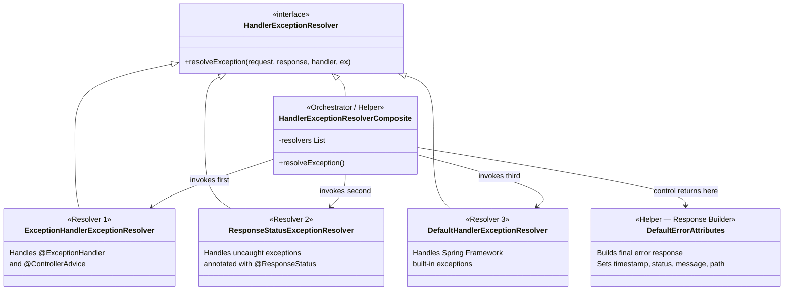
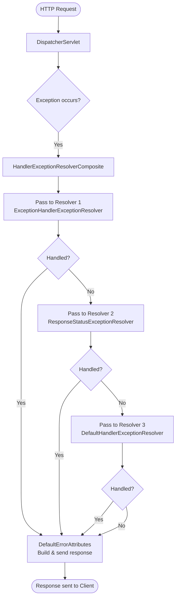
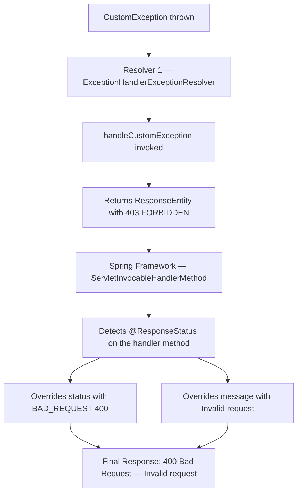
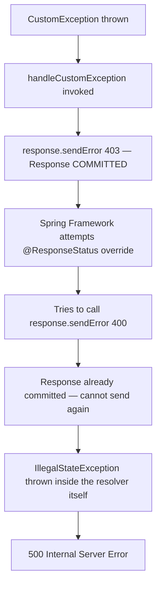

# 📌 Spring Boot Exception Handling — Complete Study Guide

> **Course:** Spring Boot Series  
> **Instructor:** Shreyansh  
> **Prerequisites:** Spring Boot REST APIs, Java Custom Exceptions, Response Entity

---

## Table of Contents

1. [Classes Involved in Exception Handling](#classes-involved-in-exception-handling)
2. [The Exception Resolution Flow](#the-exception-resolution-flow)
3. [Default Behavior — What Happens Without Any Handler](#default-behavior--what-happens-without-any-handler)
4. [Taking Manual Control — Returning ResponseEntity](#taking-manual-control--returning-responseentity)
5. [Resolver 1 — ExceptionHandlerExceptionResolver](#resolver-1--exceptionhandlerexceptionresolver)
6. [Resolver 2 — ResponseStatusExceptionResolver](#resolver-2--responsestatusexceptionresolver)
7. [Resolver 3 — DefaultHandlerExceptionResolver](#resolver-3--defaulthandlerexceptionresolver)
8. [@ResponseStatus + @ExceptionHandler Together — The Tricky Cases](#responsestatus--exceptionhandler-together--the-tricky-cases)
9. [Global Exception Handling with @ControllerAdvice](#global-exception-handling-with-controlleradvice)
10. [Priority Rules — Which Handler Wins?](#priority-rules--which-handler-wins)
11. [Key Observations](#key-observations)
12. [Common Mistakes](#common-mistakes)
13. [Best Practices](#best-practices)
14. [Interview Notes](#interview-notes)
15. [Summary](#summary)

---

## Classes Involved in Exception Handling

Spring Boot uses a hierarchy of five classes to handle exceptions. Understanding each class and its role is fundamental to mastering exception handling.



### Role of Each Class

| Class | Type | Role |
|---|---|---|
| `HandlerExceptionResolver` | Interface | Defines the contract — exposes `resolveException()` |
| `HandlerExceptionResolverComposite` | Helper / Orchestrator | Coordinates the three resolvers; invokes them in sequence |
| `ExceptionHandlerExceptionResolver` | **Resolver 1** | Handles `@ExceptionHandler` and `@ControllerAdvice` annotations |
| `ResponseStatusExceptionResolver` | **Resolver 2** | Handles **uncaught** exceptions annotated with `@ResponseStatus` |
| `DefaultHandlerExceptionResolver` | **Resolver 3** | Handles Spring Framework built-in exceptions (404, method not found, etc.) |
| `DefaultErrorAttributes` | Helper / Response Builder | Builds the final error response object (timestamp, status, error, path) and sends it |

> [!IMPORTANT]
> **Three are resolvers** (they try to handle the exception). **Two are helpers** — the composite orchestrates the resolvers, and `DefaultErrorAttributes` builds the final response. Always keep this distinction clear.

---

## The Exception Resolution Flow

### High-Level Flow



### Step-by-Step Description

1. **Exception is thrown** — either in a controller method, or the DispatcherServlet cannot even find the controller
2. **DispatcherServlet** passes the exception to `HandlerExceptionResolverComposite`
3. **Composite (Orchestrator)** tries each resolver in sequence:
   - Passes to **Resolver 1** (`ExceptionHandlerExceptionResolver`)
   - Checks: *was the exception handled?*
   - If **yes** → skip remaining resolvers, go to `DefaultErrorAttributes`
   - If **no** → pass to **Resolver 2** (`ResponseStatusExceptionResolver`)
   - Checks again. If **yes** → `DefaultErrorAttributes`. If **no** → pass to **Resolver 3**
   - **Resolver 3** (`DefaultHandlerExceptionResolver`) tries to handle it
4. After all resolvers complete (regardless of whether any handled it), **`DefaultErrorAttributes`** builds the response:
   - Sets `timestamp`, `status`, `error`, `message`, `path`
   - Creates a `ResponseEntity` and sends it to the client

> [!NOTE]
> **`DefaultErrorAttributes` is always invoked** — it is the final step regardless of which resolver (if any) handled the exception. If a resolver handled it, `DefaultErrorAttributes` uses the status and message the resolver set. If no resolver handled it, `DefaultErrorAttributes` uses the **default status: 500 Internal Server Error**.

---

## Default Behavior — What Happens Without Any Handler

### Example 1 — Throwing a NullPointerException

```java
@RestController
@RequestMapping("/api")
public class UserController {

    @GetMapping("/get-user")
    public String getUser() {
        throw new NullPointerException("Something is null");
        // No try-catch, no ResponseEntity returned
    }
}
```

**Output when this API is hit:**

```json
{
  "timestamp": "2024-01-15T10:30:00.000+00:00",
  "status": 500,
  "error": "Internal Server Error",
  "path": "/api/get-user"
}
```

**Who sets this response?** `DefaultErrorAttributes`. No resolver could handle a plain `NullPointerException`, so the default status `500` is used.

---

### Example 2 — Throwing a Custom Exception (Without Any Handler)

#### Custom Exception Class

```java
public class CustomException extends RuntimeException {

    private HttpStatus status;
    private String message;

    public CustomException(HttpStatus status, String message) {
        super(message);             // Sets the parent's detailedMessage field
        this.status = status;
        this.message = message;
    }

    public HttpStatus getStatus() { return status; }

    @Override
    public String getMessage() { return message; }
}
```

> [!TIP]
> **Two ways to set the message in a custom exception:**
> - **Option A (via parent):** Call `super(message)` — this flows up to `RuntimeException → Exception` and sets the internal `detailedMessage` field. When the framework calls `getMessage()`, it returns this.
> - **Option B (override):** Add your own `String message` field and override `getMessage()` to return it directly. This gives you full control without relying on the parent's field.

#### Controller

```java
@GetMapping("/get-user")
public String getUser() {
    throw new CustomException(HttpStatus.BAD_REQUEST, "Request is not correct. User ID is missing.");
}
```

**Output:**

```json
{
  "timestamp": "2024-01-15T10:30:00.000+00:00",
  "status": 500,
  "error": "Internal Server Error",
  "path": "/api/get-user"
}
```

> [!WARNING]
> Even though the `CustomException` carries `HttpStatus.BAD_REQUEST` (400), the response shows **500**. This is because no resolver recognizes or handles this custom exception. `DefaultErrorAttributes` uses the **default 500** since the exception went unhandled through all three resolvers.
>
> The `status` and `message` fields inside your custom exception object mean **nothing** to the framework unless you explicitly read them and set the response.

---

## Taking Manual Control — Returning ResponseEntity

The cleanest approach: **catch the exception yourself, build a `ResponseEntity`, and return it**. The resolver framework is completely bypassed.

### Error Response POJO

```java
public class ErrorResponse {
    private Date timestamp;
    private String message;
    private int status;

    public ErrorResponse(Date timestamp, String message, int status) {
        this.timestamp = timestamp;
        this.message = message;
        this.status = status;
    }
    // Getters
}
```

### Controller with Try-Catch

```java
@GetMapping("/get-user")
public ResponseEntity<?> getUser() {
    try {
        throw new CustomException(HttpStatus.BAD_REQUEST, "Request is not correct. User ID is missing.");
    } catch (CustomException e) {
        ErrorResponse body = new ErrorResponse(
            new Date(),
            e.getMessage(),
            e.getStatus().value()
        );
        return ResponseEntity
                .status(e.getStatus())          // HTTP 400
                .body(body);                    // Error response object
    } catch (Exception e) {
        ErrorResponse body = new ErrorResponse(new Date(), e.getMessage(), 500);
        return ResponseEntity.status(HttpStatus.INTERNAL_SERVER_ERROR).body(body);
    }
}
```

**Output:**

```json
{
  "timestamp": "2024-01-15T10:30:00.000+00:00",
  "status": 400,
  "message": "Request is not correct. User ID is missing."
}
```

> [!IMPORTANT]
> **When you return a `ResponseEntity` directly from your controller or exception handler, `DefaultErrorAttributes` is NOT involved.** You are fully in control of the response body and HTTP status. The resolver framework is bypassed entirely.

---

## Resolver 1 — ExceptionHandlerExceptionResolver

This is the **most important and most used resolver** in real-world Spring Boot applications.

**What it handles:** Methods annotated with `@ExceptionHandler` (either at controller level or inside a `@ControllerAdvice` class).

---

### Controller-Level Exception Handling

`@ExceptionHandler` methods placed **inside a controller class** apply only to exceptions thrown by methods in **that same controller**.

#### Use Case 1 — Basic Handler Returning a String

```java
@RestController
@RequestMapping("/api")
public class UserController {

    @GetMapping("/get-user")
    public String getUser() {
        throw new CustomException(HttpStatus.BAD_REQUEST, "User ID is missing");
    }

    // Handles CustomException thrown by ANY method in THIS controller
    @ExceptionHandler(CustomException.class)
    public ResponseEntity<String> handleCustomException(CustomException e) {
        return ResponseEntity
                .status(e.getStatus())
                .body(e.getMessage());   // Returns plain string body
    }
}
```

**Output:**

```json
HTTP 400 Bad Request
Body: "User ID is missing"
```

---

#### Use Case 2 — Handler Returning an Error Response Object

```java
@ExceptionHandler(CustomException.class)
public ResponseEntity<ErrorResponse> handleCustomException(CustomException e) {
    ErrorResponse body = new ErrorResponse(
        new Date(),
        e.getMessage(),
        e.getStatus().value()
    );
    return ResponseEntity.status(e.getStatus()).body(body);
}
```

**Output:**

```json
HTTP 400 Bad Request
{
  "timestamp": "2024-01-15T10:30:00.000+00:00",
  "status": 400,
  "message": "User ID is missing"
}
```

---

#### Use Case 3 — Multiple Exception Handlers in One Controller

```java
@RestController
@RequestMapping("/api")
public class UserController {

    @GetMapping("/get-user")
    public String getUser() {
        throw new CustomException(HttpStatus.BAD_REQUEST, "User ID is missing");
    }

    @GetMapping("/get-order")
    public String getOrder() {
        throw new IllegalArgumentException("Invalid argument provided");
    }

    // Handler 1 — for CustomException
    @ExceptionHandler(CustomException.class)
    public ResponseEntity<ErrorResponse> handleCustomException(CustomException e) {
        return ResponseEntity.status(e.getStatus())
                             .body(new ErrorResponse(new Date(), e.getMessage(), e.getStatus().value()));
    }

    // Handler 2 — for IllegalArgumentException
    @ExceptionHandler(IllegalArgumentException.class)
    public ResponseEntity<ErrorResponse> handleIllegalArgument(IllegalArgumentException e) {
        return ResponseEntity.status(HttpStatus.BAD_REQUEST)
                             .body(new ErrorResponse(new Date(), e.getMessage(), 400));
    }
}
```

---

#### Use Case 4 — One Handler for Multiple Exception Types

If multiple exceptions result in the same response structure, consolidate them:

```java
// Handles BOTH CustomException AND IllegalArgumentException
@ExceptionHandler({CustomException.class, IllegalArgumentException.class})
public ResponseEntity<ErrorResponse> handleMultipleExceptions(Exception e) {
    // Must use parent type 'Exception' since we're handling multiple types
    return ResponseEntity.status(HttpStatus.BAD_REQUEST)
                         .body(new ErrorResponse(new Date(), e.getMessage(), 400));
}
```

> [!NOTE]
> When `@ExceptionHandler` handles **multiple exception types**, the method parameter must use a **common parent type** (e.g., `Exception`) since only one parameter is allowed and it must accommodate all specified types. If handling a **single** exception type, you can use the exact exception class as the parameter.

---

#### Use Case 5 — Handler Without Returning ResponseEntity (Using HttpServletResponse)

```java
@ExceptionHandler(CustomException.class)
public void handleCustomException(CustomException e, HttpServletResponse response) throws IOException {
    response.sendError(e.getStatus().value(), e.getMessage());
    // Does NOT return a ResponseEntity
    // Sets status and message into the response attributes
    // DefaultErrorAttributes will pick these up and build the response
}
```

**What happens:**
- The exception handler sets the status and message in the `HttpServletResponse`
- Since no `ResponseEntity` is returned, `DefaultErrorAttributes` takes over
- `DefaultErrorAttributes` reads the status (400) and message from the response and builds a proper JSON error response

**Output:**

```json
{
  "timestamp": "2024-01-15T10:30:00.000+00:00",
  "status": 400,
  "error": "Bad Request",
  "message": "User ID is missing",
  "path": "/api/get-user"
}
```

---

### Supported Parameters for `@ExceptionHandler` Methods

The `ExceptionHandlerExceptionResolver` knows how to resolve and inject specific parameter types into `@ExceptionHandler` methods. You can use any combination, in any order:

| Parameter Type | What It Provides |
|---|---|
| `SomeException` (exact or parent) | The thrown exception object |
| `HttpServletRequest` | The incoming HTTP request |
| `HttpServletResponse` | The outgoing HTTP response — use to set status/message manually |

```java
// All three — any order is valid
@ExceptionHandler(CustomException.class)
public void handle(HttpServletRequest req, CustomException e, HttpServletResponse res) { ... }

// Just the exception
@ExceptionHandler(CustomException.class)
public ResponseEntity<?> handle(CustomException e) { ... }

// Exception and response
@ExceptionHandler(CustomException.class)
public void handle(CustomException e, HttpServletResponse res) { ... }
```

> [!CAUTION]
> Do **not** add arbitrary parameters (e.g., `String`, `Integer`) to an `@ExceptionHandler` method. The resolver only knows how to inject the supported types listed above. Unsupported parameters will cause the handler not to be invoked at all.

---

## Resolver 2 — ResponseStatusExceptionResolver

**What it handles:** **Uncaught exceptions** (exceptions not handled by Resolver 1) whose **class** is annotated with `@ResponseStatus`.

> [!IMPORTANT]
> The key word here is **uncaught**. `ResponseStatusExceptionResolver` only processes exceptions that have passed through Resolver 1 without being handled. It reads the `@ResponseStatus` annotation from the **exception class itself**, not from any handler method.

### Example — Basic `@ResponseStatus` on Custom Exception

```java
@ResponseStatus(HttpStatus.BAD_REQUEST)   // Annotate the exception class
public class CustomException extends RuntimeException {

    public CustomException(String message) {
        super(message);
    }
}
```

```java
@GetMapping("/get-user")
public String getUser() {
    throw new CustomException("User ID is missing");
    // No @ExceptionHandler for this — goes to Resolver 2
}
```

**Flow:**
1. Exception thrown → Resolver 1 has no `@ExceptionHandler` for it → passes to Resolver 2
2. Resolver 2 checks the exception class for `@ResponseStatus` → finds it
3. Resolver 2 calls `response.sendError(400)` — sets status in the response
4. `DefaultErrorAttributes` reads status (400), builds response

**Output:**

```json
{
  "timestamp": "2024-01-15T10:30:00.000+00:00",
  "status": 400,
  "error": "Bad Request",
  "path": "/api/get-user"
}
```

---

### Example — `@ResponseStatus` with `reason` (Message)

```java
@ResponseStatus(value = HttpStatus.BAD_REQUEST, reason = "Invalid request sent")
public class CustomException extends RuntimeException {

    public CustomException(String message) {
        super(message);
    }
}
```

**Output:**

```json
{
  "timestamp": "2024-01-15T10:30:00.000+00:00",
  "status": 400,
  "error": "Bad Request",
  "message": "Invalid request sent"
}
```

> [!NOTE]
> When `reason` is provided in `@ResponseStatus`, it **takes priority** as the message over the exception's own message (set via `super(message)`). If `reason` is not provided, `DefaultErrorAttributes` uses its default message for the status code.

---

## Resolver 3 — DefaultHandlerExceptionResolver

This resolver handles **Spring Framework's own built-in exceptions** — exceptions thrown by the framework itself when it cannot process a request. These are **not** your application-level exceptions.

### Examples of Exceptions It Handles

| Exception | HTTP Status | Typical Cause |
|---|---|---|
| `NoResourceFoundException` | 404 Not Found | No controller mapped to the requested URL |
| `HttpRequestMethodNotSupportedException` | 405 Method Not Allowed | Wrong HTTP method used (e.g., GET on a POST endpoint) |
| `HttpMediaTypeNotSupportedException` | 415 Unsupported Media Type | Wrong `Content-Type` header |
| `MissingServletRequestParameterException` | 400 Bad Request | Required `@RequestParam` is missing |
| `MethodArgumentNotValidException` | 400 Bad Request | `@Valid` / `@Validated` bean validation failure |

### Example — Calling a Non-Existent API

```
GET /api/get-user/999999  (no controller mapped to this path)
```

**Flow:**
1. DispatcherServlet cannot find a controller for this URL
2. Exception passed to Composite → Resolver 1 → Resolver 2 → **Resolver 3**
3. Resolver 3 recognizes `NoResourceFoundException` as a Spring framework exception
4. Sets status 404 and message in the response
5. `DefaultErrorAttributes` builds the final response

**Output:**

```json
{
  "timestamp": "2024-01-15T10:30:00.000+00:00",
  "status": 404,
  "error": "Not Found",
  "message": "No static resource api/get-user/999999",
  "path": "/api/get-user/999999"
}
```

---

## @ResponseStatus + @ExceptionHandler Together — The Tricky Cases

This is one of the most confusing areas and a common source of bugs. Read carefully.

### Tricky Case 1 — @ExceptionHandler Returning ResponseEntity + @ResponseStatus on Method

```java
@RestController
@RequestMapping("/api")
public class UserController {

    @GetMapping("/get-user")
    public String getUser() {
        throw new CustomException(HttpStatus.BAD_REQUEST, "User ID is missing");
    }

    // @ResponseStatus says: bad request, "Invalid request"
    // Method body says: ResponseEntity with 403 FORBIDDEN and "You are not authorized"
    @ResponseStatus(value = HttpStatus.BAD_REQUEST, reason = "Invalid request")
    @ExceptionHandler(CustomException.class)
    public ResponseEntity<String> handleCustomException(CustomException e) {
        return ResponseEntity
                .status(HttpStatus.FORBIDDEN)           // 403
                .body("You are not authorized");
    }
}
```

**What output do you expect?** 403 Forbidden or 400 Bad Request?

**Actual Output:**

```json
HTTP 400 Bad Request
Body: "Invalid request"
```

**Why?**



**Key insight:** `@ResponseStatus` on an `@ExceptionHandler` method is **not processed by `ResponseStatusExceptionResolver`**. It is processed by **Spring Framework's internal `ServletInvocableHandlerMethod`** after the handler method executes. It overrides whatever the `ResponseEntity` contained.

> [!WARNING]
> When `@ResponseStatus` and `@ExceptionHandler` are on the **same method**, `@ResponseStatus` always wins — it overrides the status and message set inside the `ResponseEntity`. The second resolver (`ResponseStatusExceptionResolver`) is **not involved** at all.

---

### Tricky Case 2 — @ExceptionHandler Using `response.sendError()` + @ResponseStatus on Method

```java
@ResponseStatus(value = HttpStatus.BAD_REQUEST, reason = "Invalid request sent")
@ExceptionHandler(CustomException.class)
public void handleCustomException(CustomException e, HttpServletResponse response) throws IOException {
    response.sendError(HttpStatus.FORBIDDEN.value(), "User ID is missing");
    // Sets 403 and message — then COMMITS the response
}
```

**What output do you expect?** 403 Forbidden or 400 Bad Request?

**Actual Output:**

```
HTTP 500 Internal Server Error
```

**Why?**



`response.sendError()` **commits** the HTTP response immediately. Once a response is committed, it cannot be modified. When Spring Framework tries to apply `@ResponseStatus` afterward (calling `sendError` again), the underlying system throws an exception because you cannot write to an already-committed response. This exception propagates and ultimately results in a 500.

> [!CAUTION]
> **Never use `response.sendError()` inside an `@ExceptionHandler` method that also has `@ResponseStatus`**. The commit from `sendError` makes the second `sendError` (from `@ResponseStatus`) throw an exception, resulting in 500.

---

### Rules When Combining @ResponseStatus and @ExceptionHandler

| Combination | Result | Recommendation |
|---|---|---|
| `@ExceptionHandler` returns `ResponseEntity` + `@ResponseStatus` on method | `@ResponseStatus` overrides the `ResponseEntity` status and message | ⚠️ Avoid — confusing; pick one |
| `@ExceptionHandler` uses `response.sendError()` + `@ResponseStatus` on method | 500 Internal Server Error | ❌ Never do this |
| `@ExceptionHandler` returns `ResponseEntity` only (no `@ResponseStatus`) | `ResponseEntity` status and body are used | ✅ Recommended |
| `@ResponseStatus` on exception class + no `@ExceptionHandler` | `ResponseStatusExceptionResolver` handles it | ✅ Fine for simple cases |

> [!TIP]
> **The golden rule:** Give each piece of code a single responsibility. Either let `@ResponseStatus` set the status/message, **or** let the `@ExceptionHandler` method body do it via `ResponseEntity` or `response.sendError()`. **Never both.**

---

## Global Exception Handling with @ControllerAdvice

### The Problem With Controller-Level Handlers

If you have 100 controllers and each can throw `CustomException`, you would have to write the same `@ExceptionHandler` method in every single controller. This is massive code duplication.

### Solution — @ControllerAdvice

`@ControllerAdvice` marks a class as a **global exception handler**. `@ExceptionHandler` methods inside it apply to **all controllers** in the application.

```java
@ControllerAdvice
public class GlobalExceptionHandler {

    @ExceptionHandler(CustomException.class)
    public ResponseEntity<ErrorResponse> handleCustomException(CustomException e) {
        ErrorResponse body = new ErrorResponse(new Date(), e.getMessage(), e.getStatus().value());
        return ResponseEntity.status(e.getStatus()).body(body);
    }

    @ExceptionHandler(IllegalArgumentException.class)
    public ResponseEntity<ErrorResponse> handleIllegalArgument(IllegalArgumentException e) {
        ErrorResponse body = new ErrorResponse(new Date(), e.getMessage(), 400);
        return ResponseEntity.status(HttpStatus.BAD_REQUEST).body(body);
    }

    // Catch-all for any unhandled exception
    @ExceptionHandler(Exception.class)
    public ResponseEntity<ErrorResponse> handleGenericException(Exception e) {
        ErrorResponse body = new ErrorResponse(new Date(), "An unexpected error occurred", 500);
        return ResponseEntity.status(HttpStatus.INTERNAL_SERVER_ERROR).body(body);
    }
}
```

This single class handles exceptions from `UserController`, `OrderController`, `InvoiceController`, and every other controller — no duplication.

---

## Priority Rules — Which Handler Wins?

### Rule 1 — Controller-Level Before Global

If the **same exception** has a handler both inside the throwing controller AND in `@ControllerAdvice`, the **controller-level handler always takes priority**.

```java
// GlobalExceptionHandler.java (@ControllerAdvice)
@ExceptionHandler(CustomException.class)
public ResponseEntity<?> globalHandler(CustomException e) {
    return ResponseEntity.status(e.getStatus()).body("From GLOBAL handler");
}
```

```java
// UserController.java
@ExceptionHandler(CustomException.class)
public ResponseEntity<?> controllerHandler(CustomException e) {
    return ResponseEntity.status(e.getStatus()).body("From CONTROLLER handler");
}

@GetMapping("/get-user")
public String getUser() {
    throw new CustomException(HttpStatus.BAD_REQUEST, "User ID is missing");
}
```

**Output:** `"From CONTROLLER handler"` — controller-level wins.

---

### Rule 2 — Exact Type Match Before Parent Type

Within the same class (controller or `@ControllerAdvice`), if both an **exact match** handler and a **parent class** handler exist:

```java
@ControllerAdvice
public class GlobalExceptionHandler {

    // Exact match
    @ExceptionHandler(CustomException.class)
    public ResponseEntity<?> handleCustom(CustomException e) {
        return ResponseEntity.badRequest().body("Exact: " + e.getMessage());
    }

    // Parent match — also applicable since CustomException extends RuntimeException
    @ExceptionHandler(RuntimeException.class)
    public ResponseEntity<?> handleRuntime(RuntimeException e) {
        return ResponseEntity.badRequest().body("Parent: " + e.getMessage());
    }
}
```

**When `CustomException` is thrown:** `handleCustom()` is invoked — **exact match wins**.  
**When any other `RuntimeException` is thrown:** `handleRuntime()` is invoked.

---

### Priority Hierarchy Summary

```mermaid
flowchart TD
    A[Exception Thrown] --> B{Controller-level @ExceptionHandler\nfor this exact exception?}
    B --> |Yes| C[✅ Controller handler invoked — HIGHEST PRIORITY]
    B --> |No| D{Global @ControllerAdvice\n@ExceptionHandler for exact type?}
    D --> |Yes| E[✅ Global exact-match handler invoked]
    D --> |No| F{Global @ControllerAdvice\n@ExceptionHandler for parent type?}
    F --> |Yes| G[✅ Global parent-match handler invoked]
    F --> |No| H{@ResponseStatus on exception class?}
    H --> |Yes| I[✅ ResponseStatusExceptionResolver handles it]
    H --> |No| J{Spring framework exception?}
    J --> |Yes| K[✅ DefaultHandlerExceptionResolver handles it]
    J --> |No| L[DefaultErrorAttributes sets 500]
```

---

## Key Observations

1. **Resolvers run in sequence** — Resolver 1 → Resolver 2 → Resolver 3. Once one handles it, the rest are skipped.

2. **`DefaultErrorAttributes` always runs last** — it reads whatever status and message were set by the resolver (or uses defaults) and builds the final JSON response.

3. **Default status is 500** — if no resolver handles the exception, `DefaultErrorAttributes` uses 500 as the default.

4. **Returning `ResponseEntity` bypasses `DefaultErrorAttributes`** — when an `@ExceptionHandler` method returns a `ResponseEntity`, the resolver creates the response directly and `DefaultErrorAttributes` is not needed.

5. **`response.sendError()` commits the response** — once committed, no further writes are possible. Using it alongside `@ResponseStatus` on the same method causes a 500.

6. **`ResponseStatusExceptionResolver` only handles *uncaught* exceptions** — if Resolver 1 already handled it, Resolver 2 is never invoked, even if the exception class has `@ResponseStatus`.

7. **`@ResponseStatus` on an `@ExceptionHandler` method is processed by Spring Framework, not by Resolver 2** — this override happens inside `ServletInvocableHandlerMethod` after the handler executes.

8. **`@ControllerAdvice` is truly global** — one class handles exceptions from the entire application.

9. **Controller-level handlers have higher priority than `@ControllerAdvice`** — the local always wins over the global.

10. **Exact exception type match wins over parent type** — `CustomException` handler beats `RuntimeException` handler when a `CustomException` is thrown.

---

## Common Mistakes

### Mistake 1 — Expecting Custom Exception Fields to Automatically Appear in Response

```java
// ❌ Wrong assumption: throwing this will return 400 automatically
throw new CustomException(HttpStatus.BAD_REQUEST, "User ID is missing");

// But the response shows 500! Because no one reads the exception's fields.
```

**Fix:** Either use `@ExceptionHandler` to read the fields and build a `ResponseEntity`, or annotate the exception class with `@ResponseStatus`.

---

### Mistake 2 — Using `response.sendError()` With `@ResponseStatus` on the Same Handler

```java
// ❌ Causes 500 — response is committed by sendError, then @ResponseStatus tries to commit again
@ResponseStatus(HttpStatus.BAD_REQUEST)
@ExceptionHandler(CustomException.class)
public void handle(CustomException e, HttpServletResponse res) throws IOException {
    res.sendError(403, "Forbidden");  // Commits response
    // @ResponseStatus tries to sendError again → exception → 500
}
```

**Fix:** Use only one mechanism. Either return a `ResponseEntity` (and use `@ResponseStatus` to override it if needed), or use `response.sendError()` without `@ResponseStatus` on the method.

---

### Mistake 3 — Putting @ExceptionHandler in the Wrong Place

```java
// ❌ @ExceptionHandler in class A will NOT catch exceptions from class B
@ExceptionHandler(CustomException.class)  // Only works inside UserController
public ResponseEntity<?> handle(CustomException e) { ... }
```

**Fix:** Use `@ControllerAdvice` for global handling.

---

### Mistake 4 — Using Unsupported Parameter Types in @ExceptionHandler

```java
// ❌ String is not a supported parameter type — handler may not be invoked
@ExceptionHandler(CustomException.class)
public ResponseEntity<?> handle(CustomException e, String someString) { ... }
```

**Fix:** Only use `Exception` (or subclass), `HttpServletRequest`, `HttpServletResponse` as parameters.

---

### Mistake 5 — Assuming `@ResponseStatus` on Exception Class Works When @ExceptionHandler Exists

```java
// ❌ Wrong assumption: both will work
@ResponseStatus(HttpStatus.BAD_REQUEST)     // This will NOT be used by Resolver 2...
public class CustomException extends RuntimeException { ... }

// ...because Resolver 1 handles it via @ExceptionHandler first
@ExceptionHandler(CustomException.class)
public ResponseEntity<?> handle(CustomException e) { ... }
```

**Fix:** Understand that once Resolver 1 handles an exception, Resolver 2 is never reached. `@ResponseStatus` on the exception class is meaningless when an `@ExceptionHandler` exists for that exception.

---

## Best Practices

1. **Use `@ControllerAdvice` with `@ExceptionHandler` as the primary pattern** — it is the industry standard, provides full control, and eliminates duplication across controllers.

2. **Always return `ResponseEntity`** from `@ExceptionHandler` methods — it gives you explicit control over status code and response body without relying on `DefaultErrorAttributes`.

3. **Create a standardized `ErrorResponse` POJO** — include `timestamp`, `status`, `message`, and optionally `path`. Consistency across all error responses makes client-side error handling easier.

4. **Add a catch-all handler in `@ControllerAdvice`** for `Exception.class` — ensures that even unexpected exceptions produce a structured JSON response instead of a raw 500 from the framework.

5. **Do not mix `@ResponseStatus` and `@ExceptionHandler` on the same method** — it causes confusion and potential 500 errors if `response.sendError()` is involved.

6. **Use `@ResponseStatus` on exception classes only for simple cases** — it is clean and concise but gives less control over the response body than `@ExceptionHandler`.

7. **Keep controller-level `@ExceptionHandler` methods only for truly controller-specific handling** — prefer `@ControllerAdvice` for consistency.

8. **Log exceptions in your global handler** — the `@ControllerAdvice` class is the ideal place to centralize exception logging, alerting, and monitoring.

---

## Interview Notes

> [!IMPORTANT]
> These are commonly asked Spring Boot exception handling interview questions.

---

### Q1: What are the five classes involved in Spring Boot exception handling?

**Answer:**
1. `HandlerExceptionResolver` — interface defining the contract
2. `HandlerExceptionResolverComposite` — orchestrates the three resolvers in sequence
3. `ExceptionHandlerExceptionResolver` — handles `@ExceptionHandler` and `@ControllerAdvice`
4. `ResponseStatusExceptionResolver` — handles uncaught exceptions with `@ResponseStatus` on the class
5. `DefaultErrorAttributes` — builds the final error response (timestamp, status, message, path)

---

### Q2: In what sequence are the resolvers invoked?

**Answer:** `ExceptionHandlerExceptionResolver` → `ResponseStatusExceptionResolver` → `DefaultHandlerExceptionResolver`. They are invoked by `HandlerExceptionResolverComposite`. Once any resolver handles the exception, the remaining resolvers are skipped.

---

### Q3: Why does throwing a custom exception with `HttpStatus.BAD_REQUEST` still return 500?

**Answer:** The `HttpStatus` field inside the custom exception is just a Java object field — the framework has no idea it exists. When no resolver handles the exception, `DefaultErrorAttributes` uses the default status of 500. To properly propagate the status, you must either: (a) use `@ExceptionHandler` to read the field and return a `ResponseEntity`, or (b) annotate the exception class with `@ResponseStatus`.

---

### Q4: What is the difference between controller-level and global exception handling?

**Answer:** Controller-level `@ExceptionHandler` methods only handle exceptions thrown within that specific controller. Global exception handling uses a class annotated with `@ControllerAdvice`, where `@ExceptionHandler` methods apply to all controllers in the application. Controller-level handlers take priority over global ones for the same exception type.

---

### Q5: What does `ResponseStatusExceptionResolver` handle?

**Answer:** It handles **uncaught** exceptions — exceptions not handled by `ExceptionHandlerExceptionResolver` (Resolver 1) — whose **class** is annotated with `@ResponseStatus`. The annotation must be on the **exception class**, not on a handler method. It reads the `value` (HTTP status) and `reason` (message) from the annotation and sets them in the response.

---

### Q6: What happens if you use both `@ResponseStatus` and `@ExceptionHandler` on the same method with `response.sendError()`?

**Answer:** This causes a 500 Internal Server Error. `response.sendError()` commits the HTTP response immediately. When Spring Framework then tries to apply `@ResponseStatus` (by calling `sendError` again), the already-committed response cannot be written to, causing an exception inside the resolver itself, which results in 500.

---

### Q7: Which takes priority — `@ResponseStatus` or the `ResponseEntity` returned from an `@ExceptionHandler` method?

**Answer:** `@ResponseStatus` always wins when both are present on the same method. After the `@ExceptionHandler` method executes and returns a `ResponseEntity`, Spring Framework's `ServletInvocableHandlerMethod` detects `@ResponseStatus` on the method and overrides the status and message. This is handled by the framework, not by `ResponseStatusExceptionResolver`.

---

### Q8: What does `DefaultHandlerExceptionResolver` handle?

**Answer:** It handles Spring Framework's own built-in exceptions — such as `NoResourceFoundException` (404), `HttpRequestMethodNotSupportedException` (405), `HttpMediaTypeNotSupportedException` (415), `MissingServletRequestParameterException` (400), and `MethodArgumentNotValidException` (400). It does not handle application-level custom exceptions.

---

### Q9: If two `@ExceptionHandler` methods can both handle an exception — one for `CustomException` and one for `RuntimeException` — which is invoked?

**Answer:** The **exact type match** takes priority. If `CustomException` extends `RuntimeException` and both handlers exist, the `CustomException` handler is invoked. If no exact match exists, the resolver walks up the class hierarchy to find the closest matching handler.

---

## Summary

| Concept | Key Point |
|---|---|
| **5 classes** | HandlerExceptionResolver (interface), Composite (orchestrator), 3 Resolvers, DefaultErrorAttributes (builder) |
| **Resolver sequence** | ExceptionHandler → ResponseStatus → DefaultHandler |
| **Default status** | 500 — used when no resolver handles the exception |
| **DefaultErrorAttributes** | Always runs last; builds the JSON error response |
| **Returning ResponseEntity** | Bypasses DefaultErrorAttributes; you have full control |
| **Resolver 1** | Handles `@ExceptionHandler` and `@ControllerAdvice` |
| **Resolver 2** | Handles **uncaught** exceptions with `@ResponseStatus` on the exception **class** |
| **Resolver 3** | Handles Spring framework built-in exceptions (404, 405, 415, etc.) |
| **`@ControllerAdvice`** | Global exception handler — applies to all controllers |
| **Controller vs Global priority** | Controller-level handler wins over `@ControllerAdvice` |
| **Exact vs Parent type** | Exact exception type match wins over parent type match |
| **`@ResponseStatus` on method** | Processed by Spring Framework, not Resolver 2; overrides `ResponseEntity` |
| **`response.sendError()` + `@ResponseStatus`** | Causes 500 — committed response cannot be written again |
| **Supported handler parameters** | `Exception` (or subclass), `HttpServletRequest`, `HttpServletResponse` — any order |

> [!TIP]
> **Industry standard pattern:** One `@ControllerAdvice` class with `@ExceptionHandler` methods returning `ResponseEntity<ErrorResponse>`. No `response.sendError()`. No `@ResponseStatus` on handler methods. Clean, explicit, predictable.

---

*End of Study Guide — Spring Boot Exception Handling*
