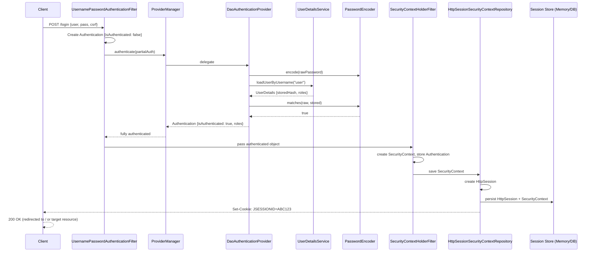
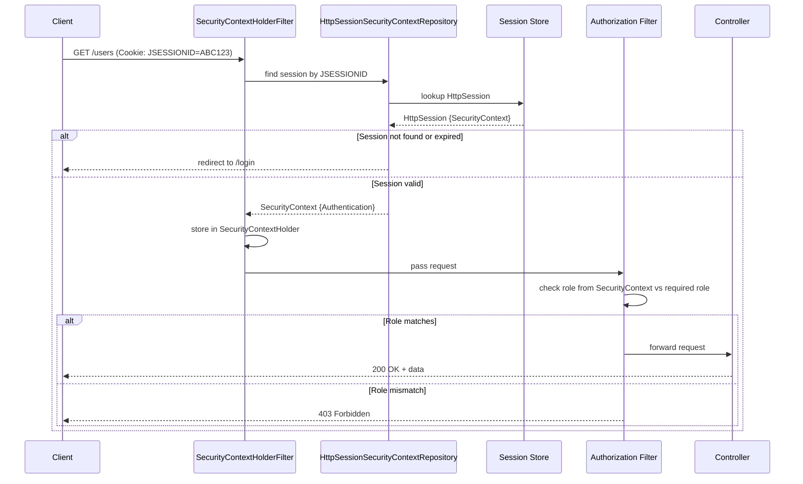
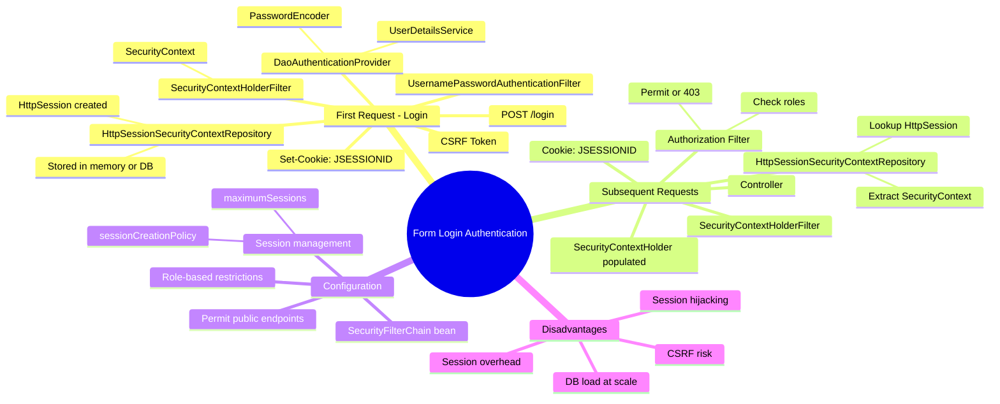
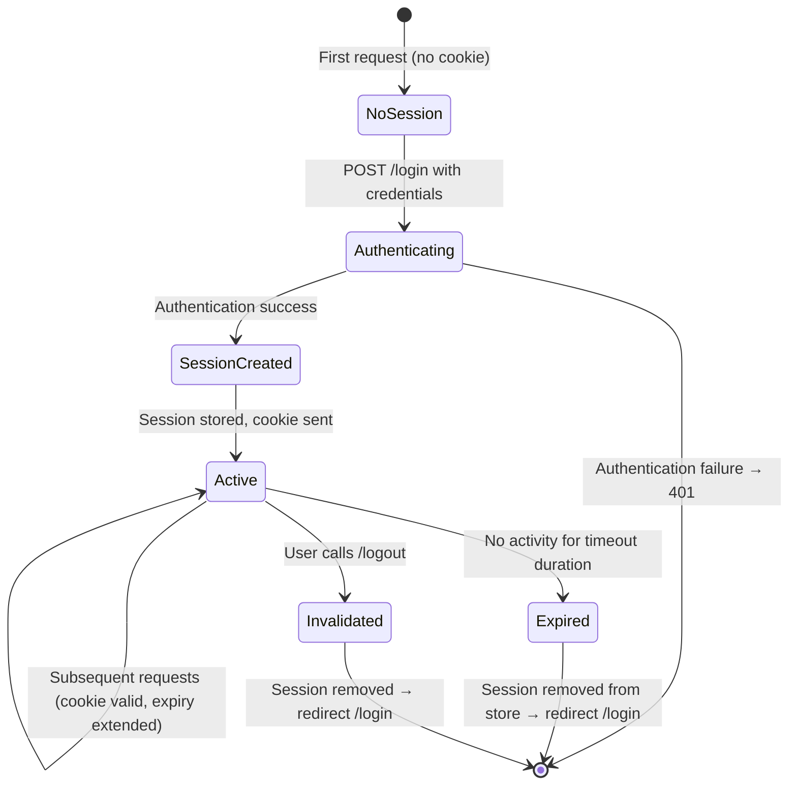
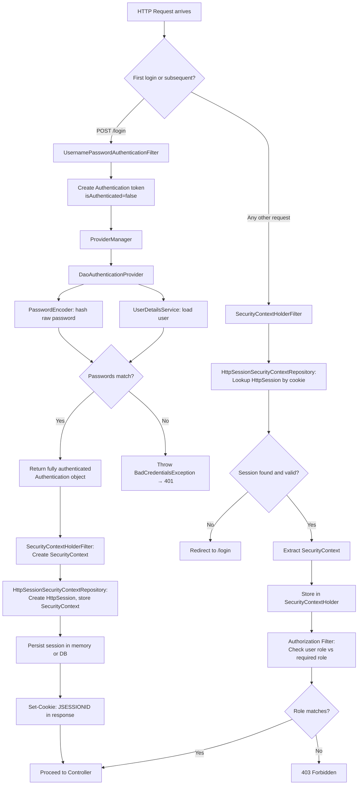

# 📌 Spring Boot Security — Form Login Authentication (Stateful)

> A complete, professional study guide based on the "Concept and Coding" Spring Boot Security lecture series — Form Login Authentication.

---

## Table of Contents

1. [Why Study Form Login Before JWT?](#1-why-study-form-login-before-jwt)
2. [What is Form Login Authentication?](#2-what-is-form-login-authentication)
3. [Stateful vs Stateless Authentication](#3-stateful-vs-stateless-authentication)
4. [What is an HTTP Session?](#4-what-is-an-http-session)
5. [Session Storage — Memory vs Database](#5-session-storage--memory-vs-database)
6. [Configuring Session Timeout](#6-configuring-session-timeout)
7. [Storing Sessions in the Database](#7-storing-sessions-in-the-database)
8. [End-to-End Flow — Step 1: Login (Session Creation)](#8-end-to-end-flow--step-1-login-session-creation)
9. [End-to-End Flow — Step 2: Accessing a Protected Resource](#9-end-to-end-flow--step-2-accessing-a-protected-resource)
10. [Why Zero Code is Needed for Basic Form Login](#10-why-zero-code-is-needed-for-basic-form-login)
11. [Custom Security Filter Chain Configuration](#11-custom-security-filter-chain-configuration)
12. [Authorization Filter](#12-authorization-filter)
13. [Two Phases of Authorization](#13-two-phases-of-authorization)
14. [Session Management Controls](#14-session-management-controls)
15. [Session Creation Policy](#15-session-creation-policy)
16. [Disadvantages of Form Login Authentication](#16-disadvantages-of-form-login-authentication)
17. [Diagrams](#17-diagrams)
18. [Key Observations](#18-key-observations)
19. [Common Mistakes](#19-common-mistakes)
20. [Best Practices](#20-best-practices)
21. [Interview Notes](#21-interview-notes)
22. [Comparison Tables](#22-comparison-tables)
23. [Practice Questions](#23-practice-questions)
24. [Summary](#24-summary)

---

## 1. Why Study Form Login Before JWT?

Form login is the **default** authentication method in Spring Boot Security and the historical foundation on which modern stateless methods like JWT and OAuth were built. Studying it first answers:

- What problem does "maintaining state" solve?
- What are the costs of server-side session management?
- Why did the industry move toward stateless tokens (JWT)?
- What does the Security Filter Chain actually do under the hood?

> [!IMPORTANT]
> JWT and OAuth are widely used today, but their advantages only make sense when you understand the disadvantages they were designed to overcome. Form login provides that context.

---

## 2. What is Form Login Authentication?

### Overview

Form login is a **stateful authentication mechanism** where a user submits their credentials once via an HTML login form. On success, the server creates and maintains a **session** representing that user's authenticated state. Subsequent requests carry only a **session ID** — not credentials — and the server validates the session on each call.

### Defining Characteristics

- **Stateful** — the server maintains the user's authentication state between requests.
- **Session-based** — after login, a session is the proof of identity.
- **Default** — it is the default authentication method in Spring Boot Security. No configuration is needed to activate it.
- **Default URLs** — Spring Boot provides `/login` and `/logout` endpoints automatically.

### Default Login and Logout URLs

| URL | Purpose |
|-----|---------|
| `/login` | Default login page. Accepts `username` and `password` via HTML form POST. |
| `/logout` | Invalidates the current session and logs the user out. |

> [!NOTE]
> These URLs are provided by Spring Boot automatically when form login is active. You do not need to write any controller for them.

---

## 3. Stateful vs Stateless Authentication

### Stateful Authentication (Form Login)

The **server** keeps track of every authenticated user's state in memory or a database (as a session). Each request is validated by looking up the server-side session.

```
Client                          Server
  |                               |
  |--- POST /login (user+pass) -->|
  |                               |--- create session, store it
  |<-- Set-Cookie: JSESSIONID ----|
  |                               |
  |--- GET /users (cookie) ------>|
  |                               |--- look up session, validate
  |<-- 200 OK ---------------------|
```

### Stateless Authentication (e.g., JWT)

The **token** itself carries all authentication information. The server does not store any session. Every request is self-contained.

```
Client                          Server
  |                               |
  |--- POST /login (user+pass) -->|
  |<-- JWT Token ------------------|
  |                               |
  |--- GET /users (Bearer token)->|
  |                               |--- verify token signature
  |<-- 200 OK ---------------------|
```

### Key Difference

| Aspect | Stateful (Form Login) | Stateless (JWT) |
|--------|----------------------|-----------------|
| Session stored | On server (memory/DB) | Not stored (in token) |
| Server memory usage | High (scales with users) | None |
| Logout behavior | Invalidate server session | Client discards token |
| Distributed systems | Requires shared session store (DB) | No shared store needed |
| Scalability | Harder | Easier |

---

## 4. What is an HTTP Session?

### Definition

An **HTTP session** is a server-side object (`HttpSession`) that stores data associated with a specific user across multiple HTTP requests. Since HTTP is stateless by nature, sessions are the mechanism by which a server "remembers" a user between requests.

### What an HttpSession Object Contains

| Field | Description |
|-------|-------------|
| Session ID | A unique identifier (e.g., `ABC123XYZ`) assigned when the session is created |
| Creation Time | Timestamp when the session was first created |
| Last Accessed Time | Timestamp of the most recent request that used this session |
| Max Inactive Interval | Inactivity duration (in seconds) after which the session expires |
| Expiry Time | Computed as: `last accessed time + max inactive interval` |
| Principal Name | The username of the authenticated user |
| Security Context | The serialized Spring Security `SecurityContext` (holds `Authentication` object with roles, etc.) |

### Session Lifecycle

```
User sends credentials
        ↓
Server authenticates user
        ↓
Server creates HttpSession object (new unique session ID)
        ↓
SecurityContext stored inside HttpSession
        ↓
Session stored in memory or DB
        ↓
Session ID sent to client in Set-Cookie header
        ↓
Client sends session ID in cookie on every subsequent request
        ↓
Server looks up HttpSession by session ID
        ↓
If found and valid: fulfill request
If not found or expired: redirect to /login
```

### Session Expiry — Inactivity Based

> [!IMPORTANT]
> Session timeout is **inactivity-based**, not time-from-creation-based.

If a user continues making requests, the session's expiry time is continuously extended. The session only expires after a defined period of **complete inactivity**.

```
Session created: 12:00
Timeout: 5 minutes

12:00 → session created
12:03 → user makes a request → last access updated → expires at 12:08
12:06 → user makes a request → last access updated → expires at 12:11
12:16 → (no activity for 5 min) → session EXPIRED
```

---

## 5. Session Storage — Memory vs Database

### Default: In-Memory (Servlet Container)

By default, the `HttpSession` object is stored **inside the servlet container** (e.g., Tomcat's in-process memory). This is fast and requires no additional setup, but has a critical flaw in distributed deployments.

### The Problem with In-Memory Sessions in Distributed Systems

```
Load Balancer
    ↓
┌───────────┐     ┌───────────┐
│ Server 1  │     │ Server 2  │
│ Session A │     │ (no sess) │
└───────────┘     └───────────┘

Client logs in → request goes to Server 1 → session created on Server 1
Client's next request → load balancer routes to Server 2 → session not found → 401 / redirect to login
```

This is a **bad user experience** — the user is forced to log in again even though they already authenticated.

### Solution: Database-Backed Session Storage

Store `HttpSession` data in a shared database that **all server instances** can access.

```
Load Balancer
    ↓
┌───────────┐     ┌───────────┐
│ Server 1  │     │ Server 2  │
└───────────┘     └───────────┘
         ↘       ↙
        ┌──────────┐
        │ Session  │
        │ Database │
        └──────────┘

Any server can now validate any session!
```

> [!TIP]
> In production with multiple instances, always use a shared session store — either a database (via `spring-session-jdbc`) or a cache like Redis (via `spring-session-data-redis`).

---

## 6. Configuring Session Timeout

### In `application.properties`

```properties
# Set session inactivity timeout to 5 minutes (default is 30 minutes)
server.servlet.session.timeout=5m

# Or in seconds:
server.servlet.session.timeout=300
```

> [!NOTE]
> The default timeout is **30 minutes** for Tomcat. This value is the **max inactivity interval**. The session is not destroyed 30 minutes after creation — it is destroyed 30 minutes after the **last activity**.

---

## 7. Storing Sessions in the Database

### Required Dependency

```xml
<!-- pom.xml -->
<dependency>
    <groupId>org.springframework.session</groupId>
    <artifactId>spring-session-jdbc</artifactId>
</dependency>
```

### `application.properties` Configuration

```properties
# Tell Spring Boot to create the session tables automatically
spring.session.jdbc.initialize-schema=always

# Use JDBC as the session store
spring.session.store-type=jdbc

# Session timeout (5 minutes)
server.servlet.session.timeout=5m
```

### Tables Created by Spring Boot

When `initialize-schema=always` is set, Spring Boot automatically creates two tables:

#### `SPRING_SESSION`

| Column | Description |
|--------|-------------|
| `PRIMARY_ID` | Internal primary key |
| `SESSION_ID` | The unique session identifier sent to the client |
| `CREATION_TIME` | Epoch millis when session was created |
| `LAST_ACCESS_TIME` | Epoch millis of last request using this session |
| `MAX_INACTIVE_INTERVAL` | Inactivity timeout in seconds (e.g., `300` for 5 min) |
| `EXPIRY_TIME` | `last_access_time + max_inactive_interval` — auto-updated on each request |
| `PRINCIPAL_NAME` | Username of the authenticated user |

#### `SPRING_SESSION_ATTRIBUTES`

Stores serialized attributes attached to the session. The most important attribute is:

| Attribute Name | Value |
|---------------|-------|
| `SPRING_SECURITY_CONTEXT` | Serialized `SecurityContext` object (contains `Authentication` data: username, roles, etc.) |

> [!NOTE]
> The `EXPIRY_TIME` column is continuously updated on each user request. Spring Boot increments it by `MAX_INACTIVE_INTERVAL` from the `LAST_ACCESS_TIME`. This is how inactivity-based expiry works.

---

## 8. End-to-End Flow — Step 1: Login (Session Creation)

### Scenario

A user hits `/login` with their username and password for the first time. No session exists yet.

### Step-by-Step Execution

#### Stage 1: Request Reaches Security Filter Chain

```
POST /login
  username: "user"
  password: "pass"
  _csrf: "<token>"
        ↓
Servlet Container
        ↓
General Filter Chain
        ↓
Security Filter Chain → UsernamePasswordAuthenticationFilter invoked
```

> [!NOTE]
> A CSRF token is also submitted with the login form. By default, Spring Security's CSRF protection is enabled for form login. The CSRF filter validates this token before the authentication filter processes the credentials.

#### Stage 2: Authentication Object Created

`UsernamePasswordAuthenticationFilter` creates a `UsernamePasswordAuthenticationToken` — a concrete implementation of the `Authentication` interface:

```json
{
  "principal": "user",
  "credentials": "pass",
  "authorities": [],
  "isAuthenticated": false
}
```

This partial, unauthenticated object is passed to `AuthenticationManager`.

#### Stage 3: AuthenticationManager → DaoAuthenticationProvider

`ProviderManager` (the default `AuthenticationManager`) receives the object and delegates to `DaoAuthenticationProvider`.

`DaoAuthenticationProvider` performs:

1. **Hash the incoming password** using the configured `PasswordEncoder` (e.g., BCrypt).
2. **Load the stored user** via `UserDetailsService.loadUserByUsername("user")` — fetches username, stored hashed password, and roles from the data source.
3. **Compare passwords** — `passwordEncoder.matches(rawPassword, storedHash)`.
4. If matched: **update the `Authentication` object** to fully authenticated:

```json
{
  "principal": {
    "username": "user",
    "enabled": true,
    "accountNonExpired": true,
    "credentialsNonExpired": true
  },
  "credentials": null,
  "authorities": ["ROLE_USER"],
  "isAuthenticated": true
}
```

> [!NOTE]
> The raw password (credentials) is cleared from the `Authentication` object after successful authentication. It is set to `null` for security.

#### Stage 4: SecurityContextHolderFilter — Security Context Created

The filter receives the fully authenticated `Authentication` object and:

1. Creates a `SecurityContext` object.
2. Stores the `Authentication` inside the `SecurityContext`.

#### Stage 5: HttpSessionSecurityContextRepository — Session Created

The `SecurityContext` is passed to `HttpSessionSecurityContextRepository`, which:

1. Creates a new `HttpSession` object with a unique session ID.
2. Stores the `SecurityContext` inside the `HttpSession` (serialized as `SPRING_SECURITY_CONTEXT`).
3. Persists the `HttpSession` — in memory (default) or in the database (if `spring-session-jdbc` is configured).

#### Stage 6: Session ID Sent to Client

The session ID is set in the HTTP response as a cookie:

```
HTTP/1.1 200 OK
Set-Cookie: JSESSIONID=ABC123XYZ; Path=/; HttpOnly
```

#### Stage 7: Controller Invoked

After the security filter chain completes successfully:
- The request proceeds to the Dispatcher Servlet.
- If the login endpoint (`/login`) was used, Spring redirects to the default page (`/`).
- If the user was trying to access a protected resource directly (e.g., `/users`), Spring redirects them to that resource after login.



---

## 9. End-to-End Flow — Step 2: Accessing a Protected Resource

### Scenario

The user has already logged in and has a valid session cookie. They now call `/users`.

### Step-by-Step Execution

#### Stage 1: Request Arrives With Session Cookie

```
GET /users
Cookie: JSESSIONID=ABC123XYZ
```

#### Stage 2: SecurityContextHolderFilter Invoked (NOT UsernamePasswordAuthenticationFilter)

For subsequent requests, `UsernamePasswordAuthenticationFilter` is **skipped** — the user is not submitting credentials. Instead, `SecurityContextHolderFilter` handles the request.

It passes the session ID to `HttpSessionSecurityContextRepository` to look up the session.

#### Stage 3: Session Lookup

`HttpSessionSecurityContextRepository`:
1. Reads the `JSESSIONID` cookie from the request.
2. Looks up the `HttpSession` with that ID — from in-memory or database.
3. If **not found or expired** → redirects to `/login`.
4. If **found and valid** → extracts the `SecurityContext` from the session.

#### Stage 4: SecurityContext Populated for Request Lifecycle

The retrieved `SecurityContext` (containing the fully authenticated `Authentication` object with username and roles) is stored in `SecurityContextHolder`. It is available **throughout the entire request lifecycle** — in filters, interceptors, and controllers.

#### Stage 5: Authorization Filter

Before the request reaches the controller, the **Authorization Filter** checks:
- What resource is being accessed? (`/users`)
- What role does this resource require? (from your `SecurityFilterChain` config)
- Does the current user (from `SecurityContext`) have that role?

If yes → request proceeds to controller.  
If no → `403 Forbidden` is returned.

#### Stage 6: Controller Processes Request

The `SecurityContext` is accessible in the controller:

```java
@GetMapping("/users")
public List<User> getUsers() {
    Authentication auth = SecurityContextHolder.getContext().getAuthentication();
    String username = auth.getName(); // available here
    return userService.getAllUsers();
}
```



---

## 10. Why Zero Code is Needed for Basic Form Login

### Spring Boot's Default Security Configuration

Spring Boot ships with a pre-configured `WebSecurityConfiguration` class (`SpringBootWebSecurityConfiguration`) that automatically registers a `SecurityFilterChain` bean if you haven't defined your own.

This default bean includes:

```java
// From Spring Boot's SpringBootWebSecurityConfiguration (framework code — for illustration)
@Bean
SecurityFilterChain defaultSecurityFilterChain(HttpSecurity http) throws Exception {
    http
        .authorizeHttpRequests(requests -> requests.anyRequest().authenticated())
        .formLogin(withDefaults())       // ← form login enabled by default
        .httpBasic(withDefaults());      // ← basic auth also enabled by default
    return http.build();
}
```

Because form login is the **default**, you get:
- `/login` page (auto-generated)
- `/logout` endpoint
- `UsernamePasswordAuthenticationFilter` in the filter chain
- Session creation on successful login
- Session validation on subsequent requests

All of this without writing a single line of security code.

---

## 11. Custom Security Filter Chain Configuration

### When Do You Need a Custom Configuration?

- You want to **relax authentication** on specific (public) endpoints.
- You want a **custom login/logout page** instead of the default Spring-generated one.
- You want to **restrict access by role** (authorization).
- You want to switch to a different authentication method (e.g., JWT) — in which case you disable form login.

### Writing a Custom `SecurityFilterChain`

```java
@Configuration
@EnableWebSecurity
public class SecurityConfig {

    @Bean
    public SecurityFilterChain securityFilterChain(HttpSecurity http) throws Exception {
        http
            .authorizeHttpRequests(auth -> auth
                .requestMatchers("/public/**").permitAll()  // no auth required
                .anyRequest().authenticated()               // everything else requires login
            )
            .formLogin(form -> form
                .loginPage("/my-custom-login")       // custom login page URL
                .defaultSuccessUrl("/dashboard")     // redirect after login
                .permitAll()
            )
            .logout(logout -> logout
                .logoutUrl("/my-logout")             // custom logout URL
                .logoutSuccessUrl("/my-custom-login")
                .permitAll()
            );

        return http.build();
    }
}
```

### Using Defaults (Minimal Custom Config)

```java
@Bean
public SecurityFilterChain securityFilterChain(HttpSecurity http) throws Exception {
    http
        .authorizeHttpRequests(auth -> auth
            .requestMatchers("/users").permitAll()  // public endpoint
            .anyRequest().authenticated()
        )
        .formLogin(Customizer.withDefaults()); // keep default login page and URLs

    return http.build();
}
```

> [!TIP]
> Writing your own `SecurityFilterChain` bean disables the auto-configured default one. You now have full control. This is also where you'll later add `.sessionManagement()`, `.csrf()`, JWT filters, etc.

---

## 12. Authorization Filter

### What Is It?

The **Authorization Filter** (`AuthorizationFilter` in Spring Security 6+, formerly `FilterSecurityInterceptor`) sits at the end of the security filter chain and decides whether the **authenticated** user is **permitted** to access the requested resource.

### Default Behavior

By default, Spring Security does **not** restrict which roles can access which endpoints. If a user is authenticated, they can access anything. Restrictions must be **explicitly configured**.

### How to Add Role-Based Authorization in the Filter Chain

```java
@Bean
public SecurityFilterChain securityFilterChain(HttpSecurity http) throws Exception {
    http
        .authorizeHttpRequests(auth -> auth
            // Only users with ROLE_USER can access /users
            .requestMatchers("/users").hasRole("USER")

            // Users with either ROLE_USER or ROLE_ADMIN can access /products
            .requestMatchers("/products").hasAnyRole("USER", "ADMIN")

            // Admin-only endpoint
            .requestMatchers("/admin/**").hasRole("ADMIN")

            // Public endpoints
            .requestMatchers("/public/**").permitAll()

            // Everything else requires authentication (any role)
            .anyRequest().authenticated()
        )
        .formLogin(Customizer.withDefaults());

    return http.build();
}
```

> [!IMPORTANT]
> When you use `.hasRole("USER")`, Spring Security automatically prepends `ROLE_` to the string internally. So `hasRole("USER")` checks for the authority `ROLE_USER`. You do not need to write `ROLE_USER` yourself in the config — but the authority stored in the database or `UserDetails` must be `ROLE_USER`.

### What Happens During Authorization Filter Execution

1. Request arrives at the Authorization Filter.
2. The filter reads the `SecurityContextHolder` — retrieves the authenticated user's roles.
3. It compares the user's roles against the **required roles** configured for the requested endpoint.
4. If roles match → request proceeds to Dispatcher Servlet → Controller.
5. If roles don't match → `403 Forbidden` is thrown.

### Example: Role Mismatch

```properties
# application.properties (for testing)
spring.security.user.roles=ADMIN
```

```java
// SecurityConfig
.requestMatchers("/users").hasRole("USER")
```

Result: User with `ROLE_ADMIN` tries to access `/users` (which requires `ROLE_USER`) → `403 Forbidden`.

---

## 13. Two Phases of Authorization

Spring Security authorization can happen at **two places** in the request lifecycle:

### Phase 1: Security Filter Level (Filter Chain)

Configured in `SecurityFilterChain` via `.authorizeHttpRequests()`. This is evaluated **before** the request reaches the controller. Applies URL-pattern-based rules.

```java
.requestMatchers("/admin/**").hasRole("ADMIN")
```

### Phase 2: Method Level (Controller / Service)

Evaluated **after** the request enters the controller or service. Uses annotations. This phase is common across all authentication methods (Form Login, JWT, OAuth, etc.) because it is independent of how the user authenticated.

```java
@PreAuthorize("hasRole('ADMIN')")
@GetMapping("/admin/dashboard")
public String adminDashboard() {
    return "Admin view";
}
```

Enable method-level security with:

```java
@Configuration
@EnableMethodSecurity  // enables @PreAuthorize, @PostAuthorize, @Secured
public class SecurityConfig { ... }
```

### Comparison

| Aspect | Filter-Level Authorization | Method-Level Authorization |
|--------|--------------------------|--------------------------|
| Where | Security filter chain | Controller / Service |
| When | Before request reaches controller | Inside controller/service logic |
| Config | `.authorizeHttpRequests()` | `@PreAuthorize`, `@Secured` |
| Scope | URL-pattern based | Method based |
| Common to all auth methods? | No (each method has its own filter) | **Yes — universal** |

> [!NOTE]
> Method-level authorization (Phase 2) is common to all authentication methods. We will cover it in a dedicated section applicable to all approaches.

---

## 14. Session Management Controls

### Controlling Maximum Sessions Per User

You can limit how many concurrent sessions a single user is allowed to have. This prevents a user from logging in from unlimited browsers or devices simultaneously.

```java
@Bean
public SecurityFilterChain securityFilterChain(HttpSecurity http) throws Exception {
    http
        .sessionManagement(session -> session
            .maximumSessions(1)              // allow only 1 concurrent session per user
            .maxSessionsPreventsLogin(true)  // prevent new login if max is reached
        )
        .formLogin(Customizer.withDefaults());

    return http.build();
}
```

### Behavior

| `maxSessionsPreventsLogin` | Effect |
|---------------------------|--------|
| `true` | New login attempt is **rejected** if max sessions already exist. |
| `false` (default) | New login succeeds; **oldest session is invalidated** (previous session kicked out). |

> [!TIP]
> To allow multiple devices (e.g., phone + laptop), set `maximumSessions(2)` or higher.

---

## 15. Session Creation Policy

The **session creation policy** controls when Spring Security creates an `HttpSession`.

### Configuration

```java
http
    .sessionManagement(session -> session
        .sessionCreationPolicy(SessionCreationPolicy.IF_REQUIRED) // default
    );
```

### Four Policy Values

| Policy | Behavior | Use Case |
|--------|----------|---------|
| `IF_REQUIRED` | Session created only when needed (e.g., for authenticated requests). Public endpoints do not get sessions. | **Default — recommended for form login** |
| `ALWAYS` | A session is always created for every request, whether authentication is needed or not. Reuses existing sessions. | Rarely needed; causes unnecessary overhead |
| `NEVER` | Spring Security never creates a session, but will use an existing one if already present. | Specific edge cases |
| `STATELESS` | Spring Security never creates or uses a session. Every request must be fully self-authenticated. | **JWT / OAuth / stateless APIs** |

> [!IMPORTANT]
> For JWT authentication, you **must** set the policy to `STATELESS`. This tells Spring Security to never create or check HTTP sessions — all authentication happens via the token on each request.

> [!NOTE]
> `IF_REQUIRED` is the default. You do not need to configure it explicitly for form login — it is already active. Public APIs do not generate sessions; only authenticated endpoints do.

---

## 16. Disadvantages of Form Login Authentication

### 1. Vulnerable to CSRF (Cross-Site Request Forgery)

Since authentication is based on cookies carrying session IDs, a malicious website can trick a logged-in user's browser into making requests to your server — and the browser will automatically include the session cookie.

**Spring Security's mitigation:** CSRF protection is **enabled by default** for form login. Never disable it for stateful form-based apps.

```java
// DO NOT DO THIS for form login:
.csrf(csrf -> csrf.disable()) // ← dangerous for stateful auth
```

### 2. Session Hijacking

The session ID travels in a cookie. If an attacker intercepts the cookie (e.g., on an unsecured HTTP connection), they can use it to impersonate the user.

**Mitigations:**
- Always use HTTPS.
- Use `HttpOnly` and `Secure` cookie flags.
- Regenerate session ID after login.

### 3. Session Management Overhead

For complex business requirements, the framework's default session management may not be sufficient. In 2015–2016 era enterprise apps, teams manually managed custom session tables — tracking expiry, invalidation, and user-specific session behavior — which added significant development and operational overhead.

### 4. Scalability Issues in Distributed Systems

As discussed in [Session Storage](#5-session-storage--memory-vs-database):
- In-memory sessions don't work across multiple server instances.
- Database-backed sessions (required for distributed deployments) add:
  - **Increased DB load** — every request triggers a session lookup.
  - **Increased latency** — DB round-trip on every authenticated request.

### 5. Database Load

With high traffic, every authenticated request involves a database query to validate the session. This can become a significant bottleneck at scale.

**Common mitigations:**
- Use Redis as a session store (faster than a relational DB).
- Use sticky sessions at the load balancer level (routes the same user to the same server — avoids DB lookup but reduces load balancer flexibility).

### Summary of Disadvantages

| Disadvantage | Root Cause | Common Mitigation |
|-------------|------------|------------------|
| CSRF vulnerability | Cookie-based session ID | Keep CSRF enabled; use SameSite cookies |
| Session hijacking | Session ID in cookie | HTTPS; HttpOnly + Secure flags |
| Session management overhead | Custom business needs require manual management | Use framework defaults; consider JWT |
| Distributed scalability | In-memory sessions not shared | DB or Redis session store |
| DB load / latency | Session lookup per request | Redis cache; JWT (no server-side state) |

> [!TIP]
> These disadvantages directly motivate the industry's shift to JWT and OAuth. Understanding them makes JWT's benefits (stateless, no server-side session, horizontally scalable) immediately clear.

---

## 17. Diagrams

### Full Form Login Architecture Mind Map



### State Diagram: Session Lifecycle



### Security Filter Chain Sequence for Form Login



---

## 18. Key Observations

- **Form login is the default** Spring Boot Security authentication method — no configuration is required to use it.
- **Two distinct flows exist:** (1) Login flow — creates the session. (2) Resource access flow — validates the session.
- **`UsernamePasswordAuthenticationFilter`** handles only the login request. For all subsequent requests, **`SecurityContextHolderFilter`** handles session validation.
- **No session is created during INSERT/POST of a regular resource.** Sessions are created only during the login flow.
- **The `Authentication` object starts partial** (created by the filter) and becomes fully populated (by `DaoAuthenticationProvider`) before being stored in the `SecurityContext`.
- **Session timeout is inactivity-based** — each user request resets the countdown.
- **CSRF protection is enabled by default** for form login and should never be disabled for stateful apps.
- **Authorization is separate from authentication** — a user can be authenticated (`200`) but unauthorized (`403`).
- **Role checks internally prepend `ROLE_`** — `.hasRole("USER")` checks for `ROLE_USER` in the `GrantedAuthority` list.
- **`SessionCreationPolicy.STATELESS` must be used for JWT** — it tells Spring Security never to create or use an HTTP session.

---

## 19. Common Mistakes

### Mistake 1: Disabling CSRF for form-based login

```java
// ❌ Never do this for stateful form login
.csrf(csrf -> csrf.disable())
```

CSRF attacks specifically exploit the cookie-based session mechanism. Disabling CSRF protection removes the main defense.

**Fix:** Keep CSRF enabled (it is the default). Only disable CSRF for fully stateless applications (JWT-based).

---

### Mistake 2: Using in-memory sessions in a multi-instance deployment

```properties
# ❌ No spring-session-jdbc — sessions stored in Tomcat memory only
# Users on Server 2 will not find sessions created on Server 1
```

**Fix:** Add `spring-session-jdbc` (or Redis) and configure `spring.session.store-type=jdbc`.

---

### Mistake 3: Confusing `hasRole("USER")` with `hasAuthority("USER")`

```java
// ❌ This will NOT match if stored authority is "ROLE_USER"
.hasAuthority("USER")

// ✅ Use hasRole — it automatically prepends "ROLE_"
.hasRole("USER")  // checks for ROLE_USER
```

---

### Mistake 4: Expecting the security filter chain to be written from scratch for form login

The default Spring Boot configuration handles form login automatically. You only need to write a custom `SecurityFilterChain` bean when you want to override or extend the defaults (custom login page, public endpoints, role restrictions, etc.).

---

### Mistake 5: Confusing `401 Unauthorized` and `403 Forbidden`

| Status | Meaning | Cause in Spring Security |
|--------|---------|------------------------|
| `401 Unauthorized` | Not authenticated | Bad credentials, no session, expired session |
| `403 Forbidden` | Authenticated but not authorized | User lacks the required role |

---

## 20. Best Practices

1. **Always use HTTPS** to prevent session ID theft (session hijacking).
2. **Enable CSRF** for all form-based (stateful) authentication. It is the default — do not disable it.
3. **Use database or Redis** session storage in any multi-instance deployment.
4. **Set a reasonable session timeout** based on your application's security requirements — not too long (security risk) and not too short (bad UX).
5. **Limit sessions per user** with `.maximumSessions()` to prevent session proliferation.
6. **Use `SessionCreationPolicy.IF_REQUIRED`** (the default) so public APIs don't needlessly create sessions.
7. **Define explicit roles and role restrictions** — never rely on the "authenticated = can access everything" default in production.
8. **Use `SessionCreationPolicy.STATELESS` only for JWT** — applying it to form login will break session-based authentication entirely.
9. **Let Spring manage session tables** via `spring.session.jdbc.initialize-schema=always` unless you have specific custom schema requirements.
10. **Test your security configuration** with Spring Security's test support (`MockMvc` + `@WithMockUser`) before going to production.

---

## 21. Interview Notes

### Commonly Asked Questions

**Q: What is form login authentication and is it still relevant?**

Form login is the traditional, stateful authentication method where a user submits credentials once, receives a session ID, and uses that session ID for subsequent requests. While JWT dominates modern REST APIs, form login is still used in server-rendered web applications and remains the default in Spring Boot Security. Understanding it is foundational to understanding why JWT was created.

---

**Q: What is the default authentication method in Spring Boot Security?**

Form login authentication. If no custom `SecurityFilterChain` is configured, Spring Boot defaults to form login (plus HTTP Basic). This is defined in `SpringBootWebSecurityConfiguration` in the framework.

---

**Q: What is the difference between a session and a cookie?**

- A **session** is a server-side object (`HttpSession`) storing authentication state.
- A **cookie** is a client-side mechanism used to transmit the session ID (`JSESSIONID`) with each request.
- The session lives on the server; the cookie is the key to look it up.

---

**Q: How does Spring Boot Security handle session expiry?**

Sessions are inactivity-based. The `HttpSession` has a `maxInactiveInterval`. Every time a request is made using a session, its `lastAccessTime` is updated and the expiry is recalculated as `lastAccessTime + maxInactiveInterval`. If no request is made for the duration of `maxInactiveInterval`, the session expires and the user must log in again.

---

**Q: How do you limit a user to one active session at a time?**

```java
http.sessionManagement(session -> session
    .maximumSessions(1)
    .maxSessionsPreventsLogin(true)
);
```

---

**Q: What is `SessionCreationPolicy` and what are its values?**

It controls when Spring Security creates HTTP sessions:
- `IF_REQUIRED` (default) — only when needed for authenticated requests.
- `ALWAYS` — always, even for public requests.
- `NEVER` — never creates, but uses existing if present.
- `STATELESS` — never creates or uses sessions (for JWT/OAuth).

---

**Q: Why does form login break in a distributed system without a shared session store?**

Because sessions are stored in the servlet container's memory (Tomcat). If a load balancer routes a user's request to a different instance than the one that created the session, that instance won't find the session and will redirect the user to login again. Solution: use `spring-session-jdbc` or `spring-session-data-redis` for a shared session store.

---

**Q: What is CSRF and why is it a risk with form login?**

CSRF (Cross-Site Request Forgery) exploits the browser's automatic cookie-sending behavior. A malicious site can make the user's browser send a request to your server, and the browser will automatically attach the session cookie — making the server think the request is legitimate. Spring Security's CSRF protection (enabled by default) prevents this by requiring a hidden CSRF token that the attacker's site cannot access.

---

**Q: What are the two phases of authorization in Spring Security?**

1. **Filter-level:** via `.authorizeHttpRequests()` in `SecurityFilterChain` — URL-pattern based, applied before the request reaches the controller.
2. **Method-level:** via `@PreAuthorize`, `@Secured` on controller/service methods — applied inside the controller. This phase is authentication-method-agnostic.

---

## 22. Comparison Tables

### Form Login vs JWT

| Feature | Form Login (Stateful) | JWT (Stateless) |
|---------|----------------------|-----------------|
| Server stores state? | Yes (HttpSession) | No |
| What client sends | Session cookie | Bearer token in header |
| Session timeout | Server-side, configurable | Token expiry in payload |
| Multi-server support | Requires shared session store | No shared store needed |
| Logout | Invalidate server session | Client discards token (complex server-side) |
| CSRF risk | High (cookie auto-sent) | Lower (token in header, not cookie) |
| Default in Spring Boot | **Yes** | No (must configure) |
| When to use | Server-rendered web apps | REST APIs, SPAs, mobile apps |

### Session Creation Policy Comparison

| Policy | Creates Session | Uses Existing | Best For |
|--------|----------------|--------------|---------|
| `IF_REQUIRED` | Only when needed | Yes | Form login (default) |
| `ALWAYS` | Always | Yes | Rarely needed |
| `NEVER` | Never | Yes | Edge cases |
| `STATELESS` | Never | Never | JWT, OAuth |

---

## 23. Practice Questions

### Easy

1. What is the default authentication method in Spring Boot Security?
2. What are the default login and logout URLs provided by Spring Boot for form login?
3. What is the difference between a session and a cookie?
4. What does `server.servlet.session.timeout=5m` configure?
5. Which Spring Security filter handles the login form submission?

### Medium

6. Trace the complete flow of a POST `/login` request from the client through every Spring Security component to the point the session is stored.
7. Trace the complete flow of a subsequent GET `/users` request (with a valid session cookie) through the security filter chain.
8. Why does form login break in a distributed system with multiple server instances, and how do you fix it?
9. What is the role of `HttpSessionSecurityContextRepository`?
10. Explain the difference between a `401 Unauthorized` and a `403 Forbidden` response in Spring Security.

### Hard

11. A user logs in successfully (session created in DB), then immediately calls `/admin` and receives a `403`. Authentication logs show `isAuthenticated = true`. What is the most likely cause, and how do you fix it?
12. Explain the inactivity-based session expiry mechanism. How does Spring update the `EXPIRY_TIME` column in the `SPRING_SESSION` table on each request?
13. Your application runs on 4 instances behind a load balancer. Customers report being logged out randomly. You are using `spring-session-jdbc`. What could still cause this, and how would you investigate?
14. Design a `SecurityFilterChain` configuration that: (a) allows `/public/**` without authentication, (b) restricts `/admin/**` to `ROLE_ADMIN`, (c) restricts `/users/**` to either `ROLE_USER` or `ROLE_ADMIN`, (d) limits each user to 2 concurrent sessions, (e) uses default login/logout pages.
15. A security audit flags that your form-login app has CSRF disabled. The developer argues "it's fine, we validate the `Origin` header manually." Explain why this is insufficient and what CSRF token-based protection adds.

---

## 24. Summary

> **Revision Bullets**

- **Form login is the default** Spring Boot Security authentication method — no code needed to activate it.
- **Stateful** — server creates and maintains an `HttpSession` after successful login; client sends only the session ID cookie on subsequent requests.
- **Two flows:** (1) Login → creates session. (2) Resource access → validates session.
- **`UsernamePasswordAuthenticationFilter`** handles the login POST. **`SecurityContextHolderFilter`** handles session validation for all other requests.
- **`DaoAuthenticationProvider`** performs the actual authentication: hashes the incoming password, loads stored user, compares, returns fully authenticated `Authentication` object.
- **`HttpSessionSecurityContextRepository`** creates the `HttpSession`, stores the `SecurityContext` inside it, and saves it to memory or DB.
- **Session ID** sent to client in `Set-Cookie: JSESSIONID` header.
- **Session timeout is inactivity-based** — default 30 minutes (Tomcat). Configurable via `server.servlet.session.timeout`.
- **Multi-instance deployments** require `spring-session-jdbc` or Redis so all instances share the same session store.
- **CSRF is enabled by default** for form login — never disable it for stateful applications.
- **Authorization filter** checks user roles (from `SecurityContext`) against endpoint-required roles (from `SecurityFilterChain` config). Mismatch = `403 Forbidden`.
- **`.hasRole("USER")`** automatically checks for `ROLE_USER` authority.
- **Two phases of authorization:** filter-level (URL patterns) and method-level (`@PreAuthorize`) — method-level is universal across all auth methods.
- **`maximumSessions(1)`** limits concurrent sessions per user.
- **`SessionCreationPolicy.STATELESS`** is for JWT — never use for form login.
- **Disadvantages:** CSRF risk, session hijacking, session management overhead, DB load, scalability challenges in distributed systems.
- These disadvantages directly motivated the creation of **JWT** and **OAuth**.

---

*Study guide generated from the "Concept and Coding" Spring Boot Security lecture series — Form Login Authentication.*
